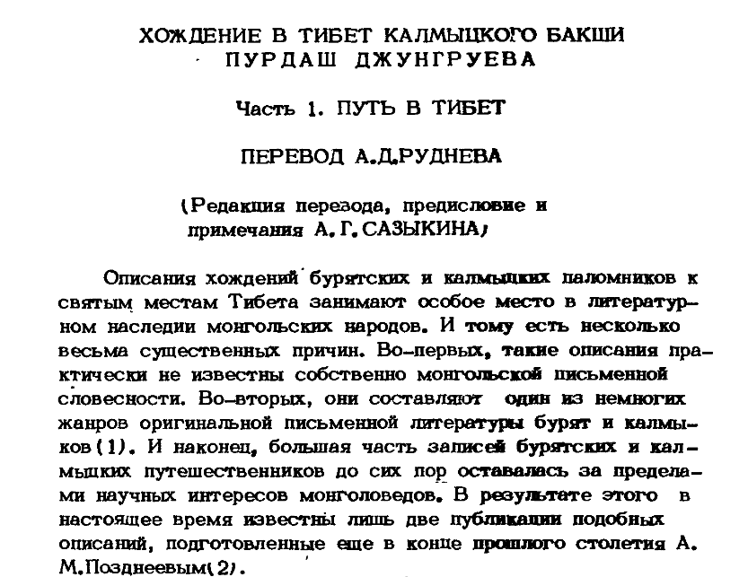

## Введение

**Пурдаш Джунгруев**, калмык, паломник совершивший два путешествия в Тибет и достигший Лхасы. Первое, вместе с [Овше Норузновым](/notes/norzunov-route/), 5.10.1898 отправились из Урги, в марте 1899 прибыли в Лхасу. Второе, самостоятельно, 05.02.1902 выехали из дома, 21.09.1902 прибыли в Лхасу. В отличие от Норзунова, который сам ничего не написал и [рассказ которого](/notes/deniker-norzunov/) был записан Деникером, Джунгруев оставил дневник.

Здесь можно найти распознанный и отредактированный текст дневника Джунгруева. Номера страниц и разделение по страницам как в оригинале сохранены. Исправлено несколько явных опечаток. В оригинале отсутствует сноска #3.

К сожалению, вовремя не смог найти [распознаный текст на vostlit.info](https://www.vostlit.info/Texts/Dokumenty/China/XX/1900-1920/Jungruev_1902/frametext1.htm), поэтому работу получает продублировал, получилась полностью альтернативная версия.

* Библиографическая ссылка: Хождение в Тибет калмыцкого бакши Пурдаш Джунгруева. Часть 1. Путь в Тибет. Пер. А. Д. Руднева. Редакция перевода, предисловие и примечания А. Г. Сазыкина. // Филологические исследования старописьменных памятников. Элиста, 1987. С. 125-144.
* [English translation](/notes/jungruev-route-tibet-en/)
* [Скачать](https://drive.google.com/file/d/1j6UKq8ENlMSDJrcxNBC_1S91dmnY0CHX/view?usp=sharing)

## Содержание

КАЛМЫЦКИЙ НАУЧНО-ИССЛЕДОВАТЕЛЬСКИЙ ИНСТИТУТ ИСТОРИИ, ФИЛОЛОГИИ И ЭКОНОМИКИ ПРИ СОВЕТЕ МИНИСТРОВ КАЛМЫЦКОЙ АССР

ФИЛОЛОГИЧЕСКИЕ ИССЛЕДОВАНИЯ СТАРОПИСЬМЕННЫХ ПАМЯТНИКОВ

Ответственный редактор доктор филологических наук П. Ц. БИТКЕЕВ

Элиста - 1987

ХОЖДЕНИЕ В ТИБЕТ КАЛМЫЦКОГО БАКШИ ПУРДАШ ДЖУНГРУЕВА

Часть 1. ПУТЬ В ТИБЕТ

ПЕРЕВОД А. Д. РУДНЕВА

(Редакция перевода, предисловие и примечания А. Г. САЗЫКИНА)

Описания хождений бурятских и калмыцких паломников к святым местам Тибета занимают особое место в литератур­ном наследии монгольских народов. И тому есть несколько весьма существенных причин. Во-первых, такие описания пра­ктически не известны собственно монгольской письменной словесности. Во-вторых, они составляют один из немногих жанров оригинальной письменной литературы бурят и калмы­ков ([1](#id1)). И наконец, большая часть записей бурятских и кал­мыцких путешественников до сих пор оставалась за предела­ми научных интересов монголоведов. В результате этого в настоящее время известны лишь две публикации подобных описаний, подготовленные еще в конце прошлого столетия А. М. Позднеевым ([2](#id2)).

Наибольший интерес представляет, несомненно, публика­ция дневника путешествия База-бакши. Дело в том, что это наиболее интересное и подробное описание среди всех изве­стных нам записей паломников. И кроме того, воспроизведен­ный А. М. Позднеевым ойратский текст рукописи остается до­ныне единственным письменно зафиксированным образцом со­чинений такого жанра, бытовавших прежде у калмыков. Судь­ба оригинала, по которому А. М. Позднеев подготовил свое из­дание, нам не известна. Вероятнее всего, он безвозвратно утрачен. По крайней мере, в ленинградских коллекциях нам не удалось его обнаружить, как, впрочем, не нашли мы там и каких-либо иных описаний путешествий, составленных на заяпандитском "ясном письме". Однако следы еще одного та-

125

кого описания, оставленного калмыцким ламой, ходившим на поклонение в Тибет, обнаружились в Архиве Ленинградского отделения Института востоковедения АН СССР. Это перевод дневника калмыцкого бакши Пурдаш Джунгруева, хранящийся в фонде А. Д. Руднева.

Причем, как выясняется, это дневник уже второго путе­шествия П. Джунгруева, предпринятого им в 1902-03 гг. Меж­ду тем, и в свое первое паломничество, состоявшееся в 1898-­1900 гг., он также вел дневник, который, однако, по словам автора, был украден на обратном пути. Поэтому о первом пу­тешествии сохранились лишь самые краткие сведения, поме­щенные в начале второго дневника.

На обложке упомянутого перевода находится пометка, из которой явствует, что выполнен он был А. Д. Рудневым "при любезном содействии С. Б. Баянова" летом 1904 г. в Сарепте. Сам же калмыцкий оригинал в собрание тогдашнего Азиатско­го музея не поступал. Судя по всему, нет его теперь и в Калмыкии ([4](#id4)). Так что, названный перевод остается единст­венным следом этого интересного и важного памятника кал­мыцкой литературы. В результате, при подготовке перевода к изданию мы были лишены возможности сверить его с текс­том подлинника, что, надо заметить, порой было бы весьма кстати, поскольку перевод выполнен подстрочно, совершенно не обработан и потому местами не вполне понятен. Отсутст­вие оригинала вынудило нас также неукоснительно следовать содержанию перевода, хотя бы там и возникали повторы или же у нас появлялись сомнения в точности его. Таким обра­зом, мы позволили себе только переработку черновика (како­вым в сущности являлся рудневский перевод) в связный рус­ский текст с необходимыми стилистическими коррективами. В большинстве своем сохранены дополнения и пояснения пере­водчика (помещены в круглые скобки). Опущена лишь транс­крипция ойратских слов, в некоторых случаях проставленная в переводе. Интерполяции, внесенные в перевод при редакти­ровании, заключены в квадратные скобки. Разделение описа­ния путешествия П. Джунгруева на две части осуществлено при подготовке к публикации в журнальном варианте.

Перевод А. Д. Руднева снабжен кратким и самым необходи­-

126

мым комментарием. Более подробные сведения о Тибете то­го времени можно найти в труде Г. Ц. Цыбикова "Буддист-па­ломник у святынь Тибета" (Избранные труды, Т. 1, Новоси­бирск, 1981). Наиболее полный, основанный на строго науч­ном, богатом материале очерк истории, культуры, религиоз­ных верований и быта тибетцев представляет книга Е. И. Кы­чанова и Л. С. Савицкого "Люди и боги страны снегов" (М., 1975).

## МАРШРУТ (ОПИСАНИЕ) ПУТЕШЕСТВИЯ В ТИБЕТ

НОМЧИ-ЦОРДЖИ-БАКШИ ПУРДАШ ДЖУНГРУЕВА

ПЕРВОЕ ПУТЕШЕСТВИЕ

В 1898 г. (год собаки, 17-го числа месяца собаки ([5](#id5)) я выехал из дома в Тибет. Причина моей поездки в Тибет следующая. Прежде Йогучар-цзурачи ([6](#id6)) и Цзайсан ([7](#id7)) из ро­дов богдо-шабинарова и мамут /мамадут/-шабинарова добра­лись до Тибета и представились Далай-ламе и Панчен-богдо ([8](#id8)). От обоих гэгэнов /они/ удостоились получить грамо­ты, печать, предметы поклонения, бурханов ([9](#id9)) и много /дру­гих/ тому подобных благословенных вещей.

8-го числа первого месяца года воды и собаки согласно милостивому повелению возвели храм (хурул) и потому хурул называется "богдинским". /Вот/ Причина, почему он на­зывается "шабинаровым". Они стали шабинарами ([10](#id10)) двух богдо (Далай-ламы и Панчен-эрдэни). По русскому летоисчисле­нию этот хурул воздвигли в 1681 г. ([11](#id11)). Поэтому я и отправи­лся в Тибет, чтобы довести об этом до сведения двух богдо.

Я в товариществе с больше-дэрбэтовским цзайсаном Норбуновым, заехав по пути в монастырь монгольского богдо (Ургу), приехали в ставку (хурэ) халхаского южно-пограничного Лун-бэйсэ. Затем по пути посетили китайский город Нaнашь, /Проехав/ через Табун-цайдамский хошун Курлук, достигли крайних пределов /расселения/ верхних монголов ([12](#id12)) в хошунах ([13](#id13)) Гурбан-найчжи и Тайчжинар.

Далее, миновав /горы/ Хухэ-шил, Дун-бурэ, /озеро/ Яндын-нур, /горы/ Набчитай-ула, Бухэ-магнай, /реку/ Мурсэ-

127

йн-гол, /горы/ Гурбан-хабцагай, Дан-ла-ула, Бум-цзай-шип, мы прибыли в /монастырь/ Нагчу-гонба. Здесь граница Тибе­та. Отсюда пришли в Цзу ([14](#id14)).

Явившись, поклонились двум цзунским предметам поклоне­ния ([15](#id15)), Далай-ламе, Панчену и прочим великим /ламам/. Ко­гда тем /великим ламам/ подробно доложили об основной це­ли /своей поездки/, то мне пожаловали грамоту, печать, бур­ханов и прочее. Когда, отправившись обратно на родину, прой­дя по /дороге/ Бурхан-буддайин-цзам через хошун Курлук, но­чевали в китайском городе Шилзу, у нас украли все бывшие у нас вещи. Оттуда через /земли/ эцзингольских торгутов прибыли в Ургу. Эти дороги, по которым я шел туда и обрат­но, приблизительно на месяц /пути/ короче, чем если бы я шел через /монастырь/ Гумбум. Отправившись из Урги 27-го числа месяца зайца ([16](#id16)), в год мыши (1900 г.) я прибыл до­мой.

Путевой дневник, который я писал в это первое мое путе­шествие, был украден ворами. Поэтому я только вкратце опи­сал маршрут. Подробно изложу свои путевые заметки второго путешествия.

## ПУТЕВОЙ ДНЕВНИК ВТОРОГО ПУТЕШЕСТВИЯ В ЦЗУ - ТИБЕТ

Так как в первое путешествие грамоту, печать и прочие веши, бывшие у нас, украли, то я решил снова отправиться сам, взяв в спутники своего однородца Котика Мушеева.

В 1902 году (год барса) 5-го числа месяца дракона ([17](#id17)) выехав из дома. 13-го числа весеннею месяца змеи ([18](#id18)) до­шли до города халхаского монгольского богдо ([19](#id19)) (Урги). Тут мы разменяли взятые нами из дома бумажные деньги на китайские ланы ([20](#id20)), давая по 2 руб. 30 коп. за лан. Деньги нашего царя отсюда дальше не имеют хождения. В прежнюю поездку мы меняли лан серебра за 1 руб. 75 коп. Лан - это на наши деньги два белых /т.е. серебряных/ рубля. Сговори­вшись идти отсюда с тремя бурятами, мы, таким образом, чи­слом в пять человек стали искать трех верблюдов и лошадь, а буряты четырех верблюдов, чтобы нанять за деньги. При-

128

­шедший в Ургу для поклонения лама по имени Рабдан из рас­положенного к юго-западу от Урги хошуна Гоби-тушэ-дай-гуна договорился с нами, что доставит до баянгольских торгутов. Наняли /у него/ верблюдов по 8 лан. Навьючили 7 верб­людов. Четыре человека сели на них, а я поехал верхом на лошади. Отсюда до земли эцзингольских торгутов считаются 21 сутки пути. Некоторые люди нанимали верблюдов по 16-17 лан. /Но/ так как дом /Рабдана/ находится по пути, то нам /эта часть пути/ обошлась дешево.

В Урге раздобыли в достаточном количестве всякие доро­жные принадлежности - майхан ([21](#id21)), юрту, котлы, дорожный провиант, монгольскую одежду и прочие необходимые вещи и 20-го числа месяца змеи выступили /в путь/. Перейдя через перевал Турагуни-хуцзубчи, заночевали у его подножья.

21-го перевалили Бухэ-даба и полдничали на реке Бухэгийн-гол. Выступив /оттуда/ под вечер, ночевали в Намдане.

22-го выступив рано, перешли Гангийн-даба. Полдничали у /его/ подножья. Под вечер прошли /еще/ 7-8 верст, но ко­гда пошел снег, остановились ночевать.

23-го была пурга. Мы дневали. В майхан и юрту врыва­лась пурга и не было даже топлива для /поддержания/ огня. Мы варили пищу, собрав помет прошедших по дороге лошадей. Поблизости юрт и людей /не было ?/. Когда мы выходили из Урги, земля была черна, но ночью была пурга.

24-го утром тронулись /в путь/ и перейдя Сэртэнгийн-даба, полдничали у /его/ подножья. От самой Урги /проложена/ большая дорога и мы идем /по этой/ дороге. Большая дорога идет до самого города Шицзу (-хото).

25-го утром пошли. Перейдя маленький перевал, полдничали. Вечером перевалили через восточный край горы Баяр. Пе­ревалили /также/ Ногон-хотол и у южного подножья его за­ночевали.

26-го утром пошли. Полдничали на реке Адакчигин. Под вечер /снова/ пошли. Заночевали в хошуне Уха-баян.

27-го пойдя с утра, полдничали на южной окраине хошуна Баян. Вечером заночевали на реке Булуктыйн. Это местность, где есть родники (булук).

28-го дневали.

129

29-го пошли. Подойдя к маленькому монастырю под названием Хадан-усун, заночевали.

30-го утром пошли в местность Ухай-худук. Там непода­леку от дома Рабдана, ехавшего с нами по-договоренности, остановились. Двое или трое суток продневали. Переменив нам подвижной состав... /фраза не окончена/.

3-го числа месяца лошади ([22](#id22)) тронулись /в путь/ и заночевали у вод /реки/ Будургуна.

4-го утром пошли. Полдничали у рукава реки Баян-гол. Вечером двинулись /дальше/ и заночевали у Хухэ-обан-сучжэ.

5-го утром дневали. Полдничали у Дэлгэрэху-обан. Вече­ром пошли. Ночевали на Хабирга.

6-го утром полдничали на Унэгэн-обан. Вечером пошли /дальше/ и заночевали на реке Унгин, вблизи от монастыря Дай-тушэ-гуна. Отсюда к югу зимой снег не выпадает. Те­плая страна! Мы идем по монгольской стране. В этой мон­гольской стране хлеба не сеют. Кочуя в войлочных юртах и пася скот, живут от скота. Говорят, что если идти по до­роге, которой мы идем, то через /горы/ Гурбан-сайхан дой­дешь до Шидзу. /Вот/ причины, почему мы пошли по этой дороге: 1. Ни вода, ни трава, ни население /здесь/ не пре­рываются и это самый прямой путь в Цзу. 2. Ночью нет воровства и мы идем, не карауля ночью поклажу и животных. В прошлую поездку я шел через аймак Сайн-нойон мимо монастыря Лунбэйсэ. Та дорога, во-первых, окольная, /во-вторых/ с воровством и, наконец, мы шли, нуждаясь в траве и воде /для скота/.

7-го утром вышли и пошли вниз по реке Анги и на бе­регу ее полдничали. Вечером тронулись /в путь/ и заноче­вали на берегу Дэрэсту. Эта река с проточной водой.

8-го утром пошли. Полдничали у /реки/ Хаян. Пойдя

130

/дальше/ вечером, ночевали у черной воды Хаян. Тут реши- пополнить провиант.

9-го дневали.

10-го утром тронулись /в путь/. Перевалили Шугун-унэгэт и полдничали на Улан-толгой. Вечером /снова/ тронулись /в дорогу/. Заночевали в Далай-булуке.

11-го утром выехали. Полдничали на Шара-ширэту. Вече­ром тронулись /в путь/. Перевалили через горы Гурбан-сай­хан по средней из трех гор Сайхан и заночевали у её подно­жья.

12-го утром пошли. Полдничали на границе Гоби. Вече­ром тронулись /в путь/. Ночевали у Холей-холдун-хали.

13-го утром пошли. Перевалили гору Баян-хотол по вос­точному отрогу и вышли на дорогу, ведущую в город Шицзу. От Гурбан-сайхан досюда дороги нет. Мы шли без дороги. Полдничали у колодца Цаган-дэрэсний-худук. Вечером трону­лись /в путь/ и ночевали в Гоби.

14-го утром пошли. Пройдя через Булган-гоби, полднича­ли среди гор Дэнгин-хэр. В этом месте есть дикие козы, на­зываемые "янгир яма". Вечером тронулись /в путь/. Заноче­вали в горах Урту у колодца Халиган-худук. От Гурбан-сайхан досюда, до хошуна Баддан-цзасака, и от него к югу до эцзингольских торгутов - населения нет. Все гобийская пус­тынная местность. Здесь /проходит/ южная граница страны халхаских монголов.

15-го утром вышли и полдничали у колодца Цохондо. Ве­чером /опять/ пошли и заночевали на Кисэтэй-толгой.

16-го утром вышли и полдничали у двух колодцев среди гор Бурхэрин-хэр. Вечером пошли /дальше/ и заночевали у колодца Цзагийн.

17-го утром выехали и /перевалив/ через Хигэр-обо, полдничали у колодца Балбурху. Запасшись водой, вечером вышли отсюда и заночевали в безводной степи. Здесь много топлива, называемого "цзак" ([23](#id23)). (Очень) много верблюдов и антилоп. /Эти животные/ к людям не приближаются. Мы видели их издали в бинокль. Много и так называемых кула­нов (диких лошадей) /диких ослов/. Множество диких цзэрэнов ([24](#id24)) и лошадей.

131

18-го утром полдничали на северной стороне озера Дэнчжи. Противоположного берега озера не видно. Большое озе­ро! Вода в нем горькая. Озеро, в которое впадает вода Цзэни-гол, называется Бэлчир-нур. Вблизи этого озера травы нет. /Только/ белый гобийский песок. Вечером тронулись /в путь/. Миновав Боро-обо, заночевали у Модон-гатлага (у деревянной переправы). Здесь конец реки Эцзин-гол. Вода в ней проточная, вкусная. Множество дикорастущих деревьев и тростника. Пределы его /Гоби?/ очень велики. Здесь /прохо­дит/ граница /расселения/ эцзингольских торгутов-калмыков. От /кочевий/ халхаских монголов и досюда населения нет. Местность без гор - ровная, степная, пустынная.

19-го утром вышли. Полдничали в Галцзан-борок. Вечером пошли /дальше/ и, придя в земли торгутского князя, бывшего /в то время/ в Даши-бан, тут и остановились. Этот князь имеет около 200 дымов ([25](#id25)). /Всё/ это люди, отделившиеся от торгутов, перекочевавших с нашей реки Волги. Они посто­янно живут /среди/ камыша и саксаула. Хлеба не сеют. Кочу­ют в войлочных юртах и живут скотоводством. Если в их зе­млях и сеют хлеб, то проводят воду /т.е. орошают/. Говорят, что вдоль всей этой реки Эцкин-гол от устья до истока рас­тут камыш и деревья. Говорят /еще/, что она очень широка. В стороне от реки ровная степь. Травы нет. /Только/ белые пески. Зимы здесь не бывает и /потому/ сена не косят. Оде­жда их и всякое имущество совершенно схожи с нашими. Рас­сказывают, что они приносят жертвы огню (поклоняются огню). По виду - монголы. Xухэнурские монголы также поклоняются огню. (По обыкновению калмыков, при подношении жертвы ог­ню, берут череп, обгрызают, а в пустые дыры напихивают сало). 22-го /числа/ последней зимней луны они приносят жер­твы маньчжурскому хану /императору/. Большинство же совер­шает жертвоприношения весной во время рождения скота. В са­мом начале /путешествия/, когда нанимали подводы из Урги, договаривались, что они /возчики/ довезут нас до этого кня­зя. Этот торгутский князь принял нас как родственников. Счел гостями и хорошо устроил. Пополнил наши запасы провианта и (дал отдохнуть). И /потом/ на своих подводах бесплатно доставил нас в Шицзу-хото.

132

5-го числа первого летнего месяца утром двинулись /в путь/. Полдничали в "оболцзоне", /в зимовье/. Вечером за­ночевали в Дабусун.

6-го утром пошли. Полдничали на /берегу/ реки Нарин. Вечером поехали. Ночевали у реки Морин.

7-го утром отправились. Полдничали на /берегу/ реки Мо­рин. У этой реки множество торгутских домов (юрт). Торгут­ский князь отправил нас только на верблюдах и в проводники дал старика по имени Цзоман. Ночью двинулись /в путь/ и перевалив по восточной стороне гору Хухэ, на южной стороне ее, в излучине реки Буха заночевали. Все /это время/ мы шли по дороге.

8-го утром отправились вдоль реки. Дойдя до дома чело­века по имени Буян-ольцзейту, стоящего у верхней границы /кочевий/ торгутов, живущих по Цаган-тохой, полдничали. Ка­мыша и деревьев южнее этого /места/ нет.

9-го утром отправились и полдничали в Ихэ-дорболчжин. Вечером двинулись /в путь/. Миновали китайский город Тэнгчин-хото. Заночевали в Лонко-обо. Здешний народ живет в ки­тайских домах, сеет хлеб и кормит /им/ город. Хлеб сеют, проводя (по пашням/ воду. Сеют /также/ много риса.

10-го утром выехав, полдничали, подойдя к дому одного торгута, содержащего почту торгутов, живущих на Толе. /Ос­новное население/ - это китайцы. Лошади /здесь/ редки. Ис­пользуют ослов. Землю пашут сохой. Вечером поехав, заноче­вали среди китайских хлебопашцев в городе Тэнчжу. Эти ки­тайцы воры и мы ночью караулили.

11-го утром двинулись /в путь/. Все время шли мимо /селений/ китайцев. Полдничали в Дан-лоло. Вечером пойдя /дальше/, мы прошли через китайский город Чжин-тайчжи. Тут находится таможня, где досматривают все вещи. Если окажутся товары и чай, то их отбирают. Отправившись дальше, мы заночевали вблизи от китайских домов в Ё-ёнчжу.

12-го утром выйдя /в дорогу/, миновали маленький китай­ский город Лин-шо и на берегу реки полдничали. Вечером /cнова/ пошли и прибыли в город Шицзу. Остановились в го­стинице, /называемой/ "дян". По-нашему это значит - "дом

133

для ночевки людей, постоялый двор". Город Шицзу - большой город с большой крепостью, где расположено большое присут­ственное место. В этот город летом и зимой приезжают халхасы и верхние монголы за мукой и всякой всячиной. здесь /ведутся/ очень большие торговля и обмен. Китайские лавки очень маленькие и там не бывает много товаров. Продают много муки. В этом городе мы наняли китайских верблюдов по 5 лан. Договорились, чтобы нас доставили до местности Сэртэн - границы хошуна верхних монголов Курлук.

16-го вечером тронулись в путь. Переночевав в дороге семь раз, достигли северной границы верхних монголов у се­верных склонов снежной горы Хашхар. Здесь окраинные посе­ления хошуна Курлук. Тут мы ночевали семь суток. Выехав /из/ местности Цзок, через семь суток перевалили через гору Хотол-даба и пришли в Сэртэн.

Вода в Тогорок-икэ-нур (большом круглом озере) вкусная. Травы хороши. Тростника и деревьев нет. Народа в хошуне Курлук около 100 дымов. Они кочуют в войлочных юртах, занимаются скотоводством и живут от скота. Хлеба не сеют. Снега зимой не бывает - тепло. Овцы ягнятся дважды в год. Денег /здесь/ мало. При установлении цен на покупки договариваются в овцах. Полотняных одежд мало. Летом и зимой носят одну /и ту же/ одежду из овечьей шкуры, подобрав верх до колен и подпоясав. Под низом рубашек не носят. /Верхнюю одежду/ надевают прямо на голое тело. Как в одежде, так и во всех других вещах они подражают тангутам. По словам стариков, прежде их одежды были, как у монголов, но теперь стали такими благодаря близости к тангутам. Вот причина, почему верхних монголов называют Табун-цайдам. Пять их хошунов: Курлук, Хухэд, Барун, Цзун, Тайчжинар - называют пять цайдам, а также верхними монголами. Здесь /мы/ наняли 15 лошадей по 3 лана и договорились, чтобы нас до­ставили до местности Хачжир, где находится князь хошуна Тайчжинар.

20-го числа средней летней луны мы выступили /в дорогу/ на одних только лошадях в сопровождении двух человек, продневали на Цзаху-ширэк. Вечером пошли. Перевалив гору Даба, остановились на ночлег.

134

21-го выйдя с утра, /двигались/ без полдничания. Зано­чевали на /озере/ Восточный Майхан на северном его бере­гу.

22-го тронувшись /в путь/, заночевали на южном берегу озера Барун /Западный/ Майхан. Тут мы сговорились /идти дальше/ с курлук-хошунскими Батанчжи-цзанги ([26](#id26)) и Цомпил-дзайсаном, тоже собравшимися в Цзу. /Свое имущество/ они навьючили на трех верблюдов, а сами ехали верхом на двух лошадях. Мы же в Хачжире наняли верблюдов по 19 лан и лошадей по 7 лан с тем, чтобы нас доставили до Нагчу-гонба - границы Тибета. Здесь мы встретились /еще/ с се­мью огнями людей, ехавших в Тибет.

23-го двинулись /в дорогу/. Перевалив /гору/ Янбар, за­ночевали. Здесь мы в течение двух дней собирали топливо воду. Нам говорили, что на этом песчаном плато Янбар нет ни травы, ни воды и если наступит жара, то животные погибнут от жажды и перейти /будет/ трудно. Чтобы перейти, просят колдунов ниспослать прохладу. На наше счастье было прохладно и мы спокойно перешли.

24-го двинулись /дальше/ и перевалив так называемый Булдурун-янбар, заночевали на берегу реки Гакца-амарак.

25-го тронулись /в путь/. Ночевали в так называемом "оболцзоне" - окраине зимника тайчжинаров. Здесь много деревьев сухай ([27](#id27)) и хармаг ([28](#id28)).

26-го двинулись /дальше/. Ночевали возле /реки/ Шара-усун.

27-го вышли. Полдничали на /берегу/ реки Шара-усун. Остановились в Цзогасту. Здесь айлы ([29](#id29)) хошуна тайчжинаров. Тут мы соединились с семью огнями людей, направляю­щихся в Цзу. Здесь проходит наикратчайшая дорога в Цзу. Обычно путешественники, собравшись вместе и запасшись про­виантом и средствами передвижения, отправляются отсюда в Тибет. Отсюда до самого Цзу /пролегла/ безлюдная, пустын­ная местность. 30-го нас здесь догнали договорившиеся /ид­ти/ с нами Батучжаб-цзанги и Цомпил-цзайсан из хошуна Ку­рлук. Всего нас собралось 15 огней. У верхних монголов цзайсаном называется /любой/, кто отдаст князю верблюда, лошадь, шубу и деньги. За это князь всякому простолюдину,

135

имеющему скот и кибитку (женат), жалует титул цзайсана.

Тангутский народ, живущий по берегам озера Хухэ (-нур), нападает числом в 200-300 человек на верхних мон­голов и силой отбирает весь скот и нужные вещи, находящи­еся в юртах. Одежда их одинакова с верхне-монгольской. Их называют также "рангай". Эта верхне-монгольская земля изобилует деревьями, /называемыми/ сухай и хармаг. Вода /здесь/ хотя и хорошая, но трава не хороша. Земля, говорят, хучжирная ([30](#id30)), солонцеватая, и хлеб не растет. Китайцы, при­ходя в их горы, добывают много золота и серебра. Олова и свинца тоже много. Эта /местность находится/ к юго-западу от города Шицзу. В северо-восточной стороне от города Шицзу расположен маленький городок, именуемый Цзайекба. К югу от него в горах есть много каменного угля и нефти (ке­росинового масла). В горах халхаских монголов, в отрогах гор и в реках верхних монголов много золота и серебра. Мно­го золота добывается в реке Шарын-гол /в местности/ Гур­бан-найчжи. Добывают /в ямах/, вырытых в рост человека. Много золота в курлук-хошунской реке Халтагийн-гол и в бага-цайдамской Гунчин-гол. Хотя эти хухэ-нурские монголы и считаются подданными китайского императора, но китайских правителей /у них/ нет. Большинством народа управляют свои князья. Воровства /меж них/ нет - сами этим не зани­маются. Разве что нападут рангай или голоки ([31](#id31)). Сами же /монголы/ этого не делают.

4-го числа последнего летнего месяца /мы в количестве/ 15 человек выступили /в путь/. Полдничали на /реке/ Морин. Вечером заночевали на Толган-амга. Здесь продневали двое суток. Мясо, предназначенное для навьючивания на вер­блюдов и лошадей, /приготовили/, нарезав /на длинные куски/. /Затем/ взяв с собой вьюки, мы выступили /в дорогу/. Мест­ность здесь страшная - жара. Масло и свежее мясо есть нельзя. Наша пища: кашица /буда/ с вяленым мясом, чер­ный чай и черная цзамба ([32](#id32)). Идем, варя себе утром и вече­ром отвар-лекарство, чтобы сделать члены более легкими. То­гда утомленный и малокровный /человек/, идущий по этой страшной местности, исцеляется. Тучному же и полнокровному человеку будет худо. Из наших 15 огней, одни с лошадиными

136

вьюками, другие с верблюжьими.

7-го вечером пошли. Перевалили через Уман-ама и за­ночевали в долине /реки/ Нарийн-цзухайн.

8-го пошли. Полдничали на реке Нарийн-цзухайн (гол). Заночевали между гор в Харман-тохай. Эти горы называют Цзухайн-хотол. Высшая из них - большая снежная гора. Её величие весьма сурово и грозно. Этот, так называемый Хачжирийн-цзам - самый западный, вновь проложенный путь. Ес­ли идти по этой дороге, то /придешь в/ местность, куда не заходят разбойники-голоки. Говорят, что народ, называемый голоками, живет к востоку от тибетской дороги, в месяце пути от гор Дун-бурэ. Это, говорят, северо-восточная окра­ина /кочевий/ верхни х монголов. /Есть/ три местности (в которые приходят) и грабят голоки: Хухэ-уул, Дун-бурэ и Морос. У этих голоков одежда и язык как у народа рангай. Живут в черных шатрах. В семи днях пути к востоку от это­го Хачжирийн-цзама находится дорога Гурбан-найчжин-цзам. От нее в семи днях пути к востоку - Бурхан-буддайин-цзам. Все это дороги, ведущие прямо в Тибет. Гурбан-найчжинская и бурхан-буддайская дороги соединяются у реки Морийн-гол. Хачжирийнская дорога соединяется (с ними) у горы Данлэн. Голокские разбойники особенно сильно нападают на бурхан- буддайской дороге.

9-го пошли и, идя вверх по реке Нарийн-цзухайн, полдни­чали. Вечером пошли. Пройдя вверх по этой же реке, заночевали.

10-го дошли. Заночевали у ближнего подножья горы Цзухайн-хотол. Здесь есть дикие быки. И вообще, суровость и опасность этих мест весьма значительны. Мы идем здесь как враги - с ружьями, (копьями) и другим оружием. В этих горах /есть/ дикие овцы, называемые "аргал-гёресн". ([33](#id33)). /В этот день/ пошел снег, поднялась пурга и мы идем, одев по-зимнему шубы и завязав башлыки. Несмотря на лето, такие трудности! Начиная с осени и до весны лю ­дям /здесь/ идти невозможно. Кроме того, что во время снегопада /наступает/ сильный холод, /так еще/ одолевает и ужас, и потому человек, легко идущий летом, во время холо­дов, случается, умирает от ужаса. Этот перевал называется

137

Гончжин-хотол. С самого начала, /еще/ только подойдя к этому перевалу, люди от ужаса идут больными. Некоторые, не будучи в состоянии сидеть /верхом/, едут прикрытые на верблюдах. Хорошие доктора пускают у больных кровь из черных конечностей, и дают лекарства. Так и идут. Если кто-либо заболевает на этой цзуской дороге, то его не ждут. До /самой/ смерти везут его, прикрыв на подводе. И на том месте, где умрет, - оставляют. А некоторых, кажется, бро­сают даже живыми. Вот причина, почему одни не ждут дру­гих. /Идущие/ распределяют запасы /провианта/ на путь от верхних монголов до границ Тибета и боятся, что если про­медлят хоть один день, то может не хватить. Мы же идем благодаря милости многих высших /святых/. Идем бесстраш­но. Ежедневно каждый человек вслух беспрерывно читает /молитву/ "Санг сэрчжим". Если /некоторые/ люди умирают от ужаса, то и другие перестают верить, что дойдут живыми. Размышляя о смерти и помолившись многим высшим /свя­тым/, идут, готовясь к смерти. Этот ужас возникает оттого, что местность очень возвышена и вредоносна из-за /расту­щей здесь/ ядовитой травы. Человек, пораженный страхом, тяжело болеет. Грудь /его/ спирает, /он/ кашляет, лицо си­неет и, наконец, / когда забиваются легкие, человек умирает. Некоторые, будучи утром поражены /болезнью/, к полудню умирают. Некоторые, с вечера поужинав совершенно здоровы­ми, умирают к полночи. При этом страхе /есть/ масло и сало вредно. Полезна легкая, нежирная пища. Некоторые хо­тя и выздоравливают, но долго недомогают - лица /остаются/ посиневшими и кашляют.
Халхаские и верхние монголы, будь они в степи или дома, кроме того, что перебирают руками чётки или читают вслух молитвы, (ничего более не делают). Никакой /пустой/ бол­товни тут нет. Благоговение великое. В каждом их доме есть бурханы, священные книги, жертоприношения и лампады.

11-го пошли. Перевалив Хотол-обо заночевали.

12-го пошли. Полдничали на берегу озера Хара-нур. Ве­чером пошли. Ночевали у Гончжин-хотолийн-ара.

13-го перевалив Хотол, ночевали на северном берегу /озе­ра/ Шара-нур. Это безгорная, степная местность.

138

14-го пошли. Ночевали на южном берегу /озера/ Шара-нур. Здесь нас догнали два огня людей из тайчжинаров и нас стало 17 огней.

15-го пошли. Заночевали, перейдя маленький перевал Нарин-хотол. Здесь есть трава, называемая "буху ширик" ([34](#id34)). Когда коротенькие стебли травы высохнут, то никто бы не сказал, что даже глупый скот стал бы это есть, но (несмот­ря на это) здесь пасется много скота.

16-го утром отправившись /в путь/, мы заночевали у выхода из ущелья Барун-удурийн горы Хухэ-шил. Здесь мы идем, всматриваясь вперед, озираясь и останавливаясь с большой опаской. Здесь и дальше впереди, бывает, нападают разбойники-голоки.

17-го отправились /в путь/. Перевалив Хухэ-шил, мы зано­чевали в так называемой Галцзу-улан-морин /Хапчик-улан-мурэн/ по эту сторону Дун-бурэ.

18-го отправились /в путь/ и заночевали в северной па­ди Дун-бурэ.

19-го ночевали в средней /части/ Дун-бурэ.

20-го тронулись /в путь/. Опять ночевали в /пади/ горы Дун-бурэ.

21-го миновав Дун-бурэ, заночевали в степи с южной её стороны.

22-го переправившись через реку Набчитай-улан-мурэн, заночевали на южном её берегу. Эта река очень опасна. Ло­шади, случается, падают. Но благодаря низкой воде было хо­рошо (переправились благополучно).

23-го мы ночевали в северной пади горы Буху-магнай.

24-го перевалив Буху-магнай и выйдя на северный берег реки Мурэн /мурэс/, заночевали. Здесь соединяются три /до­роги/: Бурхан-буддайин-цзам, Гурбан-найчжи-цзам и дорога, по которой мы шли - Хачжирийн-цзам. Здесь с нами соедини­лись 15 огней цзулачинов ([35](#id35)), шедших по дороге Гурбан-найчжи. Итого /нас/ стало 32 огня. От монастыря (от Да-хурэ) ([36](#id36)) дорога, по которой мы шли, самая короткая. Она почти на месяц /пути/ короче, чем если ехать через Гумул-хит.

25\. Вода в реке Мурасин /Мурсэйн/(-гол) сравнялась с

139

берегами. Переправились ниже по берегу, там, где вода по­крывала /только/ круп лошади. Так как /с нами/ шли люди, бывавшие /здесь/ несколько раз прежде и /потому/ знавшие этот путь, то найдя мелкое место, мы и переправились бла­гополучно. Иногда вода бывает очень высока, и тогда сообще­ние /по этой дороге/ прерывается до месяца.

26-го тронулись /в путь/. Ночевали у /горы/ Адак-хабцагай. Дальше этого места, говорят, разбойников-голоков не бывает. /Но/ рассказывают, что на ближайшей окраине Тибе­та появляются ночные грабители, называемые "банак" ([37](#id37)). Они, говорят, грабят ночью. Поэтому мы идем, карауля по ночам. Топлива совсем нет. Для /приготовления/ пищи, /на топливо/ добываем корни, вырывая их из земли. От самых верхних монголов не прекращаются дожди и сырость. Помимо того, что не хватает топлива и приходится идти, питаясь чер­ным чаем и черной будой, утомились настолько, что невозмо­жно сесть на лошадь.

27-го ночевали в верхней пади /горы/ Адак-хабцагай.

28-го ночевали в Дунд-Хабцагай.

29-го /ночевали/ в Эхин-Хабцагай.

30-го ночевали на /берегу/ озера Улан-нур.

1-го числа первого осеннего месяца ночевали в нижней части Хитэн-ширга.

2-го ночевали на северном склоне горы Данлан /Дан-ла/ Эту гору Данлан называют также Убаши-абгай /Убаши-хайрхан/. Вообще-то, прежде чем перевалишь через все эти горы, не принято произносить их названия. Если произнесешь, то (во время перевала) пойдет снег и будет пурга. Опасность этой горы очень велика, и многие идут, испытывая сильный страх. Лошади и верблюды тоже идут напуганные.

3-го перевалив Убаши-абгай, ночевали на /берегу реки/ Халун-усун. В этой Халун-усун, в самой реке, есть заострен­ный камень /высотой/ около двух аршин, из которого на ло­коть вверх бьет струя воды.

4-го шли вниз по реке Бокшигин. Ночевали на Буху-ширик /Хуйтун-чирик/. Здесь /живут/ так называемые банаки с черными шатрами. Они пасут скот и живут от скота. Посевов нет. Кочуют в шатрах. Это граница Тибета. Это очень воров­ской народ, ворующий по ночам. Коровы их - сарлыки ([38](#id38)), -

140

с длинной шерстью, похожи на черных верблюдов, а хвосты как у лошадей. Овцы белые, с черными головами. Лошади ре­дки. Верблюдов нет совсем. Дальше отсюда опасных мест нет. Взяли здесь еды (провианта). /Тут/ изобилие масла и сыра. Кумыса у тибетцев тут нет совсем, а тарака ([39](#id39)) пьют мно­го. Зимой и летом носят одну шубу, подбирая её, как верхние монголы. Волосы... /в переводе пропуск/... поэтому монголы называют её "сэгсэгэр" ([40](#id40)). Здесь и есть Цзун-хара-гэргэн.

5-го ночевали на Шангин-гол.

6-го перевалив через Бум-цзай-шил, ночевали на Уудэн-танг.

7-го ночевали в Холачжи-холо.

8-го ночевали на Цумара /Цонра/. Здесь верхние монголы оставили свои повозки (лошадей). Они, идя туда и обратно, имеют знакомых. Отсюда /они/ наняли за деньги сарлыков, что­бы их доставили в Лхасу.

9-го достигли Нагчу-гонба. Тут есть один лама и один нойон ([41](#id41)), заведующие границей, и начальник караула. Они досматривают /поклажу/ и опрашивают людей, едущих в обе стороны. Русских, говорят, не пропускают вовсе и отсылают назад. Эти лама и нойон благодаря прежнему (нашему) зна­комству дали /мне/ казенную юрту с галчином ([42](#id42)). Здесь мы мы продневали 3-4 дня, отдохнули и, 13-го выехав на почто­вых /лошадях/ из Нагчу /-гонба/, ночевали на северной сто­роне Гачин-даба, С нами отправили двух улачинов ([43](#id43)). Нагчуские лама и нойон распорядились, чтобы нам давали только лошадей. /Вот/ причина, почему мне дали казенную подорож­ную. Когда в прошлый раз я был в Тибете, то Далай-лама по­жаловал мне грамоту, печать и повеление, чтобы в Тибете я пользовался почтовыми лошадями. Поэтому мне и дали почто­вых /лошадей/. Остальные /мои/ товарищи поехали на сарлы­ках.

14-го заночевали в Шабарту. Почтовый дом и почтовые лошади похожи на наши. Только нет телег. Доставляют /вер­хом/ на лошадях. Ночь переночевали в казенной юрте.

15-го ночевали на землях Шангшингинского монастыря. От Нагчу /-гонба/ идем по большой дороге.

16-го перевалив Шангшин, ночевали на ближайшей к Найман-субурган почтовой станции. Место, где /держат/ почтовых

141

лошадей, называется 'уртон'.

17-го идя вниз по реке Дамчигин и перевалив через большой перевал Лани, заночевали на следующей за ней ре-

18-го пройдя /еще/, остановились на почтовой станции Чжомаран. Мы, вдвоем, в сопровождении одного переводчика съездили на почтовых лошадях поклониться монастырю Раран /Радэн/ и вечером вернулись. Находится этот /монастырь/ на расстоянии (приблизительно) пяти вёрст. Он расположен на склоне большой горы среди /зарослей/ деревьев арчин ([44](#id44)). Монастырь этот с 500 хувараками ([45](#id45)). Настоятелем монастыря /является/ цангинский гэгэн ([46](#id46)) Бурман-хубилган ([47](#id47)) лама Радэн-дорчжи. Он весьма почтенный лама, следующий /по степени влияния/ за высшим гэгэном (Далай-ламой). Те­перь он, говорят, в Лхасе, где у него также есть дворец.

19-го вышли /в дорогу/. На лодке, сделанной из распя­ленных воловьих шкур, переправились через реку Бунда-чжонгин /По-мдо-чу/, хотя вода в ней и была высока. /Через реку/ есть железный мост. По нему переходят пешеходы. /Однако/ человек, /идущий по мосту/, может поскользнуться и упасть /в воду/. За переправу на лодке с других берут плату, а с нас, как ехавших на почтовых лошадях, не взяли. Переправившись через реку Даглан-бакчи и миновав монастырь Даглан /Даг-лун/, полдничали на берегу реки Арбачи. Ночевали на северной стороне Цаглан /Чог-ла/-даба.

20-го перевалив Цаглан-даба, полдничали на /берегу/ ре­ки Цаглан /Чог-ла/. Вечером пошли. Переправившись через реку Помбочэн /Пэн-бо-чэн/, ночевали на её северном берегу Здесь мы догнали своих спутников, выехавших на волах на семь суток раньше нас.

21-го взойдя на Гологийн-даба /перевал /Го-ла/, увидели золотые цзуские крыши. Сойдя с лошадей, мы трижды поклонились /им/. Увидев издали золотые цзуские крыши, обрадо­вались, что благополучно прибыли в Цзу, и слёзы текли из глаз.

<a id="id1">1</a> Обзор имеющихся в монгольском фонде рукописного отде­ла Института востоковедения АН СССР рукописей с описаниями хождений в Тибет подготовлен нами для ежегодника "Страны и народы Востока".

142

<a id="id2">2</a> Позднеев А.М. Сказание о хождении в тибетскую страну Малодорботского База-бакши. СПб., 1897; он же. Монго­льская хрестоматия для первоначального преподавания. СПб., 1900, с. 34-37. Выполненный нами перевод описания путешествия в Тибет Д. 3аяева, монгольский текст кото­рого помещен в Хрестоматии А. М.Позднеева, должен по­явиться в одном из сборников "Страны и народы Восто­ка".

<a id="id3">3</a> Архив востоковедов ЛО ИВ АН СССР, фонд А. Д. Руднева, Р-1, оп. 3, №22.

<a id="id4">4</a> Церенов В. Хождения калмыцких путешественников. - "Со­ветская Калмыкия", 24 ноября 1979 г.

<a id="id5">5</a> Месяц собаки - август.

<a id="id6">6</a> Цзурачи - художник-иконописец.

<a id="id7">7</a> Цзайсан - глава рода, родоначальник.

<a id="id8">8</a> Далай-лама, Панчен-богдо (Панчен-эрдэни) - крупнейшие духовные иерархи Тибета.

<a id="id9">9</a> Бурханы - статуэтки буддийских святых и божеств.

<a id="id10">10</a> Шабинары - подданные монастырей или "великих лам" Тибета и Монголии.

<a id="id11">11</a> Речь, по-видимому, идет о большом Бакшин-хуруле, кал­мыцкого Икицохуровского улуса.

<a id="id12">12</a> Верхние монголы - южные монголы.

<a id="id13">13</a> Хошун - административно-территориальная единица в до­революционной Монголии.

<a id="id14">14</a> Цзу - Тибет

<a id="id15">15</a> Имеются в виду большая и малая статуи Будды в Лхасе. 

<a id="id16">16</a> Месяц зайца - январь.

<a id="id17">17</a> Месяц дракона - февраль.

<a id="id18">18</a> Месяц змеи - март.

<a id="id19">19</a> Xалхаский монгольский богдо - Чжэбцун Дамба-хутухту, глава халха-монгольских буддистов.

<a id="id20">20</a> Лан - денежная единица в дореволюционной Монголии; мера веса, равная 37,3 г.

<a id="id21">21</a> Майхан - палатка.

<a id="id22">22</a> Месяц лошади - апрель.

<a id="id23">23</a> Цзак - саксаул.

<a id="id24">24</a> Цзэрэн - антилопа, джейран.

143

<a id="id25">25</a> 200 дымов - 200 семей.

<a id="id26">26</a> Батанчжи - далее в переводе он упоминается уже поче­му-то под именем Батучжаб. Цзанги - низшая должность в системе административного управления дореволюционной Монголии.

<a id="id27">27</a> Сухай - тамариск.

<a id="id28">28</a> Хармаг - селитрянка Шоберова.

<a id="id29">29</a> Айл - двор, хозяйство.

<a id="id30">30</a> Хучжир (хужир) - солончак.

<a id="id31">31</a> Голоки - тибетские кочевые племена северо-восточных районов Тибета.

<a id="id32">32</a> Цзамба - прожаренная ячменная мука.

<a id="id33">33</a> Рангай-гёрёсн - антилопа Оронго.

<a id="id34">34</a> Буху ширик - буха-ширэк, буха-чигирик.

<a id="id35">35</a> Цзулачины - паломники, идущие в Лхасу для того, чтобы поставить лампадки (цзула) перед лхаскими статуями Будды.

<a id="id36">36</a> Да-хурэ - Урга

<a id="id37">37</a> Банак - "чёрная юрта", "чёрноюртные". Под таким име­нем у монголов известны племена северо-восточных рай­онов Тибета, кочующие в юртах, изготовленных из чёрной шерсти яков.

<a id="id38">38</a> Сарлык - як.

<a id="id39">39</a> Тарак - род простокваши.

<a id="id40">40</a> Сэгсэгэр - торчащий, стоящий дыбом (о женской причёс­ке).

<a id="id41">41</a> Нойон - князь, господин.

<a id="id42">42</a> Галчин - истопник.

<a id="id43">43</a> Улачин - ямщик.

<a id="id44">44</a> Арчин - можжевельник.

<a id="id45">45</a> Хуварак - ученик ламы, послушник монастыря.

<a id="id46">46</a> Гэгэн - святой (титул высших лам).

<a id="id47">47</a> Хубилган - перевоплощение какого-либо буддийского боже­ства или прославленного деятеля буддизма. Бурман = Бромтон.

Часть II "У святынь Тибета" будет опубликована в следующем сборнике.

## Комментарии

[**Обсудить**](https://t.me/answer42geo/87)
