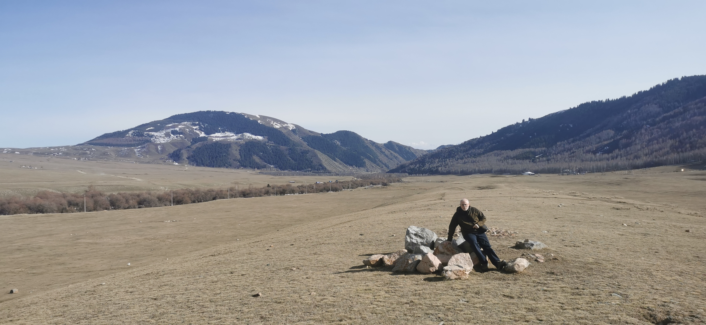

## Введение

Совершенно случайно оказался в одних и тех же местах по двум разным поводам. Осенью 2024 и весной 2025.

## Семеновское ущелье

Оно же - Кырчын. Само ущелье начинается значительно выше ([википедия](https://ru.wikipedia.org/wiki/%D0%A1%D0%B5%D0%BC%D1%91%D0%BD%D0%BE%D0%B2%D1%81%D0%BA%D0%BE%D0%B5_%D1%83%D1%89%D0%B5%D0%BB%D1%8C%D0%B5)), а тут большой курганный комплекс периода скифов и монголов.

На картах:

* [OpenStreetMap](https://www.openstreetmap.org/#map=15/42.83740/77.49382)
* [NextGIS Web](https://maxim.nextgis.com/resource/8001/display?angle=0&zoom=14&styles=8048,8046,8044,8042,8040,8038,8036,8034,8032,8030,8028,8026,7996,7998&base=basemap_0&lon=77.5004&lat=42.8356)

Фото:

* Фото до: 14 октября 2024
* Фото после: 26 марта 2025

В качестве бонуса, позирует известный хранитель степей - Илья Смелянский (но на фото - не степь, а что-то с Кобрезией).

## Собор святой троицы

Она же Свято-Троицкая церковь. Построена в 1895, потом превращена в спортшколу, восстановлена в 1995 ([википедия](https://ru.wikipedia.org/wiki/%D0%A1%D0%B2%D1%8F%D1%82%D0%BE-%D0%A2%D1%80%D0%BE%D0%B8%D1%86%D0%BA%D0%B0%D1%8F_%D1%86%D0%B5%D1%80%D0%BA%D0%BE%D0%B2%D1%8C_(%D0%9A%D0%B0%D1%80%D0%B0%D0%BA%D0%BE%D0%BB))).

На картах:

* [OpenStreetMap](https://www.openstreetmap.org/#map=18/42.489157/78.394431)
* [Яндекс карты](https://yandex.ru/maps/36948/karakol/?ll=78.394870%2C42.489163&z=17.1)

Фото:

* Фото до: 16 октября 2024
* Фото после: 29 марта 2025

## Дунганская мечеть

Центральная мечеть им. Ибрахим ажы, постройка закончена в 1910 г., закрыта в годы Советской власти, в 1991 открыта снова ([википедия](https://ru.wikipedia.org/wiki/%D0%94%D1%83%D0%BD%D0%B3%D0%B0%D0%BD%D1%81%D0%BA%D0%B0%D1%8F_%D0%BC%D0%B5%D1%87%D0%B5%D1%82%D1%8C_(%D0%9A%D0%B0%D1%80%D0%B0%D0%BA%D0%BE%D0%BB))).

На картах:

* [OpenStreetMap](https://www.openstreetmap.org/#map=19/42.497362/78.391000)
* [Яндекс карты](https://yandex.ru/maps/36948/karakol/?ll=78.390747%2C42.497399&z=17.1)

Фото:

* Фото до: 16 октября 2024
* Фото после: 29 марта 2025

## Комментарии

[**Обсудить**](https://t.me/answer42geo/77)
