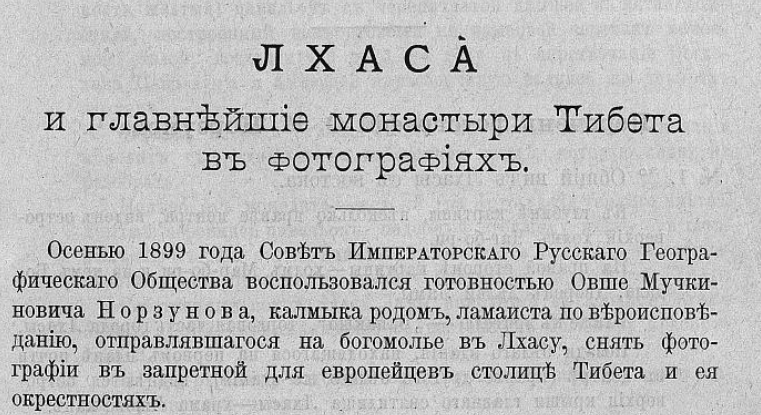
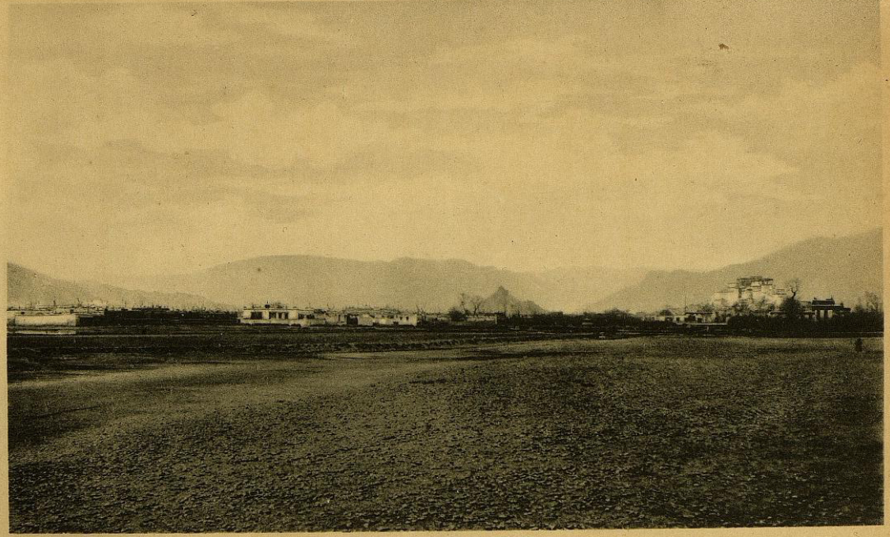
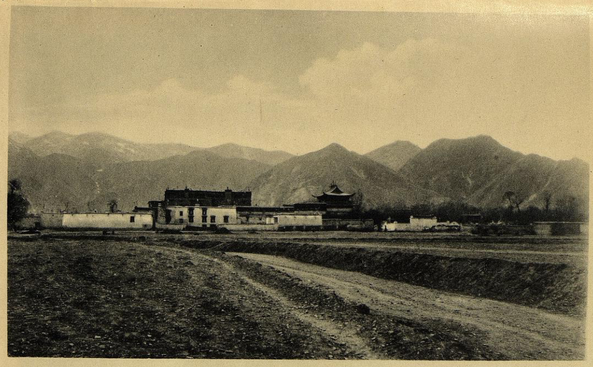
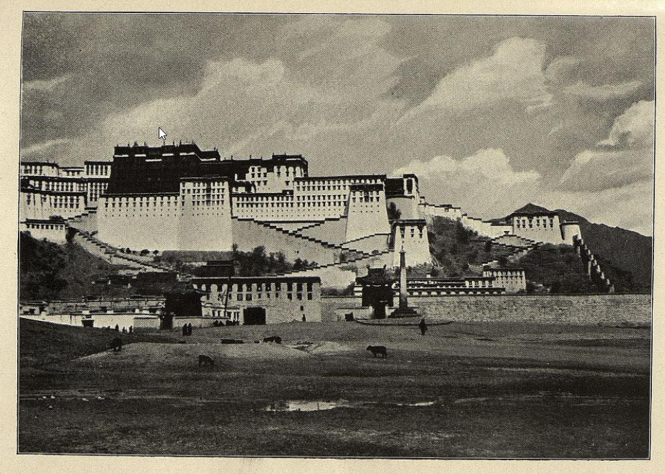
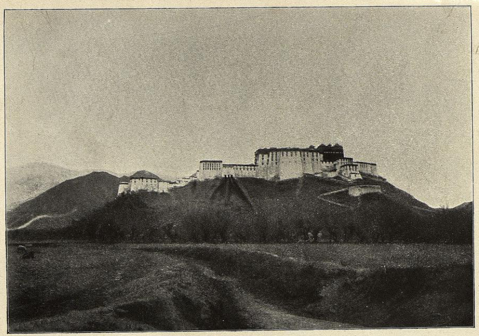
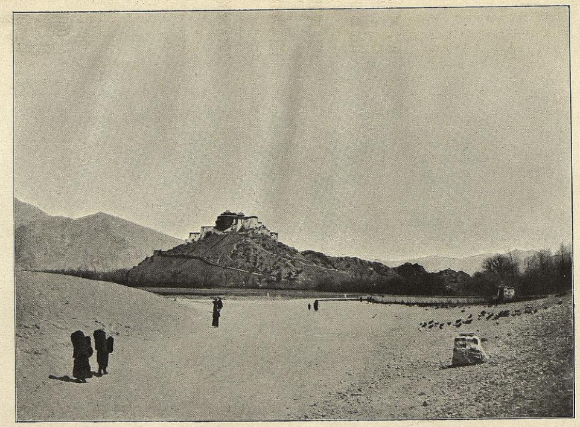
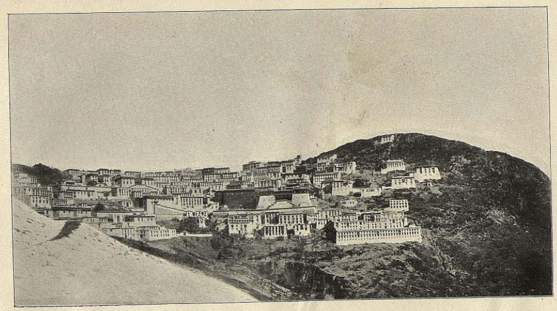
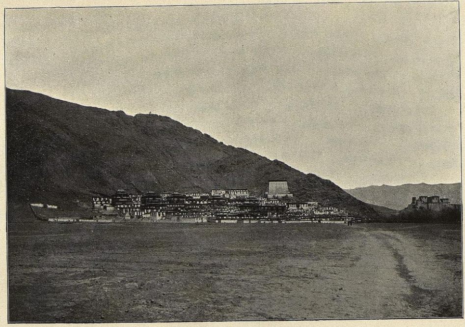

## Введение

После возвращения Цыбикова и Норзунова на родину в Известиях Императорского Русского географического общества, томе 39 было опубликовано две статьи.

1. Г. Ц. Цыбикова О Центральном Тибете. Предварительное сообщение. Стр. 187-218. Читано 7-го мая 1903 г. в общем собрании И.Р.Г.О.
2. Анонимного автора. Лхаса и главнейшие монастыри Тибета в фотографиях. Стр. 219-227.

Полностью том 39 можно посмотреть на [сайте РГО](https://elib.rgo.ru/handle/123456789/219161).

Вторая статья приводит краткую информацию о фотографической съемке обоих путешественников и приводит перечень фотографий: 45 шт. Норзунова и 32 Цыбикова.

Лхаса и главнейшие монастыри 1903 --- Лхаса и главнейшие монастыри Тибета в фотографиях. СПб.: Тип. В. Безобразова и К°, 1903. 9 с., 9 л. ил.; 24 см. --- Отт. из: Известия ИРГО. Т. XXXIX. Тип. В. Безобразова и К°, 1905. С.219--227

Здесь можно [скачать PDF](https://drive.google.com/file/d/1_XfCHvEw-S1KO2-mTKU1fSIu6GolSio7/view?usp=sharing) «Лхаса и главнейшие монастыри Тибета в фотографиях», [распознанный текст](https://docs.google.com/document/d/1mUhs5i11WlmH2Caz-KlGzTbBYRP2qmsA/edit?usp=sharing&ouid=112245657670169384946&rtpof=true&sd=true) в виде DOCX. 

## Полный текст с перечнем фото

ИЗВѢСТІЯ Императорскаго Русскаго Географическаго Общества. Том XXXIX. 1903. С.-ПЕТЕРБУРГЪ. ТИПОГРАФІЯ В. БЕЗОБРАЗОВА И КОМП. (Вас. Остр., 8 л., № 45). 1905.

## Лхаса и главнѣйшіе монастыри Тибета въ Фотографіяхъ.

Осенью 1899 года Совѣтъ Императорскаго Русскаго Географическаго Общества воспользовался готовностью Овше Мучкиновича Норзунова, калмыка родомъ, ламаиста по вѣроисповѣданію, отправлявшагося на богомолье въ Лхасу, снять фотографіи въ запретной для европейцевъ столицѣ Тибета и ея окрестностяхъ.

Г. Норзуновъ былъ снабженъ хорошимъ ручнымъ фотографическимъ приборомъ съ двойнымъ анастигматомъ Герца (серія III, № 00) и достаточнымъ числомъ пластинокъ 6 1/2 Х 9 см. фабрики Люмьера.

Когда г. Норзуновъ прибылъ въ Лхасу, тамъ уже находился командированный туда Совѣтомъ Императорскаго Русскаго Географическаго Общества кандидатъ Восточныхъ языковъ Гонбочжябъ Цэбековичъ Цыбиковъ, также занимавшійся, между прочимъ, сниманіемъ фотографій помощью прибора тождественнаго съ тѣмъ, который былъ у г. Норзунова.

Такъ какъ г. Цыбиковъ вернулся позднѣе г. Норзунова, негативы этого послѣдняго были получены въ Обществѣ раньше, и съ нихъ уже были изготовлены увеличенія прежде, чѣмъ были доставлены г. Цыбиковымъ негативы, снятые имъ раньше, чѣмъ это могъ сдѣлать г. Норзуновъ.

Перечень превосходныхъ фотографій г. Цыбикова, представляющихъ интересъ едва ли не большій, чѣмъ снимки г. Норзунова, прилагается слѣдомъ за перечнемъ фотографій г. Норзунова.

Воспроизводимыя при семъ фотографіи г. Норзунова отмѣчены въ спискѣ звѣздочкой. Нумера обозначенные кружечкомъ въ обоихъ спискахъ, имѣются также въ превосходныхъ увеличеніяхъ размѣромъ 16 1/2 X 22 1/2 cм., кромѣ № 32 увеличеннаго до 10 X 18 и до 20 X 36 см.

## Перечень фотографій О. М. Норзунова 1).

1) Объясненія фотографій даны г. Цыбиковымъ и нѣкоторыми другими ламаистами, бывавшими въ Лхасѣ; по ихъ же указаніямъ отмѣчено и произношеніе именъ собственныхъ.

**№ 1. \*° Общій видъ Лхасы съ востока.**

Къ глубинѣ картины, нѣсколько правѣе центра, виденъ островерхій холмъ Чаг-бо ри.

На правой сторонѣ картины---холмъ Мар-бо-ри и на немъ Бодала, дворецъ Далай Ламы.

Ближе къ зрителю --- „Банакшо", торговая часть города Лхасы.

Позади бѣлаго зданія, находящагося на первомъ планѣ почти въ центрѣ (правѣе другого бѣлаго же зданія), виднѣются островерхія крыши главнаго святилища Лхасы---храма Чжово-канъ.

**№ 2. Лхаса съ сѣвера.**

Въ глубинѣ, промежъ двухъ купъ деревьевъ находящихся на болѣе близкомъ планѣ, виднѣется Чжово-канъ.

**№ 3. \*° Лхаса съ сѣвера, но съ болѣе близкаго разстоянія чѣмъ предыдущій видъ.**

Большое темное зданіе съ плоской кровлей, виднѣющееся изъ за находящагося передъ нимъ бѣлаго дома --- Гаданъ-Кансаръ, до 1751 года дворецъ тибетскихъ царей, нынѣ пустующій.

Направо отъ дворца --- одно изъ важнѣйшихъ святилищъ Лхасы, кумирня Рамо-чэ съ крышею въ китайскомъ стилѣ.

**№ 4. \*° Холмъ Мар-бо-ри съ дворцомъ «Бодала» Далай Ламы.**

Видъ съ юго-юго-востока.

**№ 5. ° Тоже, но снято съ болѣе близкаго разстоянія и нѣсколько болѣе съ запада чѣмъ предыдущая фотографія.**

**№ 6. \*° Тоже съ еще болѣе близкаго разстоянія и прямо съ юга.**

Зданіе (на фотографіи) темнаго цвѣта, въ дѣйствительности краснаго цвѣта; поэтому Бодала зовется также Повранъ-Марбо, что значитъ красный городъ.

Главный входъ во дворецъ почти въ центрѣ картины, въ видѣ воротъ въ низкомъ бѣломъ зданіи на первомъ планѣ.

Нѣсколько лѣвѣе и впереди воротъ---темный (въ дѣйствительности желтый) павильонъ съ черепитчатой крышей въ китайскомъ стилѣ, построенный надъ стоящей на каменной черепахѣ каменной стэлой, воздвигнутой въ 1794 году въ царствованіе Богдо- хана Цянъ-лун'а и имѣющей неразборчивую надпись на четырехъ языкахъ.

Справа, впереди стѣны, стоитъ на ступенчатомъ основаніи монолитъ съ надписью на тибетскомъ языкѣ, которую снизу не разобрать.

Налѣво отъ монолита---желтый (на фотографіи темнаго цвѣта), крытый черепицей павильонъ, подобный стоящему влѣво отъ главныхъ воротъ. Въ этомъ павильонѣ, находится стоящая на ступенчатомъ основаніи стэла съ указомъ Богдохапа Канъ-си отъ 1721 г.

Собственные покои Далай Ламы находятся въ верхнемъ этажѣ бѣлаго зданія, примыкающаго съ востока къ большому красному зданію.

Внутри ограды, у подошвы горы, вправо отъ воротъ, низкое зданіе --- монетный дворъ.

**№ 7. Видъ на Мар-бо-ри съ юга востока.**

**№ 8. ° Бодала съ востока.**

На крайней лѣвой сторонѣ видень холмъ Чаг-бо-ри.

У сѣверной подошвы Мар-бо-ри среди купы деревьевъ находится павильонъ Лу-канъ построенный на островѣ среди пруда.

**№ 9. \*° Бодала съ сѣверо-сѣверо-востока.**

На первомъ планѣ рѣчка. Надъ главнымъ краснымъ зданіемъ видны четыре златоверхія кумирни.

Въ полугорѣ справа --- круглое зданіе, гдѣ пріѣзжающіе верхомъ оставляютъ лошадей и откуда идутъ во дворецъ пѣшкомъ черезъ ворота, виднѣющіяся въ выступѣ подъ краснымъ зданіемъ.

Полосы, вѣерообразно расходящіяся по склону и выходящія изъ отверстій у основанія стѣны --- слѣды нечистотъ.

Подъ горой, за деревьями, прудъ съ павильономъ Лу-канъ.

**№ 10. Тотъ же видъ снятый съ сѣверо-запада.**

**№ 11. \*° Бодала съ западо-сѣверо-запада.**

Видъ снятъ съ дороги изъ монастыря Брай-бунъ.

**№ 12 Тоже съ болѣе близкаго разстоянія.**

**№ 13. ° Ямынь китайскаго амбаня въ Лхасѣ.**

Видъ снятъ съ юго-востока. Вдали Бодала.

На лѣвой сторонѣ картины по бокамъ высокихъ воротъ съ деревяннымъ навѣсомъ видны остатки древней стѣны Лхасы, снесенной въ 1721 году.

**№ 14. \*° Гаданъ Кансаръ, до 1751 года дворецъ царей Тибета.**

Изъ путешественниковъ упоминаютъ о немъ лишь патеръ Cassiano Belogatti da Macerata и Sarat Chandra

Das; этимъ дворцомъ помѣченъ также тибетскій паспортъ выданный патеру Orazio della Penna.

Зданіе пустуетъ и служитъ лишь временнымъ пристанищемъ для безпріютныхъ богомольцевъ въ дни особенно большого скопленія паломниковъ.

**№ 15. ° Ютокъ-самба.**

Крытый голубой черепицей "бирюзовый" мостъ черезъ маленькую безъимянную рѣчку въ Лхасѣ на пути изъ города въ Бодалу.

**№ 16. Тоже, съ другого мѣста.**

Зданіе съ остроконечною крышей --- Ютокъ-калунъ.

**№ 17. ° Холмъ Чаг-бо-ри.**

На ней храмъ Чаг-ри Вейдуръ или Ман-ба дацанъ, гдѣ преподается медицина. Видъ съ юго-востока.

**№ 18. ° Тоже, съ сѣверо-запада.**

**№ 19. ° Гундуй линъ.**

Монастырь у сѣверо-западнаго края подошвы Чаг-бо-ри.

Высокое, темнаго цвѣта зданіе съ черепитчатой крышей --- китайская кумирня. Видъ почти съ юга.

**№ 20. Чжа-ши-танъ.**

Крѣпостца верстахъ въ двухъ къ сѣверу отъ Лхасы, по дорогѣ въ монастырь Сэра.

Здѣсь мѣсто расположенія китайскаго гарнизона Лхасы.

**№ 21. Тоже, съ болѣе близкаго разстоянія.**

**№ 22. Монастырь Сэра издали.**

**№ 23. ° Сэра съ болѣе близкаго разстоянія.**

Вверху, на горѣ---Сэра-чондэиь ритодъ, гдѣ жилъ Цзонхава еще до постройки монастыря.

**№ 24. ° Пурбу-чжогъ.**

Монастырь въ горахъ къ сѣверу отъ Сэра.

**№ 25. ° Гэчэнъ или Гэуцанъ ритодъ.**

Одинъ изъ скитовъ въ горахъ около монастыря Сэра.

**№ 26. Монастырь Брайбунъ или по другому произношенію Дайбунъ.**

Монастырь этотъ лежитъ верстахъ въ 12 къ сѣверо-западу отъ Лхасы; наиболѣе многолюдный въ настоящее время монастырь Тибета.

**№ 27. ° Тоже, съ болѣе близкаго разстоянія.**

На крайней лѣвой сторонѣ картины---Даши-кансаръ дворецъ, построенный нарушившимъ монашескіе обѣты шестымъ Далай ламой для своей жены.

Вправо отъ этого дворца --- другой "Гаданъ Повранъ" гдѣ останавливаются Далай Ламы, когда пріѣзжаютъ въ монастырь.

Главная кумирня монастыря видна почти въ центрѣ.

Гора, справа, у подножія которой расположенъ монастырь называется Гэпэль-ри.

**№ 28. ° Монастыри Брайбунъ (Дайбунъ) (слѣва) и Най-чунъ.**

Монастырь Най-чунъ служитъ мѣстопребываніемъ государственнаго прорицателя Тибета.

**№ 29. Монастырь Най-чунъ съ другой стороны.**

**№ 30. ° «Обо».**

„Обо" это, вышиною около трехъ саженъ, находится по дорогѣ изъ Лхасы въ Брайбунъ.

**№ 31. ° Развалины Дэчэнь-цзонъ.**

Былая эта крѣпость находится по дорогѣ изъ Лхасы въ монастырь Галдань.

**№ 32. \*° Монастырь Галдань (панорама изъ двухъ негативовъ).**

Монастырь этотъ, верстахъ, въ 40---50 на востокъ Отъ Лхасы, расположенъ въ сѣдловинѣ между горами Брог-ри (справа) и Вангур-ри (слѣва).

Цзонхава, основатель желтошапочной, нынѣ главенствующей ламаистской секты, основатель монастыря, похороненъ въ храмѣ, стоящемъ влѣво отъ главной кумирни, къ которой ведетъ двойная лѣстница.

Вправо отъ главной кумирни видно небольшое зданіе --- Одцсэръ-пугъ съ островерхою золоченою крышею. Въ немъ жилъ и умеръ Цзонхава, а теперь живутъ настоятели монастыря.

**№ 33. Рѣка Ки-чу подъ Лхасой,**

**№ 34. Рѣка Ки-чу ниже Лхасы.**

**№ 35. Рѣка Ки-чу ниже Лхасы.**

**№ 36. \*° Монастырь Даши-лхюнбо.**

Высокое зданіе на правой сторонѣ монастыря служитъ въ извѣстные праздники для вывѣшиванія картинъ со священнымп изображеніями. Это то зданіе, которое Turner называетъ Go-ku-pea или Kiku-Tamsa.

Темныя зданія (въ дѣйствительности красныя) числомъ пять, съ островерхими въ китайскомъ стилѣ кровлями --- гробницы Бань- ченей, вторыхъ іерарховъ ламаизма.

Дворецъ Банчэня виденъ между третьей и четвертой гробницей, считая слѣва.

Рядомъ съ дворцомъ --- главная кумирня.

Впереди пятой гробницы виднѣется длинное, болѣе низкое, темнаго цвѣта зданіе съ плоской кровлей, имѣющее ближе къ заду островерхій куполъ. Это одинъ изъ факультетовъ монастыря--- Чжялганъ дацанъ.

**№ 37. Своеобразный способъ совершать «круговращенія» при обходѣ священныхъ мѣстъ.**

Паломникъ простирается ницъ и поднявшись становится на слѣдъ оставленный руками при простираніи и т. д.

**№ 38. Тибетскій монахъ въ сидячемъ положеніи съ четками и сосудомъ для свящёной воды.**

**№ 39. Два стоящихъ тибетскихъ монаха.**

**№ 40. Тибетскій монахъ верхомъ на ослѣ.**

**№ 41. Тибетскія женщины.**

**№ 42. Дѣти подъ Лхасой.**

**№ 43. Ослики подъ Лхасой, завьюченные топливомъ.**

**№ 44. Яки.**

**№ 45. Яки.**

### Перечень фотографіи Г. Ц. Цыбикова 1).

1) Здѣсь дается перечень лишь тѣхъ изъ тибетскихъ фотографій г. Цыбикова, діапозитивы съ которыхъ были представлены на докладѣ г. Цыбикова 7 мая 1903 г, въ общемъ собраніи И. Р. Г. О

**№ 1. Общій видъ Лхасы съ юга.**

На первомъ планѣ ямынь китайскаго амбаня, правѣе за другими зданіями болѣе близкаго плана виднѣются кровли Чжово-кана.

**№ 2. ° Бодала съ юго-юго запада во время религіознаго праздника «Цог-чодъ».**

Праздникъ этотъ, празднуемый въ 29 число второй луны, при- . шелся въ 1901 году на пятое (восемнадцатое) Апрѣля.

На фасадѣ вывѣшены двѣ картины, изъ которой правая (отъ зрителя) представляетъ будду Сакья-муни, а лѣвая---бѣлую Дара (по-тиб. Дол-гаръ).

**№ 3. ° Улица Лхасы съ процессіей во время праздника «Цог-чодъ».**

**№ 4. ° Даньчжяй линъ, дворецъ Дэму-хутухты въ Лхасѣ.**

Вдали Бодала.

**№ 5. ° Баръ-чодэнъ.**

Проходныя ворота между Мар-бо-ри и Чак-бо-ри.

Отъ вершины зданія проведены увѣшанныя колокольчиками веревки, копцы которыхъ прикрѣплены къ верхушкамъ башенокъ на склонахъ Мар-бо-ри, съ одной стороны и Чак-бо-ри --- съ другой

**№ 6. Тибетскія женщины въ праздничныхъ нарядахъ.**

**№ 7. ° Монастырь Сэра.**

Главныя кумирни съ востока, съ полугоры надъ монастыремъ.

**№ 8. ° Пурбу-чжогь (ср. № 24 Норзунова).**

Общій видъ издали съ юго-востока изъ-подъ горы.

**№ 9. Бари ритодъ близъ Сэра.**

**№ 10 ° Камень---на которомъ разрѣзаютъ трупы на съѣденіе грифамъ.**

Камень этотъ находится у ритода Пабон-ха верстахъ въ трехъ на сѣверо-западъ отъ Сэра,

**№ 11. Монастырь Брайбунъ или Дайбунъ.**

Общій видъ съ юго-востока.

**№ 12. ° Тоже съ востока и съ болѣе близкаго разстоянія.**

**№ 13. Монастырь Галдань.**

Общій видъ съ юга. (Ср. № 32 Норзунова).

**№ 14. Памятникъ на мѣстѣ нахожденія священнаго клада (шапки Цзонхавы и пр.) нынѣшнимъ, тринадцатымъ Далай Ламой.**

**№ 15. Субурганъ съ прахомъ Лхобраг'скаго-Намха-Цжямцан'я (Личжи-дорджи).**

На востокъ отъ Галданя верстахъ въ 6---7.

**№ 16. Ярба ритодъ.**

На правомъ берегу р. Ки-чу въ вершинѣ одной пади между Галданомъ и Лхасой.

**№ 17. ° Донхаръ цзонъ.**

Развалины этой древней крѣпости, при селеніи того же имени, находятся верстахъ въ 12 отъ Лхасы на юго-западъ.

**№ 18. ° Озеро Ямдокъ цо.**

Видъ съ перевала Ганбала на юго-западъ.

**№ 19. ° Даши-лхюнбо. (Общій видъ ср. № 36 Норзунова). Золоченая крыша надъ гробницей четвертаго баньчэня. Видъ съ тыла.**

**№ 20. Байна цзонъ.**

Разваливающаяся старинная крѣпость на р. Нянъ-чу между Даши-лхюнбо и Чжян-цзэ.

**№ 21. Чжян-цзэ (Гьян-цзэ).**

Общий вид.

**№  22. ° Чжян-цзэ.**

Чордэнъ гоманъ. Субургапъ съ многими дверями.

**№ 23. ° Чжян-цзэ.**

Чордэнъ гоманъ среди другихъ зданій.

**№ 24. Чжян-цзэ.**

Вертикальныя бѣлыя полосы на домѣ означаютъ принадлежность его владѣльца къ сектѣ „Сакъяи.

**№ 25. Яки на отдыхѣ близъ Чжян-цзэ.**

**№ 26. ° Монастырь Самъяй (Самьѣ).**

Древнѣйтій монастырь Тибета, основанный въ половинѣ IX вѣка по Р. X., служащій мѣстомъ храненія, государственнаго запаснаго капитала на случай крайней нужды. Общій видъ издали съ юга.

**№ 27. ° Монастырь Самьяй.**

Видъ на монастырскую стѣну усаженную чордэнами, за которою видна главная кумирня.

**№ 28. ° Монастырь Самъяй.**

Главная кумирня.

**№ 29. Монастырь Цзэтанъ (Четанъ).**

Видъ съ юга.

**№ 30. Монастырь Цзэтанъ.**

Видъ съ запада.

**№ 31. Монастырь Цзэтанъ.**

Видъ съ сѣверо-запада.

**№ 32. Тибетское помѣстье на Пэнбу, въ пади перевала Чаг-ла**

")

## Комментарии

[**Обсудить**](https://t.me/answer42geo/23)
