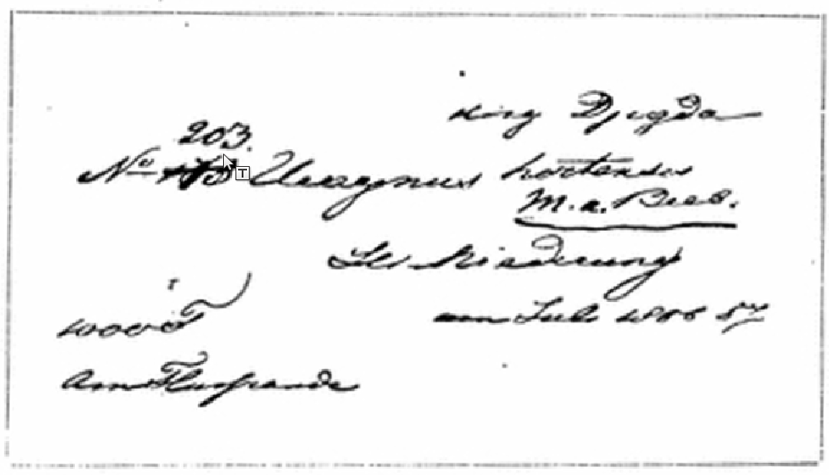

## Введение

Владимир Ипполитович Липский ([википедия](https://ru.wikipedia.org/wiki/%D0%9B%D0%B8%D0%BF%D1%81%D0%BA%D0%B8%D0%B9,_%D0%92%D0%BB%D0%B0%D0%B4%D0%B8%D0%BC%D0%B8%D1%80_%D0%98%D0%BF%D0%BF%D0%BE%D0%BB%D0%B8%D1%82%D0%BE%D0%B2%D0%B8%D1%87)), учёный, ботаник, работал в ботаническом саду Петербурга. В своём трехтомнике «Флора Средней Азии» в Томе 3 посвященном ботаническим коллекциям Средней Азии описал маршруты путешествий П. П. Семенова-Тян-Шанского (ППСТШ) в 1856-57 гг.

Липский пишет, что описание маршрута было составлено для него лично ППСТШ.

## Три тома

Липский, В. И., 1902. Флора Средней Азии, то есть Русского Туркестана и ханств Бухары и Хивы. Том I. Литература по флоре Средней Азии — Санкт-Петербург: Типо-литография "Гарольда". — 245 с.

* [Скачать PDF](https://drive.google.com/file/d/1jfm4oEvKEuVonny9VA-T6iMjPno_v9dg/view?usp=drive_link)
* [Онлайн чтение](https://www.litres.ru/book/vladimir-lipskiy/flora-sredney-azii-tom-1-461795/)

Липский, В. И., 1905. Флора Средней Азии, то есть Русского Туркестана и ханств Бухары и Хивы. Том II. Ботанические коллекции из Средней Азии. Прибавление — Санкт-Петербург: Типо-литография "Гарольда". — 249-337 с.

* [Скачать PDF](https://drive.google.com/file/d/1t6zSBtVDJpmgmX7BRn5-s6qybg6Z5Ve4/view?usp=drive_link)
* [Онлайн чтение](https://www.litres.ru/book/vladimir-lipskiy/flora-sredney-azii-tom-2-461805/)

Липский, В. И., 1905.  Флора Средней Азии, то есть Русского Туркестана и ханств Бухары и Хивы. Том III. Ботанические коллекции из Средней Азии. Прибавление — Санкт-Петербург: Типо-литография "Гарольда". — 341-841 с.

* [Скачать PDF](https://drive.google.com/file/d/1mjwyPL1MFxvW2YQ0-WN5YsKGFH66uHHb/view?usp=drive_link)
* [Онлайн чтение](https://www.litres.ru/book/vladimir-lipskiy/flora-sredney-azii-tom-3-461815/)

## Содержание раздела с маршрутом ППСТШ

Жирным - номера страниц.

Распознано, переведено на современную орфографию и отредактировано мной.

**506**

110\. Семенов Петр Петрович (см. стр. 176 и 275). Маршрут путешествий 1856-57 годов составлен для меня лично маститым ученым. Привожу их в том виде, в какам он доставлен мне.

Спустя более 30 лет, в 1888 г., когда П. П. Семенов приглашен был присутствовать при открытии Закаспийской (ныне Среднеазиатской) дороги в Самарканде, он сделал небольшое путешествие по Заравшанской долине и прилегающим горам, до снеговой линии, причем также собрана была небольшая коллекция растений.

### 1856\. Сибирь и Алтай.

Май 27. Из Екатеринбурга. 28. Из Шадринска. 31 В Ишиме.

Июнь 1. Переправа через Иртыш против Красноярской и в 6 ч. вечера в Омске. 2. Омск. 3. Из Омска. 4-5. Барабинская степь. 6. На берегу Оби. 7. Вечером в Барнауле. 8-18. Барнаул. 19. Из Барнаула по сухой степи (приалейской). 20. По Алею, Чарышу, Саушка на Колыванском озере. 21. На Колыванском озере. 22-30. Геолог. экскурсии в Змеиногорском округе.

Июль 1-19. Геологические экскурсии в Змеиногорском округе: Локтевский завод и ближайшие рудники. 20. Из Змеиногорска в Гериховский рудник. 21-23. Гериховский рудник. 24. От Николаевского рудника до Риддерска. 25. Из Риддерска на Ивановский белок. 26-30. Геологические поездки и возвращение в Змиев .

Август 1. Змиев-Сугатовск. 2-3. Николаевский и Сугатовский рудники. 4. От Николаевского рудника до Иртыша (Озерный форпост). 5. Семипалатинск.

### Киргизская степь.

Август 6. Семипалатинск - Улугуз, Аркялык, Джар-таш, Кизыл-мулла, Аркат.

7\. Экскурсия на гору Аркат. - От Арката на Альджан-адыр, Узун-булак, Ингрекей, Алтын-калат до Аягуза.

8\. Аягуз (Сергиополь).

9\. От Аягуза на Талды-кудун, Кызыл-кия, Малый Аягуз, Джус-агач, Арганаты.

10\. Арганаты. Ащн-булак, Лепсинский пикет, Басканский пикет до Аксуйского.

11\. От Аксуйского на Карасуйский на Арассан и до Копала.

12-23. Копал и его окрестности (снежная вершина Каратау, по Биену и пр.).

**507**

Август. 13-14. Каратау.

24\. Копал - Ак-Ичке - Сары-булакь.

25\. Сары-булак - Кара-булак.

26\. Кара-булак, Джангыз-агач, Кара-су.

27\. Экскурсия на вершины Аламанского хребта.

28\. От подошвы Аламана на Терс-акан, Алтын-имель до Куян-куз.

29\. Куян-куз, Кара-чок, Чингильды.

30\. Чингильды, через Или на Верный.

31\. Верный.

Сентябрь. 1. Верный.

2\. Верный - Талгар.

3\. Талгар - Иссык.

4\. Иссык - Тургень.

5\. Тургень - Асы-су.

6\. Асы-су - Джениишке.

7\. Дженишке - 2-й Мерке.

8\. 2-й Мерке - Табулга-су.

9\. Табулга-су на Иссык-куль.

10\. Табулга-су - Чирик-су.

11\. Чирик-су - Мерке 1-й.

12\. Мерке 1-й - Турайгыр.

13\. Турайгыр - Сейрек-таз.

14\. Сейрек-таз - 2-й ключ за Чиликом.

15\. От Чилика до аула Джазкак.

16\. Возвращение в Верный.

(17-20. Верный. 21. Верный - Кескелен. 22. Дальше пройдено 10 верст. 23. До подножия перев. Суок-тюбе на р. Кастеке. 24. Через перевал Суок-тюбе до ключа, впадающего в Чу. 25. По р. Чудо ущелья Буам. 26. Из Буама до Иссык-куля (Кутемалды). 27. На Иссык-куле. 28. Огь Иссык-куля до р. Турайгыр. 29. Через перевал Дюренын-су. 30. Поперек долины Кебина через перевал Кескеленский до Кескелена.

Октябрь. 1-16. Верный. 17-21. Поездка через Алтын-Имель в Кульчжу. 22-26. Кульчжа. 27-31. Возвращение в Копал 1).

1) В силу особых условий экспедиции (где П. П. Семенову пришлось быть в роли начальника военного отряда, посланного с целью рекогносцировки, а позже при поездке в Кульчжу переодетым казаком в составе казацкой почты), ботанических сборов с половины сентября не было.

**508**

### 1857.

Апрель. 21. От Омска до ст. Черлаковской.

22\. Черлаковскяя - Чернорецкая.

23\. Чернорецкая - Грачевская.

24\. Грачевская - Семипалатинск.

25-26. Семипалатинск.

27\. Семипалатинск - Аркалык.

28\. Аркалык - Узун-булак.

29\. Узун-булак - Ингрекей, Ащи-су, Аягуз.

30\. Аягуз - Кызыл-кия.

Май. 1. Кызыл-кия, Малый Аягуз, Аргапаты (первый жаркий день).

2\. Экскурсия на Арганаты и в сторону Балхаша по степи. До Баскана.

3\. Аксу, Карасу, Кейссык-аус, до Арасана.

4-5. Экскурсия около Арасана (по Биену и т. д.).

6\. Переезд в Копал.

7-8. Копал, экскурсия в горы.

9\. Копал, Балыкты, Каратал.

10\. Каратал, Джангыз-агач - Коксу.

11\. Коксу - Куянкуз.

12\. Куянкуз - до Или.

13\. Вниз по Или до Тамгалы-таза.

14\. Илийский пикет - Верный.

15-28. Верный и окрестности.

29\. Верный. Заталгарский мыс, в горы по Талгару.

30\. Талгар - Иссык, горная экскурсия на Джасыль-куль.

31\. Иссык, Ташбулак.

Июнь. 1. Аул Аблэса до Кара-турука.

2\. Кара-турук - Чилик.

3\. Чилик Сейрек-таз.

4\. Сейрек-таз - южн. скл. Турайгыра.

5\. Турайгыр - Мерке 1-й.

6\. Мерке 1-й - Тиек-таз.

7\. Тиек-таз, Санташ, Мал. Каркары, аул Бурамбая.

8-9. Кочевья Бурамбая на Санташе, экскурсия в ущ. Каркары.

10\. Санташ, М. Каркара, Альма-арассан.

11\. Альма-арассан - Джиты-огуз.

12\. Джиты-огуз - Зауку (граница лесной растительности).

13\. От Заукинского ночлега на перев. Зауку до ледяных озер, служащих истоком Нарыва, и обратно.

**509**

Июнь. 14. Спуск с Заукинского ночлега до Иссык-куля на устье Кызыл-су.

15\. От Кизыл-су до Джпргалана.

16\. От Джпргалана до Курхекты.

17\. От Курхекты до Шаты и на горный отрог Курмектинской долины.

18\. От Шаты на вершину Шатпнского перевала и обратно на Табульгаты.

19\. От Табульгаты на вершину Табульгатинскаго перевала и обратно.

20\. От Табульгаты до Малой Каркары.

21-23. В аулах султана (манапа) Бурамбая.

24\. От аулов Бурамбая на М. Каркаре до Сарт-джела в ущелье Большой Каркары.

25\. От Сарт-джел на Кок-джар.

26\. От Кок-джара до Сары-джаза.

27\. От Сары-джаза до ледника Семенова и Мушкетова.

28\. От ледников Семенова н Мушкетова до Туз-кок-джара.

29\. От Туз-кок-джара через перевал до поворота Текеса.

30\. От Текеса до М. Каркары (аулы Бурамбая).

Июль. 1. Аулы Бурамбая.

4\. От аулов Бурамбая до Орт-Каркары.

5\. От Орто-Каркары до Сары-джазскаго перевала.

6\. От Сары-джазскаго перевала на Текес.

7\. С Текеса на Карага-су и обратно в аулы Бурамбая.

8-12. Поездка на выручку Султана Тезека.

13-18. Переговоры о примирении Богинцев и Сара-багишей. Суок-тюбе и переход на севера, сторону южной цепи Заилийскаго Алатау (Кунгей-Алатау).

19\. По Чилику до Курменты.

20\. Подъем на Курментинский перевал.

21\. Спуск с Курментинского перевала в долину Чилика на Тал-булак и Кудургу.

22\. От Кудургу до Чиликского Май-булака.

23\. Вверх Чиликской долины по склонам южной цепи Заилийскаго Алатау.

24\. На Чин-булаке и Долон-булаке до 3.740 метров высоты.

25\. От Чин-булака до верховья р. Асы.

26\. С верх. Асы на Ой-Джайляу через перевал северн. цепи Алатау.

**510**

27\. Спуск по Тургени.

28\. Возвращение в Верный.

29-31. Верный.

Август. 1-4 Верный.

5\. Подъем на Алматинский перевал; ночлег в зоне елового леса.

6\. От ночлега через перевал (3.330 метр. выс.) на Кой-су. приток Кебина до Дюренын-су.

7\. С Дюренын-су через Кескеленский перевал (3.300 метр. выс.) на Кескелен.

8\. Возвращение в Верный.

### Обратный путь.

Август. 20. Верный до Илийскаго пикета.

21\. Экскурсия за Или до Кара-чока.

22\. От Кара-чока с половины дороги к Куянкузу к кряжу и к Май-тюбе и затем до Алтын-имеля.

23\. Через Алтын-имельский перевал на Тюльку-булак.

24\. От Тюльку-булак в аулы султана Тезека.

25\. От аулов Тезека на юго-зап. в горы Кату.

26\. В аулы Тезека и оттуда к подошве Аламана у р. Каракола.

27\. С Каракола через Аламан в перевале Юген-таш до Аган-каты.

28\. От Аган-каты до Джангыз-агача.

29\. До Каратала.

30\. В Копал.

Сентябрь. 1-14. Копал.

15\. От Копала до Арасана.

16\. От Арасана до Теректы.

17\. От Теректы до Чубар-агач.

18\. Экскурсия в горы Джунгар. Алатау.

19\. Возвращение в Чубар-агач.

20\. От Чубар-агача в Лепсинскую станицу.

21\. Лепсинская станица.

22-25. Поездка на Алакуль и Сасык-куль до Урджарской станицы.

26-30. Поездка из Урджарской станицы на горный перевал Алет в Тарбагатае и обратно.

Октябрь. 1-3. Возвращение в Семипалатинск.

За эти два года путешествий была собрана значительная коллекция растений, поступившая в Императорский Бо-

**511**

танический Сад. Коллекция эта была обработана Э. Регелем и частью Гердером (см. стр. 40, 147, 155-158).

Число собранных растений свыше 1200 видов. В гербарии имеются небольшие ярлычки, писанные коллектором в путешествии (обыкновенно на немецком языке):

Замечу, что вместе с маршрутом я получил от П. П. Семенова и ботаническую характеристику (в виде списков) многих посещенных (1856 -57 г.) мест, выписанную из дневника. В виду особаго интереса, я помещу ее в другом месте.

В 1888 году во время поездки по Заравшану собрано свыше 60 экземпляров (21 вид).

## Комментарии

[**Обсудить**](https://t.me/answer42geo/66)
