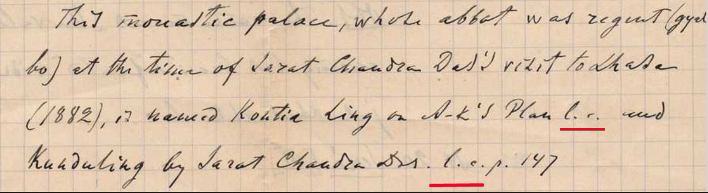

## Введение

А. Григорьев в [своём письме](/notes/grigoriev-letter/) часто использует сокращение l.c. после упоминания источника/автора, что оно означает?

> This monastic palace, where abbot was regent (gyem
> bo) of the time of Sarat Chandra Das's visit to Lhasa
> (1882), is named Kontia Ling on A-K's Plan l. c. and
> Kunduling by Sarat Chandra Das l. c. p. 147

Понятно, что это какой-то прием цитирования, но нагуглить объяснение не удалось.

Ситуацию разрешил мой профессор.

l.c. = loco citato ("in the place cited")

> ... means that the footnote refer to a full reference (e.g., 'Rockhill') that had been given before in the book/document already.  That way, it is not necessary to list the entire reference again.

По всей видимости, Григорьев, сопровождая l.c. номером страницы использует этот прием неверно, поскольку он никогда не сопровождается номером страницы.

> *Loc. cit.* is used in place of [ibid.](https://en.wikipedia.org/wiki/Ibid.) when the reference is not only to the work immediately preceding, but also refers to the same page. Therefore, *loc. cit.* is never followed by volume or page numbers.

[https://en.wikipedia.org/wiki/Loc.\_cit.](https://en.wikipedia.org/wiki/Loc._cit.)

На русском такой страницы в Википедии пока не было, но теперь есть и она:

[https://ru.wikipedia.org/wiki/Loc.\_cit.](https://ru.wikipedia.org/wiki/Loc._cit.)

## Комментарии

[**Обсудить**](https://t.me/answer42geo/22)
