## Введение

Норзунов совершил три попытки доехать до Лхасы. Все они описаны у Деникера в статье [Trois Voyages a Lhassa (1898--1901) par Ovché Narzounov, pélerin kalmouk](/notes/deniker-norzunov/).

С точки зрения географической информации по маршруту из Урги в Лхасу информация есть только по первому путешествию. В целом, к сожалению, информация по маршрутам Норзунова очень скудная.

Далее разобран каждый упоминаемый у Деникера топоним. В скобках --- название на французском из статьи Деникера. Кириллица дана по [Митруеву](/notes/deniker-norzunov/), приведены его комментарии. В \[квадратных скобках\] --- мои дополнения. Мои комментарии после цитат Норзунова/Деникера и Митруева.

Полный перечень топонимов из первого путешествия:

* Хадату (Khadatou)
* Кальбийты-уула (Kalbiyty-oula)
* Юндун-бэйсеин-куре (Youndoun-beisiin-kure)
* Ушкемталы (Ouchkem-taly)
* Нанси (Ngan-si)
* Нагчукхе (Nakhtchoutka)
* Гандан (Gandan)
* Кечанг, Ко-ланг-го-ла (Ké-tchang, Ko-lang gola)

Большое спасибо Рустаму Сабирову за помощь с монгольским и дополнительный поиск.

## Хадату (Khadatou)

Норзунов/Деникер:

> Сначала в течение девяти дней мы следовали обычному почтовому маршруту, а затем покинули его недалеко от Хадату

Митруев:

> Город Хадату во Внутренней Монголии.

Во внутренней Монголии (Китай) действительно есть два населенных пункта с похожим названием: Hadatu ([nakarte](https://nakarte.me/#m=15/41.89525/112.81144&l=P)) и Hadatuxiang ([nakarte](https://nakarte.me/#m=15/41.01465/112.72144&l=P)), но оба очень далеко от нужных мест. Норзунов двигался по почтовому тракту на запад от Урги, эти же пункты находятся в районе Хух-хото, почти 900 км по прямой от Урги.

На самом же деле, Хадату можно найти и в самой Монголии. Это не город. В первую очередь, его можно найти на карте Stanford, Edward, 1856-1917 (China Inland Mission). Complete atlas of China : containing separate maps of the eighteen provinces of China proper and of the four great dependencies. Mongolia. 1:7500000, p.67-68 ([исходник](https://archive.org/details/cu31924023258241/page/n67/mode/2up))

Аналогичная карта, местами более легко читаемая, но судя по всем копия карты Стэнфорда: Dingle, John Edwin, 1917. 21. Mongolia. Compiled from the latest and most authentic surveys by the Far Eastern Geographical Establishment. North-China Daily News & Herald, Ltd. ([исходник](https://www.davidrumsey.com/luna/servlet/detail/RUMSEY~8~1~288163~90059571:orok?annotId=357888247))

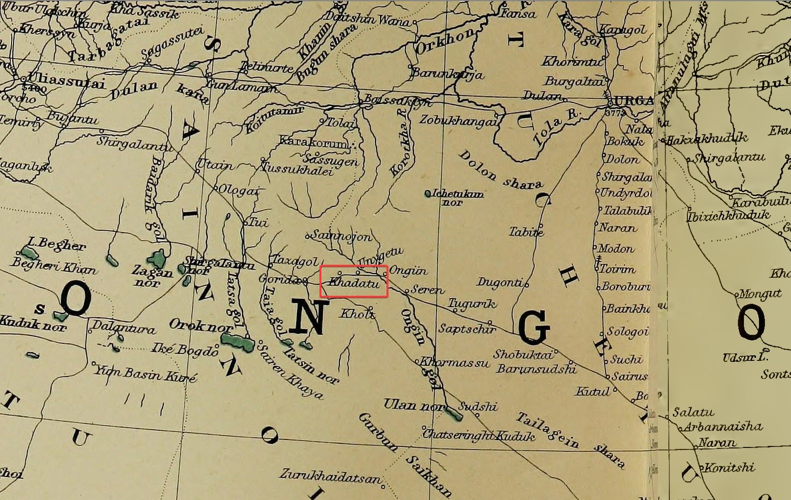

Не очень понятно, что означает «следовали обычному почтовому маршруту» Норзунова, вероятно сначала сначала путешественники двинулись на юг по почтовому тракту на Сайр-усу, а потом свернули на запад в сторону Хадату. Однако это кажется не самым прямым путем. Сеть почтовых станций в то время была хорошо развита ([википедия](https://ru.wikipedia.org/wiki/%D0%A0%D1%83%D1%81%D1%81%D0%BA%D0%B0%D1%8F_%D0%BF%D0%BE%D1%87%D1%82%D0%B0_%D0%B2_%D0%9C%D0%BE%D0%BD%D0%B3%D0%BE%D0%BB%D0%B8%D0%B8)) и карта Стэнфорда хорошо ее показывает.

Реки Онгин гол (Stanford: Ongin gol), Туйн гол (Stanford: Taia gol), Таацын гол (Stanford: Tatsa gol). Нужно обратить внимание, что на карте Стэнфорда перепутаны местами Туйн гол (Taia gol), Таацын гол в реальности западнее находится не Таацын гол а Туйн гол.

Населенных пунктов с названием Хадату найти не удается, судя по пройденному расстоянию и дорогам лучше всего под это название подходит Хайрхан-Дулан, сомон аймака Уверхангай (монг. Хайрхандулаан, [Генштаб 5 км](https://nakarte.me/#m=12/45.98098/102.10659&l=T), [википедия](https://ru.wikipedia.org/wiki/%D0%A5%D0%B0%D0%B9%D1%80%D1%85%D0%B0%D0%BD%D0%B4%D1%83%D0%BB%D0%B0%D0%B0%D0%BD)). В пользу этого населенного пункта так же говорит наличие в 20 км к востоку от него хребта Нариийн Хадатын Нуруу.

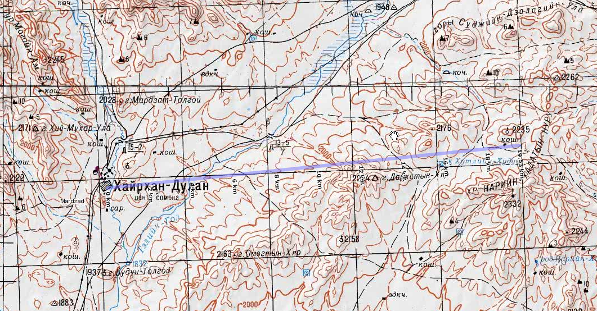

Так же необходимо отметить, что по прошлым поискам (например Бухуг ертее), почтовым станциям начала 19 века не обязательно соответствуют современные населенные пункты, поэтому возможно, что никакого населенного пункта на месте Хадату и не нужно искать.

Изображенный у Стэнфорда тракт от Сайр усу на Улясутай требует отдельного изучения, топонимы по его следованию находятся очень плохо. Холт, располагающийся ближе всего к Хадату упоминается у Певцова ([источник](https://ru.wikisource.org/wiki/%D0%9F%D1%83%D1%82%D0%B5%D1%88%D0%B5%D1%81%D1%82%D0%B2%D0%B8%D1%8F_%D0%BF%D0%BE_%D0%9A%D0%B8%D1%82%D0%B0%D1%8E_%D0%B8_%D0%9C%D0%BE%D0%BD%D0%B3%D0%BE%D0%BB%D0%B8%D0%B8_(%D0%9F%D0%B5%D0%B2%D1%86%D0%BE%D0%B2))). Певцов шел от Улясутая через Гориду (есть у Стэнфорда), но не дойдя до Хадату свернул на Холт.

> Высокий же кряж Бурхан, тянущийся с запада на восток и служащий, как было упомянуто, южною окраиною горной страны между реками Таца-голом и Горида-голом, исчез от наших взоров при спуске с гор в долину р. Горидуин-гол. Но мы усматривали его еще в первый день пути от пикета Гориды, пока шли по открытой местности. По совету монголов мы повернули круто на юг и, пройдя версты две по увалу, снова спустились в ту же впадину, уклоняющуюся в этом месте, как замечено, почти прямо на восток и суживающуюся до двух верст. На дне ее, около обширных зарослей дэрису, у колодца Холт, мы остановились на дневку.

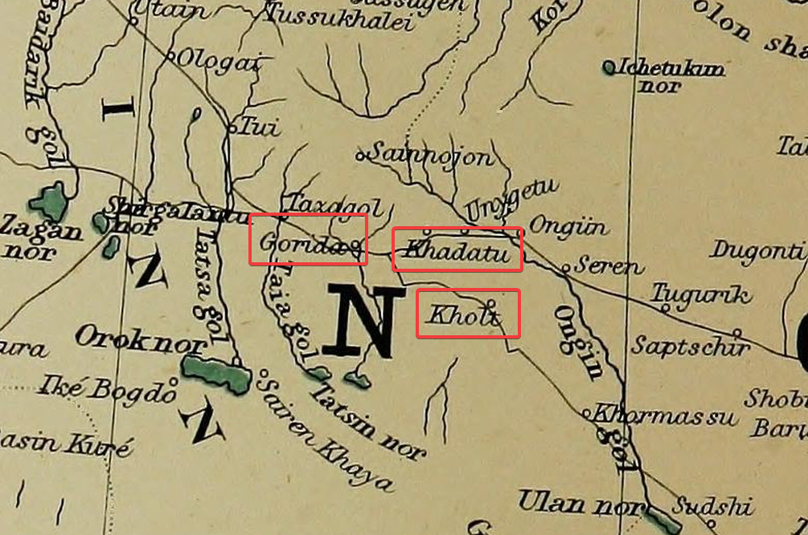

## Кальбийты-уула (Kalbiyty-oula)

Норзунов/Деникер:

> и нам потребовалось три дня, чтобы пересечь горную цепь Кальбийты-уула

С этим топонимом непонятно, нигде не удалось его найти. Монголисты говорят, что название не похоже на монгольское и ни на что не похоже.

Надеюсь, Норзунов не имел в виду, что он добрался за 3 дня от Хадату до Юндун-бэйсеин-куре, потому что это физически невозможно. Между ними 280 км по прямой. Видимо 3 дня переход занял только через горную цепь, их по пути несколько.

## Юндун-бэйсеин-куре (Youndoun-beisiin-kure)

Юм бэйсийн хурээ это дословно монастырь Юм бэйсэ, т.е. князя Юма.

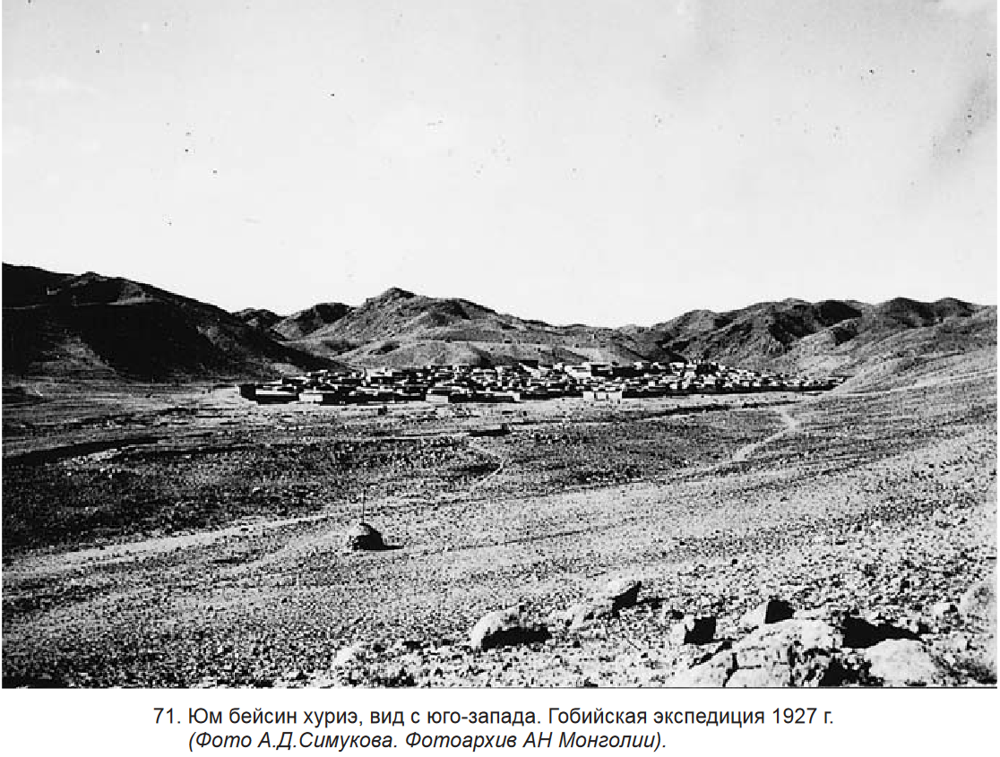

Норзунов/Деникер:

> и добраться до монастыря Юндун-бэйсеин-куре. Этот монастырь не отмечен ни на одной из существующих карт Монголии.

Митруев:

> В книге Ю. Н. Рериха «По тропам Срединной Азии», переведенной с английского Н. Н. Зелинским, упоминается караванный маршрут через Юмбейсе --- Аньси \[Рерих 1982: 122\].

Маршруту Урга --- Юндун-бэйсеин-куре у Рериха посвящена целая глава «[Урга --- Юм-Бейсе Кюрен](https://roerich-lib.ru/index.php/yu-n-rerikh/po-tropam-sredinnoj-azii/3945-ix-urga-yum-bejse-kyuren?ysclid=m05ncf08xy185773842)». На [главной монгольской карте монастырей](https://www.mongoliantemples.org/mn/component/domm/?view=map&amp;Itemid=160) такого монастыря --- нет.

Однако, в очерке УЛААНБААТАР - ХАРХОРИН - АРВАЙХЭЭР (СЕРГЕЙ ВОЛКОВ, 18 октября 2004 г.) можно найти, что Юм-Бейсе это якобы Баянцагаан.

> БАЯНЦАГААН (ЮМ-БЕЙСЕ). На юг от БаянЦагаана, расположенного с южной стороны Гобийского Алтая (г. Баян-Цашгаан уул, 3452 м) вдоль основания пустынных гор пролегают большие гряды песчаных дюн, которые часто трудны для пересечения на автомобилях. Дорога на БаянЦагаан (бывший Юм-Бейсе) с давних пор использовалась тибетскими караванами и монгольскими паломниками, идущими в Лхасу или возвращающимися оттуда. Этим путем прошла в апреле 1927 года и знаменитая Центральноазитская экспедиция, возглавляемая профессором Н. Рерихом.

Yum Basin Kure на карте Стэнфорда находится действительно в подходящем районе:

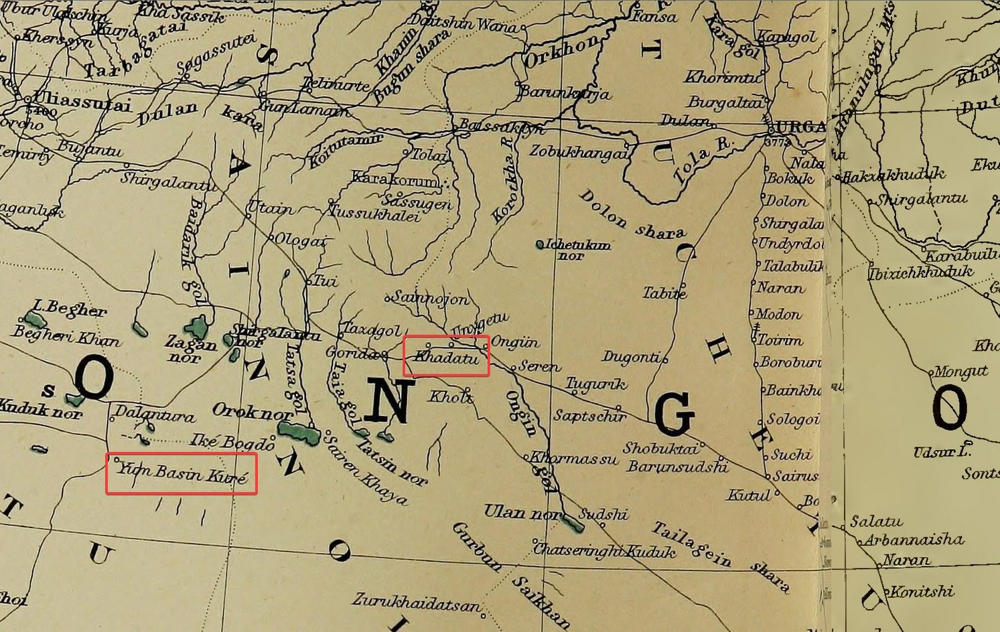

На русскоязычных Google maps этот населенный пункт называется Баянцагаан ([википедия](https://ru.wikipedia.org/wiki/%D0%91%D0%B0%D1%8F%D0%BD%D1%86%D0%B0%D0%B3%D0%B0%D0%B0%D0%BD_(%D0%91%D0%B0%D1%8F%D0%BD%D1%85%D0%BE%D0%BD%D0%B3%D0%BE%D1%80))) --- сомон аймака Баянхонгор, это так же видно по названию дороги которая к нему ведет.

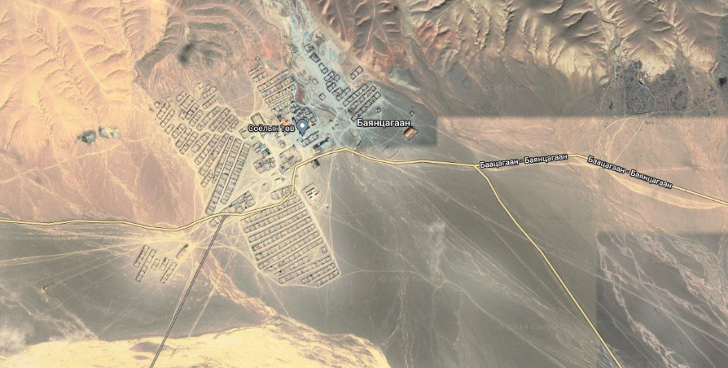

На веб-версии Google Maps это Баянбулаг (Bayanbulag) ([ссылка](https://maps.app.goo.gl/NcvRv5yp7WBEjarn6)).

На 5км топокартах это тоже Баянцагаан ([ссылка](https://nakarte.me/#m=13/45.02404/98.90682&l=T/W&q=%D0%91%D0%B0%D1%8F%D0%BD%D1%86%D0%B0%D0%B3%D0%B0%D0%B0%D0%BD&r=45.014236/98.928677/Bayantsagaan)).

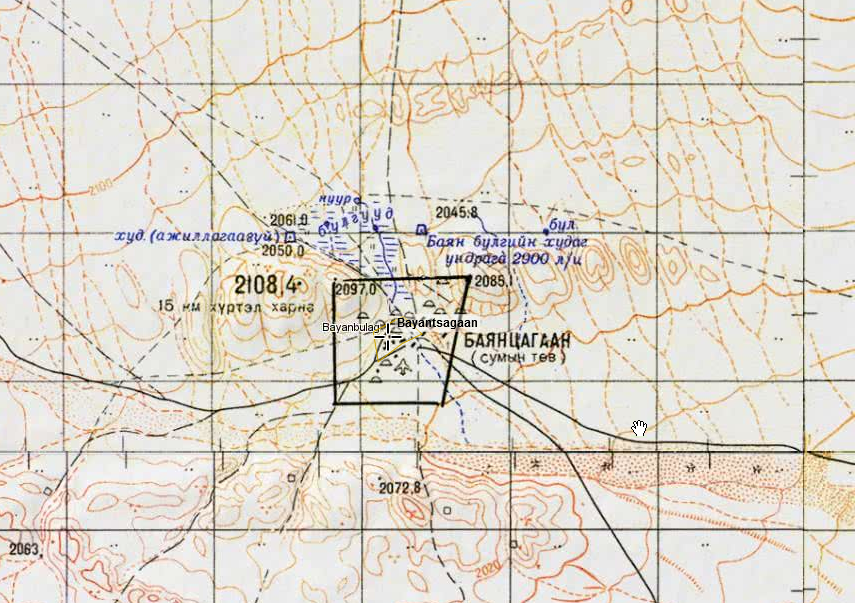

Однако, непонятно, откуда Волков взял информацию для очерка выше и на самом деле Юндун-бэйсеин-куре находится на 50 км южнее и фигурирует на современных картах под названием Амар Буянтын Хурэний Турь.

5 км ([ссылка](https://nakarte.me/#m=12/44.65595/98.75576&l=T/W&q=%D0%91%D0%B0%D1%8F%D0%BD%D1%86%D0%B0%D0%B3%D0%B0%D0%B0%D0%BD&r=45.014236/98.928677/Bayantsagaan))

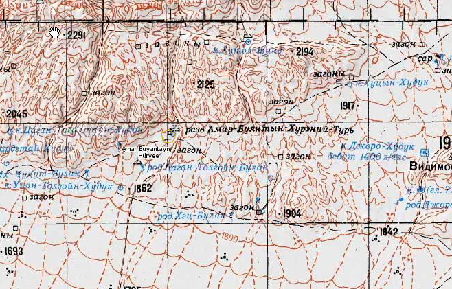

2 км ([ссылка](https://nakarte.me/#m=14/44.63147/98.72066&l=T/W&q=%D0%91%D0%B0%D1%8F%D0%BD%D1%86%D0%B0%D0%B3%D0%B0%D0%B0%D0%BD&r=45.014236/98.928677/Bayantsagaan))

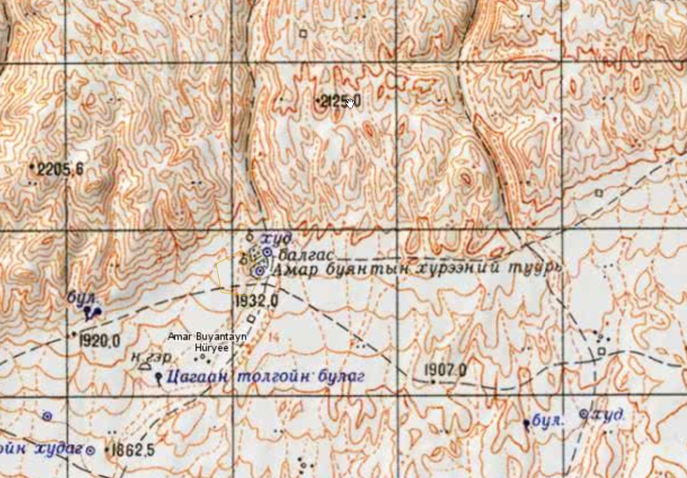

Колодец Цагаан толгойн булаг отмеченный на карте упоминается в дневниках Рериха ([здесь](https://roerich-lib.ru/index.php/yu-n-rerikh/po-tropam-sredinnoj-azii/3945-ix-urga-yum-bejse-kyuren?ysclid=m05ncf08xy185773842)):

> Возле монастыря мы не нашли подходящего места для установки лагеря, и нам посоветовали установить лагерь за монастырем в местечке, носящем местное название Цаган Тологой -- «Белая Голова» -- по имени горы западнее монастыря. Место, выбранное для лагеря, было на берегу крошечной речки Цаган Тологой\-усу.

Информация из Geonames (ресурс собирающий топонимы с разных топографических карт) так же подтверждает, что это два названия одного и того же места ([ссылка](https://geonames.nga.mil/geonames/GeographicNamesSearch/)):

> Yum Beise is also known as Amar Buyantayn Huryee, Amar Buyantayn Hüryee, Amar-Buyantayn-Huree, Amar-Buyantayn-Hüree, Amor Buyantiin Khure, Amor buyant'uin hurie, Amor buyantuin-fure, Amor buyant'uin hürie, Amor-Buyantuyn-Khure, Amur Bayantuin Khure, Amur buyantuin hurie, Amür büyantuin hurie, Kumirnya Yum-beysen-khure, Yum Beise, Yumu-beisen kure. Its coordinates are 44°37'0" N and 98°42'0" E in DMS (Degrees Minutes Seconds) or 44.6167 and 98.7 (in decimal degrees). Its UTM position is MK74 and its Joint Operation Graphics reference is NL47-11.

Наконец последнее подтверждение, монастырь под именем Амар буянт [присутствует](https://www.mongoliantemples.org/mn/component/domm/213?view=oldtemplemn) на сайте Documentation of Mongolian Monasteries. Указано, что старое название монастыря Юм бэйсийн хошуу.

[Еще факты про монастырь](http://www.touristinfocenter.mn/cate1_more.aspx?ItemID=526) и про его посещение Далай-ламой и Рерихом.

## Ушкемталы (Ouchkem-taly)

Норзунов/Деникер:

> Он \[Юндун-бэйсеин-куре\] находится недалеко от станции Ушкемталы к западу от Урги.

Станцию или соответствующий ей населенный пункт найти не удалось. Вообще о почтовом тракте от Сайр-усу до Улясутая, на котором по всей видимости должна быть эта станция, информации очень мало. В отличие от секции Сайр-усу --- Урга.

## Нанси (Ngan-si)

Норзунов/Деникер:

> Отправившись из Юндун-бэйсе-куре, мы пересекли пустыню Гоби за 22 дня на верблюдах, которые мы арендовали по 12 лан (48 франков) за каждого. ... В китайском городе Нанси я встретил монголов Геге, подданных принца Курлук-бэйсе.

Митруев:

> Во французском тексте «Три поездки в Лхасу» Ж. Деникер приводит написание названия этого города Ngansi \[Deniker 1904: 219\]. В статье «New Light of Lhasa, the forbidden city» \[Deniker 1903: 549\] он пишет название этого города Ansi. Дж. Снеллинг дает другое написание названия этого города An-his \[Snelling 1993: 61\].

Еще варианты названий: Anxi, Ansichow (карта Стэнфорда, упоминания в [Wiktionary](https://en.m.wiktionary.org/wiki/Ansichow)), Аньси (5 км). современный Huancheng Town, 环城乡, Guazhou County, Jiuquan, Gansu, China, 736199, [wiki](https://en.wikipedia.org/wiki/Huan_County), [вики](https://ru.wikipedia.org/wiki/%D0%A5%D1%83%D0%B0%D0%BD%D1%8C%D1%81%D1%8F%D0%BD%D1%8C).

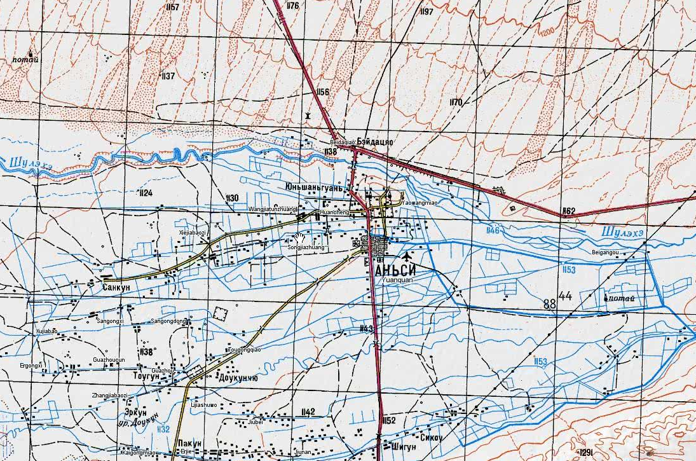

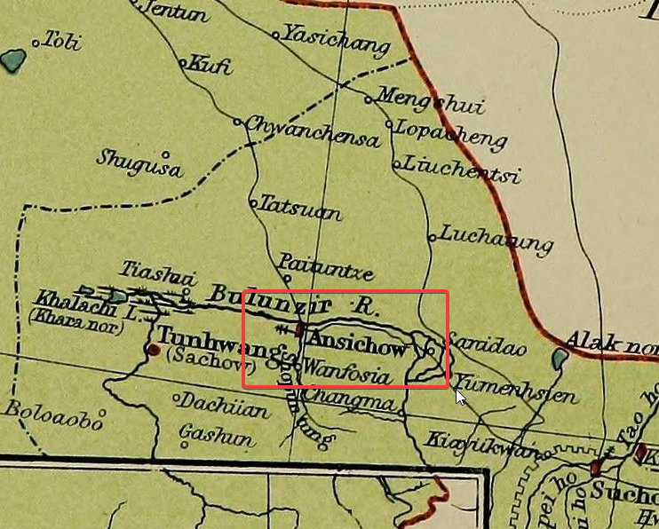

## Тайчжинар

Норзунов/Деникер:

> В результате этого акта отречения монголы отвели меня в страну Тайчжинар, где я немедленно арендовал лошадей, ...

Не топоним.

## Нагчукхе (Nakhtchoutka)

Норзунов/Деникер:

> чтобы отправиться на тибетскую границу в Нагчукхе (Митруев: Тиб. nag chu kha. Местность в Тибете.), заплатив по 6 лан (24 франка) за лошадь.

Знаменитый населенный пункт, где останавливали многих западных путешественников пытавшихся попасть в Лхасу. В том числе тут остановили [третью экспедицию Пржевальского](https://ru.wikipedia.org/wiki/%D0%9F%D1%80%D0%B6%D0%B5%D0%B2%D0%B0%D0%BB%D1%8C%D1%81%D0%BA%D0%B8%D0%B9,_%D0%9D%D0%B8%D0%BA%D0%BE%D0%BB%D0%B0%D0%B9_%D0%9C%D0%B8%D1%85%D0%B0%D0%B9%D0%BB%D0%BE%D0%B2%D0%B8%D1%87#%D0%A2%D1%80%D0%B5%D1%82%D1%8C%D0%B5_%D0%BF%D1%83%D1%82%D0%B5%D1%88%D0%B5%D1%81%D1%82%D0%B2%D0%B8%D0%B5_%D0%B2_%D0%A6%D0%B5%D0%BD%D1%82%D1%80%D0%B0%D0%BB%D1%8C%D0%BD%D1%83%D1%8E_%D0%90%D0%B7%D0%B8%D1%8E_(1879%E2%80%941880)).

Одно время был --- Хэйхэ 黑河专区, потом снова Нагчу 那曲 ([вики](https://ru.wikipedia.org/wiki/%D0%9D%D0%B0%D0%B3%D1%87%D1%83)).

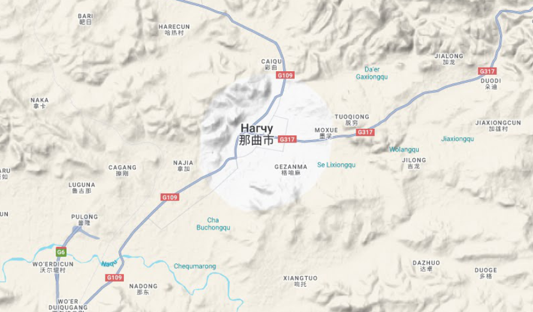

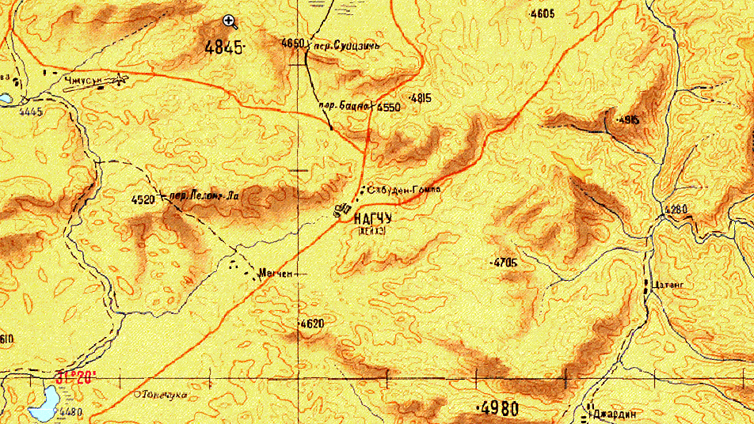

## Гандан (Gandan)

Норзунов/Деникер:

> Именно здесь часовые охраняют от жителей запада вход в наш святой город. Направляясь всё время на юг, я оставил позади высокие цепи Гандана, которые я пересек через несколько перевалов...

## Кечанг, Ко-ланг-го-ла (Ké-tchang, Ko-lang gola)

Норзунов/Деникер:

> Я благополучно прибыл в Кечанг (Ко-ланг-го-ла на некоторых картах), последнюю остановку перед Лхасой, откуда в хорошую погоду ее можно увидеть. Это было в марте 1899 года.

Митруев:

> Во французском тексте «Три поездки в Лхасу» Ж. Деникер приводит написание названия этого места Ké-tchang или Ko-lang gola \[Deniker 1904: 220\]. В статье «New Light of Lhasa, the forbidden city» \[Deniker 1903: 549\] он пишет название этого Ko lam или Ketcha. Дж. Снеллинг дает другое написание названия этого места: Go-La \[Snelling, 1993: 62\]. Г. Ц. Цыбиков переводит название перевала Го-ла как «Голова перевал» \[Цыбиков 1991: 72\]. На самом же деле это перевал, известный на тибетском как 'phan po sgo la', что значит «перевал-врата» области Пенпо.

Тут все понятно. Митруев прав, Цыбиков тоже прав. На 5 км картах этот перевал называется Пенбого. Пэн-бо это река, из долины которой поднимаешься на перевал, чтобы с него спуститься к Лхасе. Получается Пэн-бо Го-ла.

Этот перевал есть на OpenStreetMap ([объект](https://www.openstreetmap.org/node/996928319)), там он называется Paingola Pass (彭波果拉, Péng bō guǒ lā).

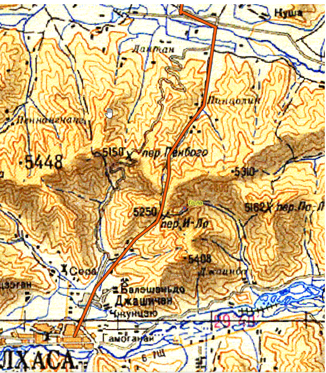

## Итого

Благодаря отдельному исследованию ([карта и описание](/notes/tsybikov-map/)) мы довольно точно знаем как проходил маршрут Цыбикова из Урги в Лхасу. Здесь мы так же восстановили маршрут его современника Норзунова. Несмотря на скудное описание и малое количество топонимов, можно смело утверждать что он значительно отличался от маршрута Цыбикова.

Зеленая линия --- Норзунов.

Оранжевая --- Цыбиков.

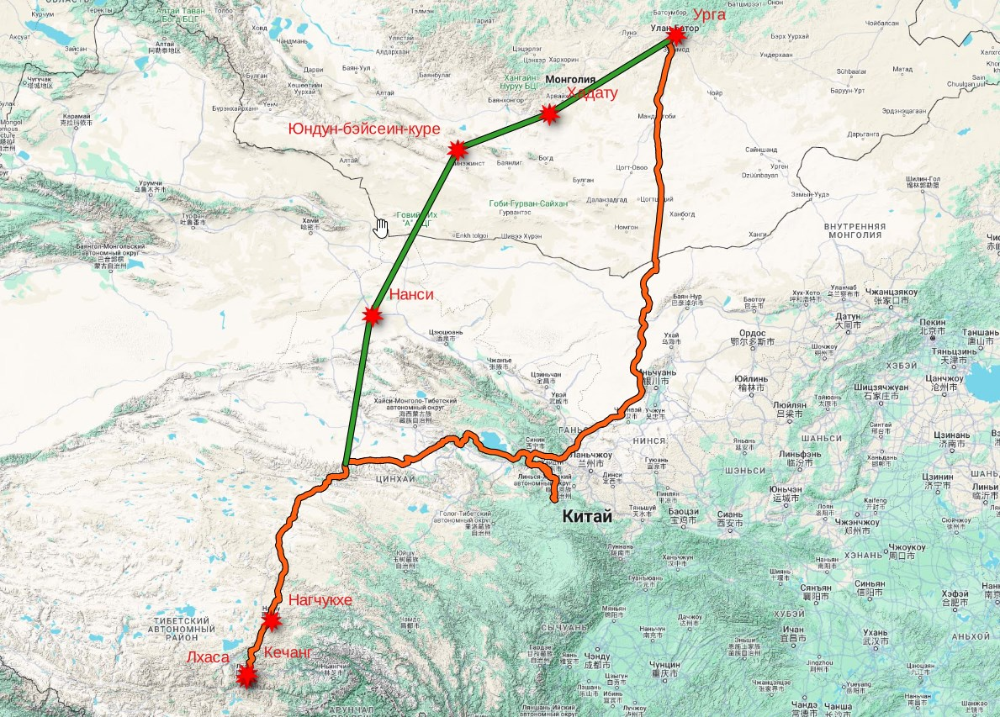

## Комментарии

[**Обсудить**](https://t.me/answer42geo/33)
