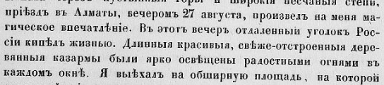

## Введение

Набор автозамен для превращения старой русской орфографии в современную.

## Автозамены

ѣ -> е

ъ  ->  # c пробелом для очистки окончаний слов

ъ. -> . # замена ъ в конце предложений

ъ, -> , # замена ъ в конце предложений

ъ- -> - # замена ъ в составных словах

Ѳ -> Ф

## Замены под контролем

Эти замены лучше выполнять под контролем:

ъ ->  #удаление оставшихся ъ, но см. «объезд» и др.

і -> и

ыя -> ые

няг -> нег

аго -> ого #иногда его

зс -> сс

## Комментарии

[**Обсудить**](https://t.me/answer42geo/63)
