## Введение

Археологический комплекс «Орнок» расположен в 4.5 км от села Орнок (Орнёк), Кыргызстан и представляет собой одно из крупнейших скоплений петроглифов в Северном Прииссыккулье. Здесь насчитывается до тысячи камней с древними изображениями.

Геологически рельеф комплекса является флювиогляциальным выносом который интегрировал в себя морену. Валуны моренного происхождения, то есть принесены льдом и доработаны талыми водами. Признаков сортировки не наблюдается.

Чтобы представить район работ и объекты инвентаризации можно [посмотреть фотографии](/notes/ornok-photo-2024/).

Данное описание представляет результаты работы в рамках экспедиции РГО по следам Петра Семенова-Тян-Шанского, приуроченную к 200-летию со дня рождения географа.

## Условия работы

* Постоянное наличие сотового сигнала и интернет.
* Температура 25-30 градусов.
* Отсутствие помех для GPS сигнала.
* Пересеченная местность (но не сильно).

## Перечень программного обеспечения

Здесь перечень использованного ПО и ссылки, чтобы не повторять их в тексте.

* [NextGIS Web](https://nextgis.ru/nextgis-com) - база данных и интерактивные карты.
* [NextGIS Mobile](https://nextgis.ru/nextgis-mobile) - сбор данных в поле, приложение для Android.
* [NextGIS Tracker](https://nextgis.ru/nextgis-tracker) - запись треков, приложение для Android.
* [NextGIS Toolbox](https://toolbox.nextgis.com) - набор дополнительных инструментов для разных операций, ссылки на конкретные - в тексте.
* [NextGIS QGIS](https://nextgis.ru/nextgis-qgis) - настольная ГИС для базовой работы с данными. В отличие от ПО выше использовать не принципиально, можно использовать и обычный [QGIS](https://qgis.org).

## Уточнение района работ

Центральная локация комплекса:

* [OpenStreetMap](https://www.openstreetmap.org/#map=14/42.63337/76.88466)
* [Яндекс карты](https://yandex.ru/maps/?ll=76.873287%2C42.633713&z=16.01)
* [Google maps](https://maps.app.goo.gl/wwdYgCu1xL79b2Pj8)

Координаты:

* Широта: 42.636517
* Долгота: 76.869140

После выбора центральной точки была предварительно определена площадь работ. Для этого использовали **NextGIS QGIS**: добавили подложку Google Satellite и обвели интересующую территорию скоплений валунов. Программа рассчитала площадь — она составила 27,5 га.

Позже район и площадь работ были уточнены. Во время первого выезда использовали **NextGIS Mobile**: с его помощью выполнили обход территории, рисуя полигон прямо по ходу движения. Приложение автоматически замыкает полигон при завершении обхода. Получившийся полигон заменил предварительно нарисованный.

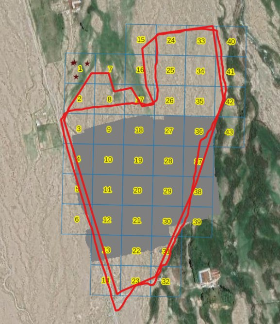

## Сетка квадратов

Территория работ была разбита на квадраты 100 на 100 метров с помощью инструмента **NextGIS Toolbox** "[Сетка в метрах](https://toolbox.nextgis.com/t/grid)". В инструмент загрузили полигон района работ, на выходе получили сетку с нумерованными квадратами.

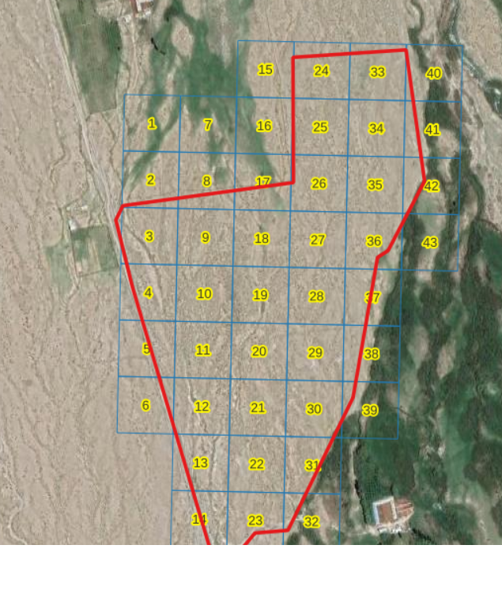

## Интерактивная визуализация и БД

Для хранения и визуализации картографических данных использовалась **NextGIS Web**. Это решение позволяет создать собственную Веб ГИС — аналог базы данных, специально предназначенной для управления пространственными данными и отображения их на веб-картах.  
Веб ГИС, созданная с помощью **NextGIS Web**, может обмениваться данными с другим программным обеспечением, поддерживает подключение внешних сервисов и работу с потоками геоданных.

Все картографические слои производимые в процессе работы добавлялись на единую интерактивную карту.

Для начала добавили два слоя и картографическую подложку:

* Район работ
* Сетка квадратов
* Google Satellite

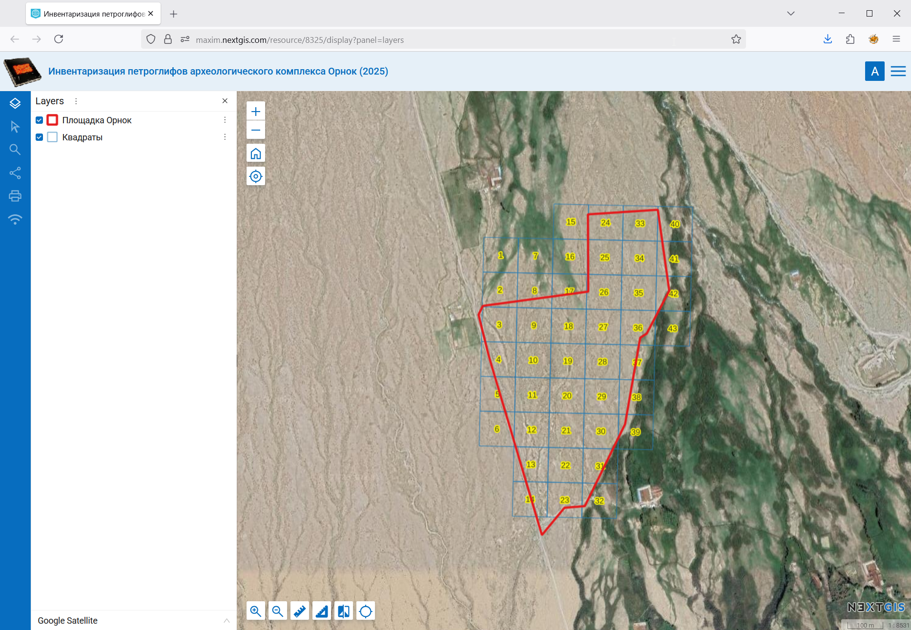

## Съемка с БПЛА

Съёмка с дронов проводилась с помощью DJI Mavic 2 Pro и DJI Mini 4 Pro. Mavic летал по заранее заданным маршрутам через программу Litchi, а Mini управлялся вручную через DJI Fly. Для создания ортофотопланов использовалась программа Agisoft Metashape. Высота полёта составляла 50 метров, перекрытие снимков — 60%. Чтобы полностью охватить территорию с такими параметрами, требуется около 8 аккумуляторов.

Основные задачи решаемые ортофотопланами две:

1\. Базовая основа для точной привязки петроглифов.

2\. Базовая основа для обзорных целей.

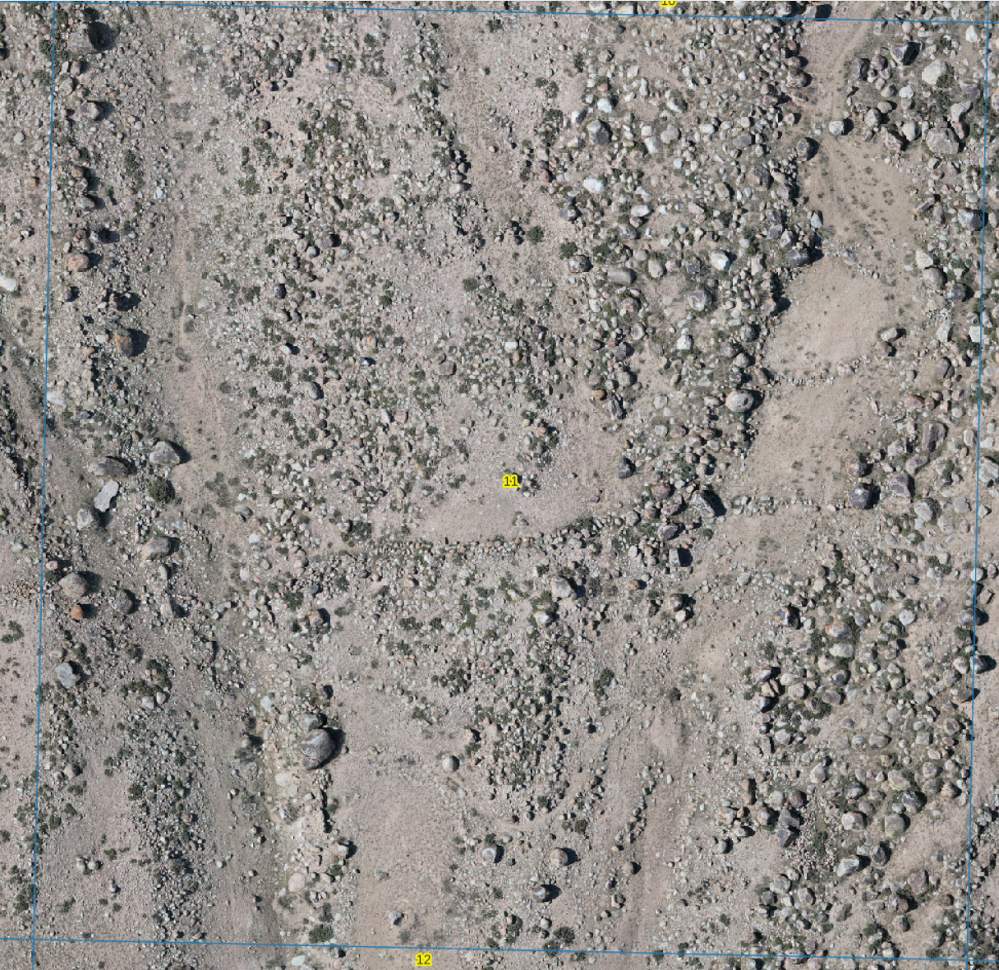

")

Сложности:

* В новых моделях дронов DJI, например Mini 4 Pro компания отказалась от поддержки API для сторонних приложений. Из-за этого такие сервисы, как DroneDeploy, больше не могут подключаться к современным дронам DJI. В результате стало значительно сложнее выполнять автоматическую съёмку в режимах, необходимых для получения качественных ортофотопланов (например, полёт по сетке или в режиме Land Mower).

Частично решить проблему с ограничениями DJI помогает веб-сервис [ancient.land](https://ancient.land/). Он позволяет задать параметры съёмки для выбранной территории и сформировать точки маршрута (*waypoints*), совместимые с приложением Litchi. Полученный план в формате CSV загружается в Litchi Mission Hub, откуда его можно использовать для автоматического полёта дрона.

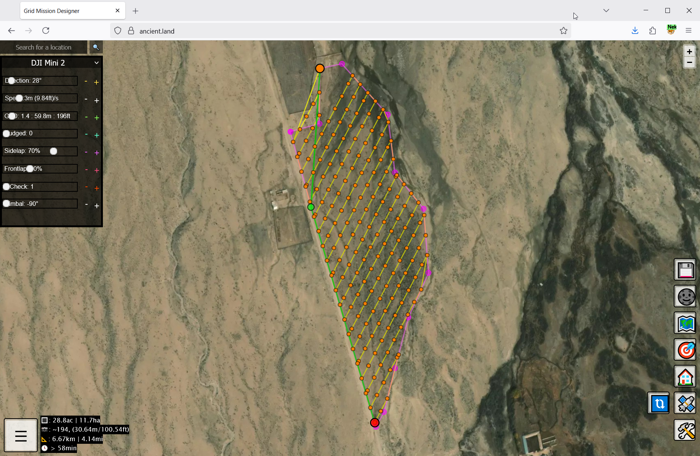

Съемку с БПЛА производили: Владимир Брызгалов и Олег Малютин. Сшивка ортофотопланов: Владимир, Артем Светлов.

## Полевой сбор данных - подготовка

Для начала работы в приложение в качестве слоёв данных из Веб ГИС добавили слой района работ и сетку.

На случай перебоев со связью в **NextGIS QGIS** с помощью модуля расширения [QTiles](https://github.com/nextgis/qgis_qtiles) был закэширован квадрат номер 11.

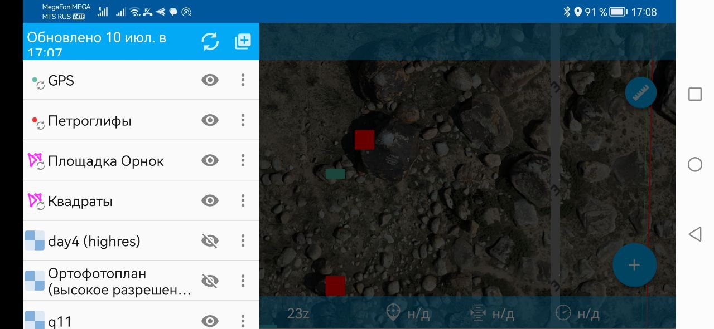

## Полевой сбор данных - петроглифы с точной привязкой

Для сбора данных по петроглифам в Веб ГИС была сделана форма ввода.

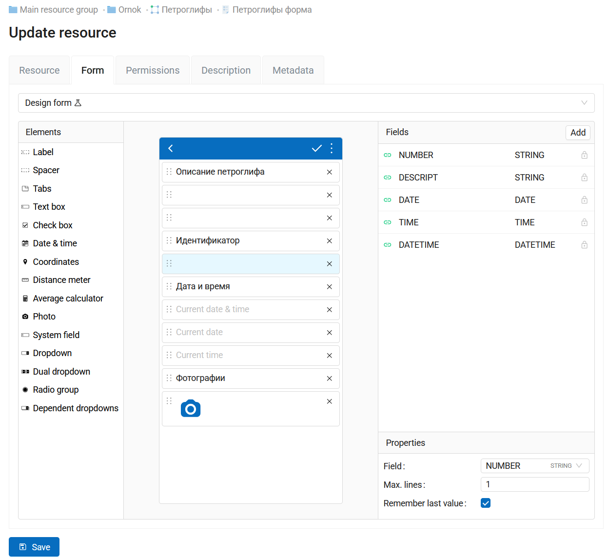

По каждому петроглифу собирали:

* Точная привязка к ортофотоплану.
* Идентификатор - уникальный номер в формате "Номер блока - Номер петроглифа".
* Дата и время съемки
* Фотографии
* Краткое описание

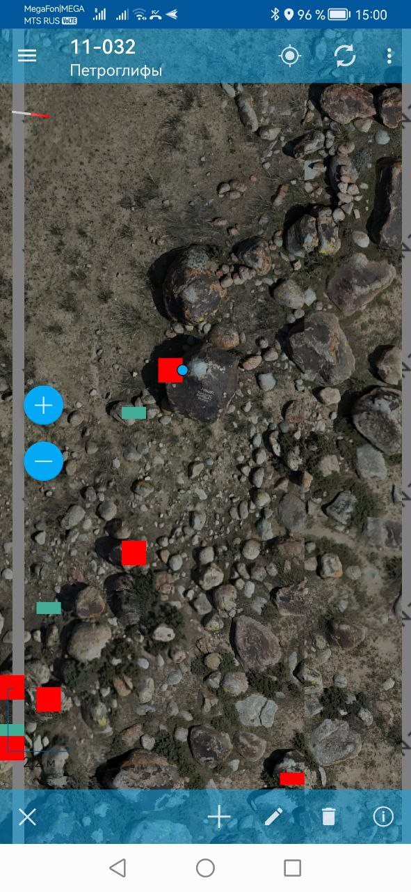

Сложностей с точной привязкой петроглифов оказалось много. Бытовые GPS дают абсолютную точность +/-5 метров, так как плотность валунов значительная - этой точности недосточно для точной абсолютной привязки с помощью GPS.

В итоге точная относительная привязка вычислялась по ортофотоплану. Для найденного петроглифа тут же в поле по ортофотоплану находился тот камень, на котором был обнаружен петроглиф. Дополнительно снимали GPS координаты в отдельный слой с усреднением 20 локаций на точку. Усредненной локации присваивался тот же идентификатор, что и для локации привязанной к камню.

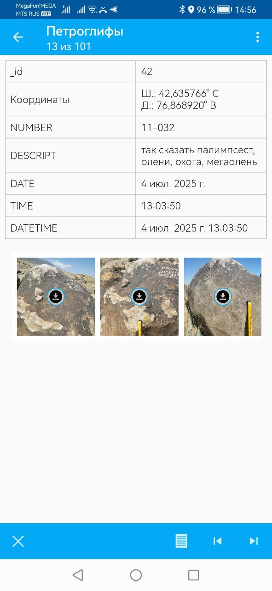

Так как слои данных связаны с Веб ГИС, то результаты автоматически синхронизируются с базой данных и отдельно ничего переносить не нужно.

## Полевой сбор данных - дополнительные петроглифы

Дополнительно был выделен день для обхода территории в более свободном режиме с привлечением помощников.

У помощников на телефонах был заранее проверен режим фотографирования, убедились, что GPS координаты записываются в EXIF фотографий, выданы линейки.

В поле помощникам был обозначен примерный квадрат работ. Был опробован режим отслеживания себя в поле с учетом границ нужных квадратов на мобильной версии Веб карты. Функция "Locate me" позволяет увидеть свой маркер на карте и непрерывно отслеживать его местоположение. Преимущество этого способа в том, что не нужно ставить никаких дополнительных приложений, подходит любой современный мобильный браузер.

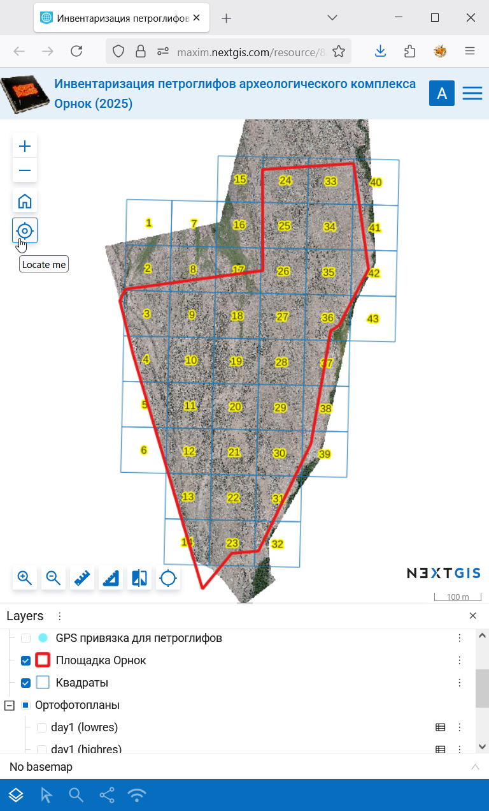

От этого подхода решили отказаться, так как он требовал постоянного наличия Интернет, которого у большинства студентов не было.

После сбора данных фотографии были собраны и превращены в слой данных с помощью [exif2resource](https://toolbox.nextgis.com/operation/exif2resource). Инструмент создает в целевой Веб ГИС точечный слой данных. Каждая точке присваиваются координаты считанные из EXIF меток фотографий, так же прикладывается к каждой точке сама фотография. Кроме фотографии, исходного имени файла и времени съемки можно указывать имя фотографа.

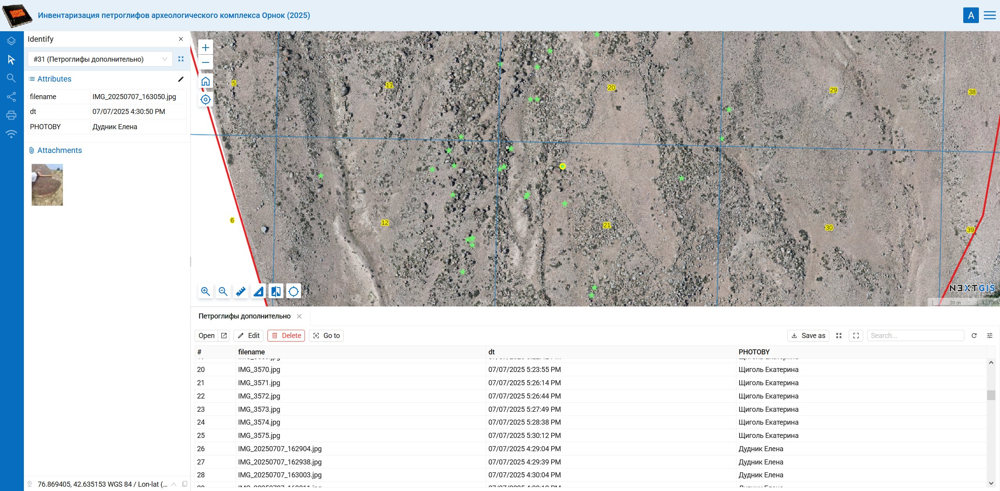

## Трекинг

**NextGIS Tracker** - отдельное приложение созданное, чтобы хорошо выполнить две функции:

* Запись GPS треков
* Синхронизация собранных треков с облаком

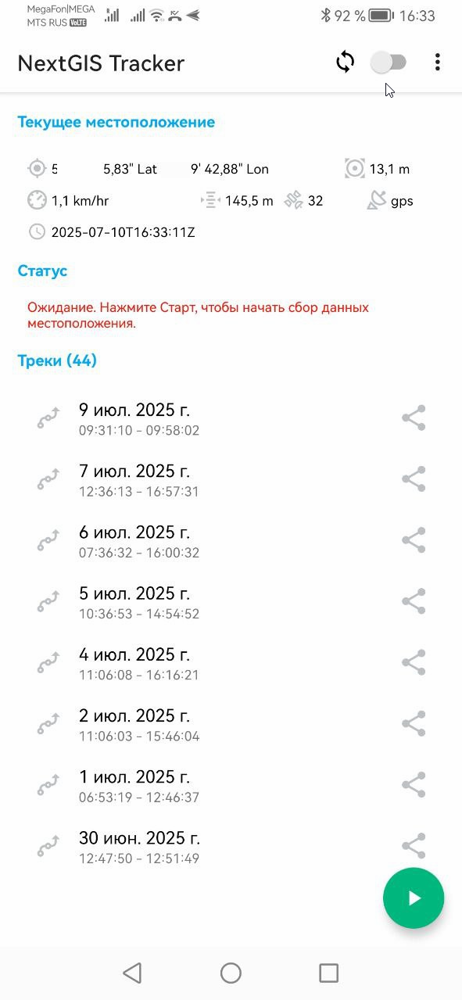

Синхронизацию не использовали, а треки ежедневно писались весь рабочий день со следующими параметрами:

* Частота получения локации: 1 секунда.
* Мин. расстояние выбора координат: наиболее часто.

Такие параметры позволяют получить наиболее подробную информацию о перемещении.

Треки использовались как вспомогательная информация об обследованности района работ. В дальнейшем треки также могут пригодится для дополнительной привязки фотографий по времени съемки.

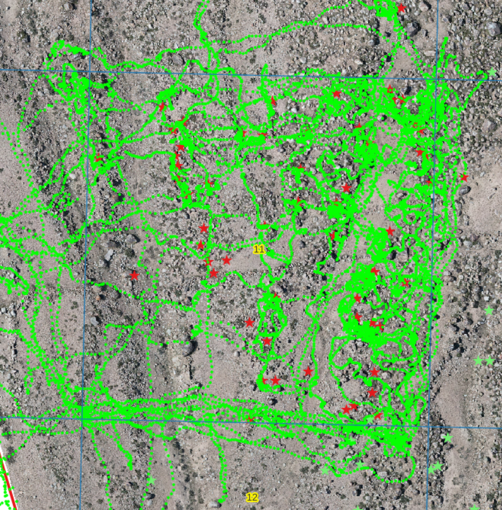

## 3D визуализация

Для 59 камней с петроглифами выполнено фотографирование для производства 3D визуализаций. Делалось 20-30 фото со всех сторон. Построение моделей выполняется в RealityScan.

 <iframe title="Issyk-Kul Ornok petroglyph 20250701-10-46 v1" frameborder="0" allowfullscreen mozallowfullscreen="true" webkitallowfullscreen="true" allow="autoplay; fullscreen; xr-spatial-tracking" xr-spatial-tracking execution-while-out-of-viewport execution-while-not-rendered web-share src="https://sketchfab.com/models/2228ffc1e9f148d296a921ca38f19ceb/embed"> </iframe> 

## Итого

* Точно привязанных петроглифов: 59
* 3D моделей: 59 (в процессе подготовки)
* Дополнительно зафиксировано петроглифов: 145
* Публичная интерактивная карта со всеми материалами: <https://maxim.nextgis.com/resource/8282/display?panel=layers>

## Комментарии

[**Обсудить**](https://t.me/answer42geo/109)
