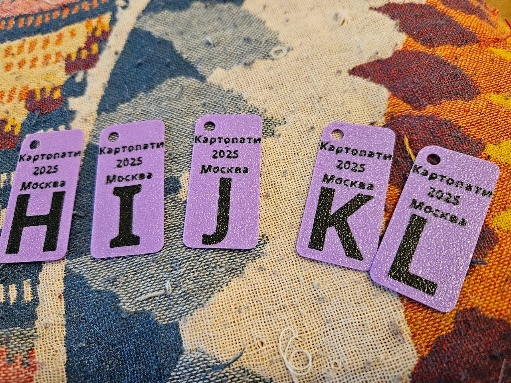

## Введение

20-летие OpenStreetMap проводилось в офисе NextGIS в формате пицца+пиво+презентации и [вдохновило](https://t.me/ruosm/894703) участника на проведение картопати.

В воскресенье после долгого перерыва состоялась встреча участников OpenStreetMap, она же картовстреча, она же mapping party, она же картовечеринка участников OpenStreetMap. Все собрались в парке Баумана, разобрали "пирог", разошлись мапить и собрались снова уже в баре.

## Обходной лист

С последней встречи прошло несколько лет, сбился со счету сколько.. Теперь много всяких приложений, StreetComplete, Every Door, да и Osmand полезен. Но я маплю по старинке, лучший инструмент для меня это бумага, она же обходной лист. Было удобно подглядывать в Every Door на предмет какие POI уже есть в здании. Повсюду много скамеек, так что все удобненько можно проделывать сидя.

Результат выглядит так:

Дополнительно к этому:

* Фотки с координатами в EXIF, которые потом в одно движение превращаются в точечный слой с приложенными фотками с помощью [такого инструмента](https://toolbox.nextgis.com/t/exif2resource).
* [NextGIS Tracker](https://nextgis.ru/nextgis-tracker/) постоянно пишет трек, сразу синхронизирует с облаком. Потом его можно смотреть вместе с фотками.

Бумага удобна тем, что у тебя полная свобода, можешь нарисовать всё, что захочешь.

Не очень удобно тем, что потом обязательно нужно вносить результаты обхода + все остальные стандартные недостатки бумаги.

Узнал интересное:

* Третье по частоте значение ключа name в мире = Ozon. 56 тыс значений. Первое Hauptstraße (нем., главная улица).
* Говорят в 2ГИС жестко работать, но зато компания успешно "присвоила" термин ГИС. Теперь "расказать про ГИС" = "рассказать про 2ГИС".
* Очень приятно и как-то я недодумался, делать такие штука на встречи (кажется печатают на 3D принтере). Мелочь, но хорошая память. Украду идею.

Приятное мероприятие.

## Комментарии

[**Обсудить**](https://t.me/answer42geo/83)
