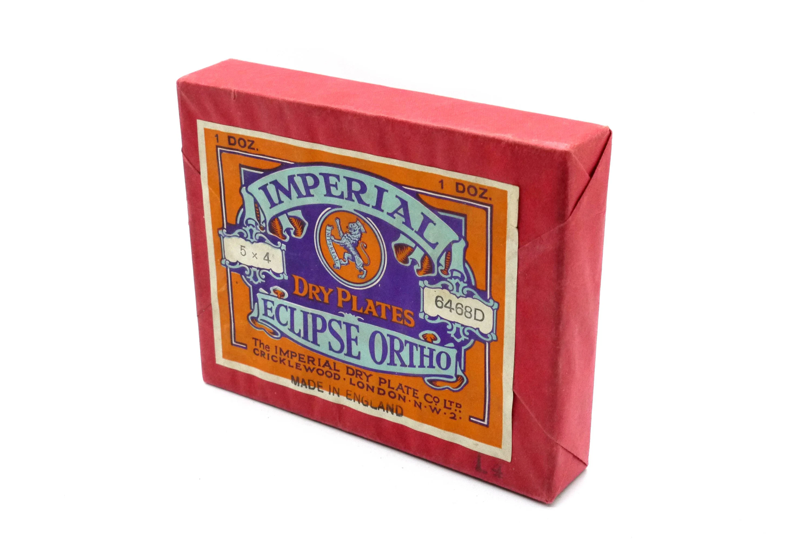
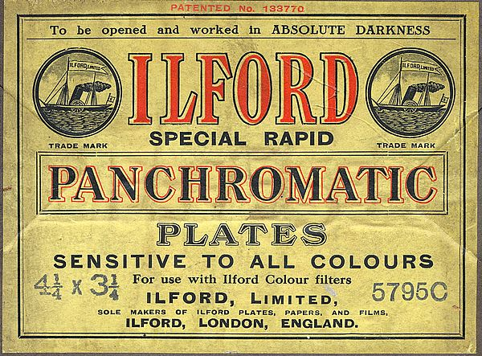

## Введение

Использовались какое-то время вместо пленки.

> Джордж Истмен (*George Eastman*) собрал первую машину для полива желатиносеребряной эмульсии на стеклянную подложку, основав «Компанию сухих пластинок Истмена». Впоследствии предприятие превратилось в мирового лидера по выпуску светочувствительных материалов Eastman Kodak.

[Википедия](https://ru.wikipedia.org/wiki/%D0%96%D0%B5%D0%BB%D0%B0%D1%82%D0%B8%D0%BD%D0%BE%D1%81%D0%B5%D1%80%D0%B5%D0%B1%D1%80%D1%8F%D0%BD%D1%8B%D0%B9_%D1%84%D0%BE%D1%82%D0%BE%D0%BF%D1%80%D0%BE%D1%86%D0%B5%D1%81%D1%81)

Собралась небольшая коллекция (конечно не полная) когда пытался расшифровать письмо Григорьева про фотографии Цыбикова и Норзунова, где он описывает какие фотокамеры и фотопластинки они использовали.

## Коллекция

**Seed's Dry Plates**

M.A. Seed Dry Plate Co. (later acquired by Eastman Kodak Co., Rochester N.Y.)

[source](https://www.ebay.com/itm/144763900051)

**Hammer Photographic Dry plates**

Hammer Dry Plate Co. St. Louis, MO.

[source](https://images.app.goo.gl/dgS4VoVZfrwgjcgh6)

**Stanley Dry Plates**

Stanley Dry Plates Co. Newton, Mass.

[source](https://www.amazon.com/Photographic-Dry-Plate-Boxes-Vintage/dp/B09PX2Y74Y)

**The Standard Extremely Rapid Dry Plates**

Eastman Kodak Co., Rochester N.Y.

[source1](https://www.largeformatphotography.info/forum/showthread.php?159730-NOS-1884-5X7-Dry-Plate-Exposed-Today), [source2](https://www.ebay.com.my/itm/174715217896)

[source](https://images.app.goo.gl/g3fiHNBXkuDvC4HQ9)

**Bromfield Extra Rapid Dry Plates**

Wuestner's Eagle Dry Plate Co. Boston, Mass

[source](https://images.app.goo.gl/vUdP8cDGjUdRE3b88)

**Cramer's Double Coated Photo Dry Plates**

Cramer dry plate Co. St. Louis, MO

[source](https://images.app.goo.gl/HyRdUAmM4BE3peHg8)

**Austral Dry Plate**

Thomas Baker & Co. Austral Laboratory. Melbourne.

[source](https://images.app.goo.gl/KcRRCZJ5xrNE2GNK9)

Central Dry Plates

Central Dry Plate Co, St. Louis, MO

[source](https://images.app.goo.gl/4nS6B7XyTywEcjWv8)

**Lumiere Orthochromatic Dry Plates Extra Rapid**

A. Lumiere Et Ses Fils. Lyons, France.

[source](https://staylorucbcphoto.wordpress.com/2016/04/28/lumiere-dry-plate/)

**Imperial Eclipse Dry Plates**

The Imperial Dry Plate Co. Ltd. Cricklewood, London N.W.

[source](https://images.app.goo.gl/EKDQixbpZxh6N8oC7)

**Ilford Special Rapid Panchromatic Plates**

Ilford, Limited, London, England

[source](https://images.app.goo.gl/bUL5Xw1Y1P4kRaNeA)

**Ilford Empress Plates**

[source](https://images.app.goo.gl/vj6Rti1S42ULuyK58), [source2](https://www.photomemorabilia.co.uk/Ilford/Ilford_Plate_Boxes.html)

## Комментарии

[**Обсудить**](https://t.me/answer42geo/16)
