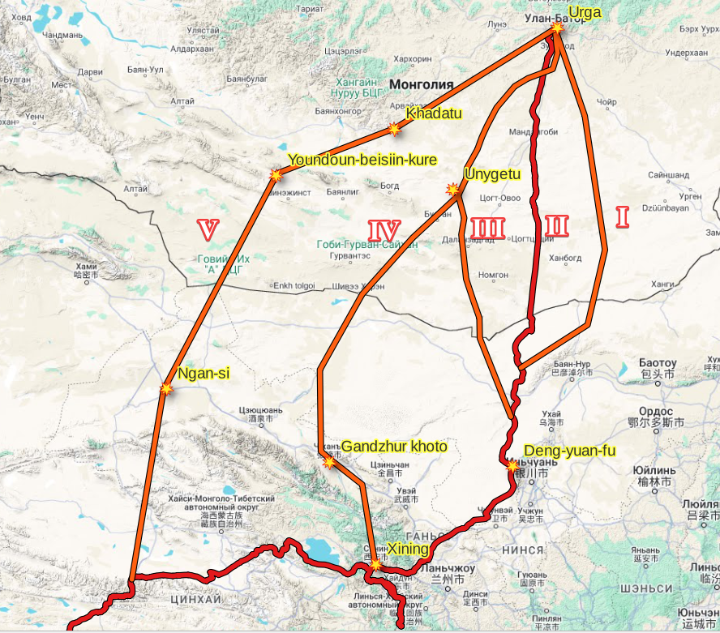

## Introduction

Tibet --- and Lhasa in particular --- was a highly sought-after destination in the late 19th and early 20th centuries. Many western travelers attempted to reach Lhasa, often taking unconventional routes, but most failed in their efforts. In addition to these expeditions, there were also several traditional and well-established pilgrimage routes used by Buddhist devotees, beginning in Urga (modern-day Ulaanbaatar, Mongolia).

In this study, we aim to reconstruct the detailed paths of these pilgrimage routes by analyzing the travel diaries of Norzunov, Shishmarev, and Tsybikov. Our current focus is on the initial segment of the journey, leading up to the Lake Kukunor (Qinghai, China) region. This portion is particularly challenging to trace, as Mongolian geography is less thoroughly documented, and nomadic patterns of settlement led to frequent changes in inhabited locations.

**Please note: This is a working draft. Comments are welcome.**

### Shishmarev

Shishmarev served as the Russian consul in Urga from 1864 to 1904. Although not a pilgrim himself, he documented a major Mongolian embassy pilgrimage that took place in 1873. The purpose of this journey was to travel to Lhasa to retrieve the 8th Jebtsundamba Khutuktu and return to Urga. Shishmarev’s report was published in the newsletter of the Imperial Russian Geographical Society (Shishmarev, IA. P., 1873, see [original text](/notes/shishmarev-1873-original/)) and provided varying levels of detail about three routes from Urga to Lhasa.

The first, central route was the officially prescribed path for the Mongolian embassy, as designated by Chinese authorities. Although this route received the most detailed description in the report, it was never actually used due to safety concerns, as the Dungan uprising was occurring in the southern regions of Mongolia at the time.

Instead, the embassy followed the second, eastern route. This path is the least documented in Shishmarev's account, with no toponyms provided. Rather, the route is described by names of Mongolian nobles, vans, guns etc inhabiting those areas.

The third, western route was also mentioned as a possible alternative and was described through a series of place names.

### Norzunov

Norzunov attempted to reach Lhasa on three occasions [Deniker, J., 1904, see [original text](/notes/deniker-norzunov/)]. His first attempt, in 1898–1899, was successful — he managed to reach Lhasa. The second attempt, in 1900, involved traveling from India, but it failed when British authorities stopped him in Darjeeling and deported him back to Odessa.

On his third and final attempt, Norzunov departed from Urga on December 5, 1900, and arrived in Lhasa on February 28, 1901. Although this journey was remarkably fast, no geographic details of the route were recorded.

Norzunov did not leave behind a travel diary, but an account of his journeys was recorded and published by Joseph Deniker in the French magazine *Le Tour du Monde. Journal des voyages et des voyageurs* \[Deniker, J., 1904; see [original text](/notes/deniker-norzunov/)\]. A Russian translation of this article, accompanied by commentary, was later published by (Mitruev B. and Voronina D. in 2018).

### Tsybikov

An ethnic Buryat and a trained scholar, Tsybikov made a successful journey to Lhasa and back between 1899 and 1901, traveling in stages alongside groups of pilgrims. As a highly educated observer, Tsybikov produced a detailed and methodical account of the journey (Tsybikov, G. Ts., 1919) also available in English (Tsybikov, G. Ts., 2017).

## Methods and data

We analyzed the primary sources of these three travelers. For each route, all mentioned toponyms (historical place names) were identified, along with any route-specific details such as travel dates, stopover sites, nearby toponyms, and other contextual information useful for reconstructing the journey.

Each toponym was thoroughly researched using available resources, with a primary focus on historical maps and relevant literature.

## Results

The toponym analysis itself is not included here and is presented in separate documents.

* [Shishmarev's three routes](/notes/shishmarev-three-routes-through-mongolia/), [automatic translation to English](https://m--d-me.translate.goog/notes/shishmarev-three-routes-through-mongolia/?_x_tr_sl=auto&_x_tr_tl=en&_x_tr_hl=en&_x_tr_pto=wapp).
* [Norzunov's route](/notes/norzunov-route/), [automatic translation to English](https://m--d-me.translate.goog/notes/norzunov-route/?_x_tr_sl=auto&_x_tr_tl=en&_x_tr_hl=en&_x_tr_pto=wapp).
* Tsybikov's route, a [published map](/notes/tsybikov-map-en/).

Based on the identified locations, we have reconstructed five routes, which can be broadly grouped into three categories. Below, we provide a brief description of each route up to the point where it enters Tibet.

### Eastern route group

Tsybikov’s and Shishmarev’s eastern routes run roughly parallel to the established Urga–Sair-Usu postal route but do not follow it exactly. Tsybikov’s path lies to the west of the postal route, while Shishmarev’s eastern route is located to the east. Although not explicitly stated, Shishmarev’s route appears to converge with Tsybikov’s at Dengyuanfu (Дынь-юань-фу, modern-day Alashan), which was a common destination for pilgrimage caravans at the time.

### Central route group

Shishmarev’s central route follows a different established postal route, running along the Ongiin Gol River and passing through the Unygetu station to reach Ulan Irge Somo, near the Khalkha border. From there, it is assumed to converge with other routes at Deng-yuan-fu.

### Western route group

This group includes Shishmarev's western route and Norzunov's route. Although grouped together for convenience, the two routes are entirely distinct, and the classification is largely nominal.

Shishmarev's western route diverges from his central route at Unyget, heading westward to cross the Gurban Saikhan Mountains. It then follows the Etsing Gol River, reaches Gandzhur Khoto (Ганьчжур-хото, modern Zhangye, 张掖), and ultimately converges near Xining or Donkor, on the edge of Lake Kukunor.

Norzunov's route extends even farther west. It initially follows the Ugra--Ulyasutai postal road, then branches off at the Khadatu station to cross the mountains and stop at Youndoun-Beisiin-Khure (Amor Buyantiin Khure), a well-known waystation. The route continues to Ngan-si (Anxi, modern Huancheng, Gansu Province). It merges with Tsybikov's route much later than the others --- likely near Golmud.

### The map

The map showing all 5 routes and key locations is presented below.

* I - Shishmarev's eastern
* II - Tybikov's (shown as dark red line)
* III - Shishmarev's central
* IV - Shishmarev's western
* V - Norzunov's

## Bibliography

Shishmarev, IA. P., 1873. Marshrut iz Urgi v Khlassu [Route from Urga to Lhasa]. Izvestiya Imperatorskogo Russkogo Geograficheskogo Obshchestva [Proceedings of the Imperial Russian Geographical Society], Vol. IX, No. 6, p. 449. (In Russian).

Deniker, J., 1904. Trois Voyages a Lhassa (1898--1901) par Ovché Narzounov, pélerin kalmouk. Présentés par M. J. Deniker \[Three voyages to Lhasa (1898--1901) by Ovshe Norzunov\]. Le Tour du Monde. Journal des voyages et voyagers. Paris: Library Hachette et Cie, 1904. Nouvelle Serie. Vol. X. No. 19, 20: 7--14 May 1904. Pp. 217--240. (In French).

Mitruev B., Voronina D., 2018. He Who Was the First to Take Photographs of Lhasa: ‘Three Journeys to Lhasa (1898–1901)’, a Travel Diary by O. Norzunov (Transl. by D. K. Voronina, Comment. by B. L. Mitruev). Oriental Studies. 2018;11(6):36-72. (In Russ.) <https://doi.org/10.22162/2619-0990-2018-40-6-36-72>. (In Russian).

Tsybikov, G. Ts., 1919. Buddist-palomnik u svyatyn’ Tibeta: Po dnevnikam, vedenym v 1899–1902 gg. / pod red. A. V. Grigoryeva [i dr.] [A Buddhist Pilgrim at the Holy Sites of Tibet: Based on Diaries Kept in 1899–1902, edited by A. V. Grigoriev et al.]. Petrograd: Izd-vo Rus. Geogr. o-va, 1919. (In Russian).

Tsybikov, G. Ts., 2017. A Buddhist Pilgrim at the Shrines of Tibet (Williams, P., Translator, Emerich, J.W., Advisor). Brill's Tibetan Studies Library, Volume: 42. Available at: <https://brill.com/display/title/33921?rskey=wtBjNE&result=1> (In English).

## Discussion

[**Questions or comments?**](https://t.me/answer42geo/85)
