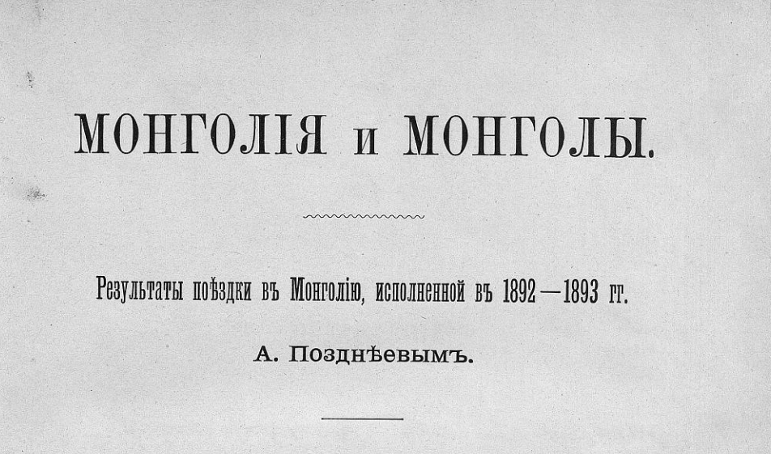
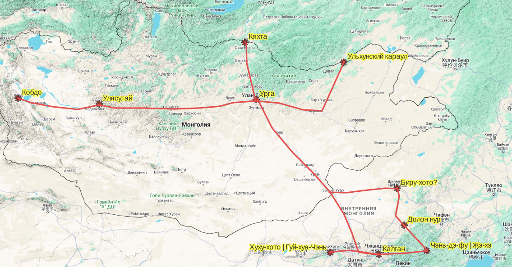
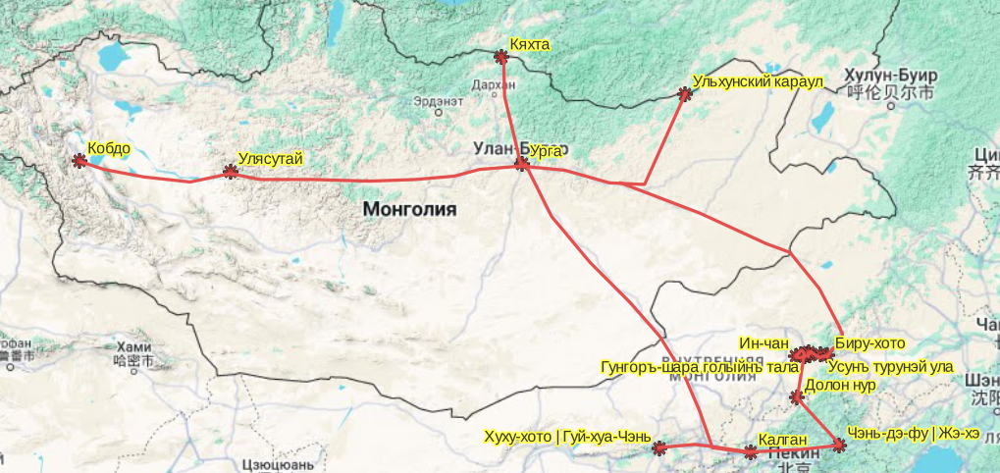

## Введение

Алексей Матвеевич Позднеев (1851 --- 1920) --- российский востоковед ([вики](https://ru.wikipedia.org/wiki/%D0%9F%D0%BE%D0%B7%D0%B4%D0%BD%D0%B5%D0%B5%D0%B2,_%D0%90%D0%BB%D0%B5%D0%BA%D1%81%D0%B5%D0%B9_%D0%9C%D0%B0%D1%82%D0%B2%D0%B5%D0%B5%D0%B2%D0%B8%D1%87)). Цыбиков был студентом у Позднеева и тот посоветовал ему осуществить его путешествие:

> Осенью 1898 г. один мой знакомый, штатный лама Янгачжинского дацана Забайкальской области, Цэбак-Даньчжа Ирдыниев прислал мне рукописное описание путешествия в Тибет и Непал нештатного ламы Болтиморского дацана Мичжэд-дорчжэ. Я, тогда студент Восточного факультета, представил эту рукопись на благоусмотрение профессора А. М. Позднеева, который только что пред этим издал «Сказание о хождении в тибетскую страну Малодöрбöтского Базабакши». Он, рассмотрев эту рукопись, посоветовал мне самому, по окончании курса университета, поехать в Центральный Тибет и в дальнейшем принял меры к осуществлению такого моего путешествия

Источник: Буддист-паломник у святынь Тибета: По дневникам, веденным в 1899--1902 гг. / под. ред. А. В. Григорьева \[и др\]. Петроград: Изд-во Рус. Геогр. о-ва, 1919. 472 с.: ил.

Основной труд Позднеева --- двухтомник Монголiя и Монголы. Далее по тексту полные библиографические ссылки на два тома, ссылки на книги доступные онлайн и в PDF, распознанные и отредактированные списки топонимов и таблицы с этими топонимами. Отсканированные книг в PDF (к сожалению, без иллюстраций) можно найти на Google Books. На сайте РГО --- возможен только просмотр (да, это очень грустно).

Монголiя и Монголы. Результаты поездки въ Монголию, исполненной въ 1892-1893 гг. А.Позднеевымъ. томъ I. Дневникъ и маршрутъ 1892 года. Издание Императорскаго Русскаго Географическаго общества. С.-Петербургъ. 1896. [Google Books](https://www.google.ru/books/edition/%D0%9C%D0%BE%D0%BD%D0%B3%D0%BE%D0%BB%D0%B8%D1%8F_%D0%B8_%D0%9C%D0%BE%D0%BD%D0%B3%D0%BE%D0%BB%D1%8B/gLQzeKrC5dYC?hl=ru&gbpv=0) [РГО](https://elib.rgo.ru/safe-view/123456789/213092/1/UnVQUkxJQjEyMDQ3OTM1LnBkZg==)

Топонимы 1 тома: [Документ](https://docs.google.com/document/d/1Hebwi4qvaDgRu7VL0Cv3Vj_fNcKFlrWmBGsHcp8MAmI/edit#heading=h.45nk13dbukk4), [Таблица](https://docs.google.com/spreadsheets/d/1HgfUmovBb4HmCxuL5rvV51ll9NjI6yrM-t-IMEMGqyA/edit?usp=sharing)

Монголiя и Монголы. Результаты поездки въ Монголию, исполненной въ 1892-1893 гг. А.Позднеевымъ. томъ II. Дневникъ и маршрутъ 1892 года. Издание Императорскаго Русскаго Географическаго общества. С.-Петербургъ. 1896. [Google Books](https://www.google.ru/books/edition/%D0%9C%D0%BE%D0%BD%D0%B3%D0%BE%D0%BB%D0%B8%D1%8F_%D0%B8_%D0%9C%D0%BE%D0%BD%D0%B3%D0%BE%D0%BB%D1%8B/cU5mYDH7rqIC?hl=ru&sa=X&ved=2ahUKEwiO5dPdj6uGAxUoGhAIHZKBCYAQiKUDegQIDxAD) [РГО](https://elib.rgo.ru/safe-view/123456789/213091/1/UnVQUkxJQjEyMDQ3OTM2LnBkZg==)

Топонимы 2 тома: [Документ](https://docs.google.com/document/d/1RpcwTPkGaoXokZ3EnXClO_206zdGysqrm5yQo_cTmEs/edit), [Таблица](https://docs.google.com/spreadsheets/d/15q_j55oVa7YijxTwjIpfqNPdkTEUuXHtxN4h2hA7yrc/edit?usp=sharing)

В первом томе описан маршрут Позднеева по следующим участкам (в скобках - современные названия):

* Кяхта --- Урга (Улан-Батор)
* Урга --- Улясутай (Улиастай)
* Улясутай --- Кобдо (Ховд)
* Урга --- Калган (Чжанцзякоу, Zhangjiakou, 張家口, [Google Maps](https://www.google.com/maps/place/Zhangjiakou,+Hebei,+China/@40.6722018,115.0617662,8.1z/data=!4m6!3m5!1s0x35fa2433321b1b7b:0xc135c2b7d65f7db6!8m2!3d40.7686911!4d114.8855792!16zL20vMDN2ZzVw?entry=ttu))

Во втором:

* Пекин --- Калган
* Калган --- Хуху-хото или Гуй-хуа-Чэнь (Хух-хото, Hohhot, 呼和浩特市, [Google maps](https://www.google.com/maps/place/Hohhot,+Inner+Mongolia,+China/@40.7638582,111.4288505,9.8z/data=!4m6!3m5!1s0x3606462a4a60d3e1:0x7f72c427fe44f504!8m2!3d40.8414899!4d111.75199!16zL20vMDFtdnR3!5m1!1e4?hl=en&entry=ttu))
* Гуй-хуа-Чэнь --- Калган --- Чэнь-дэ-фу или Жэ-хэ (Чэндэ, Chengde, 承德, [Google maps](https://www.google.com/maps/place/Chengde,+Hebei,+China/@40.9867139,117.9042428,13z/data=!3m1!4b1!4m6!3m5!1s0x35f50761790ca7e3:0xbf83c11f35a6edf1!8m2!3d40.9514999!4d117.9634!16zL20vMDNsZmww!5m1!1e4?hl=en&entry=ttu))
* Чэнь-дэ-фу --- Долон нур (Долон-Нур, Duolun, 多伦, [Google maps](https://www.google.com/maps/place/Duolun+County,+Xilingol+League,+Inner+Mongolia,+China/@42.213653,116.0904472,10z/data=!3m1!4b1!4m6!3m5!1s0x5e1d123b7e40811f:0xc3f734d37d4e712a!8m2!3d42.2030299!4d116.4857099!16s%2Fm%2F080fk6r!5m1!1e4?hl=en&entry=ttu))
* Долон нур --- Биру-хото или Цзин-пынь-чэн или 金棚城 (современное название не ясно, Xilinhot, Шилин-Хото? 锡林浩特 [Google Maps](https://www.google.com/maps/place/Xilinhot,+Xilingol+League,+Inner+Mongolia,+China/@43.9728006,114.8534592,8z/data=!3m1!4b1!4m6!3m5!1s0x5e05c01e9b3ba7db:0x2b8e031232ba77f0!8m2!3d43.9333899!4d116.0860799!16zL20vMDZqN3dy!5m1!1e4?hl=en&entry=ttu) Цзинпэн, Jingpengzhen, 经棚镇) --- Урга
* Урга --- Ульхунский караул (Верхний Ульхун, [Google maps](https://www.google.com/maps/place/Verkhnii+Ul%27khun,+Zabaykalsky+Krai,+674265/@49.5449434,112.5769191,12.79z/data=!4m15!1m8!3m7!1s0x5dc5d66c83b67995:0xba1d03744aa47628!2sUl%27khun-Partiya,+Zabaykalsky+Krai,+674260!3b1!8m2!3d49.8504204!4d112.7598643!16s%2Fg%2F1ptynh_02!3m5!1s0x5dc427a6f95727d7:0x6a5517592fec27de!8m2!3d49.5707938!4d112.5473732!16s%2Fg%2F11d_78q5ft?entry=ttu))

## Карта версия 1

## Карта версия 2

В первой версии Биру-хото был некорректно распознан как Xilinhot, Шилин-Хото 锡林浩特. А на самом деле это Цзинпэн, Jingpengzhen, 经棚镇 ([подробнее](/notes/biru-khoto/)).

## Комментарии

[**Обсудить**](https://t.me/answer42geo/9)
