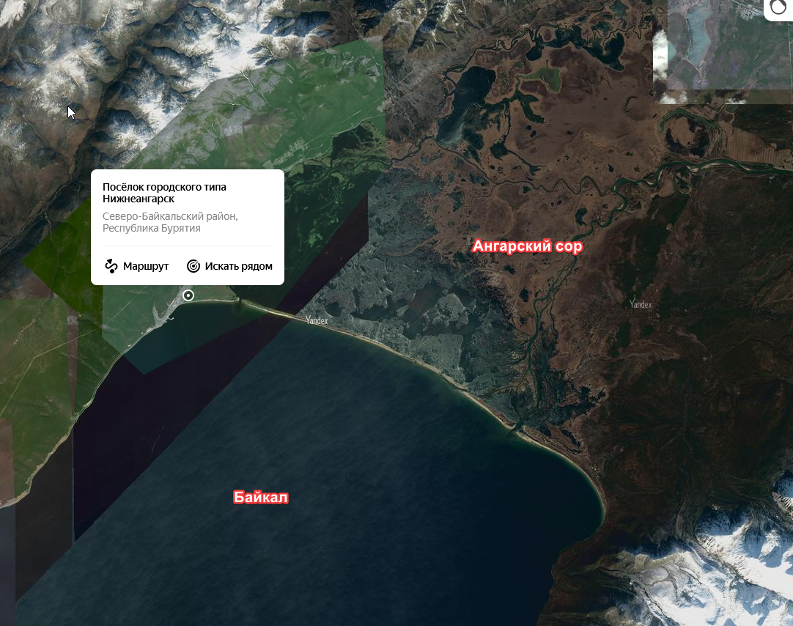
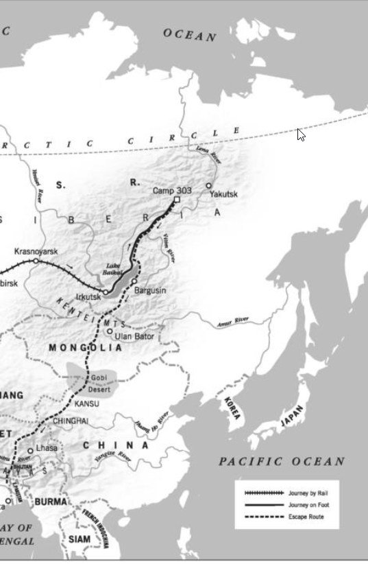

## Введение

Прочитал книгу, чтобы прикинуть, как путь, который у Цыбикова занял 130 дней (4140 км) на верблюдах, а Славомир Равич прошел пешком без еды и снаряжения пешком за 12 месяцев (6500 км).

Rawicz, Slavomir. The long walk. The true story of a track to freedom.

Подробнее о книге и сомнениях о том, что это путешествие вообще произошло можно почитать в Википедии: [https://en.wikipedia.org/wiki/S%C5%82awomir\_Rawicz](https://en.wikipedia.org/wiki/S%C5%82awomir_Rawicz) или на сайте [Микаэла Страндберга](https://www.mikaelstrandberg.com/the-long-walk-articles/).

[PDF](https://drive.google.com/file/d/1K8SLydnJhyShMDkPQwHV1y-gnD1LKONI/view?usp=sharing) --- англоязычное издание.

[FB2](https://drive.google.com/file/d/1T0o4oE8zMHYgO_tmlnPhwCLwxP5FRR2d/view?usp=sharing) --- фрагмент перевода на русский.

## Путешествие Равича и Оссендовски

Замысел путешествия Равича "не попал на восток - пойду в Индию" сильно перекликается с изложенным в книге 1922 г. Beasts, Men and Gods Фердинанда Оссендовского.

Ossendowski F., 1922. Beasts, Men and Gods. Translated by Lewis Stanton Palen.

Герой Оссендовского рассказывает:

> The route to the Pacific was closed. Reflecting very
carefully over the problem, I decided that we had but one possible exit left. We must avoid all Mongolian cities
with Chinese administration, cross Mongolia from north to south, traverse the desert in the southern part of the
Principality of Jassaktu Khan, enter the Gobi in the western part of Inner Mongolia, strike as rapidly as possible
through sixty miles of Chinese territory in the Province of Kansu and penetrate into Tibet. Here I hoped to search
out one of the English Consuls and with his help to reach some English port in India. I understood thoroughly all
the difficulties incident to such an enterprise but I had no other choice. It only remained to make this last foolish
attempt or to perish without doubt at the hands of the Boisheviki or languish in a Chinese prison. When I
announced my plan to my companions, without in any way hiding from them all its dangers and quixotism, all of
them answered very quickly and shortly: "Lead us! We will follow."

перевод

> Путь к Тихому океану был закрыт. Тщательно обдумав проблему, я пришёл к выводу, что у нас остался только один возможный выход. Мы должны избегать всех монгольских городов с китайской администрацией, пересечь Монголию с севера на юг, пройти через пустыню в южной части княжества Засагту-хана, войти в Гоби в западной части Внутренней Монголии, как можно быстрее пересечь шестьдесят миль китайской территории в провинции Ганьсу и проникнуть в Тибет. Там я надеялся найти одного из английских консулов и с его помощью добраться до какого-нибудь английского порта в Индии. Я прекрасно понимал все трудности, связанные с таким предприятием, но другого выбора у меня не было. Оставалось лишь предпринять эту последнюю безумную попытку — или погибнуть от рук большевиков, или томиться в китайской тюрьме. Когда я сообщил о своём плане своим спутникам, не скрывая от них ни опасностей, ни его донкихотства, все они быстро и коротко ответили: «Веди нас! Мы пойдём за тобой».

## Топонимы Равича

В книге практически нет упоминаний топонимов. На маршруте автор, хоть и избегает населенных пунктов, беседует с разными людьми, планирует маршруты, выясняет дорогу. Кажется невероятным, что никаких названий мест при этом у него не остается (может это травма и он все забыл?). Получается, что если это правда произошло, то это было какое-то блуждание наугад.

Но кое-что есть. На пути к Байкалу после того как беглецы спустились с нагорья:

> It took longer than we expected to reach the road. A weatherbeaten signboard showed the direction and distance of a town, or village, named Chichevka, which must have been the place with the factories we had seen from the heights.

**Чичевки** --- прежнее название поселка городского типа Нижнеангарск ([Википедия](https://ru.wikipedia.org/wiki/%D0%9D%D0%B8%D0%B6%D0%BD%D0%B5%D0%B0%D0%BD%D0%B3%D0%B0%D1%80%D1%81%D0%BA), [Яндекс карты](https://yandex.ru/maps/geo/posyolok_gorodskogo_tipa_nizhneangarsk/53106957/?ll=109.897669%2C55.727701&z=9.81), [OpenStreetMap](https://www.openstreetmap.org/search?query=%D0%BD%D0%B8%D0%B6%D0%BD%D0%B5%D0%B0%D0%BD%D0%B3%D0%B0%D1%80%D1%81%D0%BA#map=13/55.7944/109.5792)). Про историю поселка есть потрясающе подробная [презентация](https://shareslide.ru/geografiya/ischeznuvshee-selo-chichevki-vyyavlenie-faktorov-opredelivshih) ученицы 8 класса Нижнеангарской СОШ №1.

В переводе книге заново отрисованная карта с интересной деталью. Якобы беглецы пересекли северную часть Байкала. Упоминаний этого перехода нет в тексте, также это мало реально, учитывая, что был апрель.
UPD: подсказывают, что в апреле еще может стоять лёд. Википедия [говорит](https://ru.wikipedia.org/wiki/%D0%91%D0%B0%D0%B9%D0%BA%D0%B0%D0%BB#%D0%9B%D1%91%D0%B4), что ледостав в среднем до 4 мая.

.")

От Нижнеангарска действительно отходит коса отделяющая сам Байкал от Ангарского сора ([Википедия](https://ru.wikipedia.org/wiki/%D0%90%D0%BD%D0%B3%D0%B0%D1%80%D1%81%D0%BA%D0%B8%D0%B9_%D1%81%D0%BE%D1%80)) --- особого залива с заболоченными плавнями отделенного от Байкала узкими островами/косами ([хорошие фото](https://gril-avp.livejournal.com/500514.html)). 

Итого поворот через Байкал на карте --- нереален, пересекать таким образом Байкал было совершенно незачем.

Карта из оригинального англоязычного издания такого поворота не показывает.

## Комментарии

[**Обсудить**](https://t.me/answer42geo/14)
