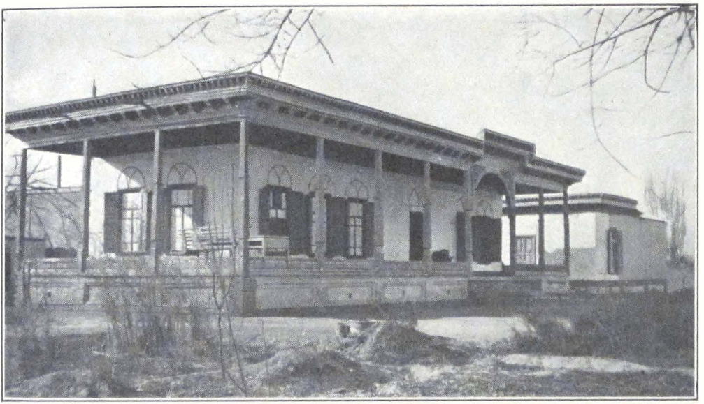
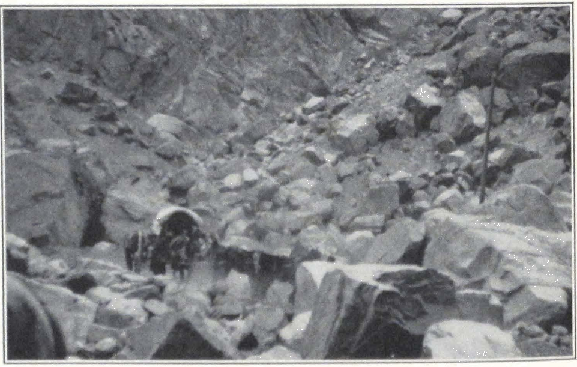
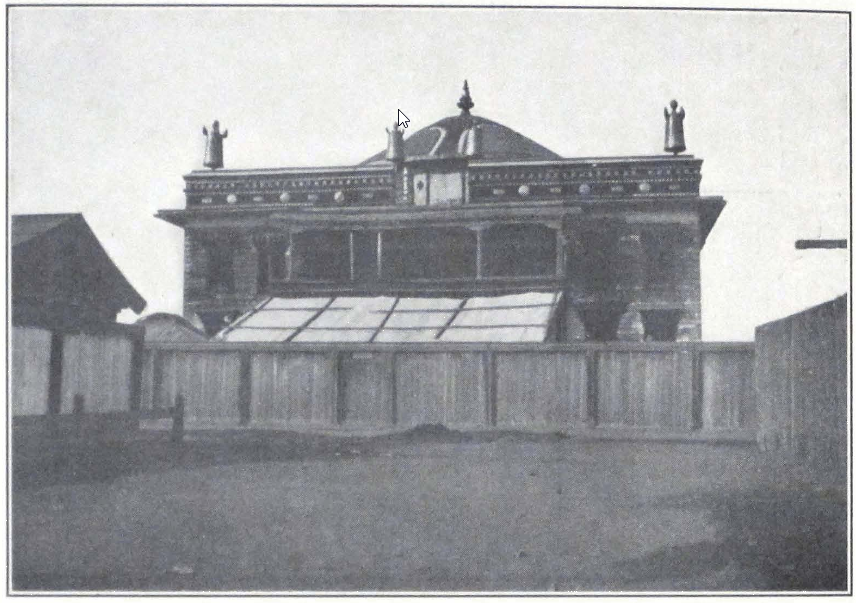
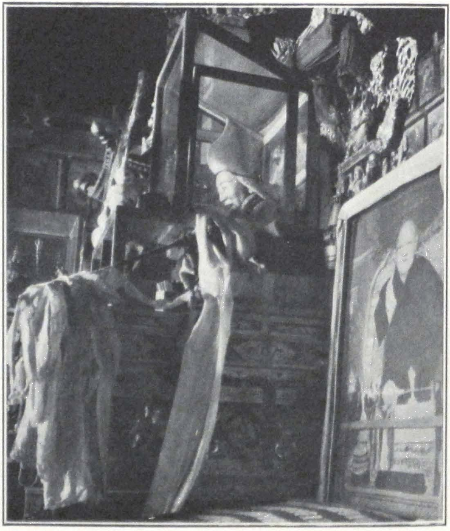
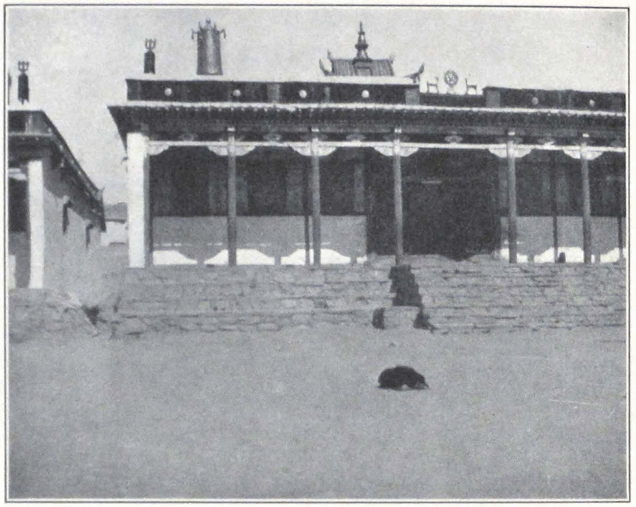
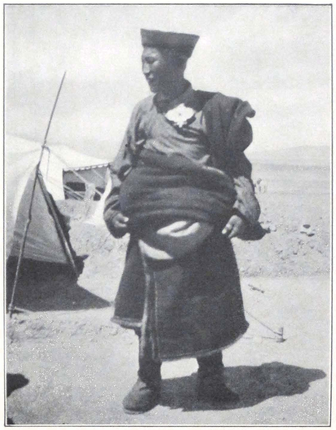
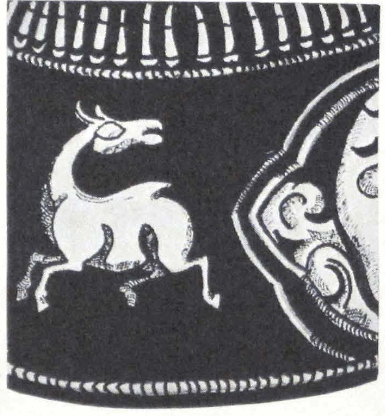
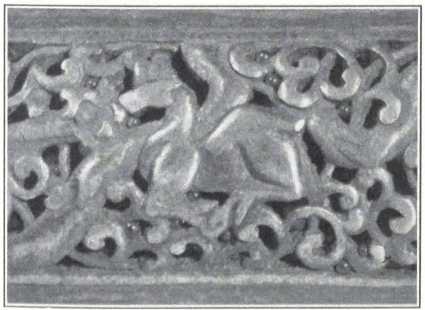
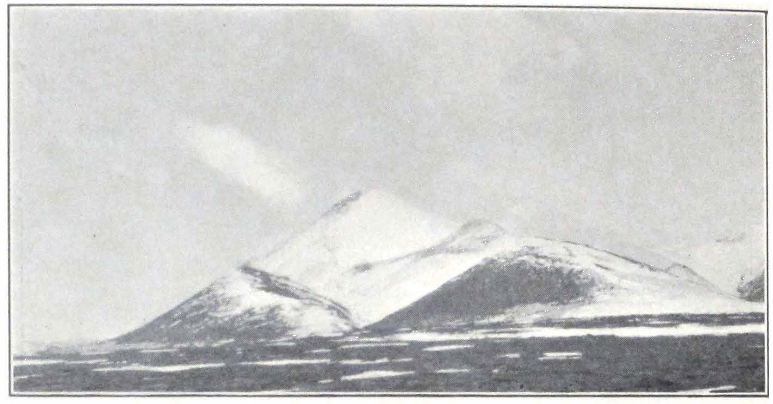

## Introduction

Turns out there is no good text version of Roerich's Trails to Inmost Asia. Available PDFs and Internet Archive TXT files are not usable for annotating and shared work and contain tons of errors. So here it is.

* Based on Roerich's book in TXT format from [Internet Archive](https://archive.org/details/in.ernet.dli.2015.43990).
* Excessive line breaks removed to adapt for larger screens.
* Page numbers are preserved for easy reference.
* Lots of small edits and formatting.
* Typos in the source text were not fixed.
* [Google Docs version](https://docs.google.com/document/d/1ZvcCOrRze3yLZ7HC0lz-M40sQmiLVOqX7Nz8g7ZXY9s/edit?usp=sharing) - use to download as DOC or PDF or make a copy for your work online.

## Book contents

PROFESSOR NICHOLAS ROERICH

LEADER OF THE EXPEDITION

TRAILS TO INMOST ASIA

PUBLISHED ON THE FOUNDATION ESTABLISHED

IN MEMORY OF PHILIP HAMILTON McMILLAN

OF THE CLASS OF 1894 YALE COLLEGE

PROFESSOR NICHOLAS ROERICH

LEADER OE THE EXPEDITION

TRAILS TO

INMOST ASIA

FIVE YEARS OF EXPLORATION WITH THE

ROERICH CENTRAL ASIAN EXPEDITION

BY

GEORGE N. ROERICH

WITH A PREFACE BY LOUIS MARIN

MEMBER OF THE FRENCH CHAMBER OF DEPUTIES,

FORMERLY MINISTER OF PENSIONS;

PRESIDENT OF THE SOCIETY OF ETHNOGRAPHY, PARIS

NEW HAVEN • YALE UNIVERSITY PRESS

LONDON • HUMPHREY MILFORD OXFORD UNIVERSITY PRESS

1931

COPYRIGHT 1931 BY YALE UNIVERSITY PRESS

PRINTED IN THE UNITED STATES OF AMERICA

All rights reserved. This book may not be reproduced, in whole or in part, in any form, except by written permission from the publishers.

TO MY MOTHER AND FATHER

## PREFACE

UNDER the direction of the famous Russian artist, Nicholas Roerich, a remarkable expedition was conducted for five years through the various countries of central Asia. It penetrated regions where no westerner had been seen for many years; it brought back to the scientific world new knowledge of the history of that region of the "Roof of the World" which is of deep interest geographically and sociologically.

George N. Roerich, orientalist, accompanied his father. Previous to receiving his degree from Harvard, he was brought up in European traditions of culture, studying in the schools of Russia and England, and in France at the School of Oriental Languages, Paris, and at the College de France. Of an exceptionally synthetic tendency of mind, the young scholar has studied Persian and Sanskrit, Tibetan, and Chinese. This extensive knowledge of languages provides him with the key to the mysteries of the "closed land."

In the country of Tsaidam, George Roerich studied the different dialects of the local Mongol tribes and made the first complete dictionary of them.

From Tibet, George Roerich brings back a scientific picture of the life and civilizations of the nomads of the High Plateau. During his researches he discovered the existence of an artistic style peculiar to the nomads --- primarily animalistic --- a style closely related to that of the ancient Scythians and Goths. Thus he presents strong arguments in justification of the theory, concerning the ancient civilization of the nomads, whose territory extended from the Gobi Desert and the border of Korea to the lower Danube and the Carpathian Mountains.

<a id="x">**x**</a>

A most interesting discovery rewarded the efforts of the explorers. On the uplands of Tibet and in the country of the Trans-Himalayas, the expedition carefully studied and photographed many monuments (cromlechs, alinements, menhirs) whose existence had never before been recorded and whose structure evokes most interesting comparisons with our western monuments, especially those of Brittany.

Because of his knowledge of the languages and customs of the countries, George Roerich visited Buddhist monasteries, usually completely forbidden to strangers; he discovered a complete collection of the sacred books of the Bön-po religion, three hundred volumes, which constitute an inestimable treasure for the history of religions and oriental research.

During these five years. Professor Nicholas Roerich painted nearly five hundred pictures; the collection presents a unique panorama of the least-known regions of the great Asiatic continent.

Through their efforts and their sacrifices, their fortitude in the face of dangers which threatened their lives again and again, and their bravery under attack, the members of the expedition have greatly served science, art, and all nations advancing the progress of humanity.

The book which George Roerich dedicated to the scientific results of the expedition marks an important date in the history of Orientalism and represents a contribution of the first order to the conquests of civilization.

Louis Marin

*Paris, June, 1931.*

<a id="xi">**xi**</a>

## AUTHOR'S NOTE

INNER Asia with its towering mountain ranges and limitless deserts and steppes, a country of great climatic extremes, and the cradle of hardy nomad tribes that once shook the frontiers of China and of the Near Eastern countries, has always been an endless lure to the explorer. In the past a brilliant line of men inaugurated the fight for geographical discoveries in the forbidden lands of Asia. The story of their achievement is one of the most fascinating pages in the history of such explorations. Besides securing valuable scientific information and opening new regions for the progress of humanity, they upheld that spirit of adventure to which our civilization owes its spread. Their example made it possible for others to continue the hazardous task of conquest of distant and unknown lands.

In inner Asia we are able to survey one of the grandest mountain systems of the world; to journey for months across waterless deserts of sand and stone and upland plains; and to study the vestiges of a past culture that once linked ancient China with the countries of the Mediterranean basin.

The vast, undrained area of inner Asia is buttressed on the south by the mighty Trans-Himalayas, and the bleak highlands of the successive ranges of the Karakorum. Its northern frontier is formed by the Altai and the mountain chains along the southern rim of the Siberian lowlands. To the east and west this great inner basin is open, toward vast expanses of desert and steppe that comprise the Great Mongolian Gobi and the steppe lands of Russian Turkestan.

This inner region of Asia the Roerich Central Asian Expedition, under the leadership of Professor Nicholas Roerich, traveled and explored for almost five successive years. The chief object of the expedition was to create a pictorial record of lands and peoples of inner Asia; the five hundred paintings by Professor Roerich, brought back by the expedition and now on permanent exhibition in the Roerich Museum at New York, constitute a unique achievement of this purpose.

The second object of the expedition was to survey the possibilities for new archaeological explorations and thus to prepare the way for future enterprises in the same region.

The third object was to secure an extensive collection of ethnographi-

<a id="xii">**xii**</a>

cal and linguistic material, illustrating the culture of these regions. During its long journey along the T'ien Shan, the steppe region of Jungaria, the Altai, the mountains of southwestern Mongolia, and the highlands of Tibet, the expedition surveyed numerous archaeological sites; and it is hoped that another expedition may be mustered to carry out extensive excavations of vast necropoli left by nomad tribes, which date back to the period between the first and eighth centuries A.D. A large collection of Tibetan and Mongolian books was gathered during the expedition's stay in Mongolia and Tibet.

In sending out this expedition into the field, the Trustees of the Roerich Museum felt the growing necessity of an active American participation in a work which for several decades had attracted the attention of prominent scientists in Great Britain, France, Germany, Japan, and Russia.

The expedition left New York in May, 1923, and in December of the same year reached Darjeeling in British Sikkim. Here a base was established and several trips were conducted into Sikkim. The whole of 1924 was spent in Sikkim in preparation for the more extensive journey into inner Asia. It was imperative to acquire a good speaking knowledge of the Tibetan language before starting on a journey which would require constant relations with natives. The narrative in the present volume begins with the moment of the expedition's departure from Darjeeling.

During his five years of active field service with the expedition, the author profited on many occasions by the help and advice of friends and it is a pleasant task to convey his appreciative thanks for the services they so willingly rendered:

To the President and Board of Trustees of the Roerich Museum, for their devoted care and friendly assistance during the expedition's perilous journey.

To Col. F. M. Bailey, C.I.E., British Political Officer in Tibet, Sikkim, and Bhutan, for his valuable help during the expedition's stay in Sikkim and on its return from Tibet in 1928.

To Major Gillan, British Consul General at Kashgar, for his active assistance during a most trying period in Khotan.

To His Excellency M. Louis Marin, for his ever helpful assistance and for contributing an introduction to this present volume.

To my teacher. Professor Jacques Bacot, who first introduced me into the ancient lore of Tibet

<a id="xiii">**xiii**</a>

To my friend, Dr. Georges G. Chklaver, of the University of Paris, for his untiring interest in my exploration work and his trusted friendship.

To Dr. Johan van Manen, learned Secretary of the Asiatic Society of Bengal, who placed at my disposal the resources of the library of the Society at Calcutta.

To Lama Lobzang Mingyur Dorje, my teacher and friend, for his untiring help in my Tibetan studies.

To Malcolm W. Davis, editor of the Yale University Press, in appreciation of his interest in this publication.

Last, but not least, I wish to record my admiration and gratitude to all the European and native members of the Roerich Central Asian Expedition, who unfailingly carried out their duties under most trying conditions.

I dedicate this volume to my Mother and Father, who guided me on the path of exploration and since my boyhood inspired me in the quest for new discoveries and new knowledge.

G. N. R.

*June, 1931.*

<a id="xvi">**xvi**</a>

## CONTENTS

Preface by Louis Marin ix

Author's Note xi

List of Illustrations xvii

I. Kashmir --- Ladak 1

II. From Leh to Khotan. The Great Karakorum Route 33

III. Khotan 59

IV. Khotan --- Kashgar 79

V. The Great Northern Highway to Urumchi 93

VI. Urumchi and Jungaria 113

VII. Mongolia 127

VIII. Organizing the Expedition 165

IX. Urga --- Yum-Beise Küren 175

X. Across the Southwestern Gobi 197

XI. Ja Lama, the Militant Priest 221

XII. Among the Tsaidam Mongols 235

XIII. Across Tsaidam 259

XIV. The Great Tibetan Upland 279

XV. At the Gates of Tibet. The Detention at Chu-Na-Khe and the Peril of the Caravan 303

XVI. The Hor-pas AND Their Country 331

XVII. Nag-chu-ka 373

XVIII. The Region of the Great Lakes --- Nag-chu Dzong --- Saga Dzong 399

XIX. From Saga Dzong to Sikkim 447

Index 491

## LIST OF ILLUSTRATIONS

Professor Nicholas Roerich Leader of the Expedition *Frontispiece*

*To face page*

Srinagar, Kashmir 8

Sonamarg, Kashmir 8

*Maitreya on the Road* 9 Painting by Nicholas Roerich. Roerich Museum, New York

*Royal Palace at Leh* 24 Painting by Nicholas Roerich. Roerich Museum, New York

Stone image of Maitreya at Mulbe, Ladak 25

Image of the Goddess Dug-kar In the Zangskar Monastery at Leh 25

Professor Nicholas Roerich At work in the Raja's Palace in Leh, Ladak 30

The Tik-tse Monastery, Ladak 30

*The Monastery of Sheh, Ladak* 31 Painting by Nicholas Roerich. Roerich Museum, New York

Crossing the Khardong La 46

The expedition caravan before the Suget Pass 46

Sanju Kirghiz men and women 47

Types of Turki natives 47

Kirghiz grave on the Karakorum Route 54

The Taklamakan Desert near Khotan 54

The Chinese convoy of the expedition: Turki headmen and Chinese soldiers 55

A village crowd in Chinese Turkestan 55

*To face page*

Tumbal, the Tibetan mastiff of the expedition 66

Ma Shao-wu, Governor of Khotan 66

Ma Ti-t'ai, Military Governor of Kashgar 67

The crucified Ma Ti-t'ai 67

The expedition headquarters in Khotan 82

Summer house in Karghalik 82

Crossing the Yarkend darya 83

River view near Yangi-hissar 83

Chinese cavalry entering Kashgar 83

Market scene in Kashgar 90

Kashgar from the river 90

Caves with remains of Buddhist frescoes at Toghrak-dong 91

The expedition carts arriving at Kizil, Chinese Turkestan 91

Sandstone on the road to Kuchar 98

Expedition carts on the way to Kuchar 98

A traveling native medicine man, Karashahr 99

Traveling boy-musician in Chinese Turkestan 99

Washing wool at Karashahr, Chinese Turkestan 108

Camel caravan with wool for Tientsin 108

River view near Toksun 109

A difficult route in the T'ien Shan 109

Taoist Temple in Urumchi, Capital of Hsin-chiang 122

The monument of Yang Tseng-hsin, Governor-General of Hsin-chiang, in Urumchi 122

<a id="xviii">**xviii TRAILS TO INMOST ASIA**</a>

*To face page*

Across Jungaria; an accident on the way 123

The caravan of the expedition in the grass-country of Jungaria 123

A car crossing a flooded river 130

Ulan Bator or Urga, capital of Mongolia 130

Zün-küren in Urga 131

Tseren Dorje, head of the Mongolian Government 131

A camel carriage, Urga 134

Sledges in winter 134

Yak carts in Urga 135

A young Mongol exhibiting his invention: an automobile 135

Mongols and camels 138

Lamas riding on camels, Urga 138

The People's Club at Urga, Mongolia 139

Packs of dogs in the streets of Urga 139

Types of Chinese in Urga, Mongolia 154

A group of Khalkha Mongols 154

A New Year crowd in Urga 155

New Year masquerade in Urga 155

New Year dances in Urga 156

Mahayana Hoshang, one of the personages of the New Year dance 156

Lama musicians, Urga 157

Lama dances in Urga 157

Altar with painted image of dPal-ldan Ye-shes, the third Tashi Lama of Tibet (1740-80), Roerich Museum, New York 158

Temple of Maitreya, Urga 159

Pilgrims in front of the Maitreya Temple in Urga 159

The Black-Hat dance, Urga 160

Dance in progress 160

Black-Hat dancer, Urga 161

*To face page*

The big *suburghan or stupa* in front of the Ganden Monastery, Urga 161

Temple of Avalokitesvara, Ganden Monastery, Urga 162

Bronze incense burner in front of the Ganden Monastery, Urga 162

Temple altar, Ganden Monastery, Urga 163

Altar with photograph of the Bogdo Gegen, Ganden Monastery, Urga 163

Dara-Eke, the consort of the last Bogdo Gegen 164

Types of Mongol lamas 164

Gates of Chö-jin Lama-yin-sümä 165

Horses used in religious processions to carry the holy images 165

The expedition cars in the valley of the Tola River, Mongolia 188

Expedition cars crossing the Ongin-gol. Southwest Mongolia 188

Monastery of Yum-beise 189

Mongol nuns, Southwest Mongolia 189

Expedition caravan starting from Yum-beise 210

Camp in the Mongolian Gobi 210

An ancient Chinese watchtower in the southern Gobi 211

The castle of Ja Lama 211

Expedition camp at Shih-pao-ch'eng in the Nan Shan Mountains 240

The camel caravan 240

Expedition camp at Sharagolji 241

The Chief Lama of the Tsaidam Mongols 241

At the foot of the Ulan-daban Pass 268

The Ulan-daban Pass 268

<a id="xix">**xix LIST OF ILLUSTRATIONS**</a>

*To face page*

Expedition camp in the valley of the Bure-yin-gol, Tsaidam 268

Tsaidam Mongol woman 269

A Tsaidam Mongol 269

*The Thang La* 290 Painting by Nicholas Roerich. Roerich Museum, New York

Before the Thang La 291

The descent from the Thang La 291

Tibetan nomads 308

A nomad camp 308

Tibetan soldiers, stationed as guards in the expedition camp at Chu-na-khe 309

Expedition camp during the detention at Chu-na-khe 309

Expedition camp at Chu-na-khe 314

Expedition camp buried in snow at Chu-na-khe 314

The perishing caravan 315

A Tibetan guard in the expedition camp at Chu-na-khe 315

*Stupa* at Sharugön 326

Monastery at Sharugön 326

The Bön-po Monastery at Sharugön 327

Expedition camp at Sharugön 327

Women of Hor in the region of Nup-hor 366

Tinder and flint pouch, Hor region, North Tibet 367

Tinder and flint pouch, Hor region, North Tibet 367

Brass buckle, Ching-kar, Nam-ru District, North Tibet 368

Flint pouch, Lahul, West Tibet From the collection of S. N. Roerich 368

Deer on brass charm box From the collection of S. N. Roerich 369

*To face page*

Photograph of deer on brass charm box 369

Conventionalized figure of deer on silvered iron pen case 370 From the collection of S. N. Roerich

Photograph of deer on silvered iron pen case 370

Metal plaque from Derge 371 From the S. N. Roerich collection

Metal plaque from the Noin ula Mountains 371 From the Kozlov finds

Conventionalized figure of swan (end piece) 372

Headquarters of the expedition at Nag-chu 384

Headquarters of the expedition at Nag-chu 384

Nag-chu dzong 385

Shab-den Monastery at Nag-chu 385

A street in Nag-chu 392

Burning the *torma* or New Year offering 392

Nag-chu-ka, Tibetan upland 393

A stone hovel on the Tibetan upland 393

Grazing yaks on the Tibetan upland 393

Sand-buried cromlechs and alinement at Do-ring, Southwest of Pang-gong Lake 416

Ancient grave in Nag-tshang 416

Crossing the Tarkö tsang-po 417

The expedition column approaching the Trans-Himalayas 417

*Kinchenjunga --- The Mountain of the Five Treasures* 444 Painting by Nicholas Roerich, White House, Washington, D.C.

<a id="xx">**xx TRAILS TO INMOST ASIA**</a>

*To face page*

Saga dzong 445

The Trans-Himalayas from Saga dzong 445

Crossing the Brahmaputra 454

The snow-peak Saga Jo-chung 454

The valley of the Tsang-po 455

Chatu gompa in the valley of the Tsang-po 455

Tingri 476

Shekar dzong 476

*Stupa at Chung-tü* 477 Painting by Nicholas Roerich. Roerich Museum, New York

*To face page*

*Royal Monastery of Chung-tü, near Sa-skya* 482 Painting by Nicholas Roerich. Roerich Museum, New York

Kampa dzong 483

Kampa dzong 483

*Ling-kar* 486 Painting by Nicholas Roerich. Roerich Museum, New York

Lepcha hillman, Sikkim 487

The Monastery of Pema-yangtze in Sikkim 487

General map of the route of the expedition through central Asia 504

## KASHMIR-LADAK

I

**KASHMIR-LADAK**

ON the sixth of March, 1925, the expedition left the hill station of Darjeeling, and with it the friendly country of Sikkim. It is always a wonderful experience to travel down the jungle-clad slopes of the eastern Himalayas. The tropical vegetation and the endless stream of hill people who wander along the cart road are full of interest to the traveler. In complete darkness, we reached Siliguri. The train was rolling over the low-lying plain of Bengal --- jungle-clad and fever-infected marshy tracts, and rice fields already flowed. Through the blackness of the tropical night, one could see the strange life proceeding around the glittering lights of numerous fires scattered in the jungle and in front of small village huts, that stood here and there among palm trees. Figures in white turbans and dhoti moved about, and at the railway stations the air resounded with the high-pitched cries of peddlers selling tea, drinking water, and cigarettes. The country seemed alive with intense movement screened by the dusky veil of the night.

Early in the morning the train rolled into the large station of Sealdah. A traveler who comes from the mountain solitudes of the Himalayas is invariably struck by the semi-European, semi-oriental character of the city. The Calcutta streets, with modern motor cars, horse carriages, rickshaws, cows, and a multicolored crowd of pedestrians, seem indeed to be a stream in which East and West mingle in a striking manner. After a busy and hot day in the great city, including a visit to the headquarters of the Asiatic Society of Bengal, that distinguished institution which is a monument of noble cooperation between western and eastern scholars, we again entrained on the Punjab Mail for the long two days' and two nights' journey across the dusty plains of northern India.

The hot season was already approaching and a peculiar and intense glare hung over the horizon.

On the evening of the eighth of March we reached Rawalpindi Several hours before the cantonment, the train traversed an arid country of sand and stone, cut into numerous canyons. After a night spent at a lo-

<a id="4">**4 TRAILS TO INMOST ASIA**</a>

cal hotel at Rawalpindi we again resumed our route, but this time in motor cars. Rawalpindi has the atmosphere of alertness of a great military station. Everywhere there are khaki-clad figures; and the town bazaars throng with the colorful crowd of a border country. Fine-looking Hazaras and martial Pathans from the frontier move among the groups of Punjabis and down-country men.

The motor road to Srinagar through Murree has been so often described that I need not dwell too long on this portion of our journey. It is one of the finest motor roads in the world, and the scenery is at times magnificent. Rising gradually, at Murree the road reaches the altitude of some seven thousand feet above sea level.

We spent the night in the resthouse at Garhi, a small village on Kashmir territory at an altitude of 2,628 feet. In the evening we admired the Mohammedan festival of *Bakr-Id*, when the whole countryside was acclaiming the advent of the spring. Flaming circles of men brandishing torches were moving about the hillside on the opposite river bank, and above them towered the somber silhouettes of the mountains. An unforgettable picture of Indian spring!

Next morning brought us to Uri, a picturesque village and fort situated at an altitude of 4,370 feet. The mountain landscape near Uri was of outstanding beauty; patches of snow intensified the deep blue coloring of the surrounding mountains. After Uri, we passed the ruined temple of Brankutri, similar to the other temples of Kashmir dating back to the Indian Middle Ages. About noon we drove through the small town of Baramulla. The day was beautifully clear and we obtained a fine view of the Nanga Parbat, towering to a height of 26,900 feet.

For the few miles outside of the city of Srinagar, there runs one of the most beautiful drives in the world, bordered with rows of high poplars. All around lies the famous Kashmir Valley, engirded by lofty snowy mountains.

About three o'clock in the afternoon we drove into the native city of Srinagar, and were at once assailed by a motley crowd of Kashmiris, yelling and crying, abusing each other, offering goods: Kashmiri products, houseboats, *shikaras*, and other attractions of Kashmir. It was a sad sight.

We established our headquarters at the Nedou Hotel and at once began our preparation for the journey to Ladak and the desert lands of Chinese Turkestan, lying beyond the lofty passes of the Karakorum

**5 KASHMIR-LADAK**

and Sanju. A difficult and long mountain journey necessitates protracted preparations and every detail must be thoroughly checked personally; a journey such as that from Kashmir to Chinese Turkestan over the highest mountain route in the world, requires unusual forethought and careful consideration. Srinagar is the last place where such preparations can be made and food supplies obtained. The Kashmiri artisans are famed for their work and, if supervised, turn out serviceable equipment. There are a number of native firms in the city which produce excellent winter outfits and camping furniture. Naturally, the traveler must keep a watchful eye on the execution of his order. All the expedition supplies had to be packed in *yaghtans* or wooden boxes covered with leather. Tin or iron boxes are of no use in mountain travel, for they easily break.

The winter outfit for the cold weather on the mountain passes and the winter in Chinese Turkestan consisted of fur coats lined with *pashmina*, Gilgit fur boots, fur caps, fur socks, and fur sleeping bags. We also ordered several tents of waterproof Willesden canvas with warm pattoo lining. These tents had to be specially constructed to withstand the rough traveling and the mountain gales. They consisted of two flies, the outer fly reaching the ground to prevent the strong wind of the higher uplands from penetrating beneath and lifting the tent. The tent poles were of thick bamboo with strong metal joints, and the tent pegs of galvanized iron.

We also decided to buy our own riding horses in order to be self-equipped and independent of local transport, which is not always reliable. Srinagar is a good horse market, and one can usually get good animals of the Yarkendi or Badakhshani breed. These breeds are famous throughout central Asia and are invaluable on long travels. The Zangskar ponies are good for mountains, but as a rule of uncertain temper and hard-mouthed.

With the kind help of Mr. Nedou, the proprietor of the local hotel, we soon succeeded in buying six fine horses which carried us from Kashmir to the confines of the Altai.

The departure was fixed for the beginning of August, and, meanwhile, we decided to use our free time for a little touring in the Kashmir Valley.

I shall not describe the capital or the valley of Kashmir. Concerning them there is a voluminous literature, and the antiquities of the country

**6 TRAILS TO INMOST ASIA**

have been studied and commented upon by such men as Sir Aurel Stein.

Comparing the beauties of nature, and the unique gardens of Nishad and Shalimar laid out by the Great Moguls Akbar and Jehangir with the sad realities of the native city of Srinagar, one is always struck by the deep contrast. We were glad to leave the "Indian Venice" and to feel ourselves again in the open country of the beautiful valley. We hired a large house boat, *The Monarch*, belonging to a sympathetic Kashmiri, Sobra Wanganu, and started for a short trip to Vulur Lake.

The trip along the channels offers little of interest. The boat slowly moves past low-lying banks. The water channels are narrow and the water not always clear. The big lake of Vulur lies engirded by high mountain ranges and in fine weather wonderful shadows play on the mountain sides. We landed at Bandipur, a small village with some commissariat barracks, lying at the head of the Gilgit Road that leads across Gilgit, Hunza, and Sarikol to Kashgar and the Tarim basin. We experienced a violent windstorm on the lake, which broke all the ropes by which the boat was secured to the shore and almost carried it away into the open. The boatmen spent several anxious hours fighting the storm. The house boats are not seagoing and never venture into the open in windy weather. The *dunga* boat, in which our Chinese interpreter and servants were staying, had its roof carried away by the wind. Since boatmen considered our position very unsafe, we had to curtail our visit on the lake.

The next day proved to be fine and we had enough time to recross the lake into the channel. The afternoon was stormy again, but we were not affected by it.

About the fifteenth of April, we moved to Gulmarg, the hill station of Kashmir. Here, in the coolness of the mountains, we could conclude our preparations and study the different problems presented by our coming journey. We arrived early in the season and the hill station was still covered by snow. For a whole week we experienced tremendous thunderstorms. The thunder rolled and crashed in the mountains and the lightning swept round our house in a large circle, illumining the whole neighborhood at night. For several days we were completely cut off from the outside world and had to keep to our rooms. Nowhere else did we experience electrical storms of such terrific violence. They were usually followed by hail, and some of the hailstones were of surprising size.

**7 KASHMIR-LADAK**

At Gulmarg we spent the whole of May, June, and July. By the end of July we had received all our outfit and, on the eighth of August, the expedition left Gulmarg for Ganderbal on its long journey to Ladak and Chinese Turkestan.

Ganderbal is conveniently reached by motor cars. It is the starting point of the Ladak Treaty Route. Our caravans consisted of eighty-two pack ponies which were to carry our loads up to Dras on the Ladak side of the Zoji Pass --- an alarming number considering the difficulties of obtaining sufficient forage.

We reached Ganderbal late in the evening of the same day, and found our caravan men already camping in the courtyard of the resthouse. Great camp fires illumined the faces of the men and the long rows of caravan animals.

Next morning, August 9, we rose early but were somewhat delayed by the unloading of the supplies from the boats which had carried them from Srinagar. The men were new to caravan work and had to be directed in every detail. Our headman, Wahaba Wanganu, was a cold-blooded and remarkably efficient man who kept the rest of the expedition servants well in hand.

Late in the afternoon the whole caravan moved out of Ganderbal. We drove by motor as far as the little village of Nunner, then mounted our horses and crossed the Sindh near Wayil. The route follows the right bank of the river for about two miles, and it was a pleasant ride past flowering meadows.

Kangan is a small village with a large bungalow, where we found several other travelers. The route from Kangan to Baltal at the foot of Zoji Pass has been often described, and I shall limit myself to a few comments.

The Leh Treaty Route was made passable for peaceful caravans by the efforts of Colonel Durand's column in 1891. The Kashmir State takes a great interest in this route, and the transport and supplies are carefully organized. State granaries and spacious *serais* or resthouses for trading caravans are maintained at various stages along the route.

The route passes Gund and Sonamarg, the summer camping ground of many European visitors. Fine weather accompanied us up to Sonamarg. At Gund we had a sad experience with our horses which only by a lucky chance did not prove fatal to them. All along the route from Ganderbal to Baltal is a kind of poisonous grass, locally called *gumai*. The horses of the region never touch it, but strange horses often eat it

**8 TRAILS TO INMOST ASIA**

and perish. Through the negligence of our syces, four of our best horses ate some of this grass and fell ill in the evening. We tried our best to help them, but their condition rapidly grew worse. All local remedies were without avail. Finally, we decided to give them a good dose of bicarbonate of soda. This worked wonders. By the next morning all four of the animals were all right and were able to proceed to Sonamarg.

On the road we met the first party of Ladakis on their way to Srinagar. They were dressed in the usual gray homespun --- the universal clothing of Tibetan laity. Soon after our arrival at Sonamarg, which is situated at an altitude of some 8,600 feet, it began to rain heavily and continued to do so for the whole night. We had to stay at the dak bungalow for the entire morning, starting only about two o'clock in the afternoon, after the rain had subsided somewhat. Sonamarg, said to be the loveliest spot in Kashmir, did not strike us as a place of exceptional natural beauty. We saw some fine meadows surrounded on all sides with pine forests, but the neighboring mountains were hidden behind an impenetrable veil of mist and clouds that hovered over the peaks.

The trail was slippery and our pack animals had a hard time on it. After three hours' march, we reached Baltal, situated amid a birch and pine forest. The bungalow was occupied by visitors from Srinagar, and we preferred to pitch our own camp on a fine meadow outside the resthouse.

The rain started again toward evening and continued for the rest of the night. In the early morning a party of Balti pony men arrived from the pass and reported a landslide there. This bad news meant that we would have to stay for the day at Baltal and send up men to clear the road of the *debris*. We sent our chief *shikari*, Satar Khan, and ten of our pony men out to the pass with spades to repair the trail. Toward noon the rain started again with renewed force and the dismal weather continued until late into the evening. Everything was wet and we had to take the greatest precautions to keep our boxes with food supplies dry. Our men returned toward evening, and reported that the road was clear but that several other places were threatened by avalanches if the rain continued. Luckily for us it stopped toward evening, and by five o'clock in the morning the sky was beautifully clear.

The route from Ganderbal to Baltal runs though a typical Kashmir mountain country with well-watered hillsides, receiving plenty of mois-

SRINAGAR, KASHMIR

SONAMARG, KASHMIR

MAITREYA ON THE ROAD

PAINTING BY NICHOLAS ROERICH

*Roerich Museum, New York*

**9 KASHMIR-LADAK**

ture and covered with luxuriant meadows and pine forests. The great change comes only after the Zoji Pass. We started about six o'clock in the morning and slowly ascended the pass. It presents no difficulty in late summer or autumn. But in winter it is dangerous, and practicable only for men, for its avalanche-swept slopes are covered with ice and snow which may at any time give way and carry the traveler down the precipice. Traffic is closed for the whole of winter and during early spring, during which time the traveler has to pay special rates to the coolies who agree to face the peril on the summit of the pass.

The Zoji La route was already known in ancient times. The first mention of the route is made by the Chinese pilgrim Wu-k'ung who visited Kashmir between 751-790 A.D. and mentions the route to Tibet across the Zoji Pass.(1) It has witnessed numerous conflicts in the past. In the fourteenth century came the Turks and shortly after them, the Ladaki Prince Rin-chen, who swept into the Kashmir Valley.(2) In 1532 A.D. the famous Mirza Mohammad Haidar entered the valley of Kashmir and successfully fought near the pass.(3)

The Zoji Pass (11,300 feet) possesses another name of Du-shi-la (dus-bshi-la). According to the Rev. Dr. A. H. Francke (4) the name is a contracted form of the name of the goddess Du-shi lha-mo, the wife of the *siddha* Naropa. According to the popular story related by Dr. Francke, Naropa had to leave her behind because of her Kashmiri smell. The goddess, in disgust, turned her back upon Ladak, and this caused Ladak to dry up and Kashmir to become a verdant valley.

On ascending the pass, the landscape changed completely. We now entered the typical Tibetan mountain country. Barren mountain ridges rose on both sides and between them lay a broad upland plain covered by stone bowlders and scant grazing lands.

At Mitsahoi, on the ninth mile, we stopped for an hour and then resumed our march toward the broad plain on which lies the resthouse of Matayan. The day had become overcast and heavy gray clouds hung over the mountain peaks. The last six miles to Matayan we rode in a pouring rain that made the path slippery, and we were glad to reach the resthouse and camp for the night.

Next day we continued our march to Dras. Passing through the

1\. Cf. Chavannes and Levi, "L'Itineraire d'Ou k'ong," *Journal Asiat*. (1895), pp. 341-384; Stein, *Ancient Geography of Kashmir*, p. 93.

2\. Cf. A. H. Francke, *A History of Western Tibet*, pp. 68 ff.

3\. *Tarikh-i-Rasidi*, tr. Elias and Ross, pp. 423 ff.

4\. *Antiquities of Indian Tibet*, I, 107.

**10 TRAILS TO INMOST ASIA**

small hamlet of Prandes we saw several homesteads, surrounded by barley fields, which looked like small strongholds. After an hour's ride from Prandes, we entered the open valley of Dras.

Dras, properly speaking, is a series of small hamlets scattered over the broad valley watered by the Dras River. The population consists of Dards and Baltis.

Near to the bungalow stands the modern Dogra Fort. Ruins of several old strongholds are scattered over the valley and the foot of the hills. The Tibetan name for Dras is Hembabs. The altitude is about 10,000 feet.

For me the chief interest in Dras lay in the Buddhist stone sculptures, found on the roadside outside the villages of Dras. They are four in all and have been described by Sir Alexander Cunningham, who took them to represent female deities, and by Dr. Francke, who correctly described them in his *Antiquities of Indian Tibet* (5) The first small stone represents a figure of a horseman, probably the portrait of a local *raja* who erected the two bodhisattva images as recorded in the Sharada inscription on the reverse of the stone. The stone next to the first one represents the Bodhisattva Maitreya. The Bodhisattva is represented standing and attired in the princely costume of a *rajakumara* or royal prince. In his raised right hand he holds a rosary and his left hand supports a vase or *bum-pa*. On his head he wears the diadem (*mukuta*). Below the principal figure one sees figures of devotees. On the right corner of the stone there is a Sharada inscription, which is unfortunately very much damaged.

I have already noticed elsewhere (6) that the cult of Maitreya was associated with the spread of Mahayana.

The presence of images of the Bodhisattva Maitreya along the caravan route Kashmir-Ladak, and along other caravan routes of central Asia, seems to be significant.

The third stone represents the Bodhisattva Avalokitesvara with two attendants. On the stone above the head of one of the attendants, Dr. Francke has discovered a much-damaged inscription.

The fourth stone represents a lotus flower. Dr. Francke dates the images approximately from the tenth century A.D. They have undoubtedly some connection with the spread of Buddhism into the kingdoms of westernmost Tibet and, as such, may belong to the ninth century A.D.

At Dras we had to change our transport. This necessitated long nego-

5\. I, 105 ff.
6\. *Tibetan Paintings* (Geuthner: Paris, 1925).

**11 KASHMIR-LADAK**

tiations with the local headmen, who had to supply pack animals. Thanks to the excellent organization of the relay service on the route, travelers usually find their transport ready for them. In our case we required at least seventy pack animals --- a large number for the scant population along the route. By the evening everything was settled, and pack horses and *dzo* (a crossbreed between a yak and a cow) began to pour into the dak bungalow's compound. In the morning we went through the usual "ceremony" of the distribution of our loads by the headmen among the pony drivers. Dark-turbaned men swarmed in the courtyard and the loading was accompanied by the usual loud cries and occasional wrangles. I must credit the Ladakis and Baltis with remarkably quick loading.

Leaving Dras, the trail skirts barley fields fenced by low stone walls, and descends toward the Dras River.

The small hamlet of Dundelthang was the scene of a recent tragedy. An American traveler, Mr. Landon, disappeared here, while on his way to Ladak. His body was subsequently found and buried in the small European cemetery at Leh.

The valley narrows and the path follows the left bank of the river that flows through a fine gorge. We reached Shimsha Kharbu late in the afternoon and camped for the night in the resthouse, pleasantly situated in a garden of willows. Above the bungalow stand the ruins of a castle said to have belonged to Khri Sultan of Sod, a place near Kargil. In Shimsha Kharbu, Ladakis are already more prominent.

In the *serai* close to the bungalow we found a small caravan of Yarkend traders and some pilgrims from Kashgar on their way to distant Mecca. Since the Great War most of these pilgrims travel across the high passes of the Karakorum, and then through Bombay and by sea. Many die on these journeys, but a great many return to occupy an honored place in their communities.

The next march brought us to the thriving little town of Kargil, the last big settlement in the Dard district. At Kharal there is a good suspension bridge. From here a road branches off to Skardo, and crosses the river, whereas the trail to Kargil follows up the bank of the Suru River.

In Dong-ga, which is situated between Shimsha Kharbu and Chanigund, there is a bowlder with many carvings, representing ibex, archers, and swastika figures. These stone carvings are widespread over Ladak and the neighboring mountain countries and are found as far as

**12 TRAILS TO INMOST ASIA**

the Sanju Oasis on the northern side of the Sanju Pass. They belong to the primitive nature religion of Tibet, usually designated by the name of Bön. (7) The ibex is very popular in the ancient fire cult of the Mongols, and is connected with the idea of fecundity. It seems that these stone carvings belonging to a remote common religious period of inner Asia.

Kargil is situated on a vast plateau. The alluvial slopes that gradually descend toward the river are under irrigation. The town is the capital of the Purig Province, whose population consists of Tibetan stock which has embraced Islam. The streets of the village are thronged with a motley crowd of traders and other visitors to the town market. Sturdy and fair-looking Yarkendis mingle with men from Gilgit and Hunza. Short and squarely built Ladakis, in gray homespun, urge droves of horses and donkeys along the streets. Hawk-nosed Kashmiris, with red flaming beards, bargain with black-turbaned Dards and men from Skardo.

We experienced some trouble in raising the required number of pack animals. A big trading caravan had requisitioned all that were available, and we spent several busy hours in making arrangements. Finally a small caravan of Ladakis was persuaded to hire out their animals for the next stage.

A place of interest in the town is the Dogra Castle, constructed in modern times; another is the Sod Castle, a little north of Kargil, which we had no time to visit.

The next march brought us from Dardistan to Buddhist Ladak. On leaving the town of Kargil, the road crosses a vast sandy plateau. After two hours' ride, we reached the large village of Pashkyum, the scene of a victorious raid by the Dogras. Beyond the village, the trail enters a narrow gorge of sandstone rocks. The first Buddhists are met at Shar-go-lha (Shar-'go-lha). At this village the valley suddenly widens and a string of *chortens* or *stupas* (shrines) heralds the entrance into the Buddhist kingdom of Ladak.

The village of Shar-go-lha is prominent in local history. According to tradition, one of the ministers of the Tibetan King Srong-btsan-sgam-po, the bLön-po Rig-pa-can, is said to have been born there. His house is still shown situated near the bridge of Shar-go-lha.

Close to the village there is a cave monastery of considerable interest.

7\. The bowlder was reproduced in Francke's *Antiquities of Indian Tibet*, I, 44.

**13 KASHMIR-LADAK**

According to a local tradition, the monastery was built by two local chiefs, Thog-lde-jo and Yang-lde-jo. (8)

The last three miles of the road from Shar-go-lha to Mulbe passed through a country of unusual grandeur. In sharp, bold outlines lie the rugged and rocky mountain ridges. The small village of Mulbe clusters at the foot of a crag on which stands the small lamasery of Mulbe. We spent the night at the resthouse, situated at some distance from the village.

Mulbe and its antiquities have been already thoroughly studied and investigated by Dr. Francke, an admirable student of west Tibetan antiquities. His researches are embodied in a learned article, "The Rock Inscriptions at Mulbe." (9)

Mulbe boasts of an old Dard castle, two monasteries, and several important inscriptions found on the rock on which one of the monasteries is situated. The chief interest of Mulbe consists, however, in a colossal stone figure of Maitreya. The image was first noticed and described by Moorcroft in i820. (10) It represents the Bodhisattva standing, and is some twenty feet in height. The Bodhisattva is attired in the costume of an Indian ascetic, with the sacred brahmanical string which serves to distinguish bodhisattva images from feminine deities wearing a costume similar to that of a Bodhisattva. It is difficult to say anything definite about the date of the image. Its purely Indian character is evident, and as a work of art it occupies an outstanding place among the stone sculptures of Ladak. Local tradition attributes the image to the time of the great *lotsa-wa* or translator, Rin-chen-bzang-po (Ratnabhadra 964 - 1054 A.D.). I believe that this must not be far from the truth and that the stone image belongs to the tenth or eleventh centuries A.D. The lower half of the image is hidden by a small temple or *lha-khang* built by Wazir Söd-nam, the local landlord. An aged priest officiates in the chapel, and offers flower garlands and *ghee* to the image, before which an offering lamp burns on a low altar table. The walls of the chapel are decorated with frescoes representing the "eight great sons of Nyewa" who are said to have carved the image. The keeper belongs to an old family of astrologers and his duty is said to be hereditary in the family. (11)

From the outside, the image is hidden by trees and the chapel, but

8\. Cf. *ibid.*, I, 103 ff

9\. *Indian Antiquary*, XXXV, 72 ff.

10\. *Travels in the Himalayan Provinces of Hindustan and Punjab* (London, 1841), II, 17.

11\. Francke, *A History of Western Tibet*, p. 102.

**14 TRAILS TO INMOST ASIA**

when one enters the edifice, one suddenly sees the colossal statue rising before one's eyes. It makes a lasting and powerful impression on everyone who visits the spot.

From the chapel we went to visit the house of the local landlord who had erected the chapel of Maitreya. It is situated a little above the road and is a typical Tibetan house, with stables and servants' quarters on the ground floor and the living quarters on the upper floor. We found the widow of the landlord in her private chapel where she was offering daily prayers for the welfare of the soul of her departed husband. Wealthy Tibetan families very often spend considerable sums in memory of their departed members. Large donations are presented to monasteries, which must pray for the salvation and speedy reincarnation of the departed. The widow of the late landlord of Mulbe employed a lama who spent his days murmuring prayers and rhythmically striking his drum.

The chapel contained some clay and brass images of Sakyamuni, the Teacher Padmasambhava, and Tara, the Saviouress, besides several photographs representing the abbot or *sku-shok* of the Hemis Monastery, the Tashi Lama of Tsang, and the Dalai Lama of Lhasa.

The housemaids were busy grinding barley and pressing oil on the flat roof of the house.

From the landlord's house we proceeded up the steep crag to the monastery situated on its summit. It is a tiny temple of the usual Tibetan architecture, situated inside a small compound. The *lha-khang* is in charge of an aged priest. Inside the temple stands an altar with a gilded clay image of Padmasambhava. A small library containing the sixteen volumes of the Prajñaparamita or 'Bum is placed along the walls of the temple. This monastery belongs to the Dug-pa sect of the unreformed Nying-ma-pa School of Tibetan Buddhism.

Returning from the monastery, we examined the inscriptions carved on the rock surface. Among them there is an edict promulgated by the King 'Bum-lde and a wedding congratulation to King Jamyang ('Jam-dbyangs) and his queen.

We made an early start next day in order to reach the next stage, Bod-Kharbu.

The road leads across the Namike Pass, at an altitude of 13,000 feet; the ascent is very gradual and after crossing the pass, the trail leads into the valley of Kharbu, interesting for its many ruined castles that crown the barren summits of mountain spurs. The place was the scene of con-

**15 KASHMIR-LADAK**

siderable warfare in the reign of King Del-den (bDe-ldan rnam-rgyal, 1620-40 A.D.).

The valley bottom is watered by a small rivulet, the Tanjichu, and is covered by verdant barley fields carefully fenced with stone inclosures. We camped in the resthouse of Bod-Kharbu, a small Ladaki village situated at an elevation of some 11,000 feet. On the opposite side of the river stand, high on a steep rock, the important ruins of the castle of sTag-rtse. A little down the valley to the north lies the old castle of Chigtan. The village of Chigtan has also a small lamasery which might be assigned to the eleventh century A.D.

The old town of Kharbu, probably destroyed during the war waged by King Del-den rnam-rgyal against the Khri Sultan of Kartse (about 1620-30 A.D,) lies on the sandstone plateau above the village of Bod-Kharbu. (12) Above the ruined town stands the old castle of Kharbu, also in ruins.

Outside the village in a narrow gorge is situated a small Buddhist temple or *lha-khang*. We found in it an old lama, worshiping several clay images, the one in the middle of the altar representing Spyan-ras-gzigs Thugs-rje-chen-po, Avalokitesvara, the Merciful Lord. The temple possessed no library of its own, except for some prayer manuals.

The next stage brought us to Lamayuru, the famous monastery on the Kashmir-Ladak route. A view of unique grandeur opens before the traveler from the summit of the Pho-tho La Pass, 14,000 feet above sea level --- a vast amphitheater of rugged mountains, sharp rocks, and distant snowy peaks.

An hour's ride down the gradually descending slope, and the first *stupas*, standing at the entrance into the narrow gorge, emerge from behind a low sandy spur. On entering the narrow valley, an amazing scene presents itself. High up on steep sandstone rocks stands the picturesque lamasery of Lamayuru. *Chorten* and monastic cells cluster in the narrow folds of the cliffs. The steep sides of the cliffs are excavated with numerous caves used as storerooms and sometimes living quarters by the inhabitants of the village. Such cave villages are known to exist throughout Tibet and are especially noticeable in the western districts of the country. The present village of Lamayuru is situated at the foot of the cliffs and a little above the resthouse.

We spent an extra day at Lamayuru and visited the monastery. At present it belongs to the 'Bri-khung-pa sect of Lamaism. According to

12\. Francke, *A History of Western Tibet*, p. 98.

**16 TRAILS TO INMOST ASIA**

the local monastic tradition, it was founded by the famous *mahasiddha* Naropa who lived in the ninth century A.D. and with whose name are associated many events in the church history of Ladak. The name of the monastery is said to be a corruption of *gYung-drung* or Svastika, the synonym of Bön, i.e., the primitive nature religion of Tibet. Dr. Francke relates the following legend about the name of the monastery:

> When Naropa . . . arrived at the site the whole valley was filled with a lake which he caused to dry up. The monastery received its name from a plantation of sacrificial grain which miraculously grew into the shape of the Svastika (*gYung-drung*). It is interesting that there are traces of deposits of a former lake all around the mountains of Lamayuru, and it is strange that Drew in his book does not make any mention of them. But the Ladakis must really have a geological instinct, to be able to invent stories of this kind. They have also tales of the existence of former lakes at Leh and at Triloka-nath in Lahul. The name *gYung-drung* was of course not given by Naropa, but must date back to a time long before he arrived in the country, as it was then the foremost place of the Bön religion which is called *gYung-drung* Bön. (13)

We visited the *du-khang* or assembly hall in which some twenty monks were reciting prayers --- the library of the monastery containing a *Känjür* and *Tänjür* of the Narthang print --- and the small courtyard in which the religious dances take place.

The Incarnate Lama of Lamayuru was away, and we were allowed to visit his living rooms, which were, as usual, neat and orderly.

According to the lamas of the monastery, the oldest part of the convent is the temple called Seng-ge sgang, situated at the southern end of the cliff of Lamayuru. The principal image is that of Mañjushri or Jam-pe yang. According to a local tradition the Seng-ge sgang temple dates back to the bKa-gdams period, that is the eleventh century A.D. Dr. A. H. Francke, who visited this temple, thinks that the tradition is quite in agreement with the general appearance of the temple. (14)

We also paid a visit to a ruined Bön sanctuary, referred to by Dr. Francke. (15) Unfortunately the frescoes that once adorned the walls of the edifice were in a very dilapidated condition and one could hardly identify the images represented on them.

On the twenty-third of August we broke camp and started on our further journey, hoping to reach the hamlet of Nurla in one day's march.

13\. Francke, *A History of Western Tibet*, p. 96.

14\. Ibid,, p. 97.

15\. Ibid,, pp. 97 ff.

**17 KASHMIR-LADAK**

The trail is rather bad. In several places one has to cross avalanche-swept slopes and sand and gravel continuously drift down into the stream. Several times we had to cross large accumulations of *debris* --- traces of a recent avalanche. After three hours' march we reached the open valley of the Indus and crossed the great river by a suspension bridge to the important village of Khalatse.

Khalatse, the old Dard center, is known for its antiquities, and Dr. A. H. Francke has recorded most of them (16) in several of his articles and books. It was formerly a Dard colony, and there still exists here a ruined Dard castle. The Ladak king Lha-chen Nag-lug (1150-75 A.D.) built the important castle of Brag-nag, whose ruins still tower over the village. Dr. Francke has discovered a number of old Kharoshthi, Brahmi and Gupta inscriptions, which present many difficulties to the decipherer.

The modern village of Khalatse is pleasantly situated among apricot groves. After a brief halt at the village, we continued our march toward Nurla (sNyur-la). The trail leads over a stony level ground. The heat in midday was intense. We reached sNyur-la in the afternoon and took up quarters for the night in the small resthouse of the place.

The march from sNyur-la to Saspola leads across a barren country almost entirely devoid of vegetation. Saspola itself is a large village with numerous tree groves. Across the Indus, some two miles distant, lies the interesting monastery of Alchi, one of the oldest convents of Ladak. This monastery dates back to the time of Rin-chen bzang-po (eleventh century) and has preserved much of its old Indian wood-carvings which recall the finely executed carvings of medieval Kashmir. In the village of Saspola itself there exist two ruined *stupas* attributed to Rin-chen bzang-po. On the ruined foundation of the largest one has been erected a small monastery, named Cham-pa gom-pa (Byams-pa dgon-pa). It contains a large image of gilded clay of the Bodhisattva Maitreya and several other large images of standing bodhisattvas. According to local tradition, the standing statue of Maitreya was erected by Rin-chen bzang-po himself. Most probably the present statue dates from a comparatively recent time and possibly replaced an older one, which might have dated from the time of the great translator.

16\. "Historische Dokumente von Khalatse," *ZDMG*, LXI, 583; "The Dards at Khalatse," *MASB*, Vol. I, No. 19; *Antiquities of Indian Tibet*, pp. 97 ff.; *A History of Western Tibet*, pp. 65 ff.

**18 TRAILS TO INMOST ASIA**

The next march from Saspola to sNye-mo was interesting for several old monasteries. On leaving the village of Saspola, the trail crosses a vast sandy plateau. Not far from the route lies the important monastery of kLu-dkyil, popularly pronounced Likir. It was founded by King Lha-chen rgyal-po (ca. 1050-80 A.D.). The trail descends into the deeper valley and reaches the romantically situated hamlet of Basgo, famous for one of the oldest monasteries of Ladak and for the ancient palace of its kings.

An old temple, founded by King Thse-dbang rnam-rgyal, contains a huge statue of Maitreya, Avalokitesvara, and curious wall frescoes. The ancient palace of Ladak kings has a small monastery of Seljang. It contains a big statue of Bodhisattva Maitreya, said to have been erected by King Seng-ge rnam-rgyal about 1610 A.D. It also contains the ancient royal library of Ladak. So far as I know, its contents were never thoroughly investigated nor the volumes catalogued. Basgo was the scene of considerable fighting when the advancing Mongol troops besieged the Ladak king, bDe-legs rnam-rgyal, who reigned between 1640 and 1680 A.D.

Basgo, with its half-ruined temples and castles built on precipitous cliffs, and the quaint huts of the modern village that cluster between the sanctuaries and the sandstone rocks, makes a deep impression on the visitor; and I still cherish in my memory the picture of this ancient corner of westernmost Tibet. The town is justly said to contain the oldest convents of Ladak.

From Basgo, the trail leads over level stony ground to the collection of farmsteads called sNye-mo. The bungalow proved to be occupied by a party of Europeans traveling from Leh, and we preferred to pitch our tents in the shady grove outside the bungalow.

Near to sNye-mo lie the ruins of an old fort called Chung-khar, of which only walls remain.

On the twenty-sixth of August we started at an early hour on the last seventeen miles to Leh.

The track leaves the Indus at sNye-mo and crosses a wide plateau surrounded by barren mountains. After three hours' march, we reached the village of Phyi-dbang, famous for a monastery built by King Bkrashis rnam-rgyal (1500-1532). The monastery belongs to the 'Bri-khung-pa sect and possesses a fine *lha-khang* or temple.

About two o'clock in the afternoon we reached the important Yellow Hat Monastery of Spi-thug (dPe-thub) built by King 'Bum-lde (fif-

**19 KASHMIR-LADAK**

teenth century) on a steep rock. This monastery was one of the first Yellow Hat monasteries of Ladak. It possesses a branch, the Zang-skar Monastery, just outside of Leh; and the well-known monastery of Ri-dzong (Ri-rdzong) is also connected with it.

The monastery of Spi-thug enjoys a wide reputation throughout Tibet for the austerity of its monks and the learning of its abbot. It was erected in honor of the great reformer rJe-rin-po-che Tsong-kha-pa (1357-1419 A.D.) and a large-sized image of the Saint is found in its *du-khang* or assembly hall. We decided to visit the monastery on our way and therefore rode up the steep crag on which it stands. We had no difficulty in gaining admission and were very cordially invited in by the abbot and his assistant or *umdze*. We first were shown round the *du-khang* where some thirty monks were attending divine service. The walls were covered with frescoes, but the extreme darkness inside the hall prevented us from seeing much of them. Before the altar glittered several rows of offering lamps, whose twinkling light illumined from time to time the serene faces of the images.

We were entertained with tea and sweets in the private apartments of the *sku-shok* or Incarnate Lama of the monastery. The *sku-shok* himself was absent at Ri-dzong, where he was undergoing a course of instruction in Buddhist metaphysics. In his absence the monastery was administrated by Lama Lobzang, a pleasant old gentleman of quiet manners, who made a very good impression on all of us. He was one of those erudite lamas who carry in themselves centuries of religious culture.

The private rooms were neat and well furnished in Tibetan style, with painted glass cases containing clay and brass images and a small library of religious texts destined for the private use of the *sku-shok*. His mantle was thrown on his low throne standing at the northern wall of the room. After a pleasant hour spent in the company of the abbot and his assistant, we climbed to the roof of the monastery and enjoyed the magnificent view over the vast and open Indus Valley, north of which lies the capital of Ladak.

The last five miles to Leh led over a stony plain dotted here and there with small groves of trees. Leh, with its bazaar engirded by high walls, its city gates, the towering mass of the palace, and the picturesque crowd that throngs the bazaar and streets, makes a lasting impression. It is one of those towns of higher Asia, which has still preserved its character of an Asiatic caravan center to which stream numerous caravans carrying the products of India, China, Tibet, and Turkestan.

**20 TRAILS TO INMOST ASIA**

A careful archaeological study of Ladak requires prolonged residence in the country. Whatever we know of the past of the country and its monuments of antiquity, we owe to the labors of Dr. A. H. Francke and his predecessors in the Moravian Mission.

Our expedition remained in the capital of Ladak from August 26 to September 19, 1925, except for several days spent on a journey to the famous Hemis Monastery and other places of interest round the town. Much of the time during this stay was occupied by preparations for the next difficult portion of the journey across the great mountain route to Chinese Turkestan. We had to dismiss all our Kashmiri servants, who were quite unsuitable for a hard mountain journey, and engaged new, experienced men. The problem of transport also gave much anxiety, for it was imperative to get reliable caravan men and good animals. Most of the caravans which reached Leh had very poor animals requiring several weeks of recuperation.

After some search and lengthy consultations with the British *aqsaqal* of Leh, we signed an agreement with Nazar Bai, a Karghalik caravan man, who possessed thirty-six pack horses in good condition. He had come in July and his drove of horses had been grazing for two months in a garden outside Leh. We needed in all seventy-six pack animals to carry the expedition's baggage, and there still remained thirty horses to be found in addition to those we already had.

Every day we went round the *serais* or resthouses for Yarkend traders, inquiring for new arrivals or starting caravans. Finally we succeeded in finding the required thirty pack horses, belonging to an Afghan trader, Omar Khan, a resident of Yarkend. His horses had come only recently from the passes and were in poor condition, but the owner promised to feed them well the remaining three weeks and to have them fit by the date of departure. We had to agree, for this was the only solution of our transport problem. On such a difficult and deserted route as the Karakorum trade route, it is always advisable to make use of hired transport and not to risk a caravan of purchased animals. The difficulties of this mountain route, its rarefied atmospheres and absolute barrenness, and the great percentage of caravan animals that perish yearly, make traveling very expensive. The prices for one pack horse range from sixty rupees to eighty rupees from Leh to Yarkend or Khotan. We fixed the price of one horse at seventy-six rupees, with the obligation of carrying the expedition's baggage in twenty-four days from Leh to Khotan.

**21 KASHMIR-LADAK**

The caravan men were sturdy Turkis from Karghalik and Khotan, in large *chapans* or coats, soft leather boots or *charuq*, and large oval fur caps protecting the wearer from the bitter winds and gales of the highlands. It was strange to hear the strongly guttural sounds of the eastern Turki, so different from the soft Urdu of India and the fluent speech of Lhasa Tibetans. Some of the men knew a little Chinese, and our Chinese interpreter was able to make some sort of conversation with them.

Once the transport problem had been settled, we had more time to inspect the interesting locality of Leh and its vicinity.

The modern city of Leh is situated at the junction of several important central Asian caravan routes, hence its importance for the history of the Indian border country. At least three long and difficult routes connect Leh with Lhasa, the capital of Tibet proper. The first of them crosses the Tibetan uplands and passes north of the great lakes; Ngan-tse tsho, Chyaring tsho (Kya-ring tsho), and Nam tsho, the Tengri-nor of our maps. It joins the great Mongolia-Lhasa route in the important frontier center of Nag-chu dzong (a Tibetan *dzong* is the administrative center of a district and not a fortress, as is often recorded).

The second of the three routes crosses the Tibetan upland to the holy Kailasa Range and strikes south of the Great Lakes: Dangra yum-tsho, Ngan-tse, and Tengri-nor. Travelers by this route travel direct to Lhasa across the high pass of Go-ring La in the Nyen-chen Thang La Range.

The third route follows the course of the Brahmaputra and passes through Saga dzong, north of the river. From here it strikes either along the bank of the Brahmaputra to Lhartse dzong, or crosses the river and passes through Tingri on the Nepal border. In both cases the route runs through Shigatse to Lhasa. This last route is used by most of the Ladaki traders traveling to Lhasa and by the Embassy from the Maharaja of Kashmir to the Court of Lhasa.

The Karakorum route, aptly called the highest trade route in the world, connects Leh with distant China and the oases of Chinese Turkestan. Traders from Yarkend, Kashgar, and Khotan, the principal oases of southwestern Chinese Turkestan, follow it on their way to India. From Leh the central Asian caravans travel to Kashmir across the Zoji La, or through Zangskar, Lahul, the valley of Kulu and the native states of Mandi to Hoshiarpur and Amritsar, the two great emporiums of Punjab. This Turkestan trade route has increased greatly in importance during the last ten years, and the Government of India has

**22 TRAILS TO INMOST ASIA**

facilitated by several measures the passage of trading caravans over Indian territory. With the closing of the Russian frontier and the recent unrest and civil war in western China, the Turkestan trade turned southward to India, and we found the route alive with caravan parties which were braving the icy winds and frequent avalanches on the mountain crests.

Such a favorable situation makes Leh an exceedingly interesting place for archaeological and ethnographical research. The two principal bazaars of the town are thronged by a multicolored crowd, among which the neatly attired Turkestan Turks are prominent. Huge bales of merchandise, containing Turkestan felts or *nimdah*, which come from Khotan, Guma, and Yarkend and command good prices on Indian markets, stand in front of the open shops. Some of these felts are very decorative in design and, as products, are much superior to similar felts made by the Mongols or even the Chinese. In camp they are indispensable, for they serve as floor covering for tents and as bedding for the personnel of the caravans. Quite recently the export of these felts from Turkestan to India greatly increased, and this reacted favorably on the ancient industry.

The Tibetan nomads of the north bring the soft Tibetan wool out of which Kashmiri artisans make their beautiful *pashmina* shawls.

The caravans from Turkestan arrive usually in July and August and start on their return journey in October or even November, before the snow has closed the passes for the winter. The merchandise brought to Leh and Kashmir consists chiefly of Turkestan felts, Chinese and Khotanese silks, furs, wool, and leather products such as the Turkestan top boots and *charuqs*, valued so highly by the Ladaki caravan men. A considerable trade is done in horses, and Yarkend caravans usually bring with them a good number of riding horses which they drive unloaded across the passes. The hardy and swift Turkestan horse is greatly appreciated in Kashmir and the plains of India, which have never produced a country horse of its own.

The returning caravans carry loads of European-made goods: products of Manchester looms and Bradford woolen mills, British and German dyestuffs, various articles of haberdashery, and Indian products and spices, such as saffron, which is exported in great quantities from Kashmir to Turkestan and Tibet.

All this motley crowd of visitors moves, shouts, and gesticulates in the narrow streets and bazaars of Leh. Sitting on the verandah of the

**23 KASHMIR-LADAK**

dak bungalow one constantly hears the pleasant bells of passing caravans and the songs of the Ladaki women and men carrying grass from the fields. At times this continuous flow of men and beasts will suddenly be interrupted by the trampling of a drove of horses driven by mounted herdsmen.

In some corners of the bazaars, or in the vicinity of Lamaist temples, one meets red-clad lamas who have traveled hundreds of miles from inner Tibet, selling holy relics and talismans. Curiously enough I have seen Buddhist talismans or *srung-wa* on Turki caravan men from Karghalik who seemed to be quite convinced of their potency. The black and blue turbaned Baltis are very prominent in the streets of Leh and usually find employment as coolies or caravan men, carrying heavy loads. Occasionally one meets the quaint figures of the Mons, preservers of the ancient Ladaki lore and probably an ethnic remnant of a primitive population, which has been submerged by subsequent waves of foreign migrations.

During our stay in Leh, we made the acquaintance of the son of the Ladaki *aqsaqal* of Lhasa, a young fellow of considerable acumen, who was on a summer visit to Leh. The goods that he brought consisted of brick tea, Tibetan cloth *puru*, lama boots manufactured at Dre-pung, and other objects of the Lamaist cult. He even had several Tibetan xylographs for sale, prominent among which was the life story or *nam-thar* of Je-tsün Milarepa, Tibet's great ascetic and poet of the eleventh century A.D.

Wandering through the streets of Leh, one feels the beating pulse of the great Asia that lies hidden behind the veil of a superficial modernization.

The native Ladaki population is chiefly agricultural, and numerous farmsteads and villages lie along the Indus Valley and the vast sandy plain on which Leh is situated. In this mountainous country agriculture is possible only in the river valleys and is seldom carried on above an altitude of 12,000 feet. The scarcity of arable land, mostly represented by fluvial fans and river terraces, has limited the agricultural population to a few river valleys.

Leh, which is sometimes spelled sLel or sLes, became the permanent residence of the kings of Ladak from the time of the reign of King 'Bum-lde (fifteenth century A.D.). The antiquities of Leh consist of palaces, *stupas*, and temples, stone carved images, and ancient graves.

When one approaches the town of Leh, one perceives from afar the

**24 TRAILS TO INMOST ASIA**

towering white mass of its great palace, erected about 1620 A.D. by King Seng-ge rnam-rgyal, one of the greatest builders of Ladak; he was assisted in his work by the Lama sTag-tshang ras-chen, whom he invited to his court. (17) The palace dominates the city, and the houses that cluster round it seem like stone steps leading toward an imposing edifice or altar. The Leh Palace is said to have been built on the model of the great Potala Palace of Lhasa, and indeed there is a slight resemblance, between these two monuments of the Tibetan past. We had the good fortune of passing several days at the Palace of Leh through the courtesy of the present Raja of Ladak.

A broad road, on either side of which rise low walls of unhewn stones, leads to the famous Lion Gate of the King's Palace. Painted wooden columns support the roof of the entrance. A large stone stairway leads to the upper rooms of the Palace. It is in a very dilapidated condition and some of the stones forming the steps have rolled down. One has to advance carefully, testing the firmness of the stones. Our servants called it "Sasseri," comparing the stairway to the difficult mountain trail leading toward the Sasser Pass on the Karakorum route. To the right and left of the stairway gape dark holes in the walls --- former doors leading to the storerooms or servant quarters. After one has climbed to the upper floor, a flash of bright light suddenly pierces the darkness of the corridor --- it is a side window without a wooden frame or glass, just a square hole in the wall; climbing the stairway in complete darkness at night one has to be very careful not to fall out of this window. A little farther on, one enters a vast hall with an earthen floor. Round the walls stretches a kind of portico supported by wooden columns, painted in bright colors and carved. The walls are adorned with numerous images of the green Tara. From here a few stone steps lead to the next floor, where the living quarters are situated. These are typical Tibetan rooms with wooden frames in the large square windows and carved columns that support the ceiling. The doors are massive, with huge iron keys and iron plaques that serve as ornaments. From one of the rooms a passage leads to the roof of the Palace, from which opens a unique view of the city lying at the foot of the Palace, the snowy peaks of the mountain range on the southern side of the Indus Valley, and the wind-swept ridge of the Khardong La over which hover light clouds, the messengers of approaching storm.

17\. For a history of this king of Ladak, sec Dr. Francke, *A History of Western Tibet*, pp. 96 ff.

ROYAL PALACE OF LEH

Painting by Nicholas Roerich

*Roerich Museum, New York*

IMAGE OF THE GODDESS DUG-KAR

IN THE ZANGSKAR MONASTERY AT LEH

STONE IMAGE OF MAITREYA

AT MULBE, LADAK

**25 KASHMIR-LADAK**

At sunset, the whole of the sandy plain and the sand rock mountains that rise on either side of it light up with an intense glow. The town below plunges into a deep violet mist and the rows of white *stupas* on the plain sparkle like necklaces of precious stones. During this hour the Ladaki men and women tell their evening prayers, and incense smoke rises slowly above every house on the plain. It is during this hour of peace and prayer that the visitor to the capital of the little kingdom begins to understand the intrinsic beauty of the country and the irresistible force of attraction it exercises on its sons.

From the roof of the Palace one descends by another stairway to the small royal chapel of the Palace. An officiating priest guards the sacred images and lights the offering lamps of the altar. The principal figure is that of Dug-kar, the Saviouress. The figure is the work of a Ladak artist, who has acquitted himself of his task with considerable success. The thousand-armed goddess holds numerous symbols that reveal to the devotee the omnipotent nature of the deity. Round the walls of the small chapel hang numerous banners, some of which seem to be old and are extremely interesting on account of their style. As Ladak is situated at the junction of several highways of Asia, its art and culture bear an imprint of cosmopolitanism. Some of the painted banners evince a decisive Indo-Persian style, and many of the details seem to be taken from a Mogul miniature. Others again strongly remind one of the great pictorial compositions of Chinese Turkestan. We spent considerable time studying the many painted banners under the flickering light of a candle, for it seemed a profanation to disturb the somber chapel with the bright and sharp light of a flashlight.

Unfortunately the Palace was not the ideal quarter for an expedition with hundreds of cases and bales, which need packing and distribution into pony loads. After several days spent in the fantastic surroundings of the ancient abode of Ladaki kings, we were obliged to return to our former headquarters at the dak bungalow, where we had plenty of space to arrange the pony loads and keep our saddle horses.

The oldest palace of Leh is situated on the steep rock rNam-rgyal rtse-mo behind the town, and is said to have been erected by King bKra-shis rnam-rgyal (*ca*. 1520 A.D.). Now only ruins remain of this ancient structure, and some of its walls have been used for the construction of the present monastery on the hill.

Below the hill lies the small hamlet of Chubi, which was founded by the same bKra-shis rnam-rgyal.

**26 TRAILS TO INMOST ASIA**

The present Raja of Ladak dwells in his summer residence at sTog. He receives a small annual pension and leads a retired life. He seldom visits the town and resides in his great town palace only during the New Year festivities. His aged father has embraced monkhood and devotes his life to religious work. He is a serene and dignified gentleman, learned in the sacred lore of his country. When he paces down the streets of Leh on his rare visits to the town, many of the people throw themselves down before him and thus greet the scion of the ancient house of Kesar.

The temples and monasteries of Leh are prominent features of the town itself and its neighborhood. The oldest temple is situated on the rNam-rgyal rtse-mo Hill and is dedicated to Maitreya. According to tradition it was built by King 'Bum-lde.(18) On the same hill is found the interesting temple called mGon-khang and dedicated to the Lords or Dharmapalas of the Four Quarters. It was erected by King bKra-shis rnam-rgyal, the builder of the Palace on the same hill, and of the hamlet Chubi. The temple contains frescoes whose importance is enhanced by the fact that their dates may be given. In the history of Tibetan pictorial art we are sadly lacking in definite dates to fix the different periods of the artistic evolution of the country. We speak of the different foreign influences which affected the art of Tibet, but are unable to place them in time. Therefore it is always gratifying to find frescoes or paintings which can be definitely dated. I hope to devote a separate work to the wall paintings found in Tibetan monasteries; like everything in Ladak, they evince a strong composite nature, and the artist or artists who executed them were inspired not only by the canonical art of Tibet but were also strongly influenced by the secular art of neighboring countries. Very striking is the fresco representing the family of Ladak kings. The men are attired in Mogul fashion, but the queens are depicted wearing the national Ladak dress. The fresco shows the duality that still exists in the culture of present-day Ladak.

Below the royal palace of Seng-ge rnam-rgyal stand two temples --- one consecrated to the future Buddha Maitreya, the other to Avalokitesvara, the Divine Patron of Tibet. The temple or *lha-khang* of Maitreya, besides containing a huge image of the Future Buddha, has old and interesting frescoes. One of them represents the Meditative or Dhyani-Buddhas wearing the princely attire of bodhisattvas. Close to these temples lie the ruins of the house of a former minister of Ladak (*bKa-*

18\. Francke, *Antiquities of Indian Tibet*, I, 76.

**27 KASHMIR-LADAK**

*blon*). Old clay images and manuscript books are still to be found in the ruins.

North of Leh is situated the small monastery of Zangskar, a branch of the Spi-thug Monastery. It is of comparatively recent date but contains some well-executed images and frescoes. A square courtyard paved with large slabs of stone leads to the chief temple, standing in front of the entrance gate. The first room of the temple contains a clay image of Avalokitesvara, the Merciful Lord. The walls of the temple are covered with modern frescoes of fine execution, painted by a well-known Ladak artist, now an old man residing at the Trikshe Monastery. Behind the first hall is situated a small chapel consecrated to the worship of Dug-kar. Besides the goddess' image we found a large image of Mañjushri or Jam-pe yang, the Prince of Knowledge. The rest of the monastery buildings in the courtyard are occupied by cells and storerooms.

A place well-worth visiting is the town residence of the Hemis *sku-shok* or abbot of the well-known Hemis Monastery. It is in charge of a *nyer-wa* or housekeeper. The *sku-shok* only seldom resides in it and most of the year the house stands empty. It is a typical Tibetan mansion, and the upper rooms command a fine view of the Indus Valley and the snowy mountains beyond it. As usual the ground floor is reserved for stables, servants' quarters, and storerooms. On the second floor is situated the kitchen, a cleanly kept place with huge shining brass cauldrons and other kitchen utensils. The living quarters are on the upper floor. These are airy rooms with large square windows. Only one room had glass in the windows, the other had beautifully carved window frames but neither glass nor paper.

Some of the private houses of Leh contain interesting frescoes in the living rooms. In one such house I remember having seen frescoes illustrating the life of Je-tsün Milarepa, his encounter with the Bön magician Naropa on the holy Kailasa Mountain, and other equally famous episodes of the Saint's life. The same room had another very curious fresco representing the Emperor of China and the arrival of a Ladaki embassy to the Imperial Court of China. Unfortunately there was no inscription to explain or date the painting. The owner of the house called the fresco *rGyn-nag-gi kong-ma chen-po*, i.e., "The Emperor of China." It is the second historical fresco which I found in Ladak. No doubt there exist others. The art of fresco painting is still cultivated in Ladak and the Ladaki artists produce sometimes works of art which

**28 TRAILS TO INMOST ASIA**

compare favorably to those of the central Tibetan school, with its rigidity of composition and design.

In the village of Changspa, situated in the vicinity of Leh, Dr. Francke has discovered interesting frescoes illustrating one of the important episodes of the Kesar Saga. The wall paintings are found in the summer residence of a family of *bKa-blon* or ministers. They represent the war of Jang or lJang-dmag, a country in the east of Tibet against which King Kesar waged war. Kesar frescoes are extremely rare throughout Tibet, and it is gratifying to know that Dr. Francke had those of Changspa copied.

The capital of Ladak abounds in *stupas*, *mani*-walls or *men-dongs*, and stone-cut images. On the large plain outside Leh stands the longest *mani*-wall of the country, with large *stupas* on its extremities. It was built by King Del-dan rnam-rgyal (1620-40 A.D.). The Ladak *stupas* are characterized by painted stucco figures on their foundations. Sometimes these represent winged horses, lions, peacocks, or swans. Rock-cut images abound in Leh and along the trails that lead to the town. At the village of Changspa are found two important stone images, one representing the Buddha Sakyamuni and the other the Future Buddha. Sakyamuni is depicted standing with both hands making the sign of instruction (*dharmacakra-mudra*). The Buddha is assisted by Maitreya and Padmapani, represented on either side of the chief figure. The second figure represents Maitreya holding the rosary and the vase or *bum-pa*. It is interesting to note that the Ladak images of Maitreya all hold the rosary in the right hand, instead of the stalk of the lotus flower, as is the case on central Tibetan bronzes. The rosary seems to belong to an older tradition. On the route to Khardong Pass stands a stone image of Maitreya holding the rosary in his right hand and the vase in his left.

A separate and curious group of monuments is formed by the Maltese crosses with inscriptions found in the vicinity of Drang-tse, a village on the Pangkong Lake. The inscriptions accompanying the cross figures were recognized to be Soghdian. It remains to be determined during what period these crosses were erected and the reason that they are found in such a remote place as Drang-tse on the Pangkong-tsho. It seems very probable that there existed a floating Nestorian Christian population in Ladak during the eighth to tenth centuries A.D. when Nestorian colonies were numerous along the trade routes of Turkestan, and other regions of central Asia. Whether the Nestorian visitors to

**29 KASHMIR-LADAK**

Ladak were merchants or pilgrims, it is impossible to determine at present. In the country round Ladak and Kashmir are found curious legends of a Christian character, which are at present current among the Mohammedan population of the two provinces. They may be remnants of a Nestorian past. The Nestorian Christians were known all over central Asia under the name of *ärkägün-arghun*, and it is interesting to note that the half-caste population of Ladak, born of a Turki father and a Ladaki mother, is designated by the same word pronounced *arghun*. (19) The Nestorians were known in the Mongol Empire under the name of Tarsa and Ärkägün. The origin of *ärkägün* is difficult to establish.

Islam is served in Leh by the large mosque at the upper end of the bazaar. It was probably erected after Nawab Fatehkhan's march to Ladak.

Several of the so-called ancient Dard graves at Teu-gser-po, a place about two miles above the British Joint-Commissioner's bungalow, have been excavated by the missionaries, and were found to contain low masonry walls of unhewn stones, somewhat like a subterranean chamber, handmade pottery with linear ornaments, and small bronze objects, beads, etc. Some of the pots were filled with human bones. This fact seems to indicate that the people who built these graves were in the habit of cutting up the body and depositing the bones and flesh in jars.

It is as yet impossible to determine what people constructed the Leh graves. Dr. Francke believes them to have been Dards. (20) All the skulls so far discovered were distinctly dolichocephalic, whereas modern Tibetans of Ladak are brachycephalic. The Tibetans are a composite race, and I have collected during my stay among the nomads of Tibet a number of facts which show that there once existed an ancient stratum of dolichocephalic population in Tibet. The nomad tribes of the Tibetan border country still show dolichocephalic and brachycephalic indexes. The results of my investigations can be summarized thus: the Hor-pas of the Thang La region --- mostly dolichocephalic; the Panags, Goloks, and Nya-rong-was --- numerous dolichocephalic skulls, the same being true of the Northern Kham Province; the Chang-pas of the lake region --- mostly brachycephalic indexes, some showing a transitional type; the agricultural population of the Brahmaputra Valley and south-eastern Tibet --- mostly brachycephalic indexes. It is clear from the above

19\. Pelliot: *Chretiens d'Asie Centrale et d'Extreme Orient. T'oung Pao., XV, 636.

20\. *Ibid*., I, 68 II.

**30 TRAILS TO INMOST ASIA**

that the dolichocephalic population had been preserved along the Tibetan border, whereas the center of the country had been conquered at some early date by a brachycephalic race. I am inclined to think that the graves at Teu-gser-po were left by the ancient stratum of dolichocephalic tribes of Tibet. It is interesting to note that the Leh graves are popularly called "nomad graves," and it is precisely among the nomad population that we find the dolichocephalic type with fine features and straight hair. Unfortunately the missionaries were obliged to stop their excavations and a great many of these graves are still unexplored. It will be very instructive to compare the Ladak graves to the analogous graves found in the lake region north of the Trans-Himalayas.

The famous Hemis Monastery has often been described in books about the country, and the religious dances that take place at the monastery about the end of June have been attended by many Europeans. Although of comparatively recent date, the monastery contains some old bronzes. The frescoes in the temples are modern, and as such have only an iconographical value.

The road along the Indus Valley is extremely picturesque. The vivid green of its fields appears in sharp contrast to the ruggedness of its mountains. The village of Shel on the right bank of the river was once the capital of the Ladak Kingdom and is notable for ancient rock inscriptions and stone-cut images. The Yellow Hat Monastery of Tik-tse (Khrig-rtse), situated on a steep crag, is interesting for its romantic situation, but it looks forlorn. It is populated by a crowd of dirty and insolent monks, who impudently clamor for *bakshish* and lack the discipline and monastic dignity found in their colleagues of Spi-thug and Ri-dzong. The Incarnate Lama was obliged to quit the monastery some years ago, for monastic life possessed no attractions for him. A new incarnation did not appear, and the whole establishment was left to itself. We succeeded in finding some old bronzes and several old painted banners. Some of the temple doors had interesting wood carvings. The colossal figure of the Future Buddha, lit by numerous offering lamps, made a powerful impression; but the heaps of rubbish in the corners of the edifice and the thick layer of dust on objects of worship only enhanced the first sense of the forlorn state of the monastery. No doubt many interesting objects could be found, but the state of utter disorganization prevents the student from making a careful inspection of the monastery buildings.

The autumn was rapidly setting in. Yellow leaves in the gardens and

PROFESSOR NICHOLAS ROERICH

AT WORK IN THE RAJA's PALACE IN LEH, LADAK

THE TIK-TSE MONASTERY, LADAK

THE MONASTERY OF SHEH, LADAK

PAINTING BY NICHOLAS ROERICH

*Roerich Museum, New York*

**31 KASHMIR-LADAK**

the frequent breaths of cold wind from the mountain summits made us realize that it was advisable to hurry our departure. For several days the town had been filled with reports that snowstorms were beginning on the high passes and our caravan-*bashis* pressed us to start before the early snow would block the passes. Professor Roerich had completed his series of paintings on Ladak and its sanctuaries, and we could begin our final preparations for the difficult journey ahead of us. We were short of men, and it seemed very difficult to engage suitable ones for the long journey to Khotan. We sent a notice to the bazaars that men were needed, and daily crowds of them came to the dak bungalow. Out of this motley collection of Baltis, Ladakis, Kashmiris, Arghuns, and Turkis, Mrs. Roerich chose several promising men, who proved very helpful on our track to Chinese Turkestan. Two of them had the distinction of serving under Dr. Sven Hedin during his expedition of 1907-8, and several others had been previously employed as caravan men on the Karakorum route. They all knew the way well and were fully prepared to face the difficulties and dangers of the mountain journey. Most of them had been several times in Yarkend or Khotan and spoke fluently the eastern Turki. We engaged them as far as Khotan and promised to pay their journey home. Besides his pay each of the men received a warm fur coat, a winter fur cap, and a pair of soft *charuq* boots with felt socks. Two tents were provided to shelter the personnel of the expedition during the night, but for the whole of the journey many of the men preferred to sleep in the open or under the flies of our own tents.

The son of a local Ladak headman was accompanying us as head servant and proved a devoted and efficient man. Ladakis are wonderful in caravans, always cheerful amid hardships and storms, contented with little, and always ready to perform their work. They march on foot long distances over hard, stony ground that renders animals lame, and yet never complain of fatigue. In our subsequent wanderings, we often remembered our Ladaki caravan men and their devoted service.

## FROM LEH TO KHOTAN THE GREAT KARAKORUM ROUTE

**II**

**FROM LEH TO KHOTAN**

**THE GREAT KARAKORUM ROUTE**

SEPTEMBER 19, 1925 --- a memorable day in the annals of the expedition! A fine autumn morning with a light breeze from the mountains, wonderfully cool and refreshing. A large crowd of local inhabitants gathered to see us start. The crossing of the Khardong Pass, the first mountain pass on the Turkestan route, is usually effected on yaks, which have to be hired from local peasants. The summit of the pass is covered by a glacier and the pack horses have usually a bad time on it. When pack yaks are employed, the pack horses and mules of the caravans are driven empty across the pass. This is the usual custom of the country, no doubt prompted by many years of experience. We decided to follow it and had ordered yaks several days in advance. For some reason or other, only half of the required forty yaks appeared in the early morning at the dak bungalow. We were obliged to wait the whole of the morning and a considerable portion of the afternoon, before all the woolly beasts reached the bungalow's compound. As is customary, there was much hustle and shouting, the local Ladak headman using his cane rather freely.

At last, about four o'clock in the afternoon, the long caravan column left the dak bungalow and filled the narrow road, which passes at the foot of the Leh Palace and leads to the small village of dGon-pa, and farther into the mountains. A large crowd followed us on foot, wishing us a successful journey. We rode past the barley fields and the Zangskar Convent, whose white walls are an outstanding feature on the plain north of Leh.

After we had passed the last Ladaki village and barley fields, a group of Ladaki women and girls approached our column. They held in their hands brimming cups of yak milk. We all had to bow low in our saddles, and our foreheads and those of our animals were sprinkled with milk. In doing so they wished us godspeed and a safe journey amid the dangers of the forbidding Karakorum.

For three hours we climbed the mountain. With each step, the coun-

**36 TRAILS TO INMOST ASIA**

try became more and more barren. The verdant gardens and fields of Ladak lay behind; and ahead of us towered the rugged mountains, their crests covered with glaciers and snow. Large bowlders hung over the mountain slopes, and we crossed vast masses of *debris* carried down the towering heights. Our caravan of pack horses under Nazar Bai and Omar Khan went ahead, with orders to wait for us at the northern side of the Khardong La in the small hamlet of Khalsar.

We camped for the night on a stony promontory, close to a ruined stone hut. A piercing northwest wind started soon after we had dismounted and we were obliged to seek shelter among the neighboring cliffs. Our men, perched under the rocks in their gray sheepskins, looked like gigantic vultures, gazing over the upland for some prey. The yak caravan reached the spot only about ten o'clock at night. Its approach was heralded by the loud shouting and whistling of the drivers. Soon there appeared a dark moving mass, that slowly filled the open space on the small plateau of our camp. In complete darkness we began unloading and our inexperienced camp men had some difficulties in putting up the tents. The night was bitterly cold and the wind blew continuously, abating only toward dawn.

The fine morning of September 20 was a distinct contrast to the previous dismal evening. The caravan was soon on the march, and the long black file of animals climbed the mountain path. We all rode yaks and our cavalry saddles looked strange on the shaggy black animals. The yaks are wonderful climbers, and many travelers have spoken highly of these beasts of the mountains. The ascent of the Khardong La is comparatively easy, but a little too steep for horses. It took us fully three hours to reach the snow-capped summit of the pass. On many a turn we noticed frozen drops of blood --- signs of passing caravans. Men and animals often bleed heavily at these altitudes. From the summit of the pass, the mountains seemed like a great sea, crowned with sparkling white foam.

The descent was steep and slippery. A glacier lay along the northern slope. We all had to dismount and walk down the pass. One of our pack yaks preferred to glide down the glacier and with amazing agility dashed down its steep slope. We all were sure that it would crash with its load against the huge bowlders that filled the narrow ravine below. But the animal suddenly turned at the critical point and self-contentedly joined its comrades on the trail. We had to walk a considerable distance down the pass. Far in the distance, a tiny green strip of vegeta-

**37 FROM LEH TO KHOTAN**

tion indicated the Shayok Valley, where lay the village of Khalsar, the meeting place of our caravan. We did not mount our horses, but continued our journey on yaks. After two hours' ride, we entered the Shayok Valley with its verdant bottom and sharply outlined rocks. For the last five miles, the road was flat and easy. About five o'clock in the afternoon, we were within view of the village of Khalsar, and soon noticed our caravan-*bashis*, Nazar Bai and Omar Khan, waiting for us outside the village. Two hours later we were encamped in the small but shady garden of the *serai* and were checking up our loads, as they arrived on yaks. From then on, for twenty-two days, the horses had to carry the loads and climb the forbidding heights of the mountain passes.

Next day, September 21, we continued our march along the Shayok Valley. The country was gorgeous in its coloring --- flaming yellow and red sandstone rocks and granites rose above the bright green spots of the valley bottom.

Three miles above Khalsar, we crossed a suspension bridge, and rode as far as the picturesque village of Tirit. Here our headman Lön-po possessed an estate and a large arid comfortable country house. He was very anxious to accord us hospitality and made us stay for the night. The upper rooms of the house were clean and bright. The walls were gaily decorated with paintings, representing the eight happy signs of Tibetan religious ornamentation. The view from the roof of the house was superb and late into the night we enjoyed the magnificent moonlight which illumined the whole of the surrounding mountain country and the peaceful valley of the Shayok. The caravan men, unmindful of the hardships and privations ahead, sang around their camp fires, and the evening psalms of our Buddhist followers intermingled with the drawling melancholy songs of Turkestan.

We were anxious to reach Panamik, the last settlement on the Karakorum route, and rose early on September 22, before dawn had aroused the mountains, still hidden by a night-veil.

Soon after Tirit the road turned into the valley of Nubra and led past numerous farmsteads, hamlets, and monasteries. It was lively with the sound of caravan bells; strings of horses and donkeys wearily moved toward Ladak. They were accompanied by dusty drivers, with their faces blackened by the winds and gales of the uplands. Days of hard traveling were behind them and they were hurrying to Leh to enjoy a much-needed rest.

**38 TRAILS TO INMOST ASIA**

On our way we visited the interesting monastery of Sandoling, which is only seldom mentioned in books on Ladak. The trail crossed the dry bed of a torrent, strewn with bowlders that once were swept from the mountain side. The assembly hall of the monastery contained a large image of Maitreya and fine large painted banners representing the same bodhisattva. The convent possesses the finest collection of religious banners which we had seen in Ladak. The head lama of the monastery was absent and the young novices were slow and lazy in the discharge of their religious duties.

We reached Panamik in the evening and pitched our camp in a grove of trees on the banks of a small brook, which suddenly rose and flooded the banks, endangering our camp.

In Panamik we learned that two *sahibs* were stopping in the village. Shortly after, they came to see us, and proved to be two missionaries from the Swedish Mission in Kashgar. One of them. Rev. Mr. Germanson, told us of the difficulties on the road. The conditions in Kashgar were not altogether peaceful and the city was still agitated after the *coup d'etat* of Captain Ma and the assassination of the all-powerful G.O.C. of Kashgar, the dreaded Ma Fu-hsin.

In the neighborhood of Panamik there were several chapels and a small Red sect monastery. Rock-cut images were said to exist higher up the valley, but we lacked the time to make a side excursion.

The next stage, on September 23, brought us to the foot of the Karaul-davan, a small pass with avalanche-swept stone slopes. The day's route followed along the left bank of the Nubra River and we could see distant villages on the right bank of the stream. An interesting corner of Ladak is this Nubra Valley.

We camped on the edge of a plateau strewn with bowlders and much detritus. A Ladak caravan with yaks, bound for Kokyar and Yarkend, was camping beside us. Yak caravans are well suited for the mountain route of Karakorum, and their only drawback is the shortness of their daily stages.

Long before dawn we heard the loud cries of *"Long, long, long!"* --- "Arise, arise, arise!" --- in the Ladaki camp, and camp fires soon flashed in the dark, showing shaggy figures drinking their morning tea and *tsam-pa* (parched barley flour). In the twilight, the dark mass of the yak caravan left the camp site and started for the pass. We followed it on our horses. The trail up the pass presented no difficulties, but the precipitous stone slopes and the numerous skeletons of men who had

**39 FROM LEH TO KHOTAN**

fallen on the sharp rocks below spoke of the dangers of the pass. Our caravan had also to pay its toll. The fine Badakhshani stallion belonging to Omar Khan, frightened by something, jumped suddenly and instantly crashed down the stone slope. It landed on the rocks beneath, still alive. A bullet from one of our rifles put an end to its agony.

The descent from the pass is short and gradual, but the further route along the valley of a small rivulet is a dreadful accumulation of bowlders and detritus. It is almost incomprehensible how caravans can cross this stretch of the road! Bowlders, sharp stones, and treacherous holes, without foothold --- such is the road after the Karaul-davan. For three hours we struggled through this stony mass, dismounting to help our horses over the dangerous places. The swift cold rivulet had to be crossed several times. It was hard to induce horses to enter the icy water. One of our sheep, driven along with the caravan, was carried away by the current, and could not be rescued. Utterly exhausted, we camped on a level patch of land. It was our intention to reach the foot of the Sasser Pass the same day, but Omar Khan reported that his pack horses were at the end of their strength and could hardly move farther.

The camp was a very dismal one. In addition to the wind, wet snow drifted in the air; and the dark slopes of the mountains, rising on all sides of the small valley where we camped, made a dreary impression on us all. Our Chinese interpreter smoked his pipe, repeating wistfully: "Aya, Aya, such a road, such a road! Nowhere in Tibet did I see such roads." In the evening two of our pack horses ate some poisonous grass and succumbed during the night. Their loads had to be distributed on the remaining animals. We warned the caravan men to be more careful and to tie the animals up wherever there was danger of poisonous grass.

September 25, 1925. We made a short march up the valley at the foot of the Sasser Pass (17,500 feet) whose snowy mass towered northwest of our camp. Soon after our arrival, it began to snow and a sharp piercing wind roared on the heights of the mountains, rapidly sweeping down the narrow valley. After a few seconds the entire landscape was enveloped in a whirl of snow and we all were sitting buried in it, our backs turned to the raging wind. The snow had to be shoveled away and the tents pitched in all haste, a task by no means easy at an altitude of some 15400 feet.

The night was without wind and exceptionally quiet. Our horses roamed about the camp seeking some signs of weathered grass that showed here and there from beneath the snow. In the morning we

**40 TRAILS TO INMOST ASIA**

woke up to find ourselves and our tents covered deep. The snow had continued for the whole of the night and thick mists hid the crest of the pass. Omar Khan was completely disheartened by the loss of three of his best animals and viewed the prospect with much apprehension. His colleague, Nazar Bai, on the contrary, was cheerful and only expressed the wish that we had crossed the pass a day earlier, before the beginning of the snow blizzard. This indeed had been the suggestion of Mrs. Roerich, who the previous day had insisted that we reach the foot of the Sasser Pass. Nazar Bai's horses were strong and well fed and he could risk long and trying marches across snowbound passes. Omar Khan was in quite a different position. His horses were comparatively weak and his caravan men a turbulent lot. In the caravan, much depends on the drivers who look after the horses, load them, and follow them on the march. A bad and reckless caravan man will often ruin the animals intrusted to his charge and will never think of helping them over difficult places. We urged Omar Khan to try his best to be careful of his animals and not to allow them to graze on the poisonous grass that abounds in the mountains.

To add to our difficulties, the iron tent pegs proved to be frozen hard into the ground and it was almost impossible to pull them loose. Our Ladaki servants took the situation easily, and after two hours of exertion succeeded in extricating all the pegs. Now I perceive the difference between the caravan men on the Karakorum route and those of Tibet proper. The caravan men of the Karakorum aim at making the journey as quickly as possible, in order to spend only a short period of days on the bleak uplands. Neither storm nor snow will stop them, and they will fight nature, prompted by an impetuous desire to reach the goal. The caravan men of Tibet are of a much more indolent nature. Their way is to proceed slowly. A storm and snowfall are pretexts for a day's rest. They have no goal ahead and their inner self is as doleful as the undulating plains and hills of their highlands.

By ten o'clock the caravan began to ascend the pass. For an hour the sun lighted the snow-covered summits and the vast snowy expanses of the mountain slopes were a mass of sparkling colors. We could hardly look ahead of us, so intense was the glow of the snow in the sun. Everyone had to put on snow goggles. A cold blast of wind brought a sudden and sharp change. A small cloud was seen rising on the summit of the pass; it grew nearer and nearer and in a few moments our column was enveloped in a severe snow blizzard. Notwithstanding the terrific force

**41 FROM LEH TO KHOTAN**

of the wind that raged around us, raising huge clouds of snow, we hurried on.

On the very edge of the pass the trail was blocked by the carcass of a recently fallen horse which we had to remove in order to go by. The carcass had already been attacked by ravens, huge black birds that haunt the vicinity of the trade route. When a dying animal is abandoned by a caravan, these dismal birds of prey hover round it, pluck out its eyes before it has even died, and feast on its entrails.

The summit of the Sasser Pass was covered by huge glaciers. To cross, one has to ride for more than two hours over the slippery surface. Fortunately for us, the glacier was buried under deep snow, but even then my horse slipped terribly and almost carried me down a crevasse.

In the arctic solitude of the summit, we came across a few bales of merchandise piled in a heap, with the name of the owner on them. A caravan had passed this way, and after losing most of its animals, had to abandon some of its loads. Such piles are frequently met on the way; nobody touches them, and the owner usually finds them on his way back.

The carcasses of animals became more and more numerous. Some of them had probably died in terrible agony. The dry atmosphere had mummified them in strange attitudes, as though galloping, their heads thrown backward. Probably some caravaneers had set up the dead carcasses in standing posture and there was something strangely uncanny in these galloping, dead horses.

One of our men had an attack of mountain sickness and fell from his horse not far from the summit of the pass. He was bleeding severely and had to be treated. For a brief moment, the sun ray pierced the dense clouds that enveloped the snowy summits, and the whole of the snowy region sparkled with an intense and unbearable glow. The men covered their faces and the animals' eyes were watery from the terrible glare.

Finally, we reached the northern edge of the glacier, and began the long-awaited descent. A barren black mountain country stretched northward. A long, gradual decline leads to the Sasser Serai, a miserable looking blockhouse with several stone inclosures. Quite unexpectedly, we saw some large Bactrian camels grazing on the scant shrubs that covered the almost bare slopes. These hardy animals belonged to one of our caravan-*bashis*, Omar Khan, and were grazing here until a caravan of horses should bring loads to be carried to Tur-

**42 TRAILS TO INMOST ASIA**

kestan. Camels carry loads across the Karakorum as far as the Sasser Serai. Here they have to stop, because the slippery glacier cap of the pass is impracticable for them. Some of our Ladakis had never seen camels before and there were endless exclamations of *"A-tsi tindre,"* or "O such ones!" --- а common Tibetan exclamation of surprise. Many of our riding horses, especially those from Zangskar and Ladak, snorted and turned backward.

We continued our descent until we again reached the Shayok Valley, where the river carried its waters across a gravel-covered mountain plain. The weather suddenly brightened and the sandrocks of the valley burst into flame in the rays of the setting sun. A wonderful scene indeed, after the arctic severity of the snowbound pass!

A small party of Yarkend pilgrims to Mecca went by our camp on their way back to Turkestan. They traveled with only a few pack horses and all the men were on horseback. Two women with black veils that hid their faces were riding behind the party. They crossed the river and disappeared in the sandy hills on the other side. A few days afterward we found two dead horses --- a trace of their rapid passage.

September 27, 1925. The night was cold and the river was covered with a thin crust of ice. After some search along the bank, we found a fording place and with loud shouts urged our horses to enter the water. The thin ice cut the horses' legs and they plunged into the cold water very unwillingly. It reached up to the stirrups. Our caravan drivers, who always went on foot, were carried across on riding horses, seated behind the rider.

Once across the river, we hurried our horses to warm them after the cold bath. Beyond the gravel bottom of the river valley lay rocky hills. The route led through a narrow canyon of crystalline rocks. At the bottom of the canyon flowed a tiny stream that lost itself in the gravel plain before reaching the river. The narrow trail along the bank was blocked here and there by horse carcasses and, what was worse, by huge carcasses of camels with horribly swollen bellies, that filled the path completely. The Turkestan caravaneers are accustomed to cut the throats of dying animals with large knives, thus ending their agony. Our caravan animals snorted, and the frozen carcasses had to be removed from the trail.

We came out of the canyon into a region of undulating hills of black earth with very marshy ground. Small pools of water stood in the shallow depressions between the hills. The country gradually rose and we

**43 FROM LEH TO KHOTAN**

soon emerged on a broad upland plain. Snowy mountains rose on either side of it. We camped near a small brook of fresh water. The air was frosty and the pools and small depressions were all covered by a thin crust of ice.

September 28. An intensely cold night made us shiver in our sleeping bags. The early morning hours were indescribable in their solemn beauty. The surrounding snowy peaks stood in sharp dazzling outline against the opal sky of sunrise. Our caravan, in several columns, made its way across the upland plain --- Nazar Bai always ahead, Omar Khan moving slowly in the rear. The vast expanse of the plain was soon behind us and the track led into a red sandstone gorge with flat gravel bottom. A mighty stream had once flowed down the gorge, and the rocks on the mountain slopes bore numerous traces of its action. In this gorge we saw our first Tibetan gazelles, light-footed animals that dashed across the trail to disappear again in the distance.

For the greater part of the day, we followed gravel-covered valley bottoms. On all sides rose crystalline rocks. The march was a very long one --- almost ten hours, but over fairly level ground. After sunset we camped on the bank of a tiny stream which carried its silver water into the gravel-covered valley. Immediately north of the camp rose the Dapsang Pass, and behind it the vast upland known as the Plain of Dapsang. Completely fatigued, we were glad to find ourselves in our tents. I was about to crawl into my bag, when suddenly my nose detected a slight smell of putrid flesh. From where could it come ? A search revealed the fact that while I was busy with our riding horses, distributing the forage for the night, our camp men had pitched my tent on a bloodstained spot on which lay the remains of a horse carcass devoured by wolves. I had to move my tent with the help of our night guard to another spot. Such cases happen only too often on the Karakorum route. The caravans are in the habit of camping always on one and the same spots, which are marked by numerous carcasses.

We moved off very early in order to cross the Dapsang Pass and cover as much as possible of the broad Dapsang Plain that lies beyond the pass. Not far from our camp we were disagreeably surprised to discover that the "pure" mountain stream, the water of which we drank the evening before, was flowing under the carcass of a huge camel that lay in the very center of it.

The Dapsang Plain was a vast undulating upland plain, rising to a great altitude. On the southwest and southeast rose mighty, snowy

**44 TRAILS TO INMOST ASIA**

giants, among which the Dapsang Peak towered to a height of some 22,000 feet. To the west, an imposing snowy mass of several giant peaks rose toward the great heights of the Masherbrum and other peaks of its group. Ahead of us, dark rocky hills hid behind the main chain of the Karakorum. On our way, we passed a stone with a Latin inscription erected by the Italian expedition of Dr. de Filippi in 1914-15. A story is told that the Italian explorers buried hundreds of treasure cases here.

Our caravan-*bashi*, Nazar Bai, hoped to reach the Karakorum Pass the same day and therefore hurried our caravan on. Omar Khan complained bitterly; and in view of the poor condition of his horses we had to halt for the night at a spot two miles distant from the pass, that lay hidden behind a mountain spur.

We had intended to travel by the Kokyar route to Yarkend and then to Khotan. Nazar Bai strongly advocated the alternate route across the Sanju Pass and we decided to follow his advice. The Sanju route was shorter by six days and there were fewer streams to cross.

September 30. A blizzard had been blowing from early morning and the mountain summits were hidden behind a thick white mist. The ascent to the great Karakorum Pass (18,694 feet) was very gradual and the pass itself was more like a low ridge on the surrounding high upland.

The cold was so intense that we had to cover our faces to protect them from the biting wind and the icy particles that drifted in the air and cut the skin. Mrs. Roerich always found a particular charm in this wild mountain scenery. She stood the journey wonderfully well, and our Chinese interpreter daily wondered at her courage and endurance.

One of our pack horses suddenly collapsed at the very summit. Well-fed animals often perish on mountain trails. It is always advisable not to feed the horses the day before crossing a high pass. This is the universal custom throughout higher Asia. The same rule applies to men. Less food and drink makes the crossing of a high mountain pass easier and less dangerous.

We descended from the pass into a broad valley watered by a tiny stream. A small camel caravan journeyed by toward the pass. They were pilgrims to distant Mecca. A rider in a large, heavy sheepskin coat, led the column. He bowed low in his saddle, greeting our party. A gray-bearded man sat on one of the camels, and several women mounted on other caravan animals peered out from their heavy veils.

We continued our journey to a place called Balti-brangsa, a place of-

**45 FROM LEH TO KHOTAN**

ten used as a camp by passing caravans and covered with carcasses and bones. We made only a brief halt and then started again in order to reach Baksum-Bulak. Balti-brangsa was situated at the foot of a low ridge, south of a shallow depression in the surrounding upland plain; the lowest point of the depression was occupied by a small lake.

A strong northwest wind was driving the clouds, and the ground was covered by several inches of snow that had fallen the night before. Late in the afternoon we reached Baksum-Bulak and camped on a level gravel plain. The surrounding mountains were all buried under snow, and an impenetrable mist made it impossible to ascertain the character of the neighborhood. In the evening we were joined by another trading caravan on its way to Kokyar and Karghalik; it had unusually fine pack animals and was traveling with great speed. The caravaneers were a fine lot of men who went about their daily occupations with a remarkable sense of duty.

The next march brought us across a series of upland plains covered here and there by patches of snow. On one of these plains, we suddenly scented in the cold air the thin perfume of Indian spices and saffron. We rode ahead and soon discovered a small donkey caravan, carrying loads of Indian spices from which the strong smell emanated. After an eight hours' march we reached the junction of the Kokyar and Sanju routes. It is a vast gravel plain bordered on the north by a mighty snow mountain. Behind this snowy giant lay the summer grazing grounds of the mountain Kirghiz. The trading caravan, which had stayed with us at Baksum-Bulak, continued their journey toward the northwest and soon disappeared in the trembling atmosphere of the Asiatic highland. A violent northwest wind prevented the pitching of our camp and we had to wait until sunset, when its force abated a little.

October 2. Nazar Bai was eager to cross the Suget Pass (17,000 feet) the same day and to reach the Chinese frontier outposts of Suget Karaul as quickly as possible. We broke camp very early, about six o'clock in the morning, and plunged into the mountains across the plain. For several hours we followed the course of a small rivulet that flowed from the pass and disappeared in the gravel plain southwest of the massive eminence. The ascent to the pass was very gradual. The southern slope was free from snow. The landscape presented a succession of ridges, along the edge of which wound the path. The summit of the pass was broad and flat, covered with numerous bowlders. To the east and west rose great snowy peaks towering to a height of some 20,000 feet. Before

**46 TRAILS TO INMOST ASIA**

we had reached the summit of the pass, a violent cold wind accompanied by a snow blizzard greeted us. The surrounding mountains disappeared behind a thick veil of mist, and one could only dimly see the men moving immediately ahead. On reaching the northern slope, we found it blocked by snow several feet deep. A trading caravan on mules was stranded on the edge, its drivers uncertain what next to attempt. There could not be any question about returning to the southern side of the pass; we had to find a path down the snow covered slope. After a brief consultation it was decided to unload the mules and send them down to find a suitable trail for the rest of the caravan. The hardy animals acquitted themselves of their task splendidly. Belly-deep in snow, they descended the steep slope and reached the narrow gorge at the foot of the pass. They were followed by our loaded caravan animals and ourselves. The air resounded with cries of *"Hosh, hosh!"* and *"Kabhardah, kabhardah!"* Horses stumbled, men crept behind them, holding on to the tails of the animals. Sometimes the moving column would send a huge block of snow down the slope. When we reached the foot of the pass and looked up, we saw the whole mountain side covered by a dark crawling string of pack animals and men. We were fortunate not to lose any of our animals or men during this dangerous crossing. Preoccupied with the difficulties of the trail, we had no time to admire the severe mountain panorama that opened before us. Dark, almost black, jagged peaks, rimmed with sparkling snow, stood out in sharp contrast to the dismal gray sky. The wind was raging in the gorge at the foot of the pass, dispersing the snow in fantastic designs on the mountain slopes. "By the grace of God, we came down," shouted our Moslem caravan drivers, when we had reached the stony bottom.

Soon complete darkness enveloped the weathered rocks of the gorge. Nazar Bai rode ahead in search of a suitable grazing ground for the night, and his broad-shouldered figure mounted on his swift raven steed disappeared into the darkness. We continued marching until a very late hour. The men were murmuring and the animals were tired after the fatiguing struggle across the pass. My watch showed nine o'clock, then ten o'clock. Still no traces of Nazar Bai. The murmurs among the caravan drivers became louder. Was the old Nazar Bai mad to make men and animals march for more than twelve hours? It was getting impossible to ride because of the darkness. Myself and one of our syces went ahead of the caravan to find the trail. We went on foot, leading our horses behind us. Suddenly we found ourselves in water.

CROSSING THE KHARDONG LA

THE EXPEDITION CARAVAN BEFORE THE SUGET PASS

TYPES OF TURKI NATIVES

SANJU KIRGHIZ MEN AND WOMEN

**47 FROM LEH TO KHOTAN**

We had been marching along the bank of a tiny mountain rivulet, which suddenly became a considerable stream and crossed our path. There was nothing to do but mount our tired horses and cross the stream. In the darkness ahead of us we heard shouts. It was Nazar Bai, who had found a camping ground. The tired caravan moved into the camp. Weary men quarreled among themselves, the Ladakis accusing the Turkis of dark intentions. This day we had spent fourteen hours on horseback.

October 3. We started somewhat later than usual. Our pack animals had wandered far down the stream in the night and had to be brought back.

The trail led down a sandrock gorge into a vast broad plain in which the Chinese outpost of Suget Karaul was situated. Northward rose a high snowy range --- a western branch of the K'un-lun. On the northwest a broad gorge leading into the mountains left a passage open toward the Sanju Pass. It was refreshing to see shrubs along the banks of the stream. Numerous ducks and snipes along the banks were the first signs of animal life after sixteen days of barren country. The region has a scant population of Kirghiz whose chief occupation is cattle breeding. Agriculture is said to exist along the foot of the snowy range north of the valley. The only agricultural produce is barley, which seldom ripens and is mostly used as straw for caravan animals. After two hours' march, we were in view of the mud-built Chinese fort, a square courtyard surrounded by several brick hovels. A figure appeared outside the gates and rushed back inside the fort. We were apparently noticed. Our Chinese interpreter hurried ahead to announce our arrival.

The officer commanding the fort gave us a very hearty reception. His staff consisted of a Turki interpreter and some twenty militia, mobilized from among the local Kirghiz. During our visit to the fort, the personnel of the fort garrison was absent in the mountains and the population of the fort consisted of the Chinese frontier officer, the interpreter and his wife. Besides us, another Yarkendi caravan was camping in the fort courtyard. After the usual formalities were over and our passports had been examined, the frontier officer dispatched a rider to Sanju and farther to Guma, announcing our arrival and ordering the local population along the route to keep everything ready for our coming. We decided to stay but one day at the fort and to continue the journey the following day. Late into the night large camp fires illumined the fort walls and burly figures of men were squatting round them.

**48 TRAILS TO INMOST ASIA**

telling each other fresh news from Yarkend, Leh, and Kashmir. Here was the true Asia of the caravans, in which even the most prosaic news assumes the shape of heroic legends, that are told and retold along the great trade routes.

October 4. It is always difficult to tear people away from resting places. We started only in the afternoon, for our march to Shahidullah was to be a very short one. We were accompanied by two Kirghiz "soldiers" who had orders to look after our comfort on the journey. Both of them rode their horses bareback and indulged in all sorts of equestrian exercises.

Having crossed the broad plain in the direction of the gorge, we reached the Karakash darya, the Black Nephrite River, one of the rivers that feed the rich oases of Khotan. We camped there after two hours' march. The grazing was exceptionally good and our horses had a long-deserved rest.

Behind the camp the ruins of a former Chinese frontier post and the *mazar* or tomb of a Mohammedan saint rose on a steep crag. Many of these *mazars* were built on spots formerly occupied by Buddhist *stupas*.

October 5. We continued our journey down the Karakash Valley. The road was stony and heavy, in places very narrow. Sandstone cliffs overhung it and at several points the spring and summer floods had washed away the trail, which forded the river at least fourteen times during the day's march. On our way we passed the first relay station, a mud hut with bundles of hay on its roof. The station was in charge of a Kirghiz family. Women in high white headdresses and long *chapans* or coats, stood by the roadside. Not far from the station, Nazar Bai's pack ponies, shied at something and stampeded, throwing off their loads. Two of them broke their front legs on the stony trail. This delayed us considerably and it was late in the afternoon when we reached the next relay station and camped outside its walls. It was pathetic to see the two horses with fractured legs, limping behind the caravan. We persuaded Nazar Bai to leave them with the local Kirghiz, who are very skillful in treating horses and curing fractures.

The country was becoming much more populated. Besides parties of pilgrims to Mecca, hurrying southward before the snow might block the passes, small groups of Kirghiz men and women were seen moving about the valley. Terraced fields of barley lay on both banks of the river and our hungry animals received daily rations of hay. Toward the evening heavy dust clouds, that crept from behind the mountain ranges

**49 FROM LEH TO KHOTAN**

to the north, appeared over the mountain crest and blew across the valley. We were approaching the great desert basin of inner Asia, and each breath of wind brought dust from its vast sandy expanses.

October 6. We continued our march down the Karakash River. The country suddenly became again more deserted and the rugged sandstone cliffs pressed on both sides of the river gorge. We passed a large Kirghiz cemetery --- stately *mazars* of an unmistakably Iranian style of architecture, and ordinary stone tombs, in front of which stood long poles with black horse and yak tails attached to them, a characteristic feature of Mohammedan tombs in Chinese Turkestan.

On our seventh mile, we came across numerous caves cut in the mountain side. They were said to be used by the local Kirghiz as winter quarters and storerooms. They strikingly resembled the Buddhist cave monasteries of Chinese Turkestan.

A heavy stone trail led to the foot of the Sanju Pass. The river gorge narrowed considerably, the trail running along the river for some distance and then turning into a side valley. At the head of this valley lay a small inclosed spot covered by colossal bowlders and detritus --- the foot of the Sanju Pass. We pitched our tents as best we could, but had to spend the night head downward. In the evening a storm brought a light, wet snow on the pass, which drifted about our tents. The yaks which had to carry our baggage across the pass arrived late at night and their black mass almost smashed our camp. Their Kirghiz drivers were unaware of its exact situation, and drove the herd of pack yaks straight into it, tearing tent ropes and tents. We all had to protect our tents from the advancing beasts which, frightened, dashed through the camp and had to be caught on the mountain side.

October 7. The empty pack horses left the camp before dawn, in order to cross the pass before the yak caravan. They were followed by our party, which also rode on yaks. The ascent to the pass was very steep and in several places the trail was covered by a thin crust of slippery ice. The trail went by a zigzag route. In winter the pass must be terrible, for snow and stone avalanches sweep down its steep, jagged slope. It took fully three hours to reach the summit. The trail passed amid sharp rocky crags, and at the very summit there was a broad and deep crevasse, over which the animals had to jump. At this place, one of our followers fell from his yak and bruised his leg.

The descent was gradual and led into a broad valley girded by grass-covered rolling hills. This was a typical nomad highland, here and

**50 TRAILS TO INMOST ASIA**

there covered by Kirghiz *qishlaq* or winter quarters. We were now accompanied by the local Kirghiz headman, a brave looking man of about forty, with his match-lock and large fur cap. We continued our journey along the mountain rivulet and soon came across a large Kirghiz encampment. The white and light gray felt tents of the Kirghiz looked very inviting and a large crowd of people awaited our arrival. We camped outside the *ail* and wandered about the tents of the nomads. They were extremely friendly and offered us juicy melons --- the first melons that we had seen for years. The women and children were neatly dressed, and the interiors of the felt tents were artfully decorated with carpets and embroidery. Some had large, profusely decorated coffers brought from Andijan. The well-being of the local nomads struck us at once. The Sanju Kirghiz seemed to be much superior to their brothers of the Mongolian Altai and the mountain regions of Jungaria.

The mountain side was alive with cattle and horsemen who came and went, carrying the news of the arrival of strangers. Kirghiz women collected round Mrs. Roerich and wondered at her costume. It was a kindly crowd and the high white headdresses shook in amazement at the camping outfit of the expedition. The local Kirghiz breed mostly yaks and sheep; horses are raised only in insignificant numbers, and camels are only rarely met with. All the camels which we saw grazing on the mountain slopes belonged to wealthy Yarkend or Khotan traders.

October 8. The trail followed a stream, the Sanju-su according to its local name. It crossed the river several times and was used only in winter or late autumn. In summer, when the river is flooded and carries a considerable volume of water, another route is used, which follows the crest of the ridge west of the river valley, crossing a low pass and necessitating much climbing. The route along the valley was easy and led in a gradual descent to the Oasis of Sanju.

On our way we met several camel caravans slowly moving up the trail on their hard and long journey into the heart of the mountains. After six hours' march along the dusty trail, we camped close to a lonely tent of a Kirghiz family. The owner brought us some milk and raisins and tried to do what he could to assist us. Willow bushes grew along the banks and a large drove of horses wandered on the green patches of grass at the foot of the hills. To the north a dusty haze hid the plains of Turkestan, the country of the "six cities" or Altyn-shahr.

**51 FROM LEH TO KHOTAN**

The local Kirghiz population was under the jurisdiction of the district officer of Guma. A customs official to supervise the trade along the Sanju route was stationed at Sanju Bazaar, the most populated point of the Sanju Oasis. These were the only Chinese officials in the district and all important matters were usually referred to the district officer at Guma, who was subordinate to the Governor or *Tao-yin* of Khotan, a post created only recently.

The two Kirghiz who accompanied us proved to be quite decent fellows who tried their best to procure fuel and fodder for the caravan. We questioned local inhabitants about possible old ruined sites or *kone-shahr* in the vicinity of the mountains, caves or ancient tombs or *mazars*. All of us had heard about the ruined cities of the Taklamakan and the rich finds of Sir Aurel Stein around Khotan and east of this oasis. Nothing was known to exist in the mountains north of the Sanju Pass and the only antiquities were Chinese copper coins imported from down country.

October 9. On the ninth of October we reached the first village of the Sanju Oasis and with it the desert country of Turkestan. The river gorge widened and the high rugged mountains on either side of it became low undulating hills that stretched far to the north. The open northern horizon was screened by the everlasting dust haze. We turned southward toward the jagged peaks and bade a last farewell to the kingdom of mountains. There they stood, sparkling snows and dark rock masses enveloped by the same dusty veil.

With the approach to the oasis, it became decidedly hotter, and our sturdy Ladakis threw off their heavy sheepskins to the waist. As if sensing an oasis ahead, men and animals moved hurriedly along the dusty loess-covered trail. Suddenly in the distance something dark showed --- hazy spots that appeared and disappeared in the trembling air of the desert. Were they trees or bushes? Our Ladakis, who marched ahead of us, shouted loudly *"Ja-pa, ja-pa!"* "Poplars, poplars!" They were indeed poplars, a whole grove of them at the roadside.

Before reaching the grove, we passed a huge bowlder. Curious graffiti on its surface attracted our attention. To our great surprise, we saw represented on the stone, ibexes, bowmen, and circles of dancing men --- the same figures as appear on stones from Khalatse and other places of western Tibet. Dr. A. H. Francke has demonstrated their ritual use and connection with the ancient primitive nature worship of Tibet. It is difficult to estimate the precise date of these graffiti, for they are made

**52 TRAILS TO INMOST ASIA**

even nowadays. They seem to be fairly widely spread all over western Tibet and the neighboring mountain regions --- perhaps the work of passing caravans or the ruins of a remote antiquity. The surface of the stone was weathered and the drawings seemed to be old. The Ladakis knew nothing of this particular stone; although many of them had traveled by this route before, they had never noticed it previously. They told us that similar stones with graffiti were found  throughout Tibet. It is interesting to note that the ibexes were venerated by the ancient Mongols and played a prominent part in their fire cult. (1) These stones, scattered throughout inner Asia, seem to be remnants of a remote antiquity, dating back to a shamanistic form of worship which was universal in the higher regions of Asia.

We were about to halt, when we noticed several horsemen galloping toward us. They proved to be Sanju headmen and a *darogha* or *ya-yeh*, a messenger sent by the magistrate of Guma. They all dismounted and, striking their beards in the approved fashion of Turkestan, congratulated us on our successful arrival. They begged us to ride up to the next poplar grove, where they prepared a *dastarkhan* or feast for us. On finely designed *nimdah* or felts, quantities of fruit and other food were spread --- all that the country produced. From afar the fruits seemed like a *nature morte* painted by some French Impressionist. Heaps of melons and apricots, juicy pears, red and blue tinted eggs, roast chicken, and mutton. Turkestan bread, and tea were also ready. We were obliged, according to custom, to partake of the food, and the grave headmen, in their dark blue and green *chapans*, formed a semicircle before us. The *darogha* handed us the large red visiting card of the Guma *amban*. His master had ordered him to accompany the expedition to Khotan and to see that We should be properly received by all local authorities along the southern caravan route. This *darogha* was a soldier of the local garrison, a Turki by nationality, with the old-fashioned uniform of the Chinese imperial troops --- a broad black blouse with huge red characters: on his chest *"Hsin-chiang seng"* or the "New Dominion," and on the back, "Guma."

After an hour's halt, we continued our march down the gradually sloping valley. Poplar and apricot groves were everywhere. Barley and cornfields covered the open plains. Numerous irrigation ditches carried the water to the fields, and the whole landscape presented a scene of a thriving agricultural oasis. The first village was situated in a heavy

1\. Poppe, *Zum Feuerkultus bei den Mongolen, Asia Major*, II, 135 ff.

**53 FROM LEH TO KHOTAN**

grove of poplars, willows, and fruit trees. A neat and gaily dressed crowd of women and men awaited our arrival. A large and shady *bagh* or garden was reserved for our camp. We pitched our tents under the shady trees, and for the first time in several weeks walked over soft, grassy soil. An inquisitive crowd of villagers moved about the tents, but with dignity, and no one ventured to look inside. We presented the friendly headman with a wrist watch and the old man beamed with satisfaction. He at once reciprocated by sending us huge watermelons, peaches, and pears.

October 10. Next morning we marched off, across a thickly populated country. The river flowed in several channels that had cut broad and deep courses in the soft loess of the country. Along these water channels was a dense population and cultivated fields and orchards. Above the river were low hilly spurs that stretched into the immensity of the desert region, north of the oasis.

On the ride through the shady villages we were much impressed by the relative well-being of the population. There were neither Chinese officials nor tradesmen in the roadside hamlets. Outside the hospitable village, another *dastarkhan* awaited us. This time it was offered by the former Andijan *aqsaqal* or elder, who had lost his post on account of political changes in his native country. His peaches were luscious and we thoroughly enjoyed the coolness of his garden house. The owner himself was a tall man, cleanly dressed and of quiet, pleasing manner. He told us that the Roosevelt Expedition had passed this way *en route* for Yarkend and Kashgar. A cavalcade of *begs* and headmen accompanied us on our way for a considerable stretch. Our horses, after yesterday's feast on fresh lucern and grain, had completely changed their mood and pranced on the sandy road, raising clouds of suffocating dust. A ride of several hours brought us to the large bazaar of Sanju. This place is a large village with several Chinese shops, in which sit the pale sons of the great Far Eastern country. The heat was very oppressive and the bazaar streets were canopied with mats, that prevented the sun rays from penetrating inside and darkened the streets.

A *dastarkhan* was offered on a square level place in the very heart of the settlement. We would have preferred a garden outside the village but had to accept the offered accommodations. A loud jingling of bells announced the arrival of the local Chinese custom official --- a pale young man in a blue silken coat and black skullcap. He dismounted from a prancing iron-gray steed, seated himself in front of our tents

**54 TRAILS TO INMOST ASIA**

and chatted for a considerable time, while he continuously smoked cigarettes. Our Chinese interpreter, true to the old traditions of imperial China, considering him ill-mannered, whispered to me "Look at his manners!" The officer inquired about our journey and strongly advised us to go to Kashgar first. The *Tao-t'ai* of Kashgar, he said, was a pleasant man with wide experience in European matters; Khotan was indeed a wonderful place, but the new Governor Ma was a troublesome man whom it was better to avoid.

We fully appreciated the advice of this friendly young man only after our conflict with the universally feared Ma Shao-wu of Khotan. The official invited us for a dinner at his *yamen* and took his leave. Professor Roerich and Mrs. Roerich preferred the quiet of our camp and I had to go alone with our interpreter, Mr. Ts'ai. The distance was a very short one but our interpreter insisted that we should ride. And so we rode at good speed the five hundred yards that separated our camp from the poor *yamen*. Such is etiquette! At the dinner I questioned the official about possible ruined cities in the vicinity of Sanju. According to him, all relics had been taken by European explorers and for several years nothing had appeared on the market. We might find some clay images at Zanguya, our next stage, but nothing substantial. The profession of *Taklamanchis* or treasure seekers in the sands of the Taklamakan Desert was becoming rare and only few people continued to occupy themselves with excavations in its sandy dunes. The official related the story of Dr. Le Coq's explorations at Kashgar, where his assistant penetrated the cave temple of Utsh-Murghan on a rope. Stories about European explorers are a common topic of conversation at dinner parties. It was getting late and we hurried back to our camp to make preparations for tomorrow's journey.

October 11. Soon after leaving the Sanju Bazaar we ascended a vast plateau and before us opened the wide gravel expanse of the southern border of the Taklamakan --- boundless and burning hot. A well-beaten track, trodden by thousands of caravan animals, led northeast. The plain seemed absolutely deserted except for a lonely horseman who suddenly appeared in the distance. He dismounted, fettered his horse, and spread on the burning sand of the desert a white felt and some melons. He proved to be a poor traveler, who thought it to be his duty to welcome travelers from foreign lands. We alighted from our horses and partook of his melons --- a pleasant refreshment in the burning heat

KIRGHIZ GRAVE ON THE KARAKORUM ROUTE

THE TAKLAMAKAN DESERT NEAR KHOTAN

THE CHINESE CONVOY OF THE EXPEDITION

TURKI HEADMEN AND CHINESE SOLDIERS

A VILLAGE CROWD IN CHINESE TURKESTAN

**55 FROM LEH TO KHOTAN**

of midday. In return we presented our unknown host with a hunting knife.

We rode for the whole afternoon across sandy and gravel plains. A faint dusty outline of low barren hills to the south, indicated the great mountain system of the K'un-lun. At sunset, we reached the dusty, filthy village of Zanguya. The vicinity of the great caravan highway was at once noticeable. Gone were the neat village hovels of upper Sanju and the clean dresses of its inhabitants. Everything was dusty at Zanguya and the population seemed to be poor and scornful. A *dastarkhan* was offered to us and we pitched our camp in a dusty fruit garden. Omar Khan's horses were in such bad state, that their owner had to hire camels to carry our baggage to Khotan.

October 12. The morning was a very hot one and the long and trying march to Pialma was ahead of us. Former travelers have written much about the fatigues of the desert journey to the ancient Kingdom of Jade. On our way we were joined by a Chinese captain journeying on leave to distant Lan-chou in Kansu. He was accompanied by only one servant and his baggage was packed in huge saddlebags --- always a great nuisance in caravans, for they cause terrible sores on the horses and yaks. The captain talked on different topics: of the walled-up library of Tun-huang, of fabulous palaces near Aksu, of General Anenkov and his Cossacks, and of Tibetan tribes near Sining-fu. Tired of conversation we kept silent and our new acquaintance started to sing some Chinese ballads. But what songs! Shrill, incongruous sounds, wild exclamations filled the air of the desert. Horses snorted, and my gray tried persistently to get away from the howling rider. I have heard Chinese songs and even learned to appreciate some of the religious tunes of old China, but such a song was a merciless parody on the musical art of the country. Even Ts'ai, the Chinese interpreter, shook his head and seemed depressed. He afterward admitted that the singing captain disgusted him.

We marched for ten hours and the burning sun shone pitilessly on the desert road. Late in. the evening we entered the large oasis and village of Pialma and camped in a garden reserved for our use.

Early in the morning of October 13 we left Pialma for Zawa Kurghan. The road from Pialma to Zawa was a very heavy one and led over belts of sand dimes. For the first two hours after leaving Pialma, the road led over a vast gravel plain, and in the clear air of the early dawn the snowy peaks of the K'un-lun were clearly visible. After this

**56 TRAILS TO INMOST ASIA**

brief stretch of firm road, sand dunes appeared on either side of the trail and the road became difficult and tiresome for both men and caravan animals.

We passed on the route several families of Chinese soldiers traveling to Yarkend. The men were on foot with huge packs on their backs, the women and children on small donkeys.

Before Zawa Kurghan we came upon patches of weathered grass and traces of cultivation. While crossing the numerous dune belts, we suddenly noticed doves flying eastward. A two-mile march brought us to a wonderful *mazar* or sanctuary on the Khotan road, known as Kaptar-Mazar or the "Pigeon's Sanctuary." Thousands of pigeons live in wooden hovels situated inside an inclosed courtyard. All of them are said to be the offspring of a pair of doves which miraculously appeared from the heart of Imam Shahid Padshah, who died here in a battle. These pigeons are said to guide lost travelers in the desert to a considerable distance beyond the *mazar*. An old man served as attendant to the pigeons and we bought from him several pounds of grain to give to them --- this is a pious act performed by all travelers along the Khotan route. (2)

Zawa Kurghan is, strictly speaking, the westernmost village of the Khotan Oasis. We camped in a small garden situated behind a *serai* for travelers. At this stage, we had the great misfortune to lose our faithful Kong-po dog, Amdong. He perished from the heat in the burning desert and the Ladaki servant brought in only a lifeless body.

October 14. The road from Zawa to Khotan goes alongside arable land. Everywhere are seen villages, farmsteads, and *mazars*. We passed several bazaars with Chinese gates, surmounted by Chinese inscriptions eulogizing the work of former city magistrates of Khotan. Dusty lanes of poplars led to the town itself. We rode through the gate of the Chinese city or Han-ch'eng, and at once our small party was surrounded by a dense crowd of Chinese soldiers and traders, who ran after our horses crying and shouting. Soldiers with red and yellow shoulder straps were everywhere, and we were greatly surprised to find such a number of them in the bazaars, but the Ma Ta-jen was said to be a great admirer of the martial art.

A petty official from the *yamen* of the Governor met us on the way and led into a dusty garden with Chinese pavilions, which once belonged to a former city magistrate who had collected a big fortune dur-

2\. Stein, *Sand-buried Ruins of Khotan*, pp. 179 ff.

**57 FROM LEH TO KHOTAN**

ing his tenure of office. The place was small and dusty, and was, moreover, situated in the very center of the evil-smelling Chinese city. We expressed our desire to camp in another place and were at once conducted to the clean garden of Badruddin Khan, the Afghan *aqsaqal* of the Indian traders and an old friend and helper of Sir Aurel Stein. The old *aqsaqal* and his numerous family had chairs and tea arranged for us, and we were glad to meet people who could tell us something about the antiquities of Khotan and new sites discovered in its neighborhood. Badruddin Khan had a small collection of antiquities at his home and he promised to show it to us some day.

We camped in the garden, but a dense crowd of some three hundred Chinese and Turkis hindered the pitching of the tents. Everyone came to see our Tibetan mastiff, Tumbal. In order to bring the dog alive across the burning desert, we had him chained in a dandy, and four of our Ladakis carried the dog to the town. The entry of the black animal into the Khotan bazaar, sitting erect in his dandy, created a tremendous uproar among the bazaar population. Women screamed and shops were closed. Everyone was certain that the foreigners had brought with them a large black bear. The Governor even sent his private secretary with his visiting card to inquire about the animal. A huge crowd pressed from every side and neither our pack horses with baggage nor our men could enter the compound. I accordingly sent our *ya-yeh* to the officer commanding the Khotan garrison to send two or three soldiers to keep the crowd away from the garden. These duly appeared, armed with old Mauser rifles, but their efforts proved vain. The crowd doubled in number and new contingents of infantry soldiers were pouring in through the narrow gate of the garden wall. Our young Ladaki *bashi* suddenly got the brilliant idea of shouting loudly, "The dog has broken its chain!" This had a magical effect. The crowd left the compound in a wild stampede. In an instant everyone was gone, even the secretary of the Governor, although we wished him to stay. We tried to get hold of the two soldiers who were sent by the officer commanding the garrison Khotan but the men had fled with the crowd and had left their rifles standing at the garden gate.

We had to post two of our Ladakis in order to prevent a further intrusion. Our first night in Khotan was by no means pleasant. The air was sticky, and the smells that permeated the city added greatly to its discomforts.

## KHOTAN

**III**

**KHOTAN**

IT was difficult to realize that we had reached Khotan, the ancient Kingdom of Jade, and one of the most thriving oases of the Chinese Province of Hsin-chiang. The modern city with its covered bazaars and dusty lanes, hides the visage of ancient Khotan, once an important seat of Buddhist learning and emporium of central Asian trade.

In the oldest Chinese Annals, the town is known by the name of Yu-t'ien. The native name was Kustana, or Ch'iu-sa-tan-na in the Chinese transcription (another transcription is Ch'iu-tan).

Sir Aurel Stein, during his several archaeological expeditions in Khotan and its vicinity, has discovered a mass of tablets inscribed in Kharoshthi, an Indian alphabet current in the northwest of India about the beginning of our era. These documents give us valuable insight into the everyday life of the great trading oases along the southern caravan route, connecting Khotan with distant Tun-huang and the interior of China.

During the pre-Mohammedan period of central Asian history, Khotan was inhabited by an Iranian population, which spoke an Iranian dialect conditionally designated by the name of Oriental-Iranian.

The ancient city of Khotan and the other important oases along the trade route, had large colonies of Indian merchants, carrying on a considerable trade with northwestern India. It was probably these Indian colonies that introduced the Kharoshthi alphabet. The population of Khotan was Buddhist, professing the Mahayana form. Chinese pilgrims, who braved the dangers of the central Asian deserts in quest of knowledge from India, have left us detailed accounts of the thriving state of Buddhism in the Kingdom of Khotan and the wonderful religious zeal of its monarchs.

There is little to glean from Mohammedan sources about the medieval history of Khotan. It seems to have remained Buddhist even after the Mohammedan conquest of about 1000 A.D. The Mohammedan author, Gardizi, says that the people of Khotan were Buddhist but he also mentions a Mohammedan cemetery, north of Khotan, and two Chris-

**62 TRAILS TO INMOST ASIA**

tian churches in the town itself (neither Christian nor Manichean relics have so far been discovered in Khotan).

Ibn-al Athir mentions Kadir Khan Yusuf, who died in 1032 A.D., as the Mohammedan conqueror of Khotan.

During the period from the tenth century to the twelfth century A.D. Khotan was conquered by the Ilek-khans and the Kara-Khitai. From the thirteenth century the ancient kingdom owed allegiance to China and continued a semi-independent existence, under the overlordship of China, until the eighteenth century, when it formed part of the State of the Khodjas (saints). The Khodjas were followed by the Jungar Mongols, who held Khotan until 1758 A.D. when the Oïrat power crumbled under the decisive blows delivered by the Chinese imperial troops. From that date, Khotan remained under Chinese control except for a brief period beginning in 1863-64 when the oasis was invaded by Yakub Beg. After his violent death in 1877 A.D. Khotan again accepted Chinese sovereignty and has remained ever since under the overlordship of China. Such are the outstanding historical facts in the life of the famous oasis.

The ruins of the pre-Mohammedan town lie some five miles west of the modern town. Sir Aurel Stein has gathered on its site important collections of small antiquities and coins. The insurmountable obstacle to systematic archaeological excavations lies in the fact that the ancient city is partly re-covered by a modern settlement and some Mohammedan cemeteries, which it is impossible to disturb.

From time to time landslides uncover terra cotta figurines and masses of ancient coins, which usually fall into the hands of local treasure-seekers. For the past few years the archaeological spoils have been very insignificant. The local people had quickly learned to imitate terra cotta figurines of *stupas* and even animals, and the Khotan market displays a good number of these spurious antiques. The profession of treasure-seekers has almost disappeared and very few people care to visit the desert tracts.

Some of the local notables, aware of the value of genuine antiques, accumulate for themselves considerable collections of smaller objects with an ultimate view of selling them to wealthy foreigners. In such cases the prices are usually very high and the story is told that the collection has been registered by the Indian Archaeological Department. During our stay in Khotan, the veteran Indian *aqsaqal*, Badruddin Khan, once the local agent of Sir Aurel Stein, showed us a considerable

**63 KHOTAN**

collection of antiquities, gathered by him and his agents at Yotkan, Rawak, Niya, Mazar Imam Jafar Sadik, and distant Miran, all places explored by Sir Aurel Stein. This collection comprised well-preserved stucco heads of Buddhas, jars with handles adorned with human and animal heads, fragments of frescoes, objects in clay, such as votive *stupas*, offering lamps, animal figures, etc. The collection included several wooden tablets inscribed in Kharoshthi, torn fragments of a text in Oriental-Iranian, lists of Tibetan writings on paper from the Miran site, containing mostly leave permits for soldiers of the Tibetan garrison in the Miran Fort. (A curious detail is the constant use of the word *dpa-o* for "soldier"; in the present-day language, the word has the restricted sense of "hero.")

Badruddin Khan had also a large manuscript with leaves bound together, written in the central Asian slanting script, which was said to have come from some locality situated between Aksu and Kuchar.

The price he asked for the whole collection was exorbitant, and notwithstanding protracted negotiations we were unable to lower it. Our limited supply of silver and banknotes, the difficulty of obtaining a new supply from the outside, and the subsequent difficulties with local authorities, forced us to drop the matter. I have heard since that the collection has been acquired by some foreign travelers who visited Khotan after our departure.

The modern oasis of Khotan has about 150,000 inhabitants, with a considerable Chinese colony of officials, their families, traders, and soldiers. The city consists of two parts, the Kone-shahr or the Old City occupied by the Mohammedan population, and the Yangi-shahr or New City, also called Han-ch'eng, the Walled Chinese City, built in 1883. Throughout its history, Khotan was an important trading center on the ancient silk route. The fame of Khotan artisans lives to the present day. Khotan silks, carpets, felts, wool, furs, and jade are still in great demand, and command good prices throughout central Asia, India, and distant China. Before the Revolution of 1917 considerable trade was conducted with Russia through Irkeshtam.

Khotan silk manufacture is the largest in the country, and Khotanese silk fabrics are found in all the markets of Chinese Turkestan and a few years ago were exported in considerable quantity to Russian Turkestan through Kashgar and the frontier outpost of Irkeshtam. Besides silk fabrics, Khotan is noted for its cotton stuffs, which are exported in large quantities. The Khotanese silk and cotton factories are largely worked

**64 TRAILS TO INMOST ASIA**

by female and child labor. We knew of several big Khotan merchants who owned some two hundred girls and obliged them to work in their factories. A mild form of slavery is still a distinct feature of Khotanese life. Parents usually have nothing against their daughters or sons being sold to a family of good social standing, where they are well cared for. Many have become slaves through being unable to pay their debts. The usual price for a girl of fourteen is from fifteen to thirty Mexican dollars. A child of four is often sold for a couple of dollars. Mohammedan merchants pay regular visits to the Kansu Province, where they buy children under the age of five and transport them to Turkestan to be sold to families. During our crossing of the Kansu Province we once came across a party of boys and girls, all under five, sold to a wealthy Mohammedan merchant. They all were sitting in a courtyard, learning to recite Mohammedan prayers.

Besides silk and cotton stuffs, Khotan produces a large quantity of carpets. The old art of carpet weaving was lost long ago and the modern factories produce imitations of Chinese and old Persian carpets. Khotan carpets are found throughout central Asia. The Kirghiz and Torgut traders from Jungaria and Karashahr pay yearly visits to Khotan, and carry away a considerable portion of the yearly produce in carpets, which are used in furnishing felt tents and monasteries.

In recent years, Khotan felts have been in great demand. These felts are manufactured all along the southern trade route between Yarkend and Khotan, but the center of manufacture is undoubtedly Khotan. These felts are often vividly colored and have a striking design. Most of the trade is done with India, where the felts are in growing demand, not only for Indian markets, but also for foreign markets. Khotan sheepskins are valued throughout Chinese Turkestan and are commonly used as winter lining for coats and winter caps. The skins are well tanned and compare favorably with the other fur-producing centers of Turkestan, such as Kashgar, Aksu, and Kuchar.

The present jade manufacture is very insignificant. The trade received a rude shock during the rule of Ma Fu-hsin, the *Ti-t'ai* of Kashgar, who ordered the exportation of a number of skilled artisans from Khotan for his jade works in Kashgar.

As an agricultural center, Khotan occupies an important place. It is well watered and the fertile beds of alluvial loess afford ample opportunity for agriculture. (1)

1\. For a detailed account of the physical aspects of the Khotan Oasis, see Sir Aurel Stein's *Ancient Khotan*, I, 124 ff.

**65 KHOTAN**

Wheat, corn, barley, and rice are cultivated on an extensive scale. The oasis boasts of many fruit orchards, where apples, pears, apricots, grapes, melons, etc., are grown.

The sight of modern Khotan is unattractive for one who is accustomed to the rich coloring of the mountain tracts. For hours one rides along dusty lanes, lined with poplars. On either side are half-ruined clay structures --- farm houses, *mazars* or tombs, roadside mosques, or endless brick walls which fence off plots of waste land. The covered bazaars are evil smelling and only the exceptional dryness of the climate prevents epidemics. The bazaar streets are narrow and are always blocked by fruitstands and hawkers, who wander through the dense crowd. Most of the shops are open, and the goods are displayed on the stands. Many of the shops are run by women who trade in the name of their husbands.

During the crowded bazaar hours, it is almost impossible to ride through the crowds that swarm through the streets. Caravans on horses, mules, donkeys, and camels may block the way for hours, and unbelievable clamor and shouts rise when two caravans collide in the narrow market place. The native manner of getting through a crowd is to beat one's way through, and this method is extensively used by the Chinese soldiery. Sometimes one hears a loud outcry and sees the crowd flee in all directions, overturning fruitstands. A moment later one sees a carriage approaching, preceded by several mounted soldiers who lash the throng with their long whips. It is surprising that no one takes objection to the treatment, accepting it as one of the prerogatives of official power.

By night the bazaars are lit with oil lamps and Chinese paper lanterns, making a very colorful picture.

As to the social life of Khotan, suffice it to say that the town and its populace has not changed since the time of Marco Polo. The account left by the great Venetian is still a true reproduction of Khotanese manners and customs.

Our sojourn in Khotan began with busy days. Visits had to be paid to the *Tao-t'ai* or Governor, the *amban* or city magistrate, and the *tung-ling*, officer commanding the Khotan garrison. We began our visits early in the morning of our first day in Khotan. First we went to the *Tao-t'ai yamen*. Professor Roerich and I rode on horseback, followed by our Chinese interpreter and preceded by several *begs* or headmen and Chinese soldiers, who cleared the way through the narrow streets

**66 TRAILS TO INMOST ASIA**

of the Mohammedan section of the city. As soon as we appeared, a crowd formed and followed us to the gates of the Governor's residence. A detachment of infantry was lined up on either side of the large entrance gate. The men, in dark gray uniforms with red shoulder straps, presented arms. Then they rushed past us to the next gate, again lined up and again presented arms. This ceremony was performed three times at each of the three gates of the *yamen*. The *Tao-t'ai* met us in the inner courtyard of his residence.

Ma Shao-wu, the conqueror of Kashgar and the slayer of the *Ti-t'ai* was a diminutive man with aquiline features and polite, quiet manners. After the usual ceremonial inquiries about health, the road, etc., he begged us to enter a large room reserved for the occasion. Here tea was served on a small table, around which we took our seats, the subordinate officials remaining standing all the time.

The room was furnished in a strange and incongruous combination of Chinese and European style. In the corner stood the usual large Chinese bed, and small Chinese black tables were placed along the wall. The room was full of arms, the presence of which evinced the warlike habits of the Governor. On the walls hung German Mauser pistols in wooden holsters, and Russian Cossack swords. One of the corners of the room was occupied by innumerable wrist watches, a unique collection gathered by the Governor from Russian refugees, when he was the officer commanding the garrison at Uch-Turfan, a city on the Russian Turkestan border.

Behind each of us stood an armed guardsman of the Governor's bodyguard; each man was armed with a sword, a pair of Mauser pistols, and heavy cartridge belts. An inquisitive crowd of Turki headmen and secretaries pressed in the doorway. The Governor delivered a brief speech of welcome, telling us how glad he was to honor such distinguished foreigners. He hoped that we would make a prolonged stay in Khotan and rest after all the hardships of the snowy route over the Karakorum. He was ready to grant us every assistance and was himself deeply interested in the past of Khotan. He had heard about the splendid work achieved by Sir Aurel Stein in this very region and it was his wish to assist scholars from foreign lands in their explorations. During this brief address, couched in such friendly and enlightened terms, I had time to examine the person of the Governor and recall to my mind the recent events of his troubled life.

Ma Shao-wu belonged to a great and distinguished family of Chinese

MA SHAO-WU, GOVERNOR OF KHOTAN

TUMBAL, THE TIBETAN MASTIFF OF THE EXPEDITION

THE CRUCIFIED MA TI T'AI

MA TI T'AI

MILITARY GOVERNOR OF KASHGAR

**67 KHOTAN**

Mohammedans. His father was once the Viceroy of the Yunnan Province and lost his life in a rebellion against the imperial throne of China. The present Governor of Khotan spent his younger days in distant Yunnan, then was exiled to the torrid desert tracts of western Kansu and Hsin-chiang. This family had produced several outstanding personalities, all of them occupying important posts in Chinese Provincial administration.

Ma Fu-hsin, the murdered *Ti-t'ai* of Kashgar, was one of them and the strong man of Sining, General Ma, belongs to the same line. For many years the present Governor of Khotan was the officer commanding the garrison of Kashgar and Uch-Turfan. It is during this period that a deep-rooted animosity was shown between him and his elder relative, the *Ti-t'ai* of Kashgar.

Ma *Ti-t'ai* was a characteristic figure in the Chinese administration of the New Dominion. He was a ruthless despot, who knew no mercy for either Chinese or native Turki. He built himself a huge palace in the Chinese town or Han-ch'eng of Kashgar, and had several summer houses in its vicinity. He constructed bridges and roads and planted trees along them. A native daring to hit a tree with his carriage would have the fingers of both hands cut off. The *Ti-t'ai* owned large enterprises outside the city, was interested in oil, and maintained a large jade factory for which he requisitioned the best artisans from Khotan. He had a pitiless way of removing his competitors in commercial enterprises. The unfortunate men were summoned to the Governor's palace, and there were put to death or had their hands cut off. Now many of these unfortunate wretches are dead, but some are still begging in the bazaars of Kashgar, evidence of a cruel despot.

The *Ti-t'ai* was famous for his harem of some fifty wives. Any pretty peasant girl was in constant danger of being snatched away from her family and taken to the palace of the Governor. When tired of his wives, he used to present them to his friends and officers who had distinguished themselves in service. He was known for his lavish entertainments and for a special brand of strong Chinese brandy, which he served at his dinner parties.

For several years before his fall in 1924, he cherished hopes of becoming the independent ruler of Kashgaria and his relations with Yang Tseng-hsin, Governor-General of the Hsin-chiang Province, were very strained.

In 1924 the war clouds began to gather. It was rumored that the

**68 TRAILS TO INMOST ASIA**

*Ti-t'ai* was planning a rebellion against the Governor-General of the Province and the Provincial Government realized the necessity of putting a stop to the dangerous activities of the Kashgar war lord. A large force of some 18,000 cavalry and infantry was mustered in Urumchi and the command was intrusted to Erh Tao-yin of Aksu, one of the ablest regional governors of Hsin-chiang. The force started on its march to Kashgar in February, 1924. One should not, however, think that all the 18,000 men were actually in the field. This large number of troops no doubt existed only on paper and the force that arrived in Kashgar amounted to only about five hundred men. In Hsin-chiang the authorities have a curious way of counting their troops. They are not counted by sabers or bayonets, but by their caps --- not so many sabers or bayonets, but so many caps. Many of the regiment commanders have their soldiers only on paper. They have no soldiers, but keep caps for them and the caps are counted in official reports.

Ma Shao-wu, who was the officer commanding the garrison in Uch-Turfan, petitioned the Governor-General to be permitted to participate in the war expedition. In a spectacular dash, he covered the long stretch from Uch-Turfan to Urumchi, the capital of the Province, in seven days. His request was granted and he hurried back to take command of the vanguard of the expeditionary forces. By detour routes in the hills, the vanguard under Ma Shao-wu approached the Chinese city of Kashgar on June 1, 1924, and swept through it. The soldiers of the *Ti-t'ai* were unprepared for an attack and offered but little resistance. The Han-ch'eng was soon occupied by the invaders, who stormed the palace of the Governor. The *Ti-t'ai's* son, who occupied the post of *Hsieh-t'ai*, fought valiantly and fell dead in the courtyard of his citadel.

His father, the aged *Ti-t'ai*, is said to have offered firm resistance but was eventually overpowered and arrested in one of his private rooms. During the fighting his right arm was shot through by a bullet. The prisoner was led outside the main gate of the citadel, and there crucified on a wooden cross.

Ma Shao-wu personally commanded the firing squad. Eyewitnesses tell that before the execution the victorious Ma Shao-wu approached the crucified *Ti-t'ai* and shouted to him: "Do you recognize me, Ma Fu-hsin?" "Ma Shao-wu," groaned the wounded *Ti-t'ai*. After this very brief dialogue, Ma Shao-wu fired his pistol at the *Ti-t'ai*, and the blood from the wound is said to have spurted on his coat --- a bad sign, according to the Chinese. In the excitement the soldiers of the firing squad

**69 KHOTAN**

shot at the *Ti-t'ai* without previous orders and almost killed Ma Shao-wu, who stood between them and the wounded man. He had a narrow escape.

For several days the corpse was exposed to the angry populace who came in thousands to avenge themselves. They spat in the face of the dead man, tore his beard, and threw refuse and stones. After this the body disappeared and its fate is unknown.

Ma Shao-wu remained master of the city, and foreign residents say that he acquitted himself well of the task and by a series of stern measures restored order and prevented looting. It was apparently a coveted desire of Ma Shao-wu to remain in Kashgar in place of the slain *Ti-t'ai*, but the Governor-General of the Province was well aware of the danger presented by the successful officer and resolved to appoint him to a more remote section. A separate governorship was accordingly created in Khotan, and Ma Shao-wu was appointed *Tao-yin* of the new district, which stretched from Karghalik to distant Tun-huang on the Kansu border.

Erh Tao-yin and his corps of 18,000 men never reached Kashgar and great hostility is said to exist between him and Ma Shao-wu.

During our stay in Khotan, it was commonly said that Ma Shao-wu had received orders from the Governor-General to send back his troops to Urumchi, but that the newly appointed Governor of Khotan disregarded the Governor-General's orders and kept the troops in Khotan. This explained the presence of the great number of troops there.

Such was the great deed of Ma Shao-wu, for which he became famous throughout the vast Province. It was a family feud of long standing and the last act of the drama is still to be enacted. All during our stay in Khotan, the *Tao-t'ai* was apprehensive of an advance by General Ma of Sining to avenge the death of his cousin. Troops were said to have been concentrated at Tun-huang and rumors were whispered that General Ma was negotiating with the Provincial Government at Lan-chou for a general advance on Hsin-chiang.

Such was the background of Ma Shao-wu when we first met him in Khotan. A man of considerable ability and personal courage, but an intriguer and revengeful, he found himself relegated to a distant province separated from the other inhabited places of Hsin-chiang by vast tracts of desert.

Our first meeting with the man was very friendly and we had all the prospects of a successful stay in Khotan. We took leave of the Governor

**70 TRAILS TO INMOST ASIA**

and proceeded to the city magistrate --- a typical Chinese official of the interior of China. A faithful instrument of the Governor, he echoed the same readiness to assist us. The *tung-ling* or officer commanding the garrison at Khotan, whom we visited next, was a young man of pleasant manners and during our subsequent troubles occupied a neutral position. Everywhere we were met with the same ceremonies and guards of honor.

After a strenuous morning we returned to our camp. In the afternoon we received the visit of Ma Tao-t'ai, who was followed by the *chih-shih* or magistrate and the *tung-ling*. The Governor arrived in a covered carriage painted green on the outside and lined with violet velvet, drawn by three horses. The *cortege* was followed by forty cavalrymen of the Governor's bodyguard on raven black horses. The bodyguard of forty men is said to be maintained by the *Tao-t'ai* at his own expense. All of the men were heavily armed and presented the pick of Chinese troops in Hsin-chiang. The Governor once more assured us of his good will and urged us to make ourselves comfortable in Khotan.

It was impossible to stay in the small garden of Badruddin Khan with our big caravan, and we therefore decided to find a suitable house with plenty of ground in which to establish our headquarters. In our search we encountered the first obstacle to be set in our way by the local authorities. We were fortunate in finding a beautifully situated summer house belonging to the late Afghan *aqsaqal* of Khotan, an ideal place for our headquarters, with extensive grounds, situated three miles from the city itself. We at once decided to rent the house and there establish the expedition headquarters. It was Persian in style and had stood empty since the death of its owner, as his widow lived in her town house. We made known our decision to a native interpreter, Kerim Beg, who was attached to our camp by the local authorities. He seemed very displeased at our choice, and hinted that the Governor would prefer to see us living closer to his residence. We thought it very strange and sent our Chinese secretary, Ts'ai, to the Governor's *yamen* to inquire. He soon came back and reported that the Governor had assured him that he had nothing against our living in the summer house of the former Afghan *aqsaqal* and that the *beg* had misconstrued his orders. We accordingly instructed Kerim Beg to call on the *aqsaqal* family to discuss terms. He refused to do so, saying that the family was a very difficult one to deal with.

After this conversation, several days elapsed without our being able

**71 KHOTAN**

to settle the matter. It was during this period that we made the acquaintance of a local trader, Khudai Berdi Bai, who became a trusted friend all through the period of our difficulties with local authorities. The matter of renting the house seemed to take a hopeless turn and we decided to negotiate directly with the Afghan *aqsaqal's* family. To our great surprise, we found them very eager to rent the house. Someone was trying to prevent us from establishing our headquarters there. Who this dark shadow was, whose hand we found in all our difficulties in Khotan, we were unable to ascertain. We signed an agreement, paid a month's rent, and took possession of the house and compound, to the great consternation of Kerim Beg.

Having established our headquarters, we began to plan our scientific and artistic activities in Khotan and its vicinity. The ancient site of Khotan --- Yotkan, where from time to time landslides revealed miscellaneous objects and remains of old structures --- had to be explored. We also planned for a brief expedition to Mazar Imam Jafar Sadik and to the site of the Rawak *stupa* where shifting sands had uncovered interesting new remains.

Our Ladakis, these wonderful hillmen, found it difficult to become accustomed to new surroundings and we decided to let them return to their native Ladak. They departed, well recompensed for their splendid services. We heard later on that all of them safely reached Leh, but encountered great snowdrifts on the Sanju Pass.

Besides his archaeological work. Professor Roerich intended to extend his artistic work, possibly toward the Karanghu Tagh Mountains and round Khotan. We also were planning our future route to inner China, and had to muster a new caravan of men and animals. Amid this organizing work, clouds gathered for a storm. Our friends, of whom we had many, both among the Chinese and native Chang-t'ou, began to warn us that the *Tao-t'ai* had been troubled by some of his counselors, who seemed to be conspiring against our expedition. Strange rumors filled the air and no one knew whence they came or who was spreading them.

For a time, everything was quiet. The *Tao-t'ai* arranged a dinner of some fifty courses in honor of Professor Roerich, at which all the local officials were present, and also Mr. K. Moldavak, an Armenian gentleman, who had long been living in Khotan and was one of the closest friends of the local Governor. Mrs. Roerich could not attend the function and the whole dinner of fifty courses was sent to her by an aide to

**72 TRAILS TO INMOST ASIA**

the Governor. It was a long affair, which started about three o'clock in the afternoon and continued late into the evening. The Chinese played their usual table games, in which the loser had to drink a glass of strong Chinese brandy after each defeat. The *Tao-t'ai* entertained his guests with stories of his former exploits and showed photos of his tame leopards, of which he was very proud.

After dinner, some of the officials present sang Chinese ballads. Unfortunately none of the singers were experts, and we failed to appreciate their singing. The dinner ended late at night and we were led to the courtyard, the Governor heading the procession which was preceded by soldiers carrying Chinese paper lanterns. Our horses stood waiting for us at the inner gate of the *yamen*. Twenty horsemen of the Governor's bodyguard escorted us home. Each rider carried a lantern. We rode at quick pace through the streets of Khotan which were crowded, notwithstanding the late hour. The raven black horses of the escort shied and overthrew several fruitstands. It was a beautiful, cool evening and the usually hazy atmosphere of the desert gave way to a clear transparent sky, against the background of which we could see the sharp snowy outline of the Karanghu Tagh Mountains south of Khotan.

For several days more our relations with the authorities continued to be outwardly friendly, although there were signs of a growing uneasiness in the Governor and his subordinates.

A few days after the dinner party, the young son of the Governor became ill, and Mrs. Roerich had to go to help them. The boy recovered and the Governor afterward mentioned that this aid saved us from further difficulties in Khotan and on the way.

Khotan, a city of several scores of thousands, has not even a single doctor. The nearest European doctor lives in Yarkend. The usual practice was to send an urgent message inviting Dr. Nyström, of the Swedish Mission in Yarkend. It took the doctor about five days to reach Khotan, traveling day and night on a Chinese cart.

We applied to the magistrate of the city for permission to sketch and take photos in the city itself and its environs. Permission was refused in both cases, and we were told that they had written for instructions to the Governor-General of the Province. We decided to protest to the *Tao-t'ai* and remind him of his promise to assist the expedition in its work.

Meanwhile a new magistrate had arrived from Urumchi and Kashgar. Disquieting rumors were whispered about. The new magistrate

**73 KHOTAN**

was violently opposed to foreigners, although he boasted of his modernism.

A few days after his arrival, the Governor with all the Chinese officials came to thank Mrs. Roerich for her help during the illness of the Governor's son. They came accompanied by an armed escort. From the very beginning of the conversation we felt that the *Tao-t'ai* and the new magistrate had something on their minds. We invited them to tea in my room and closed the doors so as to prevent the noisy soldiers from entering. Ma Tao-t'ai and the magistrate seemed very uneasy and surly. They examined the room attentively and exchanged brief remarks about our pack cases that were piled along the walls. Suddenly the *Tao-t'ai* coughed three times, the door swung open and the room was filled with soldiers, who lined up along the walls. The room assumed the appearance of a tribunal. We were much surprised and expressed our astonishment at the conduct of the Governor. The *Tao-t'ai* smiled and begged us not to pay any attention. I feel sure that the Governor was afraid to remain alone in the room.

The conversation continued on general topics, when suddenly the new magistrate began to question us about our passports. We once more produced our Peking passports sent us to India from the Chinese Wai-chiao-pu, through Mr. Cheng Lo, the Chinese Ambassador in Peking. The attitude of the Chinese was inexplainable. They scoffingly remarked that our passports were not valid in this Province, that the Peking Government had nothing to say in Hsin-chiang and that Mr. Cheng Lo had no authority to issue letters of introduction. The Chinese assumed a threatening attitude, began to gesticulate, spit on the floor, and scoff. It was quite an unexpected change, but we decided to stand firm and pointed out to them that they had no right to threaten the expedition and disregard our passports. We warned them that we should at once communicate with the British Consul in Kashgar and ask him to request the Governor-General of Hsin-chiang for permission to continue our work unimpeded. After a very heated discussion, the *Tao-t'ai* and his companions rose and departed for Khotan.

Mr. Chang, the new magistrate, came the next day and said that a wire had been received from the Governor-General ordering our expedition to return to India *via* the Sanju Pass. This was an impossibility, for the pass was long since closed by the snow, and we at once understood that the telegram was a fraud which originated in the *yamen* of the Governor.

**74 TRAILS TO INMOST ASIA**

The visit of the magistrate was enlivened by an episode which caused considerable merriment among our servants. The magistrate had arrived in state with a considerable escort of policemen who waited outside the house. Our Tibetan mastiff, Tumbal, as a precaution was taken away and tied to a tree in the garden. In the midst of our conversation, we suddenly heard a loud outcry followed by a wild trampling of feet. The dog had broken his chain and was slowly and menacingly advancing toward the house door. The policemen, unable to stand the sight, fled, many barricading themselves in our bathroom. The door to the room where we were sitting was open, and we could see the dog coming up the steps of the terrace. The magistrate, pale and confused, quickly got on the chair on which he had been sitting and prepared to get on the table where tea was served. It took us some time to explain to the frightened man that the dog was harmless in our presence.

After this visit of the magistrate, we sent a letter to Major Gillan, the British Consul in Kashgar, asking him to assist the expedition. The letter was sent to the Khotan post office but was returned with a note that the *Tao-t'ai* had given orders to seize all our correspondence with the British Consul in Kashgar. Our letters, containing telegrams for New York, Paris, and Peking, were similarly returned. The situation was a very grave one, and we were fully aware that it was the beginning of a long period of persecution, endless negotiations, and insult. We were cut off from the outside world, and had to find means to send out messages with information of our position.

Several traders volunteered to carry our letters to the consulate at Kashgar. Besides this, two friendly Kalmucks offered their services. They devised a very ingenious plan, based on their thorough acquaintance with local official carelessness. Their plan consisted in waiting patiently with the letter in the street outside the post office. At the very last moment, when the postal messenger would be leading out his horse and fixing the saddlebags, one of the Kalmucks would step out and hand our letter addressed in Turki and Chinese to the British Consul. The Chinese postal official dispatching the mail, would angrily ejaculate, "Why are you always late?" and without looking at the address would throw the letter into one of the saddlebags. This stratagem invariably worked and our letters reached their destination. Evidently at Kashgar our letters were promptly delivered. It took us sixteen days to get an answer, which usually came through a private channel.

On December 29, 1925, the new magistrate and several minor mili-

**75 KHOTAN**

tary officers, representing the *Tao-t'ai*, came to search our baggage and house. We were said to possess a huge amount of ammunition and some kind of a "shooting wheel" with which we were able to annihilate the whole of the Khotan garrison and the population in less than ten minutes! Our square wooden boxes of preserves from the Cockburn Agency in Kashmir gave rise to the suspicion that we carried large supplies of ammunition with us. Our firearms, consisting of two rifles, one double-barreled gun and three revolvers, and one case of ammunition, were sealed and taken away. Professor Roerich, in his book, *Altai-Himalaya*, has given a detailed description of the ridiculous and fruitless search.

We decided to leave Khotan at once and go to Kashgar in order to negotiate by wire with the Governor-General for permission to proceed with our work. We also desired the return of our firearms, without which we could not attempt to cross the brigand-infested regions of the interior of China. The authorities gave their silent assent and we hired a camel caravan to carry our baggage to Kashgar. Once more the courtyard of the house and garden were filled with men and kneeling camels --- a welcome sight to every explorer.

On January 1 everything was ready for the start, when suddenly an official from the *Tao-t'ai* arrived and coolly informed us, "The *Tao-t'ai* orders you to go to Tun-huang in Kansu and not through Kashgar." We tried to argue, pointing out the fact that our only firearms had been seized, that money orders were waiting for us at the Chinese post office in Kashgar, that we were expecting answers to our cables. All our words were of no avail, the man only repeated one and the same sentence, "Ma Ta-jen changed his mind, and orders your expedition to proceed through the desert to Tun-huang." He added, however, that we should go and speak to the *Tao-t'ai* personally. And so we went. A long and tedious conference followed, during which we persistently tried to obtain a written statement explaining the *Tao-t'ai*'s actions. We sat at a small table facing the *Tao-t'ai* and could see his soldiers behind him making grimaces and pointing their fingers at the *Tao-t'ai's* head.

The *Tao-t'ai* was adamant in his decision to keep us in Khotan. It is difficult to say what had influenced his change of attitude. Some said that he was possessed by the spirit of the murdered *Ti-t'ai* of Kashgar and no longer could control himself. Others repeated the story that someone had sowed mistrust in the *Tao-t'ai's* mind. Whatever it might

**76 TRAILS TO INMOST ASIA**

be, it was clear that the situation was a very serious one and that we had to find a solution.

We returned to our headquarters and drafted a letter to the Consul in Kashgar, informing him of the situation and requesting him to communicate with the Governor-General in Urumchi. From now on, we received frequent visits from Mr. Chang, magistrate of Khotan. Each day he had another astounding telegram to produce, ordering our immediate arrest and deportation. It so happened that every time he came we were able to confront him with a letter from Major Gillan or a telegram from America. Friends were acting to help us leave Khotan.

Our days were spent either working at the headquarters or negotiating with local authorities. These negotiations occupied most of the time, for each visit of the Governor or the magistrate meant five or six hours of continuous conversation.

On January 20 we received a welcome letter from Major Gillan, notifying us that following his efforts the Governor-General had sent immediate orders for our release from Khotan. This was a piece of welcome news and all in the expedition headquarters rejoiced at the prospect of a march to Kashgar.

On the evening of the same day, we received the visit of our friend Khudai Berdi Bai, who brought the news that a letter had been received from Urumchi with permission to travel to Kashgar. This was an unprecedented case --- that an order from the Governor-General should be announced through a private person. The Governor "lost face" and could not deliver the order personally or through the magistrate. The authorities kept silent. Only the commander of the garrison and the old *amban* sent us their visiting cards with good wishes for our trip to Kashgar. A military officer with the rank of *shao-wei* or lieutenant came and inquired about the day of our departure. He was ordered to furnish a guard of mounted soldiers to accompany us to Yarkend. The Chinese seemed uneasy, and somehow conscious of the wrong committed toward the expedition. The actions of the local Khotan authorities had almost completely prevented us from carrying out our plans.

We hurried with our preparations. Most of the baggage had been packed long ago. We now only needed to engage a trustworthy caravan-*bashi*. Khudai Berdi Bai recommended us to Temur Bai, a wealthy caravaneer owning many horse caravans transporting goods between Khotan and Leh. Temur Bai undertook to furnish us with seventy-four pack horses for six Chinese dollars each, with the understanding that

**77 KHOTAN**

we should reach Kashgar on the fourteenth day. Besides pack anima ls we were obliged to hire two Chinese carriages or *ma-fa* at twenty-five dollars for the journey. In one of the carriages our Chinese interpreter Ts'ai had to travel, together with a case of firearms, which were returned to us sealed on the eve of our departure. Poor Ts'ai had taken to opium smoking, no doubt depressed by the insulting attitude of the local officials. The aged man was full of his old-time dignity and complained bitterly against the revolting methods of the local administration. As a result of the opium, he was so weak that he could not keep himself in the saddle and had to travel in the carriage. He was careful to conceal his habit and smoked only in the dark of the night.

In the second carriage our Tibetan mastiff, Tumbal, traveled in charge of a servant.

The three months of detention came to an end and we were looking forward to new regions. Our courtyard was filled with friendly Chang-t'ou who came to say goodbye to the expedition. During our three months' detention we had made many trusted friends; it is a pleasure to express here our gratitude to all who assisted the expedition during the difficult winter days in Khotan.

## KHOTAN-KASHGAR

**IV**

**KHOTAN-KASHGAR**

IN the early morning of January 28, 1926, our courtyard and garden were crowded with pack horses and caravan men in heavy sheepskins and dark red *charuqs* --- a scene familiar to anyone who has traveled in the caravan region of Asia. The bustle was great and it took us five hours to start the baggage caravan marching. The tents and the rest of the camp equipment had to go in advance, and for this purpose the best horses were given to the camp detachment. This detachment had to leave camp last, and arrive at the new camp first. The caravan men, mostly Turki from Khotan, were sadly lacking in initiative and performed their tasks with surprising carelessness.

Most of the pack horses were big animals from Yarkend, capable of carrying about two hundred pound loads. Their general condition was good and we could hope to arrive in Kashgar on time. The Turkestan pack saddle is much superior to the wooden pack saddles of Ladak and Tibet. It consists of two thick saddle cloths, on which is fixed the saddle cushion --- U-shaped and made of sheepskin or cloth well stuffed with straw. The load is fixed to the saddle by ropes, made of camel's or sheep's wool. Travelers are warned not to use hemp ropes of Chinese or European make, for they are apt to cause sores. Ropes made of camel's wool are very good; those made out of sheep's wool are much inferior.

Several mounted soldiers in charge of an aged *shao-wei* or lieutenant were ordered to escort us as far as Yarkend, the next garrisoned oasis along the southern trade route. They all came and lined up in front of the house, the lieutenant holding the red visiting card of his superior officer in his raised hand. All the men were over fifty, and were dressed in voluminous gray coats and fur caps with large earflaps which, if necessary, could be buttoned in front of the face. Their arms consisted of old Mausers, and the officer had an old Chinese sword. We were much surprised at the age of these warriors, and inquired whether they intended to retire from service. The reply was that they had recently been promoted to the cavalry for gallant service! In Hsin-chiang a young soldier has to serve in infantry units, and only after he has passed an age

**82 TRAILS TO INMOST ASIA**

limit or distinguished himself in service is he promoted to the grade of a mounted soldier or *ma-p'ing*. In Hsin-chiang, as in many other parts of China, a horse is only a means of transportation; a Chinese trooper is taught to sit on a horse, but never to ride it. A *beg* from Karakash and two *daroghas* were also delegated to attend to our needs on the journey. They were directed to accompany us to Guma Bazaar, the nearest administrative center on the Khotan-Yarkend route.

We started only about noon, and rapidly rode through the Mohammedan and Chinese sections of Khotan. It was a bazaar day and the streets were thronged with a multicolored crowd of villagers. Our first stage was Zawa. The baggage caravan arrived late at night and we were obliged to spend several hours waiting for it in the garden of the official resthouse. The night was cool and we warmed ourselves at a huge camp fire made by the local villagers.

Before starting from Khotan, our Chinese interpreter, Ts'ai ssu-yeh, had made a yellow flag marked with our name abbreviated to "Lo," stating the official designation of the expedition. This flag was intrusted to a *darogha*, who galloped ahead of us and planted the flag on the spot selected for our camp.

In Zawa we found the flag planted on the roof of the resthouse. Ts'ai ssu-yeh was very wise to prepare this flag, for it saved us from many troubles with petty officials, who were always found to respect it even more than our Peking passports.

In the evening we discovered that our soldiers and some of our Chinese servants were confirmed opium smokers. In the morning they were late getting up and considerably handicapped the work about the camp. An opium smoker is a great calamity in an expedition camp and we decided to avail ourselves of the next opportunity to get rid of them.

The route from Zawa to Pialma has already been described in this volume. A brief halt was made at the Shrine Kum-rabat Padshahim. The modern Mohammedan shrine is situated on the spot of an ancient temple dedicated to sacred rats, built by a king of Khotan to commemorate his victory over the Hiung-nu, in which he was miraculously assisted by rats which destroyed the ammunition of the enemies. (1)

After the Pigeon Shrine, the trail left the sand dune belt and followed a broad gravel plain. A brief halt was made again to water the

1\. Cf. Stein, *Ruins of Desert Cathay*, I, 166; Beal, *Buddhist Records of the Western World*, pp. 315 ff.

THE EXPEDITION HEADQUARTERS IN KHOTAN

SUMMER HOUSE IN KARGHALIK

CROSSING THE YARKEND DARYA

RIVER VIEW NEAR YANGI-HISSAR

CHINESE CAVALRY ENTERING KASHGAR

**83 KHOTAN-KASHGAR**

animals at Ak-langar --- a desert resthouse built in the days of Yakub Beg. The resthouse has a well of brackish water.

Pialma, the terminal oasis on the Duwa River, was reached late at night. The stars shone brilliantly when we entered the village. The camp was pitched in a garden belonging to the house of a wealthy landowner. There was a scarcity of drinking water, as all the water supply had dried up, and we were obliged to thaw the snow. The horses had to be watered at a place four miles distant.

Late in the evening we had a visit from Dr. Nyström, of the Swedish Mission in Yarkend. He was hurrying to Khotan where two officers of the Governor's bodyguard had recently wounded each other. One of the men died shortly after the shooting, but the other recovered and was subsequently executed by order of the Governor. Dr. Nyström was traveling day and night in a Chinese cart, halting once in twenty-four horns to feed the horses.

The march from Pialma to Zanguya led over a gravel desert. We instructed the *darogha*, who daily galloped ahead of us with a notice of our arrival, to prepare quarters for us in houses of well-to-do villagers and to avoid Chinese official resthouses with their noise and squalor.

Shortly after our arrival in Zanguya, the lieutenant in charge of our guard arrived and requested me to look at their horses which had become unexpectedly ill. We found the animals lying in the stable, unable to stand on their feet. The fat animals, which were always kept in the stable and never given exercise, had succumbed to the fatigues of three days' marching. It was evident that they could go no farther and had to be left in Zanguya. I therefore advised the distressed lieutenant to hire horses from local peasants and to leave his own horses in charge of a soldier. He followed my advice and on the next morning he and his men were mounted on shaggy creatures with tremendous manes and tails. The local bronchos probably had seldom been ridden before and the escort had an exciting ride to Guma Bazaar. This is an important center with some seven hundred houses and the seat of a magistrate, who controls the vast mountain tracts around Sanju Oasis. It is renowned for its numerous orchards and mulberry groves. Its chief local industry is the manufacture of coarse paper. A spacious garden with a summer house was reserved for our camp. The gates of the garden were gaily decorated with red and yellow cloth and a group of local notables was waiting inside the garden.

Soon after our arrival, we received the visit of the local magistrate.

**84 TRAILS TO INMOST ASIA**

He was accompanied by his young son and a troop of armed policemen in strange uniforms and old muzzle-loading rifles. The magistrate was greatly concerned over our difficulties in Khotan and hinted that Ma Tao-yin was a man of dangerous habits. An authentic source had told him the story that the Governor of Khotan had stormed our headquarters and that he was repelled with heavy losses. How this story originated, it was impossible to learn. Rumors take strange shapes in Chinese Turkestan.

Our servant T'ang, who had fallen ill a few days before, had to be left in care of the local magistrate, who promised to send him back to Khotan, as soon as he should feel better. T'ang was a confirmed opium smoker and the last four days of marching through the desert had completely broken down his reserve strength.

In the evening we were visited by a traveling troop of actors. The *tamasha* or theatrical entertainment was illumined with torchlights and Chinese paper lanterns. Most of the actors were local Turki, but the subjects of the scenes and the songs were Chinese. These *tamasha* are a feature of Turkestan life.

At Guma, we were given another *beg* and *darogha* to accompany us to Karghalik. Our original plan was to camp at Cholak-langar, some eighteen miles from Guma, but fresh arrivals at Guma brought the news that the water supply at Cholak had completely dried up. We had to camp at Siligh-langar, some ten miles west of Guma. Siligh-langar consisted of several miserable mud hovels with a small inclosed courtyard filled with piles of firewood and bundles of hay. At night a large camel caravan bound for Tun-huang passed our camp and almost overturned some of our tents. The night was pitch dark and the camel drivers were sound asleep in their saddles. The droning sound of bells heralded the approach of the caravan column, marching at good pace. Before we were able to realize what was happening the dark silhouette of the huge caravan had entered our camp and the camels' feet were tearing our tent ropes. The energetic action of some of our men alone prevented further damage and a stampede of frightened animals.

Our next stop was Akin-langar, another relay station on the long thirty-four mile stage between Guma and Karghalik. So far we had enjoyed perfect weather, with warm days and cool nights. At Akin-langar the weather suddenly changed. A cold wind started up toward sunset and the temperature dropped below zero. Snow fell during the night and in the morning we found the desert covered by a thin layer of

**85 KHOTAN-KASHGAR**

snow. The day was dull and heavy clouds hovered over the graveled expanse of the desert. A bitterly cold northwest wind made progress difficult and we were relieved when we entered the cultivation zone of Besh-arik.

The city of Karghalik did not impress us as an important center. It is situated on one of the branches of the Tiznaf darya and through it passes the important Kokyar-Karakorum trade route. Most of the caravan owners on the Leh-Yarkend route are natives of Karghalik. The town was suffering from a scarcity of drinking water and we found the population breaking ice in a dirty pool in the very center of the bazaar. The local magistrate had arranged quarters for us in an official resthouse, but it was too small for such a large party as ours. We accordingly moved out and camped in a garden belonging to a well-to-do landowner. In the evening another group of actors entertained us with a *tamasha*, followed by a performance of two Chinese jugglers who demonstrated their art with swords and spears, handling the heavy swords with remarkable dexterity. It was late at night when we returned to our tents.

In the morning we experienced considerable difficulty with relay horses for our soldiers and camp servants. Strange to say, the soldiers always appealed to us in case of difficulty. That morning they were unable to find saddle horses, and we had to intervene for them with the local beg. After prolonged shouting and beating, during which two men were, severely lashed by an infuriated headman, the horses were produced and our caravan started for Posgam.

At Posgam we encountered a group of Shikarpuri money lenders and several traders from Hoshiarpur, who led us to the private house of the local *ming-bashi*. The wooden carvings on the columns strikingly reminded me of the ancient fragments of wood carvings discovered by Sir Aurel Stein during his explorations in the ancient sites along the southern trade route. These Turkestan carvings closely resemble some of the wood carvings found in the old churches of South Russia. This particular style must have once had an immense spread along the greatest highway of Asia, passing through the belt of steppe and desert Country and stretching from the Carpathian Mountains to the Great Wall of China.

On February 6, we started very early in order to reach Yarkend in the forenoon. Some five miles from Posgam, we met a servant of the Ladak *aqsaqal* who sent us a message inviting us to stay in his sum-

**86 TRAILS TO INMOST ASIA**

met house situated in the suburb of Yarkend --- an invitation which we gladly accepted. We crossed the Yarkend darya on rafts. It took us fully two hours to bring across our saddle horses and the detachment of pack horses with the camping outfit. We hurried to Yarkend through dusty lanes lined with *toghraks* or desert poplars on either side.

The house of the Ladak *aqsaqal*, Abdul Razak, proved an ideal place for our stay in Yarkend. It was clean and had a spacious garden with roomy courtyards and good stables. The owner had a very fluent knowledge of Lhasan Tibetan, having spent several years of his life in Lhasa. His family enjoyed a considerable reputation in the trading world of central Asia. His eldest brother was *aqsaqal* in Kashgar, another was *aqsaqal* in Leh, and a third one was at the head of a big trading establishment in distant Lhasa. The *aqsaqal's* assistance proved invaluable to us. We spent the evening with the *aqsaqal*, who possessed a vast experience with tribes and different regions of central Asia. The morning of the next day was occupied by official visits to the local authorities.

Yarkend impressed us as being a much more active and thriving place than Khotan. It is the chief *entrepot* of Indian and Afghan trade and its roofed bazaars and *chaikhaneh* or restaurants were thronged by different nationalities. Yarkend is the largest oasis in the country. It is well watered by irrigation channels and has an extensive cultivation of rice, which is exported to Khotan and Kashgar. Besides rice, the oasis produces corn, wheat, barley, cotton, flax, hemp, sesamum, and tobacco. According to recent official estimates, the population of the oasis is over 200,000. The Mohammedan town or Kone-shahr is surrounded by a brick wall with several towers. The Han-ch'eng or Chinese section lies to the northwest of the native quarter. The Afghan Government maintains a consul at Yarkend who, although not recognized by the Chinese as such, supervises the Afghan colony and its interests in the oasis. The most costly products of Afghan export are opium and Badakhshani horses. The trade is clandestine and the offenders are usually punished. For the past few years the export of Badakhshani horses has been prohibited by the *Amir*, and Afghan traders, traveling to Chinese Turkestan or elsewhere, have to sign a document that they will return to the country with their horses. Notwithstanding these strict measures, Badakhshani horses are constantly seen on the Yarkend market, the horse trade being carried on through Kirghiz traders.

Most of the Yarkend trade is conducted with India and the Indian

**87 KHOTAN-KASHGAR**

colony is the largest foreign colony in the oasis. The Chinese local authorities did their best to assist us with relay horses and travel arrangements. The local magistrate, a Cantonese by birth, was a superior type of official, keen to interest himself in the objects of geographical and archaeological research. The magistrate assured us that letters about our coming were received from Peking and that he could not understand the attitude of the Khotan authorities; according to him, Ma Ta-jen had become insane after the shooting at Kashgar.

After our official calls, we paid a visit to the Swedish Mission which occupies a spacious compound, inside which are situated the Mission church, school buildings, hospital, and quarters for the members of the Mission. It was our first touch with Europe after six months of travel in Ladak, Karakorum, and Khotan.

In the afternoon we received the return visit of the local magistrate who came accompanied by a detachment of cavalry, armed with Russian rifles and swords. The White Russian troops, retreating into Hsin-chiang, had left behind them a vast amount of arms and ammunition; and at the time of our visit, the Chinese troops in the Province were all armed with Russian weapons. The magistrate was very much interested in Professor Roerich's paintings, and showed a fine appreciation of paintings on Chinese subjects.

The busy day was followed by a quiet evening. The Chinese escort from Khotan came to take leave, and each man received a present of three dollars. They expressed their desire to continue their service with the expedition and insisted that we should write to the Governor-General about it. Their place was taken by a guard of black-turbaned soldiers from the local garrison.

It was a beautifully clear morning when we started from Yarkend. The snowy mountains west and northwest of the Yarkend Oasis were clearly visible against the pale background of the sky. There, beyond the snowy ramparts, lay the uplands of the great Pamirs and a fascinating border country, visited by only a few chosen ones.

Our first stage led past the cultivated fields and hamlets of Yarkend Oasis. We reached Kok-rabat early in the day. A large crowd of local peasants surrounded the camp and dispersed only at dusk. Some strange rumors had reached the village and local people were anxious to see the newcomers. Next day we were in Kizil Bazaar --- a half-ruined village with a vast desert plain called Karakum or "Black Sands." The

**88 TRAILS TO INMOST ASIA**

next stage to Yangi-hissar lay across a desert country intersected by hamlets with small patches of cultivation.

We reached Yangi-hissar late in the afternoon and were warmly welcomed by Dr. Anderson and his family. We spent the evening with the hospitable missionaries in an enlightening conversation on the conditions of life in the Province, and the vast mineral resources of the country round Yangi-hissar and the mountain tracts west of the oasis.

The distance from Yangi-hissar to Yapchan was covered in six hours. The proximity of a big thriving center began to be felt along the route. The traffic had considerably increased; long trains of Chinese carts loaded with merchandise, and numerous riders, were constantly passing our column. Yapchan is a considerable village and the last stage before Kashgar. We camped outside the village in a field, and an inquisitive but well-behaved crowd of native Turki stood watching us at a distance. A small boy with a native stringed instrument visited our camp and sang folk songs, many of which were composed in the days of the ill-fated Yakub Beg.

On the next day, February 12, our caravan men were up long before dawn and through the door of the tent one could see the camp fires in the dark and the burly figures of men taking their morning meal. It was the last day for Temur Bai's caravan and he and his men were anxious to reach Kashgar early in the day. We overtook our baggage train which was already well on its way toward Kashgar.

Not far from the Kashgar bridge we were greeted by several *chaprassis* or orderlies in scarlet uniforms, with a note from Major Gillan of the British consulate inviting us to luncheon. Outside the Chinese city we again met several riders who proved to be local *begs* and *daroghas*, sent from the *Tao-yin yamen* of Kashgar to welcome us.

We rode straight to the consulate, where we received a friendly welcome from Major and Mrs. Gillan. It was strange to behold our dusty selves in the civilized surroundings of a western home. The consulate, overlooking the Tumen River, has an ideal situation and commands a good view of its banks. Our first day in Kashgar passed in conversation. We had to relate the story of all our difficulties in Khotan and discuss our future plans. A telegram had to be sent to the Governor-General in Urumchi announcing our arrival in Kashgar, and Mr. George Chu, late interpreter with the Chinese Labor Corps in France during the Great War and now Chinese secretary to the consulate, promised

**89 KHOTAN-KASHGAR**

to interview the Kashgar *Tao-yin* and Mr. M. Y. Tao, his foreign secretary, with the view of obtaining necessary permissions for us.

We established our headquarters in the spacious buildings of the Russo-Asiatic Bank, kindly put at the disposal of the expedition by the directors of the local branch.

The Consul and all the European residents were of the opinion that it was absolutely necessary for us to go to Urumchi and negotiate with the Governor-General personally. This meant quite a change in our previous plans --- instead of Tun-huang and Kansu, Urumchi and the country north of the T'ien Shan Mountains. The force of circumstance is often greater than the will of man. The Province of Hsin-chiang was agitated by a smoldering unrest, and the Hsin-chiang --- Kansu border was reported to be in a state of war. Marshal Feng Yu-hsiang was said to be advancing through Kansu Province and Ma Ch'i, Chinese High Commissioner in Sining, was joining forces with him. The atmosphere was charged with anxiety and people were wondering whether the ill-disciplined troops of Yang Tseng-hsin would be able to check the advance of Feng's army.

Kashgar is the true capital of Hsin-chiang south of the T'ien Shan Mountains. Before the revolution of 1917, it was the chief emporium of trade with Russian Turkestan. The virtual closing of the Russian border during the period of the Civil War had diverted trade to India across the difficult mountain route of the Karakorum. During our stay in Kashgar, the Irkeshtam route to Russian Turkestan was said to be reopening for trade and a steady stream of caravans and traders turned westward along the centuries-old route. Most of the horse caravans in Kashgar had been hired to ship goods from Kashgar to Andijan and we experienced some difficulty in finding horses for our further journey.

The thronged bazaars of Kashgar and the vast amount of European, Indian, and Chinese goods displayed in the shops attested the great commercial interchange of the oasis.

Every morning we went for a stroll or a ride in the Kashgar streets and bazaars. In the early hours of the morning, before the dust haze had enveloped the horizon, we could clearly see the Kashgar Range southwest of the city, towering from a height of some 18,000 feet to more than 25,000 feet. The city with its gardens and plantations of rice along the banks of the Tumen River and the background of snowy mountains presented a typical picture of a central Asian town.

**90 TRAILS TO INMOST ASIA**

The Kashgar bazaars, roofed with sacking and straw mats, were full of attractions to the visitor. These narrow, dark streets were a genuine ethnographical museum in which the student reveled in searching for new types. Here was a dark shop with Bukhara and Khiva wares and Samarkand carpets. A dark-bearded Andijani merchant sat among his colorfully ornamented coffers; these remind one of the early Renaissance coffers in Italy. The wonderful period of the early Italian Renaissance had many links with the countries of the distant Orient. In another shop a white-bearded Afghan offered the products of his native land and Indian spices. His neighbor was a Chinese trader selling large Chinese spectacles with massive frames. Unfortunately these old-time spectacles give way nowadays to the far more practical snow goggles from India. In remote parts of central Asia, the large Chinese spectacles are one of the attributes of official standing and Kirghiz and Mongol princes and headmen always wear them, regardless of whether they need them or not.

The next shop was a true monetary museum. The owner kept in stock various coins and banknotes from a dozen different countries. Indian rupees, old Russian rubles, different Chinese *taels*, and banknotes issued by the various regional governments of the time of the Russian Civil War --- all were represented on the shelves and in the iron coffers of the shop. After the Russian revolution and the depreciation of the ruble, local traders had bought at low prices a tremendous amount of imperial Russian gold rubles and banknotes of different issues, with the hope that they might sometime regain their original value. They are all millionaires so far as the number of banknotes are concerned, and curiously enough they count these mythical millions in their business transactions. The next shop presented something quite out of the ordinary. The owner of this establishment specialized in a variety of uniforms, among which generals' uniforms with huge golden epaulets and a profusion of gold crown lace were prominent. Some of the local officials and Kirghiz headmen are said to be very fond of these queer attires. Among the exhibited uniforms, I found one of a Russian high school student and wondered whence it had come and to what mountain *ail* or nomad encampment it would ultimately find its way to bewilder a future explorer.

Kashgar boasts of a carriage factory which supplies covered carriages of an antiquated pattern to all officials throughout the vast Dominion. These strange looking carriages are usually painted in bright colors.

MARKET SCENE IN KASHGAR

KASHGAR FROM THE RIVER

CAVES WITH REMAINS OF BUDDHIST FRESCOES AT TOGHRAK-DONG

THE EXPEDITION CARTS ARRIVING AT KIZIL, CHINESE TURKESTAN

**91 KHOTAN-KASHGAR**

such as vivid green, ochre, or blue, and as a rule are lined with violet or dark red velvet.

The crowd that thronged the bazaar streets became greater while we watched them. Here were Kirghiz tribesmen from the border, Andijan traders in colorful striped coats, dark-robed Chinese, and crowds of city traders in their long dark blue *chapans*. On a bazaar day the crowd is so dense that horsemen have no place to pass and the air resounds with a continuous yell and lashing of whips.

Kashgar is not rich in remains of the past. The few known sites and *stupas* have been visited and described by Sir Aurel Stein and the German expedition of Dr. Le Coq.

On February 15 we paid a formal visit to the local *Tao-yin*, a jovial fat man, who seemed intensely interested in our difficulties in Khotan. Notwithstanding the mediation of the British Consul, our arms were not returned, but remained sealed in their case, which was intrusted to our custody!

The permission for painting and excavations was not granted, but the *Tao-yin* hinted that we could proceed with our work and should refrain from painting or excavations only if asked to do so by the local authorities. Our passports were found correct, and Mr. Tao, the foreign secretary to the *Tao-yin*, drafted an additional letter of introduction, recommending us to the various authorities on the northern route.

On February 19 the much delayed reply came from the Governor-General. His Excellency expressed his earnest desire to make our personal acquaintance in his capital, to which we were cordially invited. Nothing was mentioned about the permission to continue our artistic and scientific work. In spite of all our efforts a sufficient number of pack horses was not to be found, and we had to have recourse to Chinese carts. These two-wheeled carts are pulled by four horses, three in one row and one in front, that usually take a good deal of nagging. The journey to Urumchi takes about seventy-four days by cart, each stage with an average length of eighteen to twenty miles. The owners of the carts from Kashgar undertook to carry our baggage to Kuchar, where we would have to hire new carts to Urumchi.

We were obliged to change our Indian rupees into Urumchi *lans* or *liangs* with the value of one-third of the Kashgar *sar*, for the oases or *pei-lu* along the northern route accept only the Urumchi *lan*. In buying Urumchi *lans* one has to be very careful to get genuine ones. Sometimes

**92 TRAILS TO INMOST ASIA**

the banknotes are so torn that new pieces are pasted to them regardless of the serial numbers.

We were forced to leave Ts'ai ssu-yeh behind in Kashgar. The old man insisted on smoking opium, and as a result became so weak that he could hardly stand on his feet. We paid him a sum covering his traveling expenses by cart to China, in case he decided to return to his native province of Szu-ch'uan. To keep him with us was quite impossible, for he quarreled with the rest of the servants and was unable to look after himself.

We were able to hire ten pack ponies owned by two Ladaki men with an understanding to carry our camp outfit from Kashgar to Karashahr, a great horse center, where we hoped to be able to hire a new caravan of horses or mules for our camp. The expedition personnel now consisted of a variety of nationalities --- one Orenburg Cossack, one Mongol, one Balti, one Chinese, four Ladakis, and three Turkis, one of whom proved exceptionally hard working and accompanied the expedition to the frontiers of Siberia.

On February 26 the whole of the European colony assembled to see us off. Our carts started in the early morning escorted by three mounted soldiers from the local garrison, who were to accompany us to Faizabad, the next garrisoned town on the route.

## THE GREAT NORTHERN HIGHWAY TO URUMCHI

**V**

**THE GREAT NORTHERN HIGHWAY TO URUMCHI**

The great northern highway of Hsin-chiang has been frequently described by travelers. In two easy stages we reached Faizabad --- a small town with a Chinese magistrate and a small garrison of troops. The road was monotonous --- everywhere sand tracts covered by salt crust, sand dunes, and jungle, groves of willows and dusty mud-built hamlets. Faizabad is the last settlement of the Kashgar Oasis. Beyond it stretch sandy tracts.

The distance from Faizabad to Maral-bashi was covered in four stages. The road ran through a sandy country covered by jungle, said to abound in game. In the past this must have been a huge forest area, but nowadays the living jungle is retreating to the north and the sands are rapidly encroaching on the forest. The road was made difficult by numerous dry tree stumps and roots completely buried under sand. The horses stumbled again and again and one of the carts with the expedition baggage almost overturned, after hitting a huge tree trunk covered by sand. In this season of the year this part of Chinese Turkestan south of the Celestial Mountains looked most desolate, and the dried-up trunks of trees only added to the general impression of utter desolation. The hamlets along the route were dirty, and the number of ruined hovels clearly indicated that the rural population was diminishing.

On March 3, we entered the large and important Oasis of Maral-bashi, connected by two important routes with Kashgar and Yarkend. The oasis itself is not large but is well irrigated and has an abundant supply of subsoil water and several lakes. The Yarkend darya approaches it from the south. To the northwest and north rise low, rocky ridges --- southern offshoots of the outward T'ien Shan. Our caravaneers had the secret intention to make us stay for one day at Maral-bashi but we urged them to go ahead, and spent only one night there.

Our next stop was Ak-tumshuk or simply Tumshuk. On leaving the cultivation zone of Maral-bashi and Char-bagh Bazaar, a small hamlet some fifteen miles northeast of Maral-bashi, we emerged on a vast

**96 TRAILS TO INMOST ASIA**

sandy plain covered by shrubs. The stage was a very long one, about thirty miles, and we reached the village of Tumshuk at about eleven o'clock at night. Not far from the village stands a Chinese inscription dating back to the time of the reconquest of the New Dominion in 1877. North and southeast of Tumshuk lie important ruins. The ancient sites were excavated by the eminent French sinologist, Professor Paul Pelliot, during his expedition in 1906-8.

From Tumshuk it took us four long stages to reach Aksu. The route was mostly over sandy tracts covered by tamarisks. In places it was covered by thick layers of loess dust, that stuck to the faces and irritated the eyes of men and animals. The Oasis of Aksu is situated on the confluence of two considerable rivers, the Tushkan and Kum-arik darya. In spring and early summer the rivers, fed by the melting snows and glaciers of the main chain of the T'ien Shan, carry a considerable volume of water and feed an extensive agricultural area.

We established our camp in the Mohammedan town of Aksu in the garden of a former Andijani *aqsaqal*. The owner had died several years before and the house looked forlorn; it was only used by local authorities as a camping ground for a few passing foreigners. A huge and insolent crowd of Tungans or Chinese Mohammedans endeavored to enter the courtyard to have a look at us. Aksu has a large colony of Tungans and all travelers are unanimous in their complaint against their insolence. Two local ruffians beat one of our cart drivers, but were caught and for safety's sake arrested and sent to the magistrate to suffer just punishment.

Our cart drivers insisted that their horses needed a day's rest and we reluctantly consented to spend one day at Aksu. It was a pleasure to meet the sympathetic magistrate, Mr. P'an, who came to have lunch with us. He had a good knowledge of English and complained bitterly of the lonely life he led in Aksu. He felt great anxiety for the future of the Province and was aware of the need of a complete renovation of the old administrative system.

We left Aksu on March 11 and after a tiresome march reached the small village of Kara-khuduk in complete darkness. Our pack horses with the camp outfit reached the place only about one o'clock in the morning and it was two o'clock when we retired to our tents, only to be up again about seven in the morning.

From Kara-khuduk, or Kara-yulghun we marched to Toghrak-dong, a lonely spot at the foot of a sandstone ridge. For the whole day the

**97 NORTHERN HIGHWAY TO URUMCHI**

route passed over vast gravel plains, intersected by low ridges of sandstone. Toghrak-dong is interesting for several cave shrines, situated in the side of a sandstone cliff, not far from the local relay station. The plastering that once covered the walls and the ceiling, and the frescoes, have been destroyed by the vandalism of Mohammedan iconoclasts. Some of the caves have crumbled down. The site was probably a small Buddhist *vihara*, built in the cliff. As most of the ancient ruined monasteries and shrines along the southern slopes of the T'ien Shan, the caves of Toghrak-dong command a fine view of the rugged ridges that stretch far into the desert.

Our next march to Kushtimi or Kushtam took us over a mountainous desert. At Yaka-arik we struck a belt of cultivated land along the bank of the Muzart River. At this time of the year the river bed was dry, but in summer the stream carries a big volume of water, feeding the important Oases of Bai and Kuchar. We camped in a grove of *toghraks* outside the *langar* or relay station of Kushtimi. The resthouse was occupied by a band of professional gamblers; these men are the scourge of Hsin-chiang. All the principal bazaar cities along the caravan routes abound in gambling houses, some of which even issue their own currency in the form of small bamboo sticks with the number and name of the house on it. This gambling currency is universally accepted and has a definite value. The gambling company in the resthouse of Kushtimi was reinforced by a group of Kara-Kirghizes, known for their robberies in the neighborhood. The Chinese escort from Aksu barricaded themselves in one of the rooms of the resthouse and refused to keep guard at night. In the morning we discovered that our escort had in charge a criminal in shackles who during the march walked with our carts. We protested against having a criminal in our baggage column and the soldiers sent the man alone to Bai. It is surprising that he reached there and surrendered himself to the local authorities.

The route from Kushtimi to Bai led over cultivated grounds on the left bank of the Muzart River. The small town of Bai, with its several dirty and dusty bazaars, was far from being an ideal camping place, and we had to move to a relay station across the river.

In the vicinity of Bai, Professor Paul Pelliot discovered Tokharian manuscripts in the Kuchean dialect. He also found fragments of route permits, which were brilliantly analyzed by M. Sylvain Levi, Professor of Sanskrit at the College de France and the Ecole des Hautes Etudes, Paris.

**98 TRAILS TO INMOST ASIA**

Our next stage was Kizil-örtang. Southeast of the present hamlet of Kizil are situated the important *ming-öi* or cave temples, with frescoes dating back to the fifth and eighth centuries A.D. The caves were visited by Professor Pelliot and thoroughly explored by Dr. Le Coq during his expedition in 1905.

From Kizil we rode across a gravel desert intersected by barren ridges of sandstone to Kizil-kargha, known for its ruined temples situated north of the road. Many of the frescoes were damaged by Mohammedan iconoclasts, many escaped destruction and were carried away by the German expedition under the leadership of Dr. Le Coq. In 1916 a severe earthquake shattered the caves and destroyed what remained of the frescoes. At the time of our visit the cave temples of Kizil-kargha contained only insignificant fragments of wall paintings. Here and there was a figure of Buddha in meditative posture, the face of which had been destroyed by Mohammedan vandals, fragments of human figures (donors?) with brief inscriptions in the central Asian slanting script, and Uighur and flower ornaments in the door arches. The caves were visited in 1902-3 by the Japanese expedition of Count Otani. The Kizil-kargha caves are probably contemporary to the large cave temples southeast of Kizil-örtang.

Our visit to the caves delayed our arrival at Kuchar and we reached the town itself only at dusk. Some time passed before we succeeded in finding a suitable camping place. We were helped by a strange man who seemed to know a good many languages and led us to a shady garden and a summer house of a wealthy landowner. It was too damp for occupation and we pitched our tents in the spacious garden.

The Oasis of Kuchar, the town with its wide lanes of poplars, and the active population make a better impression than the rest of the Hsin-chiang Oasis south of the Celestial Mountains. The oasis occupies a very favorable position which from ancient times made it an important economical and political center. It is situated at the point where the Muzart and the Kuchar rivers emerge from the T'ien Shan Mountains and direct their course toward the Tarim Basin.

Kuchar is by far the most important trading center along the caravan route from Kashgar to Urumchi. The abundant supply of glacier water, carried down the two rivers of the oasis, and the numerous springs of subsoil water make the oasis an ideal place for cultivation and an important fruit growing center of the whole Province. From early times, Kuchar was known as an emporium of Chinese trade, with nomad

SANDSTONE ON THE ROAD TO KUCHAR

EXPEDITION CARTS ON THE WAY TO KUCHAR

TRAVELING BOY-MUSICIAN IN CHINESE TURKESTAN

A TRAVELING NATIVE MEDICINE MAN, KARASHAHR

**NORTHERN HIGHWAY TO URUMCHI 99**

tribes occupying the higher grazing valleys of the Tekes and Kunges in the central Tien Shan and the steppe country of Jungaria. Nowadays, the oasis conducts an extensive trade with Kalmuck, Torgut, and Ölöt tribes, occupying the higher mountain valleys of the Tien Shan and the steppe country round Karashahr. Kuchar is connected with Khotan by a desert route following the bed of Keriya River, and receives by that route its share of Khotan trade.

The antiquities of Kuchar have been repeatedly studied by European and Japanese expeditions: first the Russian expeditions under Dr. Klementz and Berezovski on behalf of the Russian Academy of Sciences, then the Japanese expedition of Count Otani; the several German expeditions under the leadership of Professor Grünwedel and Dr. Le Coq; the two expeditions of Sir Aurel Stein and the French expedition of Professor Pelliot. The principal ancient sites of the oasis are situated in three important groups: Kizil, Kumtura, and Kirish. For a detailed study of the ancient wall paintings in the cave shrines, the student may consult the monumental editions of Dr. Le Coq. According to him, the wall paintings in the ruined cave temples of the Kuchar Oasis and those of Turfan (Khojo, Tuyok, Sangim, Bäzäklik, Chikkan köl) exhibit several distinct styles of art:

I. The earliest style exhibits a clear influence of the Greco-buddhist or Gandhara school of northwestern India.

II. The style of the "Knights with long swords." Dr. Le Coq (1) believes that style I and style II belong to the Indo-scythian period. Both are closely interrelated. Style II must have been created during a period of strong Iranian and western influence in the region.

The next three styles show the preponderant eastern influence which characterized the end of the eighth century A.D. a period of Uighur domination, whose culture was strongly influenced by Far Eastern civilization:

III. The old Turkish style, of a mixed character, distinguished by a strong influence of Chinese art.

IV. The new Turkish style or the proper Uighur style, in which Chinese elements have been subdued by the native artistic tendencies.

V. The fifth style, called Tibetan by Dr. Le Coq, is met only in Turfan and is of late origin. A study of this Lamaist style would be of the highest importance for the history of Tibetan pictorial art and its influence beyond the ethnographic frontiers of Tibet. The Historical Annals

1\. *Auf Hellas Spuren in Ost-Turkestan*, p. 12.

100 TRAILS TO INMOST ASIA

of China contain a mass of information about the Tibetan tribes of the border. We know about their tribal movements, their alliances with the powerful Hiung-nu, a paleo-Asiatic tribe occupying the steppes of modern Mongolia, and their occasional raids on Chinese territory.

During the seventh and eighth centuries A.D. the Tibetan mounted hordes overran western China, Turkestan, and southern Mongolia, and even conquered Chang-an, the Chinese capital of the period. By the end of the seventh century A.D. Chinese Turkestan was lost to China and Tibetan troops allied to the Arabs were pushing toward the distant Oxus Valley. We hear of Tibetan military governors of the Khotan Oasis and Tibetan forts along the southern trade route of Chinese Turkestan. The famous military expedition of 747 A.D. commanded by the Chinese General Kao Hsien-chih had as its object the checking of Tibetan military progress in the region of the Hindukush. About 750 A.D. the Tibetans captured Tun-huang, the place where Sir Aurel Stein and Professor Paul Pelliot made their brilliant discoveries of manuscripts. Professor Grünwedel and Dr. Le Coq brought back from Turfan a number of fragments written in Tibetan. Dr. A. H. Francke assigns them on paleographical grounds to the eighth century A.D. (2) The presence of Tibetan manuscript fragments in Turfan attests the fact of the Tibetan expansion and possible occupation along the northern highway and explains the presence of Lamaistic frescoes in the ruined temples of the Turfan Oasis.

The three days we spent in Kuchar were filled with visits to the ancient sites of the oasis, and negotiations with cart owners. All the local residents informed us that antiques and fragments of manuscripts were only seldom found nowadays. The only place from which antiquities were still forthcoming was the Lob region, west of the Lake Lob-nor. A few weeks before our visit to Kuchar a trader had brought in a painted wooden coffer containing rolls of manuscripts, coins, and minor antiquities; but in spite of a rigorous search throughout Kuchar and its vicinity we could not locate it.

The local representative of the American firm of Brenner Bros, at Tientsin rendered us splendid help in finding carts for our baggage. The new carts had to carry the expedition baggage to Urumchi. We also bought three horses, one for riding and two for pack, to supplement our ten pack horses, belonging to the two Ladakis.

Spring was rapidly approaching and new grass was appearing in the

2\. "Tibetische Handschriftenfunde aus Turfan," *SPAW* (1924).

**101 NORTHERN HIGHWAY TO URUMCHI**

gardens and the orchards. It was becoming decidedly warmer and we had to hurry to reach Urumchi before the flood period.

On March 20 we left Kuchar. Our stage for the day was to the small hamlet of Yaka-arik, the easternmost village of the Kuchar Oasis. Soon after leaving the city and its suburb, the road crossed a gravel plain, gradually slanting toward the desert that lay south of it. The weather suddenly became cloudy and a strong northwest wind raised thick clouds of sand dust. The *buran* or sand storms were now of frequent occurrence, the early spring was setting in, and the winds were the precursors of the coming change in temperature.

We camped for the night in a garden situated on the outskirts of Yaka-arik. East of the oasis lay vast gravel expanses, enveloped by a dusty veil left behind by the passing storm. In the night the windstorm came raging across the surrounding desert and fiercely shook our camp.

The next march was to Yangi-abad, a tiny hamlet with garden situated amid clay steppes. The road led over bare gravel desert, here and there intersected by narrow belts of loess covered with scant shrubs and patches of bare clay. To the north rose barren mountain ridges --- the southernmost buttresses of the great T'ien Shan.

The next stage brought us to Bugur Bazaar. The road led over stone and clay desert, until we had reached the edge of the Bugur Oasis. Dusty lanes, endless brick walls of fields and gardens, led to the Bugur Bazaar.

Next day a long march of some fifty miles brought us to Chadir, a small oasis east of Yangi-hissar. For the greater part of the day the road led over sandy tracts covered by shrubs and jungle. The caravan reached camp only late at night.

From Chadir we traveled along the trade route, stopping at Charchi and Tim. The route led mostly over sandy tracts covered by scant shrubs and intersected by patches of gravel desert. To the north the mountains became more visible, stretching their rugged spurs far into the desert plain. Between Charchi and Tim, we met on the way an interesting young Turki. He was one of those medicine men, adepts of old shamanistic beliefs, who survived among a fanatical Mohammedan population and are popularly called by the name *baksha* or "teacher," The young native was riding on horseback and carried with him a large tambour, which he struck rhythmically, sometimes singing an incantation in Turki.

**102 TRAILS TO INMOST ASIA**

On March 26 we passed along the northern outskirts of the Korla Oasis, and turned northeast following the courses of the Konche darya. The trail led over a plain of piedmont gravel, gradually rising toward the mountains. It was on this plain that we met the first Torguts. Three horsemen suddenly appeared from behind a low spur and rapidly rode toward us. All three were dressed in blue coats and two had black handkerchiefs on their heads. They were mounted on fine Torgut horses and attentively examined our caravan. *"Ta saïn bantï,"* was their greeting, and we told them of our intention to visit the headquarters of their Ruler. *"Dza, dza, dza,"* nodded the riders, and in a cloud of dust disappeared in the distance. Among the Mongol nomad tribes a good rider will always speed his horse to show off its pace.

The road entered a narrow river gorge. Not far from the entrance stood a Chinese outpost and we had to produce our permits to travel to Karashahr. For some reason the Torgut region was carefully watched by the Chinese.

We camped on the bank of the river not far from a grove of trees. The air was wonderfully cool and refreshing, and we rested from the dusty atmosphere of the desert. In the early morning we broke camp and started for Karashahr, still some twenty miles distant. Not far from our camp, the Konche darya turned its course eastward and our route crossed a low hill and then descended into the basin of the Lake Baghrash. The road lay over a sandy tract covered by tamarisk shrubs. We were accompanied by two Torgut horsemen bound for an encampment in the mountains north of the route. The two men were hopelessly drunk, and continued to partake of brandy carried in a flask made of the skin of a sheep's stomach. Drunkenness is a great scourge among the Torgut population of Karashahr and largely accounts for the beggarly life led by the mass of tribesmen.

We passed the village of Shorchuk, in the vicinity of which are situated important ruins, explored by German and British expeditions. After five hours' ride, we reached the Karashahr darya and had to spend a considerable time waiting for the rafts to come from the other bank of the river. Several caravans with bales of merchandise were waiting on the bank to be taken across. The rafts were manned by Torguts, rough fellows in shaggy coats and long pigtails. Among the crowd we noticed several Kirghiz from Prjevalsky on the Issik köl, who were now grazing their flocks of sheep in the mountain tracts north of Karashahr.

**103 NORTHERN HIGHWAY TO URUMCHI**

Outside the city gates, we were met by the local representative of Brenner Bros., who guided us to the house and garden reserved for our use. The place was situated not far from the town palace of the Torgut Lama Regent, and had the advantage of being conveniently placed on the route to Khoton-sumbul, the headquarters of Toïn Lama, the Lama Regent of the Karashahr Torguts and one of the outstanding personalities of Hsin-chiang.

Karashahr and its bazaar are somewhat different from the rest of the oasis bazaars of Chinese Turkestan. This apparent difference is probably due to the presence in large numbers of Torgut tribesmen, who come to the city from the higher valleys of the T'ien Shan and the neighborhood of Baghrash köl.

Two important Kalmuck tribes populate the Karashahr region; the Torguts and the Khoshuts. The Torguts own much of the land along the foot of the mountains and the summer pasture lands or *yulduz*, situated in the heart of the T'ien Shan. In winter the nomads come down from the higher mountain valleys and settle in the steppe along the foot of the mountains. They are ruled by a hereditary *khan* who has his headquarters in Khoton-sumbul. For the past few years, the tribe has been governed by Toïn Lama, an uncle of the young *khan*. The Khoshut tribes populate the region around the Baghrash Lake, southeast of Karashahr, and the mountain tracts in the neighborhood of Ushaktal, a village situated on the Karashahr-Turfan route. The Khoshut tribes are governed by several hereditary princes. Both the tribes breed large herds of horses, camels, and cattle. The horses are prized throughout central Asia and China. The Karashahr horse is a strong animal, about twelve to thirteen hands in height, with well-developed chest, powerful neck, large head (somewhat hook-nosed), and well-built legs. The animal is invaluable and usually has a very fast gait. Most of the Chinese cavalry units in Hsin-chiang are mounted on Karashahr horses, and in earlier times these horses were regularly sent to the imperial court at Peking as tribute from the Kalmuck tribes. Some of the horses are the living descendants of those depicted by T'ang sculptors, creators of the famous clay statuettes of horsemen now adorning the glass cases of our museums.

It was our intention to visit the Kalmuck encampments and the large monastery of Balgantai-shara-sümä, situated in the mountains north of Khoton-sumbul. From there we intended to cross the Sumuntä-daban to Urumchi. The days were becoming hot and we feared the exces-

**104 TRAILS TO INMOST ASIA**

sive heat of the Turfan depression and its effect on Mrs. Roerich, who always suffered from heat. While in Kashgar, we notified the Governor-General in Urumchi of our intention and were assured by local authorities that the Provincial Government would certainly grant permission.

When we arrived in Karashahr, the local authorities seemed favorably disposed toward our project of visiting Khoton-sumbul. The old *Tao-yin* of Karashahr was ill, and his private secretary assured us in his name that we could start at once and that no obstacles would be placed in our way. He advised us to address ourselves to the local magistrate. This official was absent on an urgent visit in the neighborhood, and we were received by his secretary who expressed his readiness to assist us on our way but added that the magistrate felt some anxiety on account of great snow on the passes. It was evident that our project of going to Khoton-sumbul and from there to Urumchi over the mountain passes had been a subject of discussion in the *yamens* of Karashahr.

We returned to our camp with an impression that the authorities had nothing against our proposed visit to Khoton-sumbul and the mountain trip to Urumchi. From accounts of previous travelers, we knew that Chinese authorities usually felt very uneasy about scientific explorations in the mountains, even if these were situated far from the border and were, practically speaking, no-man's land. Late in the evening we received an unexpected visit from the local postmaster and the secretary of the magistrate. The postmaster, a man with a certain knowledge of English, informed us that the magistrate was very sorry to notify us that he had definite orders from Urumchi not to permit us to travel across the mountains. It was useless to discuss the matter any further and we decided to send a telegram to the Governor-General asking for permission to travel to Urumchi by way of the Sumuntä-daban. We informed the magistrate that we intended to go the following day to Khoton-sumbul and to await there the answer, and early the next day moved our camp to Khoton-sumbul, the winter headquarters of the Torgut Regent.

Khoton-sumbul was situated in the steppe northwest of Karashahr. A cart road led to the settlement and the country seemed to be thickly populated by nomads. Their felt tents and large herds of horses and cattle were seen everywhere. Khoton-sumbul itself was a small settlement of whitewashed brick buildings with clean broad streets and a small bazaar. The Regent's palace was built in European style, and a

**105 NORTHERN HIGHWAY TO URUMCHI**

number of other buildings in semi-European architecture indicated his progressive attitude.

On our arrival, we were ushered into a big room, furnished with Chinese tables and chairs of black wood and bearskins which served as rugs. Soon after our arrival the room filled with the black-robed counselors of the Regent, who asked endless questions as to whence we came and where we intended to go. Late in the afternoon the local notables took leave, and a crowd of gray beards and women with children came into the room to have a look at the foreigners. All smoked cigarettes and pipes. A boy of three, sitting in the arms of his smoking mother, was holding a cigarette and inhaling the smoke with evident pleasure, winking his eyes. Late in the evening the crowd retired and we were given a camping ground outside the Regent's palace.

Early next morning we received the visit of the private secretary of the Regent who informed us that the Regent was expecting us in his palace. We found Toïn Lama, as he is known to his subjects, and other peoples of Chinese Turkestan and Jungaria, in a room of his palace, furnished in European style with a large table in the center. On the mantlepiece stood two big tins of conserves, evidently placed there for decoration.

Toïn Lama is an interesting personality in central Asian politics and a few years ago was called "the Strong Man of the Torguts." He had assumed power after the death of his younger brother, the *khan* of the Torguts. From the very beginning of his administration he showed himself to be a ruler of strong nationalist tendencies and succeeded in extirpating the strong Chinese influence, which was all-powerful at the court of the late Torgut *khan*.

In 1920-22 he began to organize his own troops and invited a Russian instructor, a former officer of the Russian army, who trained a force of four squadrons of Torgut cavalry for him. The Chinese viewed his activities with great apprehension.

In 1924, at the time of the military expedition to Kashgar, Toïn Lama was requested by the Urumchi Provincial Government to send his cavalry against Ma Ti-t'ai and to contribute a camel transport for Chinese troops. Toïn Lama flatly refused to send his riders, and since that time the Chinese have slowly tightened their grip over him and his tribe. Early in 1925, he was ordered to send his cavalry to Urumchi to resist the expected advance of Marshal Feng Yu-hsiang's army. The Torguts were always a military reserve for Hsin-chiang, and the au-

**106 TRAILS TO INMOST ASIA**

thorities were not slow to take advantage of this time-honored usage. The Russian instructor was arrested while on a visit to Urumchi and deported from Hsin-chiang, and a Chinese officer sent to take command of the troops.

The Regent submitted to the Chinese demands and dispatched three of his squadrons to the provincial capital. Two of the squadrons were kept at Urumchi as a special bodyguard of the Governor-General, who usually relied on non-Chinese units. One of the squadrons was sent to distant Charklik on the southern route to Tun-huang, to watch the secret Torgut route to Lhasa in Tibet. For some time past the pilgrim traffic along this route had been completely stopped by orders of the Governor-General, and Karashahr pilgrims were refused permission to leave their native encampments.

At the time of our stay in Khoton-sumbul, Toïn Lama was expecting a new move by the Chinese authorities. He had received an invitation to visit Urumchi and settle for some time in a palace presented to him by the Governor-General.

Later on we heard in Urumchi that the Chinese authorities decided to hand over the state seal or *tamgha* to the young *khan*, a boy of thirteen; in this case Toïn Lama would have to resign his post and retire to a monastery.

Toïn Lama is considered by his followers to be an incarnation of the well-known Lama Sengchen Dorjechang, one of the most learned priests in Shigatse. The tragic end of the venerable Lama Sengchen Dorjechang was related in detail by the Japanese traveler, Ekai Kawaguchi.(3) The lama was arrested and persecuted by the Lhasan Government on the charge of assisting the explorations of the well-known Indian explorer and Tibetologist, Babu Sarat Chandra Das. He was drowned in June, 1887, in the river Kong-po, after a long period of imprisonment. It is said that the saintly lama, once the preceptor of the Tashi Lama, had foretold his own sad fate in paintings executed by his orders on the walls of his private rooms.

The Tibetan Government ordered the non-transmigration of the lama's soul --- the highest punishment in Tibet. Notwithstanding this strict order, an incarnation of the lama appeared in far distant Turkestan in the princely family of Karashahr Torguts. The deceased lama had prophesied before his execution that he would be reborn in a country of felt tents and huge herds of cattle. The boy born in the princely

3\. *Three Years in Tibet*, chap. iii.

**107 NORTHERN HIGHWAY TO URUMCHI**

family of the Torguts had the same slight deformity of the knee, which was a peculiar mark of the deceased lama. The news of the appearance of the new incarnation caused considerable indignation in Lhasa; and when the boy's mother brought him to Lhasa to initiate him into monkhood at one of the great Lhasan monasteries, he was refused admittance.

The Torguts were too powerful to be disregarded and Torgut presents were too valuable to permit a breach in friendly relations. After long hesitation, the boy was admitted to the Ganden Monastery, although his incarnation was never fully recognized by the Government of Tibet. In 1921 this Lama Regent, who meanwhile had become the Strong Man of the Karashahr Torguts, returned to Lhasa on a brief visit and his arrival at the Tibetan capital caused considerable comment in the country.

We found in Toïn Lama a sympathetic man, anxious to assist our expedition. He promised to send orders to the abbot of the Balgantai-shara-sümä and give us reliable guides across the mountain passes. We left the princely palace, hopeful of a fruitful journey over the T'ien Shan. On our return to camp we were met by a Chinese officer and several mounted soldiers, who had meanwhile arrived from Karashahr with strict orders to protect us and demand our return to Karashahr. We naturally refused and informed the officer that unless we received a written statement from the Governor-General, we should not move. The officer left camp, but soon returned with a crowd of Torgut counselors and petty officials. They all insisted that we should leave for Karashahr, but we were adamant in our decision to remain at Khoton-sumbul until a written explanation was given to us, either by the Regent or the magistrate of Karashahr. The crowd left camp in tumult.

We had to prepare ourselves for new developments in the situation and our servants collected from somewhere the information that the authorities were contemplating the use of force.

Our firearms were sealed in a case, but we decided to carry on and to hold firmly to our position. Late in the afternoon we saw groups of dark-robed Kalmucks assemble round our camp. They drew closer and closer and soon our tents were surrounded by a dense crowd of Torguts, who assumed a threatening attitude.

"Come on, let us disarm the foreigners!" shouted someone in the crowd. The crowd made a move forward but then fell back again. "They will open fire!" shouted someone again, and the crowd again

**108 TRAILS TO INMOST ASIA**

retreated. Our firearms were deposited in my tent, and two of our camp servants mounted guard over them with axes. In an emergency we intended to open the case and arm ourselves. A number of our camp servants stood by in a line ready to receive firearms if the crowd attacked the camp. The Chinese officer, who was delegated by the Karashahr magistrate to protect us, appeared on the scene and urged us to return to Karashahr, pointing out the threatening attitude of the Torguts. We again refused to do so unless a written statement was given to us. The crowd once more became excited, and some of the younger men, evidently under the strong influence of alcohol, urged them to mob the foreigners. The tension increased, and we were already prepared to defend ourselves with arms in hand. The Chinese officer was summoned and ordered to disperse the crowd, and told that in case he would not do it himself we would have to. He was greatly surprised at our firm stand and ordered his soldiers in front of our camp. We witnessed an exciting scene. The Chinese soldiers with whips and rifles were pushing the crowd, who slowly withdrew. Suddenly the Torguts became again friendly and hinted that the whole affair was a provocation, staged by the officers in order to make us return.

The Regent sent his secretary to our camp and begged us to visit him. He received us in his private room and apologized for the conduct of his subjects. He then handed over to us a letter, which stated that neither he nor his people had anything against us but that he was forced by the magistrate of Karashahr to ask us to return to Karashahr and await the Governor's answer in that city. In answer we expressed our readiness to start back to Karashahr and take up the matter with the Governor-General. We returned to camp to make preparations for the journey.

Next day we rode back to Karashahr and paid a visit to the magistrate. The official did not deny that he had ordered us to return from Khoton-sumbul and apparently was very much confused. We expressed our deep indignation and requested a full written statement of his action to be presented to the Governor-General, whom we intended to ask to investigate the causes of all our troubles in Khotan and Karashahr.

We experienced some difficulty in finding carts for our baggage and pack animals for our camp outfit. At the last hour before our departure, four Chinese carts were hired to transport our baggage to Urumchi and ten mules belonging to a trader from Ku-ch'eng for our camp outfit.

WASHING WOOL AT KARASHAHR, CHINESE TURKESTAN

CAMEL CARAVAN WITH WOOL FOR TIENTSIN

RIVER VIEW NEAR TOKSUN

A DIFFICULT ROUTE IN THE TIEN SHAN

**109 NORTHERN HIGHWAY TO URUMCHI**

On April 2 we left Karashahr, and the same day reached the hamlet of Tawilgha and camped for the night. The road led over dusty sand tracts, covered by shrubs and jungle. The next march to Ushaktal took us over very much the same kind of country. The days were hot and swarms of mosquitoes worried men and animals. To the north rose rugged mountains. From the village of Ushaktal a mountain route, much used by local Khoshuts, leads to Urumchi. The route was deserted for the most part, but occasionally a lonely Kalmuck rider smoking his long pipe would appear on the steppe and then again vanish in the jungle.

From Ushaktal the road led across sandy steppes with scant shrubs. We camped for the night at a lonely *langar* or resthouse --- Kara-Kizil.

Next day we entered a rugged mountain country intersected by stretches of gravel desert. Everywhere rose sandstone rocks with outcroppings of granite, porphyry, and basalt. In the rays of the setting sun the narrow mountain gorges were ablaze with vivid colors. The night was again spent at a small resthouse in Arghai-Bulak, picturesquely situated in a narrow mountain gorge.

The following day we had a hot march across the sand and stone desert to Toksun. A few miles beyond Arghai-Bulak, the road emerged on a vast stone desert plain, gradually sloping toward the Turfan depression. Far in the distance we could see the flickering silhouettes of Toksun and its gardens.

We reached Toksun about five o'clock in the afternoon, after seven hours of marching. It was early summer, and the numerous gardens and orchards were a mass of flowers. We camped outside the city gates on the bank of a river. Our Ladaki servants were quite bewildered at the sudden change in temperature and season and wandered about the camp and the orchards along the river banks. There, in the mountains and deserts, early spring with cold nights and windy days; here, summer with hot days and windless stuffy nights. Toksun lies on the edge of the Turfan depression and is about one hundred and forty feet below sea level. We spent an almost sleepless night on account of the heat and the mosquitoes which swarmed about the tent.

Next morning we broke camp earlier than usual in order to leave as soon as possible the burning plain round Toksun. After a hot ride across the stony plain, we camped at a lonely and half-ruined resthouse, standing amid low hills. It was refreshing to find oneself again in the cool air of the rugged mountains of the eastern Tien Shan.

**110 TRAILS TO INMOST ASIA**

The road was deserted for the greater part of the day, except for one large camel caravan bound for Kashgar. The head camel, a huge animal, almost black, carried on its load a gaily decorated standard --- a horse's tail with multicolored pieces of cloth, attached to a long pole. After a long march of some eleven hours we camped at Ta-p'an-ch'eng, a small town with a mixed population of Chinese and Turki.

The next march to Ts'ai-o-p'u led across a dreary sandy plain, here and there covered with salt crust. Icy cold blasts of wind from the northeast brought a sudden change in the weather. Heavy dark clouds rolled up on the northern horizon, and before we had reached the dirty hamlet of Ts'ai-o-p'u a strong *buran* or wind and sandstorm came raging across the plain. Dense clouds of loess dust swept over the unfortunate village. We had hardly time to pitch our tents when a terrible whirlwind of sand and stones set in. Every available man was called to keep the tents in position and we spent a couple of hours holding the poles and ropes of our tents. The wind raged until sunrise and in the early morning we found thick layers of sand covering the tent floors and beds. In contrast to the stormy evening and night, the early morning was beautifully clear but bitterly cold. We had to put on our fur coats.

The last march to Urumchi led over a deserted country, dismal in its winter barrenness. From the top of a low ridge we got our first glimpse of the capital of Hsin-chiang. The city lay scattered on the banks of the Arhotu River, flowing through a vast upland plain, surrounded by mountain chains of the eastern T'ien Shan. On the eastern edge rose to a towering height the mighty snow-capped Bogdo ula, first explored by the Russian explorers, the brothers Grum-Grjimailo, in 1889-90.

Approaching' the city, the road suddenly became crowded with traffic, as if numerous riders and strings of camels and horses had appeared from underground. We passed a long convoy of heavily loaded carts and soldiers in dark gray uniforms. The squeaking noise of the huge wheels, the trampling of many horses, and the high-pitched shouts of the drivers *"o-a, o-a, o-al!"* all blended into one discordant cacophony. These were baggage trains for troops, dispatched to the Kansu border at Hsin-hsin-hsia. War had been declared between Hsin-chiang and Kansu, and the Governor-General was hastily mobilizing troops.

At the gates of the city we were met by representatives of the firm of Brenner Bros., who escorted us to a house reserved for the expedition. It was situated in the former Russian Concession, which consisted of one

**111 NORTHERN HIGHWAY TO URUMCHI**

broad street of small European houses. Before we had entered the courtyard, a Chinese officer came and tried to requisition our carts for military purposes. We protested and after a long argument succeeded in persuading him to delay the matter.

In the evening we were all invited to a dinner given by the head of the local branch of the firm of Brenner Bros. Everyone seemed much preoccupied with the war preparations of Governor Yang. The mobilization had started a month before, and some ten thousand troops had already been sent to Hsin-hsin-hsia to oppose an advance by General Feng Yu-hsiang and his Kansu allies. More troops were said to be in training in the neighborhood of Urumchi, and the arsenal was feverishly preparing ammunition and repairing firearms. Disquieting reports were received from the Mongol border. Clashes with considerable loss of life had occurred between Mongol frontier troops and Kirghiz tribesmen in the vicinity of the massive Baitik Bogdo, and large bands of Torguts and Kirghiz were fleeing into Jungaria, apprehending a Mongol raid. The atmosphere was charged with anxiety and war clouds gathered on the frontiers.

## URUMCHI AND JUNGARIA

**VI**

**URUMCHI AND JUNGARIA**

The capital of Hsin-chiang greeted us with a spell of cold days, and icy winds blew across the surrounding plain. Our quarters were quite insufficient to accommodate all our men, baggage and horses. We decided therefore to search for new quarters --- a difficult and almost hopeless task in crowded Urumchi.

Our first day was spent in official visits. In order to acquaint ourselves with the local situation, we first paid a visit to Mr. Cavalieri, the Italian Postmaster-General of Hsin-chiang. The road to his comfortable house, situated in the vicinity of the Governor-General's residence, led through the Russian Concession and the Mohammedan section of Urumchi. The snow had melted and the streets were full of indescribable black mud that stuck to the horses' hoofs and the carriage wheels. A motley crowd thronged the bazaars and shops of the city.

The Chinese were prominent everywhere, as were also their Mohammedan countrymen, the Tungans. Urumchi has a large colony of Tungans, and until lately they have played an important role at the Governor's palace. In connection with the warlike intentions of General Ma, of Sining, the Tungans of Hsin-chiang were suspected of conspiracy and many had to flee from the capital in order to escape from the wrath of Governor Yang.

The Kirghiz tribesmen from neighboring districts, riding through the streets in large numbers, were prominent among the crowds that filled the streets. All of them wore peculiar helmet-shaped fur caps and heavy sheepskins, with leather boots. The numerous tea houses and restaurants were crowded with soldiers, who were spending their last days in the capital gambling and drinking. The Kalmucks were prominent among the fighting men and distinguished themselves from the rest of the crowd by their proper military bearing and the look of self-reliance always present in a body of disciplined men.

The walled Chinese town with endless rows of shops displaying red-paper advertisements, and crowds of black-robed Chinese, was typical. The shops were well supplied with all sorts of Chinese and even European goods brought to Urumchi by camel caravans over the long six

**116 TRAILS TO INMOST ASIA**

months' route across the Mongolian Gobi. Prominent among the Chinese shops were the Chinese undertakers' establishments, with huge wooden coffins, painted red, that lined the street. Every respectable Chinese has to be buried in his native province, and these huge sarcophagi serve to transport corpses of deceased merchants and other members of the Chinese colony to their native places in distant China.

We found in Mr. Cavalieri a sympathetic man, known to have assisted many American and European travelers. He had heard about our troubles in Khotan and advised us to settle matters personally with the Governor-General in order to eliminate the possibility of further troubles on our route. We told him of the difficulties we encountered in continuing our scientific and artistic work and that the local authorities made no distinction between a painting and a map. Mr. Cavalieri told us of an old friend of mine, Mr. Allen Priest, who had stayed with him for several weeks and had left Hsin-chiang for Siberia and China. Mr. Cavalieri strongly advised us to continue our route to Peking by way of Chuguchak and Siberia. According to him this was the only safe route for foreigners. The Kansu border was in a state of ferment and the route to Kansu was rendered dangerous by numerous bands of brigands and deserters, who had fled from the troops stationed along the route.

Mr. Cavalieri sent word to Chu Ta-hen, the private secretary to the Governor-General, requesting him to come at once, which he did with surprising promptitude. Mr. Chu was a young man of pleasant manners, possessing a fluent knowledge of Russian and some English.

We at once gained in him a trusted friend, who always tried his best to assist us during our stay in Urumchi and always volunteered to accompany us on our official visits and negotiations. We related to him in detail our experiences in Khotan and Karashahr. He waved his hands and said that it would be difficult to induce the Governor-General to start an inquiry. Very probably the local Governors had exceeded their powers, but this was a common grievance in Hsin-chiang administration. Mr. Chu told us that the Governor-General was very much worried about our unfortunate experiences in his Province and was anxious to meet us personally.

After our visit to Mr. Cavalieri, accompanied by Chu Ta-hen, we went to pay a call on the Governor-General and Fan Yao-han, the High Commissioner of Foreign Affairs in the Provincial Government of Hsin-chiang.

The Governor's residence consisted of several well-isolated buildings

**117 URUMCHI AND JUNGARIA**

and inclosed courtyards. The gates were carefully guarded by patrols of heavily armed men. At one of the gates we noticed a heap of soldiers' caps ready for distribution to recruits. In another courtyard we found half a company of infantry, lined up with numerous banners and several buglers. The detachment was about to march to Hsin-hsin-hsia. The Governor's *yamen* seemed to us to be in a very dilapidated condition. The glass in many of the windows on the ground floor was broken and dirty paper and rags had been pasted on the window frames. Numerous retainers roamed about the courtyards and villainous bodyguards, armed with Mauser pistols and swords, were on duty at the entrance to the *yamen*.

We were received by the Governor-General in his private study --- a small room containing a writing desk and filled with Chinese books in blue cloth bindings. Yang Tseng-hsin, the Governor-General of Hsin-chiang, rose to greet us and offered us chairs at his desk. He was a man of about sixty-five, robust and well-built, with a long gray beard. He was dressed in a very plain gray coat, with an ordinary black skullcap on his head. He spoke slowly and in a low tone, but then suddenly would raise his voice and thunder, in order to stress the importance of his statement. For over fifteen years he had held sway over the vast dominion. Appointed to his post after the Chinese Revolution of 1911 he succeeded in retaining his post for an unusually long period. His methods of government were harsh and determined, and his enemies did not dare to oppose his rule openly. In 1916 during the dangerous Kirghiz uprising on the Kashgar frontier, he showed himself a strong ruler, determined to crush his enemies. During the difficult period of 1919-23, when Russian Red and White detachments crossed the frontier of Hsin-chiang and carried war into Chinese Turkestan, he again succeeded in retaining his position and eliminating the danger. The dominant idea of his policy was to isolate Hsin-chiang from any outside influence, whether Chinese or European. He outwardly maintained friendly and correct relations with the Peking Government and used to send tribute regularly, but he did not tolerate any interference on the part of the central government in the local affairs of the Province.

The frontiers of Hsin-chiang were practically closed and any foreigners, even Chinese from China proper, were viewed with great suspicion and often arrested and deported. Especially abhorrent to him was the class of Chinese who had received education at foreign univer-

**118 TRAILS TO INMOST ASIA**

sities and was now trying to propagate modern ideas in China. A man of old-time ideas, he was unable to visualize a modern China, built up on modern lines. He considered the Province as his private estate and his administration was reactionary, without even the acceptable qualities of the old imperial system. During his rule Hsin-chiang enjoyed what might be called a superficial economic prosperity, but in reality this policy of complete isolation was slowly strangling the Province, as was already apparent in its organism. Factories and large commercial enterprises were strictly forbidden, for they necessitated the employment of large bodies of workmen, who might form the nucleus of a workers' class in Hsin-chiang and thus endanger the social structure of the Province. In his determination to keep Hsin-chiang isolated, the Governor-General refused permission to construct better roads and the use of motor traffic and airplanes for quick communication with the outside world.

The wireless stations at Urumchi and Kashgar, and the telegraph line connecting Hsin-chiang with China, were under strict censorship by the Governor-General, and private individuals were seldom permitted to use the wireless. Several years ago the Russo-Asiatic Bank started a motor service, both passenger and freight, between China and Hsin-chiang. The Chinese authorities in China expressed their approval of the new venture and several cars were sent across Mongolia to find a suitable route over the Gobi Desert. The Governor-General of Hsin-chiang was quick to veto this new venture, and one Packard car which succeeded in getting through was refused permission to travel in Hsin-chiang. The car was subsequently sold by the bank to Mr. Cavalieri, who succeeded in obtaining permission to drive it in the vicinity of Urumchi.

Newspapers and other printing establishments were forbidden throughout the Province and foreign magazines, papers, and correspondence were carefully censored before delivery. In most cases the newspapers and magazines were confiscated. Only these drastic measures insured the apparently peaceful condition of the Province.

Governor Yang was famous for his ruthlessness with his enemies. There were countless stories of dinner parties ending in bloodshed.

For many years past a latent discontent had been known to exist in the masses of the people and official circles. In 1924 General Ma, *Ti-t'ai* of Kashgar, was captured and executed by orders of the Governor-General. The murdered *Ti-t'ai* was a cousin of the famous Ma-ch'i, Frontier

**119 URUMCHI AND JUNGARIA**

Commissioner and Governor of Sining who since 1915 had held sway on the Sino-Tibetan border. During our stay in Urumchi, General Ma was said to be preparing an advance on Hsin-chiang. Governor Yang had to mobilize his troops and form a defense line along the Hsin-chiang-Kansu border. It is difficult to say how thoroughly these war preparations were carried out. Arrivals from Kansu told us that Hsin-hsin-hsia and the troops stationed there were in a terrible plight, destitute of almost everything, and that soldiers were deserting in large numbers, infesting the neighboring mountains, and causing panic among the population.

Besides being a statesman. Governor Yang was said to be a man of great literary attainment and the author of memoirs and numerous articles on administration, embodied in three large volumes, copies of which were recently sent to the British Museum.

Two years after our departure, the "reign" of Yang Tseng-hsin ended in a catastrophe on July 7, 1928, when the aged Governor-General was shot dead by the bodyguard of Fan Yao-han, the High Commissioner for Foreign Affairs. According to reports current in China, the Governor-General was presiding at a distribution of annual prizes in the local School of Administration, when the bodyguard of Fan Yao-han shot and killed him. This action of Fan Yao-han was probably the result of a long development.

An order from Peking appointed Fan Governor-General of Hsin-chiang. But fate was against him. When he reached the Governor's palace to assume his post, he was unexpectedly seized by the private secretary of the late Governor-General and thrown into prison. His daughter was also imprisoned and most of his trusted followers were executed. A few days afterward Fan Yao-han and his daughter were condemned to the *ling-chi*, a torture consisting of being cut alive into 10,000 pieces. Fan was made to witness the horrible death of his daughter. The reigns of government were taken by a temporary council, until the Nationalist Government at Nanking had appointed an official to the vacant post of Governor-General of Hsin-chiang.

We had a long interview with the Governor-General, who placed all the blame for our detention on the local officials at Khotan. According to him Ma Shao-wu, the *Tao-yin* of Khotan, was completely out of control, and the Governor-General vividly compared Khotan to a robbers' nest. The Karashahr Torguts were famous bandits, and it was no wonder we had trouble with them. We suggested that the magistrate in

**120 TRAILS TO INMOST ASIA**

Karashahr was the ultimate cause of all our trouble in that city and Governor Yang appeared greatly surprised and shook his head, expressing his deep condemnation. His Excellency assured us that here in Urumchi we were free to do anything we liked.

We requested the Governor to instruct his officials to return our firearms to us, and His Excellency once more exclaimed: "What a shame! Of course you will have your arms returned to you! You foreigners are great men and have to excuse us small men." We spoke to him about our future plans, but he was very doubtful whether we should be able to continue our journey to Kansu. According to him the only way to reach Peking was to travel by way of Siberia. It seemed as if we should be forced once more to change our route.

After this instructive interview with the Governor-General we proceeded to Fan Yao-han, the High Commissioner of Foreign Affairs, who was temporarily discharging the duties of a *Tao-yin*. Fan studied several years at a Japanese university and was said to be a good diplomat. He promised us every assistance but voiced the same doubt regarding our proposed journey to Kansu. According to him it would be better for us to negotiate for permission to travel through Siberia.

In the afternoon of the same day, Professor Roerich applied for a transit visa through Siberia and was told that it would take about two weeks to receive an answer. We had to remain in Urumchi for a longer period than we expected. Mr. Feldmann, director of the Russo-Asiatic Bank, kindly offered us a house and a large courtyard belonging to the bank, which we gladly accepted.

From now on our days passed in excursions about the capital and frequent meetings with local officials. The conditions on the Kansu border were getting worse and we saw detachments of troops marching through the streets of the capital daily. A detachment was usually preceded by a band of musicians and several standard bearers carrying huge red, yellow, and multicolored flags. The soldiers were a motley collection of ruffians in uniform. Often one would see small boys of twelve carrying three rifles and marching with the troops. This meant that the owners of the rifles had captured the boys and intrusted their rifles to them, while they themselves enjoyed a smoke in a nearby restaurant.

According to the law of Hsin-chiang a man with a small private property was exempt from military service. As the result of this rule, the Provincial army consisted of vagabonds and beggars who had been

**121 URUMCHI AND JUNGARIA**

collected by order of the Governor-General. The usual method of procuring the required number of fighters was to make a raid on all the night clubs and gambling houses in the city and its vicinity. The men found in them were at once arrested and sent to the military barracks. The soldiers' monthly pay in Hsin-chiang amounted to five *lans* or about three Mexican dollars. Very often the men were paid in opium. The troops were equipped with firearms of such variety that it was almost impossible to supply them with ammunition.

On April 20 we had a sudden and violent snowstorm that lasted for three days. The temperature dropped considerably and the surrounding mountains were covered with snow.

On April 25 Fan Yao-han invited the foreign colony of Urumchi to a banquet given at the Governor-General's summer palace. This palace was interesting for a huge cast-iron monument erected by the Governor-General in honor of himself. The expenses of making and transporting the huge statue from China to Urumchi were paid by the "grateful" population of the city.

On May 5 we were told by Fan Yao-han that the only route open for us was by way of Siberia. We decided to go to Lake Zaisan and then to Omsk by boat.

On May 10 the city was decorated with flags and the soldiers stopped their daily drill. News had been received that General Ma of Sining had been routed by the Tibetans. A few months ago the Tungan cavalry of General Ma had sacked the rich and venerated monastery of Labrang and Jam-yang she-pa ('Jam-dbyangs bshed-pa), the Incarnate Lama and abbot of the monastery had to flee to Kham or eastern Tibet. The lama sent out a letter addressed to all the tribal chieftains along the Sino-Tibetan border, with a demand to defend the monastery from destruction by the Tungan soldiers. The tribes mobilized two men from each nomad encampment, and soon a formidable force of nomad cavalry raided the outposts of the Tungan troops. Ma-ch'i's soldiers were forced to retreat and Tibetan raiding parties appeared in the vicinity of Tankar and Sining. General Ma was in a critical position and had to send all his available troops against the advancing Tibetans. The danger of the Kansu border was relieved a little.

On May 11 at luncheon at the Russo-Asiatic Bank, we met Dr. W. Filchner, the well-known German explorer and author of several books on northeastern Tibet and China. He told us of his difficulties with local authorities who refused to recognize the scientific aim of his expedi-

**122 TRAILS TO INMOST ASIA**

tion to fill in some of the existing gaps in the magnetic surveys of central Asia.

On May 13 the Governor-General arranged a luncheon in our honor. Among those present were Dr. Filchner, Mr. Cavalieri, Rev. Mr. Veldman, a Catholic missionary, and several Chinese officials from the Kulja border. We were told by the Governor-General that our passport for Peking would be ready on the following day and that he wished us a happy journey to Peking. This promised document assumed the shape of a six-foot scroll, in which the artistic and scientific aims of our expedition were set forth, besides a detailed list of our equipment and personal effects. Our arms were returned to us only on the eve of our departure.

On May 16 we left Urumchi on three *telegas* or Russian fourwheeled carriages. The loading of the carriages took a considerable time, and the owner of the carriages proved to be an ill-tempered man who gave us much trouble on the way.

The route from Urumchi to Chuguchak and Dürbüljin has often been described. Having left Urumchi and with it the T'ien Shan mountain country, we entered the self-contained basin of Jungaria, a country of sandy steppes, salt marshes, and saline lakes. The basin of Jungaria and the surrounding mountain regions have always been the scenes of great nomad migrations.

For almost two thousand years wave upon wave of indomitable nomad tribes stamped mighty civilizations under the hoofs of their horses and submerged entire nations. For centuries the ancient nomad route, one of the oldest historical highways of Asia, passing north of the Celestial Mountains or the T'ien Shan and connecting the uplands of Mongolia with the steppe country north of the Caspian and the Black Sea, resounded with the trampling of the moving hordes. We are as yet unable to reach the source of this mighty current of nations which, attracted by the centers of ancient culture, entered the path of conquest and shook the frontier barriers of China and of the Roman Empire. The iron legions of the ancient Romans and the acute diplomacy of Chinese statesmen were unable to check the onslaught.

As in mountain regions where the displacement of a single stone often carries down thousands of stones in an avalanche, so with nomad tribes. In the history of the nomads, we see a tribe growing in prosperity and encroaching on the grazing grounds of its neighbors. By conquest and raids it collects around itself neighboring tribes that.

TAOIST TEMPLE IN URUMCHI, CAPITAL OF HSIN-CHIANG

THE MONUMENT OF YANG TSENG-HSIN, GOVERNOR-GENERAL OF HSIN-CHIANG, IN URUMCHI

ACROSS JUNGARIA; AN ACCIDENT ON THE WAY

THE CARAVAN OF THE EXPEDITION IN THE GRASS-COUNTRY OF JUNGARIA

**123 URUMCHI AND JUNGARIA**

either conquered or allied, join themselves to their powerful neighbor as their overlord. Asia has seen again and again the rise of nomad tribes whose impulse sent rolling the mighty waves of tribal migrations. These great upheavals in the heart of Asia, which brought destruction and famine to many countries of Europe and the Near East and were described by contemporary writers as the Scourge of God, not only marked the downfall of the Classical World but also heralded the dark periods of the early Middle Ages. The violent shock of the Mongol invasion of the thirteenth century A.D., that terrified the whole of Europe, made a powerful imprint on the mentality of the epoch and paved the way for the later Renaissance Period.

Mighty nomad empires rose and vanished into the unknown. They did not leave behind them stately monuments or written records. All we know about them is the indelible impression left by their passage on neighboring countries. Until recently these nomad cultures were for us a closed book, and their meteoric brilliance only baffled the curiosity of scholars. But now we are learning to appreciate their historical importance and the tremendous influence exercised by the nomad culture on its neighboring and conquered nations.

The archaeology of nomad central Asia is still in its infancy and the hundreds of tumuli or ancient graves that cover the vast expanses of the Asiatic steppe country still await the spades of excavators. A new branch of historical science is coming into being, the object of which will be to formulate laws that will build up the nomad state and to study the remains of a great forgotten past.

One of the objects of the expedition was to survey and record the existence of funeral mounds and other vestiges of nomad culture, not yet recorded in scientific literature, along the northern rim of the T'ien Shan Mountains, the Jair Mountains, and the Altai. The ancient sites along the great trade routes south of the Celestial Mountains have been thoroughly excavated by a number of archaeological expeditions and there is little chance for sensational discoveries along the well-trodden paths. There remains the great central Asiatic nomad culture, whose vast province once stretched from the steppes of South Russia to the very confines of China. All along the northern rim of the inland basin of Chinese Turkestan lie vast groups of barrows hiding treasures of nomad rulers of the past, for a nomad chief was placed in his grave accompanied by all the earthly possessions dear to his heart. All along the border country of Mongolia and Jungaria are found numerous

**124 TRAILS TO INMOST ASIA**

groups of funeral mounds. The unsettled conditions of the region and the frequent brigandage have as yet prevented detailed and extensive archaeological explorations.

Summer was rapidly setting in, with its torrid heat, and the desert plains emitted an intense glare. Mirages flickered in the distance, and the cloudless leaden sky radiated in the burning rays of the sun.

On May 17 we halted at Manas, a small town surrounded by numerous ruined villages and forts --- traces of the Tungan rebellion of 1864. At every stage officials came to examine our passports, notwithstanding the special orders from the Governor-General.

Sandy tracts covered by tamarisks were interspersed with large belts of jungle, abounding in wild game.

On May 24 we sighted the undulating outlines of the Jair Mountains. The route to Chuguchak was rendered very unsafe by frequent robberies in the narrow gorges of the Jair Mountains. The robbers were mostly local Kirghiz who during the winter and spring months turned to brigandage and infested the neighboring mountains. Civil war had left with them considerable amounts of firearms and ammunition and well-armed bands of Kirghiz raided the trade routes connecting Urumchi with Chuguchak and Kulja. All the mountain trails were heavily guarded by Chinese soldiery and local militia, but this did not prevent the occurrence of frequent murders. A few weeks before our passage, a wealthy merchant from Kulja was killed in the mountains, in spite of his guard of forty soldiers. The expedition with its large convoy of loaded carriages had to exercise great precautions, reconnoitering the surrounding hills and keeping an eye on the strange riders who appeared and disappeared on the crest of the neighboring hills. The passage through the dangerous gorge of Kündelin was effected quietly at night.

Beyond the Jair Mountains, the country became more mountainous; we were rapidly nearing the vast mountain region of the Tarbagatai. During the years 1863-73, district of Tarbagatai and the neighboring mountains of Urkoshar and Jair were settled by the Arban-sumun Ölöts, Kalmuck tribes that came from the south. The Kalmuck Ölöts were becoming more and more prominent and in the neighborhood of Dürbüljin we found numerous Kalmuck encampments and several nomad monasteries quartered in felt tents.

On May 26 we reached Dürbüljin, a small town situated east of Chuguchak --- the emporium of frontier trade. Next day we set out

**125 URUMCHI AND JUNGARIA**

toward the Siberian border. The road led over a vast expanse of rolling hills, covered by splendid grazing lands. The country was populated almost exclusively by Kirghiz, although Kalmuck encampments were numerous in the region of the Sawur Mountains. We passed on our way several Kirghiz winter quarters or *qishlaqs*, situated in well-sheltered side valleys. This ideal nomad country, affording pasturage to immense herds of horses and cattle, has always been a favorite grazing land for nomad tribes. It abounds in barrows, surrounded by concentric rounds of standing stone slabs, and other vestiges of the nomad past.

The officer in charge of the Chinese frontier outpost proved to be a quite illiterate fellow, and we experienced difficulties in explaining our passport to him. Next day we started under strong military protection for the Siberian border. We had to cross a belt of no-man's land situated between the Chinese and Russian frontier outposts. This region was a favorite ground for bandit attacks, and travelers were often molested by raiding bands of Kirghiz.

Two days were spent at the Russian outposts, to have formalities completed. On June 1 we sailed on the *Lobkov* from Zaisan to Semipalatinsk and Omsk on the Siberian Railroad.

## MONGOLIA

**VII**

**MONGOLIA**

The Siberian Express rushed rapidly through the lowlands of Siberia, with their dark virgin forests of pines and cedars. Early in the morning the train passed Irkutsk and its cathedral, rising against the luminous and transparent sky of early dawn. Then came the beautiful southern shore of the great Lake Baikal with its calm surface girded by mountain ranges. Beyond Baikal, the country became mountainous and the train steamed around forest-clad hills. It was Buriatia, and the Buriats in their pointed fur caps and blue coats became more and more prominent on the station platforms. Late in the evening the train reached Verkhne-Udinsk, the capital of the Buriat Republic. Here we spent three busy days arranging for motor cars to carry us and our baggage to Mongolia.

Early on the morning of September 9 we left Verkhne-Udinsk in two Dodge cars, crossed the broad Selenga on a ferry, and continued our journey along the motor road to Troitskosavsk, the last Russian frontier town, once a wealthy colony of tea merchants. After two hours' ride, the country became more wooded and we skirted fine pine forests. Unfortunately the day was dull and rain clouds hovered over the horizon. Drizzling rain and cold winds made the journey far from pleasant. The road was soft and in several places we had to drive over the steppe in order to avoid the sandy and muddy route, which was still under repair. For the whole of the distance from Verkhne-Udinsk to the frontier, it was almost deserted. Only once or twice did we see Buriats on horseback or in small two-wheeled carriages.

In the afternoon we passed the Geese Lake with the famous Geese Lake Monastery or *da-tshang* (Tib. *gra-tshang*). This is the reputed seat of Buddhist learning in Transbaikalia, residence of the Buriat Pandita *khan-po*, with a well-known printing establishment that issues fine xylographs, greatly in demand throughout Buddhist Siberia, the Astrakhan steppes, and Mongolia.

In the afternoon we reached the small Cossack settlement of Selenginsk with its old church and several old houses dating back to the time of the Decembrist movement, many of whose leaders were exiled

**130 TRAILS TO INMOST ASIA**

to this frontier settlement. A few miles above Selenginsk, we crossed the Selenga a second time. The crossing was dangerous, for the current is very swift and there is no ferry. The cars are carried across on boats --- one car at a time. One of our cars almost slid into the river through a careless movement of the driver, but the boatmen rescued it in time.

Approaching Troitskosavsk, the landscape becomes more hilly. The road runs through a series of valleys surrounded by low sand hills covered with sturdy pine forests. Our progress was very slow, for the route was sandy, and after the recent heavy rains, extremely slippery and muddy. Often we had to get out and push the cars along the slopes. We were greatly handicapped by the lack of headlights on one of the cars. About midnight, in complete darkness, we entered the town of Troitskosavsk and drove to the hotel --- a large white building, much superior to the hotel accommodations at Verkhne-Udinsk.

Next day we rode out to the frontier post to have our passports stamped. After all the necessary formalities were over, we crossed the border and drove toward a small guardhouse occupied by Mongol soldiers in Mongol fur coats with modern rifles and sabers. One of them jumped into our car and accompanied us to the city of Altin-Bulak --- the Mongol frontier town, formerly known under the name of Mai-ma-ch'eng, the chief frontier *entrepot* of Chinese trade. The surrounding barren hills and the peculiar transparent atmosphere strongly reminded us of the central Asian highlands. We stood on a great geographical divide; behind us lay the wooded country of Siberia, and in front of us, as far as eye could see, spread the vast steppe country of central Asia. Altin-Bulak is a small town with a floating Russian, Mongolian, and Chinese population. During the severe fighting round Troitskosavsk and Altin-Bulak in 1918-21, it was razed to the ground and its Chinese population massacred. Since those bloody days, the number of Chinese traders has greatly diminished and many of the big Chinese concerns are closed or occupied by Mongols.

We had to spend a considerable time in the office of the Mongol Frontier Commissioner, who was absent. It was a small wooden house of semi-Chinese, semi-European architecture. Long tables filled the rooms and on high tabourets sat the Mongol clerks. Most of them were dressed in the national Mongol coats with large red and yellow sashes and the large Mongol boots with repand toes or *gutul*. They quietly smoked their long Chinese pipes and attentively scrutinized us. One of them walked about the room, stopped in front of us, and pensively re-

A CAR CROSSING A FLOODED RIVER

ULAN BATOR OR URGA, CAPITAL OF MONGOLIA

ZUN-KÜREN IN URGA

TSEREN DORJE, HEAD OF THE MONGOLIAN GOVERNMENT

**131 MONGOLIA**

marked "America!" One of the clerks, a young *bichechi* or secretary, read aloud from a big scroll of paper. These Mongol clerks have a curious way of reading correspondence and documents aloud with a peculiar intonation. Sometimes one sees several of them sitting together and repeating aloud the texts of documents they are writing. One always recognizes a *yamen* or government secretariat by the peculiar buzzing sound of voices coming through the open windows and doors. These governmental clerks are a class by themselves, the lay intellectuals of Mongolia.

About four o'clock in the afternoon all formalities were over and we once more started on the journey. We drove toward the immense and boundless steppes of Mongolia, the country of the greatest conquerors of Asia. The road imperceptibly rises and we crossed several low ridges of grass-covered hills. Like a sparkling white necklace seem their *suburghans* or *stupas* --- the true frontier signs of Buddhist Mongolia.

The crests of the hills are crowned with pine forests, which form a dark line against the glowing sky of sunset. The country is completely deserted. Only seldom does one see a Mongol horseman --- a bright colored coat, the high Mongol hat, picturesquely thrown backward, and a sunburnt face with sharp-cut features. He halts for a moment, directs an inquisitive glance toward us, and gallops away into the immensity of his native steppes. Tomorrow the whole neighborhood for several hundred miles around will know about the passage of several foreigners on two *gal-terge* or "fire-chariots," that is, motor cars. The Mongols are in the habit of covering hundreds of miles visiting each other. News often travels faster by horse than by telegraph or motor car. The present Commander-in-Chief of Mongolia is known to ride three hundred miles a day to pay a brief visit to friends in the steppe. Strange is the country of Mongolia. One drives for hours and hours without seeing anyone on the road save Russian and Chinese workmen constructing the new motor road from Kiakhta to Urga.

In the evening and in full darkness, we reached the river Iro, one of the tributaries of the Selenga. On the northern bank of the river stood a number of Mongol felt tents, occupied by Russian and Chinese workmen. We persuaded the ferryman to take us over and camped in the open, close to some wretched Mongol tents, from which emerged two old women covered with rags. The night was cold and we had to light camp fires. White mist rose from the river surface and enveloped the farther bank. To the south rose dark silhouettes of forest-clad moun-

**132 TRAILS TO INMOST ASIA**

tains. In a nearby lamasery the lamas sounded the conchshell for the evening prayer.

Here on the banks of the Iro, a boy was recently born who manifested strange faculties. Mysterious signs accompanied his birth. His mother, a *shaman* woman, heard mysterious voices, and the boy himself uttered amazing prophecies about the future glory of Buddhist Mongolia. The news of the appearance of the strange child spread like lightning all over Mongolia. The lamas everywhere whispered about the coming of a new incarnation of Je-tsün tam-pa Hutukhtu. The Government of the Republic was obliged to send out a commission of inquiry and to post proclamations in Urga to calm the population. It is sometimes difficult to discount rumors by printed words and the news about the new Bogdo Gegen continues to agitate the minds of the deeply religious Mongols. This boy is not the only candidate to the vacant throne of the Mongolian Pontiff. There is another --- a boy known to have appeared in inner Mongolia, who is now studying in some of the lamaseries within the Chinese border.

We started before dawn and drove toward a low pass leading across the forest-clad ridge, south of the river. The newly constructed road was muddy and sandy. Our cars sank deep into the mud and had to be rescued by horsemen.

From the summit of the pass one has a broad vista over the undulating country of rolling hills.' The descent leads to the broad river valley of the Bain-gol, a narrow rivulet with treacherous and swampy bed. Several cars, traveling from Urga, stood stranded on its banks. They had endeavored to cross the river but the water had filled the engines. They all warned us that it was foolhardy to try to cross, but we decided to make the effort. We piled all our baggage inside the cars and covered the radiators with several sheets of waterproof canvas. Luckily several horsemen came to our aid and offered their assistance. Ropes were tied to the front of the cars and the riders tied the other ends to the pommels of their saddles. When we were all set, the drivers started their cars and with sudden wild shouts the horsemen rushed toward the opposite river bank. The water splashed high into the air, but the two cars were safely pulled across the river.

From Bain-gol the road led over fine grazing lands. Herds of horses and camels wandered on the slopes of the hills. We passed ruined stone hovels --- ruins of Chinese farmsteads destroyed during the civil war of 1919-21. The mountainous country continued up to the Khara-gol, an-

**133 MONGOLIA**

other important tributary of the Selenga, which waters a broad valley with a flat bottom. A wooden bridge spans the river, by which we camped for the night. It was clear but exceptionally cold, and in the morning the small pools of water were covered with a thin crust of ice.

We made an early start again and drove over a fine mountainous country of grass-сovered valleys and forest-clad hills. These hills are the branches of the Kentei Mountain system, where General P. K. Kozlov, the eminent Russian explorer, made his brilliant discoveries of ancient textiles in the so-called "animal style." Only a few miles before reaching Urga, the road emerged into the vast valley of the Tola River. To the south of the valley rises the magnificent Bogdo ula, a mountain clad with virgin forests, the haunts of a rich animal life. The gilded roofs of the religious edifices of the capital of Mongol Pontiffs shone in the bright Mongolian sun.

Before entering the city, all travelers have to produce their frontier passes that are obtained from the Mongol Frontier Commissariat, at a small military outpost situated just outside the city boundary. We halted at the small wooden hovel and handed over our passes to a grim Mongol soldier in fur-lined helmet and khaki overcoat. He took our papers to the hut and disappeared for a considerable length of time. Our patience being exhausted, we entered the hut to find out the cause of the delay. The two petty officers were playing chess and the soldier with our passes was waiting until his chiefs had finished! We protested and our passes were duly stamped, and the officers continued their absorbing game. Time means little in Urga, as anywhere in central Asia!

We were very lucky to find a small house of four rooms and two spacious courtyards with stables, for the headquarters of the expedition. Space does not permit a description of all the various day by day activities of the expedition. The great crossing of central Asia, through Mongolia and Tibet, to India, had to be organized and the route carefully studied. From Mongolia, Professor Roerich also sent paintings to the Roerich Museum in New York, a unique pictorial record of the country and its inner life.

Modern Urga is a city of deep contrasts, typical of a country that is experiencing a period of fundamental changes. Modern conveyances, such as airplanes and motor cars, contest their right with the time-honored means of transport --- the long files of majestic camels and the clumsy bullock carts.

Ancient Lamaist Urga presents great interest to a student of Bud-

**134 TRAILS TO INMOST ASIA**

dhism. Urga or Ulan Bator Khoto, the capital of autonomous Mongolia and the greatest city of outer Mongolia, is situated at the confluence of the rivers Tola and Selbi, some one hundred and seventy miles from Kiakhta on the Siberian border. It is situated in the territory of the Tushetu-khan *aimak*, or province. As one emerges from the Dolan-dabhur Mountains, northwest of Urga, one sees the city lying in the broad valley of the Tola River, extending about twenty miles from east to west and some nine miles north to south. The entire valley is dominated by the massive Bogdo ula, which rises south of the valley and forms the southern boundary of forests in this part of Mongolia. From the east the valley of the Tola is sheltered by the low ridges of Bain-khutul, which rise to a considerable height at some distance from Urga. To the north of the valley lies the highly intersected mountain group of Chingiltu ula and its northwestern branch of Dolan-dabhur. To the west rise the mountains of Sangi-yin ula. The valley is open to the southwest, toward the upper course of the Tola.

The vegetation of the valley is very scant and most of the neighboring hills are covered with grass. Small groves of trees are found along the Tola River at the foot of the Bogdo ula and toward the hills of the Sangi-yin ula.

The only wooded part of the vicinity is the magnificent Bogdo ula --- the true natural park of Mongolia, where since the eighteenth century the hewing of wood and hunting have been strictly prohibited. The mountain is considered holy and in the times of the Incarnate Lama rulers of Mongolia, offerings were made to it twice a year. The cult was begun in 1778 A.D. when a petition was presented to the throne, on behalf of the Urga authorities, requesting the Imperial Court to legalize the cult of the sacred mountain. The petition was based on the belief that Chinghiz Khan was born at the foot of the Bogdo ula. The petition was granted and the Emperor was pleased to grant an Imperial Decree ordering the sending of a proscribed quantity of incense sticks and pieces of silk from Peking twice a year.

To a naturalist, the forest reserves of the Bogdo ula are of unique interest. Here on the forest-clad slopes of the holy mountain he can study the fauna of Mongolia and observe many of the larger animals, which have become almost extinct in other parts of Mongolia. The law forbidding hunting and the cutting of trees is still enforced by the Republican Government of Mongolia, which maintains police posts in the numerous gorges on the mountain side. On the southern slope of

A CAMEL CARRIAGE, URGA

SLEDGES IN WINTER

YAK CARTS IN URGA

A YOUNG MONGOL EXHIBITING HIS INVENTION: AN AUTOMOBILE

**135 MONGOLIA**

the mountain, stands the important monastery of Mañjushri-khit, famous throughout Mongolia for the austere life of its monks and the learning of its abbot who exercises considerable influence on the political affairs of the country.

The city of Urga is spread over a large area, and consists of a permanent settlement surrounded by a large nomadic colony of felt tents, in which most of the Urga citizens live during the cold winter months.

The city is known to Europeans under the name of Urga, which corresponds to the Mongolian word örgö meaning "princely camp, palace." This word is never used by Mongols, although this was probably the case in ancient times, when the valley of the Tola was used as a residence by important church dignitaries. The Mongols invariably call it Ikhe-küren or Ikhe-kürä, the "Great Monastery." In everyday language it is called simply Küren, or by its Sino-Mongolian designation Dakürä (Ta-kürä, Chinese transcription Ta k'u-lun). Under this last name it is generally known to the Tibetans (Ta-khu-re). In November, 1924, the Ikhe-Khuruldan, or the Great National Assembly of Mongolia, changed the name of the city to Ulan Bator Khoto, or the "City of the Red Warrior." But the time-honored name is still universally used.

The earliest notice about Urga is found in the Mongol chronicle *Erdeni-yin erikhe*, about the year 1649 A.D. It is said in this passage, that Ündür-Gegen, the first historical Je-tsün tam-pa Hutukhtu of Khalkha, or the sixteenth incarnation according to the Lamaist tradition, established on his return from Tibet seven monastic colleges or *da-tshang* (Mongol; *aimak*) in the Nom-un Ikhe-küren. The Ikhe-küren in the valley of the Tola River was probably only a temporary residence of the Incarnate Lama of Khalkha, for Ündür-Gegen himself spent the rest of his life in Jehol, Dolon-nor, and Peking (he died in Peking in 1723). We know that many of his successors on the pontifical throne used to reside in different parts of outer Mongolia. The monastery Ikhe-küren itself was not a permanent settlement. Since 1719 A.D. it had constantly changed its site.

In 1741 A.D. Ikhe-küren, or Urga, became the permanent residence of the Je-tsün tam-pa Hutukhtu. The growth of the monastery begins from that date. In 1756 was established the first Theological School for the study of the *tshan-nyid* (*mtshan-ñid*) or the higher metaphysics of Buddhism. The school was given the right to confer learned distinctions and lamas began to flock to the monastery. The Chinese were not

**136 TRAILS TO INMOST ASIA**

slow to recognize the growing importance of the monastery. The creation of a permanent center of administration and religious life was of great importance to them for it facilitated the difficult task of controlling the then turbulent Mongolian tribes. In 1741 they created the post of *shandzotba* (a word borrowed from Tibetan, *chän-dzö-pa*, *phyag-mdzod-pa*) intrusted with the supervision of the large estates of the Hutukhtu and his serfs. In 1758, following the defeat of the Oïrat power, the Chinese Government established an Imperial Resident in Urga, who was officially directed to assist the *shandzotba* in administrating Urga. This official was intrusted with all frontier affairs. Three years later, in 1761, a Manchu official was appointed to assist the First Resident who until then was always a Mongol prince. Ikhe-küren and the adjacent trade settlement gradually changed into a permanent settlement. In 1779 a petition was presented to Peking to allow the monastery to settle permanently on the banks of the Selbi River.

In the vicinity of the monastery town, a considerable colony of Russian and Chinese merchants was established. The lamas contended that Chinese shopkeepers built their shops too close to the monastery. On several occasions they presented petitions to Peking, but the Chinese authorities were not always ready to limit the number of Chinese shops in the vicinity of the monastery and thus deliver a heavy blow to Chinese trade in Urga. As is done usually, they allowed the matter to drag. The dissatisfied lamas moved the monastery nearer the Tola River, but each time returned to their former grounds. After much delay, the Chinese authorities notified the Chinese merchants that no shops were allowed to hinder the path reserved for the annual Maidari procession. In view of the pressing request of the lamas to move the shops a little farther, a big trading settlement known under the name of Mai-ma-ch'eng was founded some six miles east of the *küren*. These restrictions upon the traders imposed by the lamas gradually disappeared and at present the *küren* is surrounded by numerous shops and big trading establishments.

In the course of years Urga became the religious and administrative center of Mongolia, the seat of the Je-tsün tam-pa Hutukhtu, and the residence of the Chinese Imperial Commissioner.

In 1786 A.D. an imperial decree conferred upon the Imperial Commissioner in Urga the right of final decision in the administration of the Tushetu-khan and Setsen Khan *aimaks*, the central and eastern provinces of outer Mongolia.

**137 MONGOLIA**

During the nineteenth century, Urga rapidly grew in importance. Through its gates passed most of the tea trade going from Kiakhta to Peking. The yearly export to Siberia greatly increased and an important colony of Russian merchants was established in the city. Urga thus became the chief *entrepot* of Mongol-Russian trade. In 1863 an imperial Russian consulate was created, and from that date Urga acquired that cosmopolitan character which is characteristic of the present-day Ulan Bator.

The Chinese colony was also a powerful factor in the development of the Mongol capital. Big Peking and Shan-hsi firms established branches in Urga and throughout Mongolia. In several decades outer Mongolia became almost wholly dependent economically on China. In 1912 Urga was officially proclaimed the capital of autonomous Mongolia, and has retained this distinction during the present republican period of Mongolia.

Such is the brief history of the city. Every new arrival is struck by its peculiar half-permanent, half-nomadic character. The city is the result of a transition period during which the country has abandoned its past but has not as yet absorbed western civilization. Within the boundary of the old settlement, a new city is growing with electric lights and motor car traffic. Amid imposing temples with their roofs aglitter in the bright Mongolian sun, are scattered miserable hovels. The high wooden palisades, that serve as inclosures for most of the Urga houses, give a monotonous character to the narrow streets. Gray, weathered, wooden palisades and red-painted gates, distinguished only by small wooden plates on which are written the house numbers in Mongolian --- such is the Urga street. Inside these wooden palisades is usually a large courtyard with a small one-storied house of Russian or Chinese architecture. If the courtyard belongs to a Mongol or Buriat, a Mongol felt tent, or several of them, are pitched beside the house. A Mongol uses the house only during the summer; during the cold winter he has his quarters in the warm felt tent with wooden floor and an iron or brick stove. If large and clean, such winter tents look very cozy. Very often, in the families of wealthy citizens, they are covered with thick white felt ornamented on the edges. Inside such a tent one finds a low seat, which is used as a bed by night, or a bed of European or Chinese make. In the center of the tent is usually the stove with an iron chimney going through an opening in the roof. Besides the bed of the owner, one usually finds a glass case with sacred images, serving as an altar. Before the

**138 TRAILS TO INMOST ASIA**

images stand the "eight happy offerings" --- seven metal cups arranged in a row with their water offering, in the middle of the row, a burning lamp or *chökung*. In wealthy houses such offering cups are made of heavy silver and are richly ornamented. In poorer households they are replaced by simple brass cups.

Some of the more religious possess good collections of religious books, brought at great cost from Tibet, usually from Lhasa, Kumbum, and Labrang. Most of these books, especially the *Känjür* and *Tänjür*, are brought as objects of worship only and so are badly printed on inferior paper. It is a well-known fact that the copies of the *Känjür* and *Tänjür* produced at the old Narthang Press for rich Mongol pilgrims are of a very inferior quality, both as regards paper and printing; some of the pages are nothing but black spots of ink, and many of them are missing. Infinitely superior are the *Känjür* and *Tänjür* printed at Derge gön-chen; they are usually on thick Chinese paper and the printing is done from metal block prints. The size of the volumes in the Derge *Känjür* is a little smaller than that of the Narthang print.

The art of printing was introduced into Tibet from China. The first Tibetan books are said to have been printed at Peking about 1069 A.D. The first Tibetan *Tripitaka* was probably printed between 1311 and 1319 A.D. The present Narthang print of the *Känjür* and *Tänjür* dates from the year 1747 A.D. Many of the wooden block prints from which printing is done have been badly effaced by time and usage. To remedy the situation, the present Dalai Lama some years ago ordered the cutting of new block prints at the printing establishments of Potala Palace. This new Potala Känjür is now ready for print, but so far as I know no copies of it exist outside Lhasa. It is not known whether block prints for a *Tänjür* have been cut. The new Potala *Känjür* is said to contain one hundred and eight volumes, but whether it is better than the old Narthang *Känjür* or the Derge *Känjür* remains to be seen.

In many of the tents inhabited by officials and other educated Mongols, we found electric lights. Furniture of European make is seldom seen. Most of the Mongols squat on the floor or use thick mattresses laid out along the walls of the tent. Large wooden boxes, often painted in bright colors --- red, yellow, or blue --- serve as storerooms, and usually stand on both sides of the door. Many of the European colony prefer to live in such tents, for they find them much warmer in winter and better protection from the bitterly cold winter winds that sweep the valley of the Tola.

MONGOLS AND CAMELS

LAMAS RIDING ON CAMELS, URGA

THE PEOPLE'S CLUB AT URGA, MONGOLIA

PACKS OF DOGS IN THE STREETS OF URGA

**139 MONGOLIA**

Quite recently attempts were made to adapt the form of a Mongol felt tent to buildings and thus create a national Mongol style. On the vast town site of Ulan Bator, across which Mongol horsemen race on their swift steeds, stands a strange building; upon a polygonal foundation rises a huge dome supported by low walls. The whole structure reminds one of a gigantic Mongol felt tent. The outside of the building is decorated with figures of the eight happy signs. It is the national theater of Mongolia and the People's Club. The architect intended to express the idea of a nomad tent in a monumental creation. So far as I know, this is the first attempt of the kind. During our stay in Urga, the building was still under construction and I did not see the interior arrangements. I do not think that the *yurta* motive is suited for buildings. The domed structure is too western in character, and at best looks like a Mohammedan mosque without its wonderfully designed lines. The Tibetan architecture is much more monumental and is better adapted to modern requirements. It permits the construction of high buildings without infringing upon the character of the style. Some attempts along this line have already been made in Urga, and it is to be hoped that the Mongol Government will follow this example in erecting new buildings for its secretariats.

Unfortunately most of the modern buildings in Urga are of an indifferent European style or like miserable Chinese hovels, which do not at all suit the character of the city. The summer palaces of the late Jetsün tam-pa Hutukhtu, now transformed into a national museum and school, situated some two miles from Urga on the banks of the Tola, are of a mixed style and have no particular interest. The brick walls in Chinese style, in front of the main entrance gates, are riddled with bullets that badly damaged some of the bas-relief --- traces of the severe fighting that took place here in January, 1921.

The rich private collections of the deceased Hutukhtu consisted of a remarkable assortment of things --- valuable sacred images from Tibet and Peking; a considerable library of religious and secular books in Mongol, Tibetan, Chinese, and Manchu; all sorts of European technical devices and curios, cinemas, photographic cameras and field glasses, telescopes; valuable Chinese porcelain and bronzes; a great number of modern European firearms; stores of cigarettes of an unusual length; stuffed animals; and last but not least a small menagerie of wild animals. All these have now been confiscated by the different government departments or sold on the Urga market.

**140 TRAILS TO INMOST ASIA**

The gilded and brightly painted state carriages of the Hutukhtu were sold at auction and many of them are now plying between Urga and its suburbs as the property of Chinese coachmen. One very often sees these strange state carriages, created by the whim of an oriental ruler, driving through the streets of Urga. These public omnibuses, drawn by two miserable shaggy horses with Chinese and Mongols crowded into them, add much color to the picturesqueness of Urga streets.

Another building of interest is the former palace of Sain Noin Khan, the former Prime Minister of Mongolia; it is situated between Urga and the Tola River and at one time was one of the finest buildings of Urga.

The Chinese fort, built in 1883, during a sudden mobilization in outer Mongolia, is at present in complete ruin. Outside the city are the barracks of the Mongol troops, which consist only of cavalry units, for the Mongols make splendid cavalrymen but very poor infantry.

To the northwest of the large town site are the marketplace and the trading quarters. Here one finds all the principal trading establishments of the city; the Mongolian Central Coöperative Society, the Urga Coöperative Society, and a number of privately owned shops, mostly branches of Harbin firms. A little farther away lies the large Chinese commercial quarter, situated close to the Monastery of Ganden. The narrow streets are lined on both sides by high brick or stone walls, with great gates bearing the name of the firm written in Chinese, Mongol, and Tibetan. As in most of the Chinese houses, the shop itself and the storerooms are situated in the courtyard away from the noise of the streets. The courtyards as a rule are clean and the inside of the shops neat and cozy. Mongol customers spend several hours examining the wares and settling the prices. Tea is invariably offered to customers, and the employees of the firm try their best to induce them to buy or borrow goods.

On the western end of these streets of the Chinese quarter, which all run from east to west, stand numerous small shops of Chinese artisans, silversmiths, metal workers, carpenters, coffin makers, tailors, restaurants; shops trading in religious books and objects of art; fur merchants, etc. Each street has gates at either end, which are closed at night, so that the whole quarter looks like one huge compound.

Round the market and shopping district cluster innumerable houses and hovels, harboring most of the Urga population. Some of the streets are so narrow that only one rider can pass in one direction, and if a

**141 MONGOLIA**

motor car ventures into the streets all the traffic coming from the opposite end has to turn back and ride to the crossing place. Sometimes one sees horsemen and camel caravans suddenly turn backward for a considerable distance; it means that a motor car is coming.

Much has been written about the smell and dirt of Urga. In recent years the municipal authorities have tried their best to improve the sanitary conditions of the streets by removing refuse heaps and disinfecting the quarters of the poor. Naturally, much remains yet to be done, for Urga streets know no pavements and the drainage system is in its infancy. In the whole of the city there is no water supply, and the growing population is obliged to carry water from the Tola River. In springtime the river water is usually muddy and has an unpleasant smell. Only the dry climate prevents the spread of epidemics.

Great packs of homeless dogs, huge black animals with shaggy fur, roam in the streets and often attack men. The municipality has endeavored to fight these pests, but has been handicapped by the population which believes it sinful to take life. The city elders had recourse to a wonderful measure. They ordered all the stray dogs to be collected in a huge wooden inclosure, and fed the animals at state expense. This has been an additional cost to the state and has failed to free the city of dogs, which still infest the squares and streets. They are exceedingly fierce and in the evening it is sometimes dangerous to pass the refuse heaps on which they are encamped. I have been obliged to fight a pack of dogs even on horseback, for they jump and try to bite the rider's feet. A story is related of a sentry who was overpowered by the dogs and devoured by night, despite his rifle and sword. The man tried his best to fight the hungry pack and even killed a number of the dogs, but the rest soon bore him to the ground and tore him to pieces. The only traces left of him were his rifle and sword and part of his coat, which were found the next morning. His cap, boots, and even ammunition belts --- everything was torn to pieces.

Similar difficulties are said to have been experienced by the newly established police force at Lhasa. The police officers of the Tibetan capital decided to clear the city of its dogs in order to improve the sanitary conditions, but the populace and the monks of the three great monasteries made a violent protest and the project had to be abandoned.

The Urga dogs are the scavengers of the city. Mongols seldom bury their dead. Usually the corpses are carried to a valley north of Urga,

**142 TRAILS TO INMOST ASIA**

where they are thrown on the ground to be devoured by dogs. The animals perform their duty with surprising rapidity and after a few minutes nothing is left but scattered bones. The unpleasant part of the procedure is that the dogs often carry human bones, sometimes whole skulls, into the city. I once found a fresh human skull with skin and hair lying by the roadside not far from the house occupied by the expedition. A dog had brought it during the night and then abandoned it.

The Chinese cemetery in Mai-ma-ch'eng, with wooden coffins placed on the ground unburied, presents a horrible spectacle. The dogs are unable to destroy the bodies because of the coffins and the smell that permeates the place is indescribable. Some of the coffins have fallen to pieces and one can see exposed heads and feet which the dogs hasten to devour. Of course, only the poor deposit their dead in this cemetery; the wealthy families convey the bodies to their native province in China and one often sees camels loaded with huge Chinese coffins on their way to Khalgan.

Urga is the chief transit and distributing point for the whole country. Since 1922 the coöperative movement in Mongolia has begun to spread. The Mongolian Central Coöperative Society or "Moncencoop" at present has about 26 branches, 102 minor branches, and 4 agencies in Moscow, Tientsin, Khalgan, and Khailar. The coöperative movement is financially assisted by the Mongolian Government. During the year 1923-24 the Central Coöperative imported various goods amounting to 531,000 Mexican dollars and exported to the sum of 523,000 Mexican dollars. The last available State Report for the year 1927 shows an export of two million *tukhriks* (one *tukhrik* --- one Mexican dollar, according to the ratio of 1926) and an import of 3,300,000 *tukhriks*. Until now the imports have greatly exceeded exports. In order to make the country more self-supporting, the Government of Mongolia has established a tannery at Altin-Bulak with a capital of 420,000 *tukhriks*. The tannery supplies the army and the population with leather products (saddlery, boots, etc.), sheepskins, and winter felt boots. It is rumored that the Government will establish a second tannery to increase the output. Besides the tannery the Government was conducting negotiations to establish brick works, iron works, etc. To finance all these undertakings, it was proposed to establish a Mongol State Bank. According to the Report of 1927, the Government was also anxious to develop the natural resources of the country and special laws are to be promul-

**143 MONGOLIA**

gated, regulating the granting of concessions to Mongol citizens and foreigners.

Since the civil war of 1918-22, the agricultural population of the country, consisting mostly of Russian and Chinese colonists, has almost totally disappeared. The quantity of land cultivated by Mongols is so insignificant that the state has proposed to assist the development of agriculture. A law was promulgated by which the Government pledged itself to support, by grants of land and agricultural machinery, those who would like to become farmers. Foreign concessioners have endeavored to open the agricultural possibilities of the land, and a Danish concession is actually engaged in farming on a large scale.

Another grave concern of the Government of the Republic is the improvement of its cattle. According to the census of 1926, outer Mongolia had 19,211,736 head of cattle. From time immemorial the Mongols were a cattle and horse breeding nation. The Mongolian animals, although sturdy by nature, have been badly neglected and in the course of centuries have greatly deteriorated. Until recently very little has been done to improve them, although this question is of vital importance to the country itself and all the neighboring countries, which depend on Mongol herds. It remains to be seen by what measures the Government of Mongolia intends to improve the breed. If properly conducted, stock raising in Mongolia could be of the greatest importance and the country could easily become one of the biggest cattle-producing regions of Asia.

Notwithstanding the centralizing tendency of the Government, some 1,697 foreign commercial enterprises and 700 trading establishments still exist in the country. The Chinese population of outer Mongolia is said to be about 100,000, mainly employees in big trading concerns from Peking and Shan-hsi, artisans, laborers, and coolies.

Urga is connected by motor roads with the most important trading centers of Mongolia and the border regions of Siberia and China. The chief routes are the Urga-Uliassutai-Kobdo route with a length of 900 miles, the Kiakhta-Urga trade route running over a distance of 180 miles, the Urga-Manchuria route, connecting the Mongol capital with the town of Manchuria on the Chinese Eastern Railway, with a distance of 800 miles, and the Urga-Khalgan trade route covering a distance of 800 miles. In 1918 a regular motor car service was started between Khalgan and Urga by a company consisting of several Europeans and the Chinese Commissioner of Khalgan. These are not motor roads in

**144 TRAILS TO INMOST ASIA**

our sense of the word; only the Kiakhta-Urga route can boast of such a road, which is in progress of construction. The cars have to travel over steppe country and sand deserts, ford rivers, and climb mountain passes.

So far there is no railway line within the frontiers of outer Mongolia but a branch connecting Urga with Verkhne-Udinsk is frequently discussed. In times past great railroad projects were planned to connect the capital of Hsin-chiang with Urga and China proper, but neither the present economic state of the country nor the passenger traffic and transit of goods necessitate at present such a tremendous undertaking.

After the sojourn of the Dalai Lama in 1904 in the capital of Mongolia it became necessary, owing to the large donations received in silver and cattle, to establish a Tibetan government office to look after the property of His Holiness the Dalai Lama. A *tsi-pön* (*rtsi-dpon*) with the official title of *do-nyer* (*mgron-gñer*) was appointed to supervise the work of different government agents throughout Mongolia. His duties were to represent the Government and to look after the private property of His Holiness the Dalai Lama, to report to the Tibetan Government on whatever matter might interest the Government, to purchase goods for the Government, to supervise Tibetan trade in Mongolia, and to issue passports to pilgrims traveling by way of Tsaidam and Sining to Nag-chu and Lhasa.

In the time of the Bogdo Gegen, the Tibetan representative enjoyed full jurisdiction over Tibetan nationals. Any Tibetan convicted of a crime was turned over by the Mongol authorities to the *do-nyer*, who passed judgment according to the laws of his country. The punishment consisted chiefly of flogging, but the convict was sometimes permitted to pay a fine that exempted him from corporal punishment. Only seldom was a prisoner detained in the precincts of the Tibetan "consulate," for this was a troublesome procedure and required a body of men to be maintained as guards. The status of this representative closely approached the position of our consuls.

During the time of the Bogdo Gegen, these Tibetan representatives kept a close watch upon the Mongolian Pontiff, for it is a well-known fact that the church authorities of Tibet were not very pleased with the doings of the Urga Hutukhtu and that on several occasions the Dalai Lama had hinted to the Mongol Pontiff the desirability of his return to Tibet.

The vast amount of private property belonging to His Holiness the

**145 MONGOLIA**

Dalai Lama necessitated the maintenance of a large controlling apparatus. The official representative had a number of agents in his employ, who toured the country and collected from the population the sums to the payment of which the local population had pledged itself during the Dalai Lama's visit to Mongolia. Large sums of money were deposited at the Ta-khu-re *tsi-khang* or *barun-sang*, the names under which the Tibetan treasury is known to Tibetans and Mongols. The money was often used with great profit in usury and this unofficial occupation was stopped only recently by the Mongolian Government.

It is a well-known fact that Tibetan trade is to a great extent conducted by the State, which employs trade agents and issues trading permits to private traders who are allowed to trade in the name of the Government and are officially designated by the name of *shung-gi tshong-pa* or government tradesmen.

Urga has always had a large colony of Tibetans. Tibetan lamas often occupy high positions as doctors, being reputed for their learning. Some of them are Incarnate Lamas of Mongol monasteries, others are spiritual advisors to high officials and thus exercise a good deal of influence. Many of the lamas have abandoned monkhood, married Mongol women, and carry on trade in the precincts of Urga. Such former lamas are usually called *tra-lo*, or "one who has returned his monastic vows," and form a caste by themselves. The rest of the colony consists of traders who carry on business between Urga, Peking, and Sining. Some of these men were former convicts who escaped from Tibet and now lead an easy life in this hospitable land.

Wealthy Tibetan families used to maintain their own private trade agents, who traded in the name of their masters. The well-known Tibetan statesman, the late Lönchen Shatra, had such an agent in Urga. The man accumulated a considerable fortune and was considered to be one of the richest merchants of the Tibetan colony. During the Mongol Civil War of 1919-22, he lost all his fortune and most of his goods. This disaster had a terrible effect on him. He fell dangerously ill and lost his reason. I used to see him often in the streets of Urga, attired in a fine silk coat with a large fur cap on his head, roaming about the bazaars. When addressed, he repeated only one sentence, "Give me my money back." Curiously enough he remembers the names of all the persons who had harmed him. Later on I learned that he tried to commit suicide with a Tibetan sword and that the Tibetan representative had to place guards in his tent.

**146 TRAILS TO INMOST ASIA**

In former times, before the Civil War of 1919-22, Tibet had an extensive trade with Mongolia. Tibet largely exported holy images, incense made in Lhasa, block-prints of sacred texts, a small quantity of Tibetan furs, ecclesiastical robes, and the prized *puru*, Tibetan cotton cloth of high quality. The Mongolian export consisted mostly of Chinese silks, foreign wares, Russian leather, hides, furs, and Russian brocades. The present Mongol Government established high custom duties on all articles connected with church worship, and thus brought Mongol-Tibetan commerce practically to a standstill.

The routes connecting Tibet with Mongolia were for almost a whole decade unsafe for trading caravans. During the season of 1926-27 only two Tibetan caravans reached the Mongol capital and the amount of goods brought by them was so insignificant as to justify the statement that Tibet-Mongol trade does not exist at present and that important trade routes have lost their significance as arteries of central Asian commerce.

The Chinese artisans are mostly *mu-ch'ang* or carpenters, who build most of the Urga houses, and *t'ung-ch'ang* or metal workers, who conduct most of the metal industry of the city. Shoemakers or *gutulchi* in Mongolian, who make the high Mongolian boots with repand points and sell the ornamented boots of high quality imported from Khalgan, are an important class of Chinese craftsmen in the Mongolian capital. Next to the shoemakers come the fur makers or *eldurchi* who tan skins bought from the Mongols. Sheepskins tanned by Chinese are used as fur lining for costly silk winter coats, worn by wealthy Mongols. The poorer classes prefer to wear sheepskins of Mongol make, which are much heavier but are said to be warmer and are indispensable on winter journeys in the Gobi. The Chinese tailors or *tsai-feng* work chiefly for the European and Chinese colonies of the city. The Mongols, unless they prefer the Chinese fashions, favor the Mongol work, which is said to be more durable. Another large class of artisans consists of image makers and silversmiths, who produce bronze or clay images for monasteries and private chapels, and the silver offering cups or silver ornaments. Their work is usually extremely crude and is far from being artistic. Most of these artisans come from Peking or Dolon-nor, where there are large workshops.

Besides these image makers, there are in Urga a number of shops usually called by their semi-Tibetan, semi-Chinese name *Ri-wo dze-nga-pu-tzu* (Tib. *Ri-bo rtse-lnga*), which trade in images and other religious

**147 MONGOLIA**

objects manufactured at Dolon-nor or at the famous monastery of Wu-t'ai Shan. Here one can find gilded bronze images of Sakyamuni, the Buddha, the principal *yi-dams* or titulary deities of the Yellow sect, the Bodhisattvas Avalokitesvara, Mañjushri, and Maitreya, the Tara, and sometimes Tsong-kha-pa, the founder of the Yellow Faith. Most of the figures are of a very crude workmanship and present no interest whatsoever. The images produced by the art workshop of the Wu-t'ai Shan Monastery are a little better than those of Dolon-nor.

Painted images are only rarely found in these shops, for most of them are executed on special orders by Mongol lama painters or *dzurachin*. The work of these lama artists is far inferior to that of the Kham or Derge artists. The wealthy families of Urga possess some fine examples of Derge or Kham art. The colors on painted banners executed by Mongol artists are crude and the design is generally very poor.

Besides the sacred images, the *Ri-wo dze-nga pu-tzu* or shops have a large stock of objects used in temple ceremonies and of lama attires. Here one can find offering lamps of different make and size, *bum-pas* or vases, peacock feathers, *damaru* or hand tambourines used in Tantric services, religious trumpets, the large trumpets or *dung-chen*, conchshells, incense sticks of Tibetan and Chinese makes (sticks coming from the Sera Monastery of Lhasa are especially prized) and thick mattresses or *olbok* used as seats by lamas.

Some of the shops maintain large stocks of books printed at the Wu-t'ai Shan Monastery and at Peking. The printing is usually good, as is also the paper. The Tibetan blocks are in one respect better, --- there are fewer misprints and mistakes in them. The book stocks of the shops consist chiefly of prayer books and service manuals. Books on church history or *chö-jung*, or treaties on higher metaphysics are only rarely found. The *Lam-rim chen-mo* of Je-rin-po-che Tsong-kha-pa is the only book of this class frequently seen. The edition found in these shops is that of Wu-t'ai Shan, The Lhasa edition of the *Lam-rim* is of little use, for the wooden block prints became effaced and the modern prints are hardly readable.

Another collection belonging to the same class of literature is the *Chang-skya pandita'i sung-bum*, or the collection of works by the Chang-skya Hutukhtu. It is printed in Peking and contains five large volumes.

The *rnam-thar* literature is only poorly represented. In six shops, I

**148 TRAILS TO INMOST ASIA**

found only one copy of the *Ra lo-tsa-wa'i rnam-thar*, a Tibetan print, which was left in the shop by a passing Tibetan lama.

The different *cho-ga* or worship manuals and *ti-yig* (*'khrid-yig*) or guides to the performance of various rites, are very largely represented and contain the *cho-ga* of the most important *yi-dams* or titulary deities, such as Dem-chok, Sung-dü, Yamantaka, and Kye-dorje.

The Tantric literature is almost wholly absent, except for a few short works containing the essence of the four principal systems of the Tantras.

The purely historical literature, consisting of different *chö-jung* or *deb-ther*, is only rarely found. It is a known fact that the large and rarer editions have to be acquired from lamas, but it is always difficult to persuade the owner to part with the books. The printing establishments of the Urga monasteries are not very active. During the lifetime of the fourth incarnation of the Bogdo Gegen, block prints for seventy-two volumes of a Tibetan *Känjür* were made, but after the death of the Gegen, the work was discontinued and there is no likelihood that it will be resumed.

Some good printing establishments are to be found in the Transbaikal Buriat monasteries, in which some useful works on metaphysics are printed and some original lexicographical works in the form of Mongol-Tibetan dictionaries are edited. These editions are only seldom found at Urga. Before the closing of the Mongol-Chinese border, the bookselling shops received fresh supplies of books from Peking. At that time one could find valuable Chinese, Mongol, Tibetan, and Manchu dictionaries, and Mongol translations of Chinese literary works, such as the description of Hsüan-tsang's travels across central Asia to distant India in quest of knowledge and original Buddhist texts. Now this time is gone, and with the high custom duty on the import of religious objects and texts the number of such objects and books imported yearly has greatly diminished and rare editions and costly bronzes have almost completely disappeared from the market.

During my travels through central Asia and the Buddhist lands of Mongolia and Tibet, I observed the interesting fact that the lamas often prefer European editions of Buddhist texts. They say that the Tibetan texts printed in Calcutta by the Government Press or the texts published at Petrograd are easier to handle and to carry about than the bulky and sometimes badly printed xylographs of their own countries. With many Mongol and Tibetan lamas I found volumes of the *Biblio*-

**149 MONGOLIA**

*theca Buddhica* published by the Russian Academy of Sciences --- a striking example of how European scholarship and western methods of printing penetrate and are appreciated by the learned men of Tibet and Mongolia.

There is a Government Press at Urga which prints the daily newspaper in Mongolian and recently began the editing of a number of textbooks for the Mongolian high schools. This work of supplying the high schools with up-to-date textbooks on geography, history, and natural sciences, owes much to the many-sided activity of Dr. T. Z. Jamtsarano, the learned secretary of the Mongol Scientific Committee, and Mr. Batu Khan, the former Minister of Education in the Mongolian Government. The textbooks already issued are well executed and well printed, considering the limited resources of the press.

There is a growing demand for books in Mongolia which would tell the youth of Mongolia something about the outer world, and the place occupied in it by their own mother country. It is a pleasure to note this awakening quest for knowledge among a people which until recently only dreamed of the great deeds of the past. A nation that will combine the daring of her horsemen with a true and sincere search for the treasures of knowledge has a future before her.

During the recent years Mongolia has endeavored to extend education into the provinces and create provincial schools for boys and girls. The last published Report of 1927 says that there are at present about a hundred primary schools in which 2,904 children receive education. The vast expanses of Mongolia, the inadequate lines of communication, and the scarcity of population, make this extremely difficult, and few of the schools are well attended and well supplied with competent teachers.

The problem of teachers is a very perplexing one, for few of the Mongols are able to do well as such and few Europeans are able to acquire a good knowledge of the colloquial language and of local conditions, to enable them to perform their task successfully. Still the country is trying hard and the interest evinced in things American and European is sincere and will undoubtedly bear fruit. A few years ago it was hard to make a nomad boy sit at a school desk and learn geography or natural sciences. The pupils used to find the lessons boring and again and again ran away into the vastness of their native steppes. One should not represent the young Mongols as being unruly and undisciplined. The nomads have a very strong instinct for order and readily obey

**150 TRAILS TO INMOST ASIA**

their superiors. When on good terms with their superiors they make attentive pupils, and when in the ranks of the army, good soldiers. The reason for their deserting the schools was that the life there was not made attractive and failed to catch their imagination.

The high educational institution of the country is represented by the *Ayuting-surgail*, which is called the Mongol National University and turns out teachers and future government officials. Its program is far from being extensive and at best corresponds to a high school with the first two years of college. A number of Mongol youths have been sent to Germany, Japan, and Russia to study engineering, agriculture, and military science. Some of them have already returned and are busily engaged in reconstructing Mongolian life on more modern lines. Mongolia is now passing through a transitory state. The nomads of the steppe flock to the town, and large settlements of felt tents or *yurtas* on the outskirts of a permanent town give evidence of the fact that administrative and trading centers are becoming more and more the focus points of the country's activities. In a varying degree Mongolia is passing through the same social phase that made thousands of people in America arid Europe move to the cities and forsake parental hearths.

The highest scientific institution of the land is the Mongol Scientific Committee. Its chief duty is to collect and record all scientific information about Mongolia, be it concerning an old runic monument or about the mineral wealth of the country. The committee gives the necessary permits to foreign scientific expeditions and is engaged in surveying and exploring the vast land of Mongolia. In time, the committee will undoubtedly possess valuable collections and scientific data. Already a nucleus for a national museum is being formed and the rich private collections of the late Bogdo Gegen, confiscated by the state, form a considerable part of it. Under the able leadership of Dr. T. Z. Jamtsarano, a noted scholar in the field of Mongol literature and folklore, the committee is rapidly collecting material to serve for a comprehensive study of Mongolia and its people.

The two greatest treasures of the committee's museum and library are the wonderful finds made by General P. K. Kozlov in the Noin ula Mountains and a complete set of a Mongolian printed *Tänjür*. For a long time scholars have doubted the existence of a *Tänjür* printed in Mongolian. The Chinese sources tell us that the great Emperor Ch'ien-long ordered a committee of interpreters and scholars to translate the 225 volumes of the *Tänjür* into Mongolian and prepare block prints for

**151 MONGOLIA**

its printing. According to the Chinese sources, this tremendous work was begun about October, 1740, and was ready by December, 1741 --- a truly wonderful achievement, considering the difficulties of translating from Tibetan into Mongolian. The complete copy of the *Tänjür*, now in the possession of the Scientific Committee, was found in the territory of the Prince Nga-wang, in the vicinity of Khalgan in southeastern Mongolia.

Besides the two great collections of Buddhist scriptures and commentaries and the well-furnished library of Mongol works, both manuscript and printed, containing editions produced in all the principal presses of Lamaist Asia, the library has good collections of Tibetan exegetic literature. The library has most of the works edited by the great printing establishments of Labrang, Kumbum, and Derge. Books printed at Lhasa and Shigatse are also well represented and this part of the collection is continuously growing. The library possesses valuable editions of Chinese literary works translated into Mongolian and richly illustrated. The Chinese collection of the library is less extensive and will have to be increased.

At the time of our stay in Urga, the learned keeper of the Tibetan department of the library. Lama Shakju, was busily engaged in preparing an exhaustive dictionary of the Mongol language. He possesses a rare knowledge of his mother tongue and is well versed in Tibetan and in Buddhism, and his work should prove of the greatest value and assistance to all scholars interested in things Mongolian.

Urga presents quite unique opportunities for a student of Tibetan literature, for many of its monasteries and even private individuals possess good collections of Tibetan works, printed mostly in Derge or Kham, and composed with great care and true understanding. More accessible than Tibet, the capital of Mongolia and its learned men are always ready to assist European savants in their quest. It was always a great pleasure and an intellectual treat to me to discuss scientific problems with Dr. Jamtsarano, for with his deep knowledge he possesses a singular gift of unfolding the ancient sacred lore of Mongolia and Tibet.

The Scientific Committee has quite recently carried out extensive explorations in outer Mongolia and has surveyed a number of ancient sites. It has also continued the excavations of the tumuli or funeral mounds in the Noin ula Mountains, where valuable finds were made, that threw fresh light on the culture revealed and facilitated the dating

**152 TRAILS TO INMOST ASIA**

of the discoveries of General P. K. Kozlov. The Noin ula finds are closely related to the antiquities of the Transbaikal Province, brought to light by the Russian archaeologist Dr. Talko-Grincevich. The newly found antiquities form the easternmost end of a vast belt of nomad culture which passed through Minusinsk, Altai (Kotanda), Issik köl, and the Aralo-Caspian steppes. The groups of tumuli, containing the royal tombs of a nomad people, are situated in the forest-clad valleys of Gujirte, Sudzukte, and Tsurumte in the Noin ula Mountains, north of Urga. Most of the tumuli have been damaged by treasure seekers and many of the things have been stolen. As to whom the tombs belonged, whether to Hiung-nu chiefs or to some other paleo-Asiatic tribes, it is difficult to express an opinion at present.

An outstanding feature of the Kozlov discoveries is the presence of several fine pieces of textile fabric in Scytho-Siberian style, the first textiles of their kind discovered. The art is of a very composite nature, in which Greek, Iranian, native Scytho-Siberian, and Chinese elements are clearly discernible. Nomad central Asia, with its constant great tribal movements, had an extensive intercourse with different cultural provinces. The Kozlov textiles bear striking resemblance to the silks excavated by Sir Aurel Stein at Lou-lan in the Tarim Basin, these last being fairly well dated as belonging to the first century B.C. Some of the newly discovered textile fragments exhibit certain analogies to the art of Mediterranean countries. On one of them, we find according to Mr. Borovka, is the representation of the Mesopotamian sacred tree, inserted between the principal representations of fighting animals. Others exhibit a style recalling the Chinese art of the Ch'ou or Han periods. On several fragments the motive is purely Scytho-Siberian, but the execution shows strongly Chinese influences.

It seems very probable that Chinese artists furnished to the nomads objects in their national style, as was done by Greek artists for the Scythian population of South Russia and as is still practiced by Chinese firms trading in Tibet and Mongolia. Notwithstanding the composite nature of the nomad art, we can affirm that there existed a common source from which different artistic provinces of central Asia borrowed their inspiration. Modern researches tend to show that this center of nomad culture lay somewhere in central Asia. In a subsequent chapter, I shall discuss the existence of an animal style in Tibet and particularly among the nomad tribes of the northeast and north of Tibet.

The chief interest in Urga lies in its monasteries and other religious

**153 MONGOLIA**

edifices. They dominate the city and their glittering gilded roofs add much to its outward appearance. The Ikhe-küren is its oldest religious establishment. We have already seen that this was the center round which grew the present city of Urga, and for many decades the official residence of the Je-tsün tam-pa Hutukhtu. It is at present divided into twenty-nine *aimaks* or monastic colleges. Besides these colleges there are at least seven temples consecrated to certain branches of the study of worship. One of the most important is the *tshok-chin* (Tib. *tshogs-chen*) or the assembly hall of the monastic congregation. According to ecclesiastical tradition, the building of the assembly hall was started by Ündür-Gegen, the first and most famous Gegen of Urga. It is a square wooden building, many times enlarged during its history to suit the growing congregation of monks. The roof of the structure is crowned by a gilded *gañjira* in the form of a *bum-pa* or vase. On the four corners of the roof stand the black and white religious banners or *jyal-tsen* (Tib. *rgyal-mtshan*). These banners have a long history. They are usually found on temple roofs in Mongolia and Tibet and date back to a remote nomadic past.

Inside the cathedral, at its northern wall, stands the state throne of the Hutukhtu, and on both sides of the throne are large glass cases with the holy images --- among which are prominent the image of Sakya-muni, the last human Buddha, Tsong-kha-pa, the great reformer of the fourteenth century with his two principal disciples, Khe-dup-je (Tib. mKhas-grub-rje) and Jye-tshap-je (Tib. rGyal-tshab-rje), and the image of Ündür-Gegen. Most of these images are made of gilded clay and are covered by costly silk garments. Above the glass cases hang numerous religious banners or *thang-kas*. Most of the paintings are the work of Mongol artists or *dzurachin* and are far inferior in quality and design to the paintings belonging to the eastern Tibetan school.

The roof of the cathedral is supported by 108 columns, an auspicious number, being the number of volumes in the *Känjür*. Between the columns are laid out low mattresses or *shap-den* (Tib. *shabs-ldan*) for the use of lamas during the services.

The temple has a very large treasury or *sang*, in which are preserved many religious objects dating back to the time of Ündür-Gegen. Outside the temple stands a high wooden platform, from which lamas are summoned by trumpets, called *bura-yin shata*, or the "platform of the trumpet."

There are only four great assemblies of the clergy, for which use the

**154 TRAILS TO INMOST ASIA**

assembly hall was primarily built: 1, The Assembly of the Clergy on the New Year; 2, The festival of Chönkor duchin; 3, The great Maidari festival in the third and fourth months; 4, The Presentation of Offerings to the Bogdo Gegen (*dansik*). With the abolishment of future incarnations of the Hutukhtu, this assembly has been discontinued.

All these great assemblies of the clergy are impressive functions, during which imposing scenes are witnessed. First one sees purple and yellow-clad lamas in high hats and flowing monastic robes, ascending the *bura-yin shata* or the "platform of the trumpet" and summoning the monks with the deep drawling sounds of their long trumpets or *dung-chen*. The narrow lanes and streets of the monastic city suddenly fill with purple-clad lamas; imposing gray-haired *geshe* and *gabju* (Tib. *bka-bcu*) or fully-pledged priests who observe the ten commandments, move in procession to the assembly hall. Young *getsul* or novices and probationers throng the entrance to the hall. The presiding lamas take up their seats to the left and right, in front of the throne of the Bogdo Gegen, which is usually covered with the red mantle and the ceremonial hat of the Pontiff. The *Tshok-chin Gebkö* or the Provost Marshal of the assembly hall takes his seat at the entrance of the hall. The rest of the clergy sit down on the low mattresses spread in rows parallel to the northern wall. At the ends of the rows close to the entrance of the hall, sit the lama musicians with long trumpets, hautboys, and tambours. The service starts, and the low voices intone a chant, occasionally interrupted by the deep sounds of the trumpets and the sharp ringing tones of the hautboys. Tambours rhythmically sounded, join in the service, and sometimes the harrowing sounds of cymbals rise in the semidarkness of the hall. The deep low voices of the elder monks are accompanied by the shrill high voices of the boy novices, who rhythmically shake their heads and bodies while chanting their prayers. It is quite unlike the chants in Tibetan monasteries, but is similar to that of the Tsaidam Mongols. This temple music, a remnant of an ancient past, going back to shamanistic antiquity, is not without a peculiar charm of its own, and never fails to make a deep impression on a visitor.

The next important temple in the *küren* is the Da-ching galba-yin-sümä, founded in 1739 during the reign of the Emperor Ch'ien long. The temple was destroyed by fire in 1892, but was subsequently rebuilt. Formerly its compound was used by the Bogdo Gegen, whose *yurtas* were pitched in it. Tibetan lamas, belonging to the immediate following of the Gegen, officiated in the temple. The last Bogdo Gegen spent

A GROUP OF KHALKHA MONGOLS

TYPES OF CHINESE IN URGA, MONGOLIA

A NEW YEAR CROWD IN URGA

NEW YEAR MASQUERADE IN URGA

**155 MONGOLIA**

most of his time in his summer palace on the banks of the Tola River. With his death, the temple lost its importance. The temple itself is built in Chinese style and its gilded roof forms one of the attractions in the *küren*, but its interior is unimportant.

To the south of the temple compound lies a large open square on which the late Bogdo Gegen used to receive the *mandal* or "offering" and give blessing to the faithful. At present the middle of the large square is occupied by several triumphal arches in Chinese style, erected in 1883 in honor of the Eighth Incarnation of Je-tsün tam-pa Hutukhtu. A Chinese inscription and a Mongol translation of it tell of the event.

The Barun Örgö or the temple consecrated to Abatai Khan, the reputed introducer of Lamaistic Buddhism into Mongolia, was once a place of importance, but since the transportation of many images to the summer palace of the Bogdo Gegen its importance has rapidly diminished.

The Jude-yin-sümä, the temple consecrated to Tantric worship (Tib. *rgyud*), is another important institution in the *küren*. Here are performed the mystic services according to the four principal systems of Tantras.

The Emchi-yin-sümä or the Temple of Doctors is reserved for lamas studying medicine, and regular courses in medical science are delivered there. Many of the professors are graduates of the famous school of medicine in the Chak-po ri in Lhasa. An affiliated religious institution is the great Manla-yin-sümä, or the temple in honor of the Healing Buddha. (Tib. *sMan-bla*). This form of Buddha is extremely popular among the Buddhists in Mongolia and Tibet. Images of the Buddha, both bronzes and painted scrolls, are very numerous in monasteries and private chapels.

The Tsurkha-yin-sümä, or the Temple of Astrology, is an important learned institution in the Mongol capital. It was built in 1798 A.D. during the lifetime of the Fourth Incarnation of Je-tsün tam-pa Hutukhtu. It is held in great sanctity and visitors are not generally allowed to enter it, a special permission being required in order to see the building and the images inside it.

A special staff of lamas officiates in the temple and a special preparation is required of those who intend to enter the temple. Each aspirant has to pass several examinations in Lamaist astronomy and allied subjects in order to qualify as a student or member of the Temple of

156 TRAILS TO INMOST ASIA

Astrology. In the temple are found paintings or painted scrolls representing the *mandala* or the mystic sphere of influence of the *Kalacakra* system or the Wheel of Time. A thorough knowledge of *kar-tsi* or astronomy is essential for a correct understanding of the doctrine. This mystic doctrine was introduced into Tibet by the great Dipankara Shrijñana or Atisha, a famous professor from the Indian convent of Vikramashila, in the eleventh century A.D. The doctrine which probably appeared in India about the end of the tenth century A.D. originated in the Realm of Shambhala, a region situated north of Tibet proper.

The center of the Kalacakra doctrine was the Tashi-lhun-po Monastery. One of the monastic colleges of Tashi-lhun-po was consecrated to the study of Kalacakra and is known under the name of Dün-khor-gyi da-tshang (Tib. Dus-'khor-gyi gra-tshang) or College of Kalacakra. This college was for a long time the chief seat of learning, where specially approved pupils could consecrate their time to the study of the abstruse treatises on the doctrine. Books on the Kalacakra doctrine are given only to trustworthy pupils, and an outsider can obtain books on it only after having obtained a special permission to do so from the Dalai Lama or the clerical authorities of Tibet. Such books are seldom printed and the block prints are preserved at big monastic presses. When a person has received the necessary permission, the book is printed on paper furnished by the applicant, no fee being taken for printing.

The Grand Lama of Tashi-lhun-po was in his Second Incarnation Rig-den jam-pe dak-pa (Tib. Rigs-ldan 'jam-dpal grags-pa) one of the rulers of Shambhala, who are said to govern the realm for one hundred years. In his future incarnation, His Holiness the Tashi Lama will be reborn as Rigden Jye-po, the future ruler of Shambhala, whose destiny it is to conquer the followers of evil, and establish the reign of Maitreya, the future Buddha. The doctrine of Shambhala is the hidden doctrine of Tibet and Mongolia, and His Holiness the Tashi Lama is regarded as the chief expounder of the doctrine in this world.

Since the departure of the present Tashi Lama in 1923, the doctrine received a powerful new impulse, and numerous Kalacakra colleges were established by His Holiness himself in inner Mongolia and Buddhist China. Even in distant Buriatia is to be observed the same movement. Most of the monasteries establish special Kalacakra colleges with a special staff of lamas to officiate in them. Shambhala is not only considered to be the abode of hidden Buddhist learning, it is the guiding

NEW YEAR DANCES IN URGA

MAHAYANA HOSHANG

ONE OF THE PERSONAGES OF THE NEW YEAR DANCE

LAMA MUSICIANS, URGA

LAMA DANCES IN URGA

**157 MONGOLIA**

principle of the coming *kalpa* or cosmic age. Learned abbots and meditating lamas are said to be in constant communication with this mystic fraternity, that guides the destinies of the Buddhist world. A western observer is apt to belittle the importance of this name or to relegate the voluminous literature about Shambhala and the still vaster oral tradition into the class of folklore or mythology; but those who have studied both literary and popular Buddhism know the terrific force that this name possesses among the masses of Buddhists of higher Asia. For in the course of history, it has not only inspired religious movements but even moved armies, whose war cry was the name of Shambhala. The Mongol troops of Sukhe Bator, who liberated Mongolia from the troops of General Hsü, composed a march song of their own, which is still sung by Mongol cavalry. The song begins with the words *Jang Shambal-in dayin* or "The War of northern Shambhala" and calls upon the warriors of Mongolia to rise for the Holy War of liberating the country from oppressing enemies. "Let us all die in this war and be reborn as warriors of Shambal-in Khan," goes the song.

In the past great names in the Buddhist hierarchy of Mongolia and Tibet dedicated whole volumes to the doctrine of Kalacakra and Shambhala. Among them the names of Atisha and Brom-ston, Khe-dup-je, the third Tashi Lama Pal-den ye-she (Tib. dPal-ldan ye-shes), and of Je-tsün Taranatha stand foremost.

In our days a vast oral literature, which sometimes takes the form of prophecies, songs, *nam-thar* or legends, and *lam-yig* or itineraries, comes into being, and numerous bards sing the ballad of the future war of Shambhala, which will mark the downfall of evil. Let us not diminish the importance of this awakening force, that is treasured in the tents of the nomads and the numerous monasteries of Lamaist central Asia. Let us reserve our opinion till the time when all the vast literature of Kalacakra will be translated and adequately commented upon and the vast oral tradition of Buddhism studied and traced to its sources. I hope in a future volume to trace the development of the Kalacakra doctrine and literature and to study in detail its influence upon the masses of Buddhist central Asia.

There exist several iconographical representations of Shambhala and the Kalacakra. The King of Shambhala or Rig-den Jye-po is usually represented seated on a throne covered by a cushion. With his left hand placed on his lap he supports the Wheel of Law; his right hand makes the sign of charity (*vara-mudra*), or sometimes is seen holding the stalk

**158 TRAILS TO INMOST ASIA**

of a lotus flower which supports the book and sword --- symbols of Mañjushri, the Prince of Knowledge. In some ancient paintings, the King is seen attired in a breastplate armor, and wears the pointed helmet. In more modern images, he is seen attired in flowing robes ornamented with rich golden design. At the foot of his throne sit his parents designated under the name of Rig-den Jye-po 'i yab-yum, or, sometimes, instead of them Rig-den pema karpo, the first expounder of Kalacakra doctrine in India, and the Bodhisattva Padmapani.

In the lower corner we sometimes see represented Atisha Shrijñana, the introducer of Kalacakra into Tibet.

On some paintings beneath the throne of the King of Shambhala is depicted the coming war of Shambhala against the Lalo'i jye-po, the King of the Evil Ones. In it we see the King of Shambhala mounted on a raven black charger defeating the King of the La-los. The details are interesting for they show us all the accouterment of ancient Tibetan warriors --- breastplate armor, helmets with small flags, heavy swords, matchlocks, bow and arrows, and even bamboo guns placed on strange carriages.

Other images represent the *mandala* of Shambhala. The King of Shambhala is represented seated in front of one of his palace towers. The palace, a large structure in Sino-Tibetan style, is surrounded by a circle of high snowy mountains, for it is said in the *Shambhala lam-yig* or "Itinerary of Shambhala" that the Realm of Shambhala is situated in a mountain region sheltered on every side by high snowy ranges.

In the upper corner of such paintings we see the representation of Pal-den ye-she, the third Tashi Lama, holding the monastic bowl and the one-headed form of the *yi-dam* of Kalacakra (Tib. *dPal-dus-kyi 'khor-lo yab-yum*). Very often the *yi-dam* is represented with four heads and twelve or twenty-four arms. The color of his body is invariably blue; his *shakti* or *yum* is dark orange-yellow or sometimes red. The *yi-dam* of Kalacakra is frequently represented as a bodhisattva. When represented as such he wears the bodhisattva attire and holds in his folded hands the Wheel of Law or *Dharmacakra*. In this form the color of his body is yellow ochre. The *yi-dam* of Kalacakra has been frequently misrepresented in western literature on the subject as a god Kalacakra. In reality the *yi-dam* of Kalacakra symbolizes the mystic force of the system and is never considered to be a divine being.

In the Temple of Astrology in Urga, the lama students are first trained in astronomy and astrology and then initiated into the secrets of

ALTAR WITH PAINTED IMAGE OF D PAL-LDAN YE-SHES

THE THIRD TASHI LAMA OF TIBET (1740-80)

*Roerich Museum, New York*

TEMPLE OF MAITREYA, URGA

PILGRIMS IN FRONT OF THE MAITREYA TEMPLE IN URGA

**159 MONGOLIA**

Kalacakra. There exists a prescribed order of subjects in which the study of Kalacakra has to be taken up; but as it necessitates a lengthy description of allied Tantric systems, it must be omitted here.

The best temple in the *küren* is dedicated to Maitreya. The huge statue of the coming Buddha was executed by Chinese craftsmen in Dolon-nor. The first temple to accommodate the statue was built in the lifetime of the Fifth Incarnation of the Bogdo Gegen, but it soon fell down and representatives were sent to the Tashi Lama in Tibet to inquire the reason of such a calamity. The Tashi Lama gave the explanation that the image of the future Buddha preferred a temple of Tibetan architecture, and it is said that he himself contributed a general plan for the new temple.

The present temple was built in the lifetime of the Seventh Incarnation of Je-tsün tam-pa Hutukhtu. It is a square wooden building with a dome in the middle of the roof, crowned with a *gañjira*, and the traditional banners or *jyal-tsen* on the corners. The colossal image of Maitreya, some fifty feet high, stands in the middle of the temple. Behind the figure at the northern wall stand five huge figures of attending bodhisattvas. The other walls are covered with glass cases containing brass images of the thousand *Tathagatas*.

In front of the image of Maitreya stands an altar table with the usual offering lamps, the eight happy symbols, and large incense pots. In the middle of the altar is placed a framed representation of the *Samsara-cakra* or the Wheel of Life. Massive wooden columns painted in bright colors support a gallery on which are placed shelves or *kün-ra*, containing two complete sets of the *Känjür* and *Tänjür*. Outside the temple stand numerous prayer wheels, and pilgrims usually walk around the temple and put the wheels into motion.

The rest of the *küren* represents a collection of inclosed compounds surrounded by wooden palisades, in which stand the small wooden hovels or felt tents of the monks. It is a city by itself, standing apart from the rush and dust of modern Ulan Bator. On the southern side of the *küren* is situated a large open square on which stands an open wooden platform, where religious dances are performed by the monks. I witnessed here the Black-Hat dance performed during the New Year festivities. The square was thronged by an eager and ever increasing crowd of spectators. Lamas and laymen in bright yellow, blue, and purple silk coats, Chinese traders in somber black attire, Europeans, Mongol soldiers in khaki overcoats and fur-lined helmets, all stood and

**160 TRAILS TO INMOST ASIA**

watched some twenty lamas performing the dance. They all were dressed in black coats with green embroidered silk sleeves, over which they wore *rü-jyen* (Tib. *rus-rgyan*) or bone ornaments, and the peculiar black hats which gave the name to the dance.

The story of the origin of the dance is well known. King Langdarma of Tibet, who ruled the country in the ninth century A.D., was a faithful follower and supporter of the ancient Bön faith. He did everything possible to suppress the doctrine of Buddha, closed monasteries and massacred monks. A famous Buddhist ascetic, Pal-dorje, decided to free the country from the oppressing monarch and kill him. He accordingly rode to Lhasa on a shaggy white pony, which he painted black with coal, himself dressed as a Bön magician. He carried a bow and arrow in his large sleeves. He went so attired into the presence of the king and started to perform a magic dance. The king was intensely interested and drew nearer to the dancing lama, who took advantage of this and shot a poisoned arrow into him. The king fell mortally wounded and soon expired. The lama avenger fled toward his horse and disappeared from the city. While crossing a river, the coal with which his pony was painted was washed away and he continued his journey on a white horse. Warriors were mustered to pursue the murderer, who was said to have come into the city riding a black pony.

They rushed in pursuit and overtook Pal-dorje on the way, but instead of a Bön magician riding a black horse, they only found a poor Buddhist lama riding a shaggy white horse. They naturally did not suspect him to be the murderer and hastened farther on, searching the countryside for the vanished murderer. So was Buddhism avenged and the event is commemorated by the Black-Hat dance annually performed throughout Tibet and Mongolia during the New Year celebration.

On the northwest of Urga stands the great monastery of Ganden, the seat of higher Buddhist learning. When entering Urga by the Kiakhta route, one sees this huge square block of small wooden hovels and palisades, over which towers the great temple or *lha-khang* of Aryabalo or Avalokitesvara. Outside the monastery on its northern and eastern extremities stand twenty-eight white *stupas* which protect the approaches to the monastery. Narrow lanes on either side of which rise gray wooden palisades, sheltering the monk's quarters, lead to the center of the monastery where is situated the great temple of the Bodhisattva Avalokitesvara. It is a huge building in the Sino-Mongolian style.

THE BLACK-HAT DANCE, URGA

DANCE IN PROGRESS

BLACK-HAT DANCER, URGA

THE BIG *SUBURGHAN* OR *STUPA*

IN FRONT OF THE GANDEN MONASTERY, URGA

**161 MONGOLIA**

with high terraces that rise above the main building. The Chinese roof of the temple with its projecting corners is crowned by a gilded *gañjira* in the form of a vase or *bum-pa*. The temple was begun in the lifetime of the eighth Bogdo Gegen and was completed about the end of 1913 after the Mongol Revolution.

A richly carved entrance of painted wooden columns leads to the temple. Two rows of windows in Tibetan style, the window frames being narrower at the top and somewhat broader at the base, afford sufficient light in the vast sanctuary, in the center of which stands the huge brass image of the Bodhisattva Avalokitesvara, the Merciful Lord. Along the walls range glass cases with thousands of brass Buddhas, made in Warsaw. In the right corner of the temple are two thrones covered by the red ceremonial mantles, on which are set framed photographs of the late Bogdo Gegen and his consort the Dara-Eke.

Outside the temple of Avalokitesvara are situated the sepulchers of the Bogdo Gegens of Urga. The fifth, the seventh, and the last Bogdo Gegen are entombed here. The Sixth Incarnation has been buried in the monastery of Dam-ba Dorje (Tibetan: Dam-pa Do-rje). To the east of the temple of Avalokitesvara is situated the assembly hall or *tshok-chin* --- a square wooden building, somewhat like a huge square tent. Services are held daily and when one passes near the hall one usually hears the chants of the monks rising in the frosty air.

The present monastery of Ganden was founded in 1809 in the lifetime of the Fourth Incarnation of Je-tsün tam-pa Taranatha. Its chief importance lies in the fact, that in it are situated the colleges for the study of *tshan-nyid* or *abhidharma*, Buddhist metaphysics, and that here live the most learned monks of Urga.

During my stay in Urga, I often went to visit the monastery and discuss with lamas the intricate problems of the Buddhist viewpoint on the outside world, --- a kind of projection of one's inner self. Such learned lamas, holders of the high scholarly degrees in divinity of *rap-cham-pa* (Tibetan: *rab-'byams-pa*) and *lha-ram-pa*, usually live with their disciples, who attend to their bodily needs, in Mongol felt tents pitched inside the courtyards of the monastery. The felt tent of a lama is usually much cleaner and sometimes even better furnished than that of a layman of equal means. One day we paid a visit to a learned *lha-ram-pa* or doctor of divinity, well known in Urga for his great knowledge and general acumen. We were anxious to see him, for

**162 TRAILS TO INMOST ASIA**

we had heard that he had a deep and sincere interest in western science, and a very sane point of view on the future of the Buddhist doctrine.

On arriving in Ganden, we were ushered into a narrow lane, leading to a small red-painted door with the Mongol number on it. Behind the door lay a small courtyard in which two Mongol tents were pitched: The white tent of the *lha-ram-pa* and an ordinary Mongol tent of gray felt for his attendants and disciples. A young lama lifted up the heavy carpet that serves as door in most of the *yurtas*, when the wooden door is left open. The *lha-ram-pa*, a man of sixty, was sitting on a low mattress in front of a low table covered with books and papers. He rose from his seat, greeted us, and offered us a seat on a low couch which served him as a bed.

The furnishing of his tent was simple but clean and cozy. A large iron stove in the center gave plenty of warmth. An altar with a glass case containing several small images and photos of great lamas, stood at the northern wall of the tent. Near to the altar stood a table and a large wooden case containing the lama's library. He himself was engaged in translating into Tibetan a Russian textbook on algebra for the use of the monastery lamas. He told us that Buddhism should be renovated in the light of modern science. It was necessary to improve the general education of the lamas. According to him, in times past one met learned lamas, who knew Sanskrit and had a thorough knowledge of the *tshan-nyid* literature of Buddhism. Now such men are rare, and most of the lamas content themselves with learning by heart a few proscribed prayer books. The *lha-ram-pa* was well aware of the fact that unless the church would improve the education of the lamas, the influence of religion would rapidly wane. A question that greatly agitated the clerical masses was that of the *khuvaraks* or novices. According to the old rule, boys of seven were given away by their parents to a monastery to become lamas. A family that had several sons would always give one of them away. Educated from early boyhood in the precepts and traditions of the Lamaist order, the boys grew into staunch supporters of the church. The new progressive government of Mongolia recently promulgated a law that only boys of eighteen could enter the monastery and that they should do so entirely of their own accord. This was a heavy blow to the church, which suddenly lost its right of recruiting novices among the population. Our informer was, however, of the opinion that the importance lay in quality and not in quantity; let there be fewer lamas, but real ones, learned in the precepts of their religion.

TEMPLE OF AVALOKITESVARA, GANDEN MONASTERY, URGA

BRONZE INCENSE BURNER

IN FRONT OF THE GANDEN MONASTERY, URGA

TEMPLE ALTAR, GANDEN MONASTERY, URGA

ALTAR WITH PHOTOGRAPH OF THE BOGDO GEGEN, GANDEN MONASTERY, URGA

**163 MONGOLIA**

The lamas, being the only intellectual class, had to evolve with the time, participate in the life of the nation, and help in the upbuilding of their country. The views of the learned *lha-ram-pa*, I must add, are shared by a number of monks throughout Mongolia and even Tibet.

Another picturesque building of Urga is the Chö-jin Lama-yin-sümä, situated in the town of Urga. It was built in 1910 to serve as residence to the brother of the Bogdo Gegen, who was one of the foremost state oracles of Mongolia [Chö-jin is the Mongol pronunciation of the Tibetan word *chos-skyong*, "oracle."]

Such are the principal monasteries and temples of Ulan Bator or Urga. Besides them there exist in the city several resthouses or branch monasteries, belonging to big provincial monastic establishments, and small chapels mostly situated in felt tents, two or three lamas usually officiate in such chapels and look after the property. The Tibetan colony has also a kind of assembly hall of its own for Tibetan monks. This establishment is also in felt tents; and on the eighth, fifteenth, and thirtieth of each month services are held, in which all the clerical members of the colony take part. Several great Tibetan lamas live constantly in Urga. Some of them belonged to the staff of the late Bogdo Gegen and others fled from Tibet as a result of the recent persecutions of the followers of the Tashi Lama.

The most famous monastery in the immediate neighborhood of the Mongol capital is the Mañjushri Khit or the monastic retreat of Mañjushri. It is situated on the southern slopes of the sacred Bogdo ula and overlooks the Gobi expanse, that stretches to the south of the massive mountain. This monastery is built entirely in Tibetan style and is reputed for the strict discipline of its monks. The *Mañjushri Khit-in shiretu* or Abbot of the Mañjushri Khit is reputed for his learning and wields a considerable amount of influence both in secular and clerical circles of Urga.

One of the most important events in the religious life of the capital is the Maidari procession, which takes place in the third or fourth month of the Mongol year. It is a very imposing parade, which encircles the city; and huge crowds watch the passing of the image of the coming Buddha. Its approach is heralded by the concentrated look of the crowd and the dim and ever rising sound of trumpets and cymbals and many voices chanting prayers. The air is dusty, and in the yellowish cloud move huge palanquins and state umbrellas carried over the holy images, some of which are borne by monks, others by richly caparisoned

**164 TRAILS TO INMOST ASIA**

horses. The long trumpets send out their deep sonorous notes and are accompanied by the clear ringing tones of the hautboys and clarinets. Now and then is heard the clashing sound of cymbals, deadened by the drums. A thousand feet trample on the dusty road. Majestic abbots in high lama hats and purple mantles, young *getsul* or novices in shabby garments, officials and commoners, all in one huge crowd follow the image of the One who incarnates all the hopes of Buddhist Mongolia. Some of the onlookers prostrate themselves in the dust before the passing images, others murmur prayers and jostle each other to get nearer to the images. This procession is the passing of old Mongolia, the country of Incarnate Lamas and gorgeously fantastic garments --- the colorful costumes of the crowd and the deep purple clerical robes are sharply contrasted with the somber khaki uniforms of the Mongol cavalrymen who line the path of the procession --- symbols of old and new Mongolia.

TYPES OF MONGOL LAMAS

DARA-EKE, THE CONSORT OF THE LAST BOGDO GEGEN

GATES OF CHÖ-JIN LAMA-YIN-SÜMÄ

HORSES USED IN RELIGIOUS PROCESSIONS TO CARRY THE HOLY IMAGES

## ORGANIZING THE EXPEDITION

**VIII**

**ORGANIZING THE EXPEDITION**

WITH the beginning of March, 1927, busy days began for the expedition. The future route had to be decided upon and men and caravan animals procured. The expedition's equipment had to be partly renovated, tents overhauled and stores replenished.

The encircling of inner Asia was not yet complete and we had to look for future fields of artistic and scientific work. China was out of the question, because of the severe international struggle that ravaged the great country. There remained Tibet, the Land of Snows --- Tibet, which attracted in the past such a brilliant galaxy of men famous in the history of geographical explorations of our globe. The Trustees of the Roerich Museum were strongly in favor of our visiting the country for the purpose of collecting written and pictorial monuments of Buddhism, to study its living forms, and to bring back a pictorial record of a country never before visited by an artist.

From the outset it was impossible to say in what direction we would be able to cross the country of Tibet in order to reach the periphery of southern Asia. Central Tibet, with its large town monasteries, seemed to be the ideal place for antiquarian research. Most of the printing establishments were situated near Lhasa and Shigatse, and we could hope to get there a large and important collection of xylographs and manuscripts. It was decided to steer toward central Tibet and to decide there upon the farther route. Once in central Tibet, we could either continue our journey across the southeastern part of the country and cross into the Yunnan Province of China and from there to French Indo-China, or pass through a most forbidding forest country, intersected by deep-cut river valleys, into British Burma.

The next possible route was along the much trodden trade highway Gyangtse-Chumbi-Sikkim. Finally there remained the several routes across southwestern Tibet leading to Almora and Simla in the British Himalayas. The long and difficult route to Ladak and the eastern route through Chamdo and Bathang to Szu-ch'uan were from the beginning

**168 TRAILS TO INMOST ASIA**

rejected, both on account of their difficulty and the fact that they have already been followed by several European expeditions.

The whole matter depended greatly on the decision of Tibetan authorities, and although we were assured of their good will and desire to help the work of the expedition we could not be certain about the last stretch of the journey from Tibet proper into India or South China and the French Colonies. The state of affairs in inner Asia and China made all sorts of unexpected events possible, and the only thing left to us was to trust Providence and proceed on our journey, leaving details to be decided on the spot.

In order to insure the safe passage of the expedition through the forbidden country of Tibet, it was decided to obtain proper permits from the Tibetan Government. We knew that the Mount Everest expeditions obtained passports from the Lhasan Government permitting the exploration of the mountain from the Tibetan side. In order not to be intruders and to make known our plans to the Government of the country, we applied in November, 1926, to the Tibetan representative in Urga. This official, who had the rank of a *do-nyer*, informed us that he was willing to help the expedition provided he received authorization from his government. A Tibetan caravan in charge of a petty Tibetan official was about to start for Lhasa. The Tibetan representative sent with it a long report about our expedition. The petition was addressed to His Holiness the Dalai Lama and a speedy telegraph answer by way of Calcutta and Peking was requested.

In February, 1927, the Tibetan representative sent a telegraphic request to Lhasa through Peking. A special official from the Tibetan consulate was deputed to Peking to cable from there to Lhasa and obtain a reply. He returned by the end of March with the good news that the Lhasan Government had authorized the delivery of passports to the expedition. The Tibetan representative promptly issued a passport for travel to inner Tibet or Pö-nang, a separate letter to the frontier authorities, and a letter of introduction to His Holiness the Dalai Lama.

Meanwhile another Tibetan caravan of traders was about to start from Urga. An additional letter was sent with this caravan informing the Lhasan and frontier authorities of our coming. It was difficult to obtain reliable information about routes leading from Mongolia to Tibet. The well-known route, Urga-Gurbun-Saikhan Mountains, Alashan, followed by the famous Prjevalski and General Kozlov during their memorable campaigns, was closed on account of political

**169 ORGANIZING THE EXPEDITION**

troubles. There remained the caravan route Yum-beise --- An-hsi, but this route was very little known, except by a limited number of Tibetan traders and Mongolian lamas who had been on pilgrimage to Lhasa.

We spent many days endeavoring to obtain information about localities along the route, stages, conditions of water supply in desert tracts, and transport possibilities. The only expedition which had covered certain parts of this route was that of General P. K. Kozlov in 1899-1901. During this expedition Mr. Kaznakov, one of Kozlov's assistants, surveyed the southwestern Gobi, starting from Suzhou and making a traverse toward the Mongolian Altai. The hills north of An-hsi chou were carefully surveyed by Sir Aurel Stein during his central Asian expedition of 1915. As a whole, the southwestern Gobi remains one of the less known desert regions of Mongolia and central Asia.

From the existing maps of the region we could gain only a very faint idea of the country. Besides this initial difficulty, the few Mongol lamas and Tibetan traders who happened to stay in Urga and possessed some knowledge of the route, called the different localities by different names and it was quite impossible to figure out the route on the existing maps. The only points on the route which could be fixed on the map were the monastery of Yum-beise, the Oasis of Shara-khulusun, An-hsi, and Shih-pao-ch'eng in the Nan Shan Mountains, the usual southern terminus of the caravan route.

There remained still another route, once followed by Potanin in 1899. This route presented many advantages. It lay west of the Gurban-Saikhan range and led across the Gobi Desert toward the lake Gashun-nor and the Etsin-gol River. The narrow strips of vegetation along the course of the river afforded grazing grounds for caravan animals. It was by this route that Chingiz Khan advanced in 1227 A.D. to conquer the Tangut Kingdom of the Hsi-hsia. Unfortunately the border country between Kansu and inner Mongolia was infested by brigands, which made the passage by this route out of the question for a large expedition. We decided to follow the Yum-beise route.

The next important question was of the route from Urga to Yum-beise. Our intentions were to use motor cars on this portion of our journey. There are several routes from Urga to Yum-beise which are passable for motor cars, but nothing definite about them was known at Urga. The first route ran from Urga through Dzain-shabi --- Lama-yin Gegen --- Yum-beise. This route was almost impassable during the spring and summer months because of numerous rivers, the Orkhon and the

**170 TRAILS TO INMOST ASIA**

rivers of the upper Selenga Basin, which it crossed on its way. The second route ran from Urga through Nga-Wang küren --- the Monastery Tukhumun Dugan --- Üdzen-Wang --- Khara-nidun --- Yum-beise. This route had the great advantage of avoiding the difficult rivers of the Selenga Basin, and crossed the Ongin-gol in its upper course. The third route coincided with the second route as far as the monastery of Nga-Wang küren. From this point it ran south by southwest in the direction of the lakes Tsagan-nor and Orok-nor; it led over the firm ground of a stone desert, and quicksands and marshy ground were met only in the vicinity of the lakes Tsagan-nor and Orok-nor.

All the above routes led to Yum-beise. It was our intention to continue our journey on motor cars south of Yum-beise. We knew of great difficulties for motor traffic in the mountains south of Yum-beise and were trying to find out another route in order to avoid the rugged mountain ridges with belts of impassable sand dunes south of Yum-beise.

It was impossible to say from the beginning how many days we should have to travel to reach Yum-beise. Over a good road we could easily make sixty miles a day, but over heavy sandy ground we would have to proceed with the utmost care. Well-informed people advised us to start early in April before the sands in the desert had time to thaw and become soft. We were unable to obtain new cars from Peking in time and had to proceed in hired cars. In order to have a sufficient supply of gasoline at Yum-beise for the proposed journey from Yum-beise to An-hsi, we hired a camel caravan which started about March 15 with a gasoline supply for Yum-beise.

Another reason for hastening our departure was the approaching end of the camel season. In case we were unable to proceed on our motor cars farther than Yum-beise, we would have to hire camels there to continue the journey. If we delayed our departure from Urga, we would arrive at Yum-beise in May and it would be impossible to obtain camel transport. The caravan season for camels begins in the second half of August and continues through the whole of winter until April or even May. It runs through the coldest period of the year and the number of frozen men or men disfigured by frozen faces, ears, and limbs is appalling. I once happened to see a big caravan of Tibetans and Mongols coming from Tibet in midwinter. The men had left Sining in September and for four months had fought their way across the wind-swept expanses of the Gobi. Many of them contracted pneumonia and died a

**171 ORGANIZING THE EXPEDITION**

few stages south of Urga. Even these men, hardened as they were to the dismal conditions of traveling, could not endure the trial. Those who remained alive had their noses and cheeks frozen and long strips of blackened skin hung down their faces. Fearful swollen and blackened feet and hands, with evil-smelling wounds in which gangrene was rapidly developing, were ample proofs of their sufferings. Notwithstanding the terrible physical condition of the caravan, the men were cheerful and even held the opinion that the journey was a very successful one, for the caravan had crossed by the robber-infested region north of Kansu unmolested. Such is the reasoning of these tradesmen, who would stand almost anything provided their goods and caravan animals arrived intact. These desert crossings must have a special lure for them, for again and again they brave the perils of a Gobi winter and travel hundreds of miles in order to sell a few pieces of Tibetan country-made cloth or incense sticks. This could not be the mere pursuit of profit, for Mongol-Tibetan trade has never developed to a large extent. We have to look for an explanation in the nature of the desert itself, which exercises a strange, almost uncanny influence on any one who has once traveled over its expanses. The sailor is ever attracted by the sea, but the desert has its caravan man, who again and again returns to its vast unforgettable spaces and freedom.

In Urga, as in any of the big central Asian trading cities, the caravan men are a special caste of people, who play the part of seaport sailors. Among this class of caravan men, which is nowadays joined by the numerous *confrerie* of motor car drivers, you meet a unique collection of human types. Here are Russians, Germans, French, Mongols, Chinese, Tartars from Chinese Turkestan, Kirghizes, and Tibetans --- men of different nationalities and different social standing, sons of prominent statesmen, former military men, tradesmen, and hunters, contrabandists, and former culprits, who seek security in the freedom of the desert. All this motley crowd of people fill the guest houses of Urga, always on the lookout for some job. A leader of an expedition has to be constantly on his guard in dealing with this sort of people. They will come and see him, will assure him of their best intentions, call him father or brother, as the case may be, and will promise to be obedient followers ready for any emergency. I have no doubt that most of these men possess a considerable amount of personal courage and that in the course of their lives many of them took part in bloody affairs; but for a scientific expedition, whose object is research and not adventure or conquest of new

**172 TRAILS TO INMOST ASIA**

regions, such men are dangerous and sometimes may ruin the whole undertaking.

When we were enlisting men for our caravan, and the small guard which was to protect the passage of the expedition through the brigand area of inner Mongolia, hundreds of people --- Russians, Estonians, Mongols, Chinese, and Tibetans --- came to offer their services. Someone had spread the rumor in the city and its neighborhood that the American expedition was in need of 900 men! They came pouring in --- unemployed workmen, Siberian Cossacks, Mongol ex-soldiers, and Chinese coolies. All of them assured us that they had nothing to lose, nothing to leave behind, that the lives of most of them were completely wrecked, and that they were eager to take part in a scientific adventure. We had to send back most of our visitors, and engaged some sixteen men, sturdy Mongols, whose past and present we could ascertain from local inhabitants. It was somewhat difficult to obtain suitable men from among the Tibetans of Urga, for few of them desired to return to their mother country. It seemed that they preferred the easy life of Urga to that of Lhasa.

In a month we gathered a sufficient number of men, who were engaged as camp servants and could serve as a fighting force in case of a conflict with brigand bands. Our expedition headquarters in Urga with their two courtyards were soon swarming. Several felt tents were pitched, in which the men of the escort were quartered and the expedition stores and supplies deposited. In the second courtyard stood the horses of the expedition guard, tied to picket ropes. A sentry was placed at the entrance to keep out strangers. The expedition guard received daily instruction in military drill and the use of firearms. Each man had to know how to behave in case of a fight, both on horse and on foot; how to take care of his arms and horse. Besides this he had to know the duties of a sentry and to be trained in signaling and reconnoitering in order to be able to give warning of any danger. Most of the men were former hunters. They were all good marksmen and many of them were good riders --- essential in an expedition, for it prevents sore backs and saves the animals. Besides drill and target practice, the men were taught to set and roll up tents. They had to know all about such work, in order to pitch a camp quickly after a long, hard day of marching.

In Urga the expedition was joined by Mr. Portniagin of Harbin, a

**173 ORGANIZING THE EXPEDITION**

young man of considerable experience in hard traveling across the Mongolian Gobi and of considerable personal courage.

Mrs. Roerich was accompanied on the trip by her personal assistants, two local Cossack girls, well prepared for the hard journey ahead of us. The outstanding feature of the expedition was the presence of three women on its staff, who bore all the hardships on the same footing with the men. The male personnel of the expedition had to give them full homage for their remarkable fortitude under the most trying conditions and physical danger.

On March 28 we had the great joy of greeting our American coworkers, Mr. and Mrs. Lichtmann, who arrived at Urga, bringing with them supplies and equipment for the expedition. The expedition was also joined by Dr. Riabinin, an old friend of ours, who volunteered to accompany us as medical advisor. His knowledge as doctor and dentist made his presence of great help to the expedition. Mr. and Mrs. Lichtmann brought with them quantities of camp outfits and tents, besides the very welcome winter clothing and medical chests sent by Mr. L. L. Horch and Mr. S. N. Roerich. The new tents from New York were of the so-called Canadian pattern --- conical tents supported by only one pole with two crossbars to hold up the corners and a sewn square flooring. These tents had the great advantage of being extremely light. A man could easily carry one on his back, and a pack horse or mule could transport four of them. When pitching camp, a tent could be erected by a single man. They stood the windstorms and gales of the Tibetan highlands and altogether proved a very valuable addition to our camping outfit. The arrival of medical chests relieved us of a great anxiety. It was impossible in Urga to replenish our traveling chests and we were glad to receive an abundant supply from New York.

The old expedition tents needed considerable repair in order to stand another journey across the desert. All the wooden tent pegs, suitable for soft and sandy ground, had to be replaced by iron pegs, the only suitable material for the stony ground of the desert. We also bought several Chinese *mai-han* or tents made of blue cloth and supported by two poles and one horizontal bar; these have a wonderful oval shape and stand firmly during windstorms. They are generally used by caravans, their only defect being that they are cold and not waterproof. We did not take Mongol felt tents, for these with their wooden frames require a considerable time to pitch and become exceedingly heavy after a rain or snowstorm. During our subsequent detention on the cold Tibetan up-

**174 TRAILS TO INMOST ASIA**

lands, we often regretted not having at least one winter felt tent. The repair of the old tents and the strengthening of new tents took a considerable time and a full month elapsed before everything, pegs, ropes, tent bags, etc., was ready and of the required quality.

The saddlery also required much attention. We had received from New York two western saddles --- wonderful saddles for steppe horses in central Asia. No European saddle could be obtained in Urga, and the Mongol escort did not know how to ride the ordinary English saddle. We had to procure Cossack saddles, which were common on the Urga market; these were handy and well suited to steppe horses. It is of utmost importance to have good saddles both for riding and pack, to prevent sore backs and preserve the animals. The bridles must also be carefully chosen. Bridles with thick irons are useless on the steppe or hill ponies of central Asia. A Cossack bit is ideal. The central Asiatic horse is usually headstrong and of an uncertain temper, and a severe bit is necessary in order to prevent bolting, a habit to which the animal is addicted.

The winter outfit for the personnel of the expedition also caused much anxiety. Urga is not an ideal place for equipment. We were obliged to buy Chinese tanned sheepskin and make warm sleeping bags and fur coats. We also found on the market several Siberian fur coats of heavy sheepskin. Every man in the expedition was equipped with a pair of warm fur-lined boots, called *ichigi*, in general use throughout Mongolia and Siberia.

The food supplies also had to be arranged, and all this took a great deal of time and energy on the part of the European personnel of the expedition.

Our stay in Urga was rapidly drawing to an end and the date of departure, fixed for April 15 was already close at hand. On April 14 the gates of the expedition compound swung wide to let in the cars.

## URGA --- YUM-BEISE KÜREN

**IX**

**URGA --- YUM-BEISE KÜREN**

ON April 13, 1927, everyone in the expedition rose before dawn. We hoped to start early in order to cover as much ground as possible. The first stretch of the route lay along the valley of the Tola River and according to our informants was comparatively easy for laden cars. The three trucks of the expedition were loaded the day before, and there remained the two Dodge touring cars destined for the members of the expedition and their light baggage which was to be tied on the running boards. By eleven o'clock everything was ready and the large gates of the expedition headquarters were opened to let the cars out. Friends, both Europeans and Mongols, assembled to bid farewell and Godspeed to the members of the expedition. The Mongols were chatting with their relatives, and lamas were seen murmuring their prayers and hanging ceremonial scarfs or *khatags* on the expedition cars. Our Tibetans were surrounded by a crowd of their countrymen who had come to see us off. The Tibetan personnel of the expedition was very proud of the rifles and insisted on riding with fixed bayonets, decorated with *khatags* attached to the rifle barrel. Our men looked very martial in their khaki fur coats and ammunition belts. The whole presented a colorful scene, in which were blended European and Asiatic elements.

Suddenly a disagreeable surprise was sprung by one of the motor car drivers. The man had forgotten to renew his Mongol passport and obtain a frontier pass for his car. Two weeks before our departure we had warned the drivers to have all their papers ready before April 13. Only two days before I had asked the men if they had done so and they all assured me that they had passports for themselves and frontier passes for their cars. The whole affair was very disagreeable for we had to postpone our departure until late in the afternoon and rush to the Government Transport Office to get the required passes without which the custom authorities would not allow the expedition cars to leave the city. There was no probability that the required motor car passes would be obtained in such a short time. The usual procedure took about three or four days. But thanks to the untiring help of our Mongol friends and

**178 TRAILS TO INMOST ASIA**

the courtesy of the Mongolian Minister of Finance, they were issued and signed.

About five o'clock the expedition convoy of cars started on its long track across the western Gobi. For some distance it was accompanied by our friends and co-workers, Mr. and Mrs. Lichtmann of New York, and Dr. Jamtsarano, secretary of the Mongolian Scientific Committee, and other friends from Urga.

At a point beyond the Tola River bridge, we all alighted from our cars and bade a last farewell to the civilized world and our American friends who were to return by airplane from Urga to Verkhne-Udinsk.

"Greetings to all friends in New York! Await our future news!" were the last words of Professor Roerich, when the expedition column started westward along the valley of the Tola. The heavily loaded trucks with men perched on top of the loads moved on like huge monsters.

For the first five miles the route was good, notwithstanding the melting snow that made it muddy and slippery. On the seventh mile we ran into a thick patch of snow; one of our touring cars sank deep into it and had to be rescued. We all tried to pull it out, but met with little success. The hind wheels were buried deep. Meanwhile the three trucks, which delayed a little at the Tola River bridge chose another circuit route following the bank of the Tola River and were now some distance ahead of us. We fired several shots to attract their attention. One of the trucks stopped and men came running with spades and ropes to our assistance. It took some time before they reached the spot where the car was stuck. With united efforts we pulled it out and were able to continue the journey. It was getting late and we could hardly see the road ahead of us. About ten o'clock in the evening we decided to camp close to the river bank under some willow trees. These were the last trees we saw in outer Mongolia. The day's march was short, only some twenty miles, but we were all glad to be again in open country and feel the desert ahead of us.

After considerable hustle in the darkness, all the tents were pitched and we could look for a well-deserved rest after a tiresome day. Some six miles away on the farther bank of the river we could see the dim lights of the Sangin Veterinary Station. Southeast of our camp rose the western offshoots of the massive Bogdo ula and toward the southwest were the dim outlines of rolling hills, through which lay the valley of

**179 URGA --- YUM-BEISE KÜREN**

the Tola. The night was beautifully clear but bitterly cold, the thermometer registering some -25 °C.

We broke camp on a fine sunny morning, with the surrounding mountains standing out sharply on the pale background of a northern sky. We intended to make a long march. The country presented a typical landscape of Mongolian grazing lands. Low ridges of rolling hills in soft undulating relief, covered by grass, were seen everywhere. The Tola River valley is from three to four miles wide. In many places flat terraces descend to the river. The road was generally good and the ground still frozen hard; but in a few places it was intersected by patches of sand, and we crossed one or two belts of sand dunes in which some of the cars stuck. For the greater part of the day's march the ground was free from snow, which lay in narrow side valleys and ravines. We met very few people on the way. Neither cars nor caravans interrupted the silence of the surrounding country.

Late in the afternoon we passed a couple of Mongol tents with some flocks of sheep near by. We camped for the night on an open plateau, situated on the bank of the Tola River. The day's distance amounted to over sixty-two miles. The night was again cold, the thermometer registering -15°C., and a piercing northwestern wind made the cold sharper.

On April 15 we again made an early start with the hope of reaching Nga-Wang Tseren kuren, a monastery situated not far from the bend of the Tola River toward the northwest. The country presented the same landscape as the day before. Here and there the monotony of the flat grassy hills was broken by rugged masses of granite and porphyry. The road was easy and so even and straight that our cars could make considerable speed, especially on the last stretch of fifteen miles. So far we were following the Sain-Noin route, taken by the Third Asiatic Expedition of the American Museum of Natural History in 1922-23. The geology of the Tola Basin has been studied and described by Professor Charles P. Berkey and Dr. Frederick K. Morris, the geologists of the expedition,(1) and it is unnecessary to give another description of a region visited many times by American and Russian scientists.

We were forced to camp a little earlier in the day than we had intended, close to a small ravine full of snow. Several Mongol cameleers whom we had met on the way reported that no water was available until we reached Nga-Wang Tseren küren, for the Tola River was still

1\. See Berkey & Morris, *Geology of Mongolia*, pp. 90 ff.

**180 TRAILS TO INMOST ASIA**

frozen and ran a considerable distance from the route. We had to thaw snow to get drinking water. The night was again bitterly cold, about -17°C., but the wind that had started soon after sunset abated toward midnight and the rest of the night was quiet.

On April 16 we drove for two hours over good gravel road before we saw the *dugan* or cathedral of the Nga-Wang Tseren küren on the farther bank of the river. Not far from the monastery we left the river valley and continued our journey across a low ridge --- the easternmost branch of the Dolon-Khara Mountains. About noon we reached the important monastery of Tukhumun Dugan or Dugan-sümä, situated north of the salt lake, called Ikhe Tukhum-nor. The lake occupied a shallow depression about four miles long and three miles wide; it was still covered by ice and considerable layers of salt crust were seen on its shores.

The monastery is known for its *du-khang* or assembly hall built in Tibetan style with some good wooden carvings. In the winter months it is almost deserted, but during the summer the number of inmates exceeds 300. The monastery was visited by General P. K. Kozlov on his way to the dead city of Khara-khoto during his memorable expedition of 1907-8. We made only a brief halt in order to inspect the buildings and continued our route to Mishe-Gun.

After a two hours' ride over good road, during which we crossed several shallow rivulets, we reached the Mishe-Gun küren, a large lamasery with a colony of Russian tradesmen living near by. We halted outside the monastery and the settlement to have lunch, and after an hour continued our route southwestward across hilly country. Immediately southwest of the monastery is situated a low but steep pass, and it was only with considerable difficulty that we succeeded in bringing our heavily loaded trucks over it. We drove for some twenty-five miles more over flat ground and camped on the southern shores of two small salt lakes situated in a shallow depression surrounded on all sides by low hills. The ground around the lakes was very saline and in many places swampy.

The days were becoming decidedly warmer, and we observed several marmots that had ended their hibernation.

Next day we again struck an upland desert, imperceptibly rising toward the southwest where lay the mountain country of the Khangai. A cold piercing western wind blistered our faces and penetrated the heavy fur coats. The ground was stony and firm and the convoy of cars

**181 URGA --- YUM-BEISE KÜREN**

kept well together. We crossed a succession of rolling hills among which rose solitary weathered cliffs and sharply cut crags. In one of the valleys lying between two low ridges our first car, in which I rode, ran into a strange oblong object, wrapped in rags and deposited on the trail. I jumped out to remove it and found it was the corpse of a small child wrapped in weathered cloth and partly devoured by wolves. The nomad Mongols throw the bodies of their dead children on a nearby route, so that passing travelers may offer prayers for their souls. On the twentieth mile we passed a huge human figure of stone --- one of those figures which abound on the steppe country of northern Mongolia and Jungaria north of the T'ien Shan Mountains. These figures probably represented funeral monuments of departed chieftains, which as a rule are represented holding in their hand a chalice with a burning flame --- a sign possibly related to the ancient fire cult of the Mongols.

A local legend concerning the stone image ran that in ancient times there lived a mighty brigand chief, who inspired terror in the surrounding country and devastated the nomad encampments and their herds. When he grew old and infirm, he pledged himself to work for the good of his countrymen. In due course he died and his spirit was found to have been incarnated into the stone image. At present the figure is regarded as a kind of local protecting deity, guarding cattle and men. Libations of butter and offerings of colored cloth are made by local nomads and the rare travelers who happen to come this way. This story was told to me by our Tibetan guide, who had spent many years of his life in this region collecting Mongol offerings due to His Holiness the Dalai Lama after his residence in Urga in 1904.

Some miles away from the spot where we had found the stone image, we came across a small camel caravan which was traveling from Uliassutai to Urga by the southern route. We were very anxious to find out about our caravan with the supply of gasoline for the cars, which had started from Urga a month before us. The camel drivers were unable to give us any information for they had neither seen it nor heard of it. Evidently our caravan leader had chosen another route of his own or followed the northern route through the monastery of Erdeni Dzu.

Later in the afternoon we reached the northern branch of the Ongin-gol. Before reaching the river, the trail crossed a vast gravel plain with firm ground. The crossing was situated close to three Mongol felt tents and their occupants were eager to assist us. Our three trucks stayed behind, delayed by an accident with a tire, and we decided to cross the

**182 TRAILS TO INMOST ASIA**

river in our touring cars and await the rest of the column on its farther bank. It flowed through a broad flat valley, and had several arms. Its bottom was covered with gravel and for the most part was firm. Only my car ran into a sand bank and had to be rescued.

The trucks did not reach the river until late in the evening. In complete darkness we could see their headlights rapidly approaching across the vast gravel plain. The trucks were unable to cross the river the same evening and had to camp on the other bank. We were left without tents and supplies --- an unpleasant situation considering the cold of the night and possible snow- or windstorms. We finally decided to hire some horses from local Mongols and ride across the river to bring the necessary tents, bedding, and supplies. After some negotiations and arguing about the prices, eight saddle horses were brought into camp and we rode toward the river. It was by no means easy to make the animals enter the cold water. They snorted and pranced. After much exertion and shouting we crossed and loaded the horses with tents and supply cases. Some of us had to carry light things on the saddles. The horses shied and galloped away with their riders, one of our car drivers having an exciting time on his mount. My own pony kicked desperately while I was putting a tent bag on the saddle.

Late in the evening the camp was pitched and everyone retired to his tent. The night was clear, the wind having driven away the clouds that hovered over the mountain chains southwest of our camp.

The next morning was spent in bringing over the three trucks. Two of them crossed the river without any mishap but the third stuck in the sand and had to be rescued by riders, who pulled it out. About noon the whole of the expedition convoy assembled on the western bank of the river. We resolved to pay a brief visit to Üdzen-Wang and to engage a Mongol guide who knew the route to Yum-beise küren. Our motor car drivers, who knew the road up to Ongin-gol pretty well, knew nothing about the remaining stretch to Yum-beise. An hour's ride brought us to Üdzen-Wang, comprising a large lamasery, a local *yamen* or administrative center, and several Russian trading establishments, including a local branch of the Mongol Central Coöperative. While some of us were looking for a good and reliable guide, a big crowd of red-clad lamas, Mongol officials, and laymen assembled around our cars. They were eager to learn where we were going and what were our intentions.

After considerable waiting, the required guide was produced --- a

**183 URGA --- YUM-BEISE KÜREN**

wrinkled old man of sixty, who wore a lama fur hat and some discolored yellow rags that served him for a coat We were told that he was an experienced guide who knew the country well.

After the brief halt at Üdzen-Wang we started again and crossed the gravel-covered plain to the south. The road ran through a mountainous country in a southwesterly direction. After a two hours' ride we climbed a steep sandy hill. The heavily loaded trucks had to be helped by all our men and a good deal of time was spent before all three of the trucks were safely brought over the pass. The descent was gradual and led toward a vast open gravel plain. We camped on it for the night, some thirty miles southwest of Üdzen-Wang and not far from the main channel of the Ongin-gol. Luckily the evening and night were windless, otherwise it would have been difficult to keep our tents in position in an open space.

During the day we observed the first gray goose (*Anser anser*) and some turpans (*Casarca casarca*). During the night the camp was visited by a pack of wolves that kept howling in the neighborhood until dawn.

After crossing the Ongin-gol, which occupies a small portion of a broad valley, we again entered a hilly region, highly intersected and difficult for motor cars. It was surprising how our Dodges stood the rough tracks with frequent ascents and sharp turns on the very edge of a precipice. We were now in the southeastern hills of the Khangai Range, an important mountainous area of Mongolia that lies between the lake region of northwestern Mongolia and the basin of the Tola River. The central mass of the Khangai Range lies near to the city of Uliassutai, and is known under the name of Tarbagatai. Its highest peak, the Ochir-Wang, rises to a height of some 12,000 feet.

Some of the most important rivers of Mongolia, like the Orkhon, rise in the Khangai Mountains. These mountains are rich in former volcanoes. The southern slopes of all Mongolian mountains are as a rule rugged and rocky, often weathered and bearing traces of strong erosion effected by the climatic conditions and winds of the deserts that lie south of them. The northern slopes are often covered by grass and sometimes are forested.

After crossing the Tatsa-gol, an insignificant stream in its upper course, we continued our way along the southern foot of the Artsa ula Range. Not far from an old ruined Chinese stone hut, which was used as a storehouse for a Chinese trading company, one of our cars had a rather bad accident, and we had to stay behind to repair it.

**184 TRAILS TO INMOST ASIA**

While the driver was busy with the car, I made a short trip round the country and discovered a large number of ancient tumuli or barrows. There were eighteen large ones and six smaller ones. All of them had stone cairns on their tops and were surrounded by concentric rounds of stone slabs. These were probably the tumuli described by Professor Pozdneev in his work *Mongolia and the Mongols*(2) (in Russian), although the exact geographical position of the barrows was not indicated by the Russian scholar and explorer. Judging from their outward appearance, the tumuli were quite analogous to those of Noin ula Mountains, excavated by the Kozlov Expedition.

After a delay of two hours, we resumed our way and found the rest of the expedition encamped in a narrow mountain valley on the banks of a tiny stream. Not far from our camp passed the great caravan route Sair-usu-Uliassutai.

April 20 was a hard day for our cars and the personnel of the expedition. The only practicable route was a dim camel trail. Numerous sandy ravines made the journey very trying. The cars stuck frequently and had to be rescued by putting under the wheels planks of wood or large sheets of canvas sewn on felts, which had been brought from Urga for this purpose. After rescuing one car, we all had to rush and pull out another; and so it went until everybody was utterly exhausted and we decided to camp. Portniagin and I, accompanied by one of our drivers, went in search of a better road for the next day. We did not take our guide, for the man proved to be of very little use, knowing only the usual camel trail which was often impracticable for motor cars. We climbed several sandstone ridges in search of a route, but in vain. As far as eye could see there lay the same barren and hilly country, intersected by former river beds, full of bowlders and sand banks, and deep and narrow mountain valleys blocked by huge accumulations of *debris*. We had to return and postpone the search until the following day.

The next march was difficult and trying. The trail lay over a barren country of intersected sandy ridges and canyons formed by streams that once flowed from the mountains to the north. Soon after we left our camp, we met the first caravan coming straight from Tibet. It belonged to a wealthy Lhasan merchant, Kusho Kudrupa, one of those "state merchants" who traded in the name of His Holiness the Dalai Lama. He was accompanied by a number of Tibetan retainers and was going to Urga and Peking to buy silks, brocades, and other articles. The cara-

2\. I, 201.

**185 URGA --- YUM-BEISE KÜREN**

van men reported strong bands of brigands in the Gobi Desert north of An-hsi chou. Among the caravan drivers, we found two Kurluk Mongols from northern Tsaidam --- a graybeard and a young man of twenty. For some reason or other they had decided to leave their native country and go to Urga. We observed their strange costumes and the picturesque shirts with turned down collars edged with otter fur. The men wore pointed hats and large leather trousers. They examined our cars --- the first they had ever seen --- but were doubtful whether we should be able to reach Yum-beise, for the route we were using was never before covered by cars or any other wheeled conveyance.

On our way we passed a large encampment of Mongols in process of pitching their camp. Several felt tents were already pitched and others were coming on camels. We saw long strings of camels marching through the valley. Some of them were covered with canopies under which sat women and children. A large crowd watched us while the cars were crossing a small rivulet with a muddy bottom.

There seems to be a perceptible difference between the type of Mongols of the grass country of northern Mongolia, and that of the Mongol nomads dwelling in the Gobi, south of the Khangai Mountains and north of the Mongolian or Desert Altai. The northern Khalkha Mongol is stronger in build and is generally better dressed, being fond of bright colored silks and cloth. The nomads of the barren country round the Gobi Altai are often of inferior physique and smaller in stature, as if the unfavorable conditions of their life in the desert had checked their physical development. The crowd that surrounded our cars was poorly dressed; some wore old rags, others dirty sheepskins, worn over their bare skins. Their long unkempt tresses of black hair gave the company a wild look. On the whole, the crowd resembled more the Hor-pas of northern Tibet, than the fine looking northern Khalkhas.

On April 21 we broke camp early in order to find our way through the intricate mountain system, and cross the muddy Toin-gol. Most of us had to walk in order to help out the cars. For considerable stretches of sandy plains the cars had to be pushed, with planks and canvas sheets put under the wheels to give them a grip. It is a marvel that they did cover this difficult ground and stand the severe test. About eleven o'clock in the morning we reached the Toin-gol --- a river difficult to ford because of its muddy bottom. We had to stop and find a suitable place. After a long search one was discovered, but the river bank was too steep to allow the cars to enter the water. We had to make a route

**186 TRAILS TO INMOST ASIA**

and level the steep bank. After three hours' hard work, all five cars were safely brought across the river.

Beyond the river we encountered again a very heavy road. Having driven for about ten miles, we found ourselves amid impassable sandy hills and had to turn south in search of a passage. Our Mongol guide was arguing with our Tibetan, who was of the opinion that we should have followed the camel track which lay south of the direction we had taken. It was difficult, almost impossible to retrace our steps and we therefore decided to follow a dry river bed, which if passable would bring us across the barren mountain ridge. The going was very trying. Every ten minutes one of the cars would sink into the sand and considerable time would have to be spent in getting it out again.

About five o'clock in the afternoon we decided to camp for the night on a level stretch of ground close to the dry river bed. A reconnoitering party was mustered to examine the possibility of a route farther up the dry river bed, which we were following. After an hour's absence the men returned with the report that the road was heavy with accumulations of *debris*, but that a passage could be effected along a side valley higher up the stream. We decided to try the route suggested by our scouts and set out. The country around us was absolutely barren. Scant shrubs of *saksaul* (*Haloxylon ammodendri*) and *kharmik* (*Nitraria scholeri*), typical Gobi plants, grew on the banks of the small stream that once had emptied into the larger stream, now dried up.

Next day we again made an early start and drove, following the indications of our Mongol guide, westward up the dry river bed. After an hour of heavy road, we turned into a side valley and ascended a low mountain spur that seemed to be a suitable pass across the ridge that barred our passage. We hoped, having crossed it, to find our way into the vast gravel plain that lay south of it. Our expectations were vain, for behind the pass we found the same intersected mountain country of rugged sand hills with scant outcroppings of granite. The only outlet open was a narrow mountain valley leading west. We followed it for some five miles till we came to a small circular valley sheltered on all sides by mountains. It was evident that there was no practicable road farther ahead. The Mongol guide continued to insist that we should cross the mountains southwest of the valley. This was easier said than done for most of the mountain side was steep and rugged. We could not possibly climb the steep ascent. Myself and a driver ascended one of the nearby hills, from which we could easily orient ourselves. We found a

**187 URGA --- YUM-BEISE KÜREN**

heavy but passable track on the very edge of a narrow canyon and the driver was of the opinion that we could risk a passage. We accordingly descended and guided our cars up the steep hillside and the difficult track that lay along the edge of the ridge. We had to advance very cautiously, for one faulty movement on the part of the driver would send the car down into the canyon. After the light cars were brought over, the heavy trucks ascended with the help of the men. Sand and stones rolled down when the heavily loaded trucks climbed the mountain, men were pulling from in front and behind, and it was a great relief when all the trucks had safely arrived at the summit. We found ourselves in sight of the sandy plain with faint outlines of rocky mountains far to the southwest. Before reaching the plain we had to cross several successive ravines full of sand, in which our cars stuck more than once. The mountain ridge from which we descended continued far into the desert plain south of it, stretching its sandy spurs for a considerable distance.

We decided to camp on the flat top of a low canyon. The night was exceptionally warm --- the first warm night since we had left Urga.

In the early morning we started west again, climbing up and down the numerous canyons and spurs that intersected the southern side of the mountains. Some of the canyons were difficult to cross. The Mongol guide from Üdzen-Wang insisted that we should continue our journey westward.

About three o'clock in the afternoon we succeeded in crossing a low sandy ridge to the southwest and found ourselves in sight of a vast gravel plain with faint outlines of rocky mountains to the far south. Our drivers knew nothing about the route and from the existing maps we could only find the direction of the Yum-beise küren. We all were of the opinion that our Mongol guide was a failure and that the old man was guiding us in the wrong direction. I therefore questioned our Tibetan who knew the camel trail well and he was positive that our route lay south across the gravel plain. After a long argument, the Mongol guide confessed that he was guiding us toward the relay station of Yum-beise küren. We therefore decided to follow the indications of our Tibetan and cross the plain southward.

We endeavored to obtain some information from Mongol women, who lived in a felt tent completely hidden in one of the deeper canyons. Their men folk were away and the women knew nothing about the route. We had to rely on the knowledge of our Tibetan.

**188 TRAILS TO INMOST ASIA**

We started again about five o'clock in the afternoon and drove over good firm ground across the plain. It was a pleasure to be able to drive fast again, after all the trials of the previous days. We observed for the first time large herds of wild asses, some two hundred in all (*Equus hemionus*). The animals stood motionless watching our movements and then suddenly dashed in wild speed across the trail. We followed one of the animals in our car and it was surprising to see the speed it developed.

After an hour's drive we crossed the great highway Koko-khoto --- Kuch'eng, distinguished as all the Chinese highways by deep wheel tracks left behind by convoys of heavily loaded Chinese carts.

It was getting dark and the after-sunset glow only dimly lighted our path. We decided to camp for the night on the shore of a small lake, the Boro-nor, situated in a shallow depression. It was almost dried up, but according to local Mongols it assumed large proportions every summer after the rains. On its shores we found numerous sea gulls (*Chroicocephedus ridibundus*), gray goose (*Anser anser*), and turpans (*Casarca casarca*). Late in the evening a large herd of *khulans* or wild asses visited the lake.

We started next day with the object of reaching Yum-beise küren. After we left the lake, the trail again turned toward the mountains and we found ourselves on a heavy road along a dry river bed, leading south. Sharp stones, large accumulations of gravel, and deep sand banks made the progress very slow. Some of the cars stuck and had to be pulled out by the men. It was strenuous exercise and many of us lost considerably in weight. After these twelve days of car extricating we could consider ourselves experts in the job, and indeed it took us considerably less time to pull out a car than at the beginning of our journey from Urga. I had an unpleasant experience with my car, which suddenly caught fire. The situation was a serious one, for I had most of om oil and gasoline supply and several cases of ammunition. We worked feverishly and succeeded in getting the fire under control before it neared our gasoline supply. I had to sacrifice the water from my flask in order to stop the fire that caught the floor of the car. The damages were only slight and we were able to resume our journey.

The last portion of the road to Yum-beise was exceedingly hard for cars. The country was a highly intersected mountainous region and the dry river beds presented great obstacles for wheeled vehicles. After reaching the top of a steep ridge, we suddenly found ourselves in sight

THE EXPEDITION CARS IN THE VALLEY OF THE TOLA RIVER, MONGOLIA

EXPEDITION CARS CROSSING THE ONGIN-GOL, SOUTHWEST MONGOLIA

MONASTERY OF YUM-BEISE

MONGOL NUNS, SOUTHWEST MONGOLIA

**189 URGA --- YUM-BEISE KÜREN**

of the long-expected Yum-beise küren, situated in a deep valley surrounded on all sides by hills that sheltered the monastery from the severe winds which blow during the winter and spring months. It is a collection of white houses in the center of which rise two *du-khangs* or assembly halls. A huge crowd of red-clad lamas, on hearing the sound of motor horns, rushed out of the monastery and surrounded our cars. We found no suitable place for camping close to the monastery and were advised to establish our camp outside the monastery in a place locally called Tsagan Tologoi --- "White Head," so named after a mountain west of the monastery. The place chosen for the camp was situated on the banks of a tiny stream, the Tsagan Tologoi-usu. From the northwest and west our camp was well sheltered by the mountains, Tsagan Obo. To the east and south the place overlooked the vast rolling landscape of the Gobi.

We were obliged to spend several days at Yum-beise in order to arrange our farther journey across the southwestern Gobi to An-hsi chou. Our camel caravan with the gasoline supply reached Yum-beise on the same day we did. It had followed a northern route past Erdeni Dzu and Lama-yin Gegen Monastery and spent several days grazing the camels near Lama-yin Gegen. This explained the delay. Local inhabitants were of the opinion that it would be difficult, almost impossible, for us to continue our journey on motor cars south of Yum-beise. According to them the road was almost impassable, and all former attempts made by Mongol cars to cross the Gobi Desert south of the monastery had met with little success. Considering the poor condition of our cars, we unanimously decided to send them back and to continue our journey on camels.

Among the chief obstacles to motor car traffic across the southwestern Gobi are the broad latitudinal valleys, stretching between the parallel ridges of the Mongol Altai, which are thickly carpeted with *saksaul*, called dzak by the Mongols. The drifting sand accumulates around the plants and forms small hummocks that often completely block the way, leaving barely enough space for a camel trail. The passages through the successive ridges of the Gobi Altai lead over heavy, stony ground strewn with bowlders and layers of gravel, and are in most cases impassable for cars, to say nothing of heavily loaded trucks.

Along the foot of these desert mountains stretch large belts of sand dunes and alluvial fans, often difficult to cross by car. Some time before a Mongol car had reconnoitered the route south of Yum-beise and, fol-

**190 TRAILS TO INMOST ASIA**

lowing a roundabout way, succeeded in reaching a point some four miles north of Shara-Khulusun. Farther south the car was unable to go; it was a light touring vehicle carrying two men and the necessary supply of gasoline.

Late in the afternoon, our camp was visited by the *nyer-wa* or manager of the monastery. He made an offer to supply us with a sufficient number of first-class camels and to accompany the expedition as guide. It was imperative to get first-class animals in good condition, for the camel season was at its end. The monastery was willing to supply us with camels and drivers up to Shih-pao-ch'eng, an oasis in the Nan Shan Mountains south of An-hsi chou. The route which we were to follow on camels was according to the *nyer-wa* utterly impassable for motor cars. The Yum-beise route is chiefly used by Tibetan caravans and Mongol pilgrims going to or returning from Lhasa. It lies across one of the most desolate regions on earth --- rugged mountains and gravel-covered plains with neither men nor wild animals to break the monotony of the landscape. The region has always been a favorite hiding place for brigand bands, and the deeds and cruel massacres of Ja Lama, the warrior-monk, were still on the lips of local nomads.

The region is impassable during summer, because of the unbearable heat of the desert, the stone surface of which reflects the burning rays of the sun. All the caravan traffic is carried on between October and April. When we were crossing this forbidding country, a passage from Sir Aurel Stein's article on innermost Asia (3) often recurred to my mind. Speaking of the Taklamakan Desert, the great explorer remarks:

> It is this extreme deficiency of water which invests by far the greatest portion of the area we are considering, with the character of what I may call "true desert." Let me stress the word "true" in this expression in order to make it quite clear that the ground over which I shall have to ask you to follow me tonight in tracing historical movements, differs greatly indeed from those deserts with which biblical stories, descriptions of Arabian or South African scenery and the like have made many of us familiar in a certain sense. These "tame deserts," as I should venture to call them for the sake of distinction, may indeed impress the town dweller, especially if he comes from our centers of congested humanity, with their sense of solitude, emptiness and let me add, peace. But deserts in which whole tribes can wander about for long periods sure to find water and grazing for their flocks at least at certain regular seasons --- deserts in which populations driven out from their

3\. *Geographical Journal*, No. 5, 1925, p. 379.

**191 URGA --- YUM-BEISE KÜREN**

> seats or harassed by foes can safely seek refuge for a time, are not such as face us in most parts of the high basin between the Celestial Mountains and the K'un-lun.

The very same words can be applied to the western Gobi, the vast expanse of desert country south of Yum-beise and north of Altan-usu in the Artsa-yin nuru Mountains. Here the absolute aridity of the region made human and animal existence practically impossible. Traffic is carried on only on camels, which can stand the waterless marches, and is practically limited to the winter months. Large caravans on horses and mules are doomed to peril.

The *nyer-wa* of the monastery proposed to follow a caravan trail lying east of the usual caravan route Yum-beise --- An-hsi chou. This route had the great advantage of being shorter than the usual one. Until recently it was considered dangerous for caravans on account of the brigand activity in its neighborhood, but considering our armament, the *nyer-wa* was confident that we could attempt the desert crossing by it. This route was often followed by contrabandists and was well known to some of the monks in the monastery. The *nyer-wa* promised to produce a reliable guide the next day. The only sure way of crossing a desert is to engage a good guide and intrust him with the selection of camping places and finding of water wells. European maps cannot always be relied upon, and moreover there are no route maps of the region of sufficiently large scale. The only means of finding the correct direction in the Gobi are a good guide and the compass.

The Mongol guides are famous throughout central Asia for their wonderful knowledge of the country. It is an almost supernatural capacity that always helps them to find a passable trail or water well. After our sad experience with the guide from Üdzen-Wang to Yum-beise, we all were rather skeptical about these qualities of Mongolian guides, but on reaching Shih-pao-ch'eng in the Nan Shan safely, we had to admit that for a whole month of trying desert crossing our Mongol guides --- lamas of the Yum-beise küren --- never misled the caravan, always finding water supply in a country that seemed utterly barren.

Early next morning I went, accompanied by our Tibetan guide, to the monastery to settle with the *nyer-wa* the cost of hiring the camels from Yum-beise to Shih-pao-ch'eng and the date of our departure.

The Yum-beise Monastery was situated about a mile north of our camp. It consisted of several narrow streets, on either side of which rose

**192 TRAILS TO INMOST ASIA**

brick walls with small narrow gates leading into courtyards where stood the lamas' houses or tents. The monastery has a population of some 500 lamas, who throng the streets and the large courtyards in front of the temples. In the center of the monastery lay a spacious square, on the western side of which stood the chief monastery buildings, two *du-khangs* or assembly halls. They were constructed in Tibetan style. The structure itself was built of bricks, and the front portion had terraces supported by eight wooden columns with the usual floral design painted in bright colors. The four corners of the temples were crowned by the usual *jyal-tsen* or "victory banners," and on the roof over the principal entrance stood the customary emblem --- the Wheel of Law and the two deer. Behind the temple rose the gilded roofs of the chapel containing the sacred images. The roof was surmounted by a gilded *gañjira* in form of a vase or *bum-pa*.

I had no time to visit the temples, and, deciding to wait until the following day, hastened to see the *nyer-wa*. The monastery treasurer was living in a spacious Mongol felt tent situated in an inclosed courtyard. The interior arrangements of all the tents occupied by lamas is almost the same. At the northern wall stands an altar with two or three gilded clay or brass images, often photographs of the Pontiffs of Tibet, the Bogdo Gegen of Urga, and other outstanding personalities of the Lamaist Church of Tibet and Mongolia. A low thick mattress spread on the floor serves as a bed for the host and a seat for his guests. In the center of the tent stands a hearth and at the opposite walls tea urns, brass kettles, and other domestic implements. Some of the tents have Ning-hsia and Alashan carpets spread on the floor. The rest of the courtyard in which the tent is situated is filled with argal heaps.

Many of the courtyards had small storerooms, where the wealthier lamas kept their belongings. In some we found covered carriages to be drawn by a camel --- one of those high-wheeled vehicles used in desert traveling. Such carriages consist of two large wooden wheels and a wooden covered carriage with small windows on both sides, which are usually barred with a wooden frame. The wood is covered over with blue cloth, and sometimes colored paper is pasted on the windows. Such carriages are used only by wealthy lamas or ladies who are anxious to protect themselves from the winds and gales of the desert uplands. They are drawn by one camel, and are made to accommodate usually only one person, or rarely two.

The *nyer-wa* met us in his tent and after the usual reciprocal compli-

**193 URGA --- YUM-BEISE KÜREN**

ments and polite inquiries about health and road, we started to talk business. The treasurer said that it was extremely difficult to find camels, for the season was late and very soon the desert would be impassable for camel caravans. He was quite willing to let us have his own camels, about twenty in all, but the rest of the required number of camels we would have to hire from some wealthy lamas in the monastery.

I asked him to conduct me to some of the camel owners in order that I might have a talk with them. He agreed and we all three went to interview a well-known guide and caravan leader. Lama Sambu, who had spent most of his life guiding caravans from Yum-beise to An-hsi. He knew the route well and moreover had a sufficient number of camels at his disposal. A big man, with a stout face and prominent cheek bones and a thick red neck, he was a great humorist and afterward proved to be the best of the whole lot of cameleers. He willingly agreed to accompany the expedition as guide and to rent his camels. After much talking and mysterious finger signs indicating numbers, made in the long sleeves of the Mongolian coat, the price of twenty-two Mexican dollars was fixed for one camel from Yum-beise to Shih-pao-ch'eng. The monastery treasurer and Lama Sambu undertook to reach Shih-pao-ch'eng in twenty-two days from the day of departure from Yum-beise, provided everything went well on the way. They also agreed to sell us several camel saddles made in Alashan to be used on riding camels. These consist of a flat thick carpet cushion, to which are fixed on both sides large carpet flaps. Stirrup leathers are attached under the top cushion, which serves as a seat. A long broad girth serves to keep the saddle in position between the two camel humps. Some of the camel saddles are finely ornamented and cost considerable money. Portniagin and I had to ride camels, in order to be quick on the move and able to do reconnoitering duty. The rest of the expedition would have to ride on seats arranged on the top of loads. This way of traveling on a camel is quite comfortable, for it permits the traveler to lie down and even sleep. Mongols always use this method of traveling.

After fixing the price and the date of departure, we returned to the ramp and the rest of the day was spent in the tedious but necessary occupation of arranging camel loads.

Toward sunset a violent northeast wind set in and soon turned into a wild storm. Thick clouds of sand passed over the camp, penetrating the tents. We all had to seek cover and close the tent entrances. A miserable

**194 TRAILS TO INMOST ASIA**

night it was! The sand accumulated in huge quantities round the tents, forming high ramparts. The noise made by the outer tent fly striking the inner flap was so great that it made sleep almost impossible. Toward dawn the strength of the wind doubled and I felt my tent cracking and then suddenly dropping on me. The two flaps broke down and I was buried under them and under sand that rapidly accumulated over the *debris*. After some exertion I managed to creep from under my tent and find my way out. The whole country was hidden behind an impenetrable yellow veil and the wind blew with unabating force. Our camp presented a strange appearance. The servants' tent was blown down, but the inmates slept quietly under the canvas. Portniagin's tent was about to go and was balancing on its pole and one peg that managed to remain in the ground. The doctor's tent had most of its pegs out, and it was a miracle that it still resisted the storm. Professor and Mrs. Roerich's tent stood firmly against the blast. Portniagin and I went round the camp fastening ropes and fixing tent pegs. Suddenly a wild crash was heard, as if hundreds of unseen riders had dashed across the camp, destroying everything in their stormy passage. The kitchen tent flew upward and all the water basins and buckets with a loud rattle were carried away over the stony surface. This was the climax. Everyone in the camp woke up. One could hear voices shouting, "What happened?" "Fix my tent!" "Can't get out!" After sunrise the force of the wind abated, and we were able to restore order in the camp. It was evident that we could not remain any longer on this windy spot. We found another suitable place at the foot of the Tsagan Obo Mountains, and Professor Roerich gave the order to move camp.

The new spot was well sheltered from the northwest and northeast by high hills. Tsagan Obo is a rugged granite ridge cut by narrow canyon-like valleys filled with *debris*. Not far from our new camp rose the highest point in the ridge, the so-called Tsagan Tologoi. In the afternoon lamas from the monastery came to inquire how we had fared during the terrible sand storm of the night. The wind had done serious damage in the monastery, carrying away many of the tent roofs and flag poles on the temple roofs. Yum-beise is known for its winds. The place is open from the southeast and northeast; and the early spring is always heralded by wind and dust storms of terrific violence.

The next night and day were quiet and we all went to visit the monastery. In the large assembly hall we found a crowd of lamas and novices busy painting wooden covers (*leg-shing*) for the 333 volumes of

**195 URGA --- YUM-BEISE KÜREN**

the *Känjür* and *Tänjür*. The assembly hall of the monastery had the usual arrangement inside. The northern wall was occupied by the state throne of the Incarnated Lama of the monastery and several glass cases containing brass and clay images of crude workmanship. The other walls were occupied by the monastery library. Between the wooden columns supporting the roof were spread the low mattresses that serve as seats for the lamas during religious services. We noticed only a few painted banners. A big one hanging on one of the columns displayed a black and white drawing of the *mandala* or mystic sphere of influence of Shambhala, said to have been presented to the monastery by order of the late Bogdo Gegen. The rest of the banners were painted in bright colors, but of very inferior design. We searched in vain for the finely executed banners from eastern Tibet and Derge. Most of the brass images in the glass cases either came from Urga or from Dolon-nor. We were surprised to find such a paucity of really good things. The *küren* situated on the caravan route to Tibet should possess better examples of Tibetan religious art.

After the visit we returned to our camp, but the doctor went to see some stone figures said to be in the neighborhood of the monastery.

In the afternoon I took our expedition guard for some target practice, for we were soon to enter a brigand-infested area and the men needed to know how to use their rifles. The marksmanship was generally good and we thoroughly enjoyed the exercise, when suddenly some lamas interrupted our occupation and begged us not to shoot in the neighborhood of the monastery since the spirit of the Tsagan Tologoi would surely get angry and make his wrath felt by sending a fresh wind and sand storm. We had to return to our camp in order to avoid a misunderstanding with the lama. Apparently the prediction of the lamas was coming true, for a violent wind started shortly after our return to camp and we had to take all precautions to keep our tents in position. It grew stronger during the night and two of our tents broke down in spite of all precautions. Everything was enveloped by thick yellow clouds and we had to spend most of the day inside our tents.

On April 30 bright and windless weather brought some relief, after two successive days of violent wind and sand storms. We were able to make a final distribution of camel loads and the camel drivers brought in ropes and saddles, preparing for the next day's journey.

## ACROSS THE SOUTHWESTERN GOBI

**X**

**ACROSS THE SOUTHWESTERN GOBI**

The morning of April 30 greeted us with a strong and steady northeastern wind. Mist veiled the peaks of the Tsagan Obo Mountains and wet snow lashed our faces. The camels arrived at ten o'clock --- a fine body of stalwart animals in splendid condition. The guide, Lama Sambu, was careful to bring with him only young animals fit for the desert crossing. Most of the camels had had a whole year of grazing and looked remarkably strong. At eleven thirty the expedition caravan started in three long columns on its long track across the Gobi. The camels trod gravely and the large caravan bells on the last camel of each detachment droned dolefully. The lashing wet snow and wind abated toward noon and we had quite a pleasant march over the vast gravel plain, bordered by distant rolling hills that lay south of Tsagan Obo Mountains. The country was monotonous, quite different from the country north of Yum-beise with its branches of the Khangai Mountains stretching far into the desert region.

After five hours' march, the caravan halted at a desert well around which grew some shrubs of *saksaul*, a favorite food of the camels. We pitched our camp on a vast gravel-covered plateau. Far on the horizon rose rugged mountain ridges. To the north lay the Bain Ündür Mountains, a continuation of the Tsagan Obo Ridge. Far to the east, one could discern the faint outlines of the Elgi-yin ula Mountains --- one of the many parallel ridges of the Gobi Altai.

The local camel drivers have a curious tradition of never mentioning the name of the camp, while staying in it. If pronounced on the spot, misfortune may befall the caravan and camels may perish. The name is pronounced aloud only after they have left the locality. For this reason the name of our camp, Tsagan Khuduk --- "The White Well" was disclosed to me only after we had left.

Next day we made an early start and by eight o'clock the camels were watered and loaded. It usually took us some two hours to start our large caravan in marching order.

After crossing the gravel plain in a southerly direction, we entered low sandy hills that stretched for more than five miles. These hills bor-

**200 TRAILS TO INMOST ASIA**

dered the gravel plain on the southeast and south. South of this belt of sandstone hills and sand dunes lay a broad sandy plain covered by loess and *deresün* grass (*Lasiagrostis splendens*). We found here several Mongol encampments belonging to the same *khoshun* as the Yumbeise Monastery. As in all frontier districts of central Asia, the population of the tents was extremely varied. We came across Torguts from the Mongolian Altai, Khalkha Mongols from at least half a dozen *khoshun* or tribal divisions and several Amdo Tibetans, who had settled in the district. Some of them proved to be former lamas of the great Kumbum Monastery in the Sining district of Kansu Province.

After crossing the grass-covered plain, we came to a river flowing northwest by southeast. It was a tiny stream on whose banks were pitched a number of Mongol tents. Here we were offered a fine white camel for sale. Unfortunately the animal was too young for a long route but the Mongols insisted on our buying it. White camels are popularly considered to be the best present to offer to one of the great Lama Pontiffs of Tibet. We refused, fearing that the animal was too young and would not stand the long journey to Tibet. We had to take some water from the river for we were told that there was no water on the route.

After fording the river we entered into an intersected hilly region of low relief. Here and there one could see outcroppings of granite, porphyry and other rocks. After a long march of twenty-five miles, we camped in a circular depression among hills, well sheltered from the frequent winds that level the landscape. So far, the weather had been mild and the days even warm. The locality of our camp bore the name of Khara Boro, and was said to receive a considerable amount of rain during the rainy months of the summer. Naturally we had no opportunity to test this statement of our guides. The numerous dry basins of miniature lakes found between the hills seemed to indicate a large amount of rain at some season of the year.

After leaving Khara Boro, the route crossed several sandy ridges which were frequently preceded by belts of sand dunes. All of them stretched northwest by southeast. Between the ridges lay sand and graveled latitudinal valleys covered by shrubs of *saksaul*. The winds had gathered small hummocks of sand and loess round the plants and this aspect of the country forms one of the greatest obstacles for a motor road across the region.

The day's march was unusually long for we had to reach a well situ-

**201 ACROSS THE SOUTHWESTERN GOBI**

ated in the mountains which rose on the south. Toward seven o'clock we halted for the night on a small gravel plateau sheltered by low rolling hills. Toward the north and northeast the plateau was open and we could see the rugged outline of the distant Bain Ündür Mountains. The place of the camp bore the significant name of Dzogo-usu, which means "the tasted water." *Dzogo* is a polite Mongol expression meaning "to partake." The formal term is used because the Dalai Lama had camped here during his memorable flight from Lhasa in 1904. His Holiness followed the same route but in the opposite direction. The local Mongols remember this important event and have given the former camps of the Dalai Lama fanciful names to distinguish them.

From Dzogo-usu the trail ascended a low ridge south of the camp. From this point we descended into a flat valley which merged into a dry river bed. The hills became higher and we admired the rocky crags and weathered basalt and granite outcroppings. It was our first hot day, for the breeze from the open spaces of the desert could not penetrate the narrow river gorge. Sharp stones and bowlders blocked the trail in several places. It was surprising to see camels march over such heavy ground without any sign of discomfort. We noticed along the route several deep pits sunk into the gravel of the river bed. These were said to be former gold diggings, forsaken now for many years. They dated back to the period antedating the brigand activity of Ja Lama some ten or twelve years before.

By sunset we emerged from the hills and camped on the northern border of a gravel plain which was thickly overgrown with shrubs of *saksaul*. We were about to pitch our tents when suddenly a cold breath of wind followed by distant roars in the mountains northeast of the camp announced the approach of a Mongolian windstorm. A few moments later, the storm was raging over the camp. Happily it was of brief duration and swept southwest into the plain, raising clouds of sand. The night passed quietly although we had taken all precautions to fix our camp as firmly as possible. These sand and windstorms are always a great calamity for travelers. It is almost impossible to protect one's self from them. The force of the hurricane breaks poles, tears tent flaps and covers the tent floor and bed with thick layers of sand.

Next day we again moved south following the dry bed of a river that once flowed from the mountains into the plain to the south. The days were decidedly hotter and the camels began to lose patches of hair. After eight hours' march across a gravel plain, we halted for the night

**202 TRAILS TO INMOST ASIA**

at a desert well of brackish water with a foul taste. All around rose low sandhills. Far to the south stood the mountains of Shara-Khulusun, a mysterious place which all of us were eager to visit. According to our guides, Shara-Khulusun was a narrow wooded gorge with a small stream of mountain water running through it. Many were the stories told about this lonely oasis situated in the heart of the Gobi Desert.

The Gobi between Yum-beise and An-hsi chou represents a succession of mountain ridges of crystalline rocks intersected by desert plains. Most of the mountain ridges belong to the Altai Mountain system, which stretch northwest by southeast across the arid desert region situated between the southern branches of the Khangai Mountains and the eastern offshoots of the T'ien Shan and Barköl Mountains. I am confident that the numerous canyons that flank the desert ridges would give ample opportunities for fossil study if properly explored.

The country northeast of our route --- the region of Sain-Noin, the country around Tsagan-nor, the eastern offshoots of the Mongolian Altai, the mountain ridges of Baga Bogdo, Artsa Bogdo, and Gurbun Saikhan --- has been thoroughly investigated from the point of view of geology and paleontology by the Third Asiatic Expedition of 1922-23 under the leadership of Dr. Roy Chapman Andrews. So far, the southwestern Gobi has attracted but scant attention. Only a few of the European travelers touched this desolate region and much remains to be done to reconstruct the geological past of this desert country. Portniagin and some of our Mongols had on several occasions crossed the east Mongolian Gobi from Khalgan and Pao-t'ou, but all of them claimed they had never seen a country so barren and desolate as the southwestern Gobi.

Thus far, it had been our usual practice to start in the afternoon, letting the camels graze on the *saksaul* shrubs found in the mountains, during the entire morning. On May 5 we decided to make an early start in order to reach the Oasis of Shara-Khulusun and give our camels plenty of time to graze in the forest of the oasis. The day proved exceptionally hot. Far toward the south, the barren mountains of Shara-Khulusun rose in a dust-haze atmosphere. For the first two hours the camel trail led over broad patches of sand-backed mud covered with shrinkage cracks and intersected with strips of gravel. The level plain was cut by a low ridge of limestone and sand dunes. Our progress between hills was very slow, for the ground in the shallow depressions was muddy and the camels often sank into the sand.

**203 ACROSS THE SOUTHWESTERN GOBI**

Leaving the sand ridge behind us we rode into a broad sand valley gradually ascending toward the southwest. For some six miles, the trail continued along a dry river bed with large accumulations of *debris* from the neighboring cliffs of sandstone. Then it again emerged on a gravel plain slowly rising toward the Shara-Khulusun Mountains, now clearly silhouetted against the sky. For a considerable distance, the gravel plain was only the gigantic dry bed of some mighty torrent that once swept from the mountains over the plain. Bowlders, *debris*, and dried tree trunks blocked the passage. The Mongol guides assured us that even nowadays, during the period of summer rains, the water of the Shara-Khulusun-gol rose and a powerful stream swept down on the plain. The summer rains in the Gobi region generally occur in July and August and are devastating. An excessive rainfall of several days will form and swell into a torrent, which carries *debris* down into the plain and cuts deep gorges in the mountain. Several months later we experienced such a terrific torrent, preceded by several rainy nights, in the arid mountains of Nan Shan.

Toward four o'clock in the afternoon when men and animals were completely exhausted by the unusual heat, we noticed several dark spots at the foot of the mountains and at the entrance into a narrow gorge hidden behind a long spur. Someone in the caravan column cried out "Trees!" We could not believe our eyes, for most of us were firmly convinced that at best, we would see only miserable juniper shrubs. But there in the distance were actual trees, desert poplars (*Populus euphratica*) that grew along the banks of the river. How refreshing it felt to enter the coolness of the forested gorge, and camp on the green meadows.

The cameleers quickly unloaded the camels and drove them off into the thick bushes of *tuya*, a little farther up the stream. We crossed the stream in search of a shady camping ground and found a delightful site for a camp in a grove of poplars, the best camping ground that we had had since our departure from Urga. I may add that it was by far the pleasantest of all our camps across Tibet up to the enchanting rhododendron forests of Thangu in Sikkim.

We decided to pitch our tents in the grove and returned to the other bank of the river. The camels carrying tents were not yet unloaded but the cameleers violently protested against taking the camels across the river. According to them, the proper camping place was on the near side of the river and not on the other. It is surprising how these caravan

**204 TRAILS TO INMOST ASIA**

men grow accustomed to one particular place and will always camp on one and the same spot. After long arguing we forced the drivers to bring the camels across under guard of half our men. The stream was almost dry and presented no difficulties for communication between the two camps.

The Oasis of Shara-Khulusun lies in a narrow gorge watered by the tiny Shara-Khulusun-gol, which swells into a formidable stream in the rainy season. Poplar groves grow along the river banks which are covered by a thick growth of reeds, from which is derived the name of the place, "The Yellow Reed." The oasis remains from a period when the region received more rainfall and the conditions were favorable for cultivation. Numerous dead tree trunks and tree stumps indicate that in past times the oasis occupied a far greater area and that the forest stretched far into the gravel plain and along the foot of the mountains. The oasis is a favorite place for big game and birds. Besides the Mongolian antelope (*Antilopea gutturosa*) or *dzeren*, we saw numerous wolves and several wild asses or khulans (*Equus hemionus*). Hares were plentiful (*Lepus tolai*). The bird kingdom was represented by several vultures (*Vultur monachus*) huge black birds that flew over high crags which sheltered the gorge. We also observed several families of geese (*Anser anser*) and turpans (*Casarca casarca*). The oasis was used by aquatic birds as a station on their yearly migrations.

The mountain range in which the Oasis of Shara-Khulusun is situated presents several problems of interest in connection with the question of the Gobi climate and the amount of precipitations in the desert regions of inner Asia. General P. K. Kozlov during his expedition of 1901 discovered fine meadows, forests, and running streams in the highlands of Atik Bogdo, which seems to be a prolongation of the Shara-Khulusun Ridge. The British explorer, Douglas Carruthers, during his expedition in the Karlik-tagh Mountains east of Barköl, discovered larch and pine forests in the southern and eastern offshoots of the Karlik-tagh Range. (1) I questioned our Mongol guides and traders who had followed the route to Ku-ch'eng and all spoke of the rugged ridge that stretches from Atik Bogdo toward the Karlik-tagh Mountains. It would be a fascinating task to study the life zones of the inner Gobi and its oases, lost in the immensities of the sand and stone deserts.

Higher up the gorge of Shara-Khulusun, we discovered several ruined houses and on one of the mountain spurs a small Chinese *miao*

1\. Carruthers, Unknown Mongolia, II, 518

**205 ACROSS THE SOUTHWESTERN GOBI**

or temple. In several places the river banks were occupied by terraced fields. Our Mongol guides told us that this was formerly a small Chinese settlement. The Chinese used to come here from An-hsi to grow the opium poppy. Now for several decades the valley has been abandoned.

The Shara-Khulusun gorge is situated at the junction of two important caravan routes of central Asia: the Yum-beise --- An-hsi route and the Koko-khoto --- Ku-ch'eng route, connecting China with the lands of Chinese Turkestan and Jungaria. Besides these two routes another secret route, often followed by the Etsin-gol Torguts, runs through the gorge and joins the Koko-khoto --- Ku-ch'eng road.

Situated not far from the Mongolian border, the gorge was always a favorite haunt of robbers. Ja Lama maintained outposts there to look after the caravans coming from China, Tibet, and Mongolia. Even after Ja Lama's death, the gorge was still visited by robber bands. Only a month before our passing a big camel caravan *en route* for Ku-ch'eng was plundered in the gorge and one of its drivers killed. Our Mongol guides advised us to be careful and to keep watch in the night. The great drawback of our position was that in case of an attack we would have to defend two camps instead of one. However, this very defect saved us from killing innocent people. The following account will make that clear.

It was already late in the evening, about nine o'clock, and completely dark, when suddenly one of our Mongol camel drivers, who was watching camels in the gorge, rushed into camp with the disquieting report that armed riders had been seen in the gorge. We had to find out the identity of the men at any price. We were still discussing the measures to be taken when suddenly a loud rifle shot echoed in the gorge, followed at a close interval by another. Our sentry on the other bank of the river immediately gave the alarm and everyone rushed to arms. The sentry had clearly seen in the darkness two riders armed with rifles, one on a white horse, come out of the bushes and fire at the camp. What were the intentions of the riders? It was evident that they were attacking the camp and that any moment we could expect wildly yelling men to jump out of the bushes and rocks, surrounding the camp. The leader of the expedition instructed me to assemble the men of the expedition guard and to insure the safety of the camp.

It was impossible to protect the two camps at once, and I therefore decided to leave the baggage camp under the guard of four of our rifle-

**206 TRAILS TO INMOST ASIA**

men and with the rest of the men to occupy a line south of our second camp. This position allowed us not only to protect the two camps by rifle fire but made it easy for us to charge the enemy in case they would venture into the open to attack our camp with the heavy baggage.

We spent long, tense moments, for the firing did not continue, but from the noise we could infer that a large force of men and animals were marching through the gorge and nearing our camp. It was hard to keep the men from firing at every dark spot that appeared in the distance. It was imperative to find out who and where were the assailants. I decided to send a reconnoitering party supported by a group of our riflemen. Portniagin was instructed to cover the camp with the rest of the men and I with two of our Mongols occupied a convenient position in the bushes on the bank of the stream, not far from the point where the trail from Koko-khoto approached the river bank. Our Tibetan volunteered to reconnoiter and disappeared in the bushes. A long silence reigned in the gorge. Suddenly we heard the barking of dogs. The presence of dogs was rather disconcerting. I went back to camp to report on the matter and Mrs. Roerich, who had also heard the dogs, was sure that it was a caravan or party of pilgrims. But why did they fire at such close range on our camp?

The Tibetan returned after a prolonged absence and related his experiences with the strangers. He found their camp higher up the gorge. It was a large caravan from Koko-khoto which was traveling to Ku-ch'eng and Urumchi. On his approach to the camp, all the men sitting round the camp fire sprang up, extinguished the fire and received him in complete silence. When he appeared in their midst, they begged him not to harm them, for they were persuaded that he was a member of a large band of brigands camping in the gorge. They even promised him a large reward in money or goods. They were deadly afraid and he had some difficulty before he was able to explain to them that we were a scientific expedition. At last, they believed him and told him that they took us for a robber camp and that the heads of their caravan, a Chinaman and a Tartar from Kulja, rode toward our camp and fired the shots to scare us! This is the usual maneuver of Chinese caravans. In dangerous places they usually fire in the air, or at suspicious looking persons in order to scare them. It was lucky that we all were in the second camp for if we had been in camp No. 1, we would certainly have returned the fire and possibly caused losses. We all went back to our tents happy that the whole affair had turned out so well. Many of our men were a little

**207 ACROSS THE SOUTHWESTERN GOBI**

disappointed --- they preferred to fight real brigands and not scared traders.

Early in the morning the leaders of the Chinese caravan paid us a visit and apologized for having fired at us. One of them was a Chinese tradesman from Koko-khoto, the other a Mohammedan from Kulja. Both were very much afraid of robbers on the way. The caravan belonged to the American firm of Brenner Bros. at Tientsin.

We remained at Shara-Khulusun most of the day and gave our camels plenty of time to graze. At five o'clock in the evening we broke camp and continued our journey through the gorge. For the first three miles the gorge was narrow. On either side rose granite rocks, gneiss and porphyry. After three miles the gorge broadened and the track crossed several banks of gravel and *debris*. The vegetation disappeared soon after we had left camp and for the rest of the march the trail followed pn arid country. We met several abandoned camels left behind by the Chinese caravan. The animals had sore feet and were unable to follow the caravan.

Soon after we left the gorge, and were traveling across a sandy plain, complete darkness enveloped the surrounding country. We marched in darkness over a flat plain with low hills on both sides of the trail and it was impossible to determine the real character of the country. At one o'clock in the morning we reached a camping ground situated by a brook of fresh water, called Bilgekh. From this point the ordinary caravan route goes in a southwesterly direction but the circuit trail which we were to follow branched off toward the south.

We spent considerable time pitching our camp. Toward three o'clock the tents were pitched and all were able to refresh themselves with tea.

The following are fragments from my diary describing the passage of the expedition through the region of Ma-tzu Shan.(2)

Saturday, May 7, 1927. The day promises to be hot. Clouds hover over the horizon. Everywhere sand --- sand dunes that stretch far toward the south. We started preparations about noon. The Mongol drivers are watering the camels, fixing the pack saddles and smearing grease over the bloody wounds on the animals' flanks. The hair rolls up under the saddle and the saddle wears off the skin by constant rubbing. Wounds develop, which soon become open sores and healing becomes almost impossible. About three o'clock in the afternoon the whole cara-

2\. Ma-tzu Shan is the Mongol pronunciation of the Chinese Ma-tsung Shan; we retain in the text the Mongol form of the name.

**208 TRAILS TO INMOST ASIA**

van in three columns begins the march toward the south. After crossing the belt of sand dunes, which usually cover the approaches of the mountain ridges of the Gobi, the caravan comes on the immense plain of the gravel-covered Gobi. The black surface of the stone desert sparkles with deep opal shades. Mirages flicker in the burning air --- lakes and islands covered by vegetation.

Ahead of us are three days of waterless desert, and the men and animals of the caravan gravely move along the hardly visible trail. The preservation of the camels' strength is the chief anxiety during these long marches across waterless deserts. Otherwise peril becomes imminent. We cross a narrow gorge blocked by huge bowlders, a low sandy ridge of rugged mountains known under the name of Khan-in-nuru, which in common with most of the mountain ridges of the southwestern Gobi stretches from the northwest to the southeast. On both sides of the path rise sharp granite rocks which interchange with dark, almost black masses of basalt. The summits of the mountains are crowned with fantastic formations of weathered rocks which assume the shape of inaccessible castles or strongholds that guard the caravan route.

Again stone desert --- black gravel Gobi. The camels move with their cadenced pace, gravely turning their heads, as if searching for the end of the stone desert that cuts the soles of their feet. Along the way we meet a great number of phallic images, laid out with small white stones on the surface of the gravel. The Mongol drivers assure us that the creators of these images were Chinese traders.

We try to cover as much ground as possible. How majestic are the dawn and sunset in the desert! Suddenly the shades of the sunset sparkle with deep purple and the immense plain glows with a purple glare. A few seconds more of intense glitter and the colors fade away and the vast expanse of the desert plunges into a violet darkness. The stars appear on the wonderfully dark sky of central Asia. In the exceptional dryness of the atmosphere they seem to be extraordinarily bright --- like thousands of lamps burning round some unseen altar. Toward eleven o'clock the moon rises and lights with its soft bluish light the desert --- the dead heart of Asia, covered with the dismal black stone. Toward midnight the caravan halts, tents are pitched and the camels tied up close to the camp.

A burning hot day follows the quiet starry night. It is difficult to imagine the burning heat that emanates from the stony surface of the desert. We decide to start earlier notwithstanding the heat, in order to

**209 ACROSS THE SOUTHWESTERN GOBI**

reach sooner the promised well. The camels, which during winter are able to travel six or seven days without a drop of water, in springtime suffer badly from thirst. They become drowsy and the air resounds with their drawling cry. Their eyes become watery and dull.

We start about two o'clock in the afternoon. A hardly visible trail goes southward. On all sides stretches the same black kingdom of stone. We march the whole of the afternoon and evening. About midnight we halt to give rest to the tired animals. No tents are put up and all spend the night under the open sky. At sunrise, we load our camels once more and move ahead. Some of the camels become weak and have to be watered from our flasks. Toward noon the heat becomes unbearable and everyone in the caravan counts the hours that bring us nearer to the rocky ridge, which stretches far to the south in the misty atmosphere of the burning desert.

At four o'clock, after a trying march over difficult ground, we reach the well called Altan-usu. The place is situated at the foot of a rugged mountain ridge with numerous dry river beds. Some twenty years ago Chinese gold diggers from Kansu used to come here and work the gold that is found in the sand of the dry river beds. Ruins of Chinese huts show that the place was densely populated. Now everything is deserted. Our Mongols tell us that the place has an evil reputation for murder and other crimes committed here. The Gobi Mountain ridges abound in auriferous sand and in the past Chinese gold diggers used to visit these remote places. After the occupation of the region by Ja Lama gold digging was discontinued.

Altan-usu and the mountains south of it are often visited by brigands and the bands of Ja Lama are still active in the numerous narrow gorges. The country is highly intersected and the intricate system of rugged rocky hills reminds one of the Afghan border. The country abounds in hiding places for brigands, used by all sorts of outlaws who infest the vicinity of the trade routes.

We decide, therefore, to take all possible precautions and to send out reconnoitering parties ahead of the main caravan column. From now on the camp has to be protected by double sentries during the night and arrangements are made to have at least half of the guard ready for any emergency. This is effected by requiring half of the men to sleep armed and dressed. . . .

The next day (May 9) we gave our camels a brief rest, starting only at four o'clock in the afternoon. The path ascended a flat promontory and entered a narrow gorge. In some places we found weathered grass

**210 TRAILS TO INMOST ASIA**

and traces of horses' hoofs. Evidently men were near. Our guides often ascended nearby hills and attentively examined the country.

Our reconnoitering parties searched the gorge ahead of the caravan column and reported by signs if the passage was clear. Some of the caravan men who had no rifles carried tent poles put into rifle covers. From a distance it looked as if the whole caravan was armed to the teeth. We passed a former encampment, traces of stone hearths, heaps of argal and horse dung. The dung was still fresh and it looked as if the encampment was moved only a few days before our passage. Our guides told us that in Ja Lama's time the gorge was guarded by a strong post of armed robbers.

We crossed a steep pass that leads across the Artsegin-nuru Mountains and emerged on a broad gravel plain. We halted at eleven o'clock in full darkness. As yet no water, although near the camp lay a dry river bed. On the south southwest rise the massive Ikhe Ma-tzu Shan, and its continuation Baga Ma-tzu Shan. The whole of this district was once the arena of the activity of Ja Lama and his bands. His former followers haunt the mountains of the neighborhood and caravans are often plundered, for the memory of Ja Lama still lives among his people. The Chinese authorities of An-hsi are unable to stop brigandage and prefer to leave things as they are.

Round our camp we found numerous empty cartridges, a reminder of the brigands' presence. Our Mongol lama guide said that the place was the scene of a big fight. Later on we found numerous carcasses of dead horses and camels in a hollow spot not far from our camp. A caravan was massacred here.

Portniagin and myself guarded the camp in turn. While walking round the camp, we discovered huge figures of *stupas* laid out with white pebbles on the black gravel surface. According to the Mongols, this was the work of the prisoners of Ja Lama. The place is called Sukhai-Bom and received its name from the juniper shrub that is found not far from it.

The night was quiet and we noticed neither men nor animals in the neighborhood.

We started in the afternoon. The ground became moist and we crossed large patches of land with a saline crust. The camels, feeling the presence of water, moved more quickly. All was silent, for the caravan bells were tied up as a precaution against possible encounters.

We dispatched our reconnoitering party ahead to find a camping

EXPEDITION CARAVAN STARTING FROM YUM-BEISE

CAMP IN THE MONGOLIAN GOBI

AN ANCIENT CHINESE WATCHTOWER IN THE SOUTHERN GOBI

THE CASTLE OF JA LAMA

**211 ACROSS THE SOUTHWESTERN GOBI**

place for the night. The tall silhouettes of our men on their camels disappeared in the darkness. We knew that we were in the vicinity of the fortress of Ja Lama which was still occupied by some of his men. The caravan moved in a compact column and riders were deputed to protect the flanks.

Suddenly we saw a fire glittering in the distance. Was it a nomad encampment, or were those our men? The caravan halted and Portniagin and I rode on to reconnoiter. We soon heard the voices of our men guiding us in the darkness.

We decided to camp here for the ground was difficult to traverse during the night. A brook of fresh water was found and we were able to water our camels. In an hour's time, the small level patch of ground was covered with tents and camp fires glistened in the darkness, throwing a challenge to the fortress, which was said to be some distance from here.

During the night the camp was guarded by double sentries, and the rest of the expedition guard received strict orders to be ready for any emergency. The men slept with their rifles. The night was exceptionally dark because of clouds but the neighboring hills seemed completely deserted.

In the early morning we had the rather unexpected surprise of finding the dreaded castle of Ja Lama immediately south of our camp. It was quite out of the question to remain in camp without occupying the castle, for in case it was occupied by brigands, they could easily attack our camp. In the early morning Professor Roerich decided to reconnoiter the surrounding country and to occupy the fortress. Following his instructions, I ordered half of our guard to accompany Portniagin and me to the fortress. The men who were usually quite disciplined, made a flat refusal. They said that they were ready to fight Chinese, Tibetans, or Mongols, but they would never enter the fortress of Ja Lama or fight with his men.

All our persuasions were vain and we had to proceed alone. It was decided that we should make signs with our rifles from the top of the watch tower in case the fortress was found deserted. Firing on our part would mean that we met with some resistance. We quickly advanced and occupied the first watch tower, from where we could easily observe the fortress. It seemed completely deserted. We then entered the first courtyard. Dead silence. Neither dogs nor men, only heaps of rubbish left by former occupants. The second courtyard was also empty. The

**212 TRAILS TO INMOST ASIA**

castle itself stands on a low hill, its back to a low ridge that forms part of the Baga Ma-tzu Shan. The principal building, which served as residence of Ja Lama himself, is a two-storied square house with a flat roof having small tower-like projections on each of the four corners. Two courtyards surrounded by high brick walls lead to it. In the courtyards are situated the guard's quarters, stables, and storerooms. The house itself has a large door. On the ground floor is a large hall with a hearth in the middle. A small stone staircase leads to the second floor, where the private rooms of Ja Lama were situated. At the time of our visit, the fortress was in complete decay. The rooms and ceilings were blackened by fire. The windows had no frames and the condition of the floors was such that they could support only two or three men at a time. The courtyards were full of rubbish and dirt, with skeletons of cattle and dogs.

The fortress was protected by several concentric belts of walls with towers. The neighboring hills and the rocks dominating the fortress were crowned with watch towers, each of which has probably had a small garrison of its own. Outside the fortress walls heaps of refuse and stone hearths made it clear that in Ja Lama's lifetime the fortress was surrounded by a huge nomad settlement consisting of several hundreds of tents. Now everything is in ruin, but the Mongols say that Ja Lama's men still haunt the place using it as winter quarters. Professor Roerich made a sketch of this desert castle round which clusters a whole legendary cycle.

After investigating the rest of the fortress, and the neighboring watch towers, we returned to the first tower, and communicated by signs that the fortress was empty. On our way back we met our guard going toward the fortress. Now that they knew that it was empty, they decided to have a look at it.

Our camel drivers discovered in the valley below a Chinese caravan from Koko-khoto bound for Ku-ch'eng. They were traveling traders from Koko-khoto who had previously signed a "safety agreement" with the brigands. We sent one of our men to speak to the Chinamen. He found in their tent a suspicious looking armed Torgut, who inquired how many men we had with us and the number of our rifles. He proved to be one of Ja Lama's followers and had his encampment in the hills west of the castle. He told our man that there were several families of former robbers living in the neighborhood. He complained of being short of ammunition and used an old matchlock for which

**213 ACROSS THE SOUTHWESTERN GOBI**

he could prepare some himself. His Mauser carbine lay idle in his tent, for he could not procure sufficient cartridges. According to him, some two hundred men still haunt the hills north and southwest of Ma-tzu Shan.

Later on some of the brigands came to our camp. Their bodies were covered with shaggy coats and they wore fur caps or blue handkerchiefs tied round the head. Their armament consisted of old Berdane rifles, Mauser carbines, and antiquated matchlocks. They live on the produce of their cattle and hunting. Plenty of game is found in the hilly region round Ma-tzu Shan. Furs are afterward sold on the markets of An-hsi and Yu-men hsien or used by the hunters themselves.

The robbers seemed much impressed by our arms and after a short visit departed. One of our Tibetans had had the unpleasant experience of meeting two months before a party of Khasak-Kirghizes, formerly in the service of Ja Lama. He was crossing the Gobi in the vicinity of Altan-usu with a Tibetan caravan when they were held up by a band of armed Kirghizes. A group of riders appeared from behind a small hill, dismounted from their horses and took up a position behind the hill. The Tibetans were well provided with firearms and decided to return fire. The attacking Kirghizes probably understood their intention for they sent out a man to talk the matter over. After the usual questions, from where the caravan came and what was its destination, the Kirghizes invited the Tibetans to partake of some *äräki* or Chinese brandy for it was the Chinese New Year. The Tibetans had to accept the invitation but remained on their guard all the time, the chief of the caravan keeping a small Browning in his large sleeve. The Kirghizes proved to be former soldiers of Ja Lama. According to our Tibetan they were all well armed with Berdane rifles and Mauser carbines. They did not harm the caravan and quietly went away.

About three o'clock in the afternoon we broke camp and for a considerable time skirted the Baga Ma-tzu Shan. After a two hours' march we entered a narrow mountain valley stretching north and south and followed it along the bank of a small rivulet called Balgantai. The river was dry but is said to carry a considerable volume of water during the rainy season. We camped on a level patch of ground close to a small brook of fresh water. We met a party of Torguts on a hunting expedition, one of which was our acquaintance of yesterday. One of the men had his right ear cut off and the whole company had something unpleasant about them. Our men regained their courage and laughed at

**214 TRAILS TO INMOST ASIA**

the armament of the Torguts. The Torguts informed us that most of their people decamped toward the north for they feared an advance by the Chinese troops of General Feng, which were marching to Hami.

Next day the route followed for the first six miles the valley of the Balgantai River. The valley in many places presented ideal places for nomad camping grounds, with good pastures and springs. We found a large camel caravan camping in the upper part of the valley. It was a section of the same caravan which we had met the day before.

Not far from the upper Balgantai Valley we observed a large herd of ibexes on the top of a steep spur west of the valley. For the rest of the march the trail led over barren sandstone hills. We camped for the night on a small plateau not far from the big cart route Koko-khoto --- Hami.

In the morning we continued our march along a mountain valley which gradually broadened into a flat-bottomed valley with scant grass. The valley was a pasture ground for a few families of Torguts from the Sawur Mountains, south of the Zaisan Lake on the Russo-Chinese border. We halted late at night at the foot of a steep crag, crowned by a ruined Chinese watch tower. A small brook gave a sufficient water supply for our caravan.

Next morning we ascended the crag to examine the tower. We had to climb flat and slippery rocks on which it was extremely difficult to gain a firm footing. There was almost nothing left of the tower except a portion of the wall.

We broke camp in the afternoon and followed the valley which imperceptibly narrowed into a dry river bed. The Mongol guides told us that a river flowed there during the rainy season.

We halted for the night near a small brook, coming from beneath a rock which was marked by a small Chinese *miao*. Formerly the temple had some clay images but now everything had crumbled to pieces and the interior of the temple was a mass of *debris*.

On May 15 we left behind us the Pei Shan Hills that rise north of the lowland of Kansu. The last hills were crowned with a ruined Chinese watch tower that once protected these desert tracts. Under the burning sun the caravan moved straight toward the south across the boundless gravel desert. To the east stretched the low ridge of Po-hsien Shan. Far to the south stood the faint outlines of the northern ramparts of the Nan Shan Mountains. The plain was arid without either a brook or well, but in the distance one could see the glimmering formations of

**215 ACROSS THE SOUTHWESTERN GOBI**

Chinese villages and gardens. The Province of Kansu was drawing nearer.

After sunset the air cooled considerably and our brave camels quickened their pace. Here and there we noticed deep-cut wheel tracks made by the heavy Chinese carts. Late in the evening we reached An-hsi-gol or Su-lo ho, that flows toward Tun-huang and along the banks of which passed the ancient military route of China. We decided to stop for a couple of hours to rest our men and camels and to send out our Mongol guides to reconnoiter a fording place on the river. No tents were pitched and all rested on camel loads around the camp fires.

The silence of our camp was disturbed by a large flock of sheep that was going toward An-hsi. The flock was intrusted to an elderly Mongol woman, who said that her people belonged to Khalkha Mongolia but that for many years past they had been living on the borders of Kansu, selling sheep and sheep wool on the markets of An-hsi and Su-chou. Our guides advised us that it would be better for us and our camels to cross the river at night and the hot lowlands of Kansu during the cool morning hours.

By three o'clock in the afternoon the caravan noiselessly marched off toward the river. The banks of the river were covered by sand dunes that reminded us of the rivers in far off Chinese Turkestan. The bed of the Su-lo ho was very broad and sandy but fortunately for us the river bed was dry, all the water having been transferred to irrigation channels in the fields. Having crossed the river we found ourselves on the great imperial highway connecting China with its distant province of Hsin-chiang. For some time we followed a deep irrigation channel that lay south of the road, and almost entered the city of An-hsi, but then our guides suddenly decided to turn back and cross the channel somewhere outside the city. Again the whole caravan column turned and retraced its steps until we had found a fording place near a Chinese village.

The imperial highway, connecting Peking with Urumchi, the capital of the New Dominion, is a series of deep-cut wheel tracks. Here near An-hsi it looked exactly the same as in other parts of Chinese Turkestan. We expected to see troops moving along the route but saw nothing of them although we had been told of their presence in large numbers along the route. At this early hour the road was completely deserted. A telegraph line on small miserable poles follows the route, connecting Hsin-chiang with Peking.

**216 TRAILS TO INMOST ASIA**

We camped about noon in a small forest growing on the banks of a tributary stream of Su-lo ho. The *nyer-wa* went to see some of his Chinese friends in a Chinese village near by and the caravan rested in the shade of the forest. The heat was oppressive and a yellow veil left behind by a passing sand storm hung over the locality. The *nyer-wa* returned at four o'clock with the report that all was well along the route to Shih-pao-ch'eng and that we should start immediately in order to reach our destination for the day.

The camels were loaded and the caravan once more started across the hot plain at the foot of the Nan Shan Mountains. Neither wind nor clouds to lessen the heat of the day! The camels moved slowly and often emitted their drawling cry --- a sign that the animals were exhausted. Now they rapidly lost their hair and this caused us a great deal of worry. Should we be able to reach Shih-pao-ch'eng before the camels had entered the period of shedding? Men had to protect their eyes with tree branches in order to diminish the terrific glare of the desert. After two hours of an exceptionally trying march we entered a narrow sandstone gorge and crossed a low col, that separated the lowland of Kansu from the highlands of the Nan Shan system. It became much cooler in the mountains and the animals doubled their pace with renewed energy. We descended into a broad swampy valley. To the south of it rose the imposing snow peak of Tsagan Chuluta. There were several Mongol encampments and herds of horses; horned cattle and sheep enlivened the picture. We pitched our camp outside one of the Mongol encampments on a dry patch of ground.

The Mongols came out to meet us and were extremely friendly. They were Khalkha Mongols from the *khoshun* of Daiching-Wang and had immigrated to Kansu some ten years ago. They lived on the produce of their cattle and also furnished animals to Chinese travelers who came from An-hsi to Shih-pao-ch'eng. Among them lived several Torguts from the Etsin-gol and one of them we enlisted in our guard. In the Mongol tents we saw several Ded-Mongols from Tsaidam. They live higher in the mountain valleys and seldom come to the northern slopes of the Nan Shan. Here we bought our first horse, a bay gelding which faithfully served the expedition as far as Chu-na-khe on the Tibetan upland, where it died from hunger and exposure.

Our doctor, who was attired in a purple Mongolian coat of Tibetan *puru*, was taken by everybody for a lama and people came to ask blessings from him. In every camp there was a great demand for the doctor

**217 ACROSS THE SOUTHWESTERN GOBI**

and his medicine chest. We pitched only two tents and the rest of the party slept under the open sky. It was a wonderful starry night with the snows of the Tsagan Chuluta standing out clear on the dark opal sky.

Next day we started late, toward sunset, and crossed the gravel plain that separated us from the mountains. From the camp the distance to the foot of the mountain seemed to be trifling but it took us fully three hours to cross the plain. Our destination was Shih-bochen-ama or the entrance to the gorge of the Shih-pao-ch'eng River. After entering the gorge of the torrential river, the trail followed the left bank. Willow bushes and poplars grew on the flat terraces. We halted about eleven o'clock on a grass-covered terrace sheltered by fine old poplars. The air was wonderfully cool and we all rested after the oppressive heat of Kansu.

Next morning we continued to follow the river gorge which broadened as the mountains on either side of it retreated. We had a disagreeable experience with some of our camels and the whole affair could easily have ended in a disaster for it is impossible to control a caravan of frightened camels. We were quietly moving along the trail when suddenly a small donkey stepped out of the bushes. This was enough for our camels. The front camel jumped, threw its rider and stampeded toward a side valley. The rest of the camels followed its example; some threw their loads, the rest galloped after the first camel. It was lucky that Mrs. Roerich's camel and the rest of our riding camels stopped in time and did not bolt. Riding behind on our new horse, I could see our first camel detachment with some of our men disappear in a brisk gallop behind a low spur. I hurried to the scene to find the camel driver lying unconscious on the trail and the rest of the camels kicking off their loads. The poor camel driver had a severe heart attack following his fall and had to be attended by the doctor. Through a splendid effort the rest of the camel drivers and our men got hold of the camels but it took almost a full hour before everything was again in marching order. Many of the camels bled severely, the nose-stick by which camels are attached to each other having torn their nostrils.

Next to a large Chinese farm we passed a fine forest of spruce not far from which towers a rock with an ancient stone image of Maitreya, probably dating back to the period preceding the tenth century A.D. On his way to Mongolia, the Dalai Lama declared this stone image to have miraculously appeared on the surface of the rock and ordered a small

**218 TRAILS TO INMOST ASIA**

chapel to be erected over it. The image represents a standing Maitreya and is now an object of worship among the local Mongols.

After passing the Chinese farm with its shady forest we struck southwest across a sandy plateau and entered an intersected country of low sand ridges. On our way we again met the river and during our march we forded it at least ten times. Not far from the river we met a fine looking Ded-Mongol riding a big camel. He wore a dark blue coat trimmed with otter fur and the small white felt hat of his tribe. He was followed by his wife riding a horse. A camel had been stolen from them and they were on the way to catch the thief.

After a brief conversation with the Mongol couple, who proved to be old acquaintances of the Mongol guides and the Tibetan, we continued our march. The Mongol gave us good news about Shih-pao-ch'eng. The Mongol headman was staying at the oasis and had plenty of good camels at his disposal.

The sandstone hills became higher and higher and their weathered and eroded tops looked like fantastic castles and strongholds. Not far in these hills are situated the small Ch'ien-fo-tong or caves of the Thousand Buddhas visited by Sir Aurel Stein during his second expedition of 1908-9.

We camped late in the evening on a small plateau on the bank of the river. On the other bank glistened the camp fires of a large Chinese caravan from Yu-men hsien, a small town east of An-hsi. The Chinese merchants of Kansu spend the summer months trading among the Mongol tribes in the higher valleys of the Nan Shan. They maintain their own large caravans of camels and move from place to place selling Chinese silks, European-made cloth, metal wares, rice, and flour, receiving in exchange camel and sheep wool, cattle and horses. The whole trade is conducted by barter and is largely based on credit, but not to such an extent as in Khalkha Mongolia previous to the Independence. In the neighborhood of large Mongol encampments or headmen's tents you will always find the blue tent of the Chinese trader.

The next morning we made an early start and by ten o'clock the caravan column was moving up the river valley. The vegetation was still scanty, with here and there shrubs of juniper and small willow bushes. The gorge broadened and we once more perceived in the distance the majestic Tsagan Chuluta. In front of it lay a vast plain --- the Oasis of Shih-pao-ch'eng. On our way we passed several fields worked by a few Chinese settlers who lease the land from the local Mongol headmen.

**219 ACROSS THE SOUTHWESTERN GOBI**

The river branched into numerous channels that cut the marshy plain. Behind the dark line of the oasis lay expanses of piedmont gravel with scant shrubs. I rode ahead to find ground for our camp. With great difficulty we went through the swamps of the oasis. Several times the camel of our Tibetan guide sank knee-deep and my own horse fell into the mud. After an hour's search we found a temporary place for camp on a sandy plateau overlooking one of the many tributary channels of the river. The rest of the caravan column slowly moved into the camp and we pitched our tents. It was the end of our camel journey and we had to let the camel drivers go and take over the loads. One of the camel drivers had been ill for several days and now asked our doctor to give him some medicine. The doctor discovered pneumonia and a weak heart. The man was beyond hope of recovery and died the next day.

The very day of our arrival we were visited by the local Mongol headman Machen, a fat and sly looking man of fifty. He said that he was ready to help the expedition and even to furnish it with camels and horses for the trip to Nag-chu-ka. He told us that it was rather difficult to find sufficient provisions in Shih-paoch'eng but offered his assistance in getting supplies from An-hsi or from Ch'ang-ma pao-tzu, an important Chinese village east of the oasis. We parted good friends and he promised to visit us the next day.

## JA LAMA, THE MILITANT PRIEST

**XI**

**JA LAMA, THE MILITANT PRIEST**

The vastnesses of inner Asia give rise sometimes to strange personalities, who exercise a mysterious influence on their fellow men. I shall relate in the present chapter the story of Ja Lama, reincarnation of Amursana, the great west Mongolian leader of the eighteenth century. Ten-pei Jal-tsen (bsTan-pa'i rgyal-mtshan) or simply Ja Lama was one of the characteristic and leading figures of the Mongol National Revolution in 1911-12. His life is veiled in mystery and no one knows exactly where he came from and what his ambitions were. It is extremely difficult to piece together all the existing information about his life, so varied were his activities and so extensive were his travels. The arena of his activity was the whole of Asia, from Astrakhan to Peking and from Urga to distant India. I succeeded in collecting information about him and his life from Mongol and Tibetan lamas and laymen whom fate brought into contact with the dreaded warrior-priest. This singular personality for some thirty-five years hypnotized the whole of greater Mongolia. Even at present, some six years after the death of the man, Mongols feel an unholy dread of him and worship him as a militant incarnation of one of their national leaders. I have often been asked by Mongols in Khalkha Mongolia and in Tsaidam, whether the man was a *burkhan* or "divine being," or a mighty brigand chief, incarnation of a powerful demon. The simpleminded nomads are still unable to decide this question and various are the explanations put forth.

Although Ja Lama's activity, strange as it was, reminds us more of the life of a great brigand chief, we must say that the man had some imagination and that he tried to work along national lines.

This fantastic personality was a very versatile man. He built castles in the heart of the south Mongolian Gobi, studied abstruse treatises on Buddhist metaphysics, personally trained his men in the science of war, and dreamed of conquest and the regeneration of Mongolian tribes.

He is credited with having possessed miraculous power which, however, did not help him when he was shot dead by a Mongol officer. A portrait of him was given by F. Ossendowski in his *Men, Beasts, and*

**224 TRAILS TO INMOST ASIA**

*Gods* where he appears as lama avenger under the name of Tushe-Gun Lama.

His real name was Pal-den (dPal-ldan). He was born in the Astrakhan Province of southern Russia and belonged to the Baga Dörböt ulus or tribe. In his early boyhood he was brought to Mongolia, and entered as a novice in the great Lamasery of Dolon-nor on the Chinese border. From here he traveled to far distant Tibet and spent many years at the Go-mang (mGo-mang) College or *da-tshang* of the great Lhasan Monastery of Dre-pung ('Bras-dpung), where most of the Mongolian lamas reside.

It was probably during his stay in Tibet that he visited India, and the holy places of Buddhism. His knowledge of Tibetan monasteries and life was vast and he had many stories to tell about his fights with the Golok brigands.

From his youth, he manifested an ambitious, impetuous, and cruel character. It is generally said that he killed his roommate in the monastery because of a dispute and had to flee from Lhasa in order to escape from the stern monastic law. This fact is generally known in Tibet and Mongolia. It seems that the murder was the crucial point of his life for from then on begins his life as an errant warrior-monk, full of wonderful adventures, messianic prophecies, and cruel deeds.

People who knew him well, affirm that his knowledge of Buddhist metaphysics and secret Tantric teachings was unusually vast and it seems that he enjoyed a high reputation among the high lamas of Mongolia. According to his own words, he served as one of the Ta Lamas or Heads of Departments in the Chang-skya Hutukhtu *yamen* at Peking, a learned ecclesiastical institution intrusted with the fixing of the calendar and other astronomical and metaphysical questions.

Ja Lama had many stories to tell about his extensive travels in India, China, Tibet, and Mongolia. He was well versed in the Tibetan, Mongolian, and Chinese languages and knew some Sanskrit and Russian. Lamas told me that he had studied at the Faculty of Jurisprudence of the St. Petersburg University, but I doubt the correctness of this report. In any case, his knowledge seemed unusually vast, and he possessed reliable information about the countries he professed to have visited. Mongols generally affirm that he had a tremendous will power and could easily hypnotize people.

Ja Lama's first public appearance in outer Mongolia dates back to

**225 JA LAMA, THE MILITANT PRIEST**

1890\. Professor Pozdneev in his valuable *Mongolia and the Mongols* (1) gave a brief account of the early activity of the lama. During his visit to the important Lamasery of Amur-baishalantu, he heard from a local petty official the story about a great lama who appeared in Mongolia in the autumn of 1890 and traveled from Dzin-dzilik, frontier station to Uliassutai and from there to Urga. The lama wore a fur cap surmounted by a golden *vajra* and freely distributed gold and golden coins to poor people. He said everywhere that he was Ten-pei Jal-tsen, son of Temürsana, who was in his turn the son of the famous Amursana. In other places he maintained that he was not only the descendant of Amursana but also his incarnation and that he reappeared to liberate Mongolia from the Chinese yoke. The nomads easily believed his words and crowds of people gathered on *urtön* or relay stations to greet the Incarnated Lama. They kotowed before him and paid him deep veneration.

Two influential Mongolian Incarnate Lamas, Jahantsa Hutukhtu and Ilgusan Hutukhtu, joined his cause and were afterward suspected by the Chinese authorities. In order to free these high church dignitaries, two simple lamas took upon themselves the guilt and were sentenced to death by the Chinese. On the eve of their execution the lamas poisoned themselves.

The Chinese authorities, who became uneasy at the spread of Ja Lama's propaganda, approached the Imperial Russian Consul in Urga, with the request to arrest him. The Chinese request was granted and the adventurous monk was arrested on reaching Urga and deported to Kiakhta. For the next year nothing is heard of Ja Lama. It appears that his forced stay in Russia was a very brief one and that he managed to escape to Tibet or southern Mongolia, for about the end of 1891 he reappeared in outer Mongolia, traveling on two magnificent white camels, and became known among the Mongols as Hoir-temete Lama or "the lama with two camels." He was again arrested by Chinese authorities and transported to Uliassutai for further investigation. He refused to answer questions, but produced a passport in the name of the Astrakhan Kalmuck Ten-pei Jal-tsen.

The Chinese contented themselves with the examination of his papers and finally let him go without examining his baggage. From Uliassutai, Ja Lama went to Kobdo, and spent there several months.

1. 1, 45.

**226 TRAILS TO INMOST ASIA**

From Kobdo he traveled back to Uliassutai and then to Urga where he was for the second time arrested and deported to Kiakhta.

After this date he disappears for a period of ten years. Nothing is heard about him during this period but it seems that he made frequent trips to the Tsaidam and northeastern Tibet. The Kurluk Mongols of Tsaidam remember having frequently seen him traveling by the west Tsaidam route through Mahai with two pack ponies and only one attendant. It seems that he did not sever his connections with Tibet and that he paid subsequent visits to the capital of Tibet.

He reappeared in 1900 as guide of General P. K. Kozlov's expedition to the Kham Province in Tibet. At that time he was known by the name of She-rap (Shes-rab) Lama. The expedition was stopped on the No-mo chu by Tibetan authorities, notwithstanding the fact that General Kozlov carried presents from the Emperor of Russia to the Dalai Lama. General Kozlov deputed She-rap Lama, alias Ja Lama, to proceed to negotiate with the Tibetan authorities. It seems that Ja Lama never rejoined the expedition and somehow found his way to Karashahr in Chinese Turkestan where he stopped with the local Torgut Prince. From Karashahr, he traveled to Kobdo and Urga, from where he was again sent in search of the Kozlov Expedition.

After this he disappears for another ten years. We are in complete ignorance as to his doings during this period. In 1910 he suddenly reappeared in Karashahr. According to the statement of Mr. Kryajev, a Russian merchant trading in Karashahr, Ja Lama's outward appearance was considerably changed. Formerly he wore a beard, now he was clean-shaven. Under his yellow lama coat, he wore some sort of European military uniform. After a prolonged stay in Karashahr, he departed for Kobdo and in the spring of 1912 he suddenly appeared at Hangeltsik in the camp of the Dörböt Prince Tümen-Gun.

It was said since 1890 that Ja Lama was an incarnation of the great Amursana (who died in 1755 A.D.). An ancient prophecy was whispered that at the time of the new war of liberation between Mongols and Chinese, a leader would appear under the name of Ten-pei Jal-tsen, who would be the true incarnation of Amursana and would restore the old kingdom of the Oïrat. All who know the magic influence exercised by prophecies among Buddhists of inner Asia, will easily understand the success of Ja Lama. His reappearance in the Kobdo district caused a great stir among the nomad population. Crowds of people

**227 JA LAMA, THE MILITANT PRIEST**

gathered round the new leader, who continued to preach fervently the holy war against the oppressing Chinese.

In a short time Ja Lama collected round himself a strong body of armed men and prepared himself to take an active part in the fighting for autonomous Mongolia.

The fortresses of Urga and Uliassutai fell, and were occupied by Mongol detachments. A summons was sent to the Manchu Governor of Kobdo to hand over the keys of the fortress gates. The officer refused to comply with the orders from Urga and closed the gates of the fort. He had at his disposal some thousand soldiers and Chinese militiamen and prepared himself to fight the advancing troops. On receiving the answer from the Governor of Kobdo, Ja Lama proclaimed war against the Chinese garrison there.

A huge mounted horde of Mongols, Uriangkhis, Dörböts, and Torguts, some five thousand strong, was quickly mustered by Ja Lama, who led them against the fortress of Kobdo. The steppes of Mongolia again witnessed squadrons of cavalry marching toward the sunset. Here were Khalkha Mongols in their peculiar high hats, in yellow and purple coats, armed with Mauser carbines and Berdane rifles, Chakhar Mongols in small round caps and yellow coats and cartridge belts heavily ornamented with silver, Soyots from Uriangkhai in pointed fur caps and fur coats, Torguts from the Bulugun with blue handkerchiefs on their heads and green coats and leather sandals. The advancing troops were officially commanded by Prince Surun-Gun, but in reality the whole undertaking was inspired and directed by Ja Lama. This happened in May, 1912.

On August 6, 1912, the fortress of Kobdo fell and the city was burned and its Chinese inhabitants massacred. The Russian Consul and his guard succeeded in saving some of the Chinese from the wrath of the conqueror, and deported them to Biisk in the Russian Altai for further transportation to China. After the destruction of Kobdo, and the massacre of the Chinese colony, some ten Chinese and Mohammedan traders were slaughtered in a secret ritual under orders of Ja Lama. Ten human breasts were cut open and the hearts torn out by Ja Lama himself who afterward consecrated the Mongol war banners with human blood and sprinkled it over the troops.

The Chinese authorities of the adjacent Hsin-chiang Province were greatly alarmed by the success of the militant priest and troops were dispatched in all haste from Ku-ch'eng and Shara-sümä. They did not

**228 TRAILS TO INMOST ASIA**

reach Kobdo, but camped at a place called Tsagan Tonke, some two hundred miles southwest of Kobdo, and remained there for the winter. The Mongol troops under Ja Lama and his allies remained in a fortified camp on the Mongol side of the Ulan-daban Pass but dispersed in 1913 after the withdrawal of the Chinese troops. The German traveler H. Consten in his recently published book on Mongolia, *Die Weideplätze der Mongolen*, Vol. II, gives a vivid description of the Mongol fortified camp at the Ulan-daban. He did not meet Ja Lama personally but was very much impressed by the rigid discipline in the camp and the general cleanliness and order of the place, quite unusual among Mongols. He was told that it was under the complete control of Ja Lama, who took strong measures to keep it clean and the troops disciplined.

For his great services rendered to the new Mongol state, Ja Lama received the title of *Tushe-Gun*, and subsequently was created *Nomun Khan Hutukhtu*. An entire *khoshun* was assigned to him on the Kobdo River, some sixty miles from the town of Kobdo, and his allies presented him with a great quantity of horses, cattle and even men. He thus became the military governor of Kobdo, and one of the strongest princes of all Mongolia.

In his *khoshun* he introduced a number of innovations and in this the many-sidedness of his character found expression. He introduced among his followers agriculture and even ordered some agricultural machinery from Russia. He ordered his men to build permanent houses, to collect hay for the winter months and to wear Russian boots. He established several schools and organized a model monastery with strict rules. He limited the number of lamas by drafting many of them into his troops. He trained his troops according to European methods. He tried to improve the breed of Mongol horses and horned cattle and ordered horses and cattle from Russia.

He was extremely cruel to his enemies and seldom trusted his followers. It is told about him that he personally tortured prisoners by cutting strips of skin from their backs and branding them with a red hot iron. The Ulankom Monastery once revolted against his innovations and several lamas were flogged to death. He tortured a Russian merchant in order to obtain an avowal from him. All the Mongol princes in the Kobdo region dreaded him and even attended him as ordinary servants, saddling his horses and holding the stirrup for him.

Ja Lama continued to rule his *khoshun* until 1914 when a misunder-

**229 JA LAMA, THE MILITANT PRIEST**

standing with the officer commanding the Russian consular guard in Kobdo resulted in his sudden arrest and deportation to Russia.

Early in 1914 reports were received by Russian authorities confirming stories of cruelties performed by Ja Lama. On February 6, 1914, Captain Bulatov was ordered to proceed with half a squadron of Siberian Cossacks to the Kobdo district in western Mongolia and to bring to an end the Ja Lama movement. After several successful fights, the Cossack detachment succeeded in capturing Ja Lama himself and checked for a time his ruthless rule. The Cossacks brought back with them two complete human skins of persons who had been flayed by orders of Ja Lama. One of these skins belonged to Khaisan, a Kirghiz headman in the Mongolian Altai. Ja Lama and the Kirghiz tribesmen had had a feud for several years over some grazing grounds in the higher mountain valleys of the Altai. The bitter tribal warfare continued until the local Kirghiz headman was captured and imprisoned by Ja Lama. The family of the prisoner offered at once a large ransom and Ja Lama agreed to have him released. When the mother of the Kirghiz headman arrived in Ja Lama's camp bringing with her all her personal possessions --- gold, silver, precious stones, and costly furs, the Mongol chief greeted her most kindly and requested her to wait. While he was chatting with the woman and examining the rich ransom, his men were flaying Khaisan alive. The operation was begun with his feet and the executioners had orders to proceed with their work slowly in order to finish with the skinning while the sufferer was still alive. But the man died during the operation. The skin was stretched on a log of wood and delivered to the unfortunate mother. The old woman lost her mind at the sight and the broad, dark face of the bandit grinned with satisfaction.

Such is the official story of one of Ja Lama's famous deeds of cruelty which is still told under the nomad tents of the Mongolian Altai.

He was first imprisoned in the Tomsk Prison for one year and afterward exiled to the Yakut region. From there he was transferred to Astrakhan where he remained imprisoned until 1918. The Revolution in 1917-18 liberated him and he at once reappeared in Mongolia on the Selenga. He was acclaimed by his former followers and after visiting his friend and helper, Jahantsa Hutukhtu, of Uliassutai, he settled for some time in the camp of his former assistant, Jal-tsen Beise in southwest Mongolia.

The Urga Government felt rather uneasy about the reappearance of

**230 TRAILS TO INMOST ASIA**

the militant monk and issued orders for his immediate arrest. Ja Lama was forced to leave Mongolian territory. He chose for his new camp a secluded place on the northern slopes of the Baga Ma-tzu Shan some 250 miles south of Yum-beise-sümä in the very heart of the Mongolian Gobi. Many of his former followers flocked to his new camp and he soon had about 500 tents around him.

From this date the dreaded robber activity of Ja Lama and his well-armed bands begin. The national leader of Mongolia, the lama-avenger, became a robber chief. He organized a strong body of well-armed men, regardless of their past, and all sorts of outlaws, Chinese deserters, Mongol brigands, Tibetan contrabandists, Kirghiz horse thieves and Torgut hunters, gathered under his banners. With such a force at his disposal, Ja Lama stirred up constant troubles on the southwestern Mongolian border. His mounted detachments were persistently on the move, harassing Mongol encampments and spying upon governmental officials and their moves. None was allowed to follow unmolested the caravan route Yum-beise --- An-hsi. Robber bands searched the neighboring country day and night and strong-armed posts were stationed in the narrow gorges where the numerous caravans had to pass. For several years the trade route was considered closed because of the activity of Ja Lama and his followers.

In 1919 the An-fu troops of China under General Hsü occupied outer Mongolia. Chinese garrisons were stationed in Urga, Uliassutai, and even penetrated into Russian territory, and occupied the frontier towns of Kiakhta and Troitskosavsk, killing many of the civil population.

The Mongols could not tolerate the new invasion of their territory. Detachments of Mongol partisans began the fight, and Ja Lama again took an active part. In the spring of 1920 his troops attacked the Chinese in southwestern Mongolia and inflicted severe losses. It is said that Ja Lama cooperated with Baron Ungern von Sternberg, who in January, 1921, defeated the Chinese troops and occupied Urga.

After the defeat of Baron Ungern's troops by the Mongol National forces in the summer of 1921, and the establishment of the new order in Mongolia, Ja Lama became the central figure among the supporters of the old order. He opened friendly relations with the Chinese authorities of Hsin-chiang and Koko-khoto and had friendly intercourse with the late Prince of the Kurluk Mongols in northern Tsaidam.

His influence was still great among the nomads of the Kobdo region, and he was planning a campaign against Urga in order to crush the op-

**231 JA LAMA, THE MILITANT PRIEST**

position of the Mongol Government to his warlike plans. He still cherished the hope to reconstruct a mighty state in inner Asia, including Mongolia, Tibet, and Chinese Turkestan.

In order to strengthen his position, he constructed a fortified castle of strange architecture, a mixture of Turkestan and Tibetan styles, surrounded by walls and watch towers, that crowned the neighboring hills. The place is known to Mongols by the name of Ten-pei Jal-tsen baishin or "The House of Ten-pei Jal-tsen." Prisoners were employed in erecting the fortress, a striking achievement considering the remoteness of the place. It is situated on the northern slopes of the Baga Ma-tzu Shan Mountains. The surrounding country is very hilly and is an ideal hiding place for robber bands. Scant vegetation on the stream banks and at the foot of the hills, afforded sufficient grazing to the herds of cattle and horses belonging to Ja Lama and his followers.

The garrison of the fortress consisted of some 500 men more or less disciplined and trained. Most of the men were armed with old Berdan rifles, German Mauser carbines, and automatic pistols, and some Japanese Arisaka rifles, which they obtained from the Chinese. After the establishment of a Mongol government conducted by the Mongol People's Party, many supporters of the old *regime* in Mongolia, and some of the Mongol Princes, joined the troops of Ja Lama and became known by the name of Tsagan Mongol or White Mongols.

Everyone dreaded the daring lama, who combined in himself the fame of a military leader with the humility of a monk. He used to bless and give religious admonitions to people, while his men were ruthlessly massacring pilgrims.

Caravan animals and goods were usually confiscated and the personnel of the caravan massacred. Those who were left alive became slaves of Ja Lama and his followers. A Mongol lama told me how on his way from Mongolia to Tibet, in 1920, his party was suddenly attacked by Ja Lama. All the laymen present in the caravan were murdered on the spot and all the arms and goods taken away. Only the various lamas were allowed to continue their way on foot, destitute of everything. Several of them died afterward, unable to stand privations and reach the inhabited parts of Kansu.

A Tibetan trade agent, who went to Mongolia to trade on behalf of the Tashi-lhun-po labrang, was caught on his way to Yum-beise, and imprisoned in the fortified camp of Ja Lama. He never recovered his freedom but died in captivity. A survivor of his caravan told me that

**232 TRAILS TO INMOST ASIA**

most of the caravan men had been slaughtered and that those who were spared had their ears cut off and had to work as Ja Lama's slaves.

In such a way Ja Lama collected round himself a mixed crowd of people. Tibetan officials and traders, Mongol pilgrims, lamas, and laymen, political enemies of Ja Lama, Chinese traders from An-hsi and Koko-khoto, Kirghiz headmen from the Mongolian Altai --- all had to work erecting buildings and constructing towers and walls in the burning heat of the Mongolian desert. Some of the prisoners spent years in the service of Ja Lama and even joined his troops in order to escape from the barbarous treatment. Others succeeded in escaping, but a great many died from hardships, for not all could stand the treatment at the hands of Ja Lama's men.

A Tsaidam Mongol once told me the story of his captivity and escape from the camp of Ja Lama. He was traveling with a Tibetan caravan of traders to whom he had hired his camels, across the Gobi some hundred miles northeast of An-hsi. Everything went well and they hoped to come out safely, when suddenly a band of mounted men swept from the neighboring hills. For a few moments everything was turmoil. The brigands dashed here and there on their swift horses, killing the camel drivers, and driving off the caravan animals. The head of the caravan, a wealthy Tibetan merchant, was one of the first to fall while defending his belongings. Some of the Mongol drivers were spared and taken to the robbers' camp. For several months they had to work for Ja Lama collecting fuel and preparing bricks for his large building projects. Many of them, unaccustomed to hard labor, fell ill and died. Others contrived to escape. My informant stabbed one of the guards and escaped with the guard's rifle. The country was well known to him and he had no difficulty in hiding himself. Such are the stories told about Ja Lama and the prison life in his camp.

In September, 1922, an extensive political plot was discovered in Urga and a number of influential persons including several former ministers were arrested. The official Mongolian *communique* states that all these persons had secret relations with Ja Lama, with the intention of arranging an advance of the Chinese troops.

After again defeating the troops under Baron Ungern, the Mongols, in order to pacify their southwestern border, decided to exterminate Ja Lama and his bands. A Russo-Mongolian detachment searched the Gobi for him and even penetrated as far as the Nan Shan, north of the Koko-nor. In the beginning of 1923, the Urga Government dispatched

**233 JA LAMA, THE MILITANT PRIEST**

several squadrons of cavalry under the command of Balden Dorje (dPal-ldan rDo-rje) a noted Mongolian military leader, to check the movement of Ja Lama. The troops expected to meet with a strong resistance and advanced carefully in order not to alarm the enemy's posts. Balden Dorje decided to take the fortress by stratagem, instead of storming it. Leaving his troops encamped some two days' journey from the fortress of Ja Lama, Balden Dorje and a soldier rode to the camp. They pretended to be pilgrims and requested to be allowed to present a ceremonial scarf to Ja Lama. For some reason they were allowed to appear before him. They met him in a Mongol tent pitched in the courtyard of his castle. Balden Dorje approached the lama with a ceremonial scarf and shot him with a pistol hidden beneath it. Ja Lama fell dead. His followers were unable to offer resistance, for Ja Lama, in common with many other Asiatic leaders, kept all the arms and ammunition in his tent and distributed them to his followers only when needed. The tent with the arsenal was held by Balden Dorje and his companion, and the panic-stricken followers had no choice but to submit or disperse.

The advancing troops occupied the fortress without a single shot and burned it, for the ruins of the castle still bear traces of flames. Some of the followers of Ja Lama were executed, others recognized the authority of the Urga Government. All the property of Ja Lama, his arms and ammunition, were requisitioned by the Mongol troops. Some 2,000 sheep were distributed among the slaves of Ja Lama, who were living in utter poverty.

Ja Lama's head was cut off and carried on a lance to Uliassutai, where it was exhibited to the populace in the bazaar square. Because of its white hair, the severed head became known under the name of Tsagan Tologoi or "White Head" and a large crowd of people gathered daily to gaze on it. It afterward found its way to Urga in a large bottle filled with formaline --- a ghastly remnant of the dreaded leader. For some time it passed from hand to hand and finally disappeared --- no one knows where or how.

It was difficult to recognize in the weathered black remnant the head of the strong man of Mongolia. A broad face, with prominent cheekbones and a flat nose. A rather dark skin and cropped white hair --- such was the likeness of Ja Lama at the time of his death. The Mongolian Scientific Committee possesses a portrait of Ja Lama, executed by his court painter. The portrait depicts a middle-aged man of robust build,

**234 TRAILS TO INMOST ASIA**

attired in a gorgeous coat. Ja Lama was fond of gorgeous attire and has often been seen dressed in a European uniform underneath a Mongolian coat which he used as an overcoat. The man is dead, but the memory of him still lives among the nomads of Mongolia.

In our caravan we had a Torgut from Etsin-gol, who had spent several years in the region of Ma-tzu Shan. He could never explain satisfactorily the reasons for his long stay in this robber-infested country and some of the Mongols in the caravan had grave doubts about him. He was a fine rider and, as all Torguts are, a good marksman. These manly qualities combined in him in some inexplicable way with the greatest cowardice and uncertain character. One day I heard him singing a song and it seemed to me that he was singing about Ja Lama. I asked him to repeat the words of the song but he obstinately refused to do so and said that he knew no songs about him. All my attempts to induce him to sing proved vain and the man only laughed. As it was his turn to guard the caravan animals, I had to let him go. He jumped into the saddle and dashed into the steppe toward the grazing herd. Suddenly his voice resounded singing the very same song about Ja Lama. I could recognize the melody but not the words. The man refused to sing in our presence, but out in the open steppe he sang the old robber song about Ten-pei Jal-tsen, the incarnated Amursana. The song belonged to the desert and it was against the nomad code to sing it to strangers.

## AMONG THE TSAIDAM MONGOLS

**XII**

**AMONG THE TSAIDAM MONGOLS**

From now on began our more or less settled camp life in the higher mountain valleys of Shih-pao-ch'eng and Sharagolji. The local headman was unable to procure camels before August and those camels which were for sale at his encampment were so unsatisfactory that we decided to spend June and July in the higher mountain valleys and start for Tibet in August. Meanwhile we could study the future route and complete our preparations for the great trek across the uplands of Tibet. We decided to buy our own riding horses, but the animals had to be bought from Chinese villagers, for the local Mongol horses were useless on a trip to Tibet.

The Tibetan horse dealers, who come annually to buy horses from Sining and Kansu, buy only Chinese or Sining bred ponies. These ponies, when well built and good amblers, bring high prices at Lhasa. We therefore decided to send our Tibetan guide to buy horses, mules, and provisions at the Chinese village of Ch'ang-ma.

Our camp on the plateau was found untenable for two reasons; during the rains the surface of the plateau became muddy, and, secondly, during the dry period the frequent northeast winds blew clouds of loess over it, which penetrated the tents and covered the interiors with a thin layer of dust. A few days after our arrival, the local headman invited me to accompany him on a ride around the oasis in order to find a suitable camping ground for our stay and to visit his encampment. The trail which we were following was very swampy and our horses frequently sank deep into the mud.

Shih-pao-ch'eng is a vast oasis, that stretches north of the Tsagan Chuluta. It is a vast depression situated in a gravel plain stretching toward the barren mountain ridges that encompass the plain from south and north, leaving a gap open toward the village Ch'ang-ma, situated west of the plain. The oasis itself is a series of swamps situated along the banks of the river, which is fed by many subsoil springs. The numerous Mongol encampments or *ails* were situated on patches of firm, dry ground along the banks of the main river channel. In the

**238 TRAILS TO INMOST ASIA**

summer the oasis is covered by fine grazing, which grows on the saline grounds of the river terraces.

The river banks and the numerous swamps are a paradise for aquatic birds. Sea gulls (*Chroicocephalus ridibundus*), gray geese (*Anser anser*), turpans (*Casarca casarca*), a variety of ducks and divers, grebes (*Columbus cristatus L.*) and a smaller variety of them (*Columbus minor L.*), snipes, and gray herons enlivened the river banks.

The oasis and the mountain grazing grounds belong to the Kurluk Mongols. Local Mongols and their headman spent winter and early spring in the Oasis of Shih-pao-ch'eng. In June they moved their camps to the higher alpine valley of Sharagolji situated south of the Khash-kar-in Pass. The headman, Machen, lived in three dirty felt tents, pitched on a patch of dry firm ground close to the river. His family were just as dirty as their tents and increased the general impression of untidiness. On our arrival a number of boys rushed out of the tents and took our horses. We entered the larger tent, preceded by the wife of the headman. Nearly all of the occupants wore heavy sheepskin coats, thrown aside to the waist, leaving the upper part of the body bare. Some had green or white shirts under the sheepskin coat, but most had none. The head of the family seated himself on a pile of sheepskins and invited me to sit on a low mattress. The rest of the family squatted on the floor. Near a small wooden altar with several crude brass images of Buddha Sakyamuni, Tara, and Tsong-kha-pa, the Tibetan reformer, sat a lama from Amdo, wearing huge Chinese spectacles that covered most of his forehead and he recited prayers out of a book, which he was holding on his knees. We were served with cheese and *äräki*, a kind of strong drink prepared with milk.

After an hour's conversation, we settled the question of camels for the future caravan. The headman agreed to hire his camels as far as Nag-chu, the first Tibetan village on the northern caravan route. He told me that they had received disquieting news from Teijiner in southern Tsaidam, where bands of armed Goloks or Panags had attacked and plundered the Mongol encampments in the valley of the Neiji River. He insisted on the necessity of having with the caravan a large detachment of men-at-arms and proposed to supply them. He also informed me that since last year, his Prince had received a request from Lhasa not to allow any European travelers to proceed there. This order had nothing to do with us, for we were in possession of Tibetan passports and letters of introduction and were even accompanied by a Ti-

**239 AMONG THE TSAIDAM MONGOLS**

betan government servant, deputed by the Tibetan representative in Urga, to escort the expedition to Tibet.

Having settled all the questions concerning our future trip to Nag-chu, I rode off to look for a suitable camping ground. The best places for camps were already occupied by Mongol *ails*. We found a spacious river terrace, with firm, dry ground, on which we could easily pitch our camp. We moved on the next day. It was somewhat difficult to find a sufficient number of pack animals to transport the expedition's baggage. The Chinese farmers had a small oxcart, which they placed at our disposal for the day. The cart had to make several trips to convey all the heavy baggage. The headman Machen sent us his ten camels, all the other camels being far in the mountains. The rest of the baggage was carried over by riders. As soon as we were established in our new camp, we sent our Tibetan guide with a Mongol to Ch'ang-ma to buy horses and mules.

Apart from exploring the oasis, each one of us had much to do in his respective field. Professor Roerich continued his artistic work. Mrs. Roerich and her two assistants were sorting the expedition's baggage and making lists of supplies for the future crossing of Tibet. Our doctor besides responding to requests for medical aid, explored the oasis, its fauna and flora. Portniagin was always busy with transport questions, saddlery and the odds and ends that occupy so much time in camp life.

I was studying the local Mongols, their language and customs, besides inquiring about our future route across the swamps of Tsaidam and the uplands of Tibet.

It so happened that the Mongol tribes of Tsaidam were never before studied linguistically. Scant information about their dialect could be obtained from accounts by previous travelers and from the linguistic works on the Mongol dialects by Dr. A. D. Rudnev and G. Tsybikoff.

One evening we suddenly saw our Tibetan guide riding toward the camp on a fine black horse and driving before him a big drove of horses and mules. The animals were a welcome addition to our caravan. The Tibetan acquitted himself well of his task and brought back a fine stud of animals, many of which reached Darjeeling in India, after a long and trying winter on the Tibetan upland.

Portniagin soon left us for a trip to Ch'ang-ma and Su-chou in the Kansu Province. Besides the buying of provisions he was intrusted with the sending and receiving of cables from America. He remained absent for fully two weeks and returned with a pair of fine horses, only to be

**240 TRAILS TO INMOST ASIA**

sent again to Ch'ang-ma to buy pack mules for the expedition. We had decided to have a mule detachment in our caravan to transport the camping outfit.

Shih-pao-ch'eng, notwithstanding its altitude, was growing unpleasantly hot and we inquired of the local headman, whether conditions were better in the higher valleys of Sharagolji, where lay the summer pastures of the local Mongols. According to him there was no rainfall in the higher valleys and grass was scant. He advised us to wait for another two weeks. The question of supplies continued to cause us considerable anxiety. Many of the districts in the Kansu Province were hunger stricken, as the result of recent upheavals and the continuous movements of troops. The An-hsi authorities had issued orders forbidding the sale of flour and rice, without an authorization by local authorities. It became difficult to find sufficient supplies of flour for the expedition. The local Chinese merchants were charging exorbitant prices and the only way to get supplies of flour for our stay in Tsaidam and the journey to Nag-chu was to send one of our men to buy it in Ch'ang-ma. We accordingly sent our Tibetan guide, who had a good knowledge of Chinese, to buy all the available quantity, which he did and returned a week later with a considerable supply of barley flour.

On the 15th of June the local headman came to tell us that the conditions in Sharagolji Valley were favorable and that he advised us to move our camp there. We fixed the date of departure for the 18th of June.

On that day everything in camp was ready for the departure but no camels appeared until three o'clock in the afternoon. We inquired from the headman about the cause of the delay but he gave an evasive answer, that the camels had not all arrived. It was getting late and still all of the camels were not there, although thirty had come in by this time. About five o'clock the Mongols informed us that we had to move and started loading the thirty camels. They managed to load everything on these thirty animals. Their object was apparently to receive payment for forty-two camels as was agreed upon and to supply only thirty.

We did not go far this day, and halted after an hour's ride in a broad ravine with a tiny stream. We protested to the headman and told him that we needed the remaining twelve camels. He got terribly excited and threatened to throw down our loads. We warned him that unless he agreed to supply immediately the twelve remaining camels, we

EXPEDITION CAMP AT SHIH-PAO-CH'ENG IN THE NAN SHAN MOUNTAINS

THE CAMEL CARAVAN

EXPEDITION CAMP AT SHARAGOLJI

THE CHIEF LAMA OF THE TSAIDAM MONGOLS

**241 AMONG THE TSAIDAM MONGOLS**

would have to inform his ruling Prince of his conduct. This threat had the desired effect, for on the next day we obtained our forty-two camels.

The next day's march was somewhat longer and took us over a gravel plain north of the Khashkar-in ula. We started late in the afternoon when the atmosphere had cooled off a little and reached our stage about eleven o'clock at night. On the next day we sent our caravan ahead of us and remained with one tent until late in the afternoon, in order to make the march during the cool of the evening. The place bore the name of Khashkar-in ama and was distinguished by a crude stone throne erected in honor of the Dalai Lama during his flight in 1904. There was no water supply on the stage; so we had to take water with us from Shih-pao-ch'eng and carry it in large tins. At about four o'clock we left camp and entered a narrow gorge, leading into the heart of the mountains. The small stream that flowed through the gorge was still frozen hard, and in many places we crossed it over bridges of ice. After three miles, the trail left the stream and turned southwest toward the Urtu-Khashkar-in daban. We halted for the night at the foot of the pass, on the banks of a frozen brook. It was strange to see snow and ice in the middle of June.

Next day we were unable to continue our journey. Mrs. Roerich felt indisposed and we decided to remain in camp. The heavy baggage was sent ahead on camels with orders to await us on the southern side of the pass. Only ten camels were left to transport the camping outfit. The day was shiny but cold, with a steady and freezing northeast wind. The Mongols and Tibetans maintained that the Khashkar-in daban was bad for men and animals, that men often perished on the pass from "earth poison" or *sa-du* (*sa-gdug*). According to them the only way to save one's self was to chew garlic during the crossing of the pass or to smoke strong Chinese tobacco continuously. Lamas, who never smoked in ordinary life, would smoke during the ascent and did not think it sinful. Some of our Mongols complained of headache. I think that the steady icy wind, that penetrated the narrow gorge from the northeast, intensified the rarity of the air and caused headache, which was regarded by the Mongols to be a sign that the person was affected by the "earth poison."

During the day I made a brief excursion up the mountain valley in the direction of the pass. The slopes of the mountain were covered with turf and the hares (*Lepus tolai*) were very numerous. A little farther up from our camp the valley branched; one way led directly to the

**242 TRAILS TO INMOST ASIA**

pass, the other struck south and was sheltered by high mountains. In the upper part of this second valley lay another pass, difficult of access and therefore only seldom used.

On June 22, Mrs. Roerich having completely recovered, we ascended the pass on a beautifully clear morning. The ascent was very steep but presented no danger in summer months. During the winter, when the whole of the northern slope is one gigantic block of ice, there are a great number of accidents and many camels perish while descending the pass. From the top of the pass, marked by the usual *obo* or stone cairn, we obtained a line view of the surrounding mountain panorama. To the east rose a mighty snow-capped mountain, the Tsagan Burgusun, on which there were said to be many wild yaks. Because of the late spring, the small rodents were only now leaving their holes and we saw a great many of these animals during our descent into the large plain, through which flowed the Ye-ma ho. The river flowed in a narrow stone bed and had very little water. We camped on its banks close to our camel caravan with the heavy baggage. Across the camp on the farther bank of the river rose the three-peaked mountain of Gurbun-daban or "The Three Mountain Passes." South of the river rose the snow-clad mountains beyond the valley of Sharagolji. These were the Humboldt Mountains of Prjevalski which bear the native name of Doyugu. It appears that the natives designate the Humboldt Mountains by different names. The western part of the range was known under the semi-Mongol-semi-Chinese name of Doyugu, the eastern was called by some of the natives Hung-ho Shan, by others Hungu ula. This latter name was given to the range, because of numerous river gorges of red sandstone. We had to stay another full day in the valley of the Ye-ma ho because of Mrs. Roerich's health, which had been delicate for the past few days.

The night was bitterly cold and water froze inside the tents. During the day we made a brief excursion into the valley of the river, which rose in the Gurbun-daban Mountains and flowed toward the northeast. In June the volume of water carried by the river was insignificant. It was said to increase considerably in the rainy period, that is in July and August. The day before our departure, the water in the river suddenly became muddy --- a sign of a snow or rainfall in the mountains. We observed wild asses or *kyangs* and flocks of turpans on the river banks. A hunting party was organized and after a two hours' absence from the camp returned with two fine *kyangs*. The meat of the animals

**243 AMONG THE TSAIDAM MONGOLS**

was surprisingly palatable and from then on often appeared on our table.

Our cameleers were an interesting crowd of colorfully dressed men. They all were armed. Most of them had Berdane rifles of 1887 or German Mausers of 1891; one even had a British-made Martini rifle, which he had bought in Tibet.

Next day we were again able to move on toward Sharagolji. The trail crossed the Ye-ma ho and then led across a vast sandy plateau, that imperceptibly rose toward the south. All around the plateau were barren ridges and we wondered where the local Mongols grazed their herds of horses and cattle. After ten miles, we reached the highest point of the plateau, marked by a stone cairn. From here a gradual descent led into the valley of Shara-gol. The valley itself was still hidden by a rugged ridge known by the name of Ikhe ula or the "Big Mountain." We crossed it through a broad gorge, blocked by huge accumulations of talus and bowlders.

Toward two o'clock in the afternoon we reached the latitudinal valley of Shara-gol, situated at an altitude of some 9,000 feet. It was almost impossible to find dry firm ground for our camp, for most of the valley was covered by swamps and quicksands. We intended to cross the river, but a Chinese trader who was camping in the valley, warned us that the river was flooded and that he had been unable to cross the day before. We had to camp temporarily on a patch of saline ground. It was evident that it would be impossible to remain on the spot for a long period, because of mosquitoes and the dampness of the ground.

Next day I rode off to reconnoiter a new place for our camp. The river proved to be flooded and my men and I had difficulties in finding fording places. At the foot of the mountain south of the river we found a gravel-covered plateau and a tiny brook of fresh mountain water, known to local Mongols by the name of Dachin, a Mongol corruption of the Chinese expression Ta-ch'ing, or the "Big Spring." We returned to our camp in the afternoon, having made a long detour in the valley, and having crossed the river at least eight times. We persuaded our cameleers to move our baggage to the new spot. While crossing the river again, we had an accident with the horse of our Tibetan guide, which sank deep into sand and was rescued with great difficulty.

In this camp we had to spend six weeks waiting for the beginning of the camel caravan season. Portniagin, who had returned from Ch'ang-ma with twenty mules for our caravan, left again for Mahai in

**244 TRAILS TO INMOST ASIA**

Tsaidam to buy camels for the journey to Tibet. I shall not describe the life of our camp day by day. Most of the days were spent in excursions in the neighboring mountains. The Hungu Mountains were famous for gold diggings carried on by Chinese peasants, who came every summer to spend a couple of months in the river gorges of the mountains, washing the auriferous sand. During their stay they lived in caves, excavated in the flanks of the mountains, and carefully avoided contact with local Mongols, who viewed with suspicion the activities of the gold diggers.

To commemorate the spot of our camp. Professor Roerich decided to build a *stupa* and our Mongols busied themselves preparing stones and bricks for the construction. Soon the stately white structure of the *stupa* rose among our tents.

Portniagin brought back from Mahai a herd of forty-two splendid camels which were left to graze for a month in the mountains of Sharagolji, the departure for Tibet being fixed for August 19.

On July 28 we were unexpectedly joined by Colonel N. V. Kordashevski, who had been traveling from Peking through the Gobi and was considerably delayed by unsettled conditions in China. News had reached us that he was on his way to join us, but all inquiries failed to ascertain his whereabouts. Now he arrived and related the experiences of his long and dangerous march across the Gobi and Kansu.

In the evening of the same day our camp was almost carried away by a terrific flood. Several days before, we heard a strange noise in the mountains and local Mongols told us that heavy rains were falling in the mountains. In the evening of the 28th the noise suddenly became louder and before we were able to realize what was happening, the tiny brook was transformed into a mighty stream and rushed through our camp carrying with it tents and camp furniture. We were all sitting in Mrs. Roerich's tent, talking to Colonel Kordashevski, when suddenly we heard the loud shouts of the doctor; "Water, water!" The cry was followed by a terrible crash, as if a thunderstorm had struck the camp. We all rushed outside and saw our kitchen tent, dining tent, and my own tent, carried away by a flood that in a few minutes had excavated a deep and broad channel. We all rushed to the rescue of our tents, and spent about two hours waist deep in the water, fighting the rushing stream. Thanks to the untiring zeal of the expedition personnel, most of the baggage and all three tents were saved. Many minor objects were carried down the stream and buried deep in sand.

**245 AMONG THE TSAIDAM MONGOLS**

After three hours the water suddenly subsided and the brook became again a small stream of muddy water. But the landscape had changed completely. The patches of green grass in front of our camp, on which we grazed our horses and mules, were covered by a thick layer of sand. The stream had excavated a deep channel in the sand slope and lakes were formed in the valley. The river Shara-gol had flooded the valley and carried away many Mongol encampments, cattle, and sheep. The Mongols assured us that they did not remember another flood of such violence and many had lost all they possessed.

On August 7 our camp was visited by the Head Lama or *shiretu* of Tsaidam. He arrived at Sharagolji accompanied by local notables and an envoy from the Prince of Kurluk who was eager to make our acquaintance. He brought a letter from his Prince, in which the local ruler offered us his assistance and his camels for our trip to Tibet. We thanked the Prince for his courtesy and informed him that we had already bought our own camels.

On the 9th of August the expedition camp was unexpectedly visited by a Chinese official from Sining who announced the arrival at Sharagolji of an official from Sining with a big escort. On the next day we saw a group of riders approaching our camp. Local Mongols had informed us that the *t'ung-shih* or official from Sining intended to exact from us a large sum of money and that if we refused to pay, he would attempt to stop our expedition by force. This was apparently the result of false information given to the officials by some of our discharged servants. Everything in camp was put on a martial basis. We decided to give permission to enter the camp only to the official himself; his men would have to wait outside the camp. For this purpose several of our armed men and myself were ordered to occupy a position outside the camp and stop the official and his detachment. Our expedition flag was displayed at Professor Roerich's tent and Portniagin mounted guard by it with rifle and fixed bayonet. Professor Roerich and the rest of the expedition members were assembled in our dining tent, where negotiations with the Sining official were to be carried on. The rest of the expedition personnel received orders to stay under arms and to move continuously about the camp to give the impression of the presence of a large body of armed men.

On the arrival, the *t'ung-shih* and his escort were politely but firmly told that they must dismount from their horses and that the soldiers must wait outside the camp, guarded by several of our armed men. The

**246 TRAILS TO INMOST ASIA**

official and his men were greatly staggered by our firm attitude and submitted to our demands. The soldiers remained outside and the *t'ung-shih*, accompanied by me, proceeded to our camp, where he was met by Professor Roerich and the rest of the expedition members. He was offered a seat in the tent, facing the open entrance, which enabled him to see what was taking place outside. Every time he looked through the entrance a band of our men would march or ride past. The movement of armed men was kept up all during the visit of the Sining official. He got an impression that we had at least two hundred men under our command and whispered to his aid that we were too strong. He examined our passports and found them correct. During the lengthy negotiation that followed, the *t'ung-shih* inquired about our future route and finally delivered to us a certificate, permitting us to carry our baggage through territory belonging to the Governor of Sining.

The southern border of the Sining or Ch'ing-hai district was at Jyekundo in Tibet and the *t'ung-shih* assured us that his certificate would help us as far as Jyekundo. We had to pay a small sum as tax on our camels and the *t'ung-shih* left our camp, assuring us of his best intentions. It is interesting to mention here how rumors grow in central Asia. This episode with the *t'ung-shih* from Sining assumed the shape of a story in which it was told that a Chinese army had come to Sharagolji to invade our camp and that the *phyi-lings* or foreigners resisted all Chinese attacks and inflicted heavy losses on the attacking troops. A friendly Chinese trader had heard that story in Mahai, a place five days distant from Sharagolji.

A few days before our departure a strange occurrence caused considerable excitement among the Mongol personnel of the expedition. It was a beautiful evening and the broad valley of Shara-gol was plunged into the deep violet mist of the setting sun. The summits of the jagged mountain wall on the farther side of the river shone brilliantly in sharp contrast to the dark shades of the valley. It was a typical sunset picture of central Asian highlands, which never fails to strike the traveler with the richness of its color. The sandy plain in front of the expedition camp lay deserted and the Mongol herds had moved toward their encampments. Suddenly a horseman appeared in the distance. He rode fast and his mount, a fine type of Mongol horse, showed signs of fatigue. He was evidently coming from afar. He rushed into the camp and requested to be allowed to speak to the leader of the expedition in a

**247 AMONG THE TSAIDAM MONGOLS**

closed tent. Questioned by the sentry on duty, he refused to give his name, and the object of his mission. The mysterious stranger was a young man, dressed in a gorgeous silk and golden brocaded costume. Never again did we see a man so splendidly attired. He seemed to have stepped out of an ancient Tibetan painting of royal donors presenting their offerings to Buddha, the Lion among Men. One has to be careful in inner Asia nowadays. The man might have been a leader of a brigand band, who came to spy on the forces of the expedition. Local bandits are known to use tactics like this. We decided, however, to give him a chance to speak to the leader and led him to the tent.

As soon as he entered the tent, he began to talk rapidly and seemed greatly depressed. According to him, the route ahead of us was full of danger, and seventy well-armed horsemen stood ready to attack the expedition in the mountains, south of the Tsaidam swamps. "Up to the Elisu-daban, the route is open to you," said the man, "but on the pass lurks danger," and he shook his head worriedly. He was certain that few of us would escape peril. Then he was gone before we knew it. The sudden appearance of the mysterious stranger caused considerable stir among our Mongols, but no one knew who he was and whence he had come. If true, his warning was a very serious one and we should have to take all precautions.

The last few days before our departure were crowded with innumerable details that must be attended to. We had engaged new servants and the men must be trained in camp service. Our guard was also increased in view of the disquieting reports from the Sino-Tibetan border, where tribes were said to be at war. Our horses and camels were in fine shape after several weeks of good grazing and complete rest.

On August 18 the leader of the expedition made a final inspection of our loads and caravan animals and the departure was ordered for six o'clock on the next morning.

On the northeast of Tibet lies a vast stretch of country for the most part covered by desert. This desolate region, intensely hot in summer and as cold in winter, bears the Tibetan name of Tsha-dam, that is "salt marsh," better known in its Mongol form Tsaidam. This dreaded salt marsh stretches for more than 200 miles from west to east, with an average elevation of 8,000 feet, forsaken by animal life, a land of unapproachable salt lakes and bottomless salt pits, engirded by quicksands and ridges of sand dunes. On the west it borders upon an elevated des-

**248 TRAILS TO INMOST ASIA**

ert plateau called by local nomads Serthang. On the east it gradually rises toward the higher plateaus of Koko-nor. Toward the north and south barren and wind-eroded mountain ridges form its natural boundaries. To the north is a succession of mighty mountain ranges belonging to the Nan Shan Mountain system, to the south a mountain country gradually rising toward the great highlands of northern Tibet. Scanty vegetation exists in the river valleys. The rest of the region, the mountain slopes and the vast loess and gravel-covered plains, are characterized by desert flora common to the central Gobi. This uninviting country with scanty pasture grounds, is inhabited by Mongol tribes, the Khoshuts, who swept over the region in the beginning of the seventeenth century A.D. when the intrepid Bogdo Gushi Khan (a Mongol rendering of the Chinese title *kuo-shih*) carried his arms to the Koko-nor and to Lhasa and deprived the last king of Tsang of his throne, thus establishing the hieratic rule in Tibet.

About the beginning of the seventeenth century A.D. the great confederacy of Oïrat tribes split into several sections and left the pasture lands of Jungaria, north of the T'ien Shan Mountains. A part of them under the leadership of Kho-orlok moved westward. Another Oïrat tribe, the Khoshuts, having as their leader Turu-baihu, son of Noyan-Khonkhor, moved southeastward and conquered in 1637 the region around Koko-nor. This Turu-baihu was the famous Gushi Khan, the upholder of the Yellow Faith in Tibet. From that time, the Mongol tribes that accompanied him on his march settled in the newly conquered territories.

Administratively the whole of Tsaidam forms a part of the Koko-nor District or Ch'ing-hai, which according to the Chinese work on Mongol tribes, (1) consists of twenty-one Khoshut banners, each banner ruled by a native chief. Tsaidam proper is divided into five principalities, or *nutuk*, popularly called Tabun Tsaidam, "The Five Tsaidams": Kuket-beise, Kurluk-beise, Barun dzassak, Dzun dzassak and Teijiner. Each *nutuk* is governed by a prince or a *dzassak*, elected from among the nobles of the tribe, except the Teijiner principality, which is governed since 1725 by an elected body of thirty-three nobles or *teiji* (Chinese t'ai-chih). During the Manchu imperial rule, the Ch'ing-hai was governed by a special Frontier Commissioner, who had his official residence at Sining. In the summer of 1915, President Yuan-shih k'ai, handed over the administration of the Ch'ing-hai or Koko-nor to the

I. *The Meng-ku-yu-mu-chih*, published in 1867.

**249 AMONG THE TSAIDAM MONGOLS**

Mohammedan General of Sining, who still retains his authority over the large district.

The Chinese rule in this outlying dependency is rather nominal, for no Chinese officials reside in Tsaidam or the surrounding region during the year and the Province is only visited in summer by a *t'ung-shih* or interpreter from Sining, who is supposed to collect the annual tax, and decide disputes between the different tribes. Serious offenses, such as murder, are referred for decision to Sining. In reality even this exercise of authority is a mere show, a remnant of Chinese imperial policy of bygone days. These *t'ung-shih* from Sining, notwithstanding the official authority vested in them, are very often badly handled by Mongol tribesmen, who object to excessive tax payment. The Mohammedan General of Sining usually leaves the situation as it is, for he does not have sufficient power to reestablish his authority.

In 1926 a *t'ung-shih* from Sining, who paid his annual visit to the Kurluk Mongols of Sharagolji, was roughly handled. The local Mongol headman or *dzangin* ordered him to leave the place and refused to make payment. A correspondence ensued between the Sining authorities and the Kurluk Prince, and sharp words were exchanged with the only result, that the Chinese had to accept the actual semi-independent state of the Tsaidam tribes.

Living in close proximity to the Tibetan tribes of the mountains, the Mongols adopted many of their customs, their costume and sometimes even their language. The true Mongol type of strong physique is found among the Khoshut Mongols of Kurluk, who preserved to a greater extent their native tongue and customs. On the south of the great salt marsh of Tsaidam, in the Teijiner district, there is a type of Mongol of slight build and more delicate features --- a mixed race of Amdo-was, Panags, and Khoshuts. To the east of Tsaidam, in the country round Koko-nor, the Khoshut Mongols are gradually being overpowered by the more virile races of Goloks and Panags, who are the indisputable masters of the mountain country south of the Koko-nor. This continuous pressure exercised by the warlike Tibetan tribes, their summer raids and the frequent punitive expeditions undertaken by the Mongols into the neighboring mountains, deeply affected the character of the Mongols and made a lasting imprint on the spiritual and everyday life of the nomads. Attired in his semi-Mongol-semi-Tibetan costume trimmed with fur, with the pointed hat of the Panags or the Tibetan turban, with Tibetan sword and magazine rifle of a foreign make, the

**250 TRAILS TO INMOST ASIA**

Tsaidam Mongol guards his cattle under the ever present danger of a robber raid by Tibetan nomads. The passes leading across the mountains south of Tsaidam have to be continuously watched and the tribal organization provides for militia patrols to scout the slopes of the mountains and the gorges.

Approaching the danger zone, which stretches all along the southern border of the great salt marsh, where tribal warfare never ends, where men sleep expecting constantly the shrill resounding outcry of the Tibetan hillmen, one feels one's self to be in an atmosphere of imminent danger. Everything indicates the constant readiness of the nomads to protect their camps --- fettered horses, armed herdsmen, and patrols scouting the approaches of the mountains.

The Kurluk Khoshuts are the most numerous and prosperous of all the five tribes of Tsaidam. They hold most of the grazing lands in the higher valleys of the Nan Shan, and the fine pastures round the salt lakes of Ikhe-Tsaidam, Baga Tsaidam and Kurluk-nor. Toward the northwest the Kurluk Mongols occupy vast patches of land on the desert plateau of Serthang. A scanty nomad population is found in the higher river valleys of Shara-gol, Ikhe Khaltin-gol, Baga Khaltin and Ichigi-yin-gol. On the north the Kurluk nomad lands border upon the districts of Sha-chou, An-hsi and Su-chou. The boundary line between the district under direct control of An-hsi and the Mongol tribal land passes just north of Shih-pao-ch'eng, an oasis where the first Khoshut Mongols are found.

On the east the Khoshut territory borders upon the grazing grounds of the Kuket Khoshuts. To the south of Kurluk lies the great salt marsh of Tsaidam proper, often called by the native *shala* which in Mongol means "dead desert, a plain unsuitable for cattle-breeding." South of the swamps lie the grazing grounds of the Teijiner Mongols.

These Kurluk Mongols are ruled by a hereditary Prince with the Chinese title of the fourth grade of *beise* (Chinese: *pei-tzu*). The headquarters of the Prince are situated near the Lake Kurluk-nor. The whole of the territory ruled by the Prince is divided into a number of *sumun* territories, each governed by an appointed headman or *dzangin*. According to the Mongols themselves, they number about 1,000 families and the greater part of their population is concentrated around the lakes of the Tsaidam, Baga-Tsaidam, the Kurluk-nor and the important Oasis of Mahai (Chinese: *Ma-hai*, "hemp sandals").

The Kurluk Mongols have to pay to their Prince an annual tax of

**251 AMONG THE TSAIDAM MONGOLS**

ten Mexican dollars per tent, and supply the necessary contingents for the tribal militia. Besides this, they have to supply riding and pack animals to all the state officials and other persons authorized to use animals on relay stations. The people are not allowed to pay their annual tax in cattle, and this is a source of great difficulties for the nomads who are always short of silver. In order to realize some money, they have to sell horses, camels, and sheep at very low prices. The Chinese traders, who usually visit the country during the summer, are well aware of this urgent need of silver and make huge profits by buying cattle and products of the nomad households at ridiculously low prices. The Mongols understand their hopeless position very well and this makes them hate their Chinese rulers. This squeezing of the country of all its natural products attained tremendous proportions in outer Mongolia and was one of the chief causes of the Mongol revolt of 1911 following the proclamation of the Chinese Republic.

The second obligation toward their Prince, is the military service for all men capable of carrying arms. The Prince of Kurluk maintains a mounted militia for the protection of the tribal territory. All men physically fit, from the age of sixteen to sixty, laymen and lamas, form the standing reserve of the tribal militia. Every year a certain number of men are called out to serve with the active force of the militia. The men have to bring their own horses, arms, and ammunition. The armament of a militia trooper consists of a rifle, a sword of Tibetan pattern, and a long spear. The upheavals of the last years in China and Chinese central Asia threw a tremendous amount of firearms of every description on the Chinese market and the nomads of the border were not slow to take advantage of this opportunity to arm themselves. Nowadays a matchlock with a firing range of some hundred meters is already a rarity among the Tsaidam Mongols. Most of the men carry magazine rifles of Russian, German, or Japanese make, Russian single-loaded rifles, and Austrian Mannlicher carbines. The improvement in armament resulted in an increased number of casualties in tribal feuds.

The hillmen of northeastern Tibet became a much more formidable foe and the troops of the Mohammedan General of Sining have a very hard time on the border in keeping the always turbulent tribes from raiding the cultivated areas south of Sining. Ammunition is still very scarce among Tsaidam Mongols and good rifle ammunition of foreign make is highly valued and big prices are offered. Most of the ammunition is Chinese-made and is very unsatisfactory.

**252 TRAILS TO INMOST ASIA**

The Prince is considered to be the chief commanding officer of the tribal militia and is styled *Tserig-in Jan-jun*. The whole force is divided into squadrons or *sumun*, commanded by local headmen --- *dzangins*. In the exercise of their military authority, each headman is assisted by a militia chief, who is in direct control of the men. The militia receives no military training whatsoever. There is an annual muster of the militia in July, when prizes are given for the best horsemanship and marksmanship. Each squadron has a standard or flag, a red triangle, fixed at its base to a long staff.

During the stay of the expedition at Sharagolji we witnessed on July 10, 1927, the annual summer muster of the local militia, consisting of thirty mounted men. The ceremony began with the erection of a huge stone cairn on the top of a hill. After this the men of the mounted militia went through a series of exercises consisting of target practice, both mounted and unmounted, and horse races. The marksmanship was in general of a very high standard for most of the men were experienced hunters. The horsemanship was inferior, for most of the horses were badly trained and badly fed. The day was finished by a festival at the tent of the local headman and, as in all Mongol festivities, there was much drinking.

This mounted militia has almost no military value, unless trained by European instructors. It is essentially a territorial force and it is doubtful if the Mohammedan General in Sining ever succeeded in drafting Mongol mounted contingents into his forces. The strength of the Kurluk militia, when fully mobilized, amounts to about 500 men, although it is improbable that such a number could ever be put in the field.

The Kurluk Mongols, as all the Tsaidam Mongols, are essentially a cattle-breeding tribe. Cattle is the chief article of export and quantities of horses, camels, and sheep are annually sold to the Chinese traders. The Tsaidam horse is usually a well-built animal of about, twelve hands and his only serious defect lies in its fragile hoofs. The animal is bred on the soft saline ground of Tsaidam and is quite unsuitable for long marches on hard, stony grounds. For this reason all travelers to Tibet try to get Tangut horses or Sining ponies, a hardy breed, invaluable on long distances. The horses coming from Serthang are better adapted for stony roads. The Tsaidam camel in comparison to the north Mongolian camel is of a slight build and its carrying capacity is much smaller when compared with that of the northern camel. The animal has the great advantage of standing the rarefied air of the mountains

**253 AMONG THE TSAIDAM MONGOLS**

well, and is therefore employed for carrying merchandise on the northern trade route to Tibet. Especially fine are the camels from the mountain districts of Ch'ing-hai. A Tsaidam camel crossed the whole of Tibet with the Roerich Expedition and safely reached Gangtok in Sikkim after ten months of exceptional hardships.

Sheep are numerous but much inferior to those of Mongolia. Camel and sheep wool are the most important articles of export. Great quantities of wool are bought yearly by European firms in Tientsin. They have their representatives in the chief trading centers of Kansu and even visit the Mongol encampments in Tsaidam during the summer months. The Chinese make big profits in the wool trade, acting as mediators between the European firms of Tientsin and the Mongol nomads. For each pound of camel wool, the Chinese trader pays the Mongols one pound of poorly ground flour, whereas the cost of one pound of camel wool in outer Mongolia is seventy cents.

A small trade is carried on in furs and the borax which is found in the Kurluk territory. The chief fur market for the whole of Tsaidam is Sining, and the amount of furs sold annually on the markets of An-hsi and Su-chou is insignificant. The best furs come from the mountain district south of the Koko-nor. Wolf, bear, lynx, fox, and leopard are commonly seen on the markets.

The chief trading centers for the Kurluk Mongols are An-hsi, Su-chou and Sha-chou. The big fair held annually in the autumn near the great monastery of Kumbum attracts many hundreds of pilgrims and traders from Tsaidam.

The Mongols seldom visit An-hsi or Su-chou; most of the trade is carried on by Chinese traders, who visit the Mongol territory in summer. The chief articles of commerce are flour, rice, Chinese and European-made candles, metal wares, cheap cloth, and Chinese silks, seldom of very good quality. A clandestine trade in firearms and ammunition is also carried on. Chinese traders employ in the Tsaidam region the same methods of exploitation as were used by the big Chinese firms in outer Mongolia prior to Mongolian independence. This exploitation in Tsaidam is on a smaller scale, for there are no big firms in the field. Their favorite method is to keep the Mongol population perpetually indebted, and receive the annual interest in cattle price at an extremely low rate.

Whenever their Mongol customers propose to make payment, they try their best to postpone the payment of the debt and continue to collect the interest in cattle, which they sell on the big cattle markets of

**254 TRAILS TO INMOST ASIA**

Kansu. Each bargain ends in drunkenness, the drunken Mongol wallows on the floor of the tent, and the Chinese counts the profits of his lucrative trade. Sometimes fate turns against them and infuriated Mongols burn their tents with all the merchandise, but such storms very seldom happen, for the Chinese traders proceed with their business very cleverly, adopting the costume and habits of the Mongols, making offerings to lamaseries and continuously telling their beads. They usually pay a small interest for their trade to the local headman and thus secure his protection.

Cultivation of land is practiced on a very limited scale by Chinese laborers, who lease land from the Mongols, and by Mongols themselves round the Lake Kurluk-nor. These Mongols lease the land from the Prince and have to pay him a certain sum each year, which they present personally during the annual meeting of headmen at the headquarters of the Prince. Cultivation on a larger scale is found among the Teijiner Mongols, because the place is rather far from the big agricultural districts of Kansu. The chief agricultural produce for Tsaidam is barley.

A favorite occupation with the Mongols of Kurluk is hunting. They hunt the *kyang*, which is common on the gravel slopes of the mountain ridges, and wolves, bears, foxes, and Mongolian antelopes.

Some of the headmen and wealthy Mongols who possess large herds of camels hire their animals to traders and pilgrims going to Lhasa or Kumbum. The Mongol pilgrims coming from An-hsi, have to cross the Kurluk territory and make a prolonged stay, waiting for the big Mongol caravan that usually starts for Tibet in October. The caravan season begins in September, when the camels are at their best. For the past years the number of pilgrims from Mongolia have greatly diminished and the routes to Tibet are almost completely deserted.

The Kurluk Mongols live in Mongol felt tents which are generally somewhat smaller than those of the Khalkha Mongols, which are covered with felt of a much inferior quality. The interior of such tents usually consists of heaps of old household rubbish piled all along the walls. Near the wall opposite the entrance stands a kind of altar with offering lamps burning day and night before the images. The images are almost hidden under ceremonial scarfs or *khatag* which hang from their shoulders. In the tents of rich Mongols one sometimes finds copies of the *Känjür* and *Tänjür*, usually of the Derge print, which is far superior to that of Narthang in Tibet proper. The images usually come

**255 AMONG THE TSAIDAM MONGOLS**

from Derge, or the Wu-t'ai Shan in Shan-hsi. Some of them are of very high craftsmanship.

A pile of dirty sheepskins serves for the bed of the whole family. The rich sometimes have Tibetan or Ning-hsia square carpets spread on the ground. Near the door one usually finds the kitchen utensils of the family, churns for making butter-tea, and riding and pack saddles. Occasionally one sees newborn lambs sharing quarters with their owners. Long poles are erected outside with prayer flags or *lung-ta* for the welfare of the family.

The Kurluk Mongols belong to the Yellow Hat sect (Geluk-pa) of Lamaism and each autumn go for a pilgrimage to the great Monastery of Kumbum, the birthplace of Tsong-kha-pa, the founder of the Yellow Hat sect in Tibet. The Monastery attracts them both as a great religious center and as the place of a great annual fair. The lamas are quite numerous among the Kurluk Mongols and are distinguished by their shaven heads. The laymen wear the pigtail. Contrary to the rules of the Lamaist church, they are all married and live with their families. Most of the celibate lamas go to Kumbum or to one of the several nomadic monasteries in the region. These monasteries usually have no permanent temple and the services are held in ordinary Mongol felt tents. Quite recently the monastery near the headquarters of the Prince at Kurluk-nor began the building of a new *du-khang* or assembly hall and subscriptions were collected from all the *sumuns*. These subscriptions were collected by the chief lama of Kurluk, who holds the appointment of spiritual advisor to the Prince. He is generally known under the title of *shiretu* or *shire lama*, that is "abbot." The Mongols usually pay him in cattle, offering horses, sheep, and camels. His tour ended, the abbot returns to his monastery and leaves behind a retainer to collect the money and look after the cattle presented to the monastery.

The Tsaidam Mongols, generally speaking, erect permanent structures. At the Oasis of Mahai, Ikhe-Tsaidam, and the headquarters of the Prince near the Kurluk-nor, are found brick structures of the usual Chinese style, which serve as storehouses for the communities. Some of the wealthy nobles erect houses or *baishin* for themselves but they never stay in them and continue to live in tents pitched inside the courtyard of the house. The house, usually a very miserable structure, merely shows that the owner adopted the Chinese way of living.

The national attire of the Tsaidam Mongols compares favorably with

**256 TRAILS TO INMOST ASIA**

the national costume of other Mongol tribes. There is something dignified about a Mongol walking or riding his horse, something that reminds one of our own Middle Ages. The costume consists of a shirt with a turned down collar. The shirt is red, blue, or yellow, but rarely white. The collar and the sleeves are trimmed with fur. The trousers are broad, blue or brown, of the common Sino-Mongolian style. A large, heavy coat trimmed with leopard fur or lynx is usually worn. In summer it is a light coat called *kemelik*, in winter a fur-lined one. Blue and red seem to be favorite colors. Mongol leather boots and numerous heavy charm boxes or *ga-u* complete the attire. The headdress consists of a small white felt hat with brim turned upward and edged with a narrow strip of silk brocade. Long Tibetan swords and daggers of Derge make, richly inlaid with coral and turquoise are always carried by the men. A Tsaidam Mongol is very fond of arms. When entering the tent of a friend, the arms are always left behind at the entrance.

One seldom meets good craftsmen among them. All the work is usually done by Chinese or Amdo craftsmen who live among the Mongols. The women, who do most of the domestic work and help the men to look after the cattle, wear a large, long coat, trimmed with fur and girded by the large Mongolian sash. The favorite color is green with pieces of red cloth sewn on the shoulders. The Kurluk women and girls wear the pointed hat of the Panags trimmed with fur. The unmarried girls arrange their hair in numerous small tresses that hang over their foreheads. The married women plait their hair in two long braids which are very often covered with black silk. These silk covers are ornamented by pieces of turquoise and coins and other small ornaments bought from Tibetans. The footgear is the same as for the men. Round the neck they wear coral necklaces and silver charm boxes which are bought at Kumbum. Brass army buttons from India with the British coat-of-arms are in great demand. Most of the men who went on pilgrimages to Lhasa or Shigatse have them.

The Mongols very seldom sing and the number of their songs is rather small. The chief occasions for singing are marriages and the New Year festivities. The themes are poor, as most of the Mongol songs are improvisations for the occasion. The songs are about the horse of the singer, his family, and cattle. More numerous are the religious songs of an edifying character, in which are sung the beauty of the monastery and the wise words of the *baksha* or spiritual teacher. There is one interesting complaint of a Mongol who went soldiering in a distant land.

**257 AMONG THE TSAIDAM MONGOLS**

Historical ballads are very rarely heard. I succeeded in writing down portions of a ballad about Bogdo Gushi Khan, his youth and his conquest of Tibet. The ballad is purely descriptive and lacks action.

The results of our linguistic studies among the Kurluk Mongols are incorporated in a large dictionary of Ded-Mongol words and expressions and a number of Ded-Mongol songs and ballads. We hope to be able to publish this dictionary in the near future, accompanied by a phonetic study of the Ded-Mongol dialect and the text and translations of the songs. The dialect of the Kurluk Mongols is similar to that of the Khoshuts on the shores of the Baghrash Lake near Karashahr in Chinese Turkestan and has preserved many forms of the written Mongolian.

Such are the Kurluk Mongols as we saw, them during our stay in Tsaidam in 1927. A turning point in their history is approaching, for the Tsaidam Mongols no longer look toward Lhasa, but upon the exiled Spiritual Ruler of Tsang, who lives at present among their countrymen of the north.

## ACROSS TSAIDAM

**XIII**

**ACROSS TSAIDAM**

AUGUST 19, 1927. This morning I got up long before dawn. The camp was still asleep and the silence was broken only by the measured step of the sentry and the rumination of the camels tied to the picket ropes. From the darkness emerged the large silhouette of one of our Mongols in charge of the drove of horses and mules. He drove in front of him our animals and their silhouettes formed a black mass outside the camp. The sentry began to build a camp fire and against the background of the flickering flame the burly figures of the Mongols were seen emerging from their tents. The camp suddenly awoke to life and everywhere men were busy with loads and folding tents. The dawn lit up the horizon and long strings of camels began the march toward the mountains south of the valley. The front camels carried on their loads ceremonial scarfs and charm boxes, destined to protect them from evil fortune on the high passes of Tibet. Higher and higher rose the trail and soon a long sandy spur hid the valley. We entered a sandy gorge leading toward the Ulan-daban Pass and camped on a patch of ground covered with vivid green grass. South of the camp rose the violet rocky summits which give the name to the mountain pass. Late in the evening our camp was joined by several Kurluk Mongols *en route* for Mahai. It is a local custom to travel always accompanied by some friend and the Mongols who joined us in the evening rode in a small band of four.

Next day we broke camp early and resumed our march up the mountain gorge. At the foot of the pass stood ruins of several hovels and traces of a former gold mine.

The pass, situated at an altitude of some 17,000 feet was not difficult and we crossed it without leaving behind a single animal. From its summit opened a wide panorama of mountains and rocky crags, covered here and there by patches of snow. The descent was gradual and led into a broad sandy valley, covered by scant grass. After a long march across the plain, which seemed endless, we reached the bank of the Ikhe Khaltin-gol and crossed one of its channels. The camp was pitched on a level patch of ground situated between the two channels

**262 TRAILS TO INMOST ASIA**

of the river. We were obliged to stay a whole day in the river valley, because of our camels which reached the camp only late at night. The valley was surrounded by a high mountainous country. Southeast of it lay the vast snow fields of Chakhalda. Its southern rim was formed by low ridges, known under the name of Urge-daban ula, which merged into the Chakha-daban ula Mountains. Toward the southwest the mountains known to the natives by the name of Tsagan-obotu rose imperceptibly. All these ridges forming the southern rim of the river valley were branches of the southern Koko-nor Ridge.

Next morning we left camp at about six o'clock and crossed the river in the dark. The water reached the stirrups and the bottom of the river bed was muddy and treacherous. Having crossed the river we followed a narrow trail leading through a sandstone gorge toward the mountain pass --- Chakhar-in daban. The descent was effected along a dry river bed, blocked by huge bowlders and layers of gravel. After seven hours' march we reached the valley of the Baga Khaltin-gol, a river flowing through a picturesque valley sheltered by rocky ridges of basalt and sandstone. Far to the south rose the snow peaks of the Ritter Range and on the west stretched the undulating sand hills of the Serthang.

On August 23 we crossed the river and passed through a succession of sandy hills with scant shrubs. Beyond this belt of sandy hills lay a vast sandy plain open to the west and sheltered on the east by a mountain ridge stretching northeast by southwest. We followed a dry river bed, that rose toward a pass situated in the mountains south of us. The camp was pitched on a river terrace, close to a small brook that fed the river during the period of summer rains. This year being exceptionally dry, no water was found in the river.

In the night the thermometer registered -2°C. before sunrise and the brook was covered by a thin crust of ice. Beyond the camp the path followed the same gorge, which narrowed approaching the pass. The ascent to the pass was easy. The summit was marked by a stone cairn and the scenery was full of intrinsic beauty. Everywhere rose high, precipitous, jagged rocks. Below were the deep blue shades of a mountain valley not yet lit by the sun, and above, the purple and red colors of granite and sandstone mountain walls that sheltered the valley. On the summit of the pass, we met a Khalkha Mongol who used to be a frequent visitor to our camp in Sharagolji. He was returning from a trip to Kurluk-nor and wished us success on our long trek across Tibet. The descent from the pass was short and led into a narrow mountain valley.

**263 ACROSS TSAIDAM**

the bottom of which was thickly covered with bowlders and gravel. On both sides rose wind-eroded rocks and so-called "spongy stones." After a two hours' ride, the valley widened, the hills retreated to the background and the trail crossed sandy tracts covered by shrubs of *kharmik*. We halted at a place called Arshan-bulak, situated in a gorge of sandstone. The brook flowed through the middle of a large river bed. On the map of the Russian General Staff the place is called Mu-bulak, "The Bad Spring," but since 1904 when His Holiness the Dalai Lama halted at this brook during his flight to Mongolia, the place became known under the name of Arshan-bulak, "The Holy Spring." Arshan-bulak is situated at an altitude of 12,040 feet.

Next day we made an early start in order to arrive earlier at Ichi, where we were to meet a Tibetan Governmental Commercial Agent, who had been delayed there because of illness, and had now decided to join our party.

For some time the trail followed the gorge, through which flowed the rivulet issuing from Arshan-bulak. It emptied into the lake Nor, situated some six miles southwest of the route. The trail then emerged on a vast sandy plain thickly covered with shrubs of juniper and tamarisks. To the southwest we could discern the blue surface of the lake Nor. On the northeast of the plain rose the barren mountain of Bom-in ula. The plain slanted toward the river Ichigin-gol. Approaching the river, which flowed in several channels, we crossed patches of land with saline ground covered by good grass, on which were situated several Mongol encampments. The principal channel of the river flowed farther down at the foot of the rocky ridge, called Ichigin ula. The banks were thickly covered with juniper shrubs. The river was said to carry a considerable volume of water after the rains. During our stay it was shallow.

The *nyer-wa* ("commercial agent") did not arrive and we decided to stay a couple of days on the river banks and buy some camels. It is interesting to note that the local Khoshut Mongols, who call themselves Ded-Mongols, call the region round the great salt lakes of Ikhe-Tsaidam and Baga Tsaidam "Tsaidam." The region round Kurluk-nor is known under the general name of "Gobi," according to the character of the region. The salt desert marked Tsaidam on our maps is commonly known by the name of "Shala" or dead desert. The Teijiner district is usually called "Teijiner" and the name "Tsaidam" is seldom applied to it.

**264 TRAILS TO INMOST ASIA**

The Tibetan *nyer-wa* arrived on the 29th of August. He was accompanied by the Mahai *teiji*, a local noble from Mahai, who brought with him five fine camels and several horses for sale. We were obliged to buy the five camels at the high price of eighty Mexican dollars (about $40) each.

Our doctor examined the *nyer-wa* and found traces of pleurisy. The man was very weak and could hardly move, but nevertheless insisted that he should be allowed to join our caravan. According to him the mountain climate of Tibet would do him good and he would be able to travel at least as far as Nag-chu. He told us his story, how he fell ill on his way to Shih-pao-ch'eng and was abandoned by his caravan. Somehow he managed to regain his strength and on hearing that our caravan was about to march for Tibet, applied for permission to join us. In the evening of the same day we received the unexpected visit of a young *uzbek* from Samarkand, who was buying wool for a British firm in Tientsin.

We left Ichi on August 30. Having crossed the river, the trail led across a vast gravel plain, slanting toward the lake Ikhe-Tsaidam, which was seen in the distance. To the south of the route rose the Ichi-gi-yin ula Mountains which imperceptibly merged into another chain, locally called the Dzasotin ula. To the north stretched the Tsaidam-in ula --- rocky spur of basalt and granite. After some four hours' march we reached the northwestern extremity of the large lake Ikhe-Tsaidam, which lay surrounded by a broad belt of snow-white saline crust. All around the lake lay expanses of saline ground covered by splendid pastures on which droves of horses were grazing. The place was said to belong to the Kurluk Prince, who had the sole right to graze his horses and cattle on these rich pasture grounds. We pitched our camp close to a spring of fresh water. There are several such springs of fresh water on the shores of the lake. The altitude of the lake's northwestern extremity was 9,500 feet, some hundred feet lower than that of Ichigin-gol.

Our next march was a short one. The day promised to be warm and we broke camp early in order to cover the distance during the cool morning hours. The trail followed the northern shore of the lake. The ground was strongly saline and in some places swampy. Numerous Mongol encampments were situated at places where there were springs of fresh water. After a march of some six miles we reached a collection of mud-built hovels called *Tsaidam-in baishin* or "The House of Tsai-

**265 ACROSS TSAIDAM**

dam." The place was said to be the administrative center of the lake district. The village consisted of a one-story *du-khang* or assembly hall for the monks, who gathered here during festivals, of several storehouses belonging to local Mongols and two or three houses occupied by Chinese traders from Sining. We met here some old acquaintances, the *nyer-wa* ("treasurer") of the Kumbum Monastery who had once visited us at Sharagolji and the Mongol headman of the Ikhe-Tsaidam who was here to offer us some camels for sale. We bought from him a pair of fine young camels. During the day we were visited by a Mongol *geshe* or learned lama, who was returning from Lhasa to his native monastery of Dzain Shabi in Khalkha Mongolia. He boasted of being a close friend of the Dalai Lama, and ended his visit by selling us one of his horses for the moderate price of forty Mexican dollars. In the afternoon we were forced to remain in our tents because of a strong wind, that blew dense clouds of sand dust.

On the next day we again made an early start and skirted the shores of the lake. The trail first followed a vast sandy plain and then crossed a belt of crescent-shaped sand dunes with precipitous western sides. A narrow mountain gorge led to the Pass of Baga Tsaidam in kötöl, with an altitude of some 10,000 feet. The pass was situated in the Baga Tsaidam-in zumbi-yin ula, a mountain chain that forms the divide between the basins of the two salt lakes. The descent from the pass was gradual. We halted for the night on the banks of a small river with swampy bed, called on the Russian map Tatalin-gol.

Not far from our camp was a stone throne of the Dalai Lama, who passed here in 1904. The throne had been erected by pious followers, who assembled at this spot to meet the Incarnate Ruler of Tibet on his passage to Mongolia.

During the night some of our horses were scared by *kyangs* or wild asses and stampeded toward the Ikhe Tsaidam-in-nor. A search round the Baga Tsaidam proved fruitless and two of our Torguts rode off to Ikhe-Tsaidam. The caravan made only a short march and halted again on the southwest shore of the lake. Close to the camp we discovered a brook of fresh water. Our runaway horses reached the camp only late in the afternoon and in such an exhausted condition that we decided to stay another day at the lake and to send our camel caravan ahead, to give it time to cross the salt desert of central Tsaidam. Because of a total absence of fresh water on the way, horses and mules could cover the distance only in one non-stop march. To halt for the night meant the

**266 TRAILS TO INMOST ASIA**

loss of most of the animals, who suffered terribly from the salt evaporations of the ground. The camels which could stand the absence of water for at least three days, could travel more leisurely.

At Baga Tsaidam our caravan was joined by two Khorchin lamas who were traveling from Serthang to Lhasa to attend the *Mön-lam chem-po*, or the great clerical assembly of the New Year. They were afraid of robbers on the way and applied for permission to join our caravan. They were allowed to do so on condition that they would do some camp work and help in loading camels. They brought with them six good horses, four of which they sold to the expedition.

On September 4 we started for the salt desert of Tsaidam. Two local guides were to accompany us as far as Teijiner on the southern side of the dreaded salt desert. These men knew the route well, particularly the dangerous spots around the lake Dabasun-nor, which lay in the central portion of the salt desert.

The morning was cool and we enjoyed our ride along the shore of the Baga Tsaidam Lake, with its deep blue surface sparkling in the rays of the morning sun. Aquatic birds thronged the shores and the air resounded with their piercing cries. The trail led toward the Khargolji-yin ula Mountains --- a jagged wall of rocks. Having passed through a narrow mountain gorge, filled with huge bowlders and talus from the neighboring crags, we emerged on a vast plain of piedmont gravel. South of the plain, in a burning hazy atmosphere, lay the salt desert. Toward the west stretched low sandy ridges. For three hours we marched across the burning, gravel plain. The glare was so intense that we could hardly look on the sparkling white trail.

About noon we halted at the last brook of fresh water, flowing from a gorge in the Khargolji-yin ula Mountains. Here we waited until sunset in order to start across the salt desert in the cool of the evening and continue the march throughout the night.

Our camels had left us the day before and we were traveling now with only a light column of horses and mules carrying the camp outfit and some of the necessary supplies. Our temporary camp was visited by two Teijiner Mongols who came from across the desert. Their costumes with red turbans were the same as those of the Kurluk Mongols, but the features of the two men were quite different and they recalled the nomads of northeastern Tibet. They communicated to us the bad news that the brook of fresh water at Olun-bulak on the other side of the desert had dried up and that we would have to go to Koko-aral, a place

**267 ACROSS TSAIDAM**

farther away, in the territory of Teijiner Mongols. The men were very excited about the recent fighting on the Sino-Tibetan border and related in detail a fight that had taken place only two weeks before.

At five o'clock in the afternoon the signal was given to start and everyone saddled his horse. For five hours we crossed a gravel desert slanting southward. To the west glowed the crimson red sunset and the eastern sky was plunged in a cold violet mist. Toward eleven o'clock we reached the belt of sand dunes. The horses stepped noiselessly on the soft ground of the desert. Not a sound! Only the moon shining on the fantastic landscape of the desert, with dark silhouettes of riders in one long string. South of us the salt desert of Tsaidam sparkled with a peculiar lifeless light. It is impossible to describe in words this forlorn region of Asia. It was a tiresome march. A narrow trail wound past huge accumulations of salt crust with bottomless pits between them. An imprudent step of the horse would send the rider into one of the many pits along the trail. Southwest lay the lake Dabasun-nor, an unapproachable expanse of salt water, surrounded by salt swamps. At four o'clock in the morning we reached the southern edge of the swamps and the ground became firm. The men and animals were completely exhausted and we decided to make a brief halt in order to rest. Horses and mules were given several sips of water from our flasks, in order to relieve them a little. We built a camp fire and rested for a few hours.

At sunrise we were again on the march. To the south rose the Neiji-Andak Mountains, the northern buttresses of the great Tibetan uplands. The day proved to be very hot and our tired animals could hardly move their feet. We had to walk considerable distances. About noon we decided to halt among shrubs of juniper. Mrs. Roerich again had a slight heart attack which always came during hot days. Our Colonel continued the march in order to rejoin the camel caravan which was probably camping somewhere south of us. At six o'clock in the evening we resumed our march. The landscape changed and we rode past a thick jungle of juniper shrubs. Splendid pastures covered the saline ground. It became dark so suddenly that we almost lost our direction. Three lights high above the ground attracted our attention, but we could not tell what they were. Could it possibly be a Mongol encampment? Suddenly we saw emerging from the darkness the tall figure of our Colonel. He had arranged these lights in order to guide us to the camp, which was pitched on the banks of a small stream, the Jal-tsen-gol. We

**268 TRAILS TO INMOST ASIA**

decided to remain in camp for the next day and give our animals a good rest.

September 6 was spent in the Oasis of Koko-aral. Extra cartridges were distributed among the men, for from now on we were to enter a robber-infested region --- the borderland of Tsaidam and the Tibetan highlands. The ever present danger in which the border tribes lived was very evident here. Men rode in parties of seven or ten, all armed, and they kept a sharp lookout on the trails leading toward the mountains. The horses were fettered and were always kept close to the camp. We arranged a vanguard to reconnoiter the country and the route two or three miles ahead of the main caravan column. The vanguard would have to occupy strategically important points and reconnoiter the locality from there. A rear guard was also provided to protect the rear of the caravan column. The Tibetan robbers are in the habit of attacking simultaneously the head and the rear of a column.

On September 7, we broke camp and continued our march across grass-covered saline ground. After crossing the Bure-yin-gol, a tributary of the Neiji-gol, the trail followed the left bank of the river. The Bureyin-gol flowed in a channel, with terraces sixty feet high. Good grazing and a thick overgrowth of reeds and juniper bushes covered the banks of the river. The river was shallow and not more than five or six meters wide. Apparently it had shrunk, having once occupied all the grazing-covered lowland along its banks.

The Mongol encampments were numerous but we noticed that some of the families lived in ordinary *mai-han* or tents. They proved to be fugitives from the Neiji Valley who had to abandon their pastures and flee with a pair of horses. One hears several versions of the Golok attack on the Teijiner Mongols. According to one of them, a group of Teijiner Mongols went last year on a pilgrimage to Kumbum and on the way stole several sheep from the Goloks. The Goloks traced the thieves and an armed band of Goloks attacked and sacked the Mongol encampments in the Neiji Valley. Several Mongols and Goloks were killed in the fight and a number of cattle driven away. This was the beginning of a new tribal feud. The Mongols were forced to retire from the Neiji Valley and the Goloks raided the valley and even the Teijiner pasture, situated at the foot of the Neiji Mountains.

Only a month before our passage, during a Mongol tribal meeting, the Goloks made a fresh raid on Neiji and penetrated as far as the Bure-yin-gol. The Mongol headmen of Teijiner were informed by Mongol

AT THE FOOT OF THE ULAN-DABAN PASS

THE ULAN-DABAN PASS

EXPEDITION CAMP

IN THE VALLEY OF BURE-YIN-GOL, TSAIDAM

A TSAIDAM MONGOL

TSAIDAM MONGOL WOMAN

**269 ACROSS TSAIDAM**

patrols of the presence of Golok bands in the valley and Mongol militia was ordered to fight the invaders. The Mongols were superior in numbers but the Goloks put up a brave resistance and three Mongols lost their lives in the fight. The Goloks lost six men and several horses. The dead bodies were still lying near the road and the local Mongols apprehended a Golok punitive expedition.

These Goloks are a constant source of trouble for Sining and the Tsaidam Mongols. The name "Golok" has two interpretations: one *mGo-log*, literally meaning "Turned heads," the second *nGo-log*, meaning "Rebels." It is by no means a homogeneous ethnic group. According to themselves they consist of Panags, Nya-rong-was, Kham-pas, fugitive Amdo-was, and Tibetans, and even Mongols. All the malcontents and criminals, who found life difficult in territories subject either to the Chinese, or the Tibetans, fled to this mountain region around the snowy Amnemachin and the upper course of the Huang-ho. Here they were eventually absorbed by local mountain tribes and formed the dreaded confederation of Golok tribes. They neither recognized the rule of the Sining *amban*, nor the authority of the Tibetan Government of Lhasa. Lately the Tibetan Government was forced to take strong measures to pacify the Golok tribes and the so-called sTod-kyi mGo-log were forced to recognize to some extent the authority of the Tibetan Government. The "lower" Goloks or the sMad-kyi mGo-log remained independent and offered a fierce resistance to the Mohammedan cavalry of General Ma. The Mohammedan General of Sining was obliged to send several punitive expeditions and to post strong detachments of troops on the Golok border. The "lower" Goloks, unable to continue their raids in the neighborhood of Sining, turned westward and large armed bands were reported in the mountainous country between Dungbudra Mountains and the valley of Neiji.

We pitched our camp on the bank of the Bure-yin-gol. Several Mongols passed us coming from Lhasa, and reported that Tibetan outposts were stationed south of the Dungbudra Mountains. I went to reconnoiter the country round our camp for it was thickly covered with an overgrowth of juniper and afforded a covered approach to the camp.

The next day we made a short march of some seven miles along the Bure-yin-gol. The trail followed the bank of the river and sometimes ascended the river terraces. We passed several barley fields cultivated by Teijiner Mongols and several Mongol women and men on horseback, carrying spades. We camped on the bank of the same river which sud-

**270 TRAILS TO INMOST ASIA**

denly broadened and whose channel occupied the bottom of a flat canyon-like valley.

On September 9 we started late in the afternoon, at about six o'clock, in order to cross the blistering desert belt, stretching between the Oasis of Bure-yin-gol and the Neiji-Andak Mountains. The track followed the dry river bed, and then ascended the low river terrace to emerge on the wide expanse of a sandy plain called by the local Mongols "Glen-shala." We crossed the plain in a south-southwesterly direction and after a two hours' ride approached the Neiji River, flowing in a terraced bed, the terraces rising to seventy feet. Our camel caravan had started two hours ahead of us and apparently had followed another trail, lying west of our own path. Suddenly in the darkness we noticed in the distance several camp fires. It was impossible that this could be our camel caravan, which was to be well ahead of us, approaching the Neiji Gorge. Portniagin and I galloped to reconnoiter the fires and to our astonishment discovered that it was indeed our camel caravan that had camped for the night fearing bandits. The Mongol guide in charge refused to go any farther. We ordered the men to load the camels again and to continue the march immediately. The guide was very reluctant and said that he would guide the caravan only on one condition, that someone else and I would ride ahead of him and warn him of danger. The Colonel and I accordingly rode a distance ahead of the caravan and reconnoitered the nearby hills.

We passed on the way three dead bodies of Mongols and two horses. One of the bodies had a large sword wound in the head and the other two apparently died from bullets. One of the horses had a huge slice cut from the. side and the other was shot through the head. The men's bodies were stripped of their clothes and ravens had picked out their eyes. It was a gruesome sight and our Mongols were visibly oppressed by it, except the Torguts who cold-bloodedly examined the bodies and remarked on the way that each of the men had found his death. We were told that farther ahead lay six bodies of dead Goloks and I was particularly anxious to see them in order to ascertain their tribes. Our search for these six bodies proved fruitless. It was dark, and perhaps the Goloks had carried their dead away, as is their custom. The sandy surface of the plain still bore traces of a violent fight; it was covered with hoofprints of galloping horses. Examining these traces one could easily tell the story of the fight. The Goloks hid themselves behind small hillocks and from there attacked the approaching Mongol mili-

**271 ACROSS TSAIDAM**

tia. A fight followed and three Mongols, whose bodies we had seen, were killed. Then the militia countercharged the Goloks and there was a short cavalry fight, after which the Goloks galloped away toward the mountains, and the Mongol militia pursued them.

After crossing the sandy expanse, we entered the Neiji Gorge. The Neiji River flowed through the gorge in a deep canyon with high terraces. We halted at about one o'clock in the morning in a narrow side glen called Tsagan-udzur. The mule transport overtook us but it was too late to put up tents and we all spent the night in the open. It was a miserable night and a drizzling rain fell toward the morning. The camel caravan had to halt at a spot half a mile distant from our camping place. The Tibetan *nyer-wa* suddenly felt worse and the man in charge of the camel caravan thought it wise to camp for the night and sent us a message to this effect.

Next morning we started again, tired as we were after an almost sleepless night. We were moving along the route of Prjevalski, followed by him during his Third Central Asiatic Expedition, by W. Rockhill in 1891-92 and Tsybikoff in 1899. Descending the Kano Pass (12,190 feet), we crossed a succession of sandy ridges descending toward the river. The country was absolutely devoid of vegetation. After three miles of march we reached the Neiji River, which flowed between high, almost vertical banks. The surrounding mountains were hidden by a veil of mist left behind by the snowstorm of the previous night. The trail again left the Neiji-gol and led across an elevated, sandy plateau. About eleven o'clock in the morning we reached the place called Shugu-erge, situated on the Shuge-yin-gol. From here the trail followed for some time the Shuge-yin-gol and we made a brief halt on its bank.

At the time of our passage the Shuge-yin-gol was a river flowing between high banks and had a large volume of water. It rises in the Shuge-yin ula, southeast of the Neiji Valley. Along the course of the river passed a route to Sining, often used by robber bands of Panags or Goloks. From the Shuge-yin-gol we crossed a low, sandy spur with enormous masses of *debris* that swept into the river and we again descended into the valley of the Neiji River. We camped on a grassy spot with some willow brush called Sain-tohoi or Nogon-tohoi (the Tsagan-tohoi of Prjevalski and Rockhill). This seemed a favorite camping ground for caravans for we found many fireplaces and abundant camel and yak dung.

**272 TRAILS TO INMOST ASIA**

The Mongol guide advised us to keep strict vigil during the night and following his advice, I spent the whole night on the river terrace above the camp, watching the trail coming from the Shuga Valley. A strong guard was also placed with the horses and mules. The camels were as usual tied to picket ropes. The Golok robbers almost never steal camels, for it is difficult to get away with them. They usually drive away horses and mules. A good protection against horse thieves is to cut the horses' tails. According to the central Asian nomads, a horse with a short tail is an ignominious thing and a man who would have to ride such a creature would feel himself dishonored. I know of a case in Mongolia, when a band of horse thieves attacked a drove of horses belonging to a Russian merchant. The best horses in the drove had their tails cut in cavalry fashion and the thieves did not touch them but drove away all the other horses with long tails and manes!

September 11 we made an early start and forded the river. On the opposite bank the trail climbed the steep cliffs and emerged on a broad sandy plateau in which the river had cut a deep and narrow canyon. The low sandstone spur, projecting over the river, is known under the name of Koko-tono (11,910 feet) and has been described by Tsybikoff and Rockhill as a very difficult piece of road. Several years ago the trail was considerably improved by a high lama on his way to Tsaidam. Local Mongols even endeavored to construct a bridge across the river in order to avoid the steep cliffs of the pass. We saw fagots of wood deposited on the river banks, but the work of spanning the river was soon abandoned because of the expense of bringing wood.

Having passed the cornice of Koko-tono Cliff, we crossed a succession of low, sandy ridges, sloping down toward the Neiji River, which flowed now in a broad flat-bottomed valley. After some fifteen miles of march we halted at a place called Büdü-tohoi, a broad patch of grass-covered land with a thick overgrowth of willows, inside a semicircle formed by a former river terrace.

Approaching our camping place, Mrs. Roerich suddenly noticed some camels and men in the bushes. The Colonel and I went at once to reconnoiter the neighborhood. We expected to meet some travelers or herdsmen but to our astonishment the men moved away and we found fireplaces, which apparently had been deserted only a few hours before. Who were the men? Travelers or herdsmen, or perhaps robbers spying upon us? We pushed a reconnoitering party along the river banks and searched the willow overgrowth, but without success. On the river silt,

**273 ACROSS TSAIDAM**

close to the banks of the river, we discovered some fresh hoofprints. The horses were not shod and the riders apparently forded the river. We decided to double the night sentries and formed a plan to protect our camp in case of a night attack. Toward evening another reconnoitering party was mustered, which searched the surrounding country, but without result.

Our next march was to Neiji-Andak. The trail followed the river bank for several miles and then emerged on an open expanse of gravel. In an inclosed side valley we unexpectedly came across a pair of wild yaks. It seemed a fine opportunity to secure a good specimen and we decided to take the chance. We all were mounted and several of our Mongols were experienced hunters. The animals were quietly grazing and did not notice our riders who surrounded them in a large circle. When the circle was completed two of our best shots rode up toward the yaks and fired at close range. One of the yaks was hit and dropped on his knees. Then suddenly getting up again, he lowered his formidable horns. A moment of hesitation and both the animals charged at our hunters. The men were quick in outmaneuvering the beasts, which followed them in hot pursuit. The animals were coming toward me. The distance was barely over a hundred yards and I fired. One of the animals fell, the other whirled away in the direction of the mountains. I thought the animal dead and slowly rode toward it. To my great surprise the brute suddenly rose to its feet and bolted away. With incomprehensible dexterity the twice-wounded yak climbed the steep rocks and disappeared behind them. It took us some time again to locate the bloody trail that the animal had left behind. Not infrequently hunters are obliged to follow a wounded yak for several days before they find another opportunity to fire at the animal or find him dead.

At our camping place we again discovered fresh fireplaces, abandoned a few hours before. Evidently someone was moving ahead of us. There was no dung near the fireplaces so it could not be a caravan. It was probably a small mounted party of two or three men who were spying on our movements. We had to be again on our guard and take all precautions to prevent a sudden night attack.

On September 13 came the expected clash. It was a dull day and heavy gray clouds hovered over the mountains. The caravan trail followed the right bank of the Neiji River. Amid drifting clouds, mist and towering mountain summits, we could from time to time see the snowy peaks and glaciers of the Marco Polo Range. This day the column of

**274 TRAILS TO INMOST ASIA**

the expedition marched in the usual order; ahead of the column, a small vanguard under European command; then the leader with the rest of the European members and several Mongols of our convoy; next came the mule detachment with light baggage and munition cases. The mules were followed at some distance by the heavy baggage column on camels in three detachments. The camel column was protected by several armed horsemen and was in charge of one of the Europeans. As soon as we had reached the northern slope of the Elisu-daban Pass, the place mentioned by the mysterious lama at Sharagolji, we suddenly noticed a detachment of horsemen dash across the trail toward the plateau to the left of our route. Who were they? Were they trying to outflank us? Many questions flashed through the mind but there was no time to think. The horsemen were coming toward us at great speed and the dry ground of the plateau resounded under the hoofs of their horses. All were armed with modern rifles and swords and some carried lances. Our Mongol guide, pale, and widely swinging his arms, dashed backward toward the river. His last words were *"Arangan, arangan"* --- robbers! He was the only one to abandon his post; the rest of the men showed an unusual courage. The clash seemed inevitable. The leader ordered us to occupy a firing position on the crest of the hill. The vanguard which covered the maneuver of the rest of the column was recalled to the main force. Everyone occupied his position and one heard the loading of rifles. On our left flank our mounted Torguts prepared to outflank the enemy. Loud war cries resounded in the air. An intense moment, when all the inner forces of a man were strained to the utmost. "At three hundred yards, we fire!" shouted our Colonel, commanding the fighting force of the expedition and everyone prepared to press the trigger at the signal. But the enemy riders seemed to waver. A few moments more, and they stopped in a compact mass. We saw the swords thrust into the scabbards. Several of them dismounted and they began to talk among themselves. Our resolute attitude made the brigands realize that they were dealing with a strongly armed caravan and a cavalry charge in open country would result in considerable loss to them. They accordingly stopped and sent men to talk the matter over. We advanced and as a precautionary measure, our riders surrounded the brigand detachment. Never before did we see such inhuman, brutal faces. Most of the brigands were young men armed with swords and modern rifles. An old man with a gray beard was the leader

**275 ACROSS TSAIDAM**

of the band. They admitted their intention. The superiority of our firearms made them change their mind.

After a brief halt, we moved on. One of our men had learned in the course of a conversation with one of the brigands that they expected large reinforcements to arrive the next day. This necessitated further precautions on our part. The night's camp was fortified by trenches and armed sentries with fixed bayonets protected the camp and caravan animals. But the Panags did not return to attack and the night passed in silence.

The recent political upheavals in China and central Asia have thrown a tremendous amount of firearms of every description on the Chinese market and the tribesmen of the Sino-Tibetan border were not slow to take advantage of this possibility to arm themselves. A traveler or explorer in central Asia has to face well-armed bands of brigands, ready to give battle. We often wondered who the mysterious stranger was who had warned us of the coming danger. Thanks to him we were able to take the necessary precautions and cross a dangerous territory without bloodshed.

Next day we started early but were unexpectedly delayed by the loss of two of our best camels which had disappeared during the night. Our Mongols were sure that the animals were stolen by robbers and we had to send out a reconnoitering party to follow their tracks, which led toward the mountain. Three of our men rode off on the search and the rest waited in camp. The men were gone for about half an hour when we suddenly heard a shot, closely followed by another. What was it? We were about to send out a strong, armed party to find the cause of the firing when some of the men noticed one of our Mongols emerging from the hills leading the two camels. They were followed by the other two men. They had met several of the robbers in the hills and had fired to frighten them off.

We took all necessary precautions on this march to the Neiji Pass. Our scouts occupied the important points along the route and reconnoitering parties were pushed ahead to protect the flanks of the column. The ascent was extremely difficult for camels, very steep and in many places covered by a thin sheet of ice and slippery snow. The animals slipped and fell, again and again, and had to be reloaded. The ascent occupied fully four hours and everyone in the caravan was thoroughly exhausted when we reach the summit.

Near the summit one of our reconnoitering parties came across a

**276 TRAILS TO INMOST ASIA**

small detachment of yesterday's robbers, who were again spying upon our movements and were *en route* for the southern side of the pass. They were dispersed without difficulty and the caravan continued its march.

While we were descending from the pass, a snowstorm covered the countryside with a thick layer of snow and we could hardly see ahead of us. We were forced to camp for the night on the banks of a tiny stream. The camp was a dismal one. The animals had nothing to graze upon and stood with lowered heads. The men argued among themselves and many were very depressed. South of us rose the majestic Marco Polo Range (the Angar Dakchin) --- a mass of glaciers and snow peaks, that towered to a great height on the dull background of a stormy sky. The wind roared in the valley which was black with a herd of wild yaks. It is extremely dangerous to attack such grazing herds and snatch away some of its members. At a signal of their leader the mass of black brutes would charge at the hunters. The Tibetans seldom attack a grazing herd of yaks. They either follow stray animals or fire at the herd while in motion. When firing at the herd, the native hunters are careful to fire at the last of the animals for a yak herd always charges ahead. A wounded yak knows no obstacles. It will follow the hunter, climbing precipitous rocks or racing in the open, often overtaking the hunter's horse. The speed that a wild yak develops is remarkable and experienced hunters say that it is difficult to get away from one in the open. The Torguts managed to kill one huge bull, and thus replenished our meat supply.

Our rear guard brought in the news that they had seen parties of mounted Panags in the neighborhood of our camp and that it seemed that the robbers were preparing for a night attack. It was my turn to protect the camp during the night and give the alarm in case of danger. About ten o'clock in the evening, one of the Khorchin lamas called me to come to see his companion who was sleeping in his tent in a strange attitude and did not answer when his friend called him. I went at once to the lama's tent and found the man dead. The doctor whom we called out only confirmed the fact. The lama died of heart failure. The night passed in silence only interrupted by the prayers read over the corpse of the deceased.

I was trying to keep myself warm by walking about the camp. Wet snow lashed the face and stuck to the eyes almost blinding one. Suddenly one of the sentries approached me and reported that a line of

**277 ACROSS TSAIDAM**

men was crawling toward our camp. We hurried to the stream and saw on the other bank dark spots slowly moving toward us. They looked exactly like men crawling in snow. The Mongol sentries were ready to fire and it was difficult to tell them not to discharge their rifles. In order to find out who the strangers were, I decided to send out our two dogs. The dogs were accordingly brought to the spot and sent toward the moving black spots. Loudly barking they rushed across the stream and the black spots suddenly began to run. They proved to be several bears coming to the river to drink.

In the morning we were delayed by the funeral service for the lama. The body was placed on a horse and carried to the top of a hill and there abandoned, wrapped in a felt that had been the bed of the deceased.

Several of our Mongols were apparently greatly depressed by the death of the lama and decided secretly to abandon us in the desert. Their plot was discovered and we gave them a long admonition, pointing out that we would consider this to be an unfriendly act on their part and that we would be obliged to take stern measures to protect our interests. About noon the situation changed for the better and the Mongols began to load the camels.

At about two o'clock we left the dismal camp and crossed the broad, gravel plain that separated us from the Angar Dakchin Range. The mountain pass of Angar Dakchin (15,300 feet) was crossed without difficulty for it was free from snow and the slope was gentle. To the south lay endless ridges of undulating sandy hills --- typical landscape of the Tibetan upland. We camped for the night at the foot of a low ridge. The place of the camp was known under the name of Mugchi. It was our first night on the Tibetan upland and the intense silence of the surrounding mountains seemed to enhance the majesty of this highest desert of our planet.

## THE GREAT TIBETAN UPLAND

**XIV**

**THE GREAT TIBETAN UPLAND**

IT took twenty-one days to cross the dreary, inhospitable upland of Tibet. The great upland plains, with an average altitude of some fifteen thousand to sixteen thousand feet, that stretch south of the K'un-lun and north of the Trans-Himalayas, are usually designated by the Tibetan name *chang-thang* or "northern plain." It is a country of climatic extremes, of burning sun in the rare sunny days of the summer and of bitterly cold nights. The terrific wind storms and the great amplitudes in temperature have contributed toward the formation of the present relief of the country. Once a highly intersected country of towering mountain ranges, the north Tibetan upland of the present epoch is a series of weathered mountain chains which have been considerably leveled, and broad intermontane plains, the home of herds of wild yaks.

Our first night on the Tibetan upland passed in dead silence, everyone resting after the previous strenuous days. The silence was only broken by the groans of the suffering *nyer-wa. "Aro, aro, aro,"* "Friend, friend, friend" sounded his mournful complaint. The man had a severe heart attack during the night, and it was a miracle that he survived and was able to resume the journey in the morning. Our doctor did his best to relieve him but each step of the camel caused him pain.

The trail followed a mountain valley, sheltered by low hills of undulating relief. A tiny stream, called by our Mongol guides the Angar Dakchin-gol, flowed through the valley. After a long march across a sandy country, we camped on the bank of a fresh water lake, fed by summer rains. Some of our men who searched the neighborhood for fuel, reported having seen horsemen in the neighboring hills. This meant that we would have to be again on our guard, and be especially vigilant during the night. However, the night passed, quiet and windless, and we woke up the next morning to see our camp and the countryside buried under snow. Heavy gray clouds hung over the horizon and the air was damp and chilly. The snow falls seemed to have begun early this year. Leaving camp we followed a narrow camel trail across a sandy plain covered by scant coarse grass. About noon we reached the

**282 TRAILS TO INMOST ASIA**

banks of the river Chu-mar. It was shallow and flowed in several channels with swampy bottoms. We spent some time searching for a fording place and one of our Mongols, with his horse, sank deep into the river bed, and had to be rescued. After the river, the trail led over belts of sand dunes. The camp was pitched on the shores of another lake of rain water. The countryside abounded in such lakes, the presence of which indicated the heavy rainfall that the region must have received during the months of July and August.

During the night there was a light snow which quickly melted in the morning. We were forced to spend a whole day on the spot, on account of the grave condition of the *nyer-wa*. He nearly died the evening of the previous day and we advised him to return to Tsaidam to await complete recovery, but he insisted on following our caravan. Next day we made an early start as usual and by six o'clock the whole caravan was marching in two columns over the sandy plain in a southwesterly direction. An absolute absence of any track made the progress somewhat difficult. Numerous holes made in the ground by rodents, and swampy patches of sands hampered us, and several of our camels and horses sank knee-deep into sand. Evidently the region had received an unusual amount of precipitation, for our guides never remembered having seen so many pools of water. The country gradually ascended toward the Kokoshili Range that was seen to the south --- a dark blue line of low rolling hills.

We forded a small stream, flowing west by east, and not indicated on the existing map of Tibet. After three hours of hard marching across a sandy plain, we reached the foot of the Kokoshili Range. This range is a system of grass-covered hills with undulating relief. From the foot of the hills a long ascent led toward the Kokoshili-kötöl, a low col situated at an altitude of 14,500 feet. Numerous *kyangs* and gazelles grazed on the slopes of the hills. The descent from the pass was easy, the trail following a small mountain rivulet, called by Mongols, Kokoshili-gol. The southern slopes of the range were much more rocky and we observed weathered crags that formed a jagged wall. The grazing was unusually fine and large herds of wild asses and yaks were seen in the valleys. We camped on the banks of the stream, at the place where the river valley broadened and merged into the vast latitudinal plain that separated the Kokoshili from the Dungbudra Range.

In the evening a herd of wild yaks descended from the hills into the river valley and grazed in the vicinity of our camp. We suddenly heard

**283 THE GREAT TIBETAN UPLAND**

a tremendous noise of falling stones, like an avalanche --- a crash, and the dull sound of hundreds of trampling hoofs. A mass of yaks was coming down the steep slope of the mountain. In a few seconds the banks of the river were black with yaks. The superb beasts grazed on its banks and drank the fresh mountain water. The huge bulls, the guardians and leaders of the herd, stood with lowered horns, ready to charge.

Emerging from the river valley, the trail crossed a sandy plain intersected by several dry river beds. Toward the south and southwest, rose several snow-capped peaks of the Dungbudra Range. We halted for the night at a dry river bed, amid sand dunes covered by thin grass. The water was scant and muddy.

Next day the trail continued toward the southwest, across sandy dunes and large expanses of swampy ground with numerous rain pools. The caravan advanced slowly for the camels slipped often and horses and mules sank deep into the mud. Not far from the Hapchiga-ulan-müren the track turned southward and skirted a big sandy hill, after which began the descent toward the river. From this point one could overlook the country. Toward the north stood the dark blue line of the Kokoshili Range, to the east and west stretched rolling hills, on the south rose the high hills forming the approaches to the Dungbudra Mountains, which are at present the political frontier of Tibet. Behind these mountains we would meet the first Tibetan outposts and enter the forbidden territory of the Lama Kingdom of Tibet.

Descending toward the Hapchiga-ulan-müren River we noticed something white on the farther bank of the river, at the foot of the hills. From the distance it looked like a Tibetan tent used by officials or wealthy traders. We accordingly thought it advisable to send out a reconnoitering party ahead of us. The Hapchiga-ulan-müren River was quite half a mile wide and in the early summer was difficult to cross. The bottom was muddy and the banks were full of quicksands. On its northern bank rose a river terrace, quite some sixty feet high. At this time of the year the river was much reduced, and flowed in several rather narrow channels, separated from each other by swampy islands. The white spot on the opposite bank proved to be a huge geyser, with a crater of saline crust, fully thirty feet high. The opening of the crater was triangular. We camped for the night on a plateau, situated at the foot of the northernmost offshoots of the Dungbudra Mountains. Dur-

**284 TRAILS TO INMOST ASIA**

ing the day's march, we were forced to abandon two of our animals, a horse and a pack mule.

On September 22 we continued the ascent toward the Dungbudra Mountains. The trail led through a gorge blocked in many places by large bowlders and *debris* from the surrounding mountains. On reaching the head of the gorge, the path turned southeast and crossed a high, grassy ridge with exceedingly swampy slopes. A well-marked trail continued across a mountain valley covered by hundreds of holes made by field mice. We tried to cross a steep pass situated some five miles east of the Dungbudra-kötöl, the usual pass on the trade route to Lhasa. This pass shortened the route to Dri-chu by one day, but it proved impracticable for camels. We were obliged to turn southwest and retrace our steps in order to reach a narrow gorge leading toward the Dungbudra-kötöl. We camped on the banks of a small mountain stream called by the Mongol guides the Büre-yin-gol. During the day we observed an unusual amount of wild game; brown bears, numerous herds of wild yaks, *kyangs*, and several Tibetan gazelles.

Next day we made an early start in order to cover as much ground as possible. We found fireplaces along the trail. The Tibetan outposts seemed to have moved farther south. The Dungbudra-kötöl was some 15,700 feet high and presented no difficulty. The descent was rather steep and followed a narrow mountain gorge filled by huge bowlders. For some distance, the trail followed the course of the Büre-yin-gol, and then emerged into a broad valley, which separated the main range of Dungbudra from the rocky range of Tsagan Khada, situated south of the principal range. The scenery was of great beauty and quite unlike the monotonous hilly landscape of the country round Kokoshili. Sharp rocky peaks rose everywhere, and dominated the valley. The path passed between two colossal crags that formed a tremendous gate, leading into forbidden Tibet. The ground was swampy and slippery, and we had to keep close to the rocks to pass the treacherous spot.

The day which had been fine since morning, suddenly became dull and cloudy, and the gates to Tibet greeted us with hail and a bitter southwest wind. We descended into a mountain valley, and camped on a level patch of ground, covered by abandoned fireplaces, signs that the place had been frequently used as a camping ground by passing caravans. To the south rose the snowy mountain range of the Thang La, and north of our camp towered the rocky wall of the Tsagan Khada.

On September 24 we continued our march in a westerly direction.

**285 THE GREAT TIBETAN UPLAND**

Soon after leaving the camp, the trail emerged on a vast sandy plain. To the south rose the mighty Thang La --- a mass of eternal snows, one of the highest and most important ranges of Tibet. To the east of the track lay numerous salt lakes, which gave to the plain the Mongol name of Olun-nor, or "Many Lakes." The Tibetan name is Sang-jya jya-lam, for it is the junction of two important caravan routes of Tibet: the route from Tsaidam by which we were coming, and the trade route from Sining. After a two hours' march across the plain we noticed a black tent at the foot of the hills stretching south of the plain. We at once sent out a reconnoitering party, which soon returned with the report that this was an outpost of Tibetan militia. We saw a horseman leaving the tent in all haste and galloping to the southwest. Soon a group of militiamen with their chief approached the caravan, and the chief invited us to stop for the day and inquired about our passports. These were shown to him and, after a lengthy examination, the chief found them in order and promised to send a report at once to his superior, posted with a detachment of militia on the Sining route. He also said he would dispatch mounted messengers to Nag-chu announcing our arrival.

The militia outpost consisted of ten men, who were all tribesmen from the Nag-chu-ka district. They were an unkempt lot, with long, matted hair and gray, almost black, sheepskin coats. Their armament consisted of Tibetan swords and matchlocks. Two of them had long Tibetan spears. The chief of the outpost wore a green Homburger hat and could write with some difficulty. He drafted a long report about us and inquired the number of our firearms and the number of riding and pack animals in our caravan. The men of the outpost were very civil and said that they had heard of our coming several weeks before. The chief of the outpost told us that mounted messengers covered the distance between Sang-jya jya-lam and Nag-chu in four days. He also informed us that the two Joint-Governors of Nag-chu had recently been changed and that at present the district was governed by the well-known Go-mang garpön, the former Tibetan trade agent at Sining. Who the new civil governor or nang-so was, they could not tell us. The militiamen told our Mongols that the trade route was closely watched and that numerous militia outposts, supported by regular troops had been stationed along the route to Lhasa. According to them, four Russians were held up at Sheng-di. These four strangers were preparing a survey of the country and came from Sining. They were negotiating

**286 TRAILS TO INMOST ASIA**

with the Lhasa Government for permission to visit Lhasa, which so far had been refused.

On the next day, we were delayed by the militiamen, who were supposed to ride ahead of us, but could not find their horses in time. They agreed finally to let us go ahead and to join us on the way. The trail crossed the low ridge immediately south of the outpost and then led to a sandy plain covered by hillocks and small saline lakes. The ground of the plain was swampy. Herds of *kyangs*, Tibetan antelope, and gazelles were seen grazing in the distance. We even observed the exciting scene of two wolves following a young gazelle in hot pursuit. The wolves had a hard time and ultimately had to give up the chase.

The two militiamen who were ordered to carry the report of our coming to Nag-chu, joined our party on the banks of the Mar-chu River, the Tokhtomai-gol of the Mongols and of our maps. Both of the men were mounted on small shaggy horses which had difficulty keeping pace with our own Mongol horses. Both had long Tibetan swords and Tibetan matchlocks with long prongs used as supports for the gun. One had a felt summer hat brimmed with red cloth. In his right hand he carried a big prayer wheel, which he continuously turned for the benefit of his soul.

It took us fully one hour to cross the river, which is noted for its swampy treacherous bottom and quicksands. The horses of the militiamen sank deep into the sand and had to be rescued. The camp was pitched on the southern bank of the river. The militiamen left us and rode on toward Nag-chu. The next march was toward Dri-chu or the Yang-tze. The path ascended a mountain pass, some 15,600 feet high, with swampy ground. From the top of the pass we obtained the first glimpse of the river, a silver string thrown across the valley.

There are two roads across the Dri-chu, the eastern and the western. Both are indicated on the map of Tibet. The western route shortens the journey to Thang La by one day. We decided to follow the western route. Far to the south rose the snowy mountain of Buhu-mangna, also called Thang La te-tse in Tibetan. South of it towered the snow peaks and glaciers of the main range of the Thang La. We were unable to reach Dri-chu on the same day, and camped on the bank of a tiny stream with brackish water of a most unpleasant taste. A violent wind came up soon after we had pitched our camp and hail swept across the plain. The wind abated toward sunset and the night was clear and warm.

**287 THE GREAT TIBETAN UPLAND**

We decided to push on toward Nag-chu as fast as we could in order to arrive there before the yearly fair, held at Nag-chu at the end of September and the beginning of October. The fair is usually preceded by religious dances in the Shab-den Monastery, and is attended by a large number of people from Lhasa, Kham, and the Pon-chu Valley, and even from distant Nga-ri and Ladak. The fair is one of the important events in the life of the region and we were very eager to attend it.

Next day we were early in the saddle and after half an hour's ride reached the Dri-chu, a broad, clear stream with firm, gravel bottom. The fording presented no difficulties, for at this time of the year the water reached only to the stirrups. The place was known under the name of Rab-dün or the "Seven Fords." Having forded the river, we crossed a grassy plain with several small salt lakes and after some twenty miles of marching reached a shallow depression, amid flat hills. The spot was watered by a small brook of fresh water. A violent northwest wind blew throughout the afternoon and we again had hail and wet snow.

The Tibetan *nyer-wa*, who stood the journey remarkably well, became weak again, and we feared that he would be unable to stand the rarefied atmosphere of the Thang La. We had been told about the nomad encampments on the southern bank of the Dri-chu but saw none, and the country seemed even more deserted than before.

On the next day we reached a valley called by the Tibetans Karka, situated in a grassy plain that slowly ascended toward the Thang La Range. Snow peaks were seen everywhere and cold blasts of wind heralded the approach to the icy Thang La. On European maps the valley of Karka is called by its Mongol name of Andak Hapchiga. In 1904 the valley was visited by the Dalai Lama, then on his way to Mongolia and in his honor a throne of stone had been erected on the spot to commemorate his passage and stay.

Close to the camp we observed a large, brown bear. There were now many of them. The afternoon was again marked by a bitterly cold northwest wind with hail and snow. The cold during the night was extreme and late in the evening a violent storm buried the camp and the surrounding mountains in deep snow.

Next morning we had great difficulty finding the trail. The surrounding mountains were buried under deep snow and thick mist hid the summits. After several hours of wandering, we emerged on a broad valley, covered by snow, and ascended a low col with a steep, but short

**288 TRAILS TO INMOST ASIA**

ascent. From the summit of the col we saw the same dull snow-covered landscape. Mountains were to be seen everywhere. It was impossible to tell the exact route, and after some consultation, our guides decided to follow the broad valley southeast of the pass. We accordingly descended into the valley and followed it for some three miles, going all the time in a southwesterly direction, until we had reached a former camping place, probably once occupied by a militia post. The ground was free from snow and stones, and was surrounded by a low stone wall made of bowlders and sod. Heaps of fuel made the place so inviting that we decided to camp there for the night. During wet weather it was impossible to procure dry argal (yak dung) and the large supply of it at this place was extremely welcome.

During the day we had the misfortune to lose two of our horses. Mrs. Roerich's bay ambler was showing signs of weakness and had to be supported by additional doses of *tsam-pa* or parched barley flour. We were beginning to suffer from a shortage of grain and other supplies. The horses and mules had to be fed on *tsam-pa* and many of the animals refused to take it and as a result grew weaker. It was imperative to reach Nag-chu with its market, where we could buy fresh supplies for the rest of our trip through Tibet.

Next day our guides mistook the direction and we marched far to the west, and finally had to camp in a small circular mountain valley, covered by several feet of snow. It was impossible to find the right track to the Thang La Pass because of the mist that hid the mountains. We sent out our Tibetan guide to search for local nomads in a side glen. We had fortunately noticed several herds of domestic yaks grazing on the mountain slopes. While our Tibetan was absent, a small party of us crossed the rivulet to reconnoiter the country. We found a local man, wearing a pair of green snow goggles, and a long Tibetan sword. We persuaded him to accompany us to our camp and took him across the river on horseback. He thought that we were Mongols, for he had never seen Europeans. According to him we were some four miles from the right track to the Thang La and he promised to guide us the next day. He informed us that a big Tibetan outpost of some thirty cavalry was stationed not far from Karka. We had missed it in the snowstorm, having taken a much more westerly course. According to him the High Commissioner of Hor was stationed with two companies of infantry and several mountain guns at a place called Chu-na-khe, five days distant from our present camp. He also mentioned the fact

**289 THE GREAT TIBETAN UPLAND**

that large reinforcements of local militia were being mobilized and that the local population was wondering at these military preparations.

Next day we started very early and, guided by the local Hor-pa, retraced our steps for about three miles. The trail followed the crest of a low ridge, and continued to ascend a dry river bed. The whole country was still buried under snow and the sun glare was terrible. Professor Roerich had a slight attack of snow blindness and one of our Mongols and a Tibetan also suffered. After some fifteen miles of heavy track, frequently blocked by snow, we reached a small river coming down from the Thang La Range and camped on its banks at a place called by Mongols Ekin Hapchiga. Scant grass along its banks afforded some grazing to our animals, which had been deprived of it for the last two days because of the snowstorm. During this march we lost two camels and one mule, which were left in charge of the Hor-pa. We again observed *kyangs*, gazelles, and several brown bears. One of the bears was so alarmed at seeing our caravan that he ran into our mule detachment and followed it for some time, causing considerable panic among the animals. Huge flocks of gray herons were migrating southward, flying at a great height.

For the past several days we had had some difficulty with our horses, bought in Tsaidam. Most of the animals were hopelessly lame, their hoofs being unable to stand sharp stones.

On October 2 we began the ascent toward the Thang La Pass. An early start was made as usual. A light mist hovered over the summits and the sun rays reflected on the misty veil. The cold was intense, and the hard, frozen earth resounded under the hoofs of the animals. A low, stony track followed an unnamed rivulet that descended from the mountains situated south of our camp. The path crossed the rivulet frequently and then emerged on a broad plateau. An impenetrable mist veiled the country and hung over the plateau. The route was easy and several well-trodden parallel tracks indicated that we had struck the Thang La route.

After a two hours' march we climbed a low col, not indicated on the existing maps of the region. Its summit was crowned by a stone cairn with several flag staffs adorned with multicolored pieces of cloth. From the pass we descended into a broad mountain valley, southwest of the col. The surrounding landscape was arctic in its severity. Everywhere rose high snow peaks, which stood out clearly in the cold, rarefied atmosphere. Several salt lakes were seen to the southeast of the path. The

**290 TRAILS TO INMOST ASIA**

track ran southwest and crossed another low ridge, crowned by eight stone cairns. We camped, after a twenty-two mile march over an elevated mountain country. The grazing was comparatively good but the cold was intense. The frosty day was followed by a clear, but bitterly cold night and our sentries froze in their heavy fur coats.

We decided to rise early in the morning and cross the Thang La before the usual afternoon storm. The site of our camping was commonly designated by the Mongols, who camp on it during their yearly pilgrimages to Lhasa, by the name of Kiytun-shirik, "The Cold Grazing." *Shirik* is a kind of coarse grass that grows on the hummocks of the swamps of the Tibetan upland. This grass is the usual food of caravan animals and so the word acquired the sense of "grazing." A Mongol sent out to reconnoiter a camping ground, would return saying, *"Usu baina, shirik baina,"* "There is water, there is grazing," and that always meant that the place was suitable for camping.

Next morning we started at half-past five. The atmosphere was remarkably transparent. The whole of the Thang La Range stood out clearly and its white, sparkling outline rose high above the intricate mountain country that stretched around it. We were following a rising plain. Behind a low spur, we discovered several black nomad tents with fettered horses standing near by. This was a militia outpost but no one came to ask us where we were going or where we had come from. The place seemed deserted and only the blue smoke that rose from the tent indicated that it was occupied. Probably we were too early for the men and the warriors were peacefully drinking their butter-tea and *tsam-pa*. The day promised to be warm. The thawed surface became slippery and our camels had a hard time ascending the pass. We were obliged to leave one camel behind and distribute its load among the rest of the animals.

The ascent was long but not too steep. *Kyangs* grazing in the vicinity of the path were the only living things to disturb the serenity of the great mountain ridge. The Pass of Thang La is believed to be the abode of some thirty-three gods or heavenly denizens, and our Mongols and Tibetans said that it was an auspicious sign that we were crossing the pass on an exceptionally fine day. There is a firm belief among the caravaneers of Tibet, that whenever an undesirable person comes into Tibet, a scornful wind blows over the pass and the unlucky travelers freeze on the icy slopes of the mountain.

The summit of the pass was crowned by a stone cairn and a *men-*

THE THANG LA

PAINTING BY NICHOLAS ROERICH

*Roerich Museum, New York*

BEFORE THE THANG LA

THE DESCENT FROM THE THANG LA

**291 THE GREAT TIBETAN UPLAND**

*dong* or stone wall decorated with prayer flags and ceremonial scarfs. On reaching the summit, all the Mongols and Tibetans dismounted and the lamas intoned a chant. They burned incense and their deep sonorous voices rose high in the serene atmosphere of the lofty pass. The descent was not steep and a sea of mountains and snow peaks unfolded before us. As far as the eyes could see, rose snow-clad mountains. In the distance stood the snowy Shang-shung Ridge, a northern continuation of the lofty Nyen-chen Thang La Range, itself a part of the Trans-Himalayas first traced on the map by the great Swedish explorer. Dr. Sven Hedin. The traveler is enormously relieved when he sees the dreaded pass behind him and great is his enthusiasm at the sight of endless mountain ranges, of sublime grandeur, that bar the road to the holy city of Tibet and of the entire Lamaist world.

On the summit of the pass we had to abandon one of the best amblers in the caravan. The animal was at the end of its strength and was unable to go any farther. A Hor-pa youth with two loaded yaks came up the pass and we intrusted the animal to him. The Hor-pa spoke a strange dialect and even our Tibetans were unable to understand his words. He wore a gray woolen cap, a *puru* coat and Tibetan high boots made of homespun cloth, held under the knee by a garter. He had a long Tibetan sword and a magazine rifle of European make with prongs fixed to it, and rode a diminutive pony of the north Tibetan breed. His features were not unpleasant and he was much interested in our caravan, although his strange language made communicating difficult. He was bringing grain to his home that lay north of the Thang La.

For some time we followed the course of a rivulet, flowing into the Yag-ra-chu, a river descending southwest from the pass. We camped for the night after some twenty-eight miles of hard marching. Close to our camp were numerous sulphur springs and the place was known by the name of Chu-tsen-kong, "The Upper Hot Spring." It was said that the valley of the Yag-ra River was particularly rich in hot springs. This day our losses in caravan and riding animals were exceptionally heavy. We lost three horses, one mule and one camel. The Tibetan *nyer-wa* had a violent heart attack, but he survived. He was brought into the camp at about eleven o'clock in the evening, groaning and almost unconscious. For the past few days our doctor had had to attend him day and night. The man was in a very critical condition and insisted on tak-

292 TRAILS TO INMOST ASIA

ing medicines of Sino-Tibetan pharmacopoeia, prepared by one of the lamas in the caravan.

Next day we were late starting. Everyone was exhausted after the march across the pass and the heavy mountain track. We continued to descend the river valley which bears the local name of Chu-tsen-chu, because of the hot springs and geysers found along its banks. The river valley was a broad mountain gorge, with low, rolling hills rising on cither side. We crossed a ridge known under the name of Lam-chung. Nomad encampments of black tents were seen in side glens.

While crossing the Lam-chung La we encountered a small detachment of local militia, mobilized among Hor tribesmen. The detachment consisted of eight men, armed with swords, rifles and lances. Their destination was the distant Chu-mar River. They informed us that the Government was apprehending a Chinese or Mongolian advance from Kansu and Tsaidam and that militia outposts were stationed as far north as Chu-mar. The men of the detachment were quite wild in appearance. Most of them had no hats and their long, matted hair waved in the wind. Their bodies were barely covered by dirty sheepskins. They had two pack ponies which carried their belongings, one tent and some tent furniture. The Hor greeting is *Abo lam-nye* which means "Friend, good road to you." When a person of high position is addressed the word *shag-pa* is used to denote "friend." Still more polite is the expression *shag-nye* which is seldom used.

We halted for the night at the foot of a rock on the left bank of the Yag-ra River. The place was famous for its hot springs and was called Chu-tsen par-ma, "The Middle Hot Spring." There are two routes to Nag-chu, one along the left bank of the river, and the other along the right bank. We had to follow the route along the left bank, for it was the only one practicable for heavily loaded camels. The other route was used only by yak caravans and was stony and heavy. A yak caravan with bales of tea bricks passed our camp on its way to Nag-chu. Each bale contained twelve tea bricks or *cha-ba* and twenty-four tea bricks made a yak's load.

Next morning we resumed our march along the river valley. After some five miles, the trail crossed a low spur and led into a broad valley, which again narrowed and soon became a mountain gorge, cutting through a low ridge. We camped in the gorge, after some fifteen miles of easy marching. Some of our animals were still tired after the heavy march across the Thang La, and we had to be careful with them. Our

**293 THE GREAT TIBETAN UPLAND**

camp was visited by two young Hor-pas armed with Russian service rifles of 1899. The rifle butts were manufactured at Nag-chu. They told us that the four foreigners who were detained at Sheng-di were allowed to proceed to Nag-chu after two weeks of negotiations. They expressed their doubts as to whether we should be permitted to proceed farther south and soon left our camp. Our caravaneers were of the opinion that these men were spies sent out by the Hor High Commissioner to reconnoiter our movements and strength. Two Hor women, a mother and daughter, came to our camp and presented us with some yak milk and butter. In return they received some dried Turkestan grapes. They were very anxious to learn whether we had seen Goloks on the route coming from Sining and complained that Golok brigands made attacks on the local nomads. To protect themselves, the local Hor-pas had to decamp and move to distant mountain valleys. We also tried to exchange some of our Mongol horses for local horses, the price of which was about twenty-five *ngü-sangs* each. Our supplies were rapidly coming to an end and we had to buy butter and *tsam-pa* to keep us alive until Nag-chu. The price of ten *khe* of butter (one *khe* is approximately five pounds) was twenty-five *ngü-sangs*.

On October 6, 1927, we broke camp very early in order to reach Sheng-di before noon and to have plenty of time to buy supplies from local nomads. The valley of the river, which we were following, broadened and nomad encampments with flocks of sheep and herds of domestic yaks were seen on the neighboring slopes. After some seven miles of easy road, we suddenly noticed a group of men standing on the trail. They proved to be militiamen with strict orders to stop us and to report to the High Commissioner of Hor, stationed at Chu-na-khe. Most of the men were unkempt youths without arms. Instead of a sword, one of them had an antelope horn stuck in his girdle. The headmen in command of the detachment tried their best to express their friendly intentions and by sticking out their tongues and thumbs, begged us to halt for only one day at Sheng-di to give them time to report to the High Commissioner.

We decided to halt, for it was our intention to enter the country peacefully, without forcing our way through a region protected by militia outposts. Sheng-di was a vast latitudinal valley with flat bottom, covered by good pastures in the short summer months. We found all the grass destroyed by the caravans from inner Mongolia, Tsaidam, and China which are usually detained in this valley, pending the re-

**294 TRAILS TO INMOST ASIA**

ceipt of permission to proceed to Nag-chu. The ground of the valley was covered by swamps and in the evening the air was cold and damp. Some three miles from our camp was a small lake called locally Yang-tse-ma tsho, situated at the foot of the hills.

The whole of the local population came into camp. Young men, with long tresses of hair hanging on either side of their foreheads, were attired in sheepskins trimmed by strips of black cloth, and high Tibetan boots, made of homespun and leather. Some of the better dressed had their cheeks painted with rouge. Others had their faces covered with black paste, used by Tibetan women to protect the skin from the winds of a Tibetan winter. The nomads were very eager to exchange our Mongol horses for local ones. The headman, attired in a new sheepskin, paid us a visit and drafted a long report. He again inquired the number of men and animals in the caravan and the amount of baggage. We told him that this had already been done by the outposts at Olun-nor, and that the report had been sent to Nag-chu. He replied that the militia outpost at Olun-nor was subordinate to the Joint-Governors of Nag-chu but that he had to report to the High Commissioner of Hor, Kusho Kapshöpa, who was higher in rank and social position than the Joint-Governors of Nag-chu. He accordingly proceeded with his report and counted and recounted the caravan animals, which were wandering about the pasture, and the poor man each time obtained a different number of horses and camels and had finally to drop the matter.

A militia guard of four men was placed in our camp and a white tent was pitched outside the camp. The official explanation given us was that the tent and men were placed in our camp to protect our animals and baggage during the night. In reality the men were placed there to spy upon our every movement. We did not protest, hoping that this strange attitude would soon change. We were still confident of our Tibetan passports and the good intentions of the Tibetan Government. We were permitted to buy milk and butter but were forbidden to sell or exchange our caravan animals. We protested against such an infringement on our personal liberty, but the headman excused himself, saying that he was acting under orders from higher authorities. According to him the four Russians who were detained at Tsom-ra had a Japanese among them and they were allowed to visit Nag-chu only because the *khan-po* of Nag-chu was a personal friend of theirs. They were refused permission to proceed toward Lhasa and would probably have to proceed to Sining or Ladak.

**295 THE GREAT TIBETAN UPLAND**

The first night spent at Sheng-di was cold and the air very damp. In the early morning we again received a visit from the local headman, who informed us that several officials from the High Commissioner of Hor and the Nag-chu Joint-Governors were coming to visit us and discuss the matter of our further route. At about ten o'clock in the morning we heard the jingling of bells in the distance, and soon noticed several horsemen rapidly nearing our camp. One of the riders was a non-commissioned officer or *she-ngo* of the Tibetan regular army, accompanied by several soldiers in uniforms. They dismounted at a distance from our camp and held a lengthy discussion with local headmen, during which they drank numerous cups of tea and examined our baggage and tents. After a long conversation with the headmen, the *she-ngo* started for our camp. He rode an iron-gray Tibetan pony, under an English saddle. A fur cap of foreign make adorned his head. Over his uniform he wore a coat of black velvet and a sheepskin. He was accompanied by a young soldier in uniform and puttees. Over the uniform the man wore a homespun Tibetan coat and a large Tibetan fur bonnet protected his head. He was armed with a Lee-Enfield rifle, adorned with ceremonial scarfs or *khatags*, that hung from the barrel. He wore several cartridge belts which play an important part in a Tibetan attire. Both of the men were terribly shy and from the first were silent.

The officer soon retired to our servants' tent and started to write a long report. He counted our animals again and even asked to open several of our cases. In one of the cases he found our collection of Tibetan banners and other religious objects. This had a great effect on him for he suddenly declared his task to be finished and started for his horse. He informed us that in case His Excellency the High Commissioner would find it possible to grant us permission to proceed farther, he would return and escort us personally. He retired to the tent of the militia outpost and spent two hours drinking tea with our guards.

At about two o'clock we again heard the bells heralding the arrival of more visitors of official rank. This time it was a *do-nyer* or representative of the Joint-Governors of Nag-chu accompanied by two petty officials from the *dzong* or fort of Nag-chu. Dismounting from their horses, the new visitors came at once to our camp and introduced themselves to Professor Roerich. They all said *"salam"* and one even added "good morning." They were offered seats outside Professor Roerich's tent and a long and tedious conversation began. The *do-nyer* introduced himself as one knowing all the customs and ways of foreigners

**296 TRAILS TO INMOST ASIA**

and expressed his desire to draft another detailed report. He said that he was specially deputed for this purpose by the Nag-chu *khan-po* or Go-mang garpön who was his master and superior. According to him, the *khan-po* was a very severe man, and if he should be slow in discharging his duties, he would certainly be punished. After this brief introduction, he begged us to help him in drafting the report. "What were your intentions in coming to Tibet?" was their first question. "This is an American expedition, sponsored by several American institutions," was our reply. "Ameri Ameri, Ameri-Khan," repeated the *do-nyer* several times and suddenly snatched his pen and rapidly wrote something on a long scroll of paper. I was able to read the first lines of his report from behind his back and to my great amazement read the following statement: "On such a date of the Tibetan eighth month of the Fire Hare Year, arrived at Sheng-di King Ameri, whose object is to study Buddhism and acquire sacred scriptures and images." We protested, and tried to explain to him that "American" could not be interpreted as Ameri-Khan but the *do-nyer* dismissed our protest saying that he knew some Mongolian and everyone knew that "khan" meant "king" in Mongolian and that he therefore was quite sure of the correctness of his happy explanation. Our protest only confirmed his idea that he was on the right track and that we only tried to conceal from him the true standing of our leader whose name was "Ameri" and whose rank was designated by the Mongol word "khan." He moreover requested to have a photo of each of the members of the expedition and a group photo of the whole expedition. All these photographs, together with his report would be presented to His Holiness, the Lord All-Knowing, who would then order his ministers to inquire into our case.

We mentioned to the *do-nyer* the fact that we were in possession of a Tibetan passport, and that we were entitled to proceed without further hindrances. The *do-nyer* replied that he knew nothing about our passport and that his superiors never told him about it. It was evident that the authorities were trying to disregard the fact that we were in possession of documents permitting us to travel across Tibetan territory and considered us to be ordinary explorers who infringed on the seclusion of their country.

Quite unexpectedly the camp was visited by the two militiamen who had carried our passport from Olun-nor to Nag-chu. We questioned them and they certified that the passport was handed over to the Joint-Governors of Nag-chu. The *do-nyer* seemed confused and explained

**297 THE GREAT TIBETAN UPLAND**

that the passport was probably with the *khan-po* of Nag-chu and that the *khan-po* did not think it necessary to speak about it to his subordinate. The *do-nyer* again counted our caravan animals and loads, and after completing his report, departed from our camp. He told us that the foreigners who were traveling ahead of us were a party of four men, one Japanese, one American, and two Germans. He could not tell us their names, but told us that they had taken many photographs and were collecting insects. It was apparently a scientific expedition. We thought of Dr. Filchner, who with one assistant had been working for some time past in the region of Sining.

In the evening the official visitors left our camp and rode at quick pace toward the mountain south of the valley. The next day we spent in camp, waiting for an answer from the High Commissioner. The local nomads suddenly became much more restrained for they were forbidden to trade or communicate with us. Milk, butter, and fuel were furnished by the headmen. We spent the day rearranging loads and doctoring the sores on the backs of our animals. According to the headman, strict rules had been introduced since last year, and nobody was allowed to pass the frontier without a permit from the Dalai Lama, who always fixed the date of departure of caravans from Nag-chu. These strict regulations not only concerned foreigners --- Mongols, Chinese or other nationalities --- but also Tibetans coming from Mongolia or China after a long residence in these countries.

Late in the afternoon, we were visited by two headmen attired in red *puru* coats and Homburger hats, carrying Tibetan swords, ornamented with semiprecious stones. They brought the news that the High Commissioner of Hor, Kusho Kapshöpa, and the Joint-Governors of Nag-chu invited us to move at once to Chu-na-khe and Nag-chu. The two men again prepared to draft a report but this time we made a strong protest and told them that three reports were enough. They smiled and dropped the matter.

Next morning we rose long before dawn, and by six o'clock the whole caravan, escorted by the two headmen, was marching southward. I had spent a very bad night and felt terribly weak. The great strain of the previous days, frequent night watches, tiresome marches and endless negotiations with frontier authorities for three days, had been completely exhausting. The trail crossed the valley of Sheng-di and ascended a low pass. From this point as far as Kam-rong La stretched a highly intersected country with grassy hills and side glens.

**298 TRAILS TO INMOST ASIA**

We passed a yak caravan on our way. These yak caravans are very slow on the march and make only nine or ten miles a day. The two headmen who were to accompany us to Chu-na-khe, stayed behind and we proceeded alone.

Suddenly a group of horsemen dashed across the trail toward us and with loud cries *"man-dro,"* "don't go," tried to stop us. Their chief had a sword and a Mauser pistol slung across his shoulders. The rest of the men carried only cartridge belts but no rifles. We had to stop and wait for the two headmen who galloped up and ordered the men to retire and give us passage. This they did with cries of *"song, song, song"* --- "go, go, go." It was curious to see that the militia post on the route was not informed of our passage. We rode on and the country became more and more intersected. Dispatch riders came from all directions and many greeted us in Indian fashion, *"salam, Sahib!"*

An attack of mountain sickness made me almost drop from my horse on the Kam-rong La Pass. I had almost no pulse, but remained conscious, and heard the doctor saying, "Well, he is gone." After two hours I revived but had to stay on the pass. The doctor gave me a large dose of digitalis, that restored the weakened heart activity and I was able to come down to our camp, pitched in the valley of Chu-na-khe. One of our Mongols also dropped from his horse, and had to be assisted down the pass. The local population had apparently heard of our condition, for a large crowd assembled in the camp to see us coming. Many of the crowd were Lhasa traders and one of them astonished us by saying, "Time is money," and other English words.

Early in the morning of October 10, our camp was visited by several officials with an invitation to visit the camp of the High Commissioner of Hor. In spite of a great weakness, I had to accompany Professor Roerich and our Colonel to the General's camp. The General desired to know about our expedition and the presence of an interpreter was urgent.

The High Commissioner's camp was situated in the northeastern corner of the Chu-na-khe depression. The road to the camp was heavy and tiresome, because of numerous hummocks and the absence of a well-trodden path. The horses stumbled frequently and with each jerk I felt the drowsiness returning.

Our party rode in the following order: first, a Mongol from our escort with the expedition's flag, then came Professor Roerich, the Colonel, and myself. We were followed by three armed Mongols with rifles

**299 THE GREAT TIBETAN UPLAND**

slung over their shoulders. Tibetan officials rode behind them. On the way I had another attack and was forced to stay behind with one of the Mongols. A Tibetan official galloped back to our camp to bring the doctor. A little later we were joined by Mrs. Roerich, the doctor and Mr. Portniagin, who remained with me while Professor Roerich and the Colonel proceeded to the General. After the doctor had given me another dose of digitalis, I felt somewhat better but was still too weak to ride to the General's camp. A Tibetan officer and several soldiers arrived from there and insisted that I should come to see the General. The men endeavored to carry me on rifles used as stretchers, but this did not work well and they had to leave me. Meanwhile the General sent another messenger urging me to come as soon as possible. It was his private secretary, a young Tibetan whom I had met in Darjeeling in 1924. I made a final attempt to reach the General's camp on the doctor's horse, an animal with an exceptionally even pace, and this time was successful.

The General's camp was a nomad city of black tents. In the center stood the spacious white tent of the General, surrounded by a high wall made of sods and bags of argal. This wall protected the tent from the strong windstorms of the Tibetan upland. In front of the tent was planted a flagstaff with the Tibetan military flag. A guard of honor was drawn up at the entrance and the men presented arms as we passed. The soldiers wore European uniforms, imported a few years before from India, but the words of command were Chinese. We dismounted from our horses, which were cared for by servants, and entered the General's tent, where we found the General and Professor Roerich. The interior was decorated with large pieces of multicolored Chinese silks and brocade, which formed a canopy over the General's seat. On the wall of the tent hung *thang-kas* or painted banners. In the right corner stood an altar with heavy silver charm boxes, the work of Nepalese artists.

Kusho Kapshöpa, the High Commissioner of Hor, or Hor chyi-chyap (Hor spyi-khyab) --- a young man of twenty-four --- was seated on a raised platform covered with leopard skins. He was attired in a long coat of yellow Chinese silk and wore the usual official fur cap, surmounted by a golden *dorje* or thunderbolt inlaid with precious stones --- a sign of his high military rank. A massive golden ring with a large emerald adorned the General's hand. In front of him stood the usual Tibetan low table with the silver teacup and inkstand and other writ-

**300 TRAILS TO INMOST ASIA**

ing implements. To the central pole of the tent was tied his personal standard (carried before him in processions), and his sword in a green leather sheath. To the left of the General sat two young officials, wearing official fur caps and silk robes. On a lower seat sat a Tibetan officer with the rank of a *ru-pön* (ru-dpon) or major. We were invited to sit down on the right of the General, on a platform covered with furs and carpets. Servants in purple robes brought tea, dry fruit, and biscuits imported from India.

After the usual ceremonial inquiries about health, the difficulties experienced on the route, and the objects of the expedition, the General expressed his admiration for Professor Roerich, who in spite of his high position and age, had agreed to undertake such a difficult journey to so insignificant a country as Tibet. "We heard," added the General, "that America is the wealthiest country of the world. We are bound to receive an American expedition well. I, being an official of the fourth rank, have the right to communicate directly with His Holiness the Dalai Lama and shall at once inform the Lhasan authorities of your arrival." The General expressed his desire to visit our camp the same day. The major in command of the General's escort was summoned and received orders to prepare the procession. The preparations lasted an hour, during which time the General asked questions about the expedition, and mentioned that Dr. Filchner was staying at Tsom-ra, awaiting a reply from Lhasa. Our conversation was interrupted by the major who reported everything ready. The General rose, and we all stepped out of the tent. A mounted guard was drawn up in front of the tent, and the men saluted their General by standing up in the stirrups and giving a military salute. The General mounted a prancing charger, with an English saddle, covered by a thick Tibetan carpet. The procession started. At the head rode a soldier with the General's standard, then came mounted pipers, followed by a detachment of cavalry. The troops were followed by the General, his suite and ourselves. A large body of retainers followed on horseback. When we had left the camp a salute of eight guns was fired and a local Hor-pa orchestra with Tibetan trumpets sounded a deafening fanfare.

On reaching our camp, the soldiers again saluted their General, who made a general inspection of the camp. Our tents attracted his special attention and he inquired whether we were prepared to sell some of them. After a brief stay the General returned to his camp and invited us to move closer to it in order to facilitate negotiations.

**301 THE GREAT TIBETAN UPLAND**

Early next morning we moved and pitched our tents within a quarter of a mile of the Tibetan camp. In the afternoon we again paid a visit to the General. The High Commissioner assured us that in two days we should be able to proceed farther and that the delay was temporary, in order to give the civil authorities time to prepare everything along our route. The General again spoke of Dr. Filchner and his work. Professor Roerich pointed out that Chu-na-khe was a very unsuitable place for a long stay. The General replied that the great men of the West had the same miraculous powers as the great Incarnated Lamas of Tibet and were able to endure tremendous hardships and that he felt confident that nothing would happen to us. The General added that he was willing to admit that it was impossible for him to detain such prominent people as Professor Roerich and that he was anxious to honor the expedition. He had given orders to his orchestra of pipers and drummers to play daily in our camp. Late in the afternoon the General and his assistants paid us another visit and examined our baggage. "The baggage of great men must be examined by officers of the highest rank," observed the General, "and that is why I came today." Everything was checked up and all our arms carefully examined. A long report was drafted and dispatched at once to His Holiness the Dalai Lama, who was anxious to hear about us. In the evening the pipers and drummers played for us again and sounded the retreat.

Next morning the General entertained us with a luncheon of Chinese and Tibetan dishes. Notwithstanding the apparent politeness and friendliness of the officials, we could notice this time a certain chill in the atmosphere. The General informed us that the civil authorities of Nag-chu had positively refused to let us through and that we should have to await an official answer or *ka-len* from Lhasa. He had tried his best to induce the *khan-po* of Nag-chu to let us proceed, but the *khan-po* and his colleague were very stubborn people and refused to listen to him. The General himself would have to go back to Byi-ru gompa, his winter headquarters, but his chief escort would remain with us until permission had been received and would attend to all our needs. We mentioned that we had Tibetan passports, but His Excellency remarked that the Tibetan representative in Urga was just a private person without any official standing and that he was living there for private reasons!

The General summoned all the local headmen to his tent and made them solemnly promise that they would do their best to serve us and

**302 TRAILS TO INMOST ASIA**

supply us with all necessities. A guard of militia would be posted in our camp to protect us and our baggage from robbers and the local population. It was impossible to argue any more, for the General turned a deaf ear to all our protests. We had to return to our camp and await an answer from Lhasa, which was promised in fourteen days.

In the afternoon a salute of eight guns notified the local inhabitants that the High Commissioner had left his camp. A brilliant *cortege* of officials and retainers in bright costumes whirled past our camp, leaving us to face the severity of a Tibetan winter alone.

## AT THE GATES OF TIBET

**THE DETENTION AT CHU-NA-KHE AND THE PERIL OF THE CARAVAN**

**XV**

**AT THE GATES OF TIBET**

**THE DETENTION AT CHU-NA-KHE AND THE PERIL OF THE CARAVAN**

The General departed and the great camp lay deserted. Most of the Hor-pa tribesmen who were in attendance on the High Commissioner returned to their pastures. Only the headmen of the five Hor tribes of the region and the Major, Sö-nam Thop-jyel, with a detachment of soldiers remained in camp to attend us and spy upon our movements. A guard of militia was stationed in our camp and our servants and caravaneers were forbidden to speak to strangers. The militiamen, unkempt fellows in dirty sheepskins, sat continuously outside the tents and watched every movement. The headman in charge of the militia post was an agreeable man, of pleasant manner, and tried his best to assist us. He had the appearance of a south-European with an aquiline nose and long straight hair. He wore a coat of purple *puru* and a charm box of silver. According to him, the northern Tibetan frontier had been closed since last year.

The route from Nag-chu to Lhasa was strictly guarded by military posts, who stopped and searched harmless pilgrims from Mongolia and the Chinese border, and only Tsaidam Mongols were permitted to move about freely. The country was agitated by rumors that the Tashi Lama was approaching with a mighty host of Chinese and Mongol troops.

The Major, Sd-nam Thop-jyel, paid us an official visit and inquired about our needs. He told us he was confident that an answer from the Government of Lhasa would be received soon and that we should be allowed to cross the territory of inner Tibet. He had many stories to tell about his military adventures. He had received his rank during the Sino-Tibetan war of 1918 and was present at the siege of Ri-wo-che and Chamdo. He had met the Chinese commandant of the Chamdo fortress, General P'eng, and even remembered having seen our old Chinese interpreter, Ts'ai, who was taken prisoner at Ri-wo-che. The Major advised us to send all our animals to pastures with good grass, situated

**306 TRAILS TO INMOST ASIA**

some eight miles northwest of Chu-na-khe. He promised to send four men to guard our horses and mules. As no fodder was available and the supply of grain was very scant, we were forced to agree, much against our will. Many of the animals never returned to the camp and perished from exposure and want of fodder. We received only their tails, which were brought back to our camp as proofs that the animals had died.

October 20, 1927. A warm night was followed by a cold day with a piercing wind from the northwest. The Tibetan winter was approaching. The temperature dropped and the thermometer registered -5°C. A mounted messenger arrived toward evening and brought a letter from the Joint-Governors of Nag-chu. The Governors informed us that so far no reply or instructions had been received from Lhasa and requested us not to move from Chu-na-khe until a government reply had been received by them.

October 21, 1927. Again a quiet day. Mrs. Roerich was ill with a cold and had to remain in bed. The Major sent us word that a new messenger had been sent to Nag-chu with a letter.

In the evening heavy, gray clouds rolled up from the southwest and light snow fell in the early morning. The headman on duty in our camp advised us to move the camp to Sharugön, a Bön-po monastery some four miles distant from Chu-na-khe. We were unable to follow his advice immediately because of Mrs. Roerich's health, and the assurance of the Major that an answer from the Government or *De-wa-shung* (*sDe-pa gshung*) would be received in a few days.

Next day, heavy snow covered the ground and the surrounding hills and deprived the animals of the much-needed grass. Thunder roared in the mountains, as if summer were resisting the advance of the winter. The early fall of snow alarmed the Tibetans, and the Major dispatched a special mounted messenger to a well-known Tantric lama, asking him to stop the snow for several days, during which period he expected to receive the answer from Lhasa.

October 23, 1927. The day was mild, and happily for us there was no piercing wind. As there was no hope of moving quickly, we decided to improve our camp as much as possible and protect ourselves from the approaching winter days. The situation of the camp was bad and something had to be done to improve it. Chu-na-khe is a depression situated at an altitude of 15,500 feet and sheltered on every side by low, grassy hills on which herds of domestic yaks and flocks of sheep graze during the summer months. To the south of the depression lay the col of Ta-

**307 AT THE GATES OF TIBET**

sang La. On the southern edge of the depression stood a high *stupa* or *chorten* and the place was sometimes called Chorten-thang, "The Plain of the Stupa" or Chorten kar-po, "The White Stupa." Under this last name the place was known to Tsaidam Mongols.

North of us lay the Tibetan camp, where the Major stayed with his soldiery and the Hor headmen. The depression was watered by a small rivulet that rises on the northern slopes of the Ta-sang La and then flows eastward. The depression of Chu-na-khe is exposed to all winds and the southwest wind was sometimes of such violence that it was impossible to stand outside the tent. To make our summer tents warmer, we covered them with felts taken from the camel packsaddles. The baggage of the expedition was piled up in one heap in the center of the camp and a Hor-pa was supposed to guard it during the night.

The Major paid us his daily visit and we told him our intention to negotiate with the Joint-Governors of Nag-chu for permission to visit Nag-chu and continue our negotiations with the Tibetan Government from there. Winter was rapidly setting in and if the matter was indefinitely delayed, we would have to face a grave and dangerous situation. The Major told us that he was unable to give us permission himself, but offered to send one of our men and one soldier to Nag-chu to buy supplies for the expedition. According to him, a controversy had developed between the Hor High Commissioner and the Joint-Governors of Nag-chu and that the Nag-chu officials had refused to give us any assistance. "The Hor High Commissioner received you and it is for him to help you out of your difficulties. We are civil officials and have no right to interfere with the orders of the military authorities." It was difficult to find the cause for such an attitude. Something very important was going on, and although the Major professed to be cut off from Lhasa or the High Commissioner by snowdrifts that had rendered the passes dangerous, he often received messages and we frequently heard the jingling of bells on the horses of passing dispatch riders.

Late in the evening some of our Mongols and Tibetans obtained barley wine from the Tibetan camp and got drunk. A fight followed and we were forced to restore order by arresting the men and imposing a heavy fine. People are easily irritated at high altitudes and it was very difficult to maintain strict discipline among the men because of the demoralizing proximity to the Major's camp with all its attractions of wine and Indian cigarettes, sold secretly by the soldiery against the strict orders of His Holiness the Dalai Lama.

**308 TRAILS TO INMOST ASIA**

October 24, 1927. Heavy snow fell during the night and we were awakened by the noise made by our Mongols who were clearing the tents of snow and making footpaths in the camp. Unless we succeeded in getting a sufficient supply of grain from Nag-chu, the condition of our caravan animals would become critical. The Major came to make a list of all our requirements and read us his letter to the Joint-Governors of Nag-chu. According to him the delay was caused by the fact that the Nag-chu officials had received a severe reprimand from the Government for letting in strangers who had come ahead of us. He advised us to send some present to the Joint-Governors, for this would make them friendly. We accordingly wrote a letter to the Joint-Governors and told them about our position, Mrs. Roerich's health, and of our firm intention to reach India by the shortest route. The letter was sent with a present of a silver table set and a pair of field glasses.

Strong southwest winds and heavy clouds prevented the melting of the snow and great anxiety was felt for our animals, which were reported to be weakening as the result of several days of snowdrifts.

October 25, 1927. A thick mist shrouded the surrounding hills and snow fell until midday, when the weather cleared a little. Large herds of domestic yaks passed our camp. They all go northward from Nag-chu-ka, in search of better grazing. The snowfall in Nag-chu and on the Shang-shung Mountains was said to be particularly heavy this year and the population was hastily moving their encampments and herds to the Thang La region, where the ground was still free from snow.

October 26, 1927. A steady southwest wind drew away all the clouds and mist that hid the mountains and we were glad to have a sunny day to dry our tents. Wet snow and piercing wind are very trying at high altitudes. The cold, damp air penetrated the tents and made conditions miserable. Many of the members of the expedition were already suffering from colds and our doctor predicted difficult times to come. The camp servants were careless at night and many of them were beginning also to contract colds.

One of our Mongols in charge of our caravan animals, returned to camp and reported that one camel had died and that the horses and mules were in bad condition. It is advisable to take to Tibet only young camels with strong teeth, for aged camels with worn-out teeth are unable to eat the short, coarse grass of the Tibetan upland.

October 27, 1927. The day was again sunny but bitterly cold, the thermometer registering -20°C. Late in the afternoon a messenger

TIBETAN NOMADS

A NOMAD CAMP

TIBETAN SOLDIERS, STATIONED AS GUARDS IN THE EXPEDITION CAMP AT CHU NA-KHE

EXPEDITION CAMP DURING THE DETENTION AT CHU-NA-KHE

**309 AT THE GATES OF TIBET**

from Nag-chu arrived with a letter from the Joint-Governors, addressed personally to Professor Roerich. The Joint-Governors, who are commonly known under the compound name of Nag-chu khän-nang-nyi, thanked us for the presents and informed us that they expected an answer from the Government soon. They had not written to the Government themselves, for our case was taken up by the Hor High Commissioner, who was responsible for the delay.

October 28, 1927. Heavy clouds rolled up during the night and the morning was cold and misty. Chu-na-khe presented a dismal picture with its white shroud of snow and the mournful black tents of the Tibetan camp. The nomad encampments deserted the place and it was almost impossible to find sufficient supplies of fuel and fodder. The Major arrived with his soldiers and brought provisions from Nag-chu. We had to pay exorbitant prices for everything. We succeeded in obtaining four bags of Chinese flour, one bag of dirty sugar and several packages of candles. We sent a letter addressed personally to His Holiness, the Dalai Lama. The letter was written in English for we knew that the Dalai Lama had a Private Secretary with a good knowledge of English who had once been a clerk in a Darjeeling bank.

The next day was again cold with southwest wind and occasional snow. During the night several wolves tried to approach our camp but were driven off by our dogs. In the morning a horse belonging to one of the militiamen was found devoured by wolves. We applied for permission to fire on the wolves but the Major informed us that this was against the laws of Tibet where shooting was strictly forbidden.

Packs of hungry dogs roamed the vicinity and occasionally attacked men. We ordered the militia to drive off the dogs with stones, but stone throwing had very little effect on them. It was becoming hazardous to leave camp, so we informed the Tibetan Major that we would be obliged to scatter the packs of dogs with our rifle fire, but the Tibetan answered that this was against Tibetan customs and that it was considered sinful. He advised us to use swords as the natives do. We followed his suggestion and were careful to carry Tibetan swords when going out of camp.

Another nuisance was the ravens that swarmed around the camp. Their impertinence was so great that they stole food from the kitchen tent and sometimes even carried away teacups. The huge birds were feeding on dead carcasses left by passing caravans.

Golubin went to inspect our caravan animals and found them in a

**310 TRAILS TO INMOST ASIA**

deplorable condition. A horse, a mule, and one camel had perished and six more were reported to be near their end. The weathered grass was quite insufficient and the supply of grain was too small to give adequate rations to the animals. A horse or a mule received only about two pounds daily. The camels were not accustomed to eat grain and were rapidly losing their strength. We asked the Major for permission to sell some of the animals. But he replied that he could not allow us to sell them until the Government had sent an answer. The answer was not forthcoming and the situation was assuming a grave aspect. The health of several members of our expedition was beginning to give considerable anxiety. Many complained of heart trouble. We were short of warm clothing and had to buy felts and sheepskins to make winter coats and winter boots.

For the first time in twenty-two days, we saw a tea caravan on yaks coming from Szu-ch'uan. It belonged to a wealthy lama, who himself accompanied his caravan, riding on a diminutive black pony. He was greatly surprised to see a European camp and stood and watched us for a long time until one of the militia ordered him to move away.

For the past four years the Tibetan trade with Mongolia and western China has greatly diminished. The caravans and pilgrims from Mongolia were coming only in small numbers and the number of traders from Sining was insignificant. Since the Chinese Civil War, traders prefer the sea route of Calcutta-Shanghai. The old caravan routes connecting Tibet with inner China and Mongolia are losing their importance and Kalimpong and Calcutta are Tibet's only outlet to the outer world. Autumn is the season for camel caravans from Mongolia. In former years the routes were thronged but now they lie almost completely deserted. We did not meet any caravans while traversing the Tibetan upland and only a small number of caravans passed our camp at Chu-na-khe.

October 31, 1927. Again a sunny day. The morning was bitterly cold and columns of smoke rose from every tent in the Tibetan camp. The thermometer registered -25 °C. The Major made his daily visit and brought thirty-two pounds of butter sewn into a yak hide, which cost twelve *ngü-sangs*, and several locally made felts of a very inferior quality. We also bought two yaks for thirteen Mexican dollars. The Major informed us that he had received word from a famous Tantric lama, that according to the lama's divination, the government reply would be received in four or five days.

**311 AT THE GATES OF TIBET**

The next day was warm with a bright sun and a cloudless sky. The hard, frozen snow began to melt under the warm rays of the sun and large pools of water stood about the camp. In the early morning a large caravan of camels passed northward. Our Mongol cameleers went out to speak to the travelers but were prevented by the militiamen. The Mongols became terribly excited and complained to us against this infringement on their personal liberty. I had a heated argument with the head of the militia post, as the result of which our Mongols were finally permitted to go to meet the passing caravan.

The caravan consisted of Tsaidam and Khalkha Mongols *en route* for their native lands. An Alashan Mongol Prince was traveling with the caravan and he gave our Mongols some interesting information on our predicament and the attitude of Tibetan authorities toward us. He told us that the authorities were unable to decide whether we should be allowed to proceed farther or ordered to return and that the Government of Lhasa was waiting for more information. The Tibetans were greatly alarmed for someone had spread the rumor that we were a large body of Mongol cavalry. Troops were rushed to the border and the Government even dispatched several mounted guns to check our advance. According to the Prince, all Mongols contemplated leaving Lhasa, where authorities were oppressing the Mongol colony. The Hor headmen had told our men that they could not understand the policy of the Lhasa Government and that our forced stay in Chu-na-khe was a great calamity to the local nomad population which had to supply us with fuel and food and maintain a large body of men and horses; all the money received from us for the supplies was taken by the Major and that very little was left for them. Whether true or not, their words were significant and showed that our detention was not caused by local authorities and conditions, but was ordered by higher authorities in the Government. At a meeting of all the members of the expedition, we decided to send a new request to the Joint-Governors of Nag-chu and ask them to transmit telegrams by wire from Lhasa to the United States and to Colonel F. M. Bailey, the British Political Officer in Sikkim. The position of the caravan was becoming desperate. Daily a horse or mule was found dying. Packs of hungry dogs infested the neighborhood and large flocks of ravens circled around the camp. The poor caravan animals were given only one pound of grain a day and no grass whatsoever. At night the hungry animals wandered about the camp and we observed a peculiarity of horses and mules. When about to die, the ani-

**312 TRAILS TO INMOST ASIA**

mals would invariably try to enter the tents, as if searching for a more sheltered place. In the morning we often found horses and mules dead and our Mongols, greatly attached to the animals, complained violently against the attitude of the Tibetan authorities.

In the afternoon emissaries from Nag-chu arrived, a headman and an inspector of the relay service along the routes. They brought a letter from the Joint-Governors of Nag-chu, in which the Governors wrote that they were returning our presents for they could do nothing for us so far, and that the whole affair did not concern them, but the Hor High Commissioner. They presented us with one bag of rice and three bags of horse food. The envoys told us that a letter from Lhasa bearing the seal of the *Yik-tshang* or the Ministry of Court, and addressed to Kusho Kapshöpa passed Nag-chu four days ago. According to the same men, a letter from the High Commissioner was expected to reach Chu-na-khe in four or five days. They also informed us that Dr. Filchner and his party consisting of two missionaries, had left Nag-chu for Ladak, and that they would be traveling by way of Nam-ru and Nag-tshang. While in Tibetan territory, they would be accompanied by Tibetan local officials. The Nag-chu headman said that it was difficult to obtain a sufficient number of pack yaks. We sent a letter to the Joint-Governors with the emissaries, and a wire to be transmitted to Lhasa and then to India.

November 4, 1927. A fine morning with a slight wind from the southwest which brought clouds. In the afternoon there was again snow and mist. The Nag-chu officials refused at first to take our letter and telegram, for they feared to get into trouble for transmitting a message from a foreigner. In Tibet no one dares to transmit a message given by a foreigner unless he is authorized to do so by the Government. Officials who had received a written message from a foreigner would carefully conceal the fact. Others would never accept a letter, and when handed one, would drop it on the floor, to demonstrate their refusal. The ban on foreigners and the necessity of continuous spying upon suspicious individuals or disguised foreigners, made the country folk extremely suspicious. According to the laws of Tibet, every man meeting a foreigner on the territory of Tibet is compelled to report to the nearest governmental official or militia post.

The rate of exchange of Chinese dollars was improving and we received sixteen *shos* and five *karmas*, that is, one *ngü-sang*, six *shos* and five *karmas* for one silver dollar. During this season of the year, Mon-

**313 AT THE GATES OF TIBET**

gol pilgrims and Tibetan traders were returning to Sining and Tsaidam and there was a growing demand for Chinese silver currency.

November 5, 1927. Heavy snow fell during the night and in the morning the camp was buried under several feet of snow. The tents had to be excavated as they were covered so completely that several of them looked like snow mounds. Our poor camels were lying outside the camp. Some of the stronger ones rose and tried to shake the snow from their bodies. Many never rose again and froze to death with their long necks stretched out on the ground. It was a pitiful sight and our Mongol cameleers sternly remarked: "Tibet is said to be the country of the Burkhan, and compassion is said to be the chief virtue in the sacred scriptures, but the Tibetan Burkhan has no compassion toward living creatures." According to our cameleers, many of whom were lamas, pilgrims from Tsaidam were not making the dangerous pilgrimage to Tibet, which in most cases completely ruined them. At present most of the pilgrims from Tsaidam and inner Mongolia went to Peking or Wu-t'ai Shan to pray to the Panchen Lama and very few penetrated as far as Lhasa.

Our camp was visited by a Tsaidam Mongol from Mahai who was traveling from Lhasa and carried a letter from the Dalai Lama to the Mongol Prince of Kurluk. The man was traveling with his wife and children and had two camels. He was very eager to buy some of our camels, for his own animals were worn out by the journey from Lhasa. The militiamen objected to his coming into our camp, but we ordered them to keep to their tent. They had no right to stop visitors coming to our camp, for according to the words of the High Commissioner we were guests of the Tibetan Government and not prisoners. Some of our cameleers, who had their own camels, asked for permission to send them back to Tsaidam, but the Major refused, for according to him neither men nor animals were permitted to leave our camp before an answer from the Government had reached the place. Our Mongols insisted on their right to do so and returned to our camp with a complaint against the Major. We at once sent him a letter, asking for an explanation of his action, and requesting him to issue without any further delay the required permit. The stern wording of our letter had the desired effect and our Mongols were permitted to hand over their camels to the man.

The Mongol told us that it was extremely difficult to reach Lhasa at present. Great numbers of troops were stationed along the route and

**314 TRAILS TO INMOST ASIA**

two mountain guns had recently been acquired by the Government. It was the same story which we had already heard from passing caravans. Five large caravans of Mongols were for some unknown reason detained at Nag-chu and the caravan animals had nothing to eat, because of exceptionally heavy snowfalls.

November 6, 1927. Snow continued to fall during the night and the following day. We all had to keep to our tents. Everyone was tired of the terrible frost that was beginning to exhaust our strength. To keep one's self warm inside a tent at such high altitudes was almost beyond possibility. To have fires burning in all the tents was impossible for we received only a very limited supply of argal each day and the quantity was barely sufficient for our kitchen and the kitchen of our Mongols. We had to keep ourselves warm by walking up and down the camp along a footpath specially made for this purpose. After sitting for half an hour in a tent, one had to go out again and walk to get warm, and that continued during the whole day. In order to keep our feet warm, we made extra boots of felt from the camel packsaddles of animals which had died.

The next day one of our Torguts arrived at our camp and reported that the horses and mules were suffering terrible agony. The scant grass on the pasture was covered by several feet of snow and the local guards were unable to clear it away. The fine, big mule from Su-chou and one horse had perished during the night and another mule was left dying.

The Major paid us a visit and brought ten small bags of grain for our horses and one bag of *tsam-pa* for the expedition personnel. These provisions were collected with great difficulty from the local population, which was short of grain and other supplies. We again asked the Major to permit us to sell our animals to traders and pilgrims at Nag-chu but he made the same reply that he had no power to do so without permission from the Government, which had forbidden him to allow us to trade with local people. We were supposed to receive our rations from the Government. The Major told us an amusing story which showed well the mental attitude of the Tibetan authorities. The expedition had brought from Su-chou one rooster and two hens. The fowls were fed on grain, but as we needed all the available grain for our animals, we presented them to the Major. The disappearance of the birds from our camp was quickly noticed and somehow reported to the Joint-Governors of Nag-chu. The Major had addressed a letter to the Joint-Governors saying that according to his observations we were religious

EXPEDITION CAMP BURIED IN SNOW AT CHU-NA-KHE

EXPEDITION CAMP AT CHU-NA-KHE

THE PERISHING CARAVAN

A TIBETAN GUARD IN THE EXPEDITION CAMP AT CHU-NA-KHE

**315 AT THE GATES OF TIBET**

people abstaining from killing animals. To this he received the reply, that his statement was not correct as we had apparently eaten the rooster and the two hens, which according to their private information, had disappeared from our camp. The Major was so excited by this false implication that he sent another letter, informing the Joint-Governors that the rooster and hens were given to him and were now in his custody. The wind howled on the passes and half-frozen messengers were forging ahead through the snow, carrying letters about a rooster and two hens that had disappeared from the strangers' camp!

November 7, 1927. A bitterly cold day, the thermometer registering -35°C. A steady southwest wind penetrated the tents and made their interiors icy and unbearable. We were forced to stay outside or in the kitchen tent, warming ourselves at the fire.

The next day was cold and sunny. Again no messenger from Lhasa. It seemed hopeless to wait for an answer from a Government which had decided to starve the whole caravan, men and animals. The local nomads were tired of supplying us with fuel and food. Their encampments were far away and snow made it difficult to bring provisions to Chu-na-khe. The headmen informed us that they intended to wait for an answer five days more, and if none was received they would be obliged to escort us to Byi-ru gompa, where the High Commissioner had his winter quarters.

The cold increased and the thermometer registered -40°C before sunrise. The doctor notified the Major that several of our men were suffering from bad colds, which could easily develop into pneumonia, if we had to stay longer at these altitudes. Many of us complained of our hearts and were given stimulants. Some of the Mongols had swollen and disfigured faces and limbs, and could hardly move. Our lamas were murmuring prayers and burning incense. Several of them were in a serious condition and succumbed to the hardships. Lhasa was no longer an attraction to them and they spoke of returning to Tsaidam and Kumbum. They remembered old prophecies, in which it was said that with the departure of the Tashi Lama religion would disappear from Tibet and only a shell would remain. Men were becoming irritable, and fights occurred often. This day a soldier came to our camp and gave an order to one of our militiamen, who was slow to execute it and the infuriated soldier seized a huge stone and struck the poor Hor-pa on the head. The man dropped to the ground and the soldier prepared to deliver another blow. Our intervention stopped the fight

**316 TRAILS TO INMOST ASIA**

and the soldier was ordered out of camp. The wounded Hor-pa had to be carried to his tent and treated by our doctor. When the doctor and I entered the tent to apply a bandage to the man's head, the headman in charge of the post exclaimed, "Such is the treatment accorded by the *De-wa-shung* to their subjects! Sin be on them!"

The soldiers were perpetually drunk and spent the entire day gambling. The uplifting examples of Je-tsün Mila and the fiery striving of the great religious reformers of the eighth to fourteenth centuries were irrevocably forgotten by indolent posterity. Nowadays the most learned lamas of the Tibetan lamaseries all come from Mongolia, Derge, and Kham. The people of Lhasa admit their indolence and this fact has already been noticed by Sir Charles Bell in his recent book.(1) Conversing one day with a learned Tibetan *gelong*, he said to me: "You wish to find learned monks and true religion. Why go to Lhasa? Lhasa is a mere trading center, where religion became a lucrative trade. Go to the mountains, and in the wilderness you will find lamas learned in the precepts of the Blessed One."

November 9, 1927. Again a cold day, full of eternal expectation of an answer from Lhasa. Tibet is going through the same evolution that brought the end of old China. The antiquated Manchu order became an unnecessary survival. Most of the young generation who have visited India with her modern trends, are already fired with a desire to build their lives on a new basis and bring about great changes in the antiquated order of things.

A caravan of Mongols, servants of the Kurluk Prince, skirted our camp and our Mongols rushed to greet their countrymen. The militia tried to prevent them and feeling ran high. We had to intervene, with the result that the Mongols were permitted to speak to the travelers. They proved to be from Kurluk, with camels belonging to their Prince, and they were going to Lhasa to take back a golden manuscript of the *Känjür*, ordered several years ago by the Prince. The Dalai Lama maintains a body of lama copyists whose duty it is to copy the sacred scriptures.

The manuscripts of the *Känjür* written in gold are very expensive and only a few monasteries and rich families of old descent possess gold *Känjür* sets. The pages of such *Känjürs* are invariably painted black or very dark blue and consist of several leaves of paper pasted together. The letters are of thick gold, and thieves often steal pages or even

1\. *Tibet, Past and Present* (Oxford Press, 1924).

**317 AT THE GATES OF TIBET**

whole volumes in order to scratch off the gold. Some of these manuscripts have exceptionally fine wooden covers, carved with figures of Buddhas and other *motifs* of Tibetan religious ornamentation. These manuscript *Känjürs* are important for text-critical work, for many of them are dated and show ancient orthographies. The great monasteries of Tashi-lhun-po and Lhasa possess excellent manuscript copies with dates, and finely carved wooden boards that serve as bindings.

Outside Tibet, manuscript *Känjür* sets are extremely rare. So far as I know, no golden manuscript *Tänjür* sets exist. The Mongol Prince of Kurluk had ordered a golden manuscript copy of the *Känjür* from Lhasa and stayed over three years at Lhasa to supervise the work.

We again wrote to the Major protesting against the conduct of the militia and requested a written explanation of the whole case. At first the Major was very reluctant to give out a written statement but finally wrote that the Mongols who passed our camp in the morning were bad people and that we should avoid talking to them. If only the Prince of Kurluk would hear it!

Before sunrise on November 10 the thermometer registered twenty degrees below zero but at noon it showed ten degrees below. The snow was melting and large pools surrounded our tents. The Major paid an unexpected visit and brought the important news that he had received a letter from the High Commissioner of Hor announcing that a letter had been received from Lhasa, saying that the Government had received the High Commissioner's report and was considering our case. It was the first letter from the Government acknowledging the receipt of the report from Chu-na-khe.

November 11 was a cold, windy day with drifting snow. Heavy clouds hovered over the hills heralding a snowfall for the night. The chief headman of the region unexpectedly brought back our letter addressed to His Holiness the Dalai Lama and sent by us on October 28. He told a strange and incredible story --- that the letter had been lost by the messenger and that another traveler had picked it up. We requested him to send the letter once more and to punish the previous messenger for carelessness. A messenger with the letter galloped away the same day. A big caravan of Mongols on camels passed northward. Our men had a talk with the caravaneers, who proved to be lamas from Barun and Dzun dzassak in eastern Tsaidam. According to them their caravan had been detained for twenty-one days at Nag-chu. Rumors were current along the Lhasa route, that north of Nag-chu stood a foreign

**318 TRAILS TO INMOST ASIA**

general with a strong cavalry force. In Nag-chu people spoke about a big *Noyon* or Prince who had come from China.

One of our Mongols in charge of the horses arrived in camp and reported that four more of our animals were dead. We decided to bring the remaining horses and mules to camp and try to sell them to travelers. We were obliged to buy some more felts in order to protect ourselves from the cold of the nights. The cold was so intense that it was utterly impossible to place sentries at night and the protection of the camp was intrusted to the local militia, who stood the weather unusually well. All our Mongols had heart trouble. They resented strongly the inhuman attitude of the Tibetan authorities, and it was becoming difficult to moderate their sentiments. Toward the evening another big camel caravan passed northward, a long string of loaded camels, with men walking ahead of the animals. A miserable cold evening followed the cold day and drifting snow cut our faces, as the wind roared in the mountains.

November 12. Snow fell during the night but the day was warm and windless. A horse, a mule, and two camels died during the night. In order to protect the remaining ones from the cold, we bought some more felts, and covered the shivering animals with them. The horses and mules were walking skeletons with long manes and shaggy, long hair.

November 13. The snowfall brought a change in the weather and temperature. The day was warm and misty and a dense fog hid the surrounding mountains. The Major paid us another visit and we had a long conversation on the situation. He inspected our caravan animals and found them in poor condition, many of them doomed. He realized suddenly the hopeless situation of the caravan and agreed to dispatch another messenger to Nag-chu urging the Joint-Governors to do their best to get an answer from Lhasa quickly. We had had enough of Tibetan hospitality. We remembered having heard a few months ago of a Tibetan caravan detained for several days by order of Chinese authorities. The Tibetans were furious and protested against such detention.

November 14. A cloudy morning with gray clouds drifting from the southwest. In the afternoon an unusually heavy snowfall buried the camp completely and resulted in many deaths among our caravan animals. Our camp was now surrounded by corpses of horses, mules, and camels. Ravens and big packs of dogs were feasting on them. Every

**319 AT THE GATES OF TIBET**

morning our men had to drag away the fresh corpse of an animal which had died during the night.

November 15. The heavy snowfall continued during the night and in the morning we could hardly move about the camp. Snow had to be removed from tent entrances to permit the occupants to come out. The camels tied to a picket rope were completely buried under snow and refused to get up. This was a bad sign, and meant that the animals would be dead before long. The hungry mules began to eat each other's felt coverings and tails.

November 16. Professor Roerich fell ill and had to remain in bed. The doctor was also suffering from weakness of the heart. I wrote another letter to the Major informing him that we had decided to go to Nag-chu without delay, for further detention would cause irreparable harm. The Major was now trying to avoid coming to our camp, excusing himself by saying that he was busy with local matters.

Local headmen advised us to send our remaining camels to Tsom-ra, a place in the neighborhood of Nag-chu, where the Kurluk Prince was keeping his camels. According to them the snowfall was not so heavy at Tsom-ra and weathered grass was to be found in sufficient quantity. Two mules and one camel perished during the day.

November 17. In the night another snowfall added to our discomfort and a warm morning melted the snow. The air was damp and large pools of water were rapidly covering the ground in the camp. Professor Roerich was still suffering from a cold and his condition was beginning to cause anxiety. I sent a messenger to the Major eight times, requesting him to come, but he did not come and our servants reported having seen him drunk and unable to talk. Passing travelers reported heavy snowfalls on the Shang-shung Mountains. On the Shang-shung Pass the snow reached almost to the saddle and riders were unable to cross the pass. Local nomads had lost most of their cattle and the few families remaining in the neighborhood were trying to move their encampments farther north.

November 18. A cold and clear day followed dismal days and nights with snowfalls. The thermometer registered 35°C. below zero in the morning and a low temperature prevailed throughout the day. A messenger reached Chu-na-khe with the report that a letter from Lhasa was due to arrive in four days. Professor Roerich was still suffering and the attitude of the Major caused considerable irritation among our camp servants.

**320 TRAILS TO INMOST ASIA**

November 19. A sunny, bright day. In the early morning one of our best horses died. The poor animal had a long agony and hungry dogs sat round it, waiting for the end. The Mongol who rode the horse was heartbroken and kept the head of the dying animal in his hands until the end came.

In the afternoon, the Major brought back our letters to His Holiness the Dalai Lama and Colonel Bailey, and several telegrams to New York, which were supposed to have been transmitted *via* Lhasa to India. The Joint-Governors of Nag-chu wrote that they were unable to forward these letters to Lhasa, because of the heavy snowfalls on the Shang-shung Pass. The soldier who had gone to Nag-chu to buy grain for our animals, returned with provisions. He succeeded in buying only two small bags of grain and one bag of bad flour. The poor caravan animals would have to starve. We were short of grain or *tsam-pa* and had to feed the animals with *chura* or Tibetan milk cheese and dry tea, which was still to be found among local inhabitants. Most of the camels had left for Tsom-ra and only the two best ones remained with us. In order to keep them well, we were obliged to destroy camel packsaddles and give them the straw in the saddlecloth to eat.

November 20. Cold days with frosty nights, during which the thermometer registered down to 40°C. below zero. The ground was frozen hard and the thawed snow became a thick crust of ice that made walking difficult.

November 22. A windless cold morning was followed by a windy afternoon. The southwest wind usually started after midday and continued to blow until sunset. It was impossible to stay long outside and the interior of the tents was too cold. Our Colonel was suffering from a general breakdown. He remained in his bed and we worried about his condition. The Major paid his daily visit and told me that according to a Tantric Lama who was now staying with him in his camp, a letter from the Government would arrive very soon and that we should not worry. He told me that he remembered having seen Mme David Neal at Jyekundo but professed to have no knowledge about General Pereira, who was there about the same time.

The following day a gale blew from early morning and the thermometer registered -25°C. Nothing was heard about the messenger who was said to be on his way from Lhasa. Some of the militiamen spent the entire day watching the route. Every new arrival from Nag-chu was questioned but all professed utter ignorance of any messenger

**321 AT THE GATES OF TIBET**

or letters on the way. Two more horses perished and several others were on the verge of collapsing. The mules wandered about the camp in search of food and devoured anything that was found lying on the ground. One of the muleteers lost his belt, and another had his fur cap eaten. The possibilities of a mule's stomach are truly remarkable.

Toward evening the frost increased in intensity but the wind abated and the night was cold but quiet. I entered the militia tent in the evening and found the men sleeping in a sitting position on the bare ground. It was a miracle that they did not freeze to death in their torn sheepskins.

November 24. The morning was one of the coldest we had experienced, the thermometer registering -45 °C. Another horse, the gray ambler of our Tibetan guide, was found dead in the snow. Packs of hungry dogs were beginning to be troublesome and were attacking our men outside the camp. This day they killed three sheep. The militiamen kept them away by throwing stones but without great results for the dogs dispersed only to collect again in another place. At night we could hardly sleep for the continuous howling and barking. The dogs even came into our tents and stole provisions. The local people were of the opinion that the unusual snowfall was a punishment sent to Tibet for the strange behavior of the Government toward us.

November 25. Again a frosty day with a temperature of -25 °C. In the morning we held a meeting of all the European members of the expedition and it was decided to try to obtain permission to cross Tibet to India by routes east or west of Shigatse. A man was sent to the Major, who came at once, greatly alarmed at our decision to start southward. After a long conversation, he agreed to communicate our intention to the Joint-Governors of Nag-chu and ask them to hurry matters in Lhasa.

November 26. Once again a bitterly cold day. The temperature dropped to -55°C. and with morning we found the brandy frozen in the flasks. The intense frost played havoc with our instruments and watches, as their springs were unable to stand the cold. To keep ourselves warm by night we had to sleep in heavy fur bags and cover ourselves with extra fur blankets. On awaking in the morning, we usually found the outer blanket frozen hard and forming a kind of dome over the camp bed. It was out of the question to rise before the sun had warmed the air a little. Even then the process of dressing (we took off only our fur coats and fur boots) was a painful operation. Hands and

**322 TRAILS TO INMOST ASIA**

feet became numb and refused to obey. Every morning one would see the straggling figures of our companions walking about their tents in a futile attempt to warm themselves. The high altitude intensified the cold and it was hardly possible to do any kind of work.

Notwithstanding these hardships, our Mongols showed a fine spirit and did not complain. The men had to spend most of the day in a cold tent. To warm themselves they had to walk about camp, and they continuously told their beads. It was pathetic to see these silent figures slowly moving about. Their faces became emaciated, the features sharpened, and the eyes acquired that peculiar look which is common to men who are near death.

As a result of inadequate feeding, a scurvy became almost general among our native followers and at the end of our detention even appeared among the European staff. The Europeans as a whole showed better resistance. Several of the Mongols suffered from weakening of the heart and their hands and feet swelled horribly. They could hardly move and were an endless cause of anxiety.

The Major kept his promise and a messenger rode off to Nag-chu. In order to show the Tibetans that our intention to move was serious, we began to repair saddlery and adjust the loads. The Hor-pas watched all these proceedings with great interest and one could hear remarks: "Of course, they can go to Shigatse. What is the *De-wa-shung* doing?"

November 27. We spent a quiet day. The everyday program of our occupations was terribly monotonous. We rose early, shortly after sunrise. After breakfast we all worked about the camp, feeding the animals, repairing tents, and writing letters to the different officials. This last occupation was interrupted by the necessity of keeping warm by walking up and down the camp. About midday the Major paid his daily visit and we usually spent several hours in negotiations. In the afternoon, we again walked or wrote in our tents. It was almost impossible to use a typewriter. The fingers froze to it and one had to use gloves. At sunset everybody retired to his tent to spend a long night, sleeping in a fur bag.

In the evening of November 27 an unusual commotion in the Tibetan camp announced the arrival of two messengers from the High Commissioner of Hor. The Major at once sent us a message, saying that he would come early the next day with letters from the High Commissioner.

November 28. The Major came about noon and brought a letter from

**323 AT THE GATES OF TIBET**

the High Commissioner. After the usual polite phrases, the High Commissioner excused himself for not having sent our letters to His Holiness the Dalai Lama and to Colonel F. M. Bailey. He returned the two letters. He also informed us that the government answer would come through the Joint-Governors of Nag-chu and that from now on we should apply directly to them. The High Commissioner was evidently trying to escape responsibility and was unable to give us a definite answer from the Government. I am sure that such was the case. The letter was probably couched in such obscure terms, that the High Commissioner was unable to make a clear statement. The Tibetan Government orders are usually written in such a way as to leave the official to whom a letter is addressed in the dark about the real intentions of the Government. Following the advice of the High Commissioner we at once dispatched a messenger to the Joint-Governors with a communication that it was our firm intention to move at once to Nag-chu and to negotiate with them about our further route to India.

Late in the evening the lama Rig-dzin arrived with two of our camels from Tsom-ra and reported that five of our camels were dead and the remaining twelve were unable to move and for several days had been lying on the ground. Thus came the end of our camel caravan. Forty fine camels had perished and only four remained alive. There were at Tsom-ra about a hundred camels belonging to Mongols and most of the animals were in a terrible condition. The snowfall was heavy at Tsom-ra and snow was reported as far south as the Ra-deng Monastery, on the southern side of the Shang-shung. Loaded animals were unable to cross the Shang-shung Pass and only official messengers kept up the communication with Lhasa.

November 29. In the morning we had to record another loss among our caravan animals. One mule was found dead and another was missing. Several of our men went in search of the missing animal and found it dead, buried in snow, at the foot of the hill. The day otherwise passed quietly.

November 30 was cloudy with a strong southwest wind. Toward noon the wind abated and the rest of the day was windless and sunny. Golubin and the lama Khe-dup went to buy some butter and furs from a nomad encampment, some three miles south of our camp. The guards were very uneasy about it and begged us not to go. The local nomads had received strict orders not to sell food supplies and were in great fear of the Major and his soldiery. Golubin and Khe-dup returned

**324 TRAILS TO INMOST ASIA**

toward evening and brought some butter and Tibetan cheese. Golubin reported that the encampments were surrounded by carcasses of dead yaks and sheep and that dogs made the approach to the encampments difficult.

December 1-3. The weather was warmer during these days. No fresh snowfalls were reported on the passes and loaded animals were reported to be able to cross the snowy Shang-shung by a well-trodden snow path. Notwithstanding the welcome news that the road to Lhasa had much improved and that caravans and parties of pilgrims succeeded in crossing the pass to Nag-chu, the government reply did not arrive and there was no likelihood of an answer ever arriving. A government custom official stationed at Chu-na-khe proceeded to Nag-chu to confer with the Joint-Governors about our coming there.

December 4. A sunny day. The southwest wind had carried the snow away from the mountain slopes and the western slopes of the hills were free from snow. On the northern and eastern slopes snow lay deep. It was a Tibetan holiday and the Major and his soldiery were drunk from early morning. A Hor-pa brought for sale a musk pod at the exorbitant price of forty Chinese dollars. The Government forbids hunting and the prices of furs and musk were accordingly very high.

December 7. A soldier arrived from Nag-chu and brought back our letters addressed to the Joint-Governors unopened! The Joint-Governors refused to send the letter addressed to Colonel Bailey and even had the insolence to send back unopened our letter addressed to them. Evidently the Major was right and the Joint-Governors were difficult people. A trader once told us, "The High Commissioner of Hor is a man of noble birth with pleasant manners and speech but the Governors of Nag-chu are self-made men." Their present action, besides being uncivil, was very strange and we wrote a long protest and sent it to the High Commissioner of Hor.

December 8, 9, 10, and 11. The messenger carrying our letter to the High Commissioner left early in the morning. The local population condemned the high-handed action of the Joint-Governors. The next few days were spent trying hard to persuade the Major to move the camp to Byi-ru gompa, the winter headquarters of the High Commissioner. He was the first to see us and moreover had given us permission to travel about his territory. We therefore decided to proceed to Byi-ru gompa and await there the government answer.

At high altitudes as has been remarked it is extremely difficult to

**325 AT THE GATES OF TIBET**

maintain strict discipline among men. They become irritable and although our men showed an unusual amount of courage and loyalty under the hardships, they began to weaken toward the end of the detention. One day one of the Mongols came to my tent and reported in a low voice, hardly being able to screen his excitement: "Sir, our swords are becoming sharper and sharper by themselves! If you do not take measures, there will be bloodshed!" There is a common belief among Mongols and Tibetans that knives and swords would suddenly become sharper before a battle or quarrel. I understood the danger and went to the servants' tent. The men were sitting around the camp hearth and several were examining the blades of their swords, others were excitedly arguing about something. On inquiry, it proved that two of the men had a dispute several days ago over an extra cup of tea and the dispute remained unsettled. Yesterday the men had found that their swords suddenly became sharper and today this process of self-sharpening continued. The atmosphere was charged with tension and some of the cooler heads decided to report the matter. We were obliged to confiscate all knives and swords and keep them in our tents until the situation quieted down. The last three weeks preceding our release were especially trying because of a hidden unrest among the men and we had to be extremely careful not to provoke a quarrel either among our followers or with the Tibetan sentries.

December 12. The Major came again in the afternoon and we had a long conversation with him. Again the old story, which we had heard every day since the beginning of our detention --- "Unable to allow you to proceed further before receiving an answer from the Government." "But if some one of us should die from exposure or should contract a serious illness, who would then be responsible? Does the Tibetan Government think about possible complications?" To all these questions the Major looked sadly at us and said that he would probably be made a scapegoat by his Government; that the Tibetan *luk-so* or custom was difficult and cruel and that the Tibetans inherited many of their bad qualities from their ancestors, an ogress and an ape. The Tibetans speak easily about their own bad traits and usually find an explanation for such a state of things in the mythological story of the origin of the Tibetan race. The ape and the ogress are to blame for most of their bad qualities. Professor Roerich decided to move our camp to the Bön-po Monastery of Sharugön, a place said to be well sheltered from winds.

December 13. We sent a reconnoitering party to Sharugön Monastery

**326 TRAILS TO INMOST ASIA**

to find a suitable camping place. It was out of the question to stay in the monastery itself, and we chose a level spot on the bank of a small rivulet emptying into the Chu-na-khe River. A high granite spur sheltered the place from the southwest winds and toward the south the narrow mountain glen rose toward a flat pass, across which ran another route to Nag-chu.

December 15. A very cold morning with piercing wind. The river close to our camp unexpectedly swelled under the ice and a large area was flooded. The Major paid us a visit at the unusually early hour, of seven o'clock in the morning and informed us that he had decided to visit Nag-chu and to confer with the Joint-Governors. We agreed to his plan and in the meantime decided to move our camp to Sharugön and await there the Major's return. The Major told us that he was undertaking the journey of his own accord and that he had no instructions from the Government to do so.

December 16. There is apparently something going on --- something that is kept secret from us. The headman who escorted us from Sheng-di to Chu-na-khe visited our camp and said that he had received instructions to accompany the Major on his trip to Nag-chu. About midday the Major and the local headman and our Tibetan guide from Urga, left the camp for Nag-chu. The rest of the day was spent in adjusting the loads, for the following day we were moving the camp to Sharugön.

December 17. Seventy yaks were needed to transport our camp and baggage to Sharugön. Some of the animals were so wild that they threw off the loads and stampeded toward the hills. Many of the cases were badly damaged. We were unable to transport all the baggage on the same day and Golubin remained behind with two Mongols in order to bring the remaining loads the next day.

The road to Sharugön was free from snow. After a two hours' ride, we reached the monastery. It was out of the question to camp in the courtyard of the monastery or to occupy the two rooms on the second floor of the *du-khang* or assembly hall, which were cold and damp. We therefore pitched our tents on the spot I had chosen two days before. The new camp was pitched in one line, to avoid congestion and leave a passage free. Close to the camp stood ruins of an old stone hovel, which was formerly the property of a wealthy family of nomads.

The head lama of the monastery paid us a visit and brought some milk as a present. He said that the monks did not object to our stay in

*STUPA* AT SHARUGÖN

MONASTERY AT SHARUGÖN

THE BÖN-PO MONASTERY AT SHARUGÖN

EXPEDITION CAMP AT SHARUGÖN

**327 AT THE GATES OF TIBET**

the monastery but he strongly objected to the Major taking quarters inside the monastery compound. According to the old man, the Major was a bad man and the gods of the place would probably do him some harm.

December 18. The night was quiet and we were glad to have a good rest in a sheltered place, after the strong winds of Chu-na-khe that made a terrible noise in the tents and prevented sleep. In the afternoon Golubin arrived with the rest of the baggage. He told us an amusing story about a rat which used to live in my tent and was always a source of great discomfort to me. After we had taken down all the tents, Golubin saw the rat rushing about the camp in search of shelter. It soon disappeared, probably having found a hiding place. Great was our surprise, when we found the rat sitting between the saddle and the hump of a camel! The animal was probably in the habit of moving about with Tibetan camps and now joined our caravan.

December 19. A sunny and warm day but before sunrise the morning was bitterly cold. The narrow glen in which our camp was pitched was surrounded on all sides by high mountain ridges and the sun appeared only at about nine o'clock. Before that time the camp was plunged in darkness. The sky immediately above the crest of the ridge would light up with a golden yellow color and a few moments later, the first rays of the sun would illumine the monastery. The conch trumpet would resound in the monastery and the lamas begin their daily occupations. We always eagerly awaited this moment, for it brought warmth and enabled us to begin work about the camp. Before the sun had risen above the ridge, the cold was so intense that it was utterly impossible to do any kind of work. The hands froze to metal objects and even tea could not keep us warm. The extremes of temperature were very marked, about noon we had +20° in the sun and after sunset the temperature dropped to -25° or even -30°.

A soldier came from the monastery and asked our doctor to visit the Major's wife, who for several days past had been suffering from a cold. We found the young woman sitting in a dirty monastery cell, damp and cold, with an open window and door. The doctor found pneumonia. The woman was doomed and the only thing that could save her was to bring her down to lower altitudes and to better surroundings. At an altitude of almost 16,000 feet pneumonia was deadly and no cure was possible. Our doctor gave her some medicine to help her a little but there was no chance for her recovery.

**328 TRAILS TO INMOST ASIA**

During our stay at Sharugön, I arranged with the head lama of the monastery to examine the Bön-po *Känjür* and *Tänjür*, found in the monastery library. (2)

A wealthy Bön-po lama who lived higher up in the glen, visited our camp and was very anxious to trade with us. We therefore sent Golubin to his camp and he brought back several dried carcasses of sheep, butter and what was more important, some fresh milk.

December 20. Quite unexpectedly our Tibetan and the custom official from Nag-chu came back to us. They transmitted an invitation from the Joint-Governors of Nag-chu to visit them. The permission was granted to Professor Roerich, Mrs. Roerich and myself. The rest of the expedition would have to await the results of our negotiations. We answered that the expedition could not be divided and that we could only proceed to Nag-chu together with the rest of the European members of the expedition. A letter was therefore sent to the Joint-Governors stating our attitude.

December 21. A warm night was followed by a windy day with light snow. The doctor paid another visit to the Major's wife, who was getting worse and suffered from congestion of the lungs.

Our Tibetan guide transmitted to us the message from the Joint-Governors, in which they expressed their desire to help us on our way to India. They were much surprised by the absence of any answer from Lhasa. News had been received at Nag-chu that the Filchner Expedition had been blocked in snows, somewhere on its way to Nam-ru or Nag-tshang.

December 22. A soldier arrived from Byi-ru gompa and brought back all our letters and telegrams addressed to Colonel F. M. Bailey and cables to New York. The High Commissioner made the same excuse, that the road to Lhasa was blocked by snow and that messengers were unable to cross the mountain passes. The High Commissioner, hearing of our difficult situation, was sending us two bags of flour, four bags of *tsam-pa* and ten small bags of grain for our animals. The soldier told us that no letters from the Government had been received at Byi-ru gompa and that the official felt great uneasiness about our case.

December 25, 26. The past three nights were exceptionally cold and the temperature dropped to -35". The days were windy, and drifting snow forced us to keep to the tents. In the afternoon of December 26

2\. A description of these two collections is given in chap. xvi, devoted to the Hor-pas and their country.

**329 AT THE GATES OF TIBET**

the Major came back unexpectedly to Sharugön and sent a messenger to our camp saying that he would like to have a long conversation tomorrow.

December 27. Again an intense cold during the night. The day was clear but frosty and it was impossible to keep one's self warm. We lost two more horses. One of them was probably poisoned by Tibetan cheese of inferior quality.

The Major visited the camp in the afternoon and informed us that the Joint-Governors were unable to permit the whole expedition to visit Nag-chu and they had decided to come and see us at Sharugön. A fresh letter had been sent to Lhasa with an urgent request to grant a decision. According to the Major the situation in Nag-chu was very difficult. The population of the district was suffering from famine and most of the cattle had perished. A small bag of flour (about twenty pounds) was sold for twenty *ngü-sangs*. A log of firewood cost one *ngü-sang*.

December 28. A cold and cloudy day. In the early morning Golubin went to buy some mutton and grain for the horses. He soon returned with one bag of grain and three sheep, which he succeeded in buying with great difficulty. The local Hor-pas had told him that the Major again forbade all trade with us. In the afternoon the situation became still more difficult and all the local headmen came to our camp and informed us that they were no longer able to supply us with grain and *tsam-pa*. From now on, we had to face famine, or try to persuade the Joint-Governors of Nag-chu to permit us to move to Nag-chu. I answered that it was their business to supply us with a sufficient amount of grain and that in case they were unable to do so they should apply to the Government for orders. We were anxious to go south and would gladly force our way through but in that case the local headmen would be held responsible. These words had their effect and the headmen finally agreed to continue to supply us with grain and *tsam-pa*. They asked, however, that we insist upon the Joint-Governors giving us permission to travel southward.

December 29. Our doctor paid another visit to the Major's wife. She was beyond hope of recovery. The headmen of the Hor-pas for some reason refused again to furnish us with sufficient supplies. Sentries were posted at all the neighboring encampments to prevent the inhabitants from selling supplies to us. We sent out a reconnoitering party, which was armed as a precautionary measure, to investigate the situation and try to obtain necessities. Every time our party rode up to an encamp-

330 TRAILS TO INMOST ASIA

ment, the sentry would run away and leave the passage free. This made it clear that the local population was only outwardly following the orders of the headmen. I had a sharp conversation with the Major's soldiery and the local headmen. We sent a letter to the High Commissioner stating that his orders were disobeyed and that the population was in open revolt against the Major and his soldiers. After a heated discussion, the headmen agreed to continue to supply us with foodstuffs and permit the local population to trade with us. The Major also promised to settle the situation.

December 31. In the early morning we sent out another armed party to find out whether yesterday's conversations had had any results. We found the local population eager to trade and were able to buy meat and butter. A local headman came to apologize and informed us that the ban on trade was removed by the Major. Today was the eighty-seventh day of our enforced detention and the last day of a difficult year.

January 1, 3, 1928. Rumors were current that the Joint-Governors were *en route* for Sharugön and that horses were ordered to await their arrival at relay stations between Chu-na-khe and Nag-chu. It was unprecedented that the Joint-Governors were leaving Nag-chu to negotiate with foreigners and it was impossible to say what made them come.

The Major's wife was in a critical condition but obstinately refused to follow the instructions of the doctor.

The Major and his soldiery were rapidly losing control over the local nomads and we noticed many armed tribesmen in the vicinity of the monastery. The local population was apparently tired of the necessity of supplying us with food and attending the Major and his soldiers who were receiving all the supplies free of charge.

## THE HOR-PAS AND THEIR COUNTRY

**XVI**

**THE HOR-PAS AND THEIR COUNTRY**

The vast mountainous country north of the Nag-chu-ka district of Tibet is known under the name of Hor, and the nomad tribes which inhabit it are called Hor-pas. In order to distinguish it from the Five Hor Principalities (Tib. Hor-sde-lnga) on the Szu-ch'uan border, the region north of Nag-chu-ka is called Nup-hor (Tib. Nub-hor) or western Hor.

The region of the eastern Hor has been visited and described by the French explorer M. Jacques Bacot during his remarkable voyage of 1909.(1)

The boundary lines of the vast province are ill-defined. The frontier lines usually run along a mountain ridge, but in many cases the Hor tribes are found to graze their cattle on both sides of the frontier. The southern boundary of the province runs along the mountain chain in which the Ta-sang La (altitude 16,570 feet) is situated, although the narrow mountain valley immediately south of the pass is still a part of the Paoro tribal territory.

To the west, the Hor region borders upon the tribal territory of Amdo tsho-nak, inhabited by emigrants from Amdo and governed by the Joint-Governors of Nag-chu. The northern boundary of the region is the Dri-chu or the Yang-tze, north of which lie the uninhabited Tibetan highlands, the *chang-thang* proper. The country round Dri-chu or Dri-chu-ka has a population of some twenty tents, occupied mostly by militia outposts and their families, who graze their herds of domestic yaks on the southern banks of the river.

To the east and the northeast, the Hor region stretches far toward Tashi gompa and the Nang-chen Province, which is governed by the Chinese authorities of Sining.

I shall give here only a very general description of the physical aspect of the country; detailed descriptions have already been given in the previous chapters on the passage of the expedition.

The Hor-sde or the Hor region is a country of rolling grass-covered hills, broad valleys with marshy ground and several important snow

1\. Jacques Bacot, *Le Tibet Revolte* (Paris, Hachette et Cie, 1912), chap. i.

**334 TRAILS TO INMOST ASIA**

ranges, which mostly run from west to cast. To the cast, the country is more intersected and its landscape, with narrow and deeply cut valleys and towering cliffs, reminds the traveler of the peripheral regions of eastern Tibet.

The chief orographical feature is the high latitudinal range of the Thang La, the watershed between the upper course of the Dri-chu (Yang-tze), the Dza-chu (Mekong) and the Salween (Nag-chu?). Three great rivers of Asia have their source within the boundaries of this region, Yang-tze, the Salween and the Mekong. The mountain land between the upper course of the Mekong and the Salween is as yet unexplored. No American or European traveler has so far crossed the eastern offshoots of the mighty Thang La. The region abounds in hot sulphur springs and subsoil springs of fresh water. Its flat-bottomed valleys are covered with a kind of coarse sedge, which affords ample grazing to the herds of horned cattle and flocks of sheep. The grass country of the Hor is one of the largest cattle-producing districts of Tibet and is one of the coveted possessions of the Lhasa Government.

The climate is severe and terrific western winds sweep across undulating hills and uplands. A long and bitterly cold winter of six months freezes the country and renders it desolate and inhospitable. A snowy winter often causes a terrible murrain of cattle and many wealthy families are frequently reduced to poverty after several stormy weeks that bury the country under four or five feet of snow.

Spring starts only in late April or May, when the rivers open up and the ground, saturated by melting snow, turns green with fresh grass. The spring is followed by a short summer of some two months during which period the region receives most of its rain, which begins to fall by the end of July and continues through the whole of August. Clear, sunny days are rare during summer and the summits of the mountains are hidden between thick, rainy clouds. Then comes the cool and clear autumn with its bracing windless days and cold but clear nights --- the best traveling season throughout the highlands of Tibet. I have already written about the tremendous variations in temperature within twenty-four hours which are characteristic of Tibet and other desert regions of inner Asia. This amplitude of temperature and the hurricane winds that blow in late autumn and early spring, have greatly contributed in the formation of the present relief of the region.

Geographically speaking, the same grass upland stretches as far as the snow range of the Shang-shung kang-ri, which forms the southern but-

**335 THE HOR-PAS AND THEIR COUNTRY**

tress of the northern Tibetan upland. The neighboring administrative district of Nag-chu is only an administrative division and represents no geographical unit. The same is true of other neighboring districts, such as Nam-ru, Nag-tshang, Chö-khor.

During the long period of Chinese domination, the present Hor district formed part of the vast Jya-de (rjya-sde) Province which stretched as far east as Ri-wo-che, and was governed by a special Chinese Commissioner residing in Lhasa. Since the Chinese Revolution of 1911, and the proclamation of independence by the present Tibetan Government, the Hor region has been incorporated into the territory of the Lama Kingdom of Lhasa and made a province administered by a Frontier High Commissioner, known by the title of *Hor-chyi-chyap* (*Tib. Hor-spyi-khyab*) or the High Commissioner of Hor.

Recent authors seem to have a tendency to erase the name of Hor from the map of Tibet. Dr. Sven Hedin says in his great work, *Southern Tibet*: (2) "The Tibetans call the Turks Hor or Hor-pa and the Mongolians Sok or Sok-pa (Sok-po). There are no Turks until you come to the northern side of the Kwen-lun Mountains. But in spite of almost all modern maps, there is no single Turk in the heart of the Tibetan Plateau land. And there is nobody else either, for the part of Tibet which is generally called Hor on our maps is not inhabited."

Della Penna and Nain Singh, one of the ablest native surveyors of the Indian Trigonometrical Survey, called "Hor" the whole of the highland region west of the Nga-ri kor-sum Province, and the country north of the thirty-second latitude has been marked "Hor" on European maps. In reality, the name belongs only to the district of Jya-de, northeast of the Tengri-nor, and west of the Amdo tsho-nak. In Tibetan historical annals, the name "Hor" or "Jya-hor" commonly designates tribes of Mongol or central Asian origin, which, since the eighth to ninth centuries A.D. continuously overran Tibet and especially the northeastern border.

In the modern colloquial language, the word "Hor" represents a Tibetan ethnic name for nomad tribes of mixed origin that dwell between the Panag-Golok tribes and the Chang-pas of the Great Lake region. The admixture of foreign blood in them is prominent, and we easily discern Mongolian, Turkish, and even *Homo alpinus* types, the last probably due to an admixture of Iranian or Scythian blood. They have preserved dim recollections of their remote central Asian origin and

2\. III, 11.

**336 TRAILS TO INMOST ASIA**

even now look more toward Peking and the great lands of central Asia, than toward Lhasa. For them Lhasa is only a temporary ruler, who severed their century-old connection with China.

I shall base my account of the Hor-pas on my personal observations made during a five months' stay among the five Hor tribes, which dwell north and south of the Thang La Range. They form five *shorka* or tribal divisions, which are designated by the names of Tse-mar, Atak-Memar, Atak-Thomi, Kömora, and Paoro.

By far the most important of the five is the Tse-mar *shorka* ruled by a pön-po or chief with the title of *de-pön* (*sde-dpon*) or district chief, who is considered to be the eldest among the five Hor chiefs. All of these five tribal divisions are of unequal size. Whereas the Tse-mar *shorka* has about a thousand tents with a population of some forty-five hundred to five thousand individuals, the Kömora and Paoro tribal divisions have only about four hundred tents each. More populous tribes inhabit the upper course of the Mekong and the lower valleys of the Salween, but as I have already told, the vast mountainous region between the upper course of the Mekong and the Salween is still unexplored and it is impossible to give approximate figures of its population.

The Hor tribes have so far preserved their tribal organization and enjoy a certain amount of autonomy, which is, however, rapidly passing away. There can be no doubt that the Lhasa Government intends to create a firm administration in the outlying provinces. The High Commissioner is always an official of the fourth grade and is the chief representative of the central government in the region. He tries cases of inter-tribal feuds, supervises the collection of taxes, and insures the safety of trade routes crossing the territory of the region. During the cold winter months he usually resides somewhere in the eastern districts of the region, sometimes at Byi-ru gompa or some other monastery or town. The heavy expenditures incurred by the local population which is obliged to supply foodstuffs, fodder, and fuel for the High Commissioner, his troops and retainers, necessitate frequent changes in official residences. During the summer months the High Commissioner is often found touring in the district. This touring is a source of much trouble to the local population. The tribes have to furnish pack animals, riding horses for the numerous retainers of the Commissioner, organize relay stages at convenient points along the Commissioner's route and depute hundreds of men and women to attend to the needs of the party. Small officials use these occasions to enrich themselves by taking

**337 THE HOR-PAS AND THEIR COUNTRY**

bribes in money and cattle. If a case is to be tried the court clerks, who record the evidence, have to be bribed before the case goes for final decision to the High Commissioner. In the performance of his official duties, the High Commissioner of Hor is assisted by two officials of the fifth grade, who act as his advisors.

The only occupation of the country is cattle breeding and the tax that the region pays to the Government of Lhasa since 1912, consists solely of butter, wool, hides, and other produce of cattle breeding. Cattle breeding has always been the national occupation of the Hor-pas. It is even nowadays conducted along very primitive lines, as a result of which the breeds of horned cattle and horses are rapidly deteriorating. The Hor-pas collect no hay for the winter, believing it to be harmful to the deities of earth. The cattle subsist solely on grass, and in winter have to find their food by scratching the snow with their hoofs. In this search for fodder, the horses often spend their last forces and die from want of feeding and complete exhaustion. All winter, the herds of cattle and horses have to stay in the open, without any shelter to protect them from the cold winter nights. Only the strongest survive this severe test of endurance.

Notwithstanding the poor conditions of cattle breeding, the region is still comparatively rich in herds of yaks and flocks of sheep, but old inhabitants assured us that in their younger days, some thirty years ago, the region owned immense herds of domestic yaks and flocks of sheep and that for the past thirty or forty years the number of heads in the herds have rapidly diminished. This is especially noticeable with flocks of sheep. It is a well-known fact that the number of sheep is decreasing throughout central Asia.

Yaks furnish the chief products of the region --- hides, yak hair, yak tails, butter, and other milk products. The yak is also the chief beast of burden throughout the district. The flocks of sheep furnish wool, which is either taken by the Government or sold to private trading establishments which transport wool to Lhasa and from there by the Gyangtse-Chumbi trade route to India. Horses are found only in small numbers. They are used almost exclusively as riding animals and one family seldom has more than three to five horses. The region does not export horses, and most of the animals are employed locally. The Hor breed of horses is small but hardy. A great defect is a rather heavy head, hard mouth and general clumsiness on the move. It is not a horse for fast riding --- an animal bred in a vast steppe country; it is merely a caravan

**338 TRAILS TO INMOST ASIA**

animal well suited to stony trails. These horses are never shod and this makes them extremely sure footed and invaluable on bad mountain tracks.

An average nomad household in the region of Hor possesses from twenty to fifty yaks and from a hundred to three hundred sheep. Horses are owned by the wealthy men, who sometimes have big droves of them. The largest herds of yaks and horses which we saw during our passage, belonged to monasteries or rich merchants from Nag-chu and Lhasa. The great monastery of Dre-pung has large herds of domestic yaks and flocks of sheep in the neighboring Nag-chu and Nag-tshang districts. North of Thang La we met a herd of some five hundred yaks owned by a wealthy trader from Nag-chu. This herd was in charge of a local nomad who was responsible for the animals and had to supply the fixed amount of yak hair, tails, hides, butter, and other milk products.

The chief economic wealth of Tibet lies in these nomad cattle-breeding districts. Deprive Tibet of its cattle-breeding regions and the country would starve.

The agricultural districts of Tibet are unable to feed the whole of the country's population and produce almost nothing for export, except a certain yearly output of cloth and sacred objects manufactured by the monasteries. All the valuable products of Tibetan export to China, India, and Mongolia, such as wool, hides, woolen cloth, yak tails and furs are produced by the nomad districts. It is the poor, ragged nomad, living at an altitude of some fifteen thousand feet, who enriches the Government and furnishes its articles of export. This nomad population is a powerful economic factor. A severe, snowy winter which destroys vast numbers of cattle is a calamity for the entire country. For the past few years, the northern Tibetan uplands north and south of the Thang La Range experienced a succession of winters of exceptional severity and snowfall. The whole countryside was covered with snow and cattle and sheep perished by thousands. As a result of these unhappy years, the cattle breeding in the nomad districts north of Tibet proper suffered a heavy blow.

A considerable portion of the region's yearly produce goes to the Government as a tax. The tax that is collected in the name of the Lhasa Government is in proportion to the wealth of the individual taxpayer, and varies in amount according to the needs of the Government. An extraordinary tax is sometimes imposed on a district as a fine. The tax

**339 THE HOR-PAS AND THEIR COUNTRY**

is sometimes abolished when a district has suffered badly from snowfalls, previous drafts of cattle, or an epizoötic disease. During the lengthy period of Chinese rule, the Hor region was exempt from payment of regular taxes and was only expected to present tribute to the Imperial Court of China once in four years. The yearly tax imposed on the western Hor tribes by the Tibetan Government is one of the chief causes for a certain amount of dissatisfaction noticeable in the region. The former connection with China is still apparent in the region and is well demonstrated by the fact that the nomad population prefers Chinese currency to that of Lhasa.

The universally accepted form of trade is barter. Most of the trade goes to Sining and the eastern districts of Tibet. The Hor region has the advantage of being situated in the vicinity of several important trade routes of Tibet --- the Mongol-Tsaidam route, the Sining route, the Tachienlu route, and the northern Ladak route. All of these routes lead to Nag-chu, the chief Tibetan *entrepot* of frontier trade. The Lhasan merchants, who had established trading stations throughout the region, are constantly endeavoring to turn the local trade southward and make the Hor tribes dependent on Lhasan produce. Undoubtedly with the practical closing of the Sino-Tibetan border, and the existing support of the Tibetan Government, their activities will be greatly facilitated. Besides government trade agencies, the country is swarming with petty tradesmen, representing private interest or big monastery concerns. In the temporary camp of the High Commissioner of Hor at Chu-na-khe we found beside government trade agents and customs officials, a whole army of private traders and *do-nyers* or representatives of important Lhasan firms. All of them were carefully watching the Sining-Lhasa trade route and it is a miracle that their interests did not clash and that all of them seemed to make sufficient profit to warrant the establishment of permanent trading stations.

In exchange for the land products, the Lhasan and Sining merchants offer miscellaneous articles of Chinese and foreign manufacture. The Sining and Tachienlu traders bring into the country Chinese silks, brick tea and other articles specially manufactured by Chinese firms for Tibetan trade. The Lhasan merchant displays in his tent haberdashery, foreign-made cloth, Chinese- and Japanese-made medicines and enameled wares which have recently become the fashion in remote districts of inner Asia.

A Tibetan trader usually spends his days sitting in his tent among

**340 TRAILS TO INMOST ASIA**

bales and cases of merchandise, receiving visits from local headmen and nomads. All squat on the floor round the fire, drink endless cups of butter-tea and smoke the long-stemmed Chinese pipes. Business is discussed and the assistants of the *tshong-pön* or merchant take down the quantity and quality of local products offered in exchange for articles of foreign manufacture. Haberdashery is in great demand and small, cheap articles command exorbitant prices. A very brisk trade is done in brass army buttons, which are imported chiefly from India. A wealthy nomad is immensely proud of his buttons with the English inscription *Nepal*.

A large trade is done in firearms and ammunition. Modern magazine rifles, mostly of military patterns, are brought into the country from China, Mongolia, and India. Berdane rifles. Martinis, Russian service rifles, Lee-Enfield rifles, Mausers, Mannlichers, and Japanese Arisaka rifles are commonly seen slung on the back of Hor-pa riders, who possess a good knowledge of modern firearms. All throughout the Hor region modern firearms are prominent. Rifle butts are manufactured at Nag-chu and the execution of the butt and the adjusting of the shank to the barrel are quite remarkable. In constant demand are the Mauser automatic pistols, the favorite firearm of Tibetan and Mongol officers. A good Mauser pistol with a hundred cartridges is sold for four hundred *ngü-sangs* or approximately two hundred dollars.

A man with a Mauser pistol can safely travel through a robber-infested region and no one will think of attacking him. This safety enjoyed by travelers armed with Mauser pistols led to the manufacture of Mauser-shaped wooden holsters for revolvers of different patterns. At present many of the brigands know about the trick and usually manage to find out the truth.

One of the members of the expedition had a Belgian revolver which he carried in a leather Mauser holster. A Panag brigand who once paid a visit to our camp and evinced a great interest in our firearms, quickly discovered the pattern of the revolver and taking our assistant by the arm, asked him with a sly smile, "Do you think yours is a real Mauser?"

Such is the economic life of the region and its place among the fifty-four administrative districts of Tibet. Let us now describe the people themselves, their life and religion in the dreary uplands of Nup-hor.

The Hor-pas are found in considerable numbers only south of the Thang La Range. To the north of this range, their encampments are

**341 THE HOR-PAS AND THEIR COUNTRY**

scattered at great distances from each other. As the result of recent upheavals and successive famines brought about by several snowy winters, the nomad population has diminished. Many left their native highlands to seek their fortune in the fertile districts of eastern Tibet. Others haunt the vicinity of the trade routes as beggars and robbers, ready to attack lonely travelers or small parties of pilgrims.

When crossing the wind-swept uplands of northern Tibet with its almost terrifying barrenness, one wonders where one could possibly meet human beings. Only utter misfortune could force men to live on these desolate mountains and plains. Sometimes, after many days of hard traveling, when almost every day some of the caravan animals succumb to the hardships and have to be abandoned, one sees a square stone wall and heaps of dung. This was probably an encampment of nomads. Dead carcasses of domestic yaks confirm the supposition. After these first traces of human activity, one travels again for several days more without seeing even a sign of nomads or their herds. The blizzard sweeps the countryside, and the surrounding mountains are hidden behind a thick, white mist. The traveler rides with his head bent forward, his shoulders and chest covered with a thick layer of wet snow. It is hardly possible to look ahead and only the hardy yaks are able to find the right direction in this snow-bound region. Suddenly one hears bells in the distance, an almost uncanny sound amid the howling of the storm. Then something dark is seen ahead. Strange looking riders with long matchlocks swung on their backs and riding small shaggy horses, emerge from the mist. They stop and some of them dismount, this being a sign that they are peaceful travelers, intending no harm. Their faces are covered by crudely made masks, and their heads are protected by large fur bonnets that completely cover the head and ears and are held by a string tied under the chin. Long unkempt tresses of black hair hang on both sides of the face. Dirty gray sheepskin coats and high boots made of thick Tibetan cotton cloth protect the men from the bitter cold. All are armed with long swords and matchlocks, sometimes even modern rifles. Large ornamented cartridge belts are worn crosswise over the fur coats. Occasionally a woman accompanies the men, dressed exactly like them, only her sheepskin coat is longer and she carries no arms. This is probably a party of nomads on a hunting expedition after wild yaks. During such hunting tours, they live on the raw meat of the animals they kill and on small portions of *tsam-pa* --- the national meal of Tibet. They carry no tents but spend the night

**342 TRAILS TO INMOST ASIA**

under the open sky, sleeping in a strange crouching attitude, and are often completely buried in snow. M. Jacques Bacot says in his book on eastern Tibet,(3) "Non seulement les hommes de cette race dorment accroupis, mais c'est encore dans cette posture qu'ils sont malades et qu'ils meurent." Their horses, these hardy little animals, that live on dry meat, *tsam-pa*, and tea leaves, stand beside their sleeping masters, their backs turned to the raging wind. Such is the sight of a temporary nomad camp in the wilderness of the Tibetan upland. One tries to speak to these nomads and hears strange guttural sounds, so unlike the fluent and soft speech of Lhasan Tibetans.

After this first encounter, the traveler again journeys for several days without finding even a trace of human beings. Then one day, he may see a huge herd of black and brown domestic yaks coming down the mountain slope. Wild looking men in gray sheepskin coats drive the herd. They circle about their animals, sometimes whistling, sometimes making peculiar shrill sounds that cut the rarefied atmosphere. These men wear no head covering and their long unkempt tresses play in the wind. All of the men are busy making strings out of sheep wool, which they roll between the palms of the hands and then twirl on a small piece of wood. This is the favorite occupation of nomads while driving their herds or squatting at camp fires. The presence of a herd of domestic yaks indicates that a nomad encampment is somewhere near.

After a short ride, the traveler notices several large black tents in a side valley, sheltered from the winds. Big, black dogs with large red and blue collars rush toward the road and bark fiercely. Tibet has a peculiar breed of enormous dogs, known to Europeans under the name of Tibetan mastiffs. They sometimes almost reach the size of a small donkey, with thick black fur, broad and powerful chest, and a huge head with powerful jaws. They are known to attack wolves, and I myself knew of one which successfully tackled a snow leopard. To render these animals less dangerous, the nomads tie up one of the dog's front legs to its collar, making it impossible for him to attack and harm travelers. At night the dogs are let loose.

The Tibetan nomad tent, usually called *ba-nag* or "black tent" has often been compared to a gigantic spider. It is made of black yak wool, and consists of two halves connected by narrow strips at the places in its roof where the two tent poles are fixed. A hole in the roof is thus left open to let out the smoke. The tent is kept erect by two vertical poles

3\. *Le Tibet Revolte*, p. 26.

**343 THE HOR-PAS AND THEIR COUNTRY**

and numerous ropes, which are usually very long, for a long rope holds the tent better during the frequent windstorms. No iron or wooden pegs are used, the ropes being mostly tied to bowlders. Occasionally yak horns are used as tent pegs. Such tents have always two entrances, one at the front and one at the back. In the case of a chief's dwelling, several tents may be pitched together so as to form one long, large room. These tents are usually very spacious and permit several families to quarter together.

The furniture is extremely primitive. Rugs or felts are seldom used as floor covering except in wealthy households. The middle of the tent is occupied by one or more fireplaces. It is the duty of the infirm and aged to look after the fire. Neither altars, nor Tibetan low tables are found in the usual nomad tent. Such luxuries are seen only in the tents of the tribal chiefs or wealthy traders and lamas. The tent of the common man is filled with riding and packsaddles, bags of butter and *tsam-pa*, hides, and wooden tea churns.

Newly born lambs and young sheep share the tent with their masters. The family bed is a dirty heap of sheepskins, thrown in a corner by day and spread out around the fireplace at night. From the outside the tent is protected by low walls of stones or more often of dry dung. Such a wall protects it from wind and dust, which otherwise would easily penetrate beneath. The summer tents of chieftains, often used as guest tents for important officials and travelers, are made of white cloth with blue and dark red designs sewn on their roofs. The designs represent the eight happy signs of the Buddhist ornamentation, sometimes the Wheel of Law or figures of lions artfully combined with floral ornaments. We have already seen that similar tents are used by Tsaidam Mongols during their travels. These guest tents are sometimes of huge dimensions, and the palatial tent erected for the Dalai Lama while His Holiness is on tour, is said to accommodate about three hundred persons. The inside of such guest tents is always furnished with costly Chinese and Tibetan rugs, white felts, mattresses, and low tables on which stand the Tibetan teacups with their silver supports and covers.

Most of the household work is done by women, who milk the cows, prepare butter and Tibetan dry-cheese or *chu-ra*, tan skins, and spin the Tibetan homespun cloth. Men are usually away with caravans, which start in the summer months for inner Tibet to pay tribute to the Government in butter, wool, and homespun cloth, and return in late autumn before the snow has blocked the passes, with loads of barley and

**344 TRAILS TO INMOST ASIA**

*tsam-pa* for winter consumption. When at home, the men guard the herds of yaks and sheep, by no means an easy duty at those altitudes.

Accustomed to hard work round the camp, the woman is often stronger physically than the man and extremely industrious. The Tibetan woman has a well-founded reputation over the whole of Tibet and the Himalayan States of India for hard work. She rises early and lights the fires, brings in water, if a brook or stream is near by, but usually uses snow from the neighboring ravines. While the water for tea is being boiled, the housewife goes out to look after the herds of yaks and flocks of sheep. Sheep are set free from the stone inclosures in which they are kept during the cold night, protected by Tibetan dogs. Meanwhile the head of the family, if he happens to be at home, gets up, throws on his bare shoulders his sheepskin and takes his place at the fire. The whole family, which may be several families living together, or several brothers having one common wife, gets up and squats at the fireplace. The tent fills with the loud murmur of recited morning prayers. After the return of the housewife, tea is drunk, large lumps of butter being thrown into wooden teacups filled with tea. Tea drinking continues for some time. *Tsam-pa* is mixed with tea and then rolled into small balls which are swallowed. A rather savory dish is prepared from dry *tsam-pa* mixed with good quality butter and Tibetan cheese. It is seldom that one finds fresh butter, for the nomad's butter is usually several months old and emits an unpleasant odor that permeates the tent and the clothing of its occupants.

After the morning tea, everyone starts the daily work. The housewife and her women proceed to milk the cows and the men go to perform various outdoor duties. Some hunt, others keep watch over the large herds of domestic yaks and horses. In regions infested with brigands, shepherds are seen armed and mounted, ready to resist any attempt on the part of the robbers to drive off the herd. In the afternoon, the women of the camp busy themselves with spinning, tanning of skins, and other domestic work. In the evening toward sunset the whole family assembles once more. The women bring in the fresh milk and the family partake of an evening meal consisting of the same tea, *tsam-pa*, and sometimes dry raw mutton. The consumption of raw meat is considered very wholesome. Each member of the family produces a sheep bone and cleanly cuts the meat from it with a knife.

After the meal is over evening prayers are murmured and occasionally incense imported from Lhasa is burned. The men squat on the

**345 THE HOR-PAS AND THEIR COUNTRY**

floor by the fire, telling each other stories and local news brought in by passing caravans. Some smoke the long Chinese pipes, which are imported from Tachienlu and Sining. If one of the family members knows how to sing he may chant the ancient ballad of Kesar, the mighty warrior king, who conquered Tibet in the past and is expected to reappear in this world to establish the kingdom of righteousness. I remember these squatting figures with faces lit by the reflection of fire, talking late into the night about the heroic deeds of King Kesar and his seven warrior friends. The usual dull expression of the nomad suddenly lights with an inner flame that conveys to you better than words, that the ancient martial spirit is still glimmering. The fire burns out and crouching figures of men with heads bent low to the knees and tresses of long black hair hanging about them, fade into the darkness.

The hard life led by these nomads strikes one by its total absence of elementary comfort. It seems at times that they were born to suffer for some past sins, and patiently endure the torture of their present existence on the bleak uplands of Tibet. A nomad tribesman will never think of lying down at night and stretching out his weary limbs. On the contrary, he will subject himself to the trial of sleeping in a crouching posture on the cold, frozen ground of the tent. Comfort does not exist for him. I remember having seen a wounded Hor-pa militiaman carried into a tent and deposited on the ground, his head resting on the sharp edge of a brass caldron. I tried to move his head and place it on a mattress, but the wounded man moved his head back on the caldron's edge. It seemed that he was unable to conceive of even a moment of relative comfort. A remarkable psychology is this, full of negation of one's own body.

The nomads, who form a large portion of Tibet's population, present a very degenerate type. This is particularly true of the western part of the nomad country and the higher mountain valleys of the Trans-Himalayas. The arctic climate of the Tibetan uplands and life in higher mountain valleys, often at an altitude of sixteen thousand to seventeen thousand feet, have checked their mental and physical development. Scurvy is common among them. The men and women of the tribes living around Nag-chu and the neighboring district of the Great Lakes are short and fleshy, with prominent cheek bones and curly hair.

The nomad tribes of northeastern Tibet and the Hor-pas have a stronger and finer physique. Among them we often find tall men with long, refined features. The women, with rare exceptions, are short in

**346 TRAILS TO INMOST ASIA**

stature, having broad faces and prominent cheek bones. It is an interesting and inexplainable fact that whereas the type of men varies according to tribe and locality, the type of women remains the same throughout the nomad regions of Tibet.

The foreign origin of the Hor-pas is manifested in their appearance. Whereas the Chang-pas of the Lake region and the mountain tribes of the Trans-Himalayas are mostly all brachycephals, the Hor-pas commonly show dolichocephalic indexes. Types with aquiline noses, Caucasoid eyes, medium lips, and straight or medium-waved hair are often found.

Generally speaking, two distinct types are observed among the Hor-pas: the Hor-pas north of the Thang La Range, and the Hor-pas south of that range. Among the first we frequently meet the Caucasian type, and some of the males look curiously like Europeans. Among the women the Mongoloid type with the Mongoloid eyefold is much more prominent.

The Hor-pas south of the Thang La Range represent a transitory type between the Hor-pas north of the range and the round-headed Tibetans of the central provinces. South of the Thang La we seldom meet Caucasian types. The eyes mostly have the Mongoloid fold, the lips are thick, the cheek bones prominent and the hair woolly. The color of the skin of the northern Hor-pas is lighter than that of the Hor-pas south of the Thang La and is usually light brown. In stature, the Hor-pas north and northeast of Thang La are taller than those of the uplands south of the great range. The Hor-pas south of the Thang La are of weaker physique. The chest is sunken in most cases and the extremities are often underdeveloped.

Curiously enough the same difference is observed in the language. The Hor-pas of the north speak a dialect of their own, closely related to the archaic nomad dialects of Tibet and hardly understood by the Lhasan Tibetans. In a recent paper on Tibetan phonology, I have shown some of the distinctive traits of these nomad dialects, their archaic form, and many characteristic peculiarities, the most striking of which are the pronunciation of some of the prefixes, and the voiced pronunciation of the ancient sonants, which have become voiceless in modern central Tibetan. In vocabulary also, the Hor dialect differs greatly from the central Tibetan. The subdialect spoken by the Hor-pas on the Nag-chu-ka border is already strongly tinted by the central Tibetan dialect, and although it has lost the pronunciation of most of the prefixes, it still re-

**347 THE HOR-PAS AND THEIR COUNTRY**

tains the voiced pronunciation of ancient sonants. In vocabulary too, it is closer to the central Tibetan. One gains the impression that the Hor-pas north of the Thang La Range preserved the purer type of Hor-pas, and that the infusion of foreign non-Tibetan blood in them is greater than in their countrymen to the south, who have become thoroughly Tibetanized.

The present state of our knowledge permits no conclusions to be made about the ethnic affinities of the tribes that wander along the northern border of Tibet proper. The famous Russian explorer of Tibet and central Asia, Prjevalski, quoted his native interpreter(4) who stated that the language of local Tibetans north of Nag-chu (Hor-pas) was similar to that of Lhasa and very different from that of the Tibetans in the Koko-nor region. The great Russian explorer adds that he was unable to make any linguistical researches during his stay on the Tibetan frontier. As a matter of fact, the Hor dialect north of the Thang La has quite a number of striking similarities with that of the Panags of the Koko-nor region and the Nya-rong-was of northeastern Tibet.

The costume is universal for all the nomad districts of Tibet. The usual costume of Hor-pa men and women of the poorer class consists of the sheepskin coat. Sometimes a shirt is worn, but most of the nomads wear their sheepskins on the naked body. When working, the heavy and cumbersome coat is thrown down from the right shoulder, which is left bare. Large homespun trousers are often worn by the men. The footgear consists of high boots, kept by a garter under the knee. The leg of such a boot is commonly made of coarse woolen homespun; the sole is made from raw yak hide and its edge is trimmed with yak hair. Sometimes in men's boots the leg is of red leather. Leather boots are imported from Chien-ch'ang in southwestern Szu-ch'uan Province. Wealthy headmen and lamas are sometimes seen wearing black cowhide boots of Chinese make and pattern. The Mongol boots of black, yellow, or red leather (mostly imported from Russia) with sewn designs of colored leather, are greatly valued and form one of the successful articles of Tibetan import. Among the lamas the legs of the boots are invariably red and the uppers are always of white cotton. The sheepskin coats of the Hor-pas frequently have colored pieces of cloth sewn on the back and round the edges of the coat. Black, blue, dark green, and purple are favorite colors. The laymen prefer black and dark

4\. P. 259 of his work on the Third Central Asiatic Expedition (St. Petersburg, 1883).

**348 TRAILS TO INMOST ASIA**

ultramarine blue, the lamas have in most cases dark red pieces of cloth sewn on their fur coats.

The richer class wear coats made of *puru* --- a Tibetan cotton cloth of high quality, usually colored purple or dark violet, and greatly prized in Tibet and Mongolia. Such cloth is prepared by villagers or nomads, who are obliged by law to hand over the whole of the produced quantity to local government officials, the Government selling the cloth at fixed prices afterward, and exporting it to foreign countries. In winter time the men wear heavy sheepskin trousers. Chinese silk leggings (*tao-ku*) are also worn by the wealthy. The Chinese waistcoats (*kan-chien*) adopted by the town people of central Tibet, are never worn by the nomads, who adhere strictly to the Tibetan broad and long-sleeved *chu-was* or coats. The women of the richer households have adopted the Tibetan dress and wear skirts of striped *puru* and large blouses made of *terma* or silk.

Most of the men and women go about bareheaded. Only while traveling or during storms they wear a fur bonnet covered with blue or green cloth and trimmed with fox skin or sheepskin. Some of these caps are of unusual dimensions and from a distance remind one of the large fur caps or *papaha* used by Siberian Cossacks. During blizzards the fur-trimmed flaps of the cap are lowered and buttoned in front, leaving only the eyes free and covering the rest of the face. This gives an excellent protection on the gale-swept uplands of northern Tibet. During the coldest part of the winter of 1927 I was fortunate in having a Tibetan fur cap, which saved me from blisters. The fur caps of the lamas are lined with yellow silk.

The summer hat is made of straw and is covered with cotton cloth, the rim being faced with red and blue cloth. The top is rather high and the hat is kept on the head by a string worn under the chin. Many wear the usual Tibetan fur cap with fur flaps and felt top, ornamented with pieces of brocade. European-made Homburger hats and service hats, used in the Gurkha Battalions of the Indian army, are also commonly worn by traders who have visited the trade marts on the Indian border.

It is in the hairdresses that we notice the greatest differences. The women have their hair plaited in numerous small braids that hang down the back and are kept together by a broad piece of red cloth on which silver ornaments are sewn, consisting mostly of silver Indian rupees, Chinese dollars, and Tibetan silver coins. The girls in the Hor

**349 THE HOR-PAS AND THEIR COUNTRY**

region wear small brass bells hanging from their hair and belts, and their movements are accompanied by the soft jingling of these bells.

Women's headdresses vary a great deal according to locality and tribe. In the region of Nag-tshang in the district of the Great Lakes, a peculiar oval frontlet is worn by the women, somewhat reminding one of the ancient headdress worn by Russian women. It is ornamented with turquoise and silver. In other places, conch shells are plaited into the hair. Large, oval earrings and numerous necklaces of coral, turquoise and silver are commonly worn by women and girls. A nomad woman wears all her wealth on her person and by the profusion of silver and turquoise one can judge her family's standing.

The men generally have long, matted hair, sometimes arranged in two long braids that hang down on both sides of the forehead. Over the eyes, the hair is often cut in a fringe. The tribal chiefs and wealthy herd owners wear pigtails often reaching well below the knee. The pigtails, into which horsehair is often plaited to make them longer and thicker, are frequently adorned with broad rings of red cloth upon which are fixed coral, turquoise and silver ornaments and sometimes heavy charm boxes or *ga-u*.

The Bön-po lamas of the Hor region have their heads shaved. Tantric lamas or *ngag-pas* of the Yellow Hat sect, who live and practice among the Hor-pas, wear their hair in braids similar to those of the laymen. The wealthy class wear coats girded with a narrow leather belt, ornamented with silver or brass. On the chatelaines of the belts hang knives, flint pouches, needlecases, and silver ornamented sheaths containing chopsticks.

The armament of the Hor-pas consists of Tibetan swords, lances, and modern magazine rifles. The old Tibetan matchlocks are very seldom seen and so far as I know, are only used in New Year ceremonies to drive off devils. The nomads always go armed. The difficult and dangerous life on the Tibetan highlands makes it a necessity. All the men carry long swords, which remind us of the blank weapons of the European early Middle Ages. The best swords come from the Province of Kham in eastern Tibet, and high prices are offered for famous swords that have killed the greatest number of enemies, on the blades of which stains of blood can still be seen, for a sword is never cleaned after battle and is returned bloodstained to the scabbard. According to a Tibetan Bön-po legend, the sidearms and shields were also introduced into Ti-

**350 TRAILS TO INMOST ASIA**

bet during the spread of the Bön religion from the land of Shang-shung and Bru-sha.

As in the epics of our Middle Ages, the swords of Tibetan heroes possess names. Famous swords come from the so-called Kesar lha-khang, or Temple of Kesar, situated near Jyekundo in northeastern Tibet. It is said that after completing his campaigns. King Kesar deposited all his arms in this temple. The ceiling of the temple is made of long swords and lances instead of beams. During the recent Sino-Tibetan war, a number of these swords were stolen by Tibetan soldiery and are now offered for fabulous prices. The swords are of three varieties. The long, straight Tibetan sword with broad blade, made of iron, can be considered the national arm of Tibet. The hilt of the sword has no handguard, and curiously reminds one of the European swords of the early Middle Ages. The scabbard is usually ornamented with silver or brass nails, turquoise, and corals. It is made of wood and is covered with black leather. The edge of the scabbard is often handsomely decorated with floral designs combined with animal *motifs*. The hilts are often covered with fish skin, sometimes with thin yellow or red leather. It would be interesting to study the origins of these long and broad-bladed Tibetan swords. A study of the question points toward the long and straight Sarmatian swords, that were introduced into China during the First Han Dynasty.

Besides these long swords, the Tibetan nomads carry short, dagger-like swords in richly ornamented scabbards. The best daggers are said to come from Bhutan. Their hilts are covered with a coat of mail.

To the third variety belongs the heavy, slightly curved saber, or *sho-lang* carried in Chinese fashion attached to the left side of the saddle under the rider's leg. This saber is most likely an importation from China, and is used only by military and civil officers.

Another favorite blank arm is the spear. Two kinds of spears are used, the long spear and the dart. The long and heavy spear, some three meters in length, is used by mounted men in a cavalry charge. The spearheads are made of iron and sometimes ornamented with a geometrical design which is painted red. Among the nomad tribes of northeast Tibet, and the Hor-pas, the long spear is a sign of war. When a tribe intends to begin war against another tribe, the long spear is carried out of the tent.

The Tibetan dart is made of hard wood imported from east Tibet or Szu-ch'uan. The spear staff is wound with an iron braid. A large metal

**351 THE HOR-PAS AND THEIR COUNTRY**

ring is fixed at the end of the staff and another ring slides loosely along the staff. When in action a string is tied to both rings. The rider keeps the string and staff in his raised hand, then lets loose the staff, and throws the dart, keeping the end of the string in his hand. The dart flies with a rattling noise made by the loose ring on the iron braid of the staff. After the ring reaches the end of the spear staff, the spear drops and the rider pulls it back into the saddle. Great strength and good horsemanship are needed in throwing such a dart. This weapon is used by the nomads of north and northeastern Tibet.

Another commonly used arm is the sling made of plaited yarn. It is useful in war and peace. In everyday life, the Hor-pas use the sling to drive their herds and caravans of yaks. A single man can drive a big herd or caravan of yaks by throwing stones with his sling at the animals. The Tibetan word for yak driver is *lakto* (Tib. *lag-rdo*) which literally means "a hand with a stone."

Archery is almost never practiced and during our stay among the Hor tribes and other nomads of Tibet, we did not see a single bow in the possession of tribesmen. Arrowheads sometimes discovered in the ground are said to be petrified lightning and to possess magical powers.

The lasso, favored by Kirghiz tribesmen on the Russo-Turkestan border, is unknown among the Hor-pa tribes. In order to catch a horse, they proceed with a very strange maneuver, which invariably proves successful. A man crawls toward the horse with his hand stretched out toward the right front leg of the animal. Then he gently touches the right leg and rubs it, gradually going higher until he has reached the horse's neck and seized the bridle. This curious way of catching a bad horse is commonly practiced throughout Mongolia and Tibet. With a Mongol or Tibetan horse this is the only way to approach and get hold of the animal.

A common scourge of all the nomad districts of Tibet are the bands of brigands who roam in the vicinity of trade routes and wealthy encampments. Sometimes there are bands of professional robber tribes from northeastern Tibet. A band of armed robbers consists of some twenty or thirty mounted and well-armed men, with light baggage carried on pack ponies, that are led by horsemen. A party can cover long distances daily and make surprise attacks on caravans and camps. Brigand horses are said to be the best in the country. They are trained to obey strange, shrill sounds emitted by the rider. The rider whistles and the horse doubles its pace. A shrill, rising sound will make the horse

**352 TRAILS TO INMOST ASIA**

leap in full gallop. Such horses cannot be ridden by ordinary riders, who have no knowledge of the sounds that guide them.

When a band of robbers has been sighted in the neighborhood, all the nomad encampments move in haste into the mountains to some remote valley and the tribal chiefs summon all the available men of their militia to fight the intruders. Our expedition often met large parties of mounted men, riding at great speed. Some robbers had been sighted in the vicinity and these men were hastening to fight the band.

During such fights prisoners are seldom taken and wounded men are never abandoned on the battlefield. The robbers even manage to carry away their dead. In famine years that follow a cold and snowy winter, or an epizoötic of cattle, whole districts turn to brigandage. It is then the turn of government troops to suppress the evil.

The tribal militia is maintained by the orders of the Lhasan Government. In case of war, each tent has to equip one rider, and give him sufficient provisions to last for one month's campaigning. The arms, ammunition, and horses all belong to the men. A mobilization order is sent on a piece of red cloth attached to an arrow. The arrow is dispatched by a special rider who gallops to the nearest headman and hands it over to him. The headman takes notice of the contents of the order and immediately dispatches a fresh rider to another headman. In a few days the whole of the countryside swarms with men-at-arms. The troops from northern and northeastern Tibet are said to be the bravest in the whole of Tibet, and there is a belief, that a warrior from eastern and northern Tibet, whenever he goes to battle, has to die in the fight. In the recent fights on the Sino-Tibetan border units composed of tribesmen from northern and east Tibet made their name dreaded by the enemy, but sustained the heaviest casualties.

Besides military duties in time of national danger, the tribal militia has another important duty to perform --- the guarding of the long Tibetan boundary line. All along the northern Tibetan border, that roughly passes along the Marco Polo or Angar Dakchin Mountains, stand outposts of militia which watch the caravan routes leading from Mongolia and China. Such a post usually consists of six to ten men who live in the black tent of the nomads. It is their duty to scout the neighborhood and to report to the nearest frontier authorities any approaching caravans. One can imagine life on such outposts, situated sometimes hundreds of miles from the nearest inhabited point of Tibet and on an elevation of some fifteen to sixteen thousand feet. The men are obliged

**353 THE HOR-PAS AND THEIR COUNTRY**

to live on *tsam-pa* and hunt wild yaks and *kyangs*. In winter such outposts are sometimes completely cut off. Many riders sent to reestablish communication perish on the way and are devoured by wolves and bears.

The nomad tribes of the northeast, north and some of the tribes in western Tibet, practice the ancient religion of Tibet, the so-called Bön religion of nature worship and necromancy. Weird rituals are performed by wild looking, errant priests attired in black robes. Bön is prominent in the region of western Hor and holds undisputed sway over all the Hor tribes. With the advent and establishment of Buddhism during the reign of the Tibetan King Ti-srong de'u tsen (Khri-srong sde'u-btsan) in the eighth century A.D. the Bön religion was relegated to the distant frontier districts of Tibet.

At present most of the Bön-po colonies, besides the Hor-de, are found in the northeast of Tibet in the region lying between Derge and the grazing grounds of the Golok, in easternmost Kham, in the forest country of Kong-po. Along the northern route to western Tibet, Nain Singh mentions the Bön-po colony of Wang-po (dbang-po) on the north shore of the Lake Dangra yum-tsho. Western and southern Tibet also have important colonies of Bön-pos. The Tsang Province of central Tibet is rich in Bön-po monasteries, which are also found on the Nepalese border. The Bön-po monastery nearest to Lhasa is situated in the upper part of the Phem-po ('phan-po) Valley, north of the Tibetan capital.

During the reign of King Lang-dar-ma (ninth century A.D.) the Bön doctrine returned to power for a brief interval, for after the violent death of the king, the Bön doctrine was again persecuted and Buddhism gained the upper hand. The Bön-po priests were banished and many Bön practices suppressed. Since that time, the Bön religion has become the doctrine of the minority, relegated to distant uplands and preserved in a few families, as is often the case in the Tsang Province.

Our knowledge of the Bön religion is still very imperfect. Only a very limited number of texts has been edited and translated. The rest of the voluminous literature still remains a closed book. The Bön-po terminology presents insurmountable difficulties, for it is hard to obtain the services of a well-read Bön-po priest who will agree to part with his knowledge of the doctrine. To collect information about this primitive religion, relic of a remote past, is much more difficult than to gather information about the Tibetan form of Buddhism. First of all, the Bön

**354 TRAILS TO INMOST ASIA**

fraternities are found in places difficult of access, and secondly, the Bön-po adepts are recalcitrant in giving information to foreigners. They usually profess utter ignorance about the tenets of their faith and deny the existence of manuscripts or printed texts.

During the expedition's stay in the Hor region, information about Bön-po books was only occasionally obtained, mostly from travelers who had visited Bön-po monasteries or seen sacred texts in the tents of wealthy Bön-pos. Only after three months' stay was I able to gain the confidence of some of the Bön-po priests and gain access to their libraries.

The pages which follow contain some of the results obtained during this stay. A detailed study of the Bön doctrine will be appended to the translation of the *Ye-shes ñi-ma lha'i rgyud* or the "Tantras of the Gods of the Sun of Wisdom," an extensive Bön-po text which is in the course of preparation.

Bön is a composite doctrine in which ancient forms of the shamanistic ideas of higher Asia are blended with beliefs and practices of a nature religion of the primitive population of northwestern India. Whether this primitive cult goes back to an Indo-European antiquity, or, as I am inclined to believe, to a pre-Aryan stratum of population, is still impossible to decide definitely.

There exist two forms of Bön: One the primitive nature worship, full of shamanistic and necromantic rituals, and sometimes bloody sacrifices (in former times human sacrifices were commonly made, nowadays only animals, sheep, goats, or their substitute clay images are sacrificed); the other the reformed Bön, or Bön adapted to Buddhism. Dr. J. van Manen has rightly pointed out the link that exists between the ancient Bön and the old school of Padmasambhava. He says: "This statement has to be interpreted in the sense that the compromise effected by Padmasambhava has resulted in mutual concessions and adaptations which make it difficult to say where, in present practice, the purely native and the Buddhist foreign elements begin and end."(5)

In the first form of Bön, we meet gods of heaven and earth, of sun and moon, of stars and of the four quarters. To this form of Bön belongs the circle of legends about King Kesar, and Dr. A. H. Francke has shown in his valuable monograph on the Tibetan marriage songs(6) the mythological character of Kesar and his consort, 'Bru-gu-ma, who

5\. J. van Mancn, "Concerning a Bön Image," JASB, XVIII (1922), 205.

6\. *Tibetische Hochzeitslieder* (Hagen and Darmstadt, 1923).

**355 THE HOR-PAS AND THEIR COUNTRY**

have a close affinity to the old deities of earth. The primitive Bön doctrine is still represented by errant exorcists, who never belong to settled fraternities. Their holy places are not marked by monasteries or chapels, but are represented by crude stone altars, or stone monuments in the form of menhirs or cromlechs. Sometimes the stone altars are situated on the summits of mountains, sometimes in secluded caves amid rocks and towering cliffs. I am convinced that the megalithic monuments discovered by the expedition all along the pilgrim route to Mount Kailasa are such sacred places of nature worship. A detailed description of these monuments will be given in the chapter devoted to the description of the Great Lake region of Tibet. These megalithic monuments, menhirs, cromlechs, and alinements, first discovered by the expedition, undoubtedly belong to the pre-Buddhistic period of Tibetan history, when primitive Bön was the accepted faith of the country.

The reformed Bön is highly complex. It not only possesses all the deities of the Vajrayana --- or the Tantric form of Buddhism elaborated by Padmasambhava --- but has its own arrangement of the deities.

From my conversations with the Bön-po lamas it appears that the Bön form of Samantabhadra or Bön-sku Kun-tu bzang-po is regarded to be the supreme deity of the Bön-po. He occupies in the sect a position analogical to that of Samantabhadra in the Tantric sects of unreformed Buddhism and the Adi-Buddha in the Kalacakra doctrine of the ninth to eleventh centuries A.D. We have reason to suppose that the Kun-tu bzang-po or "All good" of the reformed Bön represents the ancient Father Heaven of the primitive Bön. In Bön the Kun-tu bzang-po is associated with Ma-btsün-pa --- Mother Nature or Mother Earth, a deity, who still preserves much of her primitive character of all-potent Mother Earth. Her images are often found in charm boxes or *ga-u* worn by Bön-pos.

Besides these supreme deities we hear of a host of other divine beings, most of which are personified nature forces and malignant ghosts. An old deity is Garuda or Cha-khyung (Bya-khyung) which figures on many Bön images and paintings, and probably belongs to the ancient Indo-Tibetan stock of Bön. It would be highly interesting to study the origins of the cult of Garuda in connection with the numerous representations of the eagle and the griffin in the nomad art of central Asia and southern Russia. On Bön frescoes we meet an endless host of *dkar-phyogs lha*, "Gods of the White Quarter" (or "benevolent gods") and *nag-phyogs lha* or "Gods of the Dark Quarter" (malignant deities).

**356 TRAILS TO INMOST ASIA**

The belief in nature forces, personified by divine beings or *lha*, is common to both forms of Bön. Each place possesses its own countryside god or *yul-lha*, and *'dre* or demon. The *lha* is usually benevolent, but sometimes of a difficult nature and the people of the place have a hard time keeping the deity satisfied.

In one of the Bön-po villages in the upper Tsang Province we saw a fine field on the river bank, uncultivated but carefully fenced. Considering the relative scarcity of arable land, I was much surprised to see that fine piece of land left uncultivated and inquired for the reason. The reason was that a local *lha*, domiciled in a cliff rising over the field, took a strange liking to this field and every time the peasants tried to plough it, a hailstorm would destroy the crops. A local Bön-po priest explained the will of the deity, and since then the field has been left alone and a stone wall built around it. Such is the influence of this religion, that men will renounce the best of their fields and consecrate them to the local deity.

Each mountain pass possesses a *lha* of its own and some of these deities are known for their fierce character. Some of them object to rifle firing, and will send hail and storm if a shot is fired in the vicinity, others are antagonistic to travelers in general.

The *düd* or *'dre* are malignant spirits always bent upon mischief. They will drive away horses at night and thus cause a delay to travelers. Some of the localities along the great caravan routes are famous for the activity of demons or *tong-dre* and the caravan men take special precautions to prevent the stampede of their horses and mules.

All these Bön divinities, who rule the destinies of men, are designated by the general name of *gYung-drung lha rnams* or the "Gods of the Svastika." The word *gYung-drung* or "Svastika" is not only synonymous with Bön, but often stands for *Byang-chub* or *Bodhi*, which is enlightenment in Bön terminology. The will and teachings of these gods were delivered to mankind by the teacher Shen-rap or Shen-rap mi-wo "the man Shen-rap." We have seen several Bön-po texts on the life of this teacher. His legendary life has been strongly influenced by the Buddha legend. Take for example the scene of the lament of the old Brahman gSal-khyab-'od-ldan, as related in the gSer-myig, who is too old to hear the future teaching of the newly born Redeemer, and the analogical episode in the life of Buddha, --- the visit of the *rishi* Asita to the newly born Bodhisattva.

The story of the youth of Shen-rap has much in common with the

**357 THE HOR-PAS AND THEIR COUNTRY**

respective episodes of the Buddha legend. The work of the Redeemer Shen-rap was continued on earth by a succession of teachers, who are usually represented on frescoes attired in the monastic costume of the Nying-ma-pas, or unreformed Buddhists. We are as yet unable to say much about this line of Bön-po teachers. It seems likely that the establishment of Bön monastic fraternities was started only during the Buddhist period. The primitive Bön religion had no monasteries. The Bön monastery is an adaptation of a Buddhist model and the monastic rules are largely taken from Buddhist sources. Large Bön-po monasteries exist in the Jya-de Province and northeastern Kham. The region of Nup-hor counts at least three monastic establishments.

The Tsang Province is known for its Bön-po monasteries. At Chatu gompa, a large village in western Tsang, there are three large Bön-po monasteries. Several famed Bön monasteries and hermitages or *ri-tö* (*ri-khrod*) are reported to exist on the Nepalo-Tibetan border. Sarat Chandra Das in his *Journey to Lhasa and Central Tibet* (7) gives a brief description of a well-known Bön-po monastery, Ri-jyal chen-tar (Ri-rgyal gchan-dar), visited by his companion Lama Urgyen. Unfortunately the author does not describe in detail the images and frescoes seen by Lama Urgyen in the monastery. We possess only scant information about the literature of the Bön-pos. The literary monuments of the Bön-pos can be conveniently described under the following four headings: (i) The two great Bön collections of sacred texts, in all some three hundred volumes; (2) national epics, heroic songs and some *rnam-thar* or legendary history; (3) popular songs; (4) incantation books, manuals on magic rituals.

The codification of the Bön doctrine and the creation of the voluminous religious literature dates from the Buddhist period, that is, it is posterior to the ninth century A.D. So far we had no knowledge of the existence of a Bön *Känjür* and *Tänjür*. We only surmised that large Bön-po monasteries undoubtedly possessed large libraries of Bön-po literature. It was the good fortune of our expedition to discover two complete collections of Bön-po scriptures at the Bön-po monastery of Sharugön, four days northeast of Nag-chu dzong. The Bön *Känjür* or Translated Commandments consists of one hundred and forty large volumes. The collection is evidently an imitation of the Buddhist *Tripitaka*. It not only has the threefold division of the *Tripitaka* (*Bön-sde-gsum*) but imitates the Buddhist *Känjür* in the external arrange-

7\. (London, 1904), pp. 271-276.

**358 TRAILS TO INMOST ASIA**

ment of the volumes and their contents. The title of each text is given in two languages. Sometimes it is the *Shang-shung skad* or "language of Shang-shung," sometimes it is the *gYung-drung lha' i skad* or "language of the Svastika gods." All these languages are unintelligible and are probably artificial.

The Tibetan language is invariably called "the language of men" (*gang-zag mi-wo'i skad* or *mi-wo'i skad*). Most of the texts are designated by the name *rgyud* or *tantra*, which seems to stand for the Buddhist *mdo* or *sutra*. A great number of texts included in the Bön-po *Känjür* were composed in the Golok territory of northeastern Tibet. Many were written in the Bön hermitages southwest of Shigatse, reputed to be one of the sacred countries of the Bön. In the lifetime of the famous Tibetan monk-poet, Milarepa (XI A.D.) the Bön-pos were numerous and powerful on the Nepalese borderland and there exists a large cycle of legends telling of the religious disputes held by Milarepa and Naro Bön-chung, the Bön teacher.

The Bön *Tänjür* or Translated Commentaries, consists of one hundred and sixty volumes. It contains commentaries written by various Bön-po teachers on the Tantras of the Bön *Känjür*, said to have been revealed by Shen-rap, the Redeemer. A number of texts explain the intricate points of the essence of the Bön doctrine (*Bön-ñid*), a notion which has its counterpart in the *stong-pa ñid* of the Mahayana Buddhism.

These treatises are almost untranslatable because of their terminology. I was told by the abbot of the Sharugön Monastery that no printed copies of the Bön scriptures exist, and that all existing copies are manuscript. This particular copy of the Sharugön Monastery was executed in the Golok territory and had an exceptionally beautiful cursive script. The orthography of such manuscripts is as a rule antiquated and reveals many of the peculiarities common in Tibetan manuscripts discovered by Sir Aurel Stein and Paul Pelliot in the walled-up library of Tun-huang. The Bön-po manuscripts are often written in gold and silver on thick black paper, but usually in black or red ink. In the Sharugön copy the front pages bearing the title of the text were invariably painted black and written in gold. Such manuscripts written in gold are costly and take years to complete. Only very few Bön monasteries can boast of possessing sets of the two collections.

The second class of Bön literature is represented by the great nomad epic of King Kesar, the mighty warrior, whose deeds are chanted in

**359 THE HOR-PAS AND THEIR COUNTRY**

sixteen volumes. All copies of this important work are in manuscript form. So far as it is known it has never been printed and the existing copies are jealously preserved in the families. For the nomad of eastern and northern Tibet, the legend of Kesar is not a mere epic, it is his religion, his embodied hope for a better future which is framed on the model of the glorious past.

The modern epic of Kesar is a composite production, which consists of ancient nature worship in which the cults of the Sun, the Moon, the Stars, and the Seasons, are blended with an epic of the great warrior king, who once ruled somewhere in northeastern Tibet.(8)

Grünwedel(9) and Potanin(10) endeavored to prove that the saga of Kesar was influenced by the legends about Alexander the Great, so popular in the East, and that the name Kesar was nothing but a Tibetan rendering of Kaiser --- Caeser. In my opinion the ballad is an autochthonous creation of nomad central Asia and I believe Dr. N. Poppe(11) is right in presuming that the greater part of the ballad originated among the nomad tribes of Tibet.

The historical background of the legend takes us far back into the past of the great nomad empires of central Asia. The Kesar epic sings of the deeds of King Kesar, his prowess and feats of strength during his youth and his several victorious campaigns against the King of Hor and other nomad chiefs. The east Tibetan origin of the epic is shown in the story about its origin. The story probably began among the Yellow sect lamas, for it exhibits a certain amount of contempt toward the ballad. It is related that the Kesar ballad has nothing historical in itself. It was composed by a famous Tantric lama (*ngag-pa*) who was at the same time a great bard. Once, in a moment of intoxication, he began to sing and sang the whole of the Kesar ballad. The native place of this Tantric was northeastern Kham and the ballad was composed by him there.

The nomads of Kham and Hor understand the ballad differently. According to them it is not a production of a single bard, largely due to the imagination of the singer, but is a poetical record of ancient wars that were fought in the past. According to some authors and the collection of heroic songs, entitled *rGyal-drung*, King Kesar lived in the eighth century A.D. According to still another tradition. King Kesar was

8\. On the relation of the Kesar saga to the ancient nature worship of Tibet, see Dr. A. H. Francke, *op. cit.*, Introduction.

9\. *Globus*, LXXVIII, 98.

10\. *Etnographicheskoe Obozrenie*, XXI, 2.

11\. *Geserica. Asia Major*, Vol. Ill, fasc. I, pp. 1-32.

**360 TRAILS TO INMOST ASIA**

a mighty nomad warrior, who lived in the time of King Srong-btsan sgam-po and Khri-srong lde'u-btsan in the border country of Mongolia and China, in the territory now incorporated in the modern Province of Shan-hsi.

The seventh and eighth centuries A.D. were a period of great unrest among Tibetan nomads and an epoch of the greatest expansion of Tibetan power outside the frontier of Tibet proper. My own researches in the field have convinced me that the kernel of the ballad originated during this period and that in it were incorporated episodes from ancient tribal epics, going back to remote antiquity, probably pre-Mongolian and pre-Tibetan in their origin. In its present form the Kesar ballad is probably of a comparatively late date. It is an ancient monument of nomadic poetry, produced by the creative efforts of several nomad nations. In its present form the ballad is extremely popular in Mongolia and even among the Turkish tribes of central Asia. Dr. N. Poppe(12) says that the Mongol version of the Kesar ballad originated in southern Mongolia. According to him the many Tibetan names in the Mongol text seem to indicate that the Mongol version is a translation from a Tibetan original. The Mongol version was published in Peking in 1716 A.D. in the reign of K'ang-hsi and has been translated by I. J. Schmidt.(13)

During the Manchu rule. King Kesar was proclaimed under the name of Huang-ti, the divine protector of the Manchu Dynasty. In Tibet all temples dedicated to Huang-ti are said to be Kesar lha-khangs or temples of Kesar.

The Asiatic Museum of the Russian Academy of Sciences, possesses a Tibetan Kesar ballad in two large volumes. During the expedition's stay in the Hor region, I discovered a Kesar ballad in sixteen manuscript volumes --- each chapter of the epic having a separate volume.

In Tibet and Mongolia, the epic of Kesar is still constantly enriching itself with new songs and episodes. New episodes are added to the old groundwork of the ballad and messianic ideas attached to the figure of Kesar Khan. Kesar is said to return again to earth and lead the nomad tribes against a powerful enemy who will arise to establish the Kingdom of Evil.

12\. Ibid., fasc. 2, p. 193.

13\. On literature about the Kesar ballad see: Laufer, *Ocherk Mongolskoi Literaturi,* ed. Professor V. Vladimirtsoff (Leningrad, 1927), p. 74; I. J. Schmidt, *Die Taten Bogda Gesser Chan's* (first published in St. Petersburg and Leipzig in 1893). New edition in the collection "Die heiligen Bucher des Nordens," Vol. I (Berlin, 1925).

**361 THE HOR-PAS AND THEIR COUNTRY**

During the lengthy stay among the nomads of Hor, the expedition succeeded in collecting additional data, which clearly establishes the important fact that a new chapter in the voluminous epic of Kesar is about to be written. In Mongolia also, a new chapter on the future exploits of Kesar is in process of creation. These new additions have the character of prophetic songs.

The well-known Mongol scholar Ts. J. Jamtsarano points to the fact that the verbal version of the Kesar ballad is considerably larger than the written one.(14) It seems as if the nomad tribes of Mongolia and Tibet, agitated by some hidden unrest, seek inspiration in the ancient lore of their past.

Besides the great epic of Kesar, several *rnam-thar* or legendary histories are said to exist among the Bön-po population. None of them is printed. If they are found, they will furnish important data on the religious, cultural, and historical evolution of the Bön doctrine. A large number of popular songs exist among the Bön-pos. Dr. A. H. Francke collected a good many of them during his long stay in Ladak and Lahul. Properly studied and analyzed, they too may furnish important facts.

Many incantation books and magic manuals exist in manuscript form. Some of them are utterly untranslatable, others necessitate a vast, detailed knowledge of the Bön-po Pantheon. A knowledge of the Bön-po mandalas or mystic spheres of influence is essential for a proper understanding of these texts.

Then for the study of the reformed Bön, the Bön *Känjür* and *Tänjür* are of the utmost significance. The remaining three sections chiefly contain material for the reconstruction of the primitive form of Bön. The only historical Bön-po text so far known is the *rGyal-rabs Bön-gyi-byung-gnas*, by Sarat Chandra Das, but I am told that other historical works in the form of *chos-byung* or church histories exist. So far none of such works has come to light.

The Bön-po monastery of Sharugön was built some twenty years ago. The necessary funds were raised by popular subscription among the five nomad tribes of the western Hor. It is situated in a narrow gorge of granite rocks on the banks of the river Chu-na-khe at the foot of a picturesque granite mountain that shelters the monastery from the prevailing southwest winds of the Tibetan upland.

14\. See his *Proizvedeniya narodnoi literaturi Buriat*, Pt. III, Introduction, p. xxvii (Petrograd, 1918).

**362 TRAILS TO INMOST ASIA**

The approach to the monastery is guarded by a high *stupa* or *mchod-rten* crowned with a pair of yak horns. (It is known that the custom of setting animal skulls and horns on *mani*-walls, stone cairns, and *stupas* is Bön-po in origin.) The *stupa* is painted white and has yellow, red, and blue stripes on its steeple, symbolizing the three spheres of the Universe: *stan-lha*, the region of gods, *bar-btsan*, the middle region, and *gyog-klu*, the abode of *Nagas*.

The monastery consists of two assembly halls or *du-khangs*, situated in a small inclosed courtyard paved with large slabs of flat stones. The old *du-khang* is situated to the right of the entrance gate and is a two-storied building. The assembly hall proper occupies the first floor, on the second floor there is a small *lha-khang* or temple, which contains most of the monastery's collection of images.

The new *du-khang* is a stately stone building, erected some six years ago. It is not yet completely furnished. The walls are adorned with frescoes, which although new, present a great interest for a student of iconography. The rest of the courtyard is occupied by monastery storerooms and cells for the monks. During the expedition's visit the monastery had five resident monks. Some of the wealthy monks belonging to the monastery lived with their families in the vicinity. The head lama or *khan-po*, the only fully ordained monk of the monastery, did not live in the convent itself but in a hermitage or *ri-tö* belonging to the monastery and situated behind the mountain range that shelters the monastery from the northeast. Both the *du-khangs* or assembly halls are ornamented in the usual Tibetan style, and there is very little difference between the ornamentation used in the orthodox Yellow Hat or Nying-ma-pa monasteries and the Bön-po sanctuaries. The carved wooden columns at the entrances and inside the halls are ornamented with the traditional dragons and floral designs and painted in bright colors. Both of the *du-khangs* contain paintings representing the legendary life of the founder of the Bön religion, Shen-rap ton-pa, and images of the divine beings of the Bön-po Pantheon. So complete is the similarity of symbols, that one could imagine himself in an orthodox Buddhist monastery. The Buddhists maintain that the Bön-pos imitated Buddhist images and symbols, but the Bön-pos are of the opinion that the early teachers of Tibetan Buddhism took over many Bön-po deities and symbols. At present we are not in a position to decide which of the statements is true.

The similarity of Bön and Buddhist paintings is due to some extent

**363 THE HOR-PAS AND THEIR COUNTRY**

to the fact that temples are often decorated by laymen artists, who paint Buddhist symbols and Bön-po images alike and involuntarily transfer Buddhist symbols to a Bön-po painting and *vice versa*. Such was the case with the wall paintings in the Sharugön monastery. All of the paintings were executed by a layman-artist, Buddhist by religion, who painted the frescoes under the guidance of the monastery's head lama.

The Bön scriptures are imperfectly known and very few Bön images have been studied and described. So far no Bön-po iconographical manual has been found, and the iconographical knowledge of the sect seems to rest with a limited number of priests and artists.

The chief place on these wall paintings is occupied by the Bön-po Redeemer, Shen-rap mi-wo. He is usually represented in the aspect of a fully enlightened Buddha, attired in purple monastic robes, austere and somber and devoid of ornaments. His left hand reposes in the sign (*mudra*) of meditation (*dhyani-mudra*) and supports the monastic bowl or *patra*. His right hand is lowered making the sign of attestation (*bhumisparsha mudra*) and is holding the Bön scepter. The scepter is similar to the Buddhist *vajra* or *dorje*, but instead of having a crown on each end, it has a cube with images of the Svastika on the five sides of the cube. The color of the body is yellow ochre and the robe is red and purple, sometimes ornamented with gold or yellow color designs. The similarity to the images of Sakyamuni is evident, the only difference being the Bön-po scepter. To the left of the Founder is usually represented the future teacher of the Bön-pos. He is depicted in the attire of a Buddhist bodhisattva with golden diadem on his head and gold ornaments inlaid with precious stones on his shoulders, arms, and legs. Both the hands repose in the posture of meditation and support the *amrita vase* or *tse-bum* filled with *amrita* or *bdüd-rtsi*, with the letter "A" on it, which is the Bön-po counterpart of *om*. The color of the face and body is yellow ochre, sometimes golden. It is the color of the Bodhisattva Maitreya. To the right is often seen the Bön form of the Buddha of Medicine, called by the Bön-pos, *Sangs-rgyas sMan-bla*. The color of the body, instead of being dark ultramarine blue, as in the Buddhist images, is light yellow. The Bön-po "god of medicine" does not have the aspect of a Buddha, but is attired as a bodhisattva. His hands repose in the sign of meditation and support the monastic bowl, with the *udumbara* flower emerging from it.

Another common image on the wall paintings is the Bön counterpart of the white Tara, the goddess Ma-btsün-pa, Mother Nature. Her raised

**364 TRAILS TO INMOST ASIA**

right hand holds the stalk of the *kumuda* flower. In all other respects the Bön-po and Buddhist images of the goddess are identical. The Bön-po form of the All-Merciful One or Avalokitesvara with eleven heads and innumerable arms is identical to the lamaist form. Only one of the hands is seen holding a Bön *vajra* with the image of the Svastika.

Another frequent representation is the image of the goddess Sitatapa-traparajita. Her Bön form has a yellow body, instead of the white coloring of the Buddhist image. The symbols held by the deity in her numerous hands are similar to those on Buddhist images, except for one hand, which is holding the Bön *vajra* with the image of the Svastika on it. A pair of hands is folded at the breast and holds the image of fruit, putting forth a flower. (The Buddhist goddess holds the sacred stone or *cintamani*.)

Another popular deity of the Bön-po Pantheon is the black Garuda or Khyung-nag, represented holding a serpent in his beak. This form of Garuda is also known in Lamaism but probably is of Bön-po origin. One of the walls of the principal hall in the new *du-khang* is adorned by a large image of the Bön-po form of Vajrapani, holding the Garuda and *vajra*.(15) The abbot or *khan-po* of the Sharugön monastery called it Bön-gyi phyag-rdor or Bön-po Vajrapani. He could not tell me the Bön-po name of the divinity. It is difficult to say whether we have to do with ignorance on the part of the Bön-po priesthood, or that the Bön divinities are called by the same names, as in Lamaism. The relative frequency of the name *phyag-rdor* in Bön texts seems to indicate the fact that the name belongs to Bön-po terminology or has been taken over by the Bön-pos.(16)

The rest of the walls of the principal hall are covered with frescoes representing Bön forms of Vajradhara, Vajrakila, Yamantaka, Demchog, Palden Lhamo, and even a Bön form of Kalacakra represented on the walls both in its mild and fierce forms. The head lama of the monastery told me that there exist a number of texts on Bön-po Kalacakra. It would be interesting to compare them to the Kalacakra system of Buddhism. All these deities are seen holding the Bön *vajra* with the Svastika symbol and the fruit with the emerging flower. Some of the divinities are depicted with garlands of flowers on their heads. All of

15\. A bronze image of the same deity has been described by van Manen, *JASB*, XVIII (1922).

16\. Van Manen in his interesting article, p. 210, gives gsang-wa as the name of the god. I think we have to do here with a mystic form of Vajrapani, a gsang-wa'i lha.

**365 THE HOR-PAS AND THEIR COUNTRY**

them are represented seated, or standing on low thrones or *asanas*, with images of a lion, an eagle, and an elephant.

The second floor is occupied by several big rooms, which are always used in Tibetan monasteries as abbot's quarters. The rooms have also a number of frescoes representing the legendary life of Shen-rap mi-wo. It is easy to identify the scenes of his life, which are, as I have already told, influenced by the Buddha legend. A fresco, occupying an entire wall, depicts different Bön teachers --- all sitting in rows and attired in the robes of the Red sect lamas. Some of the represented personages wear white mantles over their dark purple lama coats. As yet we are unable to tell the story of the line of Bön teachers.

Another interesting fresco represented a Bön *tshok-chin* or Assemblage of Bön divinities, with Bön *sku kung-tu bzang-po*, occupying the upper portion of the frescoes, and the Shen-rap mi-wo in the center, assisted by a host of Bön divinities and saints. Another fresco probably represented the seven saints or heroes, called *Pa-wo rap-dun (dpa-wo rab-bdun)*. These are probably identical with the seven *a-khu* or "uncles," assistants of King Kesar.(17) The Bön *Tänjür* is preserved in the new *du-khang*, where a special room is fitted as a library.

The old *du-khang* on the opposite side of the courtyard has an altar, a painted wooden glass case in which stand clay images of Shen-rap mi-wo and the lama "Promulgator of the Bön faith," as the Bön priest called him, represented with his right hand holding the stalk of a lotus flower supporting the religious book or *legs-bam* --- a purely Buddhist symbol taken over by the Bön-pos. The similarity of the image to that of the Buddhist reformer, rGyal-wa Tsong-kha-pa, is apparent. Before the images burn large offering lamps (*chos-me*) made of massive silver and there stand the usual eight happy offerings. In other respects the arrangement of the altar is identical to that of the Buddhist temples. All of the other walls are occupied by shelves or hjin-ra containing the hundred and forty volumes of the Bön *Känjür*.

Above the bookshelves hang a number of masks used in religious dances that take place in summer. An opening in the roof gives access to the flat roof of the *du-khang*. A tree trunk with incised steps serves as a ladder. Every morning at sunrise, a lama ascends to the roof and sounds the conch inviting the monks to the morning service. During one month's residence at the monastery, we seldom saw religious serv-

17\. Concerning the seven *a-khu*, dialectical *a-gu*, and another group of eighteen *a-khu*, see Dr. Francke, *op. cit.*, pp. 17 ff.

**366 TRAILS TO INMOST ASIA**

ices held there. The head lama was always absent at his hermitage and the rest of the monks attended to their own domestic occupations.

In December, 1923, the monastery was used as soldiers' quarters for a detachment of Tibetan troops sent in search of the Tashi Lama, who had just left Shigatse for China.

Outside the inclosure are found numerous stone images of Shen-rap ton-pa, attired as a Bön bodhisattva or gYung-drung sems-pa, holding a magic scepter, and several inscriptions on stone of the Bön-po formula *Om-ma-ni-hri-mu-ye-sa-lendu*. Corresponding to each group of letters is one of the eight happy signs or *bkra-shis rtags-brgyad*, which are represented under the inscription.

The present Bön-po population is not very strict in the observance of Bön rites and one often sees Tantric lamas or *ngag-pas* from the Sera Monastery of Lhasa, practicing among a Bön-po population. There is, however, a certain amount of antagonism between the Buddhist and Bön-po monasteries. The Bön-po lamas are credited with possessing a dangerous knowledge of hidden things and a night spent in a Bön-po monastery might bring misfortune. In our case, the death of the Major's wife from pneumonia, was popularly considered to have been caused by the anger of the titular deity of the monastery. The head lama of the monastery, an old man with curly hair and almost negroid features, once asked me: "You are a student of the doctrine of Buddha, how can you interest yourself in our Bön scriptures? The two doctrines do not go well together, for the one excludes the other." Lamaist Mongols have a great aversion for the Bön-po faith, which is commonly known to them by the name of *Khara-nom* or "Black Faith."

Some of the Bön-po lamas in the Hor region are quite wealthy, possessing large herds of yaks, flocks of sheep, and well-furnished, private libraries. They all live in tents. Sometimes two or three tents are put together to form one tent long enough to quarter all the family and some of the servants. Many of such lama householders are successful traders and sell tea bricks to the population, which they receive from Ssu-ch'uan, and other commodities. The local nomads profess great respect toward them and invariably address them as *Kusho rimpoche* or *lama-la*. Precious Sir, or Venerable Teacher. All the Bön-po laymen wear charm boxes or *ga-u* on their necks and across the shoulder, and turn prayer wheels in an opposite direction. Close to their tents stand big poles with prayer flags and one sometimes sees yak and horse tails fixed to the poles.

WOMEN OF HOR IN THE REGIN OF NUP-HOR

TINDER AND FLINT POUCH. HOR REGION, NORTH TIBET

TINDER AND FLINT POUCH, HOR REGION, NORTH TIBET

**367 THE HOR-PAS AND THEIR COUNTRY**

One of the important results of the expedition was the discovery of the "animal style" among the nomad tribes of northern Tibet. This "animal style" consists of decorative *motifs*, composed of animal figures, which are sometimes combined to form most striking ornamental compositions. Some of these *motifs* are highly stylized and have a long development behind them. The artists who produced them were keen observers of nature, and knew well the character and habits of the animals they were depicting. The style spread over immense regions and was common to all nomad tribes of higher Asia. The center of this great nomadic culture that so powerfully influenced the art of its more civilized neighbors was in the Altai Mountains, a region which abounds in gold and metal ore and in forest fauna often portrayed on objects in "animal style."

It is difficult to say whether the "animal style" was associated with any particular physical type of men. I am inclined to think that it originated among nomad and hunting tribes of great ethnic variety, but living in similar surroundings, for only in this way we are able to explain the immense spread of the "animal style" from the steppes of South Russia to the very confines of China, and from the Siberian forest country to the mighty heights of the Trans-Himalayas in Tibet.

Tibet has always been open to tribal migrations from the northeast. The forefathers of modern Tibetans invaded the country from the northeast. The high table-lands of the Koko-nor with an average elevation of some ten thousand feet and the surrounding mountain country afforded sufficient grazing for the moving hordes and their cattle. It is from this gigantic *place d'armes* that the hordes of ancient Tibetans, displaced by some other mighty human avalanche, were forced to seek new pastures, overrunning the valleys and plateaus of Tibet.

In historic times Tibetan tribes have had a good deal of intercourse with Iranian and paleo-Asiatic tribes that roamed over the vast expanses of the Chinese borderland. Modern research has established the fact that Iranian tribes were the carriers of the "animal style." During the Han epoch (206 B.C.-220 A.D.) Iranian military equipment was introduced into China, and with it came the rich ornamentation in the neoanimal style, so-called to distinguish it from the Scythian animal style of south Russian steppes.(18)

The earliest known account of a penetration of foreign central Asian

18\. Cf. Professor M. Rostovsteff, *The Animal Style in South Russia and China* (Princeton, 1929), chap. iv.

**368 TRAILS TO INMOST ASIA**

elements into the country populated by Tibetan tribes (K'iang of the Chinese Annals) is found in(19) the *Shi-ki*, by the famous historian Ssi-ma ts'ien: "Up to the time when Lao-shang, shan-yü of the Hiung-nu, killed the king of the Yue-chi (Iranians) and made a drinking vessel out of his skull, the Yue-chi had lived between Tun-huang (now Sha-chou) and the K'i-lien (a mountain southwest of Kan-chou fu) but when they were beaten by the Hiung-nu, they fled to a distant country and crossed to the west of Yüan (Ferghana), attacked Ta-hia (Bactria) and conquered it. Subsequently they had their capital in the north of the K'ui-shui (Oxus) and made it the court of their king. The minority which were left behind and were not able to follow them, took refuge among the K'iang (Tibetans) of the Nan Shan and were called Siao-Yue-chi (small Yue-chi)."

We are concerned here only with the end of the above passage. A section of the Yue-chi, an Iranian tribe of central Asia inhabiting the modern Kansu Province and southern Alashan (whether the Yue-chi were a homogeneous tribe of Scythian origin, or an agglomeration of kindred tribes of similar habits of living, we are totally unable to decide at present), had wandered into the mountain country south of the present Kansu Province of China, and became gradually amalgamated with the autochthonous Tibetan population of the mountains. These riding nomad tribes brought with them their nomad culture and tribal epics. They also brought that highly conventionalized art of nomad central Asia, distinguished by animal ornamentation and the long and heavy swords, which are still the favorite arm of Tibetan nomads. Important finds of textiles and metal objects in "neo-animal style" have been discovered by General P. K. Kozlov in the Noin ula Mountains, north of Urga in Mongolia, but nothing was known about the existence of this art in Tibet. From the discoveries of the Roerich Expedition, it appears that the very same style was in vogue in the metal-working region of Derge, one of the best art provinces of Tibet, and among the tribes of north and northeastern Tibet. Among the Hor-pas it is still cultivated and the accompanying illustrations show several objects in Tibetan "animal style."

(1) *Tinder and Flint Touch*. The pouch comes from the western Hor region. It is made of black towed leather, ornamented with brass figures of animals. It is distinctly central Asian, and belongs to the "animal style." The animal figures represent female deer with their young.

19\. Fr. Hirth, "The Story of Chang-K'ien, *JAOS*, Vol. 37, 2 (1917), chap. 123, p. 96.

BRASS BUCKLE, CHING-KAR, NAM-RU DISTRICT, NORTH TIBET

FLINT POUCH, LAHUL, WEST TIBET

FROM THE COLLECTION OF S. N. ROERICH

DEER ON BRASS CHARM BOX

FROM THE COLLECTION OF S. N. ROERICH

PHOTOGRAPH OF DEER ON BRASS CHARM BOX

**369 THE HOR-PAS AND THEIR COUNTRY**

The execution of the animal figures and their decorative treatment attest the close affinity of this object to the central Asian nomad art. In the center of the pouch is a brass plate with representations of the eight happy signs (*ta-shi tag-gye*).

(2) *Tinder and Flint Pouch*. The pouch comes from the same region. It is made of black towed leather, ornamented with brass figures of animals. We see on it two conventionalized figures of foxes picking fruit from a tree. The treatment of the two figures and the presence of the tree between them --- are frequent on Scythian and Siberian antiques.

(3) *A brass buckle representing a two-headed eagle inside a circle*. The buckle comes from Ching-kar, a place west of Nag-chu. Plaques representing two-headed eagles have been discovered in the Kuban barrows of northern Caucasus. The two-headed eagle *motif* can be traced back even to the Hittite art of Asia Minor.

Such flint pouches and buckles in "animal style" were found by us only among the Hor-pas. The Chang-pas of the Great Lake region already have the ordinary Tibetan flint pouches, ornamented with coral, turquoise and metal nails of silver, brass, but seldom with gold.

(4) *Running Deer*. This figure of a running deer has been taken from a brass charm box coming from Derge, now in the collection of Mr. S. N. Roerich. The eight happy signs of Tibetan ornamentation are combined with the figures of running deer. The deer's figure unmistakably belongs to the nomad art characterized by the "animal style." The head of the deer is turned backward, and this is a characteristic and frequently seen *motif* in Scythian and Siberian antiquities. The treatment of the animal's muzzle and eyes --- all have their analogies in the antiquities found in the barrows of south Russian steppes and southern Siberia.

(5 and 6) Two of the illustrations shown have been taken from a silvered iron pen case from Derge. On this pen case made of massive iron, among ordinary floral ornamentation we see a stylized figure of a sitting deer and a swan. The *motif* of the sitting deer, elks, or stags is well known in Scythian and Siberian antiquities.(20) The figure of the swan is already under the strong influence of Chinese ornamental art. This figure is a product of a Chinese workshop producing art objects for the use of border tribes. It is interesting to note that the swan on our pen case corresponds almost in every detail to the figure of a long-

20\. See plates in Gr. Borovka's *Scythian Art* (New York; Frederick A. Stokes, 1928).

370 TRAILS TO INMOST ASIA

necked bird (a swan?) with spread wings, found on a piece of embroidery, discovered by General P. K. Kozlov in the Noin ula Mountains. (21) The pose of the bird and the treatment of the wings are similar in both cases. The left wing is raised, the right one is lowered and forms a sharp angle. There can be no doubt that the two figures came from one common central Asian source, and represent some mythological figures.

(7) *Lion plaque in S. N. Roerich Collection*. Another remarkable example of central Asian nomad art in the "animal style" is found in the collection of S. N. Roerich. He drew my attention to an iron silvered plaque in relief coming from Derge in northeastern Tibet. This unique object represents a lion with his head turned to the left toward the onlooker. The animal's mane hangs about its head in thick tufts. The treatment of the animal's body is unusually powerful. It is represented sitting on its hind legs with its tail raised as if attracted by some noise and ready to jump. The background is formed by two stylized trees. Under the lion's figure one sees a hilly country, with highly stylized hills.

It is difficult to determine what was the use of the plaque. The two square openings on both sides seem to be made for a piece of leather, which was passed under the plaque. The plaque could be used as a breast ornament or as a buckle for a belt. Among the objects discovered by the Kozlov Expedition in the tumuli of the Noin ula Mountains, is found a metal plaque in relief representing a standing bull with his head lowered and turned to the left.

In comparing the two plaques, one can readily see the similarity of composition. On both plaques the principal figure is that of an animal standing from right to left with head turned toward the onlooker. It is difficult to say whether the Kozlov plaque represents a yak. I am inclined to think that it represents an aurochs. The treatment of the animal's fur in both cases is analogical. Both plaques have a background of two stylized trees. The plaque in the S. N. Roerich Collection has as its background two trees branching out over the lion's head. These trees suggest a country with a warmer climate, whereas the Kozlov plaque has two pine trees that speak of the northern origin of the object. It seems that the two objects depict an animal *motif* current in the nomad art of inner Asia, but that the lion plaque originated in the

21\. The piece was reproduced on Plate VIII of the Preliminary Report, published by the Academy of Sciences, 1925.

CONVENTIONALIZED FIGURE OF DEER ON SILVERED IRON PEN CASE

FROM THE COLLECTION OF S. N. ROERICH

PHOTOGRAPH OF DEER ON SILVERED IRON PEN CASE

METAL PLAQUE FROM DERGE

FROM THE COLLECTION OF S. N. ROERICH

METAL PLAQUE FROM THE NOIN ULA MOUNTAINS

FROM THE KOZLOV FINDS

**371 THE HOR-PAS AND THEIR COUNTRY**

southern parts of this artistic province and the aurochs plaque on its northern border. Both plaques depict highly stylized mountains, probably covered by forest.

Mr. Percival Yetts, in his article on the Kozlov finds,(22) gives the opinion that the Kozlov plaque served as a *phalara* or harness ornament. He draws attention to certain features that recall the Sassanian silver plate found around the upper course of the Kama.

The ancient plaque in the S. N. Roerich Collection is a striking example of the nomad art, as it is found among the tribes of northern Tibet and the great metal-working region of Derge and Amdo.(23)

All these objects irrefutably attest the existence of the ancient central Asian nomad art in Tibet. The mountainous character of the country with its inaccessible valleys, helped to preserve many reminiscences of a remote antiquity, and its nomad population treasures much of its central Asian past. So far attention has been paid only to the religious art of Tibet, its colorful painted banners and fine bronzes. Now a new province of Tibetan popular art has been opened, that is the pre-Buddhistic art of Tibetan nomad tribes, relic of a remote past.

22\. *The Burlington Magazine*, XLVIII (April, 1926), pp. 168-185; for the plaque see Plate IV, J, of the same article.

23\. The Kozlov plaque was published in the supplementary plates (I) of the *Preliminary Report of the Kozlov Expedition* (Leningrad, 1925), ed. Academy of Sciences of the U.S.S.R.

CONVENTIONALIZED FIGURE OF SWAN ON SILVERED IRON PEN CASE FROM AMDO

*Collection S. Roerich*

## NAG-CHU-KA

**XVII**

**NAG-CHU-KA**

SHARUGÖN, January 4, 1928. A cold night, the thermometer at -30°C. Toward morning the cold became still more intense, and we shivered under the canvas of our summer tents. At about half-past seven the sun appeared from behind the mountain opposite our camp and relieved us a little. The day promised to be sunny. We took our usual walk in the morning along the bank of the frozen river and noticed lammergeyers sitting on the rocks about the monastery, as if expecting some prey and indeed, toward evening one of the local guardsmen brought the news that the Major's wife had died that morning. "Sir," he said, "the Major has been oppressing the poor people of the place and did much harm to Your Honor and therefore the protecting gods of the monastery punished him." Several days before I had told the Major that pneumonia could not be cured at such an altitude and in such dreadful conditions.

Rumors were current that the Joint-Governors of Nag-chu on arrival at Tsom-ra had again returned to Nag-chu. A local headman, a short man with a sly face and quiet manners, came to see me in my tent and repeated the usual local grievances. He told me that the region had been taken over by the Government of Lhasa some twelve years ago. "Under Chinese rule we lived much more happily," said the headman, "but now are suffering from heavy taxes levied by the Tibetans, who reduced our people to utter poverty. Do not believe the Tibetans. Since the time we became Tibetan *mi-ser* (peasants or subjects) four *chyi-chyab* or High Commissioners changed, but we did not see any justice from them." Our conversation was interrupted by a soldier from the Major who came to tell us that the Joint-Governors of Nag-chu were due to arrive the next day.

Everybody rejoiced, seeing in this the probable end of our detention. The local people were particularly pleased as they were tired of serving us and the Major and his soldiers. In the evening, when the moon rose above the rocks, the new guards sang the Kesar saga and accompanied their song by a weird dance. "Today Kesar's horse arrived, today the sun will rise, on the glacier the lion will walk about," sang the Hor-pas,

**376 TRAILS TO INMOST ASIA**

--- passage from the song about the war of Kesar against the King of Hor. Their shrill voices rose high in the solitude of the night. In singing the Kesar song they wished us good luck on our way to far distant India. Their song was abruptly stopped by a Kham-pa. "Do not sing so loudly," said the man, "otherwise the Tibetans in the monastery will hear you and will be angry with you." The song stopped abruptly and the audience dispersed, each going to his tent. We stayed outside for some time, speaking of the strange fascination that the Kesar saga has on these simple-minded nomads. We slept little that night. The Major ordered the camp for the Governors to be erected during the night, and there was a continuous going and coming the whole night. Next morning at about ten o'clock two Tibetans arrived: the *do-nyer*, or representative, accompanied by the cook of the Governor. They were dressed in the usual Tibetan style, with enormous fur caps, and carried *ga-u* or incantation boxes. They had Russian rifles adorned by *khatags* and multicolored flags.

About noon a general commotion announced the arrival of the Joint-Governors, who proceeded at once to their tents. An hour later the Governors sent a message, informing us of their visit. We all assembled in the dining tent. The Governors came in procession, followed by a number of retainers, who carried presents for us --- two bags of barley for one hundred animals, *tsam-pa* and tea of very inferior quality! The Nag-chu *khan-po* was a middle-sized man of about sixty, dressed in the usual red and purple lama dress. He was considered a very able diplomat in Tibet, and was known under the name of Gomang garpön. In his youth he entered the Gomang *da-tshang* of the Dre-pung Monastery, but left the monastery for China, where he led an errant life, visiting different parts of China, Mongolia, and even Siberia. Afterward he spent five years in government service in Peking, where he met Rockhill, and seven years as Tibetan trade agent at Sining in the Kansu Province. He possessed a very fluent knowledge of Chinese and some knowledge of Mongolian. He was a square-jawed gentleman, and had the reputation of being extremely arrogant and difficult to deal with. He wore black Chinese spectacles, trying apparently to intimidate us by his ferocious appearance.

According to his own words, he had been living in retirement for several years at Lhasa, when the most lofty Government of the Holy Protector, fearing a Chinese advance from Kansu, appointed him, the faithful servant and diplomat of the Government, possessing detailed

**377 NAG-CHU-KA**

knowledge of "eight great countries," to the Governorship of Nag-chu-ka. Notwithstanding his being married, the Dalai Lama himself conferred upon him the rank of *tse-drung*, given usually only to celibate monks.

His colleague, the Civil Governor or *nang-so*, was no less distinguished in the government service. He was an elderly gentleman, wrinkled in the service of his Government. He appeared before us attired in a dress of Chinese yellow brocade, and a Manchu hat. His name was Gong-kar, and his son had studied military science in India with a Gurkha battalion. The Governor spent most of his life in different *dzong-khas* or provincial districts in Tibet. When Tibet was fighting the Chinese, he mobilized troops in Nam-ru. In 1918 he was attached to the Teichman Mission in Kham, and saw some service under the Kalön Lama, the Tibetan Commander in Chief during the Sino-Tibetan war of 1917-18. Before his coming to Nag-chu, he had been *dzong-pön* or governor in Kong-po, where he had met Colonel Bailey and Captain Morshead. From this list of their distinctions we could be sure that we had to do with experienced diplomats, fully trusted by their Government.

On learning of the objects of the expedition, the *khan-po* exclaimed that he was very pleased to hear all this, but since Tibet is a religious country, unconcerned with affairs of the outside world, the Government of the country does not permit foreigners to visit Tibet proper. We pointed out to him that they had admitted foreigners in 1904 and that there was a British detachment stationed at Gyangtse. The Governor only smiled and assured us that all British subjects had been driven away from Gyangtse, and that he never heard of British troops in that place. We asked him for permission to send a wire from Lhasa to Sikkim, but the Governor insisted that there was no wire communication between Lhasa and India. "When Minister Bell negotiated the treaty, there was a need of telegraphic communication, but now since the treaty has been concluded, the telegraphic line has been broken down. The British did not keep their promises and did not teach the Tibetans how to make gunpowder."

The Governor further informed us that his government does not permit British, Russian, Chinese, and Japanese subjects to enter Tibet proper, that is the Ü and Tsang Provinces, and although there is no such provision against Americans in existing treaties, to which Tibet was a signatory power, they could not allow us to proceed because the

**378 TRAILS TO INMOST ASIA**

British, Russians, and Japanese would take advantage of this precedent and penetrate into the country. The Joint-Governors told us that the usual way of dealing with foreign subjects arriving at the Nag-chu border was to send them back either to Sining or to Ladak, but in our case the authorities were ready to consider our demand to let us cross Tibet to India. The *khan-po* added that according to instructions received from Lhasa, he and his colleague would give us caravan animals to replace ours, and supplies as far as the frontier of India.

In replying we informed the Joint-Governors, that treaty provisions could not be applied to us in any case, as we were no intruders and were in possession of an official passport delivered to us by the Tibetan representative in Mongolia. We insisted that we be allowed to visit Gyang-tse, in order to confer with the British Trade Agent stationed there, and mentioned that many foreign subjects had lately visited the Tibetan capital, especially General Pereira, who crossed Tibet in 1922 to India. The Joint-Governors declared all this to be lies, for according to them no such person as General Pereira ever existed! They again and again referred to the general rule, that foreigners were not allowed to enter inner Tibet (Pö-nang) but were free to travel in outer Tibet (Pö-chyi) comprising all the provinces east of Chamdo, and the Province of Tho-nga-ri kor-sum in the west. We continued to insist that we be allowed to cross to India by the shortest route, if necessary avoiding Lhasa, Shigatse and Gyangtse. The Tibetans asked us to show them our proposed route on the map. We proposed the route across the Dam La Pass, which crosses the territory of inner Tibet between Lhasa and Shigatse, and then joins the Treaty Trade Route Lhasa-India at Phari dzong.

This route had the great advantage of being much shorter than any of the circuit routes, only some twenty days by pack to Phari dzong and it crossed rural districts of Tibet, where supplies could be easily obtained. We again reminded the Joint-Governors that we were no intruders, and possessed passports granted by the Tibetan representative in Mongolia. "Why do you pay so much attention to a piece of writing given by this miserable beggar?" exclaimed the *khan-po*. He was losing his temper and the servants standing by impudently laughed into the sleeves of their fur coats. We continued to insist on our point and advised the *khan-po* that if the Tibetan Government did not recognize its official representative in Urga, it should immediately notify the Chinese and Mongolian Governments of the fact. The Governors rose in

**379 NAG-CHU-KA**

tumult and declared that they had to go and draft a new letter to Lhasa about us. We accompanied the Governors outside the tent, and they at once retired to their camp. Clouds gathered toward evening, indicating a probable change in atmospheric conditions.

Snow fell during the night and a strong southwest wind violently shook our tents. The day was miserable and the gale continued till about midnight. The Governors came again to see us. We could not be allowed to proceed by the Dam La past Gyangtse, but their government was ready to arrange for our passage to Sikkim *via* Nam-ru, Nag-tshang and Saga dzong. The whole journey would take only one month, for Saga dzong is only six days from the Sikkim frontier! Poor Governors, did they try to deceive us, or was their knowledge of their own country so deficient? Nothing was to be done and we had to agree but asked that we should be allowed to cross the Trans-Himalayas into the Tsang Province south of Nag-tshang. The Joint-Governors promised to transmit our request to the Government. The *khan-po* asked us to come and visit him, as he would like to have the list of supplies required by the expedition on its way to India. Three men would start at once for Lhasa to buy them.

At five o'clock in the afternoon we paid a return visit to the *khan-po*. The Governor had his temporary headquarters in an ordinary *ba-nag* or black nomad tent. We found him squatting on a low seat near the fireplace. The tent pole in front of him was literally covered with firearms --- several Russian cavalry rifles and German Mauser automatic pistols, rendered harmless by excessive silver ornamentation. We again tried to persuade the Governor to send our wires to Lhasa for further transmission to New York and to Colonel Bailey, British Political Officer in Sikkim. The Governor again refused to send the wires as the line between Lhasa and Gyangtse had recently been damaged and all British troops withdrawn from Gyangtse and Chumbi Valley, which was now under full Tibetan control. We told the Governor that we were rather surprised at this change in the attitude of the Tibetan Government toward the British and asked him to explain the situation. The answer was quite unexpected. The Governor accused the British of introducing Bolshevism into the Tibetan army!

Having settled the question of supplies, we returned to camp. The wind was howling, driving sand and wet snow into our faces. Next morning the Governors left for Nag-chu and we began our prepara-

**380 TRAILS TO INMOST ASIA**

tions for departure. We were now allowed to proceed to Nag-chu and the local headmen left Sharugön to collect yaks and horses for us.

On January 11, the funeral of the Major's wife took place. It was somewhat delayed as the Gelük-pa lama who was to perform the ceremonies had to travel from afar. The road was blocked by snows and he lost several horses on the way. The body of the deceased was carried to the top of a nearby mountain and there fed to vultures. Birds of prey followed the procession from the monastery. Some of the soldiers accompanied the body to participate in the pious and gruesome work of cutting it to pieces. Tibetans believe that one who rolls himself on the bloodstained place where bodies are cut, gains longevity. The present Dalai Lama is credited with having performed this useful ceremony on a rock near the Pa-Bön lha hermitage, some two miles northwest of the Sera Monastery. The rock is said to have miraculously flown from India.

Mr. Portniagin and our Tibetan guide were suffering from scurvy. New arrivals from Nag-chu reported that famine was spreading in the district --- a small bag (about twenty pounds) of *tsam-pa* cost twenty-five *ngü-sangs*! The unusual snowfall on the Nyenсhen Thang La caused great hardships in the district. People were unanimous in saying that since the departure of the Panchen Lama, terrible snowfalls occurred every year, ruining the population.

For the past few years the climate of the Tibetan uplands has been changing rapidly, the region receiving more precipitation. There are heavy snows in winter and heavy downpours of rain in July and August. I remember having seen pools of rain water on the sandy surface near the Kokoshili Mountains, caused by recent rains. This year the snowfalls began about the middle of November. The local nomads decamped in search of grazing grounds for their cattle and went far to the north of the Thang La Range. Those who were unable to move in time lost most of their cattle and were wandering in the district in search of sustenance. The Government was trying to help them and daily distributions of *tsam-pa* were held at Nag-chu. Local Hor-pas said that it would be impossible to use yaks on the long journey, as the animals were extremely weak. For the past ten days we had been trying to buy a yak, in order to get some meat for the journey, but the local population was unable to satisfy us, because no yaks were left in the region. Pack yaks for the expedition had to be brought from beyond the Thang La, almost eight days' journey from Sharugön.

**381 NAG-CHU-KA**

Portniagin was still suffering and the Colonel again fell ill. It looked as if we would be unable to make a long and difficult journey and would have to fight our way to India by the shortest route. After the departure of the Joint-Governors, we were busily occupied packing our *yaghtans*, repairing saddlery and patching the tents. On January 18, some of the yaks from the Paoro nomads reached Sharugön. For one hundred pack yaks needed by the expedition up to Nag-chu, we would have to pay two hundred *ngü-sangs*. The price of a horse was twenty-five *ngü-sangs*, as there were no horses left in the region. We decided to go on our own horses, sixteen of which were still in condition to be ridden. The Major, greatly afflicted by the death of his wife, took no interest in the proceedings. The day was occupied with the almost hopeless task of extracting the iron pegs of the tents. The pegs were frozen hard into the ground and we had to thaw the ground with fire.

On January 19, everyone rose very early. The day promised to be line. Having distributed the baggage among the different headmen who supplied yaks for the caravan, we started. Thus ended a four months' stay in the land of Hor. The Colonel was still very weak and asked us to leave him behind at Sharugön to await his end, but we persuaded him to mount his horse and to try to follow the caravan.

The lamas of the monastery and the assembled headmen said farewell to us at the gates of the monastery. At ten o'clock we reached Chu-na-khe and passed the site of our former camp. A piercing southwest wind was blowing in our faces, making progress very difficult. We now learned the sad news that one of our lama companions had suddenly died when about to mount his yak. He suffered greatly during the detention and the continuous worry had weakened his heart.

We stopped north of the Ta-sang La near a frozen brook. Having pitched our tents, we noticed two camps of Goloks in the neighborhood. They proved to be pilgrims going to Lhasa. We took precautions, but the night passed quietly, the Goloks being apparently in a peaceful mood.

Next day we had to fight our way through the snows that blocked the Ta-sang La. The ascent was not steep but long and it took us four hours to get to the top of the pass. Heavy clouds covered the sky. Yaks had a bad time on the pass and many stuck in the snow, unable to move, and had to be dragged out by their *lakto* or drivers --- a tiresome job at these altitudes. The horses stumbled knee-deep in snow. We passed a Golok lama on the top of the pass. The poor fellow was strug-

**382 TRAILS TO INMOST ASIA**

gling in the snows, his horse having fallen while ascending the pass. Several tea caravans from Sining were stranded on the pass, unable to proceed farther, all their caravan animals having perished.

The descent was abrupt in some places. A narrow valley inhabited By Hor-pas of the Paoro tribe, stretched from northwest to southeast. Toward Nag-chu were endless chains of snow-covered mountains. The valley into which we descended was covered by camps of Amdo lamas, going to Lhasa on pilgrimage. It took them eighty days to cover the distance from Kumbum to Nag-chu-ka. We proceeded a little farther trying to find a suitable camping place, but as it was getting late, we had to pitch our camp on the slope of a hill overlooking the southwestern part of the valley, where there was neither water nor grass for the animals. The snow lay two feet deep, and no fuel was to be found. After some difficulty we managed to get some argal from the valley.

Next day we passed Tsom-ra, where the Filchner Expedition had been detained. The whole country was buried under snow and no cattle were to be seen. The Golok caravan was following us. Some of them paid us a visit --- strong, tall fellows with rude features. The headman of Paoro, who accompanied us to Nag-chu, was nervous about their coming to the camp and told the Goloks that they should be very careful, as I was a big Lhasan official accompanying the American Mission. My knowledge of Tibetan, and the enormous fur cap, helped to keep up the unexpected disguise. The Goloks presented me with a *khatag* and retired from our camp. There was a certain uneasiness about the Goloks. They and our local guardsmen shouted to each other the whole night. "Ki-hu-hu" the cry of the Goloks resounded in the frosty air of the night, and "ha-ha-ha-ha," the drawling cry of our Hor-pas. This diabolic concert of mutual trust continued until daybreak.

In the night we experienced unusual cold. The thermometer fell to -50°C.! Some of us got quite frozen. On the next day, we passed several nomad encampments surrounded by corpses of fallen yaks and horses. At some of the tents we counted forty dead yaks! The famine and snowfall had made awful ravages in the region. Crossing a small pass, we reached a broad valley to the south of which we caught the first glimpses of the glittering peaks of the Shang-shung Range.

After following the valley for some time we crossed a ridge and stopped on the bank of the Nag River. The snow covered the ground some five feet deep and we spent several hours clearing the place for our tents. The guide told us that we could reach Nag-chu the same day, but

**383 NAG-CHU-KA**

it was advisable to stop here, as the animals were very tired and we had already left several yaks behind. In the night, we again experienced intense cold but as the march was to be short, we stayed in our tents until ten o'clock in the morning and started when the sun had sufficiently warmed the atmosphere. Even the cognac in the doctor's flask was frozen.

Rounding a rocky spur, we saw the town of Nag-chu at the other end of the valley. Its monastery, a towering dark mass, was clearly visible in the violet mist of the winter morning. After an hour's march, we reached the place. The *do-nyers* of the *dzong* were waiting outside the town and ushered us to a half-ruined structure, the best and most spacious in Nag-chu, excepting the monastery and the Governor's house. The photo which illustrates the text, will give a sufficient idea of the new expedition headquarters. The house had six damp rooms. The windows had Chinese paper spanned on the frames and the walls were covered with cheap, red cloth. The ceiling was thickly covered with tar that continuously dripped, leaving dark stains on our clothes and belongings. The Colonel was so disgusted with the new quarters that he preferred to stay in his tent, which was pitched in the courtyard. There were no stoves in the rooms, but we were promised some in a few days. We hoisted the American flag on the gate, and crowds gathered every evening to see the flag lowered for the night.

The district of Nag-chu or Nag-chu-ka, named after the river Nag, which flows out of the Amdo tsho-nak Lake some fifty miles northwest, is a vast stretch of land with an average elevation of fifteen thousand feet, stretching north of the Shang-shung Pass in the Nyen-chen Thang La Range. To the west the district borders upon a narrow patch of country called Chö-khor, which is the property of the Sera Monastery in Lhasa. On the southwest it borders on the district of Dam which belongs to the Tsang Province. Toward the northwest it stretches far into the region of Amdo tsho-nak, and borders on Nam-ru. To the north the district stretches as far as the Ta-sang Pass, then comes a narrow strip of country from the Ta-sang Pass to the Kam-rong Pass (the high elevated valley of Chu-na-khe and the surrounding hills), which is administrated by the High Commissioner of Hor. The Sheng-di Valley, north of the Kam-rong Pass, and the country north of Sheng-di, as far as the river Chu-mar or Napchitu ulan-müren on the Tibetan upland is again a part of the Nag-chu district. Such districts, in which one part is separated from another by strips of land belonging to a third district, are a

**384 TRAILS TO INMOST ASIA**

characteristic feature of Tibetan local administration and one of the greatest handicaps to travelers who have to change their transport on the way.

The Nag-chu *dzong* is situated some one hundred and fifty miles north of Lhasa on the river Nag in a broad valley surrounded by low hills. Yak caravans reach Lhasa in fourteen days and mounted messengers cover the distance in four or five days. In winter, when the passes are covered with snow, eight days are required. The whole of the district is controlled by the Dre-pung Monastery of Lhasa, and is governed by a lama official with the rank of a *tse-drung*, who is always a nominee of the monastery. The lama official is titled *khan-po*, and is considered the nominal abbot of the Shab-den Monastery at Nag-chu. The Government appoints a civil official or *nang-so*, who looks after the interests of the Government and helps the lama official administer the district. The place itself is a motley collection of about eighty houses of the usual Sino-Tibetan architecture. The French Lazarist fathers, M. Huc and M. Gabet, who visited the place in 1845, gave an accurate description of it.(1) It has changed little since that time. In the center is situated the Shab-den Monastery having nominally three thousand inmates; actually only one hundred and eighty reside there. This is the usual story with Tibetan monasteries --- each one has a register in which the names of all the monks are recorded, but the number of lamas registered never corresponds to the actual number of resident monks. The monastery consists of a prayer hall or *du-khang*, on the second floor of which are rooms reserved for the private use of His Holiness the Dalai Lama and His Holiness the Tashi Lama, a temple (*lha-khang*) with a big statue of Maitreya Buddha, the two-storied house of the Head Lama of the monastery and several other houses round the principal courtyard, containing accommodations for the lamas. Outside there is a temple consecrated to the Religious Protector of the district. The lama official or Nag-chu *khan-po* lives in the monastery, occupying a two-storied yellow building with a small courtyard in front of it where criminals are usually executed. To the northwest of the monastery on the other bank of the Nag River is a small nunnery and several other houses which are said to be hermitages belonging to the Shab-den Monastery. There are several shops in Nag-chu owned by Lhasan merchants, which trade in cheap English, German, and Japanese goods. The mer-

1\. Huc and Gabet, *Travels in Tartary, Thibet, and China*, ed. Professor Peiliot (London, 1928), pp. 161 *et seq*.

HEADQUARTERS OF THE EXPEDITION AT NAGCHU

THE AMERICAN FLAG SHOWN WAS THE FIRST EVER TO FLY IN TIBET

HEADQUARTERS OF THE EXPEDITION AT NAGCHU

NAGCHU DZONG

SHAB-DEN MONASTERY AT NAGCHU

**385 NAG-CHU-KA**

chants get local products in exchange, mostly wool, which is afterward sent to Lhasa and farther to Chumbi and India.

Nag-chu is the first big settlement on the great northern highway, and journey-stained travelers from the north, Mongols, Amdo-was, Goloks, and Panags from the Koko-nor usually crowd the shops on arrival. During our stay there were very few arrivals from Sining and the Golok territory, and almost none from Mongolia and distant Siberia, and the trade in Nag-chu suffered badly. The snows had blocked the passes to Lhasa and stopped all caravan communication with the capital. The prices were unusually high and the nomad population, impoverished by the loss of cattle and general famine, was unable to keep up trade.

We were told that the unusual snowfall on the Shang-shung Pass and the highlands round Nag-chu-ka had upset all trade, and that most of the customs officials and big merchants had left for Lhasa. It is true that during January and February, we saw no caravans coming to Nag-chu, except some tea caravans encamped north of the Ta-sang Pass and unable to proceed farther to Nag-chu, having lost most of their pack animals. Only in March when the snows on the Shang-shung Pass had sufficiently melted, did we see caravans of yaks with barley and *tsam-pa* come from Lhasa. A caravan with food supplies for the expedition sent from Lhasa crossed the Shang-shung Pass only with the greatest difficulty, losing many of its animals and covering a two days' distance in six days!

The trade in Nag-chu usually consists of brick tea brought in from Tachienlu through Bathang and Chamdo and from Sung-pan t'ing and Sining in Kansu. Chinese silks, Mongol felts and "bulgar" boots are highly valued. The Tibetans offer furs of rather inferior quality, wool, and cheap European goods brought *via* India. The amount of local productions, such as *puru*, sold on the market is insignificant. In recent years a European firm from Tientsin sent an agent to Nag-chu to study the Tibetan fur market, but the results of the inquiry were disappointing. Since a recent edict of His Holiness the Dalai Lama, no hunting is allowed in the district, and the number of furs offered is small. One would expect the big game to increase in number since the issue of the edict, but in reality it is rapidly diminishing south of Thang La.

Nag-chu is situated at the crossing of several big caravan routes. The first is the great northern route, Mongolia --- Tsaidam --- Lhasa; the second, China --- Sining --- Nag-chu --- Lhasa; the third, Sung-pan t'ing --- Jyekundo ---

**386 TRAILS TO INMOST ASIA**

Nag-chu --- Lhasa; the fourth, Tachienlu --- Chamdo --- Nag-chu --- Lhasa; the fifth, Ladak --- Nga-ri --- Nag-tshang --- Nam-ru --- Nag-chu --- Lhasa. Nag-chu is considered to be one of the most important custom outposts in Tibet, and all caravans coming from the north and northeast are stopped, pending a favorable reply from Lhasa.

For the past three years, the Tibetan Government, apprehending an advance by the Chinese from the Kansu border, established several outposts along the northern route. Travelers are now detained for a few days at Sheng-di, south of the Thang La. The Tibetan outposts pushed even farther north, at present occupying the line along the southern bank of the Chumar River. In 1926 Tibetan soldiers were reported at Neiji, south of Tsaidam, but were soon recalled.

These frontier guards consist of local militia or *sa-srung mag-mi* with no uniforms to distinguish them from the local population. The militia is mobilized from the nomads of Nag-chu-ka, and outposts are changed twice or three times a year. An outpost usually consists of five or ten men under a *chu-pön* or corporal. They are armed with matchlocks, the usual Tibetan swords and spears. Some carry Russian service rifles and we have been surprised to see in their possession some Russian infantry rifles, made by the Remington Armory in the United States at the close of the Great War. Certainly these outposts are no military protection for the country, and the Government of Tibet is well aware of it. The district of Nag-chu is supposed to mobilize one thousand mounted militia under a *tong-pön*, and yearly meetings are held at Nag-chu in August, at which the Governors, with no knowledge whatever of modern warfare, inspect the prowess and efficiency of their troops. At this meeting the militia is supposed to show its efficiency in firing a rifle on foot and in galloping a horse, the last maneuver usually ending in the rider being thrown from his horse. The timid Hor-pas are considered to be the fiercest soldiers in Tibet, but one can be quite certain that all these braves in case of serious fighting will make a desperate rush for home. The tightening of customs formalities, and the virtual closing of the northern frontier, resulting from the present policy of complete isolation, will be a heavy blow to Nag-chu and its trade.

The Tibetans greatly pride themselves on Nag-chu and in official correspondence the place bears the grand name of "the lofty snow-palace of Nag-chu" although there is no building there or in the neighborhood that could be called a palace. The Governor's residence is certainly not palatial!

**387 NAG-CHU-KA**

The sanitary conditions of the place are awful. One sees everywhere carcasses of dead horses and yaks. Heaps of refuse, and hundreds of vagabond dogs are among the adornments of the town. Happily the river was still frozen and we thanked the fate that made us visit Nag-chu in winter. The smells of the place in summer must be very trying. Conversing with one of the custom officials of the *dzong*, I mentioned the dirt that permeates the place. "What would you say of Lhasa," exclaimed the man. "Here in Nag-chu we have a pure stream flowing from the Amdo tsho-nak, but in Lhasa you have to drink water from a river, which receives enormous quantities of refuse every day. Thanks only to the protection of the Exalted One, the city is seldom attacked by diseases."

We tried to arrange more comfortably the house in which we had to stay awaiting a final reply from Lhasa. In some of the stores we succeeded in finding iron stoves from India, but the price was exorbitant --- seventy dollars for one stove!

The health of our Colonel was not improving and he did not leave his tent. There was nothing to break the monotony of bleak winter days. In the mornings bitter frost, in the afternoons strong southwest winds, driving clouds of dust over the town. Arrivals were few, as it took fourteen days for a rider to reach Lhasa. Some of us were compiling diaries, others tried to warm themselves by walking up and down the courtyard.

The Joint-Governors were drafting a fresh report to the Government, and on several occasions asked Professor Roerich and me to come to see them. They took great pains to impress upon us that the expedition had been detained by the High Commissioner of Hor and that the Government or *De-wa-shung* of Tibet never gave orders to detain us. According to Tibetan laws, no military official (*drag-pöi pön-po*) is allowed to negotiate with foreigners, this being the duty of the civil authorities (*shi-wai pön-po*). We pointed out to the Governors that according to our custom, the Government is held responsible for the actions of its officials, and as, according to their words, the Government of Tibet did not issue orders to detain us, we considered ourselves free to proceed southward, and asked the Joint-Governors to supply us with transport to replace our dead caravan animals. This statement greatly confused the Governors. One of them even left the room, probably to regain his countenance.

On the fourth day of our arrival at Nag-chu, I paid a visit to the Civil

**388 TRAILS TO INMOST ASIA**

Governor or *nang-so*. The old squire lived in an ordinary Tibetan house with two courtyards, his quarters being much inferior to those of his colleague. He told me that he expected an answer from the Government soon, for he "always got favorable answers from Lhasa." The Governor told me most amusing stories of his war experiences in Kham under the Kalön Lama. He complained that European maps of Tibet were very deficient and that the Tibetan Staff had a very hard time planning their campaign. I asked him what kind of maps they used and imagine my stupefaction when the Governor told me that they used a general map of the world and a globe! I tried to explain to him that these maps were quite useless for military purposes and that it is no wonder that they could not recognize the region of their operations on these maps, their scale being too small. The Civil Governor continued to insist that the globe was a very useful thing, as it represented the whole of Jambuling. He also told me that Eric Treichman, British Consular Officer at Tachienlu, carried two small artillery guns in his saddlebags when traveling in Kham!

According to the Governor, all Europeans had a pernicious custom of taking notes while riding horseback and in this way they got all sorts of useful information about the country.

The days were becoming somewhat warmer, although the nights were still very cold. We often had a temperature up to -32°C. in the sun on midday and -20°C. at night. The snow on the Shang-shung Pass was beginning to melt and a few traders succeeded in reaching Nag-chu. They reported that many caravans were waiting for passage at Pondu dzong on the southern side of the pass. We asked the *khtan-po* for permission to visit the Shab-den Monastery, a brief description of which was given above. The Governor told us that he would have to consider our request, for the monks in Tibet were unruly and could easily do some harm to foreigners. The permission was granted, however, in a few days, and accompanied by *do-nyers* from the *dzong*, we paid a visit to the Monastery. The lamas proved to be peaceful and we gave some presents to them.

The next day, the Governor informed me that I should have to come to see him, and that the Civil Governor and the Major would also be present, as some important questions were to be discussed. A letter had been received from Lhasa and the Governor read extracts from it. The Government was in receipt of the Joint-Governors' report drafted in Sharugön and desired to have more details about our proposed trip. The

**389 NAG-CHU-KA**

Government professed to have no knowledge whatever of our detention and desired to inform us that the letter addressed by the High Commissioner of Hor was lost on the way and that the soldier who carried the letter never reached Lhasa. I asked the Major whether the soldier returned to the High Commissioner, but he professed to know nothing about it and apparently found nothing wrong in the fact that official messengers from his superior officer had been intercepted somewhere on the way. The Joint-Governors decided to send a new letter about us, giving all necessary details, and the Civil Governor at once busied himself with the preparation of the draft. Meanwhile, the *khan-po*, being in a talkative mood, proceeded to tell stories about recent happenings in the world. Everyone listened eagerly to his words, and even the Civil Governor stopped his work.

The *khan-po* told us that formerly the religion of Russia had been somewhat similar to the religion of Tibet, but since the victory of the Reds, there was no religion in Russia. Present-day Russia was ruled by a man who killed the Tsagan-bator Khan with a revolver. Pictures of this man were to be seen everywhere and his name was Nenin. This man on committing the deed, climbed a high tree and proclaimed from the top of it that Tsagan-bator Khan was no more, and that the religions of Yisu (Jesus) and Buddha had been destroyed. But, unfortunately for him, a woman possessing the knowledge of Red and White customs, who was formerly the wife of a big official under the Tsagan-bator Khan, was still alive, and resolved to revenge the death of the great Khan. She approached the man ruling Russia and shot him dead, after which she committed suicide! That is the story of the Russian Revolution according to Lhasa.

According to the *khan-po*, the Emperor of China was a lay disciple of the Dalai Lama, and his empire a dependency of Tibet. He was very sorry about the present change of government in China, for the country lost the unique opportunity to profit from the advices of the All-knowing Presence. Indeed, the Chinese rebelled against Tibet in 1911 and multitudes of their warriors appeared in Lhasa, but the Inner Protector by his incomparable power of discrimination and the bravery of his countless troops, punished the insolent Chinamen. Formerly the Mongols were subjects or *mi-ser* of the Lhasan Government, but lately they had tried to shake off the authority of His Holiness and abolished the incarnation of Je-tsün tam-pa, who had been Tibet's Vice-Regent in Mongolia. After this enlightening conversation with the Governor I re-

**390 TRAILS TO INMOST ASIA**

ceived the impression that Tibet was rapidly losing its place of "paramount" power in Asia!

The *khan-po* explained to his audience that Dr. Filchner or *Philikner* in Tibetan, had in his possession a wonderful mirror in which all the country round Lhasa could be seen, as if on the palm of one's hand. He maintained that such mirrors were manufactured only in Germany and was eager to buy such a wonder for the Tibetan Government, in order to enable the Tibetan officials to watch the situation in neighboring countries without the necessity of visiting them. I had to agree that such an invention would be very useful to Tibet, since the country was determined to remain isolated.

On taking my leave from the Governor, he told me that it was very foolish of us to present the Monastery with ninety-five *ngü-sangs*. The monks were robbers and would never acknowledge the receipt of the sum. If we wished to honor the Holy Images we should hand over the sum to him and he would issue orders that offering lamps should be lighted before the images. In the future, he asked me always to take his advice on such matters.

On the next day, I went to see the Civil Governor to discuss with him our future route. I pointed out that Saga dzong was too much out of the way and that the health of some of the members of the expedition had been severely tried during the detention at Chu-na-khe. The Governor assured me that he would try his best to allow the expedition to proceed from Shentsa dzong to Chang Lhartse on the Yarn tsang-po.

In the afternoon a Tibetan brought me a manuscript copy of the Kesar (*Kesar-gyi drung*), and a sword said to come from the famous Palace of Kesar. The Palace of Kesar or Kesar pho-tang as it is called in Tibetan, is situated in the neighborhood of Jyekundo. The beams of the ceiling in the temple are made of swords, which are highly valued by the Kham-pas. During the Chinese War, many of these swords were stolen by soldiers.

On February 7, the *nyer-wa* or treasurer of the *dzong* paid us a visit and informed us that the government reply or *ka-len* had been received. In the afternoon we were asked to visit the *khan-po* who officially informed us that the Government of Tibet agreed to allow us to proceed to Sikkim and that they would arrange the caravan for the expedition as soon as the snow had melted sufficiently, as at present there were no pasture grounds for horses and yaks on the way. Professor Roerich insisted that we should be allowed to start at once, as the ex-

**391 NAG-CHU-KA**

pedition was short of funds. The *khan-po* promised to send notice to all the headmen of the Nag-chu district. The Governor added that the Government had expressed its displeasure at the news that all our caravan animals had died and that a government inquiry was expected.

The messenger who carried the government reply, brought the news that the caravan with supplies for the expedition had reached the Shang-shung Pass. On the following days we tried to get some information about routes to Sikkim. The khan-po professed complete ignorance of the route. He said that Saga dzong was situated almost on the frontier of Sikkim and it would take thirty days to reach the frontier of India! Local traders, who usually possessed a far better knowledge of their own country than officials, told us it would take us some hundred days to get to the frontier and their statements were fully corroborated by the evidence supplied by our maps. But it was hopeless to argue any more with the Joint-Governors.

In a few days the headmen returned to Nag-chu and reported that the local population had lost most of its cattle and transport animals, and those of the animals which were still alive were so weak that they were unable to make the long journey to Nam-ru. The headmen presented a ceremonial scarf to the Governor and begged him to free them from the necessity of supplying caravan animals to the expedition. They even went so far as to point out that the expedition had been detained by the High Commissioner of Hor, and that it was his duty to supply us with means of transport. The Joint-Governors, seeing the firm stand of the peasants, decided to make them supply only half of the animals needed, the other half to be supplied by the headmen of the Hor-pas. The Major suggested that a soldier be sent to Tse-mar to collect yaks. The authorities promised to arrange everything for our early departure. The coming New Year festivities would necessarily cause some delay, but March 1 was fixed as the date of our departure.

The preparations for the *lo-sar* or the New Year were in full swing. Enormous amounts of *chang*, the country wine, were prepared in every house. Most of the officials were on holiday and under the strong influence of *chang*. The local headmen refused to furnish argal to our lamas, who were going on a pilgrimage to Lhasa. They insisted that pilgrims from Mongolia should pay them. Some caravans on yaks were beginning to come from Lhasa. We were surprised to see the small size of the local yaks in comparison to the fine animals seen on the Kirghiz pasture lands of Chinese Turkestan.

**392 TRAILS TO INMOST ASIA**

In the evenings heavy clouds of argal smoke poisoned the atmosphere. The refuse heaps in the streets were growing larger, for the population was busily occupied preparing the New Year feasts. How happy we all would be to begin the long-expected journey to Sikkim, and to approach the mighty Himalayas!

On February 16 the much-delayed caravan of supplies arrived and the Joint-Governors, accompanied by all the officials of the *dzong*, came to the expedition headquarters. We got supplies for the sum of seven hundred and seventy *ngü-sangs*. Bad flour, some *tsam-pa*, Chinese conserves in tin, very bad sugar, Chinese vermicelli, frozen turnips, and frozen tangerines. After the long diet of *tsam-pa* and mutton, all these things seemed to be extraordinary delicacies. We were also glad to get fifteen bags of food for our poor riding horses.

On the evening of the next day, I visited the *khan-po*, and had a long talk about the arrangements for our future caravan. The Government agreed to let us pay the whole sum due for the caravan through the British authorities in Sikkim. I tried to obtain some information about the country we were to cross. According to the *khan-po*, we should have to travel some six days over territory belonging to the Nag-chu district. Nag-chu had a population of twelve thousand, chiefly engaged in breeding yaks. The district of Nam-ru was much less populated, having only about one thousand families. This district breeds sheep. The neighboring district of Nag-tshang was known to produce very good cattle and its population consists of some ten thousand inhabitants. The Governor was apprehending an advance by the troops of Feng Yu-hsiang from Kansu and had been trying to secure help from the Tungan Governor of Sining.

Next day (February 20), we witnessed the ceremony of burning the *torma* or offerings to the spirits of the place, performed before the New Year. The first ceremony took place at the house of the *khan-po*. We were invited and allowed to take photographs of the procession. At the head, two lamas carried the *torma*. They were followed by the chief lama, dressed in a red mantle and having the *sha-ser* or yellow hat of his sect on his head. He was followed by a number of lamas, all carrying objects used in the ceremonies. The lamas were followed by lama musicians carrying drums and long trumpets called *dung-chen* and Tibetan hautboys. The dead sound of the drums accompanied the procession, which was escorted by a troop of local headmen in brightly colored dresses with green and red turbans on their heads. They all

A STREET IN NAGCHU

BURNING THE *TORMA* OR NEW YEAR OFFERING

NAG-CHU-KA, TIBETAN UPLAND

A STONE HOVE ON THE TIBETAN UPLAND

GRAZING YAKS ON THE TIBETAN UPLAND

**393 NAG-CHU-KA**

carried swords, and matchlocks with smoking wicks. The procession slowly moved to the street in front of the Governor's house. The *torma*, after a short service, accompanied by the clamor of tambourines, was precipitated into a great fire laid out on the pavement. The headmen fired their guns into the fire and with loud outcry brandished their swords. After the ceremony, a wild scene followed --- beggars and prisoners with shackles on their legs precipitated themselves into the fire and tore from each other in a wild fight portions of the burning *tormas*. Possessors of such pieces of *torma* are said to be immune from bullets.

After the ceremony, we all paid a visit to the *khan-po*. The Joint-Governors were seated on high seats near the wall, attired in garments of Chinese brocade. They offered us some rice and Tibetan tea. According to the New Year etiquette common to Chinese and Tibetans, everyone should be merry and no serious conversations are held. The Governor chose our Colonel as the object of his jokes and called him his "dear beloved brother," insisting that the Colonel should present him with his watch. It would be too tedious to repeat here all the Governor's jokes. The poor Colonel became very tired of all this merrymaking. The festivities at the house of the *khan-po* were followed by a similar ceremony at the residence of the Civil Governor, only everything was on a smaller scale.

In the afternoon a big ceremony took place in the monastery. A long procession of monks moved across the monastery courtyard preceded by the lama provost or Gekö Lama. The big trumpets or *dung-chen* were placed on the roof of the *du-khang* and from there filled the air with their deep, ringing sound. The *torma* was burned on the chief square of Nag-chu. Merrymaking and occasional firing continued until late in the evening.

February 22, 1928. Today was the Tibetan New Year. The *khan-po* held a reception in the afternoon and everybody was invited to attend; a very tiresome function, with tea drinking and endless New Year compliments. Later in the afternoon an exceptional quiet pervaded the city. I inquired the reason and was told that all the good citizens of Nag-chu were hopelessly drunk, and were slumbering after the day's exertions. Toward evening beggars went round the place singing New Year songs. The next day the Governors would proceed in a procession to the top of a nearby hill and lay the foundation of a new *obo* --- a rite performed every year at Nag-chu-ka. With this ceremony the local New

**394 TRAILS TO INMOST ASIA**

Year's festivities would end and everyone would resume routine work, although the officials and the richer people would continue to enjoy themselves for a whole month.

Our preparations for departure were well advanced. All the *yaghtans* had been carefully roped and put in the courtyard of the headquarters so as to prevent breakage by yaks. Horses were shod for the long journey and received an extra pound of food daily. The Civil Governor, in return for our presents, presented us with a young Kong-po wolfhound by the name of Kadru. These Kong-po dogs are greatly valued in Tibet, although their manners are not always pleasant. When young they are very troublesome and will attack sheep and poultry. Usually two varieties of dogs are found, a big one of slender build with well-developed legs, and very fast, and a second variety of a heavier build. The latter reminds one of the Finnish dogs employed in hunting squirrels.

On February 26, two soldiers of the Major came to inform us that the yaks were due that day and that the Major himself would leave Nag-chu the following day. In the afternoon the Major appeared and spoke of his intention to leave Nag-chu. He was drunk as usual and this made him a little more outspoken. He revealed to us that just before our arrival at Chu-na-khe, the Civil Governor had visited the High Commissioner of Hor, and settled with him the question of our going direct to Nag-chu. According to the Major, it was decided to let us visit Nag-chu at once, but then the Civil Governor returned to Nag-chu and had a conference with the *khan-po*, the result being that he subsequently pretended to know nothing of our coming. What the reason was for such a change of attitude the Major could not tell us. According to him, such actions could have been necessitated by supplementary orders received from Lhasa.

Professor Roerich asked the Major to stay in Nag-chu until the arrival of all the animals. The Major was apparently much displeased with this, but pretended to agree. In the afternoon the Joint-Governors unexpectedly invited us to visit them. They declared that according to their information, the yaks would not reach the place that day and that it was absolutely necessary to make the Major stay in Nag-chu until the arrival of all the caravan animals. The Governors themselves were unable to induce the Major to stay longer and hoped that we should be able to do so. One of the *do-nyers* was sent to bring him. We had to witness an unpleasant scene, the Major and the Civil Governor quarrel-

**395 NAG-CHU-KA**

ing and abusing each other. The *khan-po* took an evident pleasure in the dispute and laughed when the Major told the Civil Governor what he thought of him. We informed the Joint-Governors that unless all the yaks reached Nag-chu in a few days, we should be obliged to start at once southward by the shortest route and asked them to furnish us with yaks or coolies to transport our baggage to Pondu dzong, south of the Shang-shung Pass. The threat made the Major promise that he would not leave before the arrival of all the caravan animals. As expected the yaks did not arrive on the appointed day although the local officials and headmen assured us that the caravan animals would reach Nag-chu in the evening or during the night.

On the afternoon of the next day, the Joint-Governors again asked me to come to see them. A letter had been received from Lhasa, in which it was stated that the Government intended to start an inquiry about our detention and the peril of our caravan. The *khan-po* informed me that the High Commissioner of Hor had reported to the Government that we came to Chu-na-khe by ourselves and that he never invited us to come. It was clear that the Tibetan General was trying to shift the responsibility on someone else and that the Joint-Governors were in no way ready to take all responsibility upon themselves.

During the night light snow covered the ground, but soon melted away. In the morning, I went again to see the *khan-po* and told him that unless the yaks came the next day, we should be obliged to start across the Dam La. The Governor replied that he had no power to allow us to go by this route but that at the same time he had no means to forbid us to do so. We could go, if we liked, but he could not furnish us pack animals, and we should have to hire animals from private people. He advised me to go alone, for in that case he would give me some assistance on the way to Lhasa. I told him that we would leave some of our baggage behind and would start with a few pack mules, for the expedition could not be divided.

In the afternoon we invited the Major and told him firmly that unless his yaks arrived the next day, we should at once start for Lhasa and he would have to accompany us, for he was in some measure responsible for our detention. He replied that he could not produce yaks from his pocket, and that we, being at present at Nag-chu, should ask the Joint-Governors about the caravan animals. As to his responsibility for our detention, he had to say that all the wrong was done by his superior

**396 TRAILS TO INMOST ASIA**

officers and that he himself had no reason to detain us for such a long time. He reminded us that he himself suffered badly during this detention and that his wife had died.

The yaks did not arrive and new arrivals from Tse-mar reported that they had heard nothing about them. All this was very disquieting. Professor Roerich, accompanied by the Colonel and myself, visited the Joint-Governors in the afternoon. The Major was also present and behaved in a most insolent manner. He abused everyone. He told us that the High Commissioner never invited us and that the non-commissioned officer or *she-ngo* who came to inspect our baggage at Sheng-di never existed and that he, the Major, had no knowledge of his coming to our camp. Such a flagrant lie was too much even for Tibetans, for the *do-nyer* of the *dzong*, who visited our camp at Sheng-di, suddenly stepped out and certified that he returned to Chu-na-khe from Sheng-di in company with the non-commissioned officer, and that both of them made reports on the matter to the High Commissioner, Kusho Kapshöpa. On being caught in his lie the Major suddenly remembered the man, but according to him, the petty officer, having committed some offense, fled from the General's camp and on his way visited our camp in order to buy some horses or mules from us. I told him that we were not here to listen to silly stories and that our object was to know definitely when the caravan animals from Tse-mar would arrive. Whether the non-commissioned officer received orders to inspect our baggage, or whether he did it of his own accord, were questions of little importance to us. Our baggage had been examined by an officer wearing the uniform of the Tibetan army and carrying official orders from his superior officer. These facts nobody could deny. We added that we should be obliged to report everything to America and that Tibet would have to explain its behavior toward the expedition. The *khan-po*, seeing that we were in earnest, decided to compromise, and promised to arrange our departure not later than March 6. He gave us a letter with his seal, in which it was said that he would take upon himself all the arrangements. We agreed to this. The Civil Governor left the room to speak to the headmen assembled in the courtyard outside the Governor's residence.

In the absence of the Civil Governor, the *khan-po* and the Major blamed him for everything. It was he who settled the matter with the High Commissioner. The doctor of the expedition handed to the Gov-

**397 NAG-CHU-KA**

ernor a medical certificate signed by him, stating that the condition of some of the members was serious and that unless we were allowed to proceed to India, at once, all further detention would be considered as an organized attempt on the life of the members of the expedition. The *khan-po* asked me to translate the document, as the certificate had been written in English, and on learning its wording, he flatly refused either to send it to Lhasa, or to keep it. It was the High Commissioner who detained us and all such certificates should be addressed to him. He advised the Major to forward the certificate to the General and handed him the envelope with the document, but the Major dropped it on the low table in front of him and also refused to accept it.

The *khan-po* informed us that our letter to the Government asking permission to get some medicines from Gyangtse had been transmitted, but no reply had been received. Health is not taken into consideration in Tibet --- such was the statement made by the *khan-po*.

We asked the *khan-po* when he expected to receive our passports from Lhasa. He answered that we should not be worried as it took a very long time to get a document from Lhasa, especially when His Holiness' own approval was necessary. The matter must first be presented to the State Council or *Ka-sha*, then to the National Assembly or *Tshong-du*, then to the *Yik-tshang* or the Ministry of Court. From the *Yik-tshang* the matter is brought before the Dalai Lama, who decides all questions of international importance. In case our passport should not arrive in time, we should be allowed to proceed with a temporary passport issued by the Joint-Governors of Nag-chu and the Lhasan passport would be sent to Nam-ru or Shentsa. It was getting very late and we took leave of the *khan-po*. Wet snow was drifting and the city was plunged into mist.

On March 2, the Joint-Governors received information that all caravan animals would arrive the following day or on March 4. As no passport had been received from Lhasa, we had to pay the hire of animals as far as Nam-ru. The hire of a horse to Nam-ru was seven *ngü-sangs*; that of a yak three *ngü-sangs*. The whole day was occupied settling accounts with the *nyer-wa* of the *dzong* for horse feed. For one bag of grain we had to pay thirteen *ngü-sangs*.

Next morning we woke up very early. A crowd of headmen and yak drivers filled the courtyard. Yaks were tied to ropes outside the house gate. The day was spent in a terrific hustle. Cries, beatings, and general

**398 TRAILS TO INMOST ASIA**

confusion continued until sunset. Tibetan soldiers and we, ourselves, tried in vain to restore some order. The baggage having been distributed among Hor-pas and Chang-ri-was, guards were stationed near it as the Hor-pas and the Chang-ri-was were full of mutual distrust.

## THE REGION OF THE GREAT LAKES

**NAG-CHU DZONG --- SAGA DZONG**

**XVIII**

**THE REGION OF THE GREAT LAKES**

**NAG-CHU DZONG --- SAGA DZONG**

IT was still night when everyone rose and packed his bedding. March 4, 1928, will be remembered by all members of the expedition as the end of their captivity in the inhospitable uplands of Tibet. The dawn was softly coloring the sky and the snow peaks of the Shang-shung Range lay behind a deep blue veil. Columns of smoke were rising above the houses of Nag-chu but the streets were still completely deserted. The yak drivers, or *lakto* in Tibetan, were taking their tea and *tsam-pa*, squatting near big fires laid on the pavement outside the gates of the expedition headquarters. The loading of yaks began, and it took us almost three hours to start the heavy caravan. We decided to leave Nag-chu after all the transport with the heavy baggage had gone.

At half-past eight everything was finished and the last section of the yak caravan left and disappeared in a narrow gorge across the river. We started, followed by two *do-nyers* from the *dzong*, who were to accompany us to Nam-ru. Our Mongol servants who were returning to Tsaidam bade us farewell and presented ceremonial scarfs. They were very sorry to see us depart and feared trouble from the Joint-Governors. They had heard that the Tibetan servants of Dr. Filchner were thrown into prison and apprehended a similar fate. While in Nag-chu, I had spoken to the local authorities on their behalf and they promised to give our men every assistance on their journey to Tsaidam. The expedition issued to them certificates in Tibetan, requesting the Civil and Military Authorities of Tibet to give them adequate help and protection on Tibetan territory, and a high Tibetan lama, who was traveling to Tsaidam, agreed to take them with his caravan. Some four months later, I was gratified to hear that all of them had safely reached their native pasture lands.

Having crossed the river, which was still frozen hard, we ascended a spur, and the rocky silhouette hid Nag-chu with its monastery from

**402 TRAILS TO INMOST ASIA**

our view. An indistinct path wound along the southern slopes of a low ridge stretching to the west.

From now on, we would face the west for some fifty days. The sun warmed the air and the march was pleasant. We had finally escaped from Nag-chu with its refuse heaps and were now on our way to India. We knew that the road would be difficult and that the country which we had to cross lay above 15,500 feet, and had several high mountain passes. The *chang-thang* or the uplands of northern Tibet is a country of elevated plains and valleys intersected by mighty snow ranges, the highest of them stretching from west to east. Being obliged to change some of our caravan animals on each stage, we had to halt near nomad encampments, and this sometimes necessitated long circuits. Most of the nomad encampments are in mountain valleys, protected from winter winds and gales.

After a two hours' march along the southern slopes of the ridge which lay almost parallel to the snow range of Shang-shung, we ascended a small pass on the northwest. The progress along the northern slopes of the ridge was difficult, the horses frequently sinking deep into the snow. Descending, we reached a narrow valley which lay west of the pass. The frozen pools of water between hillocks made the march difficult. We followed the valley for another two hours and at two o'clock reached a group of nomad encampments pitched on the grassy slopes of nearby hills. Here we received the unexpected news that our heavy transport on yaks, which followed another route from Nag-chu, along the crest of the ridge, was traveling by the northern route some two miles distant from the place where we were. We hastened northward and after fighting our way through a valley buried under deep snow, we reached a small nomad encampment only to learn that no caravan had been seen.

A strong southwest wind blew soon after we reached the place and we decided to wait and send men to look for the caravan. The wind lifted clouds of thin powder-like dust from the heaps of dung left near the encampment by flocks of sheep and it was impossible to stay there. The Colonel and I accordingly went in search of a cleaner place for the camp. Across the valley we succeeded in finding a dry patch of ground sufficient to accommodate all our tents, and waved to the rest of the party to join us. We remained there for about an hour, squatting on the ground among stones and protecting ourselves as far as possible from the bitter southwest wind. Suddenly a rider appeared, struggling in the

**403 THE REGION OF THE GREAT LAKES**

deep snow of the valley. He proved to be Ochir, one of our Mongols, who reported that our horses and camels had reached the encampments on the southern route and that the heavy transport on yaks was due to arrive by the same route. We at once started back and recrossed the snow-buried valley. Our dog Kadru, tired by the long march, refused to follow and had to be taken in the saddle.

On reaching the southern route, we saw approaching the first group of yaks, carrying our tents and the rest of the equipment required in the camp. Toward six o'clock camp was pitched and we were able to rest a little after the long, tiresome march. The wind abated and we were able to enjoy a calm, warm evening; the thermometer was at -1°C. The last section of our heavy transport arrived only about eight o'clock in the evening, the animals being exhausted by the snows along the crest of the ridge. We experienced some difficulty in finding good water and fuel, for the local nomads had prepared everything for us some ten miles farther on by the banks of a small river called Tsang-po. Considering the late hour and utter exhaustion of the caravan animals, it was impossible to break camp and proceed farther, and after some talk we got everything we needed for the night. There was no water in the valley and we were obliged to thaw snow. The guide who was sent with us from Nag-chu declared that he knew nothing of the route for the next day and we had to arrange for another guide.

A lama from Amdo, who happened to live among the nomads of this locality, tried his best to arrange everything comfortably for us. I asked him how long it would take us to reach the frontiers of India. He waved his hands and declared that Jagar or India was very far off and that it would take us at least six months of strenuous journey! On the morning of the next day, we had difficulties getting fresh horses. Some of the relay horses supplied from Nag-chu proved to be unsuitable for long, hard marches through snow. The population had no horses and it was with great effort that we succeeded in getting a fresh horse for our cameleer. The morning was fine, and we admired the scenery --- the glittering snow peaks of the distant Shang-shung Range.

After a two hours' march along a broad valley with a slight ascent, covered by snow in some places, we reached the banks of the Tsang-po, near which the local headmen had pitched an ornamented white tent for us, and several black tents to accommodate our servants and the two *do-nyers* from the *dzong*. This was yesterday's stage and we therefore decided to continue our march and to reach Parta, which was our halt-

**404 TRAILS TO INMOST ASIA**

ing place for the day, according to the official letter or *da-yig* sent ahead of us from Nag-chu announcing our arrival. We crossed a broad plain covered with snow. One month earlier a passage across the plain would have been most difficult because of deep snow, but now it had settled sufficiently and in some places one could see the quills of the rough grass of the Tibetan uplands sticking out of the snow. On the southwest rose a snow-covered range, apparently a northern branch of the Shang-shung.

Having crossed the plain, we ascended a low ridge and reached a narrow valley with traces of former encampments. A bitter southwest wind which started about noon made the march difficult. The sun disappeared behind heavy, gray clouds which drifted with tremendous speed.

At one o'clock in the afternoon we reached the broad, circular valley called Parta. Several tents were pitched for us in a narrow side valley. A crowd of Chang-pas or northerners with their headman helped us pitch the tents. It was a difficult task, for the wind continued with unabated force and soon turned into a howling hurricane. Everyone hastened to take shelter under the tents. It was getting dark but it was useless to light a candle because of the draught inside; therefore one had to sit quietly and listen to the noise made by the drifting snow and sand striking the outer flies of the tents. The valley of Parta southeast of our camp disappeared behind a veil of rapidly drifting clouds of snow and dust. There was something uncanny in this whistling and howling among the barren mountains and snow-covered valleys of this God-forsaken country. The whole night the wind stormed our camp, as if all the forces of nature were loose and were trying to overcome our tents in a desperate charge, uprooting the tent pegs and breaking the ropes. The Colonel's tent broke down under the terrific pressure. Toward daybreak, the force of the wind abated, and gave us a little rest before breaking camp.

We left at about six o'clock in the morning and having ascended a low ridge to the west, emerged on a vast plain surrounded by low, stony ridges. The violent southwest wind which began soon after we started, made the progress exceedingly trying. The fierce wind of the Tibetan uplands, sometimes blowing with the force of a hurricane, unsteadies the nerves of the traveler and blackens his face beyond recognition. For some time we followed the northern shore of the lake Nam-mar phün-tshok, the first important lake on our way. To the west of the principal

**405 THE REGION OF THE GREAT LAKES**

lake there were numbers of smaller lakes, surrounded by swamps. We were now entering the region of the Great Lakes, this great drainageless basin, stretching in a succession of tremendous salt lakes north of the Trans-Himalayas. A passage near the shore of the lake was impassable because of swampy ground. We had to make a long circuit northward, and passed a number of geysers surrounded by layers of salt.

Toward half-past one we reached the halting place for the day. The local headmen had prepared several tents for our party and heaps of argal lay near the entrances of the tents. Out of the hundred yaks, only twenty-nine carrying our tents reached the spot. The rest, unable to proceed farther, stopped for the night near the lake Nam-mar phün-tshok. It was disappointing news as it meant we would have to stay another day, waiting for the heavy transport. The wind abated toward sunset and we hoped for a quiet night. Golubin, who had had fever for the last few days as the result of riding in snow and wind, was feeling worse and our doctor gave him some aspirin and brandy to keep him warm.

On the next day, the heavy transport arrived at half-past eleven in the morning. The drivers related how they had lost ten animals on the way. I tried to get fresh animals from the local nomads to replace our tired ones, but the headmen complained that most of their cattle had died during the hard winter and although the southwest wind, which had been blowing every day for a fortnight, carried away a great deal of snow from the plain, still the cattle had nothing to graze on. After much talking we succeeded in obtaining only fourteen pack animals to carry our baggage to the next stage.

The broad plain on which we were staying was still called Parta, which is the name of the pasture grounds situated along the plain for some forty-five miles. The valley was surrounded by low, stony ridges with eroded surfaces. A snow-covered peak to the southwest of the camp was called by the local population, Jung, and was some 18,900 feet high. It dominated the whole of the Parta grazing grounds. The mountain ranges toward the south of the valley were higher than those to the north and made a gradual transition toward the higher ranges forming part of the northern branches of the Trans-Himalayas. The grazing grounds of Parta are part of the Nag-chu-ka district.

On the next day at seven o'clock we broke camp and followed the plain, which gradually rose toward the west. Having rounded the peak called Jung, we stopped after traveling for two hours and a half, near a

**406 TRAILS TO INMOST ASIA**

number of encampments surrounded by the usual argal walls. It is the custom of local people to make very short marches in order to give sufficient time for the animals to satisfy themselves on the poor grazing grounds of the Tibetan upland. We tried to make the caravan men proceed a little farther, but they declared that they would not move, as it was the stage for the day. All further arguing was useless.

The next day was very cold with a slight southwest wind. We passed the Jung peak and crossed the snow-covered Lamsi Pass. The descent, although not steep, was difficult for horses, because of the hard frozen, slippery snow. For two hours we continued to follow a stony trail in a south southwesterly direction ascending and descending numerous low ridges, all branches of the higher range in which the peak Jung was situated. Having reached a narrow snow-covered valley immediately south of the peak, we halted for the day. The local nomads had pitched three tents for us. Toward the west at a distance of some six miles, we noticed a huge salt lake, stretching north northwest by south southeast. The local people call it Nya-shing tsho. The valley in which we pitched our camp was still called Parta and represented the frontier of Nag-chu-ka. Tomorrow we would enter the district of Chö-khor, a property of the Sera Monastery in Lhasa.

We broke camp the next day about eight o'clock. Having ascended a snow-covered ridge to the southwest of our camp, we emerged on a sandy plain, which stretched south of the Nya-shing Lake. The lake was seen toward the northwest, beautiful with its dark blue surface encircled by white salt-covered shores. Local people affirmed that some kind of "aquatic cow" was found in the lake. These cows were sometimes seen at sunrise and the air resounded with their lowing.

Toward noon we reached a small rivulet flowing toward the lake, and having crossed it, entered a hilly region cut by narrow valleys. For some time we continued to follow the course of a stream, but on reaching the foot of a pass, were stopped by one of the Nag-chu *do-nyers*, who came rushing back, reporting the disquieting news that the official letter from Nag-chu had been wilfully kept by the local headman. It was impossible for us to continue on our way as no arrangements had been made ahead of us. It was necessary to find the guilty man and to arrange for another dispatch rider to carry the letter to Nam-ru. I insisted that he should be brought to me at once. The culprit was produced, a fellow with a criminal face and shifty eyes. He was silent to all the questions we asked him and I ordered him to be tied up, pending

**407 THE REGION OF THE GREAT LAKES**

further inquiry. We decided to hand him over to the higher local authority for proper punishment, according to the custom of the country.

In the evening we had the great misfortune to lose the fine riding pony of Professor Roerich. It was a Karashahr pony and one of the best horses among our riding animals.

During the night a strong southwest wind tore some of our tents. Heavy bags of flour and fodder had to be placed on the tent pegs. Toward sunrise its force abated and we were able to start in mild weather. On crossing the pass west of our camp we ascended a succession of low, sandy ridges covered with good grazing, well preserved under the snow. Good grazing was usually found on patches of land covered by this detritus sand loess. This is generally true of Tibetan uplands. On a vast, sandy plain southwest of the Nya-shing tsho, the local peasants had prepared a tent for us. As we were only two hours on the march, we decided to go for another hour toward the head of the valley, and ordered the people to transfer the tents to another place. We rounded the northern shore of a small salt lake, separated from the Nya-shing tsho by a low-lying plain. Apparently it was formerly connected with the larger lake, but at some time had shrunk and the two lakes were now separated by the narrow strip of land. The smaller lake, during the period of summer rains, filled the dry bed. The local people told me that the length of the big Nya-shing tsho equaled three days' march, that is some fifty miles. The valley which we were crossing was surrounded by low, sandy ridges. Near the lake swampy patches of land were covered with scanty grass, which afforded pasture for the cattle owned by the nomads of Chö-khor. I was told that the local population had lost most of its cattle during the severe winter. We halted near a brook, among sandy hills situated northwest of the valley. The thing that surprised us most was the scarcity of big game. Since leaving Nag-chu, we had seen only two *kyangs*. The local nomads said that all the game had retreated far to the north in search of pasture. On the way we saw some carcasses of young Tibetan antelopes which had perished during the winter from want of proper grazing.

The local nomads had little information about Nam-ru. Some said we should reach the district of Nam-ru in four days, others said ten. The headman told me that the lake had another name, Dung-tsho, so called because of the lowing of "aquatic cows." I failed to find out what kind of animals were meant by the name. We first thought of otter, which

**408 TRAILS TO INMOST ASIA**

we noticed at Chu-na-khe and at other places of the Tibetan upland but then the water of the lake was salted. I tried to obtain the skin or the skull of the animal, but the local people had none.

We broke camp as usual in the early morning and having crossed the broad valley in a westerly direction, passed a series of small lakes. The largest of them was called Chag-tsho, others again called it Chang-tsho. It was extremely difficult to find out the correct names of places, as most of them had several.

After a four hours' march, we turned into a mountain valley stretching toward the northwest and halted near a nomad encampment. Toward the southwest could be seen the small lake of Pü-tsho from where the local population got its salt. The valley belonged to another district called Sa-skya which was the property of the great monastery of Sa-skya in the Tsang Province. The region was barren, with an almost complete absence of vegetation. The local nomads seemed to be entirely degenerated and wild, as if the barrenness of the country had deprived them of the spark of humanity possessed by their neighbors to the east.

On the next day, we continued our route across a succession of low, sandy ridges. A piercing southwest wind, blowing from the Pü-tsho, froze us despite our Siberian fur coats. The continuous ascents and descents were exceedingly trying for the poor animals. After a two hours' march, we emerged on a rolling plain, stretching from the lake Pü-tsho toward the mountain ranges to the north. We camped in a narrow valley northwest of the lake, on the bank of a rivulet flowing in several beds. The local nomads still belonged to the Sa-skya Monastery. They refused to make the necessary preparations and the *do-nyers* from Nag-chu mildly whipped two of them. We found that the population of church lands was averse to obeying orders from Lhasa and our *do-nyers* had difficulty procuring the necessary supplies and relay horses. South of the Pü-tsho Lake rose mighty snow peaks. During the day's march we saw many carcasses of Tibetan antelopes. The local *gem-po* or headman assured me that we should reach the district of Nam-ru the next day. So far we had been obliged to change guides every day, as the men knew the route only for one day's distance from their own encampment.

We broke camp at half-past seven in the morning and having ascended a rocky spur to the west, rode again on the plain of Pü-tsho. We had to cross the broad plain toward the mountain ridge southwest of it.

**409 THE REGION OF THE GREAT LAKES**

The plain was covered with gravel, alternating with patches of loess covered with grass. In the distance we noticed the first herd of *kyangs*. We did not try to shoot any of them as shooting was strictly forbidden by our passport from Nag-chu. About noon we halted near a nomad camp. One of the *do-nyers* went ahead in order to reach Chag-lung-khar, or Nam-ru dzong the same day and had asked us to halt here to give him time to reach the *dzong* and prepare animals for us.

There was another route to Nam-ru, straight along the northern bank of Pü-tsho, which shortened the distance by two days. The route was completely deserted and no encampments were found along it.

The local nomads, called Chang-pas or northerners, looked quite different from the Hor-pas. Here the Mongoloid type prevailed with developed cheek bones and round heads. The physical development was below normal. Scurvy and rachitis were very common. Today was the first warm day since our departure from Nag-chu; in the evening the temperature was about -5°C.

We continued our march across the plain toward a narrow mountain valley in the ridges southwest of the plain. The plain was everywhere covered by good grazing and we noticed that the headmen lived in stone houses at the foot of the hills, a great improvement in comparison with the Chang-ri wa nomads of the Nag-chu district. After a four hours' march we entered the stony valley leading to a small pass. We halted at the foot of the pass near some tents. We had a miserable afternoon, heavy clouds covered the sky and the wet snow and cold wind were most unpleasant.

Next day we started at eight o'clock and crossed the pass northwest of the camp. We descended into a vast plain reaching far to the north. The plain was covered with gravel, alternating with sand. There had been a heavy snowfall during the night and the surrounding hills were covered with fresh snow. The barren hills that surrounded the plain were greatly eroded by the continuous southwest winds and the amplitude of temperature. Along the foot of the hills were moraines.

The southwest wind is one of the greatest factors in the physical geography of the Tibetan uplands. In the winter it brings snow, in the early spring it melts and carries away snow and erodes the southwest slopes of the mountains. In the period of summer rains (July and August) it brings moisture and sometimes causes heavy rains. The country in which we had been traveling for the past few days could be appropriately called a geological cemetery.

**410 TRAILS TO INMOST ASIA**

For some time we went along the foot of the hills that rose south of the plain, then we turned westward and having crossed a rocky spur crowned with an *obo*, we headed toward the mountain ridge (18,000-20,000 feet) which rose to the south.

After an hour's march past sandy hills, we entered the mountain valley in which Nam-ru dzong, the administrative center of the district, was situated. The valley was full of hummocks that made progress extremely difficult. To reach the settlement, we had to cross a large patch of swampy ground, frozen and slippery in winter. The village, a collection of dirty, half-ruined stone huts, was situated on the bank of a small river that flowed northward toward the plain. Large heaps of refuse and walls of argal surrounded the houses. Numerous nomad tents were scattered in the vicinity. The house of the *dzong-pön* in the center of the village was a miserable building with several prayer flags on its roof. People said that formerly the district of Nam-ru was governed by a local chieftain, whose house we had seen near the entrance to the valley, built on a windy spot facing the plain to the north. Since the flight of the Tashi Lama, a dzong was established at Chag-lung-khar to protect the route along the western shore of the Chang Nam-tsho or Tengri-nor. In official correspondence the place was known under the name of Nam-ru dzong, but the local people still called it Chag-lung-khar. Two Lhasan officials were stationed in the *dzong*, a layman or *dun-khor*, and a lama official or *tse-drung*. The *dun-khor* was absent in Lhasa, but his colleague, the *tse-drung*, was staying at the *dzong*.

On our arrival at the village we were met by the *do-nyer* from Nag-chu and a mixed company of local chieftains, tribesmen, and traders from inner Tibet. We were shown a place for our camp near the *dzong*, but as it was filthy and thickly covered with dung, we decided to move across the river. Here a number of terraces, with deep-cut, eroded canyons, afforded suitable dry ground for a camp. Having pitched camp, we sent word to the *dzong-pön* of our intention of coming to see him. The messenger returned and informed us that the *dzong-pön* would be very pleased to receive us. We recrossed the river by a narrow, wooden bridge and proceeded to the *dzong*. A number of retainers were waiting for us outside the gate.

The courtyard of the *dzong* was densely packed with bales of wool and butter, all local taxes being paid in these commodities. A black nomad tent was pitched in the center of the courtyard. We were

**411 THE REGION OF THE GREAT LAKES**

ushered into a small room which was the apartment of the *dzong-pön*. The official himself, a young man of about thirty, was seated on a low seat near an altar, on which stood a clay figure of Sakyamuni, the Buddha. Behind the altar hung several *thang-kas* or painted images representing Avalokitesvara in his four-armed manifestation, the white Tara, and Yamantaka. Heavy silver cups and an offering lamp stood in front of the images. On the wall opposite the window hung a large collection of firearms. Tibetan officials are passionate buyers of arms and pay exorbitant prices. The *dzong-pön* of Nam-ru had in his collection about thirty Russian service rifles, several Japanese Arisaka rifles and German Mausers, besides several German Mauser pistols and Nagan revolvers. A number of richly adorned Tibetan swords hung with the firearms. Among them I noticed short Bhutanese daggers, long, double-hiked swords carried on the back by Tibetan foot soldiers, and several long, heavy sabers or *sho-lang*. I asked the *dzong-pön* what use he made of this quantity of arms. He smiled and replied that in case of necessity he had to protect the *dzong*.

We were seated on a long bench near the window on the right hand of the Governor and Tibetan tea was served on a low table in front of us. The *dzong-pön* was the brother of the wife of the Governor of Nag-chu and pretended to be our friend and well-wisher. He informed us that the passport or *lam-yig* from Lhasa had not yet been received and that he did not really know what to do with us. But as we were recommended to him by the authorities of Nag-chu, he would send us off to the next *dzong*. He had not received letters about us and was unaware of our coming. We should have to remain for one day at Nam-ru and give him time to collect the necessary animals for our caravan. We urged him to hasten our departure and to speak at once with the chieftains and the local headmen. The headmen were accordingly invited. The chieftain maintained that we should have to pay high prices for the caravan animals as it was not the proper season for travel. The local population had no pack animals in the vicinity of the *dzong*, except some *dzo* kept near the tents. Because of the heavy snowfalls during winter, most of the nomads decamped toward the north and were staying at places four or five days' journey from here. It would take some fifteen days to get to Nag-tshang and caravan animals would have to be changed on each stage. This was a great inconvenience, for in case the headmen on the stages would be unable to supply us with a suffi-

**412 TRAILS TO INMOST ASIA**

cient number of caravan animals, we should be held up indefinitely on our way.

We insisted that the Governor should do all in his power to make the prices a little more reasonable and to arrange everything for the following day, as we were in a great hurry and the state of health of some of the members of the expedition was giving much anxiety. In case of the death of any of the members, there would be a source of friction and endless trouble for Tibet. The *dzong-pön* inquired whether we were aware of the fact that many Europeans had been murdered lately in China and he desired to know about the actions taken by the European and American Governments. I replied that the Government of China had had to accept full responsibility for crimes committed on its territory and would have to make good the inflicted damages. The *dzong-pön* said that he was unable to order the peasants to bring the animals at once, for his post was newly created and the peasants, accustomed for generations to be ruled by their tribal chieftains, were very reluctant to obey an official from Lhasa who was a stranger to them. There had even been cases of the murder of officials by local nomads. The *dzong-pön* expressed his deep surprise that the Government had sent us by such a difficult and circuitous route, instead of allowing us to cross inner Tibet somewhere in the Tsang Province past Lhasa and Shigatse.

After much talking prices were finally settled --- the hire of a riding horse from Nam-ru to Shentsa was eight *ngü-sangs* and five *sho*. The hire of a yak was five *ngü-sangs*. A mounted messenger would be dispatched at once to Shentsa to announce our arrival and to prepare yaks on the stages, so that we should not be delayed on our way. The departure was fixed for two days later.

The whole of the next day was spent in trying to obtain some fodder, frozen milk, and mutton. To make the Governor a little more friendly, we presented him with a pair of Zeiss field glasses. This made a good impression and we were supplied with twenty bags of fodder for sixteen *ngü-sangs* and five carcasses of sheep. We distributed small presents to the yak drivers who came with us from Nag-chu. Those who reached the camp first, received somewhat more. All of them busily occupied themselves with the sharpening of their swords on stones, as they were returning together to Nag-chu and did not trust each other.

Late in the afternoon I went to speak to the *dzong-pön* about the *do-nyers* who were to accompany us to Shentsa. I asked him to send a strong and alert man, with a good knowledge of the route and the

**413 THE REGION OF THE GREAT LAKES**

country we should have to cross. He promised to send the same man who accompanied the Filchner Expedition to Shentsa dzong. I took leave of the Governor, and returned to our camp to prepare the departure.

March 18, 1928. The early morning was clear and the day promised to be sunny. We wished to hurry our departure in order to cross the mountain ridge situated west of the Chag-lung-khar, before the beginning of the daily afternoon storm. The pack yaks were collecting very slowly. One could see riders driving small groups of yaks before them, coming toward our camp. Because of the heavy snows in the winter, most of the animals were driven far to the north and the local population had difficulties supplying us with a sufficient number of pack animals. Notwithstanding the delay we started at ten o'clock and rode toward the mountain pass Ta-mar-khyer (about 16,700 feet).

The trail followed a narrow gorge with a rather steep ascent toward the summit of the pass. The gorge was blocked by bowlders, and large accumulations of *debris* were like ramparts, erected for the protection of the pass. From the top of the pass we descended into a circular mountain valley sheltered on all sides by high mountain ranges. From the summit we obtained a view of the small lake of Nam-ka tsho, lying in a vast intermontane plain, north of the pass.

Several tents were pitched for us near a ruined stone hovel, formerly occupied by a wealthy headman. The local headman, an old man whose head trembled and twitched continually, met the caravan of the expedition. We had to change our caravan animals again, but the change was effected smoothly, thanks to our guides from Nam-ru, who proved to be exceptionally efficient fellows. The chief guide was a Tibetan nomad from the region of Gyangtse, a man of good local knowledge, who had only quite recently served as guide to the Filchner Expedition. He was dressed in a dark violet coat trimmed with fur, and wore a dark red turban on his head. A long Kham-pa sword was attached to his belt, and a huge, silver charm box was slung across his shoulders. His assistant, with the official title of *mi-ser thü-mi* or "representative of the peasants," was a pious man selected from the local nomads. He was a quiet man and had a considerable influence over the local tribesmen. He was mounted on a yak and managed his animal with wonderful dexterity.

We continued our journey westward, following a narrow trail leading to another pass, the Na-tra La (16,900 feet). The route was indi-

**414 TRAILS TO INMOST ASIA**

cated by several *mani*-walls built on either side of the trail. This route is usually used by pilgrims from the nomad districts of Tibet on their yearly pilgrimages to the holy Kailasa Mountain. From the summit of the Na-tra La opens a wonderful panorama on the surrounding mountain region and the vast, sandy plain north of it. On the southern horizon rose a high, rocky range with an average elevation of about 17,000 feet. At the foot of the range stretched low spurs of sandrocks and fiery red limestone. In the rays of the morning sun the desert landscape sparkled with varying shades of red, purple, violet, orange, and yellow. The country bore a vivid resemblance to the desert region of Arabia, and the dreary kingdom of sand of Chinese Turkestan. A small river, the Cha-war tsang-po, emptying into the salt lake of Pang-gong tsho-cha lying in the plain toward the north, supported scant pastures along its banks. The descent from the pass was effected by a narrow trail leading through an erosive gorge cut through a succession of sandstone ridges. We halted for the day at the foot of a low, sandy spur, not far from several nomad encampments. The day was warm and windless but the night was unexpectedly frosty, the temperature falling to -12°.

March 20. We started comparatively late, at eight o'clock in the morning and having crossed the spur west of our camp, descended into the plain. We camped on the opposite bank of the Cha-war tsang-po, having covered only four miles. We protested, but the guides informed us that we had reached the frontier of another district and had to wait for fresh pack animals. Our present caravan animals were not supposed to go any farther. The place of our new camp bore the name of Sho-de na-mo-che and belonged to the great Tibetan monastery of Tashi-Ihun-po. The local headman lived in a poor, stone hovel, surrounded by several courtyards used as inclosures for sheep.

March 21. Before starting, we had an exciting time with our new relay horses. The animals were fresh from the pastures and had spent a whole winter in the open without being saddled or ridden. The result was that all of them were wild and pranced and kicked. The trail followed a mountainous country of eroded hills of granite, sandstone with layers of red limestone. Numerous *mani*-walls indicated the route. After a five-mile march over a highly intersected hilly region, we reached a vast plateau covered by scant weathered grass. This plateau was a favorite grazing place for wild game and we observed many Tibetan gazelles (*Gazella picticaudata*).

Having crossed a low mountain col, the Chyang-ku La, we de-

**415 THE REGION OF THE GREAT LAKES**

scended through a narrow gorge into a narrow valley situated between two sandstone spurs. The numerous dry beds of temporary rivulets indicated the considerable amount of precipitation received by the locality in the rainy months of the summer. From the top of the pass, we obtained a fine view of the valley of the Buchu tsang-po, a small river emptying into the lake Tsho Ziling. The locality bore the name of Lung-mar, because of the red limestone present in the valley.

March 22. We started early notwithstanding a frosty morning, with a temperature of -13 °C. A piercing west wind made the progress of the caravan trying. Leaving the camp, we ascended a low mountain col called Lung-mar La and descended into a valley lying southwest of the pass. For about five miles we followed the valley in a southwesterly direction, then turned southward and skirted a large massif of granite. The local nomads told us that the Tashi Lama passed by this route during his flight in 1923. After a sixteen-mile march we camped in a narrow valley sheltered by undulating, grassy hills. The place was called Do-ring or "The Lone Stone" because of curious megalithic monuments found in its vicinity. These monuments were the first of that kind discovered in Tibet. Until now, only a few of the sanctuaries of the primitive Bön religion have been discovered. These are mostly crude stone altars or *lha-tho*, and a number of them are known to exist in western Tibet, where they have been studied by the late Dr. A. H. Francke, of the Moravian Mission at Leh.

The megalithic monuments of Do-ring, situated some thirty miles south of the great salt lake of Pang-gong tsho-cha, date back to the pre-Buddhistic period of Tibetan history. They consist of important alinements of eighteen rows of erect stone slabs. Each of these alignments was drawn from east to west, having at its western extremity a cromlech or stone circle consisting of several menhirs arranged more or less in a circle. The menhirs are vertically planted with a crude stone table or altar in front of them. It was evidently a sanctuary of some primitive cult. But what was its age and use?

If one compares the famous megalithic monuments of Carnac in Brittany, to the discovered megaliths of Tibet, he is at once struck by the remarkable similarity of the two sets of monuments. The Carnac alinements are situated from east to west and have at their western extremity a cromlech or circle of stones. The Do-ring monuments have precisely the same arrangement. The sacerdotal use of the Carnac monuments remains unknown to the present day, although numerous

**416 TRAILS TO INMOST ASIA**

explanatory theories are advanced. It seems to me that we possess a clue to the explanation of the megalithic structures of northern Tibet. The megalithic monuments of Do-ring have a large figure in the shape of an arrow laid out with stone slabs, and situated at the eastern extremity of the alinement with its point toward the alinement. The arrow is an important symbol in the ancient nature cult of Tibet, and is connected with the cult of the sun and heavenly fire in the form of lightning, which it symbolizes. The present-day nomads wear ancient brass arrowheads as amulets, which are said to represent petrified lightning after it has struck the ground. Incidentally, it must be said that the arrow is sometimes regarded as a symbol of King Kesar, whose connection with nature worship has been definitely demonstrated by Dr. Francke. The presence of the arrow figure at the eastern extremity of the Do-ring monuments indicates that the whole structure was dedicated to some nature cult and very possibly to that of the sun, of which the arrow is a symbol. This is an important conclusion, since up to now no megalithic monuments could be satisfactorily explained.

It is interesting to notice that most of the discovered megalithic monuments are found along the great pilgrim route south of the Great Lakes that leads toward the Mount Kailasa, the abode of gods, and the sacred places on the Nepalese border. In a future publication on the Bön religion, I hope to show that this pilgrim route was a migratory route in the past, and as such acquired a religious significance which it still preserves.

The megalithic monuments discovered by the expedition are completely unknown to the modern population. At Do-ring, some of the big menhirs inside the cromlech had traces of butter libations, and I was told by a local headman that the stone was the abode of a *lha* or god protecting the route and travelers. Neither he nor the men of his tribe knew anything about the origin of the stone.

March 23. At the start, we had some trouble with local horses, which had never seen camels before and dashed in all directions. Some time passed before we were able to bring all the animals back to camp. The route followed a mountain gorge, which stretched in a southwesterly direction. Wind-eroded granite massifs rose on either side of the gorge. The path led across a low, sandy ridge, from whose top we looked over a broad grass valley dotted by encampments. The valley was inclosed by high, sandy ridges with eroded surfaces. After crossing the valley, we entered a system of low, sandy ridges, deeply cut by dry river beds.

SAND-BURIED CROMLECHS AND ALINEMENT AT DO-RING, SOUTHWEST OF PANG-GONG LAKE

ANCIENT GRAVE IN NAG-TSHANG

CROSSING THE TARKÖ TSANG-PO

THE EXPEDITION COLUMN APPROACHING THE TRANS-HIMALAYAS

**417 THE REGION OF THE GREAT LAKES**

At this point we found another group of megalithic monuments, three menhirs with stone slabs arranged around them in a square. The offering table in front of the largest of the menhirs, standing in the center, was missing and there were no traces of libations. The sanctuary was probably long ago abandoned. The trail then turned southward and followed the course of a small stream. The way was lined by numerous *mani*-walls. Tents had been prepared for our use in a small side glen. On all sides of the glen rose precipitous granite rocks. The process of denudation had laid bare the granite structure of the western slopes of the mountains, exposed to the continuous action of the prevailing southwest winds. Near the camp a moraine formed a kind of rampart, blocking the valley from the southeast. The granite slopes of the ridge bore many traces of glaciation.

Close to our camp. Professor Roerich discovered several graves probably belonging to the neolithic epoch. They were inclosed by stones arranged in a square. Each grave was laid out from east to west, and at its eastern extremity was a large bowlder. Evidently the body was buried head eastward. Judging from the outward appearance of the graves, they belonged to the same epoch as the megalithic monuments discovered by the expedition. It was a matter of great regret that Tibetan authorities strongly objected to scientific excavations and we had to content ourselves with taking photographs and making a survey of the site. The local population was wholly unaware of the existence of the graves.

The conical stone huts which serve as storehouses for the local population are highly interesting. They are covered with hides and plaster. Local women wear strange headdresses consisting of an oval frame with black cloth stitched on it and somewhat reminding one of the national headdresses worn by Slavonic peasant women. The surface of the cloth is covered with coral, turquoise, and brass and silver ornaments, among which Tibetan silver coins and Indian rupees are prominent. Over the ordinary nomad coat, the local women wear a kind of cape made of gray homespun cloth, gathered in folds at the back. The costume of the men is the usual fur coat and large fur bonnet, covered with red or blue cloth.

The place was called Ratri and is twenty-two miles distant from Do-ring and four days from Shentsa dzong, the administrative center of the Nag-tshang district.

March 24. Because of an unavoidable delay with caravan animals,

**418 TRAILS TO INMOST ASIA**

which had to be brought from beyond the high ridge to the south of the valley, we started at half-past nine. After crossing several sandy ridges we entered a broad valley in which lay the lake Go-mang tsho. It is a salt lake with saline crust and sandy beaches on its shores. Fresh water rivulets, rising in the surrounding hills, empty into the lake. The route passed north of the lake. This particular portion of the route was rather dangerous because of quicksands intersected by belts of sand dunes. On passing the lake, we entered a broad, gravel plain with scant, coarse grass. Herds of *kyangs* and Tibetan antelopes were seen grazing in the distance. While crossing the plain we met the dispatch rider sent from Nam-ru to Nag-tshang announcing our arrival. He was on his way back to Nam-ru, and reported that everything was ready at Nag-tshang and that we could start from there without any further delay.

Crossing the plain, which was about eight miles in width and seemed endless, we entered a broad mountain valley, sheltered by low hills of sandstone. A strong, western wind made the going extremely difficult and we were glad to find tents pitched for us at a place called Ching-kar, a bleak spot inclosed on every side by mountains. We obtained here a number of bronze arrow heads. It appears that arrow heads are often found in the locality and are believed, as has been noted, to be found on places where lightning has struck the ground. The local people are convinced that these arrows are not fashioned by men, but represent petrified lightning which assumes the shape of an arrow after ten or twelve years of lying under ground. Such arrows are considered to have miraculous powers and they are worn as amulets.

March 25. We had another delay with caravan animals and the expedition started at half-past eight notwithstanding the fact that all rose very early. Mrs. Roerich was fortunate in making an interesting discovery, a brass buckle, representing a two-headed eagle in a circle. The *motif* of the double-headed eagle is frequently found on antiquities from the northern Caucasus, and can be traced back to the Hittite art of Asia Minor. This buckle demonstrated once more the important fact of the intrusion of central Asiatic *motifs* in animal style into Tibet.

The route lay across a vast, intermontane plain, covered by strips of sand and gravel. The landscape was extremely monotonous and we were glad to enter again into a narrow mountain valley southwest of the plain. Here the country suddenly changed and we found ourselves traveling through an intersected country of barren and eroded ridges. In narrow mountain glens were seen nomad camps. We passed the

**419 THE REGION OF THE GREAT LAKES**

house of a local headman, a stone structure surrounded by a stone wall of rough masonry with the usual prayer flags fixed on it. Local nomads seldom erect permanent structures. All the stone structures in the region are either the dwellings of local headmen or serve as storehouses to a community of nomads.

To the west rose a mountain ridge with an average altitude of some eighteen thousand feet. Many of its peaks were snow capped and its long, jagged wall was white with winter snow. After a two hours' ride through this mountainous country, we came to a vast plain inclosed by low, rolling hills. Several black nomad tents were waiting for us at the foot of an eroded massif, which gave to the plain its name of Lug-thang trak-na or "The Rocky Nose of the Sheep-plain." Herds of yaks were seen grazing at the foot of the distant hills. A strong and steady western wind prevented the pitching of tents and we had to wait fully two hours before we were able to fix our camp. After the camp was pitched, I went to reconnoiter the plain, which was free from snow. It was undoubtedly a former water basin, as numerous fossils proved. The distance of Lug-thang from Ching-kar was about eighteen miles. We had to take special precautions to fix the tent pegs with heavy bowlders and bags of grain, because the steady, western wind resumed with renewed violence soon after sunset.

March 26. The road lay in a south southwesterly direction across the southwestern section of the broad Lug-thang plain. The day was glorious and we thoroughly enjoyed the ride across the plain and the mountain valley which we entered. A gradual ascent led to a flat mountain col, across a longitudinal ridge.

The descent was not at all steep and led into the basin of the gYung-drung tsang-po. The colors of the river valley, and the jagged walls of cliffs that sheltered it from the southeast, reminded us of the mighty ranges of westernmost Tibet. We forded the river opposite a basalt massif with a *mani* inscription on it. The water reached the stirrups and the current was swift. Along its banks the river was still frozen hard, but in the middle it was already flowing free of ice. It was extremely difficult to make the animals plunge into ice-cold water and then again make them climb the slippery surface of ice. The opposite bank of the river was covered by swamps and we had to keep close to the rocks. We halted for the night on the left bank of the gYung-drung tsang-po which had its source in the lake Mu-chyu tsho, lying toward the southwest and emptied into the lake Kyer-chung tsho, which lay

**420 TRAILS TO INMOST ASIA**

on the northwest. To the south of the river valley rose a high, rocky ridge. According to information received from the inhabitants there is another route south of the lake Mu-chyu tsho. The place where we were camping for the night bore the name of gYung-drung kong-ma or "The Upper gYung-drung." The distance from gYung-drung kong-ma to Lug-thang is about seventeen miles. We again found some arrow heads of the same shape as those of Do-ring, Ratri, and Ching-kar.

March 27. We were again delayed with our caravan and were only able to start at seven o'clock. For some time we followed the valley of the gYung-drung chu and then ascended a sandy spur. Toward the south we suddenly beheld a grandiose panorama. Mighty rocky ridges stood shrouded in a deep violet veil; then suddenly the rays of the rising sun struck it and the whole mass of rocks sparkled with red, crimson, and purple colors. The layers of sand at the foot of the mountains lit with a fiery red and golden yellow. The undulating hilly uplands of northern Tibet were left behind and we entered another country, a region of ranges and mountain valleys, forming the northern buttresses of the mighty Trans-Himalayas.

We descended a broad, gravel plain that stretched north of the range. This plain also represented a dry sea bottom, as the presence of fossils demonstrated. On the plain we met the first yak caravan carrying barley, which was bound for the distant encampments situated on the northern upland. The traders told us that until now the passes south of Shentsa dzong had been blocked by snow and all the caravans from the Tsang Province had to wait on the southern side of the mountains. At present the snow was rapidly melting and a passage with loaded animals was possible. It was welcome news for us, for we were a little worried by the condition of the route over the high mountain passes of the Trans-Himalayas, north of Saga dzong.

On crossing the valley in a southwesterly direction, we entered a mountain gorge, walled on either side by cliffs and eroded rocks. A small mountain stream flowed through it and directed its course southward. The surrounding landscape was of exceptional grandeur. Mighty faults, signs of gigantic moves of the earth's crust, formed a fantastic design on the rocky walls that sheltered the narrow gorge. After an eighteen-mile march we pitched camp on a broad plain, surrounded by low hills. A terrific windstorm started to blow soon after we had pitched our tents. Thick clouds of dust enveloped the mountain tops

**421 THE REGION OF THE GREAT LAKES**

and everyone was forced to remain inside his tent holding the tent pole, which swung in all directions in imminent danger of breaking down with the tent. Tent ropes flew in all directions and tent pegs were carried about the camp with a rattling noise.

I had an unpleasant experience with my Tibetan dog Kadru. The dog started chasing a herd of goats, and succeeded in killing one. The owner came to the camp and complained and I had to pay one *ngü-sang* for the damage. These Tibetan wolfhounds are known for their bad manners and very often attack goats, sheep, and even domestic yaks.

The storm abated toward evening and the night was quiet and warm, the thermometer registering -2°C.

March 28. We started early this morning in order to reach Shentsa dzong early in the day. After following the steadily rising valley for about two hours, we reached the Dig-pa La. From the summit of the pass (17,600 feet) we obtained a unique view of the high snow massif of Shentsa Jyel-khang, towering on the southwest of the broad plain of Shentsa. One of the numerous snow-capped peaks of the range rose to the height of 22,000 feet. The vast plain on which the *dzong* was situated was clearly visible as far as the lake Chyaring tsho, on the north-west of the plain. The descent from the pass was very steep and we had to dismount and walk the whole distance. On the southern slope of the ridge we saw Tibetan gazelles and several *kyangs*. The countryside was free from snow, which lay only in ravines and on the northern slopes of the mountains. Before reaching the village of Shentsa, we crossed the frozen Shentsa chu, flowing in several narrow channels.

Shentsa dzong is the administrative center of a large province stretching north of the Trans-Himalayas and including in its territory most of the great salt lakes of the Tibetan upland. The village is a motley collection of some sixty half-ruined structures of sun-dried bricks with roofs covered with sod, and there were heaps of refuse in front of the houses. The houses were formerly whitewashed but apparently for many years no paint had been applied to the walls with the result that they were of a dirty gray color. In the center of the place rose the only two-storied building --- the *dzong* or official residence of the local Governors, both of whom were away in Lhasa. As is customary, this official structure was painted yellow and had *jyal-tsen* or black religious banners on its four corners.

The streets of the village were, as usual, extremely filthy but thanks

**422 TRAILS TO INMOST ASIA**

to the dry, cold air, the refuse heaps were still frozen. The population consisted of some fifty inhabitants, many of whom were in a state of utter poverty. There was no cultivation and all the grain and *tsam-pa* supply was brought at a considerable yearly expense from the Brahmaputra Valley. The Governors, who were absent in Lhasa, were replaced by two *ku-tshap* (*sku-tshab*) or delegates, their personal servants, who acted as governors in their absence, but were afraid to take any responsibility upon themselves.

We pitched our camp outside the village and soon received the visit of the two officials. One of the two men wore a pair of huge Chinese spectacles. He was a local nomad with some smattering of Lhasa Tibetan. His colleague was a plain headman with but little dignity about him. They presented us with the usual ceremonial scarf and informed us that the passport in which our future route was outlined had been received from Lhasa. We had had secret hopes of being able to proceed by one of the many mountain routes across the Trans-Himalayas south of Shentsa dzong. Now that the route was clearly indicated in the document, we had to follow the circuit route which would be nevertheless highly instructive. The route indicated in the passport was Shentsa dzong --- Saga dzong --- Shekar dzong --- Kampa dzong --- Sikkim. Our outgoing Tibetan frontier outpost on the Sikkim frontier was Kampa dzong, from which place we would probably have to travel *via* Lachen to Gangtok.

The two officials informed us that all of the caravan animals needed for our transport were ready and that we could start the next day. We had to obtain a supply of grain to last until Saga dzong, for there was but little hope of obtaining sufficient grain along the route, which passed through a thinly populated region. After great exertions we succeeded in collecting eleven bags of barley and dry peas, each bag costing the exorbitant price of fifteen *ngü-sangs*. We were badly in need of butter and were glad to obtain four pounds of it and one piece of *poram* or barley sugar.

We were to follow a route skirting the southern shores of lakes Chyaring tsho, Ngantse tsho, and Dangra yum-tsho. From Chok-chu, a place situated west of Dangra yum-tsho, we would have to turn southward and cross the high Trans-Himalayas to Saga dzong. This was a difficult route, considering the poor state of our animals and our rapidly diminishing funds.

March 29. All night loud shouts of herdsmen announced the arrival

**423 THE REGION OF THE GREAT LAKES**

of parties of pack yaks. Long strings of yaks formed a black wall around the camp. We started at seven o'clock and having skirted a limestone spur northwest of the *dzong*, headed across the gravel plain toward the southwestern shore of the Chyaring tsho Lake. The plain was watered by the Tag-lung tsang-po, a river that emptied into the Chyaring tsho. We found the river still frozen hard and had no difficulty in crossing it. The trail crossed several old moraines descending toward the lake and, ascending a low spur, entered into a highly intersected mountain region immediately south of the lake. The trail climbed the crest of the range, towering above the lake shore, which lay about three hundred feet below the trail.

We crossed a low pass, the Laptse nagri (the Laptse na-mo La of Sir Henry Hayden's map), from which we obtained a fine view of the lake and the surrounding country. The mountains were close to the lake shore, which occupied a depression some forty miles long with an elevation of 15448 feet. At this time of the year the lake was still covered with a crust of ice, except its southwest corner, which with its dark blue surface formed a sharp contrast to the white expanse of ice on the lake.

While descending from the pass, we met a group of horsemen escorting four men on foot with their hands tied behind their backs. These were robbers who had recently murdered a party of traders and were now being taken by the local tribal militia to the *dzong*. One of the militia told us the story of the outrage. The traders were staying for the night in a nomad tent, and while asleep, were brutally murdered with swords by the nomads of the locality. All their goods were taken away. The robbers were unable to keep the affair secret and the brigandage was discovered. The local authorities dispatched a detachment of militia to arrest the murderers. This was soon accomplished and the criminals were sent to the *dzong* to suffer an adequate punishment. Such cases were reported to take place frequently along the route, for the nomads easily and rapidly turned into robbers. The usual victims are traders and this accounts for the fact that all of the rich caravans have an armed escort.

We camped for the night at the foot of a spur situated to the southwest of a valley open toward the Chyaring tsho. The place, which was a relay station for dispatch riders, was called Ngan-dzom and was fifteen miles from Shentsa dzong. It was famous for strong winds. This reputation was soon justified for about noon a southwest wind started

**424 TRAILS TO INMOST ASIA**

to blow and turned into a real storm with clouds of sand and loess dust blowing across the valley toward the lake. Sir Henry Hayden camped on the same place during his exploration in 1922.

March 30. The trail followed a small valley occupied by several nomad encampments. Herds of domestic yaks and flocks of sheep were seen grazing in mountain glens and on the slopes of the mountains. From the Tsung La, a mountain pass of some seventeen thousand feet, we obtained a fine view of the snow massif Shentsa Jyel-khang, which stood dominating the landscape on the southeast. Descending from the pass, the path followed for about three miles the crest of a range stretching westward, and then crossed two more ridges and entered the basin of the lake Sera tsho, a small lake about half a mile long and a quarter of a mile broad, situated in a flat depression amid the surrounding mountains. Numerous marine fossils were found on the shores of the lake.

The route followed the northern shore of the lake and then entered a broad gorge surrounded by limestone hills. We camped on a plain watered by the Paro tsang-po, a river that empties into the Chyaring tsho. The place of our new camp was called Kar-tsang. The plain had a rather large population and herds of domestic yaks and horses were grazing at the foot of the surrounding hills. As usual on the Tibetan uplands, the best grazing lay along the foot of the mountains.

At Kar-tsang, we received an unexpected reception. Eight big tents were erected and two hundred and sixty yaks and twenty riding horses were held ready for our expedition. A large crowd was in attendance. On inquiry as to the cause for such a reception, we were told that the messenger from Shentsa who brought the official letter announcing our arrival, had stated that we were in need of eight big tents on each stage and three hundred pack animals!

Toward evening our camp was visited by traveling singers, a man and a woman with a child. The man played on a stringed instrument, and the woman sang, while the child danced.

March 31. A fine morning, warm and windless. We crossed the Kar-tsang Plain toward the Paro tsang-po, which flowed along the foot of the hills, forming the western rim of the plain. After crossing the river, the trail entered a narrow mountain valley and ascended toward a low col, called the Lam-lung La. The summit of the pass was crowned with several stone cairns with the usual multicolored prayer flags. The descent was gradual and led into a broad plain surrounded by low, lime-

**425 THE REGION OF THE GREAT LAKES**

stone ridges. On some of the loess-covered patches of ground we found grass well preserved under the snow.

The descent was made exceptionally trying by the bitter cold, western wind that blew across the plain and with terrific force struck the western slope of the pass. The horizon was covered by thick clouds of loess dust, and a yellowish mist hid the outlines of the mountains that rose south and west of the plain. The camp was prepared on a very bad spot, open to all winds, but there was no possibility of transferring it to another place. The spot bore the name of Chu tra-ri and was known for its muddy and brackish water.

April 1. We decided to make a double march this day, that is, to combine two short stages and to change yaks and horses at the end of the first stage. We started early, at six o'clock and crossed the Chu tra-ri Plain, heading southwest. The track was even and good. After some twelve miles over a gravel and loess-covered plain, we halted for an hour at a nomad encampment to change the pack yaks and riding horses. So far we continued to follow the route of Sir Henry Hayden in 1922. From Gon-khyok, the name of the encampment, our route left his and struck the southern shore of the lake Phung-pa tsho, whereas the route of the British explorer skirted the northern shore of the same lake.

The change of pack animals was effected with remarkable quickness and in about an hour the caravan column was again in marching order. The trail continued across a series of sandy ridges. On the northern and western horizon rose high, snow-capped latitudinal ranges. After another eleven miles, we camped on the southeastern shore of the lake Phung-pa tsho, the Daru tsho of Nain Singh and the Murchu tsho of Sven Hedin. Nain Singh passed north of the lake and Dr. Sven Hedin passed west of it. Sir Henry Hayden passed the lake along its northeastern shore on the way to Wang-po on the northern shores of the Dangra yum-tsho. The Phung-pa tsho is connected by a very narrow channel with another small lake lying west of Phung-pa tsho, and called Majyar tsho. Both lakes were frozen and it was impossible to ascertain whether there was any flow from one lake into the other. The place of the camp was called Mur-chen and was inhabited by nomads all the year round. The local nomads are a little better off and possess fine herds of yaks and horses. The yaks particularly struck us as being much larger and stronger than the animals we saw at Nag-chu-ka or at other places of the Nag-tshang district.

**426 TRAILS TO INMOST ASIA**

April 2. We started early again, in order to reach the shores of the Ngantse tsho on the same day. The track crossed the plain of Mur-chen and then led across a succession of low, sandy ridges that fell steeply toward the Majyar tsho. The weather, which was sunny and fine in the early morning, turned into a bad snowstorm, and progress was made difficult by biting wind and wet snow. Our local guide, who was unable to see the track ahead of him, lost his way and we wandered for some time amid the howling of the storm until the wind and snow suddenly abated and the dense white fog that surrounded the caravan column lifted. We found ourselves standing on the crest of a mountain spur stretching toward the Majyar tsho. From this place we easily found our way into a narrow, sheltered valley, where our next stage was situated, a group of encampments called Pong-chen. We found all the relay animals ready and were able to continue our route at once.

A narrow valley led toward the Pong-chen La, a pass with an elevation of 17,621 feet. The ascent was very steep and stony. Our poor camels had an exceptionally hard time on sharp stones. Unfortunately, a cold, western wind and wet snow started again soon after we had reached the summit of the pass and the storm continued until we had descended into a broad plain in which lay the lake Ngantse tsho, which was clearly seen from the pass.

On the pass we crossed the route followed by Sven Hedin on his way to the Brahmaputra Valley. We camped near the house of a local headman, a miserable stone structure with filthy courtyard. The place bore the name of Chi-buk de-nga. Game was rather plentiful in the plain. We observed herds of *kyangs*, gazelles, and flocks of snow cocks. Toward the south of the plain rose several snow-capped peaks of an unknown range. The basin of the Ngantse tsho represents a vast plain covered with grass land, swampy in many places. Like most of the lakes of the Tibetan highlands, the Ngantse tsho has considerably contracted in size and Sir Henry Hayden thinks that the three lakes, Phung-pa, Majyar, and Ngantse once formed one much larger lake, filling the whole of the vast valley.(1) The lake was thoroughly studied by Sven Hedin during his memorable journey in January, 1907.

April 3. The track crossed the plain south of the lake. After several hours' march across the gravel and loess-covered plain, we camped for the night at the foot of a low, sandy ridge not far from the southwestern shores of the lake. It was called Nga-tam-chen, and has a small

1\. Sir Henry Hayden, *Sport and Travel in Tibet*, p. 140.

**427 THE REGION OF THE GREAT LAKES**

population of nomads living in tents, pitched at the foot of the hills. The local population has almost no knowledge whatsoever of the neighboring regions. They know about Nag-tshang to the east and Chok-chu to the west. An old man remembered two Europeans who had visited the northern shores of the lake, probably Dr. Sven Hedin or Sir Henry Hayden. Our camels were the first that ever reached the place and created an unusual stir among the nomads. Crowds assembled to see the strange animals enter the camp.

April 4. We started at six o'clock notwithstanding some difficulties with relay horses which were placed at our disposal. Half of the animals were quite wild. The others hardly stood on their feet, being exhausted after a snowy winter. The morning was exceptionally warm, the thermometer registering +12°C. The horizon was hazy, and thick mist hung over the lake and the mountain chains to the east of it.

The trail which we were following led southwest across a complicated system of ridges. Toward the north lay a broad latitudinal valley. The caravan of pack yaks with the heavy baggage followed the valley. All of the horsemen with the detachment of yaks carrying the camping outfit, followed the much shorter route along the crest of the ridge. After seven miles' march, we reached a low pass with a summit marked by stone cairns and *mani*-walls. The view was wonderful and we could see the whole of the vast expanse of the holy Dangra yum-tsho, one of the most beautiful lakes of the Tibetan highlands. Straight toward the south rose the imposing snow-capped meridional range of Tarkö La-jyap or Tarkö kang-ri. Dr. Sven Hedin has proved that the range should be considered as an isolated massif. The range continued north as far as the gap in the ridge, through which passed the route to Chok-chu. From the summit of the pass, the track turned southward, and suddenly, as is often the case with Tibetan roads, became a broad highway lined on either side by *mani*-walls. The ground was sandy and soft and our animals rapidly trotted toward a group of nomad encampments, which were said to be our destination.

At the foot of the pass a narrow strip of swamps had to be crossed. The camp was pitched for us on a small square patch of level ground a mile distant from the southwestern shore of the lake. The place was called Lo-wa na-mo and was the seat of a local headman, an imposing man with very civil manners.

The Dangra yum-tsho, which was first discovered by Nain Singh during his splendid journey from Ladak to southwestern Tibet and

**428 TRAILS TO INMOST ASIA**

Assam in 1873-75, is forty-five miles in length by twenty-five in breadth at its widest part. This lake has also considerably contracted in size. The existing erosive terraces clearly delineate its former large basin. Nain Singh was of the opinion that the smaller lake of Thang-yung to the north formed one lake with the Dangra yum-tsho. The lake receives a large volume of fresh water from the Tarkö tsang-po, a river that flows in a terraced channel, with terraces twenty-five to thirty meters high. A probable explanation of these terraces is that the contraction of the lake resulted in a contraction of rivers, which deepened their course.

We were the first Europeans who actually camped on the southern shores of the lake. During his expedition of 1907, Dr. Sven Hedin reached a point three days' journey south of the lake, where he was stopped by local nomads acting under orders of higher authorities. Nain Singh, who discovered the lake, visited only its northern shore at a place called Wang-po (dBang-po).

The valley of Wang-po has a sedentary population. The place being somewhat lower than the surrounding uplands, barley is cultivated. According to a local tradition, recorded by the Pandit, many decades ago the valley of Wang-po was a powerful kingdom. The local chief had his residence at Khyung dzong, the ruins of which are still visible. He was overcome by the king of Lhasa. In 1921 Wang-po was visited by Sir Henry Hayden, engaged in geological survey work for the Tibetan Government. According to Nain Singh, the population of Wang-po belonged to the Bön-po sect. The population to the south of the lake was Buddhist.

Lo-wa na-mo, where we were camping, was a group of nomad encampments. Some of the families lived there permanently, and the tents were encircled by walls made of stones and sod to protect them from the spring and winter gales. There were no traces of cultivation. Some of the men present in the camp knew well the routes to the Tsang Province, by which Dr. Sven Hedin tried to approach the lake. I even found a man who had been to Nepal, and had a smattering of Hindustani.

It was difficult to gain reliable information about routes to Saga dzong. In our Lhasan passport, it was stated that the authorities of Shentsa dzong were supposed to give us transport until Saga dzong, but we soon discovered that the two representatives of the *dzong* knew nothing about the route to Saga and were planning to leave us at

**429 THE REGION OF THE GREAT LAKES**

Chok-chu. The local headman told us that he was not at all sure that caravan animals were ready for us at Chok-chu and we therefore resolved to dispatch one of the Shentsa representatives to Chok-chu the same evening to make all the necessary arrangements. He rode off on a fresh horse, accompanied by a local guide. The men had received instructions to ride in all haste and to arrange for another representative from Chok-chu to accompany us to Saga dzong.

I knew that a southern route branched off from Lo-wa na-mo to Saga dzong arid crossed the Tarkö La, lying to the southwest of the lake. This route was shorter by ten days and had the great advantage of passing through a populated region. It was officially known under the name of *lho-lam* or the southern highway, and the nomads along the route always kept ready a certain number of pack yaks and riding horses for the use of the governmental *ula* or relay system. I tried hard to persuade the local headman to send us by this southern route, which offered great advantages to us and to him, as he would have to supply us with animals only for one stage. He agreed that this would be the right solution for both parties but as he had direct orders from the authorities of Nag-tshang to send us to Chok-chu, he was quite unable to change our route. He was inexorable in his position and although I pressed him hard, he would not give up his decision to send us by another route.

The day continued to be calm and warm, the thermometer registering +13° at two o'clock. We observed flocks of wild geese and teals on the numerous water pools in the swamps east of the camp. It was the first spring-like day and the surrounding mountains were already assuming that deep blue and purple coloring of the mountainous regions of inner Asia in springtime.

April 5. Again a fine and wonderfully clear day. We started soon after the rising sun had illumined the snow peaks of the Tarkö kang-ri. It was an unforgettable spectacle, a foretaste of the grand mountain scenery of the Trans-Himalayas. The track followed the southern shore of the lake. The ground was sandy and ravines intersected the plain south of the lake. The Tarkö tsang-po, which empties into the lake, was just breaking up and was covered by masses of floating ice, which struck and cut the animals' legs. The camels had a hard time at the river. They have a natural aversion to water and we had great difficulty in bringing them safely across the swift stream. On the opposite bank of the river lay a vast plateau, stretching at the foot of the Tarkö

**430 TRAILS TO INMOST ASIA**

kang-ri massif and covered with juniper, the first shrub we had seen in six months of travel over Tibetan highlands.

The track crossed the plateau in a northwesterly direction. We camped for the night at the foot of the range on the southwestern shore of the lake. A clear stream of water descending from the mountain side, fed by glaciers and thawing snows, supplied the drinking water for the caravan. The camels enjoyed the salty water of the lake. The site of the camp was known under the name of Thu-gu lap-tse, and its chief defect as a halting place for caravans was the total absence of grass, except juniper shrubs which were good for camels, but not for horses. The day was exceptionally warm and the thermometer registered +28°C. We sat until late into the evening, admiring the unique panorama of the lake and the surrounding mountains, lit by the rays of the setting sun.

April 6. We broke camp very early, at six o'clock, for the stage had to be a long one. The track followed the southwestern shore of the lake. At some places it was difficult going, especially for camels, as the trail climbed rocky cornices hanging above the lake and was so narrow that the loads had to be taken down and carried by the men, while the caravan animals were led, one by one. This all delayed us. To the west rose the northern continuation of the Tarkö kang-ri and the trail led over a vast, sandy slope, gradually descending toward the lake. After some four miles, we passed a small lake about a quarter of a mile long. Dark clouds enveloped the snow peaks of the Tarkö Mountains, and about noon a violent western wind with wet snow began to blow, making our progress very trying. We halted for the night in a high mountain valley with scanty grass, called Chumgo mar-po. Eleven tents were pitched for our use and the local people assured us that they had spent seven days on this spot, waiting for us. The yak caravan arrived only late at night and we sat a long time on our saddles, which were placed on the ground, while the storm howled around us.

April 7. A dull day with heavy gray clouds on the horizon. The trail crossed the low, sandy ridge west of the valley of Chumgo mar-po and then led across a succession of sandy ridges, heading northwest. After a three hours' march, we reached a vast plain, and halted on the shores of a small lake. Here the headmen of Chok-chu had prepared a camp and brought pack animals. We seldom saw such degenerate types, robbers by nature, and liars by conviction. The chief headman, an indescribable creature, assured us that they had prepared everything for us

**431 THE REGION OF THE GREAT LAKES**

along the route to Nga-ri dzong on the Ladak route, but that they had no information about the route to Saga dzong, by which we were now to travel.

The route to Ladak was a *jya-lam* or highway, but that to Saga was only a local trail. According to the headmen, it was very wrong of the *De-wa-shung* to send us to Chok-chu for there was no *ula* from there to Saga. We should have to wait for the arrival of the Tarkö *garpön* who would decide about the route to Saga. I had a sharp conversation with the headmen, and told them that we would start tomorrow and that they would have to accompany us to get animals on the next stage, and that unless this was properly done, we would have to complain about them to Lhasa. I added that their professed ignorance of the route was just an excuse for they were bound to know the road to the *dzong*, because Chok-chu paid the annual tax to Saga dzong. After much talking and arguing, the headmen finally agreed to escort us to the Tarkö *garpön*. I tried to get some information about the local country, but the nomads had a very limited knowledge of it and I succeeded in finding only a single old woman who remembered having been on pilgrimage some thirty years ago to the Lake Manasarowar and the holy places on the Nepal border.

The information she gave me was far from being reassuring. According to her the country to the south of Chok-chu was highly mountainous and Saga dzong was a big settlement, with a thriving trade and shops where Nepalese, Indian, and Lhasan goods were sold. I doubted the correctness of her statement, for Captain Rawling and Sven Hedin, who had visited the place, gave quite a different description of it. The old woman had probably visited the place during the annual autumn fair, and had seen Nepalese and Lhasan traders with their temporary shops, attending the fair.

April 8. It was about seven o'clock when everything was in marching order and we were able to start the ride southward across the vast Chok-chu plain toward the mountain some six miles distant from our present camp. Our conversation of yesterday probably had some effect on the headmen, for they all appeared in the morning and escorted us personally. According to them, there were two routes to Saga dzong, one through Tarkö, the other across the high Sangmo Bertik Pass.

The vast latitudinal plain of Chok-chu is an intermontane plain for the most part covered by sand and loess, which is covered by good grazing during the summer months. On our way we passed herds of

**432 TRAILS TO INMOST ASIA**

*kyangs* and Tibetan gazelles. The chief headman rode ahead of us to inform the *garpön* of our coming. After a two hours' ride, we were suddenly stopped by the headmen at a group of tents not far from the foot of the mountains. The headmen explained their action by the fact that the *garpön* had sent a messenger asking us to stay there for one day, as he was coming personally to see us.

The *garpön* of Tarkö arrived in the afternoon. He was a young man of about thirty, tall and well built. He was attired in the usual *puru* coat of the wealthier class, and wore a Tibetan fur cap, bound with a red turban, following the Kham-pa fashion. A long *sho-lang*, or saber, ornamented with turquoise and coral, was fixed to his saddle. A white tent with ornaments sewn on it was pitched outside our camp and was used as temporary headquarters for the district chief.

A preliminary conference was held by the *garpön* with the local headmen and our Tibetan guide. After an hour, the *garpön* requested to see our Lhasan passport and announced his desire to visit us. He was received in my tent and expressed his deep regret that we had been sent by the present route and thus delayed by three days. According to him, the proper route for us was the "southern route" which started from Lo-wa na-mo on the southern shore of the Dangra yum-tsho. This route crossed the Tarkö La and led to the headquarters of the *garpön*, a place called Tarkö La-jyap. From there it went across the Pendong La, a pass situated in the same range as the Dong-chen La, to the Nak-po kondro La, situated in the main range of the Trans-Himalayas east of the Sangmo Bertik Pass. The range in which the pass is situated bears the name of Nak-po kondro kang-ri, the Nak-po gongrong gang-ri of Sven Hedin's map.

As we were already in Chok-chu, the *garpön* thought it advisable to let us go by the Sangmo route, which crossed on its way to Saga the following passes: the Dong-chen La, the Sangmo La, the Gyegong La and the Tsuk-chung La. This route had been traversed and surveyed by Dr. Sven Hedin in 1907. We at once perceived that the real object of the *garpön* was to send us through the territory of his neighbor chief, the headman of Bum-pa chang-ra (the Bong-ba of Sven Hedin's map), and thus escape the necessity of furnishing us with caravan animals and other supplies along a difficult and deserted mountain route. I succeeded in making him promise to accompany us personally to the encampment of the next headman and arrange with the latter about caravan animals. The *garpön* hinted that our passport was granted

**433 THE REGION OF THE GREAT LAKES**

from Lhasa and we therefore had the right to travel through the territory subject to the Government, whereas his territory was church land.

The location of our camp was known under the name of Kang-ru. The pack animals arrived in small groups driven by wild looking fellows, who could hardly understand each other, speaking different nomad dialects. Our Lhasa Tibetans had great difficulty in making themselves understood by the local population.

The Chang-pas of the Trans-Himalayas strike the traveler as being of primitive and inferior physique. The hard life at high altitudes, the grazing valleys of the northern slopes of the Trans-Himalayas having an average elevation of sixteen thousand to seventeen thousand feet, affected the physique and intelligence of the nomads. They are a wild, dirty looking crowd with long, matted hair that blows out in the wind. The local nomads are round-headed with prominent cheek bones. We very often observed primitive types with retreating foreheads and projecting glabella. The lips are of medium thickness. Most of the men are of slender build with rather weak limbs and sunken chests. The hair growth is scant and I don't remember having seen bearded males. The hair when cropped is woolly. The laymen usually wear their hair plaited in many small tresses that hang over the forehead and down the back. The families are small and children are seldom seen in encampments. There is a clear impression that the population steadily decreases. Our doctor observed frequent cases of rachitis, especially common among the children, and scurvy among the adults. Scorbutic conditions of gums are almost general.

The costume consists of the usual sheepskin coat, worn on the bare body, and the usual nomad boots, made of homespun cloth and held under the knee by a garter. Head coverings are seldom used. In winter the fur-lined bonnet is commonly worn. The men carry swords and matchlocks. Modern magazine rifles are seldom seen in the possession of the nomads. The population is said to be addicted to brigandage and such was the impression of Dr. Sven Hedin. During our passage through the district we did not encounter any robber bands, although the existence of a tribal organization of robbers was quite possible in those out-of-the-way places.

The Trans-Himalayan nomads dwell in the usual black tents and live on the produce of their herds, which consist mostly of sheep and yaks. Horses are kept only by well-to-do families. The summer months are usually spent in some of the valleys of the Trans-Himalayas, but in

**434 TRAILS TO INMOST ASIA**

winter the cattle are driven to the north, where there is less snow and grazing is better.

On the northern uplands, the mountain valleys and low hills are covered by sand and loess and afford good grazing grounds, whereas the valleys of the Trans-Himalayas are mostly covered with detritus and the grass is scant, even after the period of summer rains. During our march through the Trans-Himalayas we experienced great difficulties in finding sufficient pastures for our animals. Most of the country was completely barren and the scant level patches of ground were covered by dead and weathered grass.

It was by no means an easy country to cross, not only because of the natural obstacles, high mountain passes, and barren valleys, but chiefly because of the strange distribution of districts, which were separated from each other by strips of land belonging to other districts in a most perplexing way. Chok-chu belongs to Nag-tshang but pays its tax to Saga dzong. Kang-ru and the mountain country south of it are under the jurisdiction of the Tarkö *garpön*, who is appointed by the Tashi-Ihun-po labrang. Nam-chen and Nga-mo dang-khang on the southern shore of the Ting-ri lam-tsho are again under Nag-tshang dzong, whereas the next stage, Le-kar and Lap-sa-ru, belong to the Bum-pa chang-ra Province and are under the jurisdiction of Nga-ri dzong. The valleys of Tsuk-chen and Tsuk-chung belong to Saga dzong.

April 9. This morning a thick, white mist hung over the valley of Chok-chu and hid the summits of the surrounding mountains. Snow had fallen during the night and the mountain slopes were covered with it. We crossed a sandy ridge and entered an intersected mountain country, a labyrinth of mountain valleys, a country which stretched as far as the Brahmaputra and represents one of the highest watersheds on earth. A mountain valley in which several encampments were situated ran southwest. A small but deep stream ran down the valley. The stream had already broken up. Only a narrow strip of ice remained along its banks. The bottom was muddy and we had difficulty in finding a suitable landing place. We tried several times and finally succeeded in finding a place which looked fordable. We followed a high mountain valley called Ugpa occupied by encampments. The *garpön* rode ahead of us, and we could see him galloping from tent to tent collecting animals for us.

On our way we were joined by a number of menservants of the *garpön*. All of the men had matchlocks slung across their shoulders and

**435 THE REGION OF THE GREAT LAKES**

wore red turbans. Very few of them had been to Saga dzong and only a single man remembered having once visited the place. The valley we were following rose gradually until it suddenly broadened and formed a small circular valley, well sheltered by mountains. The place was called Nam-chen and a tent was prepared for us by the local headman. The poor man was in despair because he would have to supply us with caravan animals to Bum-pa chang-ra. According to him, we had to go by the southern route across the Nak-po kondro La. We left the *garpön* and the headman to decide the question of caravan animals between themselves. It was useless to sit and witness the arguing of the two men. After an hour the *garpön* and the headman emerged from their tent and came to tell us that the headman of Nam-chen had undertaken to transport the expedition to Bum-pa chang-ra and that the *garpön* would help him in this, supplying part of the pack animals.

April 10. We delayed our start because of the pack animals, which reached the place only at about eight o'clock. Some of the new relay horses were so wild that they broke loose and stampeded and had to be brought back. After leaving camp, we crossed a low pass called Mari-trang La (17,300 feet) and descended into a broad, sandy valley, the basin of the salt lake of Ting-ri lam-tsho (the Teri-namtsho of the maps). We skirted the southeastern shores of the lake. To the south of it rose basalt rocks. In former times the lake occupied a much larger basin, but in the course of time had contracted. The plain southeast and south of the lake is the dry bottom of this former large lake. The lake is salt with layers of salt crust on its shores. We observed flocks of aquatic birds, turpans, teals, Brahmini ducks, and seagulls. The air was filled with their cries and flocks of wild geese were continually passing northward.

We found a camp pitched for us at a place called Nga-mo dang-khang, south of the lake in a valley inclosed by high rocky ranges from the south and open toward the lake. Toward the southwest rose the range of the Drong-chen La. On our way to the camp, we discovered that the official letter which was supposed to be traveling ahead of us, had reached the place only two hours before, for the messenger had spent the night in an encampment and thus delayed the delivery. It was almost impossible to obtain a new dispatch rider as the population had no horses. Toward evening the headman of Nam-chen secured another dispatch rider and sent him off with the letter toward Bum-pa. The local population was exceptionally wild looking and had never

**436 TRAILS TO INMOST ASIA**

seen a white man before. They wondered at our camels and insisted that we should give them some camel hair to be put into their charm boxes, for according to their belief, a hair from such a strange animal is sure to be a very potent talisman against illness and other danger.

Toward the northwest of the lake there is a monastery, Mendong gompa, belonging to the Karma-pa sect, which was visited by Dr. Sven Hedin during his passage in 1908. The afternoon was very warm, the thermometer registering +32°C.

April 11. The promised caravan animals did not reach the camp and we had to ride on our own horses and leave Portniagin in charge of the baggage to await the arrival of all the pack animals. We crossed the valley in a southwesterly direction and entered a broad mountain gorge that led toward the Dongchen Pass. After a ten-mile march, we camped at the foot of the pass. The population was extremely poor and we experienced great difficulty obtaining grain for our horses and camels. For the last three days we had obtained only one small bag of grain containing some fifteen pounds of barley. An order was given to feed the camels and horses with *tsam-pa* and to give to the camels an extra meal prepared of Chinese flour. It was absolutely necessary to reach Saga dzong and to replenish our stores. We had been cutting down the rations for men and animals and our supplies could only last for another seven days.

The amplitude in temperature was very wide. In the morning before sunrise the thermometer registered -13°C. and at two o'clock in the afternoon we had +40° in the sun.

April 12. We started earlier than usual and after an hour's climb reached, the top of the Dong-chen Pass. From the summit we beheld a unique panorama of the broad mountain valley southwest of the pass, sheltered by high eroded massifs of limestone. We followed the valley and soon reached the broad intermontane valley of the Sü-tsang-po, the Soma tsang-po of the maps. The camp was pitched on the left bank of the river, which flowed in several narrow channels. The Sü-tsang-po had its source somewhere in the Tarkö kangri and emptied into the lake Ting-ri lam-tsho. The river bed was flat and shallow but the river is said to carry a large volume of water in the period of floods. The local headman was unable to supply the required number of pack animals for all the pack yaks of the district had been driven to far distant pastures. He agreed to hire the yaks which came with us from Dang-khang. The place was known by the name of Le-kar and was still un-

**437 THE REGION OF THE GREAT LAKES**

der the jurisdiction of Nag-tshang. The local headman said that some three days southeast of Le-kar there was a wooded valley with plenty of game. The day was cloudy and warm, the thermometer registering +14°C in the afternoon.

April 13. A fine but cold morning, with a temperature of -5°C. We crossed the plain in a south southwesterly direction and ascended a low, sandy spur. From here we traveled over an intersected country of valleys and gravel plains stretching at the foot of the range, south of the route. We had to halt at a place called Sangmo nga-dum, for the local headman had made no preparations to meet our caravan. There were no tents pitched, or fuel stored for us. We had to camp near a miserable tent of some shepherds and sent a man to the headman, requesting him to appear in person to discuss the situation and comply with the orders from Lhasa. Meanwhile we had to arrange our camp as best we could, collect fuel, and break the ice in the rivulet for drinking water.

The headman appeared with tents and fuel supplies only late in the afternoon, and professed utter ignorance of our coming. He did hear of an official letter announcing our arrival but thought it was not addressed to him but another headman, beyond the mountains! He could supply us with only thirty yaks, the remaining twenty we had to obtain from the Nam-chen headman, who fortunately agreed to go on for another two stages. The whole of the afternoon was spent in negotiations, which take a long time in Tibet and leave but little opportunity to attend to other needs of the caravan.

April 14. We made an early start in spite of the initial difficulty with pack animals. Fresh animals did not reach the camp in time, and Portniagin had to remain again with the baggage to wait for the yaks. At the last moment the Sangmo headman succeeded in supplying us with the required number of yaks.

Leaving the camp we followed the gorge that gradually ascended toward the high pass of Sangmo. Basalt massifs rose on either side. *Kyangs* grazed in the gorge on the scant grass that grew along the banks of the tiny mountain stream. The track went over hard, stony ground and our camels had a hard time walking over the surface.

After a six hours' march we pitched our camp in a sheltered valley close to a small brook of fresh water at the height of 17,600 feet. The yak caravan arrived only late at night. Gray clouds hid the summits of the mountains, and the Tibetans feared a snowfall during the night.

**438 TRAILS TO INMOST ASIA**

that would render the pass difficult. The yak drivers assured us that some two weeks before the pass was completely blocked by snow, and that even now much snow lay on the summit. It was impossible to trust local informants, and we would have to find out the condition of the pass for ourselves. Everybody felt somewhat excited for the next day we would cross the highest pass on our way to Saga dzong.

Although the existence of a mighty mountain range north of the Tsang-po had been surmised by a number of explorers, and d'Anville (1733), Brian Hodgson and others had marked on their maps a problematic range that cut central Tibet from west to cast. Dr. Sven Hedin was the first to survey the range and cross it by at least eight tremendous mountain passes with an average height of eighteen thousand feet, during his memorable journeys of 1906-8. The range forms the watershed between the Indian Ocean and the inclosed self-contained drainage region of inner Asia. To the west the Trans-Himalayas merge with the great Karakorum and it is left for a future explorer to investigate the meeting point of the two lofty ranges. The explorations of Dr. Sven Hedin have shown that the Trans-Himalayan system belongs to a comparatively recent geological period. The structure of its ranges shows that the formation of the system was attended by volcanic activity and the presence of numerous hot springs in the region proves the recent disturbances.

The Trans-Himalayas consist of a series of ranges, of which the principal one seems to be that in which the Sangmo La (19,094 feet), the Se-la La (18,064 feet), Khalamba La (17,200 feet), Go-ring La (19,587 feet), and the Shang-shung La are situated. The southern slopes of the ranges are cut by deep eroded valleys, traces of the activity of the Indian monsoon. The northern slopes merge with the undulating highlands of northern Tibet and receive much less precipitation than the southern slopes. On the northern side, the snow line lies at about eighteen hundred feet and glaciers never reach the bottom of the valleys.

April 15. The night was quiet and snowless. We rose very early and by six o'clock the caravan column began its ascent to the pass. The northern slope was covered by huge bowlders, carried down the mountain slopes. In some places snow was still lying on the ground, and our horses frequently sank deep into it and had to be rescued.

After three hours of continuous climbing we reached the summit of the pass (19,094 feet). Several stone cairns stood by the roadside. From the summit a fine mountain view, of grandeur and severity, unfolded

**439 THE REGION OF THE GREAT LAKES**

before us. A broad mountain gorge led to the south. To the west and east the view was closed by meridional ranges, descending toward the Lap-sa-ru Plain, south of which rose the snowy massif of the Kang-chung kang-ri. The day was dull and heavy clouds and mist hovered over the ranges. A steep but short descent, during which we all had to walk, brought us to the gorge. On the narrow trail our horses had a hard time among bowlders and pools of frozen water. Men and animals frequently slipped for there was hardly a place for one's foot. While descending from the pass we observed a herd of wild yaks on one of the slopes. They were climbing a precipitous, almost vertical mountain slope, with each step sending stones and clouds of sand down into the gorge. For a moment, their dark silhouettes stood out on the transparent background of the Tibetan sky, then they disappeared behind the rocky wall. It was a picture of wild Tibet, which always haunts the imagination of anyone who has wandered across its unforgettable mountain expanses.

After seven hours of hard marching over a heavy, stony road, we descended into a broad latitudinal valley belonging to the Bum-pa chang-ra district. To our great surprise, nothing was prepared, notwithstanding the official letter which was said to have gone ahead. We sent out a reconnoitering party, which rounded up a couple of individuals who said that they were herdsmen, but refused any assistance. Our Tibetan argued angrily with them and it was decided to keep the two men in camp, pending an inquiry into the situation. The two local men finally agreed to give some fuel, and to send out a messenger to the local headman requesting him to come at once. Everyone assured us that they had heard nothing about our coming. Happily the messenger who had carried the letters was among our yak drivers and he certified that the letter was safely and duly handed over to the local district chief or *yu-pön*. We witnessed a hot scene between the messenger and the local nomads. As a precautionary measure, we decided to keep all the pack yaks and horses from Sangmo nga-dum until the local headman had produced the required number of caravan animals. The drivers protested but had to submit, for they understood our predicament.

The day was warm, notwithstanding the fact that the valley was inclosed on all sides by snow-capped mountains, with glaciers descending comparatively low into the valley. Some two and a half miles south of our camp lay the small salt lake of Lap-chung tsho. In the evening the setting sun lit the snows of the mountains, and the whole scenery

**440 TRAILS TO INMOST ASIA**

plunged into a deep purple glow. The *yu-pön* did not arrive this evening and it looked as if we would have to stay a couple of days in the valley and search for the headman, who was trying to avoid us. Our supplies were coming to an end and it was imperative to reach Saga dzong.

April 16. A sunny, warm day. We were forced to stay the whole day and wait for the headman. The drivers from Sangmo tried several times to get away with their animals, but our guards prevented them from going back. We told the people that we would complain to the officials in the *dzong* about such a delay and open disregard of orders from Lhasa. The local people finally agreed to supply us with all the yaks in the valley and thus enable us to start the next day. We were to receive thirty yaks from them and the rest of the animals would have to be supplied by the Sangmo drivers. After three hours of negotiations a settlement was reached and we were assured of starting the following day. We also arranged with the owners of our relay horses to accompany us to Saga dzong and gave them extra pay for their services. The men were completely satisfied.

The place of our camp was called Lap-sa-ru and was inhabited by several families of nomads who bred yaks and sheep. In one of the tents we met two blacksmiths from the Tsang Province, who were working for the local nomads. The *yu-pön* did not arrive and we were greatly irritated by his conduct and deliberate ignoring of orders from Lhasa.

April 17. We started in the forenoon, for there was the usual delay with fresh animals and new drivers. We crossed the Lap-sa-ru plain in a southwesterly direction and skirted the Lap-chung Lake along its southeastern extremity. The lake is situated at an elevation of 17,037 feet. Tibetan antelopes were observed on its shores.

Not far from camp we came across another group of megalithic monuments. It was partly buried by drifting sand so that only the points of the menhirs forming the alinement were visible above the ground. I tried to excavate one of the stones, but it went deep into the ground and my excavations attracted the attention of the local people, who, as all Tibetans, are very concerned with not allowing the gods of the soil to be disturbed by excavations. I had to stop and leave the investigation for the future, when the Government of Tibet would sanction scientific excavations on its territory. What ritual was performed before these stone altars and cromlechs, we shall be able to tell only after a thorough search of the voluminous Bön-po literature. The great

**441 THE REGION OF THE GREAT LAKES**

Bön collections of sacred texts, some three hundred volumes in all, still remain a closed book for us. Undoubtedly from some of the texts on rituals incorporated in them, we would learn the precise significance of menhirs, cromlechs, and alignments.

The *yu-pön* or local chief met us on the way. He was a huge fellow with matted hair, attired in a large, dirty sheepskin coat. He stuck out his tongue in the approved fashion, and reported that he had never received the official letter about our coming. He had no yaks at his disposal and was unable to help us. After a lengthy conversation, in which all the members of the expedition took part, we succeeded in persuading him to hire yaks from a caravan carrying salt. He agreed to do that and yaks were hired from traders with an understanding that the animals would have to go to Saga. Late in the evening the *yu-pön* changed his mind and decided to furnish us with his own animals.

We camped at the foot of a ridge, forming the southeastern rim of the Lap-sa-ru Plain. From here there were two routes leading to Saga dzong, a short one across the Lug La, and a longer one skirting the mountain range. The short route was reported to be still blocked by snow and we therefore decided to proceed by the longer route. The official letter sent from Lhasa was lost and no traces of it were to be found. I had to write another letter myself and seal it with our personal seal. A dispatch rider was sent off at once and to our amazement the new arrangement worked just as well as the old one. The place of our camp bore the name of Rong-se.

April 18. We started at eight o'clock this morning and crossed the low, sandy spur lying immediately southeast of our camp. From here the track followed an ascending valley, past a small lake still frozen hard. From the lake we turned into the valley leading to the Gyegong La, and stretching southwest. The valley is known for its numerous hot sulphur springs and is called Memo chu-tsen. Dr. Sven Hedin mentions these springs. He found their temperature to be 93.6°C.

The ascent toward the Gyegong La (18,012 feet) was rather trying. The valley at the foot of the pass was covered by deep snow, and we experienced some difficulty in finding our way through bowlders and snow. After four hours of tiresome climbing, we reached the summit of the pass. A grandiose mountain panorama unfolded before us --- a sea of mountain peaks that stood sparkling in the sun. "Oh, God! There is no end of mountains!" exclaimed Golubin, dismounting from his

**442 TRAILS TO INMOST ASIA**

horse and preparing for the descent. We all stood for a moment looking at this unforgettable scenery. The descent was steep and part of the way the track led over the ice of a frozen mountain torrent. In some places great blocks of ice obstructed the way. It was difficult for our unshod animals. For another four hours we went down the gorge. Frequently we had to cross the frozen stream over ice bridges. The country became more and more intersected.

We were approaching the peripheral regions of Tibet with their deep-cut mountain valleys and powerful streams. Nowhere was to be seen the dreary undulating landscape of the north Tibetan highlands; now there were instead rocky massifs, narrow mountain valleys, and towering ranges. On reaching a place where three important valleys met, we turned toward the southeast and camped for the night in a valley called Tsuk-chung. No traces of encampments or tents prepared for our use were to be seen. We sent out men to reconnoiter the locality and if possible to bring back some men, who could give us information about the local condition and furnish us with the necessary supplies.

After two hours of waiting, we noticed with our field glasses a human figure walking rapidly on the opposite side of the valley. The figure was moving toward us and proved to be an old man with an arrogant, unpleasant face, who at once started to tell us that it was none of his business to assist us and that the Government had no right to send us into the wilderness. We informed him that we had to get caravan animals at any price and that he had to furnish us with fuel and grain for our animals or bring the local headman to our camp. The old man was obstinate and said that he had no yaks, no fuel, and no tents to spare. Our Tibetans became very excited and threatened to arrest him and hand him over to the local authorities at Saga dzong. The man met their words with perfect composure and retorted that since everything had been taken away from him by the Government, he had nothing against losing his head.

We were relieved from the necessity of arresting the obstinate old man by the arrival of a tall, fine looking man, who was a former lama of the Chamdo Monastery in western Kham, and was now acting as local headman in the locality. He at once understood our difficult situation and ordered the recalcitrant old man to bring a tent and some fuel and moreover promised to talk with the *yu-pön* of Bum-pa about the caravan animals for the next day. Toward evening two tents were pitched and big camp fires lit the scene of the camp. The *yu-pön* ar-

**443 THE REGION OF THE GREAT LAKES**

rived only at dusk but suddenly refused to camp with us and instead camped behind a low, sandy spur. He promised to come in the evening after sunset and talk the matter over. The headman of Tsuk-chung and our Tibetan guide considered his actions to be strange and were afraid that he would try to escape with his yaks during the night. We waited for him until ten o'clock in the evening, but as he did not come, we decided to send a man after him. The man soon brought back the answer that the headman of Bum-pa informed us that he had no business in our camp and that he was unable to keep his word and transport our baggage to Saga dzong.

No time could be lost, if we intended to proceed to Saga dzong without delay. To be kept in the desert without fuel and food supplies for men and animals, meant death to the whole caravan. We had to take intensive action to protect our interests and to insure the prompt execution of the governmental orders. I reported the situation to Professor Roerich and received instructions to follow strict measures for our protection. We decided to send the local headman of Tsuk-chung and our Tibetan guide to the camp of the Bum-pa headman and request him to appear in person in our camp. As the Tsuk-chung headman was afraid to proceed alone, half of our guard was sent with him in order to arrest the headman in case of necessity.

When our small detachment approached the Bum-pa headman's camp, we found him sitting at a camp fire surrounded by a circle of thirty armed followers. All rose to their feet, when the Tsuk-chung headman approached the fire. Our men were lined up a few feet behind him, ready for any emergency. The Tsuk-chung headman reproached the *yu-pön* for not coming to our camp to settle the matter in a friendly way and asked him to come and discuss the situation. Dead silence followed his words. A murmur rose from the crowd of armed yak drivers and suddenly one of them snatched out his sword. The nomads were apparently ready to resist with armed force. Portniagin, who stood near the man with the sword, suddenly pulled out his revolver and planted its muzzle in his face. This had a magical effect. The crowd started backward. Our men stood ready to open fire if necessary and the extreme tension continued for a few moments more. Then suddenly some one in the crowd ran back and the whole force stampeded toward the hills, leaving the *yu-pön* sitting at the camp fire. He was arrested and taken under guard to our camp where a general

**444 TRAILS TO INMOST ASIA**

meeting was at once summoned inside the big tent of the Tsuk-chung headman.

Armed sentries were posted about the camp, for we had received information that the yak drivers were discussing the possibility of attacking the camp to recapture their headman. Two sentries were placed at the entrance of the tent which served as temporary courtroom. The *yu-pön* was brought inside and placed under a strong, armed guard. When everyone had taken his place, the Tsuk-chung headman once more reproached the Bum-pa headman for his arrogant conduct and asked him to close the matter amicably. The obstinate *yu-pön* once more refused to comply with our wishes and was silent to all our proposals. According to him he had nothing to do with the Lhasan Government, which was far distant from his district. I told him that unless he agreed to our demands, he would be arrested and handed over to the Lhasan authorities for proper punishment for his rebellious words and actions. I gave him ten minutes to think the matter over. The man lowered his head and sat for a while thinking, then rose from his seat and said, "No, no," and sat down again. He was accordingly declared under arrest and his hands were tied behind his back with a leather rope. Two guards were posted to keep' watch over him during the night.

A strong guard remained in camp all during the night and the Bum-pa tribesmen who attempted several times to penetrate the camp were warned to keep away. Late in the evening the *yu-pön* agreed to supply us with caravan animals and to keep his word. His only condition was that we should set him free and forget about the incident. The man probably got frightened and understood that we were in earnest. He was therefore set free, but had to remain inside our camp for the night.

April 19. We started at seven o'clock and retraced our steps, until we had reached a narrow mountain glen leading toward the pass, Tsuk-chung La (18,000 feet). Not far from the entrance into the glen we discovered another cromlech with an alignment of stone slabs. As in Lap-sa-ru, the stones were half covered with drifting sand. The local headman had no knowledge of the stones and according to him they were so arranged by some *lha* or local deity.

The ascent to the pass was very steep and our poor animals had a very hard time. They often had to stop to regain their wind. From the summit one could see three valleys, the Tsuk-chung on the northeast.

KINCHENJUNGA --- THE MOUNTAIN OF THE FIVE TREASURIES

PAINTING BY NICHOLAS ROERICH, WHITE HOUSE WASHINCTON, D. C.

SAGA DZONG

THE TRANS-HIMALAYAS FROM SAGA DZONG

**445 THE REGION OF THE GREAT LAKES**

the Tsukchen to the west, and Saga dzong on the south and southwest. On the western and eastern horizon rose the mighty snow peaks of the Trans-Himalayas. Most prominent among them was the beautiful peak, Saga Jo-chung, which was clearly visible among the peaks forming the eastern continuation of the mountain range in which the Tsuk-chung Pass was situated. The descent was steep and all had to walk down the sandy slopes. A broad mountain gorge led into the basin of the Chorta tsang-po, a tributary stream of the Brahmaputra. Far to the south we could see in the hazy atmosphere the snowy outlines of the northern offshoots of the Himalayas, on the Nye-lam side.

The plain over which we were riding was covered by gravel. Grass was scant and cattle were nowhere to be seen. Saga dzong was hidden by a low, sandy spur projecting into the plain. We obtained the first view of the place from the top of the spur. Saga was a motley collection of dirty, stone hovels, and was built on a spot open to all the winds and gales of the Tibetan upland. Outside the village we were met by the local officials, who conducted us to a camp prepared for our use. Two tents were pitched southeast of the *dzong* and a crowd of local people and soldiers of the small detachment garrisoning the fort were in attendance. Notwithstanding the fact that the officials had received special instructions direct from Lhasa, nothing was ready and we were told to stay for three days at Saga to give the authorities time to procure the caravan animals. The Governor of the fort was in Lhasa and the place was ruled by his personal representative, the *nyer-wa* or treasurer of the *dzong*, who also was away on an official tour in the district. A messenger had been sent to him, requesting him to return at once to the fort. Meanwhile the petty officials resident in the fort refused to discuss the situation.

Our caravan reached the camp late at night and great anxiety was felt for our camels which were delayed on the pass. At about eleven o'clock that night three camels and their driver reached the camp and he reported that the fourth camel had died on the summit of the pass.

## FROM SAGA DZONG TO SIKKIM

**XIX**

**FROM SAGA DZONG TO SIKKIM**

APRIL 20, 1928. The treasurer of the *dzong* did not arrive and we had to remain at Saga dzong until his arrival. Everyone rested after the strenuous journey of the past ten days. Our camp was pitched close to the trade route Ladak --- Nga-ri --- Saga dzong --- Lhasa and from early morning we could hear the melodious jingling of bells on the horses and mules of passing travelers. Saga dzong is a governmental relay station on the trade route and the administrative center of a vast district, which borders to the north on the territories of Nag-tshang and Nga-ri; to the south and east on the district governed by Dzong-kha, a fort situated on the Nepal border.

The population of the Saga district consists exclusively of nomads, who breed yaks and sheep. The annual tax is paid in produce, chiefly butter, wool, and hides. The headmen of the district assemble yearly in the ninth month of the Tibetan year (about October-November), to pay the annual tribute collected by officials from Lhasa. Saga dzong has about thirty half-ruined stone and brick hovels. The official residence of the Governors, or the *dzong* proper, is in the center of the village. The place was visited by the British Gartok Mission under Captains Ryder and Rawling in 1904 and by Dr. Sven Hedin in 1908.

During our stay in Saga, both Governors of the fort were in Lhasa and the district was administered by several deputies and the *nyer-wa* of the *dzong*, assisted by a deputy from among the local headmen. The *dzong* had a garrison of thirty soldiers under a *she-ngo* or non-commissioned officer, whose duty it was to police the district and enforce governmental orders. The soldiers wore no uniforms to distinguish them from the local population except for ammunition belts and a strip of cloth on their right shoulders with the number of their company (*mag-khang*). The garrison of Saga is supplied by the battalion of infantry stationed at Tingri on the Nepal border. The armament consisted of Lee-Enfield rifles of an old pattern, all of which were in a very bad condition.

Near the *dzong* there are numerous *mani*-walls and in the village itself there is a small temple with a huge prayer wheel inside. The place

**450 TRAILS TO INMOST ASIA**

is visited during the summer by traders from the central provinces of Tibet and Nepalese merchants coming by way of Dzong-kha and Nye-1 am. The nomads chiefly trade in the local produce, salt, wool, and hides. This year because of the exceptional snowfall, the trade routes were blocked and most of the cattle perished from want of fodder during the winter. The population was unable to obtain the necessary supplies of food and many families starved. During our stay at the *dzong*, the village was full of beggars, who were in such a desperate condition that they ate the carcasses of animals. The authorities were unable to maintain the required number of relay horses on the stages along the route and to send the annual tax to Lhasa. A petition was therefore presented to the Government, requesting the Precious Protector to exempt the people of Saga dzong from taxes and relay duty for the next year.

In the early morning the officials of the *dzong* paid us a visit and brought the draft of a letter announcing our passage, to be sent by special messenger to Tingri. The authorities intended to send us to Tingri by a desert route and to make us cross the Yaru tsang-po at a place above Kya-kya where two hide boats carried passengers and goods across the river. They admitted that the boats were in bad condition and needed repair. We resolutely protested against this plan and stated that we should be allowed to proceed to Yanju and cross the river at Sham. They finally agreed to this and sent the messenger to Yanju but insisted that we should attach our personal seal in red sealing wax to the document, for according to them, the peasants seeing only the official seal of the *dzong*, would think that it was one of the annual levies of caravan animals for the private use of the *dzong* and would refuse to comply promptly with the order. Strange as it was, these local officials were deadly afraid of their own people and gladly hid behind the backs of strangers. We pointed out to them that they would be held responsible for any delay and detention at Saga, and that our passport ordered all local authorities to supply us with all the necessities. They replied that they were ready to give us a letter stating the causes of the delay and their inability to supply us with adequate provisions.

April 21. A sunny day with a light southwest wind. Fresh grass was beginning to appear on the banks of the rivulet flowing near our camp. We tried hard to buy some provisions, but it seemed a hopeless task to get anything out of the local authorities or the population. A Kham-pa trader from Tachienlu who was staying at Saga to buy products of

**451 FROM SAGA DZONG TO SIKKIM**

nomad households, told me that this year was exceptionally hard on the local inhabitants and that very little trade was carried on in the district. We succeeded in buying from him one piece of *poram* and one bag of barley for our horses, which were badly in need of grain.

April 22. We spent another day trying to buy some grain for the four days' journey to Yanju. The quality of the barley was very inferior and each bag contained a large amount of small stones. The local nomads complained that the peasants in the sedentary districts of Tibet put stones into the grain to make the bags heavier and thus sell them to the nomads at a higher price. Most of the local grain supply came from the district of Shekar. The wealth of Tibet lies in the nomadic districts of the country, for from there come all the wool, hides, cattle, and salt, which form the chief objects of Tibetan export.

April 23. Again a sunny day with a steady southwest wind in the afternoon. The caravan animals for the next journey to Yanju were slowly beginning to collect and the local officials assured us that we should be able to start the next day. I spent the morning looking for the grave of Mohammed Isa, Sven Hedin's trusted guide and caravan-*bashi* who died here in 1908, but failed to find it, and the local people seemed to have no knowledge of it.

April 24. We rose early in the morning in order to hasten the departure. There was the inevitable delay with caravan animals, which had reached the village but were for some reason or other delayed in the *dzong*. Portniagin and I had to go to the *dzong* and drive the animals out of the courtyards. After much bustle, the yak caravan was finally started and we rode off in company of two *do-nyers* or local official representatives, who were commissioned to escort us to Shekar dzong.

The trail followed the left bank of the Chorta tsang-po, which was still frozen. Just outside the village of Saga stood a huge menhir of gray granite. The stone was surrounded by numerous small columns made of small stones of white quartzite. The top of the slab bore traces of frequent butter libations. According to the official, the stone had stood here from time immemorial and was consecrated to the goddess Pal-den Lhamo (dPal-ldan Lha-mo) the divine protector of the district, which is said to be the abode of a host of powerful deities and is therefore called *Saga* or the "Happy Place." This local cult of Pal-den Lhamo had been ordered by the Government, and all passing travelers had to stop and offer libations to the stone slab. This was a good ex-

**452 TRAILS TO INMOST ASIA**

ample of the assimilation of old sanctuaries of the primitive religion of Tibet by the ruling church of Tibet.

The country was utterly barren and we wondered where the local nomads had their pastures. We halted after a short march of some six miles, at a spot opposite the snow peak of Saga Jo-chung. It was impossible to make the official go farther, for he insisted that the yaks were in poor condition and could march only in short stages. The official apparently dreaded the local nomads and tried to avoid unpleasant conversations. His assistant was a good-for-nothing fellow, whose only idea was to transport himself. Grain was unobtainable, although each stage brought us nearer to the agricultural districts of Tibet. For one bag of barley containing about seventeen pounds of grain, we had to pay twelve *ngü-sangs*.

Our camp was visited by a group of pilgrims, natives of the district round the Manasarowar Lake, who were on their return journey from a visit to the monasteries of Lhasa. The party consisted of several men and women, carrying their baggage on their backs and traveling on foot. They begged for some money and food. Unfortunately the word *bakshish* is already well known here and is freely used. These pilgrims seldom spend the night in villages and most of the time sleep outside in caves and other sheltered places. The local population dislikes them and frequently turns them out. Many of them die on the way from exposure and hunger.

The local nomads seemed to be very independent and paid but little attention to the orders of the officials who were accompanying us. In the evening some of the relay horses were reported to have stampeded, but our sentries saw them being driven away by their owners. We protested to the official from the *dzong*, but he was unable to get hold of the men and their horses. In order to make the officials more attentive to their duties, we took the horses of one of them and next day he had to go on foot. The result was that on the next stages we were supplied with the necessary number of relay horses.

April 25. Next day we started early. The track led up the Jya La Pass situated at an altitude of 16,135 feet. From the summit we obtained a fine view of the distant Himalayas. The descent was very gradual over a well-trodden path, except for a couple of hundred feet of a rather steep track running along the side of a precipitous gorge. The sandy slopes of the mountains were covered with juniper shrubs. We observed the first hoopoe.

**453 FROM SAGA DZONG TO SIKKIM**

On our way down the pass, we encountered the first big caravan, which belonged to a lama trader from Tashi-lhun-po and was carrying bales of tea, cloth, silk, and metal wares to Nyima in the Nga-ri Kor-sum Province. The caravan consisted chiefly of yaks, but had also a large herd of horses without loads, driven by several herdsmen. The trader himself was accompanied by a number of armed retainers, wearing red turbans and having Mauser rifles slung across their shoulders. These traders spent the summer months trading in the Nga-ri Province and returned to inner Tibet in the early part of autumn.

On descending from the pass, the trail ran across a broad mountain valley in which lay a small salt lake whose shores were covered by flocks of gray geese, Brahmini ducks, and seagulls. The valley broadened and after an hour's ride, the trail emerged on a great latitudinal, loess-covered plain with fine grazing. Herds of *kyangs* were seen in the neighborhood. In some places the ground was covered by a saline crust and this accounts for the fine grass on the plain, for in Tibet the best grazings are invariably found on plains and valleys with saline ground.

We crossed a belt of sand dunes with sand so deep and soft that our horses sank knee-deep in it. Toward the west opened a sheltered valley watered by a rivulet. Several encampments and herds of sheep were seen at the foot of the mountains forming the valley. The trail which we were following passed the valley and entered a narrow mountain gorge, situated southeast of it. For about three miles the track followed the gorge, then entered an eroded canyon into the valley of the Yarn tsang-po, the great water artery of Tibet. We pitched our camp on a sandy plateau on the river bank.

At last the great Brahmaputra! It is difficult to express the feelings of all of us. It was so significant to camp on the banks of the great river and to water our horses in it. The banks were covered by quicksands and were very swampy. In the period of summer floods, the river occupied a much larger bed and approached the aeolian mesas found on the elevated river terraces.

The place of our camp was known under the name of Kya-kya (sKya-sKya). Near the camp was a ferry. Two miserable hide boats were lying idle on the river bank; they were badly in need of repair. From here a route went toward Tingri and Nye-lam, crossing the elevated highlands south of the Tsang-po. The local population had never seen camels before, and old and young turned out to see the strange animals, which gravely wandered about the river banks. The local

**454 TRAILS TO INMOST ASIA**

people were certain that we brought the strange animals all the way from America, where camels were used for transport purposes.

The language of the local nomads was already closer to the dialect of the Tsang Province. The men who visited our camp were intensely interested in the geography of Tibet and asked many questions about the Chang nam-tsho or the Tengri-nor of our maps. Shentsa dzong was another place of interest to them and wild yaks were a topic of a lively conversation between our servants and the local herdsmen. The day was warm and along the river banks we found fresh grass. We burned juniper shrubs, brought in by local nomads, in our camp fires and many of us found the resinous odor of the shrubs so wonderful that we came and sat at the kitchen fire. What a change after the evil smelling argal!

April 26. We made an early start, for everyone in the caravan was eager to reach the agricultural district. The road followed the left bank of the Yarn tsang-po. In places the cliffs projected far into the river and we had to march in water. The Yarn tsang-po flowed in several channels which probably united during the period of high water. The river was muddy and full of whirlpools. The bottom of this section of the Tsang-po is sandy and dangerous. On the numerous sand banks that render the river unnavigable we observed herons and Brahmini ducks. After a six-mile march along the northern bank, we turned into a mountain valley, stretching toward the northeast. Caravans with heavy loads had to follow this valley and cross a pass in order to reach Yanju. The road along the bank of the river, although much shorter, was impracticable for heavily loaded animals, and was used only by riders.

We followed the valley for another four miles and then camped on a level spot on the bank of a tiny mountain stream emptying into the Tsang-po. Here two tents were pitched for us by order of the *yu-pön* or headman of Yanju. The place was known under the name of Phur. Fine, multicolored rocks rose on either side of the narrow valley. The dark coloring of basalt alternated with bands of bright red and purple limes, on whose background were scattered the bright green spots of juniper shrubs. Snow was still lying in sheltered ravines. The Yanju men who brought the tents refused to supply fuel and fodder on the ground that they did not desire to serve Ja-gar *phyi-lings* or Indian *phyi-lings*. We ordered their names to be taken and reported to the local authorities at Yanju. After this stern threat the fuel and fodder ap-

CROSSING THE BRAHMAPUTRA

THE SNOW-PEAK SAGA JO-CHUNG

THE VALLEY OF THE TSANG-PO

CHATU GOMPA IN THE VALLEY OF THE TSANG-PO

**455 FROM SAGA DZONG TO SIKKIM**

peared on the scene. The officials from Saga proved to be good for nothing and were helpless with the local population.

April 27. A frosty morning followed a warm night, the thermometer registering -6°C. The stream froze during the night and was covered by a thin crust of ice. The track followed the gorge and then turned into a side valley lying to the east. After a two-mile ride we reached the foot of the pass, Urang La. The ascent was long and steep. The horses frequently stopped and breathed heavily. One of the relay horses collapsed near the summit and had to be abandoned. From the summit we obtained a wonderful panorama of the Himalayas, probably the grandest scenery in the entire world. Sparkling in the morning sun the jagged snow walls of the Himalayas rose high above the other mountain peaks. We all stood and gazed at this panorama of cosmic greatness. Not even a single cloud covered the high peaks and all the snow giants stood clear and sharp in the rarefied atmosphere of Tibet. Behind those peaks and snow fields lay the torrid plains of India with all their wonders of nature.

The descent was easy and followed a well-trodden track which skirted the slope of the mountain and led into a narrow valley. We halted in the valley to wait for our camels which had a hard time on the pass. We started again, after perceiving their tall silhouettes on the crest of the pass. The brave animals had conquered the high pass and were slowly descending into the valley.

After crossing the valley we ascended another low pass with a long and steep descent. We all had to dismount and find our way among the *debris* and bowlders blocking the trail. Below the pass lay a large, sandy plain open toward the valley of the Tsang-po. We noticed ruins of old structures, towers, and walls, traces of old fields, and irrigation channels.

After five miles of easy road over the plain, we reached Yam tsang-po and descended to the river bank through an eroded canyon cut in the limestone side of a mountain spur by a dried-up torrent that once emptied into the Tsang-po. Numerous aeolian mesas crowned the river terraces. Some of them with fantastic forms reminded of ancient Indian temples with carved surfaces of columns and walls. The river at this time of the year was shallow and abounded in sand banks. Some of the river terraces were covered by sand dunes, attesting the action of western winds along the valley. In the period of high water the level of the river rose and inundated the adjacent sandy surfaces and exca-

**456 TRAILS TO INMOST ASIA**

vated deep canyons in the limestone of the surrounding hills. The strong western winds, which blow in winter and early spring, eroded the surface of neighboring hills and produced the aeolian mesas, situated high on the mountain tops.

After rounding a rocky spur just above the river, we rode into a broad valley in which Yanju dang-khar was situated. *Stupas* and *mani*-walls lined the road. We saw several groups of stone and brick buildings in the distance. This was Yanju. We passed a Red Hat or Nying-ma Monastery of Chatu, with a half-ruined assembly hall and broken windows, out of which stuck bundles of straw. The temple was surrounded by dirty, brick hovels and in the streets camped yak caravans with loads of barley for the nomad encampments north of the Trans-Himalayas.

We rode toward the hills forming the northern rim of the circular valley of Yanju, at the foot of which was a large village. The residence of the local headman, and two Bön-po monasteries, with their newly whitewashed walls presented a better appearance compared with the dirty, decayed state of the Nying-ma Monastery. We camped on the bank of a brook, close to the barley fields of the village. Wild geese had their nests along the banks and seemed not to mind at all the presence of villagers and their animals. Three large tents were pitched for us and a sufficient amount of grain and even straw and hay were stored for our use. A large crowd surrounded the camp. We asked everybody to leave but the local people insisted upon being allowed to see the camels, about which rumors had traveled in advance of us. Everyone wished to have a small quantity of camel hair to place in his charm box. Toward evening the crowd returned to the village and we breathed more freely.

A strange-looking woman with a small girl remained in camp and wandered about the tents. She wore a long, yellow coat with several strings of Nepalese beads around her neck. In her hands she had a long staff and a *damaru* or hand drum used in religious ceremonies. The girl was almost naked and her body was covered with ashes, her hair being gathered on the crown of her head. The woman and child came from Khambu, an interesting mountain district in the neighborhood of Mount Everest.

Late in the evening a Nevari trader from Deo-Pathan in Nepal paid us a visit. He had just arrived at Yanju and expected the arrival of his large caravan from Khatmandu through Chirong dzong and Tingri. He was dressed in a Tibetan costume, except for Indian slippers and a

**457 FROM SAGA DZONG TO SIKKIM**

woolen cap on his head. He spoke a fluent Tibetan and came every spring to trade in Tibet. We tried to obtain from him some Indian rupees but he refused to take our silver Chinese dollars. According to him, Khatmandu, the capital of Nepal, was about twenty days' journey from Yanju. The route there was extremely difficult. After crossing the high mountain passes one has to traverse a jungle country with hardly any roads.

The headman from Yanju paid us a visit and brought a new *da-yig* or "arrow letter" announcing our passage. This letter was about to be dispatched by a special mounted messenger to Tingri and Shekar. The headman asked us to fix our private seal on the document and thus make it more powerful. We should have to stay a full day at Yanju because yaks had not yet arrived. The local inhabitants possessed only donkeys and *dzo*. In the evening our camels and horses were given the first hay after eight months of fasting on barley grain and the scant, weathered grass of the Tibetan upland.

April 28. I woke early, at about four o'clock, roused by the continuous jingling and rattling of bells on the numerous donkeys which were carrying water into the village and manure to the fields. Little shaggy creatures they were, but remarkably enduring, able to carry loads sometimes bigger than themselves. Tibetan villagers in the agricultural districts keep donkeys chiefly to serve as transport animals. The jingling of bells started very early at daybreak, for Tibetan farmers rise much earlier than their nomad countrymen of the north. The morning was fine and almost warm. The mountains south of the Tsang-po were covered by a veil of light, transparent mist. We visited the Nying-ma Monastery of Chatu in the morning and also asked for admission to the Bön-po monasteries at the foot of the ridge, north of the valley, but were politely told that if strangers of another faith visit their monasteries, terrible calamities follow. The crops are often completely destroyed by hail. We did not insist and turned our attention to the Nying-ma Monastery. On our way there we passed several barley fields, for only barley grows at these altitudes. The peasants were already at work, plowing and sowing their fields.

The *du-khang* or assembly hall of the monastery was a square, whitewashed brick building. Unfortunately the head lama was absent and had taken the key of the temple. The Tibetan monks have a laudable custom of spending one or two weeks in meditation in the third and fourth month of the Tibetan year (April-May). The courtyard of the

**458 TRAILS TO INMOST ASIA**

monastery had a forlorn appearance. The once multicolored portal of the temple was in complete decay and it was a wonder that it did not fall down on the heads of the faithful.

We were accompanied by a Tibetan, whose interest in us was two-fold. First, he was trying to sell us a horse belonging to his master, and secondly, he was delighted to have a chat with foreigners whom he greatly respected. According to him, one of the great advantages of foreigners was that they were straightforward people, keeping strictly to their word, whereas his own countrymen were somewhat unreliable and great liars, even when there was no necessity for it. "Look here, Sir," said the Tibetan, "now I am talking to Your Honor and there is no need of my telling a lie, but still it is difficult for me to refrain from this and I have constantly to remind myself, 'Speak truthfully, speak truthfully!' " When asked for the reason for such a strange national character, he scratched his ear and replied *"Kug-pa re"* --- "Stupidity."

The Nga-ri-Lhasa highway passed just outside the village and there was a continuous coming and going. Riders on mules or horses with bells and huge saddlebags, small caravans on donkeys and *dzo* carrying firewood, wandering lamas and beggars --- all moved in a continuous stream along the narrow track called the Lhasa *jya-lam* or highway.

It was our intention to buy several pack mules or horses to carry our tents. Some fine animals, mostly Kong-po mules, were brought for sale, but the prices were extraordinarily high, about two hundred Mexican dollars for each mule.

The local population did not accept silver Chinese dollars, and as our supply of Tibetan copper coins was coming to an end, we had a hard time in procuring a fresh supply of *sho*, Indian rupees were sold at the price of four *trang-kas* or six copper *sho*. Some years ago the Lhasan Government introduced paper money, printed on machinery specially ordered from India. The venture proved to be a failure and the banknotes were withdrawn from circulation. The chief reason for their withdrawal was the appearance of a great amount of counterfeit notes that flooded the market. The brave people of Lhasa found the new venture exceedingly convenient and started to print banknotes in privately owned presses. Naturally the villagers and other visitors to Lhasa received the largest amount of that counterfeit currency.

Late in the evening the local headman informed us that all the caravan animals would be ready early the next morning.

**459 FROM SAGA DZONG TO SIKKIM**

April 29. Everybody rose before dawn had lit the mountains on the opposite bank of the Tsang-po. We had to wait a considerable time before all the pack animals and horses turned up. Caravan animals had to be collected in the village and as each peasant had only one or two pack animals, the whole village turned out to carry our baggage. For seventy pack animals we had forty drivers! The new caravan consisted of thirty shaggy yaks, twenty donkeys, ten *dzo*, some of which were about the size of a donkey, and ten pack horses. Obviously the progress of all this collection of caravan animals was far from being equal and the caravan marched in several sections with rather large intervals between. First came the pack horses, then the donkeys and *dzo*; the yaks were the last to reach the stage.

Before starting the drivers spent an hour in shouting and distributing the loads. Several heavy cases were left behind for no one would take them, and they had to be loaded on extra animals provided by the headman. All the relay horses were shaggy and underfed. Two of them were even unable to leave the camp and collapsed under their riders. We had to saddle our own horses.

The trail followed the left bank of the Yarn tsang-po. We passed several villages surrounded with barley fields. From afar, a Tibetan village or town reminds one of an Italian coast town. Distance is a great embellisher and sometimes works magic. Far off, we behold stately white mansions with flat roofs, large windows, high garden walls, and imposing religious edifices. The traveler rejoices in thinking that he will soon be camping under the shady trees of a garden and wandering about a picturesque native town, which he cannot help comparing to a south Italian sea town.

The distance grows less and the enchanted picture which he beheld suddenly vanishes. It is a rude shock, and I must say from my own experience that I often felt a strong desire to ride back and to look again from the distance.

The town draws nearer and nearer. The stately mansions appear as large square blocks of miserable hovels on the roofs of which stand ugly rods with pieces of multicolored cloth fixed to them. The shady gardens are nothing but a few trees which grow in a small compound. The village street is blocked on either side by heaps of refuse forming veritable ramparts in front of each house, from behind which peep curious crowds, dirty beyond description, but quite content and eager to see the foreigners.

**460 TRAILS TO INMOST ASIA**

It is altogether impossible to camp in such a village and the traveler is obliged to pitch his tent in some empty field outside the boundary. A dense crowd collects round the traveler's camp which watches attentively every movement. It is a good opportunity to observe the costumes of the natives.

The Tibetans are great lovers of costumes, costly silks imported from China, brocades, bright colors, and jewelry. During the New Year festivities one observes gaily dressed crowds parading the streets, but in everyday life the Tibetan crowd is gray, dressed in rags or dirty coats of gray homespun cloth. Tibetan boots are generally worn, but many have cheap European service boots imported from India. The men seldom wear hats though some of the wealthier have green or brown Homburger hats. The women wear a great variety of headdresses. Some wear wooden oval frames decorated with coral, turquoise, and silver. This is the favorite fashion in the Tsang Province of central Tibet. The women of the Lhasa Province wear small, triangular crowns, adorned with large, round beads and turquoise. Large necklaces with pendant ornaments, sometimes in the shape of peacocks or other birds or animals, charm boxes, necklaces of the so-called *zi*-beads said to be found in fields and river valleys, are commonly in use. These are probably beads which belonged to an ancient stratum of the population. Some of the *zi*-beads, showing a particular design, are sold for fabulous prices.

Whenever we passed a village a crowd of villagers would rush to meet us and escort us for a considerable time with shouts of "*A-tsi, a-tsi, Kusho-la, Kale phep*" --- "Look! Look! Venerable Sir, go in peace!"

On the opposite bank of the Tsang-po rose proud monasteries and ruins of forts built on precipitous rocks and facing precipices. All the ruins and ancient monasteries had fine situations high above the river valley. The more modern ones were built on the valley bottom at the foot of the mountains. These ugly hamlets consisted of squares of sun-dried brick walls carelessly whitewashed from the outside. Tibetan whitewashing is a peculiar and strange procedure. Once we had to whitewash a house in which we were staying, and accordingly invited several local peasants to do the painting. They arrived with buckets and started to splash the whitewash on the walls, covering the walls, windows, doors, and the courtyard. It was impossible to remain in the

**461 FROM SAGA DZONG TO SIKKIM**

house and we had to beg the men to return to their village and stop working.

Just above the trail on a steep, precipitous cliff, we found a cave with a *stupa* inside. This had once been the retreat of a famous hermit from Tashi-lhun-po. Now the cave stood forlorn, overlooking the valley of the Tsang-po, a silent witness of a glorious past and fameless present.

After eighteen miles' march we camped near a small village close to the monastery which owns the ferry across the Tsang-po. We chose for our camp a level spot on a projecting spur, but the villagers protested, saying that this particular place was consecrated to a *lha*. We had to move closer to the village and camp on barley fields.

The village consisted of a couple of farms and we had difficulty obtaining a sufficient supply of straw and grain for the animals. The people were wild looking and the men had a particularly angry look. The women wore the headdress common to the Tsang Province and some had silver ornaments in the form of peacocks, probably of Nepalese workmanship. Nepalese influence in objects of art is very strong in these parts of Tibet, situated close to the border of Nepal.

Portniagin, who escorted the yak caravan, had a bad accident on the way. The horse on which he was riding stumbled on a precipitous place and went over the cliffs. Portniagin had just time to jump off the horse, which rolled down the precipice.

Our men reported that one of our Mongols, Ochir, got drunk again at Yanju and was now collapsed on the road. He had a severe heart attack and his face and hands swelled terribly. He was unable to ride his horse and was left in charge of a Tibetan. Late in the evening a messenger arrived and reported that Ochir was dying and was asking for his brother, Dorje. Dorje was accordingly given a fresh horse and he rode off. About midnight both men returned, Ochir, although very weak, riding his horse. Our doctor administered a large dose of heart stimulant and the man passed a quiet night. In the morning he asked us to forgive him and was fined five dollars for drunkenness and disorderly conduct. After this case the two officials from Saga dzong were at once summoned to the camp and ordered to keep the peasants from selling intoxicating drinks to the camp servants of the expedition. In the evening a western wind blew clouds of dust along the river valley and wet snow fell during the night, covering the nearby hills.

April 30. We started at about seven o'clock. The trail was lined by numerous *mani*-walls. Partridges were seen among the rocks that rose

**462 TRAILS TO INMOST ASIA**

above the trail. We passed several ruined forts, said to have been built by the Chinese after the Nepalese war of 1792.

After four miles we reached the ferry, which belonged to the Ny-ing-ma Monastery, situated on the river bank. The ferry was manned by eight lamas from the monastery. It consisted of a large, square, wooden boat, with a wooden horse head on the prow. Such boats are commonly called in Tiber *shing-ta* or "wooden horses." The whole traffic across the river had been closed for others, and the boat was placed at our disposal. A caravan with grain, which arrived almost simultaneously with us, had to unload its yaks and wait its turn. There were several ferries on the Tsang-po but many of them were in bad condition and we had to use this one. The boat took eight horses and a considerable amount of baggage piled up on the prow. The current was swift and the boatmen had a hard time steering. The boat is steered with the help of two big oars fixed to the fore part, one from each side. Each oar is worked by two men. One pulls the oar by the handle, the other helps him by pulling a rope attached to the middle of the oar. The camels were transported without unloading them. Two camels were taken at a time and brought safely across the river. They were the first camels to cross the Tsang-po at this place. A trader coming from Lhasa asked our permission to cross the river with his four pack horses and to use the boat on its return trip to the northern bank. The trader wore an unusual fur cap which was said to be the latest fashion in Lhasa. The hat was high with rather large brims, which, instead of being trimmed with fur in the usual Tibetan fashion, were richly covered with brocade. It sparkled in the sun and was altogether a barbaric and tasteless production of a decadent age. The trader, in order not to wet his feet, was carried ashore on the back of his servant.

Having crossed the Tsang-po, we mounted our horses and followed the southern bank of the river until we had reached the forlorn village of Sharu, consisting of some six brick hovels which were built around the ruins of a former fort. The fort was said to date from the seventeenth century. The local people told us that the place formerly belonged to the *labrang* of Tashi-lhun-po and that people prospered under the rule of the Tashi Lama and never had to pay the high annual taxes which they are now forced to pay the Lhasan officials. After the departure of His Holiness the Tashi Lama, the place was taken over by the Lhasan Government and since then the population had diminished, the houses crumbled to ruins, and famine visited the region. We

**463 FROM SAGA DZONG TO SIKKIM**

succeeded in buying radishes, the first fresh vegetables which we had seen since leaving Shih-pao-ch'eng in the Nan Shan Mountains.

Our yak caravan had an unexpected delay at the ferry. The caravan animals from Yanju were supposed to return from the ferry, and fresh animals from Sharu to take the baggage to the village. The loads were accordingly carried across the river and left on the southern bank. The Sharu yaks did not arrive in time and the Saga officials had to recross the river and return with the animals, which were already on their way back to Yanju. The baggage reached the village of Sharu only at six o'clock in the evening.

May 1. We started very early, at five o'clock, in order to reach the next stage before sunset. The morning was warm, and we rode preceded by the yak caravan which had started earlier. The trail followed a mountain valley, through which progress was made trying by numerous hummocks. In some places the horses could hardly find a place to put their feet and they stumbled.

The valley became narrower and the road heavy and stony. Huge bowlders on the detritus-covered slopes blocked the path. After a three hours' ascent, we reached the summit of the Sharu La (17,600 feet). The day was clear and we were able to see the whole of the Himalayan Range, with Mount Everest, above whose summit hovered light clouds. To the west of the pass, rose the sharp cone of Mount Tsang La (21,169 feet). On reaching the pass, our guides started to sing. They sang about a European coming to Lhasa, who told people "good morning." I rode closer to them and asked them to repeat the song but they laughed and refused to sing again. One of the men was a soldier who had served for five years at Kampa dzong on the Sikkim border and now was living as a villager at Sharu. The other guide came from Lhasa, where he was for some time employed as a dancing boy (*gar-truk*) at Norbu ling-ka, the summer palace of His Holiness the Dalai Lama. He danced and sang all the way down the pass. According to our guides, some years ago the Government decided to repopulate the district around Tingri, which was devastated after the Gurkha war of 1792 and several hundreds of peasant families were ordered to leave their native villages in the central provinces of Tibet and proceed toward Tingri. Here they were left in utter poverty, receiving only three *sho* per day, as a subsidy from the Government.

We descended along a narrow, monotonous mountain valley sheltered by grassy hills that vividly reminded us of the dreary uplands of

**464 TRAILS TO INMOST ASIA**

the land of Hor. The similarity would have been complete except for the Himalayas that crowned the horizon with their sparkling peaks and glaciers.

After an eighteen-mile march we camped on a level spot close to a brook of fresh mountain water. The valley bore the name of Pang-lung, or "The Sod Valley." Our cameleer reported the bad news that a second camel had died on the pass. The animal had been ailing for several days and we had expected that it would die. Now only three of the brave animals remained with us. We sent mules to bring to the camp the load left on the pass. Portniagin, who again had to stay with the heavy baggage, reported that our Tibetan guide and the officials from Saga dzong got drunk after our departure, threatened to cut his head off, refused to give him a horse and ordered the stupefied peasants not to listen to the *phyi-ling* or stranger's orders. The whole affair was started because Portniagin had ordered the Tibetan guide to hurry up with the loading. The Tibetans reached our camp at Pang-lung in an excited state of mind and came to tell me that they would leave us here and take with them all the peasants and animals. I advised them all to keep quiet, and warned them that all their actions would be reported to the Government and that I should see to it that they were given just punishment. This quieted them and they never mentioned the case again. The conversation had a salutary effect on the official and he came to help us pitch the tents and personally distributed hay and grain to our horses, a thing which he had never done before. We were all thoroughly tired of this lawlessness and insubordination. On reaching the daily stages special precautions had to be taken in order to prevent the local population from selling intoxicating drinks to our camp servants. It is easy to control men dependent on you, but to prevent a Tibetan official from drinking and bringing drinks secretly into camp, was a thing beyond the power of an expedition leader.

May 2. We made an early start as usual. The Himalayas stood out clear on the dark background of the deep morning sky. The valley sloped and the trail was easy and sandy. The valley was covered by ruins of old forts, watch towers, and walls. These were said to be traces of the Nepal-Tibetan war of 1792, when the Gurkha troops swept all over the Tsang Province, sacked Shigatse and Tashi-lhun-po, and the Tibetans had to be rescued by a Chinese expeditionary force sent by the great Manchu Emperor Ch'ien-long (1736-95). The memory of the remarkable archery of the Manchu cavalrymen still lives among the

**465 FROM SAGA DZONG TO SIKKIM**

people of today and many stories are told about the prowess of the So-lo *mag-mi* or Solon warriors, who formed part of the Chinese force.

In one place we saw the remains of a great jagged wall which once barred the entrance to the valley. After a four hours' march, we emerged on a vast plain which was said to be connected with the plain of Tingri, watered by the Phung-chu, which flows past Tingri and She-kar and then to Nepal, where it is known by the name of Arun. The plain was of a recent geological formation and was covered, over a great extent, by swamps and saline crust. We camped at a place called Khar-chung, a collection of several farms.

On a hill north of the settlement were ruins of a *dzong* of a local *de-pa* or chief. Some of the local peasants live in caves excavated in the flank of a limestone massif. These were the first cave dwellings we saw in central Tibet. They are common in southern Tsang and westward toward Nga-ri. We again had to change our caravan animals. In the afternoon a strong western wind shook our tents violently and threatening gray clouds collected over the mountains. In the evening we had the first rain and the Himalayas disappeared behind clouds of dust driven by the wind from the plain.

May 3. An exceptionally fine morning. The storm had cleared the atmosphere and the mountain scenery was wonderful with its sharp outlines and deep blue and purple colors. The summit of Mount Everest was hidden by clouds that hovered over the summits of the higher peaks of the Himalayas. We crossed the plain in a southerly direction following the left bank of the Phung-chu. The ground was covered by gravel and the landscape reminded one somewhat of the central Mongolian Gobi. Herds of *kyangs* raced in the distance, raising clouds of dust. One of the animals approached so near our caravan column that a Mongol rode up quite near to him and discovered that it was an old stallion, blind from age. We crossed the river, which was muddy and had a swampy bed. In the period of high water, the level rose and the river flooded the surrounding swamps. The right bank was very swampy and we were forced to make a long detour in order to reach the firmer ground at the foot of the hills. Herds of sheep grazed along the river banks. On the right bank the ruins were so numerous they seemed to cover every level patch of ground on the slopes of the hills. After eighteen miles of marching, we reached the small village of Dag-cho, a group of brick houses in the center of which rose a ruined watch tower.

**466 TRAILS TO INMOST ASIA**

The population was extremely poor, cultivating only a few barley fields, irrigated by channels which diverted the water from the river to the fields. The place belonged to the Red Hat sect and this was attested by the red, white, and dark blue vertical lines painted on the walls of the houses. We had to change our caravan animals again. Yaks were very scarce in the village and our baggage had to be carried on *dzo*.

In the evening the camp was visited by traveling mendicants who made a terrible noise and had to be asked to leave us in peace. A large group of pilgrims bound for the holy lake of Manasarowar walked round the camp and sang, in the hope of receiving something from the *sahibs*. Late in the evening, a small caravan with bales of brick tea arrived at the village and camped in our neighborhood. The mules and merchandise belonged to a governmental trade agent (*shung-gi tshong-pa*), that is, a trader who trades in the name of the Government and has obtained a license to do so.

May 4. There is an intense sadness in the landscape of the plain leading toward Tingri. Everywhere ruins, ruins, and ruins, former castles, depopulated villages, remains of jagged walls. Barren, rocky hills on either side of the valley only sharpen this impression of complete desolation. And above these scenes of destruction tower the mighty glittering snow peaks of the Himalayas, this jewel string of Asia. Across a vast plain you travel to Tingri, whose dark silhouette stands high on a rocky spur to the east.

Tingri is the fourth military station of Tibet after Lhasa, Shigatse, and Gyangtse. It has a garrison of some five hundred infantry of the Tsang Command and guards the road to Chyirong dzong and Khatmandu. The plain is everywhere surrounded by mountain ranges and to the east opens a broad mountain valley through which passes the trade route to Shekar dzong and then goes on to Shigatse and Lhasa. The approaches to the valley are protected by the military fort of Tingri. The military station and fort of Tingri had been founded by the Chinese after the Gurkha advance of 1792 and the ruins and dilapidated walls of the Chinese fort are still to be seen on the crest of the spur dominating the village of Tingri. In the time of the Manchu rule, the fort had a garrison of thirty Chinese soldiers under the command of a lieutenant. In case of an alarm, the garrison was assisted by a troop of local militia or *sa-sung mag-mi* (*sa-srung dmag-mi*), collected among the local nomads and villagers of the district. Naturally the fortress has no strategical value whatever and could be easily outflanked by an ad-

**467 FROM SAGA DZONG TO SIKKIM**

vancing force from the south. The soldiers of the garrison and their families live in the village below the fort.

Two dilapidated *stupas* with fantastic designs and heads of protecting deities, stand at the entrance to the village, which occupies the southeast slope of the spur. The plain near the village was swampy and it was difficult to find a dry spot for the expedition camp. After some search, the required stretch of level ground was found not far from the entrance to the village. On arriving at the camp, we were disagreeably surprised to find a large crowd of onlookers awaiting our arrival. Nothing was prepared for us, no tents, no fuel, no fodder, and what was worse, no caravan animals for the next day, for the *gem-po* or local headman, who attended to all civil matters of Tingri, had been away for several days and the officer commanding the fort, generally known as the Tingri *da-pön* (*Ting-ri mda-pön*), was absent in Lhasa and his place was taken by his second in command, who pretended to know nothing about local matters left in the charge of the civil officials.

We at once dispatched messengers to bring back the headman and sent word to the major in command of the fort, asking him for some soldiers to clear the crowd out of our camp. In answer to this request, two Tibetans appeared, one in ordinary Tibetan coat and green Hornburger hat, who introduced himself as a *she-ngo* or noncommissioned officer and the major-domo of the major's household. The other was a small fellow dressed in a dirty khaki uniform of British pattern. Both men were apparently traders in private life, for one at once offered to procure sugar and vegetables and even inquired whether we would buy some fine riding horses belonging to his master. The second one had been to Kalimpong on the Indian side of the border, and brought back quite an assortment of cheap perfumed pomades of Japanese make. These are in great vogue in Tibet for well-to-do people usually cover their faces with a thick layer of pomade to protect their skin from blistering when exposed to the cold winds of Tibet. Crossing the region of the Great Lakes some of us had to resort to the same remedy and smear our faces with pomade that was bought at Nag-chu. It was very popular with our Mongols and they emerged from their tents with shiny faces, darkened and blistered by the winds of the Tibetan uplands.

We found a shortage of provisions in Tingri, for the Nepalese traders who usually visit Tingri in the spring and summer did not arrive this

**468 TRAILS TO INMOST ASIA**

year because of heavy snows on the Khambu-shar-kang La, a pass that leads toward the valley of Khatmandu. However, after considerable effort, we succeeded in buying some *poram*, dried potatoes, and a small quantity of onions. Our chief supplier was the former Chinese *lao-ye* of the fort, who since the downfall of the Chinese rule in Tibet took to trading and became thoroughly Tibetanized.

The local peasants recounted the depressing conditions in the Tsang Province. After the forced departure of His Holiness the Tashi Lama, a great many lamas have left the monastery of Tashi-lhun-po. The province and the monastery are at present administered by an official appointed from Lhasa who has the title of *Labrang sha-pe* (*La-brang shabs-pad*). All complained about the high taxes which had to be paid to the Lhasan treasury. Taxes are never fixed and the Government decrees the amount to be paid according to its financial needs. Sometimes a wealthy family has paid up to twenty *ngü-sangs* a month.

We also met some Tibetan traders, who knew the route to Sikkim well, and they assured us that the best route for us would be that passing through Shekar-Dobtra, north of the Tsho-mo Tre-tung Lake and Kampa dzong. Some of the men had a smattering of Hindustani and had often visited Gangtok and Kalimpong.

Late in the afternoon the local headman arrived, tall and gray haired. He assured us that everything would be ready for the next day and that we should not worry, for caravan animals were scheduled to reach Tingri before dawn, and that we would be able to march to Memo, a village between Tingri and Shekar. Toward evening an unexpected occurrence brought anxiety to the village. About seven o'clock a bugle sounded in the fort and all the soldiers present in our camp looked up at the rocky spur. What was it? There could not be any mistake, the bugle was calling to arms. We only then learned the rumor that a new war had started in Kham and that the Government was mobilizing troops for the eastern border. Traders from Kham, tall men of manly bearing, gravely spoke of the hard times in their native places. It seemed as if a fresh storm was approaching. The soldiers left hurriedly and rejoined their companies. An order had been received calling out troops to uphold the authority of the Lama Ruler of Tibet.

May 5. We arose very early, but soon found out that no pack animals had reached the village or our camp and that the headman was still enjoying his morning sleep. Portniagin and I went to his home and sternly told him to have the animals ready at once, otherwise he would

**469 FROM SAGA DZONG TO SIKKIM**

have to accompany us to Shekar and be handed over to the *dzong-pön*. He pleaded that the peasants were ignoring his orders and that although a sufficient number of pack animals was available in the village, he was unable to collect them without our help! He insisted that we should remain in his house and give him time to run over to his assistant to find out whether the animals were ready. He disappeared for half an hour and then returned in despair, saying that the peasants scoffed at him and refused to obey his orders. He begged us to accompany him and to see the situation for ourselves. We accordingly started off for a round of the courtyards of the village. The procedure was brief, but worth noting. What happened invariably in each of the courtyards was just this: The headman, followed by us, entered the courtyard and asked in a loud voice "Are you ready to give your animals as ordered yesterday?" The question was followed in most cases by a lash of the heavy horsewhip which the headman carried in his hand. The recipient of the blow invariably answered in a high-pitched voice *"la-les"* or "yes." After this drastic procedure the pack animals were driven out of the courtyard into the street and the headman directed his steps to the next house. In this way we succeeded in collecting about half of the required caravan animals. The rest had to arrive from neighboring farms and villages. We protested to the headman about his cruel behavior toward the local peasants, but the man only laughed and considered our protest ridiculous.

We returned to our camp leading two fine riding horses. We had to wait a couple of hours for the remaining animals, which were reported to be on their way. An amusing accident happened in the morning, when the major, acting-commander of the fort, and several of his soldiers rode past our camp in order to show their steeds, which were for sale. The major's horse bolted, throwing his rider into the dust just outside our camp, and disappeared behind the spur. After such an ignominious performance, he did not dare to approach our camp and withdrew on foot to the village.

Finally the caravan animals arrived and we had to witness another curious scene. The headman angrily reproached the drivers and ordered one of his attendants to bring a broad piece of leather. When the instrument of punishment was brought, the belated drivers, three men and five women, were put on their knees and the headman administered several resounding slaps on their cheeks. The guilty ones cried in

**470 TRAILS TO INMOST ASIA**

unnaturally high-pitched voices, but did not seem the worse for the punishment.

We left the camp soon after the arrival of all our animals and Portniagin remained behind to check up the loading of the last party of pack animals. A few minutes before the last section of the caravan had departed, the headman received an arrow with a strip of red cloth attached to it. It was the official command from Lhasa ordering one company of infantry to proceed at once to Lhasa, there to join the expeditionary force to Po-yul in southeast Kham Province. Village headmen along the route were ordered to furnish transport and provisions to the passing troops. The order made little impression on the local inhabitants and only more *chang* or barley wine was drunk this day. The Tingri headman after reading the order carefully, rolled up the cloth on the arrow and stuck it into one of our boxes and thus the mobilization order traveled with us to Memo and farther. It appeared afterward that the headman was afraid to send the order by a dispatch rider who might throw it on the ground and preferred therefore to intrust the important message to a caravan of foreigners! The *da-yig* or arrow letter announcing the mobilization of troops arrived at Memo with our caravan and was discovered by Portniagin, who was checking up the loads. It was at once handed over to the local headman, and an explanation was given to him that we had nothing to do with the mobilization. Notwithstanding our statement, the order was returned to us after perusal, on the ground that it had come with us and with us it had to go! We naturally refused to take it and in the morning it was again stuck into one of our boxes and carried to Shekar. According to the headman, it was safer to send the letter with a European caravan than to trust it to a local messenger.

What happened in Po-yul? Oppressed by excessive taxes the population of some of the more warlike valleys rose in arms against the Lhasan Governors and their soldiery. A Governor and about sixty Tibetan soldiers were reported to have lost their lives in Po-yul, a country of reputed warriors. Troops were mobilized in Lhasa and Shigatse and the Lhasan treasury was made to bear this new strain. Besides the sufferings of war, the country would have to bear the disastrous effects of a mobilization.

There is nothing orderly in the march of Tibetan troops. They usually receive transport from the local population. The soldiers themselves have to carry their own provisions supplied by their families and

**471 FROM SAGA DZONG TO SIKKIM**

villages. All the soldiers ride, some on horses and mules, some even on donkeys and yaks. There are no uniforms, except for occasional puttees, while most of the men wear Tibetan coats and fur caps. The khaki uniforms adopted recently from India serve only as parade dress. The usual armament consists of British rifles of an old pattern, which are rendered almost harmless by want of proper cleaning. The Tibetan infantryman or cavalryman is fond of riding with a bayonet fixed to his rifle, which is moreover usually gaily decorated with ceremonial scarfs and multicolored pieces of cloth. When going into action he often prefers to leave his rifle behind, from fear of losing it and fights with an antiquated matchlock or simply hides behind some stone or any other natural protection. A Tibetan attack is always preceded by wild outcries, which serve to encourage the troops. *"Khi, hu, hu,"* or *"u-hu, u-hu, u-hu,"* are the favorite war cries of Tibetans going into the fight.

A Tibetan column is a long string of riders followed by hundreds of pack animals loaded with all sorts of domestic and camping outfits among which churns for making tea are very prominent. The officers ride their own riding horses or mules, which are sometimes richly caparisoned and have excess saddlebags thrown over the saddles that cause the rider to sit his horse as if he were in an armchair, with his legs stretched to the front. All goes well so long as the animal is quiet, but if it shies, it often leaves the rider and the saddlebags behind in the dust. Mounted messengers announcing the arrival of troops are usually sent ahead. In the present case, the messenger, hurriedly dispatched to Shekar, joined our caravan on the way and leisurely reached Shekar in two days instead of one, staying all the time in our camp and profiting by arrangements made for us under orders of the Government. He was drunk all the time and was a great nuisance to all of us.

When we saw the Tibetan troops passing, we wondered what would become of them in the mountain valleys of the Po-yul, and whether their commanders would be able to cope with the situation. These uprisings in the mountains are a terrible calamity, carrying many lives away like a flood. You never know exactly where and who the enemy is, and marching columns, unable to offer resistance, are often massacred in the narrow valleys. Such cases are frequent in eastern Tibet, according to an old Tibetan soldier, who saw some campaigning under the Kalön Lama in 1917-18.

The road to Shekar followed the right bank of the Phung-chu. It

**472 TRAILS TO INMOST ASIA**

was sandy, and limestone cliffs rose on either side of the valley. The country reminded one vividly of the central Gobi. Here and there were small villages with scant cultivation. The peasants were plowing their fields and fresh grass could be seen on the river banks covered by flocks of wild geese, Brahmini ducks, and teals. A lama riding a fine, black mule joined our party and rode with us until our camp at Memo. He carried on his back a fine Mauser carbine and a cartridge belt. He was from Tashi-lhun-po, and accompanied his master, a wealthy lama trader, to Shekar.

About two o'clock in the afternoon we reached the small village of Memo which consisted of one big house belonging to the local headman and several farmsteads in the neighborhood. We were received by the wife of the local headman, an elderly lady who did her best to make us comfortable. The camp was pitched on a level patch of ground outside the village and everything fared well until trouble was started by our Tibetan guide, who got drunk on arriving and refused to do his share of the work properly. Mrs. Roerich rebuked him for his conduct and this made him wild. He rushed out toward the crowd of peasants and shouted that we were bad people because we had told him that he was drunk when he was not, and ordered the peasants to stop serving us.

The result was that the crowd got frightened and dispersed and we were left without fuel and fodder for about three hours. The disorderly servant retired to his tent and flatly refused to do his work. The soldier from Tingri, who was accompanying the expedition to Shekar, was himself drunk and quite unable to assist us. He came to see me, and in despair asked me to talk with the peasants and persuade them to change their attitude. I was obliged to go to see the headman and talk over the problem. I found the headman's family to be quite ready to aid us. The headman's wife at once called out all the peasants and gave them strict orders to supply us with fuel and fodder and to collect animals for the morrow. In an hour we had everything. But the first trouble was followed by another outbreak. A serious dispute arose between the caravan men from Tingri and the villagers of Memo. The villagers of Memo had received the letter announcing our arrival a few hours before our coming and were unable to prepare the required number of caravan animals. They decided to hire caravan animals from the Tingri men. These latter refused, and made off for their horses and mules, but were held up by a party of Memo villagers, while another party of men drove all the animals into the courtyard of the

**473 FROM SAGA DZONG TO SIKKIM**

headman's house. After some violent talking, the matter was settled and the Tingri caravan men agreed to hire their animals. Professor Roerich ordered the rebellious servant to be discharged at once and his conduct to be reported to the district governor at Shekar.

Late in the afternoon, we received a visit from a lama of Tashi-Ihunpo. The venerable monk complained bitterly of the oppressive rule of the Lhasan Government and told that many of the monks had left the monastery and many of the richer families of Tsang had been reduced to utter poverty.

In the evening, we sat by the tents and watched the continuous stream of riders going from Tingri to Shekar. Some rode mules, some fine riding horses of exceptional stature, said to be bred in central Tibet. The soldier-messengers, dispatched from Tingri to announce the passage of troops, took their duty leisurely and spent the night in our camp. They got drunk and one of them complained bitterly of the sad life of a Tibetan soldier. According to his story, his company had just returned from Kham to Tingri and now it was again ordered to march to Po-yul and take part in war operations against the Po-pas. Our third camel showed signs of exhaustion and we had to leave him behind in care of the headman's wife. The old lady was accordingly invited to our camp and presented with the camel. She felt extremely honored and insisted that we should instruct her and her brother how to look after a camel. We gave her a lesson in "cameleering" and made the camel rise and lie down. Every one of the onlookers was thrilled and the brave animal was conducted to its new home. The gate leading into the courtyard of the house was too small to let the camel in, and had to be enlarged by removing a portion of the brick wall. It was the first camel seen in this region and the headman's family appreciated the honor conferred upon them. In the night, an awful commotion and stampeding about the camp made us jump from our beds. The camel had broken loose and rejoined his comrades. The headman with all his family chased the animal, but were unable to get hold of the beast. Our men had to bring the camel to its new stable, arranged in the courtyard of the headman's house.

With Tingri and the region southwest of it, around the range Lap-chyi kang-ri, is connected one of the sublime episodes of the religious and literary history of Tibet. Here, in the first half of the eleventh century, lived and labored the most eminent religious teacher of Tibet, the hermit Milarepa (Mi-la ras-pa), the St. Francis of the Snow Country.

**474 TRAILS TO INMOST ASIA**

South of Tingri, in almost inaccessible mountain valleys, leading toward the loftiest mountain region on earth, where the snow massifs of Everest, Makalu, and Gaurishankar rise to a tremendous height, as if rivaling each other, there still dwell hermits zealously preserving the mystery of Milarepa, transmitted through generations of teachers. Here, lost in the wilderness of the mountains, one can still hear the songs of Milarepa and contemplate, on the walls of forlorn mountain hermitages, the image of the Teacher, listening to the Inner Voice. Every year pilgrims ascend the almost inaccessible approaches toward Mount Everest, to behold the gigantic cleft on the flank of the mountain, a trace of Naro Bön-chung's fall.

Once Naro, one of the foremost teachers of the Black Faith of Tibet, challenged Milarepa to ascend the summit of the mountain, "The Lady of the Great Snow" or Mount Everest. Milarepa accepted the challenge and sat in deep meditation. Meanwhile, Naro, seeing Milarepa sitting motionless, started to fly, through his supernatural power, toward the summit of the lofty mountain. But how could the victory of the Black Faith be achieved? Of a sudden, on the summit of the mountain appeared a shining throne, on which sat, meditating, Milarepa. Blinded by the sparkling of the vision, Naro fell into a deep precipice and in his fall traced the gigantic sign of his defeat. So says the legend and hundreds of pilgrims extol the wisdom of the teacher to whom beasts and birds were obedient.

There, in those distant mountains, one can still meet recluses, members of the secret brotherhood of followers of Milarepa, called "Brothers and Friends of the Hidden." There also, on the ice-clad slopes, one can see passing the figure of a monk, dressed in the white garment of the adepts of the hidden science of "Inner Fire" or *Lung-tum-mo* (*lung gtum-mo*). The fame of this region spread far over Buddhist central Asia and learned lamas of Mongolia often tell about the religious teachers and hermits of the mountain country to the southwest of Shigatse.

On our way to Tingri, we met some lama followers of Milarepa, going on pilgrimage toward the valley of Lap-chyi and its temple. Some of them carried big *damaru* and the trident, and had the *kang-ling* or trumpet made of human bone fastened to their belts. Their garment consisted of a once white homespun coat, gray from constant usage and exposure. Their hair was kept together by a string on the crown of the head.

**475 FROM SAGA DZONG TO SIKKIM**

I profited by the opportunity to talk with them and produced the *Gur-bum* or the collection of the songs of Milarepa. I asked them about followers of Milarepa and famous retreats in the mountains. At first they seemed puzzled by my questions. What right and interest had a stranger to inquire into the life of their fellow monks? But slowly, seeing that I was in earnest, they became more communicative. The already mentioned "Brothers and Friends of the Hidden" are usually initiated pupils of one teacher, and they are united by this common source of instruction. They usually dwell in mountain retreats and recognize each other by certain signs. They practice intense meditation and the hidden science of the "Inner Fire" that allows the adept to sit for hours in biting wind and gale, without feeling the frost. On the contrary, he feels an agreeable warmth spreading over his body and occasionally sees fire tongues spring up around him. It is said that some of the adepts of these practices, whose life have been particularly holy, are able to melt the snow around them for a considerable distance. Before attaining this stage of *tum-mo*, an aspiring monk has to undergo a course of instruction under the guidance of a teacher, who keeps close watch over his pupils. Without a teacher, *tum-mo* is considered to be extremely dangerous and there are many cases where monks become insane, I have heard of a monk who had practiced concentration leading toward *tum-mo* fourteen years but was once interrupted by a passing man, who had lost his way and asked the monk about the road. The result was that the meditating lama experienced such a terrific shock that he was unable to stand it and lost his mind. Rules of *tum-mo* and of meditations which serve to develop the faculty are laid down in special manuals. Some of them are printed at Narthang, but to get them, a special permission has to be obtained from the Government. Most of the manuals are manuscript and are handed over by the teacher to his best pupil at death. These manuals are as a rule composed in the so-called *mantra* language, a highly technical form of literary Tibetan, using special expressions.

It is interesting to note that *tum-mo* is also practiced in Mongol monasteries. These monasteries, usually called *dyan-khit* or *dhyana* hermitages (Skrt. dhyana --- meditation), are scattered throughout the country. Special permission has to be obtained to visit them, and even if the permission has been obtained, the visitors are enjoined not to speak to the lamas in their cells.

Milarepa and his songs are very popular among the population of

**476 TRAILS TO INMOST ASIA**

Tingri and the neighboring country and legends about Milarepa are often told in the evenings at camp fires and at the hearths of village houses. The author has greatly profited by such conversations with travelers, both traders and lama pilgrims.

In some of the houses at Tingri and the villages of the locality, we found wall paintings representing Milarepa with his right hand lifted up to his right ear, listening to some mysterious voices of nature. He is always pictured sitting in front of a cave with a huge snow mountain in the background. He wears the white garment of his sect, and the ascetic string. Gazelles, leopards, and deer watch the saint, plunged in deep meditation. His teacher, Je-tsün Marpa, is often represented above him in the clouds, his hands in the *dhyani-mudra*, the posture of meditation. Another favorite representation pictures the saint in his usual pose, sitting among sharp rocks with snow-capped mountains in the background and the goddess Tshe-ring-ma attending upon him. The saint is seen to be emaciated after the severe penance. The execution of these frescoes is rather crude in design but exquisite in color. Time has softened the too vivid contrasts and hidden the faults of the design. Painted images of Milarepa are common, but bronze statues of him are exceedingly rare. We succeeded in obtaining only one bronze image of the saint, of very crude workmanship.

May 6. We made an early start. At six o'clock the caravan left Memo and crossed the vast plain on which the village was situated. After turning a rocky promontory, the trail followed a narrow valley, inclosed on all sides by limestone ridges. At a small village of a dozen hovels, situated on the Phung-chu, the road branched off. One road followed the bank of the river toward a bridge, the other forded the river at the village and turned northeast into the mountains. The second road was much shorter and we decided to ford the river. Having hired two men as guides we began the fording. The river was deep and some of us who were riding on small horses got our feet wet. There was trouble in bringing over the donkey caravan. The water was too high for a laden donkey and some of the larger loads had to be carried across on men's backs. The bed of the river was sandy and in the rainy season (July-August), swelled considerably. On crossing the river, we entered a highly intersected country of sandy and limestone hills. After two miles the limestone disappeared and we rode past rocky crags and massive witnesses of volcanic activity in a recent geological period. The road was narrow and heavy. After crossing two

TINGRI

SHEKAR DZONG

*STUPA* AT CHUNG-TÜ

PAINTING BY NICOLAS ROERICH

*Roerich Museum, New York*

**477 FROM SAGA DZONG TO SIKKIM**

mountain cols of no great height, we descended into a longitudinal valley covered by numerous barley fields and farmsteads. After crossing a low, rocky spur, we emerged into the narrow, well-sheltered valley in which Shekar dzong is situated.

Shekar is undoubtedly one of the most picturesque places of Tibet. The *dzong* itself towers on a rocky massif. Below the fort were several monasteries, of which the most important was the Shekar chö-de. All the monasteries belonged to the ruling Yellow Hat sect of Lamaism. The town of Shekar was built at the foot of the massif and was divided into two sections by a tiny stream of filthy water. The district of Shekar was governed by two Joint-Governors, one layman and a *rtse-drung* or lama official. During our visit the lay governor was absent in Lhasa and the district was in charge of his clerical colleague and a *ku-tshap* or delegate of the Civil Governor. The lama governor was a young man of quiet dignified manners, but looked dull and apparently took little interest in the administration. Most of the *dzong* business was transacted by his chief secretary. The present governor did not live in the picturesque *dzong* on the crest of the hill but occupied an insignificant square structure in the center of the town.

On our arrival we were shown a camping place south of the town, but the local headmen were very slow in making the necessary arrangements and a whole hour was spent in arguing with the *mi-ser thü-mi* or representative of the people of Shekar who were to attend to our needs. Professor Roerich and myself went at once to see the Governor in order to inquire about our further route to Kampa dzong. We found him peering at our camp from behind a projecting wall on the roof of his house.

We were ushered into a big room on the second floor. The Governor sat on the usual low seat placed close to a window, and politely inquired about our health and the difficulties we had experienced on the route. Most of the conversation was conducted by the Governor's secretary, and an important custom official from Lhasa who was on an inspection tour in the Shekar district. This gentleman did most of the talking. He was formerly Governor at Nag-chu and was very eager to learn about the present conditions in that district. He had a vague idea of the outside world and America was known to him under her Chinese name of Mei-kuo. He showed a real interest in skyscrapers and asked for permission to visit our camp in the afternoon. The secretary of the Governor informed us that the animals could not be ready be-

**478 TRAILS TO INMOST ASIA**

fore three days. A long argument followed this announcement. We were eager to go ahead in order to cover the distance between Shekar and the next three stages before the troops from Tingri arrived and requisitioned all the transport available.

The custom official, who took a lively part in the conversation, told us that the letter ordering pack animals for our caravan had been dispatched several days before but that the peasants had not had time enough to collect the animals and bring them there. The population was oppressed by excessive taxes and the local Governors were unable to insist too much on the prompt execution of their orders for fear of possible disturbances, an open admission of the impotent position of the civil authorities in the district. We insisted that we should be allowed to proceed to Kampa dzong *via* Dobtra, north of the Tsho-mo Tre-tung Lake, but the Governor was in favor of another route through Ting-kye dzong. According to him, there were no arrangements at Dobtra and a caravan from Shekar dzong would be unable to carry our baggage all the way to Kampa dzong. We finally left the *dzong*, having made the Governor promise that the animals would reach Shekar on May 9.

In the afternoon several Tibetan traders came to see us. Most of them trade with India and frequently visit Kalimpong and Gangtok during winter months. The secretary of the *dzong* came to count our loads and commissioned two miserable looking peasants, dressed in rags, to watch the loads during the night. He told us that the authorities were in great difficulty for, besides us they had to supply transport animals to the coming troops. He promised to do his best.

A continuous string of riders, with jingling bells, passed our camp. Most of them were traders coming from inner Tibet. Some rode fine animals and presented a very picturesque appearance. Close to our camp were situated the barley fields of Shekar and peasants were plowing with brightly adorned bullocks. In the rural district of Tibet the bullocks usually have their horns adorned with bright red tassels hanging down on both sides of their heads.

May 7. The forenoon was occupied with obtaining provisions for the rest of the trip. The prices for foodstuffs were unusually high. Our camp was crowded by spectators who watched every movement and even endeavored to come inside the tents. We tried to persuade the crowd to disperse but all such attempts failed completely and the crowd only doubled in number, thinking probably that we were about

**479 FROM SAGA DZONG TO SIKKIM**

to do something exciting. Very soon it became impossible to move about the camp without being accosted by some one, or followed by a group of natives. We had to apply to the Governor and ask him to depute a couple of his men to keep the crowd away. The men duly appeared on the scene but were unable to disperse them. They advised us to do it ourselves for the crowd would not dare to resist foreigners. Portniagin and I accordingly succeeded in pushing the crowd outside the camp, but people remained standing at a considerable distance and even sat down and made themselves comfortable. They had apparently decided to spend the day watching the performance at the foreigners camp.

In the afternoon we received a return visit from officials from the *dzong*. They were greatly interested in photographs of New York. They counted the number of stories in each building and wondered at the amount of traffic in the streets. "Our Tibet is far behind your country," said the custom official. "No wonder you must despise us because of our backwardness." During the official visit, the crowd again overflowed the camp and even the officials themselves were unable to keep them away. They came close to the tents and crowded the entrances so that it became quite dark inside the tent. The official protested but with very little success. Especially annoying were small novices from the monastery who constantly asked for *bakshish* with the usual cry: "My throat is dry. Please give me something to buy wine.

May 8. The Governor assured us that he would do his very best to procure caravan animals. More soldiers arrived from Tingri *en route* for Lhasa and Po-yul, the main column of troops following behind. In the afternoon our camp was suddenly flooded by a huge crowd of monks of different ages, who swarmed round our tents, peering inside and making life miserable. The crowd was an exceptionally dirty one and I was constantly reminded of the words of Captain Rawling about another Tibetan monastery: "Their bodies were always thickly covered with grease and fat but the more exposed parts suggested strongly that the lamas had recently completed the sweeping of a chimney or the cleaning of a stoke-hole." (1)

In order not to experience further delay on our way to Kampa dzong, we persuaded the Governor to send a special mounted messenger to Ting-kye dzong and Kampa dzong and write another letter to the local officials asking them to make haste with caravan animals.

1\. Rawling, Great Plateau, p. 174.

**480 TRAILS TO INMOST ASIA**

May 9. Late in the evening we heard the tramping of a large column of animals, marching on the main route, and were told that these were our animals for the next day. In the morning there were no traces of caravan animals and the column of last night proved to be a privately owned caravan with barley grain.

A crowd of officials and headmen assembled in our camp and argued endlessly about the distribution of our loads. The secretary of the *dzong* made a round of the village and collected all the available pack animals. At ten o'clock in the morning a sufficient number was found and the caravan left Shekar in several columns. The local authorities experienced some trouble with local lamas who were supposed to supply about twenty donkeys. At the last moment the monks refused to give the animals. The secretary of the fort called out the head lama and sternly ordered him to supply the needed animals. After a heated argument, the recalcitrant monks and their animals appeared on the scene. We obtained unusually fine riding horses for ourselves as the local officials had to give their own riding animals. The Colonel rode a fine gray and I secured a big black gelding.

We started rather late and the march was said to be a long one. The trail followed the left bank of the Phung-chu or the Arun. We passed several small hamlets. On both sides of the river rose limestone ridges with deeply eroded surfaces. In some places the track crossed eroded canyons, cut into the flank of the mountains.

After a five hours' ride along the bank of the Phung-chu, we entered the big village of Tsöna, which was our stage for the day. The two delegates from the *dzong*, who were supposed to accompany us until Ting-kye, were delayed at Shekar and were guided only by a man who was in charge of our relay horses. The villagers gave us the wrong information that tents had been pitched for us some four miles farther down the bank of the river. We accordingly continued our journey but to our surprise found nothing on the indicated spot and decided to await the arrival of the *dzong* representatives. We made a temporary camp on the bank of the river, and prepared some tea. I remained on the projecting hill with field glasses to watch for our caravan. Nothing was seen on the vast plain toward Tsöna village. At six o'clock we were overtaken by a party of riders, who proved to be representatives from Shekar and our Mongols. The representatives seemed greatly annoyed and told us that the villagers had prepared tents for us some six miles farther on, and as the road was easy and flat we had to go there. We

**481 FROM SAGA DZONG TO SIKKIM**

again mounted our horses and rode across the vast, sandy plain, that occupied a large plateau on the bank of the river. It was becoming dark but the camp was not to be seen. At last after a march of some twenty eight miles we found an old Chinese relay station, very similar to those found in other parts of inner China and one black tent pitched outside the courtyard. This was our halting place. The baggage animals arrived only at two o'clock in the morning and we had only one tent. Most of us had to find quarters in the tent pitched by local inhabitants and the resthouse. I preferred to sleep in the open, with a pair of fallen trees for my bed. Across the river, we could see in the dim light of the evening a village with several monasteries scattered on the mountain slopes. The second representative from Shekar, who was absent the whole day, arrived late at night. He had received a false report that we had crossed the river and had gone to the village on the opposite bank. He returned thoroughly wet and hopelessly drunk. Outside our camp there was a deep channel full of mud and water and the official plunged into it headfirst. He had to be rescued with his mount and guided to the resthouse. The recalcitrant monks from the Shekar chd-de threw down their loads on the plateau east of Tsöna and returned home. In the early morning we had to send men and animals to collect the loads.

May 10. We started very late, as the men and animals badly needed a long rest after the strenuous march of the previous day. The trail followed a tributary of the Arun and then turned eastward and struck across a sandy plain with belts of sand dunes. The whole landscape resembled the plain of Chinese Turkestan. After crossing the plain, we came to the sandy bed of another tributary stream of the Arun. There was not much water in the stream and we had no difficulty in crossing. The trail followed a narrow gorge surrounded by limestone ridges. At the bottom of the gorge flowed a tiny mountain stream, emptying into the tributary of the Arun system. After six miles of march the trail emerged on a latitudinal plain on which were several villages. The village Chung-tü was situated on the bank of a small rivulet, flowing south. The village was particularly interesting and picturesque, built on a limestone hill fantastically cut through by narrow passages which served as streets. On the projecting point of the hill stood large *stupas* and some houses. The place had a small Red Hat monastery belonging to the great Royal Monastery of Sa-skya. We camped on an elevated terrace outside the village. The caravan was again delayed *en route* and

**482 TRAILS TO INMOST ASIA**

we received our tents only at ten o'clock that morning. A section of our caravan was unable to reach the village and was forced to camp on the river bank, outside the village.

May 11. The start was again delayed by trouble with the caravan. The peasants from Shekar refused to carry our baggage to Tashi-gang, which was our next stage. From Chung-tü there are two routes to Tashi-gang; one across the Pha La, a pass in the mountain range northeast of Chung-tü, and a second route, following the plain on which Chung-tü is situated and turning round the mountain range southeast of Chung-tü. The second route was much longer, but had no passes to cross.

Some of the peasants decided to go by the longer route, the rest agreed to follow the shorter route across the Pha La. The route to Pha La passed hamlets and farms with small gardens of poplars and willow trees. Near the Pha La we even saw the remaining portion of what once was a large forest of poplars and willows. The pass had a steep but short ascent, and led into a latitudinal valley in which Tashi-gang was situated.

Tashi-gang was a large village in the center of which rose the big house of the local headman. The streets were narrow, so narrow indeed that two riders were unable to pass each other. All the houses were built close together and from a distance gave the impression of being one huge building. The house of the headman was a two-story building and had a large courtyard and stables, where we placed our horses.

A camp was pitched for us outside the headman's house on a patch of level ground which was probably a former barley field. Many irrigation channels cut the large valley into squares on which barley was sown. The villagers seemed hospitable. Some of them knew a little Hindustani and had been to India. The Tashi-gang plain has a considerable population and was covered by farms and hamlets. To the southeast and south, rose a high mountain range, in which the Gu-lung La was situated, the pass which we had to cross on our way to Ting-kye.

May 12. In the morning the headman unexpectedly refused to supply caravan animals. He said that the Governor of Shekar knew perfectly well that Tashi-gang was not on the main road to Ting-kye and that Tashi-gang was exempt from relay or *ula* service by special order from His Holiness the Dalai Lama. The two officials from She-kar who were escorting us as far as Ting-kye, were unable to persuade

ROYAL MONASTERY OF CHUNG-TÜ, NEAR SA-SKYA

PAINTING BY NICHOLAS ROERICH

*Roerich Museum, New York*

KAMPA DZONG

KAMPA DZONG

**483 FROM SAGA DZONG TO SIKKIM**

the headman, and only asked him to give them a written statement, which he did. We were forced to use the same animals. The peasants stubbornly refused to supply animals despite the threats of the officials delegated from Shekar. Most of the caravan spent the night outside the village about a mile away and they were about to enter Tashi-gang and hand over the loads to the local headman. One of the officials from Shekar took up a position outside the village and when the caravan came nearer, ordered the drivers to turn toward the Gulung La. A violent scene followed in which the official had to use his whip. The caravan turned and slowly continued its way toward the pass.

We left the village and rode after the caravan. We crossed a stream flowing outside the village and began the long ascent of the pass. The donkey caravan which had gone ahead of us, was found on the trail. Most of the animals had collapsed under their loads. Their owners, with tears in their eyes, begged us to let them go back to She-kar, because their animals could not ascend the steep pass. They stuck out their tongues and prostrated themselves. The situation seemed serious and we decided to inquire into the matter. It was soon discovered that the donkeys were strong enough to continue the journey to Ting-kye but that the owners had purposely made them lie down and the poor animals could not rise again under their loads. We ordered them to raise the animals at once and continue the ascent. The Shekar officials were still in the village waiting for relay horses and we had to send word to them. The Colonel and I were left with the loads. We started to take them off and the "tired-out" animals sprang up and began to graze on the mountain slope. After the arrival of the officials the donkey column was loaded again and began its slow march toward the pass. Professor Roerich, with the rest of our party, was already far ahead, having reached the summit of the pass. The Colonel and I had to remain with the two camels, helping the cameleer. The ascent was extremely steep and it took us fully three hours to get to the summit. From the pass we descended, following an eroded canyon, to the plain, the basin of the Lake Tsho-mo Tre-tung.

To the south rose the snow-capped range of the central Himalayas. The road passed along the western shore of the lake. Near the lake we overtook the rest of our party and crossed a flat col, situated southwest of the lake. Wet snow and a cold western wind started to blow soon after we had reached the summit of the col. The descent was long but gradual and led toward the great upland plain stretching along the

**484 TRAILS TO INMOST ASIA**

northern foot of the Himalayas. The trail was heavy, being in many places blocked by accumulations of detritus and bowlders that had rolled down the mountain slopes. At the foot of the descent, we passed a small farmhouse and several barley fields. From there the road turned westward and we were soon in sight of the *dzong* of Ting-kye, on the western shore of a small lake.

In the neighborhood of the *dzong* were several monasteries and villages. We were met by some *dzong* officials who escorted us to a place on the eastern shore of the lake, the former camping place of the Mount Everest Expedition. Notwithstanding the receipt of our letter announcing our arrival by the local *dzong-pön* the animals were not ready and we were told to stay one extra day at Ting-kye, and leave the place on May 14. We agreed to this, for our camels and horses badly needed a rest after the difficult ascent of the Gulung La. Our camp was pleasantly situated and we enjoyed our stay at Ting-kye. North of us was the Yellow Hat Monastery of Tashi-chombü, and a village belonging to it. The *dzong* itself, a large square building, surrounded by brick and stone hovels of retainers, was built on the opposite shore of the lake. The road to the *dzong* followed a dam that divided the lake into two parts.

Next day Professor Roerich and I went to see the *dzong-pön* in order to fix the cost of hire of each animal to Kampa dzong. One entered the *dzong* through a large gate, which led into a stone-paved courtyard. As in all Tibetan houses, this inner courtyard had a stable. From the courtyard we climbed a stone stairway with large steps and reached the second floor. From here we had to climb a wooden ladder to where the Governor awaited us. He sat on a veranda overlooking the inner courtyard. He was still a young man, with pleasant manners and dressed in the usual Tibetan *puru*, and he made a friendly impression. After the conventional compliments and mutual inquiries about health, we started to talk business. The *dzong-pön* informed us that he would charge us for each animal according to local prices, neither more nor less. Several headmen were called in and a long conference followed. The prices were finally fixed as follows: three *ngü-sangs* for each horse and one *ngü-sang* and five *sho* for each pack animal. According to the *dzong-pön*, they had had an exceptionally snowy winter in the district and many people had perished on the passes across the Himalayas. The Sepo La was now free from snow but the high passes south of Ting-kye were still impassable.

**485 FROM SAGA DZONG TO SIKKIM**

May 13. In the morning light clouds hovered over the summits and a passing cloud sent a light shower of rain and hail. The morning was spent in a visit to the monastery of Tashi-chombü, which was situated on the slope of a rocky ridge. The track to the monastery climbed the slope of the mountain and was lined with *mani*-walls and small, dilapidated *stupas*. Below the track not far from the village, stood an inclosed grove of poplars with a large, open square in the center. Here in the fourth month of the Tibetan year, gaily decorated tents are pitched and the monks of the monastery hold religious debates and listen to the discourse of learned doctors who visit the monastery for this occasion. The debates continue for about ten days. The monastery is inclosed by brick walls, and several gates lead into the courtyard, paved with large slabs of stone. It is a branch of the great Dre-pung Monastery of Lhasa and lamas of Dre-pung are periodically sent here for a year or two. In front of the assembly hall was situated a small paved courtyard with frescoes representing the thousand *Tathagatas*. The Healing Buddha, or *Man-la* in Tibetan (*sMan-bla*), the white and green Taras and some of the eighty-four ascetics of India, were all represented in rows on the walls of the courtyards. The paintings were crude and had little artistic value. In some places the color had disappeared and left ugly, dark spots on the white background of the wall. Iconographically, the frescoes had a certain value, for the name of the represented deities and saints was as a rule written below the figure. The abbot of the monastery, a high lama from Dre-pung, who temporarily resided in the monastery, greeted us in the courtyard and conducted us inside the *du-khang* or assembly hall. In the glimmering light of offering lamps in front of the altar images, we noticed the gilded clay images of Sakya-muni, the Buddha, of his two principal disciples, Shariputra and Maudgalyana. Tsong-kha-pa with his two disciples Jye-tshap-je (rGyal-tshab-rje) and Khe-dup-je (mKhas-grub-rje) stood on the altar. A great offering lamp of silver burned in front of the images. A section of the walls was occupied by the monastic library containing a complete collection of *Känjür* and *Tänjür* of an old Narthang print. The rest of the walls were covered by frescoes in the orthodox style. I noticed several representations of the chief *yi-dam* of the Yellow sect, beginning with a Tantric form of Yamantaka, the Protector of the sect. Near the entrance of the temple stood a huge image of the *yi-dam* of Kalacakra, represented in his Tantric form.

There is little difference between a fresco technique and the ordinary

**486 TRAILS TO INMOST ASIA**

technique used in painting *thang-kas* or painted banners. A fresco is only an enlarged *thang-ka* spread on the wall of the temple with the same design, the same composition and coloring. Sometimes a fresco serves as the background to sculpture. This is often the case with images of the Buddha. I remember seeing frescoes representing the Buddha tempted by Mara, the Evil One, the night before the attainment of complete enlightenment. The principal figure of the Buddha, seated in the meditative attitude, the head slightly bent, was made of gilded clay, which had assumed a soft coloring, and the hair was as usual painted blue. Mara and his host were represented on the fresco behind the image of the Buddha. The same combination of fresco and sculpture was known to central Asian artists, who decorated the cave temples of Chinese Turkestan and western Kansu.

According to the *khan-po* or abbot, only one hundred monks were at present residing at the monastery, the rest being scattered in the country or on pilgrimage. Coming out of the assembly hall, we were met by a lama who was very much interested in whether the *sahibs* would present tea or *man-ja* to the monastic congregation and with what kind of currency they would pay, *ngü-sangs*, Chinese dollars, or Indian rupees. We understood he was the financial advisor of the monastery.

The rest of the day was spent in repairing and adjusting the loads. Our tents badly needed repair. The upper fly of my tent had been torn to pieces by a windstorm several weeks ago and I had to content myself with a single fly.

The Governor, accompanied by his little son and several officials, paid a visit to our camp. He had received information that we were in possession of photographs of New York and he was very eager to see them. He made intelligent comments and apparently realized how much his country had to learn from the outside world.

May 14. It was not easy to start the new caravan, for the baggage had to be again distributed among six different villages. The drivers took off their garters and handed them to the headman who afterward decided which load was to be carried by the respective owners of the garters.

The day was cloudy and the Himalayas were hidden behind an impenetrable veil of mist. Distant thunder roared in the mountains and occasional rain and wet snow fell during the morning. After two hours of hustle, we left the camp with the last section of the caravan. The

LING-KAR

PAINTING BY NICHOLAS ROERICH

*Roerich Museum, New York*

LEPCHA HILLMAN, SIKKIM

THE MONASTERY OF PEMA-YANGTZE IN SIKKIM

**487 FROM SAGA DZONG TO SIKKIM**

trail followed the plain stretching from Ting-kye toward Kampa dzong. The trail was level and crossed swampy, saline grounds and belts of sand dunes surrounded by quicksands. We passed a small lake, called Chang-tsho by local inhabitants. In order to avoid the swamps on the shores of the lake, we had to turn northward toward the hills and enter a narrow valley blocked by bowlders and accumulations of detritus.

After a two hours' march we reached the small village of Ling-kar, situated on a firm patch of land and surrounded on every side by swamps. Southeast of the village rose the snow peak of Jo-mo yum-mo and in the evening a beautiful sunset effect lit the towering snow range south of the upland plain.

May 15. We made an early start, at six o'clock in order to reach Kampa dzong in the forenoon. The day promised to be clear and the snow of the Himalayas glittered in the rays of the morning sun. I unfortunately lost my Tibetan wolfhound, Kadru. The dog was probably stolen by villagers. We made a house-to-house search but found no traces of him. Subsequently we notified the Governor of Kampa dzong but even he was unable to produce the dog or to find the thief.

We continued our journey in an easterly direction toward the small village of Mende. At Mende we crossed the small river of Ya-ru chu. At this time of the year the river was shallow, but it was said to carry a considerable volume of water in summer. On crossing the Ya-ru chu, we ascended a low, sandy ridge and found ourselves on the plain of Kampa dzong.

Kampa dzong is one of the most picturesque places of Tibet. The *dzong* itself is hidden in a narrow mountain gorge, sheltered by high, sandy ridges. The old *dzong* is built on a rocky cliff. It is a square building of solid masonry, encircled by stone walls and towers which protect the approaches into the valley. The present governor of the district no longer lives in the old *dzong*, for the ancient building is said to be unsafe. He built himself a small one-story house at the foot of the cliff in the neighborhood of the village.

On our arrival, the Governor awaited us outside the village and conducted us to the camp. We were told that the animals could not reach the place in time and that we would probably have to stay an extra day at Kampa.

May 16. A fine, sunny day. In the morning we made an excursion to the old *dzong* on the top of the cliff and paid a return visit to the Gov-

**488 TRAILS TO INMOST ASIA**

ernor of the fort. The old *dzong*, with its proudly rising stone wall, is one of the best architectural creations of old Tibet. South of the *dzong*, high on the crest of the ridge, stood the little monastery of Kampa rito, famous for the saintly life of its eight monks.

In the afternoon we were again visited by the Governor. He remembered having seen Sven Hedin at Saga dzong in 1908. We had a long talk on Tibet and other countries and on map making, field glasses, and photography. In the afternoon we again went to see the Governor to fix the prices for animals as far as Thangu on the Sikkim side of the frontier.

Late in the evening, a black column appeared in the gorge, and the familiar whistling of yak drivers heralded the approach of our yak caravan for tomorrow. The yaks were tied to ropes round the camp and camp fires were lit, illuminating the neighborhood.

May 17. We started very early. Before dawn the camp was already packed and the loads adjusted. The *dzong-pön* had given us his own riding animals as far as Thangu, fine mules and horses. Our stage was to be a short one to the frontier hamlet of Kyeru. A messenger rode off with letters from the Governor and ourselves to Col. F. M. Bailey and the headman of Lachen, announcing our arrival. Long ago at Nag-chu, we had asked the Tibetan Government to inform the British authorities of our coming and hoped that they were prepared for our passage. After two hours of easy marching over an ascending plain, we reached the small, dirty hamlet of Kyeru. Because of the altitude, no cultivation was possible and the hamlet served only as a relay station for passing caravans and as a frontier outpost. We pitched our camp on a level spot outside the village. Travelers from Lachen passed our camp. Most of them were natives of Lachen going to trade at Kampa dzong.

May 18. a memorable day for all the members of the expedition. Notwithstanding the bitter cold of the early morning hours, everyone was up before dawn and camp fires flickered in the darkness. Horses were saddled and tents were rolled up and loaded on mules. Before sunrise everything was ready for the start, but it was still too dark to ascend the pass and we had to wait for an hour. At last the sun rays lit the snow peaks towering on either side of the Sepo La and the long string of our riders and caravan animals left Kyeru and began the ascent of the Sepo La. The ascent was very gentle. Higher and higher rose the trail, until it had reached the summit of the pass with an eleva-

**489 FROM SAGA DZONG TO SIKKIM**

tion of 16,970 feet. A stone cairn marked the summit, which forms the political frontier between Tibet and the Indian Empire. Then began a gradual descent, past huge masses of snow, glaciers, and tremendous peaks. It was bitterly cold, because of the snows.

Farewell Tibet, land of gales and winds and inhospitable rulers! We were heading toward the wonderland of Sikkim with its rhododendron forests and deodars. The valley narrowed and the trail skirted the small lake from which the river Lachen has its source. Suddenly a wonderful fragrance filled the air, as if we were approaching pine forests. But we rode and rode and saw no traces of trees. The change came suddenly. The trail turned into a narrow gorge of the Lachen River and we saw in the distance, mountain slopes thickly covered by the evergreen shrubs of *balu*. The plant was in full bloom and the mountain sides were covered with its white and pink flowers.

Late in the afternoon, we noticed something dark ahead of us. We looked through our field glasses and recognized the first forest of rhododendrons growing on the mountain slopes. Farther down the river gorge, through which roared the Lachen River, stood the Thangu dak bungalow, and all around grew the wonderful rhododendron forest in full bloom. An unforgettable scene, so welcome after three years of wandering in the barren region of inner Asia.

One mile more, and we dismounted from our tired horses in front of the bungalow and were greeted by the friendly *chowkidar* or watchman of the place. It was strange to be again in a house, to sit in rooms and to be able to take off our fur coats, boots, and dust-covered fur caps.

We had an exciting time with our Mongol horses, who shied at trees and objected to the stable. The local population had never before seen camels and everyone wondered at the use of them. Our two camels were the first to come from Kampa dzong and we were glad to have been able to bring both the animals in sound condition to Sikkim, especially the big black camel that came all the way from Bulugun River, near Kobdo in northwestern Mongolia, a journey of more than five thousand miles.

May 19. We had to remain one day at Thangu and await the Lachen headman, who sent word that he was coming with pack mules and riding horses. He arrived in the afternoon and kindly assisted us with the arrangement of a new caravan to Gangtok. He agreed to escort the caravan himself and hire mules as far as Gangtok, a thing which is sel-

**490 TRAILS TO INMOST ASIA**

dom done by Lachen people. The rest of the day was spent resting in the spacious dak bungalow.

May 20. When we rose in the morning of the next day, the caravan with the baggage was already gone, and we hurried to mount our horses. What a wonderful country is this Lachen Valley! Spring was in full glory and it was a treat to ride through the woods. In Lachen the expedition was very kindly entertained by Miss Tornquist of the Finnish Mission. Thanks to her, we secured some provisions and real sugar, of which we had been deprived for a very long time. On the next day we were at Tsönthang and had to stay in tents, for the local bungalow had been washed away by the flooded river. The Lachen Valley is a dangerous place, for landslides occur annually and carry away large patches of valuable land.

From Tsönthang we proceeded through Singhik to Drichu. At Sing-hik we were met by the Chief of the Sikkim Military Police, deputed by the Sikkim Durbar to assist our expedition. On May 24 the expedition reached Gangtok and was hospitably received by Colonel and Mrs. Bailey in their home at Gangtok where we spent two delightful days.

On May 26 all the European members of the expedition proceeded to Darjeeling. The three Mongols, Ochir, Dorje, and Manji, who had so faithfully served the expedition on its difficult march across Tibet, were to return to their own native place in Tsaidam by way of Lhasa. Thanks to the kind assistance of Colonel Bailey, they were given passports and permitted to retain the rifles which were given to them. The two camels, the last of the forty-two camels to survive, were presented to His Highness the Maharaja of Sikkim and we were much gratified to learn that His Highness arranged to keep the animals at his Tibetan estate at Dobtra.

In Darjeeling the expedition was officially disbanded and its members returned to their homes, carrying with them recollections of mighty snow ranges, roaring mountain streams, and boundless deserts.

In spite of the tremendous difficulties, including political upheavals, and unfavorable seasons for traveling, during which the expedition was often obliged to go on, it achieved a signal success and brought back a unique record of the regions of inner Asia.

## INDEX

Abatai Khan, 155

Abdul Razak, 86

Aeolian mesas, in Trans-Himalayas, 453, 455, 456

Agriculture, 23, 35, 47, 269, 472; irrigation, 12, 52, 86, 95, 455, 482; taxes, 410, 449; terraced fields, 48, 52, 53, 64, 65, 83, 86, 254, 457; use of bullocks, 478, of donkeys, 457

Aksu, Chinese Turkestan, 96

Alchi, ancient Ladaki convent, 17

Alinements, x, 355, 415, 416, 440, 441, 444

Altai Mountains, 75; archaeological possibilities, 123; center of nomad art, 367

Altars in private households: Ladak, 14; Mongolia, 162; Tsaidam, 238, 254; Tibet, 299, 342-343, 411; stone altars (Bön), 355, 411, 415, 416, 440

Altyn-Shahr, 50

Amdo, objects in animal style, 371; lamas, 382, 403

Amdong, 56

"Ameri, King," 296

America, interest shown in Tibet, 477, 479, 486

American Museum of Natural History, 202, 271

Amursana, believed former incarnation of Ja Lama, 225, 226

Andak Hapehiga, 287

Anderson, Dr., 88

Andrews, Dr. Roy Chapman, 202

Angar Dakchin, 276-277. *See also* Marco Polo Range

Animal figures in clay, 63; on jar handles, 63; horns and skulls on Bön-po edifices, 362; as *motif* in Nepalese art, 461; on Tibetan sword hilts, 350

Animal style, discussion of Roerich finds, 173, 367 ff., 418, 472; Kozlov finds, 133, 150-152, 370, 418. *See also* Charm boxes

Antelopes, 204, 254, 286, 418, 440

*Antiquities of Indian Tibet* (Francke), 10

Apples, 65

Apricot groves, 17, 52-53

Aquatic birds, 204, 237, 266, 435

Aquatic cows, 406-407, 408

Arab alliance with Tibetans, seventh century, 100; desert, 414

*Äräki*, 213, 238

Architecture --- brick structures and stone hovels, 37, 86, 183, 192, 255, 326, 409, 410, 413, 414, 417, 421, 426, 449, 456, 462, 465, 484; cathedral of Ikhe-küren, 153; conical, 173, 417; European influence, Hsin-chiang, 104-105; Ganden Monastery, 160-161; Ja Lama's castle, 212; lack of permanent structures, Tsaidam, 255; Leh Palace, 24 ff.; *mani*-walls, Ladak, 28, 414-415, 417, 428, 449, 456, 461, 485; masonry, 29, 487; mud-built fort, 47, hovels, 264; People's Club, Mongolia, 139; Red Sect Monastery, 456; Sino-Tibetan, 158, 384; Tibetan houses, 14, 27; two-story buildings, 384; triumphal arches, Urga, 155; Urga Palace, 139; watch towers, 214; white-wash, 456, 460; windows, 24, 27, 117, 383; Yum-beise küren, 192; yurta *motif*, 139, 150; Zangskar, 35

Argal as fuel, 288, 314, 405; walls, 299, 406, 410

Arghun, 29

Arkägun-arghun, 29

Arrow, symbols for sun and King Kesar, 416; in megalithic alinements, 416

Arrow-heads, as amulets, 351, 416, 418, 420

Arrow letters, as mobilizing orders, Tibet, 352, 457, 470

Asiatic Museum of Russian Academy of Science, 360

Asses, herds, 188, 204, 254, 284, 289-290, 407, 421, 426, 432, 437, 453, 465

Astrology, 13; Temple of, 155

Atak-Memar (Hor-pa tribe), 336

Atak-Thomi (Hor-pa tribe), 336

Atisha, 156, 157, 158

Avalokitesvara, 26; images, 10, 15, 18, 27, 147, 161, 363-364

Babu Sarat Chandra Das, 106

Bacot, M. Jacques, 333; quotation, 342

Badakhshani horses, 5, 86

Badruddin Khan, 57; collections, 62-64

Baga Ma-tzu Shan, 213; stronghold of Ja Lama, 230-233

Baga Tsaidam Lake, 266

Baghrash Lake, 103

Bailey, Col. F. M., xii, 311, 320, 323, 328, 377, 488; reception by, 490

Bakr-Id, 4

**492 TRAILS TO INMOST ASIA**

Balden Dorje, 233

Balgantai-shara-sümä, 103

Bamboo sticks as currency, 97

Ban on foreigners, Tibet, 312, 377-378

Banners (*thang-kas*), 25, 30, 38, 147, 153; on temple roofs, Mongolia and Tibet, 153, 192, 195, 299, 421

Barley, 10, 35; *tsam-pa* prepared from, 38, 47, 254, 288; only agricultural product in Tibetan uplands, 457, 478, 482; wine, 307, 385, 470

Barrows, 123, 125, 184

Basgo, Ladak, 18

Batu Khan, 149

bDe-legs rnam-rgyal, 18

Beads, found in Dard graves, 29; telling of, 322; *zi*-, 460

Bears, Tibet, 284, 289; Tsaidam, 253, 254, 277

Bell, Sir Charles, 316

Bengal Plain, 3

Berezovski, 99

Berkey, Prof. C. B., 179

*Bibliotheca Buddhica*, 148 ff.

Birches, 8

bKa-gdams period, XI A.D., 16

Bkra-shis rnam-rgyal, 18, 25, 26

Black Faith, Tibet, 474. *See also* Khara-nom

Black gravel Gobi, 208

Black-Hat dance, Urga, 159-160

Black nomad tent, description of, 342-343

bLon-po Rig-pa-can, 12

Boats, 130-131; ferries, 453, 462; hide, 453

Bod-Kharbu, village of, 15

Bogdo Gegen, 132, 144, 148, 150; offerings to, 153, 154-155, 159-161, 163, 195

Bogdo Gushi Khan, 248

Bogdo ula, 133, 134

Bön, 12, 16, 160; arrow symbol of, 416-418, 420; connection with Buddhism, 354, 357, 362; discussion, 353 ff., 364, 366; legends: Naropa, 16, Kesar, 349, 358; literature: 441; *Känjür* and *Tänjür*, Kesar, 328, 357 ff., 364 ff.; MSS written in gold, 358; megalithic monuments, 355, 415-416, 440 ff., 451; prayer flags, wheels and charm boxes, 366; wall paintings, 363, 365-366

Bön-po colonies and monasteries, 353, 357, 456; animal skulls and horns on edifices, 362; lamas, 349, 366; similarity to Buddhist monasteries, 362; songs, 361

Bön-sku Kun-tu bzang-po, 355

Borovka, 152

Brachycephalic types in Central Asia, 29-30, 346

Brag-nag Castle, 17

Brahmaputra, 453-454; valley, 29

Brahmi inscriptions, 17

Brass buckle in animal style, 369, 418; images, 19

Brenner Brothers, 100, 103, 110, 207

Brigandage, 124, 213, 224, 238, 268, 317, 350 ff., 423, 433

'Bri-khung-pa sect of Lamaism, 15

British authorities, 73, 74, 76, 88, 340, 377 ff., 388; Gartok Mission, 449; Museum, 119

Brittany, megalithic monuments, 415

Bronzes, 28, 29, 30, 475

'Bru-gu-ma, 354

Buddha, 247, 356-357, 485-486; cave shrine, 218

Buddhism, 9, 10, 23, 37, 61, 131, 133-134, 147, 190, 226, 343 ff., 357; courses in metaphysics, 19, 129, 135, 148 ff.; eight happy offerings, 37, 138-139, 343, 365-366, 369; influence on Bön faith, 354 ff., 362; *Känjür* and *Tänjür*, 16, 138, 148, 159, 195, 254, 317, 328, 485; literature, 137, 147 ff., 357; MSS written in gold, 316; Milarepa, 473 ff.; ornamentation, 28 ff., 98, 153 ff., 193, 343, 362; *stupas*, 131. *See also* under Frescoes, Tantric, Wheel, Yellow Faith

Bulatov, Capt., 229

Bull, as *motif* in animal style, 370

Bullocks, 478

'Bum-lde, 14, 18, 23, 26

*Buran*, 101, 110

Burial customs, Chinese, 116, 142; Dard, 29; nomad, 29-30, 151, 181; Tibet, 380. *See also* Graves

Buriatia, 129

Butter libations, 181, 416, 451

Butter tea, 255, 340, 344

Byi-ru gom-pa, 336

Cairns, 184, 243, 252, 262, 289, 290, 427, 438, 489

Calendar, Chinese, 224

Camels, 41; in expedition caravan, 170, 189, 217, 245, 253, 308, 323, 473, 489; food, 199; herds in Gobi, 191, in Mongolia, 186, 254; seasons, 243-244; traveling, 42, 192, 193; Tsaidam, 252-253; white, 200; camel's hair asked as talisman, 436, 456

Cameleers, 243, 313

Caravans, 11, 20, 35-36, 40, 71 ff., 92, 170 ff.; hired from Tibetan government, 392; Mongol, chap. XV, 490

Carpet factories, 64

Carriages, camel carriages, Mongolia, 192; factory, Kashgar, 90-91; Urga, 140

Carruthers, Douglas, 204

**493 INDEX**

Carts, Chinese, 91

Cast iron statue, Yang, 121

Castles, Chig-tan, 25; Dard, 13, 17, 18, 24; Dogra, 12; Ja Lama, 211 ff., 233; Sod, 11, 12. *See also* Palaces

Cattle breeding, 50, 179, 252-253, 334; chief wealth of Tibet, 337-338; taxes, 410, 449

Caucasus, 367 ff., 418

Cavalieri, Mr., 115, 116, 118

Cave dwellings, Tibet, 465; monasteries, Ladak, 12-13; shrines: Hsin-chiang, 97 ff., Mongolia, 218, Tibet, 461

Central Asian *motifs* in Tibetan art, 418

Ceremonial scarfs, 177, 254, 261, 291, 295, 376; on guns, 295, 376, 471; on stone walls, 291; presented to expedition by Goloks, 382, 391, 422; presented to expedition staff by Mongol servants, 401

Chag-lung-khar. *See* Nam-ru

Cham-pa gompa, 17

*Chang*, 391

Chang-ma, 237, 239, 240

Chang-pas, 29, 404; description, 346, 409, 433 ff.

Chang-ri was, 398, 409

Changspa, 28

Chang-skya Hutukhtu *yamen*, 224

*Chang-skya pandita'i sung-bum*, 147

*Chang-thang, see* Tibetan Uplands

Chanting, 154, 161

Charm boxes, 256, 261, 299, 305; with Bön images of Mother Nature, 355, 366; with *motif* in animal style, 369, 413, 436, 456

Chatu gompa, 357

Cheng Lo, 73

Ch'ien-fo-tong, 218

Ch'ien-long, 150, 154, 464

Chig-tan, 15

Chinese Annals, 61, 99, 100, 368; burial customs, 116, 142; carts, 91; fresco, 27; gold diggings, 209, 244; inscription, 56, 96; militia, 124, 481; neo-animal style, 367. Chinese in C. Turkestan, 52 ff., 87 ff.; in Hsin-chiang, 62 ff.; in Jungaria, 124; in Mongolia, 136, 140, 146, 204, 218, 227, 230; in Tibet, 138, 299, 312, 335, 336, 339, 375, 464, 468, 481; in Tsaidam, 244 ff., 265. *See also* Tungans

Chinese Turkestan, agriculture, 52-53; caves, 49; country house, 27; greeting, 52; hospitality, 37, 52 ff.; Karakorum Route, 11, 20-21, 35 ff.; Kirghiz, 48 ff.; militia, 68, 81, 115, 120-121; passes, 39 ff., 45-46; songs, 37; Taklamakan Desert, 51, 54 ff. *See also* Hsin-chiang, Turkestan, Turkis

Chinghiz Khan, 134, 169

Ching-kar, 418

Chklaver, Dr. Georges, xiii

*Cho-ga*, worship manual, 148

Chö-jin Lama-yin-sümä, 163

*Chö-jung* (treatises on higher metaphysics), 147

Chok-chu, 430 ff., 433

Christians in Central Asia, 28-29, 61-62

Chu, Mr. George, 88

Chubi, 25, 26

Chu-na-khe, 288; detention and suffering of expedition at, chap, xv; Hor High Commissioner's camp, 298 ff., 341

Chung-khar fort, 18

Chung-tü, 481 ff.

Churns, 255, 343, 471

Chu Ta-hen, 116

Clay images, 15, 19, 27, 441, 485; statuettes of horsemen, 103

Clerical assemblies, 266 ff., 485. *See also* Fairs

Coins, 90; in headdresses, 348, 349, 417

Conical huts, 417; tents, 173

Consten, H., 228

Coral, 256, 348-349, 417, 460

Corn, 65

Cossack: girls, 173; Ja Lama, capture, 229

Cotton, 63

Cromlechs, 355, 415, 440, 444

Crystalline rocks, 202

Cunningham, Sir Alexander, 10

Currency, 90, 91, 142, 250-251, 312, 339, 458, 486; bamboo sticks as, 97. *See also* Mexican

Cymbals, 154

Daküra, see Urga

Dalai Lama, administration, 156, 181, 184, 385, 397, 468; photographs, 14; private rooms at Shab-den Monastery, 384; property in Mongolia, 144; references to, 168, 217, 226, 241, 263, 265, 287, 297, 300, 301. 307-309, 313-316, 317, 320, 323, 328, 343, 377, 450, 463; ritual, 380

*Damaru* (see Tambourines)

Dances, religious, 30, 159-160

Dancing boy of Dalai Lama, 463

Dangra yum-tsho, 427-428

d'Anville, 438

Dara-Eke, 161

Dardistan, 10, 12, 17; castles, 13, 17, 18, 24; graves, 29

Daru tsho, 425

*Dastarkhan*, 52, 53, 55

Davis, Malcolm W., xiii

**494 TRAILS TO INMOST ASIA**

Debates, 485

Decembrist movement, 129

Ded-Mongols, 218, 257, 263; dictionary, 257

Deer, Buddhist emblem, 193; *motif* in animal style, 368-369

de Filippi, Dr., 44

Del-dan rnam-rgyal, 15, 28

Della Penna, 335

Derge, art, 147, 195, 254, 256; animal style, 368-369, 371; lamas, 316; *Känjür* and *Tänjür*, 138, 151, 254; press, 251

Deserts, *see under* Arab, Gobi, Great Lake Region, Karakum, Taklamakan

*Dharmacakra*, 28, 158

Dharmapalas, 26

Dhyani-Buddhas, 26, 476

Diary, 207 if.

Dictionary, 257

Dipankara Shrijñana. *See* Atisha

Doctor of expedition, *see under* Riabinin

Dodge cars, 183

Dog packs, 141-142, 309, 320, 321, 324; wolf-hounds, 394, 403, 421, 487. *See also* Amdong, Tumbal

Dogras, 10, 12

Dolichocephals, 29-30, 346

Dolon-nor Monastery, 159, 195, 224

Dong-ga, 11-12

Donkeys, 37, 476, 483; in agriculture, 457

Do-ring, 415, 420

Dorje, 461, 490

*Dorje*, 299, 363

Dragon designs, 362

Dras, 10

Dre-pung Monastery, 23, 224 ff., 338, 384, 485

Dri-chu, 284 ff., 334

Drums, 14, 456, 474

Ducks, 47, 454, 472

Dugan-sümä, see Tukhumun Dugan

Dug-kar, 25, 27

Dug-pa sect, 14

Dungbudra Range, 282 ff.

Durand, Col., 7

Du-shi-la, 9

*Dzo*, 11, 411, 457, 459

Eagle, in Bön frescoes, 365; in animal style, 365, 369, 418

Eight happy offerings, 37, 138, 139, 343, 365, 366, 369

Electrical storms, 6

Elephant in paintings, 365

Elisu-daban Pass, 247, 273 ff.

Elk *motif* in animal style, 369

Emperor Ch'ien-long, 150, 154, 464

Equipment, 5, 22-23, 31, 55, 81, 91, 100, 103, 137 ff., 169, 170, 173-174, 184, 189, 193, 237, 240, 253, 308, 348, 412, 422. *See also* Supplies

*Erdeni-yin erikhe*, 135

Erh Tao-yin, 68-69

Everest, Mt., 168, 456, 463, 465, 474, 484

Expedition flag, 82

Factories, carpet, 64; carriage, 90-91; cotton, 63; jade, 67; silk, 63

Fairs, 253, 287

Fan Yao-han, 116; execution of daughter and Fan, 119

Feldmann, 120

Felts, 64

Feng Yu-hsiang, 89, 105, 214

Ferries, 453, 462

Filchner, Dr. W., 121, 297, 301, 312, 328, 382, 390, 401, 413

Finnish Mission, 490

Firearms, *see* Weapons

Fire-cult, 12, 52. *See also* Inner Fire

Flags, American, 383; expedition, 82. *See also* Prayer flags

Flax, 86

Flood of camp, 244-245

Floral designs, 98, 343, 350, 362, 369

Food, shortage of, 240, 308 ff., 450, 452

Forts, 4, 18, 47-48, 212, 462, 466, 474

Fox, 253; *motif* in animal style, 369

Francke, Rev. Dr. A. H., 9, 10, 13; quotation from, 16, 17, 20, 28, 29, 51, 100, 354, 361

Frescoes, 13, 18, 26, 98, 99, 100, 355, 357, 362, 363, 476; in private houses, 27, 28, 37; technique, 485 ff.

Frontier outposts. *See under* Militia, also Lhasa administration

Fuel, 288, 314, 405

Gabet, Father, 384

Gambling houses, 97

Ganden Monastery, 107, 160 ff.

Gandhara School, *see under* Greco-buddhist

Gardens, 6, 36, 37, 53 ff., 83, 86, 89, 98, 101, 109, 482

Gardizi, 61

Gartok Mission, 449

Garuda, 355, 364

Gaurishankar, 474

Gazelles, 284, 286, 289, 414, 426, 436

Geese Lake Monastery, 129

Geometrical designs, 350

Germanson, Rev., 38

Geysers, 283, 405

Gilded clay images, 14, 17, 485

**495 INDEX**

Gilgit, 5, 6

Gillan, Major, xii, 74, 76, 88

Glaciers, 36, 98, 273, 417, 438, 439, 464, 489. *See* Sasser Pass

Glen-shala, 270

Goats, 421

Gobi, 170-171, 185 ff., chap, x; Baga Ma-tzu Shan, 207 ff.; brigands, 185, 190, 205, 207, 213; caravan men, 170-171; diary, 207 ff.; "Gobi," 263; gold diggings, 201 ff., 209; Ja Lama Castle, 211 ff.; legends, 199, 217 ff.; population, 185; research in, 169, 202; Shara-Khulusun, 204 ff.; vegetation and fauna, 186, 188, 263-264

Gold diggings, 201, 209, 244, 261, 367; gold MSS, 316, 358

Golok, 224, 238; discussion of, 29, 268 ff.; 272, 358, 381-382, 385, 391, 422

Golubin, 309, 323, 328-329, 405, 441

Gomang garpön, 285, 296, 376

Gong-kar, 377. *See also under* Joint-Governors

Goose, gray, 183, 188, 204, 429, 453, 456, 472

Graffiti, 51-52

Grapes, 65

Gravel plains, 101-102, 187, 208, 237, 264 ff., 437

Graves, 29, 30, 123, 417. *See also* Burial customs

Great Lakes, region of, chap. xviii; administration, 409-410, 413, 420-421, 434; cattle-breeding and agriculture, 405 ff., 421, 424, 434; climate and topography, 404 ff., 409, 414 ff., 420, 427 ff., 431, 435 ff.; conical storehouses, 417; customs, dress, and language, 413, 416 ff., 433; desert region, 414; fauna, 414, 418, 426, 429, 432; geysers, 405; graves, 30, 417; *mani*-walls, 414, 417, 427; megalithic monuments, 415 ff., 440 ff.; salt lakes, 405 ff., 415, 418, 435, 439, 453. *See also* Chang-pas, Nam-ru dzong, Saga dzong, Shentsa dzong, Wang-po

Greco-buddhist art, 99

Grum-Grjimailo, 110

Grünwedel, 99, 100, 359

Guides, 413

Gulmarg, 6

Guma, C. T., 22, 83, 84

*Gumai*, poison grass, 7, 8

Gund, 7

Gupta inscriptions, 17

*Gur-bum*, songs of Milarepa, 475

Gurkha attacks, 464, 466 ff.

Gushi Khan, 248

*Gutul* boots, 130

Gyangtse, 377-378, 466

Gyegong La, 441-442

gYung-drung, 16; valley, 420

*gYung-drung lha rnams*, 356, 358

Hairdresses, Tibet, 348

Han-ch'eng, 56 ff., 63 ff., 86 ff.

Hapchiga-ulan-müren, 283

Happy offerings, *see under* Eight

Hares, 204, 241

Hayden, Sir Henry, 423 ff., 427-428

Headdresses, 48, 256, 348-349, 417, 460

Hedin, Dr. Sven, 291, 335, 425 ff., 431 ff., 436, 438, 441, 449, 451, 488

Hemis Monastery, 20, 27, 30

Hemp, 86

Hermits, 474

Herons, 289, 454

Hide boats, 453

High Commissioner of Hor, *see under* Hor

Himalayas, 455, 466, 483-484, 487. *See also* Trans-Himalayas

Hittite art, 369, 418

Hodgson, Brian, 438

Hoopoe, 452

Hor, High Commissioner of, 288, 293 ff.; at camp of, 299 ff., 307 ff., 312, 317, 323, 326, 329, 335-336; resentment of his rule, 375, 391, 394-396

Hor-pas, 29, 185, 291, 305, 340-349, 351, 375, 382; cattle-breeding, 337-339; greeting, 292; Kesar saga, 345; militia, 292 ff.; objects in animal style, 368-369, 398; orchestra, 300; tribal administration, 336-339. *See also* Joint Governors

Horch, L. L., 173

Horses, 5, 50, 86, 237, 252, 273, 289, 311, 336-337, 407, 416, 473; brigand, 360, 407, 416; herds, 424, 425; catching of, 351; short-tailed, 272; winged-horse *motifs*, 28. *See also* Karashahr

Hot Springs, 291-292, 438. *See also* Geysers

Households, Ladak, 14, 19, 37; Tibet, Tibetan Uplands, 411. *See also under* Tents

Hsin-chiang, 88-122; agriculture, 89, 98; antiquities, 91, 99-100; cave-temples, 98; gamblers, 97; highway, 95 ff.; history, 100, 117-118; militia, 81-82, 120; population, 88, 103 ff., 115, 121; Russo-Asiatic Bank, 89, 118 ff.; trade, 89-90. *See also* Toïn Lama, Yang Tseng-hsin

Hsin-hsin-sia, 110, 117-119

Huc, Father, 384

Humboldt Mountains. *See under* Hungu

Hungu Mountains, 242, 244

**496 TRAILS TO INMOST ASIA**

Hunting yaks, 273, 276; prohibited in Tibet, 309. 385, 409

Hutukhtu, Chang-skya, 224; Ilgusan, 225; Jahantsa, 225; Je-tsün tam-pa, 132, 135 ff., 153, 155

Ibex, 214; symbol in fire cult, 12, 51, 52, 214

Ibn-al Athir, 62

Ikhe-Khuruldan, Great National Assembly of Mongolia, 135

Ikhe-küren, 135 ff.; temples of, 153 ff.

Ikhe-Tsaidam, 263 ff.

Ilek-khans, 62

Ilgusan Hutukhtu, 225

Imam Shahid Padshah, 56

Incantation books, 357, 360; boxes, 376; songs, 101

Incense, 25, 134, I47

Indian Archaeological Department, 62

Indian Trigonometrical Survey, 335

Indo-Tibetan Bön, 355

Inner Fire, hidden science of, 474 ff.

Inscriptions, 13, 14, 17, 28, 44, 51, 56, 96. *See also* Stone inscriptions

Iranian influence in art of Central Asia and Tibet, 49, 99, 367; MSS, 61-63; population in Khotan, 61

Iron keys, 24

Iron statue, 121

Irrigation, 12, 52, 86, 95, 455, 482

Islam, embraced by Tibetans in Ladak, 12; mosque in Leh, Ladak, 29

Jade, Kingdom of, 55, 61; manufactures, 63-64, 67

Jahantsa Hutukhtu, 225

Jair Mountains, archaeological possibilities, 123; brigands, 124

Ja Lama, 190, 205; expedition at castle of, 209 ff., chap, xi

Jam-pe yang, *see* Mañjushri

Jamtsarano, R. J., 149 ff., 178, 361

Jamyang ('Jam-dbyangs), 14

Jam-yang she-pa, 121

Je-tsün Marpa, 476

Je-tsün Mila, 316

Je-tsün Milarepa, 23, 27. *See also* Milarepa

Je-tsün tam-pa Hutukhtu, 132, 135, 139, 153, 155

Joint-Governors of Nag-chu, 285, 294, 306 ff., 320, 323, 324; at expedition camp, 375 ff., at Nag-chu, 387, 397, 411

*Journey to Lhasa and Central Tibet* (Sarat Chandra Das), 357

Jungaria, 50; nomad migrations, 122 ff., 125, 248

Juniper, 263, 268-269, 430, 452

Jye-tshap-je, 153, 485

Kadir Khan Jusuf, 62

Kadru, 394, 403, 421, 487

Kailasa Mountain, Megalithic monuments, 355, 416; pilgrimages to, 414 ff. *See also* Naro, 27

Kalacakra system, 156 ff., 364, 485

Kalmucks, 74, 99 ff., 115, 124-125; tribes, 103

Kalön Lama, 377, 471

Kampa dzong, 487-488

Kam-rong La Pass, 297-298

*Känjür* and *Tänjür*, Buddhist: 16, 138, 148, 159, 195, 254, 316-317, 328, 485; Bön: 328, 357-358; MSS in gold, 316-317

Kansu horses, 237

K'ang-hsi, 360

Kaptar-Mazar (Pigeon's Sanctuary), 56, 82

Kara-Khitai, 62

Kara-Kirghizes, 97 ff. *See also* Kirghiz

Karakorum Route, 11, 20, 21, 35 ff., 44

Karakum Desert, 87

Karashahr, horse center, 92, 103-109, 119-120, 226

Karghalik, 23, 85

Kargil, 12

Karma-pa sect, 436

Kar-tsang, 424

Kashgar, 67, 88 ff., 118

Kawaguchi, Ekai, 106

Kaznakov, 169

Kentei Mountain system, discovery of textiles in animal style, 133

Kesar Saga, 26, 345, 354, 358 ff., 361, 365, 375; frescoes, 28; MSS and sword presented to Dr. G. Roerich, 390; temples, 350, 360

Khalatse, 17

Kham, 147, 151, 226, 316

Khambu woman, 456

Kham-pa, 376, 413, 432

Khan, Badruddin, 57

Khan, Bogdo Gushi, 248

Khan, Chinghiz, 134

Khan, Gushi, 248

Khan, Kadir Khan Jusuf, 62

Khan, Omar, 20 ff.

Khan, Satar, 8

Khans, Ilek-, 62

Khara-nom, 366. *See also* Black Faith

Kharbu, 14-15

**497 INDEX**

Khardong Pass, 24, 35-36; stone image of Maitreya, 28

*Kharmik*, 186, 263

Kharoshthi inscriptions, 17; tablets, 61, 63

Khashkar-in daban Pass, 241-242

Khe-dup-je, 153, 157, 485

Khorebin lamas, 266, 276

Khoshuts, 103, 248 ff., 257, 263

Khotan, agriculture, manufactures and trade, 63-65; antiquities, 51, 61 ff.; history, 61 ff; militia, 68; population, 61-63; slavery, 64

Khoton-sumbul, 103 ff.

Khri Sultan of Kartse, 15

Khri-srong lde'u-btsan, 360

Khudai Berdi Bai, 71 ff.

Kiakhta, 131, 225

Kings, bDe'legs rnam-rgyal, 18 bKra-shis rnam-rgyal, 18, 25, 26 'Bum-lde, 14, 18, 23, 26 Del-dan rnam-rgyal, 15, 28 Jamyang, 14 K'ang-hsi, 360 Kesar, 26 ff., 345 ff., 375-376 Khri-srong lde'u-btsan, *see* Ti-srong Lang-darma, 160, 353 Lha-chen rgyal-po, 18 Rin-chen bzang-po, 917 Seng-ge rnam-rgyal, 16, 18, 24 Srong-btsan-sgam-po, 12, 353, 360 Thse-dbang rnam-rgyal, 18 Ti-srong de'ut sen, 353, 360

Kirghiz, 48 ff., 64, 102, 115 ff., 124-125, 213 ff., 351. *See also* Kara-

Kiytun-shirik, 290

Kizil-kargha, 98

Klementz, Dr., 99

Kobdo, 227

Koko-nor, 248 ff., 253 ff., 262

Kokoshili Range, 282 ff.

Koko-tono Cliff, 272

Kömora (Hor-pa tribe), 336

Kone-shahr, 51, 63, 86

Kong-po dogs, 394

Kordashevski, Col. N. V., 244 ff., 267, 274, 298-299, 320, 381, 387, 393, 396, 402, 404, 480, 483

Kozlov, Gen. P. K., 168-169, 180, 184, 204; discovery of objects and textiles in animal style, 133, 151-152, 370; Ja Lama as guide, 226

Kryajev, 226

Kuchar, 98 ff.

Kuchean dialect, 97

Kumbum Monastery, 151, 255-256, 265; annual fair, 253

Kum-rabat Padshahim, 82

Kun-tu bzang-po, 355

Küren, *see* Ikhe-küren

Kusho Kudrupa, 184

Labrang, 151

Lachen Valley, 489-490

Ladak, architecture, 19, 24 ff.; frescoes, 13, 18, 26, 27, 28, 30; household, 14; libraries, 14, 15, 16, 18; population, 8, 19, 23, 29, 31, 71; Raja of, 26; songs, 361; sprinkling of yak milk, 35; Treaty Route, 7-8. See Leh

Lahul, Bön-po songs, 361

*Lakto* 351

Lama cameleers, 313; ceremony on Thang La, 291; Kingdom of Tibet, 283, 335; musicians, 154, 392; tents, 192, 255

Lama Khe-dup, 323; Lobzang Mingyur Dorje, xiii; Lobzang, 19; Pal-den ye-she, 157; Paldorje, 160 ff.; Rig-den jam-pe dak-pa, 156; Rig-den Jye-po, 156 ff.; Rig-dzin, 323; Sambu, 193, 199; Sengchen Dorjechang, 106; Shakju, 151; sTag-tshang ras-chen, 24; Urgyen, 357. *See also* under Dalai, Ja, Kalön, Khorchin, Panchen, Ta, Tantric, Tibetan, Toïn

Lamaism, 15, 99, 133, 255

Lama-yin Gegen, 189

Lamayuru, 15-16. *See also* Narthang

Lam-rim chen-mo, 147

Landon, Mr., 11

Lang-darma, 160, 353

Laptse nagri, 423

Latin inscriptions, 44

Lazarist fathers, 384

Le Coq, Dr., 54, 91, 98, 99, 100

Legends and beliefs: arrowheads, 351, 418; attainment of longevity, 380; Bön, 356 ff., 358; concerning Buddha, 356-357; "earth poison," 241; Gobi, 181, 199, 217-218; Kesar, 358 ff.; concerning Milarepa, 474; Pigeon's Sanctuary, 56; Saga dzong, 451; Shambhala, 157; Thang La, 290; Trans-Himalayas, 436; Zoji Pass, 9

Leh, Ladak, archaeological possibilities, 20, 22, 23, 29, 30; Christians, 28-29; evening prayers, 25; frescoes, 26, 27; Hemis Monastery, 27; household, 27; Islam mosque, 29; *mani*-wall, 28; Moravian Mission, 20, 415; palace, 24 ff.; population, 23; Raja, 24, 26; temples, 26; trade, 21, 22

Leopard, 253

Levi, M. Sylvain, 97

Lha-chen Nag-lug, 17

Lha-chen rgyal-po, 18

Lhasa, Tibet, administration, 285, 311, 316,

**498 TRAILS TO INMOST ASIA**

335 ff., 339, 375, 377-378, 385, 397, 412, 458, 462, 468, 477, 479; anecdotes, 389; Dre-pung Monastery, 23, 224 ff., 338, 384, 485; militia, 352, 466; pilgrims to, 382, 452; printing, 147, 151, 167, 316, 317; sanitation, 387; School of Medicine, 155; Sera Monastery, 147, 366, 406. *See also* Passports

Lichtmann, Mr. and Mrs. M., 173, 178

Likir, 18

Linear ornaments, 29

Ling-chi, 119

Ling-kar, 487

Lion, *motif* in animal style, 370; in Bön paintings, 365; in Buddhist paintings, 247, 343* 375; on nomad tents, 343; on *stupas*, 28

Lion Gate, Leh, 24

Lonchen Shatra, 145

Lön-po, 37

*Lung-tum-mo*, 474 ff.

Lynx, 253

Ma, General, 38, 67, 69, u8, 269

Ma-btsün-pa, 355, 363, 366

Ma-ch'i, 119, 121

Ma Fu-hsin (*Ti-t'ai*), 38, 64, 67 ff.

Ma-Shao-wu (*Tao-t'ai*), 54, 65-76, 119

Ma Ta-jen, 56, 87

Ma-tzu Shan, 207 ff.; Ja Lama's castle, 211 ff.

Machen, 219, 238

Magic manuals, 357, 360; scepter, 366

Mahai, Tsaidam, 243-244, 250

Mahayana, 10, 61, 358, 490

Maidari procession, 136, 154, 163-164

Mai-ma-ch'eng, 136; cemetery, 142

Maitreya, images and temples, 10, 13-14, 17, 18, 26, 28 ff., 38, 98, 147, 159, 217 ff., 363-364, 384

Makalu, 474

Maltese crosses, 28

Man-la, 485

Manchu archery, 464; Kesar proclaimed Divine Protector of, 360; rule in Tibet, 316

*Mani*-walls, 28, 414, 417, 427, 449, 456, 461, 485

*Mani* inscriptions, 419

Manji, 490

Mañjushri, 16, 27, 147; symbols of, 158; -khit, 135, 163

Maps, 169, 191, 263, 282, 286-287, 335, 423; Tibetan use of, 388

Mara, 486

Marco Polo, 65; Range, 273, 276-277, 352

Marin, M. Louis, Preface, xii

Marmots, 180

Masks, lama, 365; protection against storms 341 (*See also* Pomades)

Masonry, 29, 487

Maud-galyana, 485

Mauser pistols, 340

Mazar Imam Jafar Sadik, 63, 71

*Mazars*, definition, 48

Mecca, pilgrims to, 11, 42, 44, 48

Medicine, men, 101; School of, Lhasa, 155; Temple of Doctors, Urga, 155

Meditation, hermitages, 475; periods set aside by Tibetan monks, 457

Megalithic monuments, 355, 415 ff., 440 ff., 451

Melons, 50. *See* Watermelons

Memo, 472 ff.

*Men, Beasts and Gods* (Ossendowski), 223

*Men-dongs*, 28, 291

Menhirs, 355, 415 ff., 440-441

Mexican currency, 64 ff., 121, 142, 251

mGon-khang Temple, 26

Middle Ages, 256

Milarepa, 23, 29, 358, 473

Militia, Chinese, 124, 481; Chinese Turkestan, 68; Hsin-chiang, 81, 115, 120-121; Mongolia, 130-133, 251-252; Tibet, 285 ff., 292 ff., 299, 305, 316, 349, 352-353, 376, 386, 449, 466, 470-471; Torgut, 102, 227; Tsaidam, 251-252

Miran, 63

Mirza Mohammad Haidar, 9

Mishe-Gun küren, 180

Moguls, 6

Mohammedans, 4, 61-64, 86, 96, 115, 249 ff.; iconoclasts, 98; medicine men, 101. *See also* Tungans

Moldavak, K., 71

Mongol Central Coöperative, 140 ff., 182

Mongolia, agriculture, 143, 319; fauna, 188, 204, 214-215; history and administration, 122, 130 ff., 223 ff., 230, 233, 251, 311; militia, 130, 151; national institutions, 139-142, 149-150, 163, 182, 233; Sangin Veterinary Station, 178; tents, 192 ff.; trade, 140-142, 145-146, 182, 218, 339; tribes, 231, 248 ff.; tumuli, 184; types, 131, 185, 189, 191, 218, 227, 255, 312-313, 316, 322. *See also* Gobi, Tsaidam, Urga

*Mongolia and the Mongols* (Pozdneev), 225

Mön-lam chem-po, 266

Mons, 23

Moorcroft, 13

Moraines, 417, 423

Moravian Mission, 20, 415

Morris, Dr. F. K., 179

Morshead, Captain, 377

**499 INDEX**

Mother Nature, *See* Ma-btsün-pa

Mt. Everest, *see under* Everest

Mt. Kailasa, *see under* Kailasa

Mud-built fort, hovels, 47, 264

Mulbe, Ladak, 13, 14

Mulberries, 83

Murchu tsho, 425

Musicians, lama, 154, 392; traveling, 88, 424

Nag-chu, 238; annual fair, 287, 339; expedition stay in, 383-402; New Year festivities, 391 ff.; routes to, 292; sanitation, 387; Shab-den Monastery, 287, 384, 388

Nag-chu-ka, Chap. 12

Nag-tshang, 379, 427

Nain Singh, 335, 425, 427-428

Nam-ru dzong, 379, 409 if.

Naro Bön-chung (Naropa), 9, 16, 27, 358, 474

Narthang publications, 16, 138, 254, 475, 485

Na-tra La, 413-414

Nature worship, 353 if. *See also* Bön

Nazar Bai, 20 if.

Neal, Mme David, 320

Necromancy, 353 ff. *See also* Bön

Nedou Hotel, 4 ff.

Neiji River, Golok attack, 238, 268 ff.

Neo-animal style, 367-368

Neolithic graves, 417

Nepal, 416, 431; art, 299, 461, 462, 464, 467

Nestorians, 28 ff.

Newspapers, Hsin-chiang, 118; Mongolia, 149

New Year festivities, 154, 256, 266, 391 ff., 460

New York, paintings sent to, 133; interests shown in photographs of, 477, 479, 486

Ngantse tsho, 426

Nga-wang, Prince, 151

Nga-Wang Tseren küren, 180

Nishad and Shalimar, 6

Noin ula Mountains, objects and textiles in animal style, 133, 150-151, 184, 368 ff., 418

Nomad art, 29-30, 1 51-152, 153, 367 ff.; Bön faith, 353 ff.; burial customs, 29-30, 151, 181; encampments, 49, 402, 419; Kesar Saga, 359; migrations, 122 ff.; militia, 251-252; songs, 234; tents, 342 ff. *See also* Kumbum

Nunnery, 384

Nup-hor, 333

Nya-rong-was, 29, 347 ff.

Nya-shing tsho, 406 ff.

Nying-ma-pa, *see* Red sect

Nyström, Dr., 72, 83

*Obo*, Tibetan New Year rite, 393; definition, 242. *See also* Stone cairns

Ochir, 403, 461, 490

Oil lamps, Khotan, 65

Oïrat tribes, 62, 226, 248 ff.

Ölöt tribes, 99 ff.

Omar Khan, 20 ff .

Onions, 468

Opium, 77, 82, 84, 92, 205; as soldiers' pay, Hsin-chiang, 121

Oracle, state, 163

Orchards, 83, 101, 109

Orchestra, Hor-pas, 300 ff.

Oriental-Iranian MSS, Khotan, 61-63

Ossendowski, F., 223

Otani, Count, 98, 99

Otter, 407

Pa-bön lha, 380

Padmasambhava, 14, 354-355

Painted banners. *See* Banners

Paintings, Bön, 355. *See also* Frescoes

Palaces, Leh, 24 ff.; Ma Tit'ai, 67; Potala, 24, 138; Sain Noin Khan, 140; Urumchi, 121

Pal-den Lhamo, cult of, 364, 451

Pal-den ye-she, 157

Pal-dor je, 160 ff.

Paleo-Asiatic tribes, 367

P'an, Mr., 96

Panags, 29; attack, 274 ff. *See also* Goloks

Panamik, meeting with Mr. Germanson, 38;

Red sect monastery, 38; images, 38

Panchen Lama, 313, 380

Pangkong-tsho, 28

Paoro (Hor-pa tribe), 336, 382

Parta, Tibet, 404 ff.

Partridges, 461

Pashmina shawls, 22

Passports, to Hsin-chiang, 73 ff., to inner Tibet, 168, Nag-chu to Sikkim, 409; difficulties with, 172, 238, 294 ff., 301, 306, 312, 316, 320, 324, 328-329, 379, 388 ff., 392, 395, 411, 422, 428, 441, 488

Peaches, 53

Peacock, feathers, 147; *motifs*, 28, 460

Pears, 65

Peking, 73; artisans and shops in Urga, 137-138, 146 ff.; calendar, 224; influence in Hor, 336; Mongol pilgrims to, 313; Mongolian and Tibetan books printed in, 138, 360; tribute from Hsin-chiang, 117, 119

Pelliot, Professor Paul, 96 ff., 100, 358

Pen case with *motifs* in animal style, 369

P'eng, General, 305

Pereira, General, 320, 378

Phallic images, 208

**500 TRAILS TO INMOST ASIA**

Photographs, 14, 72, 139, 192, 479, 486

Phung-chu, 476, 480-481

Phimg-pa tsho, 425

Pigeon's Shrine, 56, 82-83

Pilgrims, 313, 382, 452. *See also* Golok, Mecca

Pines, 8

Poisonous grass, 7, 39

Pomades, as protection against winds, 467

Poplar groves, 51, 52-53, 86, 96, 97, 217, 482, 485

Poppe, Dr. N., 359, 360

Portniagin, 172, 184, 193, 202, 206, 210 ff., 239, 243 ff., 274, 299, 380-381, 436, 443, 451, 461, 464, 468, 470, 479

Posgam, 85

Potala Palace, 24; printing, 138

Potanin, 169, 359

Potatoes, 468

Pottery, hand made, found in Dard grave, 29

Po-yul revolt, 470

Pozdneev, Professor, 184, 225

Prajñaparamita library, 14

Prayer flags, 255, 291, 366, 410, 419, 424

Prayer wheels, 286, 366; huge wheel at Saga dzong, 449

Precipitation, Tibet, 282-283

Printing, 63, 129, 138, 147, 151, 167, 316, 317. *See also* under Derge, Kumbum, Narthang

Private houses, *see* Households

Prjevalski, 168, 242, 271, 347

*Puru*, Tibetan cloth, 23, 348

Pü-tsho, salt obtained from, 408-409

Quicksands, 286, 418, 487

Rain-water lakes, 282-283

*Ra lo-tsa-wa'i rnam-thar*, 148

Ratri, 417, 420

Rats, shrine, 82

Ravens, 41, 309, 311

Rawak, C. T., 63, 71

Rawalpindi, 4

Rawling, Captain, 431, 449; quotation from, 479

Red sect, 14, 38, 357, 456, 466, 481

Reincarnation, 14, 106, 107, 156, 223, 226

Religious banners. *See* Banners

Renaissance, links with Orient, 90

*rGyal-drung*, collection of heroic songs, 359 ff.

Rhododendron forests, 489

Riabinin, Dr., 173, 217, 239, 264, 298-299, 308, 315-316, 319, 327-328, 396, 405

Rice, 65, 89

Ri-dzong, 19

Rig-den jam-pe dak-pa, 156

Rigden Jye-po, 156, 157-158

Ri-jyal chen-tar, 357

Rinchen bzang-po, 9, 17

*Rock Inscriptions at Mulbe* (Francke), 13

Rockhill, W., 271-272, 376

Roerich, Professor Nicholas, 31, 54, 65, 71, 75, 87, 120, 133, 178, 194, 211, 212, 239, 244 ff., 274, 289, 295, 298 ff., 309, 319, 325, 328, 387, 390, 394, 396; discovery, ancient graves, 417, 443, 473, 477, 483-484

Roerich, Mrs. N., 31, 40, 44, 50, 54, 72-73, 104, 173, 194, 206, 217, 239, 241, 244, 267, 272, 299, 306 ff., 308, 328; discovery, brass buckle with animal *motif*, 418, 472; tribute to, 173

Roerich, S., 173; collections of objects in animal style, 369-371

Roerich Central Asian Expedition, xi, xii

Roerich Museum, xii, 133, 167

Roosevelt Expedition, 53

Rooster, episode of, 314

Rosary, 28

Routes, 11, 15 ff., 20 ff., 35, 44, 98-99, 167 ff., 179, 205, 230, 271, 310, 328, 378, 385, 422, 428, 438. 449, 482

Rudnev, Dr. A. D., 239

Russians in Chinese Turkestan, 90, 105, in Urga, 136 ff., in Urumchi, 115; Lhasa version of Revolution, 389

Russo-Asiatic Bank, Kashgar, 89; Urumchi, 118, 120, 121

Ryder, Captain, 449

Sacrifices, *see* Bön

Saga dzong, 379, 431, 445-451; believed abode of deities, 451; cult of Pal-den Lhamo, 451

Saga Jo-chung, 445

*Saksaul*, 186; camel food, 199 ff.

Sakyamuni, 14, 28, 153, 238, 411, 485

Saline grounds, 210, 264, 267 ff., 465, 487

Salt desert, Tsaidam, 265 ff.

Salt lakes, Great Lake region, 405 ff., 415, 418, 435, 439, 453; Tibet, 285-286, 289; Tsaidam, 250, 265 ff.

Samantabhadra, 355

*Samsaracakra*, 159

Sandoling Monastery, 38

Sandstorms, no, 201

Sangin Veterinary Station, 178

Sang-jya jya-lam, 285

Sanju Oasis, 51 ff.; the bazaar, 53-54

Sarat Chandra Das, 357, 361

**501 INDEX**

Sa-skya Monastery, 408, 481

Saspola, 17

Sasser Pass, 39 £F.

Satar Khan, 8

Schmidt, I. J., 360

Science, *see under* Mongolia

Sculpture, combination with frescoes, 486. *See also* Clay statuettes, Stone images

Scythian antiquities, 152, 367, 369

Sea gulls, 188

Sealdah, 3

Selenga River, 130

Seng-ge rnam-rgyal, 18, 24

Sepo La, 488-489

Sera Monastery, Lhasa, 147, 344, 366, 406

Sesamum, 86

Shab-den Monastery, Nag-chu, 287, 384, 388

Shala, 263

Shalimar, 6

Shamanism, 353 ff.

Shambhala, 156 ff., 195

Shang-shung language, 358; Range, 291, 308, 319, 323, 382, 385, 402

Sharada inscriptions, 10

Shara-gol, flood of camp, 244-245

Sharagolji, 237, 240, 242; camp at, 243 ff.; muster of militia, 252; visit of officials, 245 ff.; warning of attack at Elisu-daban Pass, 246-247, 274

Shara-khulusun Oasis, 204 ff.; haunt of big game and birds, 204; opium poppy, 205

Shar-go-lha, 12; cave monastery, 12

Shariputra, 485

Sharugön Monastery, 306; camp at, 326 ff.; literature, 326 ff., 357; description, 361 ff., 375 ff.; departure from, 380-381

Sharu La, 463

Sheep, 253, 306, 337, 414, 453, 465

Shekar dzong, 477 ff.

Shel, 30

Sheng-di, 285; custom outpost, 293, 386; population, 295 ff.

Shen-rap mi-wo, 356 ff., 358, 363 ff.

Shen-rap ton-pa, 362, 366

Shentsa dzong, 417, 420 ff.

Shigatse, 464; military station, 466; printing, 151, 167

Shih-pao-ch'eng, Oasis, 218-219, 237 ff., 240, 250

*Shi-ki* (Ssi-ma ts'ien), 368

Shrine Kum-rabat, dedicated to sacred rats, 82

Shrines, to pigeons, 82-83; to sacred rats, 82. *See also* Cave shrines

Siberian antiquities, 367-369

Sikkim, xii; arrival of expedition at, 489-490

Silk factories, 63

Silver cups and offering lamps, 343, 365, 411, 485; ornaments, 379

Singers, traveling, 424

Sining, 245, 249, 269; horses, 237, 252; officials at expedition camp, 245-246

Sino-Tibetan architecture, 158, 384; border troubles, 121, 247, 267, 275, 305, 339, 352, 377; pharmacopoeia, 292

*Sitatapatraparajita*, 364

Slavery, 64

Sling, used in catching horses, 351

Snipes, 47

Snow cocks, 426

Sobra Wanganu, 6

Sod castle, 11, 12

Soghdian inscriptions, 28

Sö-nam Thop-jyel, 301, 305 ff.

Sonamarg, 8

Songs, 23, 37, 88, 157, 161, 234, 345, 357, 361, 474, 475

South Russia, nomad culture, 123, 367, 369

*Southern Tibet* (Hedin), 335

Spi-thug, 18-19

Spongy stones, 263

Springs, *see* Hot Springs

Spyan-ras-gzigs Thugs-rje-chen-po, 15. *See also* Avalokitesvara

Srinagar, [4-5](#4)

Srong-btsan-sgam-po, 12, 353, 360

Ssi-ma ts'ien, 368

sTag-rtse, 15

Stag *motif* in animal style, 369

Stairway, Ja Lama's castle, 212; Leh Palace, 24

Stein, Sir Aurel, 6, 51, 57, 61, 62, 66, 91, 99, 152, 169, 218, 358; quotation from, 190

Stone altars, 355, 411, 415, 440, 441, 444; carvings, 11-12; images, 9, 10, 23, 28, 30, 38, 181, 217 ff., 355, 415; inscriptions, 13, 14, 30, 51, 52, 96; thrones, 241, 261 ff., 265, 287. *See also* Architecture, Cairns, Inscriptions

Storehouses, conical stone huts at Ratri, 417

Storms, 110, 194, 201, 287, 404, 415, 420-421, 423-425

Stucco figures on Buddhist *stupas*, 28; heads of Buddha, 63

*Stupas*, 12, 25, 28; replaced by *mazars* in Chinese Turkestan, 48, 131, 210, 307;

Sharugön, 362; Tibetan uplands, 456, 461, 467, 481, 485

Suget Pass, 45 ff.

Sulphur springs, 291

Supplies, cost of, 264-265, 310, 329, 380, 381, 387, 397, 412, 452, 484

**502 TRAILS TO INMOST ASIA**

Svastika, 11, 16, 353, 356, 358. *See also* Bön

Sven Hedin. *See under* Hedin

Swan *motif* in animal style, 369, 370; on *stupas*, 28

Swastika. *See* Svastika

Swedish Mission, Kashgar, 38, 72; Yarkend, 83, 87

Swords, Tibetan, 285, 349 ff., 350, 368, 390, 411, 413

Taklamakan Desert, 51, 54 ff.; quotation from Stein, 190

Ta-khu-re. *See* Urga

Ta Lamas, 224

Talismans, 23, 436, 456. *See also* Charm boxes

Talko-Grincevich, Dr., 152

Tamarisks, 96, 263

Tambour, 101

Tambourines, in Tantric services, 147; theatrical performances, 84, 85

T'ang sculptors, 103

T'ang, 84

*Tänjür*, 150. *See also Känjür*

*Tantras of the Cods of the Sun of Wisdom*, 354

Tantric Buddhism, 147, 155 ff., 306, 355, 485; lamas, 310, 320, 349

Tao, Mr. M. Y., 89, 91

Tara, 14, 24, 147, 238, 363-364. 411, 485; images, 24, 238, 411; paintings, 363-364, 485

Tarbagatai, 124

Tarkö garpön, 432 ff.

Tarkö kangri, 427, 430

Tarsa, 29

Ta-sang La, 333, 381-382

Tashi-chombü, 484, 485

Tashi-gang, 482

Tashi Lama, 156 ff., 159, 315, 366, 410, 415, 462; mourned by population, 468; private rooms at Shab-den Monastery, Nag-chu, 384

Tashi-lhun-po, center of Kalacakra doctrine, 156, 473; guards in Great Lake region, 414; *Känjür* and *Tänjür*, 317; sacked by Gurkha troops, 464; traders, 453

Tathagatas, 159, 485

Taxes, 339, 410, 449, 450, 468, 477-478

Teals, 429, 472

Teichman Mission, 377

Teijiner Mongols, 249, 250, 263, 266, 268; agriculture, 254, 269; Golok raids, 238

Temur Bai, 88

Ten-pei Jal-tsen. *See* Ja Lama

Tents, Canadian, 173; Chinese, 173; Kirghiz, 50; Kurluk, 254-255; lama, 162; Mongol, 137, 162, 174; nomad, 342 ff.; Tibetan (Hor), 299, 342 ff.; Tsaidam, 238, 254, 343; Willesden, 5

Teri-namtsho. *See* Ting-ri lam-tsho, 435

Terra cotta figurines, 62

Teu-gser-po, 29

Textiles, in animal style, 152, 368

Thang-kas, *See* Banners

Thang La, approach of, 284 ff.; ascent, 290 ff.; ceremony on summit, 291; eastern offshoots not yet crossed by Americans or Europeans, 334, 335, 338, 340, 346 ff., 383, 385

Theatrical entertainments, 84, 85

Third Central Asiatic Expedition. *See* American Museum of Natural History

Thog-lde-jo, 13

Thousand Buddhas, caves of, 218

Thrones, 19, 161. *See also* Stone thrones

Thse-dbang rnam-rgyal, 18

Tibet, *See also* Ladak

Tibetan mastiff. *See* Tumbal

Tibetan uplands. Chap, xiv ff.; administration, 184, 297, 309, 312, 336 ff., 348, 377-378, 386, 397, 409, 410, 413, 420-421, 434, 449, 451-452, 458, 463, 466, 468, 469, 473, 477-478; architecture, 139, 417, 421, 456, 459-460, 462, 465, 484-485; art, 355, 357, 362 ff., 368-369, 398, 418, 476, 485 ff.; cattle-breeding and agriculture, 290, 292-293, 308, 337 ff., 351, 380, 405 ff., 421, 424, 434, 451, 453, 457-458, 468, 472, 478; climate and topography, 277, 282 ff., 291-292, 321, 380, 382 ff., 388, 404, 405, 409, 414 ff., 420, 427 ff., 431, 435 ff., 453 ff., 465, 476, 484; customs, dress, and language, 249, 295, 305-306, 325, 344, 346, 358, 380, 413, 416 ff., 432 ff., 441, 451, 454, 456, 460, 462, 467, 475, 478; dogs, 309, 324, 342, 421, 453, 478; fairs, 287; fauna, 282, 284, 286, 407, 414, 418, 426, 429, 432; ferries, 453, 462; hermits, 474 ff.; history, 99-100, 248, 251, 335; Kesar Saga, 345 ff., 350, 360; lamas, 283, 316, 335, 474 ff.; literature and printing, 63, 147, 151, 167, 316, 317; medicine, 155; megalithic monuments, 355, 415 ff., 440 ff., 451; militia, 285 ff., 292 ff., 316, 349, 352-353, 376, 386, 449, 466, 470-471; roads, 427; silverware, 343; *stupas* and *mani*-walls, 414, 427, 461, 485; swords, 285, 349 ff., 360, 368, 390, 411 ; trade, 144 ff., 167 ff., 310, 339, 453; trumpets, 300, 474. *See also* Chang-pas, Goloks, Great Lakes region, Hor-pas, Lhasa, Trans-Himalayas

**503 INDEX**

Tibetans in Urga, 145

Tien Shan Mountains, archaeological possibilities, 123 ff.; nomad migrations, 122

T'ientsin, 253, 264

Tik-tse Monastery, 30

Tinder and flint pouches, animal style, 368, 369

Tingri, 463, 466 ff.

Ting-ri lam-tsho, 435

Ti-srong de'ut sen, 353

Tobacco, 86, 241

Toghrak-dong, cave shrines, 97

Toïn Lama, believed reincarnation of Lama Sengchen Dorjechang, 106-107; headquarters, 104-105; history, 103 ff.; progressive attitude, 104-105. *See also* under Torguts

Tokharian manuscripts, 97

Tola River, 133 ff., 141, 155, 178-179

Torguts, 64, 102 ff.; Toïn Lama, 103 ff., 107-108, 227, 234, 274, 314

*Torma*, 392-393

Tornquist, Miss, 490

Transbaikalia, Geese Lake Monastery, 129; residence of Buriat Pandita *khan-po*, 129; printing establishments, 129, 148

Trans-Himalayas, 30, 281, 291, 405; crossing of, 420 ff., 429, 455, 463; fauna, 453; food shortage, 450; graves, 30, 417; moraines, 417, 423, 452; mountain system, 438 ff.; peaks, 168, 441, 445, 456, 463, 465, 474, 484; pilgrims, 452; population, 382, 385, 404, 424-425, 427-428, 433-434, 435, 442, 454, 458, 460-461, 469; salt lakes, 405 ff.

Traveling medicine men, 101; musicians, 88; theatrical companies, 84, 85

Tree *motifs* in animal style, 369, 370-371

Treichman, Eric, 388

*Tripitaka*, 138, 357, 388

Trumpets, 300, 474

Tsagan Chuluta, 216

Tsagan Khoda, 284

Tsagan Mongols, 231

Tsagan Tologoi, 189; Ja Lama, 233

Ts'ai ssu-yeh, 54, 55, 70, 82, 92, 305

Tsaidam, administration and history, 247 ff., 263; cattle-breeding, 252-253; fauna, 253, 257; Golok attacks, 268-269; mountain passes, 261-262; population, 239, 249-250, 255-256; salt desert, 265 f.; salt lakes, 250, 265 ff.; trade, 251 ff.; vegetation, 263-264, 267

Tsaidam-in baishin, 264

*Tsam-pa*, parched barley flour, 38; Tibetan national meal, 341. *See also* Barley

Tsang, Province of, 468, 473; Spiritual Ruler, 257

Tsang-po, at Yaru, 453 ff., 460; ferries, 462

Tse-mar (Hor-pa tribe), 336

*Tshan-nyid*, definition, study of higher metaphysics, 135

Tshe-ring-ma, 476

Tsong-kha-pa, 19, 147, 153, 238, 255, 365, 485

Tsuk-chung, 442 ff.

Tsybikoff, G., 239, 271-272

Tukhumun Dugan, 180

Tumbal, 57, 74

Tumuli, of Mongolian steppe, 184. *See also*, Barrows, Graves, *Mazars*, *Stupas*

*Tum-mo*, 474 ff.

Tungans, 96, 115, 121, 124, 392

Turfan, 99-100

Turkestan felts, 22; grapes, 293

Turkis, 22, 23, 88, 360

Turkish tribes, 360

Turpans, 183, 188, 204

Turquoise, 256, 348-349, 417, 460

Turu-baihu, 248

Tushe-Gun Lama. *See* Ja Lama

*Tuya* bushes, 203

Two-headed eagle *motif*, animal style, 369, 418

Uch-Turfan, 68 ff.

Udumbara flower, 363

Üdzen-Wang, 182-183

Uighur art, 98, 99

Ulan Bator Khoto, *see* Urga

Uliassutai, captured by Ja Lama, 227; his head displayed in square, 233

Ündür-Gegen, 153

Uplands of Tibet, *see* Tibetan uplands

Urga, Mongolia, 134, 178; administration, 136 ff.; Bogdo ula, 134; dog packs, 141 ff.; electric light, 138.; Ganden Monastery, 107, 160; history, 134-137, 227 ff., 232; Ikhe-küren, 153 fF. Maidari procession, 136, 163; Mañjushri-kit monastery, 135, 163; national and state institutions, 139-142, 149 ff., 163; population, 136 ff., 145 ff.; sanitation, 141; trade, 140 ff.

Urumchi, Hsin-chiang, 115-122

Utsh-Murghan, 54

Vajradhara, 364

Vajrakila, 364

Vajrayana, 355

Van Manen, Dr. J., xiii, 354 ff., 364

Vase, Buddhist symbol, 28 ff.

Veterinary Station, Sangin, 178

**504 TRAILS TO INMOST ASIA**

Vikramashila, 156

Volcanic activities, 476

Von Sternberg, Baron Ungern, 230, 232

Vultures, 204, 380 ff.

Vulur Lake, 6

Wahaba Wanganu, 7

Wall paintings, *see* Frescoes

Walls, 428, 487. *See also Mani*-

Wang-po, 353, 425, 428

Watermelons, 52, 53, 65

Wazir Södnam, 13, 14

Weapons, 87, 158, 251, 340, 349 ff., 386, 433; private collections, 379, 411. *See also* under Swords

*Weideplatze der Mongolen*, Vol. II (Consten), 228

Wheat, 65, 86

Wheel of Law, 157 ff., 192; of Life, 159 ff.; of Time, 156 ff., 364, 485. *See also* Prayer wheels

White camels, 200

White Mongols, 231

Willesden tents, [5](#5)

Willows, 11, 50 ff., 482

Windstorms, *see* Storms

Wines, *see* *Äräki* Barley, Chang

Wolves, 43, 183, 204, 253, 254, 309

Wood carvings, 17, 30, 85, 180

Wu-k'ung, 9

Wu-t'ai Shan, 147, 255; worship of Panchen Lama, 313

Yak breeding and products, 288, 293, 306, 337-338, 347, 351, 392, 425; in caravan, 38, 292, 298, 380, 405; herds, 281, 283-284, 308, 423, 425, 439; horns and tail on religious edifices, 49, 362, 366; hunting, 273, 276; sprinkling of milk, 35

Yakub Beg, 62, 83, 88

Yamantaka, 411, 485

Yang-lde-jo, 13

Yang Tseng-hsin, 67, 89, 106; meeting with 117 ff., 121; policies, 118; statue in own honor, 121

Yang-tze, *see* Dri-chu

Yangi-shahr, 63

Yanju, 456-457

Yarkend, chief *entrepot* of Indian and A 1 trade, 86; felts, 22; horses, 86; progressive interests, 87; Swedish mission, 87

Yarkend darya, 86

Yellow Faith (Gelük-pa), 248, 255, 349, 359, 392 ff. (New Year); Yellow Hat Monasteries, 18-19, 27, 30, 477 ff., 484-485

Yetts, Percival, 371

*Yi-dam*, titular deity, 147

Yotkan, 71

Yuan-shih k'ai, 248

Yum-beise küren, 189-195; route, 190

Yurta *motif* in building, 139, 150

Zangskar Monastery, 19, 27; ponies, [5](#5)

Zawa Kurghan, 56

*Zi*-beads, 460

Zoji Pass, 7 ff.
