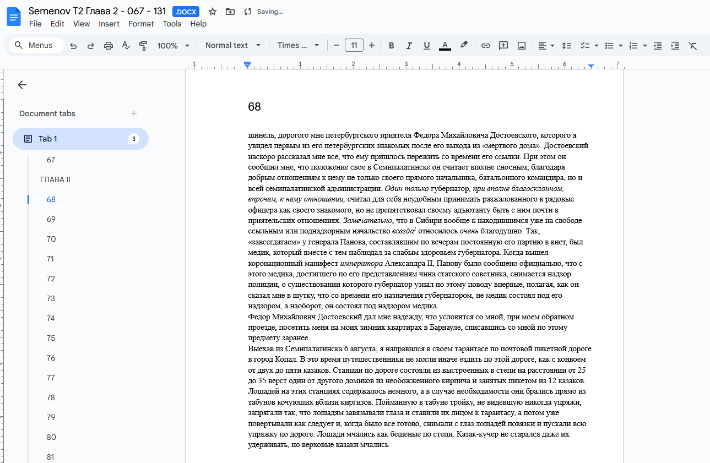
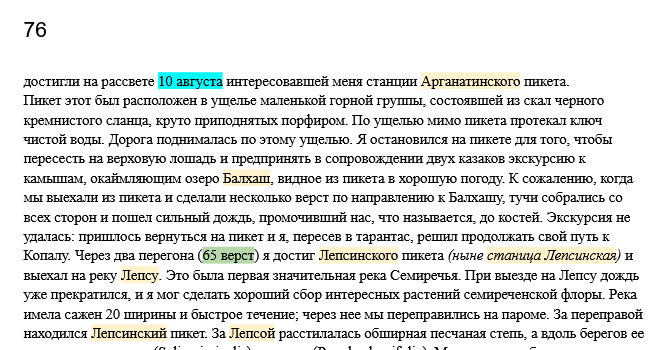
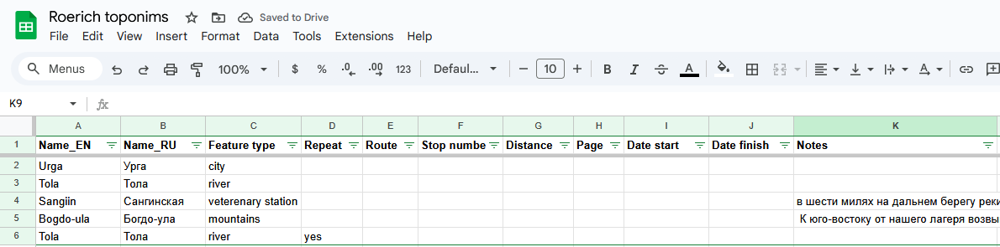
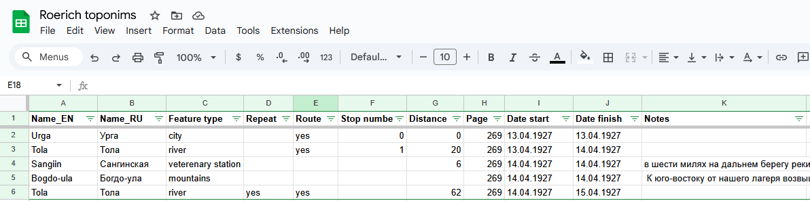

## Introduction

This methodology describes the steps to prepare route data for mapping.

Imagine you have a source telling a travel story of a person. This could be a diary, travelogue or a travel journal by the traveller him/herself or by somebody else. Steps described here help turn a diary into a structured source of information that is effective to further turn into an actual map. This methodology described here does not yet cover the process of mapping.

Decoding travellers diary into a good source of information is often a tedious and time consuming process. Following these recommended steps will ensure effective, shareable, easy to return to and iterative process that will make the result definitive and well prepared for the next steps.

## Short version

This is a short version of the proposed methodology.

0. Keep all docs online for collaborative work.
1. Find a definitive source for the travel description.
2. Mark up all toponyms and routing information in the text.
3. Extract toponyms and routing information from the text into a table.

Now let us dive deeper into the details for each step.

## Step 1. Find and prepare the source

To start work it is necessary to:

1. Establish a definitive source. This is typically a most detailed description of the travel.
2. Have it digitized.

Do not confuse 'digitized' with simply 'scanned'. While this is possible to work with a scanned document, it is recommended to start with the actual digital text of a source to easily copy-paste, markup and return to its particular portions for more study.

If you already have an actual digital text, you can skip this step. If you don't, you need to perform some or all of these:

1. Scan the source to produce a scanned document.
2. Perform an OCR process (Optical character recognition) to turn scanned images into an actual text document.
3. Translate if needed.
4. Edit.
5. Put the result on Google Drive to be easily available for collegues.

While editing, it is recommended to keep page numbers for easy return to the text.

## Step 2. Text markup

After the source is prepared, route information needs to be maked up.

Carefully read throught the source and mark up the following information:

1. Place names (toponyms). Usually both the toponyms along the actual route and other toponyms are marked up. Recommended color: Light yellow.
2. Dates and times or travel, particular stops, date and time spent on them. Dates on arrival and departures etc. Recommended color: Light blue.
3. Additional route information. This typically involve: mileage, orientation related to the movement and toponyms (NSEW), unnamed stops, night overs, etc. Recommended color: Light green.

The result of this step might look like this:

## Step 3. Extract toponyms information

Start a new an elecronic spreasheet (table) such as Google Sheet with the field names described below. Freeze the first line with field names, under menue select View - Freeze - 1 row.

This is a full structure, field names are italicized. However, we recommend not to enter all data at once, but enter it separately into two iterations (steps). List all toponyms at this step.

* *Name_LN* - the name of the toponym with a two letter language code: EN for English, RU for Russian etc.
* *Feature type* - the type of a toponym, usually: river, city, ridge, mountain, monastery etc. Try to limit number of types. You can list all possible types on a separate sheet to reuse.
* *Repeat* - fill with 'yes' to indicate that the toponym is repeated. Leave blank to default to 'no', i.e. this will mean that the toponym is first mentioned.
* *Route* - do not fill at this point, see next step.
* *Stop number* - do not fill at this point, see next step.
* *Distance* - do not fill at this point, see next step.
* *Page* - the page number where the toponym or stop were mentioned in the source. This is useful for easy reference and quite return to the text.
* *Date start* - do not fill at this point, see next step.
* *Date finish* - do not fill at this point, see next step.
* *Notes* - a short quote from the text. Typically a verbatim copy-paste. Do not use this field for explanations.

More fields such as toponyms in other languages can be added further if necessary.

The result of this step might look like this:

## Step 4. Extract routing information

Perform another read through the text entering additional information. Field names are italicized.

* *Name_LN* - As necessary add more lines indicating stops with no place name.
* *Route* - fill with 'yes' to indicate that the toponym is on the route.
* *Stop number* - fill with a consequitive stop number. Stops typically indicate an overnight stay.
* *Distance* - mileage traveled from the previous stop with mileage marked.
* *Date start* - travel date when the toponym or stop were first visited/mentioned.
* *Date finish* - travel date when the toponym or stop were left. Typically the next day, but more then one night could've been spent at the stop.

The result of this step might look like this:

## Next steps

The next steps usually involve research into each toponym for its:

* Geolocation - the process of locating the probable or actual (modern) location of the mentioned toponyms on the map.
* Mapping - the process of extracting recording of it's coordinates in special GIS data layers

Further to create an actual route by:

* Routing - connecting the toponyms into a route
* Validation - use of routing information to ensure consistency of the route.

These steps are not described here.

## Final remarks

Obviously, you can choose to enter all information at once, work with scanned PDFs, omit page numbers etc. However, we recommed to follow steps about to produce a solid, reusable dataset.

The process described here is often iterative. You might start with a particular segment of the travel and return to add more, the described methodology lets you build it gradually and effectively to return to the route when necessary.

Enjoy the trip!

. Tsybikov - A Buddhist Pilgrim at the Shrines of Tibet")

## Discussion

[**Questions or comments?**](https://t.me/answer42geo/85)
