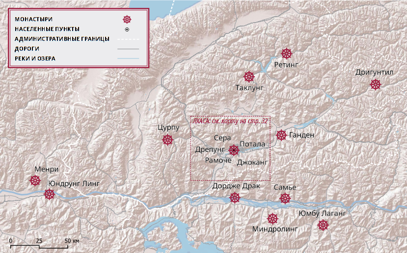
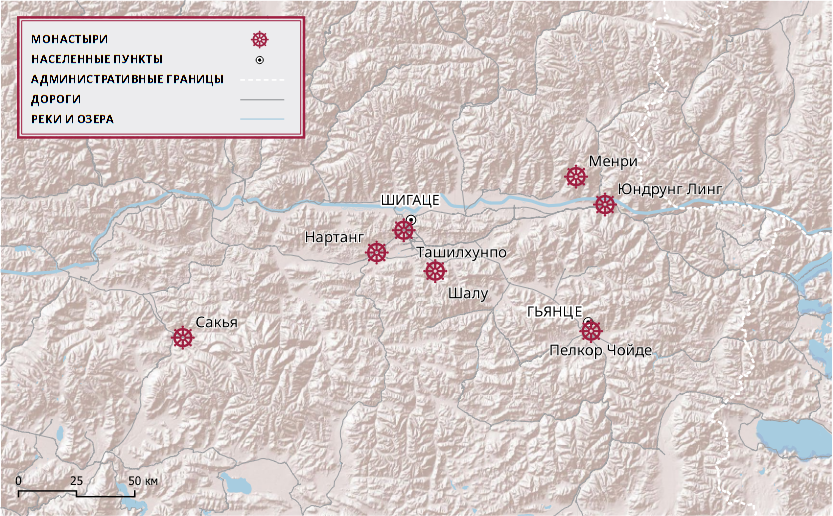

## Введение

На днях вышла книга - результат нескольких лет экспедиций по святым местами Тибета. В последней из них в 2023 г. принял участие я.

Для этой книги я подготовил карты. Привожу здесь их и индекс топонимов.

## Общая информация

Библиографическая ссылка:

Гарри, И. Р., Жабон, Ю. Ж., Смирнова, М. О., 2024. По святым местам Тибета. Историко-культурный путеводитель. Ин-т монголоведения, буддологии и тибетологии СО РАН. — Улан- Удэ: Буряад- Монгол Ном, 2024. — 224 с.

Аннотация:

Книга посвящена исследованию святых мест Тибета. В ней представлены географические и исторические сведения о Тибете, история тибетского буддизма и его школ, а также комплекcная информация по истории и культуре 40 наиболее значимых
святых мест и сакральных объектов Тибета, полученная в результате источниковедческой и полевой работы авторского коллектива.
Издание адресовано специалистам — религиоведам и востоковедам, а также всем интересующимся буддизмом, историей и культурой Тибета.

## Карты

")

## Указатель топонимов, названий монастырей, дацанов

Алтынтаг, 10

Алчи (A lci), 133

Амдо (A mdo), 9, 12, 26, 27, 82, 93, 104, 139, 140, 141, 143, 144, 146, 148, 149, 151–163, 170, 178, 182

Америка, 186

Амнье Мачен (A myes rma chen), 27, 28

Анаватапта, озеро (Anavatapta), 131

Баян-Хара-Ула, 10

Билакуппе (Bylakuppe), 113

Бодхгая (Bodh Gaya), 25, 36, 119

Бонри (Bon ri), 183

Брахмапутра (gTsang po), 11, 62, 90, 93

Бутан, 77, 168

Бэри (Be ri), 174

Ванкур (dBang bskur ri), 65

Викрамашила, 19

Восточный Туркестан, 15

Ганга, 129

Гангачу (Gang g’a chu), 131

Гангток, 77

Ганден (dGa’ ldan, dGa’ ldan rnam par rgyal ba’i gling), 62, 65–70, 104, 160

Ганден Тубчен Чойкорлинг (dGa’ ldan chos ‘khor gling), 172

Ганден Шедруб Линг (dGa’ ldan bshad sgrub gling), 158

Гандзе (dKar mdzes), 175

Ганринпоче (Gangs rin po che), 129

Гантисе (Gangs ti se), 129

Ганьнань (Kan lho bod rigs rang skyong khul), 9

Ганьсу, 9, 10, 15, 28, 29, 143, 150, 157

Ганьцзы (dKar mdzes), 9

Гарзе (dKar mdzes), 175

Гепел, гора (dGe ‘phel dbu rtse), 51

Гилгит, 15

Гималаи, 10, 135

Гоа, 135

Гоби, 10

Гокпа (‘Gog pa ri), 52

Голок (mGo log bod rigs rang skyong khul), 9

Гоманг-дацан (sGo mang grwa tshang), 53–55, 58, 143, 144

Гомпалунг (dGon pa lung), 140

Гонлунг (dGon lung), 5, 151, 152–156

Гонлунг Джампа Линг (dGon lung byams pa gling), 151

Гоцук (‘Go tshugs dgon pa), 131

Гуге (Gu ge), 11, 18, 131, 133–135

Гьенгонг (rGyan gong), 118

Гьюме-дацан (rGyud smad grwa tshang), 42, 43, 70, 142

Гьюпа-дацан (rGyud pa grwa tshang), 142, 159, 160, 162

Гьюто-дацан (rGyud bstod grwa tshang), 42, 43, 70, 78, 149

Гья-дацан (rGya grwa tshang), 61

Гьялпо-дацан (rGyal po grwa tsahang), 54

Гьялронг (rGyal rong), 13, 92, 93, 159, 160

Гьянце (rGyal rtse), 94, 114, 115

Даклха Гампо (Dwags lha sgam po), 74, 75

Дарчен (Dar chen), 130

Денсатил (gDan sa mthil), 81

Дерге (sDe dge), 12, 167–170, 177, 181

Дерге Гончен (sDe dge dgon chen), 5, 167–170

Дехрадун, 83, 87

Деши Гечу (sDe bzhi dge bcu), 168

Джамму и Кашмир, 133

Джампа Линг (Byams pa gling), 42, 141

Джантанг (Byang thang), 11, 93

Джанце-дацан (Byang rtse grwa tshang), 43, 69, 70

Джанчуб Линг (Byang chub gling dgon pa), 83

Джиу (Byi’u dgon pa), 131

Джоканг (Jo khang), 5, 27, 33–35, 37–39, 41, 44, 56, 70, 111, 143, 185

Дзачу (rDza chu, Zla chu), 170

Дзачука (rDza chu kha), 168

Дзоге (mDzod dge), 157

Дзогчен Гомпа (rDzogs chen dgon pa), 181–183

Дицин (bDe chen bod rigs rang skyong khul), 9

Доланджи (Dolanji), 92

Долмала (sGrol ma la), 130

Долмари (sGrol ma ri), 183

Дордже Драк (rDo rje brag, Thub bstan rdo rje brag), 90–92

Дордже Силтром (rDo rje zil khrom), 181

Драктоканг (Brag thog khang), 53

Дрентанг (Dran thang dgon pa), 102

Дрепунг (‘Bras spungs, dPal ldan ‘bras spungs), 5, 14, 38, 43, 45, 50–58, 61, 65, 68, 69, 104, 141–143, 161

Дригунг (‘Bri gung), 81

Дригунтил (‘Bri gung mthil dgon pa), 5, 81–83

Дрокри (‘Brog ri bo che), 65

Дромтенг-дацан (‘Brom steng grwa tshang), 61

Друбда-нуб (sGrub grwa nub), 82

Друбда-шар (sGrub grwa shar), 82

Дуйнкор-дацан (Dus ‘khor grwa tshang), 143, 153, 162

Дулва-дацан (‘Dul ba grwa tshang), 54

Дунша (gDung sha), 160

Дуньхуан, 13

Дханьякатака (санскр. Dhānyakaṭaka, Śrī Dhānya- kaṭaka / тиб. Dha nya ka ta ka, dPal ldan ‘bras spungs, ‘Bras spungs), 51

Дхарамсала, 43, 78, 162

Дэянг-дацан (bDe yangs grwa tshang), 54

Европа, 130, 186

Инд, 11, 129

Индия, 5, 13, 15, 16, 19, 27, 35, 39, 43, 48, 57, 58, 61, 69, 70, 73, 77, 78, 83, 84, 87, 89, 93, 102, 103, 105, 113, 116, 133–135, 155, 161, 162, 176, 178, 182, 186, 212

Кава Карпо (Kha ba dkar po), 27

Кайлас (Kailāsa), 5, 10, 11, 26, 27, 29, 129–131, 135

Калари Кирти (Ka la ri ki rti dgon pa), 160, 162

Калари Кирти Гон Таши Лхундуб (Ki rti ka la ri dgon bkra shis lhun grub), 160

Кампо Ненанг (Kam po gnas nang dgon pa), 74

Кандзе (dKar mdzes), 175

Каракорум, 10

Кардзе (dKar mdzes), 175

Карма Лхатенг (Karma lha steng dgon pa), 74

Карма-гон (Karma dgon), 74

Карнали, 129

Карнатака, 57, 61

Карце (dKar mdzes), 5, 9, 175

Карце Гомпа (dKar mdzes dgon pa), 175, 176

Карце Шедруб Норбулинг (dKar mdzes bshad grub nor bu gling), 175, 176

Карце-Тибетский автономный округ (dKar mdzes bod rigs rang skyong khul), 175

Катака, 51

Катог (Ka: thog), 177–181

Катог Дорджеден (Ka: thog rdo rje gden), 178

Кашмир, 18, 19, 133, 134

Кирти Гомпа (Ki rti dgon pa), 5, 159, 160, 162

Кирти Джепа (Ki rti byes pa grwa tshang), 162

Кирти Намгьял Дечен Линг (Ki rti rnam rgyal bde chen gling), 161

Китай, 12, 13–15, 25, 26, 28, 34, 38, 42, 48, 50, 76–78, 86, 98, 104, 105, 107, 135, 139, 147, 150, 152, 154, 155, 159, 167, 174, 186

Кукунор, 12, 24, 50, 143

Кумбум (sKu ‘bum), 5, 27, 29, 114, 139–143, 160

Кумбум Джампа Линг (sKu ‘bum byams pa gling), 139, 145

Куньлунь, 10

Кхам (Khams), 9–12, 18, 24, 27, 72, 74, 75, 81, 93, 159, 165, 167, 169, 170, 171, 173–176, 179, 182–186

Кьедор-дацан (Kye rdor grwa tshang), 148

Кьилканг-дацан (dKyil khang grwa tshang), 113

Кьичу (sKyid chu), 11, 42, 65

Кьормолунг (sKyor mo lung), 52

Кьюнпо (Khyung po), 93

Лабран (bLa brang), 143

Лавран (bLa brang), 4, 5, 29, 104, 143–151

Лавран Ташикьил (bLa brang bkra shis ‘khyil), 143, 153

Ладак (La dwags), 11, 131, 133–135

Лакнар Цо (Lag ngar mtsho), 131

Ланчен Кабаб (gLang chen kha ‘bab), 134

Ланьчжоу, 143, 157

Ларунг Гар (La rung sgar), 5, 185, 186

Литанг (Li thang), 5, 24, 172, 174, 175

Литанг Чойде (Li thang chos sde), 172–175

Личу (Li chu), 172

Лучу (kLu chu), 157

Лхаса (Lha sa), 9, 11–13, 24, 30, 33, 37, 38, 40–45, 49, 52, 55–60, 65, 67, 68, 70, 71, 76, 79, 81, 83, 86, 91, 104, 105, 130, 141, 142, 145, 149, 153, 158, 168, 170, 174, 176

Лхока (Lho ka), 74, 90

Лхундуб Денг (Lhun grub steng), 168

Магадха, 35

Мадроцо (Ma dros mtso, mTsho ma dros pa), 131

Манасаровар, 5, 11, 130, 131

Мапам Юмцо (Ma pham gYu mtsho), 131

Марпори (dMar po ri), 33, 44

Мегью-дацан (sMad rgyud grwa tshang), 148

Ме-дацан (sMad grwa tshang), 61

Меджунг Тойсамлинг (sMad byung thos bsam gling), 147, 149

Меконг (rDza chu), 11, 12, 170

Менпа-дацан (sMan pa grwa tshang), 142, 148, 153, 162

Менри (sMan ri, bKra shis sman ri), 5, 92

Миндролинг (sMin grol gling dgon pa), 5, 87–89

Монголия, 98, 103, 105, 139, 144, 151–153, 155

Муксанг (rMugs sangs), 177

Мундгод, 58, 69, 70

Намгьял-дацан (rNam rgyal grwa tshang), 47

Намдролинг (rNam grol gling dgon pa), 178

Нанчу (Nang chu), 183

Наншик (sNang zhig dgon pa), 5, 162, 163

Наргьи Детанг (sNar gyi mda’ thang dgon pa), 122

Нартанг (sNar thang dgon pa), 5, 88, 122–125

Нгава (rNga ba), 160, 162, 163

Нгава Кирти Гомпа (rNga ba ki rti dgon pa), 160

Нгава-Тибетско-Цянский автономный округ (rNga ba bod rigs cha bang rigs rang skyong khul), 9

Нгакпа-дацан (sNgags pa grwa tshang), 53, 54, 56, 61, 69, 99, 113, 142

Нгари (mNga’ ri), 11, 79, 127, 129, 130, 134

Нгомчу (Ngom chu), 170

Нгор Евам Чойден (Ngor e waṃ chos ldan dgon pa), 168, 169

Непал, 14, 15, 19, 37, 48, 185

Неудзонг (sNe’u rdzong), 60

Ньего (mNyes ‘go dgon pa), 131

Ньетанг (sNye thang), 79

Ньянчен Танлха (gNyan chen thang lha), 10, 11

Одантапури, 15, 84

Олха Гьялсанг, гора (’O lha rgyal bzang), 93

Орисса, 51

Отан (‘O thang mtsho), 34

Пари (dPa’ ri), 152

Пекин, 9, 12, 28, 44, 60, 113, 154, 158

Пелкор Чойде (dPal ‘khor chos sde), 5, 116, 117, 188

Пелъюл (dPal yul rnam rgyal byang chub chos gling), 5, 177, 178

Пема Чойлинг (Padma chos gling), 184

Потала (санскр. Potala / тиб. Po ta la), 5, 13, 27, 30, 40, 44–50, 57

Пуранг (sPu hrang), 79, 131

Путошань, 50

Ракшас Тал (Rakṣas Tal), 131

Рамоче (Ra mo che tsug lag khang), 5, 13, 27, 34, 41–44

Раса (Ra sa), 33, 44

Раса Трулнанг (Ra sa ‘phrul snang tsug lag khang), 33–35, 42

Ретинг (Rwa sgreng, Ra sgreng), 5, 79–81

Ретинг Цанпо (Rwa sgreng gtsang po), 79

Ривоче (Ri bo che), 72

Рудам Кьитрам (Ru dam skyid khram), 181, 183

Румтек (Rum theg dgon pa), 77, 78

Рушар (Ru shar), 139

Салуин, 11

Самдрубце (bSam grub rtse), 22

Самье (bSam yas), 5, 14, 17, 51, 83–86, 90, 178

Санпу (gSang phu dgon pa, gSang phu ne’u thog), 52

Санчу (bZang chu), 151

Сатледж, 11, 129, 134

Севалунг (Se ba lung dgon pa), 131

Сера (Se ra dgon pa, Se ra theg chen gling), 5, 43, 51, 53, 57, 58–61, 65, 67, 69, 104, 170

Сера Дже-дацан (Se ra byes grwa tshang), 53, 61, 69

Сера Ме-дацан (sMad grwa tshang), 61

Сера Чойдинг (Se ra chos sdings ri khrod), 58, 59

Серког (gSer khog), 50

Сертар (gSer thar), 185

Сибирь, 131

Сикким, 77

Синин, 151

Спити, 133

Сумеру (санскр. Sumeru, Meru / тиб. Ri bo ri rab, Lhun po ri rab, Ri rab), 85, 129, 172

Сунчу (Zung chu), 157

Сычуань, 10, 28, 157, 159, 160, 163, 172, 175, 186

Сычуаньские Альпы, 10

Сяхэ, 151

Табо (Ta pho), 133

Таде Чойлунг (rTa sde chos lung), 123

Таклунг (sTag lung), 5, 71, 72

Такцан Лхамо (sTag tshang lha mo), 160

Такцан Лхамо Кирти (sTag tshang lha mo kir ti dgon pa), 161

Такце (sTag rtse rdzong), 65

Тала Ридро (Tha la ri khrod), 160

Таримский бассейн, 10, 15

Тартанг Донгак Шедруб Линг (Dar thang mdo sngags bshad sgrub gling dgon pa), 178

Таши Силнон (bKra shis zil gnon), 104

Ташилхунпо (bKra shis lhun po), 5, 11, 27, 104–110, 112–114, 124

Тибетский автономный район (Bod rang skyong ljongs), 9, 10, 28, 29, 114, 167

Тиртхапури (Tīrthapuri), 131

Тисе (Ti se), 129

Тобгьял (sTobs rgyal dgon pa), 5, 163

То-дацан (sTod grwa tshang), 61

Тойсамлинг (Thos bsam gling), 54

Тойсамлинг-дацан (Thos bsam gling grwa tshang), 113

Толинг (mTho lding, mTho gling), 5, 131–133

Толунг (sTod lung), 73, 79

Толунг Цурпу (sTod lung mtshur phu), 73

Трешо (Tre shod), 74

Труго (Khrus sgo dgon pa), 131

Трулнанг (‘Phrul snang), 13

Трумчу (Grum chu), 99

Тубден Дордже Драк Эвам Чокгар (Thub bstan rdo rje brag e vaM chog sgar), 91

Уддияна (санскр. Uḍḍiyāna / тиб. O rgyan), 35

Уй-Цанг (dBus gtsang), 9, 12, 74, 159

Хайбэй (mTsho byang bod rigs rang skyong khul), 9

Хайнань (mTsho lho bod rigs rang skyong khul), 9

Хайси-Монгольско-Тибетский автономный округ (mTsho nub sog rigs dang bod rigs rang skyong khul), 9

Халха-Монголия, 25, 28

Хепори (Has po ri), 83

Химачал-Прадеш, 133

Хор (Hor), 93, 176

Хорпо (Hor po), 178

Хуаннань (rMa lho bod rigs rang skyong khul), 9

Хуанхэ, 11

Хуаншуй, 152

Хуари, 152

Хучжу-Туский автономный округ, 152

Цамда (rTsa mda’), 133

Цанг (gTsang), 9, 11, 18, 42, 68, 77, 91–93, 95, 97, 101–105, 109, 110, 112, 113, 116, 119, 120, 122–125, 160

Цангар (gTsang sgar dgon pa), 157

Цанпо (gTsang po), 11

Цапаранг (rTsa hreng), 133–135

Цел Гунтанг (Tshal gung thang), 59, 75

Центральная Азия, 130

Центральная китайская равнина, 10

Центральный Тибет, 9, 11, 12, 22, 25, 26, 29, 63, 67, 74, 75, 81, 90, 97, 104, 118, 124, 133, 141, 143, 145, 152, 158, 160, 167, 168, 170, 179, 182

Цинхай, 9–12, 26, 29, 139, 152

Цонка (gTsong kha), 76, 153

Цончу (Tsong chu), 152

Цурпу (mTshur phu), 5, 73–79

Чамдо (Chab mdo), 170, 171, 181

Чамдо Джампа Линг (Chab mdo byams pa gling dgon pa), 5, 170, 171

Чанпу Лхаканг (Lcang phu lha khang), 75

Чанъань, 15

Чимпу (mChims phu), 83

Чойлунг (Chos lung), 42

Чоне (Co ne), 157, 158

Чоне Гончен (Co ne dgon chen), 157, 158

Чоне Гончен Ганден Шедруб Линг (Co ne dgon chen dga’ ldan bshad sgrub gling), 157

Чумда (Chums mda’), 42

Чэнду, 176

Шагкор (Shag skor), 54

Шакшо (bZhag shod), 159

Шалу (Zhwa lu dgon pa), 5, 20, 118–122, 160

Шамбала (санскр. Śambhala / тиб. Sham bha la, Shambha la), 49, 119, 120

Шанхай, 185

Шарце-дацан (Shar rtse grwa tshang), 43, 69, 70

Шелкар (Shel dkar), 21

Шечен Гомпа (Zhe chen dgon pa), 5, 183–185

Шечен Тенньи Даргье Линг (Zhe chen bstan gnyis dar rgyas gling), 185

Шигаце (gZhi ka rtse), 97, 104, 106, 112, 114, 122, 126

Шунчу (gZhung chu), 92

Эвам Чокгар (E waM lchog sgar), 91

Эгитуйский дацан, 36

Энсака (dBen sa kha dgon pa), 92

Южная Азия, 129

Юйшу ( Yul shul bod rigs rang skyong khul), 9

Юмбу Лаганг (Yum bu bla sgang), 5, 86, 87

Юмбу Лакар (Yum bu bla mkhar), 86

Юмбу Лхакар (Yum bu lha mkhar), 86

Юндрунг Линг (gYung drung gling), 5, 93

Юнхэгун, 113

Юньнань, 9, 10, 15

Янпачен (Yangs pa can), 76

Янцзы, 11, 12

Ярлунг (Yar lung), 86

Ярлха Шампо (Yar lha sham po), 27

## Комментарии

[**Обсудить**](https://t.me/answer42geo/78)