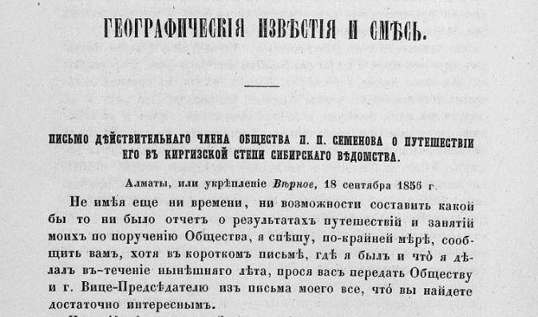
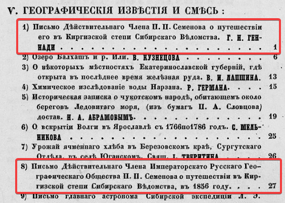

## Введение

Два письма являющиеся первыми материалами о путешествии Семенова опубликованы в Вестнике Императорского Русского географического общества. Ч. 18, 1856. Вестник целиком можно посмотреть на [сайте библиотеки РГО](https://elib.rgo.ru/handle/123456789/219058) или [скачать в виде PDF](https://drive.google.com/file/d/1pAkf_GDavm4fd8f10zuooIXW-najCqvf/view?usp=sharing).

Так же, как и «[Первая поездка на Тянь-Шань](/notes/semenov-first-report/)» 1858 г., оба письма упомянуты в списке основных трудов П.П. Семенова Тян-Шанского во втором томе мемуаров 2019. Однако, в отличие от первой поездки, текст писем в Том 2 почему-то не вошёл.

Первое письмо в оглавлении значится как письмо Г.Н. Геннади, который его получил или зачитывал его [Григорий Николаевич Геннади](https://ru.wikipedia.org/wiki/%D0%93%D0%B5%D0%BD%D0%BD%D0%B0%D0%B4%D0%B8,_%D0%93%D1%80%D0%B8%D0%B3%D0%BE%D1%80%D0%B8%D0%B9_%D0%9D%D0%B8%D0%BA%D0%BE%D0%BB%D0%B0%D0%B5%D0%B2%D0%B8%D1%87), член Русского Географического общества.

Здесь опубликован распознанный текст первого письма.

## Первое письмо: ссылки

Геннади Г.Н. Письмо действительного члена общества П. П. Семенова о путешествии его в Киргизской степи Сибирского ведомства. Алматы, или укрепление Верное, 18 сентября 1856 г. // Вестник Русского географического общества. Ч. 18. СПб., 1856. С. 1--6.

[PDF](https://drive.google.com/file/d/1_bgsFv3ayIsShNc0ST4uqBkXl4IZQYQ1/view?usp=sharing) --- фрагмент из Вестника только с текстом письма для удобства.

[Распознанный текст](https://docs.google.com/document/d/1CyQEqEPeOMRT_dQOy2VtJp3w6HTY2jYn/edit?usp=sharing&ouid=112245657670169384946&rtpof=true&sd=true) в старой орфографии.

[Распознанный текст](https://docs.google.com/document/d/1RtSG7zmVrspaFdYf68jitJZd5OT5Ol3s/edit?usp=sharing&ouid=112245657670169384946&rtpof=true&sd=true) в современной орфографии.

[Статья](/notes/semenov-first-letter/) с текстом первого письма.

## Второе письмо: ссылки

Письмо действительного члена Русского географического общества П. П. Семенова о путешествии его в Киргизской степи Сибирского ведомства в 1856 г. // Вестник Русского географического общества. Ч. 18. Кн. 6. СПб., 1856--1857. С. 27--30.

[PDF](https://drive.google.com/file/d/1UXcv-KIkvbY37dCRFbDDlh1Uqlsxk2w7/view?usp=sharing) --- фрагмент из Вестника только с текстом письма для удобства.

[Распознанный текст](https://docs.google.com/document/d/1ZSwB0dbLJ2llgxWLip718szklO2L1Fj8/edit?usp=sharing&ouid=112245657670169384946&rtpof=true&sd=true) в старой орфографии.

[Распознанный текст](https://docs.google.com/document/d/1BLM9rU2GnbbUFTvHsTkbPkhjaON-FVdn/edit?usp=sharing&ouid=112245657670169384946&rtpof=true&sd=true) в современной орфографии.

[Статья](/notes/semenov-second-letter/) с текстом второго письма.

## Первое письмо: текст в старой орфографии

**ВѢстникъ**

**ИМПЕРАТОРСКАГО**

**РУССКАГО ГЕОГРАФИЧЕСКАГО ОБЩЕСТВА,**

**ИЗДАВАЕМЫЙ**

**подъ редакціею Секретаря Общества**

***Е. И. Ламанскаго.***

**1856.**

**ЧАСТЬ ОСЬМНАДЦАТАЯ.**

**САНКТПЕТЕРБУРГЪ**

**ВЪ ТИПОГРАФІИ ЭДУАРДА ПРАЦА.**

**1856.**

**V.**

**ГЕОГРАФИЧЕСКІЯ ИЗВѢСТІЯ И СМѢСЬ.**

**ПИСЬМО ДѢЙСТВИТЕЛЬНАГО ЧЛЕНА ОБЩЕСТВА П. П. СЕМЕНОВА О ПУТЕШЕСТВІИ
ЕГО ВЪ КИРГИЗСКОЙ СТЕПИ СИБИРСКАГО ВѢДОМСТВА.**

Алматы, или укрѣпленіе *Вѣрное,* 18 сентябра 1856 г.

Не имѣя еще ни времени, ни возможности составить какой бы то ни было отчетъ о результатахъ путешествій и занятій моихъ по порученію Общества, я спѣшу, по-крайней мѣрѣ, сообщить вамъ, хотя въ короткомъ письмѣ, гдѣ я былъ и что я дѣлалъ въ-теченіе нынѣшняго лѣта, прося васъ передать Обществу и г. Вице-Предсѣдателю изъ письма моего все, что вы найдете достаточно интереснымъ.

По пріѣздѣ моемъ въ Сибирь, двѣ страны, далеко отстоящія одна отъ другой, должны были преимущественно обратить на себя мое вниманіе, какъ по особенной ихъ важности, такъ и потому-что обѣ онѣ должны войти непосредственно въ два слѣдующіе тома моего перевода Риттеровой Азіи. Это именно собственно *Алтайскій округъ* и *юго-восточная часть нашей Киргизской степи,* между Балкашемъ, Алатау и Иссыкъ-Кулемъ: изъ нихъ послѣдняя войдетъ въ составъ II, а первая --- III тома «Азіи».

Въ Алтаѣ болѣе всего привлекала меня самая высшая его горная группа *Бѣлуха и Катунскіе столбы,* какъ особенно интересная для наблюденій по части Физической географіи, а въ юго-восточномъ углу Киргизской степи---*Заилійскій край* и въ-особен-

2

ности *озеро Иссыкъ-Куль,* еще не тронутое никакими научными изслѣдованіями и извѣстное только изъ распросныхъ свѣдѣній. Потому самое ревностное желаніе мое было въ-теченіе нынѣшняго лѣта или подняться на Бѣлуху, или добраться до Иссыкъ-Куля. Оба предпріятія были сопряжены съ такими затрудненіями и препятствіями, что я, конечно, мало надѣялся на успѣшное исполненіе того или другаго. Уже во время проѣзда моего черезъ Омскъ, по собраннымъ свѣдѣніямъ, я мысленно почти отказался отъ втораго предпріятія, считая его совершенно неудобоисполнимъ, и мнѣ осталось попытаться привести въ исполненіе только первое.

Я пріѣхалъ въ Барнаулъ во второй половинѣ іюня и только къ концу этого мѣсяца , при самомъ обязательномъ содѣйствіи г. начальника горнаго округа, получилъ возможность добраться до самаго Алтая въ Змѣиногорскѣ, въ совершенной готовности къ трудной поѣздкѣ къ Катунскимъ столбамъ, долженствовавшей занять весь короткій лѣтній сезонъ въ Алтаѣ, до начала первыхъ холодовъ и снѣговъ въ горахъ, т.-е. начала августа. Остальную же осень я предположилъ употребить на путешествіе въ болѣе теплыхъ Киргизскихъ степяхъ. Но неожиданная болѣзнь, на три недѣли удержавшая меня въ Змѣиногорскѣ, измѣнила весь планъ мой. По выздоровленіи я былъ въ-силахъ продолжать путешествіе свое только съ 20 іюля, употребивъ время болѣзни своей на приготовительное изученіе матеріаловъ для землевѣдѣнія Алтая, имѣющихся въ горномъ вѣдомствѣ. На Бѣлуху въ копцѣ іюля было уже ѣхать поздно; притомъ, я и не могъ достигнуть главной цѣли, меня туда призывавшей---опредѣленія высоты самой высшей точки Алтая, а также высоты снѣжной линіи и ледниковъ, потому-что барометръ мой былъ испорченъ. Потому я ограничился только обзоромъ всей западной окраины Алтая, посѣщеніемъ Ульбинской и Убинской долинъ и важнѣйшихъ рудниковъ и восхожденіемъ на одинъ изъ высшихъ бѣлковъ ульбинской группы --- Ивановскій, близъ Риддерека.

Затѣмъ, 1 августа, желая воспользоваться еще прекрасною осенью, болѣе продолжительною на югѣ, я поспѣшилъ черезъ Семипалатинскъ въ Киргизскую степь, открытую мнѣ просвѣщеннымъ содѣйствіемъ и предписаніямъ г. генералъ-губернатора Западной Сибири. Я проѣхалъ медленно всю обширную и интересную страну отъ Семипалатинска до Ковальскаго укрѣпленія, останавливаясь вездѣ, гдѣ только того требовали интересы науки землевѣдѣнія. Въ двухъ мѣстахъ мнѣ удалось восходить на вершины высокихъ горъ, близкія предѣламъ вѣчнаго снѣга и уже

3

покрытыя вѣчно снѣжными пятнами: именно въ цѣпи *Каратау* близъ самаго Копала и въ цѣпи *Аламак*ѣ далеко за Капаломъ, близъ рѣки Коксу, далѣе которой почти не простирались научныя изслѣдованія нашихъ послѣднихъ ученыхъ путешественниковъ Ал. Шренка и Влангали.

Продолжая путь свой за Коксу, я переѣхалъ и черезъ Иди и попадъ въ концѣ августа въ Заилійскій край, въ укрѣпленіе Вѣрное, или городъ Алматы, какъ его называютъ туземцы,---слѣдовательно. въ самое отдаленное русское поселеніе въ центральной Азіи. Городъ Алматы лежитъ, приблизительно, въ одной широтѣ съ Пизой и Флоренціей, въ верховьяхъ системы рѣки Кекселена (на рѣчкѣ Алматинкѣ), у подошвы величественнаго ряда исполиновъ снѣжнаго хребта Кунги-Тау, ограничивающаго озеро Иссыкъ-Куль съ сѣверной стороны. Послѣ 300 верстъ пути отъ Копала черезъ пустынныя горы и широкія песчаныя степи, пріѣздъ въ Алматы, вечеромъ 27 августа, произвелъ на меня магическое впечатлѣніе. Въ этотъ вечеръ отдаленный уголокъ Россіи кипѣлъ жизнью. Длинныя красивыя, свѣже-отстроенныя деревянныя казармы были ярко освѣщены радостными огнями въ каждомъ окнѣ. Я выѣхалъ на обширную площадь, на которой ярко горѣвшіе ряды плошекъ и шкаликовъ обрисовывали кадры еще недостроенныхъ зданій, которые казались совершенно оконченными красивыми домами. Площадь была полна русскимъ народомъ; илюминованный вензель Императора занималъ ея средину. Военные музыка и пѣсни хороводовъ оживляли картину. Быстро созидающійся городъ Алматы праздновалъ день коронованія своего Императора на отдаленной и самой малоизвѣстной границѣ Россіи съ такою же живою патріотическою радостью съ какою его празднуютъ въ сердцѣ Россіи, въ первопрестольномъ ея городѣ. И все это происходило подъ безоблачнымъ небомъ благословеннаго природою юга, посреди теплой полуденной ночи, освѣжаемой только легкимъ вѣтромъ, разносившимъ изъ горныхъ ущелій по атмосферѣ ароматъ спѣлыхъ дикихъ ябло- ковъ, которымъ городъ Алматы обязанъ своимъ названіемъ.

Хребетъ Кунги-Тау, простирающійся отъ востока къ западу, приблизительно, въ параллели Кавказа (Эльбруса, то есть подъ 43° шир.), между Кескеленомъ и Тургенемъ, другимъ значительнымъ, болѣе восточнымъ притокомъ Или, заходитъ далеко за предѣлы вѣчнаго снѣга и высотою своею, конечно, превосходитъ всѣ болѣе сѣверные азіатскіе снѣжные хребты, т.-е. Алатау, Тарбагатай и Алтай. Треглавый исполинъ *Талгарнынъ-Тау,* поставленный совершенно посрединѣ цѣлаго хребта, въ верховьяхъ

4

Талгара, также притока Или, живописно одѣтъ ослѣпительною мантіею вѣчнаго снѣга и едва ли своею даже обсолютною высотою не поспоритъ съ Монбланомъ. Весь гребень горъ между Кескеленомъ и Тургенемъ такъ высокъ, что въ этомъ промежуткѣ нѣтъ ни одного сколько-нибудь удобнаго горнаго прохода, который бы велъ изъ Алматовъ къ озеру Иссыкъ-Кулю, отстоящему отъ города въ прямой линіи не болѣе, какъ на 60 верстъ.

Зато на обоихъ флангахъ своихъ хребетъ Кунги-Тау, значительно понижается: на западѣ за Кескеленомъ , на востокѣ за Тургенемъ, и тамъ-то найдены болѣе или менѣе удобные горные проходы и пути, ведущіе къ озеру Иссыкъ-Кулю. Только оттого и разстояніе отъ Алматовъ до Иссыкъ-Куля по западной дорогѣ уже составляетъ верстъ 180, а по восточной около 250. Мнѣ предстояло попытаться дойти до Иссыкъ-Куля только этими путями, на что я встрѣтилъ въ Алматахъ самое просвѣщенное и обязательное содѣйстіе со стороны мѣстнаго начальства, въ-особенности отъ командующаго казачьею бригадою и пристава Большой Орды.

На западной сторонѣ озера кочуетъ враждебный еще намъ родъ *Сара-Багишъ,* или *Урманъ* дикокаменныхъ, или черныхъ Киргизовъ, а по восточной --- состоящій въ русскомъ подданствѣ родъ *Бегу* тѣхъ же Киргизовъ. Потому выборъ дороги былъ излишенъ. Только и Бегу, въ кровавой распрѣ съ Сара-Багишами, откочевали отъ восточнаго берега Иссыкъ-Куля, который къ половинѣ нынѣшняго лѣта остался пустыннымъ и посѣщаемымъ только *барантою,* т.-е. разбоничьими шайками Урмановъ, нападающихъ на нашихъ подданныхъ племенъ Бегу дикокаменной и Атбанъ Большой Орды. Я рѣшился, однако же, съ легкимъ конвоемъ 10 казаковъ проникнуть сколь возможно далеко по трудной дорогѣ къ Иссыкъ-Кулю, черезъ высокіе горные проходы *Асынъ-Тау* и *Табулъга-Су.* Мнѣ удалось благополучно перейти этими горными проходами черезъ всѣ параллельные кряжи, на которые распадается Кунги-Тау на своемъ восточномъ флангѣ, и по р. *Тубъ* спуститься до самыхъ береговъ бурнаго, свѣтлоголубаго Иссыкъ-Куля, котораго солоноватыя волны въ этотъ день шумно набѣгали на свой восточный берегъ. Здѣсь я опредѣлилъ температуру кипѣнія воды гипсометромъ, а слѣдовательно гипсометрически и абсолютную высоту Иссыкъ-Куля. Результата сообщить еще не могу, за неимѣніемъ гипсометрическихъ таблицъ.

Широкая долина рѣки Тубъ и параллельной съ нею рѣки Джиргалакъ отдѣляетъ Кунги-Тау отъ ограничивающаго съ юж-

5

ной стороны озеро Иссыкъ-Куль снѣжнаго, исполинскаго Муcсарта. Если Кунги-Тау есть только боковая вѣтвь знаменитаго Небеснаго хребта, или Т'янь-Шаня, то Муссартъ есть непосредственное и непрерывное его продолженіе, носящее въ китайскихъ предѣлахъ названіе *Т'янь-Шаня* (Thian-Shan), въ высшей своей группѣ *Богдо-Ола,* а въ болѣе западномъ, внѣкитайскомъ своемъ продолженіи --- *Мустага, Муссарта, Киргизынь-Алатау.* Я находился слѣдовательно, у подошвы *Т'янъ-Шаня,* котораго вершины, одѣтыя широкимъ, вѣчно бѣлымъ, покровомъ, показались мнѣ колоссальнѣе Монблана и Монтерозы. Я не дошелъ только на одинъ день пути (50 верстъ), до горнаго прохода *Зауки,* или *Джауки,* ведущаго въ теплую Кашгорію и Малую Бухарію, къ китайскимъ городамъ *Турпану* (Ушъ-Турпану) и *Аксу,* знаменитымъ своими фруктами: виноградомъ и гранатами. Черезъ этотъ, удобный, при всей колоссальной высотѣ своей, горный проходъ можетъ проложить себѣ путь русская торговля въ сердце Азіи --- богатые и цвѣтушіе торговыя города *Кашгаръ* и *Ярканъ.* Отъ Турпана я находился при устьѣ Туба въ 200 верстахъ, т.-е. ближе, чѣмъ отъ Алматовъ.

Не менѣе счастливо удалось мнѣ и возвратиться въ Алматы, уже другою, болѣе кружною, дорогою, черезъ невысокій горный проходъ *Санташъ.* Ни баранты, ни тигровъ мы не встрѣтили; а волки и медвѣди намъ не могли быть опасны. 16 сентября возвратился я въ Алматы, послѣ 14-дневнаго странствованія, сдѣлавъ 500 верстъ, днемъ почти не сходя съ коня, а ночь проводя подъ легкою защитой парусинной палатки.

Теперь отдохну два или три дня и отправлюсь по западной дорогѣ на рѣку Чу, за которою, въ 6 верстахъ, лежатъ враждебныя намъ коканскія укрѣпленія *Токмакъ* и *Пишпекъ.* Это новое путешествіе дополнитъ мои изслѣдованія о пластическомъ и геогностическомъ строеніи хребта Кунги-Тау, въ которомъ, несмотря на мои ожиданія, я не видѣлъ и слѣда какихъ бы то ни было вулканическихъ породъ и весь хребетъ нашелъ состоящимъ изъ сіенита, гранита, діорита и порфира.

По возвращеніи съ Чу, тронусь въ обратный путь къ Семипалатинску ; по на дорогѣ мнѣ еще предстоитъ довольно дѣла, такъ-какъ я не хочу упустить ни одного случая, видѣть и въ сторонѣ отъ дороги все, что можетъ быть только интересно и важно для землевѣдѣнія, этнографіи и геологіи Азіи, начиная отъ обнаженій горныхъ породъ съ окаменѣлостями до историческихъ надписей и памятниковъ. Только въ половинѣ октября я надѣюсь

6

быть въ Семипалатинскѣ, гдѣ долженъ посвятить нѣсколько дней на собраніе свѣдѣній о нашей торговлѣ съ Китаемъ.

## Первое письмо: текст в современной орфографии

**Вестник**

**ИМПЕРАТОРСКОГО**

**РУССКОГО ГЕОГРАФИЧЕСКОГО ОБЩЕСТВА,**

**ИЗДАВАЕМЫЙ**

**под редакцией Секретаря Общества**

***Е. И. Ламанского.***

**1856.**

**ЧАСТЬ ВОСЕМНАДЦАТАЯ.**

**САНКТ ПЕТЕРБУРГ**

**ТИПОГРАФИЯ ЭДУАРДА ПРАЦА.**

**1856.**

**V.**

**ГЕОГРАФИЧЕСКИЕ ИЗВЕСТИЯ И СМЕСЬ.**

**ПИСЬМО ДЕЙСТВИТЕЛЬНОГО ЧЛЕНА ОБЩЕСТВА П. П. СЕМЕНОВА О ПУТЕШЕСТВИИ
ЕГО В КИРГИЗСКОЙ СТЕПИ СИБИРСКОГО ВЕДОМСТВА.**

Алматы, или укрепление *Верное,* 18 сентябра 1856 г.

Не имея еще ни времени, ни возможности составить какой бы то ни было отчет о результатах путешествий и занятий моих по поручению Общества, я спешу, по-крайней мере, сообщить вам, хотя в коротком письме, где я был и что я делал в-течение нынешнего лета, прося вас передать Обществу и г. Вице-Председателю из письма моего все, что вы найдете достаточно интересным.

По приезде моем в Сибирь, две страны, далеко отстоящие одна от другой, должны были преимущественно обратить на себя мое внимание, как по особенной их важности, так и потому-что обе оне должны войти непосредственно в два следующие тома моего перевода Риттеровой Азии. Это именно собственно *Алтайский округ* и *юго-восточная часть нашей Киргизской степи,* между Балкашем, Алатау и Иссык-Кулем: из них последняя войдет в состав II, а первая --- III тома «Азии».

В Алтае более всего привлекала меня самая высшая его горная группа *Белуха и Катунские столбы,* как особенно интересная для наблюдений по части физической географии, а в юго-восточном углу Киргизской степи---*Заилийский край* и в особен-

2

ности *озеро Иссык-Куль,* еще не тронутое никакими научными исследованиями и известное только из распросных сведений. Потому самое ревностное желание мое было в-течение нынешнего лета или подняться на Белуху, или добраться до Иссык-Куля. Оба предприятия были сопряжены с такими затруднениями и препятствиями, что я, конечно, мало надеялся на успешное исполнение того или другого. Уже во время проезда моего через Омск, по собранным сведениям, я мысленно почти отказался от второго предприятия, считая его совершенно неудобоисполним, и мне осталось попытаться привести в исполнение только первое.

Я приехал в Барнаул во второй половине июня и только к концу этого месяца, при самом обязательном содействии г. начальника горного округа, получил возможность добраться до самого Алтая в Змеиногорске, в совершенной готовности к трудной поездке к Катунским столбам, долженствовавшей занять весь короткий летний сезон в Алтае, до начала первых холодов и снегов в горах, т.-е. начала августа. Остальную же осень я предположил употребить на путешествие в более теплых Киргизских степях. Но неожиданная болезнь, на три недели удержавшая меня в Змеиногорске, изменила весь план мой. По выздоровлении я был в силах продолжать путешествие свое только с 20 июля, употребив время болезни своей на приготовительное изучение материалов для землеведения Алтая, имеющихся в горном ведомстве. На Белуху в копце июля было уже ехать поздно; притом, я и не мог достигнуть главной цели, меня туда призывавшей --- определения высоты самой высшей точки Алтая, а также высоты снежной линии и ледников, потомучто барометр мой был испорчен. Потому я ограничился только обзором всей западной окраины Алтая, посещением Ульбинской и Убинской долин и важнейших рудников и восхождением на один из высших белков ульбинской группы --- Ивановский, близ Риддерека.

Затем, 1 августа, желая воспользоваться еще прекрасной осенью, более продолжительной на юге, я поспешил через Семипалатинск в Киргизскую степь, открытую мне просвещенным содействием и предписаниям г. генерал-губернатора Западной Сибири. Я проехал медленно всю обширную и интересную страну от Семипалатинска до Ковальского укрепления, останавливаясь везде, где только того требовали интересы науки землеведения. В двух местах мне удалось восходить на вершины высоких гор, близкие пределам вечного снега и уже

3

покрытые вечно снежными пятнами: именно в цепи *Каратау* близ самого Копала и в цепи *Аламак*е далеко за Капалом, близ реки Коксу, далее которой почти не простирались научные исследования наших последних ученых путешественников Ал. Шренка и Влангали.

Продолжая путь свой за Коксу, я переехал и через Или и попал в конце августа в Заилийский край, в укрепление Верное, или город Алматы, как его называют туземцы,---следовательно. в самое отдаленное русское поселение в центральной Азии. Город Алматы лежит, приблизительно, в одной широте с Пизой и Флоренцией, в верховьях системы реки Кекселена (на речке Алматинке), у подошвы величественного ряда исполинов снежного хребта Кунги-Тау, ограничивающего озеро Иссык-Куль с северной стороны. После 300 верст пути от Копала через пустынные горы и широкие песчаные степи, приезд в Алматы, вечером 27 августа, произвел на меня магическое впечатление. В этот вечер отдаленный уголок России кипел жизнью. Длинные красивые, свеже-отстроенные деревянные казармы были ярко освещены радостными огнями в каждом окне. Я выехал на обширную площадь, на которой ярко горевшие ряды плошек и шкаликов обрисовывали кадры еще недостроенных зданий, которые казались совершенно оконченными красивыми домами. Площадь была полна русским народом; илюминованный вензель Императора занимал ее средину. Военные музыка и песни хороводов оживляли картину. Быстро созидающийся город Алматы праздновал день коронования своего Императора на отдаленной и самой малоизвестной границе России с такой же живой патриотической радостью с какой его празднуют в сердце России, в первопрестольном ее городе. И все это происходило под безоблачным небом благословенного природой юга, посреди теплой полуденной ночи, освежаемой только легким ветром, разносившим из горных ущелий по атмосфере аромат спелых диких яблоков, которым город Алматы обязан своим названием.

Хребет Кунги-Тау, простирающийся от востока к западу, приблизительно, в параллели Кавказа (Эльбруса, то есть под 43° шир.), между Кескеленом и Тургенем, другим значительным, более восточным притоком Или, заходит далеко за пределы вечного снега и высотой своею, конечно, превосходит все более северные азиатские снежные хребты, т.-е. Алатау, Тарбагатай и Алтай. Треглавый исполин *Талгарнын-Тау,* поставленный совершенно посредине целого хребта, в верховьях

4

Талгара, также притока Или, живописно одет ослепительной мантиею вечного снега и едва ли своею даже абсолютной высотой не поспорит с Монбланом. Весь гребень гор между Кескеленом и Тургенем так высок, что в этом промежутке нет ни одного сколько-нибудь удобного горного прохода, который бы вел из Алматов к озеру Иссык-Кулю, отстоящему от города в прямой линии не более, как на 60 верст.

Зато на обоих флангах своих хребет Кунги-Тау, значительно понижается: на западе за Кескеленом, на востоке за Тургенем, и там-то найдены более или менее удобные горные проходы и пути, ведущие к озеру Иссык-Кулю. Только от того и расстояние от Алматов до Иссык-Куля по западной дороге уже составляет верст 180, а по восточной около 250. Мне предстояло попытаться дойти до Иссык-Куля только этими путями, на что я встретил в Алматах самое просвещенное и обязательное содействие со стороны местного начальства, в-особенности от командующего казачьею бригадой и пристава Большой Орды.

На западной стороне озера кочует враждебный еще нам род *Сара-Багиш,* или *Урман* дикокаменных, или черных Киргизов, а по восточной --- состоящий в русском подданстве род *Бегу* тех же Киргизов. Потому выбор дороги был излишен. Только и Бегу, в кровавой распре с Сара-Багишами, откочевали от восточного берега Иссык-Куля, который к половине нынешнего лета остался пустынным и посещаемым только *барантой,* т.-е. разбоничьими шайками Урманов, нападающих на наших подданных племен Бегу дикокаменной и Атбан Большой Орды. Я решился, однако же, с легким конвоем 10 казаков проникнуть сколь возможно далеко по трудной дороге к Иссык-Кулю, через высокие горные проходы *Асын-Тау* и *Табулга-Су.* Мне удалось благополучно перейти этими горными проходами через все параллельные кряжи, на которые распадается Кунги-Тау на своем восточном фланге, и по р. *Туб* спуститься до самых берегов бурного, светлоголубого Иссык-Куля, которого солоноватые волны в этот день шумно набегали на свой восточный берег. Здесь я определил температуру кипения воды гипсометром, а следовательно гипсометрически и абсолютную высоту Иссык-Куля. Результата сообщить еще не могу, за неимением гипсометрических таблиц.

Широкая долина реки Туб и параллельной с нею реки Джиргалак отделяет Кунги-Тау от ограничивающего с юж-

5

ной стороны озеро Иссык-Куль снежного, исполинского Муcсарта. Если Кунги-Тау есть только боковая ветвь знаменитого Небесного хребта, или Тянь-Шаня, то Муссарт есть непосредственное и непрерывное его продолжение, носящее в китайских пределах название *Тянь-Шаня* (Thian-Shan), в высшей своей группе *Богдо-Ола,* а в более западном, внекитайском своем продолжении --- *Мустага, Муссарта, Киргизынь-Алатау.* Я находился следовательно, у подошвы *Т'ян-Шаня,* которого вершины, одетые широким, вечно белым, покровом, показались мне колоссальнее Монблана и Монтерозы. Я не дошел только на один день пути (50 верст), до горного прохода *Зауки,* или *Джауки,* ведущего в теплую Кашгорию и Малую Бухарию, к китайским городам *Турпану* (Уш-Турпану) и *Аксу,* знаменитым своими фруктами: виноградом и гранатами. Через этот, удобный, при всей колоссальной высоте своей, горный проход может проложить себе путь русская торговля в сердце Азии --- богатые и цветушие торговые города *Кашгар* и *Яркан.* От Турпана я находился при устье Туба в 200 верстах, т.-е. ближе, чем от Алматов.

Не менее счастливо удалось мне и возвратиться в Алматы, уже другой, более кружной, дорогой, через невысокий горный проход *Санташ.* Ни баранты, ни тигров мы не встретили; а волки и медведи нам не могли быть опасны. 16 сентября возвратился я в Алматы, после 14-дневного странствования, сделав 500 верст, днем почти не сходя с коня, а ночь проводя под легкой защитой парусинной палатки.

Теперь отдохну два или три дня и отправлюсь по западной дороге на реку Чу, за которой, в 6 верстах, лежат враждебные нам коканские укрепления *Токмак* и *Пишпек.* Это новое путешествие дополнит мои исследования о пластическом и геогностическом строении хребта Кунги-Тау, в котором, несмотря на мои ожидания, я не видел и следа каких бы то ни было вулканических пород и весь хребет нашел состоящим из сиенита, гранита, диорита и порфира.

По возвращении с Чу, тронусь в обратный путь к Семипалатинску; по на дороге мне еще предстоит довольно дела, так-как я не хочу упустить ни одного случая, видеть и в стороне от дороги все, что может быть только интересно и важно для землеведения, этнографии и геологии Азии, начиная от обнажений горных пород с окаменелостями до исторических надписей и памятников. Только в половине октября я надеюсь

6

быть в Семипалатинске, где должен посвятить несколько дней на собрание сведений о нашей торговле с Китаем.

## Комментарии

[**Обсудить**](https://t.me/answer42geo/41)
