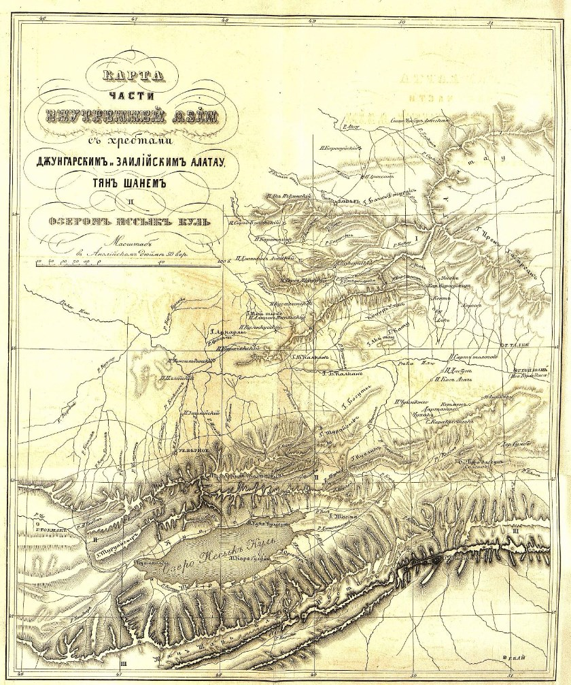

## Введение

Отчет Петра Петровича Семенова (тогда его еще не называли Тян-Шанским) о первом путешествии на Тянь-Шань можно найти в интернете виде PDF, но не в виде распознанного текста.

Отсканированный оригинал отчета можно найти в двух источниках:

1. На сайте Национальной электронной библиотеки ([ссылка](https://rusneb.ru/catalog/000199_000009_009805156/?ysclid=m0mrjmjveq747839894)) можно скачать PDF отчета.
    Полное цитирование: Семенов-Тян-Шанский, Петр Петрович (1827-1914). Первая поездка на Тянь-Шань или Небесный хребет до верховья системы р. Яксарта или Сыр-Дарьи действительного члена П. П. Семенова в 1857 году \[Текст\] : (с картою) : \[чит. в Общем собрании Императорского Русского географического общества 10 марта 1858 г.\]. --- Санкт-Петербург : \[б. и.\], 1858. --- 24 с. : карты : 24 см.

2. На сайте Библиотеки Русского Географического Общества ([ссылка](https://elib.rgo.ru/handle/123456789/219196)) представлена полная отсканированная версия Вестника Императорского Русского географического общества. Ч. 22. - СПб., 1858 в котором представлен тот же отчёт. [Скачать фрагмент](https://drive.google.com/file/d/15YsrETAjT9AWs0RK3M1EZhrzmEZAXox7/view?usp=sharing) со статьей Семенова.

Что интересно:

1. В отчете на сайте НЭБ, не смотря на то, что это упоминается в цитировании --- ни карты, ни списка горных проходов --- нет, то есть версия урезанная.
2. В отчете на сайте НЭБ, в конце есть фраза «Изъ № 5 Вѣстника Императорскаго Русскаго Географическаго Общества 1858 года.». Это очень странная фраза, потому что в 1858 такого номера у Вестника --- не было, а были номера 22, 23, 24.
3. В отчете на сайте библиотеки РГО есть всё.
4. Сам текст --- совпадает полностью в обоих источниках.

Текст в современной орфографии в [Google Docs](https://docs.google.com/document/d/1l2n8pgYLpSqxaF_wdbSuTMldv1jZqlsL/edit?usp=sharing&ouid=112245657670169384946&rtpof=true&sd=true).

## Отчет о поездке

ПЕРВАЯ ПОѢЗДКА

**НА Т'ЯНЬ-ШАНЬ ИЛИ НЕБЕСНЫЙ ХРЕБЕТЪ**

ДО ВЕРХОВЬЯ СИСТЕМЫ Р. ЯКСАРТА ИЛИ СЫРЪ-ДАРЬИ

Дѣйствительнаго Члена П. П. СЕМЕНОВА

въ 1857 году (\*).

*(Съ картою).*

Четыре исполинскія горныя системы, приблизительно параллельныя между собою и простирающіяся по направленію параллельныхъ круговъ, составляютъ, какъ извѣстно, остовъ азіятскаго континента: именно *Алтайско-Саянская, Т'янъ-Шанъ, Кунъ-Лунъ* и *Гималая.*

Только двѣ изъ этихъ системъ: самая сѣверная --- Алтайская и самая южная Гималайская, могутъ почитаться относительно хорошо изслѣдованными: первая русскими учеными и путеше-

--- 2 ---

ственниками со стороны Сибири, вторая англійскими со стороны Индіи. Зато Т'янь-Шань и Кунь-Лунь, поставленные во внутренности самой большой континентальной массы земнаго шара, одинъ подъ 42°, другой подъ 36° с. ш., оставались до сихъ поръ недоступными для европейскихъ ученыхъ путешественниковъ. Между тѣмъ эти исполинскія цѣпи изъ зоны абрикосовыхъ, гранатныхъ деревьевъ, риса и хлопчатой бумаги, поднимающіяся далеко за предѣлы вѣчныхъ снѣговъ, заслуживаютъ едва ли не болѣе научнаго интереса, чѣмъ внутренность Африки, сдѣлавшаяся уже нынѣ нѣсколько извѣстною изъ смѣлыхъ путешествій д-ра Барта, Фогеля, Ливингстона и др.

Конечно многія историческія событія и международныя сношенія, коснувшись въ вѣка минувшіе сокровенной внутренности азіатскаго континента --- колыбели столькихъ племенъ и народностей, не могли не внести въ науку нѣкоторыхъ свѣдѣній объ этихъ странахъ. Часть ученой разработки ихъ принадлежитъ великихъ корифеямъ науки нынѣшняго вѣка Клапроту, К. Риттеру, А. Гумбольдту. Клапротъ, напримѣръ, первый показалъ различіе и самостоятельность двухъ исполинскихъ хребтовъ внутренней Азіи---Тянь-Шаня и Кунь-Луня; К. Риттеръ собралъ въ стройную систему и разработалъ критически всѣ факты, относящіеся къ землевѣдѣнію внутренней Азіи и преимущественно Т'янь-Шаня; Гумбольдтъ объяснилъ отчетливо и геніяльно общія черты орографическаго строенія этихъ странъ и горныхъ ихъ цѣпей. Но факты, разработанные такимъ образомъ лучшими учеными нашего вѣка, были скудны и недостаточны; они записаны случайно и открывочно людьми, проѣзжавшими черезъ эти страны не съ научными цѣлями и даже совершенно чуждыми наукѣ, какъ напримѣръ, китайскими путешественниками, преимущественно изъ миссіонеровъ буддизма IV---VII вѣковъ и объѣздныхъ чиновниковъ новѣйшихъ временъ, и русско-татарскими купцами, которые слѣдовали съ своими караванами, для торговыхъ цѣлей, двумя опредѣленными путями въ малую Бухарію или Кашгарію. Только китайская коммиссія XVIII вѣка, для картографической съемки Си-Юй или западныхъ земель въ царствованіе К'янъ-Лунь, опредѣлившая даже одинъ астрономическій пунктъ на озерѣ Иссыкъ- Кулѣ, могла имѣть нѣсколько болѣе научный характеръ, потому что въ головѣ ея стояли европейскіе миссіонеры-іезуиты. Однако и эти послѣдніе, сколько мнѣ извѣстно, не оставили никакихъ соб-

--- 3 ---

ственныхъ реляцій о путяхъ своихъ около системы Т'янь-Шаня, и карты ихъ, кромѣ астрономическихъ пунктовъ, основаны на сухихъ, голословныхъ маршрутахъ ихъ китайскихъ помощниковъ. Потому знакомство наше съ орографiею и геологіею внутренне-азіатскихъ горныхъ системъ Тянь-Шаня и Кунь-Луня находилось донынѣ еще въ такомъ младенческомъ состояніи, что Гумбольдтъ остроумно сравнивалъ его съ степенью нашихъ знаній о геологіи луны, съ которою знакомятъ насъ только одни телескопы.

Вотъ почему мысль о достиженіи и изслѣдованіи хотя части Небеснаго или Т'янь-Шаньскаго хребта, развитая и поддержанная во мнѣ бесѣдою съ А. Гумбольдтомъ, была въ продолженіи нѣсколькихъ лѣтъ любимою моею мечтою. Высокое покровительство и средства, доставленныя мнѣ Императорскимъ Русскимъ Географическимъ Обществомъ, позволили мнѣ, на второй годъ путешествія моего въ Азіи, осуществить эту мечту, проложить наконецъ путь научному изслѣдованію въ эту трудно доступную страну и собрать довольно фактовъ, которыми съ душевною радостью и глубокимъ сочувствіемъ готовъ подѣлиться я со всѣми сочленами моими, надѣясь найти въ нихъ отголосокъ того же сочувствія, связывающаго всѣхъ собратьевъ въ наукѣ какъ бы въ одну дружную родную семью.

Мѣсто и время позволяютъ мнѣ здѣсь изложить только самый бѣглый очеркъ изслѣдованной мною страны и небольшой отрывокъ моего путеваго журнала, именно первое восхожденіе на Тянь-Шань до вершины замѣчательнаго Заукинскаго горнаго прохода и верховьевъ системы Сыръ-Дарьи или древняго Яксарта, но я надѣюсь, что вашъ Августѣйшій Предсѣдатель и гг. сочлены мои будутъ снисходительны къ этому первому сообщенію путешественника, не успѣвшаго даже приступить къ научной разработкѣ собранныхъ имъ матеріяловъ.

Озеро Балхашъ и углубленная борозда, связывающая его съ отсохшею его оконечностью --- озеромъ Ала-Кулемъ, отдѣляетъ системы центрально-азіатскихъ хребтовъ отъ однообразной Киргизской степи, богатой только очень невысокими горными группами. Потому поразительная своею неожиданною красотою, перемѣна декораціи ожидаетъ путешественника, прошедшаго между Балхашемъ и Ала-Кулемъ и достигшаго вершины невысокой уединенной группы Арганатинскихъ холмовъ, лежащей на с.-в. отъ

--- 4 ---

устья р. Лепсы. Между тѣмъ, какъ на з. отъ этихъ холмовъ взоръ путешественника теряется на серебристой поверхности Балхаша и на далекомъ горизонтѣ однообразной степи, на ю.-в. встрѣчаетъ онъ ослѣпительно блестящую своими вѣчными снѣгами и смѣло протянутую длинною линіею отъ с.-в. къ ю.-з. цѣпь высокихъ горъ.

Эта горная система называется Алатау, т. е. пестрыми или пѣгими горами; въ отличіе отъ другихъ горныхъ хребтовъ того же имени, я даю ей названіе *джунгарскаго* Алатау, потому что на нее опиралось цвѣтущее въ XVIII вѣкѣ Джунгарское царство. Горная страна эта, уже посѣщенная между 1840 и 1851 г. русскими путешественниками Карелинымъ, Шреккомъ, Ковалевскимъ и Влангали, отдѣлена и очерчена очень опредѣленно съ сѣверной стороны низменною полосою Балхаша и Ала-куля, а съ южной также низкою и широкою полосою Илійской долины, и только на в. состоитъ въ связи съ Богдо-Ола, самымъ высокимъ узломъ Т'янь-Шаньской системы. Горная страна эта образуется собственна пересѣченіемъ двухъ осей поднятій, изъ которыхъ одно Иренъ-Хабирганъ простирается прямо отъ в. къ з., параллельно съ Т'янь- Шанемъ, съ которымъ она связывается на в. узломъ Богдо, а другая --- собственно Алатау, простирается отъ с.-в. къ ю.-з, пересѣкая первую подъ острымъ угломъ. Ось поднятія Иренъ- Хабиргана, на з. отъ пересѣченія своего съ Алатау, образуетъ нѣсколько параллельныхъ цѣпей, между которыми, на плодородномъ, прекрасно орошенномъ плоскогоріи, въ 3,000 ф. абсол. высоты, расположенъ городъ Копалъ --- цвѣтущее уже своимъ земледѣліемъ русское поселеніе, основанное въ 1847 году, для защиты принявшей русское подданство Большой Киргизской орды отъ смѣлыхъ набѣговъ дикокаменныхъ Киргизовъ. Другое, не менѣе цвѣтущее земледѣльческое поселеніе основанное только въ 1855 году, находится въ долинѣ главной оси джунгарскаго Алатау, въ верховьяхъ р. Лепсы, на высотѣ 2,400 фут. Высоко надъ этими долинами поднимаются еще снѣжныя вершины джунгарскаго Алатау, котораго среднюю высоту я опредѣлилъ въ 6,000 ф. надъ ур. ок., между тѣмъ, какъ предѣльная, по измѣреніямъ Шренка, достигаетъ 12,000 ф. Изъ вѣчныхъ снѣговъ джунгарскаго Алатау, которые, впрочемъ, занимаютъ только площади посредственной величины и преимущественно на с.-з. склонѣ горъ, течетъ несмѣтное количество быстрыхъ и шумныхъ горныхъ потоковъ,

--- 5 ---

распространяющихъ орошеніе и плодородіе не только по живописнымъ долинамъ, но и по всей окружающей равнинѣ, носящей названіе *Семирѣчинскаго* края, отъ семи рѣкъ, въ которыя соединяются всѣ эти потоки. Только на з., къ Балхашу, равнина Семирѣчинскаго края мало по малу превращается въ песчаную и безплодную степь, обличающую характеръ страны, бывшей когда-то дномъ обширнаго внутренняго воднаго бассейна, котораго уцѣлѣвшіе представители суть озера Балхашъ и оба Ала-куля. Теченіе семи рѣкъ, все болѣе и болѣе медленное и лѣнивое, окаймляется высокими камышами, служащими убѣжищемъ кабанамъ, ирбисамъ и тиграмъ; кругомъ распространены безплодныя песчаныя дюны и солончаки съ своимъ характеристическимъ саксауломъ (Anabasis Ammodendron) и галофитами, такъ что изъ семи рѣкъ только двѣ доходятъ до Балхаша, въ томъ числѣ и Лепса, которой устье есть единственный астрономическій пунктъ во всемъ краѣ, опредѣленный еще въ 1834 г. астрономомъ Ѳедоровымъ.

Рѣка Или, одна изъ самыхъ значительныхъ въ центральной Азіи, отдѣляетъ этотъ край отъ болѣе южнаго, которому первые русскіе переселенцы въ 1854 г, дали названіе *Заилійскаго.*

Заилійскій край поражаетъ путешественника необыкновенно рѣзкимъ контрастомъ между низкою и жаркою Илійскою долиною и простирающимся вер. въ 50---70 за рѣкою прямо отъ в. къ з. исполинскимъ снѣжнымъ горнымъ хребтомъ Алатау, которому, въ отличіе отъ предъидущаго, я даю названіе *заилійскаіо Алатау.* Рѣка Или течетъ отъ в. къ з. по широкой долинѣ верстъ въ 150 ширины и болѣе 1,000 ф. абс. высоты, по измѣренію посредствомъ температуры кипѣнія воды у русской илійской переправы. Берега ея совершенно ровны и низки, поросли кое-гдѣ высокими деревьями джигдою (Eleagnus angustifolia), особеннымъ тополемъ (Populatus pruinosa), кара-агачемъ (Fraxinus sp.) и самымъ разнообразнымъ кустарникомъ, напримѣръ, розовымъ барбарисомъ, Halimodendron argenteum, видами Astragalus, Robinia, Tragopyrum, Salix и т. д. Рѣка имѣетъ саж. 150 ширины и теченіе быстрое. Верстъ 20 ниже переправы она пересѣкаетъ низкое порфировое плоскогоріе, состоящее въ связи съ заключающими въ себѣ серебро-свинцовыя мѣсторожденія порфировыми группами предгорій джунгарскаго Алатау. Въ дикихъ порфировыхъ утесахъ рѣка Или прорываетъ себѣ глубокое ложе, образуя живописные изгибы между нависшими скалами. За этимъ живописнымъ

--- 6 ---

ущельемъ берега Или опять сглаживаются, даже отдѣльныя скалы рѣдѣютъ и изчезаютъ, и окружающая страна принимаетъ характеръ при-балхашской степи, покрываясь песками, солонцами, саксауломъ (Anabasis Ammodendron) и галофитами, между которыми р. Или течетъ еще верстъ на 250 отъ прорыва до впаденія своего въ Балхашъ, гдѣ она образуетъ низменную дельту, заросшую непроходимымъ лѣсомъ камышей, достигающихъ до *2 1/2* саж. высоты. За то выше прорыва Илійская долина до подошвы хребта представляетъ страну богатую и плодородную, мѣстами въ высшей степени удобную для земледѣлія и осѣдлости. Лучшимъ доказательствомъ тому служатъ китайскія ссыльныя и военныя поселенія, занимающія всю верхнюю половину Илійской долины, между Иренъ-Хабирганомъ и Т'янь-Шанемъ, отъ впаденія рѣкъ Чарына и Кунурулена вверхъ, до самой подошвы Богдо-Ола, съ котораго текутъ въ Или рр. Хашъ и Кунгесъ. Многочисленные притоки Или, берущіе начало въ Иренъ-Хабирганѣ и Нань-Шанѣ, продолженіи Заилійскаго Алатау, разобраны прежде впаденія ихъ въ Или для орошенія полей и превращены въ ирригаціонные каналы, китайскія поселенія разбросаны густо по всей долинѣ и каждая деревня, каждый пикетъ картинно окружены рощами густыхъ и высокихъ деревьевъ, насаженныхъ китайскими поселенцами со времени паденія Джунгаріи, т. е. съ конца прошлаго вѣка. Искусственное возрожденіе лѣсовъ въ Илійской долинѣ, довольно бѣдной лѣсною растительностью, показываетъ что и въ сухомъ климатѣ центральной Азіи лѣсная культура возможна. Изъ растительныхъ произведеній жаркую Илійскую долину характеризуютъ виноградъ, рисъ, сорго, пшеница, маисъ, арбузы, дыни и фруктовые деревья, напримѣръ, персики, абрикосы, груши, баргамоты, яблоки, черносливъ и т. д. Даже гранатные деревья, закрываемые тщательно зимою, даютъ плоды.

Потому русское поселеніе, расположенное въ Илійской долинѣ прямо на ю. въ 70 вер. отъ Илійской переправы, непосредственно у подошвы заилійска о Алатау, на абс. выс. не болѣе 2,000 ф.--- укр. Вѣрное основано при условіяхъ необыкновенно выгодныхъ для осѣдлости и земледѣлія. Заилійскій Алатау, простирающійся, какъ мы уже сказали, параллельно съ теченіемъ Или отъ в. на з , поднимается круто и смѣло какъ исполинская стѣна надъ Илійскою равниною. Отъ меридіана западной оконечности озера Иссыкъ-Куля почти до меридіана восточной весь гребень хребта

--- 7 ---

покрытъ вѣчными снѣгами. Средину его занимаетъ треглавый исполинъ *Талгарнынъ-Талъ-Чеку,* по высотѣ своей я полагаю мало уступающій савойскому Монблану; отъ этой средины оба крыла идутъ, постепенно понижаясь и теряя свои вѣчные снѣга внѣ меридіановъ оконечностей озера Иссыкъ-Куля. Во всей этой высокой срединѣ Заилійскаго Алатау горные проходы, очень мало врѣзанные въ хребтѣ, имѣютъ отъ 8 до 10,000 фут. абсол. выс. и потому почти непроходимы для значительныхъ отрядовъ; Вѣрное расположено при выходѣ изъ горъ шумной и быстрой Алматинки, которой долина вся заросла натуральными садами дикихъ яблонь и урюковь (абрикосовъ), дающихъ очень вкусные плоды. Поселеніе, состоящее изъ казаковъ и переселенныхъ крестьянъ, имѣетъ уже болѣе 4,000 жителей и превосходно обстроено. Строевой матеріалъ доставляютъ скаты горнаго хребта и всѣ его поперечныя долины, отъ 4,000 до 7,500 фут. выс., поросшія пихтовыми лѣсами; двѣ Алматинки и Аксай, вырывающіяся изъ горныхъ долинъ близъ Вѣрнаго, доставляютъ обильныя воды для ирригаціи, благодаря которой земледѣліе здѣсь уже процвѣтаетъ.

Заилійскій Алатау между меридіанами оконечностей Иссыкъ-Куля состоитъ изъ двухъ параллельныхъ между собою гранитныхъ цѣпей, раздѣленныхъ глубокою продольною долиною, занятою осадочными и метаморфическими породами. Поперечный узелъ, также покрытый вѣчными снѣгами, соединяетъ обѣ цѣпи въ меридіанѣ средины озера. Вдоль продольной долины отъ этого узла на з. течетъ р. Кебинъ, одна изъ составныхъ вѣтвей р. Чу, и на в. Чиликъ, притокъ Или, вырывающійся въ меридіанѣ восточной оконечности Иссыкъ-Куля на с. черезъ дикое поперечное ущелье внезапно понизившейся сѣверной цѣпи.

Южная цѣпь Заилійскаго Алатау отдѣляется отъ параллельнаго съ нимъ и еще болѣе высокаго Т'янь-Шаня глубокою длинною котловиною озера Иссыкъ-Куля и служащими продолженіемъ этой котловины къ в. продольными долинами Тюба и Джиргалана, притоковъ Иссыкъ-Куля. Плоскогоріе, въ которомъ врѣзана котловина озера Иссыкъ-Куля, при абсолютной высотѣ въ 4,000 ф., имѣетъ отъ 80---100 вер. ширины, между тѣмь какъ самое озеро, при длинѣ 180 вер., имѣетъ ширины оть 50 до 70 вер. Хотя ближайшее разстояніе укр. Вѣрнаго до озера Иссыкъ-Куля, по Алматинскому проходу черезъ обѣ цѣпи Заилійскаго Алатау, составляетъ не болѣе 90 вер., горные проходы обѣихъ цѣпей, заклю-

--- 8 ---

чающіеся между меридіанами оконечностей Иссыкъ-Куля, превосходя 9,000 ф. абсол. выс., не представляютъ удобныхъ путей къ озеру и принуждаютъ къ значительнымъ обходамъ.

Потому когда въ маѣ 1857 года я вознамѣрился проникнуть въ сердце Т'янь-Шаньскаго хребта, то долженъ былъ избрать другой путь. Караванъ мой, состоящій изъ 25 человѣкъ, 30 лошадей и 16 верблюдовъ, требовалъ выбора самой удобной слѣдовательно обходной дороги, по которой до восточной оконечности озера должно полагать не менѣе 300 верстъ. Дорога эта направляется сначала прямо къ в. доломъ, вдоль подошвы сѣверной цѣпи Заилійскаго Алатау, поперегъ рѣкъ изъ него текущихъ до р. Чилика, по переправѣ черезъ которую она поворачиваетъ прямо къ ю. ю.-в., сначала черезъ два параллельные и невысокіе кряжа, на которыхъ разбивается понизившаяся сѣверная цѣпь Заилійскаго Алатау, и выходитъ на высокое плоскогоріе (*plateau*) *Сайташъ.*

*Санташъ* этотъ есть возвышенная болотистая площадь въ 5,500 ф. абсол. выс., разстилающаяся у подошвы предгорій самаго Т'янь-Шаня. 6 (18) іюня, когда я достигъ наконецъ до Санташа, на немъ лежали еще кое-гдѣ массы не растаявшаго снѣга, а флора представляла субальпійскій характеръ, выражаемый, напримѣръ, растеніями: Leontopodium alpinum, Thermopsis alpina, Myosotis alpestris, Cerastium alpinum, Primula nivalis, Viola biflora и т. д. До конца іюня ночи на Санташѣ были холодны и земля къ утру покрывалась инеемъ, между тѣмъ, какъ въ жаркой Илійской долинѣ, гдѣ снѣгъ держится только 2 мѣсяца въ году, морозы прекратились и весенніе цвѣты зацвѣли уже съ конца февраля мѣсяца.

Почва на Санташскомъ плоскогорій, какъ мы уже сказали, болотиста; у самой подошвы Т'янь-Шаньскихъ предгорій есть и маленькое свѣтло-голубоватое озеро, почти всегда покрытое несмѣтными стаями пугливыхъ утокъ и журавлей. У самаго озера, на западной сторонѣ его, возвышается груда наваленныхъ человѣческою рукою камней, отъ которыхъ мѣстность и получила свое названіе *Сайташъ,* т. е. счетные камни. Здѣсь когда то, гласитъ легенда дикокаменныхъ Киргизовъ, проходилъ на в. знаменитый Тимуръ (Тамерланъ) со своими войсками. Ожидая можетъ быть скорой встрѣчи съ врагами, онъ вздумалъ пересчитать свои несмѣтныя полчища и для этой цѣли приказалъ каждому изъ своихъ воиновъ взять по камню и набросать эти камни въ одно мѣсто.

--- 9 ---

Такимъ образомъ составилась колоссальная груда. На возвратномъ пути войска Тимура, побѣдоносныя, но отчасти истребленныя походомъ и битвами, опять проходили черезъ Санташь. Ханъ на этотъ разъ приказалъ всѣмъ своимъ наличнымъ воинамъ взять изъ груды по камню и такимъ образомъ груда камней, принявъ нынѣшніе свои размѣры, выразила количество Тимуровыхъ воиновъ, оставшихся на поляхъ битвы, далеко отъ своей родины и памятникъ храбрыхъ былъ готовъ. Походъ Тимура изъ Самарканда въ Илійскую долину не вымыселъ. Онъ относится къ первымъ годамъ XV вѣка; Тимуръ проникъ не далѣе озера Боротала. Интересная легенда важна въ историческомъ отношеніи, потому что для знающаго эту часть Азіи, она возстановляетъ весь маршрутъ Тимура. Непосредственно надъ Санташемъ къ ю. поднимаются предгорья Небеснаго хребта или Т'янь-Шаня, но видъ отсюда не очень величественъ, потому что за передовыми, не слишкомъ высокими горами, не видно ни главнаго хребта, ни вѣчныхъ снѣговъ его и только кое-гдѣ пестрѣютъ снѣжныя поляны на болѣе далекихъ вершинахъ. Предгорія Т'янь-Шаня падаютъ довольно круто къ Санташу, но лишены обнаженій и поросли густымъ ковромъ свѣже-зеленыхъ травъ и яркихъ цвѣтовъ субальпійской зоны. Хвойный лѣсъ состоитъ исключительно изъ пихтъ (Picea schrenkiana), а изъ лиственныхъ деревьевъ болѣе всего бросается въ глаза красивая рябина. Кустарниковъ много: горный барбарисъ съ черными ягодами (Berberis heteropoda), нѣсколько чрезвычайно красивыхъ видовъ жимолости (Lonicera), безвкусная альпійская смородина (Ribes alpina) и т. д.

По роскошнымъ субальпійскимъ лугамъ Т'янь-Шаня паслись сытыя стада дикокаменныхъ Киргизовъ племени Богу, а у подошвы предгорій на холмахъ, около озера и по плоскогорію разбросаны были многочисленные аулы ихъ, состоящіе изъ бѣлыхъ войлочныхъ полусферическихъ юртъ, съ довольно плоскимъ куполомъ. Верховный манапъ племени Богу 70 лѣтній Бурамбай, пожалованный императоромъ Дао-Гуань въ княжеское достоинство Китайской Имперіи, встрѣтилъ меня еще наканунѣ, 20 вер. не доходя до Санташа, съ выраженіемъ вѣрноподданническихъ чувствъ къ русскому правительству. Въ глазахъ Богинцевъ, уже года три принявшихъ русское подданство, я былъ давно желаннымъ, давно ожидаемымъ представителемъ русскаго покровительства противъ

--- 10 ---

враждебнаго могущественнаго племени Сара-Багишъ, въ продолженіи трехъ лѣтъ громившаго менѣе сильныхъ Богинцевъ и наконецъ отбросившаго ихъ весною 1857 года съ родныхъ кочевокъ и наслѣдственныхъ пашней по Иссыкъ-Кулю за Санташъ къ предѣламъ Китая и Большой орды. Хотя я при первомъ же свиданіи старался убѣдить Бурамбая и сопровождавшихъ его біевъ, что цѣль моего посѣщенія совершенно мирная и что я пріѣхалъ для осмотра Тянь-Шаньскихъ горъ, снятія видовъ и т. д., они упорно продолжали видѣть во мнѣ представителя русской силы, которой первое вліяніе уже тотчасъ оказалось для нихъ благодѣтельнымъ, потому что ненавистные и опасные враги ихъ Сара-Багишъ, занявшіе ихъ земли отъ самой средины Иссыкъ-Куля до Санташа, верстъ на 150 и приготовлявшіе свои конные отряды изъ многихъ тысячъ всадниковъ для окончательнаго истребленія Богинцевъ на Санташѣ, бѣжали за Тянь-Шань передъ одними преувеличенными слухами о прибытіи на помощь Богинцамъ русскаго отряда, бросивъ свои засѣянныя поля и очистивъ пространство земли верстъ въ 250 длины. Потому и я сопровождавшій меня и султанъ Тезекъ, одинъ изъ трехъ старшихъ султановъ Большой орды, пришедшій съ 800 всадниковъ дѣйствительно на помощь Бурамбаю, по его собственной просьбѣ и съ разрѣшенія пристава Большой орды, были приняты Богинцами какъ избавители и это обстоятельство чрезвычайно помогло мнѣ въ моемъ намѣреніи бросить хотя бѣглый взглядъ на южную сторону Иссыкъ-Куля во внутренность Т'янь-Шаньскаго хребта.

Дня два или три прошли въ сборахъ къ поѣздкѣ на Т'янь-Шань. Верблюдовъ и вьюки я оставилъ у Бурамбая, подъ прикрытіемъ нѣсколькихъ казаковъ, и 9 (21) іюня тронулся въ путь, въ сопровожденіи художника Кошарова, 16 Козаковъ и двухъ вожаковъ изъ племени Богу, на свѣжихъ лошадяхъ. Отъ Санташа спустились мы немного къ р. Тюбъ, которая, вырвавшись здѣсь изъ узкой поперечной долины Т'янь-Шаньскаго хребта, поворачиваетъ, загибаясь подъ прямымъ угломъ на западъ вдоль широкой продольной долины между Небеснымъ хребтомъ и Заилійскимъ Алатау къ озеру Иссыкъ-Кулю. Тропинка перейдя въ бродъ стремительный Тюбъ, поднимается на *Кызылъ-Кія,* относительно низкій проходъ черезъ водораздѣлъ между паралельными рѣками Тюбомъ и Джиргаланомь. Водораздѣлъ этотъ, примыкающій здѣсь

--- 11 ---

къ предгоріямъ Т'янь-Шаня, тянется между рѣками вдоль продольной долины очень низкимъ кряжемъ подъ именемъ Тасма и наконецъ вдается между устьями обоихъ рѣкъ въ озеро Иссыкъ-Куль низкимъ мысомъ и косою Кара Булунъ. Кызылъ-Кія значитъ красная дорога; она названа такъ потому, что немногія обнаженія, здѣсь встрѣчаемыя, состоятъ изъ красноватой глины; твердыхъ же горныхъ породъ я не могъ замѣтить. Вершины Кызылъ-Кія и нѣкоторые ея увалы поросли живописно пихтовыми рощицами и видъ отсюда на убѣленныя вѣчными снѣгами передовыя вершины главной цѣпи Т'янь-Шаня есть первый величественный. На западѣ взоръ теряется въ широкой продольной пустынной долинѣ Джиргалана, которая, несмотря на свои величественные размѣры и безчисленные изгибы рѣки, блестящіе на лучахъ палящаго солнца, грустна и уныла. Широкая площадь кажется сухою и безплодною, опаленною солнечными лучами; древесной растительности мало и только однообразный и безконечный рядъ деревьевъ обозначаетъ теченіе Джиргалана и притока его Тургень-Аксу. Одна пихта уединилась какъ то въ долинѣ, свидѣтельствуя и ея значительной абсолютной высотѣ. Часто однакоже встрѣчалась мы въ этой долинѣ съ живыми существами, но видъ ихъ не могъ насъ порадовать: мужчины, женщины, дѣти---оборванные, блѣдные и худые шли намъ на встрѣчу пѣшкомъ, въ изнеможеніи, съ тѣмъ отчаяннымъ усиліемъ, которое только одно можетъ поддержать изчезающія силы. Это были Богинцы, бывшіе съ ранней весны въ плѣну у Сарабагишей и освобожденные теперь отчасти выкупомъ, но болѣе всего поспѣшнымъ уходомъ враговъ своихъ за Т'янь-Шань. Они принадлежали къ роду Кыдыкъ, почти истребленному Сарабагишами послѣднею весною 1857 г. Родъ Кыдыкъ, какъ мнѣ расказали, былъ богатъ и силенъ: онъ могъ одинъ выставить 3,000 всадниковъ, способныхъ носить оружіе, а стадамъ и табунамъ его не было счета. У родоначальника Кыдыковъ, бія Самсалы, въ частной его собственности считалось не менѣе 3,000 лошадей; но Самсала, гордый и заносчивый, поссорившись съ панапомъ Бурамбаемъ, имѣлъ неосторожность откочевать со всѣмъ своимъ родомъ и расположиться уединенно на юго-восточной оконечности Иссыкъ-Куля. Сара-Багиши, сторожившіе постоянно за непримиримыми своими врагами, тотчасъ воспользова

--- 12 ---

лись этою неосторожностью обошли Иссыкъ Куль, отрѣзали Кыдыковъ отъ сообщенія съ остальными Богинцами, и неожиданно напали на беззащитные ихъ аулы. Паническій страхъ овладѣлъ Кыдыками: они бѣжали со всѣми стадами и имуществомъ куда могли и наконецъ, потерявъ 600 человѣкъ убитыми и 1,200 взятыми въ плѣнъ, бросились черезъ высокій Заукинской проходъ на малую Бухарскую сторону Т'янь-Шаня, которою и хотѣли обойти для соединенія съ своими соплеменниками. Стада конечно погибли на дорогѣ и Самсала, потерявъ всѣ свои богатства и часть своего семейства, едва могъ возвратиться къ Бурамбаю съ слабыми остатками своего рода.

Отъ Санташа до Тургень-Аксу считается день пути, т. е. 30 верстъ. 10 (22) іюня слѣдовали мы тою же унылою Джиргаланскою долиною на 3. Перейдя 3 рѣки, называемыя Джергесъ, мы наконецъ послѣ 25 вер. пути достигли до р. Аксу, также притока Джиргалана Рѣка эта знаменита между дикокаменными Киргизами по своимъ теплымъ цѣлительнымъ ключамъ. Я поворотилъ на югъ въ ея тѣсную, поперечную относительно Т'янь-Шаня долину, желая осмотрѣть хотя одинъ изъ этихъ ключей. Верстахъ въ пяти отъ выхода рѣкп изъ горъ долина разбилась на двѣ составныя вѣтви. Одна вѣтвь, направленная къ югу, ведетъ къ *Алтынъ-Арассану,* болѣе отдаленному изъ двухъ ключей, другая направленная къ юго-Востоку, черезъ 5 вер., приводитъ къ ближнему ключу *Алма-Арассану* и мы выбрали послѣднюю. Тропинка круто начала подниматься въ гору, показались первыя обнаженія скалъ надъ нашими головами, а на отдаленномъ западѣ въ свѣтлоголубой дали обрисовалась въ первый разъ необозримая поверхность Иссыкъ-Куля съ его двумя характеристическими заливами и раздѣляющимъ ихъ мысомъ. Ландшафтъ становился тѣснѣе и угрюмѣе, тропинка нависла надъ уровнемъ шумящей и пѣнящейся между тѣсными обрывами скалъ рѣки. Обнаженія горныхъ породъ состояли изъ гранита круто приподнимающаго сильно наклоненные пласты горнаго известняка; обрывы кое-гдѣ густо заросли темнымъ пихтовымъ лѣсомъ. Наконецъ мы поровнялись съ Арассаномъ и начали круто спускаться къ р. Аксу, пробираясь извилинами между страшными утесами. Тропинка съ трудомъ высѣчена въ нависшихъ гранитныхъ скалахъ и проходима только съ опасностью жизни. Лошадей должно было вести вь по-

--- 13 ---

воду: онѣ съ трудомъ лѣпились на гладкихъ утесахъ и гранитныхъ ступеняхъ, угрожая каждую минуту паденіемъ. Къ счастію спускъ былъ довольно коротокъ. Мѣстность около Алма-Арассана чрезвычайно тѣсна: между стремительною рѣкою и обрывомъ гранитной стѣны не болѣе 15 саж. Теплый ключъ выходитъ изъ-подъ огромной гранитной скалы и тотчасъ же образуетъ эллиптическій бассейнъ въ 3 1/2 длины, 1 1/2 шир. и 1 1/2 до 2 ар. глуб. Изъ бассейна теплый ключъ узкою струею стекаетъ въ холодную шумную Аксу. Температура Арассана въ 7 час. вечера была 40° Ц., при внѣшней температурѣ воздуха въ 15° и температурѣ воды въ Аксу въ 11° Ц. Абсолютная высота мѣста около 5,400 ф. Алма-Арассанъ обросъ кругомъ тѣнистыми деревьями: между ними есть и искусственно насаженныя яблони, отъ которыхъ ключъ и получилъ свое названіе яблочнаго Арассана. Вѣтви тала картинно наклонились надъ водою, въ которой пузырьковъ отдѣляется мало, но есть слабый запахъ сѣрнистаго водорода. Деревья, окружающіе источникъ, почитаются священными: на нихъ навѣшано безчисленное множество разноцвѣтныхъ лоскутьевъ: это жертвы дикокаменныхъ Киргизовъ генію источника. Подлѣ самаго Арассана есть родъ пещеры, сложенной изъ гранитныхъ глыбъ. Внутри она низка и отчасти обрушилась; тамъ есть скамьи и лежанка. Дверь въ пещеру деревянная, но замѣчательная своими тибетскими надписями на ней вырѣзанными и хорошо сохранившимися. Тянь-Шаньскій арассанъ пробивается въ обстоятельствахъ очень аналогическихъ съ арассанами Джунгарскаго Алатау и Тарбагатая, именно изъ плутонической породы (гранита въ Алатау и діорита въ Тарбагатаѣ близъ соприкосновенія ихъ съ осадочною --- известнякомъ и сланцемъ).

11 (23) іюня снялись мы съ бивака на Арассанѣ. При опасномъ подъемѣ одна изъ нашихъ вьючныхъ лошадей оборвалась въ пропасть, едва не сбросивъ съ собою державшаго ее въ поводу казака, и разбилась совершенно. Нужно было видѣть отчаяніе вашего вожака, которому принадлежала лошадь. Онъ рыдалъ какъ ребенокъ, обнималъ и цѣловалъ своего любимаго коня, прощаясь съ нимъ какъ съ другомъ, и наконецъ отрѣзалъ ему уши и взялъ съ собою на память. Его не могло даже вполнѣ утѣшить мое обѣщаніе подарить ему другую, лучшую лошадь: Киргизъ, проводя полжизни на конѣ, свыкается съ нимъ какъ съ неразлуч-

--- 14 ---

нымъ сподвижникомъ и другомъ, такъ что личность животнаго входитъ въ разсчетъ его привязанности. Упрекающій Киргиза въ томъ, что онъ дорожитъ лошадью немного менѣе чѣмъ своею женою, не долженъ забывать, что не жену онъ низводитъ на степень вещи, а напротивъ возводитъ коня своего на степень разумной личности.

Въ то время какъ маленькій караванъ нашъ оправлялся отъ замѣшательства и перевьючивалъ вьюкъ погибшей лошади, я отъѣхалъ впередъ по дну Аклуйской долины и слѣдуя всѣмъ ея изгибамъ, выѣхалъ наконецъ изъ предгорій Тянь-Шаня. Долго озирались мы кругомъ и ждали своего каравана. Наконецъ вдали отъ насъ, ниже по р. Аксу, показалась группа всадниковъ, переправлявшихся медленно черезъ трудный бродъ. Мы поскакали прямо къ нимъ, полагая, что это наши казаки. Но когда мы сблизились съ толпою на лучѣ солнечномъ заблестѣли ея длинныя пики и мы тотчасъ узнали по вооруженію, что это была баранта, т. е. разбойничья шайка дикокаменныхъ, числомъ не болѣе 25 человѣкъ. Стараться ускакать отъ нихъ было уже слишкомъ поздно, притомъ же при неосторожномъ прыжкѣ черезъ оврагъ лошадь моего казака переломила себѣ спинной хребетъ и едва могла идти только шагомъ. Съ револьверомъ въ рукахъ я рѣшился ѣхать на встрѣчу всадникамъ. Послѣ первыхъ словъ, обмѣненныхъ между нами, мы могли однакоже успокоиться: это была дѣйствительно баранта, но она состояла изъ Богинскихъ всадниковъ; они принадлежали къ многочисленному отряду, состоявшему изъ 1200 человѣкъ и собиравшемуся на южномъ берегу Иссыкъ-Куля, для нападенія на Сарабагишей, которые въ это время гнѣздились въ дикихъ ущельяхъ Тянь-Шаня на юго-Западѣ отъ озера и по р. Нарь ну, главной составной вѣтви р. Сыръ Дарьи. Видно мой приходъ придалъ очень много смѣлости Богинцамъ, что она изъ оборонительной войны такъ скоро перешли въ наступательную. Возвратить весь отрядъ, ушедшій безъ моего вѣдома на Иссыкъ-Куль, было уже невозможно и слишкомъ поздно, хотя я душевно желалъ бы сдѣлать это, потому что немогъ не предвидѣть, что хитрые и воинственные Сарабагиши опять на голову разобьютъ Богинцевъ. Первый актъ нападенія киргизской баранты состоитъ въ отбитіи и угонѣ табуновъ у своихъ непріятелей: тогда со стороны послѣднихъ начитается енергическое преслѣдованіе, а по

--- 15 ---

настиженіи кровавая битва. Такъ какъ я рѣшился поворотить къ югу во внутренность Т'янь Шаня по р. Зауку, то очень легко могло бы случиться, что на возвратномъ пути я попалъ бы на Иссыкъ Куль въ подобную критическую минуту. Тогда конвой мой неминуемо былъ бы смятъ многочисленными табунами и физически увлеченъ во всеобщее бѣгство Богинцевъ. Потому расчесть свое время нужно было такъ, чтобы успѣть вернуться, обогнуть восточную оконечность Иссыкъ-Куля и достигнуть сѣвернаго его берега прежде чѣмъ ожидаемое событіе могло случиться на южномъ. На сѣверномъ берегу я былъ безопаснѣе, и въ случаѣ крайности могъ уйти черезъ страшные горные проходы Заилійскаго Алатау на русскую его сторону. По соединеніи съ своимъ конвоемъ я ускорилъ нашъ ходъ и пройдя въ этотъ день верстъ 40, мы расположились на ночлегъ на Джиты-Угузѣ, притокѣ Иссыкъ-Куля. Р. Джиты-Угузъ выходитъ изъ чрезвычайно живописной поперечной долины Т'янь-Шаня, черезъ которую довольно широко раскрывается видъ на исполинскіе снѣжные бѣлки Небеснаго хребта. Противъ самой средины долины возвышался двурогій Угузъ-башъ (что значитъ бычачья голова), сверху до низу, подобно Юнгфрау бернскихъ Альповъ, одѣтый ослѣпительно бѣлою мантіею вѣчнаго снѣга, но превосходящій Юнгфрау оригинальностію своей формы. Правѣе Угузъ-баша видѣнъ былъ рядъ черныхъ скалистыхъ горъ, съ вершинами убѣленными вѣчнымъ снѣгомъ, вѣроятно уже принадлежащихъ къ главному гребню Тянь-Шаня. Пѣнистая, довольно широкая рѣка, усѣянная дикими скалами, часто обнимаетъ своими волнами изумрудно-зеленые острова, густо заросшіе свѣжею зеленью кустарниковъ, и составляетъ достойный живописности ландшафта первый планъ картины. Густой кустарникъ береговъ и острововъ Джиты-Угуза состоитъ изъ облепихи (Hipophaca rhamnoides), аргая (cotoneaster multiflora), барбариса (Berberis heteropoda), жимолости (Lonicera), боярка (Crataegus sp.) и бѣлаго шиповника, перевитыхъ ліаною здѣшнихъ рощъ Clematis orientalis. Кругомъ разстилается широкая плодородная равнина, удобная для ирригаціи, а потому служащая постоянно чернымъ Киргизамъ для ихъ хлѣбопашества.

12 (24) іюня перешли мы Джиты-Угузъ и направились далѣе къ западу. Тропинка отъ рѣки очень полого поднимается въ гору

--- 16 ---

по наклонной плоскости, сближаясь съ подножіемъ Т'янь-Шаня и оставляя вправо плоскій и пологій холмъ Оргочоръ, вдающійся въ озеро Иссыкъ-Куль въ видѣ мыса. Видъ на сѣверо-западъ и юго-западъ расширяется все болѣе и болѣе и становится необыкновенно величественнымъ. На сѣверо-западъ глазъ едва обнимаетъ поверхность Иссыкъ-Куля, синимъ своимъ цвѣтомъ напоминающимъ Женевское озеро съ col de yaman, но несравненно болѣе обширную; за нею, какъ стѣна, возвышается крутая южная цѣпь Заилійскаго Алатау, съ ея неглубокими вырѣзками и необширными блестящими пятнами вѣчнаго снѣга. На юго-западѣ же въ безконечной перспективѣ видна главная цѣпь Т'янь-Шаня, вся покрытая широкою блистательною мантіею вѣчнаго снѣга. Дальнѣйшая часть цѣпи, которой все основаніе скрыто отъ глазъ путешественника горизонтомъ, кажется утопающею съ своими вѣчными снѣгами въ синихъ волнахъ озера. Верстахъ въ 15 отъ Джиты-Угуза, пологая сѣдловина между Оргочоромъ и подножіемъ Тя'нъ-Шаня начинаетъ склоняться къ р. Кызылъ-Су. Еще черезъ 12 верстъ достигли мы наконецъ до р. Зауку, близъ выхода ея изъ Т'янь-Шаня и повернули къ югу въ развалы ея долины. У самаго выхода шумной и пѣнистой горной рѣки изъ этихъ разваловъ расположены два, огороженные глиняною стѣною садика, принадлежавшіе манапу Бурамбаю. Этотъ единственный опытъ садоводства на Иссыкъ-Кулѣ, сдѣланный кочевымъ племенемъ, былъ бы въ высшей степени интересенъ, еслибъ онъ привелъ къ положительнымъ результатамъ, но къ сожалѣнію родовые врага Бурамбая, манаты Сарабагишей, разорили любимое гнѣздо его въ Заукинской долинѣ и не пощадили даже и фруктовыхъ деревьевъ сада. Въ 1857 г., пользуясь уходомъ своихъ враговъ, Богинцы пустили благодѣтельный арыкъ (ирригаціонный каналъ) въ оба садика и свѣжіе побѣги вырубленныхъ яблоней, абрикосовъ, персиковъ и винограда пошли отъ корней съ необыкновенною быстротою.

Верстахъ въ 7 выше садиковъ, долина рѣки разбилась на двѣ вѣтви и сдѣлалась уже вполнѣ живописною. Мы должны были слѣдовать по западной вѣтви, т. е. по самой р. Зауку; восточная называется Заукучакомъ. Надъ соединеніемъ рѣки съ двухъ сторонъ живописно нависли исполинскіе утесы, очень оригинальные по своему кирпично-красному цвѣту и правильному наклонному

--- 17 ---

напластованію. Они состоятъ изъ краснаго конгломерата. Мѣстность называется Кызылъ-Унгуръ, т. е. красная пещера. Дѣйствительно немного ниже соединенія двухъ рѣкъ, на правомъ берегу Зауку находятся двѣ обширныя натуральныя пещеры въ красномъ конгломератѣ. Одна изъ нихъ отчасти обдѣлана человѣческою рукою и снабжена при входѣ насыпною террасою. Внутри ея пласты конгломерата раздѣляютъ ее естественными хотя нѣсколько наклонными перегородками на два, даже на три этажа. Одинъ изъ этихъ этажей или балконовъ обдѣланъ искусственно глиняною стѣнкою въ обширную комнату. Пещера служила складомъ и провіантскимъ магазиномъ для Бурамбая. Слѣды недавней еще жизни людей въ пещерѣ выражались чернымъ слоемъ копоти на сводахъ, брошенною деревянною лопатою и домашними мышами. Въ самую внутренную часть пещеры, куда велъ темный корридоръ, никто изъ насъ не рѣшился очень углубляться, опасаясь встрѣчи съ какимъ нибудь опаснымъ временнымъ гостемъ пещеры, медвѣдемъ или тигромъ. Противъ Кызылъ Унгура на рѣкѣ была у Бурамбая даже и мельница и ниже по теченію Зауки плодородныя пашни съ ирригаціонными каналами, но уже въ 1855 г. любимая его резиденція, раззоренная Сара-Багишами, опустѣла.

Перейдя въ бродъ быструю рѣку ниже соединенія вѣтвей, мы направились по долинѣ собственно Зауку къ юго-западу. Тропинка проходитъ подъ крутымъ обрывомъ краснаго конгломерата, и мало по малу поднимается въ гору лѣваго берега рѣки. Избѣгая скалы, отвѣсно падающія надъ рѣкою, тропинка лѣпится посрединѣ высокаго обрыва, извиваясь между камнями и деревьями. Пихта, очень распространенная по скатамъ, еще не преобладаетъ здѣсь: рябина, ива и осипа разнообразятъ древесную растительность. Направленіе долины изъ юго-западнаго переходитъ въ южное, на перерѣзъ Т'янь-Шань: сіенитъ, смѣнившій конгломератъ казываетъ, что путешественникъ пересѣкаетъ уже кристаллическую ось передовой цѣпи Т'янь-Шаня. Страшныя глыбы сіенита, скатившіяся съ верхнихъ обнаженій, преграждали и затрудняли намъ путь. Верстъ черезъ 5 или 6 тропинка принуждена была наконецъ сойти съ крутизны между дикими утесами къ прыгающей черезъ скалы и пороги рѣкѣ, и перейдя ее въ бродъ на правый берегъ, направилась по дну долины. Ландшафтъ становился

--- 18 ---

величественнѣе и живописнѣе. Поперечная долина прямо и быстро поднимается на Небесный хребетъ, образуя великолѣпную échappée de vue на снѣжные бѣлки, стоящіе въ головѣ ея. Извивающаяся при крутомъ паденіи рѣка блистаетъ на лучахъ жгучаго солнца во всѣхъ своихъ изгибахъ, тѣнистые пихтовые лѣса спускаются съ обѣихъ сторонъ въ долину и живописно перегораживаютъ ее отъ времени до времени широкими поперечными темно зелеными баррикадами. Надъ зоною хвойнаго лѣса торчатъ, подобно зубцамъ и башнямъ, смѣлые гребни сіенитовыхъ скалъ. Въ двухъ мѣстахъ между ними низвергаются каскады, превращаясь въ водяную пыль подобно Штауббаху. Тропинка, поднимаясь по дну долины, два раза пересѣкаетъ густую едва проходимую баррикаду хвойнаго лѣса. Всадникъ съ трудомъ можетъ пробраться черезъ эту чащу, безпрестанно цѣпляясь за преграждающія ему дорогу мглистыя вѣтви пихты. Камни и скалы одѣты мягкимъ ковромъ влажнаго свѣтлозеленаго моха (изъ рода Sphagnum), густая молодая поросль показываетъ, что и въ сердцѣ Азіи естественное возрожденіе лѣсовъ возможно. Флора хвойнаго лѣса носитъ субальпійскій характеръ, выражаемый растеніями: Anemone albana Thermopsis alpina, Primula longiscapa, Doronicum altaicum, нѣкоторыми Pedicularis, Glossocomia speciosa и т. д.

Долина сохраняетъ тотъ же характеръ верстъ на 15 отъ Кызылъ-Унгура, гдѣ она опять разбивается на двѣ вѣтви. Одна изъ нихъ, меньшая, выходитъ изъ подъ бѣлковъ видныхъ въ головѣ поперечной долины и служитъ ей продолженіемъ, другая, болѣе значительная, течетъ съ запада-юго-запада изъ боковой долины. Мы поворотили въ это боковое колѣно долины и утомленные сильнымъ переходомъ расположились на ночлегѣ, около верхней границы хвойнаго лѣса на высотѣ около 7,500 ф. 13 (25) іюня въ 5 час. утра термометръ показывалъ 3°,5 Цельс. Оставивъ палатки и большую часть своего маленькаго каравана на ночлегѣ, по усталости лошадей, я отправился самъ съ художникомъ Кошаровымъ, двумя вожаками и 5 казаками на лучшихъ лошадяхъ впередъ, вознамѣрившись во что бы то ни стало измѣрить высоту Заукинскаго прохода. Верстъ 10 шли мы по боковому колѣну долины безъ затрудненія. Эта часть долины, продольная относительно оси хребта, очень широка и полога; рѣка течетъ по ней спокойно. Кристаллическія породы замѣняют-

--- 19 ---

ся осадочными и метаморфическими, преимущественно зелеными сланцами; лѣсная растительность, достигнувъ верхняго своего предѣла, изчезаетъ. Черезъ 10 верстъ опять перемѣна ландшафта. Опять сліяніе двухъ вѣтвей: одна изъ нихъ Зауку течетъ съ запада-юго-запада, сохраняя тотъ же характеръ, другая Кашка-су, по которой мы поворотили къ югу, вырывается изъ дикой узкой поперечной долины. Подъемъ дѣлался страшнѣе и страшнѣе. Кашка-су при быстромъ своемъ паденіи безпрестранно прыгаетъ по утесамъ. Верстъ черезъ пять труднаго подъема мы внезапно очутились на берегу восхитительнаго изумрудно-зеленаго альпійскаго озера. Кругомъ тѣснились крутые обрывы обнаженныхъ скалъ, надъ которыми торчатъ на вертикальной почти высотѣ въ тысячу и болѣе футовъ смѣлые зубцы поставленныхъ на ребра пластовъ зеленаго сланца, кое гдѣ пробитая горными ручьями, падающими серебряными лентами каскадовъ и разбивающимися въ тонкую пыль. Позади осталась за нами передовая кристаллическая цѣпь Т'янь-Шаня, съ своими только спородически разбросанными вѣчпыми снѣгами. За озеромъ тропинка ступенями начала подниматься на страшныя глыбы скалъ, наваленныя другъ на друга въ хаотическомъ безпорядкѣ и составляющія исполинскую баррикаду поперегъ долины. Растительность здѣсь уже совершенно альпійская; кустарники достигаютъ на выс. 9,000 ф. своего предѣла. Это именно темно-зеленый верескъ (Juniperus sabina) и тюэкъ- уйрюкъ (Caragana jubatae aff.), выставляющій отовсюду между скалами свои массивныя колючія вѣтви, въ которыхъ граціозные бѣлые и блѣдно-розовые мотыльковые цвѣты перемѣшаны съ густою и сѣроватою зеленью и длинными крѣпкими иглами. Перейдя страшную баррикаду скалъ мы увидѣли другое альпійское озеро, поставленное уже несравненно выше перваго. Изъ этаго озера Кашка-су, встрѣчая себѣ непреодолимое препятствіе въ гигантской баррикадѣ скалъ, изчезаетъ въ ихъ промежуткахъ и трещинахъ версты на двѣ, показываясь изъ подъ земли и камней только у нижняго озера. Цвѣтъ верхняго озера не такъ чистъ: оно кажется нѣсколько мутнымъ, но за то окружающій ландшафтъ еще живописнѣе и еще ужаснѣе. Со всѣхъ сторонъ надъ озеромъ возвышаются скалистые обрывы гигантскихъ горъ и только на юго-западной сторонѣ, гдѣ крутой обрывъ состоитъ изъ гранитныхъ отчасти нависшихъ, отчасти полуобрушившихся,

--- 20 ---

и наваленныхъ одна на другой въ хаотическомъ безпорядкѣ скалъ, высоко, почти надъ головою путешественника видна въ горной стѣнѣ амбразура или вырѣзка, къ которой и направлялась наша узкая тропинка, изгибаясь зигзагомъ между гранитными глыбами. Одинъ изъ исполиновъ Т'янь-Шаня надвинувшись съ южной стороны надъ тропинкою, обрывается крутою стѣною, грозя засыпать путника своими снѣжными лавинами, а вѣнчающіе его вѣчные снѣга обнажены такъ ясно въ естественномъ разрѣзѣ, что можно было бы пересчитать ихъ годовые слои, какъ концентрическія кольца на срубленномъ деревѣ, еслибъ они не были слишкомъ многочисленны. Къ ужасамъ пути присоединялось еше несмѣтное количество труповъ всѣхъ возможныхъ домашнихъ животныхъ: верблюдовъ, лошадей, быковъ, барановъ, козловъ, собакъ и т. д., разбросанныхъ по всей нашей дорогѣ. Тысячами валялись эти трупы отъ нижняго Кашкасуйскаго озера до самой вершины Заукинскаго прохода, во всѣхъ возможныхъ позахъ, которыя можетъ только дать и внезапная и медленная смерть живому существу. Эта страшная картина смерти гармонировала съ величественным, но ужаснымъ характеромъ ландшафта и ледяною атмосферою насъ окружающею.

До вершины Заукинскаго прохода оставался только одинъ подъемъ не болѣе часа длины. Но здѣсь то и ожидали насъ всѣ затрудненія. Нанеслась снѣговая туча и обняла насъ со всѣхъ сторонъ своимъ туманнымъ, холоднымъ, полупрозрачнымъ покрываломъ. Лошади наши дрожали отъ страха, переступая медленно, шагъ за шагомъ по острымъ каменьямъ и глыбамъ и безпрестанно останавливаясь въ испугѣ передъ новымъ трупомъ. Мы принуждены были вести ихъ въ поводу. Лошадь Кошарова оборвалась со скалы съ своимъ всадникомъ, но была къ счастію удержана однимъ изъ казаковъ, и спутникъ мой отдѣлался раною на ногѣ; собственная моя лошадь оборвалась также и, изранившись, истекала кровью; двѣ казацкія лошади остановились въ изнеможеніи, а мы только достигли до половины подъема. Я принужденъ былъ оставить четырехъ казаковъ съ однимъ вожакомъ внизу, а самъ съ Кошаровымъ, однимъ изъ Киргизовъ и однимъ казакомъ, взявъ 4 лучшихъ лошадей въ поводъ, продолжали путь. Вожакъ нашъ утверждалъ, что на вершинѣ Заукинскаго подъема дышать такъ трудно, что болѣе получаса прожить тамъ невозможно. Наконецъ

--- 21 ---

мы достигли желанной цѣли и очутились на вершинѣ горнаго прохода, гдѣ неожиданный ландшафтъ раскрылся передъ нашими глазами. Обширная площадь раскинулась во всѣ стороны, образуя рогь широкой продольной долины между передовою и главною цѣпью Тянь-Шаня. Впереди видны были два озера, покрытыя льдомъ, едва растаявшимъ на своей окружности. Изъ одного озера текла рѣчка медленно и спокойно въ другое и, по выходѣ изъ втораго, продолжала свой путь также спокойно да окраины долины, откуда уже однимъ прыжкомъ врывалась въ ущелья и падала каскадами въ верхнее Кашкасуйское озеро. За этими двумя озерами и небольшими холмами высокой плоскости лежало третье, также покрытое посрединѣ ледяною корою. За нимъ поднималась цѣпь снѣжныхъ горъ, которыя казались уже мягкими холмами, такъ мало были она возвышены относительно площади, на которой мы находились. Вѣчные снѣга спускались съ вершинъ ихъ до половины высоты. Мы продолжали путь свой поперегъ долины еще верстъ 7 до третьяго, четвертаго и пятаго ледянаго озера. Изъ третьяго вытекала рѣка, которая направлялась прямо къ югу, прорываясь чрезъ главную цѣпь Т'янь-Шаня довольно широкою долиною, представляющею видъ аллеи между снѣжными холмами. Тропинка идетъ вдоль этой рѣки, проходя между снѣжными горами, и спускаясь такимъ образомъ на южный склонъ Т'янь-Шаня. Рѣка эта, какъ утверждали мои вожаки и какъ въ послѣдствіи подтвердили мнѣ Кашгарцы, есть одинъ изъ многочисленныхъ истоковъ Нарына; другой подобный истокъ вытекалъ изъ пятаго озера.

Сыръ Дарья состоитъ изъ двухъ составныхъ рѣкъ, Нарына и Гутишана: выше соединенія ихъ она теряетъ уже названіе Сыръ-Дарьи. Нарынъ длиннѣе Гутишана и истоки его восточнѣе. Нѣкоторые изъ этихъ истоковъ берутъ слѣдовательно начало на системѣ продольныхъ долинъ, распространяющихся между передовою и главною цѣпью Т'янь-Шаня, на сѣверномъ склонѣ послѣдней, подобно тому какъ далѣе къ востоку съ той же системы продольной долины вытекаютъ и пробивающіеся черезь главную цѣпь Т'янь-Шаня истоки рѣкъ Сары Джаза и Аксу изъ системы главной мало-бухарской рѣки Тарима или Эргеу, впадающей въ Лобъ-норѣ. Упомянутыя продольныя долины между главною и передовою цѣпью Т'янь-Шаня составляютъ слѣдовательно

--- 22 ---

родъ водныхъ резервуаровъ, дающихъ начало рѣкамъ четырехъ различныхъ водныхъ системъ внутренней Азіи: Лобъ-нора и Аральскаго моря на югѣ, Иссыкъ Куля и Балхаша на сѣверѣ. Рѣки послѣднихъ двухъ системъ принуждены пробиваться черезъ передовую цѣпь на сѣверъ, а рѣки первыхъ двухъ черезъ главную на югъ.

Здѣсь я находился въ самомъ центрѣ Азіи: немного ближе къ Кашмиру чѣмъ къ Семипалатинску, къ Дели чѣмъ къ Омску, къ Индѣйскому океану чѣмъ къ Сѣверному, и на половинѣ дороги отъ Восточнаго океана къ Черному морю, приблизительно около 41 5/1*°* с. ш., потому что астрономическій пунктъ на юго-западной оконечности озера Иссыкъ-Куля Хонгоръ-Олонъ (Кунуруленъ) находится подъ 42° 17' с. ш. Гипсометрическое опредѣленіе дало мнѣ 10.200 ф. абс. выс. для Заукинскаго горнаго прохода и истоковъ Нарына; снѣжная линія держится здѣсь футовъ на тысячу выше этой площади. Огонь трещалъ и горѣлъ неравномѣрно при кипяченіи воды, но особенной невыносимой тягости при дыханіи я не ощущалъ. Кругомъ озеръ изъ подъ свѣже выпавшаго и отчасти растаявшаго снѣга выглядывали блистательныя яркостью своихъ красокъ цвѣты самой высокой альпійской зоны, напр. Ranunculus fraternus, Oxygraphis glacialis., Dracocephalum altaicum, нѣкоторые Pedicularis, Draba, Chrysosplenium glaciale, Hegemone lilacina и т. д.

Часа 2 1/2 пробыли мы у ледяныхъ озеръ. Сначала тучи, насъ окружающія, разсѣялись совершенно, потомъ собрались опять. Очень хотѣлось мнѣ спуститься на южный склонъ Т'янь-Шаня, но я принужденъ былъ отказаться отъ своего намѣренія. Безопасность моего небольшаго конвоя слишкомъ сильно лежала на моей нравственной отвѣтственности. Противъ моихъ правилъ мы уже и безъ того разбились на три партіи, изъ которыхъ каждая при встрѣчѣ съ барантою Сара-Багишей, нашлась бы въ большомъ затрудненіи. Нужно было подумать и о возвратномъ пути и о жизненныхъ средствахъ, которыхъ у насъ оставалось немного. Вслѣдствіе того я повернулъ назадъ, ускоряя шагъ своей усталой лошади. Часа черезъ два достигли мы опять до окраины высокой площади и спустились по страшной тропинкѣ къ верхнему Кашкасуйскому озеру, гдѣ съ радостью увидѣли своихъ четырехъ казаковъ, спокойно пившихъ чай у разведеннаго огня. Едва успѣли

--- 23 ---

мы присоединиться къ готовому биваку, какъ вдругъ страшный грохотъ и раскаты подобные грому раздались надъ нашими головами. Киргизы наши обратились въ комическое бѣгство. Огромная снѣжная лавина тяжело рушилася въ небольшомъ разстояніи отъ насъ, къ счастію направляясь однакоже немного въ сторону отъ нашего бивака. Уже послѣ солнечнаго заката, не смотря на всю эту поспѣшность, прибыли мы на ночлегъ предъидущаго дня, гдѣ нашли евои палатки и остальныхъ казаковъ. На слѣдующій день, т. е. 14 (26) іюня, мы спустились до самаго озера Иссыкъ-Куля и ночевали на прекрасной бухтѣ при устьѣ Кызылъ-Су. Черезъ три дня стоялъ я уже на Кунгеѣ, т. е. сѣверномъ прибрежьѣ Иссыкъ Куля, и изслѣдовалъ высокіе горные проходы южной цѣпи Заилійскаго Алатау. Здѣсь узнали мы о несчастномъ исходѣ Богинскаго набѣга. Все сдѣлалась какъ я предвидѣлъ. Сара-Багиши дали Богинцамъ угнать часть своихъ табуновъ, но настигнувъ ихъ очень скоро разбили на голову и разсѣяли совершенно. Черезъ три дня, когда я вернулся къ Бурамбаю, мимо моей юрты безпрестанно проѣзжали запыленные всадники; многіе были ранены, другіе громко рыдали о потерѣ своихъ сыновей и братьевъ. Одинъ батырь пріѣзжалъ ко мнѣ жаловаться, что Сара-Багиши отрѣзали ему носъ и уши. Черезъ нѣсколько дней явились и Сарабагишскіе посланцы и завязались переговоры о мирѣ, въ которыхъ я вынужденъ былъ обстоятельствами играть роль посредника.

Второе мое путешествіе во внутренность Т'янь-Шаня привело меня въ мѣстности еще болѣе интересныя. Мнѣ удалось добраться до величественной, ни съ чѣмъ несравненной группы Ханъ Тенгри и ледниковъ (т. е. настоящихъ глетчеровъ) Тянь-Шаня, въ существованіи которыхъ я самъ, признаюсь, прежде сомнѣвался. Но это путешествіе можетъ быть предметомъ только другаго сообщенія.

На этотъ разъ мнѣ остается заключить свое чтеніе искреннимъ желаніемъ, чтобы Императорское Русское Географическое Общество благосклонно приняло это первое сообщеніе о моемъ путешествіи, въ которомъ я предположилъ себѣ цѣлью: проникнуть столь возможно далеко во внутреннюю Азію и превратить предложенную мнѣ Обществомъ поѣздку въ Западную Сибирь въ самостоятельную экспедицію для изслѣдованія странъ еще неизвѣст

--- 24 ---

ныхъ. Ученымъ моимъ сочленамъ предоставляю рѣшить, достигъ ли я своей цѣли, но во всякомъ случаѣ прошу вѣрить, что ни трудовъ своихъ, ни средствъ, ни жизни не щадилъ я для добросовѣстнаго исполненія возложенной на меня экспедиціи, полагая, что она можетъ принести нѣкоторую пользу наукѣ и отечеству, и съ такимъ же рвеніемъ готовъ нынѣ приняться за научную разработку собранныхъ мною матеріаловъ, надѣясь, что при этомъ сочлены мои не откажутъ мнѣ въ совѣтахъ своихъ, а Императорское Русское Географическое Общество въ пріисканіи средствъ къ изданію моего путешествія.

**(Изъ № 5 Вѣстника Императорскаго Русскаго Географическаго Общества 1858 года.)**

**СПИСОКЪ ГОРНЫХЪ ПРОХОДОВЪ ОЗНАЧЕННЫХЪ НА КАРТѢ.**

I. *Джунгарскаго Алатау:
*1\. Тентекскій.
\*2. Лепсинскій.
\*3. Кэйссыкъ Аусъ (Гасфордовъ).
\*4. Аралъ-Джёлъ.
\*5. Уйгенъ-Ташъ.
\*6. Алтынъ-Имель.

II. *Заилійскаго Алатау:
*\*1. Алматинскій.
\*2. Кескеленскій.
\*3. Суокъ-Тюбе.
\*4. Дюренынь.
5\. Койсу.
\*6. Ойджейляу.
\*7. Чинъ-булакъ.
\*8. Джаманъ-бастанъ.
\*9. Сейрекъ-Тазъ.
\*10. Турайгыръ.
\*11. Май-булакъ.
12\. Кудургу.
\*13. Куреметы.
\*14. Шаты.
\*15. Таждбульгаты.
\*16. Санташъ.

III. *Тянъ-Ш'аня:*
\*1. Зауку.
\*2. Кокъ-Джаръ.
\*3. Текесъ-башъ.

Знакъ \* означаетъ посѣщенные мною. *П. С.*

## Комментарии

[**Обсудить**](https://t.me/answer42geo/36)
