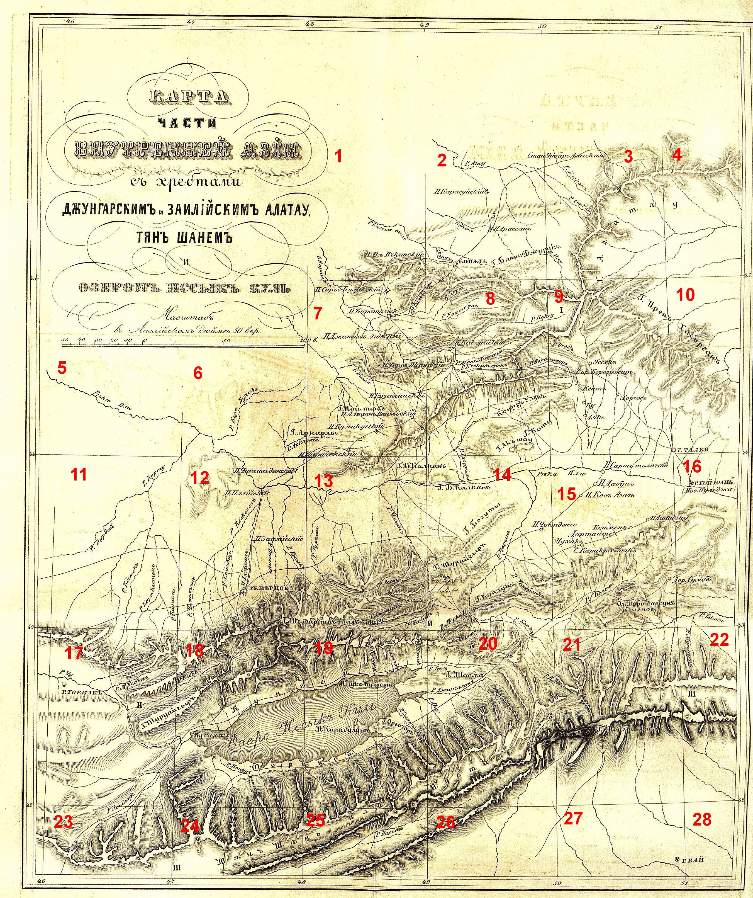
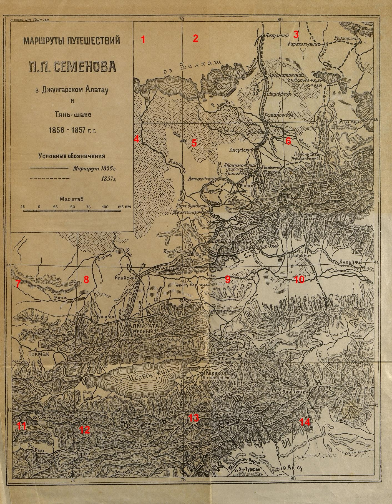

## Введение

Три набора топонимов:

1. 73 топонима из текста отчета о первой поездки на Тянь-Шань, 1858 ([отчет](/notes/semenov-first-report/))
2. 124 топонима карты отчета о первой поездки на Тянь-Шань, 1858 ([подробнее о картах](/notes/semenov-first-two-maps/))
3. 137 топонимов карты маршрутов путешествий СТШ на Тянь-Шань, 1946 ([подробнее о картах](/notes/semenov-first-two-maps/))

Все три набора в виде [таблицы Google](https://docs.google.com/spreadsheets/d/1dmSzl8rmZSjqBy8mLpTxncrECHgiBPS0dlTqpb4LH3c/edit?usp=sharing).

## Топонимы из текста отчета о первой поездке на Тянь-Шань

Первая поездка на Тянь-Шань, или Небесный хребет. До верховьев системы р. Яксарта или Сыр-Дарьи. Действительного члена И.И. Семенова, в 1857 году // Вестник Императорского Русского географического общества. Ч. 22. - СПб., 1858. ([отчет](/notes/semenov-first-report/))

1\. Алтай-Саяны, горная система. Страница: 1

2\. Тянь-Шань (Небесный хребет), горная система. Страница: 1

3\. Кунь-Лунь, горная система. Страница: 1

4\. Гималаи, горная система. Страница: 1

5\. Малая Бухария. Страница: 2

6\. Кашгария. Страница: 2

7\. Си-Юй (Западные земли?), . Страница: 2

8\. Иссык-Куль, озеро. Страница: 2

9\. Заукинский, горный проход. Страница: 3

10\. Сыр-Дарья (Яксарт), река. Страница: 3

11\. Балхаш, озеро. Страница: 3

12\. Ала-Куль, озеро. Страница: 3

13\. Киргизская, степь. Страница: 3

14\. Арганатинские, холмы. Страница: 3

15\. Лепса, река. Страница: 4

16\. Алатау (Пестрые, пегие горы), горная система. Страница: 4

17\. Джунгарский Алатау, горная система. Страница: 4

18\. Илийская, долина. Страница: 4

19\. Богдо-Ола, гора. Страница: 4

20\. Ирен-Хабирган, горная система. Страница: 4

21\. Копал, город. Страница: 4

22\. Семиречинский, край. Страница: 5

23\. Или, река. Страница: 5

24\. Заилийский, край. Страница: 5

25\. Заилийский Алатау, горная система. Страница: 5

26\. Чарын, река. Страница: 6

27\. Кунурулен, река. Страница: 6

28\. Хаш, река. Страница: 6

29\. Кунгес, река. Страница: 6

30\. Нань-Шань, горная система. Страница: 6

31\. Верное, укрепление. Страница: 6

32\. Талгарнын-Тал-Чеку, гора. Страница: 7

33\. Алматинка, река. Страница: 7

34\. Аксай, река. Страница: 7

35\. Кебин, река. Страница: 7

36\. Чу, река. Страница: 7

37\. Чилик, река. Страница: 7

38\. Тюб, река. Страница: 7

39\. Джиргалан, река. Страница: 7

40\. Сайташ, плато. Страница: 8

41\. Боротала, озеро. Страница: 8

42\. Самарканд, город. Страница: 9

43\. Кызыл-Кия. Страница: 10

44\. Тасма, кряж. Страница: 10

45\. Кара Булун, коса. Страница: 11

46\. Турген-Аксу, река. Страница: 11

47\. Джергес, река. Страница: 12

48\. Аксу, река. Страница: 12

49\. Алтын-Арассан, ключ. Страница: 12

50\. Алма-Арассан, ключ. Страница: 12

51\. Аклуйская, долина. Страница: 14

52\. Нарь ну, река. Страница: 14

53\. Зауку, река. Страница: 14

54\. Джиты-Угуз, река. Страница: 15

55\. Оргочор, холм. Страница: 16

56\. Кызыл-Су, река. Страница: 16

57\. Заукучак, река. Страница: 16

58\. Кызыл-Унгур (Красная пещера), местность. Страница: 17

59\. Кашка-су, река. Страница: 19

60\. Кашкасуйское, озеро. Страница: 20

61\. Нарын, река. Страница: 21

62\. Гутишан, река. Страница: 21

63\. Сары Джаз, река. Страница: 21

64\. Тарима, река. Страница: 21

65\. Эргеу, река. Страница: 21

66\. Лоб-нор, озеро. Страница: 21

67\. Аральское, море. Страница: 22

68\. Кашмир, область. Страница: 22

69\. Семипалатинск, город. Страница: 22

70\. Дели, город. Страница: 22

71\. Омск, город. Страница: 22

72\. Хонгор-Олон (Кунурулен), . Страница: 22

73\. Кунгея. Страница: 23

74\. Хан Тенгри, гора. Страница: 24

## Топонимы карты 1858

Топонимы из карты отчета о первой поездке на Тянь-Шань.

Карта из публикации: Первая поездка на Тянь-Шань, или Небесный хребет. До верховьев системы р. Яксарта или Сыр-Дарьи. Действительного члена И.И. Семенова, в 1857 году // Вестник Императорского Русского географического общества. Ч. 22. - СПб., 1858. ([подробнее о картах](/notes/semenov-first-two-maps/))

Топоним, в скобках, название в современной орфографии, тип объекта. Номер блока.

1\. Кизылъ-агачъ (Кизыл-агач), река. Блок: 1

2\. Акъ Ичкинскiй (Ак Ичкинский), нп. Блок: 1

3\. Караталъ (Каратал), река. Блок: 1

4\. Аксу (Аксу), река. Блок: 2

5\. Карасуйскiй (Карасуйский), нп. Блок: 2

6\. Бiенъ (Биен), река. Блок: 2

7\. Арассанъ (Арассан), нп. Блок: 2

8\. Капалъ (Капал), река. Блок: 2

9\. Копалъ (Копал), нп. Блок: 2

10\. Баянъ Джурукъ (Баян Джурук), гора. Блок: 2

11\. Стан. Чубаръ Агачская (Стан. Чубар Агачская), нп. Блок: 2

12\. Басканъ (Баскан), река. Блок: 3

13\. Сарканъ (Саркан), река. Блок: 3

14\. Аксу (Аксу), река. Блок: 3

15\. Или (Или), река. Блок: 5

16\. Кере Булакъ (Кере Булак), река. Блок: 6

17\. Аркарлы (Аркарлы), гора. Блок: 6

18\. Аркарлы (Аркарлы), река. Блок: 6

19\. Карачекскiй (Карачекский), нп. Блок: 6

20\. Сары Булакскiй (Сары Булакский), нп. Блок: 7

21\. Каратальск (Каратальск), нп. Блок: 7

22\. Балыталы (Балыталы), река. Блок: 7

23\. Джангысъ Агачскiй (Джангыс Агачский), нп. Блок: 7

24\. Бижа (Бижа), река. Блок: 7

25\. Терсъ Акачскiй (Терс Акачский), нп. Блок: 7

26\. Кугалинскiй (Кугалинский), нп. Блок: 7

27\. Май тюбе (Май тюбе), гора. Блок: 7

28\. Алтынъ Имельскiй (Алтын Имельский), нп. Блок: 7

29\. Куянкусскiй (Куянкусский), нп. Блок: 7

30\. Кора (Кора), река. Блок: 8

31\. Караталъ (Каратал), река. Блок: 8

32\. Коксу (Коксу), река. Блок: 8

33\. Коксуйскiй (Коксуйский), нп. Блок: 8

34\. Аганы катты (Аганы катты), гора. Блок: 8

35\. Кесконтерекъ (Кесконтерек), река. Блок: 8

36\. Борогужиръ (Борогужир), река. Блок: 8

37\. Конуръ Уленъ (Конур Улен), . Блок: 8

38\. Кату (Кату), гора. Блок: 8

39\. Акъ тау (Ак тау), гора. Блок: 8

40\. Тугурикъ (Тугурик), река. Блок: 8

41\. Иренъ Хабирганъ (Ирен Хабирган), горы. Блок: 9

42\. Алатау (Алатау), горы. Блок: 9

43\. Усекъ (Усек), река. Блок: 9

44\. Уссекъ (Уссек), нп. Блок: 9

45\. Кар. Борогужиръ (Кар. Борогужир), нп. Блок: 9

46\. Кентъ (Кент), нп. Блок: 9

47\. Ку (Ку), нп. Блок: 9

48\. Аякъ (Аяк), нп. Блок: 9

49\. Хоргосъ (Хоргос), нп. Блок: 9

50\. Талки (Талки), гора. Блок: 10

51\. Курту (Курту), река. Блок: 11

52\. Курдай (Курдай), река. Блок: 11

53\. Кестекъ (Кестек), река. Блок: 11

54\. Кара Кестекъ (Кара Кестек), река. Блок: 11

55\. Каргалы (Каргалы), река. Блок: 11

56\. Чингильдийскiй (Чингильдийский), нп. Блок: 12

57\. Иллiйскiй (Иллийский), нп. Блок: 12

58\. Кескеленъ (Кескелен), река. Блок: 12

59\. Заилийскiй (Заилийский), нп. Блок: 12

60\. Чемолганъ (Чемолган), нп. Блок: 12

61\. Алматы (Алматы), река. Блок: 12

62\. М. Алматы (М. Алматы), река. Блок: 12

63\. Талгаръ (Талгар), река. Блок: 12

64\. Иссыкъ (Иссык), река. Блок: 12

65\. Ук. Вѣрное (Ук. Верное), нп. Блок: 12

66\. Тальгарнинъ-талъ-чеку (Тальгарнин-тал-чеку), гора. Блок: 12

67\. М. Калканъ (М. Калкан), гора. Блок: 13

68\. Чиликъ (Чилик), река. Блок: 13

69\. Тургенъ (Турген), река. Блок: 13

70\. Ассы (Ассы), река. Блок: 13

71\. Дженике (Дженике), река. Блок: 13

72\. Б. Калканъ (Б. Калкан), гора. Блок: 14

73\. Богуты (Богуты), гора. Блок: 14

74\. Турайгыръ (Турайгыр), гора. Блок: 14

75\. Чарынъ (Чарын), река. Блок: 14

76\. Чаюнджи (Чаюнджи), река. Блок: 14

77\. Темерликъ (Темерлик), река. Блок: 14

78\. Куелукъ (Куелук), гора. Блок: 14

79\. Марке (Марке), река. Блок: 14

80\. Каркара (Каркара), река. Блок: 14

81\. Или (Или), река. Блок: 15

82\. Сартъ тологой (Сарт тологой), нп. Блок: 15

83\. Дабунъ (Дабун), нп. Блок: 15

84\. Косъ Агачъ (Кос Агач), нп. Блок: 15

85\. Чухакъ (Чухак), нп. Блок: 15

86\. С. Каракыстыкъ (С. Каракыстык), нп. Блок: 15

87\. Дартанте (Дартанте), нп. Блок: 15

88\. Кетменъ (Кетмен), нп. Блок: 15

89\. Ашинаку (Ашинаку), нп. Блок: 15

90\. Кегенъ (Кеген), нп. Блок: 15

91\. Дер. Сумбе (Дер. Сумбе), нп. Блок: 15

92\. Боро дабсунъ (соленое) (Боро дабсун (соленое)), озеро. Блок: 15

93\. Хой Юань (Нов. Кульджа), город. Блок: 16

94\. Текесъ (Текес), река. Блок: 16

95\. Чу (Чу), река. Блок: 17

96\. Токмакъ (Токмак), город. Блок: 17

97\. М. Кебинъ (М. Кебин), река. Блок: 17

98\. Туруайгыръ (Туруайгыр), гора. Блок: 17

99\. Кебинъ (Кебин), река. Блок: 18

100\. Аксу (Аксу), река. Блок: 18

101\. Кунгей (Кунгей), . Блок: 18

102\. Кутемалды (Кутемалды), . Блок: 18

103\. Иссыкъ Куль (Иссык Куль), . Блок: 18

104\. Терекей (Терекей), . Блок: 18

105\. Конуръ уленъ (Конур улен), река. Блок: 18

106\. Шаты (Шаты), гора. Блок: 19

107\. Курмида (Курмида), река. Блок: 19

108\. Кудургу (Кудургу), река. Блок: 19

109\. Джиты угузъ (Джиты угуз), река. Блок: 19

110\. Оргочоръ (Оргочор), гора. Блок: 19

111\. Заука (Заука), река. Блок: 19

112\. Мерке (Мерке), река. Блок: 20

113\. Тюбъ (Тюб), река. Блок: 20

114\. Тасма (Тасма), гора. Блок: 20

115\. Джиргаланъ (Джиргалан), река. Блок: 20

116\. Аксу (Аксу), река. Блок: 20

117\. Кокъ джаръ (Кок джар), река. Блок: 20

118\. Сары Джазъ (Сары Джаз), река. Блок: 20

119\. Тенгри Ханъ (Тенгри Хан), гора. Блок: 21

120\. Муссартъ (Муссарт), река. Блок: 22

121\. Кошкаръ (Кошкар), река. Блок: 23

122\. Тянъ Шань или Мустагъ (Тян Шань или Мустаг), горы. Блок: 24

123\. Нарынъ (Нарын), река. Блок: 25

124\. Бай (Бай), город. Блок: 27

## Топонимы карты 1946

П. П. Семенов-Тян-Шанский. Мемуары. --- 1-е изд., просм. Л. С. Бергом, со вступ. ст. Н. Г. Фрадкина. --- М.: ОГИЗ, 1946. --- Т. 2: Путешествие в Тянь-Шань в 1856---1857 годах. ([подробнее о картах](/notes/semenov-first-two-maps/))

Разграфку блоков см. на карте выше. В скобках синоним, если есть.

1\. Балхаш, озеро. Блок: 1

2\. Лепса, река. Блок: 2

3\. Аягуз, река. Блок: 2

4\. Аягузский, нп. Блок: 2

5\. Арганатинский, нп. Блок: 2

6\. Ашибулак, нп. Блок: 2

7\. Романовское, нп. Блок: 2

8\. Каракольский, нп. Блок: 3

9\. Урджарское, нп. Блок: 3

10\. Каракол, река. Блок: 3

11\. Урджар, река. Блок: 3

12\. Сасык-Куль (Ала-куль), озеро. Блок: 3

13\. Тенжа, река. Блок: 3

14\. Каратал, река. Блок: 4

15\. Биже, река. Блок: 4

16\. Кара-булакский, нп. Блок: 4

17\. Джангызагачский, нп. Блок: 4

18\. Куякузский, нп. Блок: 4

19\. Или, река. Блок: 4

20\. Курту, река. Блок: 4

21\. Ак-су, река. Блок: 5

22\. Баскан, река. Блок: 5

23\. Аксуйский, нп. Блок: 5

24\. Абакумовский (Карасуйский), нп. Блок: 5

25\. Гасфорта, перевал. Блок: 5

26\. Арасанский, нп. Блок: 5

27\. Биен, река. Блок: 5

28\. Копал, нп. Блок: 5

29\. Копалка, река. Блок: 5

30\. Акичкейский, нп. Блок: 5

31\. Теректы, река. Блок: 5

32\. Каратол, река. Блок: 5

33\. Кок-су, река. Блок: 5

34\. Биже, река. Блок: 5

35\. Кара, река. Блок: 5

36\. Коксуйский, нп. Блок: 5

37\. Пактал, река. Блок: 5

38\. Усек, река. Блок: 5

39\. Джунгарский Алатау, хребет. Блок: 5

40\. Алтын-Эмельский, нп. Блок: 5

41\. Май-тюбе, река. Блок: 5

42\. Конур-Улен, нп. Блок: 5

43\. Каракол, река. Блок: 5

44\. Борохудзир, река. Блок: 5

45\. Кок-терек, река. Блок: 5

46\. Ала-куль, озеро. Блок: 6

47\. Чинжолы, река. Блок: 6

48\. Тентен, река. Блок: 6

49\. Лепса, река. Блок: 6

50\. Лепсинск (Чубарагачский), нп. Блок: 6

51\. Саркан, река. Блок: 6

52\. Боро-тала, река. Блок: 6

53\. Сайрам-нур, озеро. Блок: 6

54\. Тас-тау, река. Блок: 6

55\. Хоргос, река. Блок: 6

56\. Хоргос, нп. Блок: 6

57\. Джаркент, нп. Блок: 6

58\. Сары-булак, река. Блок: 6

59\. Кульджа, нп. Блок: 6

60\. Копа, река. Блок: 7

61\. Кистен, река. Блок: 7

62\. М. Кебин, река. Блок: 7

63\. Токмак, нп. Блок: 7

64\. Иссы-ата, река. Блок: 7

65\. Шамси, река. Блок: 7

66\. Кочнур, река. Блок: 7

67\. Чу, река. Блок: 7

68\. Тянь-Шань, хребет. Блок: 7

69\. Ченгильдейский, нп. Блок: 8

70\. Илийский, нп. Блок: 8

71\. Каскелен, река. Блок: 8

72\. Узун-агач, нп. Блок: 8

73\. М. Алматинка, река. Блок: 8

74\. Алма-Ата (укрепление Верный), нп. Блок: 8

75\. Талгар, река. Блок: 8

76\. Иссык, река. Блок: 8

77\. Тургень, река. Блок: 8

78\. Кара-бурук, река. Блок: 8

79\. Чемолдан, река. Блок: 8

80\. Кебин, река. Блок: 8

81\. Каскелен, перевал. Блок: 8

82\. Дюре, перевал. Блок: 8

83\. Чилик, река. Блок: 8

84\. Курменты, перевал. Блок: 8

85\. Иссык-куль, озеро. Блок: 8

86\. Или, река. Блок: 9

87\. Сор-куль, озеро. Блок: 9

88\. Чилик, река. Блок: 9

89\. Чарын, река. Блок: 9

90\. Темерлик, река. Блок: 9

91\. Асы, река. Блок: 9

92\. Дженишке, река. Блок: 9

93\. Каинды, река. Блок: 9

94\. Табульгасы, перевал. Блок: 9

95\. Каркара, река. Блок: 9

96\. Кегень, река. Блок: 9

97\. Мерке, река. Блок: 9

98\. Сары-джас, река. Блок: 9

99\. Тенес, река. Блок: 9

100\. Санташ, перевал. Блок: 9

101\. Джаргалан, река. Блок: 9

102\. Тюп, река. Блок: 9

103\. Кок-джар, река. Блок: 9

104\. Каракол (Пржевальск), нп. Блок: 9

105\. Кизыл-су, река. Блок: 9

106\. Джеты-огу, река. Блок: 9

107\. Каракол, река. Блок: 9

108\. Ак-су, река. Блок: 9

109\. Тургень-ак-су, река. Блок: 9

110\. Куйлю, река. Блок: 9

111\. Иныльчек, река. Блок: 9

112\. Хан-Тенгри, гора. Блок: 9

113\. Или, река. Блок: 10

114\. Текес, река. Блок: 10

115\. Сев. Мусарт, река. Блок: 10

116\. Агиаз, река. Блок: 10

117\. Сон-куль, озеро. Блок: 11

118\. Кара-гуджир, река. Блок: 11

119\. Нарын, река. Блок: 11

120\. Атбаши, река. Блок: 11

121\. Джуука-Заука, река. Блок: 12

122\. Джуука, перевал. Блок: 12

123\. Бурхан, река. Блок: 12

124\. М. Нарын, река. Блок: 12

125\. Нарын, нп. Блок: 12

126\. Нарын, река. Блок: 12

127\. Тарагай, река. Блок: 12

128\. Ак-сай, река. Блок: 12

129\. Уч-куль, река. Блок: 13

130\. Каинды, река. Блок: 13

131\. Сары-джас, река. Блок: 13

132\. Ак-шийряк, река. Блок: 13

133\. Китай, страна. Блок: 13

134\. Таушка-дарья, река. Блок: 13

135\. Уч-Турфан, нп. Блок: 13

136\. Ак-су, нп. Блок: 13

137\. Мусарт, река. Блок: 14

## Комментарии

[**Обсудить**](https://t.me/answer42geo/39)
