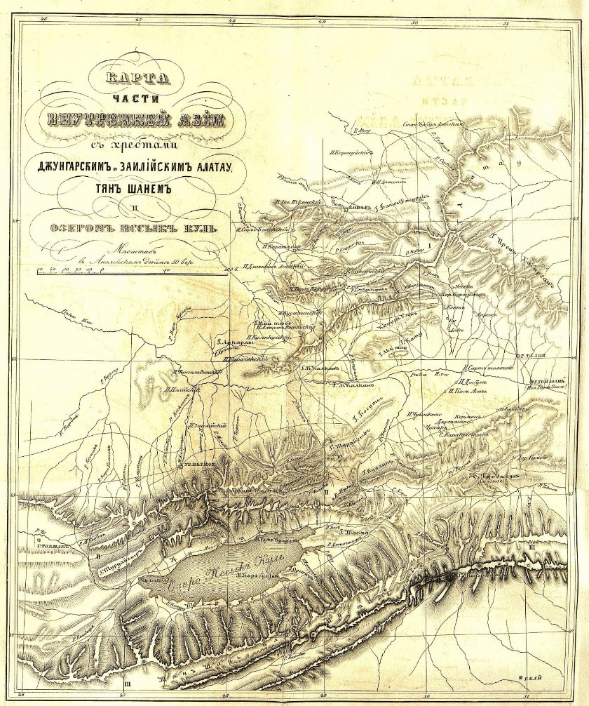
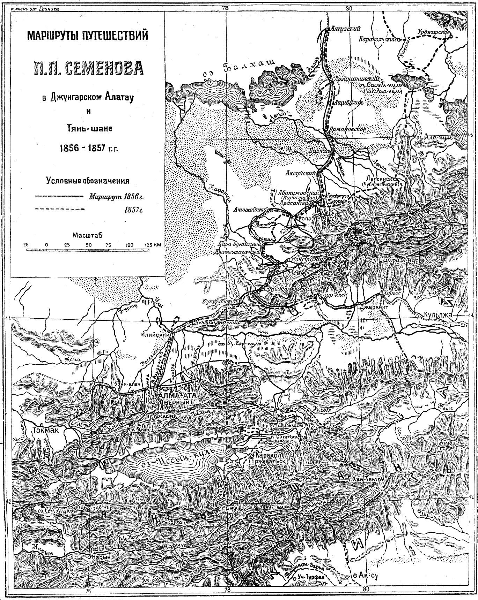
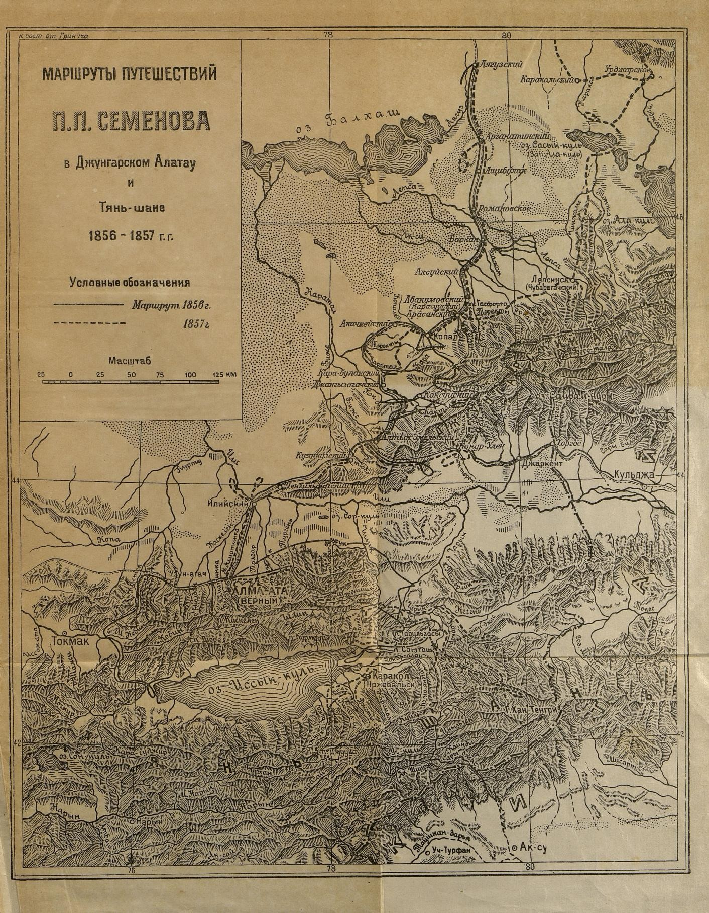
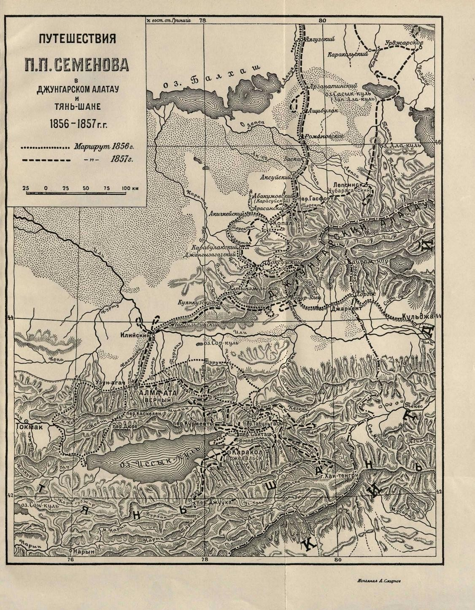

## Введение

Описание двух версий основной карты путешествия ППСТШ.

## Карта №1. Отчет о первой поездке

Опубликована в Вестнике ИРГО 1858 г.

Полная ссылка для цитирования: Первая поездка на Тянь-Шань, или Небесный хребет. До верховьев системы р. Яксарта или Сыр-Дарьи. Действительного члена И.И. Семенова, в 1857 году // Вестник Императорского Русского географического общества. Ч. 22. - СПб., 1858.

Карта загадочно пропала из [PDF с отчетом о поездке](/notes/semenov-first-report/), но присутствует в Вестнике РГО.

[Карта из Вестника 1858](https://drive.google.com/file/d/1Ln9gsn0tJCF_7CkVkkP_ygi-czXbJk3O/view?usp=sharing). JPG без пересжатия PDF.

Название карты: Карта части внутренней Азии съ хребатми Джунгарскимъ и Заилiйскимъ Алатау, Тянъ Шанемъ и озеромъ Иссыкъ Куль.

## Карта №2. Второй том мемуаров

Очевидно, что широко распространенная карта №2 из второго тома мемуаров СТШ (Т2) создана на основе карты №1. Совпадает географический охват, размер листа, общая компоновка.

**Первичка по Т2:**

* Цитирование: Семенов-Тян-Шанский, Петр Петрович. Мемуары \[Текст\] / Петр Петрович Семенов-Тян-Шанский. - Москва : Гос. изд-во геогр. лит., 1946 (16-я тип. треста "Полиграфкнига"). - 1 т.; 26 см. Т. 2: Путешествие в Тянь-Шань. В 1856-1857 гг. / Со вступ. статьей Н. Г. Фрадкина. - 1946. - 256 с., 10 л. ил., портр., карт.
* Года издания Т2: М., 1946; изд. 2. 1948; изд. 3. 1958; изд. 4. 2019
* Текст Т2 1946 на [Wikisource](https://ru.wikisource.org/wiki/%D0%9F%D1%83%D1%82%D0%B5%D1%88%D0%B5%D1%81%D1%82%D0%B2%D0%B8%D0%B5_%D0%B2_%D0%A2%D1%8F%D0%BD%D1%8C-%D0%A8%D0%B0%D0%BD%D1%8C_%D0%B2_1856-1857_%D0%B3%D0%BE%D0%B4%D0%B0%D1%85_(%D0%A1%D0%B5%D0%BC%D1%91%D0%BD%D0%BE%D0%B2-%D0%A2%D1%8F%D0%BD-%D0%A8%D0%B0%D0%BD%D1%81%D0%BA%D0%B8%D0%B9)) (Опубл.: 1908. Источник: *П. П. Семенов-Тян-Шанский*. Мемуары. --- 1-е изд., просм. Л. С. Бергом, со вступ. ст. Н. Г. Фрадкина. --- М.: ОГИЗ, 1946. --- Т. 2: Путешествие в Тянь-Шань в 1856---1857 годах. [az.lib.ru](http://az.lib.ru/s/semenowtjanshanskij_p_p/text_0020.shtml))
* Текст Т2 на [az.lib.ru](http://az.lib.ru/s/semenowtjanshanskij_p_p/text_0020.shtml)

Для скачивания:

* Отсканированный [PDF Т2 издания 1946](https://drive.google.com/file/d/1-1-cHrKFcwdNjmCOBb7oefmDhSQAQgM5/view?usp=sharing) г. Просмотровщик без возможности скачивания на [РГБ](https://viewer.rsl.ru/ru/rsl01005646688).
* [Карта из T2 1946](https://drive.google.com/file/d/1jGM5fUaIj60TkCLau3d5F6Xva2YvCfJa/view?usp=sharing). JPG без пересжатия PDF (в PDF некоторые подписи из-за сжатия --- нечитаемы)
* Альтернативная версия из  [жж 0kb](https://0kb.livejournal.com/4097.html), подложен распознанный текст, но качество распознавания очень плохое.
* Отсканированный [PDF Т2 издания 1948](https://drive.google.com/file/d/19uMy4EsxeneSKE_Nm5-GSmhpUnaeUnP0/view?usp=sharing) г. Просмотровщик без возможности скачивания на [РГБ](https://viewer.rsl.ru/ru/rsl01005646689).
* [Карта из T2 1948](https://drive.google.com/file/d/1vuPVCwKxCG4hihSJvu6Ixadixrq-784R/view?usp=sharing). JPG без пересжатия PDF.

**Мемуары 2019**

Издание 2019 г. [Описание](https://search.rsl.ru/ru/record/01009842947) на сайте Российской Государственной Библиотеки.

Мемуары П. П. Семенова-Тян-Шанского \[Текст\] : \[в 5 т.\] / \[вступит. ст. и коммент. И. Е. Дронова\]. - Москва : Кучково поле, 2018-2019. - 24 см. - (Золотой фонд Русского географического общества).; ISBN 978-5-9950-0890-3 меньше
Науки о Земле --- Географические науки --- Персоналии --- Россия --- Семенов-Тян-Шанский, Петр Петрович (1827-1914) --- Мемуары
Хранение: FB 12 18-3/431; Хранение: CPF Т3(2)5/С30;

Т. 1: Детство и юность. 1827-1855. Т. 1 / вступ. ст. и комментарии А. А. Богданова и М. А. Семенова-Тян-Шанского. - 2019. - 557, \[1\] с., \[16\] л. ил., портр., факс., цв. ил., карты, портр.; ISBN 978-5-9950-0888-0 : 1500 экз.  меньше
Имен. указ.: с. 525-556

Т. 2: Путешествие в Тянь-Шань, 1856-1857. Т. 2. - 2019. - 510, \[1\] с., \[24\] л. цв. ил.; ISBN 978-5-9950-0889-7 : 1500 экз.  больше
Имен. указ.: с. 474-484
Геогр. указ.: с. 485-508

Т. 3: Эпоха освобождения крестьян в России в воспоминаниях бывшего члена-эксперта и заведовавшего делами Редакционных комиссий 1857-1860. Т. 3. - 2018. - 446, \[1\] с., \[16\] л. ил., портр.; ISBN 978-5-9950-0801-9 : 1500 экз.

Т. 4: Эпоха освобождения крестьян в России в воспоминаниях бывшего члена-эксперта и заведовавшего делами Редакционных комиссий 1860-1861. Т. 4. - 2018. - 574, \[1\] с., \[16\] л. ил., портр.; см.; ISBN 978-5-9950-0886-6 : 1500 экз.  Имен. указ.: с. 550-570

Т. 5: П. П. Семенов-Тян-Шанский. Его жизнь и деятельность, 1827-1914. Т. 5. - 2018. - 286, \[1\] с., \[8\] л. ил., портр., цв. ил.; ISBN 978-5-9950-0887-3 : 1250 экз.
Доступен для просмотра: <https://viewer.rsl.ru/ru/rsl01009842947>  

Название карты: Маршруты путешествий П. П. Семенова в Джунгарском Алатау и Тянь-шане 1856 - 1857 г.г.

Ч/б версия из текста Т2 1946 в Wikisource.

Версия из PDF Т2 издания 1946 г. Эквивалентна ч/б версии.

Версия из PDF Т2 издания 1948 г. Отличается от версии 1946 г кучей мелких деталей. Более читаема, но некоторых названий топонимов вообще нет (например Уч-Турфан, Ак-су на юге, отрезаны компоновкой). На карте значится: «Исполнил А. Смирнов».

## Комментарии

[**Обсудить**](https://t.me/answer42geo/37)