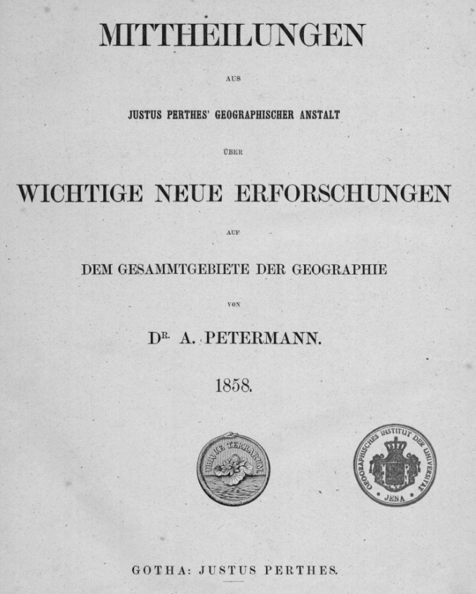

## Введение

OCR сделан мной. Переходы страниц и колонок - оставлены как в оригинале, поэтому местами переносы выглядят странно. Подстрочные комментарии под колонками, как в оригинале.

Оригинал статьи в PDF и общая информация о ней лежит в [отдельной заметке](/notes/semenov-pgm).

Umlauts:

* ï ä ö ü ë
* Ï Ä Ö Ü Ë

Библиографическая ссылка на статью:

P. v. Semenow's Erforschungsreisen in Inner-Asien im Jahre 1857, seine Aufnahme des Alpensee's Issyk-Kul und anderer Theile der nordwestlichen Russisch-Chinesischen Grenzländer bis zu den Gletschern des Thianschan-Gebirges. // Mittheilungen aus Justus Perthes' Geographischer Anstalt über wichtige neue Erforschungen auf dem Gesammtgebiete der Geographie / hrsg. von A. Petermann - Gotha [u.a.]: Perthes - 1858. Heft IX, pp. 351-369.

## Текст статьи

### 001

MITTHEILUNGEN

AUS

JUSTUS PERTHES’ GEOGRAPHISCHER ANSTALT

ÜBER

WICHTIGE NEUE ERFORSCHUNGEN

AUF

DEM GESAMMTGEBIETE DER GEOGRAPHIE

VON

DR. A. PETERMANN.

1858\.

GOTHA: JUSTUS PERTHES.

### 351

P. v. Semenow’s Erforschungsreisen in Inner-Asien im Jahre 1857, seine Aufnahme des Alpensee’s Issyk Kul und anderer Theile der nordwestlichen Russisch-Chinesischen Grenzländer bis zu den Gletschern des Thianschan-Gebirges ¹).
(Mit Karten und Profilen, s. Tafel 16.)

I. ALLGEMEINE GEOGRAPHISCHE ÜBERSICHT DER BEREISTEN LÄNDER.

1\. *Einleitung*. — Südlich von der Russisch-Sibirischen Zollgrenze und Militärpostenlinie, die von der Mündung der Buchtarma bis nach Omsk genau dem Laufe des Irtysch folgt, erstreckt sich das Land, welches unter dem allgemeinen Namen der Kirghisen-Steppe bekannt ist. Es ist durchaus keine völlig flache Ebene, wie die Baraba und die ganze West-Sibirische Niederung zwischen dem Ural und dem Altai, wo ein festes anstehendes Gestein nirgends zu Tage kömmt und kein Hügel sich am Horizont erhebt. Im Gegentheil kommen in der Kirghisen-Steppe feste, vorwaltend krystallinische, theilweise sedimentäre Gesteine fast überall zum Vorschein, Hügel, sogar kleine niedrige Gebirgsgruppen bildend. Dürre, Baumlosigkeit, Armuth an fliessenden Gewässern, geringe relative Höhe der vorhandenen Hügelgruppen, welche fast nirgends zu einer wirklichen bedeutenden Gebirgskette zusammenfliessen, allgemein verbreiteter Typus der Flora der Aralo-Kaspischen Niederung, häufig Salzboden (Solonzi) mit Halophyten gehören zu den charakteristischen Zügen der sogenannten Kirghisen-Steppe.

Von Semipalatinsk aus direkt nach Süden zur Balkasch-Niederung und weiter zu unseren Central-Asiatischen Ansiedelungen Kopal und Viernoie (Almaty) führt ein Piquetweg über die Steppen-Kreisstadt Ajagus. Dieser Weg überschreitet den Irtysch in Semipalatinsk selbst bei einer absoluten Höhe von circa 800 P. F. und steigt all-mälig bis zur Wasserscheide zwischen den Irtysch- und Balkasch-Flussgebieten. Zuerst Grünstein, dann aber hauptsächlich und vorwaltend rother Porphyr ist das krystallinische Gestein der Steppenhügel und Hebungen. Die sedimentären Gesteine, ausschliesslich paläozoisch, durch die Hebung plutonischer Gesteine mannigfaltig gebrochen und umgewandelt, bilden auf diesem Wege nirgends mäch-

¹) Nach Original-Mittheilungcn des Reisenden, datirt: St. Petersburg, 13/25. Juni 1858.

tige Lager. Kleine isolirte Granitgruppen, wie z. B. die Semi-Tau-, Kokon- und Orkatberge, sind nicht zahlreich. Mit der Wasserscheide zwischen dem wenig bedeutenden Balkasch-Zufluss Ajagus und dem ganz unbedeutenden und im Sommer fast verschwindenden Atschi-ssu (Irtysch-Zu-fluss) ist der Kulminationspunkt des ganzen Weges erreicht. Er beträgt nicht mehr als 1700 P. F. absolute Höhe. Unweit der Stadt Ajagus stösst der Beobachter zum ersten Mal auf eine Granit-Axe, welche einerseits eine unmittelbare Fortsetzung der Granit-Hebungsaxe des Tarbagatai zu sein scheint und andererseits in die Granit-Axe des Tschingistau verläuft. Ein flacher Wasserscheide-Rücken zwischen dem Irtysch und Balkasch-Gewässer und ein Granitstrich setzen also den Tarbagataï mit dem Tschingistau in Verbindung, welcher letztere mit jenem ganz in derselben Richtung (OSO. — WNW.) streicht und auf derselben Spalte gehoben zu sein scheint. Auf seinem Westende breitet sich der Tschingistau, von Porphyrgruppen umgeben, in das sich so reich an silberhaltigen Bleierzen erwiesene Gebirgsland Karkaraly, wahrscheinlich das höchste in der ganzen echten Kirghisen-Steppe, aus. Die absolute Höhe dieser Karkaraly-Berge scheint doch nicht sehr bedeutend zu sein, da sie schon am Ende Juni keine, selbst nicht sporadische, Schneeflecken tragen und wahrscheinlich bei weitem nicht einmal die Höhe von 5000 P. F. erreichen.

Der südliche Abhang der Ajagus’schen Wasserscheide sinkt allmälig zur Balkasch-Niederung. Jenseits des Klein-Ajagus-Piquets (80 Werst südlich von Ajagus) verschwinden die anstehenden Gesteine. Eine flache niedrige Steppe mit ihrem salzigen Lehmboden, hier und da von kleinen stehendem Gewässer bedeckt, im N. und S. von Sandhügeloder Dünenreihen und theilweise von Schilfwäldern begrenzt, bildet einen 40 Werst breiten, vom Ostende des Bal-kasch zum Westende des Alakul verlaufenden Landstrich, welcher offenbar den Charakter eines ausgetrockneten Seebodens trägt und dem Beobachter keinen Zweifel über den früheren Zusammenhang des Balkasch mit den beiden

### 352

Alakul-See’n lässt. Erreicht man die niedrige Arga-naty - Hügelgruppe, so ist die hier schmale Zone der theilweise ausgetrockneten Balkasch - Alakul - Niederung, deren absolute Höhe ich approximativ zwischen 500 und 800 P. F. schätze ¹), überschritten. Der Reisende sieht mit Erstaunen eine grossartige, prächtige Landschaftsumwandlung, da ihm die imposante, augenscheinlich von NO. nach SW. streichende Kette des Dzungarischen Alatau, mit ihren ewigen Schneeflächen glänzend, zum Vorschein kommt. Von einer Kirghisen-Steppe kann hier nicht mehr die Rede sein; von hier aus befindet man sich offenbar in dem centralsten Asien.

Das schmale, von WSW. nach ONO. lang gezogene Becken des Balkasch, mit seiner durch Vertrocknung abgeschiedenen Fortsetzung, dem Becken der beiden Alakul-See’n, bildet also eine merkwürdige Scheidelinie, welche die Gebirgssysteme und Naturverhältnisse des centralsten Asiens von denen der benachbarten Länder trennt. Von hier an stehen schon die grossartigen Alpenländer mit dem Thianschan, dem centralsten Gebirgszug Asiens, in Verbindung und hier erreichen manche Inner-Asiatischen Thier- und Pflanzenformen eine wirkliche Grenze ihrer Verbreitungsbezirke. So dehnt z. B. der Tiger seine festen Wohnsitze nicht über die Schilfwälder der Balkasch-Niederung aus, wenn er auch zuweilen auf seinen kühnen Streifzügen bis ins Innere des Altaï vordringt; so erreichen hier die Stachelschweine, Schildkröten, Fasanen, Skorpionen und Phalangien ihre Grenze, eben so wie einige höchst interessante Central-Asiatische Bäume, wie z. B. die Populus diversifolia Schr. und die Pyrus Sie-versiana Pall. ²).

Der schöne Theil Inner-Asiens, welcher im N., NW. und W. von der Balkasch-Alakul-See-Zone, im O. von dem Schneekamme des Dzungarischen Alatau und im S. von dem Schnee- und Gletscherkamme des Thian-schan begrenzt ist und die gewaltigen Extreme von 600 und vielleicht 20,000 P. F. absoluter Höhe auf einem verhältnissmässig wenig ausgedehnten Gebiete (zwischen 42° und 46 1/2° N. Br.) vereinigt, bietet wohl ein reiches Feld zu Untersuchungen im Gebiete der physikalischen Geographie, Geo-gnosie und der Lehre von der Thier- und Pflanzenformen-Verbreitung dar. Nicht weniger interessant ist das Land in historisch - ethnographischer Beziehung, da das fruchtbare und breite Hi-Thal von den ältesten Zeiten an eine der wichtigsten Stationen der Völkerwanderung war. Hier verweilten die wandernden Horden zuweilen Jahrzehnte, um, nachdem sie sich ausgeruht und neue Kräfte gesammelt, dann wieder ihren Weg südlich vom Balkasch fortzusetzen und von da sich entweder nach NW. gegen Europa oder nach SW. gegen Turan, Süd- und West-Asien zu wenden. Diesen Weg nahmen bekanntlich die Yue-Tschi und Usun vor Christi Geburt, die Mongolen im Mittelalter, die Ölöth im 17. Jahrhundert und vielleicht noch viele andere Völkerschaften der grossen Völkerwanderung.

Der Ili, einer der Hauptflüsse Inner-Asiens, scheidet in seinem OW.-Laufe das von uns bezeichnete Gebiet in zwei Theile, von denen der nördlichste durch den ersten hier eingewanderten Russischen Ansiedler den Namen des Landes der Sieben Flüsse (Semiretschinsky kräï) und der südlichste den des Landes jenseits des Ili (Transilensia,   Zailiïsky kraï) erhalten hat.

Drei hohe Alpenländer sind es, welche das ganze Gebiet beherrschen: 1) der Dzungarische Alatau in seiner intimen Verbindung mit der Talki-Kette zwischen den Alakul- und Ili-Niederungen, mit einer mittleren Kammhöhe von 6000 und einer Gipfelhöhe von über 12,000 P. F.; 2) der Alatau jenseits des Ili (Alatau transilensis) zwischen der Ili-Niederung und dem Issyk Kul-Plateau, mit einer mittleren Kammhöhe von 8000 und einer Gipfelhöhe von ungefähr 14,000 oder 15,000 P. F., und 3) der Thianschan zwischen dem Issyk Kul-Plateau und den Klein-Bucharischen Ebenen, mit einer mittleren Kammhöhe von circa 11,000 und einer Gipfelhöhe vielleicht von ungefähr 20,000 P. F. Es fallen der Dzungarische Alatau an seinem Westende und der Alatau transilensis an seinem Nord-Abhange unmittelbar in die breite Steppen-Niederung, welche sich bis zum Balkasch-Becken in einer absoluten Höhe von 1500 bis 500 P. F. erstreckt und den ganzen westlichen und nordwestlichen Theil unseres Gebietes einnimmt. Je näher zum Balkasch, desto ebener, dürrer, unfruchtbarer, sandiger und salziger wird der Boden, sich allmälig mit Ssaksaul (Haloxylon ammodendron Bg.) und Halophyten bedeckend; die anfänglich schönen, klaren und reissenden Gebirgsflüsse werden langsamer und trüber und bleiben endlich zwischen den ausgedehnten Sanddünen und Schilfwäldern still stehen, so dass nur eigentlich drei davon, die Lepsa, Karatal und Ili, wirklich den Balkasch-See erreichen.

Dagegen ist die Übergangszone von dieser Steppen-Niederung zum wahren Gebirge, in einer absoluten Höhe von 1500 bis 4000 P. F., eins der schönsten Kulturländer des Kontinentes. Trefflicher Humusboden, üppige Vegetation, Wasserreichthum zeichnen diese Zone aus. Die klaren, reissenden Alpenbäche, meistentheils von der ewigen Schnee

¹) Da alle meine Höhen durch Siedepunkt des Wassers bestimmt sind, so können diese Bestimmungen bei geringen Höhen nur einen approximativen Werth haben.

²) Diese letzte überschreitet übrigens an einem einzigen Punkte die von uns bezeichnete Grenze, sie findet sich nämlich in einer Schlucht am Südabhange des Tarbagataï.

### 353

region hinabrollend, verbreiten überall den Segen einer reichen Bewässerung, welche auffallend leicht in eine künstliche Irrigation von den Kirghisen, Buruten und Russischen Kosacken verwandelt wird. Steiler und kühner ragt das Gebirge von der Höhe von 4000 Fuss empor; zwischen 4000 und 7600 P. F. erstreckt sich noch ein guter Vorrath von Nadelholzwäldern (ausschliesslich die Pinus Schrenkiana Fisch. u. Mey, eine der P. orientalis L. sehr nahe stehende Form) und von 7600 bis über 9000 P. F. dehnen sich die schönen reichen Alpenwiesen. Jede von diesen vier natürlichen Zonen hat eine besondere Wichtigkeit für das hiesige Volksleben: 1) Die Steppenzone Von 500 bis 1500, zuweilen 2000 P. F., enthält die besten Winterstationen der Nomaden wegen ihres milden Klima’s und fast völligen Mangels an Schnee; 2) die Kulturzone von 1500 bis 4000 P. F. die schönsten Ackerländer; 3) die Nadelhölzer-Zone von 4000 bis 7600 P. F. (nicht überall vorhanden) reiche Vorräthe an Zimmerholz für feste Ansiedelungen; und 4) die Alpenwiesen-Zone von 7600 bis 9000 P. F. die gesündesten und an Viehnahrung reichsten Sommerstationen für die Nomaden. Die übrigen zwei Zonen: 5) die hochalpine und Gletscherzone von 9000 bis 11,200 P. F., wenn auch noch mit schönen Hochalpenkräutern bewachsen, und 6) die Schneezone von der Grenze des ewigen Schnee’s (11,200 F.) bis zur Gipfelhöhe der Gebirge, bleiben für das Völkerleben ohne Wichtigkeit. Es ist leicht begreiflich, dass die Russische Kolonisation, sich auf den Ackerbau stützend, sich ausschliesslich in der zweiten Zone verbreitet, hauptsächlich da, wo auch die dritte über ihr vorhanden und gut repräsentirt ist, und dass dagegen die erste und vierte im ausschliesslichen Eigenthum der Asiatischen Nomaden bleiben ¹).

¹) Die aufgezählten Zonen dieses Central-Asiatischen Gebietes lassen sich auch leicht durch ihre Pflanzenformen unterscheiden. Die erste Zone trägt offenbar den Charakter der Flora der Aralo-Kaspischen Niederung durch ihre Halophyten (Halimoenemis, Halogeton, Nanophyton, Brachylepis, Anabasis, Haloxylon, Salsola, Heraninowia, Schoberia, Schanginea, Suaeda, Halocnemon Kochia, Salicornia, Corispermum, Ce-ratocarpus u. s. w.), Artemisien, Astragalen, Tamariscineen u. s. w. Die für diese Zone bezeichnendsten Bäume sind: Populus diversifolia Schr., Populus pruinosa Schr., Elaeagnus hortensis Bieb. und eine Fraxinus-Art. Die zweite Zone hat in ihren krautartigen Gewächsen viel mehr Ähnlichkeit mit den Europäisch-Russischen und West-Sibirischen Tiefländern; dagegen sind einige Bäume und Sträucher ihr eigenthümlich, wie z. B. Pyrus Sieversiana, Armeniaca communis, eine schöne neue Acer-Art, eine Crataegus-Art, einige Trogopyrum, Berberis heteropeda u. s. w. Unter den Kräutern begegnet man hier auch zuweüen einigen echt Asiatischen Formen, wie z. B. Sophora alopecuroides, Ruta da-vurica, Rheum cuneatnm u. s. w. Die dritte Zone mit ihrer charakteristischen Pinus Schrenkiana hat in Hinsicht der übrigen Vegetation Ähnlichkeit mit dem Altai und dessen subalpinen Formen. Die Baumvegetation dieser Zone besteht aus Populus tremula L., P. suaveolens Fisch., Betula microphylla Bge., Sorbus aucuparia L. und Salix-Arten. Die vierte Zone enthält noch einige Sträucher, wie z. B. Juniperus Pseudosabina Fisch., Spiraea laevigata L., Sp. alpina Pall., Caragana jubata Poir., Potentilla Serbessofi, Potentilla n. sp. und eine Salix.

Die Alpenkräuter bestehen nicht nur aus eigenthümlichen, sondern auch aus Altaï’schen, Kaukasischen, Europäischen, sogar Himalayischen Formen. In der fünften Zone, wo die Alpensträucher verschwinden und wo in der kolossalen Tengri-Gruppe des Thianschan-Gebirges sich grossartige Gletscher, welche die untere Grenze dieser Zone nie überschreiten, ausdehnen, können wir unter den Hochalpen-Pflanzen folgende als bezeichnende anführen: Oxygraphis glacialis Bge., Hegemone lüacine Bge., Chrysosplenium glaciale n. sp., Isopyrum violaceum n. sp., Ranun-culus fraternus Sehr., R. gelidus Kar., Draba ochroleuca Bge., Dr. frigida Saut., Thylacospermum rupifragum Schr., einige Gentiana, Pedi-cularis, Saussurea u. s. w. Was die Vertheilung der Thierformen in diesen Zonen betrifft, so gehören die Kulan (Equus hemionus), die Stachelschweine, die Felis latolynx, der Saiga (Antilope Saiga), Schildkröten und Phrynocephalus ausschliesslich zu der ersten Zone, die Tiger, die Phalangen und Skorpionen sind der ersten und zweiten gemeinschaftlich, der Maral und Bär der zweiten und dritten, und endlich der Archar (Ovis argali), Alpenwolf, Murmelthier (Arctomys Bobac) und einige Antilopen der dritten, vierten und fünften.

Die drei oben angeführten Alpenländer, welche das ganze Gebiet beherrschen (Alatau Songaricus, Alatau trans-ilensis und Thianschan), verdienen in Hinsicht ihres plastischen und geognostischen Baues eine besondere Betrachtung, die wir mit dem nördlichsten oder Dzungarischen Alatau beginnen.

2\. *Der Dzungarische Alatau*. — Alatau, d. i. scheckige, bunte Berge, heisst eigentlich das nördlichere von den drei angeführten Gebirgen; ich füge die Benennung des Dzungarischen zur Unterscheidung von dem südlicheren und höheren Alatau hinzu, weil jener nördliche ausschliesslich der echten alten Dzungarei angehört. Unweit des Piquets Kara-ssu stösst der Russische Postweg von Semipalatinsk und Aja-gus nach Kopal und Viernoie zum ersten Mal auf das Vorgebirge des Dzungarischen Alatau-Alpenlandes. Er überschreitet hier eine Kette, welche genau von O. nach W. streicht und welcher ich den Namen der Arassan-Kette beilege, da man eine heisse Quelle und eine Russische Ansiedelung dieses Namens gerade an ihrem Südfusse, auf dem Plateau Djonke, findet. Diese Arassan-Kette stellt nun den hohen Rand des Granitplateau’s Djonke dar und besteht aus einer Reihe von paläozoischen Sandstein- und Thonschieferschichten, welche, vom Granite des Plateau’s senkrecht gehoben und auf ihre Köpfe gestellt, eine genaue Streichung von O. nach W. besitzen. Es erreicht dieser Hochrand (Arassan-Kette) am Keyssyk-aüs-Pass eine absolute Höhe von 3630 P. F. ¹), während die Höhe der Plateau-Granitfläehe bei Arassan nur 2920 P. F. beträgt, und es bleibt folglich das hebende plutonische Gestein des Plateau’s 700 P. F. unter dem im Plateaurande gehobenen sedimentären.

Das schöne, fruchtbare, über 30 Werst breite und circa eben so lange, von den klaren Gebirgsflüssen Kysil-Agatsch, Bien, Aksu und Ssarkan durchschnittene Djonke-

¹) Diese wie alle meine Höhenbestimmungen beruhen auf Siedepunkt des Wassers. Der Name Keyssyk-aus heisst krumme Schlucht oder Öffnung.

### 354

Plateau scheidet die Arassan-Kette von einem anderen, ihr parallelen, nur viel höheren Zuge, welchem ich den Namen der Kopalkette gebe, da an ihrem Nordfusse, auf demselben Djonke-Plateau, das durch seinen Ackerbau und Handel sehr gut aufblühende Städtchen Kopal liegt. Die Kopal-Kette ist kein Plateaurand, sondern eine aufgesetzte Kette, welche hoch über die Plateaufläche und selbst über die Region der Nadelhölzer hinaufragt. Es fallen folglich die steil aufgehobenen Schichten am Nordabhange nach N. und am entgegengesetzten nach S., indem ihre Streichung genau einer Richtung von O. nach W. folgt. Der Granitkamm, so lange er sich fortsetzt, ist so hoch, dass die Poststrasse einen weiten Bogen beschreiben muss, um 30 oder 40 Werst weiter nach W. die Kette in einem Durchschnitte, wo der Granit nicht mehr zu Tage kömmt und wo der breite Rücken seine beträchtliche Höhe verloren hat, zu übersetzen. Ein direkter Reitpfad führt doch über die hohe Kette im SW. von Kopal. Der Kulminationspunkt dieses Pfades, der Pass Araldjel genannt, zählt 67.00 P. F. absolute Höhe. Im O. des Kopal-Meridianes, wo die Granitaxe der Kette noch höher und breiter wird, ist sie von einer tiefen Längsspalte durchzogen. Ein schöner, reissender Gebirgsfluss, die Kora nämlich, rollt ihre schäumende Fluthen und Kaskaden bildenden Wellen von O. nach W. diese Spalte entlang hinab und bricht sich endlich einen Weg nach S. durch Vermittelst einer tiefen Querschlucht, um sich in den noch bedeutenderen Karatal zu ergiessen. Zwischen den Granitzacken des Hochgebirges (über 8500 P. F. hoch) findet man nicht nur eine alpine Vegetation, sondern auch sporadische Flecken eines nie aufthauenden Schnee’s, welche mit der Erhöhung der Kette weiter nach O. zu glänzenden ewigen Schneeflächen zusammenwachsen.

Am Südfusse der Kopal-Kette erstreckt sich von 0. nach W. das schöne, fruchtbare Längsthal des Karatal-Flusses, welcher am gleichnamigen Piquet eine absolute Höhe von etwas über 2000 P. F. besitzt und folglich tiefer eingeschnitten ist, als das mit ihm parallele Djonke-Plateau. Im S. ist das Thal von einem dritten Parallelrücken begrenzt, welchen ich mit dem Namen der Djangys-Agatsch-Kette, von dem auf diesem Rücken gelegenen Piquet gleichen Namens ¹), bezeichne. Diese Djangys-Agatsch-Kette ist vielmehr ein Flachrücken, aus einer Reihe antiklinal gehobener, paläozoischer Schichten bestehend, welche nur im O. des Piquets vom Granit durchbrochen zu sein an-fangen. Der Flachrücken, von der Poststrasse diagonal

¹) Djangys Agatsch heisst einziger Baum. In der waldlosen Lokalität, wo jetzt das Piquet sich befindet, stand früher ein vereinzelter Baum. Die Djangys-Agatsch ist auch jetzt waldlos, dagegen ist die Kopalkette auf ihrem Nofd-Abhange gut bewaldet.

übersetzt, streicht in einer normalen OW.-Richtung und bildet die über 4500 P. F. hohe Wasserscheide zwischen den parallelen Karatal- und Koksu-Längsthälern.

Den breiten, wilden, weiss schäumenden Koksu-Fluss übersetzt die Poststrasse bei seinem Ausfluss aus einer Engschlucht, wo eine gute Brücke gebaut ist; die absolute Höhe dieser Gegend (der kleinen Koksu-Ansiedelung) beträgt. über 3000 P. F. Auf der Südseite ist das Koksu-Thal von einer vierten Parallelkette begrenzt, die gerade hier von den sich unter dem Namen des Koktal vereinigenden linken Zuflüssen des Koksu durchbrochen wird, so dass der Postweg diese Kette nicht zu überschreiten braucht. Im S. von dieser vierten Kette, von den Kirghisen Labassy genannt (circa 4500 P. F. hoch), zieht sich von O. nach W. wieder ein Längshochthal von 3500 F. mittlerer Höhe, in welchem einer Seits die Parallelflüsse Aganakatty und Kargaly von O. und anderer Seits der Ters-Akkan gerade entgegengesetzt von W. zusammenfliessen. Alle drei, sich unter dem Namen Koktal vereini-gend, wenden sich nach N. und brechen quer durch einen tief eingeschnittenen Sattel, oder Unterbrechung der La-bassy-Kette, um von der linken Seite zum Koksu-Fluss zu gelangen. Das Thal des Kargaly, welcher höher Kesken-Terek heisst, steigt direkt nach O. bis zum wichtigen, circa 6000 P. F. hohen, Gebirgspass Uïgen Tasch ¹), welcher hier die Eingangspforte des Chinesischen Reiches bildet, da jenseits und am Südost-Fusse desselben der erste Chinesische Posten, Burokhadjir, 120 Werst von Kuldja entfernt steht.

Dagegen wendet sich die Russische Poststrasse vom Koktal nach W., dem Ters-Akkan entlang, zwischen den Parallel-Ketten Labassy im N. und Alaman im S. Diese Alaman-Kette ist die fünfte und zugleich nebst der Kopal-Kette die höchste und ausgeprägteste von den sechs Parallel-Ketten, die vom Meridian der Stadt Kopal durchschnitten werden, da ich sie an zwei Punkten (gegenüber der Koksu-Ansiedelung und gegenüber der Kesken-Terek-Quelle) bei 7000 bis 7600 P. F. überschritten habe. Die Alaman-Kette streicht von O. nach W. und besteht hauptsächlich aus Syenit.

Längs des südlichen Abhanges der Alaman-Kette erstreckt sich noch eine circa 15 Werst breite Terrasse oder Plateau von über 2000 bis 3000 P. F. absoluter Höhe, dessen Südrand die niedrige, aus Porphyr und Diabas bestehende Katu-Hügelkette bildet, welche schon unmittelbar in das flache und hier 80 Werst breite Ili-Thal fällt. Auf  der Südseite der Katu-Kette, in der Nähe ihres Westendes, befindet sich eine kleine, merkwürdige, nicht mehr rau-

¹) Uïgen Tasch heisst Stein, der einer Jurte ähnlich ist.

### 355

chende Solfatara ¹), an ihrem Ostende, am Berge Dolon-Kara, eine andere und dabei heisse Quellen. Im SW. des Katu, dicht am Ufer des Ili, erheben sich die beiden Porphyrberge Kolkan, welche unter den Kirghisen durch ihre reichen Bleierze berühmt sind.

Im Westen des ganzen Gebirgslandes, wo die das Alpenland konstituirenden Parallel-Ketten sich allmälig verflachend mit der Steppe zusammenfliessen, begegnet man noch, als dessen letzten Vorgebirgen zur Balkasch-Niederung, einigen Porphyr-Hügelgruppen, welche mitunter auch silberhaltige Bleierze enthalten. Im Osten dagegen, wenn man den Parallel-Thälern der Flüsse Kesken-Terek, Aganakatty, Koksu, Karatal und Kora aufwärts folgt, gelangt man zu dem höchsten Schneegipfel des Alpenlandes. Es verschwindet hier das im westlichen Theil des Gebirgslandes so vorherrschende OW.-Streichen der Schichten; die Thäler verlieren den Charakter der Längsthäler und verwandeln sieh in enge Schluchten; Diorite und überhaupt hornblendeartige Gesteine gesellen sich zu den Graniten. Die Kammlinie der hohen Schneegipfel, die zugleich die Wasserscheide zwischen dem Flussgebiete der Sieben Flüsse im NW. und den Chinesischen Zuflüssen des Borotala und Ili im SO. bildet, durchschneidet schiefwinklig in einer NO.-SW.-Richtung die sechs Parallel-Ketten des Gebirgslandes. Es scheint also das Dzungaren-Alatau-Gebirgsland aus einer schiefwinkligen Durchkreuzung zweier Hebungs-axen entstanden zu sein, von denen die nordost-südwestliche eine höhere und zugleich eine jüngere ist. Nur wenige Gebirgspässe führen über diese Hauptkammlinie von NW. nach SO., wie z. B. der schon genannte wichtige Uïgen Tasch und zwei sehr beschwerliche Pässe an den Lepsa- und Tentek-Quellen, im freien Theile der Schnee-gipfel-Axe, nordöstlich von ihrer Durchkreuzung mit der ostwestlichen.

Diese letzte findet man in ihrer ursprünglichen Einfachheit östlich vom Uïgen-Tasch-Pass und der Durchkreuzung mit jener nordost-südwestlichen. Sie bildet die von der Nordseite das Ili-Thal begrenzende und genau von W. nach O. streichende Talki-Kette. Diese Talki-Kette scheint an absoluter Höhe der Alaman-Kette etwas nachzustehen; auch schienen mir ihre Gebirgspässe und hauptsächlich der eigentliche Talki, welcher die Tarbagataï und Ili-Provinzen verbindet und von jeher von der grössten Wichtigkeit für die politischen und kommerziellen Bewe

¹) Unter dem Namen Solfatara verstehe ich hier eine Lokalität, wo Dämpfe aus Spalten hervorbrachen und eine Schwefel-Sublimation auf den Wänden derselben bildeten, ohne dabei zu gedenken, dass es eine wirkliche vulkanische Erscheinung war. Echte vulkanische Gesteine (Trachyt, Basalt, Phonolith, Leucitophyr u. s. w.) sind in der Katu-Kette nicht yorhanden.

gungen war, viel tiefer eingesehnitten zu sein, als die ziemlich beschwerlichen Pässe des Alaman.

Östlich von dem Kuldja-Meridiane, wo ich die Talki-Kette nicht weiter zu verfolgen vermochte, scheint diese wieder allmälig an Höhe zu gewinnen und die Schneegrenze zu überschreiten, da wo sie im O. der Quellen der Flüsse Kungues und Khasch (östliche und zugleich rechte Zuflüsse des Tekes oder Ili) durch den mächtigen, kolossalen Gebirgsknoten Bogdo Oola mit dem dem Talki-Gebirge parallelen oder schwach konvergenten Thianschan verbunden wird.

Das südwestlichste Ende des ganzen Dzungaren-Alatau-Gebirgslandes bildet die wenig erhabene Altyn Ymel-Kette, die sich dem Westende der Alaman-Kette anschliesst und in einer NO.-SW.-Richtung sich im Ili-Thal fortsetzt; sie besteht vorwaltend aus Porphyr und Grünstein. Ihren Namen hat sie von dem 4370 P. F. hohen, aber sehr bequemen Altyn Ymel-Passe ¹) erhalten. Es geht hier der Winter-Karawanenweg von Kuldja nach Kopal durch; dagegen führt der viel kürzere Sommerweg über den Uïgen-Tasch. Als die westlichsten Ausläufer des ganzen Gebirges können die Arkarly-Hügel und die Porphyr-Felsen am Ili-Piquet — der Russischen Überfahrt über den Ili-Strom — gelten. Hier breitet sich schon nach manchen Seiten eine unermessliche Fläche aus; die Flussufer sind flach, wenn auch felsig, allein der Ili schneidet sich allmälig in dem niedrigen Granitsteppen-Plateau ein tiefes Flussbett aus, so dass der majestätische Fluss 20 Werst stromabwärts in einer tiefen Schlucht, sich malerisch zwischen gigantischen Felsen windend, fliesst. Besteigt man aber die hohe Felswand der Engschlucht, so sieht man wieder eine unermessliche Ebene sich ausbreiten, die sich langsam nach W. abdacht und im S. von der kolossalen Mauer des schneebedeckten Alatau transilensis scharf abgegrenzt ist. 30 Werst vom Ili-Piquet stromabwärts, da wo der Ili seinen Durchbruch durch das 1200 P. F. hohe Porphyrplateau schon vollendet hat und den letzten malerischen Felsen verlässt, heisst die Lokalität Tamgaly Tas, d. i. gedruckter Stein oder Stein mit Inschriften. Ein grosses und einige kleinere Bilder des auf der Lotosblume ruhenden Buddha, von schönen Tübetanischen Inschriften umgeben, sind in diesen Felsen ausgehauen und können als der letzte Grenzstein der früheren, jetzt schon lange vernichteten Dzungarischen Macht, so wie auch als Beweis der unzerstörbaren Naturverhältnisse des Dzungaren-Ala-tau-Gebirgslandes gelten.

3\. *Der Alatau transilensis*. — In einer mittleren Entfernung von 50 bis 60 Werst jenseits des Ili erhebt sich,

¹) Altyn Ymel heisst im Dzungarischen goldener Sattel.

### 356

einer Riesenwand ähnlich, ein kolossaler Gebirgszug, der von ONO. nach WSW. streicht und in seinem mittleren Theile hoch über die Schneegrenze hinausragt. Diess Gebirge wird von den Kirghisen ebenfalls Alatau genannt; zur Unterscheidung von dem niedrigeren nördlicheren Dzungarischen Alatau nenne ich dieses zweite Alpenland Alatau jenseits des Ili (Alatau transilensis) ¹).

Innerhalb der Meridiane des Issyk Kul-Ost- und Westendes behält das Gebirge die imposante mittlere Kammhöhe von über 8500 P. F. und nur ausserhalb dieser Meridiane nimmt die Kammhöhe nach O. des östlichen und nach W. des westlichen Meridianes rasch ab. Der genannte mittlere, 200 Werst lange Theil des Alatau transilensis trägt den Charakter einer unabhängigen, mit dem Thianschan parallelen Hebung, deren östliche schwache und spätere Fortsetzung mit dem eigentlichen Thianschan und dem Iren Khabirgan-Ostende des Talki-Gebirges durch den mächtigen Knoten von Bogdo Oola verbunden ist. Die orographische und geognostische Struktur des über 200 Werst langen Alatau transilensis zeichnet sich durch eine scharfe, fast, symmetrische Regelmässigkeit aus. Es besteht nämlich das Gebirge aus zwei ungefähr gleich hohen, parallelen, krystallinischen (Granit-und Syenit-) Kämmen, welche ganz genau in ihrer Mitte von einem mächtigen, über die Schneegrenze hinausragenden, ebenfalls granitischen Querjoche verbunden sind. Am Nordende dieses Querjoches erhebt sich der majestätische Riese des ganzen Hochgebirges — der dreigipflige Talgarnyn-Tal-Tschoku — welcher keine Nebenbuhler im ganzen Gebirge findet; ich schätze seine absolute Höhe auf ungefähr 14- bis 15,000 P. F. Dieser Berg ist von einer breiten, glänzenden, ewigen Schneedecke, welche fast ununterbrochen nicht nur auf dem Querjoche, sondern auch auf beiden Parallel-Kämmen circa 50 Werst nach beiden Seiten, d. i. nach O. und W., sich fortsetzt, überdeckt. Die Region des ewigen Schnee’s besteht hier also aus zwei 100 Werst langen parallelen Schneekämmen, in ihrer Mitte durch eine transversale Schneebrücke vereinigt; von Gletscherbildung bin ich hier, eben so wie im Dzungarischen Alatau, keiner Spur begegnet.

Der Zwischenraum zwischen beiden krystallinischen Hochkämmen des Alatau transilensis ist von sedimentären, hoch, aber einfach synklinal gehobenen und genau von O. nach W. streichenden Gesteinsschichten ausgefüllt. Das obere Glied dieser Schichtenreihe ist der Bergkalk mit

¹) Der von mir früher gebrauchte Name Kungy-Alatau scheint mir unkritisch. Das Wort Kungy heisst nach Süden, nach Mittag gewendete Seite, und wenn es auch wahr ist, dass der Name Kungy-Alatau von den Einheimischen zur Bezeichnung des Gebirges vom Issyk Kul-See aus gebraucht wird, so bezieht sich dieser Name nur auf den südlichen Abfall des Gebirges.

seinen schönen, charakteristischen Versteinerungen, z. B. dem Spirifer semireticulatus (Martini) u. s. w. ¹). Die untersten Glieder der Reihe sind hauptsächlich durch Kiesel- und Thonschiefer vertreten und mögen dem Übergangs-Gebirge (Silurischen und Devonischen Formationen) angehören, allein Versteinerungen konnte ich in diesen Schichten nicht entdecken. In dem tiefen, von den synklinal gelegenen Schichten gebildeten Längsthale, welches die beiden krystallinischen Parallelkämme trennt, fliessen die im Querjoche entspringenden: Kebin — ein Zufluss des Tschu — nach W., und Tschilik — Zufluss des Ili — nach O. Von dem Meridian der Quelle des Kargaly-Flüsschens (System des Ili), d. i. 60 Werst westlich von der Tschilik-Kebin-Wasserscheide an, schaltet sich zwischen den beiden Granit-Hochkämmen noch eine Zwischenkette ein, welche von der nördlichen durch das Längsthal des Kleinen Kebin getrennt ist und bei den Einheimischen Utsch-Konur heisst. In der östlichen Hälfte des Alatau transilensis beobachtet man genau dieselbe Erscheinung, da von dem Meridian der Quellen des Tschebdar und den östlichsten Quellen des Turgen (System des Di), d. i. 50 Werst östlich von der Tschilik-Kebin-Wasserscheide, nach Osten sich auch eine Zwischenkette einschiebt, die von der Nordkette durch das Längsthal des Djenischke getrennt ist und Dalaschik heisst. Die erste von diesen Zwischenketten (Utsch-Konur) ist von mir unbesucht geblieben und daher kenne ich die geognostische Struktur derselben gar nicht, es scheint aber dieselbe der Dalaschik-Kette analog zu sein. Diese letzte, trotz ihrer beträchtlichen Höhe (im Maibulak-Pass über 7500 P. F., an einzelnen Punkten des Kammes bis 9000 P. F.), welche übrigens bis zu der Schneegrenze nicht reicht, ist kein eigentlich krystalli-nischer Kamm, sondern nur eine antiklinale Falte gehobener sedimentärer Gesteine, an einzelnen wenigen Stellen von Porphyrstöcken durchbrochen.

Es wäre folglich die Struktur der östlichen und westlichen Hälfte des Alatau transilensis völlig symmetrisch, wenn nicht folgender Umstand dazu getreten wäre. Auf dem Nord-Abhange des ganzen Gebirgssystems gegen das Ili-Thal begegnet man fast gar keinen sedimentären Gesteinen. Statt deren tritt ein ziemlich breiter Porphyrstrich auf, welcher die nördliche Granitaxe von der Nordseite begleitet. Das Porphyr-Gebirge bildet also eine mit der nördlichen Hauptaxe zusammengewachsene Vorkette. Die sedimentären Gesteine des Nord-Abhanges, von der benachbarten Porphyrhebung fast völlig metamorphosirt und zerstört, existiren so gut wie gar nicht. Nun ist aber diese Porphyrhebungsaxe mit der früher entstandenen

¹) Diese Versteinerungen habe ich an mehreren Stellen des Tschilik-Thales und der Dalaschik-Kette gefunden.

### 357

Granithauptaxe nicht vollkommen parallel, sondern divergirt mit ihr langsam und allmälig gegen Osten. An den Tur-gen-Quellen sondert sich die Porphyrkette schon von der Hauptkette ab und es bilden sich im Zwischenraume Längs-thäleraus, in welchen einige Turgen-Stammflüsschen fliessen. Im O. von der östlichsten Turgen - Quelle tritt diese Trennung noch entschiedener hervor und von hier an bildet sich ein förmliches Längsthal aus, in welchem der Assy, Zufluss des Tschilik, von W. nach O. fliesst.

Die Dalaschik-Kette verflacht sich etwas östlicher vom Meridiane des Issyk-Kul-Ostendes und verliert sich im Dje-lanatsch-Plateau. Der Tschilik, aus seinem Längsthale dadurch befreit und auf das gegen O. steigende Plateau stossend, wendet sich gerade nach N., nimmt den Dje-nischke von W. auf und bricht die Hauptkette, welche sich weiter nach O. unter dem Namen Turaïgyr fortsetzt, quer durch. Die abgetrennte Porphyrkette ist auch durchbrochen, und zwar an zwei benachbarten Stellen vom Tschilik und Assy, welche sich unmittelbar darauf vereinigen, um 50 Werst weiter nach NNW. im Ili zu münden.

Die Fortsetzung der Porphyr-Vorkette im Osten vom Tschilik-Durchbruche heisst Boguty. Sie gleicht sich allmälig in der Ili-Niederung aus und verschwindet 30 Werst vor der Tscharyn-Mündung. Von der Turaïgyr-Kette ist sie durch ein 15 Werst breites und 3450 P. F. hohes Plateau getrennt. Der Turaïgyr, in welchem sich den Graniten reichlich Diorite zugesellen, verliert auch allmälig an Höhe unfl erreicht sein Ende fast unmittelbar am Ufer des Tscharyn, welcher, nachdem er unter dem Namen Keghen von O. nach W.geflossen und sich rechtwinklig nach N. gebogen hat, hier nach NO. fliesst, um sich über 60 Werst weiter mit dem Ili zu vereinigen. Die Tscharyn-Biegung ist als das Ostende des eigentlichen Alatau trans-ilensis zu betrachten, zumal da die -Süd-Hauptkette auch in demselben Meridian verschwindet, sich mit dem circa 5500 P. F. hohen Plateau des Karkara (Zuflusses des Tscharyn) verschmelzend. Am SO.-Ende der Alatau-Süd-kette dient eine zwischen dieser und den Vorbergen des Thianschan aufsteigende und sich verengende Plateaufläche unter dem Namen Santasch zugleich als bequemer Pass und als Wasserscheide zwischen den Balkasch- (Karkara) und den Issyk Kul- (Tub) Wassergebieten.

Eigenthümlich ist die ziemlich ausgedehnte Plateaufläche zwischen dem Keghen und Tscharyn, dem Südabhange des Turaïgyr, der Tschilik-Biegung und dem Nordabhange der Alatau-Südkette gestaltet. In ihrem Osttheile am Keghen und Karkara erreicht diese Fläche das Maximum ihrer absoluten Höhe, nämlich 5000 P. F., und dacht sich allmälig zur Tschilik-Biegung, Wo sie nicht mehr als 3600 P. F. hoch ist, ab. Es fliessen ruhig auf flachem,

sumpfigem Boden der Keghen und der Karkara bis zu ihrem Zusammenflusse; dann schneiden sich aber der Keghen und die in ihn fallenden Merke so ungeheuer tiefe Betten in der Plateaufläche aus, dass ihr Wasserspiegel an der Mündung der dritten Merke nicht weniger als 800 P. F. unter der Plateaufläche liegen mag. Sonst ist das Plateau so flach, dass man erst dann mit Erstaunen die tiefen Schluchten entdeckt, wenn man schon unmittelbar an ihrem Rande steht. Von dieser Höhe kann das Auge den sonst bedeutenden Keghen in seinen von Kaskaden und Stromschnellen begleiteten Windungen zwischen den steilen Felswänden kaum entdecken. Dieser Theil des Keghen wird von den Einheimischen Ak-Togoï, d. i. weisse schäumende Strömung, genannt, weiter nimmt der Fluss, sich nach N. biegend, den Namen Tscharyn an. Mit der Abdachung der Plateaufläche verliert das Flussthal an Tiefe und im NO. des Turaïgyr - Ende sind schon seine Ufer ganz flach. Die tiefen Einschnitte des Keghen und der Merke-Flüsse gestatten dem Beobachter treffliche Entblössungen für das Studium der Plateaubeschaffenheit. Die Hauptmasse des Plateau’s besteht aus Sand, Lehm und Steingeröllen von allen möglichen Grössen, zu einem sehr losen und. schwachen Konglomerate kaum verkittet. Es ist also ein von den zahlreichen Flüssen angeschwemmter. Boden ganz modernen Ursprungs, ungestört auf anstehenden festen Gesteinen angehäuft und aufgelagert. Es bildet dieses eigenthümliche Konglomerat häufig mehrere Hundert Fuss mächtige Lager, welche die charakteristische Schichtung der See-Ablagerungen nicht besitzen. Das darunter liegende Gestein, wo es entblösst ist, besteht aus Porphyr, Hornstein, Kieselschiefer und Kohlenkalk mit Versteinerungen. Am Ak-Togoï sind diese sehr festen Felsarten vom Flusse auch grossartig durchbrochen, da der Keghen, nachdem er sich in loses Konglomerat eingeschnitten hat, auf einen Vorsprung des an seinem rechten Ufer nach ONO. streichenden Gebirges Kullock stösst und, theilweise ihn durchbrechend, theilweise umbiegend, sich nach N. und dann nach NO. wendet.

Das auf der östlichen Seite der Tscharyn-Biegung sich erhebende Gebirge streicht mit dem Alatau transilensis fast gerade in einer und derselben Richtung (WSW.—ONO.). Es heisst anfänglich Kullock, dann Temirlik, Tschenpanyan und endlich im Kuldja-Meridiane Nan Schan oder Südliches Gebirge. Diese Kette bildet die Wasserscheide zwischen den parallelen Keghen und Ili. Weiter schmilzt sie mit dem bedeutenden Massiv zusammen, welcher den Tekes-Lauf nach ONO. bestimmt, bis endlich dieser Fluss den Massiv durchbrechend sich nach N. und NW. wendet und die Flüsse Kunghes und Khasch aufnehmend sich in den Ili verwandelt. Jenseits der Tekes-Wendung setzt

### 358

sich der Massiv zwischen den Parallelflüssen Kunghes und Tschuldus fort, um sich im mächtigen Irenchabirgan-Kno-ten mit der Talki-Kette zu verschmelzen. Der, Nan Schan erreicht nirgends die Schneegrenze, es mag aber seine Höhe bis 8000 P. F. steigen.

Kehren wir zum echten Alatau transilensis zurück, so bleibt uns die Bestimmung seines Hauptreliefs durch die Höhe seiner Pässe und deren Betrachtung übrig. Die Gesammtanzahl der mir bekannten Gebirgspässe dieses Alpenlandes beträgt 16; 14 davon waren von mir persönlich bestiegen und 12 an Höhe bestimmt. Es fallen davon 2 auf die abgesonderte Vorkette, 6 auf die Haupt-Nordkette, 1 auf die östliche Zwischenkette, 7 auf die Haupt-Südkette.

Dem Kulminationspunkte des Alatau transilensis, Talgarnyn-Tal-Tschoku, entspringt das wilde Querthal des Talgar-Flusses am Nordabhange der Nordkette. Es ist eine sehr schwer zugängliche, von Wald und Gebüschen dicht bewachsene und von Tigern bewohnte Engschlucht, welche zu keinem Gebirgspasse führt. Es existirt auch im ganzen mittleren Theile der Nordkette, vom Talgarnyn-Tal-Tschoku 30 Werst nach W. und circa 50 Werst nach O., kein einziger Gebirgspass, da dieser undurchbrochene Theil des Gebirges wie eine kolossale Wand hoch in die Schneeregion hineinragt.

20 Werst westlich vom Talgarnyn bricht die kleinere Almaty aus dem Gebirge nach N. hinaus; ihr Unterthal ist durch unzählige wilde Apfel- und Aprikosenbäume in einen schönen, grossartigen Garten verwandelt. Da wo der Fluss das Gebirge verlassen hat, dicht am Fusse der Vorberge, von ausgedehnten schönen und reich bewässerten Äckern umgeben, in einer absoluten Höhe von ungefähr 2000 P. F., steht die blühende Russische Militär- und Ackerbau-Kolonie Viernoie, von den Einheimischen auch Almaty genannt. Die grössere Almaty bricht aus dem Gebirge 6 Werst weiter und durch ihre Querschlucht führt einer der beschwerlichsten Pfade zum Gipfel des 10,220 P. F. hohen Almaty-Passes, welcher in gerader Linie 30 Werst nach W. vom Talgarnyn-Tal-Tschoku liegen mag. Auf der Südseite des Passes, in einer Höhe von über 9000 P. F., bricht eine der Quellen des Kebin aus einem schönen, grünen Alpensee hervor. Diesem schäumenden Bach folgend führt der Pfad in das hier circa 7000 P. F. hohe Kebin-Längsthal, das die nördliche und südliche Alatau-Kette scheidet. 20 Werst westlicher fand ich in der Nordkette den Keskelen-Pass nur 125 P. F. niedriger als den Almaty (10,095 P. F.) ¹). Jenseits derselben

¹) Es giebt eigentlich zwei benachbarte Keskelen-Pässe; die Höhenbestimmung bezieht sich auf den höheren östlicheren.

verliert die Nordkette allmälig an Höhe und trägt keinen ewigen Schnee mehr. Der viel bequemere Suok-Tübe-Pass, 60 Werst weiter nach W., führt über die Nordkette nach dem Tschu-Thal; bei seinem Übergange fand ich keine Gelegenheit, seine Höhe zu messen, ich schätze sie aber approximativ auf 7000 P. F.

Im Süden des 100 Werst langen Kebin-Thals, dessen mittlere Höhe über 5000 P. F. sein mag, streicht die südliche Kette parallel mit der nördlichen. Hier entsprechen dem Almaty-Passe der von mir unbesuchte Koy-ssu, dem Keskelen der von mir durchgangene Düre-nyn, der dem Keskelen an Höhe nur etwas nachzustehen scheint. Dem Suok-Tübe-Passe entspricht in der Südkette kein eigentlicher Pass, sondern ein Durchbruch des Tschu-Flusses, eine wilde Querschlucht, die man nur mit Mühe und Noth passiren kann und die von den Einheimischen Buam genannt wird.

Von dem Talgarnyn-Tal-Tschoku nach O. begegnet man dem ersten Pass in der Nordkette in einer direkten Entfernung von circa 50 Werst. Es ist der Oï-Djeilau-Pass an der östlichen Quelle des Turgen, zu den Quellen des Assy-Flusses über das Verbindungsjoch der Haupt- und der sich absondernden Vorkette führend. Ich fand ihn 7750 P. F. hoch. Damit ist also die Nord-Hauptkette nicht überschritten; über dieselbe führen zwei Pässe; den .westlichsten, Tschin Bulak, den Quellen des Assy entsprechend, fand ich 8860 P. F. hoch; den über 10 Werst weiter nach O. liegenden Djaman Bastan konnte ich beim Durchgange nicht messen; er schien mir mehrere Hundert Fuss niedriger zu sein. 50 Werst in gerader Richtung von Oï-Djeilau nach W. hat man wegen der Unzugänglichkeit des Tschilik-Durchbruches die beiden ganz frei gewordenen Parallelketten Boguty, Fortsetzung der Vorkette, und Turaïgyr, Fortsetzung der Hauptkette, in für die Last-thiere ziemlich bequemen Pässen zu überschreiten. Ich fand den Seyrek-Tas-Pass der Boguty-Kette 4800 P. F. hoch, den Turaïgyr-Pass circa 6150 P. F. und die dürre, sandige Plateau-Steppe, welche die beiden Ketten trennt, circa 3500 P. F. Das Djelanasch-Plateau, das die beiden Hauptketten des Alatau transilensis trennt, hat nach meinen Messungen an der Tschilik-Wendung (Suok-Togoï) 3800 P. F., am Djelanasch-Bächlein 4400 und an der Mündung der oberen Merke in den Keghen 5000 P. F.

Die Dalaschik-Zwischenkette, welche die Längsthäler der Djenischke und Tschilik trennt, bildet einen ununterbrochenen, sehr wenig von seinen Pässen eingeschnittenen und an mehreren Stellen passirbaren Rücken dar, den ich am Mai-Bulak-Passe bei einer Höhe von circa 7540 P. F. überschritt. Der höchste Punkt der Dalaschik-Kette übersteigt kaum 9000 P. F. Von der Haupt-Südkette ist sie

### 359

durch das 100 Werst lauge Tschilik-Thal getrennt, dessen mittlere Höhe ich auf 5000 P. F. schätze.

In der östlichen Alatau-Südkette finden wir nur fünf Pässe. Der Santasch, welcher das südöstlichste Ende der Kette bildet und eigentlich eine Plateau-Verengung zwischen dem Ostende der Alatau-Südkette und dem Vorgebirge des Thianschan ist, erreicht an der Wasserscheide der Balkasch- und Issyk Kul-Gewässer 5630 P. F. Der 20 Werst westlichere Tabulgaty ist schon circa 8460 P. F., der circa 30 Werst noch westlichere Schaty circa 9650 P. F. und der 12 Werst noch westlichere Kurmety 10,210 P. F. Der 10 Werst noch westlichere Kudurgu-Pass ist von mir unbesucht und ungemessen geblieben. Weiter nach W. existirt, so viel ich weiss, bis zum Koy-ssu in der Südkette kein Pass mehr und ihr Kamm ist mit ewigem Schnee bedeckt. Es scheint doch kein Gipfel dieser Kette 12,500 P. F. zu überschreiten und am Südabhange trägt die ganze Südkette nur wenig Schnee. Die hohen, schneebedeckten und unpassirbaren mittleren Theile des Alatau transilensis haben also in der südlichen Kette zwischen den Kudurgu- und Koy-ssu-Pässen 70 Werst und in der Nordkette zwischen den Almaty- und Tschin-Bulak-Pässen 80 Werst. Es giebt keine Gletscher im Alatau transilensis.

4\. *Der Thianschan und das Issyk Kul-Plateau*. — Das Thianschan-Gebirge, das mächtigste der von uns zur Betrachtung gezogenen Alpenländer, ist vom Alatau transilensis durch ein circa 70 Werst breites und 230 Werst (vom Santasch bis zum Buam) langes Plateau getrennt, in welchem sich das schöne, über 150 Werst lange und bis circa 50 Werst breite Becken des Issyk Kul majestätisch ausbreitet. Der Issyk Kul-See liegt in einer absoluten Höhe von 4200 P. F.; seine Gewässer sind brakisch und fast ungeniessbar. Das Klima des umgebenden Plateau’s ist beträchtlich rauher als das der Ili-Niederung. Den ersten Schneefall am Issyk Kul-See im Jahre 1856 beobachtete ich am 24. September; denselben Tag regnete es nur in Viernoie und das Thermometer fiel nicht unter 9° C. In der Ili-Niederung liegt der Schnee gewöhnlich vom Anfang Januar bis Ende Februar, am Issyk Kul-Plateau vom Ende November bis zum Anfang März. Anfangs Mai, wo in Viernoie die Aprikosen schon verblüht sind und die Apfelbäume in voller Blüthe stehen, friert es noch bei Sonnenaufgang am Issyk Kul und der Gebrauch der Pelze ist unentbehrlich. Aprikosenbäume wachsen auf dem Plateau gar nicht; nach den Aussagen der Buruten wuchsen in viel älteren Zeiten, wahrscheinlich künstlich angebaut, einige dieser Bäume am Urükty, einem nördlichen Zuflusse des See’s, allein von diesen Bäumen findet sich jetzt keine Spur mehr. Sind es nicht

Erinnerungen an Kultur versuchende Nestorianische Christen, welche im 13. Jahrhundert nach dem Zeugnisse der berühmten Catalanischen Karte ein Kloster am Nordufer des Issyk Kul besassen? Den Apfelbaum, auch nur künstlich angebaut, fand ich an zwei Stellen des Plateau’s, an der Aksu-Arassan, einer heissen Quelle in einer Höhe von 5500 P. F., und an der Kysil-Ungur-Höhle in einer Höhe von circa 5000 F.

Auffallend ist es, dass der Issyk Kul trotz seiner hohen Lage nie zufriert, wenn auch seine einzelnen Buchten zuweilen ziemlich stark beeist sind. Es ist eine ähnliche Erscheinung wie beim Goktscha - See, welcher bei einer 1500 P. F. höheren Lage nur 2° südlicher liegt, und die Ursachen dieser Erscheinung sind wahrscheinlich nicht im Klima, sondern in andern Umständen, z. B. der Temperatur des tiefen Seebodens, zu suchen.

Nirgends fällt das Gebirge unmittelbar gegen die Seefläche und es bleibt immer zwischen dem Seeufer und dem Gebirge ein Uferthal von 7 bis 20 Werst Breite. Nur Eine Stelle macht davon eine Ausnahme, der Kesse Ssengyr  auf der Nordseite des See’s nämlich, wo ein Sporn des Alatau so dicht sich dem Seeufer nähert, dass zwischen dem Seespiegel und dem ziemlich steilen Absturz nur für einen breiten Weg Raum genug bleibt. Die unmittelbaren Ufer des See’s sind in der Regel flach und sandig; an einigen Buchten des Ostendes findet man wenig erhabene,  aber steile Abstürze, welche übrigens nur aus losen alluvialen Schichten bestehen, die, vom Wellenschlag zerstört, recht oft Zusammenstürzen. Die wenig zahlreichen Vorsprünge der Seeufer sind nur ziemlich flache Landzungen, wie der Köke-Kulussun zwischen den Tüb- und Dzirgalan-Mündungen und der Kara-Bulun am Südufer. Der erste ist die flache Spitze des niedrigen Tasma-Rückens, der andere des Orgotschor-Hügels; beide — Rücken und Hügel— bieten keine Entblössungen von festen Gesteinen dar. Das nördliche Uferthal des Issyk Kul heisst Kungey (nach Mittag gewendete), das südliche Terskey (nach Mitternacht gewendete). Schöne Gebirgsflüsse, über 40 an der Zahl, im Alatau transilensis und im Thian entspringend, ziehen diese Uferthäler quer durch und verwandeln den sonst dürren Steppenboden in schöne Ackerländer. Die Flüsse des Terskey sind grösser und wasserreicher, der ganze Lauf dieser Flüsse ist immer von schönen Baumreihen bezeichnet. An sehr vielen Stellen besteht der Boden aus unzähligen Geröllen, Kies und Sand. Die Schilfwälder haben keine grosse Ausdehnung und finden sich nur an den Seebuchten, dagegen bildet ein hohes Gebüsch — die Hippophaë rhamnoides — häufig ziemlich dichte Wälder in der Nähe des Seeufers. Im ganzen See giebt es, so viel ich weiss, keine einzige Insel.

### 360

Alle Vorsprünge und Sporne des Gebirges an beiden Uferthälern, die ich zu beobachten Gelegenheit hatte, bestehen aus krystallinischen Felsarten und zwar aus Granit und Syenit. Diese krystallinischen Gesteine sind nur von einem sedimentären überlagert. Diess ist nämlich ein sehr zerreibliches Konglomerat, in welchem Quarz, Feld-spath, Granitkörner und auch grössere Gerölle zu einem mehr oder weniger zerreiblichen Gesteine verkittet sind. Am schönsten ist dieses Konglomerat am Kysil-Ungur im Zauku-Tbale zu beobachten, wo es ziemlich fest ist und in mächtigen Schichten, welche von ONO. nach WSW. streichen und unter 30° nach NNW. fallen, überlagert. Ich kann dieses Konglomerat, offenbar modernen Ursprunges, nicht anders denn als eine Seebildung des Issyk-Kul erklären. Wie ist sie aber bis zu einem um mehrere Hundert Fuss über den Seespiegel sich erhebenden Niveau zu Tage gekommen?

Der an Zuflüssen so reiche Issyk Kul besitzt gegenwärtig keinen Ausfluss. Die Meinung der Geographen, welche den Tschu als solchen betrachteten, hat sich als irrig erwiesen. Der Tschu entsteht aus zwei bedeutenden Stammflüssen, dem im Alatau transilensis entspringenden Kebin und dem in der Thianschan-Nordkette entspringenden Koschkar. Als ich bei einem sehr beschwerlichen Ausfluge den Lauf des Koschkar erforschte, ging ich stromaufwärts bis zu seinem grössten Annäherungspunkte zum Issyk Kul. Der Koschkar, aus den Vorgebirgen des Thianschan sich befreiend, erreicht wirklich das Issyk Kul-Plateau, wendet sich aber, statt sich in den See zu ergiessen, nach NW. und durchbricht in einer schrecklichen Engschlucht, Buam genannt, die Fortsetzung der Alatau transilensis Südkette, um sich dann mit dem Kebin zu vereinigen. Es bleibt zwischen der Koschkar-Wendung und dem Issyk Kul-Ufer ein fast flacher Raum von höchstens 5 Werst und der Spiegel des Koschkar ist ein wenig höher als die Fläche des Issyk Kul-See’s. Aus dem Sumpfe, welchen die Gewässer des Koschkar an seiner Wendung bilden und nähren, fliesst ein Bächlein — Kutemaldy genannt — zum Issyk Kul-See. Weiter giebt es keine hydrographische Verbindung zwischen dem Issyk Kul und dem Tschu-System. Bei einem um ein Paar Hundert P. F. höheren Wasserstand des See’s wäre der Tschu wirklich ein Ausfluss des Issyk Kul. Wenn dagegen die Buam-Schlucht nicht vorhanden wäre, so könnte der Wasserspiegel des Issyk Kul ohne Hinderung um mehrere Hundert Fuss höher sein. Betrachtet man diese Schlucht näher, so kömmt man in Verlegenheit, wenn man erklären will, wie der jetzige Koschkar-Fluss so einen grossartigen Durchbruch bewirken konnte. Da findet man sich sehr geneigt, diesen Durchbruch durch die Hypothese eines früher viel höheren

Seewasserstandes zu erklären, wobei die Gewässer des Issyk Kul, diesen Durchbruch bewirkend, sich theilweise ausleerten und die erwähnten Konglomerat-Schichten entblössten. Wie ist aber der Seespiegel unter das jetzige Niveau des Koschkar gekommen? Es scheint dieser Umstand für die gegenwärtige Abnahme des Wasserstandes im Issyk Kul zu sprechen. Spuren von alten Uferrändern, übrigens nur in geringer Entfernung vom jetzigen Seeufer, habe ich auch an einigen Stellen beobachtet. Es existirt aber ein Umstand, welcher im Gegentheil am einfachsten durch eine gegenwärtige Zunahme des Wasserstandes zu erklären wäre. Am Ostende des Issyk Kul nämlich, in der Nähe der Tüb-Mündung, sollen nach Aussagen der Buruten Trümmer einer alten Stadt unter dem Wasserspiegel liegen. Man sieht diese Trümmer, behaupten die Buruten, nur bei niedrigem Wasserstande, und auch dann muss man noch eine halbe Werst im seichten Wasser reiten, um diese Ruinen zu erreichen. Vergebens habe ich dieselben an der Tüb-Mündung gesucht; die Lokalität war mir nicht näher bezeichnet worden und es war nicht möglich, zu entscheiden, ob diese Ruinen wirklich durch eine allmälige Erhöhung des Seespiegels ins Wasser gekommen sind. In den Volkslegenden ist auch von einer Stadt am Ostende des Issyk Kul, welche aber in den See gestürzt ist, die Rede. Es wäre recht gut möglich, dass eine Veränderung im Laufe des hier bedeutenden Tüb-Flusses einen Theil des aus sehr losem Alluvium bestehenden steilen Seeufers niedergerissen und eine sich dort befindende Stadt unter den Wasserspiegel des Tüb-Liman gebracht hätte. So wäre die Erscheinung ohne gegenwärtige Zunahme des See’s erklärbar. Merkwürdig schien mir noch das Zeug-niss eines Buruten-Sultans, welcher mir versicherte, dass an einer Stelle des Tasma (flacher Rücken, der die parallelen Tüb- und Dzirgalan-Flüsse trennt), unweit der Dzir-galan-Mündung, heisse Dämpfe hervorbrächen. Von dieser Erscheinung habe ich keine Spur entdecken können; es besteht der Tasma aus alluvialem Lehm- und Sandboden, feste Gesteine kommen hier nicht zu Tage; an Einer Stelle des Tasma wird von den Buruten zuweilen Gyps gewonnen. Weder in den Geröllen der Issyk Kul-Zuflüsse noch in anstehenden Gesteinen der benachbarten Theile des Thianschan und des Alatau sind irgendwo vulkanische Felsarten vorhanden.

Betrachtet man den geognostischen Bau des Tüb-Dzir-galan-Plateau’s oder des Längsthales, welches das östliche Ende des Issyk Kul-Plateau’s bildet, so findet man, dass hier die sedimentären paläozoischen Gesteine nicht unter den Issyk Kul-Bildungen verborgen geblieben sind. An allen Spornen und Vorsprüngen der beiden Gebirge (Thianschan und Alatau transilensis) tritt nämlich der Kohlenkalk mit seinen

### 361

charakteristischen Versteinerungen und seiner Streichung von ONO. nach WSW., als oberes Glied der sedimentären paläozoischen Formationen, zu Tage. Am Südabhange des Alatau transilensis fällt er mehr oder weniger steil nach S. und am Nordabhange des Thianschan nach N. Es ist also dieselbe Synklinale Lagerung wie im Tschilik-Längsthale zwischen beiden Alatau-Hauptaxen. Schneidet man am Nordabhange des Thianschan die steil gehobenen paläozoischen Schichten quer durch, wie z. B. am Aksu-Querthale, so stösst man wieder auf dieselbe Granit-Syenitaxe, welche wir im Zauku-Thale auf der Südseite des Issyk Kul unmittelbar von dem Issyk Kul-Konglomerate überlagert fanden. In der Nähe der Kontaktfläche der krystallinischen und paläozoischen Gesteine bricht im Aksu-Thale aus dem Granit eine heisse Quelle (Arassan) von ungefähr 40° C. hervor. Solche heisse Quellen gehören im ganzen Gebiete zu nicht sehr seltenen Erscheinungen.

Was den orographisch-geognostischen Bau des Thianschan selbst anbetrifft, so ist mir derselbe nur aus vier mehr oder weniger unvollständigen Querschnitten bekannt geworden, nämlich, den Zauku-, Aksu-, Karkara- und Tekes-Querthälern. So viel ich daraus schliessen kann, besteht der von mir besuchte Theil des Thianschan aus zwei parallelen krystallinischen Granit-Syenitaxen, von denen die südlichste dem Hauptkamme des Gebirges, die nördliche dem Kamme einer Art parallelen Vorkette entspricht. Zwischen diesen krystallinischen Axen sind die sedimentären, ausschliesslich paläozoischen Gesteine reichlich vertreten und zuweilen zu kolossalen Höhen gehoben, wie z. B. der Versteinerung-führende Kohlenkalk am Tuz-kok-djar bis zu 9500 P. F. Es bilden diese gehobenen sedimentären Gesteinslager zwischen den beiden krystallinischen Axen ein System von Synklinalen Längsthälern, welche sämmtlich über der Baumgrenze sich erheben und auf 8500 bis 9000 P. F. mittlerer absoluter Höhe geschätzt werden können. Alpenwiesen, von schönen Hochalpenblumen bewachsen, Alpensee’n, welche den grössten Theil des Jahres beeist bleiben, ruhig fliessende, oft milchweise Gletscherbäche zieren diese sonst kalte, baumlose, menschenleere, wüste, unheimische Gegend. Argali, Antilopen, Bären und Murmelthicre sind die einzigen Thiere, welche hier noch zu hausen wagen. Die Quer- und Diagonaljoche und Gebirgsknoten, welche diese Längsthäler durchziehen, verbinden mannigfaltig den hohen Hauptkamm mit der um ein Paar Tausend Fuss sich über die Thäler erhebenden Vorkette, verwischen die Schärfe ihrer orographi-schen Trennung und verhindern hier die Ausbildung eines einfachen Flussthales, wie bei dem Alatau transilensis, so dass man zuweilen die beiden parallelen Axen nicht mehr orographisch, sondern nur geognostisch unterscheiden kann.

Es ist leicht begreiflich, dass der in verschiedene Längsthäler ausgebildete Raum zwischen diesen Axen das reichste Reservoir für die aus Gletschern und ewigem Schnee des Hauptkammes hervorbrechenden Quellen bildet. Diese Gewässer, zu mehr oder weniger bedeutenden Alpenbächen zusammenfliessend, folgen zuerst der Richtung der partiellen Längsthäler, stossen dann aber auf natürliche Hindernisse und sich allmälig nach N. oder S. wendend brechen sie entweder durch die Vorkette zu den Balkasch-und Issyk Kul- oder durch den Hauptkamm zu den Lop-nor- und Aral-See- (Syr Daria) Wassergebieten. Natürlicher Weise ist die viel niedrigere Vorkette von zahlreicheren Flüssen durchbrochen als der Hauptkamm. So kann ich z. B. die Flüsse Karagol, Kapkak, Kokdjar, Karkara (System des Balkasch), Tüb, Dzirgalan, Turgen-Aksu, Aksu, Zaukutschak, Kaschkassu und Zauku unter den die Vorkette durchbrechenden nennen; dagegen durchbrechen den Hauptkamm, so viel ich weiss, nur der südliche Mussart, der Sary-Djas und ein Paar Quellen des Naryn.

Der Hauptkamm des Thianschan ist wieder in seinem ganzen Verlaufe nicht einfach, zwischen dem Sary-Djas-Durchbruch und den östlichen Quellen des Naryn scheint er sich zu gabeln und verläuft weiter nach W. in zwei Parallelkämmen, durch das bedeutende Längsthal des Naryn getrennt. Hier hat der Thianchan bedeutend an Höhe verloren, und wenn auch seine Hauptkämme ununterbrochen ewigen Schnee tragen, so scheint mir die Gipfelhöhe bis zum Meridian des Issyk. Kul-Westendes auf dieser Strecke nirgends die absolute Höhe von 15,000 P. F. zu überschreiten. Nach den Aussagen der Kaschgarier scheint der Nordkamm den Südkamm etwas an Höhe zu übertreffen. Dagegen östlich von den Quellen des Naryn, jenseits des Sary-Djas-Durchbruches, da wo die beiden das Naryn-Thal begrenzenden Kämme zu einem mächtigen Knoten verschmolzen sind, erreicht das Gebirge eine wirkliche Riesenhöhe. Einer Riesen-Citadelle ähnlich thürmt sich hier die schöne Tengri-Gruppe hoch über den Thian-schan-Rücken. Ein ungeheurer, fast unbemakelter, kon-tinuirlicher Schneemantel bedeckt die ganze Grüppe und umhüllt die unzähligen Kolosse des Gebirges, unter welchen der Tengri-Khan — der Geisterkönig — die erste, würdigste Stelle einnimmt. Ich schätze seine Höhe auf circa 20,000 P. F.; die Schneegrenze habe ich am Nordabhange des Tengri auf einer Höhe von 11,540 P. F. gefunden. Ich habe früher immer die Existenz wirklicher Alpengletscher im trocknen Klima Inner-Asiens bezweifelt, allein dieser Zweifel ist hier am Nordabhange der Tengri-Gruppe völlig verschwunden. Zahlreiche Gletscher speisen die verschiedenen Quellen der Flüsse Sary-Djas, Kapkak, Karagol und Mussart. Die nothwendigsten Bedingungen

### 362

der Gletscherformation, eine ungeheure Anhäufung des ewigen Schnee’s und eine kesselförmige Erweiterung in den Hintergründen der Querthäler, sind hier reichlich vorhanden. Es haben sich hier also wirkliche alpine Gletscher erster Ordnung und sogar Gletschermeere von grosser Ausdehnung ausgebildet. Ich war glücklich genug, drei solche grosse Gletscher und ein Gletschermeer zu besichtigen. Es scheinen diese Gletscher an Dimension denen der Schweizer Alpen gar nicht nachzustehen. Die absolute Höhe, bis zu welcher sie aber hinabsteigen, beträgt 9500 P. F., also nur 2000 P. F. unter der Grenze des ewigen Schnee’s, während dagegen in den Schweizer Alpen der Unterschied zwischen der Schneegrenze und der niedrigsten Grenze der Gletscher über 5500 P. F. beträgt. Die Thäler, in welchen die Gletscher des Tengri münden, sind so flach und breit, haben ein so unbeträchtliches Fallen, dass diese sich hier leichter in Gletschermeeren nach allen Seiten hin ausbreiten können, als vorwärts schreiten. Die Seitenmoränen der Gletscher sind grossartig ausgebildet, die Spalten eben so tief und von eben so grossen Dimensionen als in den Alpengletschern. Nur fehlt ihnen das schöne Blau der Alpengletscher gänzlich; das Eis ist blasig und von einer hellgrünen Farbe. Rührt diess nicht vielleicht von der geringen vertikalen Entfernung des Gletscherendes von der Firnregion her?

Die Vorkette des Thianschan ist, wie wir schon oben bemerkt haben, von zahlreichen Flüssen durchbrochen. Folgt man diesen Querthälern stromaufwärts, so gelangt man zu dem Längsthäler-System, ohne wirkliche Pässe überschreiten zu müssen. Da aber der Hauptkamm auch von einigen Flüssen durchbrochen ist, so wäre derselbe auch vermittelst seiner Querthäler zu passiren und dann wäre die Wasserscheide dieser Gewässer auch zugleich Passhöhe und Kulminationspunkt des ganzen Weges. So ist es auch wirklich der Fall mit dem Zauku-Passe, welcher zugleich Haupt- und Wasserscheidepass des Gebirges ist und dessen absolute Höhe ich zu 10,430 P. F. fand. Östlicher aber, wo der Hauptkamm viel höher wird, fliessen die wenigen Flüsse, welche, wie der Sary-Djas, den Hauptkamm nach S. durchbrechen, in so tiefen Engschluchten, dass es ganz unmöglich war, durch sie Reitpfade zu bahnen, so dass der Reisende hier genöthigt ist, den Hauptkamm in wirklichen hohen Gebirgspässen zu überschreiten. Darum eben werden die Gebirgspässe östlich vom Zauku auf einmal so hoch und liegen wahrscheinlich alle höher als die Schneegrenze. Der Reisende, welcher den Querthälern des Tekes oder des Karkara gefolgt ist, überschreitet die Wasserscheide zwischen diesen und dem Sary-Djas im 10,800 P. F. hohen Kok-djar-Passe; statt aber dem Sary-Djas zu folgen, wendet er sich nach WSW. und

überschreitet den Hauptkamm im Ischcgard-Passe, der auf seinem Nordabhange ewigen Schnee trägt. Es scheint aber, dass die Gabelung des Hauptkammes schon Östlich vom Ischegard Statt gefunden hat, da der Reisende den südlichen Hauptkamm entweder im Kuulü oder im noch westlicheren Kaitschi überschreiten muss. Auf beiden hat man auch ein wenig ewigen Schnee zu überschreiten. Diese beiden Wege, welche nach Usch-Turpan führen, sind ausserordentlich beschwerlich. Weiter nach O. von diesen Gebirgspässen liegt der berühmte Chinesische Mussart-Pass, in welchem man auch den hier einfachen (nicht doppelten) und gewaltigen Hauptkamm durch ewigen Schnee und über einen Gletscher zu passiren hat; noch weiter nach O. bis zur Bogdo-Oola-Gruppe giebt es im Thianschan keine Gebirgspässe mehr. Im Westen des Zauku-Passes existiren zwei sehr bekannte Wege über den Thianschan. Der erste führt den Koschkar stromaufwärts, überschreitet den nördlichen Hauptkamm im Ulak-kol-Passe, übersetzt den Naryn-Fluss und überschreitet den südlichen Hauptkamm im Rowatt-Passe. Diess ist der Weg vom Westende des Issyk Kul nach Kaschgar. Der zweite ist der berühmte Karawanenweg von Kokan nach Kaschgar, der aus dem Thale des Syr Daria ausgeht und folglich nur den südlichen Hauptkamm des Thianschan überschreitet, in dem Terek-Davan-Passe, der nach den Aussagen der Ko-kanier und Kaschgarier über die Schneegrenze reicht. Es lassen sich also die bis jetzt bekannten Pässe des Thianschan tabellarisch darstellen wie folgt:

*Mussart.

Kok-djar. *Ischegard. *Kuulü. *Kaitschi

Zauku.

Ulak-kol. Rowatt.

*Terek Davan.
  
Fünf davon erheben sich über die Schneegrenze. Ausser den von mir besuchten Kok-djar und Zauku habe ich noch die Höhe eines Passes im Thianschan gemessen. Es ist nämlich ein Wasserscheide-Pass zwischen dem Kok-djar (System des Karkara) und dem Tekes, also ein Seitenpass hinsichtlich der Hauptaxe des Gebirges, der über einen Ausläufer derselben führt. Dieser Tekes-Pass hat doch noch 10,100 P. F. absolute Höhe.

II. ERFORSCHUNG DES THIANSCHAN-GEBIRGES BIS ZUM GIPFEL DES ZAUKU-PASSES UND DEN TARAGHAÏ-QUELLEN DES NARYN (SYR DARIA).

(In der Sitzung der Kais. Russ. Geogr. Gesellschaft vorgelesen.)

Als Mittelpunkt meiner Ausflüge im Thianschan im Jahre 1857 wählte ich den Santasch, eine Lokalität am Fusse der Thianschan-Vorberge, wo zu dieser Zeit ein Russland ergebener Stamm der Buruten (schwarzen Kir-ghisen) nomadisirte. Dieser Santasch ist ein 5600 P. F. hohes Plateau, welches sich allmälig zwischen den Ausläufern des Alatau transilensis und des Thianschan ver

### 363

engt, bis es endlich eine Art Wasserscheidepass zwischen den Quellen der Kleinen Karkara und dem Tüb-Zuflusse des Issyk Kul bildet. Am 6/18. Juni lagen auf der San-tasch-Fläche hier und da an schattigen Stellen noch Haufen unaufgethauten Schnee’s; die Flora trug einen subalpinen Charakter, welcher sich z. B. in der Myosotis alpestris, Viola biflora, Cerastium alpinum, Thermopsis alpina, Leon-topodium alpinum, Primula nivalis und anderen Pflanzen offenbarte. Bis zu Ende Juni waren die Nächte auf dem Santasch-Plateau kalt und der Boden bei Sonnenaufgang mit Reif bedeckt, was einen merkwürdigen Gegensatz zum heissen Klima der Viernoie-Festung bildete, wo die Aprikosen- und Apfelbäume schon längst verblüht waren.

Der Boden des Santasch-Plateau’s ist sumpfig; am Fusse der Ausläufer des Thianschan findet man einen kleinen hellblauen See, fast immer von unzähligen Schaaren Wasservögel, Enten und Kranichen, belebt. Dicht am westlichen Seeufer erhebt sich ein Haufen offenbar von Menschenhänden aufgeworfener Steine, welchem die Lokalität ihren Namen verdankt, da San-Tas (od. Santasch) gezählte Steine bedeuten soll. Hier, so meldet uns eine Legende der schwarzen Kirghisen, kam einst der Weltbesieger Timur mit seinen Truppen vorbei, und sich in der Nähe seiner Feinde fühlend wollte er von der Anzahl dieser Truppen eine Idee haben. Zu diesem Zwecke befahl er jedem von seinen Soldaten, einen Stein aufzuheben und alle diese Steine auf einen Haufen zusammenzuwerfen. So entstand ein Riesenhaufen. Als später die siegreichen, aber durch schwere Kämpfe stark decimirten Truppen Timur’s wieder über dieselbe Lokalität gingen, befahl der Khan jedem seiner zurückkehrenden Soldaten, von dem Haufen einen Stein wegzunehmen, und so nahm der Haufen seine jetzige Dimension an und drückte die Anzahl der auf den Schlachtfeldern gebliebenen Krieger aus. Auf diese Weise entstand zugleich ein Denkmal der Tapferen. In der That unternahm Tamerlan aus Samarkand in den ersten Jahren des 15. Jahrhunderts ein Paar Feldzüge in das Ili-Thal; er drang nicht weiter als bis zum Borotale-See. Die Santasch-Legende ist für die Geschichte nicht unwichtig, da sie für einen Kenner dieses Theils von Asien Timur’s Marschroute vollständig wieder herstellt.

Unmittelbar über dem Santasch im S. erheben sich die Vorberge des Thianschan, aber ihr Ansehen ist dennoch nicht besonders grossartig, da die nicht sehr hohen Vorberge den Hauptkamm und seinen ewigen Schnee verbergen, und nur an einigen Stellen glänzen kleine Schneefelder auf den entferntesten Gipfelhöhen. Die Vorberge des Thianschan fallen ziemlich steil zum Santasch, zeigen aber keine Entblössungen und sind mit einem dichten Teppiche grüner Kräuter und farbenreicher Blumen der subalpinen

Zone bewachsen. Die Nadelholzwälder bestehen ausschliesslich aus der Picea Schrenkiana und von Laubhölzern fällt vorzüglich die schöne Vogelbeere (Sorbus) ins Auge, welche zu dieser Zeit in voller Blüthe stand. Sträucher giebt es hier viele: die Berberis heteropoda mit schwarzen Beeren, viele schöne Lonicera-Arten, die geschmacklose Ribes alpina u. s. w.

Auf den reichen subalpinen Wiesen des Thianschan weideten die schönen Heerden der Buruten des Bogu-Stammes und am Fusse der Vorberge, am See und auf dem ganzen Plateau waren ihre zahlreichen Aulen zerstreut, aus weissen Filzjurten mit ziemlich flachen Kuppeln bestehend. Der Haupt-Manap ¹) des Bogu-Stammes, der 70 jährige Burambaï, welcher noch vom Kaiser Tao-Kouang den Chinesischen Fürstentitel erhielt, begegnete mir noch 20 Werst vor Santasch, um seine unterthänigste Gesinnung gegen die Russische Regierung auszudrücken. In den Augen der Bogu, welche schon zu Russischen Un-terthanen geworden sind, war ich ein längst gewünschter, längst erwarteter Stellvertreter des Russischen Schutzes gegen den feindseligen mächtigen Sara-Bagisch-Stamm, der seit drei Jahren seine schwächeren Nachbarn, die Bogu, verheerte und sie endlich im Frühlinge 1857 von ihren erblichen Weiden und Äckern am Issyk Kul bis über den Santasch zu den Chinesischen Grenzen und den Ländern der Grossen Horde vertrieb. Wenn ich auch gleich beim ersten Zusammentreffen dem Manap Burambaï und den ihn begleitenden Häuptlingen erklärte, dass mein Ziel ein ganz friedliches wäre und dass ich zum Besehen der Gebirge gekommen sei, wollten sie doch immer in meiner Person den Repräsentanten der Russischen Macht sehen, deren erster Einfluss sich für sie schon gleich wohlthätig erwiesen hat. Ihre gehassten und gefürchteten Feinde nämlich (die Sara-Bagisch), die ihre Länder von der Mitte des Issyk Kul bis zum Santasch auf eine Strecke von circa 150 Werst besetzten und ihre Reiterschaar von einigen Tausend Mann schon bereit hatten, um die Bogu gänzlich zu vernichten, entfernten sich in grosser Eile auf die Südseite des Thianschan, als sie nur von der Ankunft einer Russischen Kosackenpartie eine natürlich entstellte und ver-grösserte Nachricht erhielten. Die Sara-Bagisch verliessen ihre besäeten Äcker und räumten ein Land von 250 Werst Länge nur in Folge eines Gerüchtes über die Ankunft der Russen. Diess war die Ursache, warum die Bogu mich und den mich begleitenden Sultan Tezek aus der Grossen Horde, der an der Spitze von 800 Reitern wirklich zur Hülfe Burambaï’s, nach dessen eigenem Wunsche, und mit der Erlaubniss des Russischen Pristaws der Grossen Horde,

¹) So viel als Sultan bei den gewöhnlichen Kirghisen oder Kassaken.

### 364

ankam, als ihre Retter begrüssten. Dieser Umstand erlaubte mir auch, einen flüchtigen Blick auf die Südseite des Issyk Kul und in das Innere des Thianschan zu werfen.

Ein Paar Tage gingen mit Vorbereitungen zum Ausfluge hin. Meine zahlreichen Kameele und das Gepäck liess ich in Burambai’s Aulen, von einigen Kosacken beschützt, zurück und den 9/21. Juni brach ich in Begleitung des Malers Koscharoff, an der Spitze von 16 Kosacken, mit schönen frischen Pferden versehen, auf. Von dem Santasch-obo (Steinhaufen) kamen wir zum Tüb-Flusse, welcher, hier aus dem Thianschan hervorbrechend, sich rechtwinklig nach W. wendet und ein breites Längsthal hinabkommend zum Issyk Kul-See eilt. Der Reitpfad übersetzt den reissenden Tüb und steigt auf den Kysil-Kia, einen relativ niedrigen Pass, die flache Wasserscheide zwischen den parallelen Flüssen Tüb und Dzirga-lan, welch’ letzterer ebenfalls aus dem Thianschan hervorbricht und sich nach W. wendet, dasselbe breite Längsthal  hinab zum Issyk Kul eilend. Diese Wasserscheide, welche sich hier dem Himmels-Gebirge anschliesst, streicht in Form eines sehr flachen Rückens unter dem Namen Tasma zwischen dem Tüb und Dzirgalan das Längsthal entlang und bildet endlich zwischen den Mündungen beider Flüsse einen Vorsprung und eine flache Landzunge, Köke - Kulussun genannt. Kysil-Kia heisst rother Pfad; dieser Name rührt von der rothen Farbe der hiesigen thonigen Entblössungen her; feste Felsarten habe ich hier nicht entdeckt. Die Gipfel des Kysil-Kia und einige seiner Abhänge sind mit Fichtenwäldchen bewachsen und die Aussicht von hier auf einige Schneegipfel der Thianschan-Vorkette macht sich schon grossartig genug. Nach W. verliert sich das Auge in dem breiten und langen wüsten Thale des Dzirgalan, welches trotz seiner grossartigen Dimension und der unzähligen, in den glühenden Sonnenstrahlen glänzenden Flusswindungen traurig und öde ist. Die breite Fläche scheint dürr und sonnenverbrannt zu sein; die Baumvegetation ist sparsam und nur zwei unendliche Baumreihen zeigen den Lauf des Dzirgalan und seines Zuflusses, des Turgen-Aksu. Eine vereinzelte Fichte habe ich auch im Thale bemerkt. Recht oft begegneten wir Menschen in diesem Thale, allein ihr Anblick war bei weitem nicht erfreuend; Männer, Weiber und Kinder in zerlumpten Kleidern, barfuss, blass und abgemagert, kamen uns entgegen, zu Fusse, ganz entkräftet, mit der Anstrengung der Verzweiflung, die nur noch künstlich die schwindenden Kräfte anzuregen vermag. Es waren Leute aus dem Stamme Bogu, welche seit dem Frühling in Gefangenschaft der Sara-Bagisch sich befunden hatten und jetzt theilweise durch Auslösung und theil-weise durch die eilige Flucht ihrer Feinde befreit über den

Thianschan heimkehrten. Sie gehörten zu dem fast total von den Sara-Bagisch im Frühlinge 1857 ausgerotteten Geschlechte Kydyk. Das Geschlecht Kydyk war, wie man mir erzählte, reich und konnte allein 3000 waffenfähige Reiter liefern; seine Heerden und Tabunen ¹) waren unzählig. Der Bij (Häuptling) der Kydyk, Namens Samssala, besass allein nicht weniger als 3000 Pferde. Stolz und hochmüthig entzweite er sich mit seinem Ma-napen Burambaï und war unvorsichtig genug, mit seinem ganzen Geschlechte sich von demselben zu entfernen und am SO.-Ende des Issyk Kul ganz vereinzelt niederzulassen. Die Sara-Bagisch, welche alle Bewegungen ihrer Feinde sorgfältig beobachteten, gingen um die Nordseite des Issyk Kul herum, schnitten den Kydyk ihren Rückweg ab und griffen unerwartet ihre schlecht vertheidigten Aulen an. Ein panischer Schrecken ergriff die Unglücklichen; sie flohen mit ihren Familien, Heerden und Jurten, wohin sie nur konnten, und erreichten endlich, nachdem sie 600 Mann an Todten und 1200 an Gefangenen verloren hatten, den Hochpass Zauku, von wo sie, dem System der Hochthäler folgend, sich nach O. entfernten und an dem Karkara sich mit den übrigen Bogu vereinigten. Die Heerden und Tabunen der Kydyk kamen natürlicher Weise unterwegs um und der hochmüthige Samssala kam unter-thänig zu seinem Manapen, nachdem er nicht nur sein ganzes Vermögen, sondern auch den grössten Theil seiner Familie verloren hatte.

Vom Santasch bis zum Turgen-Aksu, einem Zufluss des Dzirgalan, rechnet man eine Tagereise, d. i. 30 Werst. Am 10/22. Juni folgten wir dem Dzirgalan-Thal nach W. Im Verlaufe der Tagereise überschritten wir drei Flüsse Namens Djerges, und nachdem wir über 30 Werst zurückgelegt hatten, kamen wir zum Aksu, auch einem Zufluss des Dzirgalan, welcher unter den Buruten wegen seiner heissen und heilsamen Quellen berühmt ist. Um eine dieser Quellen zu besichtigen, wendete ich mich nach dem engen Querthal des Aksu, welcher hier aus dem Thian-schan hervorbricht. Fünf Werst von dem Ausgangspunkte des Flusses aus dem Gebirge gabelte sich das Thal in zwei Zweige. Der eine führt gerade nach S. zum Altyn-Arassan (goldenen Arassan), der entferntesten von den beiden Quellen; es geht von da ein beschwerlicher Pfad zu dem System der Längsthäler des Thianschan und zum Ischegard - Passe des Hauptkammes. Der andere Zweig führt nach SSO. zur nächsten Quelle oder Alma-Arassan (Apfel - Arassan), welche 5 Werst von der Gabelung gelegen ist. Der Pfad stieg steil bergauf; wir sahen über uns die ersten Entblössungen von festen Gesteinen und

¹) Heerde von Pferden.

### 365

weit nach Westen, in der hellblauen Ferne, erblickte ich die unendliche Fläche des Issyk Kul-See’s mit seinen beiden charakteristischen Buchten und der sie scheidenden Landzunge. Die Landschaft wurde immer enger und ernster. Der Reitpfad hing über einer sehr tiefen Schlucht, wo ein schäumender und tobender Gebirgsstrom zwischen den engen Felsen sich wand. Die entblössten Felsen bestanden aus Granit, welcher gerade hier von ziemlich steil nach N. fallenden Kohlenkalk-Schichten überlagert war. Die felsigen Abstürze waren hier und da mit dunklem Fichtenwalde dicht bewachsen. Endlich erreichten wir den Arassan, und fingen an uns zum Aksu-Flusse hinabzulassen. Der Pfad scheint sehr beschwerlich in den Granitfelsen eingehauen zu sein und ist nur mit Lebensgefahr für Reiter passirbar. Wir mussten von unseren Pferden absteigen und sie am Zügel führen; kaum konnten sie sich auf den glatten Felsen und Granitstufen halten, uns jede Minute mit ihrem Falle bedrohend. Glücklicher Weise war der Absturz nicht lang. Die Landschaft bei dem Alma-Arassan ist ausserordentlich eng; zwischen dem reissenden Strom und der steilen Felswand bleiben nicht mehr als 100 Fuss. Die heisse Quelle bricht unter einem grossen Granitfelsen hervor und breitet sich gleich in ein elliptisches Becken aus, 25 Fuss lang, 10 Fuss breit und 3 bis 4 Fuss tief. Aus diesem Becken fliesst ein Bächlein in den kalten, schäumenden Aksu. Um 7 Uhr Abends war die Temperatur der Quelle 40° C., die der Luft 15° C. und die Temperatur des Aksu-Wassers 11°. Die absolute Höhe der Lokalität fand ich zu 5500 P. F. Der Alma-Arassan ist von schattigen Bäumen umgeben, unter welchen man acuh ein Paar künstlich angebaute Apfelbäume findet, welche noch in Blüthe standen. Daher auch der Name der Quelle. Die Äste einer Weide hängen malerisch über die Wasserfläche des Beckens. Das Wasser hat einen schwachen Schwefelwasserstoffgas-Geruch, es steigen aber nur wenig Blasen darin auf. Alle umgebenden Bäume werden für heilig angesehen und es hängen an ihnen unzählige farbige Läppchen, die Opfer, welche die Buruten dem Geiste dieser Quelle bringen. Unter den Granitmassen, welche das Becken umgeben, fand ich einen Stein, in den halbkreisförmig eine gewisse Anzahl halbkugliger Vertiefungen eingehauen waren; im Mittelpunkte des Halbkreises findet man eine Vertiefung von viel grösserem Durchmesser. Unzweifelhaft war diess ein Opferstein der Dzungaren. In der Nähe des Arassan ist eine künstliche Höhle gebaut. Innerlich ist sie sehr niedrig, halb verfallen, und enthält einige niedrige Bänke. Die hölzerne Thüre ist mit einer ziemlich erhaltenen Tübeta-nischen Inschrift versehen. Der Alma-Arassan bricht mit den Arassanen des Dzungarischen Alatau und des Tarba-

gataï in sehr analogen Umständen hervor, nämlich aus  einer plutonischen Felsart (Granit im Thianschan und Dzungaren-Alatau, Diorit im Tarbagataï), in der Nähe ihres Kontaktes mit einer sedimentären (Kalkstein oder Schiefer).

Am 11/23. Juni verliessen wir den Alma - Arassan. Beim gefährlichen Besteigen der Felswand stürzte eins von unseren Pferden in die Schlucht und kam dabei um. Es war interessant, die Verzweiflung unseres Führers, eines Buruten, dem das Pferd gehörte, anzusehen. Er weinte wie ein Kind, umarmte und küsste sein Lieblingspferd und nahm von ihm Abschied, als ob von ihm sein bester Freund schiede, und schnitt ihm endlich die Ohren ab, um sie als Andenken mitzunehmen. Vergebens suchte ich ihn zu beruhigen, indem ich versprach, ihm ein viel schöneres Pferd zu schenken. Der Kirghise, der sein ganzes Leben zu Pferde zubringt, liebt dieses als seinen untrennbaren Gefährten und Freund, so dass selbst die Persönlichkeit des Pferdes in seiner Anhänglichkeit eine Rolle spielt. Als unsere Karawane in Folge der kleinen Katastrophe noch still stand und die Kosacken das Gepäck des verlorenen Pferdes verpackten, ritt ich in Begleitung eines Kosacken immer vorwärts, unmittelbar am Ufer des Aksu hin, bis ich endlich das Vorgebirge verliess. Lange sahen wir uns in der Erwartung unserer Karawane um. Endlich bemerkten wir viel weiter am Aksu-Flusse abwärts eine Reitergruppe, die den Fluss langsam übersetzte. Wir ritten, um sie einzuholen, indem wir glaubten, dass es unsere Kosacken wären. Als wir aber näher kamen, bemerkten wir ihre langen Piken, welche in den Sonnenstrahlen glänzten. Es war eine Buruten-Räuberbande, 25 Mann stark. Ihnen zu entfliehen, war unmöglich; das Pferd meines Begleiters hatte einige Minuten vorher das Rückgrat gebrochen und konnte keinen Schritt vorwärts gehen; ich ritt also den Räubern entgegen. Nach einigen Worten mit den Buruten konnten wir uns beruhigen; die kleine Räuberbande bestand aus Bogu und gehörte zu einer 1200 Reiter starken Horde, die sich am Issyk Kul sammelte, um die Sara-Bagisch, welche sich in die wildesten Schluchten des Thianschan im SW. des Issyk Kul und an den Naryn zurückgezogen hatten, anzugreifen. Meine Ankunft schien den Bogu sehr viel Muth eingeflösst zu haben, da sie so schnell zum Angriff übergingen. Die ganze Bande, welche, ohne dass ich es gewusst hatte, sich am Issyk Kul sammelte, heimkehren zu lassen, war schon zu spät und unmöglich, wenn ich es auch recht herzlich wünschte, weil ich voraus wusste, dass die listigen und kriegerischen Sara-Bagisch die Bogu wieder schlagen würden. Der erste Akt einer Kirghisischen Feindseligkeit besteht immer in der Entführung der Pferde-Tabunen ihrer Feinde, dann aber fängt von der Seite der letzteren eine verzweifelte

### 366

Verfolgung an, welche sich oft in eine blutige Schlacht umwandelt. Da das Ziel meines Ausfluges die Ersteigung des Zauku-Passes war, so konnte es recht leicht geschehen, dass ich auf meiner Rückreise zum Issyk Kul gerade in dem kritischen Moment einer solchen Schlacht herunterkäme, und da wäre meine schwache Eskorte von den zahlreichen Tabunen und den fliehenden Bogu in diese allgemeine Flucht verwickelt worden. Um das zu vermeiden, musste ich meine Zeit genau berechnen um zurückkehren und an das Nordufer des Issyk Kul gelangen zu können, ehe die erwartete Begebenheit am Südufer geschehen konnte. Am Nordufer war ich viel sicherer, da ich mich im Noth-falle über die beschwerlichen Pässe des Alatau transilensis auf die Nordseite desselben zurückziehen konnte. Als meine Karawane ankam, beschleunigte ich unseren Marsch, und nachdem wir. an diesem Tage 40 Werst zurückgelegt, wählten wir ein Nachtlager am Djity-Ugus, einem Zuflusse des Issyk Kul. Der Djity-Ugus bricht aus einem schönen Querthale des Thianschan hervor, welches eine schöne grossartige Aussicht auf die kolossalen Schneealpen des Himmelsgebirges eröffnet. In der Mitte erhebt sich der Ugus-Basch (Ochsenkopf), von oben nach unten, wie die Jungfrau von Interlaken aus gesehen, mit einer weissen Schneedecke umhüllt und durch seine originelle Form ausgezeichnet. Rechts vom Ugus-Basch erhob sich eine Reihe felsiger, wegen ihrer steilen Abstürze nur theilweise schneebedeckter Berge. Der schäumende, reissende, ziemlich breite Strom, mit grossen Felsblöcken übersäet, umarmt oft schöne, smaragdgrüne, dicht mit Sträuchern bewachsene Inseln und bildet einen der schönen, grossartigen Landschaft entsprechenden Vordergrund des Bildes. Das dichte Gesträuch der Djity-Ugus-Ufer und Inseln besteht aus Hippophaë rhamnoides, Cotoneaster multiflora, Berberis heteropoda, Lonicera-Arten, einer Crataegus-Art und einer weissen Rose, von der hiesigen Liane — Clematis orientalis — umrankt. Rund herum breitet sich eine fruchtbare Ebene, die den Buruten als Ackerland dient, aus.

Am 12/24. Juni überschritten wir den Djity-Ugus und gingen weiter nach W. Der Pfad steigt sehr langsam eine geneigte Fläche bergauf, sich dem Fusse des Thianschan nähernd, zwischen diesem und dem flachen Hügel Orgotschor, welcher in den Issyk Kul-See etwas hervorragt, sich in die flache Landzunge Karaburun verwandelnd. In NW. und SW. erweitert sich die Aussicht mehr und mehr und wird allmälig grossartiger und malerischer. In NW. kann das Auge die ungeheure Fläche des Issyk Kul, durch seine tiefblaue Farbe an den Genfer-See, vom Col du Jaman gesehen, erinnernd, kaum übersehen; jenseits derselben erhob sich wie eine steile Wand die Südkette

des Alatau transilensis mit ihren schwachen Einschnitten und kleinen Schneefeldern, welche in den Sonnenstrahlen glänzten. Im SW. dagegen erschien in einer unendlichen Perspektive der ganz mit Schnee bedeckte Hauptkamm des Himmelsgebirges. Die Basis des entferntesten Theils der Kette war für das Auge des Beobachters durch den Horizont weggeschnitten, so dass ihr weisser Schneekamm unmittelbar aus den blauen Wellen des Issyk Kul emporzusteigen schien. 15 Werst vom Djity-Ugus fängt der flache Sattel zwischen dem Orgotschor und den Thianschan-Vorbergen an, gegen den Kysil-Fluss zu sinken ¹). Noch 12 Werst weiter erreichten wir endlich den Zauku-Fluss und wendeten uns in das Querthal desselben. Gerade da, wo der reissende Strom aus den Vorbergen heraustritt, befinden sich zwei kleine, von Lehmmauern umgebene Gärtchen des Manapen Burambaï. Das eine hiess „Garten der grossen Jurte” und gehörte seinen beiden älteren Frauen, das andere „Garten der kleinen Jurte” und gehörte den beiden jüngeren. Dieser einzige Versuch eines Gartenbaues am Issyk Kul, von einem Nomadenvolke unternommen, wäre höchst interessant, wenn er zu einem Resultate geführt hätte, allein die Familienfeinde Burambäï’s Manapen des Sara-Bagisch-Stammes — zerstörten sein Lieblingsnest im Zauku-Thale, ohne selbst die Obstgärtchen zu schonen. Nur jetzt, in der Abwesenheit ihrer Feinde, leiteten die Bogu einen Irrigationskanal in die Gärtchen und bald fingen die niedergehauenen Apfel-, Aprikosen-, Pfirsichbäume und die Reben frisch an zu sprossen.

Sieben Werst höher gabelt sich das Thal und fängt an, romantisch zu werden. Wir mussten der westlichen Verästelung folgen, den Zauku stromaufwärts; der östliche Zufluss heisst Zaukutschak. Gigantische Felsen, durch ihre ziegelrothe Farbe und regelmässige, schwach geneigte Schichtung ausgezeichnet, Überhängen malerisch den Zusammenfluss beider Gewässer. Sie bestehen aus Konglomerat. Die Lokalität heisst Kysil Ungur, d. i. rothe Höhlen. In der That giebt es hier am rechten Ufer des Zauku-Flusses zwei sehr geräumige natürliche Höhlen. Eine von denselben ist theilweise künstlich als Menschenwohnung eingerichtet und am Eingange mit einer künstlichen Terrasse verziert. Die härtesten Konglomerat-Schichten theilen sie innerlich in zwei und sogar drei Etagen. Eine von diesen Etagen oder Balcons ist durch eine künstliche Lehmwand in ein geräumiges Zimmer verwandelt. Die Höhle diente dem Manapen Burambaï als Vorrathsmagazin

¹) Wahrscheinlich ist dieser Sattel in den von Al. v. Humboldt gesammelten Marschrouten mit dem Namen Dungoroma bezeichnet, denn es existirt weder Pass noch Berg dieses Namens im eigentlichen Thianschan.

### 367

und Winterwohnung. Die vom Rauch schwarz gewordenen Wände, eine vergessene hölzerne Schaufel und einige Hausmäuse waren jetzt die einzigen zurückgelassenen Spuren. In den innersten Theil der Höhle, wohin ein enger Korridor führte, wagte Keiner von uns vorzudringen, um nicht etwa einem gefährlichen temporären Gast dieser Höhle, Tiger oder Bär, zu begegnen. Kysil-Ungur gegenüber, an dem Zauku-Flusse, besass Burambaï eine Mühle und eine kleine Befestigung und weiter stromabwärts schöne Äcker, von künstlichen Kanälen bewässert, aber schon seit 1855 ist seine Lieblingsresidenz völlig verwüstet.

Nicht ohne Mühe überschritten wir den reissenden Strom und gingen das eigentliche Zauku-Thal nach SW. entlang. Der Pfad kömmt dicht an der schroffen Konglomeratwand vorbei und steigt ziemlich steil auf die linke Seite des Flusses. Um die nackten, steilen Felsen zu umgehen, welche sich hoch über den Flussspiegel erheben, windet sich der Pfad in der Mitte des ziemlich steilen Gehänges zwischen Felsen und Baumpartien hindurch. Die Picea Schrenkiana ist hier nur mittelmässig verbreitet, auch gesellen sich Laubbäume wie z. B. die Vogelbeere, ein Paar Weidenarten und die Zitterpappel, dem Dunkelgrün der Nadelhölzer zu. Die SW.-Richtung des Thales verwandelt sich allmälig in eine NNO.-Richtung. Der Syenit, welcher hier schon das Konglomerat vertritt, deutet dem Reisenden an, dass er bereits die krystallinische Axe der Thianschan-Vorkette durchkreuzt. Gigantische Syenitblöcke, welche von höheren Entblössungen heruntergestürzt sind, beschwerten ausserordentlich unser Vorschreiten; nachdem wir 6 oder 7 Werst vom Kysil-Ungur zurückgelegt hatten, fanden wir uns genöthigt, die Höhe herunterzusteigen und den mit Wuth über die Felsen springenden Strom zu überschreiten; dann folgten wir der Thalsohle immer stromaufwärts. Die Landschaft ist noch wilder und romantischer geworden. Das Querthal steigt gerade und steil auf das Himmelsgebirge und bildet eine grossartige echappee de vue auf die Schneealpen seines Kammes. Der bei einem steilen Fall sich im Thale schlängelnde Gebirgsstrom glänzt in den glühenden Sonnenstrahlen in allen seinen Windungen; schattige Fichtenwälder kommen von beiden Seiten in das Thal herab und bilden von Zeit zu Zeit schöne dunkelgrüne Barrikaden, die sich quer durch dasselbe ziehen. Über die Nadelholzzone ragen, den Zacken und Thürmen alter Festungen ähnlich, nackte Syenit-Felskämme empor. An zwei Stellen zwischen diesen Zacken stürzen Wasserfälle, welche wie der Staubbach sich in Wasserstaub verwandeln, hinab. Der Pfad, der Thalsohle immer bergauf folgend, geht ein paar Mal durch den schwer passirbaren dunklen Nadelholzwald. Ein Reiter kömmt

nur mit Mühe durch dieses Walddickicht, auf jedem Schritte stösst er an die ihm den Weg versperrenden Fichtenäste. Die Steine und Felsen sind mit einem weichen, feuchten Moosteppich bekleidet; der dichte und junge Baumwuchs beweist dem Reisenden, dass auch hier, im Herzen von Asien, die natürliche Entstehung und Entwickelung der Wälder noch möglich ist. Die Flora des Nadelwaldes trägt einen subalpinen Charakter. Die Hauptpflanzen sind: die Anemone albana, Thermopsis alpina, Doronicum altai-cum, eine schöne Wahlenbergia, einige Pedicularis-Arten, Primula longiscapa u. s. w. Da wo die kleinen, aber klaren und frischen Bäche langsam durch den dichten Moosteppich durchsickern, fällt dem Auge des Beobachters besonders die schöne, grosse, purpurrothe Blume einer herrlichen Primula auf, der ich zum ersten Mal im Thianschan-Gebirge begegnete.
Das Thal behält denselben Charakter auf 15 Werst Länge von Kysil-Ungur aufwärts, bis es sich wieder in zwei Äste gabelt. Der eine, weniger bedeutende, kömmt von den Alpen, welche man am Kopfe des Querthales sieht, herab, der andere bedeutendere kömmt von WSW. aus einem Seitenthale, welches hinsichtlich der Gebirgsaxe ein Längsthal ist und wirklich den Charakter eines Längsthal es trägt. Indem wir uns nach demselben wendeten, suchten wir uns hier ein Nachtlager in einer absoluten Höhe von circa 7300 P. F. aus.

Am 13/25. Juni, 5 Uhr Morgens, war der Thermometerstand nur 3,5° C. Ich verliess mein Zelt und den grössten Theil meiner kleinen Karawane, welche wegen der ermüdeten Pferde flicht gut vorwärts gehen konnte, und brach selbst, in Begleitung des Malers Koscharoff, mit fünf Kosacken, beiden Burutenführern und den besten Pferden früh auf, um zum Gipfel des Zauku-Passes zu gelangen. Zehn Werst folgten wir dem Längsthal, welches hier breit ist und nur wenig Gefälle hat; der Zauku fliesst dasselbe ziemlich ruhig entlang. Die krystallinische Felsart wird bald durch metamorphische, hauptsächlich Grünschiefer, ersetzt; bald verschwindet die Baumvegetation, ihre höchste Grenze mit 7600 P. F. erreichend, gänzlich. Als wir 10 oder 12 Werst zurückgelegt, erblickten wir eine neue Veränderung der Landschaft. Es fliessen hier wieder zwei Alpenbäche zusammen. Der Zauku kommt von WSW. aus der Fortsetzung des Längsthales und der Kaschka-Ssu von SSO., aus einer wilden Querschlucht hervorbrechend. Wir mussten diesem letztem Bache stromaufwärts folgen. Unser Pfad ist viel gefährlicher geworden. Der Kaschka-Ssu rollt bei ungemein starkem Fall seine schäumenden Wellen über Felsen und Vorsprünge hinab. Nachdem wir fünf Werst mit viel Schwierigkeiten emporgestiegen waren, erreichten wir endlich das Ufer eines schönen, smaragd-

### 368

grünen, kleinen Alpensee’s. Rund herum drängten sich die jähen Abstürze gigantischer Berge, welche ganz oben, mehr als tausend Fuss über dem Seespiegel, von kühnen Zacken der auf die Köpfe gestellten Schichten Grünschiefers gekrönt und hier und da von Alpenbächen durchbrochen waren, die in silbernen, sich in Wasserstaub verwandelnden Kaskaden die Felsenmauer herunterstürzten. Hinter uns im N. blieb schon die krystallinische Vorkette des Thianschan mit ihren nur sporadisch aufgelagerten Schneefeldern. Jenseits des See’s erklomm der Pfad stufenweise einen gigantischen Haufen in chaotischer Unordnung wild auf einander geworfener Felsenmassen und Trümmer, welche eine Art Riesendamm quer über das ganze Thal bildeten. Jenseits dieses Riesendammes kam ein zweiter, viel höher gelegener, Alpensee. Der Kaschka-Ssu, aus diesem See hervorbrechend und in dem Riesendamm einem unüberwindlichen Hinderniss begegnend, verschwindet in den Klüften dieser Felsen, um oder 2 Werst weiter unten wieder aus den Steinen und der Dammerde in der Nähe des niedern See’s hervorzubrechen. Die Flora ist hier schon eine völlig alpine und die zwei letzten Alpensträucher erreichen hier ihre Grenze. Es ist nämlich die dunkelgrüne Juniperus pseudosabina und die seltsame Caragana jubata, deren massive stachlige Stämme mit schönen blassrosenfarbenen Schmetterlingsblumen, dichtem graugrünen Laube und langen soliden Stacheln aus den Felsenklüften hervorbrechen. Die Färbung des höheren Alpensee’s ist blasser und trüber, aber die umgebende Landschaft noch grossartiger und malerischer als am untern See. Von allen Seiten drängen sich die felsigen jähen Abstürze der gigantischen Berge und nur auf der SO.-Seite, wo diese Felsen aus wild über einander geworfenen Granitblöcken bestehen, sahen wir zwischen den Zacken der steilen Felswand ganz oben über unseren Häuptern einen leichten Einschnitt in Form einer Ambrakne. Zu diesem Einschnitte steigt mühsam, sich in Zickzack zwischen Granitfelsen windend, der enge Pfad hinauf. Einer der Kolosse des Thianschan, sich von der Südseite über diesen Pfad hinausschiebend, bildet eine schroffe Felswand und droht den Reisenden mit seinen Schneelawinen zu überschütten. Der ewige Schnee ist hier so deutlich geschichtet, dass man seine Jahresschichten wie die Jahresringe eines gefällten Baumes zählen könnte, wären sie nicht zu zahlreich. Zu den Schrecken unseres Weges kamen noch Leichen von allen möglichen Haus-thieren, wie Karneolen, Pferden, Hornvieh, Schafen, Böcken, Hunden u. s. w., die in ungeheurer Anzahl überall auf der Strecke vom unteren Alpensee bis zum Gipfel des Zauku-Passes durcheinander geworfen waren, in allen möglichen Stellungen, welche nur ein plötzlicher Tod einem

lebendigen Geschöpfe geben kann. Das schreckliche Bild des Todes stand in voller Harmonie mit dem schauerlichen Charakter der Landschaft und der eiskalten Atmosphäre, die uns umgab.

Bis zum Gipfel des Zauku-Passes blieb uns nur eine Stunde sehr beschwerlichen Weges, aber hier gerade erwarteten uns alle Hindernisse. Eine Schneewolke umhüllte uns wie ein kalter, nebliger, halbdurchsichtiger Schleier von allen Seiten. Unsere Pferde, vor Angst zitternd, zogen langsam, Schritt für Schritt, über die scharfen Steine und blieben jeden Augenblick ängstlich beim Anblick einer neuen Leiche stehen. Wir waren genöthigt, abzusteigen und sie am Zügel zu führen. Koscharoffs Pferd rollte mit seinem Reiter von einem Felsen hinab, wurde aber glücklicher Weise von einem Kosacken zurückgehalten und mein Reisegefährte war nur leicht am Fusse verwundet; mein Pferd stürzte auch von einem Felsen herunter und konnte stark blutend nicht mehr vorwärts gehen; zwei Kosackenpferde blieben auch ganz matt und müde bald stehen und wir erreichten nur die Hälfte der Höhe über dem letzten Alpensee. Endlich fand ich mich genöthigt, drei von meinen Kosacken mit einem Führer hier zurückzulassen, und setzte meinen Weg nur in Begleitung von Koscharoff und zwei Kosacken fort. Unser Führer versicherte uns, dass es auf dem Gipfel des Zauku-Passes so schwer zu athmen sei, dass man dort kaum eine halbe Stunde leben könne. Endlich erreichten wir das Ende des schrecklichen Pfades und erstiegen den Kulminationspunkt des Passes, wo eine unerwartete Landschaft sich vor unseren Augen aufthat. Eine ausgedehnte Fläche erweiterte sich nach allen Seiten, eine Art Hochlängsthal zwischen dem Hauptrücken und der Vorkette des Thianschan bildend. Unmittelbar vor uns lagen zwei beeiste See’n, welche nur an ihrem Rande aufgethaut waren. Aus einem See in den anderen floss ruhig und langsam die Kaschka-Ssu und setzte eben so ruhig auch ihren Weg fort, bis sie endlich, den Rand des Plateau’s oder Hoch-thales erreichend, mit einem Sprung in die Schlucht stürzte und kaskadenmässig in den oberen Alpensee herunterfiel. Noch weiter, nur durch kleine Hügel von diesen beiden beeisten See’n getrennt, lagen auf demselben Plateau wieder andere See’n. Jenseits dieser See’n erhob sich eine Reihe von Schneebergen, welche bei dieser grossen absoluten Höhe nur als mittelmässige Hügel erschienen. Ewige Schneefelder bedeckten sie dicht bis zur Hälfte ihrer relativen Höhe. Wir setzten unseren Weg noch 7 Werst fort bis zum 3., 4. und 5. See. Aus dem 3. und 5. kommen Bäche hervor, welche nach S. zwischen die Berge der Hauptkette fliessen, ziemlich flache Thäler zwischen den Schneebergen bildend. Diese Flüsse sind

### 369

nach der Versicherung meiner Führer, welche später auch von Kaschgarischen Handelsleuten bestätigt wurde, zwei von den zahlreichen Quellen des Naryn. Die eine wurde mir Balta-Karanyn-Basch genannt, beide werden auch unter dem Namen Taraghaï bezeichnet.

Der Syr-Daria entsteht aus dem Zusammenflusse des Naryn und Gulischan, von welchen der erste auch der bedeutendste ist. Einige von seinen Zuflüssen entspringen also auf der Nordseite des Hauptkammes, eben so wie die Quellen einiger Issyk Kul-Zuflüsse, von welchen sie nur durch eine schwache Wasserscheide geschieden sind. In derselben Weise entspringen weiter nach O. einige Zuflüsse des Tarim, welcher sich in den Lob-nor ergiesst, am Nordabhange des Thianschan, in der unmittelbaren Nachbarschaft einiger Ili-Zuflüsse. So bildet der Raum zwischen dem Hauptrücken und der Vorkette des Thianschan eine Art Wasserreservoir, das die Gewässer von vier verschiedenen Central - Asiatischen Becken speiset, nämlich dem Balkasch und Issyk Kul im N. und dem Lobnor und dem Aral-See im S.

So ist der Zauku zugleich Haupt- und Wasserscheidepass im Thianschan-Gebirge. Eine hypsometrische Bestimmung gab mir hier 10,430 P. F. absolute Höhe, die Schneegrenze hält sich hier circa 1000 P. F. höher. Die Flamme knisterte und brannte ungleichmässig beim Sieden des Wassers, ich habe aber keine besondere Mühe beim Athmen gespürt. In der Nähe der See’n blühten einige schöne Hochalpenpflanzen, wie z. B. der Ranunculus fra-ternus, Oxygraphis glacialis, Hegemone lilasina, Chrysosple-nium glaciale n. sp., einige Pedicularis- und Draba-Arten, Dracocephalum Altaicum u. s. w. Wir blieben 2 1/2 Stunden an den beeisten See’n. Zuerst hatte der Wind alle Wolken weggeweht, dann sammelten sie sich aber wieder. Ich hatte den grössten Wunsch, auf die Südseite des Thianschan hinabzusteigen, musste ihn aber aufgeben, denn die Sicherheit meiner kleinen Eskorte lag zu sehr auf meinem Gewissen. Gegen meine Principien hatten wir uns ohne-diess in drei Theile geschieden, deren jeder beim Zusam

mentreffen mit einer Buruten-Räuberbande in grosse Verlegenheit gekommen wäre. Man musste auch an unseren Rückweg und Nahrungsmittel, deren wir sehr wenig be-sassen, denken. In Folge dieser Ursachen kehrte ich um, den müden Schritt meines Pferdes beschleunigend. Nach zwei Stunden erreichten wir wieder den Plateaurand und kamen unseren schrecklichen Pfad zum Kaschka-Ssu-See herab, wo wir mit Freude unsere vier Kosacken erblickten, welche ruhig ihren Thee tranken. Fast hatten wir das Lager erreicht, als ein fürchterliches Getöse und ein dem Donner ähnliches Krachen über uns ertönte. Unsere Buruten setzten sich in eine komische Flucht in der Richtung des See’s. Eine ungeheure Schneelawine rutschte schwer von der Hochalp herunter und in einer geringen Entfernung vor uns vorbei. Trotz aller Eile erreichten wir erst spät nach Sonnenuntergang glücklich unser Hauptlager.

Den nächsten Tag, am Abend des 14/26. Juni, stand ich schon dicht am Issyk Kul-Ufer, an der Kysil-Ssu-Bucht. Drei Tage später erreichte ich den Kungey, d. i. das Nordgestade des Issyk Kul, und erforschte die hohen Pässe der Südkette des Alatau transilensis. Hier erfuhr ich die unglücklichen Resultate der Bogu-Expedition. Alles geschah, wie ich es vorhergesehen hatte. Die Sara-Bagisch konnten zuerst die Entführung ihrer Tabunen nicht verhindern, holten aber die Bogu bald ein, schlugen sie auseinander und zerstreuten sie nach allen Seiten. Noch drei Tage später, als ich in die Aulen Burambaï’s zurückgekehrt war, ritten jeden Augenblick neben meiner Jurte die bestaubten Reiter vorbei; viele waren verwundet, andere weinten bitterlich über den Tod ihrer Brüder oder Söhne. Ein Batyr (Krieger) kam zu mir, um sich über die Sara-Bagisch zu beklagen, welche ihm Nase und Oberlippe beschnitten hatten. In ein Paar Tagen kamen auch die Gesandten der Sara-Bagisch und es wurden Unterhandlungen über einen Friedensvertrag angeknüpft, wobei ich die Rolle eines Vermittlers zu spielen genöthigt war.

## Комментарии

[**Обсудить**](https://t.me/answer42geo/80)
