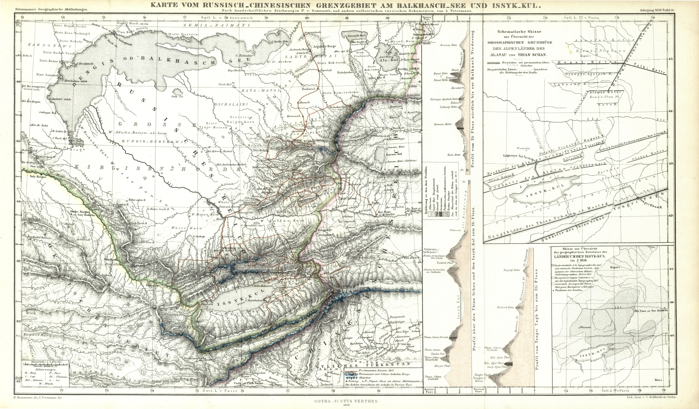

## Введение

Параллельно своим первых публикациям в Известиях РГО Семенов-Тян-Шанский (ППСТШ) отправил описание своего путешествия в Petermanns Geographische Mitteilungen (PGM), немецкий журнал, где публиковались многие важные географические открытия XIX и XX веков ([википедия](https://de.wikipedia.org/wiki/Petermanns_Geographische_Mitteilungen), [gtranslate](https://de-m-wikipedia-org.translate.goog/wiki/Petermanns_Geographische_Mitteilungen?_x_tr_sl=auto&_x_tr_tl=ru&_x_tr_hl=en&_x_tr_pto=wapp)). 

[Архив выпусков](https://zs.thulb.uni-jena.de/receive/jportal_jpjournal_00000817) PGM полностью опубликован сайте Университета Йены под разрешительными лицензиями PD, CC0, CC-BY-NC-SA.

Библиографическая ссылка для серии журналов:

Mittheilungen aus Justus Perthes' Geographischer Anstalt über wichtige neue Erforschungen auf dem Gesammtgebiete der Geographie / hrsg. von A. Petermann. - Gotha [u.a.] : Perthes, [1.]1855 - [14.]1868; 15.1869 - 24.1878
https://zs.thulb.uni-jena.de/receive/jportal_jpjournal_00000817

Вместе со статьей была опубликована и подробная карта путешествия.

## Статья

PGM начал выходить в 1850 г., один раз в год и статья ППСТШ с картой была опубликована в 9 номере в 1858 г. Под названием: P. v. Semenow's Erforschungsreisen in Inner-Asien im Jahre 1857, seine Aufnahme des Alpensee's Issyk-Kul und anderer Theile der nordwestlichen Russisch-Chinesischen Grenzländer bis zu den Gletschern des Thianschan-Gebirges.

перевод:

Исследования П. В. Семенова во Внутренней Азии в 1857 г., его обследование высокогорного озера Иссык-Куль и других частей северо-западного русско-китайского пограничья вплоть до ледников Тянь-Шаня.

[Ссылка на онлайн версию статьи](https://zs.thulb.uni-jena.de/rsc/viewer/jportal_derivate_00260680/ThULB_129489816_1858_Perthes_0358.tif) на сайте Университета Йены.

Библиографическая ссылка на статью:

P. v. Semenow's Erforschungsreisen in Inner-Asien im Jahre 1857, seine Aufnahme des Alpensee's Issyk-Kul und anderer Theile der nordwestlichen Russisch-Chinesischen Grenzländer bis zu den Gletschern des Thianschan-Gebirges. // Mittheilungen aus Justus Perthes' Geographischer Anstalt über wichtige neue Erforschungen auf dem Gesammtgebiete der Geographie / hrsg. von A. Petermann - Gotha [u.a.]: Perthes - 1858. Heft IX, pp. 351-369.

[Скачать полную версию](https://drive.google.com/file/d/1czz-Z18OGcRS9qzyzhYmazyWP1eEBrHV/view?usp=sharing), PDF, 13 Мб.

## Карта

Особое внимание в PGM уделялось картам. Сам Петерманн в первом номере пишет (перевод по [википедии](https://de-m-wikipedia-org.translate.goog/wiki/Petermanns_Geographische_Mitteilungen?_x_tr_sl=auto&_x_tr_tl=ru&_x_tr_hl=en&_x_tr_pto=wapp)):

> «Наши «Mitteilungen» (Сообщения) призваны отличаться от всех подобных изданий тем, что они обобщают и наглядно иллюстрируют конечные результаты новых географических исследований на тщательно подготовленных и чисто выполненных картах. Поэтому ни один выпуск нашего издания никогда не будет опубликован без одного или нескольких картографических приложений».

По всей видимости поэтому опубликованная в PGM карта оказалась гораздо более подробной, чем опубликованная в том же году в вестнике ИРГО или карта из второго тома мемуаров ([подробнее об этих картах](/notes/semenov-first-two-maps/))

Библиографическая ссылка на карту:

Karte vom Russisch-Chinesischen Grenzgebiet am Balkhasch-See und Issyk-Kul. Nach handschriftlichen Zeichnungen P.v. Semenow's. und andern authentischen russischen Dokumenten, von A. Petermann. // Mittheilungen aus Justus Perthes' Geographischer Anstalt über wichtige neue Erforschungen auf dem Gesammtgebiete der Geographie / hrsg. von A. Petermann, B. Hassenstein del. - Gotha [u.a.]: Perthes - 1858. Heft IX - Bd. 4. - T.16.

перевод:

Карта российско-китайской границы на озерах Балхаш и Иссык-Куль. По рукописным рисункам П.В. Семенова, и другим подлинным русскоязычным документам, А. Петерманн. // Отчеты Географического института Юстуса Пертеса о важных новых географических исследованиях / ред. А. Петерманна. - Гота [среди прочих]: Пертес - 1858. - 4 рис. - Карта 16.

[Скачать полную версию карты](https://drive.google.com/file/d/1nI9oUPwtjdqEUtO9X6tM38kdal4qSRVP/view?usp=sharing), PNG, 27 Мб.

[Ссылка на онлайн версию](https://zs.thulb.uni-jena.de/rsc/viewer/jportal_derivate_00260680/ThULB_129489816_1858_Perthes_0363.tif?logicalDiv=jportal_jparticle_00513934)

Иногда карты цитируются под следующими реестровыми номерами, почему их два и что они означают - не ясно. См. например тут: Э. Таммиксаар, Н. Г. Сухова. Август Петерман и Россия. ВИЕТ. 2015. № 1. С. 46–75.

* Kartensammlung Perthes. Erfurt. 547$111978203
* Kartensammlung Perthes. Erfurt. 547$112709915

## Комментарии

[**Обсудить**](https://t.me/answer42geo/79)