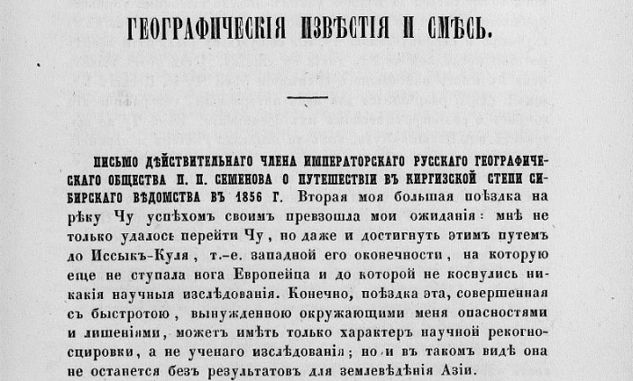
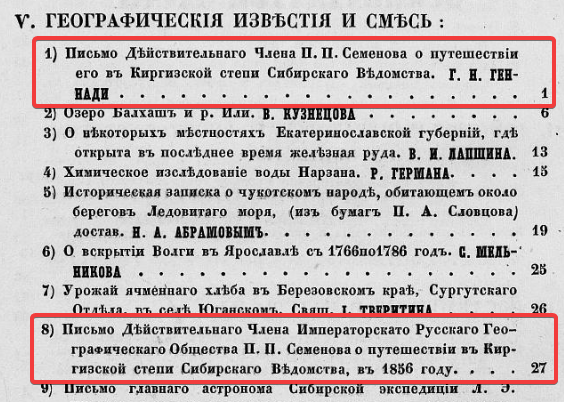

## Введение

Два письма являющиеся первыми материалами о путешествии Семенова опубликованы в Вестнике Императорского Русского географического общества. Ч. 18, 1856. Вестник целиком можно посмотреть на [сайте библиотеки РГО](https://elib.rgo.ru/handle/123456789/219058) или [скачать в виде PDF](https://drive.google.com/file/d/1pAkf_GDavm4fd8f10zuooIXW-najCqvf/view?usp=sharing).

Так же, как и «[Первая поездка на Тянь-Шань](/notes/semenov-first-report/)» 1858 г., оба письма упомянуты в списке основных трудов П.П. Семенова Тян-Шанского во втором томе мемуаров 2019. Однако, в отличие от первой поездки, текст писем в Том 2 почему-то не вошёл.

Первое письмо в оглавлении значится как письмо Г.Н. Геннади, который его получил или зачитывал его [Григорий Николаевич Геннади](https://ru.wikipedia.org/wiki/%D0%93%D0%B5%D0%BD%D0%BD%D0%B0%D0%B4%D0%B8,_%D0%93%D1%80%D0%B8%D0%B3%D0%BE%D1%80%D0%B8%D0%B9_%D0%9D%D0%B8%D0%BA%D0%BE%D0%BB%D0%B0%D0%B5%D0%B2%D0%B8%D1%87), член Русского Географического общества.

Здесь опубликован распознанный текст второго письма.

## Первое письмо: ссылки

Геннади Г.Н. Письмо действительного члена общества П. П. Семенова о путешествии его в Киргизской степи Сибирского ведомства. Алматы, или укрепление Верное, 18 сентября 1856 г. // Вестник Русского географического общества. Ч. 18. СПб., 1856. С. 1--6.

[PDF](https://drive.google.com/file/d/1_bgsFv3ayIsShNc0ST4uqBkXl4IZQYQ1/view?usp=sharing) --- фрагмент из Вестника только с текстом письма для удобства.

[Распознанный текст](https://docs.google.com/document/d/1CyQEqEPeOMRT_dQOy2VtJp3w6HTY2jYn/edit?usp=sharing&ouid=112245657670169384946&rtpof=true&sd=true) в старой орфографии.

[Распознанный текст](https://docs.google.com/document/d/1RtSG7zmVrspaFdYf68jitJZd5OT5Ol3s/edit?usp=sharing&ouid=112245657670169384946&rtpof=true&sd=true) в современной орфографии.

[Статья](/notes/semenov-first-letter/) с текстом первого письма.

## Второе письмо: ссылки

Письмо действительного члена Русского географического общества П. П. Семенова о путешествии его в Киргизской степи Сибирского ведомства в 1856 г. // Вестник Русского географического общества. Ч. 18. Кн. 6. СПб., 1856--1857. С. 27--30.

[PDF](https://drive.google.com/file/d/1UXcv-KIkvbY37dCRFbDDlh1Uqlsxk2w7/view?usp=sharing) --- фрагмент из Вестника только с текстом письма для удобства.

[Распознанный текст](https://docs.google.com/document/d/1ZSwB0dbLJ2llgxWLip718szklO2L1Fj8/edit?usp=sharing&ouid=112245657670169384946&rtpof=true&sd=true) в старой орфографии.

[Распознанный текст](https://docs.google.com/document/d/1BLM9rU2GnbbUFTvHsTkbPkhjaON-FVdn/edit?usp=sharing&ouid=112245657670169384946&rtpof=true&sd=true) в современной орфографии.

[Статья](/notes/semenov-second-letter/) с текстом второго письма.

## Второе письмо: текст в старой орфографии

**ВѢстникъ**

**ИМПЕРАТОРСКАГО**

**РУССКАГО ГЕОГРАФИЧЕСКАГО ОБЩЕСТВА,**

**ИЗДАВАЕМЫЙ**

**подъ редакціею Секретаря Общества**

***Е. И. Ламанскаго.***

**1856.**

**ЧАСТЬ ОСЬМНАДЦАТАЯ.**

**САНКТПЕТЕРБУРГЪ**

**ВЪ ТИПОГРАФІИ ЭДУАРДА ПРАЦА. 1856.**

**V.**

**ГЕОГРАФИЧЕСКІЯ ИЗВѢСТІЯ И СМѢСЬ.**

**ПИСЬМО ДѢЙСТВИТЕЛЬНАГО ЧЛЕНА ИМПЕРАТОРСКАГО РУССКАГО ГЕОГРАФИЧЕСКАГО ОБЩЕСТВА П. П. СЕМЕНОВА О ПУТЕШЕСТВІИ ВЪ КИРГИЗСКОЙ СТЕПИ СИБИРСКАГО ВѢДОМСТВА ВЪ 1856 Г.** Вторая моя большая поѣздка на рѣку Чу успѣхомъ своимъ превзошла мои ожиданія: мнѣ не только удалось перейти Чу, но даже и достигнуть этимъ путемъ до Иссыкъ-Куля, т.-е. западной его оконечности, на которую еще не ступала нога Европейца и до которой не коснулись никакія научныя изслѣдованія. Конечно, поѣздка эта, совершенная съ быстротою, вынужденною окружающими меня опасностями и лишеніями, можетъ имѣть только характеръ научной рекогносцировки, а не ученаго изслѣдованія; но и въ такомъ видѣ она не останется безъ результатовъ для землевѣдѣнія Азіи.

Изъ укрѣпленія Вѣрнаго (города Алматы) направился я прямо къ западу, слѣдуя верстъ 80 вдоль подошвы хребта Кунги-Алатау, черезъ рѣки: Алматинку, Аксай, Кескеленъ, Чемолганъ, Кара-Кестенъ и Кестенъ. Отъ послѣдней поворотилъ я къ югу, поднимаясь вверхъ ея теченія поперекъ понизившейся здѣсь ниже предѣловъ вѣчнаго снѣга горной цѣпи Кунги-Алатау , черезъ горный проходъ Суокъ-Тюбе. Пользуясь утреннимъ туманомъ, спустился я изъ дикаго ущелья, въ которомъ мы скрывались на ночлегѣ, въ Чуйскую долину, верстъ 20 выше коканскаго укрѣпленія Токмака, и вышелъ на р. Чу, въ томъ самомъ мѣстѣ, гдѣ

28

она дѣлаетъ крутой поворотъ, измѣняя свое юго-сѣверное направленіе въ востоко-западное. Съ этого пункта направился я вверхъ по Чу прямо къ югу, вдоль дикаго ущелья Буашъ, черезъ которое Чу съ трудомъ пробивается передъ выходомъ въ широкую долину, гдѣ расположены коканскія укрѣпленія Токмакъ и Пишпекъ. Отвѣсное паденіе скалъ праваго берега рѣки, преграждавшихъ путь мой, заставило меня перейти за Чу глубокимъ и опаснымъ бродомъ и слѣдовать вверхъ ея лѣвымъ берегомъ. Это обстоятельство помѣшало мнѣ выйти на р. Кебинъ, значительнѣйшій правый притокъ Чу, или, лучше сказать, сѣверную вѣтвь всей системы , которая, по моему расчету , должна была привести меня въ сердце Кунги-Алатау, откуда я уже могъ возвратиться въ Вѣрное какимъ-нибудь высокимъ горнымъ проходомъ. Но устье Кебина осталось для меня неприступнымъ за глубокою и стремительною Чу, и я вынужденъ былъ итти вверхъ по этой послѣдней черезъ дикія ея ущелья. Путь этотъ вывелъ меня къ мѣсту наибольшаго сближенія рѣки Чу съ Иссыкъ-Кулемъ , гдѣ и разрѣшился для меня интересный, географическій вопросъ о гидрографическомъ ихъ соединеніи. Рѣка Чу не вытекаетъ изъ Иссыкъ-Куля, какъ-то полагали Риттеръ и европейскіе географы. Она беретъ начало въ снѣгахъ Мустага, т.-е. продолженія Небеснаго хребта (Т'янь Шаня). Изъ порфировыхъ предгорій Небеснаго хребта выходитъ она на береговую долину Иссыкъ-Куля, въ 5 верстахъ отъ западнаго берега озера. Пяти- верстный промежутокъ, раздѣляющій рѣку отъ озера, представляетъ совершенную плоскость , едва наклоненную на востокъ къ Иссыкъ-Кулю. Но Чу встрѣчаетъ на западной своей сторонѣ несравненно болѣе наклонный скатъ продольной долины, въ которую она и устремляется съ силою, позволяющею ей пробиваться поперекъ южной цѣпи Кунги-Алатау черезъ ущелье Буашъ. Отъ изгиба Чу, въ Иссыкъ-Куль течетъ по слабо наклоненной плоскости узкій и неглубокій протокъ , имѣющій совершенно видъ искусственнаго или ирригаціоннаго канала и носящій названіе Кутемалды. Дикокаменные Киргизы сказывали мнѣ, что этотъ каналъ прорытъ, по преданію, очень давно, ихъ предками, желавшими отвести р. Чу въ озеро , но не достигнувшими своей цѣли. Никакой другой гидрографической связи между Чу и озеромъ Иссыкъ-Кулемъ не существуетъ.

На берегахъ озера очутился я посреди ауловъ воинственнаго племени Сара-Багишъ, которое еще нынѣшнею весною было въ кровавой распрѣ съ нашими вѣрноподданными Киргизами. Впрочемъ, появленіе мое посреди Дикокаменной Орды было такъ вне-

29

запно , что Кара-Киргизы не могли, еслибъ и хотѣли, успѣть приготовить враждебной встрѣчи, и приняли насъ очень хорошо, тѣмъ болѣе, что грабительскія сборе закета (дани, или подати) очень охладили Дикокаменную Орду къ Коканцамъ. На Кутемалдинскомъ прибрежьѣ Иссыкъ-Куля повѣрилъ я свои наблюденія надъ высотою озера и получилъ для обѣихъ оконечностей его тождественные результаты. Точной цифры, за неимѣніемъ гипсометрическихъ таблицъ, сообщить я не могу; но высота поверхности Иссыкъ-Куля превосходитъ 3,600 фут., между-тѣмъ, какъ укрѣпленіе Вѣрное на сѣверномъ склонѣ Кунги-Алатау имѣетъ не болѣе 1,900 фут. абсол. высоты. Иссыкъ-Куль есть, слѣдовательно, горное озеро, въ полномъ смыслѣ этого слова, занимающее высокое плоскогоріе между Кунги-Алатау и Небеснымъ хребтомъ и замкнутое со всѣхъ сторонъ горами.

Съ Иссыкъ-Куля возвратился я въ укрѣпленіе Вѣрное самымъ прямымъ путемъ (въ 130 верстъ) поперекъ хребта Кунги-Алатау, черезъ двѣ параллельныя его цѣпи. Черезъ южную перешелъ я проходомъ Дюренынь-Асы, далѣе спустился въ глубокую, продольную относительно оси хребта долину уже упомянутаго мной Кебина, раздѣляющую между собою обѣ цѣпи; затѣмъ поднялся на сѣверную цѣпь проходомъ Кебинынь-Асы и наконецъ спустился къ укрѣпленію Вѣрному прекрасною долиною Кескелена. Оба прохода были очень затруднительны и занесены снѣгомъ; а путь этотъ, самый близкій къ Иссыкъ-Кулю, въ первый разъ пробитъ русскою ногою.

Гидрографическая независимость р. Чу отъ Иссыкъ-Куля и странное соединеніе ея съ этимъ озеромъ; рѣка Кебинъ --- длинная сѣверная вѣтвь Чуйской системы, не означенная ни на какихъ картахъ; раздѣленіе хребта Кунги-Алатау на двѣ параллельныя цѣпи продольною долиною Кебина, наконецъ значительная высота Иссыкъ-Куля --- вотъ тѣ результаты, которые были для меня неожиданно интересными, географическими новостями, вполнѣ вознаграждающими за трудности и опасности пути. Картографія Заилійскаго края также чрезвычайно подвинулась въ-теченіе нынѣшняго лѣта: вся восточная половина озера Иссыкъ-Куля и земли, лежащія на востокъ отъ него до китайскихъ предѣловъ, были сняты инструментально топографами Отдѣльнаго Сибирскаго Корпуса, а западная половина озера и Чуйская долина---глазомѣрно, при моей поѣздкѣ. Такимъ-образомъ, очертаніе озера Иссыкъ-Куля и направленіе рѣкъ и горныхъ цѣпей въ Заиилійскомъ краѣ приняли видъ довольно различный отъ начертаній карты, составленной Я. В. Ханыковымъ съ распросной карты

30

Нифантьева. Ученая публика, конечно, немало удивится этой картографической метаморфозѣ, тѣмъ болѣе, что въ Европѣ принимаютъ до сихъ поръ карты Ханыкова и Нифантьева за съеемочныя; да и въ Россіи не всѣ знаютъ, что Нифантьевъ никогда не былъ на Иссыкъ-Кулѣ, а составилъ свою карту съ многочисленныхъ показаній Киргизовъ. При такомъ способѣ составленія, карта эта сдѣлана какъ нельзя лучше; но въ настоящее время передъ положительной съемкой интересъ ея исчезаетъ совершенно.

На возвратномъ пути изъ укрѣпленія Вѣрнаго мнѣ хотѣлось употребить съ пользою и мѣсяцъ октябрь, еще довольно хорошій въ этихъ южныхъ широтахъ. Принимая въ соображеніе важность для меня личнаго знакомства съ характеромъ китайскаго западнаго края, я рѣшился пробраться въ Кульджу на Или, столицу западныхъ провинцій Китая и резиденцію ихъ намѣстника (Цзянъ-Цзюна). Опасностей путешествія моего за Чу поѣздка эта не представляла, но была тѣмъ-не-менѣе сопряжена съ нѣкоторыми неудобствами. Въ-теченіе мѣсяца совершилъ я благополучно и это путешествіе, лично увидѣвъ интересный уголокъ Китая, хорошо населенный, хорошо обработанный характеристическимъ населеніемъ ссыльныхъ изъ Срединной Имперіи и военныхъ поселенцовъ изъ Монголіи.

**П. П. СЕМЕНОВЪ,**

Д.-Чл. Общ.

## Второе письмо: текст в современной орфографии

**Вестник**

**ИМПЕРАТОРСКОГО**

**РУССКОГО ГЕОГРАФИЧЕСКОГО ОБЩЕСТВА,**

**ИЗДАВАЕМЫЙ**

**под редакцией Секретаря Общества**

***Е. И. Ламанского.***

**1856.**

**ЧАСТЬ ВОСЕМНАДЦАТАЯ.**

**САНКТ ПЕТЕРБУРГ**

**ТИПОГРАФИЯ ЭДУАРДА ПРАЦА.**

**1856.**

**V.**

**ГЕОГРАФИЧЕСКИЕ ИЗВЕСТИЯ И СМЕСЬ.**

**ПИСЬМО ДЕЙСТВИТЕЛЬНОГО ЧЛЕНА ИМПЕРАТОРСКОГО РУССКОГО ГЕОГРАФИЧЕСКОГО ОБЩЕСТВА П. П. СЕМЕНОВА О ПУТЕШЕСТВИИ В КИРГИЗСКОЙ СТЕПИ СИБИРСКОГО ВЕДОМСТВА В 1856 Г.** Вторая моя большая поездка на реку Чу успехом своим превзошла мои ожидания: мне не только удалось перейти Чу, но даже и достигнуть этим путем Иссык-Куля, т.-е. западной его оконечности, на которую еще не ступала нога Европейца и до которой не коснулись никакие научные исследования. Конечно, поездка эта, совершенная с быстротой, вынужденной окружающими меня опасностями и лишениями, может иметь только характер научной рекогносцировки, а не ученого исследования; но и в таком виде она не останется без результатов для землеведения Азии.

Из укрепления Верного (города Алматы) направился я прямо к западу, следуя верст 80 вдоль подошвы хребта Кунги-Алатау, через реки: Алматинку, Аксай, Кескелен, Чемолган, Кара-Кестен и Кестен. От последней поворотил я к югу, поднимаясь вверх ее течения поперек понизившейся здесь ниже пределов вечного снега горной цепи Кунги-Алатау, через горный проход Суок-Тюбе. Пользуясь утренним туманом, спустился я из дикого ущелья, в котором мы скрывались на ночлеге, в Чуйскую долину, верст 20 выше коканского укрепления Токмака, и вышел на р. Чу, в том самом месте, где

28

она делает крутой поворот, изменяя свое юго-северное направление в восточно-западное. С этого пункта направился я вверх по Чу прямо к югу, вдоль дикого ущелья Буаш, через которое Чу с трудом пробивается перед выходом в широкую долину, где расположены коканские укрепления Токмак и Пишпек. Отвесное падение скал правого берега реки, преграждавших путь мой, заставило меня перейти за Чу глубоким и опасным бродом и следовать вверх ее левым берегом. Это обстоятельство помешало мне выйти на р. Кебин, значительнейший правый приток Чу, или, лучше сказать, северную ветвь всей системы, которая, по моему расчету, должна была привести меня в сердце Кунги-Алатау, откуда я уже мог возвратиться в Верное каким-нибудь высоким горным проходом. Но устье Кебина осталось для меня неприступным за глубокой и стремительной Чу, и я вынужден был идти вверх по этой последней через дикие ее ущелья. Путь этот вывел меня к месту наибольшего сближения реки Чу с Иссык-Кулем, где и разрешился для меня интересный, географический вопрос о гидрографическом их соединении. Река Чу не вытекает из Иссык-Куля, как-то полагали Риттер и европейские географы. Она берет начало в снегах Мустага, т.-е. продолжения Небесного хребта (Т'янь Шаня). Из порфировых предгорий Небесного хребта выходит она на береговую долину Иссык-Куля, в 5 верстах от западного берега озера. Пятиверстный промежуток, разделяющий реку от озера, представляет совершенную плоскость, едва наклоненную на восток к Иссык-Кулю. Но Чу встречает на западной своей стороне несравненно более наклонный скат продольной долины, в которую она и устремляется с силой, позволяющею ей пробиваться поперек южной цепи Кунги-Алатау через ущелье Буаш. От изгиба Чу, в Иссык-Куль течет по слабо наклоненной плоскости узкий и неглубокий проток, имеющий совершенно вид искусственного или ирригационного канала и носящий название Кутемалды. Дикокаменные Киргизы сказывали мне, что этот канал прорыт, по преданию, очень давно, их предками, желавшими отвести р. Чу в озеро, но не достигнувшими своей цели. Никакой другой гидрографической связи между Чу и озером Иссык-Кулем не существует.

На берегах озера очутился я посреди аулов воинственного племени Сара-Багиш, которое еще нынешнею весной было в кровавой распре с нашими верноподданными Киргизами. Впрочем, появление мое посреди Дикокаменной Орды было так вне-

29

запно, что Кара-Киргизы не могли, если бы и хотели, успеть приготовить враждебной встречи, и приняли нас очень хорошо, тем более, что грабительские сборы закета (дани, или подати) очень охладили Дикокаменную Орду к Коканцам. На Кутемалдинском прибрежье Иссык-Куля поверил я свои наблюдения над высотой озера и получил для обеих оконечностей его тождественные результаты. Точной цифры, за неимением гипсометрических таблиц, сообщить я не могу; но высота поверхности Иссык-Куля превосходит 3,600 фут., между-тем, как укрепление Верное на северном склоне Кунги-Алатау имеет не более 1,900 фут. абсол. высоты. Иссык-Куль есть, следовательно, горное озеро, в полном смысле этого слова, занимающее высокое плоскогорие между Кунги-Алатау и Небесным хребтом и замкнутое со всех сторон горами.

С Иссык-Куля возвратился я в укрепление Верное самым прямым путем (в 130 верст) поперек хребта Кунги-Алатау, через две параллельные его цепи. Через южную перешел я проходом Дюренынь-Асы, далее спустился в глубокую, продольную относительно оси хребта долину уже упомянутого мной Кебина, разделяющую между собой обе цепи; затем поднялся на северную цепь проходом Кебинынь-Асы и наконец спустился к укреплению Верному прекрасной долиной Кескелена. Оба прохода были очень затруднительны и занесены снегом; а путь этот, самый близкий к Иссык-Кулю, в первый раз пробит русской ногой.

Гидрографическая независимость р. Чу от Иссык-Куля и странное соединение ее с этим озером; река Кебин --- длинная северная ветвь Чуйской системы, не означенная ни на каких картах; разделение хребта Кунги-Алатау на две параллельные цепи продольной долиной Кебина, наконец значительная высота Иссык-Куля --- вот те результаты, которые были для меня неожиданно интересными, географическими новостями, вполне вознаграждающими за трудности и опасности пути. Картография Заилийского края также чрезвычайно подвинулась в-течение нынешнего лета: вся восточная половина озера Иссык-Куля и земли, лежащие на восток от него до китайских пределов, были сняты инструментально топографами Отдельного Сибирского Корпуса, а западная половина озера и Чуйская долина---глазомерно, при моей поездке. Таким-образом, очертание озера Иссык-Куля и направление рек и горных цепей в Заилийском крае приняли вид довольно различный от начертаний карты, составленной Я. В. Ханыковым с распросной карты

30

Нифантьева. Ученая публика, конечно, немало удивится этой картографической метаморфозе, тем более, что в Европе принимают до сих пор карты Ханыкова и Нифантьева за съемочные; да и в России не все знают, что Нифантьев никогда не был на Иссык-Куле, а составил свою карту с многочисленных показаний Киргизов. При таком способе составления, карта эта сделана как нельзя лучше; но в настоящее время перед положительной съемкой интерес ее исчезает совершенно.

На возвратном пути из укрепления Верного мне хотелось употребить с пользой и месяц октябрь, еще довольно хороший в этих южных широтах. Принимая в соображение важность для меня личного знакомства с характером китайского западного края, я решился пробраться в Кульджу на Или, столицу западных провинций Китая и резиденцию их наместника (Цзян-Цзюна). Опасностей путешествия моего за Чу поездка эта не представляла, но была тем-не-менее сопряжена с некоторыми неудобствами. В-течение месяца совершил я благополучно и это путешествие, лично увидев интересный уголок Китая, хорошо населенный, хорошо обработанный характеристическим населением ссыльных из Срединной Империи и военных поселенцев из Монголии.

**П. П. СЕМЕНОВ,**

Д.-Чл. Общ.

## Комментарии

[**Обсудить**](https://t.me/answer42geo/41)
