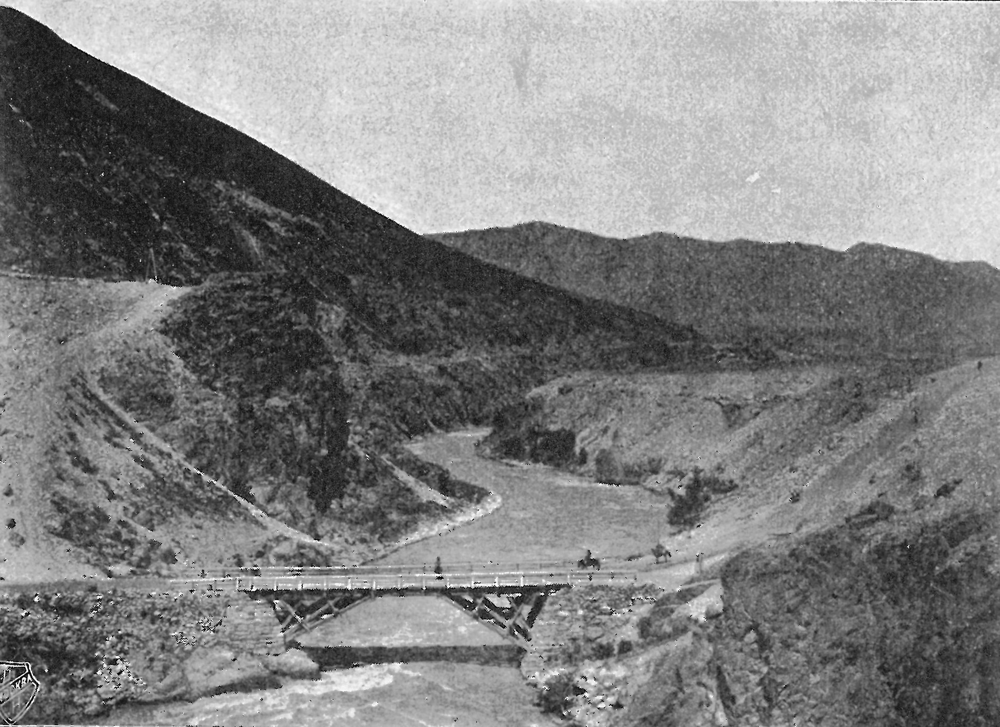

## Введение

Остатки моста располагаются на въезде в Боомское (Буамское) ущелье, 123 км от Бишкека ([Yandex Maps](https://yandex.com/maps/?ll=75.241687%2C42.833898&mode=routes&rtext=42.875969%2C74.603701~42.691838%2C75.877648&rtt=auto&ruri=ymapsbm1%3A%2F%2Fgeo%3Fdata%3DCgk3NzEyOTAxMjUSItCa0YvRgNCz0YvQt9GB0YLQsNC9LCDQkdC40YjQutC10LoiCg0YNZVCFf6AK0I%2C~&z=10.53)), в 1 км от впадения в р. Чу р. Чон-Кемин, ниже по течению. Рядом с современным мостом через р. Чу. В 1884 г. мост назван «Семёновским» в честь П.П. Семёнова-Тян-Шанского генерал-губернатором Семиреченской области Г.А. Колпаковским ([вики](https://ru.wikipedia.org/wiki/%D0%9A%D0%BE%D0%BB%D0%BF%D0%B0%D0%BA%D0%BE%D0%B2%D1%81%D0%BA%D0%B8%D0%B9,_%D0%93%D0%B5%D1%80%D0%B0%D1%81%D0%B8%D0%BC_%D0%90%D0%BB%D0%B5%D0%BA%D1%81%D0%B5%D0%B5%D0%B2%D0%B8%D1%87)). Предыдущее название моста --- Интендантский (возможно). Построен в 1873 г.

Семёнов был в районе моста в 1856 г. В мемуарах Семёнова-Тян-Шанского мост не упоминается.

## Письмо Колпаковского --- Семёнову

Из письма Степного генерал-губернатора Г.А. Колпаковского, посланном П.П. Семёнову в апреле 1884 года (так же см. [статью](https://www.rgo.ru/ru/article/pp-semyonov-tyan-shanskiy-imya-na-karte-mira) А.А. Богданова «П.П. Семёнов-Тян-Шанский. Имя на карте мира»):

> Руководясь чувствами истинного уважения к учёным заслугам Вашего превосходительства, я приказал в память посещения Вами Буамского ущелья, устроенный в нём через р. Чу мост наименовать «Семёновским».

Оригинал письма найден в архиве РГО старшим научным сотрудником Музея-усадьбы П.П. Семенова-Тян-Шанского А.А. Богдановым и публикуется с его разрешения.

Полный текст письма:

> Апреля 1884 года
>
> Г. Омск.
>
> Его Прев-ству П.П. Семенову
>
> Милостивый государь, многоуважаемый Петр Петрович.
>
> Глубоко интересуясь научными исследованиями Семиреченского края, состоящего более 20 лет под моим управлением, я не могу не вспомнить о том, что Вы были одним из первых ученых путешественников, проникших в этот край и внесших в науку основные географические понятия об этой части Центральной Азии. Руководствуясь чувствами истинного уважения к этим ученым заслугам Вашего Превосходительства, я приказал в память посещения Вами известного Буамского ущелья, устроенный в нем через р. Чу мост наименовать «Семеновским» и имею честь при сем препроводить, для собственной Вашей библиотеки, два альбома фотографических видов и типов Семиречья, составленные в целях распространения сведений об этой далёкой окраине государства.
> Покорнейше прошу принять уверение в совершенном моем почтении и преданности, с каковыми имею честь быть Вашим покорнейшим слугою.
> 
> Г. Колпаковский.

## Где мост

Координаты: 75.8779 в.д., 42.6917 с.ш. ([OpenStreetMap](https://www.openstreetmap.org/#map=16/42.69237/75.87701), [Google Maps](https://maps.app.goo.gl/ipGiMrow9FFtHHGJ6)). Высота: 1283 метров над уровнем моря.

## На современных фотографиях

Фото: Азат Аламанов (23.10.2024).

Хорошо видны пазы для деревянных балок --- опор моста (быков).

### На картинах

*Буамское ущелье в районе Интендантского моста через реку Чу. Худ. С.Животовский* из статьи В.Н.Проскурина «Сергей Животовский. Грани творчества между Севером и Югом» ([ссылка](https://vernoye-almaty.kz/studies/zhivotovskiy.shtml?ysclid=m2mtj3o42e490863399))

> Затем путника встретило ущелье глубокой и бурной реки Чу, пересечённое построенными военными инженерами мостами Интендантским и Семёновским (в честь одного из первопроходцев края учёного Петра Петровича Семёнова, известного нам как Семёнов-Тян-Шанский).

Нужно обратить внимание, что в статье Проскурина Интендантский и Семёновский мост --- не одно и то же.

Картина Животовского явно сделана по следующему фото.

Подпись: Семиречье. Боомское ущелье (?). Неизвестный фотограф. 1890-е гг.

По [разным мнениям](https://vk.com/semirechieverny?z=photo-201278678_457239749%2Falbum-201278678_00%2Frev) фото принадлежит Полю Лаббе (Путешествие по Сибири и Туркестану с 15 мая по 15 ноября 1897 года) или Абраму Лейбину.

## На архивных фотографиях --- основные

По всей видимости самое раннее фото. Направление съемки с востока на запад. Деревянные опоры. Кирпичных быков еще нет.

Подпись: Семиреченская область. Семеновский мост на р. Чу. Фото 1880 г.

Подпись: ин. N 1941 Семиреческая область. Семеновский мост на р. Чу.

Фото того же периода, по всей видимости зеркально отраженное по вертикали, в этом случае направление съемки тоже с востока на запад.

Комментарий из источника: Семёновский мост через реку Чу в Боомском ущелье. Фотография А.И. Туполева. 1890-е гг. Из коллекции Томского областного краеведческого музея имени М.Б.Шатилова.

Меньше охват по сравнению с предыдущим фото. но видно переоборудование моста, каменные быки и дорога по левому берегу.

А.И. Туполев --- преподаватель Томского Алексеевского реального училища, далее отставной чиновник Александр Иванович Туполев живший в Верном ([фотографии Туполева](https://starinariy.kz/photos/category/12/album/42)).

Фото [из статьи](https://www.rgo.ru/ru/article/pp-semyonov-tyan-shanskiy-imya-na-karte-mira) А.А. Богданова «П.П. Семёнов-Тян-Шанский. Имя на карте мира».

> Видовой снимок: деревянный мост через реку, текущую среди гор. Фото наклеено на паспарту, заключено в двойную золотую рамку; под фото аннотация в 2 строки черной тушью. На обороте фиолетовый штамп.
>
> Период создания: последняя треть XIX в.
>
> Локация: Российская империя, Семиреченская обл.
>
> Источник: 1923. Передача
>
> Авторы: Креков Н. А.
>
> Дата регистрация объекта в музее: 1953-06-30
>
> Музей: [Бюджетное учреждение культуры Омской области "Омский государственный историко-краеведческий музей" (БУК "ОГИК музей")](https://archivogram.top/museum/2173-byudzhetnoe_uchrezhdenie_kulytury_omskoy_oblasti_omskiy_gosudarstvennyy_istoriko-kraevedcheskiy_muzey)

Фото с нового ракурса, появляется упоминание топонима Джиль-арык и гидрометрической части.

Подпись: Р. Чу в Буамском ущелье близ ст. Джиль-арык. Семеновский мост. (Фот. Гидрометрической части в Туркестане).

Подпись: Мост Семёнова в Боомском ущелье. 1890-е гг. Неизвестный фотограф.

### На архивных фотографиях --- дополнительные

Несколько фото, которые предположительно могут быть тоже про мост и его окрестности, но не 100%.

Не похоже ни по рельефу, ни по подходам к мосту. Но также совсем непохоже на Красный мост. Возможно из-за того, что мост на большом удалении

Подпись: Семиреческая область. Мост на реке Чу в Буамском ущелье.

Подпись: Семиреченская область. Пишпекский уезд. Мост на реке Чу в Боомском ущелье. Фотограф Н.А.Креков. 1894 г.

Тот же район, приближаясь к мосту.

Подпись: Долина реки Чу. Фотография А.И.Туполева. Верный. Конец XIX века.

Стереофото окрестностей р. Чу у Семеновского моста (предположительно). Самого моста не видно, по рельефу неоднозначно. Было выставлено на продажу на Мешке. Лот с фото на Мешке удалён, есть [страница в кэше](https://yandexwebcache.net/yandbtm?fmode=inject&tm=1729706425&tld=ru&lang=ru&la=1648495232&text=семеновский+мост+река+чу&url=https%3A//meshok.net/item/137010706_%25D0%25A0%25D0%2595%25D0%259A%25D0%2590_%25D0%25A7%25D0%25A3_%25D0%25A3_%25D0%25A1%25D0%2595%25D0%259C%25D0%2595%25D0%259D%25D0%259E%25D0%2592%25D0%25A1%25D0%259A%25D0%259E%25D0%2593%25D0%259E_%25D0%259C%25D0%259E%25D0%25A1%25D0%25A2%25D0%2590_1912_%25D0%2593%25D0%259E%25D0%2594%25D0%2590_%25D0%25A1%25D0%25A2%25D0%2595%25D0%25A0%25D0%2595%25D0%259E_%25D0%25A4%25D0%259E%25D0%25A2%25D0%259E&l10n=ru&mime=html&sign=5f1e4e6ad538f3eab3422071e3d2f9f3&keyno=0) Яндекса.

Подпись: №145342. Река Чу у Семеновского моста 1912 г. Фот. Е.Е. Скорнякова

### Интернет говорит

[Казбек Кожиев, НБ Новости Бишкека](https://m.ok.ru/group/53303302291559/topic/153401671203687)

> На вьезде в Боомское ущелье есть остатки старого деревянного моста через р.Чу .Этот мост строил Семенов-Тяньшанский и имел название "Семеновский мост".
> ...
> Далее так называемый "Красный мост"через реку Чу, который получил свое название из за маленькой речушки впадающей в р.Чу которая окрашивала всю реку Чу в красный цвет во время дождя.

Семеновский мост строил не Семенов-Тян-шанский и судя по современным фото он был разрушен уже явно не деревянным. Но в остальном все верно. Семеновский мост и Красный мост, старое название --- Краснооктябрьский ([Google Maps](https://www.google.com/maps/@42.5974513,75.8150734,572m/data=!3m1!1e3?entry=ttu&g_ep=EgoyMDI0MTAyMC4xIKXMDSoASAFQAw%3D%3D)) иногда путают, это два разных моста, первый ближе к Бишкеку, второй - посередине Боомского ущелья.

Пример подобной путаницы ([отсюда](https://ok.ru/kirgizskay/topic/151972068893501)):

> Административной границей между ними является мост, переброшенный через реку в средней части ущелья, по которому дорога переходит на правый берег и который ещё по старой привычке называют Краснооктябрьским, «Красным  мостом». Деревянный «прадедушка» этого моста был построен в 1873 году, когда через Боом прокладывали первую узкоколейную дорогу, и назывался он поначалу Интендантским, потом Семёновским.

Часто мост и одноименный порог на р. Чу упоминается в отчетах сплавщиков.

[Отчет о водном походе по рекам Чон-Кемин, Чу, Киргизия, Северный Тянь-Шань. август 1996.](http://taganok.ru/central_asia/r-chon-kemin-kirgiziya-avgust-1996-tehotchet/?ysclid=m2k33ng9pn552531711)

> По р.Чу нужно пройти около 30 км до плотины перед п.Быстровка. Средний уклон участка 4 м/км. После слияния Чу и Чон-Кемина остается одно серьезное препятствие на маршруте --- порог «Семеновский мост». Он расположен под мостом через р.Чу ниже впадения Чон-Кемина, за левым поворотом. Порог не сложный, но очень мощный. Струя наваливает на левую опору моста, затем, после мощной бочки, на большие камни, расположенные в русле в шахматном порядке. 

### Дальше

* Сделать фото остатков моста в том же ракурсе, что и старые фото
* Разобраться с дополнительными фото, тоже поискать ракурсы на месте
* Понять связь Интендантского и Семеновского моста, информация противоречивая

## Комментарии

[**Обсудить**](https://t.me/answer42geo/47)
