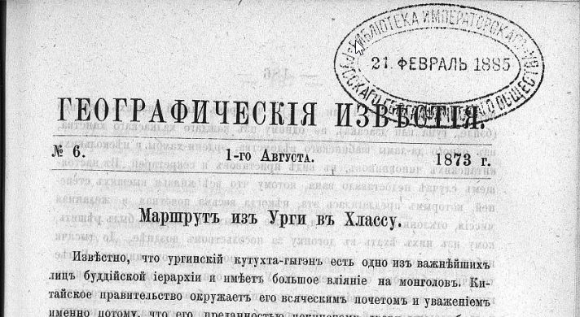

## Введение

Подробно о том кто такой Шишмарев и Джебзун-Дамба-хутухта описано в [отдельном материале](/notes/shishmarev-1873-original/). Там же можно найти PDF оригинальной статьи.

Здесь приводится распознанный и отредактированный текст в современной орфографии.

Скачать статью в распознанном и отредактированном виде можно с [Google Drive](https://docs.google.com/document/d/10v0vwlyKkOkl9DO8yu3gAkCAAEgXHH7e/edit?usp=sharing&ouid=112245657670169384946&rtpof=true&sd=true).

## Текст статьи

ИЗВЕСТИЯ

ИМПЕРАТОРСКОГО

РУССКОГО ГЕОГРАФИЧЕСКОГО ОБЩЕСТВА,

ЗА 1873 ГОД.

ИЗДАННЫЕ ПОД РЕДАКЦИЕЮ

СЕКРЕТАРЕЙ ОБЩЕСТВА

ГРАФА К. Ф. ЛИТКЕ (№ 1 — 3).

и

М. И. ВЕНЮКОВА (№ 4 - 10).

ТОМ IX.

С.-ПЕТЕРБУРГ.

В ТИПОГРАФИИ В БЕЗОБРАЗОВА И КОМП.

(Вас. остр. 8 л., № 45)

1873.

Маршрут из Урги в Хлассу.

Известно, что ургинский кутухта-гыгэн есть одно из важнейших лиц буддийской иерархии и имеет большое влияние на монголов. Китайское правительство окружает его всяческим почетом и уважением именно потому, что его преданностью пекинскому двору много обеспечивается спокойствие Монголии. Когда один кутухта умирает, или, как думают ламаиты, перерождается, тогда обыкновенно спешат отыскать его преемника, т. е. лицо, в которое переселилась душа покойного хубилгана. и разумеется, что новый кутухта всегда есть младенец. По заведенному китайскою политикою обычаю, этот младенец родится в Тибете и там получает признание своего иерархического сана от далай-ламы, после чего уже отправляется в Ургу. Для принятия его от далай-ламы и для сопровождения в Халку, монголы отправляют большое посольство, которое и следует до Хлассы и обратно по определенному маршруту. Этот маршрут установлен китайским правительством после долгих и тщательных изысканий на всем пространстве от берегов Толы до средоточия Тибета и изменению подлежать не может без особенно важных причин. Не смотря на то, что посольства за кутухтою нередки, он однакоже до сего времени оставался неизвестным, и только недавно доставлен в азиатский департамент ургинским консулом, нашим почтенным сочленом, Я. П. Шишмаревым. Барон Ф. Р. Остен-Сакен имел благосклонность сообщить его редакции „Известий", и он приводится здесь вместе с некоторыми подробностями о посольстве, которое ныне путешествует из Урги в Хлассу, и с указаниями на Гюка, прошедшего значительную часть той же дороги.
Секр. Общ.

Посольство за кутухтою, который не мог быть привезен из Тибета в Ургу в течение слишком четырех лет, по случаю волнений в Гань-су и в южной Монголии, возбужденных дунганами, отправилось наконец в путь 24 ч. прошлого марта. По закону оно состоит

— 186 —

из одного вана (кн. 1 или 2 ст.) и четырех князей низших степеней (бэйле, гуна или дзасака), по одному из каждого халкаского ханства, из одного да-ламы шабинского ведомства, эрдени-хамбы и нескольких китайских чиновников, в виде приставов и секретарей. В настоящем случае недоставало вана, потому что все князья высших степеней, которым предлагалась эта, некогда весьма почетная и желанная миссия, отклонили ее от себя, и уже богдыхан должен был решить, кому из них ехать в догонку за посольством позднее. До тысячи набожных монголов присоединились к посольству охотниками. Более тысячи верблюдов отправлено из Урги с одним походным дворцом гыгэна, с продовольствием для переднего и обратного пути посольства и с подарками далай-ламе, баньчаню-богдо и другим знатным ламам, ибо в Хлассу, как и в Рим, являться с пустыми руками не принято. На эти подарки халкасские монголы собрали значительную сумму и даже ургинские китайцы пожертвовали блюдо, 1000 лан серебра и несколько кусков шелковых тканей.

Экспедиция отправилась на Алашань-ванское княжество и оттуда на Кукэнор, через гор. Чжон-лан, р. Дайтун, горр. Синин и Дуба. В странах, где дунганское восстание еще не вполне подавлено, приказано давать ей прикрытие от китайских войск, а кроме того для конвоирования назначено 40 монгольских солдат, при офицере. Дабы доставить монголам их духовного вождя, приказано посольству поспешить возвращением к концу текущего китайского года, т. е., по нашему, к февралю будущего 1874 г. Вспомнив, что от Урги до Хлассы расстояние достигает 3,250 верст, и путь очень труден, можно сказать, что пекинское правительство возложило на посольство задачу очень нелегкую.

Весь путь разделяется на три части: 1) от Урги до стойбища Алашанского князя, 2) от этого стойбища до Кукэнора, 3) от Кукэ-нора до Хлассы. Первая часть ведет по землям халкаских монголов и представляет три дороги, из которых официальная — средняя. Но как она в настоящее время не вполне безопасна, то посольству разрешено идти по восточной. На средней, т. е. главной, места ночлегов установленные китайским правительством, суть следующия:

1) Чжиргаланту, во владении князя На-бейсэ.

2) Буху, во владении князя На-бейсэ.

3) Холбо, во владении князя О-вана.

4) Харца-Бурда, во владении князя О-вана.

— 187 —

5) Боро-хучжир, на землях Уйцзан-гуна.

6) Улан-хошу, на землях Уйцзан-гуна.

7) Укэр-хаша, на землях Уйцзан-гуна.

8) Сангин-далай.

9) Арайн-гурбаны-худук.

10) Цабчир. Станция большого улясутайского тракта.

11) Далай-сонги.

12) Онгиин-гол.

13) Местечко Уныгэту. Тотчас по переезде горы Индыл-хан-ула.

14) Хария-Дересу.

15) Хонин-доло.

16) Куримту.

17) Булак.

18) Сэрун-булак. Ключ.

19) Улан-тойрон.

20) Худук.

21) Тала.

22) Ихэ-Дзаха.

23) Улан Ирге-сомо. Граница Халки.

24 — 25) По территории княжества Ород-домдо-гуна два или три дня пути.

26 — 30) По владениям Алашанского вана до его стойбища пять дней.

Но теперешнее посольство отправилось в Алашань по дороге, проходящей несколько восточнее, именно: пройдя по княжеству На-бейсэ, оно продолжало следование по границе княжеств Цыцэн-бейсэ и Уйдзан-гуна, по землям Це-дзасака, Мерген-вана, границею Ород-домдо-гуна и Дзун-гуна и далее по Алашаньским владениям, до стойбища тамошнего князя.

Есть еще третья дорога через Халку, ведущая прямо в Кукэ-нор, именно от местечка Уныгэту (13) на запад, через горы Гурбан-Саихан, на магометанское село Тялцзин-мучжан, заставу Шохай-кэу, город Будай, город Ганьчжур-хото, местечко Шара-тюба, Битыр-кэу, город Шоуцзан, р. Дайтун-мурэнь и через хребет Долон-даба на Кукэнор.

Вторая часть пути из Урги в Хлассу ведет через земли Алашаньского князя, от его стойбища, до озера Кукэнора. Ночлеги, предписанные посольству, суть следующие:

31) Тосон-даба. Степь; есть колодец и ключ.

32) Сергэ-элису, т. е. Песочная гора: вода из колодцев.

— 188 —

33) Ихэ-тунгу; место кочковатое.

34) Долон-худук. Перед станциею переезжают пески Тэнгри-илису, т. е. Песчаное море. На станции место кочковатое.

35) Чилу-онгоцо. Граница Монголии с Гань-су. Колодец.

36) Сан-эн-цзин. Великая стена, застава. Место гористое.

37) Суншан-дашун. Здесь около гор есть ламайский монастырь. Вода получается из колодцев. Место считается территорией Анду (т. е. Амдо).

38) Чжонлон-хото. Маленький китайский городок, в котором стоит небольшой отряд солдат.

39) Дабанай-ара. Северная покатость большого хребта, лежащего по северную сторону р. Дайтун.

40) Р. Дайтун. Перевалив хребет на юг, ночуют на берегу р. Дайтун, у перевоза.

41) Тенгри-даба. От южного берега р. Дайтуна начинается большой хребет Тенгри-даба, переехав через который, ночуют у южной подошвы его.

42) Ямбай-хото. Небольшой городок, в котором есть отряд китайских солдат.

43) Максан-хла. Небольшой ламайский монастырь, на обрыве горы; протекает речка.

44) Город Синин-фу. Около города переправа через р. Хуан-шуй по мосту, называемому Тенгри-гур, т. е. Небесный мост.

45) Дуба, маленький татарский городок.

46) Донгор или Даньгор. В 50 ли от Дуба; отсюда в 10 ли граница кукэнорского ведомства.

47) Цонгу; речка.

48) Оз. Кукэнор. К нему приезжают через небольшой хребет Кэрэ-хутул. Остановка посольства делается или на р. Хара-гол или в местечке Усун-Шибэ, окруженном болотами, посреди которых находится прекрасный луг.

На Кукэ-норе посольство останавливается довольно долго, чтобы провести жаркое время, подкормить верблюдов и другой скот. Здесь же оставляют лишних верблюдов, телеги и тяжести, нужные на обратный путь в Ургу. Для склада служит крепостца Кырмы, принадлежащая князю Хоули-бейсэ и обнесенная стеною, в длину и ширину по 70 саж.

Третья часть дороги посольства есть путь от Кукэ-нора до Хлассы. Отправясь с места стоянки и переехав реку Ихэ-Улан, экспедиция делает остановки в следующих местах:

— 189 —

49) Бага-Улан.

50) Чжиримтай, протока от р. Чжиримтая; ночлег неподалеку от берега реки Богой-гала.

51) Дынчжин.

52) Нукуту-даба; на южной стороне хребта этого имени.

53) Долон-кид, т. е. семь монастырей.

54) Сэргэй; ключи и грязь.

55) Балангатай, речка.

56) Далан-туру; речка, место грязное.

57) Цайдан-баин-гол, речка.

58) Граница двух из 33-х кукэнорских дзасаков, именно западного Буинту-дзасака и восточного Ундзан-дзасака.

59) Северная покатость хребта Шугэй. От границы двух дзасаков есть две дороги, сходящияся у хребта, именно первая, восточная, через гору Бурхан-богдо, а вторая, 
западная, в объезд этой горы, идет берегом реки Баланантай.

60) Гуняй-гардза, урочище по южную сторону хребта Шугэй и речки того же имени. — С переходом через этот хребет страна делается совершенно пустынною, т. е. не 
имеет никаких жителей, ни оседлых, ни кочевых; самая почва не считается принадлежащею кому-нибудь и лишь после хребта Ушигэ, т. е. через 19 переходов, снова появляется население, уже тибетского ведомства. В этих местах водятся дикие яки, дикие ослы, сохатые, аргали, степные козы и пр. (*).

61) На один день пути южнее Гуняй-гардза.

62) Гора Бухуй-цаган; ночлег у подошвы ея, на берегу небольшого озера.

63) Ключ Солонго-хонгор.

64) Куйтун-шара; ночлег у ключа.

65) Южная подошва хребта Баян-хара, который на этом переходе переваливают.

66) Цаган-оботу. В этот день переезжают довольно большую и быструю реку Галдзур-Улан-мурень, без сомнения приток Ян-цзе-кьяна.

(*) Уже от Си-нин-фу настоящий маршрут совпадает с путем Гюка, у которого и описываются некоторые урочища, совершенно под теми же названиями, напр. Бурхан-богдо, Шухэй и т. п. Это обстоятельство придает особый интерес маршруту и вместе с названиями некоторых местностей в Монголии, положение которых уже известно (напр. Цапчира) позволяет проложить па карту всю эту <посольскую> дорогу более или менее правильно. Ред.

— 190 —

67) Цаган-тологой, (*) недалеко от реки Мур-усу (у Гюка Муруй-усу, Ян-цзе-кьян).

68) Бурхан бусу.

69) Около горы Лама-тологой.

70) Куку-чилу. Река Мур-усу.

71) Думбыр. Река Мур-усу.

72) Озеро Индэри-нор, небольшое.

73) Нубчиту-Улан-мурень, приток Мур-усу; около реки болотистые места.

74) Мур-усу; привал на ее берегу, за перевалом через гору Бохуманай.

75) Гора Адаг-Харцаг, после переправы через Мур-усу.

76) Речка у подошвы горы Дунда-Харцага.

77) Северная подошва хребта Ушигэ.

78) Горячие ключи на южной стороне хребта Ушигэ (упоминаемые Гюком, который называет хребет Тан-лайскими горами). Здесь начинают встречаться кочевые племени Юншуба и вместе владения Хлассы.

79) Бундзе-шил.

80) Букгэй-гол, речка; кочевья племен Дзамари и Дзак, занимающихся скотоводством.

81) Озеро Цулмара; граница Тибета.

82) Нанчжу, по-монгольски Хара-усу, речка. Население оседлое (тоже у Гюка).

83) Ур. Ярманы; на пути переезжают речку Нанчжу. Путь колесный, как и далее, до Хлассы.

84) Речка Лалун-гарбу.

85) Санчжун.

86) Чоиндон-дярба, по-монгольски Найман-субурга.

87) Ладун.

88) Хлахандун.

89) Пундо.

90) Северная подошва хребта Чагада.

91) Сынчжчу-дзон.

92) Чжара-чамо.

93) Ган-ду.

94) Хласса.

(*) Место Цаган-тологой замечательно для монголов тем, что туг помер пятый ургинский кутухта-гыгэн, на 25 году от рода, по время своего путешествия в Хлассу, при чем спутники его разбежались, кто назад в Ургу, кто в Тибет.

— 191 —

Я. П. Шишмарев, опытный в деле степных странствований, полагает, что караваны делают по Монголии до 40 верст в день, в горах же не более 30. Соответственно этому он определяет всю длину пути от Урги до Хлассы въ 3,250 верст, что, вероятно, очень недалеко от истины, так как расстояние между этими городами, через Синин-фу и Кукэнор, по прямымъ линиям на карте равно 2,500 верст.

## Комментарии

[**Обсудить**](https://t.me/answer42geo/64)
