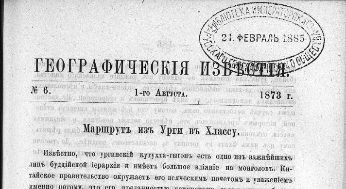

## Введение

Шишмарёв, Яков Парфеньевич — консул и генеральный консул в Урге с 1864 по 1904 г. ([википедия](https://ru.wikipedia.org/wiki/%D0%A8%D0%B8%D1%88%D0%BC%D0%B0%D1%80%D1%91%D0%B2,_%D0%AF%D0%BA%D0%BE%D0%B2_%D0%9F%D0%B0%D1%80%D1%84%D0%B5%D0%BD%D1%8C%D0%B5%D0%B2%D0%B8%D1%87)), покровитель и помощник путешественников, знаток Монголии, дипломат, ученый. Кроме всего прочего, оставил детальное описание маршрута посольства отправленного в 1873 из Урги в Лхасу за Джебдзун-Дамба-хутухтой (восьмым Богдо-гэгэном).

Богдо-гэгэн ([википедия](https://ru.wikipedia.org/wiki/%D0%91%D0%BE%D0%B3%D0%B4%D0%BE-%D0%B3%D1%8D%D0%B3%D1%8D%D0%BD)) — третье, после Далай-ламы и Панчен-ламы, лицо в тибетском буддизме, реинкарнирует в Тибете и спустя несколько лет (надо дать ребенку подрасти и окрепнуть) из Урги за ним в Лхасу отправляется большое посольство (сотни паломников), чтобы забрать и привезти в Ургу.

**Интересный вопрос, совпадает ли маршрут посольства из Урги в Лхасу с [маршрутом Цыбикова](/notes/tsybikov-map/)?**

Следовал ли последний по проторенному паломническому пути, насколько они совпадают в деталях. Нам хорошо известно где шел Цыбиков и теперь нужно наложить на его маршрут — маршрут посольства.

Хотя что-то можно сказать просто глядя на топонимы, здесь четкого ответа на этот вопрос нет. Для начала приводим дешифрированный первоисточник —  статью в Известиях ИРГО материал для которой предоставил Шишмарев. Статья детально описывает маршрут по которому согласно указаниям китайского правительства должно двигаться посольство. Упоминается 96 топонимов.

Шишмарев Я.П. Маршрут из Урги в Хлассу // Известия ИРГО. 1873. Т. IX. № 6. стр. 449

* [Онлайн-библиотека РГО](https://elib.rgo.ru/safe-view/123456789/219553/1/UnVQUkxJQjEyMDQ3MjU5LnBkZg==)
* [PDF](https://drive.google.com/file/d/1bUEpBxWpF8ggZQ2WxTOH0MHEyPS08nQZ/view?usp=sharing)
* [Google Doc](https://docs.google.com/document/d/16ad9qjfxZsHpo_F9ngl6i6-FFVmirMyN/edit?usp=sharing&ouid=112245657670169384946&rtpof=true&sd=true)
* [Текст в современной орфографии](https://m-d.me/notes/shishmarev-1873-modern/)

## Текст в исходной орфографии

ИЗВЪСТІЯ

ИМПЕРАТОРСКАГО

РУССКАГО ГЕОГРАФИЧЕСКАГО ОБЩЕСТВА,

ЗА 1873 ГОДЪ.

ИЗДАННЫЯ ПОДЪ РЕДАКЦІЕЮ

СЕКРЕТАРЕЙ ОБЩЕСТВА

ГРАФА К. Ѳ. ЛИТКЕ (№ 1 — 3).

и

М. И. ВЕНЮКОВА (№ 4 — 10).

ТОМЪ IX.

С.-ПЕТЕРБУРГЪ.

ВЪ ТИПОГРАФІИ В БЕЗОБРАЗОВА И КОМП.

(Вас. остр. 8 л., № 45)

1873.

**Маршрутъ изъ Урги въ Хлассу.**

Извѣстно, что ургинскій кутухта-гыгэнъ есть одно изъ важнѣйшихъ лицъ буддійской іерархіи и имѣетъ большое вліяніе на монголовъ. Китайское правительство окружаетъ его всяческимъ почетомъ и уваженіемъ именно потому, что его преданностью пекинскому двору много обезпечивается спокойствіе Монголіи. Когда одинъ кутухта умираетъ, или, какъ думаютъ ламаиты, перерождается, тогда обыкновенно спѣшатъ отыскать его преемника, т. е. лицо, въ которое переселилась душа покойнаго хубилгана. и разумѣется, что новый кутухта всегда есть младенецъ. По заведенному китайскою политикою обычаю, этотъ младенецъ родится въ Тибетѣ и тамъ получаетъ признаніе своего іерархическаго сана отъ далай-ламы, послѣ чего уже отправляется въ Ургу. Для принятія его отъ далай-ламы и для сопровожденія въ Халку, монголы отправляютъ большое посольство, которое и слѣдуетъ до Хлассы и обратно по опредѣленному маршруту. Этотъ маршрутъ установленъ китайскимъ правительствомъ послѣ долгихъ и тщательныхъ изысканій на всемъ пространствѣ отъ береговъ Толы до средоточія Тибета и измѣненію подлежать не можетъ безъ особенно важныхъ причинъ. Не смотря на то, что посольства за кутухтою нерѣдки, онъ однакоже до сего времени оставался неизвѣстнымъ, и только недавно доставленъ въ азіатскій департаментъ ургинскимъ консуломъ, нашимъ почтеннымъ сочленомъ, Я. П. Шишмаревымъ. Баронъ Ѳ. Р. Остенъ-Сакенъ имѣлъ благосклонность сообщить его редакціи „Извѣстій", и онъ приводится здѣсь вмѣстѣ съ нѣкоторыми подробностями о посольствѣ, которое нынѣ путешествуетъ изъ Урги въ Хлассу, и съ указаніями на Гюка, прошедшаго значительную часть той же дороги.

Секр. Общ.

Посольство за кутухтою, который не могъ быть привезенъ изъ Тибета въ Ургу въ теченіе слишкомъ четырехъ лѣтъ, по случаю волненій въ Гань-су и въ южной Монголіи, возбужденныхъ дунганами, отправилось наконецъ въ путь 24 ч. прошлаго марта. По закону оно состоитъ

— 186 —

изъ одного вана (кн. 1 или 2 ст.) и четырехъ князей низшихъ степеней (бэйле, гуна или дзасака), по одному изъ каждаго халкаскаго ханства, изъ одного да-ламы шабинскаго вѣдомства, эрдени-хамбы и нѣсколькихъ китайскихъ чиновниковъ, въ видѣ приставовъ и секретарей. Въ настоящемъ случаѣ недоставало вана, потому что всѣ князья высшихъ степеней, которымъ предлагалась эта, нѣкогда весьма почетная и желанная миссія, отклонили ее отъ себя, и уже богдыханъ долженъ былъ рѣшить, кому изъ нихъ ѣхать въ догонку за посольствомъ позднѣе. До тысячи набожныхъ монголовъ присоединились къ посольству охотниками. Болѣе тысячи верблюдовъ отправлено изъ Урги съ однимъ походнымъ дворцомъ гыгэна, съ продовольствіемъ для передняго и обратнаго пути посольства и съ подарками далай-ламѣ, баньчаню-богдо и другимъ знатнымъ ламамъ, ибо въ Хлассу, какъ и въ Римъ, являться съ пустыми руками не принято. На эти подарки халкасскіе монголы собрали значительную сумму и даже ургинскіе китайцы пожертвовали блюдо, 1000 ланъ серебра и нѣсколько кусковъ шелковыхъ тканей.

Экспедиція отправилась на Алашань-ванское княжество и оттуда на Кукэноръ, чрезъ гор. Чжонъ-ланъ, р. Дайтунъ, горр. Сининъ и Дуба. Въ странахъ, гдѣ дунганское возстаніе еще не вполнѣ подавлено, приказано давать ей прикрытіе отъ китайскихъ войскъ, а кромѣ того для конвоированія назначено 40 монгольскихъ солдатъ, при офицерѣ. Дабы доставить монголамъ ихъ духовнаго вождя, приказано посольству поспѣшить возвращеніемъ къ концу текущаго китайскаго года, т. е., по нашему, къ февралю будущаго 1874 г. Вспомнивъ, что отъ Урги до Хлассы разстояніе достигаетъ 3,250 верстъ, и путь очень труденъ, можно сказать, что пекинское правительство возложило на посольство задачу очень нелегкую.

Весь путь раздѣляется на три части: 1) отъ Урги до стойбища Алашанскаго князя, 2) отъ этого стойбища до Кукэнора, 3) отъ Кукэ-нора до Хлассы. Первая часть ведетъ по землямъ халкаскихъ монголовъ и представляетъ три дороги, изъ которыхъ оффиціальная — средняя. Но какъ она въ настоящее время не вполнѣ безопасна, то посольству разрѣшено идти по восточной. На средней, т. е. главной, мѣста ночлеговъ установленныя китайскимъ правительствомъ, суть слѣдующія:

1) Чжиргаланту, во владѣнии князя На-бейсэ.

2) Буху, во владѣнии князя На-бейсэ.

3) Холбо, во  владѣніи князя О-вана.

4) Харца-Бурда, во  владѣніи  князя О-вана.

— 187 —

5) Боро-хучжиръ, на земляхъ Уйцзанъ-гуна.

6) Уланъ-хошу, на земляхъ Уйцзанъ-гуна.

7) Укэръ-хаша, на земляхъ Уйцзанъ-гуна.

8) Сангинъ-далай.

9) Арайнъ-гурбаны-худукъ.

10) *Цабчиръ.* Станція большаго улясутайскаго тракта.

11) Далай-сонги.

12) Онгіинъ-голъ.

13) Мѣстечко Уныгэту. Тотчасъ по переѣздѣ горы Индылъ-ханъ-ула.

14) Харія-Дересу.

15) Хонинъ-доло.

16) Куримту.

17) Булакъ.

18) Сэрунъ-булакъ. Ключь.

19) Уланъ-тойронъ.

20) Худукъ.

21) Тала.

22) Ихэ-Дзаха.

23) Уланъ Ирге-сомо. Граница Халки.

24 — 25) По территоріи княжества Ородъ-домдо-гуна два или три дня пути.

26 — 30) По владѣніямъ Алашанскаго вана до его стойбища пять дней.

Но теперешнее посольство отправилось въ Алашань по дорогѣ, проходящей нѣсколько восточнѣе, именно: пройдя по княжеству На-бейсэ, оно продолжало слѣдованіе по границѣ княжествъ Цыцэнъ-бейсэ и Уйдзанъ-гуна, по землямъ Це-дзасака, Мергенъ-вана, границею Ородъ-домдо-гуна и Дзунъ-гуна и далѣе по Алашаньскимъ владѣніямъ, до стойбища тамошняго князя.

Есть еще третья дорога черезъ Халку, ведущая прямо въ Кукэ-норъ, именно отъ мѣстечка Уныгэту (13) на западъ, черезъ горы Гурбанъ-Саиханъ, на магометанское село Тялцзинъ-мучжанъ, заставу Шохай-кэу, городъ Будай, городъ Ганьчжуръ-хото, мѣстечко Шара-тюба, Битыръ-кэу, городъ Шоуцзанъ, р. Дайтунъ-мурэнь и чрезъ хребетъ Долонъ-даба на Кукэноръ.

Вторая часть пути изъ Урги въ Хлассу ведетъ чрезъ земли Алашаньскаго князя, отъ его стойбища, до озера Кукэнора. Ночлеги, предписанные посольству, суть слѣдующіе:

1)  Тосонъ-даба. Степь; есть колодезь и ключь.

2)  Сергэ-элису, т. е. Песочная гора: вода изъ колодцевъ.

— 188 —

33) Ихэ-тунгу; мѣсто кочковатое.

34) Долонъ-худукъ. Передъ станціею переѣзжаютъ пески Тэнгри-илису, т. е. Песчаное море. На станціи мѣсто кочковатое.

35) Чилу-онгоцо. Граница Монголіи съ Гань-су. Колодезь.

36) Санъ-энъ-цзинъ. Великая стѣна, застава. Мѣсто гористое.

37) Суншанъ-дашунъ. Здѣсь около горъ есть ламайскій монастырь. Вода получается изъ колодцевъ. Мѣсто считается территоріей Анду (т. е. Амдо).

38) Чжонлонъ-хото. Маленькій китайскій городокъ, въ которомъ стоитъ небольшой отрядъ солдатъ.

39) Дабанай-ара. Сѣверная покатость большаго хребта, лежащаго по сѣверную сторону р. Дайтунъ.

40) Р. Дайтунъ. Переваливъ хребетъ на югъ, ночуютъ на берегу р. Дайтунъ, у перевоза.

41) Тенгри-даба. Отъ южнаго берега р. Дайтуна начинается большой хребетъ Тенгри-даба, переѣхавъ чрезъ который, ночуютъ у южной подошвы его.

42) Ямбай-хото. Небольшой городокъ, въ которомъ есть отрядъ китайскихъ солдатъ.

43) Максанъ-хла. Небольшой ламайскій монастырь, на обрывѣ горы; протекаетъ рѣчка.

44) Городъ *Сининъ-фу.* Около города переправа черезъ р. Хуанъ-шуй по мосту, называемому Тенгри-гуръ, т. е. Небесный мостъ.

45) Дуба, маленькій татарскій городокъ.

46) Донгоръ или Даньгоръ. Въ 50 ли отъ Дуба; отсюда въ 10 ли граница кукэнорскаго вѣдомства.

47) Цонгу; рѣчка.

48) *Оз. Кукэноръ.* Къ нему пріѣзжаютъ чрезъ небольшой хребетъ Кэрэ-хутулъ. Остановка посольства дѣлается или на р. Хара-голъ или въ мѣстечкѣ Усунъ-Шибэ, окруженномъ болотами, посреди которыхъ находится прекрасный лугъ.

На Кукэ-норѣ посольство останавливается довольно долго, чтобы провести жаркое время, подкормить верблюдовъ и другой скотъ. Здѣсь же оставляютъ лишнихъ верблюдовъ, телѣги и тяжести, нужныя на обратный путь въ Ургу. Для склада служитъ крѣпостца Кырмы, принадлежащая князю Хоули-бейсэ и обнесенная стѣною, въ длину и ширину по 70 саж.

Третья часть дороги посольства есть путь отъ Кукэ-нора до Хлассы. Отправясь съ мѣста стоянки и переѣхавъ рѣку Ихэ-Уланъ, экспедиція дѣлаетъ остановки въ слѣдующихъ мѣстахъ:

— 189 —

49) Бага-Уланъ.

50) Чжиримтай, протока отъ р. Чжиримтая; ночлегъ неподалеку отъ берега рѣки Богой-гала.

51) Дынчжинъ.

52) Нукуту-даба; на южной сторонѣ хребта этого имени.

53) Долонъ-кидъ, т. е. семь монастырей.

54) Сэргэй; ключи и грязь.

55) Балангатай, рѣчка.

56) Даланъ-туру; рѣчка, мѣсто грязное.

57) Цайданъ-баинъ-голъ, рѣчка.

58) Граница двухъ изъ 33-хъ кукэнорскихъ дзасаковъ, именно западнаго Буинту-дзасака и восточнаго Ундзанъ-дзасака.

59) Сѣверная покатость хребта Шугэй. Отъ границы двухъ дзасаковъ есть двѣ дороги, сходящіяся у хребта, именно первая, восточная, чрезъ гору Бурханъ-богдо, а вторая, западная, въ объѣздъ этой горы, идетъ берегомъ рѣки Баланантай.

60) Гуняй-гардза, урочище по южную сторону хребта Шугэй и рѣчки того же имени. — Съ переходомъ чрезъ этотъ хребетъ страна дѣлается совершенно пустынною, т. е. не имѣетъ никакихъ жителей, ни осѣдлыхъ, ни кочевыхъ; самая почва не считается принадлежащею кому-нибудь н лишь послѣ хребта Ушигэ, т. е. чрезъ 19 переходовъ, снова появляется населеніе, уже тибетскаго вѣдомства. Въ этихъ мѣстахъ водятся дикіе яки, дикіе ослы, сохатые, аргали, степныя козы и пр. (\*).

61) На одинъ день пути южнѣе Гуняй-гардза.

62) Гора Бухуй-цаганъ; ночлегъ у подошвы ея, на берегу небольшаго озера.

63) Ключъ Солонго-хонгоръ.

64) Куйтунъ-шара; ночлегъ у ключа.

65) Южная подошва хребта Баянъ-хара, который на этомъ переходѣ переваливаютъ.

66) Цаганъ-оботу. Въ этотъ день переѣзжаютъ довольно большую и быструю рѣку Галдзуръ-Уланъ-мурень, безъ сомнѣнія притокъ Янъ-цзе-кьяна.

(\*) Уже отъ Си-нинъ-фу настоящій маршрутъ совпадаетъ съ путемъ Гюка, у котораго и описываются нѣкоторыя урочища, совершенно подъ тѣми же названіями, напр. Бурханъ-богдо, Шухэй и т. п. Это обстоятельство придаетъ особый интересъ маршруту и вмѣстѣ съ названіями нѣкоторыхъ мѣстностей въ Монголіи, положеніе которыхъ уже извѣстно (напр. Цапчира) позволяетъ проложить па карту всю эту <посольскую> дорогу болѣе или менѣе правильно. *Ред.*

— 190 —

67) Цаганъ-тологой, (\*) недалеко отъ рѣки Муръ-усу (у Гюка Муруй-усу, Янъ-цзе-кьянъ).

68) Бурханъ бусу.

69) Около горы Лама-тологой.

70) Куку-чилу. Рѣка Муръ-усу.

71) Думбыръ. Рѣка Муръ-усу.

72) Озеро Индэри-норъ, небольшое.

73) Нубчиту-Уланъ-мурень, притокъ Муръ-усу; около рѣки болотистыя мѣста.

74) Муръ-усу; привалъ на берегу ея, за переваломъ чрезъ гору Бохуманай.

75) Гора Адагъ-Харцагъ, послѣ переправы чрезъ Муръ-усу.

76) Рѣчка у подошвы горы Дунда-Харцага.

77) Сѣверная подошва хребта Ушигэ.

78) Горячіе ключи на южной сторонѣ хребта Ушигэ (упоминаемые Гюкомъ, который называетъ хребетъ Танъ-лайскими горами). Здѣсь начинаютъ встрѣчаться кочевыя племени Юншуба и вмѣстѣ владѣнія Хлассы.

79) Бундзе-шилъ.

80) Букгэй-голъ, рѣчка; кочевья племенъ Дзамари и Дзакъ, занимающихся скотоводствомъ.

81) Озеро Цулмара; граница Тибета.

82) Нанчжу, по-монгольски Хара-усу, рѣчка. Населеніе осѣдлое (Тоже у Гюка).

83) Ур. Ярманы; на пути переѣзжаютъ рѣчку Нанчжу. Путь колесный, какъ и далѣе, до Хлассы.

84) Рѣчка Лалунъ-гарбу.

85) Санчжунъ.

86) Чоиндонъ-дярба, по-монгольски Найманъ-субурга.

87) Ладунъ.

88) Хлахандунъ.

89) Пундо.

90) Сѣверная подошва хребта Чагада.

91) Сынчжчу-дзонъ.

92) Чжара-чамо.

93) Ганъ-ду.

94) Хласса.

(*) Мѣсто Цаганъ-тологой замѣчательно для монголовъ тѣмъ, что тугъ померъ пятый ургинскій кутухта-гыгэнъ, на 25 году отъ рода, по время своего путешествія въ Хлассу, при чемъ спутники его разбѣжались, кто назадъ въ Ургу, кто въ Тибетъ.

— 191 —

Я. П. Шишмаревъ, опытный въ дѣлѣ степныхъ странствованій, полагаетъ, что караваны дѣлаютъ но Монголіи до 40 верстъ въ день, въ горахъ же не болѣе 30. Соотвѣтственно этому онъ опредѣляетъ всю длину пути отъ Урги до Хлассы въ 3,250 верстъ, что, вѣроятно, очень недалеко отъ истины, такъ какъ разстояніе между этими городами, чрезъ Сининъ-фу и Кукэноръ, по прямымъ линіямъ на картѣ равно 2,500 верстъ.

## Комментарии

[**Обсудить**](https://t.me/answer42geo/62)
