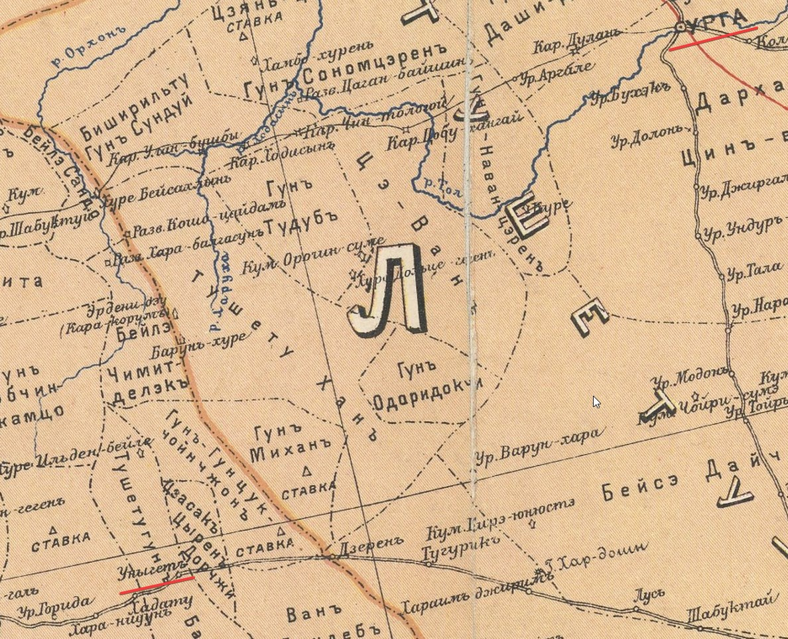
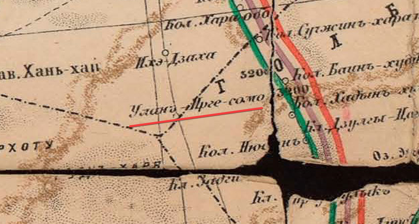

## Введение

В 1873 за Джебдзун-Дамба-хутухтой (восьмым Богдо-гэгэном) из Урги в Лхасу [отправилось монгольское посольство](https://m-d.me/notes/shishmarev-1873-original/). Доклад о маршруте посольства был подготовлен Я.П. Шишмаревым и представлен в Известия Императорского Русского Географического общества бароном Ф. Р. Остен-Сакеном. Посольство следовало по предписанному китайскими властями маршруту и одним из интересных вопросов является то, насколько этот маршрут совпадал с маршрутом Урга-Лхаса других паломников, например [Цыбикова](/notes/tsybikov-map/), [Норзунова](/notes/norzunov-route/) или [Джунгруева](/notes/jungruev-toponyms/).

В описании упоминается три варианта маршрута: средний (главный), восточный и западный. В описании подробно расписан средний, однако он не был выбран посольством из-за дунганских волнений в южной Монголии. Восточный и западный упоминаются кратко. В результате посольство двигалось по самому коротко описанному второму, восточному маршруту.

В этой статье разобран участок маршрута от Урги до стойбища Алашанского князя и проведена работа по первичному разбору топонимов и попытка их локализации на современных картах. Статья нуждается в доработке.

## Источники

* Шишмарев Я.П. [Маршрут из Урги в Хлассу](https://m-d.me/notes/shishmarev-1873-original/) // Известия ИРГО. 1873. Т. IX. № 6. стр. 449
* [Карта Коростовца-Котвича](https://ru.m.wikipedia.org/wiki/%D0%A4%D0%B0%D0%B9%D0%BB:Map_of_Mongolia_(1914)_Korostovets,_Ilyin%27s_Cartographic_Establishment.jpg). Котвич В. Л. Краткий обзор истории и современного политического положения Монголии : Прил. к карте Монголии, сост. по данным б. Рос. уполномоченного в Урге И.Я. Коростовца / Вл. Котвич. - Санкт-Петербург : Картогр. заведение А. Ильина, 1914. - 44 с., 4 л. ил.
* [Карта Стэнфорда](https://archive.org/details/cu31924023258241/page/n67/mode/2up). Stanford, Edward, 1856-1917 (China Inland Mission). Complete atlas of China : containing separate maps of the eighteen provinces of China proper and of the four great dependencies. Mongolia. 1:7500000, p.67-68
* [Карта Пржевальского](https://rusneb.ru/catalog/000199_000009_010791015/?ysclid=m8fi132aib753458998). Отчетная карта четырёх путешествий Н. М. Пржевальского по Центральной Азии. — [Б. м., 188-]. — 1 л. : : цв. : 58×89 см. Карта из издания «Пржевальский, Н.М. От Кяхты на истоки Желтой реки, исследование северной окраины Тибета и путь через Лоб-Нор по бассейну Тарима: Четвертое путешествие в Центральной Азии», которое было выпущено в 1888 году и посвящено последней экспедиции Николая Михайловича Пржевальского по Центральной Азии в 1883-1885 гг.

## Маршрут 1 - средний, главный

| #  | Топоним             | Комментарий                                                         |
|----|---------------------|---------------------------------------------------------------------|
| 1  | Чжиргаланту         | ур. Джиргаланты, одна их первых станций от Урги на тракте Урга - Сайр-усу                                                                                         |
| 2  | Буху                | карта Пржевальского                                                 |
| 3  | Холбо               | карта Пржевальского                                                 |
| 4  | Харца-Бурда         | карта Пржевальского                                                 |
| 5  | Боро-хучжир         | карта Пржевальского                                                 |
| 6  | Улан-хошу           | карта Пржевальского                                                 |
| 7  | Укэр-хаша           | карта Пржевальского                                                 |
| 8  | Сангин-далай        | карта Пржевальского                                                 |
| 9  | Арайн-гурбаны-худук | карта Пржевальского                                                 |
|    | Индыл-хан-ула       | гора                                                                |
| 10 | Цабчир              | Станция большого улясутайского тракта. Saptschir на карте Стэнфорда |
| 11 | Далай-сонги         | Станция на реке Онгийн гол                                          |
| 12 | Онгиин-гол          | Онгийн гол (Карта Стэнфорда: Ongin gol)                             |
| 13 | Уныгэту             | Уныгету. Станция на юг после Далай-сонги.                           |
| 14 | Хария-Дересу        | следующая станция на юг, карта Пржевальского                        |
| 15 | Хонин-доло          | Хонин-ло, карта Пржевальского                                       |
| 16 | Куримту             | карта Пржевальского                                                 |
| 17 | Булак               |                                                                     |
| 18 | Сэрун-булак         |                                                                     |
| 19 | Улан-тойрон         | возможно Улан-худук, карта Пржевальского                            |
| 20 | Худук               | карта Пржевальского                                                 |
| 21 | Тала                | карта Пржевальского                                                 |
| 22 | Ихэ-Дзаха           | карта Пржевальского                                                 |
| 23 | Улан Ирге-сомо      | карта Пржевальского                                                 |
| 24 — 25 | Ород-домдо-гун | По территории княжества Ород-домдо-гуна два или три дня пути.       |
| 26 — 30 | Алашанский ван | По владениям Алашанского вана до его стойбища пять дней.            |

### Чжиргаланту

Шишмарев:

> 1\. Чжиргаланту, во владении князя На-бейсэ.

Чжиргаланту, ур. Джиргаланты (Карта Коростовца-Котвича, ур. - урочище), Shirgalantu (Карта Стэнфорда). Пер. с монг. счастливый, радостный, удачный.

Одна из первых станций от Урги на тракте Урга - Сайр-усу. Расположена во владении князя На-бейсэ. Упоминается, что по этим же владениям начинается маршрут 2 - восточный.

.")

На Google Maps - Dzhirgalanty.

### Буху -> Арайн-гурбаны-худук

> 2\. Буху, во владении князя На-бейсэ.
> 3\. Холбо, во владении князя О-вана.
> 4\. Харца-Бурда, во владении князя О-вана.
>
>— 187 —
>
> 5\. Боро-хучжир, на землях Уйцзан-гуна.
> 6\. Улан-хошу, на землях Уйцзан-гуна.
> 7\. Укэр-хаша, на землях Уйцзан-гуна.
> 8\. Сангин-далай.
> 9\. Арайн-гурбаны-худук.

Пункты между Чжиргаланту и Цабчир: Буху, Холбо, Харца-Бурда, Боро-хучжир, Улан-хошу, Укэр-хаша, Сангин-далай, Арайн-гурбаны-худук есть на карте Пржевальского. Пункты по всей видимости является станциями на ветке почтового тракта соединяющей Улясутайское направление и ветку на Сайр-усу.

На картах Стэнфорда и Коростовца-Котвича нет ни одного из этих пунктов.

### Боро-хучжир

Боро-хучжир (Боро хучжир) упоминается у Е.Ф. Тимковского.

Тимковский, Егор Федорович (1790-1875). Путешествие в Китай через Монголию в 1820-1821 годах [Электронный ресурс] : с чертежами и рисунками. Ч. 1 : Переезд до Пекина. - Санкт-Петербург, 1824 (2014). - XVIII, 388 с., 1 л. карт. [Библиотека РГО, без карты](https://elib.rgo.ru/handle/123456789/218702), [Vostlit, текст](https://vostlit.info/Texts/Dokumenty/China/XIX/1820-1840/Timkovskij_E_F_II/text14.htm), [НЭБ, с картой](https://rusneb.ru/catalog/000199_000009_005418487/?ysclid=m8g7s4kp4g482138187).

> Цзангин, самый услужливый, провожавший миссию через две станции, Бумбату и Боро хучжир, лежащие в Хошуне Цзасака Чжонона, побыв у меня, не мог не рассказать нам своих народных басен: он уверял, что на горе Дархан и теперь хранится наковальня Чингиса, сделанная из металла бурына – имеющего свойство и железа и меди, т.е. вместе и твердого, и гибкого и следовательно упругого. А там на горе Тоно, о коей сказано выше [на стран.187], стоящей на берегу реки Херулюна, находится тоно или дымная труба от той достопамятной юрты, в коей первоначально жил и где созрел Чингис – сей любимый герой у большей части народов Сердней Азии. В память ему Чжонон Цзасак приносит жертву летом на горе Тон; а Гун Ахай, во владениях коего находятся станции Шибету и следующая Шара шороту, исполняет сей обряд на горе Дархан (стр 202).

Но это другая станция Боро хучжир - на тракте Урга-Пекин, идущем в юго-восточном, а не юго-западном направлении.

### Сангин-далай

Шишмарев:

> 8\. Сангинъ-далай.

Есть на Яндекс-картах в совпадающей с картой Пржевальского локацией под названием Сангийн-Далай.

Этот же пункт на 5 км - Эрдэнэ-далай, на Google Maps - Эрдэнэдалай.

### Цабчир

Шишмарев:

> 10\. Цабчир. Станция большого улясутайского тракта.

Станции нет на карте Коростовца-Котвича, но есть на карте Стэнфорда под названием Saptschir.

.")

На Google maps в подходящем месте есть фонетически схожий топоним Ch'a-p'u-ch'ih-erh (Chapuchiherh).

### Далай-сонги

Станция на реке Онгийн гол.

### Онгиин-гол

Станция Онгийн есть на тракте Сайр-усу-Улясутай, отмечена на карте Стэнфорда (Ongiin) и находится на реке (Ongin gol) по тракту восточнее Уныгэту и Хадату. На карте Коростовца - нет. Станция Хадату упоминается у [Норзунова](/notes/norzunov-route/).

.").

Несмотря на это, это не она. Судя по Уныгэту (далее) и Далай-сонги здесь упоминается одонименная станция на юг от Далай-сонги.

### Уныгэту

Шишмарев:
> Местечко Уныгэту. Тотчас по переезде горы Индыл-хан-ула.

үнэг — монг. "лиса".

Есть станция на тракте Сайр-усу-Улясутай (карта Стэнфорда), интересно, что сразу за ней находится станция Хадату, [упоминаемая у Норзунова](/notes/norzunov-route/). Восточнее нее располагается пункт Онгиин-гол (на одноименной реке).

Однако, хоть и похоже, это не то Уныгету. На это указывает расположение станции Далай-сонги и карта Пржевальского.

В Уныгэту маршрут продолжается строго на юг в сторону Хария-Дересу.

Согласно карте Пржевальского Уныгету располагается на северной оконечности озера Олон-нор (олон нуур - "множество озёр") в которое впадает река Онгийн-гол. В подходящем районе есть урочище на месте соленых озер с фонетически близкие названием Улан-Нор (монг. "красный"). По всей видимости на генштабе искаженное название.

Населенного пункта с похожим названием обнаружить не удалось. Из подходящих по положению Мандал-Обо (5 км).

### Хария-Дересу

Харiя-дерису на карте Пржевальского.

### Хонин-доло

Шишмарев:

> 15\. Хонин-доло.

По дороге есть два фонетически близких топонима в GNS: Hanaiin Doloon Hudag и Hanaiin Tsagaan Subarga Hiid. Располагаются в 25 км друг от друга и по всей видимости относятся к одной местности Hanaiin (Хонин). Потенциальный недостаток этих топонимов в том, что они находятся относитель далеко от гор Гурбан-Сайхат (60-70 км).

Хонин-доло на карте Пржевальского показан в горах или предгорьях Гурбан-Сайхат.

На 5 км. протяженный с запада на восток хребет Гурван Сайхан и урочище Гурван-Сайханы Ар в предгорьях хребтов Дунд-Сайхны-Нуру и Дзун-Сайхны-Нуру, часть Гобийского Алтая. Эти хребты путешественником пришлось либо преодолеть через перевалы, либо обойти с востока в районе совр. поселка Далан-Дзагдад.

### Куримту -> Ихэ-Дзаха

Шишмарев:

> 16\. Куримту.
>
> 17\. Булак.
>
> 18\. Сэрун-булак. Ключь.
>
> 19\. Улан-тойрон.
>
> 20\. Худук.
>
> 21\. Тала.
>
> 22\. Ихэ-Дзаха.

Хонин-ло, Куримту, Худук, Тала, Ихэ-Дзаха - пункты на карте Пржевальского соединенные дорогой.

Булак, Сэрун-булак - не найдены.

Улан-тойрон (монг. Красный круг), возможно Улан-худук, есть на карте Пржевальского по той же дороге, совпадает по порядку.

### Уланъ Ирге-сомо

Шишмарев:

> 24\. Улан Ирге-сомо. Граница Халки.

Граница Внешней Монголии (Халха, Халка) и пункт указаны на карте Пржевальского.

### Ород-домдо-гун

Не топоним.

Шишмарев:

> 24 — 25. По территории княжества Ород-домдо-гуна два или три дня пути.

Имя и титул монгольского князя, что владения располагались между Улан Ирге-сомо и Алашанью. Расстояние по прямой между Улан Ирге-сомо и Алашань - около 300 км.

Никаких упоминаний на карте и в литературе найти не удалось.

### Алашанский ван

Не топоним.

Шишмарев:

> 26 — 30. По владениям Алашанского вана до его стойбища пять дней.

Хотя это напрямую не упоминается, возможно стойбище Алашанского вана располагалось неподалеку от города Дынь-юань-фу. Другие названия: Ва-ян-фу, Алаша-ямунь, Ямунь-хото, Дынь-юань-инь, Алаша-ямынь, Баян-хото.

Цыбиков:

> 23 декабря доставили нас в ямунь алашанского вана, где мы прожили до 1 января 1900 г., подыскивая себе новых подрядчиков до Гумбума, так как прежний был нанят только досюда.
>
> Город Дынь-юань-фу, или Ва-ян-фу, назывался монголами Алаша-ямунь, или Ямунь-хото, т. е. алашанской канцелярией, или канцелярским городом. Он находится на берегу речки, стекающей с горы Бугуту Алашанского хребта, и состоит из двух частей: кремля и слободы.

## Маршрут 2 - восточный

Посольство в итоге отправилось по этому маршруту, к сожалению, в описании вообще нет топонимов, только названия владений ванов.

Шишмарев:
> Но теперешнее посольство отправилось в Алашань по дороге, проходящей несколько восточнее, именно: пройдя по княжеству На-бейсэ, оно продолжало следование по границе княжеств Цыцэн-бейсэ и Уйдзан-гуна, по землям Це-дзасака, Мерген-вана, границей Ород-домдо-гуна и Дзун-гуна и далее по Алашаньским владениям, до стойбища тамошнего князя.

| #  | Топоним           | Комментарий                          |
|----|-------------------|--------------------------------------|
| 1  | На-бейсэ          | см. Чжиргаланту (Джиргаланты) в Маршруте 1, главном                                     |
| 2  | Цыцэн-бейсэ       | Цин-ван Гомбосурун (Цэцэн-ван)                                     |
| 3  | Уйдзан-гун        |                                      |
| 4  | Це-дзасака        |                                      |
| 5  | Мерген-ван        | Ван цэцэн-чжаб (бывш. Мэргэн-ван)                                     |
| 6  | Ород-домдо-гун    |                                      |
| 7  | Дзун-гун          |                                      |

Бейсе, гун, ван - аристократические титулы, которые носили монгольские князья в иерархии княжеских титулов в империи Цин.

Сверху вниз:

* Гун (公) – герцог.
* Ван (王) — князь среди монгольской знати.
* Бейсе (Бэйсэ, 貝子) - князь третьего ранга.
* Дзасак (Засаг, 扎萨克) — правитель хошуна. Административный и военный титул. Хошун - административная единица, район, часть аймака - округа.

### Цэцэн-ван и Мэргэн-ван

На карте Коростовца-Котвича есть фонетические схожие упоминания **Цыцэн-бейсэ** - Цин-ван Гомбосурун (Цэцэн-ван) и **Мерген-ван** - Ван цэцэн-чжаб (бывш. Мэргэн-ван) в направлении совпадающем с движением посольства.

## Маршрут 3 - западный

Шишмарев:
> Есть еще третья дорога через Халку, ведущая прямо в Кукэ-нор, именно от местечка Уныгэту (13) на запад, через горы Гурбан-Саихан, на магометанское село Тялцзин-мучжан, заставу Шохай-кэу, город Будай, город Ганьчжур-хото, местечко Шара-тюба, Битыр-кэу, город Шоуцзан, р. Дайтун-мурэнь и чрез хребет Долон-даба на Кукэнор.

| #  | Топоним Цыбикова  | Комментарий                                     |
|----|-------------------|-------------------------------------------------|
| 1  | Халка             |                                                 |
| 2  | Уныгэту           | местечко, см. выше [Уныгэту](#уныгэту)          |
| 3  | Гурбан-Саихан     | горы, см. выше [Хонин-доло](#хонин-доло)        |
| 4  | Тялцзин-мучжан    | село                                            |
| 5  | Шохай-кэу         | застава                                         |
| 6  | Будай             | город                                           |
| 7  | Ганьчжур-хото     | город                                           |
| 8  | Шара-тюба         | местечко                                        |
| 9  | Битыр-кэу         |                                                 |
| 10 | Шоуцзан           | город                                           |
| 11 | Дайтун-мурэнь     | река                                            |
| 12 | Долон-даба        | хребет                                          |
| 13 | Кукэнор           | оз. Кукунор                                     |

### Тялцзин-мучжан

*Топоним не локализован.*

> магометанское село

В этом топониме можно распознать китайские слова 天井 tianjing «небесный колодец» и 木障 muzhan «деревянная застава». На карте Пржевальского тянется длинная цепь колодцев, часть из них имеют монгольские, а часть тюркские названия (окончание на «худук»). Это подтверждает, что уйгуры или другие мусульмане там жили (Информация от Н. Музинцева).

### Шохай-кэу, застава

Кэу ≈ "Kǒu" (口 — кит., рот, устье, проход).

Вариант 1. Шивээ Хурэн ? Шивээ - монг., крепость, загон, хурэн - коричневый. Населенный пункт на границе совр. Монголии и Китая.

Вариант 2. В 30 км от Гань-чжоу есть населенный пункт Ша-хо (Пржевальский), Sha-kho (Sharbau, H. 1900. Tibet and the surrounding regions compiled from the latest information), Sach ho (Sharbau, H. 1900. Tibet and the surrounding regions compiled from the latest information) и совсем близкое Sha-ho-kou (Institute of Social and Religious Research, 1923. Plate 4. China - Northern Section).

Но он довольно вблизко и следующему пункту и для г. Будай не остается места до Гань-чжоу. В этом случае Будай конечно не может быть Su tschou.

В пользу последнего варианта говорит то, что Sha-ho-kou находится вблизи Великой Китайской стены. Аналогично другим заставами, которые тоже располагались близко от нее или являлись ее частью. См. например застраву Са-ян-Чжин (Цыбиков) или заставу Цзяюй ([википедия](https://ru.wikipedia.org/wiki/%D0%97%D0%B0%D1%81%D1%82%D0%B0%D0%B2%D0%B0_%D0%A6%D0%B7%D1%8F%D1%8E%D0%B9)), кстати последняя также находится в исследуемом район районе, но далековато, в 250 км от Гань-чжоу.

 из путешествия Цыбикова")

Вариант 3. Урто (өртөө) Шихикоу. Одна из станций расположенных на левом берегу реки Сихэ (Морин Гол, Эцзин-гол), стекающей с Нань-шаня.

На карте южной пограничной полосы Азиатской России станция называется Ур. Ши-ху-коу (Нарын).

")

### Будай, город

*Топоним не локализован.*

Возможно Цзюцюань - Jiuquan, бывш. Suzhou, Su tschou.

Если пересекать Гоби от Улан-нора на Сого-нур и Гашун-нур, то дальше вдоль р. Дунхэ (Их-гол) идет дорога прямо на Сучжоу. Дальше Сучжоу и Гань-чжоу соединены дорогой которая есть на всех картах. Один из участков Шелкового пути.

Если Шохай-кэу это Sha-ho-kou, то Будай не может быть Цзюцюанем.

Альтернативный вариант. На карте Пржевальского указано урочище Баданъ-джаринъ, это пустыня 巴丹吉林 badan-jili с
большим количеством озёр и оазисов. В оазисе Sumin Jaran (苏敏吉林, [Google Maps](https://maps.app.goo.gl/y9TkpVUBT2ZEgwN2A)) расположен храм Badain Jaran, построенный в 1755 году. Дальше дорога пересекает горы Чухунъ, где находится современный город Badain Jaran (巴丹吉林, [Google Maps](https://maps.app.goo.gl/Er7SchZtivo4gnjc7); до 2011 назывался 额肯呼都格 Eken Huduge). Вероятно, именно оазис с храмом упомянут в маршруте как «город Будай» (Информация от Н. Музинцева). К сожалению, этот вариант противоречит всем вариантам Шохай-кэу.

### Ганьчжур-хото, город

Похоже на Гань-чжоу ("хото" это город) на карте Пржевальского. Город на границу Внутренней Монголии и Ганьсу.

Современный Чжанье (Чжанъе, 张掖). На англоязычных картах Chang-Yeh. На карте Стэнфорда - Kanchow, Kantschou (Tschanye shien, Geografischen Theile Atlas zur Reiseroute in Ost-Asien 1877 bis 1880).

Чжанье и Ганьчжоу постоянно переименовывались друг в друга. [Википедия](https://ru.wikipedia.org/wiki/%D0%A7%D0%B6%D0%B0%D0%BD%D1%8A%D0%B5)

> В 554 году округ Чжанъе был переименован в область Ганьчжоу (甘州). В 1949 году был создан Специальный район Чжанъе (张掖专区). Постановлением Госсовета КНР от 1 марта 2002 года были расформированы округ Чжанъе и городской уезд Чжанъе, и образован городской округ Чжанъе; территория бывшего городского уезда Чжанъе стала районом Ганьчжоу в его составе. 

### Шара-тюба, местечко

*не найдено*

### Битыр-кэу

*не найдено*

### Шоуцзан, город

У [Джунгруева](/notes/jungruev-toponyms/) многократно упоминается схожий топоним Шицзу-хото (Шицзу, Шилзу, Шидзу).

*не найдено*

### Дайтун-мурэнь, река

Река Датунхэ на 5 км.

Tatung ho (карта Стэнфорда).

### Долон-даба, хребет

Хребет Дабань на 5 км. Часть горной системы Нань-Шаня.

В 80 км на СВ от Кукунора.

### Кукэнор, озеро

Озеро Кукунор или Цинхай ([википедия](https://ru.wikipedia.org/wiki/%D0%9A%D1%83%D0%BA%D1%83%D0%BD%D0%BE%D1%80)). Из европейцев впервые исследовано Пржевальским в 1872 г.

Перебираться по горам прямо к плохо освоенному северному берегу Кукунора у паломников не было совершенно никакого смысла, поэтому вероятно стоит предположить, что конечным пунктом был Синин или Донкор. Оттуда уже шли хорошо известные дороги на Кукунор вдоль его южного берега.

## Результат

С достаточной точностью можно утверждать насколько были схожи маршруты [Цыбикова](/notes/tsybikov-map/), [Норзунова](/notes/norzunov-route/) и разобранного здесь Шишмарева. Подробнее общую информацию по маршрутам трех путешественнико см. заметку [Pilgrim routes to Tibet](/notes/pilgrim-ways-to-tibet/).

Здесь приведена карта объединяющая маршруты Цыбикова, Норзунова и Шишмарева.

* I - Шишмарев, восточный маршрут
* II - Цыбиков (темнокрасная линия)
* III - Шишмарев, центральный маршрут
* IV - Шишмарев, западный маршрут
* V - Норзунов

## Комментарии

[**Обсудить**](https://t.me/answer42geo)
