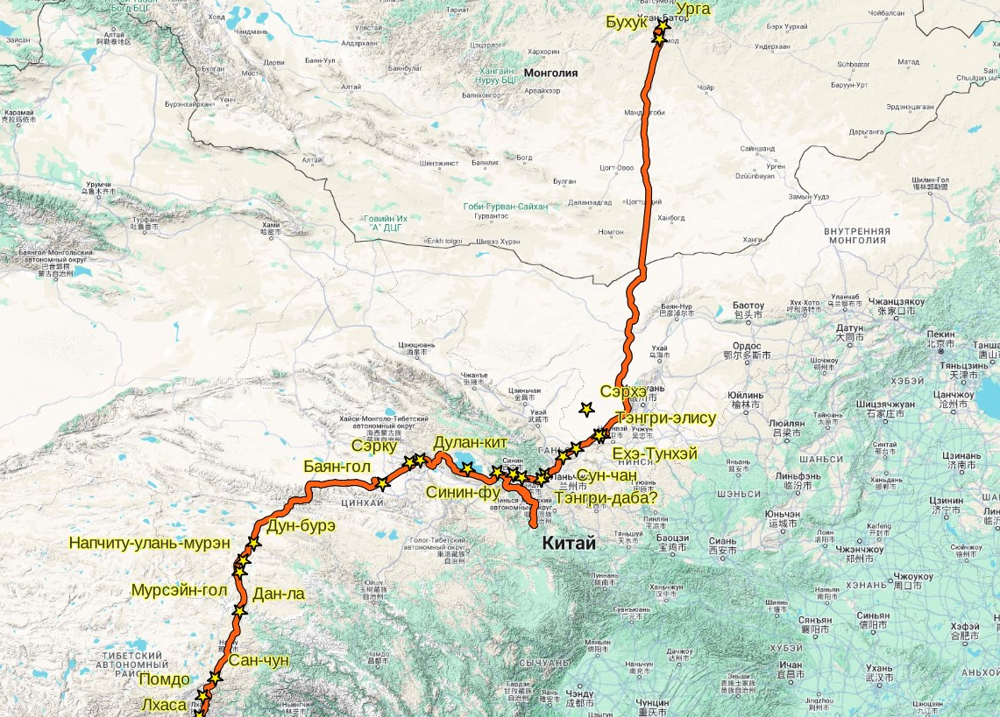

## Введение

В 1873 г. состоялось монгольского посольство из Урги в Лхасу за восьмым Джебдзун-Дамба-хутухтой. Описание посольства было предоставлено консулом Россиийской империи в Урге Я.П. Шишмаревым и опубликовано в известиях Императорского Русского Географического Общества (ИРГО). В описании упоминается около ста топонимов.

Через 25 лет, в 1899 г. из Урги в Лхасу вместе с паломниками отправился Г.Ц. Цыбиков. Он оставил подробное описание маршрута, включающее 186 топонимов, большая часть которых была нами [точно локализована](/notes/tsybikov-map/). Таким образом можно утверждать, что маршрут Цыбикова в целом достаточно точно восстановлен.

Полное сравнение этих двух маршрутов потребует значительного времени и повторения работы по топонимам монгольского посольства. Попробуем сделать короткое сравнение пока ориентируясь на:

* фонетическое сходство
* расположение на маршруте

## Сравнение топонимов

Номер и название топонима Шишмарева - по Шишмарев Я.П. Маршрут из Урги в Хлассу // Известия ИРГО. 1873. Т. IX. № 6. стр. 449.

| #  | Топоним Шишмарева      | Топоним Цыбикова  | Комментарий |
|----|------------------------|-------------------|-------------|
| 1  | Чжиргаланту            |                   |             |
| 2  | Буху                   |Бухук              |почтовая станция рядом с Ургой |
| 3  | Холбо                  |                   |             |
| 4  | Харца-Бурда            |                   |             |
| 5  | Боро-хучжир            |                   |             |
| 6  | Улан-хошу              |                   |             |
| 7  | Укэр-хаша              |                   |             |
| 8  | Сангин-далай           |                   |             |
| 9  | Арайн-гурбаны-худук    |                   |             |
| 10 | Цабчир                 |                   |             |
| 11 | Далай-сонги            |                   |             |
| 12 | Онгиин-гол             |                   |             |
| 13 | Уныгэту                |                   |             |
| 14 | Хария-Дересу           |                   |             |
| 15 | Хонин-доло             |                   |             |
| 16 | Куримту                |                   |             |
| 17 | Булак                  |                   |             |
| 18 | Сэрун-булак            |                   |             |
| 19 | Улан-тойрои            |                   |             |
| 20 | Худук                  |                   |             |
| 21 | Тала                   |                   |             |
| 22  |Ихэ-Дзаха              |                   |                   |
| 23  |Улан Ирге-сомо         |                   |                   |
| 31  |Тосон-даба             |                   |                   |
| 32  |Сергэ-элису            | Сэрхэ             | пески             |
| 33  |Ихэ-тунгу              | Ехэ-Тунхэ         | колодец на сев. стороне песков|
| 34  |Долон-худук            |                   |                   |
|     |Тэнгри-илису           | Тэнгри-элису      | пески                  |
| 35  |Чилу-онгоцо            | Чулун-онгоца      | колодец на выходе из песков          |
| 36  |Сан-эн-цзин            | Са-ян-Чжин        | застава у Великой Китайской стены                  |
| 37  |Суншан-дашун           | Сун-чан           | деревня                  |
| 38  |Чжонлон-хото           |                   |                   |
| 39  |Дабанай-ара            |                   |                   |
| 40  |Дайтун                 | Дайтун            | река Датунхэ                  |
| 41  |Тенгри-даба            | Тэнгри-даба       | Небесный хребет, перевал                  |
| 42  |Ямбай-хото             |                   |                   |
| 43  |Максан-хла             | Марсан-лха        | монастырь рядом с Синином                  |
| 44  |Синин-фу               | Синин-фу          | город                  |
| 45  |Дуба                   |                   |                   |
| 46  |Донгор                 | Донкор            | монастырь и город                  |
| 47  |Цонгу                  |                   |                   |
| 48  |Кукэнор                | Кукунор           | озеро                  |
| 49  |Бага-Улан              |                   |                   |
| 50  |Чжиримтай              |                   |                   |
|     |Богой-гала             |                   |                   |
| 51  |Дынчжин                |                   |                   |
| 52  |Нукуту-даба            |                   |                   |
| 53  |Долон-кид              | Дулан-кит         | монастырь                  |
| 54  |Сэргэй                 | Сэрку             | озеро и деревня рядом с Дулан-кит                  |
| 55  |Балангатай             |                   |                   |
| 56  |Далан-туру             |                   |                   |
| 57  |Цайдан-баин-гол        | Баян-гол          | самая крупная река Цайдама                  |
| 59  |Шугэй                  |                   |                   |
| 60  |Гуняй-гардза           |                   |                   |
| 61  |южеее Гуняй-гардза     |                   |                   |
| 62  |Бухуй-цаган            |                   |                   |
| 63  |Солонго-хонгор         |                   |                   |
| 64  |Куйтун-шара            |                   |                   |
| 65  |Баян-хара              |                   |                   |
| 66  |Цаган-оботу            |                   |                   |
|     |Галдзур-Улан-мурень    |                   |                   |
| 67  |Цаган-тологой          |                   |                   |
| 68  |Бурхан бусу            |                   |                   |
| 69  |Лама-тологой           |                   |                   |
| 70  |Куку-чилу              | Куку-шилэ         | Хребет                  |
| 71  |Думбыр                 | Дун-бурэ          | Перевал                  |
| 72  |Индэри-нор             |                   |                   |
| 73  |Нубчиту-Улан-мурень    | Напчиту-улань-мурэн| река                   |
| 74  |Мур-усу                | Мурсэйн-гол       | река                  |
| 75  |Адаг-Харцаг            |                   |                   |
| 76  |Дунда-Харцаг           |                   |                   |
| 77  |Ушигэ, сев.            | Дан-ла            | "упоминаемые Гюком, который называет хребет Тан-лайскими горами"                  |
| 78  |Ушигэ, юж.             | Дан-ла            | "упоминаемые Гюком, который называет хребет Тан-лайскими горами"                 |
| 79  |Бундзе-шил             |                   |                   |
| 80  |Букгэй-гол             |                   |                   |
| 81  |Цулмара                |                   |                   |
| 82  |Нанчжу                 |                   |                   |
| 83  |Ярманы                 |                   |                   |
| 84  |Лалун-гарбу            |                   |                   |
| 85  |Санчжун                | Сан-чун            | Казенная станция                  |
| 86  |Чоиндон-дярба          | Найман-субурга    | Восемь субурганов                  |
| 87  |Ладун                  |                   |                   |
| 88  |Хлахандун              |                   |                   |
| 89  |Пундо                  | Помдо             | река                  |
| 90  |Чагада                 |                   |                   |
| 91  |Сынчжчу-дзон           |                   |                   |
| 92  |Чжара-чамо             |                   |                   |
| 93  |Ган-ду                 |                   |                   |
| 94  |Хласса                 | Лхаса             |                   |

## Карта

На карте показан маршрут Цыбикова и топонимы Цыбикова найденые у Шишмарева.

## Выводы

Итого, из 94 топонимов предварительно идентифицировано 26 аналогичных топонимов у Цыбикова. Поверхностный анализ позволяет сделать следующие выводы:

1. С большой степенью определенности можно утверждать, что в целом маршруты монгольского посольства и Цыбикова совпадали. "В целом" означает, что можно видеть, что оба маршрута шли по совпадающим секциям:

   1.1. Урга - Дынь-юань-фу ("владения Алашанского вана" у Шишмарева)

   1.2. Дынь-юань-фу - Синин-фу

   1.3. Синин-фу - Кукунор - Цайдам

   1.4. Цайдам - Куку-шилэ

   1.5. Куку-шилэ - Лхаса

2. Степень сходства в деталях отдельных секций, однако, весь различна. Например, дорога до Дынь-юань-фу (современная Монголии и Внутренняя Монголия Китая), по всей видимости совершенно не совпадала. Секция Дынь-юань-фу - Синин-фу - Цайдам - совпадает хорошо. А участок до Лхасы совпадает частично.

3. Более точное сравнение маршрутов, особенно в монгольской части требует полной локализации каждого топонима монгольского посольства (Шишмарева).

