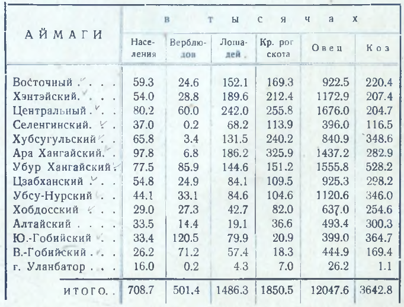

## Введение

Андрей Дмитриевич Симуков, известный исследователь, географ и картограф Монголии, известный в народе как Шар Дамдинсурэн ([вики-ру](https://ru.wikipedia.org/wiki/%D0%A1%D0%B8%D0%BC%D1%83%D0%BA%D0%BE%D0%B2,_%D0%90%D0%BD%D0%B4%D1%80%D0%B5%D0%B9_%D0%94%D0%BC%D0%B8%D1%82%D1%80%D0%B8%D0%B5%D0%B2%D0%B8%D1%87), [вики-мн](https://mn.wikipedia.org/wiki/%D0%90%D0%BD%D0%B4%D1%80%D0%B5%D0%B9_%D0%A1%D0%B8%D0%BC%D1%83%D0%BA%D0%BE%D0%B2)). В 1941 приговорен к лагерям, где через 4 месяца умер от «паралича сердца».

Два основных труда Симукова в картографии:

* Географический атлас Монгольской Народной Республики, 1934 г.
* Карта Монгольской Народной Республики, 1937 г.

Здесь речь пойдет об атласе.

Географический атлас Монгольской Народной Республики. Составлен по новейшим материалам сотрудником Научно-Исследовательского Комитета Монгольской Народной Республики А. Д. Симуковым. Уланбатор: Издание Клуба имени Ленина, 1934; Bügüde nayiramdaqu mongγol arad ulus-un γaǰar-un ǰiruγ-un debter / Enekü debter-i Sinǰileküi uqaγan küriyeleng-ün A. D. Simükov ǰokiyaγsan. \[Улан-Батор\]: Mongγol ulus-un keblel-ün qoriy-a, \[1934 (Mongγol ulus-un qorin dörben on)\].

Полное цитирование: Географический атлас Монгольской Народной Республики / сост. Симуков, А. В. - Улан-Батор : Ком. Наук МНР, 1934. - 7,11 сдв. л. карт и текст: цв.; 50×38 см.

Оригинальный атлас можно [скачать на сайте](http://www.orientalstudies.ru/rus/index.php?option=com_publications&Itemid=75&pub=9885) Института Восточных Рукописей (Санкт-Петербург).

Здесь приведены текст и карты атласа.

Важно:

* опечатки оригинала --- не исправлялись
* распознанный текст более близкий к оригинальному атласу можно открыть в [Google Docs](https://docs.google.com/document/d/1ubWs5xsgml3Sk592P6AGTFB7k7LuQ1Gt/edit?usp=sharing&ouid=112245657670169384946&rtpof=true&sd=true).

## Содержание атласа

ГЕОГРАФИЧЕСКИЙ АТЛАС

МОНГОЛЬСКОЙ НАРОДНОЙ РЕСПУБЛИКИ

составлен по новейшим материалам сотрудником Научно-Исследовательского Комитета Монгольской Народной Республики А. Д. СИМУКОВЫМ.

Издание Клуба имени ЛЕНИНА. Монголия, Уланбатор.

Отпечатано офсетным способом Монгольской Государственной типо-лито-офсет печатней ,,Монголпресс". 1934 год.

Тираж---1000.

ОГЛАВЛЕНИЕ

Предисловие.

### I. Положение Монгольской Народной Республики в мире и на материке Азии.

1\. Политическая карта мира.

2\. Политическая карта Центральной и Восточной Азии.

### II. Монгольская Народная Республика. Основные карты.

3\. Физическая карта Монголии.

4\. Административная карта М. Н. Р.

5\. Карта путей сообщения и связи.

6\. Карта растительности (пастбищных типов).

7\. Карта географических провинций М. Н. Р.

### III. Схемы и картограммы.

8\. Схема сравнения старого и нового адм. деления М. Н. Р.

9\. Этнографическая карта Республики.

10\. Картограмма плотности населения.

11\. 12, 13, 14, 15, 16. Картограммы удельного веса отдельных видов скота в общем стаде по районам.

17\. Картограмма распространения важнейших охотничье - промысловых животных (белки и сурка) и расположения земледельческих районов.

18\. Схема деления МНР на аймаги согласно изменениям, утвержденным в начале 1934 г. 

### Индексы.

Индекс названий по физической географии.

Индекс названий сумунов.

Индекс названий населенных пунктов.

**ПРЕДИСЛОВИЕ**

Предлагаемый ниже „Географический атлас Монгольской Народной Республики" представляет собой перепечатку (без каких бы то ни было изменений) соответствующего издания Научно-Исследовательского Комитета МНР, вышедшего на монгольском языке, осуществленную с разрешения и по договоренности с Научно-Исследовательским Комитетом под авторством и редакцией составителя основного монгольского издания.

Географический атлас Монгольской Народной Республики появляется в печати впервые и представляет собой, таким образом, серьезное достижение в истории картографии этой страны, сравнительно еще мало изученой.

Все карты атласа, относящиеся к Монголии, составлены по новейшим материалам (данные на 1933 год, в середине которого и был составлен оргинал атласа). В основу работы по атласу легли материалы Картографического кабинета Научно-Исследовательского Кимитета МНР, собранные за 12 лет существования этого учреждения. Кроме того использованы некоторые издания АН СССР и, в небольшом количестве, старые картографические материалы дореволюционного периода. Корректирующим сводку всех этих материалов в единое целое моментом является личный опыт автора, занимающегося изучением географии и картографии страны в течении десяти с. лишним лет.

**Транскрипция названий.** Новостью в этом атласе является правописание относящихся к Монголии географических названий. Как известно, до сих пор единой географической номенклатуры по Монголии не существовало. Исследователи, работавшие по картографии страны, в подавляющем большинстве не были знакомы с монгольским языком и записывали все географические названия на слух, вследствие чего в соответствующей литературе, за небольшими исключениями, нет двух источников, которые имели бы одинаковую транскрипцию для того или другого географического названия.

Учитывая важность правильной географической номенклатуры, Научно-Исследовательский Комитет счел необходимым, во первых, проверить все названия, входящие в атлас, в Словарной Комиссии при Комитете (с участием автора) и установить орфографически правильное монгольское написание этих названий, и, во вторых, установить принципы русской транскрипции этих названий с тем, чтобы впоследствии строго придерживаться этой транскрипции. Последняя задача была выполнена Лингвистическим Кабинетом Комитета.

Принципы эти заключаются преимущественно в следующем:

1. За некоторым, твердо установленным контингентом исключений, изображение какого либо географического названия русскими буквами представляет собой точную транскрипцию монгольского орфографически правильного написания этого названия.
2. Вследствии этого для звуков, отсутствующих в русском языке, вводятся специальные обозначения. Это относится, впрочем, только к гласным о и у, которых на русском языке имеется два, а на монгольском---четыре.
3. В некоторых случаях, когда в монгольском языке произношение сильно разнится от написания, транскрипция устанавливается по произношению. Случаи эти и самая транскрипция конкретно установлены.
4. Кроме того в отдельных случаях сложные двухгласные, изображаемые по монгольски двумя и тремя буквами, транскрибируются по русски соответствующей одной буквой, изображающей, имеющийся в русском языке дифтонг.

Подробное изложение указанной новой транскрипции с перечислением исключений и частных случаев будет дано в готовящемся к печати „Географическом словаре МНР" того же автора.

Несколько замечаний о монгольском произношении. Твердое у (на картах *у*) произносится, как среднее между русскими о и у; многие русские слышат его, как о. Твердое о равно русскому о. Мягкое у равно русскому у, а мягкое о (на картах Ö ) произносится, как смягченное среднее между у и о (приблизительно, как в французском слове „deux"). Звук „л" после и перед звуками „и" смягчается до немецкого I. Звук „б" в середине и конце слов смягчается в звук „в" (вернее англ. W ). Носовой звук „нг", отсутствующий в русском языке, слышен преимущественно на конце слов, где и изображается нами указанным здесь способом. Составляющий его звук „г" слышен четко лишь перед „и", когда к слову, оканчивающимуся на „нг", прибавляется падежная приставка. Падежные приставки пишутся по монгольски отдельно, выговариваются же слитно с коренным словом. Мы отделяем их апострофами (').

Примечания к картам.

1\. Цель первой карты---дать представление о положении МНР в мире и ее относительных размерах.
2\. Вторая карта указывает положение Монгольской Народной Республики в Восточной и Центральной Азии и соседние этой республике государства. В Китае особо выделены Синь цзян, Манчжурия, этнографическая Внутренняя Монголия (с пров. Жэхэ) и Барга. Показан район японского влияния в Манчжурии и Жэхэ. Границы Тибета даны по карте, приложенной к книге Ч. Бэлла „Tibet pas and  present", и, возможно, несколько гипертрофированы в северо-восточном и восточном направлениях
3\. Составленная заново физическая карта МНР в комментариях не нуждается.
4\. Административная карта МНР. Даны границы аймагов и примерное расположение всех сумунных управлений по состоянию последних в начале 1934 г. Изменения в составе аймагов, произошедшие в это же время, даны на 3, 4, 5, 6, 7, 8 и 9 картах особым условным знаком („новые границы некоторых аймагов"). Во время печатания атласа Баян *у*ндур суму передан из Центрального аймага в Убур-Хангайский.
5\. Карта путей сообщения и связи. Составлена по оффициаль- ным материалам. Во время печатания приемочная радиостанция в Цаган эрги (Убур Хангай) перенесена в Арбай хэрэ, что следует сделать на карте.
6\. Карта растительности. Составлена по материалам автора, отчасти проф. В. И. Баранова (два западных аймага) и некоторым другим, в печате появляется вообще впервые.
7\. Карта географических провинций МНР. Исчерпывающее деление страны на географические провинции проведено автором впервые. Краткие очерки этих провинций даны им в готовящейся к печати книге „Географический очерк Монгольской Народной Республики".
8\. Восьмая карта дает сопоставление старого административного деления (до 1930 г.) с новым. Основная ее цель---дать соответствующий материал для справок.
9\. Этнографическая карта схематически показывает расселение на территории республики основных национальностей, входящих в состав МНР, и составлена по материалам 1931 года.
    Иностранцы, не имеющие монгольского гражданства, на ней не отображены.
10\. Плотность населения вычислена по оффициальным цифрам административного учета за 1933 год. Как видно по картограмме, проведена дифференциация плотности не только по аймагам, но и внутри их, по экономическим районам. Для Центрального аймага население Уланбатора во внимание не принято.
11\. 12, 13, 14, 15, 16. Эти картограмы показывают удельный вес отдельных видов скота в общем стаде, перечисленном в условные единицы, в разрезе внутри аймачных экономических районов. Исключение составляет картограмма распространения сарлоков (яков), показанных в отношении не ко всему стаду, а к крупному скоту.
    Коэффициенты перевода отдельных видов скота в условные единицы приняты следующие:
    Верблюд . . . .1.4
    Лошадь .... 0.9
    Кр. рог. скот . . 0.7
    Овца . . .0.14
    Коза . . .0.1
    Вычисления произведены по материалам административного учета за 1933 год.
12\. Эта картограмма дает распространение важнейших пушных охотничье - промысловых животных (белки и сурка) и схематическое распределение земледелия (не отражая его размеров).
13\. Последняя карта имеет характер дополнения и схематически показывает новое деление МНР на аймаги, принятое в начале 1934 года (12 аймагов вместо прежних 13).

В приложенный к атласу индекс географических имен включены названия, относящиеся исключительно к территории МНР и помещенные на основных картах атласа (3, 4, 5, 6, и 7 карты). При каждом названии условным обозначением указано его местонахождение на картах атласа. Так, обозначение „3 Д 8", помещенное при названии „Ихэ богда, хребет", указывает, что этот хребет надо искать на карте № 3, в квадрате, где скрещиваются горизонтальный ряд „Д" и вертикальный „8". Если название повторяется в одном и том же квадрате на нескольких картах, то сначала указываются номера этих карт, а потом общее им обозначение квадрата (напр. „Ихэ богда, хребет; 3, 6, 7, Д 8").

Для удобства пользования индекс названий разбит на три отдельных индекса: 1) названий относящихся к физической географии страны, 2) названий сумунов и 3) названий населенных пунктов. Возможные описки и опечатки на картах следует исправлять по индексу.

„Географический атлас Монгольской Народной Республики" напечатан офсетным способом в Монгольской Государственной типографии „Монголпресс" силами монгольских кадров и является первой подобного рода работой монгольской полиграфической промышленности. Вследствии этого оба его издания---как монгольское, так и русское---несомнено имеют ряд недостатков в смысле технического выполнения. Нам кажется, что новизна издания, не имевшего предшественников, делает извинительными имеющиеся промахи, как в отношении технического выполнения, так и в отношении содержания.

Ввиду отсутствия в печати (кроме мало распространенного журнала „Современная Монголия" \*) новейших статистических сведений о Монгольской Народной Республике, мы считаем необходимым дать в предисловии к атласу важнейшие цифры по населению республики и основной базе ее экономики---скоту в аймачном разрезе по оффициальным данным 1933 года.

*ПРИМЕЧАНИЯ:*

1\. В указанное количество населения не входят проживающие в МНР иностранцы.

2\. В таблицу не вошли население и скот казахских и урянхайского национальных хошунов запада республики, не учитываемых согласно постановления Правительства МНР.

\*) «Современная Монголия», политико-экономический журнал. Издается на русском языке в г. Уланбаторе, выходит шесть раз и год. Тираж---500 экз.

Составитель.

1\. Политическая карта мира

2\. Политическая карта Центральной и Восточной Азии

3\. Физическая карта Монгольской Народной Республики

4\. Административная карта Монгольской Народной Республики

5\. Карта путей сообщения и связи Монгольской Народной Республики

6\. Карта растительности /пастбищных типов/ Монгольской Народной Республики

7\. Карта географических провинций Монгольской Народной Республики (географические провинции, направление горных хребтов и границы океанских и внуреннего бассейнов).

8\. Карта административного деления Монгольской Народной Республики (до и после районирования 1930 года).

9\. Этнографическая карта Монгольской Народной Республики

10\. Плотность населения

11\. Удельный вес верблюдов в общем стаде (перечисленном в условные единицы)

12\. Удельный вес крупного рогатого скота в общем стаде (перечисленном в условные единицы)

13\. Удельный вес сарлоков в стаде крупного рогатого скота (перечисленном в условные единицы)

14\. Удельный вес лошадей в общем стаде (перечисленном в условные единицы)

15\. Удельный вес овец в общем стаде (перечисленном в условные единицы)

16\. Удельный вес коз в общем стаде (перечисленном в условные единицы)

17\. Распространение важнейших охотничье-промысловых пушных животных (белки, тарбагана) и земледельческий районов

18\. Аймаки МНР после перерайонирования 1934 года

## Комментарии

[**Обсудить**](https://t.me/answer42geo/35)
