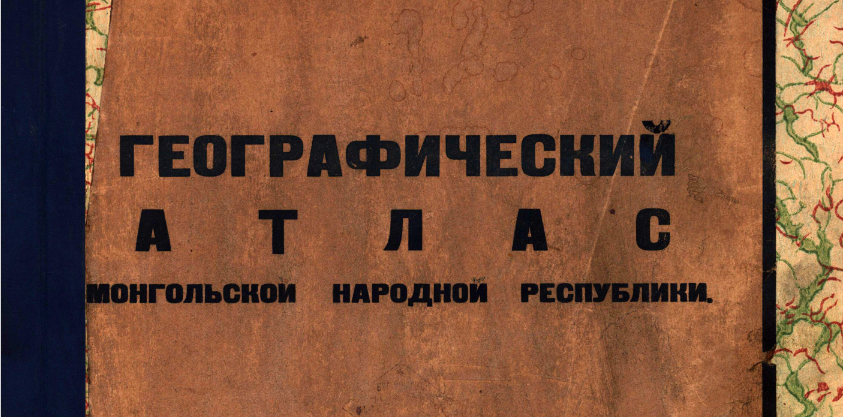

## Введение

Первая часть --- [текст и карты](/notes/simukov-atlas-text-maps/). Там же общее описание и фонетические объяснения.

Здесь, вторая часть --- индексы (списки) названий географических объектов (топонимы):

1. Индекс физико-географических названий. 397 шт.
2. Индекс названий сумунов (сомон --- наименьшая административно-территориальная единица в Монголии). 307 шт.
3. Индекс населенных пунктов. 151 шт.

## 1. Индекс физико-географических названий

Абзог хайрхан, гора 3, 6, 7. в 9

Агц*у*'ин гол, река 3, 5, 6, в 13

Адаг'иин цагаан н*у*ур. 5, 6 д 7

Адаацаг, горы 6, 7 г 10

Адуун ч*у*л*уу*, горы. 3 в 15

Айраг н*уу*р, озеро. 3, 5, 6, 7 в 4

Алаг н*уу*р, озеро. 3 д 5

Алаг суучжи, гора. 3, 6, д 13

Алаг *уу*ла, гора 3 г 16

Алтан *уу*ла, горы. 3 е 8

Алтан хайрхан, гора. 3 в 5

Алтан х*о*х*о*й, горы. 3, 6 в 3

Алтат*у*, речка. 3, 5, 6, в 9

Арасай, река. 5, 6 б 7

Аргалинт*у*, горы. 3 в 5

Аргалинт*у*, горы. 3 г 5

Арг*у*'ин гол, река. 3, 5, 6, 7, д 9

Ариг'иин гол, река. 3, 5, 6, 7 б 8

Арца богда, хребет. 3, 6, 7, д 9

Асаральту хайрхан, гора. 3, 6, 7 в 11

Ата богда'ин нур*уу*, хребет. 3, 6, 7 е 6

Ахар, горы. 3, 6 д 9

Ачжи богда, хребет. 3, 6, 7, д 5

Ачиту н*уу*р, озеро. 3, 4, 5, 6, 7 в 3

Бага баян суучжи, гора. 3, 6, д 12

Бага (цзуун) богда, хребет. 3, 6, 7 д 8

Бага богда, гора. 3 е 6

Бага гацзар'иин чул*уу*, горы. 3, 6, 7 г 10

Бага даян, горы. 3 д 6

Бага н*уу*р, озеро. 3, 5, 6 г 4

Бага хэнтэй, гора. 3, 7 в 12

Бага хонгорчжи, горы. 3 е 8

Бага шанхай, горы. 3 д 10

Байбаян *о*нд*о*р, горы. 3, 6, 7 д 6

Байдаг богда, горы. 3, 6, 7 д 3

Байдараг, река 3, 4, 5, 6, 7 г 7

Бальчжи, река. 3, 5, 6, 7 в 13

Барх*у*, река. 3, 5, 6 в 13

Баат*у*р хайрхан, хребет 3, 6, 7 г 4

Бат*у* хан *уу*ла, гора. 3 в 14

Бат*у* цэнгэл, горы. 3, 6, 7, в 8

Баян боро н*у*р*уу*, горы. 3 е 9

Баян гол, речка. 5 в 7

Баянгиин тала, равнина. 3, 6, 7 д 14

Баянгиин н*у*р*уу*, гряда. 3, 6, 7 д 8

Баян м*о*нх*о* *уу*ла, гора. 3 г 14

Баян м*о*нх*о* *уу*ла, гора 3 г 13

Баян м*о*нх*о* *уу*ла, гора. 3 г 13

Баян нуур, озеро. 3, 5 в 4

Баян сайн *уу*ла, гора. 3 е 13

Баян *уу*ла, гора. 3, 6 е 13

Баян хан *уу*ла, гора 3, 6 г 12

Баян хайрхан, гора. 3 в 4

Баян хонгор, гора. 3 г 8

Баян цагаан, хребет. 3, 6, 7 д 7

Баян цзурихэ, гора. 3 г 8

Баян цогту'иин гоби, равнина 3, 6, д 11

Биггэр н*уу*р, озеро. 3, 5, 6 д 6

Бичжинг гол, река. 3, 5, 6 д 4

Бичиг'йин нур*уу*, гряда. 3, 6, 7 г 5

Богда'иин гол, река. 3, 5, 6, 7 г 6

Богда марал, гора. 3 г 7

Богда *уу*ла, гора. 3, 6 г 11

Богда *уу*ла, гора. 3, 6 г 12

Богда *уу*ла, гора 3, 6 г 13

Бодончи, река. 3, 5, 6 д 4

Болнай н*у*р*уу*, хребет. 3, 6, 7 в б

Борцзон гоби, равнина. 3, 6 е 10

Бороо, речка. 3, 5 в 11

Боро бургасу, река, 3, 5. в 2

Боролцзай'н тала, равнина 3, 6, 7 г 11

Б*оо*н цагаан н*уу*р, озеро 3, 4, 5, 6, 7 д 7

Б*о*х*о*г, речка. 3 г 11

Б*о*с хайрхан, гора. 3, 6, 7 д 5

Б*о*с хара обоо, гора. 3 г 14

Б*у*лаган, река. 3, 4, 5, 6, 7 г 3

Б*у*лаган хан *уу*ла, гора. 3, 6, 7 в 9

Б*у*мбату хайрхан, горы, 3 г 4

Б*уу*рал хангай, гора. 3 6 г 14

Б*у*ргас*у*тай'н гол, речка. 3 в 4

Б*у*ргас*у*тай'н гол, речка. 3, 6 в 13

Б*у*рхан *уу*ла, гора. 3, 6, 7 д 6

Б*у*янт*у*, река. 3, 4, 5. 6, 7 г 3

Б*у*ир н*уу*р, озеро. 3, 4, 5, 6, 7 г 16

Б*у*янт*у*, река. 3, 5. 6 г 6

Бугсэй, река. 3, 5, 6 в 7

Будуун гичигэнэ, река. 3, 6 г 7

Бурин хан, гора. 3, 6, 7 б 8

Бурин *уу*ла, гора. 3, 6, 7 в 10

Бухэй м*о*р*о*н, река. 3, 5, 6, 7 в 3

Бугтэй, долина. 3, 6 е 9

Бэлтэс, река. 3, 5, 6, 7 б 7

Галба'ин гоби, равнина. 3, 6 е 11

Галба хайрхан (Хан богда). гора. 3, 6 е 11

Галба'ин хира, гряда. 3, 7, е 11

Гал'иин гол, речка. 3, 5, 6, 7 в 14

Гал*уу*т*у* н*уу*р, озеро. 3 в 14

Гичигэнэ'ин н*у*р*уу*, хребет 3, 6,7, д 6

Г*у*рбан гэдэргэ, горы. 3 е 10

Г*у*рбан сайхан, горы. 3, 6, 7 е 9

Г*у*рбан т*о*г*о*риг, долина. 3, 6, 7 д 11

Г*у*рбан х*о*бс*о*г*о*л, гряда. 3, 6, 7 е 12

Г*у*рбан шарад, горы. 3 в 15

Гун, долина. 3 в 10

Гэрэльту'ин х*о*ндэй, долина. 3, 6 г 10

Далангиин н*у*р*уу*, гряда. 3 г 7

Дарби'ин н*у*р*уу*, хребет. 3, 6 г 5

Дари (Алтан) обоо, холм. 3, 6, 7 д 14

Дархан *уу*ла, гора. 3, 6 г 12

Даянгиин тала, равнина. 3, 6, 7 д 12

Доонг, гора. 3 в 5

Д*о*рбэльчжин *уу*ла, гора, 3 г 5

Д*о*рг*о*н н*уу*р, озеро. 3, 4, 5, 6, 7 г 4

Дулаан хара *уу*ла, гора. 3 д 12

Д*у*лаан хара, горы. 3 д 9

Дэль, горы. 3 д 10

Дэлгэр м*о*р*о*н, река. 3, 5, 6, 7 в 7

Дэлгэр хан, гора. 3, 6, 7 г 10

Дэлгэр хангай, горы. 3, 6, 7 д 10

Дэлиун, речка. 3 в 3

Иибинг гол, речка. 3 в 10

Идэр'иин гол, речка. 3, 5, 6, 7 в 7

Ималху, речка. 3 б 15

Ихэ аргалинт*у*, горы. 3, 6, 7 е 9

Ихэ (Бар*уу*н) богда, хребет. 3, 6, 7 д 8

Ихэ гацзар'иин ч*у*л*уу*, горы. 3, 6, 7 г 11

Ихэ даян, горы. 3, 6, 7 д 5

Ихэ д*у*лаан *уу*ла, горы. 3, 6, 7 д 12

Ихэ номоган, горы. 3 е 10

Ихэ н*уу*р, озеро. 3, 4, 5, 6, 7 в 15

Ихэ тульбури, речка. 3 в 9

Ихэ т*о*х*о*м н*уу*р, солончак. 3, 5 г 10

Ихэ хонгорчжи, горы. 3, 6, 7 е 9

Ихэ шанхай, горы. 3, 6, 7 е 11

Ихэс н*уу*р, озеро. 5, 6 г 5

Й*о*р*оо*, река. 3, 4, 5, 6, 7 в 11

Й*о*р*оо*, река. 3, 5, 6, г 6

Й*о*с*о*н цзуйл'иин тала, равнина. 3 г 9

Л*уу*са, гора. 3 д 10

Лэг'иин гол, ключ. 3 д 8

Матад хан, гора. 3, 6 г 15

Майхан суучжи, гора. 3 е 12

Мандал'иин гоби, равнина. 3, 6 д 11

Минган булаг, ключи. 3, 5 д 5

Минчжи гол, река. 3, 4, 5, 6, 7 в 12

Могой'н гол, речка. 3, 5, 6, 7 г 17

Молцог элэсу, пески. 6 д 14

М*о*р*о*н, речка. 3, 5, 6, 7 г 13

М*у*х*у*р хунгуй, река. 3, 6 в 5

Намир, река. 3, 5, 6 в 3

Намнанг, гора. 3, 7 в 8

Нарин гол, река. 3 6 8

Нарин гол, река. 3, 4, 5, 6, 7 б 4

Нарин тульбури, речка. 3 в 9

Нарин хара, горы. 3 д 8

Нарин х*о*х*о* гоби, равнина. 3 е 6

Ноян богда, горы. 3, 6, 7 е 8

Ноян *уу*ла, гора. 3, 6, 7 в 11

Ноян *уу*ла, гора. 3, 6, в 12

Н*о*м*о*ргэ гол, река. 3, 5, 6 г 17

Н*о*м*о*ргэ *уу*ла, горы. 3, 6, в 6

Нэмэгэту, горы. 3, 6, 7 е 8

Ойгон н*уу*р, озеро. 3, 5, 6, 7 в 6

Онги'ин гол, река. 3, 5, 6, 7 д 9

Онгон элэсу, пески. 3, 6 д 14

Онон, река. 3, 4, 5, 6, 7 в 13

Орог н*уу*р, озеро, 3, 4, 5, 6, 7 д 8

Орхон, река. 3, 5, 6, 7 г 9 в 10

Отхан тэнгри, гора. 3, 6, 7 г 6

Отхан хайрхан, гора. 3 д 6

Оцол *уу*ла, гора. 3, 6 г 12

Оют*у*, гора. 3. 6, 7 в 12

*О*г*оо*мор, гора. 3, 6 г 15

Сагли, речка. 3, 5, 6 б 3

Сагсай, река. 3, 5, 6, 7 в 2

Сагсай, речка. 3, 6 д 6

Сайн усу, колодец и долина. 3, 6, 7 д 12

Салб*у*рит*у*, речка. 3 в 7

Салхитай *уу*ла, гора. 3 г 17

Санг'иин далай, озеро. 3, 4, 5, 6 7 в 7

Сойолчжи, гора. 3, 7 г 17

С*у*ланг хээрэ, гора. 3, 6, 7 е 12

Сологой, местность. 3, 6 д 11

*Соог,* река. 3, 5, 6, 7 в 2

С*у*б*у*рга хайрхан, гора. 3 г 8

С*у*дай *уу*ла, гора. 3, 6, 7 г 4

Сумбур *уу*ла, гора. 3, 6 в 15

Суучжи, речка. 3, 5 г 10

Сэбэрэй, горы. 3, 6 е 9

Сэлэнгэ, река. 3, 4, 5, 6, 7 в 8, 10

Сэрхэ *уу*ла, горы. 3, 7 д 6

Сэгсэй цагаан богда, горы. 3, 6, 7 е 7

Таб*у*н богда *уу*ла, гора. 3, 6, 7 в 1

Таб*у*н тологой, холмы. 3 г 15

Тайшири *уу*ла, хребет. 3, 6, 7 г 6

Тала булаг, местность. 3, 6 г 11

Таладолоон, местность. 3, 5, 6, 7 д 11

Тарбагатай, река. 3, 6 в 9

Тарбагатайн н*у*р*уу*, хребет. 3, 6, 7 в 7

Тарят*у*, горы. 3 д 7

Татах*у* тээли, протока. 3 в 4

Тахи'ин шара н*у*р*уу*, горы. 3, 6, 7 д 4

Тааца'ин гол, река. 3, 5, 6, 7 д 8

Тааца'ин цагаан нуур, озеро. 3, 5, 6 д 8

Тойльб*у*, речка. 3 в 10

Толбо н*уу*р, озеро. 3, 4, 5, 6 7 в 2

Тонхил н*уу*р, озеро. 3, 5, 6 г 4

Тосон гол, речка. 3 в 10

Тосоту *уу*ла, горы. 3, 6, 7 е 8

Торхалиг, речка. 3 6 4

Тогтах*у*'ин шили гряда. 3, 6, 7 в 4

Т*о*г*о*риг'иин гоби, долина. 3 д 12

Т*о*м*о*рту гол, речка. 5 г 6

Т*о*м*о*соту *уу*ла, горы. 3 г 13

Т*у*г*у*лгатай'н н*у*р*уу*, горы. 3 г 12

Т*уу*ла, река. 3, 5, 6, 7 в, г 10

Туй'ин гол, река. 3, 4, 5, 6 7 д 8

Тэгши, река. 3, 5 в 6

Тээли, речка. 3 6 4

Тэлмин н*уу*р, озеро. 3, 5, 6, 7 в 6

Тэнгис, река. 3, 5 б 7

Тэрхи'ин цагаан н*уу*р, озеро. 3, 5,6,7 в 7

Тэрэльчжи, река. 5 в 11

Тэс, река. 3 4, 5, 6, 7 б 4 в 6

*О*б*о*р цагаан гол, ключ. 3 д 8

*О*б*о*р чжиргалант*у*, речка. 6 г 10

*О*гуй н*уу*р, озеро. 3, 5, 6, 7 г 9

*О*нчжуул, гора. 3, 6 г 10

*У*бсш н*уу*р, озеро. 3, 4, 5, 6, 7 б 4

*У*лаан н*уу*р, солончак. 3, 5, 6 д 9

*У*лаан хан, гора. 3, 6 в 15

*У*лаан хайрхан, гора. 3 в 5

*У*льцза, река. 3, 4, 5, 6, 7 в 14

*У*ляс*у*тай'ин гол, река. 3, 5 в 3

*У*рд*у* Тамир, река. 3, 5, 6 г 8

*У*рд*у* тэрхи, река. 3, 5, 6 г 7

*У*рт*у* хайрхан, гора. 3 г 17

*Уу*та'ин гол, река. 3, 5, 6, 7 г 7

Уйэнчи, речка. 3, 5, 6 г 4

Уруг н*уу*р, озеро. 3, 4, б 3

Уур гол, река. 3, 5, 6, 7 б 8

Ушуг, горы. 3 д 8

Хайрхан гоби, равнина. 3, 6 д 10

Хайрхан *уу*ла, гора. 3, 6 г 13

Халтар гоби, равнина. 3, 6, 7 г 16

Халха гол, река. 3, 4, 5, 6, 7 г 17

Хана цохио, гряда. 3 д 10

Ханан, горы. 3, д 10

Хангай'н н*у*р*уу*, хребет. 3, 6, 7 г 7, 8

Хангал, речка. 3, 6 в 10

Хангилцаг, речка. 3, 5 в 4

Хан*у*й, река. 3, 5, 6, 7 в 8

Хан *уу*ла, гора. 3 е 10

Хан *о*нд*о*р *уу*ла, гора. 3 г 8

Хан х*о*х*о*й, хребет. 3, 6, 7 в 5

Хара гол, река. 3, 5, 6, 7 в 11

Хара аргалинт*у*, горы. 3 д 7

Хара аргалинт*у*, горы. 3 в 4

Хара ацзарга, хребет. 3, 6 д 5

Хара б*у*ха (Хар*уу*ха)'ин гол, речка. 3, 5, 6, 7 г 9

Хара гоби, равнина. 3, 6, 7 г 15

Хара н*уу*р, озеро. 3, 4, 5, 6, 7, в 4

Хара н*уу*р, озеро. 3, 5, 6, 7 в 5

Хара *уу*ла, гора. 3 д 13

Хара *у*с*у,* озеро. 3, 4, 5, 6, 7 в 4

Хара *у*с*у*, озеро. 3, 5, 7 в 3

Хара х*у*ш*уу*, холмы. 3 г 14

Харга, река. 3, 5, 6 б 3

Хардал сардиг, хребет. 3, 6, 7 б 7

Харлин гол, река. 3 г 9

Хархира, горы. 3, 6, 7 в 3

Хархира, река. 3, 5, 6 в 3

Хасагту хайрхан, хребет. 3, 6, 7 г 5

Хат*у*н хайрхан, гора. 3 д 6

Хачиг, горы. 3, 6, 7 е 10

Хачиг, река. 5, 6 в 6.

Хибинг гол, река. 3, 5, 6 б 8

Хиргис н*уу*р, озеро. 3, 4, 5, 6, 7 в 4

Хобдо, река. 3, 4, 5, 6, 7 в 3

Хобдо, речка. 3 д 9

Хобор, ключ и местность. 3 г 7

Хойт*у* Тамир, река. 3, 5, 6, 7 г 8

Хойт*у* тэрхи, река. 3, 5, 6, 7 г 7

Хонг'иин гол, река. 3, 5, 6 в 11

Хонго, речка. 3, 5, 6 в 3

Хонгор'иин обоо, холм. 3, 6 г 16

Хонгор *уу*ла, гора. 3, 6 в 15

Хоничи *уу*ла, гряда. 3, 6 е 12

Хор'го'ин ч*у*л*уу*, гряда. 3, 7 д 12

Хояр *у*лцзэйту, горы. 3, 7 д 11

Х*о*чжуул, река. 3, 6 в 7

Х*о*бд*о*н гол, местность. 3 е 8

Х*о*бс*о*г*о*л далай, озеро. 3, 4/5,6,7 б 8

Х*о*бчи, горы. 3 д 5

Х*о*гшин орхон, река. 3, 6, 7 г 9

Х*о*ндэлэн гол, река. 3, 5, 6 б 3

Х*о*нт*о*с, горы. 3 е 10

Х*о*нчжил, горы. 3, 7 д 11

Х*о*нчжил, река. 3, 6 в 7

Х*о*рхэ, хребет, 3, 6, 7 е 10

Х*о*х*о* гол, река. 3 6 8

Х*о*х*о* н*уу*р, озерко. 3, 6, 7 в 15

Х*о*х*о* т*о*м*о*рту *уу*ла, горы. 3, 6 7

Х*о*х*о* *уул*а, гора. 3 в 15

Х*у*рах*у*, река. 3, 5, 6, 7 в 13

Х*у*т*у*г уула, гора. 3, 6, 7 е 13

Худэри'ин гол, река. 3 в 11

Хуйсу'ин гоби. равнина. 3, 6, 7 г 5

Хуйтэн, речка. 3, 6, в 11

Хунгуй, река. 3, 5, 6 7 в 5

Хунуй гол, река. 3, 5, 6, 7 в 8

Хэнтэйн н*у*р*уу*, хребет. 3, 6, 7 в ,12

Хэнтэй хан, гора. 3, 6, 7 в 12

Хэрулун, река. 3, 4, 5, 6, 7 г 12 б 14

Хэрсэнгиин тала, равнина. 3, 6 д 8

Цабданг н*уу*р, озеро. 3 в 5

Цагаан айраг, холмы. 3 д 12

Цагаан гол, река. 3, 5, 6 в 2

Цагаан гол, река. 3, 5, 6 б 8

Цагаан гол, река. 3, 5, 6 г 3

Цагаан гол, речка. 3, 5, 6 г 7

Цагаан н*уу*р'иин гол, река. 3, 5 в 2

Цагаан обоо, гора. 3 г 7

Цаган сумэ'ин гол, речка. 3, 6 г 9

Цагаан тологой, холм. 3, 6 г 15

Цагаан турууту, река. 3, 5, 6 г 8

Цагаан *уу*ла, горы. 3 ж 9

Цагаан ч*у*л*уу*ту, горы. 3, 6 д 13

Цзабхан, река. 3, 4, 5, 6, 7 г 6

Цзаг, река. 3, 5, 6, 7 г 7

Цзагас*у*тай, река. 3 г 6

Цзагдал, речка и долина. 3, 5, 6 в 10

Цзаг сучжи'ин гоби, равнина. 3 е 11

Цзайгал, река. 5, 6 в 9

Цзараа обоо, холм. 5 в 15

Цзарта, река. 5 в 7

Цзахар'иин гол, река. 3 в 12

Цзахой цзарман; местность и ключи 3, 5 д 6

Цзотол *уу*ла, гора. 3, 6, 7 д 15

Цзоргол хайрхан, гора. 3 г 11

Цзосо хайрхан, гора. 3 е 12

Цз*оо*лэн, хребет. 3, 6, 7 е 9

Цз*у*л*у*ганай цзадагай, ключ. 3 е 8

Цз*уу*н модон'и хоолай, долина. 3 е 7

Цзуун ч*у*л*уу*ту, холмы. 3, 6 г 14

Цзуун туруу, река. 3, 5, 7 в 5

Цзучи гол, река. 3, 4, 5, 6, 7 в 15

Цзээргэнэ н*уу*р, солончак. 3 г 4

Цзээрдэ'ин гоби, равнина. 3, 6, 7 д 13

Цзэлтэр, река. 3, 5, 6, 7 б 10

Цохио, горы. 3, 6, 7 е 10

Цэгээн *уу*ла, гора. 3 в 13

Цэгээн цагаан, долина. 3, 6 г 10

Цээл, местность. 3 в 10

Цэнхэр, речка. 3 г 3

Цэнхэр хоолай, равнина. 3, 6 е 7

Цэнхэр, речка. 3, 5, 6, 7 г 12

Цэцэг н*уу*р, озеро. 3, 5, 6, 7 г 4

Цэцэй, горы. 3, 6 е 10

Цэцэрлиг, река. 3, 6 г 8

Цэцэрлиг, речка. 3, 5 в 6

Чжара речка. 3 б 7

Чжинсэту'ин н*у*р*уу*, горы 3, 6 д 7

Чжиргалант*у* гол, река. 6 г 8

Чжиргалант*у* хайрхан, хребет. 3, 6, 7 г 4

Чиндаган тала, равнина. 3, б г 13

Чоно'ин гол, речка. 3 г 15

Чонот*у* *уу*ла, холмы. 3 в 16

Чоно харайх*у* гол, протока. 3 в 4

Ч*у*л*уу*т*у*, река. 3, 5, 6, 7 в 8

Шабар, река. 3, 5, 6 в 6

Шанха, гора. 3 г 9

Шара'ин гол, река. 5, 6 в 11

Шара *у*с*у*, река. 3, 4, 5, 6, 7 г 7

Шарахай'н тала, равнина. 3, 6 г 11

Шарахацар, гряда. 3, 6, 7 е 10

Шара х*у*л*у*с*у*н'и булаг, ключ. 3, 4, 5, 6 е 6

Шара'ин гол, река. 3, 5, б 7

Шарга'ин гоби равнина. 3, 6, 7 г 5

Шарга'ин гол, речка. 3, 5, 6 г 5

Шаргольчж*уу*д, река. 3, 5, 6 г 8

Шарлунг, река. 3, 5, 6 в 11

Шибэри, река. 3, 5, 6 в 3

Шили'ин богда, гора. 3 д 15

Шишхид, река. 3, 4, 5, 6, 7 б 7

Шуусуту'ин гол, река. 3, 5, 6 в 13

Эг'иин гол, река. 3, 4, 5, 6, 7 в 8

Эг'иин дабаа, перевал. 3 г 7

Эдэрэнгиин н*у*р*уу*, хребет. 3, 6, 7 д 6

Эргил'иин цзоо, гряда. 3, 6 е 12

Эрхил н*уу*р, озеро. 3 в 7

Эргиту манхан, местность. 6 е 13

Эрдэни цогт*у*'ин гоби, равнина 3, 6, 7 г 12

Эрин гол, река. 5, 6, б 9

Эриэн *уу*ла, горы. 3, 6 г 9

Эхин буриду, ключ. 3 г 13

## 2. Индекс названий сумунов

Обозначение № карт опущено, так как все сумуны даны на карте № 4, где их и следует искать;
вместо этого для каждого сумуна дано сокращенное обозначение аймага, в котором он находится:

В.---Восточный.

X.---Хэнтэйский.

Ц.---Центральный.

С.---Селенгинский.

Хс.---Хобсогольский.

Ах.---Ара хангайский.

Ух.---Обор хангайский.

Цз.---Цзабханский.

У. ---Убсунуурский.

Хб.---Хобдосский.

Юг.---Южно-гобийский.

Вг. ---Восточно-гобийский.

Абдара баян. Ц, г 11

Абзог хайрхан. Ах, в 9

Агар*уу*ту. Вг. е 12

Агит*у*. Цз. г 6

Алаг эрдэни. Хс, б 8

Алдар хан. Цз, г 6

Алтан тээли. Хб, г 4

Алтай, Хб. д 4

Алтан ц*о*г*о*цэ, Хб. в 3

Аргалинт*у*, Юг. е 10

Ара б*у*лаг, Хс. б 7

Ара чжиргалант*у*, В. г 15

Аршаант*у*, Хс. в 8

Асхат*у*, В. д 14

Бальчжи, X. в 13

Бат*у* норбо, X. в 13

Бат*у* сумбур, Ц. в 11

Бат*у* *о*лцзэй буриду, Ух. г 9

Бат*у* цэнгэл, Ах. в 9

Баян, X. в 13

Баян, Цз. г 5

Баян агта, Хс. в 8

Баян бараат*у*, Ц. г 11

Баян б*у*лаг, Ах. г 6

Баян гол, Ц. в 11

Баян дарха, X. в 13

Баян д*у*нг, В. в 14

Баян дэлгэр, В. г 14

Баян дэлгэр, Ц. г 12

Баян м*о*нх*о*, X. г 12

Баян м*о*нх*о*, Вг. д 13

Баян обоо, X. г 14

Баян обоо, Юг. д 10

Баян *о*нд*о*р, Ух. г 10

Баян *о*нд*о*р, Цз. д 7

Баян тэрмэ, X. г 14

Баян *уу*ла, Ц. г 11

Баян *уу*ла, Цз. г 5

Баян *уу*ла, В. в 14

Баян *уу*ла, Хс. в 5

Баян улаан, Ух. г 9

Баян *уу*ла, Ух, д 8

Баян улаан, Ах. г 9

Баян хайрхан, Хс. в 6

Бурин тогтах*у*, Хс. в 7

Баян хайрхан, Хб. г 3

Баян хонгор, Ух. г 8

Баян х*у*г*у*г, X. г 13

Баян цагаан, Ц. г 11

Баян цзурихэ, Ух. г 8

Баян цзурихэ, Ц. г 11

Баян цзурихэ, Ах. в 7

Баян цогт*у*, Ц. г 11

Баян чжиргаланг, В г д 11

Баян эрхэту, Ц. г 10

Биггэр, Цз. д 6

Биндурия, X в 13

Богда *уу*ла*,* Ух. д 8

Б*о*мб*о*гэр, Ух. г 7

Б*у*г*у*г*у*, Ах г 8

Б*у*ир н*уу*р*,* В. г 16

Б*у*лаган, В. г 14

Б*у*лаган, Ах. г 8

Б*у*лаган, С. в 9

Б*у*лаган гол, Хб. г 3

Буян, Вг. д 13

Б*у*янт*у*, X. г 13

Б*у*янт*у* гол, Хб. в 3

Б*у*янт*у* *уу*ла, Юг. д 11

Б*у*янт*у* цагаан гол, Ух. г 7

Бурин, Ц. г 10

Бурин, Хс. в 7

Бурин, С. в 10

Бурин хан, Хс. в 7

Буруг хангай, Ц. в 10

Буриду, Ах. г 9

Бухэй м*о*р*о*н, У. в 3

Гал бадараху, Ц. в 10

Галшара, X. г 13

Г*у*рбан б*у*лаг, Ах. г 7

Г*у*рбан б*у*лаг, Ах. г 9

Г*у*рбан сайхан, Юг. д 11

Г*у*рбан цзаан, В. в 15

Г*у*чин *у*с*у* Ух. д 9

Гун нарин, Ух. д 9

Даб*у*с*у*т*у* *уу*ла, У. б 4

Даланг чжиргаланг, Вг. г 12

Дарби, Цз. г 5

Дарби, Хб. г 4

Дариганга, В. д 14

Дархан, X. г 12

Дархан, С. в И

Дархан хан, В, г 14

Дашйбалбар, В. в 15

Дашинчилинг, Ц. г 10

Дооду орхон, С. б 11

Д*о*л*о*гэн хайрхан, х. Ух. д 9

Дорбэлчжин, Цз. в 5

Думда баян, X. в 13

Дээду орхон, С. в 10

Дэлгэр, Цз. г 6

Дэлгэр б*у*лаг, Ух. г 9

Дэлгэр хан, Ц. г 10

Дэлгэр хан, X. г 12

Дэлгэр хайрхан, Хб. в 3

Дэлгэр хангай, Юг. д 10

Дэлгэр хэтэ, Вг. д 12

Дэлгэрэху, Вг. д 13

Дэлгэр цогт*у*, Ц. г 11

Дэрэнг Ц г 11

Идэр, Ах. в 7

Идэр, Цз. в 6

Идэрмэг, X. г 13

Ихэ тамир, Ах. г 8

Ихэ тушиг цагаан н*уу*р, С. б 10

Ихэ *уу*ла, Хс. в 8

Ихэ *уу*ла, Ах. в 7

Ихэ хэтэ, Вг. г 12

Ихэ чжиргаланг, Вг. д 12

Ихэ чжиргаланту, Ах. в 7

Ихэ эриэн, Вг. г 12

Й*о*р*оо*, С. в 11

Й*о*с*о*н цзуйл, Ух. г 9

Л*уу*са, Юг. д 10

Лунг, Ах. г 9

Лунг, Ц. г 10

Матад, В. г 15

Малчин, У. в 4

Мандал, Ах. г 7

Мандал, X. г 13

Мандал, Ц. в 11

Мандал обоо, Юг. е 10

Мандох*у*, Вг. д 11

Манлай, Юг. д 11

Манхан, Хб. г 4

Могод, Ах. в 9

Молцог, В. д 14

М*о*нх*о* обоо, Юг. е 11

М*о*нх*о* хан, X. г 14

М*о*нх*о* хайрхан, Хб. г 3

М*о*нх*о*, X. г 13

М*о*нх*о*, Ах. в 8

М*о*нг*о*н морит*у*, Ц. в 12

Намнанг, Хс. в 8

Наран, Ах. в 7

Наран, Цз. г 6

Наран б*у*лаг, Вг. е 12

Нарин тээли, Ух. г 8

Нилга, Ц. г 12

Номоган, Юг. е 10

Норболинг, г 12

Ноян, Юг. е 9

Н*о*м*о*ргэ, Цз. в 6

Онги, Ух. г 9

Онгон, В. д 14

Отхан, Цз, г 6

Очир баян м*о*нх*о*, В. в 15

*О*лцзэй дэлгэрэху, Юг. д 10

*О*лцзэйту, Ах. г 9

*О*лцзэйту, X. г 13

*О*лцзэйту, Ух. г 9

*О*лцзэйту, Ух. г 8

*О*лцзэйту, Юг. д 11

*О*моно гоби, У. в 4

*О*моно дэльгэр, X. г 12

Онд*о*р сайту, Ах. г 9

Онд*о*р *у*лаан, Ах. г 8

Онд*о*р *у*нца, Ух. д 9

Онд*о*р хангай, У. в 5

Онд*о*р хурмэ, Юг. е 10

Онд*о*р шили, Вг. д 12

Онд*о*р ширээту, Ц. г 10

*О*нчжуул, Ц. г 10

*О*ргэн цэцэрлиг, Вг. д 12

Ринчин лхумбу, Хс. б 7

Сагли, У. б 3

Сагсай чжиргаланту, Хб. в 2

Сайн цагаан, Ц. д 11

Сайхан, С. в 9

Сайхан баян, Ц. г 10

Сайхан дулаан, Вг. д 12

Сайхан обоо, Юг. д 10

Сандамаргаца, Цз. в 5

Сант*у*, Ух. д 9

Сонгина, Цз. в 6

Сумбур, Ц. г 12

Сэбэрэй, Юг. е 9

Сэлэнгэ, С. в 9

Сэлэнгэ бурин, С. в 10

Сэргулэнг, Ц. г 11

Тайшири, Цз. г 6

Тамчи, Цз. д 4

Таргат*у*, Ух. д 9

Таряланг, Хс. в 8

Таряланг, У. в 4

Тарят*у*, Ах. г 7

Татал, X. в 13

Тонхил, Цз. г 4

Тосон цэнгэл, Хс. в 8

Тосон цэнгэл, Ах. в 7

Т*о*м*о*р булаг, Хс. в 8

Т*о*г*о*риг, Цз. д 5

Т*о*г*о*риг н*уу*р, Ух. д 9

Тубшин н*уу*р, Хб. в 2

Тубшин ширээ, X. г 13

Тудубту, Цз. в 6

Тудэгтэй, X. г 13

Тумэн дэлгэр хан, В. в 14

Тургэн гол, У. в 3

Туруун гол, У. в 5

Тэлмин, Цз. в 6

Тэс гол, У. б 4

Тэшиг, Хе. б 9

*Уу*ла баян м*о*нх*о*, X. г 14

*У*лаагчин, Цз. в 6

*У*лаан бадараху, Вг. е 13

*У*лаан *уу*ла, Хс. б 7

*У*ланнгом, У. б 3

*У*рг*у*мал, Цз. в 5

Урту, В. г 15

*У*гтаал, Ц. г 11

*У*гтаал цайдам, Ц. в 10

Уйэнчи, Хб. г 4

Хайрхан, Ах. в 8

Хайрхан, Хб. г 4

Хайрхан д*у*лаан, Ух. д 9

Хали*у*н, С. в 10

Халцзан *уу*ла, В. г 14

Хан богда, Юг. е 11

Хан оют*у*, Ах. в 8

Хан хонгор, Юг. е 10

Ханга, Хс. б 8

Хангай, Ах. г 7

Хангал, С. в 10

Хантай, С. в 9

Хара айраг, Вг. д 12

Хасагт*у* чжиргаланг, Цз. г 5

Хат*у*н б*у*лаг, Вг. е 12

Хашиат*у*, Ах. г 9

Хашиат*у*, С. в 10

Хиргис, У. в 4

Хобдо, Ух. д 9

Хобдо гол. Хб. в 3

Хонгор, В. д 14

Хонгор, Вг. д 12

Хонгор обоо, Юг, е 9

Хонгор *уу*ла, В. д 14

Хотонту, Ах. г 9

Х*о*х*о* мориту, Цз. г 5

Х*о*бс*о*г*о*л, Вг. е 12

Х*о*гэнэ, В. в 15

Х*у*л*у*д, Юг. д 10

Х*у*нт*у*, В. г 16

Х*у*т*у*г *о*нд*о*р, Хс. в 9

Хуриэ марал, Ух. г 7

Хэнтэй, X. в 12

Цагаан б*у*л*у*нг, Хб. в 4

Цагаан гол, Ух. г 7

Цагаан дэлгэр, Ц. г 11

Цагаан обоо, Ц. д 10

Цагаан *уу*ла, Хс. б 7

Цагаан уур, Хс. б 8

Цагаан хайрхан, Цз. г 6

Цахир, Ах. в 7

Цогт*у*, Цз. г 6

Цогт*у* обоо, Юг. д 10

Цогту чиндамани, Юг. д 10

Цонхоланг, С. в 9

Цзабхан гол, У. в 4

Цзабхан мандал, Цз. в 5

Цзаг гол, Ух. г 7

Цзотол хан *уу*ла, В. д 15

Цзуун гоби, У. б 4

Цзуун хангай, У. в 5

Цзурихэ чиндамани, Вг. д 13

Цээл, Цз. г 5

Цэнгэл хайрхан, Хб. в 2

Цэнхэр, Ах. г 8

Цэнхэр мандал. X. г 12

Цэцэг н*уу*р, Хб. г 4

Цэцэй, Юг. е 10

Цэцэрлиг, Хс. в 6

Цэцэрлиг, Ах. в 8

Чжибх*у*лант*у*, Цз. г 6

Чжибх*у*лант*у* шарга, В. г 14

Чжинсэту, Ух. д 8

Чжиргаланг, Цз. г 6

Чжиргалант*у*, В. в 15

Чжиргалант*у*, Ах. в 8

Чжиргалант*у* хан, в 14

Чиндамани, Ах. в 7

Чиндамани, Хб. г 4

Чиндамани, Вг. д 12

Чиндамани *о*нд*о*р, Хс. б 8

Чиндамани *о*лцзэйту, Цз. в 6

Ч*у*л*уу*т*у*, Ах. г 8

Шанха, Ах. г 9

Шилуусуту, Цз. г 6

Эрдэни, Ц. г 11

Эрдэни, Вг. д 13

Эрдэни, Цз. д 7

Эрдэни б*у*лаган, Хс. в 8

Эрдэни бурин, Хб. в 3

Эрдэни далай, Ц. д 10

Эрдэни мандал, Ах. в 8

Эрдэни сайт*у*, Ц. г 10

Эрдэни цогт*у*, Ух. г 8

## 3. Индекс населенных пунктов

Абзог'иин хуриэ, мон. 4, 5 в 9

Абурах*у*'ин сумэ, мон. 4 д 13

Абурах*у*'ин х*у*рал, мон. 4 д 10

Аг*у*й'н хурал, мон. 4 е 12

Алтанб*у*лаг, город. 4, 5 б 11

Ам*у*р б*у*янт*у*'ин хуриэ, мон. 4, 5 д 7

Ам*у*р баясх*у*лант*у* хиид, мон. 4, 5 в 10

Ара чжиргалант*у*, пос. 4, 5 г 15

Арбай хээрэ, айм. ц. 4, 5 г 9

Ариг'иин хуриэ, мон. 4, 5 б 8

Аршаант*у*'ин хуриэ, мон. 4, 5 в 8

Баг модон'и х*у*рал, мон. 4 е 11

Байшинт*у*'ин хиид, мон. 4, 5 е 9

Байшинт*у*'ин хиид мон. 4, д 14

Бар*уу*н бурин'и хуриэ, мон. 4, 5 в 10

Бар*уу*н хуриэ, мон. 4, 5 г 9

Бат*у* норбо'ин хуриэ, мон. 4, 5 г 13

Бат*у* цэнгэл'ин хуриэ, мон. 4, 5 в 9

Баян далай, пос. 4, 5 е 9

Баян тумэн, айм. ц. 4, 5 в 15

Баян хонгор'иин хуриэ, мон. 4, 5 г 8

Баян хонгор, пос. 4, 5 г 7

Биггэр'иин хуриэ, мон. 4, 5 д 6

Бодончй'ин хуриэ. мон. 4, 5 г 4

Бороо, пос. 4, 5 в 11

Брайб*у*нг хиид, мон. 4, 5 в 12

Б*у*лгаан хан'и хуриэ, мон. 4, 5 в 9

Б*у*ха долон, пос. 4, 5 д 10

Б*у*янт*у*'ин хуриэ, мон. 4 г 6

Бугсэй'н хуриэ, мон. 4, 5 в 7

Бэлчир, пос. 4, 5 в 11

Гал*уу*т*у*'ин хуриэ, мон. 4, 5 в 6

Галшара'ин хуриэ мон. 4, 5 г 13

Ганданг хуриэ, мон. 4, 5 в 5

Г*у*чин чжиса, мон. 4, 5 г 11

Далай сайн шанда, айм. ц. 4, 5 д 12

Далан цзадагад айм. ц. 4, 5 е 10

Дара эхэ'ин чжиса, мон. 4, 5 г 7

Дархад'иин хуриэ, мон. 4, 5 б 7

Даянчи'ин хуриэ, мон. '4 г 14

Долоо шарацзаг'иин сумэ, мон. 4 е 11

Дордогой'н хуриэ, мон. 4, 5 б 7

Д*о*чи'ин хурал, мон. 4 д 11

Д*у*ганту чжиса, мон. 4 д 10

Д*уу*т*у*'ин хуриэ, мон. 4, 5 г 6

Дэлгэр хан'и хуриэ, мон. 4, 5 г 10

Дэлгэр хангай, пос. 5 д 10

Дэлгэр цогт*у*'ин хуриэ, мон. 4, 5 г 11

Дэлиун, пос. 5 г 3

Дэчжиэлэнг хуриэ, мон. 4, 5 в 4

Ихэ булаг'иин хуриэ, мон. 4, 5 д 14

И*о*р*оо*гиин хал*уу*н аршаан, гор. ист. 4 в 11

Лама'ин гэгэн'и хуриэ, мон. 4, 5 г 8

Лама'ин хиид, мон. 4, 5 в 10

Лама'ин хуриэ, мон. 4, 5 в 13

Лунг *уу*ла, пос. 4, 5 г 10

Мандал'иин хиид, мон. 4 г 14

Могой'н хуриэ, мон. 4, 5 г 5

Могой'н хуриэ, мон. 4 в 5

М*о*нх*о* хан'и хуриэ, мон. 4, 5 г 14

М*о*с*о*ту, пос. 4, 5 в 14

М*о*р*о*н'и хуриэ или М*о*р*о*н, айм. ц. и мон. 4, 5 в 8

Намир'иин хуриэ, мон. 4 в 3

Намнанг'иин хуриэ, мон. 4, 5 в 8

Наран булаг, пос. 4, 5 в 14

Нар*у*банчин'и хуриэ, мон. 4, 5 г 6

Номон хан'и хуриэ, мон. 4, 5 г 7

Ноян'и сумэ, мон. 4 д 12

Ноян х*у*т*у*хт*у*'ин хуриэ, мон. 4 д 8

Н*уу*р могой, пос. 4, 5 г 5

Нухэту'ин хуриэ, мон. 4, 5 в 7

Обоот*у*'ин х*у*рал, мон. 4 е 8

Олдах*у* хиид, мон. 4 д 10

Об*о*г*о*н'и хуриэ, мон. 4, 5 г 7

*О*логэй, пос. 4 в 3

*О*нд*о*р майдари'ин хиид, мон. 4 г 14

*О*нд*о*р хан, айм. ц. 4, 5 г 13

*О*нд*о*р сант*у*'ин хуриэ, мон. 4, 5 г 9

Сагсай'н хуриэ, мон. 4, 5 в 2

Сайн *у*с*у*, пос. 5 д 12

Сайн х*у*д*у*г'иин х*у*рал, мон. 4 д 14

Сайр'иин хашиат*у*'ин дуганг, мон. 4 д 9

Санг'иин далай'иин хуриэ, мон. 4, 5 г 10

Санг'иин далай'ин хуриэ, мон. 4, 5 е 10

Санг'иин далай'ин хуриэ, мон. 4, 5 д 7

С*у*дай'н хуриэ, мон. 4 г 4

Табин чжиса, мон. 5 г 10

Тамсаг булаг, пос. 4, 5 г 16

Тарят*у*, пос. 5 г 7

Торг*уу*д'иин хуриэ, мон. 4, 5 г 3

Т*о*г*о*риг'иин хуриэ, мон. 4, 5 г 4

Т*у*г'иин сумэ, мон. 4, 5 г 14

Т*уу*ла'ин хуриэ, мон. 4 г 10

Туй'ин гол'иин хуриэ, мон. 4 г 8

Турту, пос. 4, 5 б 8

Тэс'иин хуриэ, мон. 4, 5 в 6

*У*лаанбаатур, город. 4, 5 г 11

*У*лаангом, айм. ц. и мон. 4, 5 б 4

*У*лаан х*у*с*у*, пос. 4 в 2

*У*лаан эрги'ин х*у*рал, мон. 4 е 10

Уйэнчи'ин хуриэ, мон. 4 г 4

Хадхал, пос. 4, 5 б 8

Халха'ин сумэ, мон. 4, 5 г 16

Хамбо'ин сумэ, мон. 4 г 15

Хамбо'ин хуриэ, мон. 4 в 9

Хан *о*нд*о*р'ин хуриэ, мон. 4, 5 г 8

Хан тайшири'ин хуриэ, мон. 4, 5 г 6

Хан х*о*х*о*й'н хуриэ, мон. 4, 5 в 5

Хан хогшиин'и хуриэ, мон. 4, 5 г 9

Хараа, пос. 5 в 11

Хатабчи'ин хиид, мон. 4 г 14

Хобор'иин х*у*рал, мон. 4 д 12

Холбоогиин х*у*рал, мон. 4 г 13

Х*о*х*о* нудун'и хурал мон. 4 г 12

Х*у*ш*уу* сумэ, мон. 4 г 15

Х*у*ш*уу* сумэ, мон. 4 в 14

Х*у*ш*уу* хиид, мон. 4, 5 д 10

Х*у*чжирт*у*, пос. 4, 5 в 14

Хуйсу'ин хуриэ, мон. 4, 5 б 7

Хуухэн х*у*т*у*хт*у*'ин хуриэ, мон. 4, 5 г 12

Цабчир'ин хурал, мон. 4 е 12

Цагаан б*у*ргас*у*н'и хуриэ, мон. 4 6 8

Цааган н*уу*р, пос. 4, 5 в 2

Цагаан олом, пос. 4, 5 г 6

Цагаан с*у*б*у*рга'ин х*у*рал, мон. 4 е 8

Цагаан *уу*ла'ин сумэ, мон. 4 ж 9

Цагаан эрги, пос. 4, 5 г 8

Цагаан эрги, пос. 4, 5 б 11

Цахир'иин сумэ, мон. 4 г 11

Цзаг байдараг, пос. 5 г 7

Цзам'иин уудэ, пос. 4, 5 д 13

Цзахой цзарман, пос. 5 д 6

Цзуйл'иин хуриэ, мон. 4, 5 г 4

Цзуун бурин'и хуриэ, мон. 4 5 в 10

Цзуун хуриэ, мон. 4, 5 в 12

Цзуун чойра, мон. 4, 5 г 12

Цзээргэнэ'ин хуриэ, мон. 4 г 4

Цэцэрлиг, айм. ц. 4, 5 г 8

Чжалханцза'ин хуриэ мон. 4, 5 в 7

Чжибх*у*лант*у*, айм. ц. 4, 5 г 6

Чжирантай'н хуриэ, мон. 4, 5 в 8

Чжиргаланту, айм. ц. 4, 5 г 3

Шарангад, пос. 4, 5 д 10

Шара тологой, пос. 5 6 8

Ширээту'ин хуриэ, мон. 4 г 8

Ш*у*м*уу*лт*у*'ин хуриэ, мон. 4, 5 в 7

Элигэн х*у*рал, мон. 4 д 12

Эрдэни цз*уу*, мон. 4, 5 г 9

Эриэнцаб, пос. 4, 5 в 15

Эхин цзаг'иин х*у*рал, мон. 4 е 10

Югуцзэри'ин хуриэ, мон. 4, 5 д 15

## Комментарии

[**Обсудить**](https://t.me/answer42geo/35)
