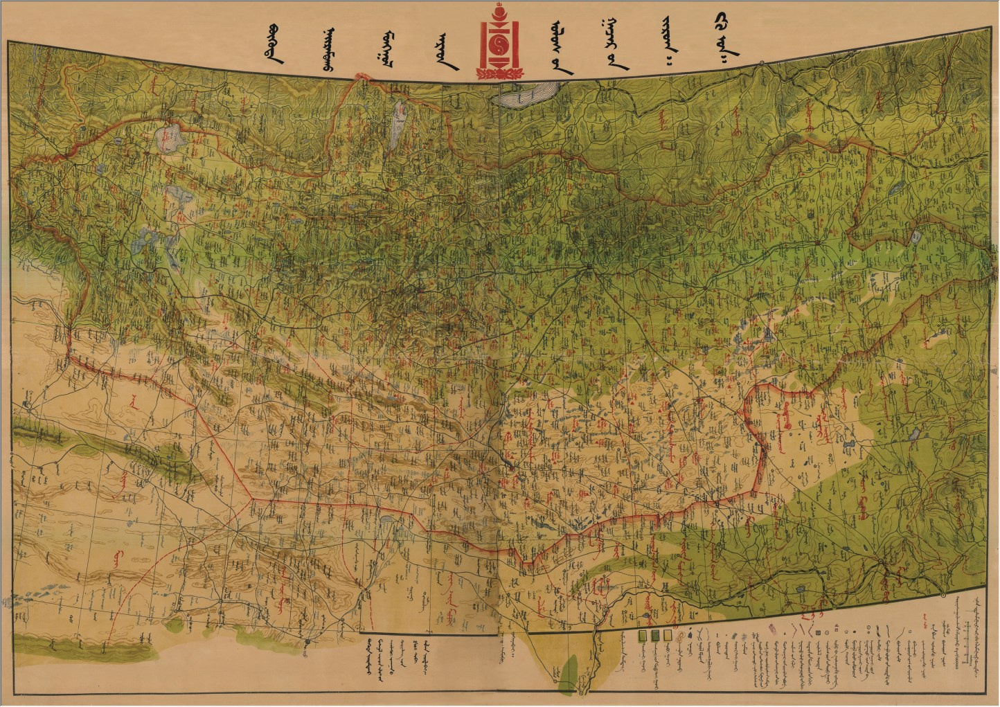
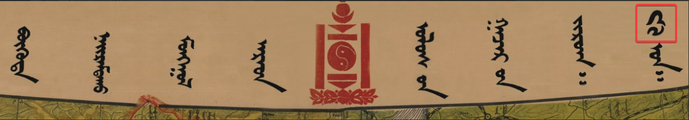
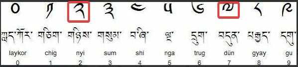
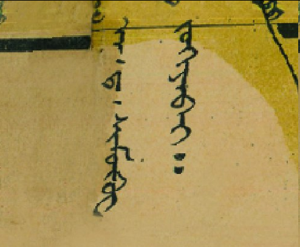

## Введение

Андрей Дмитриевич Симуков, известный исследователь, географ и картограф Монголии, известный в народе как Шар Дамдинсурэн ([вики-ру](https://ru.wikipedia.org/wiki/%D0%A1%D0%B8%D0%BC%D1%83%D0%BA%D0%BE%D0%B2,_%D0%90%D0%BD%D0%B4%D1%80%D0%B5%D0%B9_%D0%94%D0%BC%D0%B8%D1%82%D1%80%D0%B8%D0%B5%D0%B2%D0%B8%D1%87), [вики-мн](https://mn.wikipedia.org/wiki/%D0%90%D0%BD%D0%B4%D1%80%D0%B5%D0%B9_%D0%A1%D0%B8%D0%BC%D1%83%D0%BA%D0%BE%D0%B2)).

Два основных труда Симукова по картографии МНР:

* Географический атлас Монгольской Народной Республики, 1934 г. ([подробно в отдельной статье](/notes/simukov-atlas-text-maps/))
* Карта Монгольской Народной Республики, 1937 г.

В этой статье речь пойдет о зеленой карте Симукова. Большое спасибо Рустаму Сабирову за помощь с монгольским и Natsagdorj Battsengel за знакомство с картой.

## Зеленая карта Симукова

Карта Монгольской Народной Республики, 1937 г. известна в Монголии как «Ногоон карт» (Симуковын ногоон карт) или Зеленая карта. Почему зеленая? Вот поэтому:

Упоминается, что карта была издана на монгольском (монгол бичиг) и русском языках. Не смотря на то, что карта является одной из первых полноценных карт Монголии, найти ее в интернете практически невозможно. Есть упоминания, что она есть в музеях и можно найти фотографии в Facebook ([1](https://www.facebook.com/photo/?fbid=1410422052411669&set=a.709548825832332), [2](https://www.facebook.com/MongolianGeographyOlympiad/posts/pfbid08CcFEanPCFFqbe52FVJWyVfxGdbeu2o9yqjJutJrSN5Frs1fBrKXrHG4NaV2CvFSl)).

")

Год издания

Интересно, что в заголовке карты указан не 1937, а 27 год.

Со страницы [Mongolian Geography Olympiad - Монголын газарзүйн олимпиад](https://www.facebook.com/MongolianGeographyOlympiad/posts/pfbid08CcFEanPCFFqbe52FVJWyVfxGdbeu2o9yqjJutJrSN5Frs1fBrKXrHG4NaV2CvFSl) в Facebook:

> Олон түмэнд Шар Дамдинсүрэн гэж алдаршсан, газарзүйч, зурагзүйч А.Д.Симуков.
> Олноо өргөгдсөний 27-р он буюу 1938 онд зохиосон "Симуковын ногоон" гэж нэртэй "БНМАУ-ын Газрын зураг". Герман улсад 3000 хувь хэвлэжээ.

Гуглоперевод:

> А.Д. Симуков, географ и картограф, известный в народе как Шар Дамдинсурэн.
> «Карта Китайской Народной Республики» под названием «Зеленый Симуков» создана в 1938 году, на 27-й год восстания. В Германии было напечатано 3000 экземпляров.

Олноо өргөгдсөний («год восстания) 27-р - это летоисчисление от 1911 года, когда монголы объявили независимость и на престол возвели Богдо-гэгэна. Олноо өргөгдсөний - это часть его титула - многими возведенный ([вики-мн](https://mn.wikipedia.org/wiki/%D0%9E%D0%BB%D0%BD%D0%BE%D0%BE_%D3%A9%D1%80%D0%B3%D3%A9%D0%B3%D0%B4%D1%81%D3%A9%D0%BD), [гуглоперевод](https://mn-m-wikipedia-org.translate.goog/wiki/%D0%9E%D0%BB%D0%BD%D0%BE%D0%BE_%D3%A9%D1%80%D0%B3%D3%A9%D0%B3%D0%B4%D1%81%D3%A9%D0%BD?_x_tr_sl=mn&_x_tr_tl=ru&_x_tr_hl=en&_x_tr_pto=wapp)). Т.е. 27-й от 1911-го или 1937-й от РХ.

## Полная версия карты

[Полная версия карты](https://drive.google.com/file/d/14zPBWTrvcD_m12KaB2b9pedNkbY_EkpT/view?usp=sharing), JPG, 34 Mb, 4967 x 3508 px. Для пользователей ГИС, можно также скачать [привязанную версию карты](https://drive.google.com/file/d/15JNaA0bZVEs0LwksYcxHjv20Nr1qcKN3/view?usp=sharing), GeoTIFF.

## Интерактивная версия карты с географической привязкой

На интерактивной версии можно увидеть как она соотносится с современными картами.

https://buddhistpilgrim.nextgis.com/resource/117/display?panel=layers

## Авторство Симукова

То, что карту создал Симуков отмечается во многих публикациях.

Базаргур, Д., 2018. А.Д. Симуков и картографическая наука в Монголии ([PDF](https://minpaku.repo.nii.ac.jp/record/7575/files/SER66%EF%BC%88%E6%94%B9%E8%A8%82%EF%BC%89_06.pdf))

> Карта Монгольской Народной Республики  /масштаб 1 : 2.000.000,
>
> 1937 г./ создана на основе методики атласа физической географии.
>
> На ней детально указаны особенности ландшафта, горы, долины,
>
> леса, реки, озера, родники, водоемы, причем с указанием
>
> населенных пунктов, городов, сетей дорог, границ, таки
>
> административных единиц как аймаки. Карта прекрасно читаема.

Цолмон П., 2007. Сердце, отданное Монголии. // А.Д. Симуков. Труды о Монголии и для Монголии. Осака, 2007. ([PDF](https://www.geokniga.org/books/30330))

> Первая географическая карта Монгольской Народной Республики составлена русским исследователем В.И.Лисовским. А следующей была знаменитая "зеленая карта" А.Д.Симукова. Трудно переоценить ее значение. Это была первая подробная и тиражированная географическая карта, благодаря которой монголы смогли ясно представить себе конфигурацию своей страны.

На самой карте есть текст: «А.Д. Симуков создал».

## Симуков и Мурзаев

Однако, в статье Болормаа и Оюунханда (Болормаа Б., Оюунханд Б., 2016. Историческое развитие и  современное состояние картографии Монголии. [PDF](https://cyberleninka.ru/article/n/istoricheskoe-razvitie-i-sovremennoe-sostoyanie-kartografii-mongolii?ysclid=m11w0nqi47903967053)) вдруг пишут, что карту такого же масштаба и в том же 1937 якобы создал Э.М. Мурзаев:

> В 1937 г. составлена и издана карта Монгольской Народной Республики в масштабе 1: 2 000 000 специалистом - картографом из Советского Союза Э.М. Мурзаевым, который работал заведующим Географическим институтом МНР в 1940-1944 годах. Он впервые создал, редактировал и издал карту административно-территориального деления МНР в масштабе 1: 2 000 000 в проекции Гаусса.

Либо это ошибка, либо речь идет о какой-то другой карте, следов которой не находится. Полной ссылки на карту в статье не приводится. Э.М. Мурзаев, был командирован Президиумом Академии Наук СССР в качестве специалиста географа в Ученый Комитет МНР в сентябре 1940 года.

Интересно, что у [самого Мурзаева](https://elib.rgo.ru/handle/123456789/226977?ysclid=m11wigcjsn856003303) в описании исследований Монголии изданном в 1948 Симуков как исследователь Монголии вообще не упоминается. Возможно это связано с тем, что Симуков был реабилитирован только в 1956 г. (Мурзаев, Эдуард Макарович (1908-1998). Географические исследования Монгольской народной республики \[Текст\] / Э.М. Мурзаев ; Акад. наук СССР, Ин-т географии и Монгол. комис. - Москва ; Ленинград : Изд-ва Акад. наук СССР, 1948. - 211 с. : ил., 2 л. карт. - (Серия "Итоги и проблемы современной науки"). - Библиогр.: с. 185-203. - Указ. лич. имен: с. 204-209.).

При этом известно, что Мурзаев анализировал наследие Симукова (у Цолмон П., 2007, см. ссылку выше):

> Академик Ш.Цэгмид вспоминал: "После его ареста опустело географическое отделение, собранные материалы, отчеты, рукописи неопубликованных книг, статьи и полевые дневники, разбросанные по чужим шкафам и стеллажам, были буквально на грани того, чтобы быть утерянными. Надо было их собрать и привести в порядок, создать фонд рукописей. Эту работу выполнил Э.М.Мурзаев, он изучил эти материалы. Мы с Ц. Пунцагноровом помогали ему.

Наконец Мурзаев и сам упоминает карту Симукова (у Цолмон П., 2007, см. ссылку выше):

> "Первое, с чего начал в Улан-Баторе - привел в порядок все географические карты Монголии и большое количество рукописей, написанных различными исследователями страны в разное время.
> ...
> Следует отметить большое произведение по географии Монголии, достаточно полное для своего времени. А.Д.Симуков интересовался и картографией. Он опубликовал карту МНР в русском и монгольском вариантах."

Э.М. Мурзаев, Рассказы об ученых и путешественниках, М., 1979, с. 75, 77 (не смог найти книгу).

### Итого

Вводим в оборот не упоминания карты, а саму карту, ценный источник топонимической информации. Пользуйтесь.

## Комментарии

[**Обсудить**](https://t.me/answer42geo/38)
