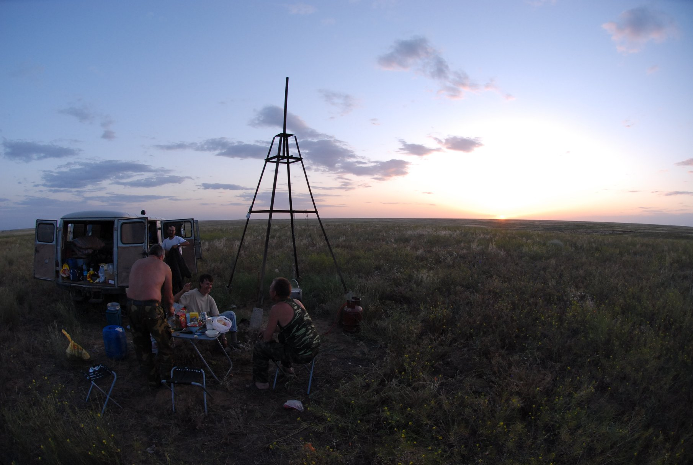
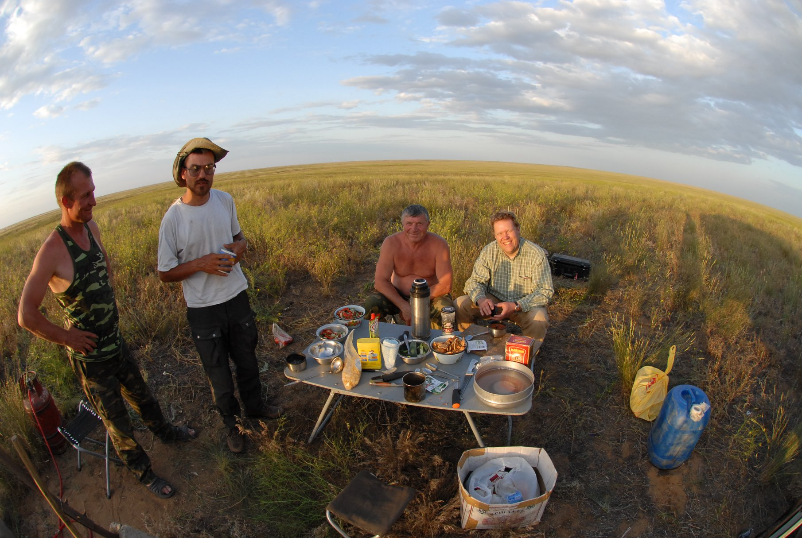

## Введение

Сегодня (5 апреля 2025) исполнилось 25 лет заказнику Степной созданному в 2000 г.

С заказником у меня связан важный период жизни, когда я делал PhD. В заказнике и рядом (Республика Калмыкия и Астраханская область) провел несколько полевых сезонов, о чем накопил массу позитивных воспоминаний.

Поздравляю коллектив и публикую фото сезонов 2008-2009 в основном из заказника, как мы там бродили по полям, метили и выпускали сайгаков. Маугли, Фолкер, Анна Анатольевна Лущекина, всем большой привет.

С нами больше нет Анатолия Васильевича Хлуднева, тогдашнего директора заказника, который очень помогал во всем.

## Фотографии

## Комментарии

[**Обсудить**](https://t.me/answer42geo/76)
