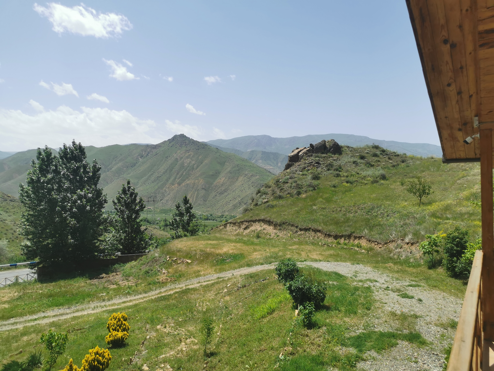

## Введение

* Яндекс Go работает, деньги с присоединенной карты Мир снимаются без проблем
* Такси очень дешевое

## Фото

Огромное количество гнезд аистов с ними самими в деревне Суренаван (Surenavan, Սուրենավան)

Поближе гнездо, кроме аистов в нем живет куча более мелких птиц.

Шелковица, он же тутовник - Mulberry, лат. сем. Moraceae

Вид с балкона конторы Arpa Protected Landscape, ООПТ особой организационной формы. Рядом с Арени

Шашлык

Монастырь Нораванк, церковь [Сурб Карапет](https://ru.wikipedia.org/wiki/%D0%9D%D0%BE%D1%80%D0%B0%D0%B2%D0%B0%D0%BD%D0%BA#%D0%A6%D0%B5%D1%80%D0%BA%D0%BE%D0%B2%D1%8C_%D0%A1%D1%83%D1%80%D0%B1_%D0%9A%D0%B0%D1%80%D0%B0%D0%BF%D0%B5%D1%82) (Սուրբ Կարապետ). Рядом с Арени.

Монастырь Нораванк, церковь Сурб Карапет и [Сурб Аствацацин](https://ru.wikipedia.org/wiki/%D0%9D%D0%BE%D1%80%D0%B0%D0%B2%D0%B0%D0%BD%D0%BA#%D0%A6%D0%B5%D1%80%D0%BA%D0%BE%D0%B2%D1%8C_%D0%A1%D1%83%D1%80%D0%B1_%D0%90%D1%81%D1%82%D0%B2%D0%B0%D1%86%D0%B0%D1%86%D0%B8%D0%BD) (Սուրբ Աստվածածին). Рядом с Арени.

Монастырь [Гегард](https://ru.wikipedia.org/wiki/%D0%93%D0%B5%D0%B3%D0%B0%D1%80%D0%B4) (Гегардаванк, Գեղարդ, Գեղարդավանք)

"[Скальная симфония](https://ru.wikipedia.org/wiki/%D0%A1%D0%B8%D0%BC%D1%84%D0%BE%D0%BD%D0%B8%D1%8F_%D0%BA%D0%B0%D0%BC%D0%BD%D0%B5%D0%B9)" - скальный массив с проявлением столбчатой отдельности базальта. Вход 300 драм.

Вид с тропы между скальной симфонией и храмом Гарни.

Храм [Гарни](https://ru.wikipedia.org/wiki/%D0%93%D0%B0%D1%80%D0%BD%D0%B8_(%D1%85%D1%80%D0%B0%D0%BC))

Озеро [Севан](https://ru.wikipedia.org/wiki/%D0%A1%D0%B5%D0%B2%D0%B0%D0%BD) (Սևանա լիճ) - самое большое озеро Кавказа, второе по выоте пресноводное озеро после Титикака.

Монастырь [Агарцин](https://ru.wikipedia.org/wiki/%D0%90%D0%B3%D0%B0%D1%80%D1%86%D0%B8%D0%BD_(%D0%BC%D0%BE%D0%BD%D0%B0%D1%81%D1%82%D1%8B%D1%80%D1%8C)) (Հաղարծին), церковь Сурб Аствацацин

Назад

Пока!

