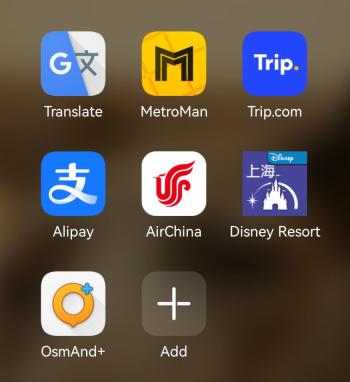
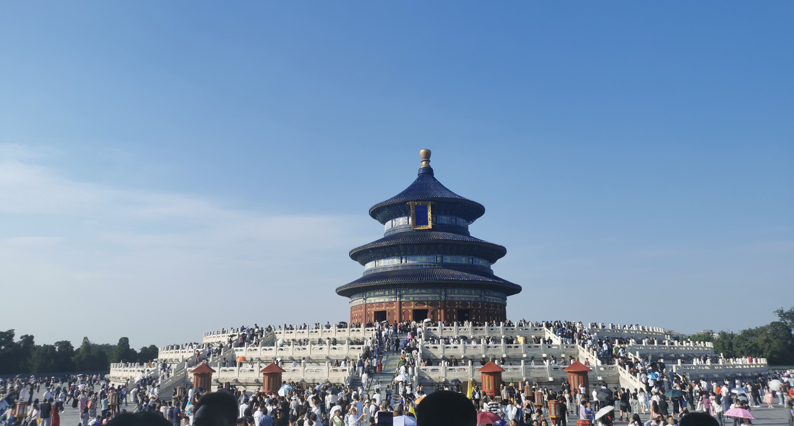
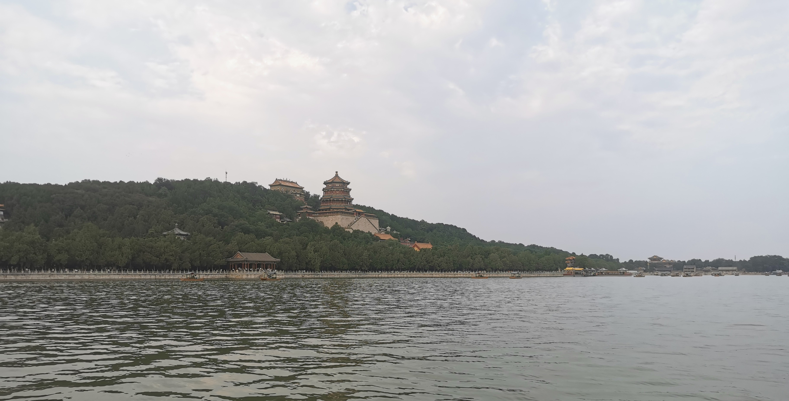
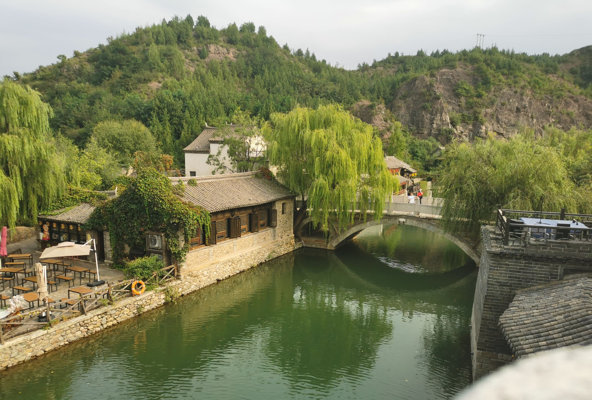
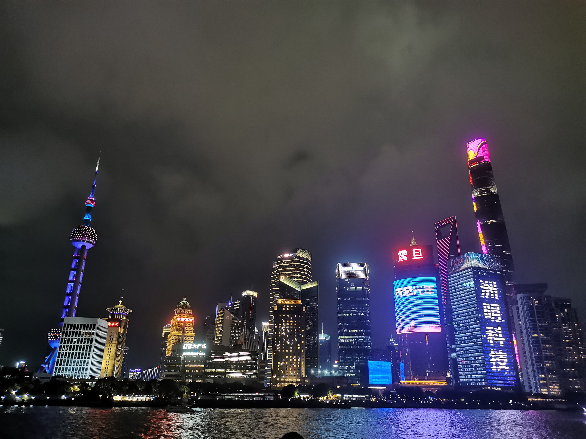
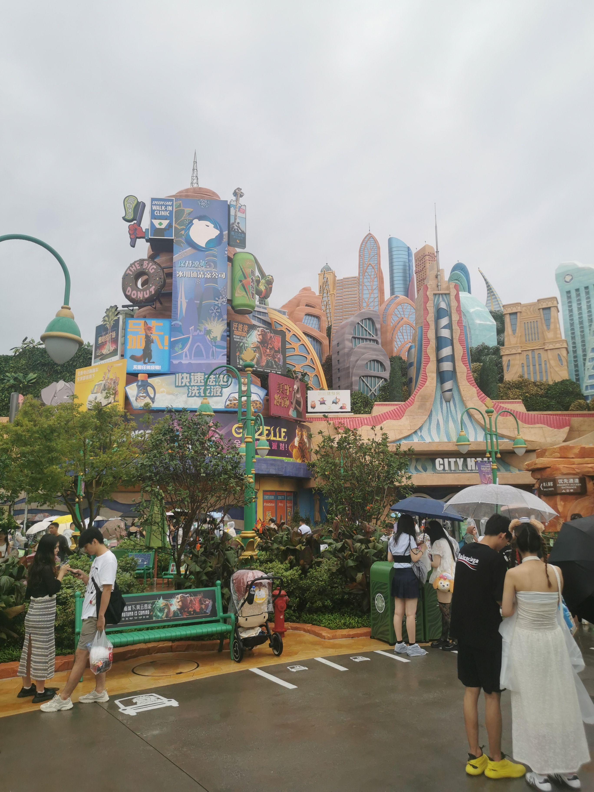
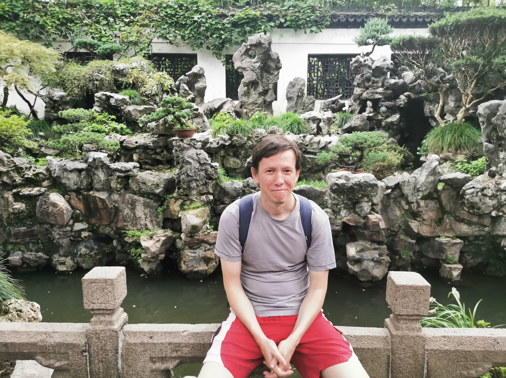
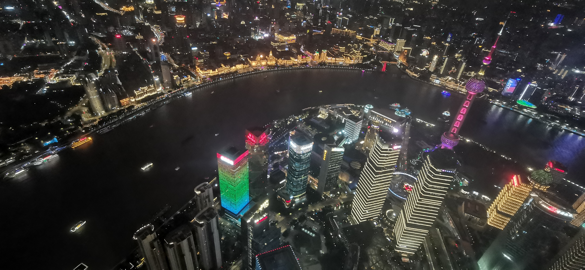
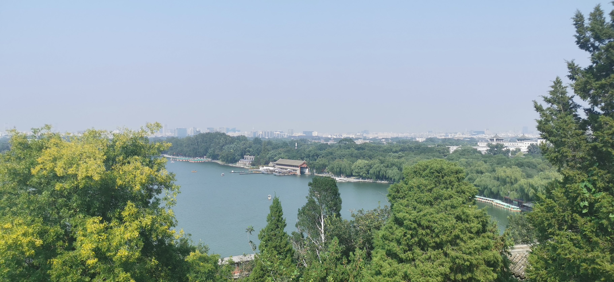

## Введение

Все, что нужно каждому, кто собирается в поездку, чтобы не сильно страдать с организацией. Только личный опыт и факты. В этом описании нет оценок, что лучше/хуже и ответов на вопросы почему туда, а не сюда.

Дополнительные материалы:

* [Таблица достопримечательностей](https://docs.google.com/spreadsheets/d/1wQWxpixx_zXWVe4z8IMSSRKlxDJRIc21t_Bc3ZHolJU/edit?usp=sharing)
* [Карта достопримечательностей](https://www.google.com/maps/d/u/0/edit?mid=18gX7Y43jFTkFFH_OofpoC7NjD0D04ww&usp=sharing) (только Пекин)

## Условия

1. 3 человека
2. 10 полных дней
3. Наличие иностранной карты.
4. Смартфон с Android и Google Play.

Вы можете использовать эти рекомендации и если у вас другие условия, но с некоторыми моментами вам будет нужно разбираться отдельно.

## Подготовка

До поездки в Китай строго обязательно:

1. Поменять наличные. Курс на начало 09.2024: 13.5 рублей за 1 юань.
2. Настроить VPN
3. Забронировать отель

В Китае сразу по прибытии:

1. Покупаем SIM карту в China Mobile или China Unicom. 100 юаней, 20 Gb, 400 минут в месяц. Ищем ближайшее отделение поиском на карте или спрашиваем в отеле на ресепшн, они знают.

### Приложения и основные активности

Переключаем язык Android на английски. Все приложения ставим стандартно через Google Play.

* **Alipay** --- **оплата** везде и за всё. Регистрируем на российский номер телефона. Подтверждаем личность, вводим данные загран паспорта. Добавляем данные банковской карты.
    Внимание: Alipay берет комиссию за любые платежи больше 200 юаней --- 3%.
    Внимание: Иностранный банк тоже может брать дополнительную комиссию за платежи из зарубежа (относительно положения банка).

* **Metroman** --- **метро** в Пекине и Шанхае. Добавляем пакеты данных для этих городов, чтобы работало без интернета.
    Стоимость зависит от дальности, от 3 до 6 юаней за человека. Билеты покупаются в автоматах на станциях. Сканируем QR с помощью Alipay.

* **Trip.com** --- оплата билетов на **поезд**, **достопримечательностей и отели**. Берут комиссию, но иногда гораздо удобнее, чем китайские сайты, особенно если нужно купить билет заранее, например на поезд и в Дисней.
* **Booking** --- резервирование отелей. Отдельного приложения не нужно, можно через браузер. Удобнее Trip.com тем что оплатить можно в самом отеле как удобно (в том числе наличными).
* **v2rayNG + конфиг VLess** --- **VPN**.
* **OsmAnd или Organic maps** --- **карты** для ориентирования. Добавляем пакеты данных для нужных городов, чтобы работало без интернета.
* **Air China** --- **перелет**. Через сайт пройти регистрацию на рейс и выбрать места  --- НЕВОЗМОЖНО. В приложении --- без проблем.
* **Google Translate** --- **переводы**. Скачиваем пакеты данных для китайского языка, чтобы работало без интернета.
* **Shanghai Disney Resort** --- Дисней. Обязательно ставим, чтобы знать куда идти и где какое расписание, время ожидания.

## Расходы

В тыс.р

1. Перелет --- 117
2. Проживание --- 72
3. Транспорт ([визы](/notes/visa-china-2024/), метро, такси) --- 36
4. Поезд Пекин-Шанхай-Пекин --- 49
5. Достопримечательности --- 38
6. Еда --- 29

## Расписание --- коротко

День 1. Храм неба, Цяньмэнь Дацзе.

День 2. Летний дворец

День 3. Губэй-Симатай

День 4. Поезд в Шанхай

День 5. Нанкин роуд. Набережная Вайтань/Бунд

День 6. Парк Дисней

День 7. Югарден. На кораблике по Хуанпу. Башня Шанхай

День 8. Поезд в Пекин, Санлитун

День 9. Житань, Жемчужный рынок

День 10. Бэйхай. Цзиньшань. Ванфуцзинь

## Расписание --- подробно

### День 1. Храм неба, Цяньмэнь Дацзе

Описание: храмово-монастырский комплекс и улица для гуляния.

Стоимость: 34 юаня за человека с дополнительными экспозициями (школьный 17).

Метро: Tianqiao

### День 2. Летний дворец

Описание: летняя резиденция императоров, 3000 строений на окраине Пекина. Озеро с паромами и лодками.

Стоимость: 30 юаней за человека (школьный 15).

Метро: Beigongmen

### День 3. Губэй-Симатай

Описание: Туристический городок Губэй («Водный город») с выходом к участку Великой Китайской стены Симатай. 2 часа от Пекина на автобусе. Существенно менее посещаемый.

Стоимость: Губэй --- 90 юаней за человека. Симатай: 150 юаней за человека с подъемником в одну строну (школьный 130).

Метро: Dongzhimen

### День 4. переезд в Шанхай

Метро: Beijingnan Zhan

### День 5. Нанкин роуд. Набережная Вайтань/Бунд

Метро: East Nanjing Road

### День 6. Парк Дисней

Стоимость: за 3 взрослых --- 156 USD на trip.com.

Метро: Disney Resort

### День 7. Югарден. На кораблике по Хуанпу. Башня Шанхай

Стоимость: Ююгарден --- 40 юаней (школьный 20). Кораблик --- 60. Башня --- 90. Всё --- за человека.

Метро: Yuyuan Garden

### День 8. переезд в Пекин, Санлитун

Метро: Hongqiao Railway Station (Шанхай)

Метро: Beijingnan Zhan (Пекин)

Метро: Tuanjiehu (Пекин) --- Санлитун.

### День 9. Житань, Жемчужный рынок

Описание: покупки чего-нибудь ненужного.

Метро: Yong'anli

Метро: Tiantan Dongmen

### День 10. Бэйхай. Цзиньшань. Ванфуцзинь

Описание: Два приятных парка рядом с Запретным городом. В Бэйхае можно покататься на лодочках, из Цзиньшаня есть смотровая на запретный город. Ванфуцзинь --- пешеходная улица, на -1 этаже Beijing Mall есть отличная утка по-пекински.

Стоимость: Бэйхай 10 за человека (школьный 5), Цзиньшань 2 за человека (школьный 1). Утка --- 98 юаней.

Метро: Beihaibei

## Комментарии

[**Обсудить**](https://t.me/answer42geo/40)
