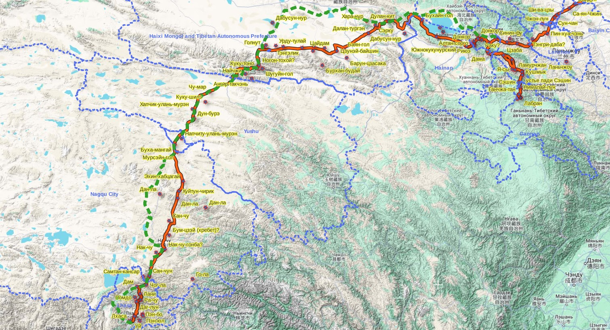
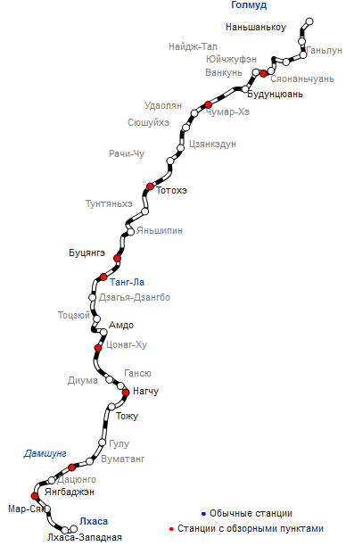

## Введение

Красное - маршрут Г. Ц. Цыбикова ([подробнее](/notes/tsybikov-map/)).

Зеленый пунктир - современная Цинхай-Тибетская железная дорога ([вики](https://ru.wikipedia.org/wiki/%D0%A6%D0%B8%D0%BD%D1%85%D0%B0%D0%B9-%D0%A2%D0%B8%D0%B1%D0%B5%D1%82%D1%81%D0%BA%D0%B0%D1%8F_%D0%B6%D0%B5%D0%BB%D0%B5%D0%B7%D0%BD%D0%B0%D1%8F_%D0%B4%D0%BE%D1%80%D0%BE%D0%B3%D0%B0)). Синин-Лхаса.

Синим - административное деление.

Современная ЖД процентов на 30 совпадает с путем паломников в Тибет. На участках от Голнута ([Голмуд](https://ru.wikipedia.org/wiki/%D0%93%D0%BE%D0%BB%D0%BC%D1%83%D0%B4)) до Мурсэйн-гол (420 км) и от Накчу до Дам (130 км) совпадение полное. 

Современные дороги - отражение исторических путей.

Для референса --- участок дороги от Голмуда до Лхасы из Википедии. [Источник](https://ru.wikipedia.org/wiki/%D0%A6%D0%B8%D0%BD%D1%85%D0%B0%D0%B9-%D0%A2%D0%B8%D0%B1%D0%B5%D1%82%D1%81%D0%BA%D0%B0%D1%8F_%D0%B6%D0%B5%D0%BB%D0%B5%D0%B7%D0%BD%D0%B0%D1%8F_%D0%B4%D0%BE%D1%80%D0%BE%D0%B3%D0%B0#Gif-%D0%B0%D0%BD%D0%B8%D0%BC%D0%B0%D1%86%D0%B8%D1%8F)

## Комментарии

[**Обсудить**](https://t.me/answer42geo/30)
