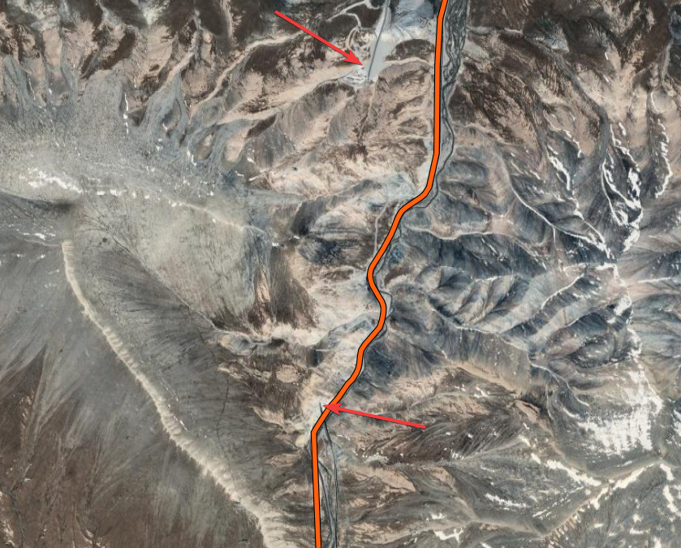
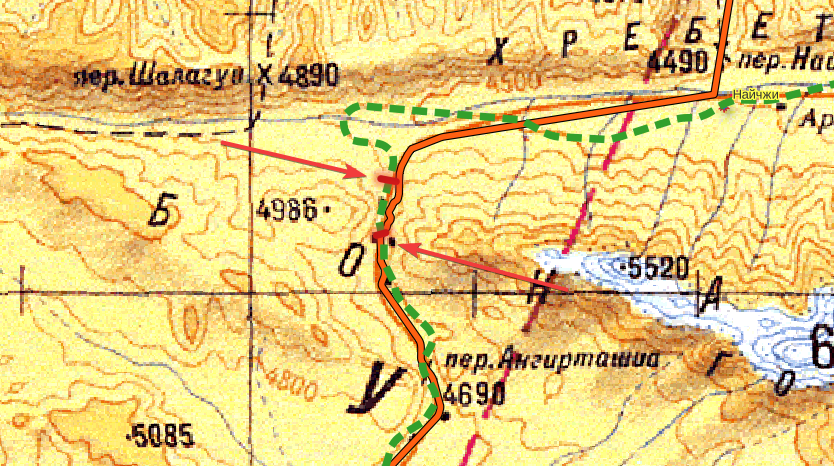
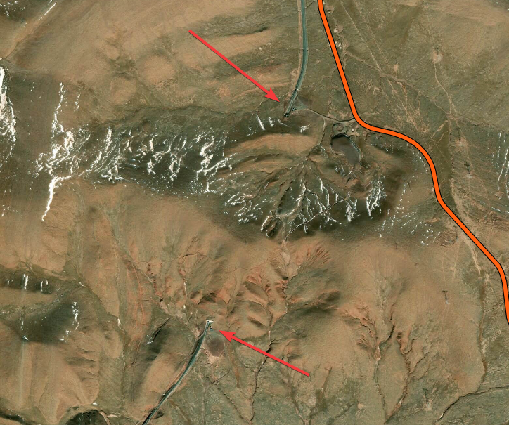
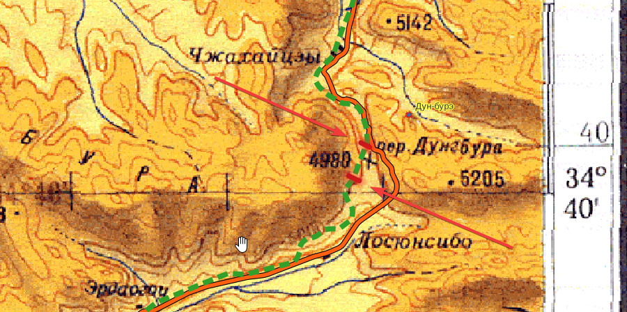

## Введение

Цинхай-Тибетская железная дорога ([вики](https://ru.wikipedia.org/wiki/%D0%A6%D0%B8%D0%BD%D1%85%D0%B0%D0%B9-%D0%A2%D0%B8%D0%B1%D0%B5%D1%82%D1%81%D0%BA%D0%B0%D1%8F_%D0%B6%D0%B5%D0%BB%D0%B5%D0%B7%D0%BD%D0%B0%D1%8F_%D0%B4%D0%BE%D1%80%D0%BE%D0%B3%D0%B0)), прошедшая частично [по маршруту Цыбикова](/notes/tsinhai-railroad-tsybikov/) знаменита своими высокогорными тоннелями.

Не сразу удалось их найти, но удалось.

Сначала иероглифы:

* 道 - дорога
* 隧   - тоннель
* 隧道 - тоннель, дорога
* 山隧道 - горный, тоннель, дорога

## Куньлуньский тоннель (Kunlunshan Tunnel)

Высота н.у.м. 4600 м, длина 1686 ([вики](https://ru.wikipedia.org/wiki/%D0%9A%D1%83%D0%BD%D1%8C%D0%BB%D1%83%D0%BD%D1%8C%D1%81%D0%BA%D0%B8%D0%B9_%D1%82%D0%BE%D0%BD%D0%BD%D0%B5%D0%BB%D1%8C))

昆仑山隧道, Куньлуньшань суйдао. Облегчает преодоление перевала Куньлуньшанькоу. На топокартах точно в месте тоннеля --- перевала не обозначено. До него есть перевал Найчжи, 4490 н.у.м. (по Цыбикову), он же Найчжукутур (по 5км), после него есть пер. Ангирташио, 4690 н.у.м.

[OpenStreetMap](https://www.openstreetmap.org/way/32084431#map=14/35.7007/94.0737), [Google Maps](https://maps.app.goo.gl/2knrLVP7W9QfxbUi8)

## Тоннель Фэнхошань (Fenghuoshan Tunnel)

Высота н.у.м. 4900, длина 1338 ([вики](https://ru.wikipedia.org/wiki/%D0%A4%D1%8D%D0%BD%D1%85%D0%BE%D1%88%D0%B0%D0%BD%D1%8C))

风火山隧道, Фэнхошань суйдао --- тоннель Ветреного вулкана.

Облегчает преодоление перевала Дун-бурэ (по Цыбикову), он же Дунгбура (5 км).

[OpenStreetMap](https://www.openstreetmap.org/way/154711311#map=13/34.6850/92.9120), [Google Maps](https://maps.app.goo.gl/2R1K6caYhqTYfBCa7)

## Комментарии

[**Обсудить**](https://t.me/answer42geo/31)
