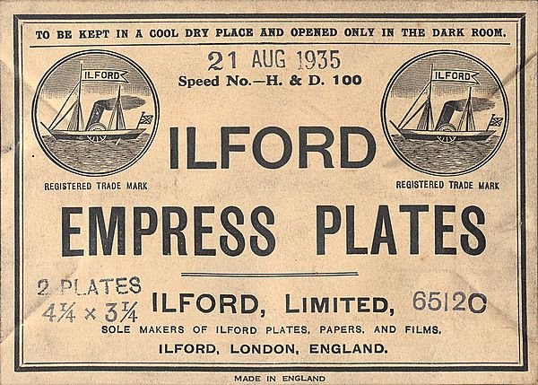

## Введение

Письмо Александра Григорьева от Императорского Русского Географического Общества «[Views of Great Tibet](https://www.loc.gov/item/2021667924/)» было написано от руки на английском языке и разослано в уважаемые географические сообщества мира вместе со знаменитыми 50-тью фотографиями запретной страны.

Письмо содержало информацию о том, какой техникой и расходниками пользовались путешественники-фотографы:

Фрагмент письма Александра Григорьева:

> Both had hand cameras called  "Self-worker" by Pipon
>
> in Paris, supplied with Anastigmatic lenses by Goerz
>
> Lenses III, N 00. The size of the original negatives is 9x6 1/2
>
> centimeters.
>
> Norzunov \[marked further \[N.\]\] used "Lumiere" plates, Ts'i-
>
> bikov (marked further (Z.)) - "Empress" plates of "The Bri-
>
> tannia Works".

Итак. Два первых фотографа Лхасы Г. Цыбиков и О. Норзунов использовали камеры "[Self-worker](https://www.collection-appareils.fr/x/html/camera-20999-Pipon_The%20Self%20Worker.html)" изготовленные братьями Jules и Alexandre Pipon в Париже.

[Источник](https://www.collection-appareils.fr/x/html/camera-20999-Pipon_The%20Self%20Worker.html)

Камеры были оснащены Anastigmatic lenses Goerz Lenses III, N 00. Типа [таких](https://www.ebay.com/sch/i.html?_from=R40&_trksid=p2332490.m570.l1313&_nkw=Goerz+Anastigmat+&_sacat=0):

GOERZ BERLIN DOPP-Anastigmat 210 мм F6.8 SERIES III DAGOR

Размер негативов: 9x6 1/2 см.

Норзунов использовал фотопластинки "Lumiere" ([небольшая коллекция разных других пластинок](/notes/photographic-dry-plates/)).

Цыбиков фотопластинки "Empress" производства "The Britannia Works".

На последнем скриншоте Ilford, а не The Britannia Works, так как первая поглотила вторую:

> 1898 became know as The Britannia Works (1898) Limited
>
> ...
>
> 1902 changed name to Ilford Limited

[История](https://www.ilfordphoto.com/about-us/history/) Ilford photo

[Australasian photo-review. Vol. 6 No. 11 (21 November 1899)](https://nla.gov.au/nla.obj-411219254/view?sectionId=nla.obj-423722476&partId=nla.obj-411236106#page/n0/mode/1up)

Такие образом, письмо, отправленное в 1904 содержало название компании которой уже не существовало.

У Андреева (Andreev A., 2013. Tibet. The earliest photographs by Russian travellers. 1900-1901) производитель уже Ilford.

Ссылается он при этом на русскоязычную сопроводительную записку к 50 фото «Виды Центрального Тибета».

## Комментарии

[**Обсудить**](https://t.me/answer42geo/17)
