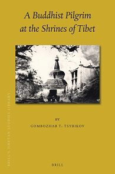

## Введение

Перевод главного труда Г.Ц. Цыбикова «Буддийский паломник у святынь Тибета» на английский был выпущен Brill's Tibetan Studies Library.

Цитирование: Tsybikov, G. Ts., 2017. A Buddhist Pilgrim at the Shrines of Tibet (Williams, P., Translator, Emerich, J.W., Advisor). Brill's Tibetan Studies Library, Volume: 42.

https://brill.com/display/title/33921?rskey=wtBjNE&result=1

Аннотация

> Tsybikov was the first scholar with a European education to visit Tibet and describe its monasteries and temples as an eyewitness traveler and an objective researcher. Tsybikov had two distinct advantages: an ethnic Buryat he could travel as a Buddhist pilgrim and thus have a chance of reaching its mysterious capital Lhasa, the religious and political center of Tibet, which was barred to outsiders, especially Europeans; as a scholar educated at a European university he had the historical and linguistic background to understand and describe what he saw. Tsybikov understood the secretive nature of the lama state and was careful to hide his work as a researcher. It was his journal that became the basis of A Buddhist Pilgrim at the Shrines of Tibet, which has both the vividness of a traveller's eyewitness account and the informed detachment of a scholar. As a record of both religious practices and the everyday life in Tibet before Chinese inroads during the twentieth century effaced that way of life, Tsybikov's book is a unique and invaluable snapshot of a lost culture.

Перевод аннотации

Цыбиков был первым ученым с европейским образованием, посетившим Тибет и описавшим его монастыри и храмы как путешественник-очевидец и объективный исследователь. У Цыбикова было два важных преимущества: будучи этническим бурятом, он мог путешествовать как буддийский паломник и, таким образом, получить шанс попасть в таинственную столицу Лхасу, религиозный и политический центр Тибета, закрытый для чужеземцев, особенно для европейцев; как ученый, получивший образование в европейском университете, он имел историческую и лингвистическую подготовку, чтобы понять и описать то, что увидел. Цыбиков понимал скрытный характер ламского государства и осторожно скрывал свою исследовательскую работу. Его дневник стал основой для книги «Буддийский паломник у святынь Тибета», которая сочетает в себе живость рассказа очевидца и осведомленное беспристрастие ученого. Как запись религиозных практик и повседневной жизни Тибета до того, как китайское влияние в двадцатом веке стерло этот уклад, книга Цыбикова представляет собой уникальный и бесценный снимок утраченной культуры.

## Список топонимов

По [первому путешествию](/notes/tsybikov-map/) Цыбикова. Дубли убраны.

### Топонимы в порядке упоминания

Урга - Urga

Бухук - Bukhuk

Ара-чинда - Ara-chinda

Хара-толгой - Khara-tolgoi

Булум - Bulum

Шинэ-чойра - Shene-choira

Хубер - Khuber

Дэрису - Derisu

Тэбчийн-булум - Tebchiyin-bulum

Хармакту - Kharmaktu

Шанхай - Changain

Хоир-ундур - Khoir-undur

Долон-шига-цзагин-сумэ - Dolon Shigazagin-sume

Бударганайн-шинэ-усу - Budarganain-shene-usu

Думда-гун - Dumda-gun

Ноян-Элису - Noyan-elisu

Арайн-гашун-худук - Arain-gashun-khuduk

Добойн-цзак - Doboin-zak

Тукумун-сумэ - Tukumun-sume

Бургастайн-булак - Burgastain-bulak

Хурай-Чинда - Khurai-chinda

Чжартайн-дабасуну-байшин - Jartain-dabasunu-baishin

Чжартайн-нур - Jartain-nor

Дын-коу - Deng-kou

Хуан-хэ - Huang He

Хото-нугой - Khoto-nugoi

Цаган-булак - Tsagan-bulak

Дэрисун-хото - Derisun-khoto

Ланьчжоу - Lanzhou

Цзуха - Zukha

Чахарун-худук - Chakharun-khuduk

Гун-худук - Gun-khuduk

Сумэйн-худук - Sumeyin-khuduk

Дынь-юань-фу - Deng-yuan-fu

Бугуту - Bugutu

Нинся-фу - Ningxia-fu

Баян-сумбэр - Bayan-sumber

Барун-хит - Barun-khit

Цзун-хит - Zun-khit

Цаган-хошун - Tsagan-khoshun

Тосо - Toso

Ундурн-хайр-хан - Undur-khairkhan

Цокту-хурэ - Tsoktu-khure

Сэрхэ - Serkhe

Хара-обо - Khara-obo

Тэнгри-элису - Tengri-elisu

Ехэ-Тунхэй - Ekhe-tunkhe

Чулун-онгоца - Chulun-ongotsa

Байдун - Bai-dun

Са-ян-Чжин - Sa-yang-jing

Ван-чжа-дянь - Wang-zha-dian

Ши-ва-цзы - Shi-wa-zu

Сун-чан - Sung-Chang

Даглун - Taglun

Пин-хуа-чэнь - Ping-hua-cheng

Чжон-лун - Jonlun

Дайтун - Datong

Тэнгри-даба - Tengri-daba

Синин - Xining

Нянь-бо-сянь - Nianbo-xian

Марсан-лха - Martsan-lha

Синин-фу - Xining-fu

Гуй - Gui

Гумбум - Kumbum

Дама - Danma

Цзаба - Tsaba

Баянь - Ba-yan

Ламурчжан - Lamurjan

Кушмык - Kushmyck

Сэшин - Seshin

Хумэй-лун - Khumelun

Я-сы - Ya-si

Нималай-лун - Nyimalai-lun

Ганчжа-тан - Kangyap-tan

Сан-чу - Sanchu

Лабран - Labrang

Донкор - Donkhor

Раку - Raku

Чжинь-ху - Jin-hu

Алтан-сорго - Altan-sorgo

Ара-гол - Ara-gol

Кукунор - Kokonor

Бухайн-гол - Bukhain-gol

Южнокукунурский - South Kokonor

Дабусун-нур - Dabusun-nor

Шарга - Sharga

Дулан-кит - Dulan-kit

Дам-намак - Dam-namak

Хара-нур - Khara-nor

Сэрку - Serku

Кукдэй-байшин - Kukedei-baishin

Далан-тургэн - Dalan-turgen

Эргэ-цэ - Erghetse

Цайдам - Tsaidam

Шара-гол - Shara-gol

Бурхан-будай - Burkhan-budai

Барун-цзасака - Barun-zasak

Эрдэни-цзу - Erdeni-zu

Баян-гол - Bayan-gol

Эбэксун - Ebkesun

Цаган - Tsagan

Цзунэй-байшин - Zunei-baishin

Хорголчжи - Khor-golji

Исэлчжин - Iseljin

Урту - Urtu

Номогон-хото - Nomogon-khoto

Номогон-гол - Nomogon-gol

Тэнгэлик - Tengelik

Барунай-байшин - Barunai-baishin

Ехэ-намак - Ekhe-namak

Далай - Dalai

Урду-тулай - Urdu-tulai

Хойто-тулай - Khoito-tulai

Голнут - Golnut

Найчжин-гол - Naiji

Шугуйн-гол - Shuguyin-gol

Ногон-тохой - Nogon-tokhoi

Куку-тоно - Kuku-tono

Думда-найчжи - Dumda Naiji

Найчжин-гол - Naijin-gol

Найчжи - Naiji

Ангир-такчэнь - Anghir-takchen

Чу-мар - Chu-mar

Куку-шилэ - Kükü-shile

Хапчик-улань-мурэн - Khapchik-ulan-muren

Дун-бурэ - Dun-bure

Буха-магнай - Bukha-magnai

Напчиту-улань-мурэн - Napchitu-ulan-muren

Буха-мангай - Bukha-magnai

Мурсэйн-гол - Mursein-gol

Дан-ла - Dan-la

Думда-хабцагай - Dumda-khabtsagai

Эхин-хабцагай - Ekhin-khabtsagai

Хуйтун-чирик - Khuitun-chemrik.

Сан-чу - San-chu

Бум-цзэй - Bum-tse

Нак-чу-цонра - Nakchu-tsonra

Нак-чу-гонба - Nak-chu-gönpa

Дре-чу - Dre-chu

Нак-чу - Nak-chu

Сан-чун - San-chu

Самтан-кансар - Samtan-kansar

Ра-чу - Ra-chu

Чог-ла - Chok-la

Найман-субурга - Naiman-suburga

Лани - La-nyi

Помдо - Po-mdo

Уй - Ü

По-мдо-цзон - Po-mdo-dzon

Даг-лун - Taglun

Пэн-бо - Pen-bo

Лхун-дуб-цзон - Lündup-dzon

Пэн-юл - Pen-yul

Го-ла - Go-la

Брайбун - Drepun

Лхаса - Lhasa

### Топонимы по алфавиту

Алтан-сорго - Altan-sorgo

Ангир-такчэнь - Anghir-takchen

Ара-гол - Ara-gol

Ара-чинда - Ara-chinda

Арайн-гашун-худук - Arain-gashun-khuduk

Байдун - Bai-dun

Барун-хит - Barun-khit

Барун-цзасака - Barun-zasak

Барунай-байшин - Barunai-baishin

Баян-гол - Bayan-gol

Баян-сумбэр - Bayan-sumber

Баянь - Ba-yan

Брайбун - Drepun

Бугуту - Bugutu

Бударганайн-шинэ-усу - Budarganain-shene-usu

Булум - Bulum

Бум-цзэй - Bum-tse

Бургастайн-булак - Burgastain-bulak

Бурхан-будай - Burkhan-budai

Буха-магнай - Bukha-magnai

Буха-мангай - Bukha-magnai

Бухайн-гол - Bukhain-gol

Бухук - Bukhuk

Ван-чжа-дянь - Wang-zha-dian

Ганчжа-тан - Kangyap-tan

Го-ла - Go-la

Голнут - Golnut

Гуй - Gui

Гумбум - Kumbum

Гун-худук - Gun-khuduk

Дабусун-нур - Dabusun-nor

Даг-лун - Taglun

Даглун - Taglun

Дайтун - Datong

Далай - Dalai

Далан-тургэн - Dalan-turgen

Дам-намак - Dam-namak

Дама - Danma

Дан-ла - Dan-la

Добойн-цзак - Doboin-zak

Долон-шига-цзагин-сумэ - Dolon Shigazagin-sume

Донкор - Donkhor

Дре-чу - Dre-chu

Дулан-кит - Dulan-kit

Думда-гун - Dumda-gun

Думда-найчжи - Dumda Naiji

Думда-хабцагай - Dumda-khabtsagai

Дун-бурэ - Dun-bure

Дын-коу - Deng-kou

Дынь-юань-фу - Deng-yuan-fu

Дэрису - Derisu

Дэрисун-хото - Derisun-khoto

Ехэ-намак - Ekhe-namak

Ехэ-Тунхэй - Ekhe-tunkhe

Исэлчжин - Iseljin

Кукдэй-байшин - Kukedei-baishin

Куку-тоно - Kuku-tono

Куку-шилэ - Kükü-shile

Кукунор - Kokonor

Кушмык - Kushmyck

Лабран - Labrang

Ламурчжан - Lamurjan

Лани - La-nyi

Ланьчжоу - Lanzhou

Лхаса - Lhasa

Лхун-дуб-цзон - Lündup-dzon

Марсан-лха - Martsan-lha

Мурсэйн-гол - Mursein-gol

Найман-субурга - Naiman-suburga

Найчжи - Naiji

Найчжин-гол - Naiji

Найчжин-гол - Naijin-gol

Нак-чу - Nak-chu

Нак-чу-гонба - Nak-chu-gönpa

Нак-чу-цонра - Nakchu-tsonra

Напчиту-улань-мурэн - Napchitu-ulan-muren

Нималай-лун - Nyimalai-lun

Нинся-фу - Ningxia-fu

Ногон-тохой - Nogon-tokhoi

Номогон-гол - Nomogon-gol

Номогон-хото - Nomogon-khoto

Ноян-Элису - Noyan-elisu

Нянь-бо-сянь - Nianbo-xian

Пин-хуа-чэнь - Ping-hua-cheng

По-мдо-цзон - Po-mdo-dzon

Помдо - Po-mdo

Пэн-бо - Pen-bo

Пэн-юл - Pen-yul

Ра-чу - Ra-chu

Раку - Raku

Са-ян-Чжин - Sa-yang-jing

Самтан-кансар - Samtan-kansar

Сан-чу - San-chu

Сан-чу - Sanchu

Сан-чун - San-chu

Синин - Xining

Синин-фу - Xining-fu

Сумэйн-худук - Sumeyin-khuduk

Сун-чан - Sung-Chang

Сэрку - Serku

Сэрхэ - Serkhe

Сэшин - Seshin

Тосо - Toso

Тукумун-сумэ - Tukumun-sume

Тэбчийн-булум - Tebchiyin-bulum

Тэнгри-даба - Tengri-daba

Тэнгри-элису - Tengri-elisu

Тэнгэлик - Tengelik

Уй - Ü

Ундурн-хайр-хан - Undur-khairkhan

Урга - Urga

Урду-тулай - Urdu-tulai

Урту - Urtu

Хапчик-улань-мурэн - Khapchik-ulan-muren

Хара-нур - Khara-nor

Хара-обо - Khara-obo

Хара-толгой - Khara-tolgoi

Хармакту - Kharmaktu

Хоир-ундур - Khoir-undur

Хойто-тулай - Khoito-tulai

Хорголчжи - Khor-golji

Хото-нугой - Khoto-nugoi

Хуан-хэ - Huang He

Хубер - Khuber

Хуйтун-чирик - Khuitun-chemrik.

Хумэй-лун - Khumelun

Хурай-Чинда - Khurai-chinda

Цаган - Tsagan

Цаган-булак - Tsagan-bulak

Цаган-хошун - Tsagan-khoshun

Цайдам - Tsaidam

Цзаба - Tsaba

Цзун-хит - Zun-khit

Цзунэй-байшин - Zunei-baishin

Цзуха - Zukha

Цокту-хурэ - Tsoktu-khure

Чахарун-худук - Chakharun-khuduk

Чжартайн-дабасуну-байшин - Jartain-dabasunu-baishin

Чжартайн-нур - Jartain-nor

Чжинь-ху - Jin-hu

Чжон-лун - Jonlun

Чог-ла - Chok-la

Чу-мар - Chu-mar

Чулун-онгоца - Chulun-ongotsa

Шанхай - Changain

Шара-гол - Shara-gol

Шарга - Sharga

Ши-ва-цзы - Shi-wa-zu

Шинэ-чойра - Shene-choira

Шугуйн-гол - Shuguyin-gol

Эбэксун - Ebkesun

Эргэ-цэ - Erghetse

Эрдэни-цзу - Erdeni-zu

Эхин-хабцагай - Ekhin-khabtsagai

Южнокукунурский - South Kokonor

Я-сы - Ya-si

## Комментарии

[**Обсудить**](https://t.me/answer42geo/54)
