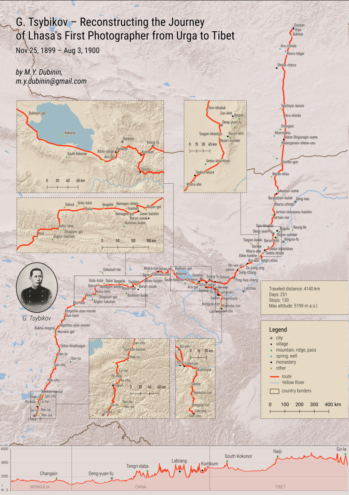

## Introduction

An ethnic Buryat and a trained scholar, Tsybikov made a single successful journey to Lhasa between 1899 and 1901, traveling in stages alongside groups of pilgrims. As a highly educated observer, Tsybikov produced the most detailed and methodical account of the journey [Tsybikov, G. Ts., 1919].

Here you can find a map of his travel with a short description. More detailed double-sided map product is [available in Russian](/notes/tsybikov-map/).

The map is based on research into 176 place names (toponyms) located along Tsybikov's route. For each place name, descriptive and cartographic information was sought in literature and cartographic sources to restore the location of the object on the modern map.

## Download

[Download a full-res map](https://drive.google.com/file/d/1IJSZHpMVHG_of8GldV8iomM0lTphShNG/view?usp=sharing) PNG, 2897 x 4098

## Acknowledgements

The author cordially acknowledge the assistance of Irina Garri, Nikolay Tsyrempilov, Dmitry Garmaev, Nomin Tsyrenova, Rustam Sabirov, and Nikita Murzintsev for their valuable advice and participation in the creation of this map.

Map design and processing for printing: Valentin Kishkun.

## Sources

1\. Tsybikov, G.Ts. 1991. Izbrannye trudy v dvukh tomakh. 2-e izd. pererab. T.1: Buddist-palomnik u svyatyn' Tibeta \[Selected Works in Two Volumes. 2nd ed. revised. Vol.1: A Buddhist Pilgrim at the Holy Sites of Tibet\]. Novosibirsk: Nauka.

2\. O Tsentral'nom Tibete. Doklad, prochitannyi 7 maya 1903 g. na obshchem sobranii Imperatorskogo Rossiiskogo Geograficheskogo obshchestva \[On Central Tibet. Report presented on May 7, 1903, at the General Assembly of the Imperial Russian Geographical Society\].

3\. Vykopirovka fragmenta marshruta Tsybikova G.Ts. 1899 g. s sayta muzeya Rerikha \[Excerpt of Tsybikov's 1899 route from the Roerich Museum website\].

4\. The original diaries of Tsybikov, G.Ts. (limited)

5\. Buddist-palomnik u svyatyn' Tibeta: Po dnevnikam, vedenym v 1899--1902 gg. / pod red. A. V. Grigoryeva \[i dr.\] \[A Buddhist Pilgrim at the Holy Sites of Tibet: Based on Diaries Kept in 1899--1902, edited by A. V. Grigoriev et al.\]. Petrograd: Izd-vo Rus. Geogr. o-va, 1919.

English toponyms are used from:

Tsybikov, G.Ts. 2017. A Buddhist Pilgrim at the Shrines of Tibet. Translated by Paul Williams. Brill, 2017. <https://brill.com/display/title/33921?language=en>.

## Layers

* Toponyms -- locations and names of geographical features mentioned by Tsybikov. Represented with different symbols depending on the type of feature (city, mountain, monastery, etc.).
* Route -- line of the reconstructed route.
* National borders -- modern borders of Mongolia and China.
* Water features -- Yellow River, Lake Qinghai, and other major bodies of water.
* Terrain -- base layer of the map.

The map also includes an elevation profile along the route. At points every 100 meters along the route, elevation data was taken from the ALOS WorldDem relief model.

## Video demo

Disguised as a Buddhist pilgrim, G. Tsybikov was the first to visit Lhasa in 1901, bringing back its first photographs. These images helped shape National Geographic as we know it today. The reconstruction drew from research into 176 toponyms mentioned in his travelogue.

https://x.com/nextgis/status/1853754816528261389

## Discuss

[**Questions or comments?**](https://t.me/answer42geo/56)
