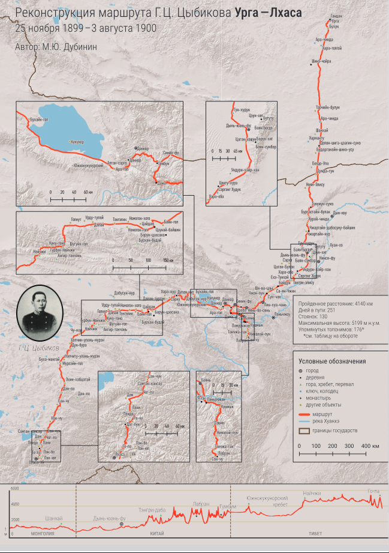

## Введение

**Реконструкция маршрута Г.Ц. Цыбикова Урга-Лхаса 25.11.1899 --- 3.08.1900. Автор: М.Ю. Дубинин** --- печатная карта формата А3, выпущенная к выставке «По следам Гомбожаба Цыбикова» приуроченной к 125-летию путешествия Цыбикова в Тибет и прошедшей в Хэб-Хаб-Центре (Улан-Удэ, ул. Борсоева 13/2) 07.07.2024.

Карта построена по результатам исследования 176 топонимов, расположенным по маршруту следования Цыбикова. По каждому топониму производился поиск описательной и картографической информации в литературных и картографических источниках с целью восстановить положение объекта на карте.

* [Полноразмерный PDF](https://drive.google.com/file/d/1Jso3EyS4W--vJ1DxulqSCI7OBehwcgZ1/view?usp=sharing), обе страницы.
* [Страница карты](https://drive.google.com/file/d/1MWSMY3u1An8bDrRSGSqdWiXxLyZZopN-/view?usp=sharing), JPEG, 2976 х 2104.
* [Страница таблицы](https://drive.google.com/file/d/1EKjphl3NuVbxGV1UFWfCbugpyIc0e3NB/view?usp=sharing), JPEG, 2976 х 2104.
* [English](/notes/tsybikov-map-en/) version

## Благодарности

Автор выражает искреннюю благодарность Ирине Гарри, Николаю Цыремпилову, Дмитрию Гармаеву, Номинь Цыреновой, Рустаму Сабирову и Никите Мурзинцеву за консультации и участие в создании этой карты.

Дизайн карты и подготовка к печати: Валентин Кишкун.

## Основные источники

1. Цыбиков Г.Ц, 1991. Избранные труды в двух томах. 2-е изд. перераб. Т.1: Буддист-паломник у святынь Тибета. Новосибирск: Наука. --- Основной источник, далее в тексте \[1\].
2. О Центральном Тибете. Доклад, прочитанный 7 мая 1903 г. на общем собрании Императорского Российского Географического общества
3. Выкопировка фрагмента маршрута Цыбикова Г.Ц. 1899 г. с сайта музея Рериха.
4. Дневники Г.Ц. Цыбикова, оригинал
5. Буддист-паломник у святынь Тибета: По дневникам, веденным в 1899--1902 гг. / под. ред. А. В. Григорьева \[и др\]. Петроград: Изд-во Рус. Геогр. о-ва, 1919.

## Информационные слои карты

* Топонимы --- местоположения и названия географических объектов упоминаемых Цыбиковым. Показаны разными условными обозначениями в зависимости от типа объекта (город, гора, монастырь и т.д.)
* Маршрут --- линия реконструированного маршрута.
* Границы государств --- современные границы Монголии и Китая.
* Водные объекты --- р. Хуанхэ, оз. Кукунор и другие крупные водные объекты.
* Рельеф --- базовая подложка карты.

Частью карты является профиль высот построенный по линии маршрута. В точках через каждые 100 м маршрута снята высота с рельефа ALOS WorldDem.

## Таблица топонимов

Карта (см. обратную сторону) сопровождается таблицей топонимов со следующей информацией:

* Топоним - название географического объекта как у Цыбикова. По умолчанию - \[1\], в остальных случаях см. Источники ниже.
* Найден - статус, найден или не найден топоним.
* Тип объекта - тип географического объекта
* Маршрут - находится ли топоним на маршруте или нет.
* Стоянка - номер стоянки по маршруту на один или больше ночей. Пропущенные номера - не привязаны к топонимам.
* Километраж - пройденное расстояние между этим и предыдущим топонимом.
* Страница - страница источника \[1\]. Пропуск - другие источники.
* Дата начала - дата первого упоминания
* Дата конца - дата когда топоним был оставлен.
* Участок - участок маршрута.

## Карта

## Таблица (обратная сторона)

## Комментарии

[**Обсудить**](https://t.me/answer42geo/26)
