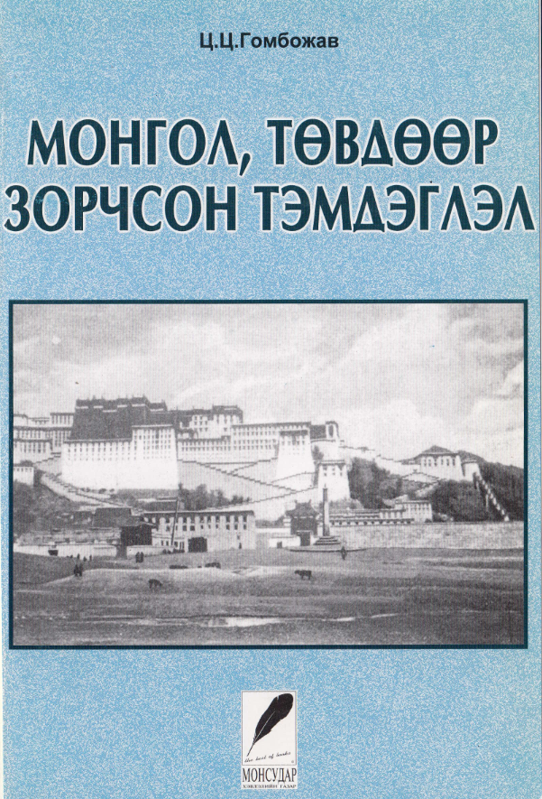
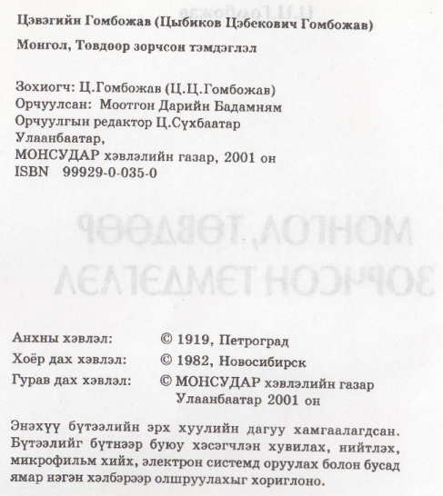
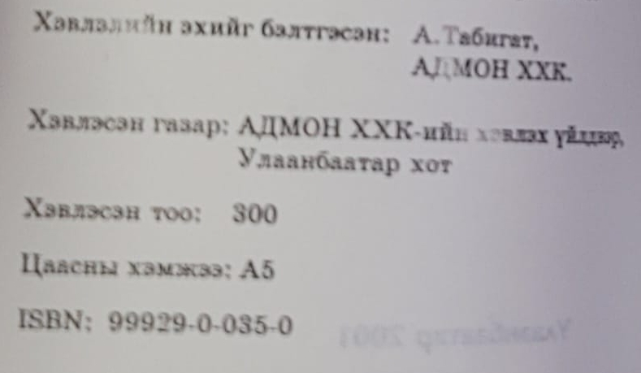

## Введение

Перевод основного описания путешествия Г.Ц. Цыбикова «Буддист-паломник у святынь Тибета. (По дневникам, веденным в 1899—1902 гг.)» на монгольский язык.

Цыбиков, Гомбожав Цэбекович. Монгол, Төвдөөр зорчсон тэмдэглэл. Оrchuulsan, Mootgon Dariin Badamnyam; orchuulgyn redaktor, Ts. Sukhbaatar. 3-р хэвлэл. Description: 244 p. : ill., ports. ; 22 cm. Монсудар хэвлэлийн газар, Улаанбаатар, 2001.

На монгольский название книги переведено как «Путевые заметки по Монголии и Тибету».

Перевод: Моотгон Дарийн Бадамням

Редактор перевода: Ц. Сүхбаатар

Скан книги целиком: [PDF, 150 Mb](https://drive.google.com/file/d/1jZpVqCb0LVIGOmgpXYIAmF5ZAIEAptqL/view?usp=sharing).

>Цэвэгийн Гомбожав (Цыбиков Цэбекович Гомбожав)
>
>Монгол, Төвдөөр зорчсон тэмдэглэл
>
>Зохиогч: Ц.Гомбожав (Ц.Ц.Гомбожав)
>
>Орчуулсан: Моотгон Дарийн Бадамням
>
>Орчуулгын редактор Ц.Сүхбаатар
>
>Улаанбаатар,
>
>МОНСУДАР хэвлэлийн газар, 2001 он
>
>ЇБВМХ 989929-0-035-0
>
>Анхны хэвлэл: © 1919, Петроград
>
>Хоёр дах хэвлэл: © 1982, Новосибирск
>
>Гурав дах хэвлэл: © МОНСУДАР хэвлэлийн газар Улаанбаатар 2001 он

Фрагмент страницы закрытый наклейкой в PDF

## Комментарии

[**Обсудить**](https://t.me/answer42geo/61)
