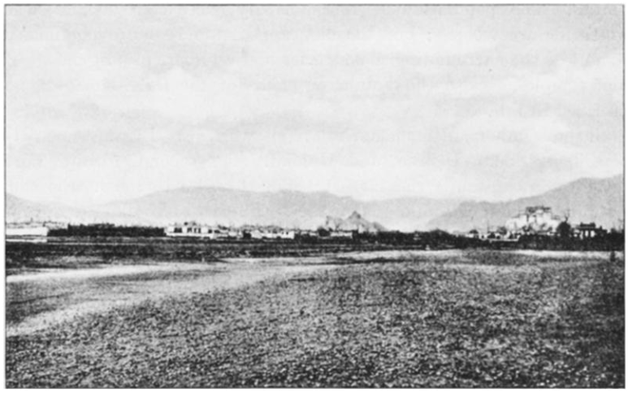

## Введение

Статья представляет короткое описание путешествия, можно даже сказать рандомный набор фактов, приложено 4 фотографии. Несмотря на то, что автором указан Цыбиков, не похоже, что статью написал он, а не про него.

## Странности

Что странного:

1. G.G. Tsybikoff --- что за отчество? Отчество Цыбикова было [Цэбекович](https://ru.wikipedia.org/wiki/%D0%A6%D1%8B%D0%B1%D0%B8%D0%BA%D0%BE%D0%B2,_%D0%93%D0%BE%D0%BC%D0%B1%D0%BE%D0%B6%D0%B0%D0%B1_%D0%A6%D1%8D%D0%B1%D0%B5%D0%BA%D0%BE%D0%B2%D0%B8%D1%87). Это Ts или наконец C, откуда взялось G?
2. Кто вообще написал статью? Если сам Цыбиков (он указан как автор), то зачем он обращается к себе в третьем лице и называет себя M. Tsybikoff (мистер Цыбиков). 
3. Где полные ссылки? В статье упоминается *Izvestia of the Russian Geographical Society (1903, iii.).* Что означает iii? Скорее всего речь об Известиях ИРГО. Т. XXXIX, но что за куцая ссылка? Ни в начале журнала, ни в конце никакого намека на ссылки нет. **См. ответ Geographical Journal в конце материала.**
4. В конце статьи говорится о наборе из 66 фото описанном Известиях. Но [в упомянутом томе их 77](/notes/lhasa-monastery-photos/), 45 Норзунова и 32 Цыбикова и конечно самому Цыбикову это было известно.
5. На странице статьи в JSTOR указано, что на нее ссылается статья The Primordial Sea Under the City Temple of Lhasa and the Willows Before the Sanctuary. Siegbert Hummel, G. Vogliotti. The Tibet Journal, Vol. 24, No. 4 (Winter 1999), pp. 12-21. Но никаких упоминаний Цыбикова в этой статье нет. **См. ответ JSTOR в конце материала.**

Полное цитирование: G. G. Tsybikoff. The Geographical Journal, Jan., 1904, Vol. 23, No. 1 (Jan., 1904), pp. 92-97

[PDF статьи](https://drive.google.com/file/d/19DLb3Qe7yTO8ZCZqvNxJ0XMneRgAKMgS/view?usp=sharing), [распознанный текст](https://docs.google.com/document/d/1OCDC6XYBEgxaQXuS03HYV7tqHJZ1mViO/edit?usp=sharing&ouid=112245657670169384946&rtpof=true&sd=true).

## Текст статьи

Journey to Lhasa

Author(s): G. G. Tsybikoff

Source: *The Geographical Journal*, Jan., 1904, Vol. 23, No. 1 (Jan., 1904), pp. 92-97

Published by: The Royal Geographical Society (with the Institute of British Geographers)

Stable URL: <https://www.jstor.org/stable/1775741>

II. JOURNEY TO LHASA.

**By G. G. TSYBIKOFF.**

The last number of the *Izvestia* of the Russian Geographical Society (1903, iii.) contains a very interesting account of the journey, made in 1900 and 1901, to Lhasa by G. Tsybikoff. The report is accompanied by eight photographs---two of Lhasa, from the north and the east, one of the hill Mar-bo-ri, with the palace of the Dalai-lama, several of the Potala, or palace itself, from different points of view, and two of the Galdan and the Tashilumpo monasteries.

M. Tsybikoff is a Buryat by birth, and a lamaite by religion, who finished his education at a Russian university, and, after having prepared himself for this journey, went quite openly, like so many other Buryat pilgrims, to Lhasa. There he remained more than twelve months, making an excursion to Tsetan (or Chetan), and visiting some of the most venerated monasteries (after having previously stayed, during his journey to Lhasa, in the Mongolian monasteries of Labran and Gumbum). During his stay at Lhasa he made, moreover, a most valuable collection of books, written by all the most renowned lamawriters during the last nine centuries. This collection represents 319 volumes on philology, medicine, astronomy and astrology, history, geography, and collections of "hu-rums" (praises, prayers, incantations, and so on). It has been presented by the Russian Geographical Society to the Academy of Sciences. The *Izvestia* now give the author's report on his journey.

The caravan, which had left the Gumbum monastery, in Amdo, on May 7 (April 24), 1900, met the first inhabited post of Central Tibet at the northern foot of the Bumza pass; they were waiting for Kozloffs expedition. Proceeding further, the caravan was visited at the Nakchu monastery by the Tibet authorities, and, continuing its journey through the broad Su-shan valley and *via* the populous district of Penbu, or Pen-yul, they reached Lhasa on August 15.

Central Tibet, or the provinces of U *(pron.* as French *u)* and Tsan, has not been visited by Europeans for many decades, but Buryat and Kirghiz pilgrims have lately entered it every year, and the diaries of the Buryat lama Zayaeff (eighteenth century), and the Kalmuk, Baza-bakshi (recent), have been published in Russia---the latter, with a Russian translation, by Prof. Pozdneeff, in 1897.

The portion of Central Tibet visited by M. Tsybikoff can be truly described as "the land of snow," *gairajan-yul.* He saw the snow-clad peak, Samtan-kansar, on the eastern extremity of the Nian-chen-tanla chain, and the snow-clad range Kar-la on the south-western side of the ring-shaped lake Yamdok-tso (*tso* = lake). In their upper parts the valleys are narrow and unsuitable for culture, but in their wide middle courses are entirely covered with cornfields. Most of the streams dry up in the dry season, but the streamlets and springs supply water to a wide system of irrigation and to the mills. In 1900 the dry season began at Lhasa on September 26, when they had the last rain.

The first snowfall was on December 20, and during the next four months it snowed only ten times; in the valleys the snow thawed next day. As to rains, they began only in May, and during four months (May---August) it rained forty-five times. The coldest month was December, for which the averages were 21° Fahr, at sunrise, 34° at midday, and 37° in the evening; while the warmest month was June, for which the same averages were respectively 57° Fahr., 73°, and 63°.

The population of Tibet has been estimated at from 2 1/2 to 33 millions, of which the first estimate seems to be nearest to truth; of these, one million must be living in Central Tibet. The great numbers of unmarried clergy and the contagious diseases (like small-pox, which took in 1900 about 10 per cent, of the population round Lhasa) prevent a rapid increase. The foreigners are Chinese, Nepalese, Kashmiris, and Mongols---chiefly in the towns of Lhasa, Shigatse, and Gyangtse. Chinese garrisons live in special camps near to larger towns. The Nepalese and Kashmiris are mostly tradespeople, or artisans and artists. The Mongols are mostly lamas on a short visit.

The population consists of nobility (descendants from old feudal princes and from the fathers of the Dalai-lamas, who receive the title of prince from the Manchu kings), the clergy, and the peasants, who are serfs to the two former classes. We omit the further very interesting remarks of our traveller about the manners of living, polygamy and polyandry, and the independent position of women.

We omit also the description of Lhasa, and only remark that M. Tsybikoff confirms the estimate of the pundit Ak. concerning the circumference of Lhasa, and gives to the well-known circular road which pilgrims cover as they walk praying, a length of no more than 7 1/4 or 8 miles. The population of Lhasa hardly exceeds 10,000, of whom two-thirds are women; but the city appears to be more populous on account of the surrounding monasteries and numbers of pilgrims. The chief temples, as also the Potala, or palace of the Dalai-lama, are next described in full.

Several important monasteries are situated near Lhasa, the chief of them being Sera, Daibun, and Galdan. The second, 7 miles northwest of the capital, is the largest; Sera (3 miles to the north) comes next, and Galdan (20 miles) is on the south-east of Ui-chu, on the slope of Mount Bsog-ri.\* (\* Ri means "a holy mountain.") All three were founded in the lifetime of Tsonhava, at the beginning of the sixteenth century, and they have from 15,000 to 16,000 monks (8000 to 8500 in Daibun). These monasteries are now not so much refuges of asceticism as schools for the teaching of philosophical theology for the Lamaite clergy. Still, the Sera monastery is as renowned for its ascetics, who live isolated in their *ritods,* or cells, plunged into contemplation, as Daibun is renowned for its prophets, or oracles, who foretell the future. Galdan, on its side, is famous for its relics.

M. Tsybikoff visited also a few other monasteries. 

LHASA, VIEWED FROM THE NORTH.

One of them, Tashi-lhumpo, is situated 167 miles west of Lhasa, on the right bank of the Brahmaputra, which is called Tsan-chu, or Tsanpo-chu, in its course within Tibet. 

THE POTALA, LHASA.

It was founded in 1447, and has now 3000 lamas. The castle Shigatse is less than one mile to the north-east of this monastery, and the town of Shigatse (6000 to 7000 inhabitants) is at the foot of the castle, and has both a Chinese and a Tibetan garrison. The castle is in ruins.

Some 50 miles south-east of this town, in the valley of the Nian-chu, stands one of the oldest towns of Tibet, Gyangtse, advantageously situated for trade with India. Carpets and cloth are made in this spot, widely renowned for its immense *suburgan* (temple), which is five stories high, and has numbers of rooms containing numerous statues of Buddha, some of them very old.

The Sam-yai monastery is on the left bank of the Brahmaputra, 67 miles south-east of Lhasa. It is the oldest in Tibet, having been founded in the ninth century. Its five-storied *sume* (temple), of which the style is both Tibetan and Indian, is its chief attraction.

The town of Tsetan stands 20 miles east of the above, on the right bank of the Brahmaputra, at its junction with the fertile valley of the Yan-lun, and is known for its cloth and the manufacture of the yellow lama caps. It carries on a lively trade, as it stands on the road from Bhutan to Lhasa, while on the Bhutan frontier is the little town Tsona, well known for its fair.

We omit again interesting details about the Dalai-lama and the now prevailing religion, only to say a few words about M. Tsybikoffs description of the administration. It is in the hands of a council *(devashun),* consisting of four functionaries, three clerical and one laic, nominated by the Dalai-lama. This council nominate the governors of the districts (usually two---one clerical and one laic), or rents the district to some high functionary, usually a member of the council, who keeps his own man on the spot. Thus Tibet is ruled by an aristocratic oligarchy. The judicial procedure, with its tortures and executions, remains barbarous. The standing army, maintained by the state, numbers 4000 men, armed with lances and matchlock guns---all a very peaceful set of men; all Tibetans are, as a rule. Even the robber tribes of Eastern Tibet are anything but warlike.

Tibet receives from India chiefly cloth, velveteen, china, and all sorts of bagatelles of English make---looking-glasses, beads, matches, penknives, etc.; the exports being yak-tails, wool, borax, salt, silver, and gold, and partly yaks, as also some horses and mules imported from China. The chief imports from China are, however, tea, cottons, and silks, and the chief exports are various objects of worship---small statues, books, and the like---as also some Tibetan cloth, yellow caps, and so on. This latter trade is valued at about £10,000 every year, while fancy prices are paid, of course, for the objects of worship, and the returns vary very much from year to year.

As to Mongolia, all trade is carried on by caravans, which are sent out by the monasteries, and the pious collections made for the latter contribute a great deal to the prosperity of the lamas.

After having left Lhasa on September 23, 1901, M. Tsybikoff, after many delays, reached Urga only on April 18 of next year. 

MONASTERY TASHI-LHUMPO.

It must also be said that about the same time, that is, at the end of 1899, the Russian Geographical Society took advantage of the offer of a Kalmyk, O. M. Norzunoff, who was going to Lhasa, and provided him with a good photographic apparatus. They are some of his photos that are reproduced now in the *Izvestia,* while those of M. Tsybikoff are still more interesting. Full lists of both series (sixty-six photos) are given in the *Izvestia,* with explanations.

## Запрос к Geographical Journal

> From: Maxim Y. Dubinin <m.y.dubinin@gmail.com>
>
> Sent: Monday, July 29, 2024 8:25 PM
>
> To: Journals <journals@rgs.org>
>
> Subject: An inquiry about journal article
>
> Hello,
>
> I'm doing a historical study and recently came across a journal article Journey to Lhasa by G. G. Tsybikoff published in The Geographical Journal Vol. 23, No. 1 (Jan., 1904).
>
> <https://www.jstor.org/stable/1775741>
>
> I wonder if some sort of an archive exists describing how the Editors came across this article. Maybe some historical information about who and when sent it to the editorial office?
>
> I'd be interested in any details you might have on that.
>
> Thank you in advance.
>
> Maxim Y. Dubinin

## Ответ Geographical Joural

> Dear Maxim (if I may)
>
> Thank you for your enquiry re the above, which has reached the Society's Collections team.
>
> I have examined the sequence of Journal Manuscripts in our Archives and there is no evidence that this article was actively submitted from an external source for possible publication in our Journal, nor was it presented as a lecture to our Fellows.
>
> I also note that it was printed in the section of our Journal covering the 'geographical news updates' area of its output, which explains the lack of manuscripts as above.  The Geographical Journal (GJ) and its predecessors not only published papers speculatively submitted and/or presented as lectures to the Fellowship, but traditionally kept our audiences informed of geographical matters on an international scale.  It appears to me, given its physical positioning within the issue, that the (re-)publication of the Tsybikoff article content falls into that latter category.
>
> The Society would have received the latest issue of the Izvestia of the Russian Geographical Society into its Library collection to add to its periodical run as normal.  I would surmise that the Izvestia article by Tsybikoff was then noted by the Librarian of the time (Edward Heawood) and flagged internally to Society Editor J. Scott Keltie for inclusion/mention within our own GJ.  Sadly there is no correspondence or minute book content to support that; I imagine that the process would have involved a face-to-face discussion between colleagues, however, so that is not altogether surprising.  The Society didn't maintain records re receipt of individual issues for hundreds of periodical subscriptions, so I cannot give you an acquisition date for that particular Izvestia issue ("1903, iii"), but I imagine it would have been received towards the end of that year, giving enough time for its inclusion in the first of our 12 GJ issues for 1904.
>
> I'm sorry that we have not been able to provide a definitive answer with supporting paperwork, but trust that my suggestions given above will prove of interest.
>
> Yours sincerely,
>
> Miss Jan C. Turner
>
> Deputy Librarian
>
> Royal Geographical Society (with IBG)
>
> 1 Kensington Gore
>
> London
>
> SW7 2AR
>
> Registered charity number 208791
>
> VAT registration number 676367882
>
> E: enquiries@rgs.org
>
> W: www.rgs.org/our-collections
>
> Search our online catalogue -- Browse our scanned images -- Attend our events -- View our online exhibitions
>
> PLEASE NOTE: Since the coronavirus (COVID-19) outbreak and its associated health and safety concerns, certain elements of the Society's services have changed.  See <https://www.rgs.org/about-us/visit-us> for more information.
>
> And do bear in mind that Society staff are now flexi-working (partially at headquarters, partially home-working).  So a query which requires examination of Collections stock in person cannot necessarily be answered on date of receipt; please allow more time for responses.

## Запрос к JSTOR

> M Y Dubinin
>
> Jul 29, 2024, 15:30 EDT
>
> Paper I'm interested in (Journey to Lhasa by Tsybikoff) is said to be cited by:
>
> The Primordial Sea Under the City Temple of Lhasa and the Willows Before the Sanctuary
>
> Siegbert Hummel, G. Vogliotti
>
> The Tibet Journal, Vol. 24, No. 4 (Winter 1999), pp. 12-21
>
> However, no matter how hard I look into Primordial Sea paper, I fail to find any reference to Tsybikoff's paper.
>
> Is this an error or I'm looking at the wrong place?
>
> Thanks for any help.

## Ответ JSTOR

> Tessa (JSTOR Support)
>
> Jul 30, 2024, 09:20 EDT
>
> Dear Maxim,
>
> Thank you for your message and for reporting this error. You are correct, and it looks like the same title: Journey to Lhasa, was in error linked to Tsybikoff, whereas from the article it belongs to S. C. Das, Journey to Lhasa, London, 1904, p.201 (View of Lhasa facing p.224).
>
> I have alerted our content management team for review and action.
>
> We appreciate your patience while we work to solve this issue as quickly as possible.
>
> Thank you,
>
> Tessa
>
> Artstor | JSTOR | JSTOR Forum | Portico
>
> Discover the visual side of JSTOR: artworks, photographs, manuscripts, and more now available
>
> Phone: 734 887.7001 (local)
>
> 888 388.3574 (toll free in US)
>
> JSTOR is a digital library for the intellectually curious. We provide a platform for discovering and connecting research, images, and primary sources. As a not-for-profit, we partner with libraries, museums, and publishers to reduce costs, extend access, and preserve scholarship for the future. We do this because we believe in the power of knowledge to change the world for the better.

## Комментарии

[**Обсудить**](https://t.me/answer42geo/27)
