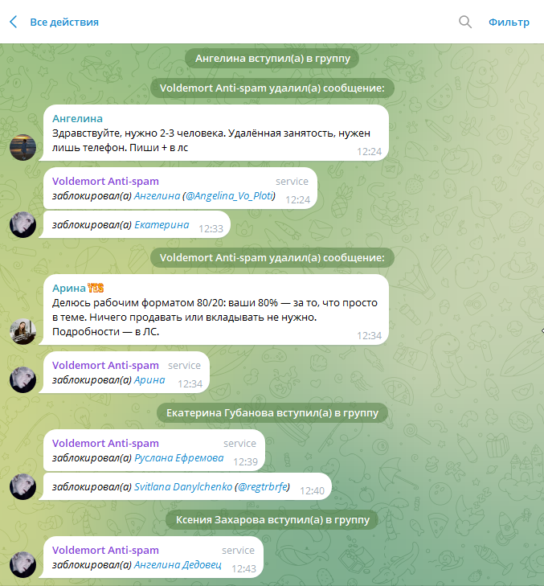

## Введение

Voldemort Anti-spam - бот для борьбы со спамом в Telegram. Он появился, когда мне и коллегам надоело банить спамеров в наших группах. Встроенный антиспам Telegram, даже если включить активный режим - практически не работает. Аналогичные боты либо супер-комбайны, либо требуют подписок, либо создают разнообразные сложности вместо того, чтобы делать то, что нужно - удалять спам.

На настоящий момент Voldemort удалил 50 000 сообщений со спамом.

## Как включить

1. Добавить [@lord_voldemort_hates_spam_bot](https://t.me/lord_voldemort_hates_spam_bot) в группу
2. Дать ему админских прав: удаление сообщений (delete messages), бан пользователей (ban users).

Voldemort начнет удалять спам и спамеров. Никаких вопросов или настроек.

## Что умеет

* Детектировать спам.
* Определять спамеров на входе по базам спамеров: CAS, LOL, своя база.
* Удалять спам.
* Банить спамеров. Cпам-аккаунт удаляется сразу во всех группах, где действует Voldemort. Бан может происходить прямо на входе или если спамер проявился наспамив.
* Принимать спам на обучение. Любой участник может отправить (форварднуть) сообщение со спамом лично боту, он добавит его в базу. Через некоторое время оно будет проанализировано и добавлено в базу.

## Ложные срабатывания

Возможны, но есть ряд алгоритмов позволяющих отличить спамера от человека.

На 50 тыс детекций количество ложных срабатываний - до 10 шт.

## Составные части

* Программный код
* База спам-токенов и образцов спама
* Бот Telegram [@lord_voldemort_hates_spam_bot](https://t.me/lord_voldemort_hates_spam_bot)
* Docker контейнер с кодом

## Комментарии

Специальная группа для обсуждения [NextGIS Voldemort Test Stand](https://t.me/voldemort_antispam)
